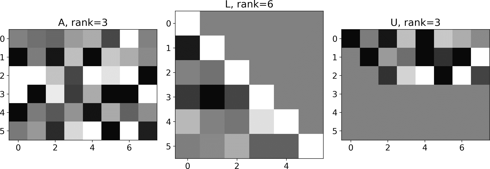

# 第十章：行简化与 LU 分解

现在我们转向 LU 分解。LU 分解，像 QR 一样，是支持数据科学算法的计算基础之一，包括最小二乘模型拟合和矩阵求逆。因此，这一章对你的线性代数教育至关重要。

LU 分解的关键在于你不能简单地立刻学会它。相反，你首先需要学习关于方程组、行简化和高斯消元。在学习这些主题的过程中，你也会了解到梯形矩阵和置换矩阵。亲爱的读者，是的，这将是一个令人兴奋和充满活力的章节。

# 方程组

要理解 LU 分解及其应用，你需要了解行简化和高斯消元。而要理解这些主题，你需要了解如何操作方程、将其转换为矩阵方程，并使用行简化来解决该矩阵方程。

让我们从一个“系统”方程开始：

<math alttext="2 x equals 8" display="block"><mrow><mn>2</mn> <mi>x</mi> <mo>=</mo> <mn>8</mn></mrow></math>

正如你在学校中学到的那样，你可以对方程进行各种数学操作——只要你同时对方程的两边做同样的操作。这意味着下面的方程与前一个方程不同，但它们通过简单的操作相关联。更重要的是，任何一个方程的解也是另一个方程的解：

<math alttext="5 left-parenthesis 2 x minus 3 right-parenthesis equals 5 left-parenthesis 8 minus 3 right-parenthesis" display="block"><mrow><mn>5</mn> <mo>(</mo> <mn>2</mn> <mi>x</mi> <mo>-</mo> <mn>3</mn> <mo>)</mo> <mo>=</mo> <mn>5</mn> <mo>(</mo> <mn>8</mn> <mo>-</mo> <mn>3</mn> <mo>)</mo></mrow></math>

现在让我们转向一个包含两个方程的系统：

<math alttext="StartLayout 1st Row 1st Column x 2nd Column equals 4 minus y 2nd Row 1st Column y 2nd Column equals x slash 2 plus 2 EndLayout" display="block"><mtable displaystyle="true"><mtr><mtd columnalign="right"><mi>x</mi></mtd> <mtd columnalign="left"><mrow><mo>=</mo> <mn>4</mn> <mo>-</mo> <mi>y</mi></mrow></mtd></mtr> <mtr><mtd columnalign="right"><mi>y</mi></mtd> <mtd columnalign="left"><mrow><mo>=</mo> <mi>x</mi> <mo>/</mo> <mn>2</mn> <mo>+</mo> <mn>2</mn></mrow></mtd></mtr></mtable></math>

在这个方程组中，从任何一个方程中都不可能单独求解出*x*和*y*的唯一值。相反，你需要同时考虑两个方程来推导解。如果你现在尝试解决这个系统，你可能会采取用第二个方程的右侧值代替第一个方程中的*y*的策略。在第一个方程中解出*x*后，将该值代入第二个方程中解出*y*。这种策略类似于（尽管不如）后代换，稍后我会定义它。

方程组的一个重要特点是你可以将各个方程相加或相减。在下面的方程中，我将第二个方程乘以 2 加到第一个方程中，并从第二个方程中减去第一个原始方程（为了清晰起见添加了括号）：

<math alttext="StartLayout 1st Row 1st Column x plus left-parenthesis 2 y right-parenthesis 2nd Column equals 4 minus y plus left-parenthesis x plus 4 right-parenthesis 2nd Row 1st Column y minus left-parenthesis x right-parenthesis 2nd Column equals x slash 2 plus 2 minus left-parenthesis 4 minus y right-parenthesis EndLayout" display="block"><mtable displaystyle="true"><mtr><mtd columnalign="right"><mrow><mi>x</mi> <mo>+</mo> <mo>(</mo> <mn>2</mn> <mi>y</mi> <mo>)</mo></mrow></mtd> <mtd columnalign="left"><mrow><mo>=</mo> <mn>4</mn> <mo>-</mo> <mi>y</mi> <mo>+</mo> <mo>(</mo> <mi>x</mi> <mo>+</mo> <mn>4</mn> <mo>)</mo></mrow></mtd></mtr> <mtr><mtd columnalign="right"><mrow><mi>y</mi> <mo>-</mo> <mo>(</mo> <mi>x</mi> <mo>)</mo></mrow></mtd> <mtd columnalign="left"><mrow><mo>=</mo> <mi>x</mi> <mo>/</mo> <mn>2</mn> <mo>+</mo> <mn>2</mn> <mo>-</mo> <mo>(</mo> <mn>4</mn> <mo>-</mo> <mi>y</mi> <mo>)</mo></mrow></mtd></mtr></mtable></math>

我会让你进行算术运算，但要点是*x*在第一个方程中消失，而*y*在第二个方程中消失。这使得解的计算变得更容易（*x* = 4/3，*y* = 8/3）。这里的重要一点是：对方程进行标量乘法并将它们相加使得系统的解更容易找到。再次强调，调整后和原始系统并不是相同的方程，但它们的解是相同的，因为这两个系统通过一系列线性操作相连接。

这是你需要学习如何使用线性代数解方程组之前的背景知识。但在学习该方法之前，你需要学习如何使用矩阵和向量表示方程组。

## 将方程转化为矩阵

将方程组转化为矩阵-向量方程用于解决方程组，并用于建立统计学中一般线性模型的公式。幸运的是，将方程转化为矩阵在概念上很简单，并包括两个步骤。

首先，组织方程使得常数位于方程的右侧。*常数*是与变量无关的数字（有时称为*截距*或*偏移量*）。变量及其乘法系数按照相同的顺序位于方程的左侧（例如，所有方程应先有*x*项，然后是*y*项，依此类推）。以下方程形成我们一直在处理的方程组，并按正确的方式组织：

<math alttext="StartLayout 1st Row 1st Column x plus y 2nd Column equals 4 2nd Row 1st Column negative x slash 2 plus y 2nd Column equals 2 EndLayout" display="block"><mtable displaystyle="true"><mtr><mtd columnalign="right"><mrow><mi>x</mi> <mo>+</mo> <mi>y</mi></mrow></mtd> <mtd columnalign="left"><mrow><mo>=</mo> <mn>4</mn></mrow></mtd></mtr> <mtr><mtd columnalign="right"><mrow><mo>-</mo> <mi>x</mi> <mo>/</mo> <mn>2</mn> <mo>+</mo> <mi>y</mi></mrow></mtd> <mtd columnalign="left"><mrow><mo>=</mo> <mn>2</mn></mrow></mtd></mtr></mtable></math>

其次，将系数（乘以变量的数字；缺少方程的变量具有零系数）分成一个矩阵，每个方程一行。变量被放置到右乘系数矩阵的列向量中。常数则放置在方程的右侧的列向量中。我们的示例系统有一个矩阵方程，看起来像这样：

<math alttext="Start 2 By 2 Matrix 1st Row 1st Column 1 2nd Column 1 2nd Row 1st Column negative 1 slash 2 2nd Column 1 EndMatrix StartBinomialOrMatrix x Choose y EndBinomialOrMatrix equals StartBinomialOrMatrix 4 Choose 2 EndBinomialOrMatrix" display="block"><mrow><mfenced close="]" open="["><mtable><mtr><mtd><mrow><mphantom><mo>-</mo></mphantom> <mn>1</mn></mrow></mtd> <mtd><mn>1</mn></mtd></mtr> <mtr><mtd><mrow><mo>-</mo> <mn>1</mn> <mo>/</mo> <mn>2</mn></mrow></mtd> <mtd><mn>1</mn></mtd></mtr></mtable></mfenced> <mfenced close="]" open="["><mtable><mtr><mtd><mi>x</mi></mtd></mtr> <mtr><mtd><mi>y</mi></mtd></mtr></mtable></mfenced> <mo>=</mo> <mfenced close="]" open="["><mtable><mtr><mtd><mn>4</mn></mtd></mtr> <mtr><mtd><mn>2</mn></mtd></mtr></mtable></mfenced></mrow></math>

然后！你已经将方程组转化为一个矩阵方程。我们可以称这个方程为<math alttext="bold upper A bold x equals bold b"><mrow><mi>𝐀</mi> <mi>𝐱</mi> <mo>=</mo> <mi>𝐛</mi></mrow></math>，其中<math alttext="bold upper A"><mi>𝐀</mi></math>是系数矩阵，<math alttext="bold x"><mi>𝐱</mi></math>是待求的未知变量向量（在本例中，<math alttext="bold x"><mi>𝐱</mi></math>是包含[*x* *y*]的向量），而<math alttext="bold b"><mi>𝐛</mi></math>是常数向量。

请花一点时间确保你理解矩阵方程是如何映射到方程组的。特别是通过矩阵-向量乘法来演示它等于原始方程组。

## 使用矩阵方程

你可以像处理普通方程一样操作矩阵方程，包括加法、乘法、转置等，只要操作是有效的（例如，加法的矩阵尺寸匹配），并且所有操作影响方程的两边。例如，以下方程的进展是有效的：

<math alttext="StartLayout 1st Row 1st Column bold upper A bold x 2nd Column equals bold b 2nd Row 1st Column bold v plus bold upper A bold x 2nd Column equals bold v plus bold b 3rd Row 1st Column left-parenthesis bold v plus bold upper A bold x right-parenthesis Superscript upper T 2nd Column equals left-parenthesis bold v plus bold b right-parenthesis Superscript upper T EndLayout" display="block"><mtable displaystyle="true"><mtr><mtd columnalign="right"><mrow><mi>𝐀</mi> <mi>𝐱</mi></mrow></mtd> <mtd columnalign="left"><mrow><mo>=</mo> <mi>𝐛</mi></mrow></mtd></mtr> <mtr><mtd columnalign="right"><mrow><mi>𝐯</mi> <mo>+</mo> <mi>𝐀</mi> <mi>𝐱</mi></mrow></mtd> <mtd columnalign="left"><mrow><mo>=</mo> <mi>𝐯</mi> <mo>+</mo> <mi>𝐛</mi></mrow></mtd></mtr> <mtr><mtd columnalign="right"><msup><mrow><mo>(</mo><mi>𝐯</mi><mo>+</mo><mi>𝐀</mi><mi>𝐱</mi><mo>)</mo></mrow> <mtext>T</mtext></msup></mtd> <mtd columnalign="left"><mrow><mo>=</mo> <msup><mrow><mo>(</mo><mi>𝐯</mi><mo>+</mo><mi>𝐛</mi><mo>)</mo></mrow> <mtext>T</mtext></msup></mrow></mtd></mtr></mtable></math>

使用矩阵方程与标量方程的主要区别在于，由于矩阵乘法是侧向依赖的，你必须在方程的两边以相同的方式进行矩阵乘法。

例如，以下方程的进展是有效的：

<math alttext="StartLayout 1st Row 1st Column bold upper A bold upper X 2nd Column equals bold upper B 2nd Row 1st Column bold upper C bold upper A bold upper X 2nd Column equals bold upper C bold upper B EndLayout" display="block"><mtable displaystyle="true"><mtr><mtd columnalign="right"><mrow><mi>𝐀</mi> <mi>𝐗</mi></mrow></mtd> <mtd columnalign="left"><mrow><mo>=</mo> <mi>𝐁</mi></mrow></mtd></mtr> <mtr><mtd columnalign="right"><mrow><mi>𝐂</mi> <mi>𝐀</mi> <mi>𝐗</mi></mrow></mtd> <mtd columnalign="left"><mrow><mo>=</mo> <mi>𝐂</mi> <mi>𝐁</mi></mrow></mtd></mtr></mtable></math>

注意，<math alttext="bold upper C"><mi>𝐂</mi></math> 在方程式两边都是左乘的。相比之下，以下推进是**无效**的：

<math alttext="StartLayout 1st Row 1st Column bold upper A bold upper X 2nd Column equals bold upper B 2nd Row 1st Column bold upper A bold upper X bold upper C 2nd Column equals bold upper C bold upper B EndLayout" display="block"><mtable displaystyle="true"><mtr><mtd columnalign="right"><mrow><mi>𝐀</mi> <mi>𝐗</mi></mrow></mtd> <mtd columnalign="left"><mrow><mo>=</mo> <mi>𝐁</mi></mrow></mtd></mtr> <mtr><mtd columnalign="right"><mrow><mi>𝐀</mi> <mi>𝐗</mi> <mi>𝐂</mi></mrow></mtd> <mtd columnalign="left"><mrow><mo>=</mo> <mi>𝐂</mi> <mi>𝐁</mi></mrow></mtd></mtr></mtable></math>

这里的问题在于数学公式 <math alttext="bold upper C"><mi>𝐂</mi></math> 在左边乘以后面的部分，但在右边乘以前面的部分。可以肯定地说，有几种例外情况，使得该方程式有效（例如，如果 <math alttext="bold upper C"><mi>𝐂</mi></math> 是单位矩阵或零矩阵），但一般情况下这种推进是无效的。

让我们看一个 Python 的例子。我们将解出未知矩阵 <math alttext="bold upper X"><mi>𝐗</mi></math> 在方程 <math alttext="bold upper A bold upper X equals bold upper B"><mrow><mi>𝐀</mi> <mi>𝐗</mi> <mo>=</mo> <mi>𝐁</mi></mrow></math> 中。以下代码生成 <math alttext="bold upper A"><mi>𝐀</mi></math> 和 <math alttext="bold upper B"><mi>𝐁</mi></math> 的随机数。你已经知道我们可以通过 <math alttext="bold upper A Superscript negative 1"><msup><mi>𝐀</mi> <mrow><mo>-</mo><mn>1</mn></mrow></msup></math> 来解出 <math alttext="bold upper X"><mi>𝐗</mi></math> 。问题是乘法的顺序是否重要。¹

```
A = np.random.randn(4,4)
B = np.random.randn(4,4)

# solve for X
X1 = np.linalg.inv(A) @ B
X2 = B @ np.linalg.inv(A)

# residual (should be zeros matrix)
res1 = A@X1 - B
res2 = A@X2 - B
```

如果矩阵乘法是可交换的（意味着顺序不重要），那么 `res1` 和 `res2` 都应该等于零矩阵。让我们看看：

```
res1:

[[-0.  0.  0.  0.]
 [-0. -0.  0.  0.]
 [ 0.  0.  0.  0.]
 [ 0.  0. -0. -0.]]

res2:

[[-0.47851507  6.24882633  4.39977191  1.80312482]
 [ 2.47389146  2.56857366  1.58116135 -0.52646367]
 [-2.12244448 -0.20807188  0.2824044  -0.91822892]
 [-3.61085707 -3.80132548 -3.47900644 -2.372463  ]]
```

现在你知道如何用一个矩阵方程表示一个方程组。在接下来的几节中，我将回到这个问题；首先，我需要教你关于行列式变换和矩阵的阶梯形式。

# 行列式变换

行列式变换是传统线性代数中备受关注的话题，因为它是通过手工解决方程组的古老方式。我确实怀疑在作为数据科学家的职业生涯中你会手工解决任何方程组。但了解行列式变换是有用的，并且直接导致 LU 分解，而 LU 分解实际上被应用在应用线性代数中。所以让我们开始吧。

*行列式变换* 意味着反复应用两种操作——行的标量乘法和加法——到矩阵的行上。行列式变换依赖于在系统中向其他方程式添加方程式的相同原理。

记住这个声明：*行列式变换的目标是将密集矩阵转换为上三角矩阵*。

让我们从一个简单的例子开始。在下面的密集矩阵中，我们将第一行加到第二行，这消除了-2。有了这个变化，我们将密集矩阵转换成了上三角矩阵：

<math alttext="Start 2 By 2 Matrix 1st Row 1st Column 2 2nd Column 3 2nd Row 1st Column negative 2 2nd Column 2 EndMatrix StartLayout 1st Row  right-arrow Overscript upper R 1 plus upper R 2 Endscripts EndLayout Start 2 By 2 Matrix 1st Row 1st Column 2 2nd Column 3 2nd Row 1st Column 0 2nd Column 5 EndMatrix" display="block"><mrow><mfenced close="]" open="["><mtable><mtr><mtd><mrow><mphantom><mo>-</mo></mphantom> <mn>2</mn></mrow></mtd> <mtd><mn>3</mn></mtd></mtr> <mtr><mtd><mrow><mo>-</mo> <mn>2</mn></mrow></mtd> <mtd><mn>2</mn></mtd></mtr></mtable></mfenced> <mtable><mtr><mtd><mrow><mover><mo>→</mo> <mrow><msub><mi>R</mi> <mn>1</mn></msub> <mo>+</mo><msub><mi>R</mi> <mn>2</mn></msub></mrow></mover></mrow></mtd></mtr></mtable> <mfenced close="]" open="["><mtable><mtr><mtd><mn>2</mn></mtd> <mtd><mn>3</mn></mtd></mtr> <mtr><mtd><mn>0</mn></mtd> <mtd><mn>5</mn></mtd></mtr></mtable></mfenced></mrow></math>

行列式变换后的上三角矩阵被称为矩阵的*阶梯形式*。

形式上，如果一个矩阵满足以下条件，它就是阶梯形式：（1）每一行的最左边非零数（称为*主元*）在上面行的主元右边，（2）所有零行在非零行的下面。

类似于在系统中操作方程，行变换后的矩阵与行变换前的矩阵不同。但是这两个矩阵通过线性变换相连。由于线性变换可以用矩阵表示，我们可以使用矩阵乘法来表示行变换：

<math alttext="Start 2 By 2 Matrix 1st Row 1st Column 1 2nd Column 0 2nd Row 1st Column 1 2nd Column 1 EndMatrix Start 2 By 2 Matrix 1st Row 1st Column 2 2nd Column 3 2nd Row 1st Column negative 2 2nd Column 2 EndMatrix equals Start 2 By 2 Matrix 1st Row 1st Column 2 2nd Column 3 2nd Row 1st Column 0 2nd Column 5 EndMatrix" display="block"><mrow><mfenced close="]" open="["><mtable><mtr><mtd><mn>1</mn></mtd> <mtd><mn>0</mn></mtd></mtr> <mtr><mtd><mn>1</mn></mtd> <mtd><mn>1</mn></mtd></mtr></mtable></mfenced> <mfenced close="]" open="["><mtable><mtr><mtd><mrow><mphantom><mo>-</mo></mphantom> <mn>2</mn></mrow></mtd> <mtd><mn>3</mn></mtd></mtr> <mtr><mtd><mrow><mo>-</mo> <mn>2</mn></mrow></mtd> <mtd><mn>2</mn></mtd></mtr></mtable></mfenced> <mo>=</mo> <mfenced close="]" open="["><mtable><mtr><mtd><mn>2</mn></mtd> <mtd><mn>3</mn></mtd></mtr> <mtr><mtd><mn>0</mn></mtd> <mtd><mn>5</mn></mtd></mtr></mtable></mfenced></mrow></math>

我将称那个矩阵为<math alttext="bold upper L Superscript negative 1"><msup><mi>𝐋</mi> <mrow><mo>-</mo><mn>1</mn></mrow></msup></math>，原因将在我介绍 LU 分解时变得清楚。因此，在表达式<math alttext="left-parenthesis bold upper L Superscript negative 1 Baseline bold upper A equals bold upper U right-parenthesis"><mrow><mo>(</mo> <msup><mi>𝐋</mi> <mrow><mo>-</mo><mn>1</mn></mrow></msup> <mi>𝐀</mi> <mo>=</mo> <mi>𝐔</mi> <mo>)</mo></mrow></math> 中，<math alttext="bold upper L Superscript negative 1"><msup><mi>𝐋</mi> <mrow><mo>-</mo><mn>1</mn></mrow></msup></math> 是线性变换，通过行变换实现的操作的变换矩阵。现在你不需要专注于<math alttext="bold upper L Superscript negative 1"><msup><mi>𝐋</mi> <mrow><mo>-</mo><mn>1</mn></mrow></msup></math> ——事实上，在高斯消元过程中它经常被忽略。但关键点（稍微扩展了前面的说法）是：*行变换涉及通过行操作将矩阵转换为上三角矩阵，可以通过变换矩阵的前乘来实现。*

这里有另一个例子，一个<math alttext="3 times 3"><mrow><mn>3</mn> <mo>×</mo> <mn>3</mn></mrow></math>矩阵。这个矩阵需要两步变换成它的梯形形式：

<math alttext="Start 3 By 3 Matrix 1st Row 1st Column 1 2nd Column 2 3rd Column 2 2nd Row 1st Column negative 1 2nd Column 3 3rd Column 0 3rd Row 1st Column 2 2nd Column 4 3rd Column negative 3 EndMatrix StartLayout 1st Row  right-arrow Overscript minus 2 upper R 1 plus upper R 3 Endscripts EndLayout Start 3 By 3 Matrix 1st Row 1st Column 1 2nd Column 2 3rd Column 2 2nd Row 1st Column negative 1 2nd Column 3 3rd Column 0 3rd Row 1st Column 0 2nd Column 0 3rd Column negative 7 EndMatrix StartLayout 1st Row  right-arrow Overscript upper R 1 plus upper R 2 Endscripts EndLayout Start 3 By 3 Matrix 1st Row 1st Column 1 2nd Column 2 3rd Column 2 2nd Row 1st Column 0 2nd Column 5 3rd Column 2 3rd Row 1st Column 0 2nd Column 0 3rd Column negative 7 EndMatrix" display="block"><mrow><mfenced close="]" open="["><mtable><mtr><mtd><mrow><mphantom><mo>-</mo></mphantom> <mn>1</mn></mrow></mtd> <mtd><mrow><mphantom><mo>-</mo></mphantom> <mn>2</mn></mrow></mtd> <mtd><mrow><mphantom><mo>-</mo></mphantom> <mn>2</mn></mrow></mtd></mtr> <mtr><mtd><mrow><mo>-</mo> <mn>1</mn></mrow></mtd> <mtd><mrow><mphantom><mo>-</mo></mphantom> <mn>3</mn></mrow></mtd> <mtd><mrow><mphantom><mo>-</mo></mphantom> <mn>0</mn></mrow></mtd></mtr> <mtr><mtd><mrow><mphantom><mo>-</mo></mphantom> <mn>2</mn></mrow></mtd> <mtd><mrow><mphantom><mo>-</mo></mphantom> <mn>4</mn></mrow></mtd> <mtd><mrow><mo>-</mo> <mn>3</mn></mrow></mtd></mtr></mtable></mfenced> <mtable><mtr><mtd><mrow><mover><mo>→</mo> <mrow><mo>-</mo><mn>2</mn><msub><mi>R</mi> <mn>1</mn></msub> <mo>+</mo><msub><mi>R</mi> <mn>3</mn></msub></mrow></mover></mrow></mtd></mtr></mtable> <mfenced close="]" open="["><mtable><mtr><mtd><mrow><mphantom><mo>-</mo></mphantom> <mn>1</mn></mrow></mtd> <mtd><mrow><mphantom><mo>-</mo></mphantom> <mn>2</mn></mrow></mtd> <mtd><mrow><mphantom><mo>-</mo></mphantom> <mn>2</mn></mrow></mtd></mtr> <mtr><mtd><mrow><mo>-</mo> <mn>1</mn></mrow></mtd> <mtd><mrow><mphantom><mo>-</mo></mphantom> <mn>3</mn></mrow></mtd> <mtd><mrow><mphantom><mo>-</mo></mphantom> <mn>0</mn></mrow></mtd></mtr> <mtr><mtd><mrow><mphantom><mo>-</mo></mphantom> <mn>0</mn></mrow></mtd> <mtd><mrow><mphantom><mo>-</mo></mphantom> <mn>0</mn></mrow></mtd> <mtd><mrow><mo>-</mo> <mn>7</mn></mrow></mtd></mtr></mtable></mfenced> <mtable><mtr><mtd><mrow><mover><mo>→</mo> <mrow><msub><mi>R</mi> <mn>1</mn></msub> <mo>+</mo><msub><mi>R</mi> <mn>2</mn></msub></mrow></mover></mrow></mtd></mtr></mtable> <mfenced close="]" open=""><mtable><mtr><mtd><mrow><mphantom><mo>-</mo></mphantom> <mn>1</mn></mrow></mtd> <mtd><mrow><mphantom><mo>-</mo></mphantom> <mn>2</mn></mrow></mtd> <mtd><mrow><mphantom><mo>-</mo></mphantom> <mn>2</mn></mrow></mtd></mtr> <mtr><mtd><mrow><mphantom><mo>-</mo></mphantom> <mn>0</mn></mrow></mtd> <mtd><mrow><mphantom><mo>-</mo></mphantom> <mn>5</mn></mrow></mtd> <mtd><mrow><mphantom><mo>-</mo></mphantom> <mn>2</mn></mrow></mtd></mtr> <mtr><mtd><mrow><mphantom><mo>-</mo></mphantom> <mn>0</mn></mrow></mtd> <mtd><mrow><mphantom><mo>-</mo></mphantom> <mn>0</mn></mrow></mtd> <mtd><mrow><mo>-</mo> <mn>7</mn></mrow></mtd></mtr></mtable></mfenced></mrow></math>

行变换是乏味的（见[“行变换总是这么简单吗？”）。肯定有一个 Python 函数可以帮我们做这件事！有也有没有。没有一个 Python 函数能返回像我在前面两个例子中创建的梯形形式。原因是矩阵的梯形形式不是唯一的。例如，在前面的<math alttext="3 times 3"><mrow><mn>3</mn> <mo>×</mo> <mn>3</mn></mrow></math>矩阵中，你可以将第二行乘以 2 得到一个行向量[0 10 4]。这创建了一个完全有效但不同的原始矩阵的梯形形式。实际上，与该矩阵相关联的梯形矩阵有无穷多个。

话虽如此，矩阵的两个梯形形式优于无限可能的梯形形式。这两种形式在给定一些约束条件下是唯一的，称为简化行梯形形式和<math alttext="bold upper U"><mi>𝐔</mi></math>来自 LU 分解。稍后我将介绍这两者；首先，现在是时候学习如何使用行变换来解方程组了。

## 高斯消元

在本书的这一部分，你已经学会如何使用矩阵逆来解决矩阵方程。如果我告诉你，你可以在不求逆任何矩阵的情况下解决矩阵方程，你会怎么想？³

这种技术被称为*高斯消元法*。尽管其名称如此，这个算法实际上是由中国数学家在高斯之前近两千年发展出来的，然后由牛顿在高斯之前数百年重新发现。但是高斯在该方法中作出了重要贡献，包括现代计算机实现的技术。

高斯消元法很简单：将系数矩阵增广为常数向量，行约化为梯形形式，然后使用回代法依次求解每个变量。

让我们从我们之前解决的两个方程组开始：

<math alttext="StartLayout 1st Row 1st Column x 2nd Column equals 4 minus y 2nd Row 1st Column y 2nd Column equals x slash 2 plus 2 EndLayout" display="block"><mtable displaystyle="true"><mtr><mtd columnalign="right"><mi>x</mi></mtd> <mtd columnalign="left"><mrow><mo>=</mo> <mn>4</mn> <mo>-</mo> <mi>y</mi></mrow></mtd></mtr> <mtr><mtd columnalign="right"><mi>y</mi></mtd> <mtd columnalign="left"><mrow><mo>=</mo> <mi>x</mi> <mo>/</mo> <mn>2</mn> <mo>+</mo> <mn>2</mn></mrow></mtd></mtr></mtable></math>

第一步是将这个方程组转换为一个矩阵方程。我们已经完成了这一步；这个方程如下所示：

<math alttext="Start 2 By 2 Matrix 1st Row 1st Column 1 2nd Column 1 2nd Row 1st Column negative 1 slash 2 2nd Column 1 EndMatrix StartBinomialOrMatrix x Choose y EndBinomialOrMatrix equals StartBinomialOrMatrix 4 Choose 2 EndBinomialOrMatrix" display="block"><mrow><mfenced close="]" open="["><mtable><mtr><mtd><mrow><mphantom><mo>-</mo></mphantom> <mn>1</mn></mrow></mtd> <mtd><mn>1</mn></mtd></mtr> <mtr><mtd><mrow><mo>-</mo> <mn>1</mn> <mo>/</mo> <mn>2</mn></mrow></mtd> <mtd><mn>1</mn></mtd></mtr></mtable></mfenced> <mfenced close="]" open="["><mtable><mtr><mtd><mi>x</mi></mtd></mtr> <mtr><mtd><mi>y</mi></mtd></mtr></mtable></mfenced> <mo>=</mo> <mfenced close="]" open="["><mtable><mtr><mtd><mn>4</mn></mtd></mtr> <mtr><mtd><mn>2</mn></mtd></mtr></mtable></mfenced></mrow></math>

接下来，我们将系数矩阵与常数向量进行增广：

<math alttext="Start 2 By 3 Matrix 1st Row 1st Column 1 2nd Column 1 3rd Column 4 2nd Row 1st Column negative 1 slash 2 2nd Column 1 3rd Column 2 EndMatrix" display="block"><mfenced close="]" open="["><mtable><mtr><mtd><mrow><mphantom><mo>-</mo></mphantom> <mn>1</mn></mrow></mtd> <mtd><mn>1</mn></mtd> <mtd><mn>4</mn></mtd></mtr> <mtr><mtd><mrow><mo>-</mo> <mn>1</mn> <mo>/</mo> <mn>2</mn></mrow></mtd> <mtd><mn>1</mn></mtd> <mtd><mn>2</mn></mtd></mtr></mtable></mfenced></math>

然后我们对增广矩阵进行行约化。注意在行约化过程中，常数列向量将发生变化：

<math alttext="Start 2 By 3 Matrix 1st Row 1st Column 1 2nd Column 1 3rd Column 4 2nd Row 1st Column negative 1 slash 2 2nd Column 1 3rd Column 2 EndMatrix StartLayout 1st Row  right-arrow Overscript 1 slash 2 upper R 1 plus upper R 2 Endscripts EndLayout Start 2 By 3 Matrix 1st Row 1st Column 1 2nd Column 1 3rd Column 4 2nd Row 1st Column 0 2nd Column 3 slash 2 3rd Column 4 EndMatrix" display="block"><mrow><mfenced close="]" open="["><mtable><mtr><mtd><mrow><mphantom><mo>-</mo></mphantom> <mn>1</mn></mrow></mtd> <mtd><mn>1</mn></mtd> <mtd><mn>4</mn></mtd></mtr> <mtr><mtd><mrow><mo>-</mo> <mn>1</mn> <mo>/</mo> <mn>2</mn></mrow></mtd> <mtd><mn>1</mn></mtd> <mtd><mn>2</mn></mtd></mtr></mtable></mfenced> <mtable><mtr><mtd><mrow><mover><mo>→</mo> <mrow><mn>1</mn><mo>/</mo><mn>2</mn><msub><mi>R</mi> <mn>1</mn></msub> <mo>+</mo><msub><mi>R</mi> <mn>2</mn></msub></mrow></mover></mrow></mtd></mtr></mtable> <mfenced close="]" open="["><mtable><mtr><mtd><mn>1</mn></mtd> <mtd><mn>1</mn></mtd> <mtd><mn>4</mn></mtd></mtr> <mtr><mtd><mn>0</mn></mtd> <mtd><mrow><mn>3</mn> <mo>/</mo> <mn>2</mn></mrow></mtd> <mtd><mn>4</mn></mtd></mtr></mtable></mfenced></mrow></math>

一旦我们将矩阵转换为其梯形形式，我们将增广矩阵转换回方程组。看起来是这样的：

<math alttext="StartLayout 1st Row 1st Column x plus y 2nd Column equals 4 2nd Row 1st Column 3 slash 2 y 2nd Column equals 4 EndLayout" display="block"><mtable displaystyle="true"><mtr><mtd columnalign="right"><mrow><mi>x</mi> <mo>+</mo> <mphantom><mn>3</mn> <mo>/</mo> <mn>2</mn></mphantom> <mi>y</mi></mrow></mtd> <mtd columnalign="left"><mrow><mo>=</mo> <mn>4</mn></mrow></mtd></mtr> <mtr><mtd columnalign="right"><mrow><mn>3</mn> <mo>/</mo> <mn>2</mn> <mi>y</mi></mrow></mtd> <mtd columnalign="left"><mrow><mo>=</mo> <mn>4</mn></mrow></mtd></mtr></mtable></math>

通过行约化的高斯消元法移除了第二个方程中的*x*项，这意味着解*y*仅涉及一些算术运算。一旦解出*y* = 8/3，将该值代入第一个方程中的*y*，并解出*x*。这个过程被称为*回代法*。

在前一节中，我写道 Python 没有函数来计算矩阵的梯形形式，因为它不是唯一的。然后我写道有一个唯一的梯形矩阵，称为*简化行阶梯形式*，通常缩写为 RREF，Python 将会计算。继续阅读以了解更多信息…

## 高斯-约当消元

让我们继续对我们的示例矩阵进行行约化，目标是将所有*主元*——每行中最左侧的非零数——转换为 1。一旦得到梯形矩阵，你只需将每行除以其主元。在这个例子中，第一行已经有了左侧位置的 1，所以我们只需要调整第二行。这给出了以下矩阵：

<math alttext="Start 2 By 3 Matrix 1st Row 1st Column 1 2nd Column 1 3rd Column 4 2nd Row 1st Column 0 2nd Column 1 3rd Column 8 slash 3 EndMatrix" display="block"><mfenced close="]" open="["><mtable><mtr><mtd><mn>1</mn></mtd> <mtd><mn>1</mn></mtd> <mtd><mn>4</mn></mtd></mtr> <mtr><mtd><mn>0</mn></mtd> <mtd><mn>1</mn></mtd> <mtd><mrow><mn>8</mn> <mo>/</mo> <mn>3</mn></mrow></mtd></mtr></mtable></mfenced></math>

现在讲解一个窍门：我们继续向*上*行约化，以消除每个主元上方的所有元素。换句话说，我们希望得到一个梯形矩阵，其中每个主元为 1，且是其所在列的唯一非零数。

<math alttext="Start 2 By 3 Matrix 1st Row 1st Column 1 2nd Column 1 3rd Column 4 2nd Row 1st Column 0 2nd Column 1 3rd Column 8 slash 3 EndMatrix StartLayout 1st Row  right-arrow Overscript minus upper R 2 plus upper R 1 Endscripts EndLayout Start 2 By 3 Matrix 1st Row 1st Column 1 2nd Column 0 3rd Column 4 slash 3 2nd Row 1st Column 0 2nd Column 1 3rd Column 8 slash 3 EndMatrix" display="block"><mrow><mfenced close="]" open="["><mtable><mtr><mtd><mn>1</mn></mtd> <mtd><mn>1</mn></mtd> <mtd><mn>4</mn></mtd></mtr> <mtr><mtd><mn>0</mn></mtd> <mtd><mn>1</mn></mtd> <mtd><mrow><mn>8</mn> <mo>/</mo> <mn>3</mn></mrow></mtd></mtr></mtable></mfenced> <mtable><mtr><mtd><mrow><mover><mo>→</mo> <mrow><mo>-</mo><msub><mi>R</mi> <mn>2</mn></msub> <mo>+</mo><msub><mi>R</mi> <mn>1</mn></msub></mrow></mover></mrow></mtd></mtr></mtable> <mfenced close="]" open="["><mtable><mtr><mtd><mn>1</mn></mtd> <mtd><mn>0</mn></mtd> <mtd><mrow><mn>4</mn> <mo>/</mo> <mn>3</mn></mrow></mtd></mtr> <mtr><mtd><mn>0</mn></mtd> <mtd><mn>1</mn></mtd> <mtd><mrow><mn>8</mn> <mo>/</mo> <mn>3</mn></mrow></mtd></mtr></mtable></mfenced></mrow></math>

这就是我们原始矩阵的简化行阶梯形式（RREF）。你可以看到左侧是单位矩阵——RREF 总会在原始矩阵的左上角生成一个单位矩阵。这是通过将所有主元设为 1，并使用向上行约化来消除每个主元上方的所有元素得到的结果。

现在我们通过将矩阵转换回方程组来继续高斯消元：

<math alttext="StartLayout 1st Row 1st Column x 2nd Column equals 4 slash 3 2nd Row 1st Column y 2nd Column equals 8 slash 3 EndLayout" display="block"><mtable displaystyle="true"><mtr><mtd columnalign="right"><mi>x</mi></mtd> <mtd columnalign="left"><mrow><mo>=</mo> <mn>4</mn> <mo>/</mo> <mn>3</mn></mrow></mtd></mtr> <mtr><mtd columnalign="right"><mi>y</mi></mtd> <mtd columnalign="left"><mrow><mo>=</mo> <mn>8</mn> <mo>/</mo> <mn>3</mn></mrow></mtd></mtr></mtable></math>

我们不再需要回代，甚至基本的算术：修改后的高斯消元法——称为高斯-约旦消元法——解开了方程组中交织的变量，并显露了每个变量的解。

在计算机帮助我们进行数字计算之前，高斯-约旦消元法是人们手工解方程组的方法超过一个世纪。事实上，计算机仍然实现这个完全相同的方法，只是进行了一些小的修改以确保数值稳定性。

RREF 是唯一的，这意味着一个矩阵有且仅有一个相关的 RREF。NumPy 没有计算矩阵 RREF 的函数，但 sympy 库有（sympy 是 Python 中的符号数学库，是“黑板数学”的强大引擎）：

```
import sympy as sym

# the matrix converted to sympy
M = np.array([ [1,1,4],[-1/2,1,2] ])
symMat = sym.Matrix(M)

# RREF
symMat.rref()[0]

>>
  [[1, 0, 1.33333333333333],
   [0, 1, 2.66666666666667]]
```

## 通过高斯-约旦消元法求矩阵的逆

从高斯-约旦消元法的关键洞见是行约简产生了一系列解决方程组的行操作。这些行操作是线性变换。

有趣的是，高斯-约旦消元的描述与矩阵逆的描述一致：一个解决一组方程的线性变换。但等等，矩阵逆解决的“方程组”是什么？对矩阵逆的新视角将提供一些新的见解。考虑这个方程组：

<math alttext="StartLayout 1st Row 1st Column a x 1 plus b y 1 2nd Column equals 1 2nd Row 1st Column c x 1 plus d y 1 2nd Column equals 0 EndLayout" display="block"><mtable displaystyle="true"><mtr><mtd columnalign="right"><mrow><mi>a</mi> <msub><mi>x</mi> <mn>1</mn></msub> <mo>+</mo> <mi>b</mi> <msub><mi>y</mi> <mn>1</mn></msub></mrow></mtd> <mtd columnalign="left"><mrow><mo>=</mo> <mn>1</mn></mrow></mtd></mtr> <mtr><mtd columnalign="right"><mrow><mi>c</mi> <msub><mi>x</mi> <mn>1</mn></msub> <mo>+</mo> <mi>d</mi> <msub><mi>y</mi> <mn>1</mn></msub></mrow></mtd> <mtd columnalign="left"><mrow><mo>=</mo> <mn>0</mn></mrow></mtd></mtr></mtable></math>

转化为矩阵方程，我们得到：

<math alttext="Start 2 By 2 Matrix 1st Row 1st Column a 2nd Column b 2nd Row 1st Column c 2nd Column d EndMatrix StartBinomialOrMatrix x 1 Choose y 1 EndBinomialOrMatrix equals StartBinomialOrMatrix 1 Choose 0 EndBinomialOrMatrix" display="block"><mrow><mfenced close="]" open="["><mtable><mtr><mtd><mi>a</mi></mtd> <mtd><mi>b</mi></mtd></mtr> <mtr><mtd><mi>c</mi></mtd> <mtd><mi>d</mi></mtd></mtr></mtable></mfenced> <mfenced close="]" open="["><mtable><mtr><mtd><msub><mi>x</mi> <mn>1</mn></msub></mtd></mtr> <mtr><mtd><msub><mi>y</mi> <mn>1</mn></msub></mtd></mtr></mtable></mfenced> <mo>=</mo> <mfenced close="]" open="["><mtable><mtr><mtd><mn>1</mn></mtd></mtr> <mtr><mtd><mn>0</mn></mtd></mtr></mtable></mfenced></mrow></math>

看看常数向量吧——它是<math alttext="2 times 2"><mrow><mn>2</mn> <mo>×</mo> <mn>2</mn></mrow></math>单位矩阵的第一列！这意味着对于一个方阵满秩矩阵，应用 RREF 并增广单位矩阵的第一列将揭示将矩阵带入单位矩阵第一列的线性变换。而这反过来意味着向量 [ <math alttext="x 1 y 1"><mrow><msub><mi>x</mi> <mn>1</mn></msub> <msub><mi>y</mi> <mn>1</mn></msub></mrow></math> ] <math alttext="Superscript upper T"><msup><mtext>T</mtext></msup></math> 是矩阵逆的第一列。

然后我们重复该过程，但解决矩阵逆的第二列：

<math alttext="StartLayout 1st Row 1st Column a x 2 plus b y 2 2nd Column equals 0 2nd Row 1st Column c x 2 plus d y 2 2nd Column equals 1 EndLayout" display="block"><mtable displaystyle="true"><mtr><mtd columnalign="right"><mrow><mi>a</mi> <msub><mi>x</mi> <mn>2</mn></msub> <mo>+</mo> <mi>b</mi> <msub><mi>y</mi> <mn>2</mn></msub></mrow></mtd> <mtd columnalign="left"><mrow><mo>=</mo> <mn>0</mn></mrow></mtd></mtr> <mtr><mtd columnalign="right"><mrow><mi>c</mi> <msub><mi>x</mi> <mn>2</mn></msub> <mo>+</mo> <mi>d</mi> <msub><mi>y</mi> <mn>2</mn></msub></mrow></mtd> <mtd columnalign="left"><mrow><mo>=</mo> <mn>1</mn></mrow></mtd></mtr></mtable></math>

对该系统进行 RREF 得到向量 [ <math alttext="x 2 y 2"><mrow><msub><mi>x</mi> <mn>2</mn></msub> <msub><mi>y</mi> <mn>2</mn></msub></mrow></math> ] <math alttext="Superscript upper T"><msup><mtext>T</mtext></msup></math> ，即矩阵逆的第二列。

我已经将单位矩阵的列分开，以回到解决方程组的视角。但是我们可以增广整个单位矩阵，并通过一个 RREF 求解逆矩阵。

下面是通过高斯-约旦消元法获得矩阵逆的鸟瞰图（方括号表示带有垂直线分隔的增广矩阵）：

<math alttext="r r e f left-parenthesis Start 1 By 1 Matrix 1st Row  bold upper A vertical-bar bold upper I EndMatrix right-parenthesis right double arrow Start 1 By 1 Matrix 1st Row  bold upper I vertical-bar bold upper A Superscript negative 1 EndMatrix" display="block"><mrow><mi>r</mi> <mi>r</mi> <mi>e</mi> <mi>f</mi> <mrow><mo>(</mo> <mfenced close="]" open="["><mtable><mtr><mtd><mrow><mi>𝐀</mi> <mo>|</mo> <mi>𝐈</mi></mrow></mtd></mtr></mtable></mfenced> <mo>)</mo></mrow> <mo>⇒</mo> <mfenced close="]" open="["><mtable><mtr><mtd><mrow><mrow><mi>𝐈</mi> <mo>|</mo></mrow> <msup><mi>𝐀</mi> <mrow><mo>-</mo><mn>1</mn></mrow></msup></mrow></mtd></mtr></mtable></mfenced></mrow></math>

这很有趣，因为它提供了一种计算矩阵逆的机制，而无需计算行列式。另一方面，行变换确实涉及大量的除法，这增加了数值精度误差的风险。例如，想象一下我们有两个基本上是零加上舍入误差的数字。如果我们在 RREF 过程中除以这些数字，我们可能会得到分数 <math alttext="10 Superscript negative 15 Baseline slash 10 Superscript negative 16"><mrow><msup><mn>10</mn> <mrow><mo>-</mo><mn>15</mn></mrow></msup> <mo>/</mo> <msup><mn>10</mn> <mrow><mo>-</mo><mn>16</mn></mrow></msup></mrow></math> ，这实际上是 0/0，但答案将是 10。

结论类似于我在前一章讨论过的关于使用 QR 分解计算矩阵逆的内容：使用 Gauss-Jordan 消元法计算矩阵逆很可能比完整的逆算法在数值稳定性上更可靠，但是接近奇异或具有高条件数的矩阵很难反转，无论使用哪种算法。

# LU 分解

*LU 分解* 中的“LU”代表“下三角，上三角”。其思想是将一个矩阵分解成两个三角矩阵的乘积：

<math alttext="bold upper A equals bold upper L bold upper U" display="block"><mrow><mi>𝐀</mi> <mo>=</mo> <mi>𝐋</mi> <mi>𝐔</mi></mrow></math>

这里是一个数值例子：

<math alttext="Start 3 By 3 Matrix 1st Row 1st Column 2 2nd Column 2 3rd Column 4 2nd Row 1st Column 1 2nd Column 0 3rd Column 3 3rd Row 1st Column 2 2nd Column 1 3rd Column 2 EndMatrix equals Start 3 By 3 Matrix 1st Row 1st Column 1 2nd Column 0 3rd Column 0 2nd Row 1st Column 1 slash 2 2nd Column 1 3rd Column 0 3rd Row 1st Column 1 2nd Column 1 3rd Column 1 EndMatrix Start 3 By 3 Matrix 1st Row 1st Column 2 2nd Column 2 3rd Column 4 2nd Row 1st Column 0 2nd Column negative 1 3rd Column 1 3rd Row 1st Column 0 2nd Column 0 3rd Column negative 3 EndMatrix" display="block"><mrow><mfenced close="]" open="["><mtable><mtr><mtd><mn>2</mn></mtd> <mtd><mn>2</mn></mtd> <mtd><mn>4</mn></mtd></mtr> <mtr><mtd><mn>1</mn></mtd> <mtd><mn>0</mn></mtd> <mtd><mn>3</mn></mtd></mtr> <mtr><mtd><mn>2</mn></mtd> <mtd><mn>1</mn></mtd> <mtd><mn>2</mn></mtd></mtr></mtable></mfenced> <mo>=</mo> <mfenced close="]" open="["><mtable><mtr><mtd><mn>1</mn></mtd> <mtd><mn>0</mn></mtd> <mtd><mn>0</mn></mtd></mtr> <mtr><mtd><mrow><mn>1</mn> <mo>/</mo> <mn>2</mn></mrow></mtd> <mtd><mn>1</mn></mtd> <mtd><mn>0</mn></mtd></mtr> <mtr><mtd><mn>1</mn></mtd> <mtd><mn>1</mn></mtd> <mtd><mn>1</mn></mtd></mtr></mtable></mfenced> <mfenced close="]" open="["><mtable><mtr><mtd><mn>2</mn></mtd> <mtd><mrow><mphantom><mo>-</mo></mphantom> <mn>2</mn></mrow></mtd> <mtd><mrow><mphantom><mo>-</mo></mphantom> <mn>4</mn></mrow></mtd></mtr> <mtr><mtd><mn>0</mn></mtd> <mtd><mrow><mo>-</mo> <mn>1</mn></mrow></mtd> <mtd><mrow><mphantom><mo>-</mo></mphantom> <mn>1</mn></mrow></mtd></mtr> <mtr><mtd><mn>0</mn></mtd> <mtd><mrow><mphantom><mo>-</mo></mphantom> <mn>0</mn></mrow></mtd> <mtd><mrow><mo>-</mo> <mn>3</mn></mrow></mtd></mtr></mtable></mfenced></mrow></math>

这里是对应的 Python 代码（注意 LU 分解的函数在 SciPy 库中）：

```
import scipy.linalg # LU in scipy library
A = np.array([ [2,2,4], [1,0,3], [2,1,2] ])
_,L,U = scipy.linalg.lu(A)

# print them out
print('L: '), print(L)
print('U: '), print(U)
```

```
L:
[[1.  0.  0. ]
 [0.5 1.  0. ]
 [1.  1.  1. ]]

U:
[[ 2.  2.  4.]
 [ 0. -1.  1.]
 [ 0.  0. -3.]]
```

这两个矩阵是从哪里来的？事实上，你已经知道答案：行变换可以表示为 <math alttext="bold upper L Superscript negative 1 Baseline bold upper A equals bold upper U"><mrow><msup><mi>𝐋</mi> <mrow><mo>-</mo><mn>1</mn></mrow></msup> <mi>𝐀</mi> <mo>=</mo> <mi>𝐔</mi></mrow></math> ，其中 <math alttext="bold upper L Superscript negative 1"><msup><mi>𝐋</mi> <mrow><mo>-</mo><mn>1</mn></mrow></msup></math> 包含了将密集矩阵 <math alttext="bold upper A"><mi>𝐀</mi></math> 转换为上三角形式的行操作集合 <math alttext="bold upper U"><mi>𝐔</mi></math> 。

由于梯形形式不唯一，LU 分解也不一定唯一。也就是说，存在无限多个下三角矩阵和上三角矩阵的配对，它们可以相乘得到矩阵 <math alttext="bold upper A"><mi>𝐀</mi></math> 。然而，通过加上 <math alttext="bold upper L"><mi>𝐋</mi></math> 对角线元素为 1 的约束条件，可以确保对于满秩方阵 <math alttext="bold upper A"><mi>𝐀</mi></math> ，LU 分解是唯一的（你可以在前面的例子中看到这一点）。关于降秩和非方阵的 LU 分解唯一性是一个更长的讨论，我这里不再详述；然而，SciPy 的 LU 分解算法是确定性的，这意味着对于给定矩阵的重复 LU 分解结果将是相同的。

## 通过置换矩阵进行行交换

有些矩阵不容易转换成上三角形式。考虑以下矩阵：

<math alttext="Start 3 By 3 Matrix 1st Row 1st Column 3 2nd Column 2 3rd Column 1 2nd Row 1st Column 0 2nd Column 0 3rd Column 5 3rd Row 1st Column 0 2nd Column 7 3rd Column 2 EndMatrix" display="block"><mfenced close="]" open="["><mtable><mtr><mtd><mn>3</mn></mtd> <mtd><mn>2</mn></mtd> <mtd><mn>1</mn></mtd></mtr> <mtr><mtd><mn>0</mn></mtd> <mtd><mn>0</mn></mtd> <mtd><mn>5</mn></mtd></mtr> <mtr><mtd><mn>0</mn></mtd> <mtd><mn>7</mn></mtd> <mtd><mn>2</mn></mtd></mtr></mtable></mfenced></math>

它不处于梯形形式，但如果我们交换第二行和第三行，它将处于梯形形式。行交换是行约简的技巧之一，并且通过排列矩阵实现：

<math alttext="Start 3 By 3 Matrix 1st Row 1st Column 1 2nd Column 0 3rd Column 0 2nd Row 1st Column 0 2nd Column 0 3rd Column 1 3rd Row 1st Column 0 2nd Column 1 3rd Column 0 EndMatrix Start 3 By 3 Matrix 1st Row 1st Column 3 2nd Column 2 3rd Column 1 2nd Row 1st Column 0 2nd Column 0 3rd Column 5 3rd Row 1st Column 0 2nd Column 7 3rd Column 2 EndMatrix equals Start 3 By 3 Matrix 1st Row 1st Column 3 2nd Column 2 3rd Column 1 2nd Row 1st Column 0 2nd Column 7 3rd Column 2 3rd Row 1st Column 0 2nd Column 0 3rd Column 5 EndMatrix" display="block"><mrow><mfenced close="]" open="["><mtable><mtr><mtd><mn>1</mn></mtd> <mtd><mn>0</mn></mtd> <mtd><mn>0</mn></mtd></mtr> <mtr><mtd><mn>0</mn></mtd> <mtd><mn>0</mn></mtd> <mtd><mn>1</mn></mtd></mtr> <mtr><mtd><mn>0</mn></mtd> <mtd><mn>1</mn></mtd> <mtd><mn>0</mn></mtd></mtr></mtable></mfenced> <mfenced close="]" open="["><mtable><mtr><mtd><mn>3</mn></mtd> <mtd><mn>2</mn></mtd> <mtd><mn>1</mn></mtd></mtr> <mtr><mtd><mn>0</mn></mtd> <mtd><mn>0</mn></mtd> <mtd><mn>5</mn></mtd></mtr> <mtr><mtd><mn>0</mn></mtd> <mtd><mn>7</mn></mtd> <mtd><mn>2</mn></mtd></mtr></mtable></mfenced> <mo>=</mo> <mfenced close="]" open=""><mtable><mtr><mtd><mn>3</mn></mtd> <mtd><mn>2</mn></mtd> <mtd><mn>1</mn></mtd></mtr> <mtr><mtd><mn>0</mn></mtd> <mtd><mn>7</mn></mtd> <mtd><mn>2</mn></mtd></mtr> <mtr><mtd><mn>0</mn></mtd> <mtd><mn>0</mn></mtd> <mtd><mn>5</mn></mtd></mtr></mtable></mfenced></mrow></math>

排列矩阵通常标记为<math alttext="bold upper P"><mi>𝐏</mi></math>。因此，完整的 LU 分解实际上采用以下形式：

<math alttext="StartLayout 1st Row 1st Column bold upper P bold upper A 2nd Column equals bold upper L bold upper U 2nd Row 1st Column bold upper A 2nd Column equals bold upper P Superscript upper T Baseline bold upper L bold upper U EndLayout" display="block"><mtable displaystyle="true"><mtr><mtd columnalign="right"><mrow><mi>𝐏</mi> <mi>𝐀</mi></mrow></mtd> <mtd columnalign="left"><mrow><mo>=</mo> <mi>𝐋</mi> <mi>𝐔</mi></mrow></mtd></mtr> <mtr><mtd columnalign="right"><mi>𝐀</mi></mtd> <mtd columnalign="left"><mrow><mo>=</mo> <msup><mi>𝐏</mi> <mtext>T</mtext></msup> <mi>𝐋</mi> <mi>𝐔</mi></mrow></mtd></mtr></mtable></math>

值得注意的是，排列矩阵是正交的，因此<math alttext="bold upper P Superscript negative 1 Baseline equals bold upper P Superscript upper T"><mrow><msup><mi>𝐏</mi> <mrow><mo>-</mo><mn>1</mn></mrow></msup> <mo>=</mo> <msup><mi>𝐏</mi> <mtext>T</mtext></msup></mrow></math>。简而言之，原因在于排列矩阵的所有元素都是 0 或 1，并且因为只交换行一次，所以每列恰好有一个非零元素（事实上，所有排列矩阵都是通过行交换得到的单位矩阵）。因此，任意两列的点积为 0，而列与自身的点积为 1，这意味着<math alttext="bold upper P Superscript upper T Baseline bold upper P equals bold upper I"><mrow><msup><mi>𝐏</mi> <mtext>T</mtext></msup> <mi>𝐏</mi> <mo>=</mo> <mi>𝐈</mi></mrow></math>。

**重要提示：**我上面写的公式提供了 LU 分解的*数学*描述。实际上，Scipy 返回的是<math alttext="bold upper A equals bold upper P bold upper L bold upper U"><mrow><mi>𝐀</mi> <mo>=</mo> <mi>𝐏</mi> <mi>𝐋</mi> <mi>𝐔</mi></mrow></math>，我们也可以写成<math alttext="bold upper P Superscript upper T Baseline bold upper A equals bold upper L bold upper U"><mrow><msup><mi>𝐏</mi> <mtext>T</mtext></msup> <mi>𝐀</mi> <mo>=</mo> <mi>𝐋</mi> <mi>𝐔</mi></mrow></math>。练习 10-4 提供了探索这一混淆点的机会。

图 10-1 展示了 LU 分解应用于随机矩阵的示例。

![L to the U###### 图 10-1\. LU 分解的可视化 LU 分解在多个应用中使用，包括计算行列式和矩阵逆。在下一章中，您将看到 LU 分解如何用于最小二乘计算。# 摘要我在本章开头承诺提供一个充满教育意义的动感冒险。希望在学习代数方程、矩阵分解和矩阵逆的新视角时，您体验到了几次肾上腺素飙升。以下是本章的主要要点：+   方程组可以转换为矩阵方程。除了提供紧凑的表示外，这还允许对解方程组的线性代数解决方案进行复杂的处理。+   在处理矩阵方程时，请记住必须同时应用到方程的两边，并且矩阵乘法是非交换的。+   行约简是一种过程，在此过程中矩阵<math alttext="bold upper A"><mi>𝐀</mi></math>的行进行标量乘法和加法操作，直到矩阵线性变换为上三角矩阵<math alttext="bold upper U"><mi>𝐔</mi></math>。线性变换集合可以存储在另一个矩阵<math alttext="bold upper L Superscript negative 1"><msup><mi>𝐋</mi> <mrow><mo>-</mo><mn>1</mn></mrow></msup></math>中，该矩阵左乘<math alttext="bold upper A"><mi>𝐀</mi></math>以生成表达式<math alttext="bold upper L Superscript negative 1 Baseline bold upper A equals bold upper U"><mrow><msup><mi>𝐋</mi> <mrow><mo>-</mo><mn>1</mn></mrow></msup> <mi>𝐀</mi> <mo>=</mo> <mi>𝐔</mi></mrow></math>。+   几个世纪以来，行约简一直被用来手工解决方程组，包括矩阵求逆。尽管计算机负责算术运算，我们仍然使用行约简。+   行约简也用于实现 LU 分解。在某些约束条件下，LU 分解是唯一的，在 SciPy 的`lu()`函数中已经实现了这些约束条件。# 代码练习##### 练习 10-1\.LU 分解可能需要大量计算资源，尽管它比 QR 等分解方法更高效。有趣的是，LU 分解经常被用作比较操作系统、硬件处理器、计算机语言（例如 C 与 Python 与 MATLAB 之间）、或者实现算法的计算时间的基准。出于好奇，我测试了 Python 和 MATLAB 在一千个大小为<math alttext="100 times 100"><mrow><mn>100</mn> <mo>×</mo> <mn>100</mn></mrow></math>的矩阵上运行 LU 分解所需的时间。在我的笔记本电脑上，MATLAB 大约需要 300 毫秒，而 Python 大约需要 410 毫秒。在 Google Colab 上，Python 需要大约 1,000 毫秒。请测试一下在你的电脑上需要多长时间。##### 练习 10-2\.使用矩阵乘法方法制作一个<math alttext="6 times 8"><mrow><mn>6</mn> <mo>×</mo> <mn>8</mn></mrow></math>秩为 3 的矩阵。进行其 LU 分解，并显示三个带有它们秩的矩阵的标题，就像图 10-2 中一样。注意这三个矩阵的秩以及<math alttext="bold upper L"><mi>𝐋</mi></math>对角线上的全为 1。随时探索其他大小和秩的矩阵的秩。

###### 图 10-2\. 练习 10-2 的结果

##### 练习 10-3\.

LU 分解的一个应用是计算行列式。行列式的两个性质如下：三角矩阵的行列式是对角线元素的乘积，乘积矩阵的行列式等于行列式的乘积（即 <math alttext="d e t left-parenthesis bold upper A bold upper B right-parenthesis equals d e t left-parenthesis bold upper A right-parenthesis d e t left-parenthesis bold upper B right-parenthesis"><mrow><mi>d</mi> <mi>e</mi> <mi>t</mi> <mo>(</mo> <mi>𝐀</mi> <mi>𝐁</mi> <mo>)</mo> <mo>=</mo> <mi>d</mi> <mi>e</mi> <mi>t</mi> <mo>(</mo> <mi>𝐀</mi> <mo>)</mo> <mi>d</mi> <mi>e</mi> <mi>t</mi> <mo>(</mo> <mi>𝐁</mi> <mo>)</mo></mrow></math> ）。将这两个事实结合起来，你可以将矩阵的行列式计算为 <math alttext="bold upper L"><mi>𝐋</mi></math> 的对角线乘积乘以 <math alttext="bold upper U"><mi>𝐔</mi></math> 的对角线乘积。另一方面，因为在 Python 实现中确保分解的唯一性，<math alttext="bold upper L"><mi>𝐋</mi></math> 的对角线元素都是 1，所以矩阵 <math alttext="bold upper A"><mi>𝐀</mi></math> 的行列式只是 <math alttext="bold upper U"><mi>𝐔</mi></math> 对角线元素的乘积。在多次使用不同随机矩阵的情况下，尝试在 Python 中执行，并与 `np.linalg.det(A)` 的结果进行比较，然后再阅读下一段。

你得到了与 Python 相同的结果吗？我假设你发现行列式的大小匹配，但符号似乎会随机不同。为什么会发生这种情况？这是因为我在说明中省略了排列矩阵。置换矩阵的行交换次数为偶数时行列式为 +1，为奇数时为 −1。现在回到你的代码中，并在计算中包括 <math alttext="bold upper P"><mi>𝐏</mi></math> 的行列式。

##### 练习 10-4\.

根据章节 “LU Decomposition” 中的公式，矩阵的逆可以表示为：

<math alttext="StartLayout 1st Row 1st Column bold upper A 2nd Column equals bold upper P Superscript upper T Baseline bold upper L bold upper U 2nd Row 1st Column bold upper A Superscript negative 1 2nd Column equals left-parenthesis bold upper P Superscript upper T Baseline bold upper L bold upper U right-parenthesis Superscript negative 1 Baseline 3rd Row 1st Column bold upper A Superscript negative 1 2nd Column equals bold upper U Superscript negative 1 Baseline bold upper L Superscript negative 1 Baseline bold upper P EndLayout" display="block"><mtable displaystyle="true"><mtr><mtd columnalign="right"><mi>𝐀</mi></mtd> <mtd columnalign="left"><mrow><mo>=</mo> <msup><mi>𝐏</mi> <mtext>T</mtext></msup> <mi>𝐋</mi> <mi>𝐔</mi></mrow></mtd></mtr> <mtr><mtd columnalign="right"><msup><mi>𝐀</mi> <mrow><mo>-</mo><mn>1</mn></mrow></msup></mtd> <mtd columnalign="left"><mrow><mo>=</mo> <msup><mrow><mo>(</mo><msup><mi>𝐏</mi> <mtext>T</mtext></msup> <mi>𝐋</mi><mi>𝐔</mi><mo>)</mo></mrow> <mrow><mo>-</mo><mn>1</mn></mrow></msup></mrow></mtd></mtr> <mtr><mtd columnalign="right"><msup><mi>𝐀</mi> <mrow><mo>-</mo><mn>1</mn></mrow></msup></mtd> <mtd columnalign="left"><mrow><mo>=</mo> <msup><mi>𝐔</mi> <mrow><mo>-</mo><mn>1</mn></mrow></msup> <msup><mi>𝐋</mi> <mrow><mo>-</mo><mn>1</mn></mrow></msup> <mi>𝐏</mi></mrow></mtd></mtr></mtable></math>

使用从 `scipy.linalg.lu` 输出的 <math alttext="4 times 4"><mrow><mn>4</mn> <mo>×</mo> <mn>4</mn></mrow></math> 随机数矩阵直接实现第三个方程。 <math alttext="bold upper A bold upper A Superscript negative 1"><mrow><mi>𝐀</mi> <msup><mi>𝐀</mi> <mrow><mo>-</mo><mn>1</mn></mrow></msup></mrow></math> 是单位矩阵吗？有时是，有时不是，这取决于 <math alttext="bold upper P"><mi>𝐏</mi></math> 。 这种差异是由于我在 `scipy.linalg.lu` 输出的内容所述。 调整代码以遵循 SciPy 的惯例，而不是数学惯例。

这个练习的要点是：缺少错误消息并不一定意味着你的代码是正确的。请尽可能多地检查你的数学代码。

##### 练习 10-5\.

对于矩阵 <math alttext="bold upper A equals bold upper P bold upper L bold upper U"><mrow><mi>𝐀</mi> <mo>=</mo> <mi>𝐏</mi> <mi>𝐋</mi> <mi>𝐔</mi></mrow></math>（使用 Python 中的排列矩阵顺序），<math alttext="bold upper A Superscript upper T Baseline bold upper A"><mrow><msup><mi>𝐀</mi> <mtext>T</mtext></msup> <mi>𝐀</mi></mrow></math> 可以计算为 <math alttext="bold upper U Superscript upper T Baseline bold upper L Superscript upper T Baseline bold upper L bold upper U"><mrow><msup><mi>𝐔</mi> <mtext>T</mtext></msup> <msup><mi>𝐋</mi> <mtext>T</mtext></msup> <mi>𝐋</mi> <mi>𝐔</mi></mrow></math> —*没有排列矩阵*。为什么可以省略排列矩阵？回答这个问题，然后用随机矩阵在 Python 中确认 <math alttext="bold upper A Superscript upper T Baseline bold upper A equals bold upper U Superscript upper T Baseline bold upper L Superscript upper T Baseline bold upper L bold upper U"><mrow><msup><mi>𝐀</mi> <mtext>T</mtext></msup> <mi>𝐀</mi> <mo>=</mo> <msup><mi>𝐔</mi> <mtext>T</mtext></msup> <msup><mi>𝐋</mi> <mtext>T</mtext></msup> <mi>𝐋</mi> <mi>𝐔</mi></mrow></math> 即使 <math alttext="bold upper P not-equals bold upper I"><mrow><mi>𝐏</mi> <mo>≠</mo> <mi>𝐈</mi></mrow></math> 。

¹ 当然，您知道顺序很重要，但经验演示有助于建立直觉。我希望您养成使用 Python 作为工具来经验性地确认数学原理的习惯。

² 剧透警告：LU 分解涉及将矩阵表示为下三角矩阵和上三角矩阵的乘积。

³ 请想象一下*矩阵*的米黄斯用红色和蓝色药丸的表情包，对应于接受新知识与固守现有知识的选择。

⁴ 这些都是传统线性代数教材中你会学到的众多方面；它们本身很有趣，但与数据科学的直接相关性较小。
