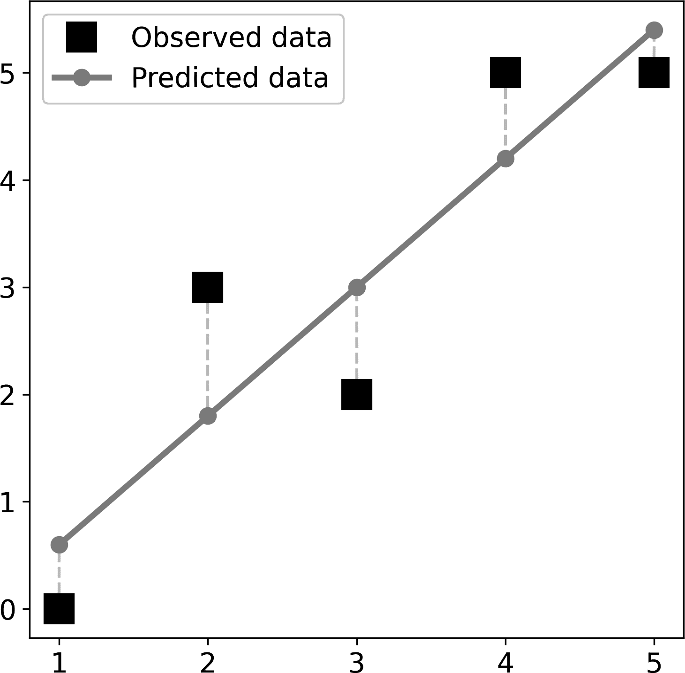
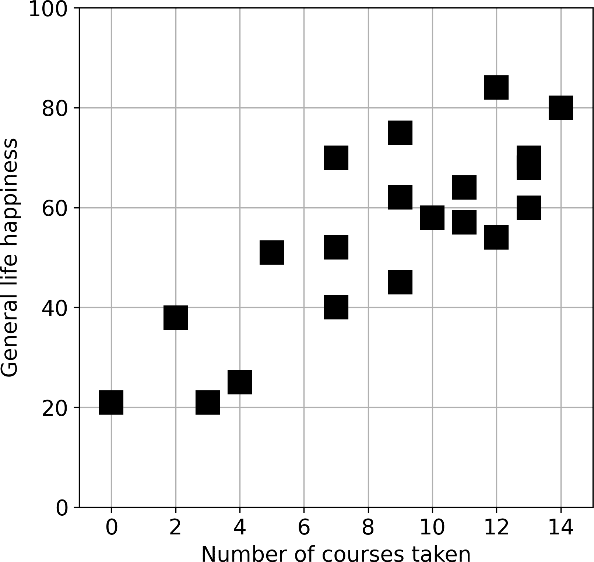
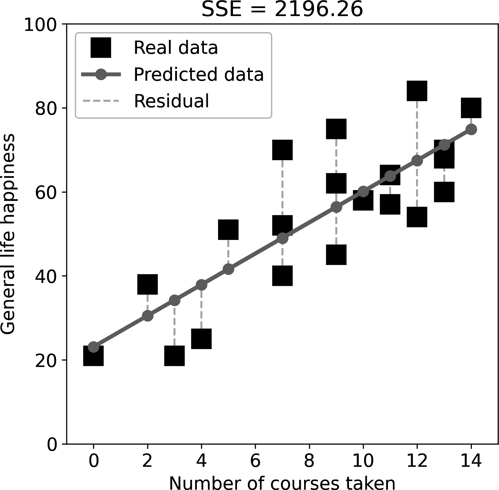
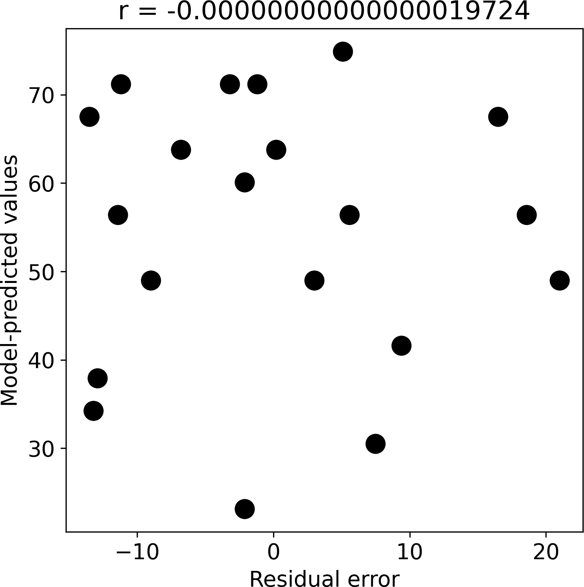
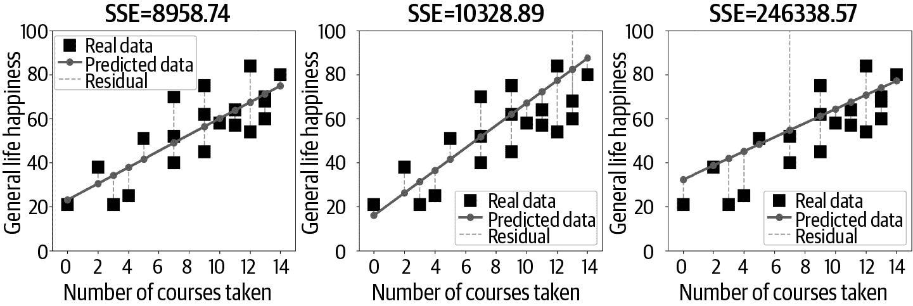
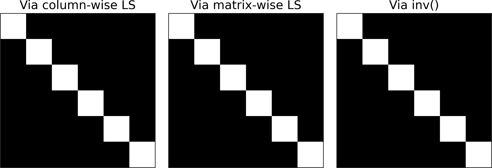

# 第十一章：广义线性模型和最小二乘法

宇宙是一个非常大而复杂的地方。地球上的所有动物都有一种探索和理解其环境的自然好奇心，但我们人类则有幸能够发展科学和统计工具，将我们的好奇心提升到更高的水平。这就是为什么我们有飞机、MRI 机器、火星探测器、疫苗，当然还有像本书这样的书籍。

我们如何理解宇宙？通过发展数学基础的理论，并收集数据来测试和改进这些理论。这将我们带到了统计模型。统计模型是世界某些方面的简化数学表示。一些统计模型很简单（例如，预测股市数十年来会上涨），而其他一些则更为复杂，比如蓝脑项目以如此精细的细节模拟脑活动，以至于模拟一秒钟的活动需要 40 分钟的计算时间。

*统计* 模型的一个关键区别（与其他数学模型相对）是它们包含可根据数据进行拟合的自由参数。例如，我知道股市会随时间上涨，但我不知道上涨幅度是多少。因此，我允许随时间变化的股市价格（即斜率）是一个由数据决定数值的自由参数。

制定统计模型可能很困难，需要创造力、经验和专业知识。但根据将模型拟合到数据的自由参数是一件简单的线性代数问题——实际上，你已经掌握了本章所需的所有数学，只是需要将各部分组合起来，并学习统计术语。

# 广义线性模型

统计模型是一组方程，将预测变量（称为 *独立变量*）与观察结果（称为 *依赖变量*）相关联。在股市模型中，独立变量是 *时间*，依赖变量是 *股市价格*（例如，以标准普尔 500 指数量化）。

在本书中，我将重点介绍广义线性模型（GLM），其简称为 GLM。例如，回归是 GLM 的一种类型。

## 术语

统计学家使用的术语与线性代数学家略有不同。表 11-1 展示了 GLM 中用于向量和矩阵的关键字母和描述。

表 11-1\. 广义线性模型术语表

| LinAlg | Stats | 描述 |
| --- | --- | --- |
| Ax = b | <math alttext="upper X beta equals y"><mrow><mi>X</mi><mi>β</mi><mo>=</mo><mi>y</mi></mrow></math> | 广义线性模型（GLM） |
| A | X | 设计矩阵（列 = 独立变量，预测变量，回归器） |
| x | <math alttext="beta"><mi>β</mi></math> | 回归系数或贝塔参数 |
| b | y | 因变量，结果测量，数据 |

## 设置广义线性模型

设置一个 GLM 包括（1）定义一个将预测变量与因变量联系起来的方程，（2）将观察数据映射到这些方程中，（3）将一系列方程转换为矩阵方程，并（4）解决该方程。

我将用一个简单的例子来具体说明这个过程。我有一个模型，根据体重和父母的身高预测成年人的身高。方程如下所示：

<math alttext="y equals beta 0 plus beta 1 w plus beta 2 h plus epsilon" display="block"><mrow><mi>y</mi> <mo>=</mo> <msub><mi>β</mi> <mn>0</mn></msub> <mo>+</mo> <msub><mi>β</mi> <mn>1</mn></msub> <mi>w</mi> <mo>+</mo> <msub><mi>β</mi> <mn>2</mn></msub> <mi>h</mi> <mo>+</mo> <mi>ϵ</mi></mrow></math>

*y* 是个体的身高，*w* 是他们的体重，*h* 是他们父母的身高（母亲和父亲的平均值）。 <math alttext="epsilon"><mi>ϵ</mi></math> 是一个误差项（也称为 *残差*），因为我们不能合理地期望体重和父母的身高完全决定一个人的身高；我们的模型没有考虑到的各种因素，而不能归因于体重和父母的身高的方差将被残差吸收。

我的假设是，体重和父母的身高对个体的身高很重要，但我不知道每个变量有多重要。输入 <math alttext="beta"><mi>β</mi></math> 项：它们是系数或权重，告诉我如何结合体重和父母的身高来预测个体的身高。换句话说，这是一个线性加权组合，其中 <math alttext="beta"><mi>β</mi></math> 是权重。

<math alttext="beta 0"><msub><mi>β</mi> <mn>0</mn></msub></math> 被称为 *截距*（有时称为 *常数*）。截距项是一个全为 1 的向量。如果没有截距项，最佳拟合线将被迫通过原点。我将在本章末尾解释为什么，并展示一个演示。

现在我们有了我们的方程，我们的宇宙模型（嗯，它的一个微小部分）。接下来，我们需要将观察数据映射到这些方程中。为了简单起见，我会在 表 11-2 中虚构一些数据（你可以想象 *y* 和 *h* 单位是厘米，*w* 单位是公斤）。

表 11-2。我们身高统计模型的虚构数据

| *y* | *w* | *h* |
| --- | --- | --- |
| 175 | 70 | 177 |
| 181 | 86 | 190 |
| 159 | 63 | 180 |
| 165 | 62 | 172 |

将观察数据映射到我们的统计模型中涉及将方程复制四次（对应我们数据集中的四个观察），每次用实际数据替换变量 *y*、*w* 和 *h*：

<math alttext="StartLayout 1st Row 1st Column 175 2nd Column equals beta 0 plus 70 beta 1 plus 177 beta 2 2nd Row 1st Column 181 2nd Column equals beta 0 plus 86 beta 1 plus 190 beta 2 3rd Row 1st Column 159 2nd Column equals beta 0 plus 63 beta 1 plus 180 beta 2 4th Row 1st Column 165 2nd Column equals beta 0 plus 62 beta 1 plus 172 beta 2 EndLayout" display="block"><mtable displaystyle="true"><mtr><mtd columnalign="right"><mn>175</mn></mtd> <mtd columnalign="left"><mrow><mo>=</mo> <msub><mi>β</mi> <mn>0</mn></msub> <mo>+</mo> <mn>70</mn> <msub><mi>β</mi> <mn>1</mn></msub> <mo>+</mo> <mn>177</mn> <msub><mi>β</mi> <mn>2</mn></msub></mrow></mtd></mtr> <mtr><mtd columnalign="right"><mn>181</mn></mtd> <mtd columnalign="left"><mrow><mo>=</mo> <msub><mi>β</mi> <mn>0</mn></msub> <mo>+</mo> <mn>86</mn> <msub><mi>β</mi> <mn>1</mn></msub> <mo>+</mo> <mn>190</mn> <msub><mi>β</mi> <mn>2</mn></msub></mrow></mtd></mtr> <mtr><mtd columnalign="right"><mn>159</mn></mtd> <mtd columnalign="left"><mrow><mo>=</mo> <msub><mi>β</mi> <mn>0</mn></msub> <mo>+</mo> <mn>63</mn> <msub><mi>β</mi> <mn>1</mn></msub> <mo>+</mo> <mn>180</mn> <msub><mi>β</mi> <mn>2</mn></msub></mrow></mtd></mtr> <mtr><mtd columnalign="right"><mn>165</mn></mtd> <mtd columnalign="left"><mrow><mo>=</mo> <msub><mi>β</mi> <mn>0</mn></msub> <mo>+</mo> <mn>62</mn> <msub><mi>β</mi> <mn>1</mn></msub> <mo>+</mo> <mn>172</mn> <msub><mi>β</mi> <mn>2</mn></msub></mrow></mtd></mtr></mtable></math>

目前我会省略 <math alttext="epsilon"><mi>ϵ</mi></math> 项；稍后我会详细讨论残差。现在我们需要将这些方程翻译成矩阵方程。我知道你知道如何做，所以我在这里只打印方程，以便你从 第十章 确认：

<math alttext="Start 4 By 3 Matrix 1st Row 1st Column 1 2nd Column 70 3rd Column 177 2nd Row 1st Column 1 2nd Column 86 3rd Column 190 3rd Row 1st Column 1 2nd Column 63 3rd Column 180 4th Row 1st Column 1 2nd Column 62 3rd Column 172 EndMatrix Start 3 By 1 Matrix 1st Row  beta 0 2nd Row  beta 1 3rd Row  beta 2 EndMatrix equals Start 4 By 1 Matrix 1st Row  175 2nd Row  181 3rd Row  159 4th Row  165 EndMatrix" display="block"><mrow><mfenced close="]" open="["><mtable><mtr><mtd><mn>1</mn></mtd> <mtd><mn>70</mn></mtd> <mtd><mn>177</mn></mtd></mtr> <mtr><mtd><mn>1</mn></mtd> <mtd><mn>86</mn></mtd> <mtd><mn>190</mn></mtd></mtr> <mtr><mtd><mn>1</mn></mtd> <mtd><mn>63</mn></mtd> <mtd><mn>180</mn></mtd></mtr> <mtr><mtd><mn>1</mn></mtd> <mtd><mn>62</mn></mtd> <mtd><mn>172</mn></mtd></mtr></mtable></mfenced> <mfenced close="]" open="["><mtable><mtr><mtd><msub><mi>β</mi> <mn>0</mn></msub></mtd></mtr> <mtr><mtd><msub><mi>β</mi> <mn>1</mn></msub></mtd></mtr> <mtr><mtd><msub><mi>β</mi> <mn>2</mn></msub></mtd></mtr></mtable></mfenced> <mo>=</mo> <mfenced close="]" open=""><mtable><mtr><mtd><mn>175</mn></mtd></mtr> <mtr><mtd><mn>181</mn></mtd></mtr> <mtr><mtd><mn>159</mn></mtd></mtr> <mtr><mtd><mn>165</mn></mtd></mtr></mtable></mfenced></mrow></math>

当然，我们可以简洁地表示这个方程为 <math alttext="bold upper X beta equals bold y"><mrow><mi mathvariant="bold">X</mi><mi mathvariant="bold">β</mi><mo>=</mo><mi mathvariant="bold">y</mi></mrow></math>。

# 解决广义线性模型（GLMs）

我相信你已经了解本节的主要思想：为了求解未知系数向量 <math alttext="beta"><mi mathvariant="bold">β</mi></math>，只需将方程式的两边左乘设计矩阵 <math alttext="bold upper X"><mi>𝐗</mi></math> 的左逆即可。解决方案如下：

<math alttext="StartLayout 1st Row 1st Column bold upper X beta 2nd Column equals bold y 2nd Row 1st Column left-parenthesis bold upper X Superscript upper T Baseline bold upper X right-parenthesis Superscript negative 1 Baseline bold upper X Superscript upper T Baseline bold upper X beta 2nd Column equals left-parenthesis bold upper X Superscript upper T Baseline bold upper X right-parenthesis Superscript negative 1 Baseline bold upper X Superscript upper T Baseline bold y 3rd Row 1st Column beta 2nd Column equals left-parenthesis bold upper X Superscript upper T Baseline bold upper X right-parenthesis Superscript negative 1 Baseline bold upper X Superscript upper T Baseline bold y EndLayout" display="block"><mtable displaystyle="true"><mtr><mtd columnalign="right"><mrow><mi mathvariant="bold">X</mi> <mi mathvariant="bold">β</mi></mrow></mtd> <mtd columnalign="left"><mrow><mo>=</mo> <mi mathvariant="bold">y</mi></mrow></mtd></mtr> <mtr><mtd columnalign="right"><mrow><msup><mrow><mo>(</mo><msup><mi mathvariant="bold">X</mi> <mtext>T</mtext></msup> <mi mathvariant="bold">X</mi><mo>)</mo></mrow> <mrow><mo>-</mo><mn>1</mn></mrow></msup> <msup><mi mathvariant="bold">X</mi> <mtext>T</mtext></msup> <mi mathvariant="bold">X</mi> <mi mathvariant="bold">β</mi></mrow></mtd> <mtd columnalign="left"><mrow><mo>=</mo> <msup><mrow><mo>(</mo><msup><mi mathvariant="bold">X</mi> <mtext>T</mtext></msup> <mi mathvariant="bold">X</mi><mo>)</mo></mrow> <mrow><mo>-</mo><mn>1</mn></mrow></msup> <msup><mi mathvariant="bold">X</mi> <mtext>T</mtext></msup> <mi mathvariant="bold">y</mi></mrow></mtd></mtr> <mtr><mtd columnalign="right"><mi mathvariant="bold">β</mi></mtd> <mtd columnalign="left"><mrow><mo>=</mo> <msup><mrow><mo>(</mo><msup><mi mathvariant="bold">X</mi> <mtext>T</mtext></msup> <mi mathvariant="bold">X</mi><mo>)</mo></mrow> <mrow><mo>-</mo><mn>1</mn></mrow></msup> <msup><mi mathvariant="bold">X</mi> <mtext>T</mtext></msup> <mi mathvariant="bold">y</mi></mrow></mtd></mtr></mtable></math>

请盯着那个最后的方程式直到它永远刻在你的脑海中。它被称为*最小二乘解*，是应用线性代数中最重要的数学方程之一。你会在研究出版物、教科书、博客、讲座、Python 函数的文档字符串、塔吉克斯坦的广告牌^(1)等地方看到它。你可能会看到不同的字母，或者可能会有一些附加内容，如下所示：

<math alttext="bold b equals left-parenthesis bold upper H Superscript upper T Baseline bold upper W bold upper H plus lamda bold upper L Superscript upper T Baseline bold upper L right-parenthesis Superscript negative 1 Baseline bold upper H Superscript upper T Baseline bold x" display="block"><mrow><mi>𝐛</mi> <mo>=</mo> <msup><mrow><mo>(</mo><msup><mi>𝐇</mi> <mtext>T</mtext></msup> <mi>𝐖</mi><mi>𝐇</mi><mo>+</mo><mi>λ</mi><msup><mi>𝐋</mi> <mtext>T</mtext></msup> <mi>𝐋</mi><mo>)</mo></mrow> <mrow><mo>-</mo><mn>1</mn></mrow></msup> <msup><mi>𝐇</mi> <mtext>T</mtext></msup> <mi>𝐱</mi></mrow></math>

方程式的含义及附加矩阵的解释并不重要（它们是正则化模型拟合的各种方法）；重要的是，你能够看到最小二乘公式嵌入到那个看似复杂的方程式中（例如，设定 <math alttext="bold upper W equals bold upper I"><mrow><mi>𝐖</mi> <mo>=</mo> <mi>𝐈</mi></mrow></math> 和 <math alttext="lamda equals 0"><mrow><mi>λ</mi> <mo>=</mo> <mn>0</mn></mrow></math> ）。

通过左逆的最小二乘解可以直接翻译成 Python 代码（变量 `X` 是设计矩阵，变量 `y` 是数据向量）：

```
X_leftinv = np.linalg.inv(X.T@X) @ X.T

# solve for the coefficients
beta = X_leftinv @ y
```

我将在本章后面展示这些模型的结果——以及如何解释它们；现在请你专注于数学公式如何转换为 Python 代码。

# 左逆与 NumPy 的最小二乘解算器

本章的代码直接将数学公式转换为 Python 代码。显式计算左逆不是解决广义线性模型（GLM）最稳定的方式（尽管对本章中的简单问题来说是准确的），但我希望你能看到这些看似抽象的线性代数确实有效。解决 GLM 的更稳定的方式包括 QR 分解（你将在本章后面看到）和 Python 的更稳定的方法（你将在下一章看到）。

## 解是否确切？

当数据向量 <math alttext="bold y"><mi>𝐲</mi></math> 在设计矩阵 <math alttext="bold upper X"><mi>𝐗</mi></math> 的列空间中时，方程式 <math alttext="bold upper X beta equals bold y"><mrow><mi mathvariant="bold">X</mi><mi mathvariant="bold">β</mi><mo>=</mo><mi mathvariant="bold">y</mi></mrow></math> 是确切可解的。因此问题是数据向量是否确保在统计模型的列空间中。答案是否定的，事实上，数据向量 <math alttext="bold y"><mi>𝐲</mi></math> 几乎永远不在 <math alttext="bold upper X"><mi>𝐗</mi></math> 的列空间中。

要理解为什么不这样做，让我们想象一项针对大学生的调查，研究人员试图根据饮酒行为预测平均 GPA（平均绩点）。调查可能包含来自两千名学生的数据，但只有三个问题（例如，您消费多少酒精；您经常失忆吗；您的 GPA 是多少）。数据包含在一个 2000×3 的表格中。设计矩阵的列空间是该 2000D 环境维度内的一个 2D 子空间，而数据向量是同一环境维度内的一个 1D 子空间。

如果数据在设计矩阵的列空间内，意味着模型可以解释数据方差的 100%。但这几乎从不会发生：现实世界的数据包含噪声和抽样变异性，而模型只是简化，未能解释所有变异性（例如，GPA 由我们模型忽略的多种因素决定）。

解决这一难题的方法是修改 GLM 方程，允许模型预测数据与观察数据之间存在差异。它可以用几种等效（至少在符号上）的方式表示：

<math alttext="StartLayout 1st Row 1st Column bold upper X beta 2nd Column equals bold y plus epsilon 2nd Row 1st Column bold upper X beta plus epsilon 2nd Column equals bold y 3rd Row 1st Column epsilon 2nd Column equals bold upper X beta minus bold y EndLayout" display="block"><mtable displaystyle="true"><mtr><mtd columnalign="right"><mrow><mi mathvariant="bold">X</mi> <mi mathvariant="bold">β</mi></mrow></mtd> <mtd columnalign="left"><mrow><mo>=</mo> <mi mathvariant="bold">y</mi> <mo>+</mo> <mi mathvariant="bold">ϵ</mi></mrow></mtd></mtr> <mtr><mtd columnalign="right"><mrow><mi mathvariant="bold">X</mi> <mi mathvariant="bold">β</mi> <mo>+</mo> <mi mathvariant="bold">ϵ</mi></mrow></mtd> <mtd columnalign="left"><mrow><mo>=</mo> <mi mathvariant="bold">y</mi></mrow></mtd></mtr> <mtr><mtd columnalign="right"><mi mathvariant="bold">ϵ</mi></mtd> <mtd columnalign="left"><mrow><mo>=</mo> <mi mathvariant="bold">X</mi> <mi mathvariant="bold">β</mi> <mo>-</mo> <mi mathvariant="bold">y</mi></mrow></mtd></mtr></mtable></math>

第一个方程的解释是<math alttext="epsilon"><mi mathvariant="bold">ϵ</mi></math>是一个残差，或者说是一个误差项，你需要将它加到数据向量中，使其符合设计矩阵的列空间。第二个方程的解释是残差项是对设计矩阵的调整，以便完美拟合数据。最后，第三个方程的解释是残差被定义为模型预测数据与观察数据之间的差异。

还有另一种非常有见地的解释，从几何角度接近 GLM 和最小二乘法。我将在下一节详细介绍这一点。

这一部分的要点是观察到的数据几乎从不在回归向量生成的子空间内。因此，通常将 GLM 表示为<math alttext="bold upper X equals beta ModifyingAbove bold y With bold caret"><mrow><mi mathvariant="bold">X</mi><mo>=</mo><mi mathvariant="bold">β</mi><mover accent="true"><mi mathvariant="bold">y</mi> <mo>^</mo></mover></mrow></math>，其中<math alttext="ModifyingAbove bold y With bold caret equals bold y plus epsilon"><mrow><mover accent="true"><mi mathvariant="bold">y</mi> <mo>^</mo></mover><mo>=</mo><mi mathvariant="bold">y</mi><mo>+</mo><mi mathvariant="bold">ϵ</mi></mrow></math>。

因此，GLM 的目标是找到回归变量的线性组合，使其尽可能接近观察数据。关于这一点的更多内容将在后面详细说明；现在我想向你介绍最小二乘法的几何视角。

## 最小二乘法的几何视角

到目前为止，我介绍了从解矩阵方程的代数角度解决 GLM 的方法。GLM 还有一种几何视角，提供了一种替代视角，并帮助揭示最小二乘解决方案的几个重要特征。

让我们考虑设计矩阵的列空间<math alttext="upper C left-parenthesis bold upper X right-parenthesis"><mrow><mi>C</mi> <mo>(</mo> <mi>𝐗</mi> <mo>)</mo></mrow></math>是<math alttext="double-struck upper R Superscript upper M"><msup><mi>ℝ</mi> <mi>M</mi></msup></math>的子空间。通常是一个非常低维的子空间（即，*N* << *M*），因为统计模型通常有比预测变量（列）更多的观察（行）。因变量是向量<math alttext="bold y element-of double-struck upper R Superscript upper M"><mrow><mi>𝐲</mi> <mo>∈</mo> <msup><mi>ℝ</mi> <mi>M</mi></msup></mrow></math>。所涉及的问题是，向量<math alttext="bold y"><mi>𝐲</mi></math>是否在设计矩阵的列空间中，如果不是，那么设计矩阵的列空间内的坐标最接近数据向量是什么？

第一个问题的答案是否定的，正如我在前一节中讨论的那样。第二个问题很深刻，因为你已经在第二章中学习了答案。在考虑解决方案时，请参考图 11-1。

![glm 的几何###### 图 11-1. GLM 的抽象几何视角：找到设计矩阵列空间中距离数据向量最接近的点因此，我们的目标是找到系数集合<math alttext="beta"><mi mathvariant="bold">β</mi></math>，使得<math alttext="bold upper X"><mi>𝐗</mi></math>中列的加权组合最小化到数据向量<math alttext="bold y"><mi>𝐲</mi></math>的距离。我们可以称该投影向量为<math alttext="epsilon"><mi mathvariant="bold">ϵ</mi></math>。我们如何找到向量<math alttext="epsilon"><mi mathvariant="bold">ϵ</mi></math>和系数<math alttext="beta"><mi mathvariant="bold">β</mi></math>？我们使用正交向量投影，就像你在第二章中学到的那样。这意味着我们可以应用与向量不同的矩阵相同的方法。关键的见解是，<math alttext="bold y"><mi>𝐲</mi></math>和<math alttext="bold upper X"><mi>𝐗</mi></math>之间的最短距离由投影向量<math alttext="bold y minus bold upper X beta"><mrow><mi mathvariant="bold">y</mi><mo>-</mo><mi mathvariant="bold">X</mi><mi mathvariant="bold">β</mi></mrow></math>给出，该向量在<math alttext="bold upper X"><mi>𝐗</mi></math>上呈直角：<math alttext="StartLayout 1st Row 1st Column bold upper X Superscript upper T Baseline epsilon 2nd Column equals bold 0 2nd Row 1st Column bold upper X Superscript upper T Baseline left-parenthesis bold y minus bold upper X beta right-parenthesis 2nd Column equals bold 0 3rd Row 1st Column bold upper X Superscript upper T Baseline bold y minus bold upper X Superscript upper T Baseline bold upper X beta 2nd Column equals bold 0 4th Row 1st Column bold upper X Superscript upper T Baseline bold upper X beta 2nd Column equals bold upper X Superscript upper T Baseline bold y 5th Row 1st Column beta 2nd Column equals left-parenthesis bold upper X Superscript upper T Baseline bold upper X right-parenthesis Superscript negative 1 Baseline bold upper X Superscript upper T Baseline bold y EndLayout" display="block"><mtable displaystyle="true"><mtr><mtd columnalign="right"><mrow><msup><mi mathvariant="bold">X</mi> <mtext>T</mtext></msup> <mi mathvariant="bold">ϵ</mi></mrow></mtd> <mtd columnalign="left"><mrow><mo>=</mo> <mn mathvariant="bold">0</mn></mrow></mtd></mtr> <mtr><mtd columnalign="right"><mrow><msup><mi mathvariant="bold">X</mi> <mtext>T</mtext></msup> <mrow><mo>(</mo> <mi mathvariant="bold">y</mi> <mo>-</mo> <mi mathvariant="bold">X</mi> <mi mathvariant="bold">β</mi> <mo>)</mo></mrow></mrow></mtd> <mtd columnalign="left"><mrow><mo>=</mo> <mn mathvariant="bold">0</mn></mrow></mtd></mtr> <mtr><mtd columnalign="right"><mrow><msup><mi mathvariant="bold">X</mi> <mtext>T</mtext></msup> <mi mathvariant="bold">y</mi> <mo>-</mo> <msup><mi mathvariant="bold">X</mi> <mtext>T</mtext></msup> <mi mathvariant="bold">X</mi> <mi mathvariant="bold">β</mi></mrow></mtd> <mtd columnalign="left"><mrow><mo>=</mo> <mn mathvariant="bold">0</mn></mrow></mtd></mtr> <mtr><mtd columnalign="right"><mrow><msup><mi mathvariant="bold">X</mi> <mtext>T</mtext></msup> <mi mathvariant="bold">X</mi> <mi mathvariant="bold">β</mi></mrow></mtd> <mtd columnalign="left"><mrow><mo>=</mo> <msup><mi mathvariant="bold">X</mi> <mtext>T</mtext></msup> <mi mathvariant="bold">y</mi></mrow></mtd></mtr> <mtr><mtd columnalign="right"><mi mathvariant="bold">β</mi></mtd> <mtd columnalign="left"><mrow><mo>=</mo> <msup><mrow><mo>(</mo><msup><mi mathvariant="bold">X</mi> <mtext>T</mtext></msup> <mi mathvariant="bold">X</mi><mo>)</mo></mrow> <mrow><mo>-</mo><mn>1</mn></mrow></msup> <msup><mi mathvariant="bold">X</mi> <mtext>T</mtext></msup> <mi mathvariant="bold">y</mi></mrow></mtd></mtr></mtable></math>这一系列方程的进展非常引人注目：我们从把广义线性模型（GLM）看作是数据向量在设计矩阵的列空间上的几何投影开始，应用了您在本书早期学到的正交向量投影原理，然后！我们重新导出了从代数方法中得到的相同左逆解。## 为什么最小二乘法有效？为什么称之为“最小二乘法”？这些所谓的平方是什么，为什么这种方法能使它们最小化？这里的“平方”指的是预测数据与观测数据之间的平方误差。每个第*i*个预测数据点都有一个误差项，定义为<math alttext="epsilon Subscript i Baseline equals bold upper X Subscript i Baseline beta minus bold y Subscript i"><mrow><msub><mi>ϵ</mi> <mi>i</mi></msub> <mo>=</mo><msub><mi mathvariant="bold">X</mi> <mi>i</mi></msub> <mi mathvariant="bold">β</mi><mo>-</mo><msub><mi mathvariant="bold">y</mi> <mi>i</mi></msub></mrow></math> 。请注意，每个数据点都使用相同的系数（即设计矩阵中预测器的相同权重组合）。我们可以用一个向量来表示所有的误差：<math alttext="epsilon equals bold upper X beta minus bold y" display="block"><mrow><mi mathvariant="bold">ϵ</mi> <mo>=</mo> <mi mathvariant="bold">X</mi> <mi mathvariant="bold">β</mi> <mo>-</mo> <mi mathvariant="bold">y</mi></mrow></math>如果模型很好地拟合了数据，那么误差应该很小。因此，我们可以说模型拟合的目标是选择最小化<math alttext="beta"><mi mathvariant="bold">β</mi></math> 中的元素，这些元素最小化了<math alttext="epsilon"><mi mathvariant="bold">ϵ</mi></math> 中的元素。但是仅仅*最小化*误差会导致模型预测值向负无穷预测。因此，我们最小化*平方*误差，这对应于它们到观测数据<math alttext="bold y"><mi>𝐲</mi></math> 的几何平方距离，而不管预测误差本身是正还是负。² 这与最小化误差范数的思想是相同的。因此得名“最小二乘法”。这导致了以下修改：<math alttext="parallel-to epsilon parallel-to equals parallel-to bold upper X beta minus bold y parallel-to" display="block"><mrow><msup><mrow><mo>∥</mo><mi mathvariant="bold">ϵ</mi><mo>∥</mo></mrow> <mn>2</mn></msup> <mo>=</mo> <msup><mrow><mo>∥</mo><mi mathvariant="bold">X</mi><mi mathvariant="bold">β</mi><mo>-</mo><mi mathvariant="bold">y</mi><mo>∥</mo></mrow> <mn>2</mn></msup></mrow></math>现在我们可以把它看作是一个优化问题。特别地，我们想找到一组系数，这些系数最小化了平方误差。这种最小化可以表达如下：<math alttext="min Underscript beta Endscripts parallel-to bold upper X beta minus bold y parallel-to" display="block"><mrow><munder><mo form="prefix" movablelimits="true">min</mo> <mi mathvariant="bold">β</mi></munder> <msup><mrow><mo>∥</mo><mi mathvariant="bold">X</mi><mi mathvariant="bold">β</mi><mo>-</mo><mi mathvariant="bold">y</mi><mo>∥</mo></mrow> <mn>2</mn></msup></mrow></math>解决这个优化问题可以通过将目标的导数设为零并应用一点微分计算³ 和一点代数来找到。<math alttext="StartLayout 1st Row 1st Column 0 equals StartFraction d Over d beta EndFraction parallel-to bold upper X beta minus bold y parallel-to 2nd Column equals 2 bold upper X Superscript upper T Baseline left-parenthesis bold upper X beta minus bold y right-parenthesis 2nd Row 1st Column 0 2nd Column equals bold upper X Superscript upper T Baseline bold upper X beta minus bold upper X Superscript upper T Baseline bold y 3rd Row 1st Column bold upper X Superscript upper T Baseline bold upper X beta 2nd Column equals bold upper X Superscript upper T Baseline bold y 4th Row 1st Column beta 2nd Column equals left-parenthesis bold upper X Superscript upper T Baseline bold upper X right-parenthesis Superscript negative 1 Baseline bold upper X Superscript upper T Baseline bold y EndLayout" display="block"><mtable displaystyle="true"><mtr><mtd columnalign="right"><mrow><mn>0</mn> <mo>=</mo> <mfrac><mi>d</mi> <mrow><mi>d</mi><mi mathvariant="bold">β</mi></mrow></mfrac> <msup><mrow><mo>∥</mo><mi mathvariant="bold">X</mi><mi mathvariant="bold">β</mi><mo>-</mo><mi mathvariant="bold">y</mi><mo>∥</mo></mrow> <mn>2</mn></msup></mrow></mtd> <mtd columnalign="left"><mrow><mo>=</mo> <mn>2</mn> <msup><mi mathvariant="bold">X</mi> <mtext>T</mtext></msup> <mrow><mo>(</mo> <mi mathvariant="bold">X</mi> <mi mathvariant="bold">β</mi> <mo>-</mo> <mi mathvariant="bold">y</mi> <mo>)</mo></mrow></mrow></mtd></mtr> <mtr><mtd columnalign="right"><mn>0</mn></mtd> <mtd columnalign="left"><mrow><mo>=</mo> <msup><mi mathvariant="bold">X</mi> <mtext>T</mtext></msup> <mi mathvariant="bold">X</mi> <mi mathvariant="bold">β</mi> <mo>-</mo> <msup><mi mathvariant="bold">X</mi> <mtext>T</mtext></msup> <mi mathvariant="bold">y</mi></mrow></mtd></mtr> <mtr><mtd columnalign="right"><mrow><msup><mi mathvariant="bold">X</mi> <mtext>T</mtext></msup> <mi mathvariant="bold">X</mi> <mi mathvariant="bold">β</mi></mrow></mtd> <mtd columnalign="left"><mrow><mo>=</mo> <msup><mi mathvariant="bold">X</mi> <mtext>T</mtext></msup> <mi mathvariant="bold">y</mi></mrow></mtd></mtr> <mtr><mtd columnalign="right"><mi mathvariant="bold">β</mi></mtd> <mtd columnalign="left"><mrow><mo>=</mo> <msup><mrow><mo>(</mo><msup><mi mathvariant="bold">X</mi> <mtext>T</mtext></msup> <mi mathvariant="bold">X</mi><mo>)</mo></mrow> <mrow><mo>-</mo><mn>1</mn></mrow></msup> <msup><mi mathvariant="bold">X</mi> <mtext>T</mtext></msup> <mi mathvariant="bold">y</mi></mrow></mtd></mtr></mtable></math>神奇的是，我们从不同的角度出发——最小化模型预测值与观测值之间的平方距离——我们再次通过线性代数的直觉重新发现了最小二乘法的相同解决方案。图 11-2 展示了一些观察到的数据（黑色方块），它们的模型预测值（灰色点）以及它们之间的距离（灰色虚线）。所有模型预测值均位于一条直线上；最小二乘法的目标是找到该直线的斜率和截距，使得从预测到观测数据的距离最小化。

###### 图 11-2\. 最小二乘法的直观理解

# 简单示例中的广义线性模型（GLM）

在下一章节中，你将看到几个实际数据的示例；在这里，我想集中讨论一个使用虚假数据的简单示例。这些虚假数据来自一个虚构的实验，我在其中随机调查了 20 位虚构的学生，并询问了他们参加过的在线课程数量以及他们对生活的整体满意度。⁴

表 11-3 展示了数据矩阵的前 4 行（共 20 行）。

表 11-3\. 数据表

| Number of courses | Life happiness |
| --- | --- |
| 4 | 25 |
| 12 | 54 |
| 3 | 21 |
| 14 | 80 |

通过散点图更容易将数据可视化，你可以在图 11-3 中看到它。



###### 图 11-3\. 来自虚构调查的虚假数据

注意，独立变量在*x*轴上绘制，而因变量在*y*轴上绘制，这是统计学中的常见惯例。

我们需要创建设计矩阵。因为这是一个简单的模型，只有一个预测变量，所以我们的设计矩阵实际上只是一个列向量。我们的矩阵方程<math alttext="bold upper X beta equals bold y"><mrow><mi mathvariant="bold">X</mi><mi mathvariant="bold">β</mi><mo>=</mo><mi mathvariant="bold">y</mi></mrow></math>看起来像这样（再次强调，仅展示前四个数据值）：

<math alttext="Start 4 By 1 Matrix 1st Row  25 2nd Row  54 3rd Row  21 4th Row  80 EndMatrix Start 1 By 1 Matrix 1st Row  beta EndMatrix equals Start 4 By 1 Matrix 1st Row  4 2nd Row  12 3rd Row  3 4th Row  14 EndMatrix" display="block"><mrow><mfenced close="]" open="["><mtable><mtr><mtd><mn>25</mn></mtd></mtr> <mtr><mtd><mn>54</mn></mtd></mtr> <mtr><mtd><mn>21</mn></mtd></mtr> <mtr><mtd><mn>80</mn></mtd></mtr></mtable></mfenced> <mfenced close="]" open="["><mtable><mtr><mtd><mi>β</mi></mtd></mtr></mtable></mfenced> <mo>=</mo> <mfenced close="]" open=""><mtable><mtr><mtd><mn>4</mn></mtd></mtr> <mtr><mtd><mn>12</mn></mtd></mtr> <mtr><mtd><mn>3</mn></mtd></mtr> <mtr><mtd><mn>14</mn></mtd></mtr></mtable></mfenced></mrow></math>

以下 Python 代码展示了解决方案。变量`numcourses`和`happiness`包含数据；它们都是列表，因此必须转换为多维 NumPy 数组：

```
X = np.array(numcourses,ndmin=2).T

# compute the left-inverse
X_leftinv = np.linalg.inv(X.T@X) @ X.T

# solve for the coefficients
beta = X_leftinv @ happiness
```

最小二乘公式告诉我们<math alttext="beta equals 5.95"><mrow><mi mathvariant="bold">β</mi><mo>=</mo><mn>5.95</mn></mrow></math>。这个数字的含义是什么？它是我们公式中的斜率。换句话说，每增加一门课程，一个人的自报生活幸福感就增加 5.95 个点。让我们看看这个结果在图中的表现。图 11-4 展示了数据（黑色方块）、预测的幸福值（由灰色点连接的线）以及残差（连接每个观测值与预测值的虚线）。

![数据续集

###### 图 11-4\. 观察数据和预测数据（SSE = 平方误差和）

如果你在观看图 11-4 时感到不安，那是好事——这意味着你在进行批判性思考，并注意到模型在最小化误差方面表现不佳。你可以轻松想象将最佳拟合线的左侧向上推以获得更好的拟合。这里的问题是什么呢？

问题在于设计矩阵不包含截距项。最佳拟合线的方程是*y* = *mx*，这意味着当*x* = 0 时，*y* = 0。这个约束对这个问题来说是没有意义的——如果任何没有参加我的课程的人完全缺乏生活满意度，那将是一个悲哀的世界。相反，我们希望我们的线条具有*y* = *mx* + *b*的形式，其中*b*是截距项，允许最佳拟合线在*y*轴上交叉任意值。截距的统计解释是观察数值的期望值，当预测变量设为零时。

向我们的设计矩阵添加一个截距项会得到以下修改的方程（再次仅显示前四行）：

<math alttext="Start 4 By 2 Matrix 1st Row 1st Column 1 2nd Column 25 2nd Row 1st Column 1 2nd Column 54 3rd Row 1st Column 1 2nd Column 21 4th Row 1st Column 1 2nd Column 80 EndMatrix StartBinomialOrMatrix beta 1 Choose beta 2 EndBinomialOrMatrix equals Start 4 By 1 Matrix 1st Row  4 2nd Row  12 3rd Row  3 4th Row  14 EndMatrix" display="block"><mrow><mfenced close="]" open="["><mtable><mtr><mtd><mn>1</mn></mtd> <mtd><mn>25</mn></mtd></mtr> <mtr><mtd><mn>1</mn></mtd> <mtd><mn>54</mn></mtd></mtr> <mtr><mtd><mn>1</mn></mtd> <mtd><mn>21</mn></mtd></mtr> <mtr><mtd><mn>1</mn></mtd> <mtd><mn>80</mn></mtd></mtr></mtable></mfenced> <mfenced close="]" open="["><mtable><mtr><mtd><msub><mi>β</mi> <mn>1</mn></msub></mtd></mtr> <mtr><mtd><msub><mi>β</mi> <mn>2</mn></msub></mtd></mtr></mtable></mfenced> <mo>=</mo> <mfenced close="]" open="["><mtable><mtr><mtd><mn>4</mn></mtd></mtr> <mtr><mtd><mn>12</mn></mtd></mtr> <mtr><mtd><mn>3</mn></mtd></mtr> <mtr><mtd><mn>14</mn></mtd></mtr></mtable></mfenced></mrow></math>

代码不变，唯一的例外是创建设计矩阵：

```
X = np.hstack((np.ones((20,1)),np.array(numcourses,ndmin=2).T))
```

现在我们发现**β**是两元向量[22.9, 3.7]。对于一个零课程的人来说，幸福感的期望水平是 22.9，而每增加一门课程，他们的幸福感将增加 3.7 点。我相信你会同意图 11-5 看起来好多了。SSE 大约是我们排除截距时的一半。



###### 图 11-5。观察和预测数据，现在包含截距项

我会让你自己对这个基于虚假数据的虚假研究结果做出结论；重点是看到如何通过构建适当的设计矩阵并解未知回归器来解决方程组的数值示例。

# 通过 QR 进行最小二乘法

左逆方法在理论上是合理的，但存在数值不稳定的风险。部分原因是它需要计算矩阵的逆，你已经知道这可能导致数值不稳定。但事实证明，矩阵**𝐗<sup>T</sup>𝐗**本身可能会带来困难。将一个矩阵乘以它的转置对诸如范数和条件数等性质有影响。你将在第十四章进一步了解条件数，但我已经提到，条件数高的矩阵可能数值不稳定，因此条件数高的设计矩阵在平方后会变得更不稳定。

QR 分解提供了解决最小二乘问题更稳定的方法。观察以下方程的序列：

<math alttext="StartLayout 1st Row 1st Column bold upper X beta 2nd Column equals bold y 2nd Row 1st Column bold upper Q bold upper R beta 2nd Column equals bold y 3rd Row 1st Column bold upper R beta 2nd Column equals bold upper Q Superscript upper T Baseline bold y 4th Row 1st Column beta 2nd Column equals bold upper R Superscript negative 1 Baseline bold upper Q Superscript upper T Baseline bold y EndLayout" display="block"><mtable displaystyle="true"><mtr><mtd columnalign="right"><mrow><mi mathvariant="bold">X</mi> <mi mathvariant="bold">β</mi></mrow></mtd> <mtd columnalign="left"><mrow><mo>=</mo> <mi mathvariant="bold">y</mi></mrow></mtd></mtr> <mtr><mtd columnalign="right"><mrow><mi mathvariant="bold">Q</mi> <mi mathvariant="bold">R</mi> <mi mathvariant="bold">β</mi></mrow></mtd> <mtd columnalign="left"><mrow><mo>=</mo> <mi mathvariant="bold">y</mi></mrow></mtd></mtr> <mtr><mtd columnalign="right"><mrow><mi mathvariant="bold">R</mi> <mi mathvariant="bold">β</mi></mrow></mtd> <mtd columnalign="left"><mrow><mo>=</mo> <msup><mi mathvariant="bold">Q</mi> <mtext>T</mtext></msup> <mi mathvariant="bold">y</mi></mrow></mtd></mtr> <mtr><mtd columnalign="right"><mi mathvariant="bold">β</mi></mtd> <mtd columnalign="left"><mrow><mo>=</mo> <msup><mi mathvariant="bold">R</mi> <mrow><mo>-</mo><mn>1</mn></mrow></msup> <msup><mi mathvariant="bold">Q</mi> <mtext>T</mtext></msup> <mi mathvariant="bold">y</mi></mrow></mtd></mtr></mtable></math>

这些方程略微简化了实际低级数值实现。例如，<math alttext="bold upper R"><mi>𝐑</mi></math>与<math alttext="bold upper X"><mi>𝐗</mi></math>的形状相同，即高而非可逆，尽管仅前*N*行是非零的（如您在习题 9-7 中发现的），这意味着第*N* + 1 到*M*行不会对解产生贡献（在矩阵乘法中，零行产生零结果）。这些行可以从<math alttext="bold upper R"><mi>𝐑</mi></math>和<math alttext="bold upper Q Superscript upper T Baseline bold y"><mrow><msup><mi>𝐐</mi> <mtext>T</mtext></msup> <mi>𝐲</mi></mrow></math>中移除。其次，行交换（通过置换矩阵实现）可能用于增加数值稳定性。

但这里最重要的部分是：不需要转置矩阵<math alttext="bold upper R"><mi>𝐑</mi></math> ——该矩阵是上三角的，因此可以通过回代法获得解。这与通过高斯-约当方法解方程组是相同的：将系数矩阵与常数增广，行约简以获得最简行阶梯形式矩阵，并从增广矩阵的最后一列提取解。

结论是 QR 分解解决了最小二乘问题，无需对<math alttext="bold upper X Superscript upper T Baseline bold upper X"><mrow><msup><mi>𝐗</mi> <mtext>T</mtext></msup> <mi>𝐗</mi></mrow></math>进行平方，也无需显式求逆矩阵。数值不稳定的主要风险来自计算<math alttext="bold upper Q"><mi>𝐐</mi></math>，尽管通过 Householder 反射实现时，这是相当稳定的。

习题 11-3 将引导您完成这个实现。

# 总结

许多人认为统计学很难是因为其基础数学难度很大。确实，涉及高级数学的高级统计方法存在。但许多常用的统计方法是建立在您现在理解的线性代数原理上的。这意味着您不再有任何理由不精通数据科学中使用的统计分析方法了！

本章的目标是介绍通用线性模型的术语和数学基础，几何解释，以及数学对模型预测数据与观察数据差异最小化的影响。我还展示了一个简单玩具示例中回归的应用。在下一章中，您将看到在真实数据中实现最小二乘法，并看到最小二乘法在回归中的扩展，如多项式回归和正则化。

以下是本章的主要要点：

+   广义线性模型（GLM）是理解我们丰富和美丽宇宙的统计框架。它通过建立一组方程来工作，就像你在上一章中学到的方程组一样。

+   线性代数和统计学术语有所不同；一旦你了解了术语映射，统计学会变得更容易，因为你已经了解了数学。

+   最小二乘方法通过左逆来解方程，是许多统计分析的基础，你经常会在看似复杂的公式中“隐藏”最小二乘解法。

+   最小二乘公式可以通过代数、几何或微积分推导出来。这提供了理解和解释最小二乘的多种方式。

+   将观测数据向量乘以左逆的概念上是考虑最小二乘的正确方法。在实践中，其他方法如 LU 和 QR 分解更加数值稳定。幸运的是，你不需要担心这个，因为 Python 调用低级别库（主要是 LAPACK），这些库实现了最数值稳定的算法。

# 代码练习

##### -   练习 11-1。

我解释了残差与预测数据正交（换句话说，<math alttext="epsilon Superscript upper T Baseline ModifyingAbove bold y With bold caret equals 0"><mrow><msup><mi>ϵ</mi> <mtext>T</mtext></msup> <mover accent="true"><mi>𝐲</mi> <mo>^</mo></mover> <mo>=</mo> <mn>0</mn></mrow></math> ）。在本章中的玩具数据集中说明这一点。特别是，用预测数据和误差制作散点图（如图 11-6）。然后计算残差与模型预测数据之间的点积和相关系数。理论上，两者应完全为零，尽管存在一些舍入误差。这两种分析（点积或相关性）中哪一种更小，为什么？



###### 图 11-6\. 练习 11-1 的解答

##### -   练习 11-2。

模型预测的幸福感仅仅是线性组合设计矩阵列的一种方式。但是残差向量不仅仅是与该线性加权组合正交；相反，残差向量正交于设计矩阵张成的*整个子空间*。在 Python 中演示这一点（提示：考虑左零空间和秩）。

##### -   练习 11-3。

现在，你将通过 QR 分解计算最小二乘法，正如我在 “最小二乘法 via QR” 中所解释的那样。特别是，计算并比较以下解法：(1) 左逆 <math alttext="left-parenthesis bold upper X Superscript upper T Baseline bold upper X right-parenthesis Superscript negative 1 Baseline bold upper X Superscript upper T Baseline bold y"><mrow><msup><mrow><mo>(</mo><msup><mi>𝐗</mi> <mtext>T</mtext></msup> <mi>𝐗</mi><mo>)</mo></mrow> <mrow><mo>-</mo><mn>1</mn></mrow></msup> <msup><mi>𝐗</mi> <mtext>T</mtext></msup> <mi>𝐲</mi></mrow></math> ，(2) QR 分解的逆作为 <math alttext="bold upper R Superscript negative 1 Baseline bold upper Q Superscript upper T Baseline bold y"><mrow><msup><mi>𝐑</mi> <mrow><mo>-</mo><mn>1</mn></mrow></msup> <msup><mi>𝐐</mi> <mtext>T</mtext></msup> <mi>𝐲</mi></mrow></math> ，以及 (3) 对矩阵 <math alttext="bold upper R"><mi>𝐑</mi></math> 和增广矩阵 <math alttext="bold upper Q Superscript upper T Baseline bold y"><mrow><msup><mi>𝐐</mi> <mtext>T</mtext></msup> <mi>𝐲</mi></mrow></math> 进行的高斯-约当消元法。

按以下方式打印出三种方法的 beta 参数。 （将小数点后的结果四舍五入到三位数是一个额外的编码挑战。）

```
Betas from left-inverse:
[23.13   3.698]

Betas from QR with inv(R):
[23.13   3.698]

Betas from QR with back substitution:
[[23.13   3.698]]
```

最后，按以下方式打印 QR 方法生成的结果矩阵：

```
Matrix R:
[[ -4.472 -38.237]
 [  0.     17.747]]

Matrix R|Q'y:
[[  -4.472  -38.237 -244.849]
 [   0.      17.747   65.631]]

Matrix RREF(R|Q'y):
[[ 1.     0.    23.13 ]
 [ 0.     1.     3.698]]
```

##### 练习 11-4\.

*异常值* 是不寻常或不典型的数据值。异常值可能会导致统计模型中的显著问题，因此它们可能会给数据科学家带来头痛。在这个练习中，我们将在幸福数据中创建异常值，以观察对最小二乘解的影响。

在数据向量中，将第一个观察数据点从 `70` 改为 `170` （模拟数据输入错误）。然后重新计算最小二乘拟合并绘制数据。重复这种异常值模拟，但将最后一个数据点从 `70` 改为 `170` （并将第一个数据点恢复为其原始值 `70`）。通过创建类似于 图 11-7 的可视化来与原始数据进行比较。



###### 图 11-7\. 练习 11-4 的解答

有趣的是，异常值在结果变量中是相同的（在两种情况下，`70` 变成了 `170`），但由于相应的 *x* 轴数值，它们对模型拟合数据的影响却有很大差异。这种异常值对模型拟合的不同影响被称为 *杠杆效应*，需要在更深入讨论统计学和模型拟合时学习。

##### 练习 11-5\.

在这个练习中，您将使用最小二乘法计算矩阵的逆，按照我在前一章节中介绍的解释进行。我们将考虑方程式<math alttext="bold upper X bold upper B equals bold upper Y"><mrow><mi>𝐗</mi> <mi>𝐁</mi> <mo>=</mo> <mi>𝐘</mi></mrow></math>，其中<math alttext="bold upper X"><mi>𝐗</mi></math>是要求逆的方阵满秩矩阵，<math alttext="bold upper B"><mi>𝐁</mi></math>是未知系数的矩阵（将是矩阵逆），而<math alttext="bold upper Y"><mi>𝐘</mi></math>是“观察到的数据”（单位矩阵）。

您将通过三种方式计算<math alttext="bold upper B"><mi>𝐁</mi></math>。首先，使用左逆最小二乘法逐列计算矩阵<math alttext="bold upper X"><mi>𝐗</mi></math>和<math alttext="bold upper Y"><mi>𝐘</mi></math>的最小二乘拟合，在`for`循环中执行。其次，使用左逆方法在一行代码中计算整个<math alttext="bold upper B"><mi>𝐁</mi></math>矩阵。最后，使用函数`np.linalg.inv()`计算<math alttext="bold upper X Superscript negative 1"><msup><mi>𝐗</mi> <mrow><mo>-</mo><mn>1</mn></mrow></msup></math>。将每个<math alttext="bold upper B"><mi>𝐁</mi></math>矩阵乘以<math alttext="bold upper X"><mi>𝐗</mi></math>，并展示类似于 Figure 11-8 的图表。最后，测试这三种“不同”的逆计算方法是否等效（它们应该是的，因为矩阵逆是唯一的）。

观察：使用<math alttext="bold upper X Superscript upper T Baseline bold upper X"><mrow><msup><mi>𝐗</mi> <mtext>T</mtext></msup> <mi>𝐗</mi></mrow></math>的逆来计算<math alttext="bold upper X"><mi>𝐗</mi></math>的逆显得非常奇怪（更不用说是循环的了）。（确实，您应该通过纸和笔来确认，左逆对于方阵满秩<math alttext="bold upper X"><mi>𝐗</mi></math>会简化为完全逆！）不用说，这不是一个实际实施的计算方法。然而，这个练习加强了矩阵逆的解释，即将矩阵投影到单位矩阵的变换，并且该投影矩阵可以通过最小二乘法得到。将最小二乘解与`np.linalg.inv`进行比较，还可以说明计算左逆时可能出现的数值不准确性。



###### 图 11-8\. 练习 11-5 的解答

¹ 诚然，我从未在塔吉克斯坦广告牌上看到这个方程式，但重点是要保持开放的心态。

² 如果你在想，也可以将*绝对*距离最小化，而不是*平方*距离。这两个目标可能导致不同的结果；平方距离的一个优点是方便的导数计算，这导致了最小二乘解。

³ 如果你对矩阵微积分感到不适应，那就不用担心方程式；重点是我们利用链式法则对**β**进行了导数。

⁴ 如果还不够清楚：这些数据完全是为这个例子而虚构的；任何与现实世界的相似性都是巧合。
