# 第十二章：最小二乘法应用

在本章中，您将看到最小二乘模型拟合在真实数据中的几个应用。在此过程中，您将学习如何使用几种不同——更加数值稳定的 Python 函数实现最小二乘法，并学习统计学和机器学习中的一些新概念，如多重共线性、多项式回归以及网格搜索算法作为最小二乘法的替代方法。

通过本章的学习，您将更深入地了解最小二乘法在应用中的使用，包括在涉及降秩设计矩阵的“困难”情况中，数值稳定算法的重要性。您将看到，最小二乘法提供的解析解优于经验参数搜索方法。

# 基于天气预测自行车租赁

我是自行车和韩国拌饭（一道用米饭、蔬菜或肉类制作的韩国菜）的铁杆粉丝。因此，我很高兴在首尔找到了一个公开可用的关于自行车租赁的数据集。¹ 这个数据集包含了近九千条数据观测，涉及城市中租赁自行车数量以及与天气相关的变量，如温度、湿度、降雨量、风速等等。

数据集的目的是基于天气和季节预测共享单车的需求。这一点非常重要，因为它将帮助自行车租赁公司和地方政府优化更健康的交通方式的可用性。这是一个很棒的数据集，有很多可以做的事情，我鼓励您花时间探索它。在本章中，我将重点介绍基于少数特征预测自行车租赁数量的相对简单的回归模型建立。

虽然这是一本关于线性代数而非统计学的书籍，但在应用和解释统计分析之前仍然重要仔细检查数据。在线代码有关使用 pandas 库导入和检查数据的详细信息。图 12-1 展示了自行车计数租赁数据（因变量）和降雨量（其中一个自变量）。

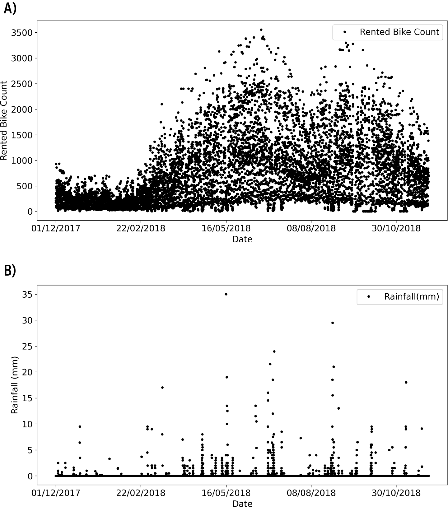

###### 图 12-1 散点图展示了一些数据

请注意，降雨量是一个稀疏变量——大部分是零，只有少量非零值。我们将在练习中再次回顾这一点。

图 12-2 展示了四个选定变量的相关矩阵。在开始统计分析之前检查相关矩阵总是个好主意，因为它将显示哪些变量（如果有的话）相关，并且可以显示数据中的错误（例如，如果两个看似不同的变量完全相关）。在这种情况下，我们看到自行车租赁次数与*小时*和*温度*呈正相关（人们在一天后期和天气更暖时租更多自行车），与*降雨量*呈负相关。（请注意，我这里没有展示统计显著性，因此这些解释是定性的。）

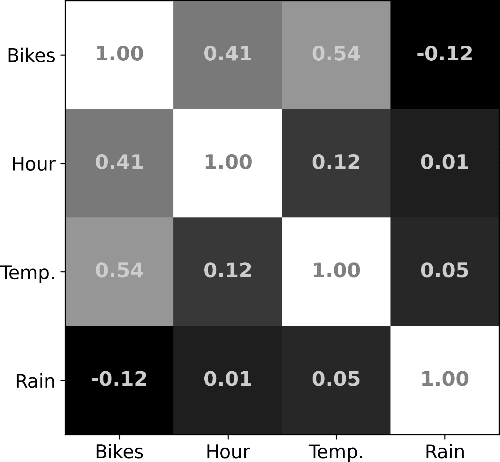

###### 图 12-2\. 四个选定变量的相关矩阵

在第一次分析中，我想基于降雨量和季节来预测自行车租赁次数。季节（冬季、春季、夏季、秋季）是数据集中的文本标签，我们需要将它们转换为数字进行分析。我们可以将四季转换为数字 1–4，但季节是循环的，而回归是线性的。有几种处理方式，包括使用方差分析（ANOVA）代替回归，使用独热编码（在深度学习模型中使用），或者对季节进行二值化处理。我将采取后者的方法，并将秋季和冬季标记为“0”，春季和夏季标记为“1”。解释是，正的 beta 系数表明春夏季节的自行车租赁次数比秋冬季节要多。

（旁注：一方面，我本可以通过选择仅连续变量来简化事情。但是我想强调的是，数据科学不仅仅是将公式应用于数据集；有许多非平凡的决策会影响您可以进行的分析类型，从而影响您可以获得的结果。）

图 12-3 的左侧展示了设计矩阵的图像化表示。这是设计矩阵的常见表示方式，因此请确保您能够舒适地解释它。列是回归器，行是观察结果。如果回归器处于非常不同的数值尺度，有时会对列进行归一化以便于视觉解释，尽管我在这里没有这样做。您可以看到降雨很稀疏，并且数据集跨越了两个秋冬季节（中间列的黑色区域）和一个春夏季节（中间的白色区域）。截距当然是纯白色，因为它对每个观察结果都采用相同的值。

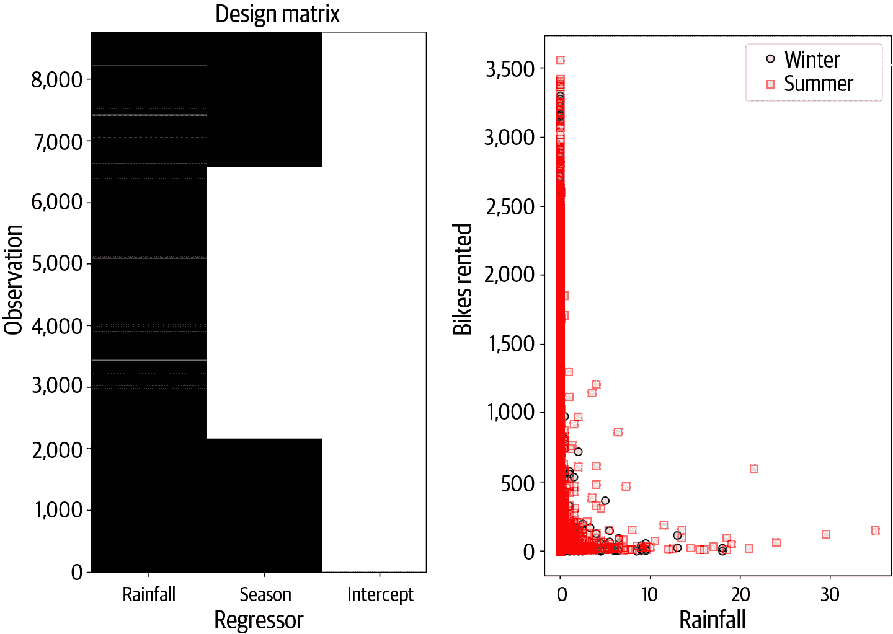

###### 图 12-3\. 设计矩阵和一些数据

图 12-3 的右侧显示了数据，将降雨量和租赁自行车分别绘制在两个季节上。显然，数据不在一条直线上，因为两个坐标轴上都有许多接近或等于零的值。换句话说，通过视觉检查数据表明变量之间的关系是非线性的，这意味着线性建模方法可能不够优化。再次强调，视觉检查数据和仔细选择合适的统计模型的重要性。

尽管如此，我们将使用最小二乘法拟合的线性模型继续前进。以下代码展示了我如何创建设计矩阵（变量`data`是一个 pandas 数据帧）：

```
# Create a design matrix and add an intercept
desmat = data[['Rainfall(mm)','Seasons']].to_numpy()
desmat = np.append(desmat,np.ones((desmat.shape[0],1)),axis=1)

# extract DV
y = data[['Rented Bike Count']].to_numpy()

# fit the model to the data using least squares
beta = np.linalg.lstsq(desmat,y,rcond=None)
```

*降雨量*和*季节*的β值分别为−80 和 369。这些数字表明，下雨时自行车租赁较少，春季/夏季比秋季/冬季租赁更多。

图 12-4 显示了预测与观察数据的对比，分别针对两个季节。如果模型完全拟合数据，点应该在具有斜率 1 的对角线上。显然，情况并非如此，这意味着模型并未很好地拟合数据。事实上，*R*²仅为 0.097（换句话说，统计模型解释数据变异约为 1%）。此外，你可以看到模型预测出了*负*自行车租赁数量，这是无法解释的——自行车租赁数量严格来说是非负数。

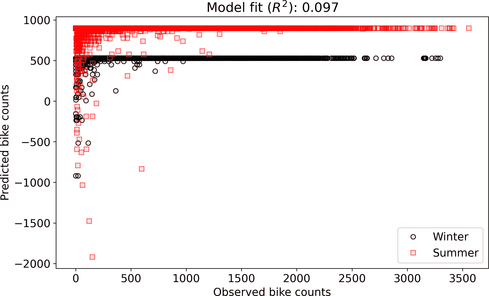

###### 图 12-4。预测与观察数据的散点图

到目前为止，在代码中我们没有收到任何警告或错误；在数学或编码方面我们没有做错任何事情。然而，我们使用的统计模型并不适合这个研究问题。你将有机会在练习 12-1 和练习 12-2 中改进它。

## 使用 statsmodels 的回归表

不深入统计学，我想向你展示如何使用 statsmodels 库创建回归表。该库使用 pandas 数据帧而不是 NumPy 数组。以下代码展示了如何设置和计算回归模型（OLS 代表*普通最小二乘法*）：

```
import statsmodels.api as sm

# extract data (staying with pandas dataframes)
desmat_df  = data[['Rainfall(mm)','Seasons']]
obsdata_df = data['Rented Bike Count']

# create and fit the model (must explicitly add intercept)
desmat_df = sm.add_constant(desmat_df)
model = sm.OLS(obsdata_df,desmat_df).fit()
print( model.summary() )
```

回归表包含大量信息。如果你不理解全部内容，没关系；你可以查看的关键项目是*R*²和回归系数(`coef`)：

```
==============================================================================
Dep. Variable:      Rented Bike Count   R-squared:                       0.097
Model:                            OLS   Adj. R-squared:                  0.097
Method:                 Least Squares   F-statistic:                     468.8
Date:                Wed, 26 Jan 2022   Prob (F-statistic):          3.80e-194
Time:                        08:40:31   Log-Likelihood:                -68654.
No. Observations:                8760   AIC:                         1.373e+05
Df Residuals:                    8757   BIC:                         1.373e+05
Df Model:                           2
Covariance Type:            nonrobust
================================================================================
                   coef    std err          t      P>|t|      [0.025      0.975]
================================================================================
const          530.4946      9.313     56.963      0.000     512.239     548.750
Rainfall(mm)   -80.5237      5.818    -13.841      0.000     -91.928     -69.120
Seasons        369.1267     13.127     28.121      0.000     343.395     394.858
==============================================================================
Omnibus:                     1497.901   Durbin-Watson:                   0.240
Prob(Omnibus):                  0.000   Jarque-Bera (JB):             2435.082
Skew:                           1.168   Prob(JB):                         0.00
Kurtosis:                       4.104   Cond. No.                         2.80
==============================================================================
```

## 多重共线性

如果你学过统计课程，可能听说过*多重共线性*这个术语。维基百科的定义是：“多元回归模型中的一个预测变量可以通过其他变量进行线性预测，并且预测精度相当高。”²

这意味着设计矩阵中存在线性依赖关系。在线性代数中，多重共线性只是*线性依赖*的一个花哨术语，意思是设计矩阵是降秩的或者是奇异的。

降秩的设计矩阵没有左逆，这意味着无法通过解析方法解决最小二乘问题。你将在 Exercise 12-3 中看到多重共线性的影响。

## 正则化

*正则化*是一个统称，指的是通过各种方式修改统计模型，以提高数值稳定性，将奇异或病态矩阵转换为满秩（从而可逆），或通过减少过拟合来提高泛化能力的目的。根据问题的性质和正则化的目标，有几种形式的正则化；你可能听说过的一些具体技术包括岭回归（又称 L2）、Lasso 回归（又称 L1）、Tikhonov 和收缩法。

不同的正则化技术有不同的工作方式，但许多正则化器通过某种程度的“移动”设计矩阵来实现。你可能还记得从 Chapter 5 中，移动矩阵意味着在对角线上添加某个常数，如<math alttext="bold upper A plus lamda bold upper I"><mrow><mi>𝐀</mi> <mo>+</mo> <mi>λ</mi> <mi>𝐈</mi></mrow></math>，以及从 Chapter 6 中，移动矩阵可以将降秩矩阵转换为满秩矩阵。

在本章中，我们将根据其 Frobenius 范数的某比例来对设计矩阵进行正则化。这修改了最小二乘解方程式 12-1。

##### 方程式 12-1\. 正则化

<math alttext="beta equals left-parenthesis bold upper X Superscript upper T Baseline bold upper X plus gamma parallel-to bold upper X parallel-to Subscript upper F Superscript 2 Baseline bold upper I right-parenthesis Superscript negative 1 Baseline bold upper X Superscript upper T Baseline bold y" display="block"><mrow><mrow><mi>β</mi> <mo>=</mo> <mo>(</mo></mrow> <msup><mi>𝐗</mi> <mtext>T</mtext></msup> <mi>𝐗</mi> <mo>+</mo> <msubsup><mrow><mi>γ</mi><mo>∥</mo><mi>𝐗</mi><mo>∥</mo></mrow> <mi>F</mi> <mn>2</mn></msubsup> <msup><mrow><mi>𝐈</mi><mo>)</mo></mrow> <mrow><mo>-</mo><mn>1</mn></mrow></msup> <msup><mi>𝐗</mi> <mtext>T</mtext></msup> <mi>𝐲</mi></mrow></math>

关键参数是<math alttext="gamma"><mi>γ</mi></math>（希腊字母*gamma*），它决定了正则化的程度（注意到<math alttext="gamma equals 0"><mrow><mi>γ</mi> <mo>=</mo> <mn>0</mn></mrow></math>意味着没有正则化）。选择适当的<math alttext="gamma"><mi>γ</mi></math>参数并非易事，通常通过交叉验证等统计技术来完成。

正则化最明显的效果是，如果设计矩阵是降秩的，那么正则化后的平方设计矩阵将是满秩的。正则化还会降低条件数，这是矩阵信息“分布”范围的度量（它是最大和最小奇异值的比值；你将在 Chapter 14 学到更多）。这提高了矩阵的数值稳定性。正则化的统计含义是通过减少模型对可能是异常值或非代表性数据点的敏感性来“平滑”解决方案，因此更不可能在新数据集中观察到。

为什么要按 Frobenius 范数的平方缩放？考虑指定的值<math alttext="gamma"><mi>γ</mi></math>，例如，<math alttext="gamma"><mi>γ</mi></math> = .01，可以根据矩阵中数值范围的不同对设计矩阵产生巨大或可忽略的影响。因此，我们按矩阵的数值范围进行缩放，这意味着我们将<math alttext="gamma"><mi>γ</mi></math>参数解释为*正则化的比例*。平方 Frobenius 范数的原因在于<math alttext="parallel-to bold upper X parallel-to equals parallel-to bold upper X Superscript upper T Baseline bold upper X parallel-to"><mrow><msubsup><mrow><mo>∥</mo><mi>𝐗</mi><mo>∥</mo></mrow> <mi>F</mi> <mn>2</mn></msubsup> <mo>=</mo> <msub><mrow><mo>∥</mo><msup><mi>𝐗</mi> <mtext>T</mtext></msup> <mi>𝐗</mi><mo>∥</mo></mrow> <mi>F</mi></msub></mrow></math>。换句话说，设计矩阵的平方范数等于设计矩阵与其转置的范数乘积。

实际上，通常使用设计矩阵的特征值平均值而不是 Frobenius 范数。在学习第十三章中的特征值后，您将能够比较这两种正则化方法。

在代码中实现正则化是练习 12-4 的重点。

# 多项式回归

*多项式回归*类似于普通回归，但独立变量是*x*轴值的高次幂。也就是说，设计矩阵的第*i*列定义为*x*^i，其中*x*通常是时间或空间，但也可以是其他变量，如药物剂量或人口。数学模型如下所示：

<math alttext="y equals beta 0 x Superscript 0 Baseline plus beta 1 x Superscript 1 Baseline plus period period period plus beta Subscript n Baseline x Superscript n" display="block"><mrow><mi>y</mi> <mo>=</mo> <msub><mi>β</mi> <mn>0</mn></msub> <msup><mi>x</mi> <mn>0</mn></msup> <mo>+</mo> <msub><mi>β</mi> <mn>1</mn></msub> <msup><mi>x</mi> <mn>1</mn></msup> <mo>+</mo> <mo>.</mo> <mo>.</mo> <mo>.</mo> <mo>+</mo> <msub><mi>β</mi> <mi>n</mi></msub> <msup><mi>x</mi> <mi>n</mi></msup></mrow></math>

请注意，<math alttext="x Superscript 0 Baseline equals 1"><mrow><msup><mi>x</mi> <mn>0</mn></msup> <mo>=</mo> <mn>1</mn></mrow></math>，这给了我们模型的截距。否则，它仍然是普通回归——目标是找到使预测数据与观测数据的平方差最小化的<math alttext="beta"><mi>β</mi></math>值。

多项式的*次数*是最高次幂*i*。例如，一个四阶多项式回归包含高达<math alttext="x Superscript 4"><msup><mi>x</mi> <mn>4</mn></msup></math>的项（如果没有<math alttext="x cubed"><msup><mi>x</mi> <mn>3</mn></msup></math>项，则仍然是一个四阶模型，其中<math alttext="beta 3 equals 0"><mrow><msub><mi>β</mi> <mn>3</mn></msub> <mo>=</mo> <mn>0</mn></mrow></math>）。

图 12-5 显示了三阶多项式的单个回归器和设计矩阵的示例（请记住，一个*n*次多项式包括拦截器在内的*n* + 1 个回归器）。多项式函数是建模观测数据的基础向量。

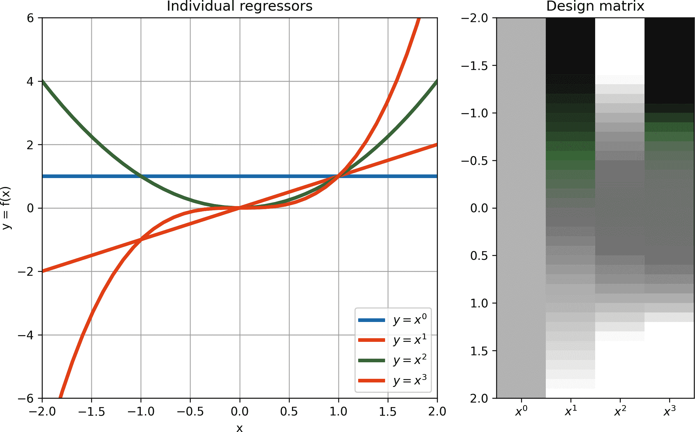

###### 图 12-5\. 多项式回归的设计矩阵

除了特殊的设计矩阵外，多项式回归与任何其他回归完全相同：使用左逆（或更稳定的计算替代方案）获得一组系数，使得回归器的加权组合（即预测数据）最能匹配观察数据。

多项式回归用于曲线拟合和逼近非线性函数。应用包括时间序列建模、人口动态、医学研究中的剂量-反应函数以及结构支撑梁的物理应力。多项式也可以用于表达二维结构，用于模拟地震传播和脑活动等空间结构。

背景足够了。让我们通过一个示例来工作。我选择的数据集来自人口翻倍模型。问题是“人类的人口翻倍需要多长时间（例如，从五亿到十亿）？”如果人口增长率本身正在增加（因为更多的人有更多的孩子，这些孩子长大后又会有更多的孩子），那么每次翻倍的时间将会减少。另一方面，如果人口增长放缓（人们生孩子的数量减少），那么连续翻倍的时间将会增加。

我在网上找到了一个相关的数据集。³ 这是一个小数据集，因此所有数字都可以在在线代码中找到，并显示在图 12-6 中。该数据集包括实际测量数据和对 2100 年的预测。这些对未来的预测基于多种假设，没有人确切知道未来会如何发展（这就是为什么你应该在未来的准备和享受当下之间找到平衡）。尽管如此，迄今数据显示，过去 500 年中人口的翻倍频率逐渐增加（至少如此），数据集的作者预测，这种翻倍速率在未来一个世纪内将略微增加。

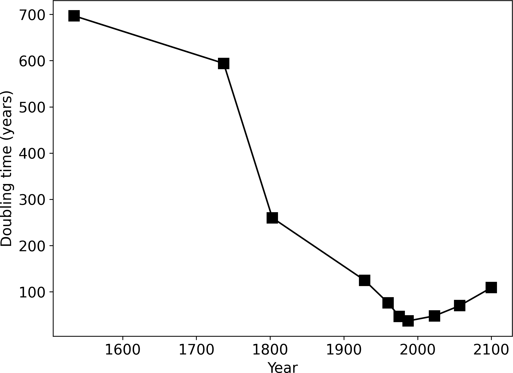

###### 图 12-6\. 数据图

我选择了三阶多项式来拟合数据，并使用以下代码创建和拟合了模型（变量`year`包含*x*轴坐标，变量`doubleTime`包含依赖变量）：

```
# design matrix
X = np.zeros((N,4))
for i in range(4):
  X[:,i] = np.array(year)**i

# fit the model and compute the predicted data
beta = np.linalg.lstsq(X,doubleTime, rcond=None)
yHat = X@beta[0]
```

图 12-7 显示了使用该代码创建的多项式回归预测数据。

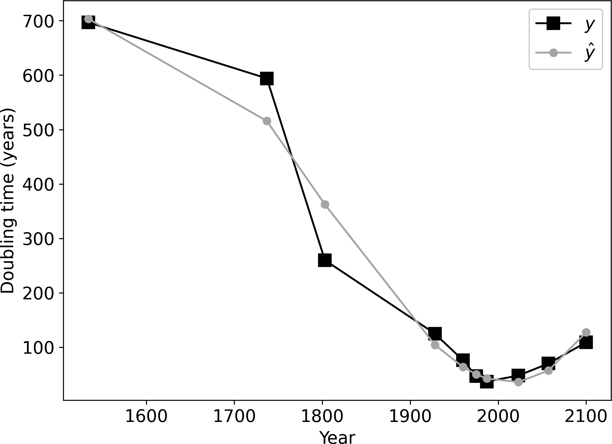

###### 图 12-7\. 数据图

该模型捕捉到了数据中的下降趋势和预期的上升趋势。 没有进一步的统计分析，我们不能说这是*最佳*模型或者说该模型在统计上显著拟合数据。 但是很明显，多项式回归非常适合拟合曲线。 你将继续探索这个模型和练习 12-5 中的数据，但我鼓励你通过测试不同的阶参数来玩弄生成图 12-7 的代码。

多项式回归通常被使用，并且 NumPy 有专用函数来创建和拟合这样的模型：

```
beta = np.polyfit(year,doubleTime,3) # 3rd order
yHat = np.polyval(beta,year)
```

# 用网格搜索找到模型参数

最小二乘法通过左逆来精确地将模型拟合到数据。 最小二乘法准确、快速且确定性（这意味着每次重新运行代码时，你都会得到相同的结果）。 但它仅适用于线性模型拟合，而不是所有模型都可以使用线性方法拟合。

在这一节中，我将向你介绍另一种用于识别模型参数的优化方法，称为*网格搜索*。 网格搜索通过对参数空间进行采样，计算每个参数值对数据的模型拟合，并选择给出最佳模型拟合的参数值。

作为一个简单的例子，让我们考虑函数<math alttext="y equals x squared"><mrow><mi>y</mi> <mo>=</mo> <msup><mi>x</mi> <mn>2</mn></msup></mrow></math>。 我们想找到该函数的最小值。 当然，我们已经知道最小值在<math alttext="x equals 0"><mrow><mi>x</mi> <mo>=</mo> <mn>0</mn></mrow></math>处；这有助于我们理解和评估网格搜索方法的结果。

在网格搜索技术中，我们从一个预定义的<math alttext="x"><mi>x</mi></math>值集合开始测试。 让我们使用集合(−2, −1, 0, 1, 2)。 这就是我们的“网格”。 然后我们计算每个网格值处的函数以获取*y* = (4, 1, 0, 1, 4)。 我们发现最小的*y*出现在<math alttext="x equals 0"><mrow><mi>x</mi> <mo>=</mo> <mn>0</mn></mrow></math> 。 在这种情况下，基于网格的解与真实解相同。

但是，网格搜索不能保证给出最优解。例如，假设我们的网格是（−2, −0.5, 1, 2.5）；函数值将为*y* = (4, 0.25, 1, 6.25)，我们将得出结论 <math display="inline"><mrow><mi>x</mi> <mo>=</mo> <mn>-.5</mn></mrow></math> 是使函数 <math alttext="y equals x squared"><mrow><mi>y</mi> <mo>=</mo> <msup><mi>x</mi> <mn>2</mn></msup></mrow></math> 最小化的参数值。这个结论“有点正确”，因为它是在指定网格内的最佳解。网格搜索的失败也可能来自于值范围选择不当。例如，假设我们的网格是（−1000, −990, −980, −970）；我们会得出结论 <math alttext="y equals x squared"><mrow><mi>y</mi> <mo>=</mo> <msup><mi>x</mi> <mn>2</mn></msup></mrow></math> 在 <math display="inline"><mrow><mi>x</mi> <mo>=</mo> <mrow><mo>-</mo> <mn>970</mn></mrow></mrow></math> 时最小化。

点在于范围和分辨率（格点之间的间距）都很重要，因为它们决定你是否会得到*最佳*解、*相当不错*的解或者*糟糕*的解。在上述玩具示例中，适当的范围和分辨率很容易确定。在复杂的、多变量的、非线性模型中，适当的网格搜索参数可能需要更多的工作和探索。

我在上一章的“快乐学生”数据上进行了网格搜索（提醒一下：这是来自虚假调查的虚假数据，显示出参加我的课程更多的人生活满意度更高）。这些数据的模型有两个参数——截距和斜率——因此，我们在可能的参数对的二维网格上评估该函数。结果显示在 图 12-8 中。

那个图表意味着什么，我们如何解释它？两个轴对应于参数的值，因此该图中的每个坐标创建了具有对应参数值的模型。然后，计算并存储每个模型对数据的拟合，并将其可视化为图像。

最适合数据的坐标（平方误差之和最小的）是最优参数集。图 12-8 也展示了使用最小二乘法的解析解。它们接近但不完全重叠。在 练习 12-6 中，您将有机会实现这个网格搜索，并探索网格分辨率对结果准确性的影响。

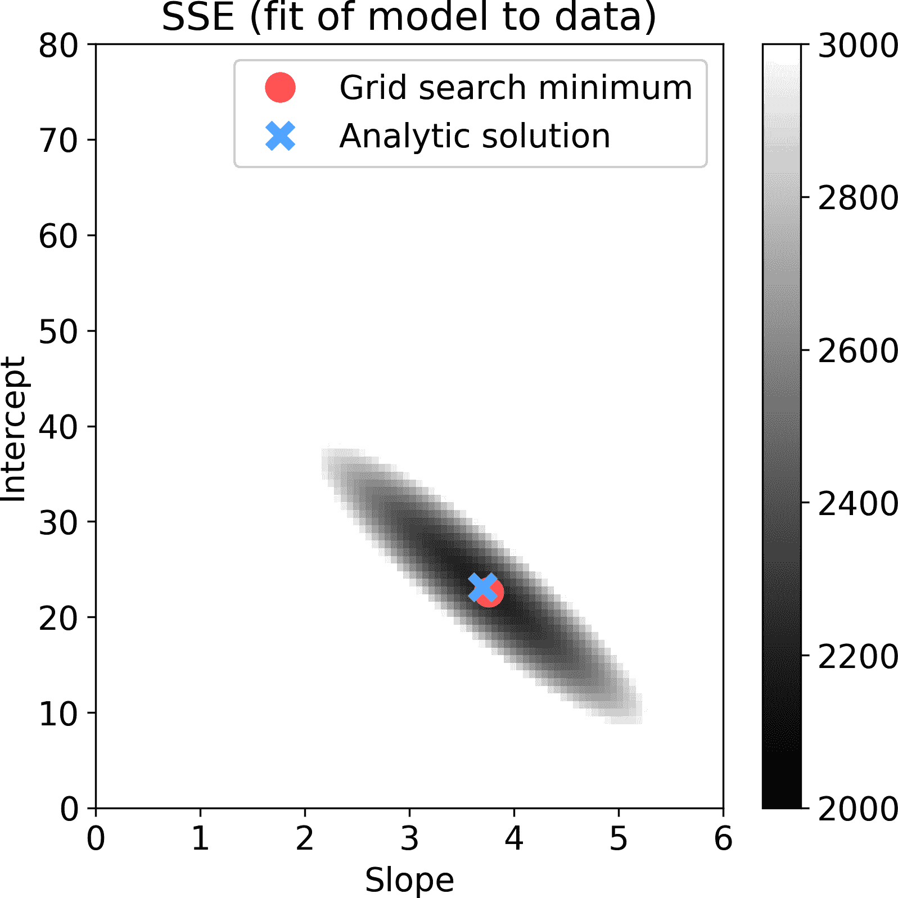

###### 图 12-8\. 在“快乐学生”数据集上进行网格搜索的结果。强度显示了拟合到数据的平方误差之和。

当最小二乘法更好且更快时，为什么会有人使用网格搜索呢？嗯，当最小二乘法是可行解决方案时，您永远不应该使用网格搜索方法。网格搜索是一种寻找非线性模型参数的有用技术，例如，用于识别深度学习模型中的超参数（*超参数*是研究人员选择的模型架构设计特征，而不是从数据中学习的）。对于大型模型来说，网格搜索可能是耗时的，但并行化可以使网格搜索变得更加可行。

结论是，当无法应用线性方法时，网格搜索是将模型拟合到数据的非线性方法。在您学习数据科学和机器学习的过程中，您还将了解到其他非线性方法，包括单纯形和支持深度学习的著名梯度下降算法。

# 总结

希望您喜欢阅读关于最小二乘法应用及与其他模型拟合方法比较的内容。以下练习是本章最重要的部分，因此我不想用长篇大论占用您的时间。以下是重点：

+   对数据进行视觉检查对于选择正确的统计模型和正确解释统计结果非常重要。

+   线性代数用于对数据集进行定量评估，包括相关矩阵。

+   您在第五章中学到的矩阵可视化方法对于检查设计矩阵非常有用。

+   数学概念有时在不同领域会有不同的名称。本章的一个例子是*多重共线性*，指的是设计矩阵中的线性依赖关系。

+   正则化涉及将设计矩阵“移动”一小部分，这可以增加数值稳定性并增加泛化新数据的可能性。

+   对线性代数有深入理解可以帮助您选择最合适的统计分析方法，解释结果，并预测可能出现的问题。

+   多项式回归与“常规”回归相同，但设计矩阵中的列定义为升高到不同幂的*x*轴值。多项式回归用于曲线拟合。

+   网格搜索是模型拟合的非线性方法。当模型是线性的时，最小二乘法是最优的方法。

# 代码练习

## 自行车租赁练习

##### 练习 12-1\.

或许在图 12-4 中负自行车租赁的问题部分可以通过消除无降雨日来缓解。重复分析并绘制这种分析的图表，但只选择具有零降雨的数据行。结果是否改善，以更高的*R*²和正预测租赁数量为评判标准？

##### 练习 12-2\.

因为 *seasons* 是一个分类变量，ANOVA 实际上比回归更合适作为统计模型。也许二元化的 *seasons* 缺乏预测自行车租赁的敏感性（例如，秋天可能有温暖的晴天和春天可能有寒冷的雨天），因此 *temperature* 可能是一个更好的预测变量。

在设计矩阵中用 *temperature* 替换 *seasons* 并重新运行回归（可以使用所有天数，而不仅仅是上一个练习中的无降雨天数），并重现 图 12-9。仍然存在预测负租赁的问题（这是因为模型的线性性），但 *R*² 更高，预测看起来质量更好。

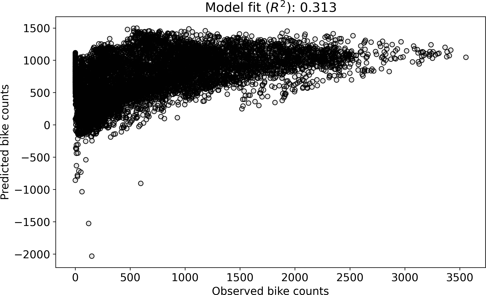

###### 图 12-9\. 练习 12-2 的结果

## 多重共线性练习

##### 练习 12-3\.

本练习延续了来自 练习 12-2 的模型。这个模型包含三个回归变量，包括截距项。创建一个新的设计矩阵，其中包含作为 *temperature* 和 *rainfall* 的某种线性加权组合定义的第四个回归变量。给这个设计矩阵起一个不同的变量名，因为你将在下一个练习中用到它。确认设计矩阵有四列，但秩为 3，并计算设计矩阵的相关矩阵。

请注意，根据这两个变量的权重，即使存在线性依赖，你也不应该期望得到 1 的相关性；在这里，也不应该期望重现确切的相关性：

```
Design matrix size: (8760, 4)
Design matrix rank: 3

Design matrix correlation matrix:
[[1.      0.05028     nan 0.7057 ]
 [0.05028 1.          nan 0.74309]
 [    nan     nan     nan     nan]
 [0.7057  0.74309     nan 1.     ]]
```

使用三种不同的编码方法拟合模型：(1) 直接实现，使用你在前一章学到的左逆，(2) 使用 NumPy 的 `lstsqr` 函数，以及 (3) 使用 `statsmodels`。对于这三种方法，计算 *R*² 和回归系数。按如下格式打印结果。在一个降秩设计矩阵上，`np.linalg.inv` 的数值不稳定性显而易见。

```
MODEL FIT TO DATA:
  Left-inverse: 0.0615
  np lstsqr   : 0.3126
  statsmodels : 0.3126

BETA COEFFICIENTS:
  Left-inverse: [[-1528.071   11.277   337.483   5.537 ]]
  np lstsqr   : [[  -87.632    7.506   337.483   5.234 ]]
  statsmodels : [   -87.632    7.506   337.483   5.234 ]
```

附注：Python 没有给出任何错误或警告消息；即使设计矩阵明显有问题，Python 也只是简单地给出了输出。我们可以讨论这样做的优点，但这个例子再次突显了理解数据科学的线性代数的重要性，良好的数据科学不仅仅是了解数学。

## 正则化练习

##### 练习 12-4\.

在这里，您将探索正则化对您在上一个练习中创建的降秩设计矩阵的影响。首先，实现 <math alttext="left-parenthesis bold upper X Superscript upper T Baseline bold upper X plus gamma parallel-to bold upper X parallel-to Subscript upper F Superscript 2 Baseline bold upper I right-parenthesis Superscript negative 1"><mrow><mrow><mo>(</mo></mrow> <msup><mi>𝐗</mi> <mtext>T</mtext></msup> <mi>𝐗</mi> <mo>+</mo> <msubsup><mrow><mi>γ</mi><mo>∥</mo><mi>𝐗</mi><mo>∥</mo></mrow> <mi>F</mi> <mn>2</mn></msubsup> <msup><mrow><mi>𝐈</mi><mo>)</mo></mrow> <mrow><mo>-</mo><mn>1</mn></mrow></msup></mrow></math> ，使用 <math alttext="gamma equals 0"><mrow><mi>γ</mi> <mo>=</mo> <mn>0</mn></mrow></math> 和 <math display="inline"><mrow><mi>γ</mi><mo>=</mo><mn>.01</mn></mrow></math>。打印出两个矩阵的大小和秩。这里是我的结果（有趣的是看到秩-3 设计矩阵如此数值不稳定，其“逆”实际上是秩-2）：

```
inv(X'X + 0.0*I) size: (4, 4)
inv(X'X + 0.0*I) rank: 2

inv(X'X + 0.01*I) size: (4, 4)
inv(X'X + 0.01*I) rank: 4
```

现在进行实验。这里的目标是探索正则化对模型对数据的拟合效果的影响。编写代码，使用带有和不带有多重共线性的设计矩阵的最小二乘法计算数据的拟合 *R*²。将该代码放入一个 `for` 循环中，实现从 0 到 .2 的一系列 <math alttext="gamma"><mi>γ</mi></math> 值。然后像 Figure 12-10 那样展示结果。

顺便说一句，对于完全秩的设计矩阵来说，随着正则化的增加，模型的拟合程度会降低—事实上，正则化的目的是使模型对数据的敏感性降低。重要的问题是正则化是否改善了对测试数据集或在拟合模型时排除的验证折叠的拟合。如果正则化是有益的，您预期正则化模型的泛化能力会在某个 <math alttext="gamma"><mi>γ</mi></math> 值上增加，然后再次降低。这是您在专门的统计或机器学习书籍中会了解到的细节水平，尽管您将在 Chapter 15 中学习交叉验证的编码。

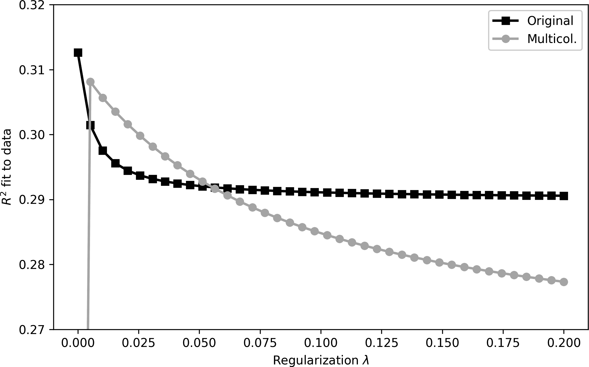

###### Figure 12-10\. Exercise 12-4 的结果

## 多项式回归练习

##### Exercise 12-5\.

这个练习的目的是使用从零到九的一系列阶数拟合多项式回归。在 `for` 循环中，重新计算回归和预测数据值。展示类似于 Figure 12-11 的结果。

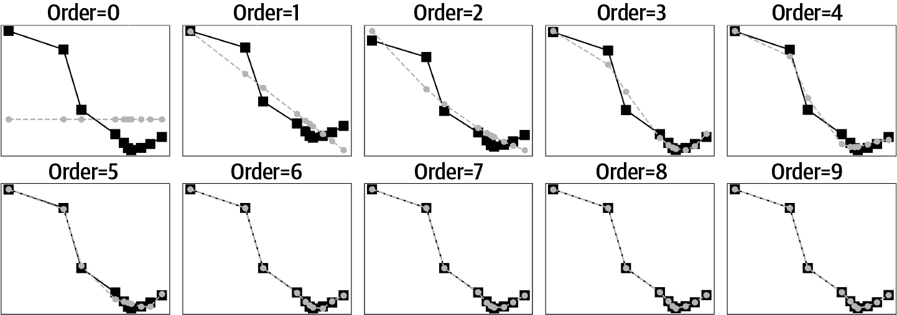

###### Figure 12-11\. Exercise 12-5 的结果

这个练习突出了欠拟合和过拟合的问题。参数过少的模型在预测数据时表现不佳。另一方面，参数过多的模型过度拟合数据，并且风险过于敏感于噪声并且无法泛化到新数据。寻找欠拟合和过拟合之间平衡的策略包括交叉验证和贝叶斯信息准则；这些是您在机器学习或统计书籍中学习的主题。

## 网格搜索练习

##### 练习 12-6\.

这里的目标很简单：按照围绕图表周围给出的指示重现 Figure 12-8。打印出回归系数以进行比较。例如，使用网格分辨率参数设置为 50 得到了以下结果：

```
Analytic result:
   Intercept: 23.13, slope: 3.70

Empirical result:
   Intercept: 22.86, slope: 3.67
```

一旦您有了可运行的代码，请尝试几个不同的分辨率参数。我使用分辨率为 100 制作了 Figure 12-8；您还应尝试其他值，例如 20 或 500。同时注意更高分辨率值的计算时间——这只是一个双参数模型！对于一个 10 参数模型的详尽高分辨率网格搜索极其计算密集。

##### 练习 12-7\.

您已经了解了两种不同的方法来评估模型对数据的拟合度：平方误差和 *R*²。在前一个练习中，您使用了平方误差来评估模型对数据的拟合度；在这个练习中，您将确定 *R*² 是否同样可行。

这个练习的编码部分很简单：修改上一个练习的代码，计算 *R*² 而不是 SSE（确保修改代码的副本而不是覆盖上一个练习的代码）。

现在是具有挑战性的部分：您会发现 *R*² 很糟糕！它给出了完全错误的答案。您的任务是找出其中的原因（在线代码解决方案中包含了对这一点的讨论）。提示：存储每个参数对的预测数据，以便您可以检查预测值，然后与观察数据进行比较。

¹ V E Sathishkumar, Jangwoo Park 和 Yongyun Cho，“Using Data Mining Techniques for Bike Sharing Demand Prediction in Metropolitan City,” *Computer Communications*, 153, (2020 年 3 月): 353–366，数据下载自 [*https://archive.ics.uci.edu/ml/datasets/Seoul+Bike+Sharing+Demand*](https://archive.ics.uci.edu/ml/datasets/Seoul+Bike+Sharing+Demand).

² Wikipedia，s.v. “multicollinearity”，[*https://en.wikipedia.org/wiki/Multicollinearity*](https://en.wikipedia.org/wiki/Multicollinearity).

³ Max Roser, Hannah Ritchie 和 Esteban Ortiz-Ospina，“World Population Growth,” OurWorldInData.org, 2013，[*https://ourworldindata.org/world-population-growth*](https://ourworldindata.org/world-population-growth).

⁴ 如果你遇到 Python 错误，可能需要重新运行之前的代码，然后重新创建设计矩阵变量。
