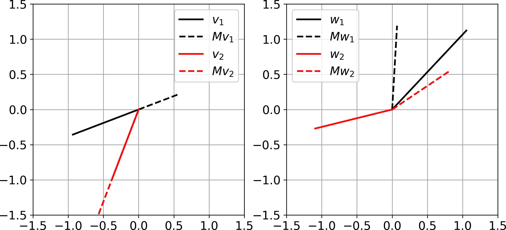
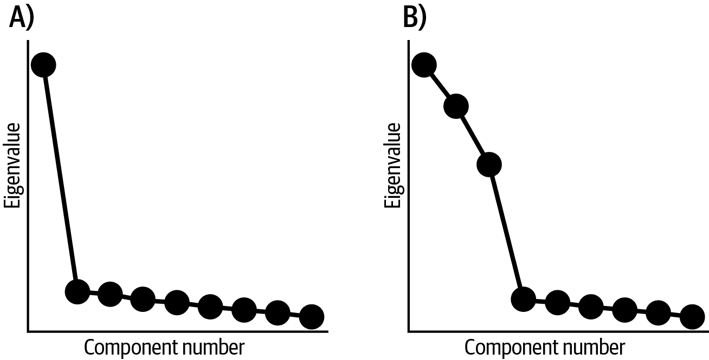
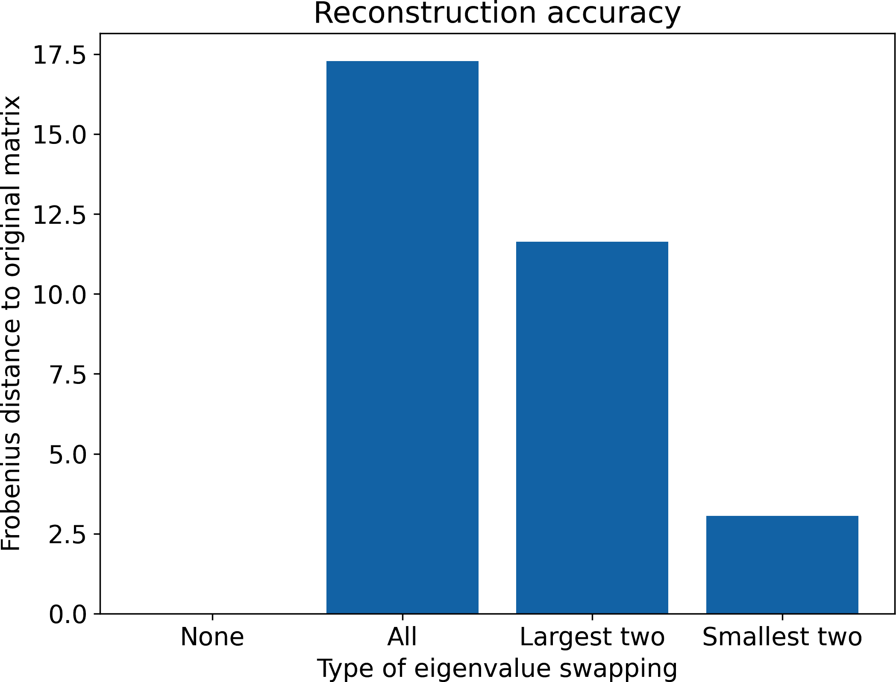
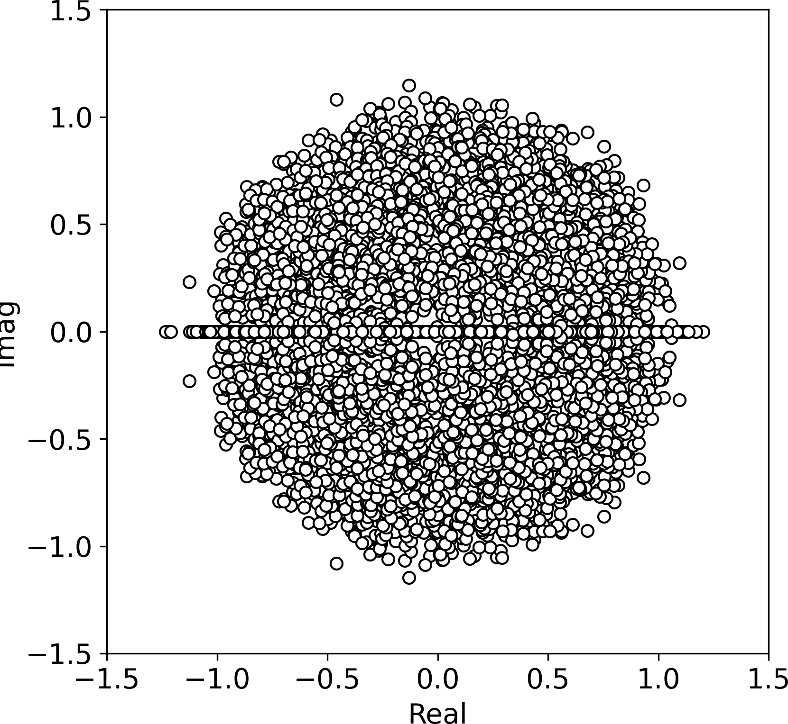

# 第十三章：特征分解

特征分解是线性代数中的一颗明珠。那么，什么是明珠呢？让我直接引用《海底两万里》中的一段话：

> 对于诗人来说，珍珠是海洋之泪；对东方人来说，它是凝固了的露珠滴；对女士们来说，它是可以戴在手指、颈部和耳朵上的珠宝，呈椭圆形，具有玻璃般的光泽，由珍珠母形成；对化学家来说，它是一种含有少量明胶蛋白的磷酸钙和碳酸钙的混合物；最后，对于自然学家来说，它是某些双壳类动物产生母珍珠的简单腐败分泌物。
> 
> 朱尔·凡尔纳

关键在于，相同的对象可以根据其用途以不同方式看待。特征分解也是如此：特征分解有几何解释（旋转不变性的轴）、统计解释（最大协方差的方向）、动力系统解释（稳定系统状态）、图论解释（节点在网络中的影响）、金融市场解释（识别共变的股票）等等。

特征分解（以及奇异值分解，正如你将在下一章学到的那样，与特征分解密切相关）是线性代数对数据科学的最重要贡献之一。本章的目的是为你提供特征值和特征向量的直观理解——矩阵特征分解的结果。在这过程中，你将学到对称矩阵的对角化和更多特殊性质。在第十四章中扩展到奇异值分解后，你将看到特征分解在第十五章中的几个应用。

# [特征值和特征向量的解释](https://example.org/eigenvalues_and_eigenvectors_interpretations)

有几种解释特征值/向量的方式，我将在接下来的部分中描述。当然，无论如何，数学都是相同的，但多视角可以促进直觉，进而帮助你理解为什么特征分解在数据科学中如此重要。

## 几何学

我实际上已经在第五章中向你介绍了特征向量的几何概念。在图 5-5 中，我们发现有一种特殊的矩阵和向量的组合，使得矩阵*拉伸*了这个向量，但没有*旋转*。那个向量是矩阵的特征向量，而拉伸的程度是特征值。

图 13-1 展示了在 <math alttext="2 times 2"><mrow><mn>2</mn> <mo>×</mo> <mn>2</mn></mrow></math> 矩阵后乘以前后两个向量的情况。左图中的两个向量（ <math alttext="粗体 v 1 和粗体 v 2"><mrow><msub><mi>𝐯</mi> <mn>1</mn></msub> <mtext>和</mtext> <msub><mi>𝐯</mi> <mn>2</mn></msub></mrow></math> ）是特征向量，而右图中的两个向量则不是。特征向量在矩阵后乘之前后指向相同方向。特征值编码了拉伸的量；试着通过视觉检查图表猜测特征值。答案在脚注中。¹

这就是几何图像：特征向量意味着矩阵-向量乘法的效果类似于标量-向量乘法。让我们看看能否用方程表示出来（我们可以，并且它在 方程式 13-1 中打印出来）。

##### 方程式 13-1\. 特征值方程

<math alttext="bold upper A bold v equals lamda bold v" display="block"><mrow><mi>𝐀</mi> <mi>𝐯</mi> <mo>=</mo> <mi>λ</mi> <mi>𝐯</mi></mrow></math>

在解释这个方程时要小心：它并不是说矩阵*等于*标量；它说的是矩阵对向量的*作用*与标量对同一向量的*作用*是相同的。



###### 图 13-1\. 特征向量的几何形状

这被称为*特征值方程*，它是线性代数中另一个值得记忆的关键公式。在本章中你会看到它，接下来的章节中会看到稍微变化的形式，以及在学习多变量统计、信号处理、优化、图论以及许多其他应用中会看到它，这些应用中跨多个同时记录的特征识别出模式。

## 统计学（主成分分析）

人们应用统计的原因之一是识别和量化变量之间的关系。例如，全球温度上升与海盗数量下降相关，² 但这种关系有多强？当然，当你只有两个变量时，像你在 第四章 中学到的简单相关就足够了。但在包含数十个或数百个变量的多变量数据集中，双变量相关性无法揭示全局模式。

让我们通过一个例子来具体化这个概念。加密货币是数字价值存储，编码在区块链中，这是一种跟踪交易的系统。你可能听说过比特币和以太坊；还有成千上万其他具有各种目的的加密币。我们可以询问整个加密空间是否作为一个单一系统运作（意味着所有币值同时上下波动），或者在该空间内是否存在独立的子类别（意味着一些币或一些币组独立于其他币的价值变化）。

我们可以通过对包含各种加密货币价格的数据集执行主成分分析来测试这个假设。如果整个加密市场像一个单一实体运作，那么*屏风图*（数据集协方差矩阵特征值的图表）将显示一个成分占系统方差的大部分，而所有其他成分则占极少的方差（图 A 在图 13-2 中）。相反，如果加密市场有三个主要子类别具有独立的价格变动，则我们预计会看到三个较大的特征值（图 B 在图 13-2 中）。



###### 图 13-2\. 模拟多变量数据集的屏风图（数据模拟以说明结果可能性）

## 噪声减少

大多数数据集包含噪声。*噪声*是指数据集中未解释的（例如随机变化）或不需要的（例如无线电信号中的电气线噪声伪影）方差。有许多方式可以减弱或消除噪声，最佳的噪声减少策略取决于噪声的性质和来源，以及信号的特征。

减少随机噪音的一种方法是识别系统的特征值和特征向量，并在数据空间中与小特征值相关联的方向上“投影出”这些特征。假设随机噪声对总方差的贡献相对较小。在设置一些低于某个阈值的特征值为零后，"投影出"数据维度意味着重建数据集。

您将在第十五章中看到使用特征分解来减少噪音的示例。

## 维度降低（数据压缩）

像电话、互联网和电视这样的信息通信技术创造和传输大量数据，如图片和视频。传输数据可能耗时且昂贵，因此在传输之前进行*压缩*是有益的。压缩意味着减少数据的大小（以字节为单位），同时对数据质量影响最小。例如，TIFF 格式的图像文件可能为 10 MB，而转换为 JPG 格式后的版本可能只有 0.1 MB，同时保持相对良好的质量。

降低数据集维度的一种方法是进行其特征分解，舍弃与数据空间中小方向相关的特征值和特征向量，然后仅传输相对较大的特征向量/值对。实际上，使用 SVD 进行数据压缩更为常见（您将在第十五章中看到一个例子），尽管原理是相同的。

现代数据压缩算法实际上比先前描述的方法更快更高效，但思想是相同的：将数据集分解为捕获数据最重要特征的一组基向量，然后重建原始数据的高质量版本。

# 查找特征值

要对一个方阵进行特征分解，首先找到特征值，然后使用每个特征值找到其对应的特征向量。特征值就像是你插入矩阵中以解锁神秘特征向量的钥匙。

在 Python 中查找矩阵的特征值非常容易：

```
matrix = np.array([
             [1,2],
             [3,4]
             ])

# get the eigenvalues
evals = np.linalg.eig(matrix)[0]
```

两个特征值（四舍五入到最接近的百分之一）分别是−0.37 和 5.37。

但重要的问题不是*哪个函数返回特征值*；相反，重要的问题是*如何识别矩阵的特征值*？

要找到矩阵的特征值，我们从 Equation 13-1 中显示的特征值方程式开始，并进行一些简单的算术操作，如 Equation 13-2 所示。

##### 方程式 13-2。特征值方程式，重新组织

<math alttext="StartLayout 1st Row 1st Column bold upper A bold v 2nd Column equals lamda bold v 2nd Row 1st Column bold upper A bold v minus lamda bold v 2nd Column equals bold 0 3rd Row 1st Column left-parenthesis bold upper A minus lamda bold upper I right-parenthesis bold v 2nd Column equals bold 0 EndLayout" display="block"><mtable displaystyle="true"><mtr><mtd columnalign="right"><mrow><mi>𝐀</mi> <mi>𝐯</mi></mrow></mtd> <mtd columnalign="left"><mrow><mo>=</mo> <mi>λ</mi> <mi>𝐯</mi></mrow></mtd></mtr> <mtr><mtd columnalign="right"><mrow><mi>𝐀</mi> <mi>𝐯</mi> <mo>-</mo> <mi>λ</mi> <mi>𝐯</mi></mrow></mtd> <mtd columnalign="left"><mrow><mo>=</mo> <mn mathvariant="bold">0</mn></mrow></mtd></mtr> <mtr><mtd columnalign="right"><mrow><mo>(</mo> <mi>𝐀</mi> <mo>-</mo> <mi>λ</mi> <mi>𝐈</mi> <mo>)</mo> <mi>𝐯</mi></mrow></mtd> <mtd columnalign="left"><mrow><mo>=</mo> <mn mathvariant="bold">0</mn></mrow></mtd></mtr></mtable></math>

第一个方程式完全重复了特征值方程式。在第二个方程式中，我们简单地减去右侧以使方程式等于零向量。

从第二个方程式到第三个方程式的过渡需要一些解释。第二个方程式的左侧有两个向量项，都涉及<math alttext="bold v"><mi>𝐯</mi></math>。因此，我们将向量因子化。但这样做会导致我们减去一个矩阵和一个标量（<math alttext="bold upper A minus lamda"><mrow><mi>𝐀</mi> <mo>-</mo> <mi>λ</mi></mrow></math>），这在线性代数中不是一个定义良好的操作。³ 因此，我们改为将矩阵*平移*<math alttext="lamda"><mi>λ</mi></math>。这就得到了第三个方程式。（旁注：表达式<math alttext="lamda bold upper I"><mrow><mi>λ</mi> <mi>𝐈</mi></mrow></math>有时称为*标量矩阵*。）

第三个方程式是什么意思？它意味着*特征向量位于其特征值平移的矩阵的零空间中*。

如果这有助于你理解特征向量作为矩阵平移后的零空间向量的概念，你可以考虑添加两个额外的方程式：

<math alttext="StartLayout 1st Row 1st Column bold upper A overTilde 2nd Column equals bold upper A minus lamda bold upper I 2nd Row 1st Column bold upper A overTilde bold v 2nd Column equals bold 0 EndLayout" display="block"><mtable displaystyle="true"><mtr><mtd columnalign="right"><mover accent="true"><mi>𝐀</mi> <mo>˜</mo></mover></mtd> <mtd columnalign="left"><mrow><mo>=</mo> <mi>𝐀</mi> <mo>-</mo> <mi>λ</mi> <mi>𝐈</mi></mrow></mtd></mtr> <mtr><mtd columnalign="right"><mrow><mover accent="true"><mi>𝐀</mi> <mo>˜</mo></mover> <mi>𝐯</mi></mrow></mtd> <mtd columnalign="left"><mrow><mo>=</mo> <mn mathvariant="bold">0</mn></mrow></mtd></mtr></mtable></math>

为什么这个陈述如此具有洞察力？请记住，在线性代数中我们忽略平凡解，因此我们不认为<math alttext="bold v equals bold 0"><mrow><mi>𝐯</mi> <mo>=</mo> <mn mathvariant="bold">0</mn></mrow></math>是一个特征向量。这意味着矩阵经过其特征值平移后是奇异的，因为只有奇异矩阵才有一个非平凡的零空间。

还有关于奇异矩阵我们知道什么？我们知道它们的行列式为零。因此：

<math alttext="StartAbsoluteValue bold upper A minus lamda bold upper I EndAbsoluteValue equals 0" display="block"><mrow><mo>|</mo> <mi>𝐀</mi> <mo>-</mo> <mi>λ</mi> <mi>𝐈</mi> <mo>|</mo> <mo>=</mo> <mn>0</mn></mrow></math>

信不信由你，这就是找到特征值的关键：将矩阵平移至未知特征值<math alttext="lamda"><mi>λ</mi></math>，将其行列式设为零，并解出<math alttext="lamda"><mi>λ</mi></math>。让我们看看对于一个<math alttext="2 times 2"><mrow><mn>2</mn> <mo>×</mo> <mn>2</mn></mrow></math>矩阵，这是什么样子：

<math alttext="StartLayout 1st Row 1st Column StartAbsoluteValue Start 2 By 2 Matrix 1st Row 1st Column a 2nd Column b 2nd Row 1st Column c 2nd Column d EndMatrix minus lamda Start 2 By 2 Matrix 1st Row 1st Column 1 2nd Column 0 2nd Row 1st Column 0 2nd Column 1 EndMatrix EndAbsoluteValue equals 2nd Column 0 2nd Row 1st Column Start 2 By 2 Determinant 1st Row 1st Column a minus lamda 2nd Column b 2nd Row 1st Column c 2nd Column d minus lamda EndDeterminant equals 2nd Column 0 3rd Row 1st Column left-parenthesis a minus lamda right-parenthesis left-parenthesis d minus lamda right-parenthesis minus b c equals 2nd Column 0 4th Row 1st Column lamda squared minus left-parenthesis a plus d right-parenthesis lamda plus left-parenthesis a d minus b c right-parenthesis equals 2nd Column 0 EndLayout" display="block"><mtable displaystyle="true"><mtr><mtd columnalign="right"><mrow><mfenced close="|" open="|" separators=""><mfenced close="]" open="["><mtable><mtr><mtd><mi>a</mi></mtd> <mtd><mi>b</mi></mtd></mtr> <mtr><mtd><mi>c</mi></mtd> <mtd><mi>d</mi></mtd></mtr></mtable></mfenced> <mo>-</mo> <mi>λ</mi> <mfenced close="]" open="["><mtable><mtr><mtd><mn>1</mn></mtd> <mtd><mn>0</mn></mtd></mtr> <mtr><mtd><mn>0</mn></mtd> <mtd><mn>1</mn></mtd></mtr></mtable></mfenced></mfenced> <mo>=</mo></mrow></mtd> <mtd columnalign="left"><mrow><mn>0</mn></mrow></mtd></mtr> <mtr><mtd columnalign="right"><mrow><mfenced close="|" open="|"><mtable><mtr><mtd><mrow><mi>a</mi> <mo>-</mo> <mi>λ</mi></mrow></mtd> <mtd><mi>b</mi></mtd></mtr> <mtr><mtd><mi>c</mi></mtd> <mtd><mrow><mi>d</mi> <mo>-</mo> <mi>λ</mi></mrow></mtd></mtr></mtable></mfenced> <mo>=</mo></mrow></mtd> <mtd columnalign="left"><mrow><mn>0</mn></mrow></mtd></mtr> <mtr><mtd columnalign="right"><mrow><mo>(</mo> <mi>a</mi> <mo>-</mo> <mi>λ</mi> <mo>)</mo> <mo>(</mo> <mi>d</mi> <mo>-</mo> <mi>λ</mi> <mo>)</mo> <mo>-</mo> <mi>b</mi> <mi>c</mi> <mo>=</mo></mrow></mtd> <mtd columnalign="left"><mrow><mn>0</mn></mrow></mtd></mtr> <mtr><mtd columnalign="right"><mrow><msup><mi>λ</mi> <mn>2</mn></msup> <mo>-</mo> <mrow><mo>(</mo> <mi>a</mi> <mo>+</mo> <mi>d</mi> <mo>)</mo></mrow> <mi>λ</mi> <mo>+</mo> <mrow><mo>(</mo> <mi>a</mi> <mi>d</mi> <mo>-</mo> <mi>b</mi> <mi>c</mi> <mo>)</mo></mrow> <mo>=</mo></mrow></mtd> <mtd columnalign="left"><mrow><mn>0</mn></mrow></mtd></mtr></mtable></math>

你可以应用二次方程式来求解两个<math alttext="lamda"><mi>λ</mi></math>值。但答案本身并不重要；重要的是看到本书前面建立的数学概念的逻辑进展：

+   矩阵-向量乘法的作用类似标量-向量乘法（特征值方程）。

+   我们将特征值方程设为零向量，并提取公共项。

+   这揭示了特征向量位于被特征值移位的矩阵的零空间中。我们不认为零向量是特征向量，这意味着移位矩阵是奇异的。

+   因此，我们将移位矩阵的行列式设为零，并求解未知的特征值。

特征值移位矩阵的行列式设为零被称为矩阵的*特征多项式*。

注意，在前面的例子中，我们从一个<math alttext="2 times 2"><mrow><mn>2</mn> <mo>×</mo> <mn>2</mn></mrow></math>矩阵开始，得到了一个<math alttext="lamda squared"><msup><mi>λ</mi> <mn>2</mn></msup></math>项，这意味着这是一个二次多项式方程。你可能还记得从高中代数课上，一个*n*次多项式有*n*个解，其中一些可能是复数（这被称为代数基本定理）。因此，会有两个<math alttext="lamda"><mi>λ</mi></math>值满足方程。

匹配的 2 并非巧合：一个<math alttext="upper M times upper M"><mrow><mi>M</mi> <mo>×</mo> <mi>M</mi></mrow></math>矩阵的特征多项式将有一个<math alttext="lamda Superscript upper M"><msup><mi>λ</mi> <mi>M</mi></msup></math>项。这是为什么<math alttext="upper M times upper M"><mrow><mi>M</mi> <mo>×</mo> <mi>M</mi></mrow></math>矩阵会有*M*个特征值的原因。

# 繁琐的练习问题

在传统线性代数教材中的这一点上，你会被要求手动找出数十个<math alttext="2 times 2"><mrow><mn>2</mn> <mo>×</mo> <mn>2</mn></mrow></math>和<math alttext="3 times 3"><mrow><mn>3</mn> <mo>×</mo> <mn>3</mn></mrow></math>矩阵的特征值。我对这类练习有着复杂的感受：一方面，通过手工解决问题确实有助于内化找特征值的机制；但另一方面，我希望本书侧重于概念、代码和应用，而不要被繁琐的算术问题所困扰。如果你有兴趣手工解决特征值问题，那就去做吧！你可以在传统教材或在线上找到大量这类问题。但我做出了大胆（也许是有争议的）决定，避免在本书中手动解决问题，而是进行侧重于编码和理解的练习。

# 寻找特征向量

和特征值一样，在 Python 中找到特征向量是非常容易的：

```
evals,evecs = np.linalg.eig(matrix)
print(evals), print(evecs)

    [-0.37228132  5.37228132]

    [[-0.82456484 -0.41597356]
     [ 0.56576746 -0.90937671]]
```

特征向量位于矩阵`evecs`的列中，并且与特征值的顺序相同（即，矩阵`evecs`的第一列中的特征向量与向量`evals`中的第一个特征值配对）。我喜欢使用变量名`evals`和`evecs`，因为它们简短而有意义。你可能还会看到人们使用变量名`L`和`V`或`D`和`V`。`L`代表<math alttext="normal upper Lamda"><mi>Λ</mi></math>（<math alttext="lamda"><mi>λ</mi></math>的大写形式），`V`代表<math alttext="bold upper V"><mi>𝐕</mi></math>，即矩阵，其中每列*i*是特征向量<math alttext="bold v Subscript i"><msub><mi>𝐯</mi><mi>i</mi></msub></math> 。`D`代表*对角线*，因为特征值通常存储在对角线矩阵中，我稍后将在本章解释原因。

# 特征向量在列中，而不是行中！

编码时关于特征向量最重要的事情是它们存储在*矩阵的列中*，而不是行中！在使用方阵时很容易犯这种维度索引错误（因为可能不会收到 Python 错误），但是在应用中意外地使用特征向量矩阵的行而不是列可能会产生灾难性后果。如有疑问，请记住第二章中的讨论，线性代数中的常见约定是假定向量是列向量。

好的，但再次强调，前面的代码展示了如何使 NumPy 函数返回矩阵的特征向量。你可以从`np.linalg.eig`的文档字符串中学到这一点。重要的问题是*特征向量来自哪里，我们如何找到它们？*

实际上，我已经写过如何找到特征向量：找到矩阵通过<math alttext="lamda"><mi>λ</mi></math>移位后的零空间向量<math alttext="bold v"><mi>𝐯</mi></math> 。换句话说：

<math alttext="bold v Subscript i Baseline element-of upper N left-parenthesis bold upper A minus lamda Subscript i Baseline bold upper I right-parenthesis" display="block"><mrow><msub><mi>𝐯</mi> <mi>i</mi></msub> <mo>∈</mo> <mi>N</mi> <mrow><mo>(</mo> <mi>𝐀</mi> <mo>-</mo> <msub><mi>λ</mi> <mi>i</mi></msub> <mi>𝐈</mi> <mo>)</mo></mrow></mrow></math>

让我们看一个数值例子。以下是一个矩阵及其特征值：

<math display="block"><mrow><mfenced close="]" open="["><mtable><mtr><mtd><mn>1</mn></mtd> <mtd><mn>2</mn></mtd></mtr> <mtr><mtd><mn>2</mn></mtd> <mtd><mn>1</mn></mtd></mtr></mtable></mfenced> <mo>⇒</mo> <msub><mi>λ</mi> <mn>1</mn></msub> <mo>=</mo> <mn>3</mn> <mo>,</mo> <msub><mi>λ</mi> <mn>2</mn></msub> <mo>=</mo> <mrow><mo>-</mo> <mn>1</mn></mrow></mrow></math>

让我们专注于第一个特征值。为了揭示其特征向量，我们将矩阵移位 3，并找到其零空间中的向量：

<math alttext="Start 2 By 2 Matrix 1st Row 1st Column 1 minus 3 2nd Column 2 2nd Row 1st Column 2 2nd Column 1 minus 3 EndMatrix equals Start 2 By 2 Matrix 1st Row 1st Column negative 2 2nd Column 2 2nd Row 1st Column 2 2nd Column negative 2 EndMatrix right double arrow Start 2 By 2 Matrix 1st Row 1st Column negative 2 2nd Column 2 2nd Row 1st Column 2 2nd Column negative 2 EndMatrix StartBinomialOrMatrix 1 Choose 1 EndBinomialOrMatrix equals StartBinomialOrMatrix 0 Choose 0 EndBinomialOrMatrix" display="block"><mrow><mfenced close="]" open="["><mtable><mtr><mtd><mrow><mn>1</mn> <mo>-</mo> <mn>3</mn></mrow></mtd> <mtd><mn>2</mn></mtd></mtr> <mtr><mtd><mn>2</mn></mtd> <mtd><mrow><mn>1</mn> <mo>-</mo> <mn>3</mn></mrow></mtd></mtr></mtable></mfenced> <mo>=</mo> <mfenced close="]" open="["><mtable><mtr><mtd><mrow><mo>-</mo> <mn>2</mn></mrow></mtd> <mtd><mrow><mphantom><mo>-</mo></mphantom> <mn>2</mn></mrow></mtd></mtr> <mtr><mtd><mrow><mphantom><mo>-</mo></mphantom> <mn>2</mn></mrow></mtd> <mtd><mrow><mo>-</mo> <mn>2</mn></mrow></mtd></mtr></mtable></mfenced> <mo>⇒</mo> <mfenced close="]" open="["><mtable><mtr><mtd><mrow><mo>-</mo> <mn>2</mn></mrow></mtd> <mtd><mrow><mphantom><mo>-</mo></mphantom> <mn>2</mn></mrow></mtd></mtr> <mtr><mtd><mrow><mphantom><mo>-</mo></mphantom> <mn>2</mn></mrow></mtd> <mtd><mrow><mo>-</mo> <mn>2</mn></mrow></mtd></mtr></mtable></mfenced> <mfenced close="]" open="["><mtable><mtr><mtd><mn>1</mn></mtd></mtr> <mtr><mtd><mn>1</mn></mtd></mtr></mtable></mfenced> <mo>=</mo> <mfenced close="]" open="["><mtable><mtr><mtd><mn>0</mn></mtd></mtr> <mtr><mtd><mn>0</mn></mtd></mtr></mtable></mfenced></mrow></math>

这意味着[1 1]是与特征值为 3 的矩阵相关联的特征向量。

我只是通过查看矩阵找到了零空间向量。在实践中如何识别零空间向量（即矩阵的特征向量）？

通过使用高斯-约旦方法解方程组可以找到零空间向量，其中系数矩阵是<math alttext="lamda"><mi>λ</mi></math>-移位矩阵，常数向量是零向量。这是一种概念化解决方案的好方法。在实施中，会应用更稳定的数值方法来找到特征值和特征向量，包括 QR 分解和一种称为幂法的过程。

## 特征向量的符号和缩放不确定性

让我回到前一节中的数值示例。我写道[1 1]是矩阵的特征向量，因为该向量是矩阵移位后的零空间的基础。

回顾一下移位后的矩阵，并问自己，[1 1]是零空间的唯一可能的基向量吗？一点也不！你还可以使用[4 4]或[-5.4 -5.4]或……我想你明白这是什么意思：向量[1 1]的*任何*缩放版本都是该零空间的基础。换句话说，如果<math alttext="bold v"><mi>𝐯</mi></math>是矩阵的特征向量，那么对于任何实数值<math alttext="alpha"><mi>α</mi></math>（除了零），<math alttext="alpha bold v"><mrow><mi>α</mi> <mi>𝐯</mi></mrow></math>也是。

的确，特征向量之所以重要是因为它们的*方向*，而不是它们的*大小*。

无限多的零空间基向量引发了两个问题：

+   *有一个“最佳”的基向量吗？* 实际上没有一个“最佳”的基向量，但对于对称矩阵来说，拥有单位规范化（欧几里得范数为 1）的特征向量是方便的，这将在本章后面的内容中解释。⁴

+   *特征向量的“正确”符号是什么？* 没有确定的符号。事实上，当使用不同版本的 NumPy 以及不同的软件如 MATLAB、Julia 或 Mathematica 时，可以从同一个矩阵中获得不同的特征向量符号。特征向量符号的不确定性只是我们宇宙生活的一个特征。在诸如 PCA 之类的应用中，有一些原则性的方法可以分配符号，但这只是促进解释的常见约定。

# 对角化一个方阵

现在您熟悉的特征值方程列出了一个特征值和一个特征向量。这意味着一个<math alttext="upper M times upper M"><mrow><mi>M</mi> <mo>×</mo> <mi>M</mi></mrow></math>矩阵有*M*个特征值方程：

<math alttext="StartLayout 1st Row 1st Column bold upper A bold v 1 2nd Column equals lamda 1 bold v 1 2nd Row 1st Column  ellipsis 3rd Row 1st Column bold upper A bold v Subscript upper M 2nd Column equals lamda Subscript upper M Baseline bold v Subscript upper M EndLayout" display="block"><mtable displaystyle="true"><mtr><mtd columnalign="right"><mrow><mi>𝐀</mi> <msub><mi>𝐯</mi> <mn>1</mn></msub></mrow></mtd> <mtd columnalign="left"><mrow><mo>=</mo> <msub><mi>λ</mi> <mn>1</mn></msub> <msub><mi>𝐯</mi> <mn>1</mn></msub></mrow></mtd></mtr> <mtr><mtd columnalign="right"><mo>⋮</mo></mtd></mtr> <mtr><mtd columnalign="right"><mrow><mi>𝐀</mi> <msub><mi>𝐯</mi> <mi>M</mi></msub></mrow></mtd> <mtd columnalign="left"><mrow><mo>=</mo> <msub><mi>λ</mi> <mi>M</mi></msub> <msub><mi>𝐯</mi> <mi>M</mi></msub></mrow></mtd></mtr></mtable></math>

那系列方程组其实没什么错，但有点丑陋，而丑陋违反了线性代数的一个原则：使方程组简洁而优雅。因此，我们将这系列方程转换成一个矩阵方程。

写出矩阵特征值方程的关键洞见在于，特征向量矩阵的每一列都被恰好一个特征值所缩放。我们可以通过后乘对角矩阵来实现这一点（正如您在第六章中学到的）。

因此，我们不是将特征值存储在向量中，而是将特征值存储在矩阵的对角线上。以下方程显示了对于一个 <math alttext="3 times 3"><mrow><mn>3</mn> <mo>×</mo> <mn>3</mn></mrow></math> 矩阵的对角化形式（在矩阵中使用 @ 替换数值）。在特征向量矩阵中，第一个下标数字对应于特征向量，第二个下标数字对应于特征向量元素。例如，<math alttext="v 12"><msub><mi>v</mi> <mn>12</mn></msub></math> 是第一个特征向量的第二个元素：

<math alttext="StartLayout 1st Row 1st Column Start 3 By 3 Matrix 1st Row 1st Column commercial-at 2nd Column commercial-at 3rd Column commercial-at 2nd Row 1st Column commercial-at 2nd Column commercial-at 3rd Column commercial-at 3rd Row 1st Column commercial-at 2nd Column commercial-at 3rd Column commercial-at EndMatrix Start 3 By 3 Matrix 1st Row 1st Column v 11 2nd Column v 21 3rd Column v 31 2nd Row 1st Column v 12 2nd Column v 22 3rd Column v 32 3rd Row 1st Column v 13 2nd Column v 23 3rd Column v 33 EndMatrix 2nd Column equals Start 3 By 3 Matrix 1st Row 1st Column v 11 2nd Column v 21 3rd Column v 31 2nd Row 1st Column v 12 2nd Column v 22 3rd Column v 32 3rd Row 1st Column v 13 2nd Column v 23 3rd Column v 33 EndMatrix Start 3 By 3 Matrix 1st Row 1st Column lamda 1 2nd Column 0 3rd Column 0 2nd Row 1st Column 0 2nd Column lamda 2 3rd Column 0 3rd Row 1st Column 0 2nd Column 0 3rd Column lamda 3 EndMatrix 2nd Row 1st Column Blank 2nd Column equals Start 3 By 3 Matrix 1st Row 1st Column lamda 1 v 11 2nd Column lamda 2 v 21 3rd Column lamda 3 v 31 2nd Row 1st Column lamda 1 v 12 2nd Column lamda 2 v 22 3rd Column lamda 3 v 32 3rd Row 1st Column lamda 1 v 13 2nd Column lamda 2 v 23 3rd Column lamda 3 v 33 EndMatrix EndLayout" display="block"><mtable displaystyle="true"><mtr><mtd columnalign="right"><mrow><mfenced close="]" open="["><mtable><mtr><mtd><mo>@</mo></mtd> <mtd><mo>@</mo></mtd> <mtd><mo>@</mo></mtd></mtr> <mtr><mtd><mo>@</mo></mtd> <mtd><mo>@</mo></mtd> <mtd><mo>@</mo></mtd></mtr> <mtr><mtd><mo>@</mo></mtd> <mtd><mo>@</mo></mtd> <mtd><mo>@</mo></mtd></mtr></mtable></mfenced> <mfenced close="]" open="["><mtable><mtr><mtd><msub><mi>v</mi> <mn>11</mn></msub></mtd> <mtd><msub><mi>v</mi> <mn>21</mn></msub></mtd> <mtd><msub><mi>v</mi> <mn>31</mn></msub></mtd></mtr> <mtr><mtd><msub><mi>v</mi> <mn>12</mn></msub></mtd> <mtd><msub><mi>v</mi> <mn>22</mn></msub></mtd> <mtd><msub><mi>v</mi> <mn>32</mn></msub></mtd></mtr> <mtr><mtd><msub><mi>v</mi> <mn>13</mn></msub></mtd> <mtd><msub><mi>v</mi> <mn>23</mn></msub></mtd> <mtd><msub><mi>v</mi> <mn>33</mn></msub></mtd></mtr></mtable></mfenced></mrow></mtd> <mtd columnalign="left"><mrow><mo>=</mo> <mfenced close="]" open="["><mtable><mtr><mtd><msub><mi>v</mi> <mn>11</mn></msub></mtd> <mtd><msub><mi>v</mi> <mn>21</mn></msub></mtd> <mtd><msub><mi>v</mi> <mn>31</mn></msub></mtd></mtr> <mtr><mtd><msub><mi>v</mi> <mn>12</mn></msub></mtd> <mtd><msub><mi>v</mi> <mn>22</mn></msub></mtd> <mtd><msub><mi>v</mi> <mn>32</mn></msub></mtd></mtr> <mtr><mtd><msub><mi>v</mi> <mn>13</mn></msub></mtd> <mtd><msub><mi>v</mi> <mn>23</mn></msub></mtd> <mtd><msub><mi>v</mi> <mn>33</mn></msub></mtd></mtr></mtable></mfenced> <mfenced close="]" open="["><mtable><mtr><mtd><msub><mi>λ</mi> <mn>1</mn></msub></mtd> <mtd><mn>0</mn></mtd> <mtd><mn>0</mn></mtd></mtr> <mtr><mtd><mn>0</mn></mtd> <mtd><msub><mi>λ</mi> <mn>2</mn></msub></mtd> <mtd><mn>0</mn></mtd></mtr> <mtr><mtd><mn>0</mn></mtd> <mtd><mn>0</mn></mtd> <mtd><msub><mi>λ</mi> <mn>3</mn></msub></mtd></mtr></mtable></mfenced></mrow></mtd></mtr> <mtr><mtd columnalign="left"><mrow><mo>=</mo> <mfenced close="]" open="["><mtable><mtr><mtd><mrow><msub><mi>λ</mi> <mn>1</mn></msub> <msub><mi>v</mi> <mn>11</mn></msub></mrow></mtd> <mtd><mrow><msub><mi>λ</mi> <mn>2</mn></msub> <msub><mi>v</mi> <mn>21</mn></msub></mrow></mtd> <mtd><mrow><msub><mi>λ</mi> <mn>3</mn></msub> <msub><mi>v</mi> <mn>31</mn></msub></mrow></mtd></mtr> <mtr><mtd><mrow><msub><mi>λ</mi> <mn>1</mn></msub> <msub><mi>v</mi> <mn>12</mn></msub></mrow></mtd> <mtd><mrow><msub><mi>λ</mi> <mn>2</mn></msub> <msub><mi>v</mi> <mn>22</mn></msub></mrow></mtd> <mtd><mrow><msub><mi>λ</mi> <mn>3</mn></msub> <msub><mi>v</mi> <mn>32</mn></msub></mrow></mtd></mtr> <mtr><mtd><mrow><msub><mi>λ</mi> <mn>1</mn></msub> <msub><mi>v</mi> <mn>13</mn></msub></mrow></mtd> <mtd><mrow><msub><mi>λ</mi> <mn>2</mn></msub> <msub><mi>v</mi> <mn>23</mn></msub></mrow></mtd> <mtd><mrow><msub><mi>λ</mi> <mn>3</mn></msub> <msub><mi>v</mi> <mn>33</mn></msub></mrow></mtd></mtr></mtable></mfenced></mrow></mtd></mtr></mtable></math>

请花点时间确认每个特征值如何缩放其对应的特征向量的所有元素，而不是其他任何特征向量。

更一般地说，矩阵特征值方程（即对方阵的对角化）是：

<math alttext="bold upper A bold upper V equals bold upper V bold upper Lamda" display="block"><mrow><mi mathvariant="bold">A</mi> <mi mathvariant="bold">V</mi> <mo>=</mo> <mi mathvariant="bold">V</mi> <mi mathvariant="bold">Λ</mi></mrow></math>

NumPy 的 `eig` 函数返回一个矩阵中的特征向量和一个向量中的特征值。这意味着在 NumPy 中对矩阵进行对角化需要额外的代码：

```
evals,evecs = np.linalg.eig(matrix)
D = np.diag(evals)
```

顺便说一句，在数学中通过解不同变量来重新排列方程通常很有趣和深刻。考虑以下等价声明列表：

<math alttext="StartLayout 1st Row 1st Column bold upper A bold upper V 2nd Column equals bold upper V bold upper Lamda 2nd Row 1st Column bold upper A 2nd Column equals bold upper V bold upper Lamda bold upper V Superscript negative 1 Baseline 3rd Row 1st Column bold upper Lamda 2nd Column equals bold upper V Superscript negative 1 Baseline bold upper A bold upper V EndLayout" display="block"><mtable displaystyle="true"><mtr><mtd columnalign="right"><mrow><mi mathvariant="bold">A</mi> <mi mathvariant="bold">V</mi></mrow></mtd> <mtd columnalign="left"><mrow><mo>=</mo> <mi mathvariant="bold">V</mi> <mi mathvariant="bold">Λ</mi></mrow></mtd></mtr> <mtr><mtd columnalign="right"><mi mathvariant="bold">A</mi></mtd> <mtd columnalign="left"><mrow><mo>=</mo> <mi mathvariant="bold">V</mi> <mi mathvariant="bold">Λ</mi> <msup><mi mathvariant="bold">V</mi> <mrow><mo>-</mo><mn>1</mn></mrow></msup></mrow></mtd></mtr> <mtr><mtd columnalign="right"><mi mathvariant="bold">Λ</mi></mtd> <mtd columnalign="left"><mrow><mo>=</mo> <msup><mi mathvariant="bold">V</mi> <mrow><mo>-</mo><mn>1</mn></mrow></msup> <mi mathvariant="bold">A</mi> <mi mathvariant="bold">V</mi></mrow></mtd></mtr></mtable></math>

第二个方程表明矩阵 <math alttext="bold upper A"><mi>𝐀</mi></math> 在 <math alttext="bold upper V"><mi>𝐕</mi></math> 的空间内变为对角化（也就是说，<math alttext="bold upper V"><mi>𝐕</mi></math> 将我们移入“对角空间”，然后 <math alttext="bold upper V Superscript negative 1"><msup><mi>𝐕</mi> <mrow><mo>-</mo><mn>1</mn></mrow></msup></math> 将我们带回标准空间）。这可以在基向量的背景下解释：矩阵 <math alttext="bold upper A"><mi>𝐀</mi></math> 在标准基中是密集的，但然后我们应用一组变换（ <math alttext="bold upper V"><mi>𝐕</mi></math> ）将矩阵旋转到新的基向量集合（特征向量），在这些基向量中信息是稀疏的，并由对角矩阵表示。（在方程末尾，我们需要回到标准基空间，因此需要 <math alttext="bold upper V Superscript negative 1"><msup><mi>𝐕</mi> <mrow><mo>-</mo><mn>1</mn></mrow></msup></math> 。）

# 对称矩阵的特殊优越性

你已经从前几章了解到，对称矩阵具有使它们易于处理的特殊属性。现在，你准备学习与特征分解相关的另外两个特殊属性。

## 正交特征向量

对称矩阵具有正交特征向量。这意味着对称矩阵的所有特征向量都是成对正交的。让我从一个例子开始，然后我将讨论特征向量正交的含义，最后我将展示证明：

```
# just some random symmetric matrix
A = np.random.randint(-3,4,(3,3))
A = A.T@A

# its eigendecomposition
L,V = np.linalg.eig(A)

# all pairwise dot products
print( np.dot(V[:,0],V[:,1]) )
print( np.dot(V[:,0],V[:,2]) )
print( np.dot(V[:,1],V[:,2]) )
```

三个点积都为零（在计算机舍入误差为 10^(−16) 的数量级内）。 （注意，我已经创建了对称矩阵作为一个随机矩阵乘以其转置。）

正交特征向量属性意味着任意一对特征向量之间的点积为零，而特征向量与自身的点积不为零（因为我们不认为零向量是特征向量）。这可以写成 <math alttext="bold upper V Superscript upper T Baseline bold upper V equals bold upper D"><mrow><msup><mi>𝐕</mi> <mtext>T</mtext></msup> <mi>𝐕</mi> <mo>=</mo> <mi>𝐃</mi></mrow></math>，其中 <math alttext="bold upper D"><mi>𝐃</mi></math> 是一个对角矩阵，对角线包含特征向量的范数。

但我们可以比对角矩阵做得更好：记住特征向量之所以重要是因为它们的*方向*，而不是它们的*大小*。因此，一个特征向量可以有任何我们想要的大小（显然不包括大小为零的情况）。

让我们将所有特征向量缩放到单位长度。对你的问题：如果所有特征向量都是正交的，并且具有单位长度，那么当我们将特征向量矩阵乘以它的转置时会发生什么？

当然你知道答案：

<math alttext="bold upper V Superscript upper T Baseline bold upper V equals bold upper I" display="block"><mrow><msup><mi>𝐕</mi> <mtext>T</mtext></msup> <mi>𝐕</mi> <mo>=</mo> <mi>𝐈</mi></mrow></math>

换句话说，对称矩阵的特征向量矩阵是一个正交矩阵！这对数据科学有多重影响，包括特征向量非常容易求逆（因为你只需转置它们）。正交特征向量还有其他应用，比如主成分分析，我将在第十五章中讨论。

我在第一章中写道，本书中的证明相对较少。但对称矩阵的正交特征向量是如此重要的概念，你真的需要看到这个主张的证明。

这个证明的目标是展示任意一对特征向量之间的点积为零。我们从两个假设开始：（1）矩阵 <math alttext="bold upper A"><mi>𝐀</mi></math> 是对称的，（2）<math alttext="lamda 1"><msub><mi>λ</mi> <mn>1</mn></msub></math> 和 <math alttext="lamda 2"><msub><mi>λ</mi> <mn>2</mn></msub></math> 是矩阵 <math alttext="bold upper A"><mi>𝐀</mi></math> 的不同特征值（*不同*意味着它们不相等），其对应的特征向量为 <math alttext="bold v 1"><msub><mi>𝐯</mi> <mn>1</mn></msub></math> 和 <math alttext="bold v 2"><msub><mi>𝐯</mi> <mn>2</mn></msub></math>。尝试按照方程式 13-3 从左到右的每个等式步骤进行跟踪。

##### 方程式 13-3\. 对称矩阵的特征向量正交性证明

<math alttext="lamda 1 bold v 1 Superscript upper T Baseline bold v 2 equals left-parenthesis bold upper A bold v 1 right-parenthesis Superscript upper T Baseline bold v 2 equals bold v 1 Superscript upper T Baseline bold upper A Superscript upper T Baseline bold v 2 equals bold v 1 Superscript upper T Baseline lamda 2 bold v 2 equals lamda 2 bold v 1 Superscript upper T Baseline bold v 2" display="block"><mrow><msub><mi>λ</mi> <mn>1</mn></msub> <msubsup><mi>𝐯</mi> <mn>1</mn> <mtext>T</mtext></msubsup> <msub><mi>𝐯</mi> <mn>2</mn></msub> <mo>=</mo> <msup><mrow><mo>(</mo><mi>𝐀</mi><msub><mi>𝐯</mi> <mn>1</mn></msub> <mo>)</mo></mrow> <mtext>T</mtext></msup> <msub><mi>𝐯</mi> <mn>2</mn></msub> <mo>=</mo> <msubsup><mi>𝐯</mi> <mn>1</mn> <mtext>T</mtext></msubsup> <msup><mi>𝐀</mi> <mtext>T</mtext></msup> <msub><mi>𝐯</mi> <mn>2</mn></msub> <mo>=</mo> <msubsup><mi>𝐯</mi> <mn>1</mn> <mtext>T</mtext></msubsup> <msub><mi>λ</mi> <mn>2</mn></msub> <msub><mi>𝐯</mi> <mn>2</mn></msub> <mo>=</mo> <msub><mi>λ</mi> <mn>2</mn></msub> <msubsup><mi>𝐯</mi> <mn>1</mn> <mtext>T</mtext></msubsup> <msub><mi>𝐯</mi> <mn>2</mn></msub></mrow></math>

中间的项只是变换；注意第一项和最后一项。它们在方程式 13-4 中被重写，然后相减以设为零。

##### 方程式 13-4\. 继续特征向量正交性证明…

<math alttext="StartLayout 1st Row 1st Column lamda 1 bold v 1 Superscript upper T Baseline bold v 2 2nd Column equals lamda 2 bold v 1 Superscript upper T Baseline bold v 2 2nd Row 1st Column lamda 1 bold v 1 Superscript upper T Baseline bold v 2 minus lamda 2 bold v 1 Superscript upper T Baseline bold v 2 2nd Column equals 0 EndLayout" display="block"><mtable displaystyle="true"><mtr><mtd columnalign="right"><mrow><msub><mi>λ</mi> <mn>1</mn></msub> <msubsup><mi>𝐯</mi> <mn>1</mn> <mtext>T</mtext></msubsup> <msub><mi>𝐯</mi> <mn>2</mn></msub></mrow></mtd> <mtd columnalign="left"><mrow><mo>=</mo> <msub><mi>λ</mi> <mn>2</mn></msub> <msubsup><mi>𝐯</mi> <mn>1</mn> <mtext>T</mtext></msubsup> <msub><mi>𝐯</mi> <mn>2</mn></msub></mrow></mtd></mtr> <mtr><mtd columnalign="right"><mrow><msub><mi>λ</mi> <mn>1</mn></msub> <msubsup><mi>𝐯</mi> <mn>1</mn> <mtext>T</mtext></msubsup> <msub><mi>𝐯</mi> <mn>2</mn></msub> <mo>-</mo> <msub><mi>λ</mi> <mn>2</mn></msub> <msubsup><mi>𝐯</mi> <mn>1</mn> <mtext>T</mtext></msubsup> <msub><mi>𝐯</mi> <mn>2</mn></msub></mrow></mtd> <mtd columnalign="left"><mrow><mo>=</mo> <mn>0</mn></mrow></mtd></mtr></mtable></math>

两个术语都包含点积 <math alttext="bold v 1 Superscript upper T Baseline bold v 2"><mrow><msubsup><mi>𝐯</mi> <mn>1</mn> <mtext>T</mtext></msubsup> <msub><mi>𝐯</mi> <mn>2</mn></msub></mrow></math> ，这可以被分解出来。这将我们带到证明的最后部分，显示在方程式 13-5 中。

##### 方程式 13-5。特征向量正交性证明，第三部分

<math alttext="left-parenthesis lamda 1 minus lamda 2 right-parenthesis bold v 1 Superscript upper T Baseline bold v 2 equals 0" display="block"><mrow><mrow><mo>(</mo> <msub><mi>λ</mi> <mn>1</mn></msub> <mo>-</mo> <msub><mi>λ</mi> <mn>2</mn></msub> <mo>)</mo></mrow> <msubsup><mi>𝐯</mi> <mn>1</mn> <mtext>T</mtext></msubsup> <msub><mi>𝐯</mi> <mn>2</mn></msub> <mo>=</mo> <mn>0</mn></mrow></math>

最终方程表明两个量相乘得到 0，这意味着这两个量中的一个或者两个必须为零。 <math alttext="left-parenthesis lamda 1 minus lamda 2 right-parenthesis"><mrow><mo>(</mo> <msub><mi>λ</mi> <mn>1</mn></msub> <mo>-</mo> <msub><mi>λ</mi> <mn>2</mn></msub> <mo>)</mo></mrow></math> 不能等于零，因为我们假设它们是不同的。因此， <math alttext="bold v 1 Superscript upper T Baseline bold v 2"><mrow><msubsup><mi>𝐯</mi> <mn>1</mn> <mtext>T</mtext></msubsup> <msub><mi>𝐯</mi> <mn>2</mn></msub></mrow></math> 必须等于零，这意味着两个特征向量是正交的。回顾方程式以确信这个证明对于非对称矩阵是不成立的，当 <math alttext="bold upper A Superscript upper T Baseline not-equals bold upper A"><mrow><msup><mi>𝐀</mi> <mtext>T</mtext></msup> <mo>≠</mo> <mi>𝐀</mi></mrow></math> 。因此，非对称矩阵的特征向量不受正交约束（它们对于所有不同的特征值是线性独立的，但我将忽略那部分讨论和证明）。

## 实数特征值

对称矩阵的第二个特殊性质是它们具有实数特征值（因此具有实数特征向量）。

让我首先展示矩阵——即使所有条目都是实数——也可以具有复数特征值：

```
A = np.array([[-3, -3, 0],
              [ 3, -2, 3],
              [ 0,  1, 2]])

# its eigendecomposition
L,V = np.linalg.eig(A)
L.reshape(-1,1) # print as column vector

>> array([[-2.744739  +2.85172624j],
          [-2.744739  -2.85172624j],
          [ 2.489478  +0.j        ]])
```

（在解释那个 NumPy 数组时要小心；它不是一个 <math alttext="3 times 2"><mrow><mn>3</mn> <mo>×</mo> <mn>2</mn></mrow></math> *矩阵*；它是一个 <math alttext="3 times 1"><mrow><mn>3</mn> <mo>×</mo> <mn>1</mn></mrow></math> *列向量*，包含复数。注意 `j` 和数字之间没有逗号。）

矩阵 <math alttext="3 times 3"><mrow><mn>3</mn> <mo>×</mo> <mn>3</mn></mrow></math> <math alttext="bold upper A"><mi>𝐀</mi></math> 具有两个复数特征值和一个实数特征值。与复数特征值相关联的特征向量本身将是复数。那个特定矩阵没有什么特别之处；我从介于 -3 和 +3 之间的随机整数生成它。有趣的是，复数解呈共轭对。这意味着如果有一个 <math alttext="lamda Subscript j"><msub><mi>λ</mi> <mi>j</mi></msub></math> = a + *i*b，那么还会有一个 <math alttext="lamda Subscript k"><msub><mi>λ</mi> <mi>k</mi></msub></math> = a − *i*b。它们相应的特征向量也是复共轭对。

我不想详细讨论复值解决方案，除了向您展示复值解决方案对特征分解是直观的。

对称矩阵保证具有实值特征值，因此也有实值特征向量。让我从修改前面的例子开始，使矩阵对称化：

```
A = np.array([[-3, -3, 0],
              [-3, -2, 1],
              [ 0,  1, 2]])

# its eigendecomposition
L,V = np.linalg.eig(A)
L.reshape(-1,1) # print as column vector

>> array([[-5.59707146],
         [  0.22606174],
         [  2.37100972]])
```

这只是一个具体的例子；也许我们在这里运气好了？我建议你花点时间在在线代码中自行探索一下；你可以创建随机对称矩阵（通过创建一个随机矩阵并特征分解 <math alttext="bold upper A Superscript upper T Baseline bold upper A"><mrow><msup><mi>𝐀</mi> <mtext>T</mtext></msup> <mi>𝐀</mi></mrow></math> ）来确认特征值是实数。

对称矩阵保证具有实值特征值是幸运的，因为复数常常让人感到困惑。数据科学中使用的许多矩阵都是对称的，因此如果在数据科学应用中看到复数特征值，可能存在代码或数据问题。

# 利用对称性

如果你知道你在处理对称矩阵，可以使用`np.linalg.eigh`代替`np.linalg.eig`（或者 SciPy 的`eigh`代替`eig`）。`h`代表“Hermitian”，这是对称矩阵的复数版本。`eigh`可能比`eig`更快且数值上更稳定，但仅适用于对称矩阵。

# 奇异矩阵的特征分解

我在这里包含了这一节，因为我发现学生们经常会认为奇异矩阵不能进行特征分解，或者奇异矩阵的特征向量必须在某种程度上不寻常。

那个观点完全错误。奇异矩阵的特征分解完全没问题。这里是一个快速的例子：

```
# a singular matrix
A = np.array([[1,4,7],
              [2,5,8],
              [3,6,9]])

# its eigendecomposition
L,V = np.linalg.eig(A)
```

这个矩阵的秩、特征值和特征向量在这里被打印出来：

```
print( f'Rank = {np.linalg.matrix_rank(A)}\n' )
print('Eigenvalues: '), print(L.round(2)), print(' ')
print('Eigenvectors:'), print(V.round(2))

>> Rank = 2

Eigenvalues:
[16.12 -1.12 -0.  ]

Eigenvectors:
[[-0.46 -0.88  0.41]
 [-0.57 -0.24 -0.82]
 [-0.68  0.4   0.41]]
```

这个二阶矩阵有一个零值特征值，对应一个非零特征向量。你可以使用在线代码来探索其他降秩随机矩阵的特征分解。

奇异矩阵的特征分解有一个特殊的性质，即至少有一个特征值保证为零。这并不意味着非零特征值的数量等于矩阵的秩——这对奇异值（来自奇异值分解的标量值）成立，但对特征值不成立。但如果矩阵是奇异的，那么至少有一个特征值等于零。

反之亦然：每个满秩矩阵都有零个零值特征值。

为什么会发生这种情况的一个解释是，奇异矩阵已经有一个非平凡的零空间，这意味着<math alttext="lamda equals 0"><mrow><mi>λ</mi> <mo>=</mo> <mn>0</mn></mrow></math>为方程<math alttext="left-parenthesis bold upper A minus lamda bold upper I right-parenthesis bold v equals bold 0"><mrow><mo>(</mo> <mi>𝐀</mi> <mo>-</mo> <mi>λ</mi> <mi>𝐈</mi> <mo>)</mo> <mi>𝐯</mi> <mo>=</mo> <mn mathvariant="bold">0</mn></mrow></math>提供了一个非平凡解。你可以在前面的例子矩阵中看到这一点：与<math alttext="lamda equals 0"><mrow><mi>λ</mi> <mo>=</mo> <mn>0</mn></mrow></math>相关联的特征向量是标准化向量[1 −2 1]，它是产生零向量的列（或行）的线性加权组合。

本节的主要要点是：（1）特征分解对降秩矩阵有效，（2）至少有一个零特征值表明矩阵是降秩的。

# 矩阵的二次型、正定性和特征值

让我们面对现实：*二次型*和*正定性*是令人生畏的术语。但别担心——它们都是直观的概念，为高级线性代数和应用提供了一个通向主成分分析和蒙特卡洛模拟等领域的大门。更重要的是：将 Python 代码整合到学习中，相比传统线性代数教科书，将为你带来巨大的优势。

## 矩阵的二次型

考虑以下表达式：

<math alttext="bold w Superscript upper T Baseline bold upper A bold w equals alpha" display="block"><mrow><msup><mi>𝐰</mi> <mtext>T</mtext></msup> <mi>𝐀</mi> <mi>𝐰</mi> <mo>=</mo> <mi>α</mi></mrow></math>

换句话说，我们通过相同的向量<math alttext="bold w"><mi>𝐰</mi></math>对一个方阵进行前后乘法运算，得到一个标量。（请注意，这种乘法仅适用于方阵。）

这被称为在矩阵<math alttext="bold upper A"><mi>𝐀</mi></math>上的*二次型*。

我们使用哪个矩阵和哪个向量？二次型的概念是使用一个特定的矩阵和所有可能的向量（大小合适）。重要的问题涉及所有可能向量的<math alttext="alpha"><mi>α</mi></math>的符号。让我们看一个例子：

<math alttext="Start 1 By 2 Matrix 1st Row 1st Column x 2nd Column y EndMatrix Start 2 By 2 Matrix 1st Row 1st Column 2 2nd Column 4 2nd Row 1st Column 0 2nd Column 3 EndMatrix StartBinomialOrMatrix x Choose y EndBinomialOrMatrix equals 2 x squared plus left-parenthesis 0 plus 4 right-parenthesis x y plus 3 y squared" display="block"><mrow><mfenced close="]" open="["><mtable><mtr><mtd><mi>x</mi></mtd> <mtd><mi>y</mi></mtd></mtr></mtable></mfenced> <mfenced close="]" open="["><mtable><mtr><mtd><mn>2</mn></mtd> <mtd><mn>4</mn></mtd></mtr> <mtr><mtd><mn>0</mn></mtd> <mtd><mn>3</mn></mtd></mtr></mtable></mfenced> <mfenced close="]" open="["><mtable><mtr><mtd><mi>x</mi></mtd></mtr> <mtr><mtd><mi>y</mi></mtd></mtr></mtable></mfenced> <mo>=</mo> <mn>2</mn> <msup><mi>x</mi> <mn>2</mn></msup> <mo>+</mo> <mrow><mo>(</mo> <mn>0</mn> <mo>+</mo> <mn>4</mn> <mo>)</mo></mrow> <mi>x</mi> <mi>y</mi> <mo>+</mo> <mn>3</mn> <msup><mi>y</mi> <mn>2</mn></msup></mrow></math>

对于这个特定的矩阵，不存在*x*和*y*的任何组合可以给出负答案，因为平方项（2*x*²和 3*y*²）总会压倒交叉项（4*xy*），即使*x*或*y*为负。此外，<math alttext="alpha"><mi>α</mi></math>只有在*x* = *y* = 0 时才可能为非正。

这不是二次型的一个平凡结果。例如，下面的矩阵可以根据*x*和*y*的值得到一个正或负的<math alttext="alpha"><mi>α</mi></math>：

<math alttext="Start 1 By 2 Matrix 1st Row 1st Column x 2nd Column y EndMatrix Start 2 By 2 Matrix 1st Row 1st Column negative 9 2nd Column 4 2nd Row 1st Column 3 2nd Column 9 EndMatrix StartBinomialOrMatrix x Choose y EndBinomialOrMatrix equals minus 9 x squared plus left-parenthesis 3 plus 4 right-parenthesis x y plus 9 y squared" display="block"><mrow><mfenced close="]" open="["><mtable><mtr><mtd><mi>x</mi></mtd> <mtd><mi>y</mi></mtd></mtr></mtable></mfenced> <mfenced close="]" open="["><mtable><mtr><mtd><mrow><mo>-</mo> <mn>9</mn></mrow></mtd> <mtd><mn>4</mn></mtd></mtr> <mtr><mtd><mn>3</mn></mtd> <mtd><mn>9</mn></mtd></mtr></mtable></mfenced> <mfenced close="]" open="["><mtable><mtr><mtd><mi>x</mi></mtd></mtr> <mtr><mtd><mi>y</mi></mtd></mtr></mtable></mfenced> <mo>=</mo> <mo>-</mo> <mn>9</mn> <msup><mi>x</mi> <mn>2</mn></msup> <mo>+</mo> <mrow><mo>(</mo> <mn>3</mn> <mo>+</mo> <mn>4</mn> <mo>)</mo></mrow> <mi>x</mi> <mi>y</mi> <mo>+</mo> <mn>9</mn> <msup><mi>y</mi> <mn>2</mn></msup></mrow></math>

你可以确认将[*x* *y*]设置为[−1 1]会得到一个负二次型的结果，而[−1 −1]则会得到一个正结果。

你怎么可能知道二次形式对*所有*可能的向量会产生正（或负，或零值）的标量？关键在于考虑到一个满秩特征向量矩阵涵盖了<math alttext="double-struck upper R Superscript upper M"><msup><mi>ℝ</mi> <mi>M</mi></msup></math>的所有部分，因此<math alttext="double-struck upper R Superscript upper M"><msup><mi>ℝ</mi> <mi>M</mi></msup></math>中的每个向量都可以表示为特征向量的某些线性加权组合。⁶ 然后，我们从特征值方程开始，并通过一个特征向量左乘来返回到二次形式：

<math alttext="StartLayout 1st Row 1st Column bold upper A bold v 2nd Column equals lamda bold v 2nd Row 1st Column bold v Superscript upper T Baseline bold upper A bold v 2nd Column equals lamda bold v Superscript upper T Baseline bold v 3rd Row 1st Column bold v Superscript upper T Baseline bold upper A bold v 2nd Column equals lamda parallel-to bold v parallel-to EndLayout" display="block"><mtable displaystyle="true"><mtr><mtd columnalign="right"><mrow><mi>𝐀</mi> <mi>𝐯</mi></mrow></mtd> <mtd columnalign="left"><mrow><mo>=</mo> <mi>λ</mi> <mi>𝐯</mi></mrow></mtd></mtr> <mtr><mtd columnalign="right"><mrow><msup><mi>𝐯</mi> <mtext>T</mtext></msup> <mi>𝐀</mi> <mi>𝐯</mi></mrow></mtd> <mtd columnalign="left"><mrow><mo>=</mo> <mi>λ</mi> <msup><mi>𝐯</mi> <mtext>T</mtext></msup> <mi>𝐯</mi></mrow></mtd></mtr> <mtr><mtd columnalign="right"><mrow><msup><mi>𝐯</mi> <mtext>T</mtext></msup> <mi>𝐀</mi> <mi>𝐯</mi></mrow></mtd> <mtd columnalign="left"><mrow><mo>=</mo> <msup><mrow><mi>λ</mi><mo>∥</mo><mi>𝐯</mi><mo>∥</mo></mrow> <mn>2</mn></msup></mrow></mtd></mtr></mtable></math>

最终的方程是关键。注意<math alttext="parallel-to bold v Superscript upper T Baseline bold v parallel-to"><mrow><mrow><mo>∥</mo></mrow> <msup><mi>𝐯</mi> <mtext>T</mtext></msup> <mrow><mi>𝐯</mi> <mo>∥</mo></mrow></mrow></math>严格为正（向量大小不可能为负，并忽略零向量），这意味着方程右侧的符号完全由特征值<math alttext="lamda"><mi>λ</mi></math>决定。

那个方程仅使用一个特征值及其特征向量，但我们需要了解任何可能的向量。关键在于考虑到如果方程对每个特征向量-特征值对都有效，则它对任何特征向量-特征值对的任何组合也有效。例如：

<math alttext="StartLayout 1st Row 1st Column bold v 1 Superscript upper T Baseline bold upper A bold v 1 2nd Column equals lamda 1 parallel-to bold v 1 parallel-to 2nd Row 1st Column bold v 2 Superscript upper T Baseline bold upper A bold v 2 2nd Column equals lamda 2 parallel-to bold v 2 parallel-to 3rd Row 1st Column left-parenthesis bold v 1 plus bold v 2 right-parenthesis Superscript upper T Baseline bold upper A left-parenthesis bold v 1 plus bold v 2 right-parenthesis 2nd Column equals left-parenthesis lamda 1 plus lamda 2 right-parenthesis parallel-to left-parenthesis bold v 1 plus bold v 2 right-parenthesis parallel-to 4th Row 1st Column bold u Superscript upper T Baseline bold upper A bold u 2nd Column equals zeta parallel-to bold u parallel-to EndLayout" display="block"><mtable displaystyle="true"><mtr><mtd columnalign="right"><mrow><msubsup><mi>𝐯</mi> <mn>1</mn> <mtext>T</mtext></msubsup> <mi>𝐀</mi> <msub><mi>𝐯</mi> <mn>1</mn></msub></mrow></mtd> <mtd columnalign="left"><mrow><mo>=</mo> <msub><mi>λ</mi> <mn>1</mn></msub> <msup><mrow><mo>∥</mo><msub><mi>𝐯</mi> <mn>1</mn></msub> <mo>∥</mo></mrow> <mn>2</mn></msup></mrow></mtd></mtr> <mtr><mtd columnalign="right"><mrow><msubsup><mi>𝐯</mi> <mn>2</mn> <mtext>T</mtext></msubsup> <mi>𝐀</mi> <msub><mi>𝐯</mi> <mn>2</mn></msub></mrow></mtd> <mtd columnalign="left"><mrow><mo>=</mo> <msub><mi>λ</mi> <mn>2</mn></msub> <msup><mrow><mo>∥</mo><msub><mi>𝐯</mi> <mn>2</mn></msub> <mo>∥</mo></mrow> <mn>2</mn></msup></mrow></mtd></mtr> <mtr><mtd columnalign="right"><mrow><msup><mrow><mo>(</mo><msub><mi>𝐯</mi> <mn>1</mn></msub> <mo>+</mo><msub><mi>𝐯</mi> <mn>2</mn></msub> <mo>)</mo></mrow> <mtext>T</mtext></msup> <mi>𝐀</mi> <mrow><mo>(</mo> <msub><mi>𝐯</mi> <mn>1</mn></msub> <mo>+</mo> <msub><mi>𝐯</mi> <mn>2</mn></msub> <mo>)</mo></mrow></mrow></mtd> <mtd columnalign="left"><mrow><mo>=</mo> <mrow><mo>(</mo> <msub><mi>λ</mi> <mn>1</mn></msub> <mo>+</mo> <msub><mi>λ</mi> <mn>2</mn></msub> <mo>)</mo></mrow> <msup><mrow><mo>∥</mo><mrow><mo>(</mo><msub><mi>𝐯</mi> <mn>1</mn></msub> <mo>+</mo><msub><mi>𝐯</mi> <mn>2</mn></msub> <mo>)</mo></mrow><mo>∥</mo></mrow> <mn>2</mn></msup></mrow></mtd></mtr> <mtr><mtd columnalign="right"><mrow><msup><mi>𝐮</mi> <mtext>T</mtext></msup> <mi>𝐀</mi> <mi>𝐮</mi></mrow></mtd> <mtd columnalign="left"><mrow><mo>=</mo> <msup><mrow><mi>ζ</mi><mo>∥</mo><mi>𝐮</mi><mo>∥</mo></mrow> <mn>2</mn></msup></mrow></mtd></mtr></mtable></math>

换句话说，我们可以将任何向量<math alttext="bold u"><mi>𝐮</mi></math>设置为特征向量的某些线性组合，并且一些标量<math alttext="zeta"><mi>ζ</mi></math>也可以是相同的特征值线性组合。无论如何，这不改变右侧的符号——因此也不改变二次形式的符号，这一原则由特征值的符号确定。

现在让我们根据对<math alttext="lamda"><mi>λ</mi></math>的不同假设来思考这些方程：

所有特征值均为正

方程的右侧始终为正，这意味着对于任何向量<math alttext="bold v"><mi>𝐯</mi></math>，<math alttext="bold v Superscript upper T Baseline bold upper A bold v"><mrow><msup><mi>𝐯</mi> <mtext>T</mtext></msup> <mi>𝐀</mi> <mi>𝐯</mi></mrow></math>始终为正。

特征值为正或零

当矩阵是奇异矩阵时，<math alttext="bold v Superscript upper T Baseline bold upper A bold v"><mrow><msup><mi>𝐯</mi> <mtext>T</mtext></msup> <mi>𝐀</mi> <mi>𝐯</mi></mrow></math>是非负的，并且等于零，这时<math alttext="lamda equals 0"><mrow><mi>λ</mi> <mo>=</mo> <mn>0</mn></mrow></math>。

特征值为负或零

二次形式的结果将是零或负。

特征值为负

对于所有向量，二次形式的结果将为负。

## 明确性

*明确性* 是方阵的一个特征，并且由矩阵的特征值的符号定义，这与二次型结果的符号相同。明确性对矩阵的可逆性以及高级数据分析方法（如广义特征分解，用于多变量线性分类器和信号处理）有重要意义。

有五种明确性类别，如表格 13-1 所示；+ 和 − 符号表示特征值的符号。

表格 13-1\. 明确性类别

| 类别 | 二次型 | 特征值 | 可逆 |
| --- | --- | --- | --- |
| 正定 | 正 | + | 是 |
| 正半定 | 非负 | + 和 0 | 不 |
| 不定 | 正负 | + 和 − | 取决于 |
| 负半定 | 非正 | − 和 0 | 不 |
| 负定 | 负 | − | 是 |

表格中的“取决于”意味着矩阵的可逆性或奇异性取决于矩阵中的数字，而不是确定性类别。

## <math alttext="粗体大写 A 上标大写 T 基线粗体大写 A"><mrow><msup><mi>𝐀</mi> <mtext>T</mtext></msup> <mi>𝐀</mi></mrow></math> 是正（半）定的

任何可以表示为矩阵及其转置乘积（即，<math alttext="粗体大写 S 等于粗体大写 A 上标大写 T 基线粗体大写 A"><mrow><mi>𝐒</mi> <mo>=</mo> <msup><mi>𝐀</mi> <mtext>T</mtext></msup> <mi>𝐀</mi></mrow></math> ）的矩阵都保证是正定或正半定的。这两个类别的结合通常被写作“正（半）定”。

所有数据协方差矩阵都是正（半）定的，因为它们被定义为数据矩阵乘以其转置。这意味着所有协方差矩阵具有非负特征值。当数据矩阵是满秩时（如果数据以观测值和特征存储，则为满列秩），特征值将全部为正；如果数据矩阵是降秩的，则至少会有一个零值特征值。

<math alttext="粗体大写 S"><mi>𝐒</mi></math> 是正（半）定的证明来源于列出其二次型并应用一些代数操作。（注意，从第一个到第二个方程的过渡只涉及移动括号；这种“括号证明”在线性代数中很常见。）

<math alttext="StartLayout 1st Row 1st Column bold w Superscript upper T Baseline bold upper S bold w 2nd Column equals bold w Superscript upper T Baseline left-parenthesis bold upper A Superscript upper T Baseline bold upper A right-parenthesis bold w 2nd Row 1st Column Blank 2nd Column equals left-parenthesis bold w Superscript upper T Baseline bold upper A Superscript upper T Baseline right-parenthesis left-parenthesis bold upper A bold w right-parenthesis 3rd Row 1st Column Blank 2nd Column equals left-parenthesis bold upper A bold w right-parenthesis Superscript upper T Baseline left-parenthesis bold upper A bold w right-parenthesis 4th Row 1st Column Blank 2nd Column equals parallel-to bold upper A bold w parallel-to EndLayout" display="block"><mtable displaystyle="true"><mtr><mtd columnalign="right"><mrow><msup><mi>𝐰</mi> <mtext>T</mtext></msup> <mi>𝐒</mi> <mi>𝐰</mi></mrow></mtd> <mtd columnalign="left"><mrow><mo>=</mo> <msup><mi>𝐰</mi> <mtext>T</mtext></msup> <mrow><mo>(</mo> <msup><mi>𝐀</mi> <mtext>T</mtext></msup> <mi>𝐀</mi> <mo>)</mo></mrow> <mi>𝐰</mi></mrow></mtd></mtr> <mtr><mtd columnalign="left"><mrow><mo>=</mo> <mrow><mo>(</mo> <msup><mi>𝐰</mi> <mtext>T</mtext></msup> <msup><mi>𝐀</mi> <mtext>T</mtext></msup> <mo>)</mo></mrow> <mrow><mo>(</mo> <mi>𝐀</mi> <mi>𝐰</mi> <mo>)</mo></mrow></mrow></mtd></mtr> <mtr><mtd columnalign="left"><mrow><mo>=</mo> <msup><mrow><mo>(</mo><mi>𝐀</mi><mi>𝐰</mi><mo>)</mo></mrow> <mtext>T</mtext></msup> <mrow><mo>(</mo> <mi>𝐀</mi> <mi>𝐰</mi> <mo>)</mo></mrow></mrow></mtd></mtr> <mtr><mtd columnalign="left"><mrow><mo>=</mo> <msup><mrow><mo>∥</mo><mi>𝐀</mi><mi>𝐰</mi><mo>∥</mo></mrow> <mn>2</mn></msup></mrow></mtd></mtr></mtable></math>

关键在于<math alttext="粗体大写 A 上标大写 T 基线粗体大写 A"><mrow><msup><mi>𝐀</mi> <mtext>T</mtext></msup> <mi>𝐀</mi></mrow></math> 的二次型等于矩阵乘以向量的平方幅度。幅度不能为负，只有当向量为零时才能为零。如果<math alttext="粗体大写 A 粗体小写 w 等于粗体 0"><mrow><mi>𝐀</mi> <mi>𝐰</mi> <mo>=</mo> <mn mathvariant="bold">0</mn></mrow></math>对于一个非平凡的<math alttext="粗体小写 w"><mi>𝐰</mi></math> ，则<math alttext="粗体大写 A"><mi>𝐀</mi></math> 是奇异的。

请记住，尽管所有的<math alttext="bold upper A Superscript upper T Baseline bold upper A"><mrow><msup><mi>𝐀</mi> <mtext>T</mtext></msup> <mi>𝐀</mi></mrow></math>矩阵都是对称的，但并非所有对称矩阵都可以表示为<math alttext="bold upper A Superscript upper T Baseline bold upper A"><mrow><msup><mi>𝐀</mi> <mtext>T</mtext></msup> <mi>𝐀</mi></mrow></math> 。换句话说，仅靠矩阵的对称性并不能保证正定性或半正定性，因为并非所有对称矩阵都可以表示为矩阵与其转置的乘积。

# 广义特征分解

考虑以下方程与基本特征值方程相同：

<math alttext="bold upper A bold v equals lamda bold upper I bold v" display="block"><mrow><mi>𝐀</mi> <mi>𝐯</mi> <mo>=</mo> <mi>λ</mi> <mi>𝐈</mi> <mi>𝐯</mi></mrow></math>

这很明显，因为<math alttext="bold upper I bold v equals bold v"><mrow><mi>𝐈</mi> <mi>𝐯</mi> <mo>=</mo> <mi>𝐯</mi></mrow></math> 。广义特征分解涉及用另一个矩阵（不是单位矩阵或零矩阵）替换单位矩阵：

<math alttext="bold upper A bold v equals lamda bold upper B bold v" display="block"><mrow><mi>𝐀</mi> <mi>𝐯</mi> <mo>=</mo> <mi>λ</mi> <mi>𝐁</mi> <mi>𝐯</mi></mrow></math>

广义特征分解也称为*两个矩阵的同时对角化*。产生的（ <math alttext="lamda comma bold v"><mrow><mi>λ</mi> <mo>,</mo> <mi>𝐯</mi></mrow></math> ）对不是仅属于矩阵<math alttext="bold upper A"><mi>𝐀</mi></math>或矩阵<math alttext="bold upper B"><mi>𝐁</mi></math>的特征值/特征向量。相反，这两个矩阵共享特征值/特征向量对。

从概念上来说，你可以将广义特征分解看作是一个乘积矩阵的“常规”特征分解：

<math alttext="StartLayout 1st Row 1st Column bold upper C 2nd Column equals bold upper A bold upper B Superscript negative 1 Baseline 2nd Row 1st Column bold upper C bold v 2nd Column equals lamda bold v EndLayout" display="block"><mtable displaystyle="true"><mtr><mtd columnalign="right"><mi>𝐂</mi></mtd> <mtd columnalign="left"><mrow><mo>=</mo> <mi>𝐀</mi> <msup><mi>𝐁</mi> <mrow><mo>-</mo><mn>1</mn></mrow></msup></mrow></mtd></mtr> <mtr><mtd columnalign="right"><mrow><mi>𝐂</mi> <mi>𝐯</mi></mrow></mtd> <mtd columnalign="left"><mrow><mo>=</mo> <mi>λ</mi> <mi>𝐯</mi></mrow></mtd></mtr></mtable></math>

这只是概念性的；在实践中，广义特征分解不要求矩阵<math alttext="bold upper B"><mi>𝐁</mi></math>是可逆的。

并非所有两个矩阵都可以同时对角化。但是如果<math alttext="bold upper B"><mi>𝐁</mi></math>是正定（半）定的，则这种对角化是可能的。

NumPy 不计算广义特征分解，但 SciPy 计算。如果你知道这两个矩阵是对称的，你可以使用函数`eigh`，这更加数值稳定：

```
# create correlated matrices
A = np.random.randn(4,4)
A = A@A.T
B = np.random.randn(4,4)
B = B@B.T + A/10

# GED
from scipy.linalg import eigh
evals,evecs = eigh(A,B)
```

在输入顺序时要小心：概念上，第二个输入是被倒置的。

在数据科学中，广义特征分解被用于分类分析。特别是，费舍尔线性判别分析基于两个数据协方差矩阵的广义特征分解。你将在第十五章中看到一个例子。

# 总结

这确实是一章！这里是关键点的提醒：

+   特征分解识别*M*个标量/向量对于一个<math alttext="upper M times upper M"><mrow><mi>M</mi> <mo>×</mo> <mi>M</mi></mrow></math>矩阵。这些特征值/特征向量对反映了矩阵中的特殊方向，并在数据科学（主成分分析是一个常见应用）、几何学、物理学、计算生物学等技术学科中有着广泛的应用。

+   特征值通过假设由未知标量<math alttext="lamda"><mi>λ</mi></math> 转移的矩阵是奇异的，将其行列式设为零（称为*特征多项式*），并解出<math alttext="lamda"><mi>λ</mi></math> s 来找到。

+   特征向量通过寻找<math alttext="lamda"><mi>λ</mi></math> -转移矩阵的零空间的基向量来找到。

+   *对角化矩阵*意味着将矩阵表示为<math alttext="bold upper V Superscript negative 1 Baseline bold upper Lamda bold upper V"><mrow><msup><mi mathvariant="bold">V</mi> <mrow><mo>-</mo><mn>1</mn></mrow></msup> <mi mathvariant="bold">Λ</mi><mi mathvariant="bold">V</mi></mrow></math>，其中<math alttext="bold upper V"><mi>𝐕</mi></math>是列中包含特征向量的矩阵，<math alttext="bold upper Lamda"><mi mathvariant="bold">Λ</mi></math>是对角线上包含特征值的对角矩阵。

+   对称矩阵在特征分解中具有几个特殊性质；在数据科学中最相关的是所有特征向量是两两正交的。这意味着特征向量矩阵是正交矩阵（当特征向量单位归一化时），进而意味着特征向量矩阵的逆是其转置。

+   矩阵的*定性*指的是其特征值的符号。在数据科学中，最相关的类别是正（半）定的，这意味着所有特征值要么非负要么正。

+   一个矩阵乘以其转置始终是正（半）定的，这意味着所有协方差矩阵都具有非负特征值。

+   特征分解的研究内容丰富而详细，已经发现了许多迷人的细节、特殊情况和应用。希望本章概述能为您作为数据科学家的需求提供坚实的基础，并可能激发您进一步了解特征分解的奇妙之美。

# 代码练习

##### 练习 13-1\.

有趣的是，<math alttext="bold upper A Superscript negative 1"><msup><mi>𝐀</mi> <mrow><mo>-</mo><mn>1</mn></mrow></msup></math> 的特征向量与<math alttext="bold upper A"><mi>𝐀</mi></math> 的特征向量相同，而特征值是<math alttext="lamda Superscript negative 1"><msup><mi>λ</mi> <mrow><mo>-</mo><mn>1</mn></mrow></msup></math>。通过写出<math alttext="bold upper A"><mi>𝐀</mi></math> 和<math alttext="bold upper A Superscript negative 1"><msup><mi>𝐀</mi> <mrow><mo>-</mo><mn>1</mn></mrow></msup></math> 的特征分解来证明这一点。然后使用一个随机的全秩<math alttext="5 times 5"><mrow><mn>5</mn> <mo>×</mo> <mn>5</mn></mrow></math> 对称矩阵进行说明。

##### 练习 13-2\.

重新创建 Figure 13-1 的左侧面板，但使用<math alttext="bold upper V"><mi>𝐕</mi></math>的*行*而不是*列*。当然你知道这是一个编码错误，但结果很有见地：它未能通过矩阵乘以其特征向量仅进行拉伸的几何测试。

##### Exercise 13-3。

这项练习的目标是展示特征值与它们的特征向量密切相关。使用加法方法创建对称随机整数矩阵⁷（参见 Exercise 5-9），但随机重新排列特征值（我们将这个矩阵称为<math alttext="bold upper Lamda overTilde"><mover accent="true"><mi mathvariant="bold">Λ</mi> <mo>˜</mo></mover></math>），而不重新排列特征向量。

首先，证明你能够将原始矩阵重构为<math alttext="bold upper V bold upper Lamda bold upper V Superscript negative 1"><mrow><mi mathvariant="bold">V</mi><mi mathvariant="bold">Λ</mi><msup><mi mathvariant="bold">V</mi> <mrow><mo>-</mo><mn>1</mn></mrow></msup></mrow></math>。你可以通过计算原始矩阵和重构矩阵之间的 Frobenius 距离来评估重构精度。接下来，尝试使用<math alttext="bold upper Lamda overTilde"><mover accent="true"><mi mathvariant="bold">Λ</mi> <mo>˜</mo></mover></math>重构矩阵。重构矩阵与原始矩阵有多接近？如果仅交换两个最大的特征值而不是随机重新排序呢？那么最小的两个特征值呢？

最后，创建一个条形图，显示不同交换选项对于原始矩阵的 Frobenius 距离（Figure 13-3）。当然，由于随机矩阵——因此，随机特征值——你的图表看起来不会完全与我的相同。



###### 图 13-3。Exercise 13-3 的结果

##### Exercise 13-4。

随机矩阵的一个有趣性质是它们的复值特征值在一个半径与矩阵大小成比例的圆内分布。为了证明这一点，计算 123 个随机<math alttext="42 times 42"><mrow><mn>42</mn> <mo>×</mo> <mn>42</mn></mrow></math>矩阵，提取它们的特征值，除以矩阵大小的平方根（42），并在复平面上绘制特征值，如 Figure 13-4 中所示。



###### 图 13-4。Exercise 13-4 的结果

##### Exercise 13-5。

这个练习将帮助你更好地理解特征向量是特征值偏移矩阵的零空间的基础，也将揭示数值精度误差的风险。特征分解一个随机 <math alttext="3 times 3"><mrow><mn>3</mn> <mo>×</mo> <mn>3</mn></mrow></math> 对称矩阵。然后对于每个特征值，使用 `scipy.linalg.null_space()` 找到每个偏移矩阵的零空间的基向量。这些向量是否与特征向量相同？请注意，你可能需要考虑特征向量的范数和符号不确定性。

当你多次运行代码使用不同的随机矩阵时，你可能会遇到 Python 错误。错误来自于偏移矩阵为空零空间，这个问题在于偏移矩阵是满秩的。 （不要只听我的话，自己确认一下！）这是不应该发生的，这再次突显了（1）计算机上的有限精度数学并不总是符合黑板数学和（2）你应该使用有针对性且更稳定的函数，而不是尝试直接将公式翻译成代码。

##### Exercise 13-6\.

我将教你第三种方法来创建随机对称矩阵。⁸ 首先创建一个对角线上有正数（例如，可以是数字 1、2、3、4）的 <math alttext="4 times 4"><mrow><mn>4</mn> <mo>×</mo> <mn>4</mn></mrow></math> 对角矩阵。然后从一个随机数矩阵的 QR 分解中创建一个 <math alttext="4 times 4"><mrow><mn>4</mn> <mo>×</mo> <mn>4</mn></mrow></math> 的 <math alttext="bold upper Q"><mi>𝐐</mi></math> 矩阵。将这些矩阵用作特征值和特征向量，并适当地相乘以组装一个矩阵。确认组装的矩阵是对称的，并且其特征值等于你指定的特征值。

##### Exercise 13-7\.

让我们重新审视练习 12-4。重新进行该练习，但使用特征值的平均数而不是设计矩阵的平方 Frobenius 范数（这被称为*收缩正则化*）。结果图与第十二章的图相比如何？

##### Exercise 13-8\.

这个练习与下一个练习密切相关。我们将创建具有指定相关矩阵的模拟数据（这个练习），然后移除相关性（下一个练习）。创建具有指定相关结构数据的公式是：

<math alttext="bold upper Y equals bold upper V bold upper Lamda Superscript 1 slash 2 Baseline bold upper X" display="block"><mrow><mi mathvariant="bold">Y</mi> <mo>=</mo> <mi mathvariant="bold">V</mi> <msup><mi mathvariant="bold">Λ</mi> <mrow><mn>1</mn><mo>/</mo><mn>2</mn></mrow></msup> <mi mathvariant="bold">X</mi></mrow></math>

其中 <math alttext="bold upper V"><mi>𝐕</mi></math> 和 <math alttext="bold upper Lamda"><mi mathvariant="bold">Λ</mi></math> 是相关矩阵的特征向量和特征值，<math alttext="bold upper X"><mi>𝐗</mi></math> 是一个未相关随机数（*N* 通道和 *T* 时间点）的 <math alttext="upper N times upper T"><mrow><mi>N</mi> <mo>×</mo> <mi>T</mi></mrow></math> 矩阵。

应用该公式创建一个 3 × 10,000 的数据矩阵 <math alttext="bold upper Y"><mi>𝐘</mi></math>，具有以下相关结构：

<math display="block"><mrow><mi>𝐑</mi> <mo>=</mo> <mfenced close="]" open=""><mtable><mtr><mtd><mn>1</mn></mtd> <mtd><mrow><mn>.2</mn></mrow></mtd> <mtd><mrow><mn>.9</mn></mrow></mtd></mtr> <mtr><mtd><mrow><mn>.2</mn></mrow></mtd> <mtd><mn>1</mn></mtd> <mtd><mrow><mn>.3</mn></mrow></mtd></mtr> <mtr><mtd><mrow><mn>.9</mn></mrow></mtd> <mtd><mrow><mn>.3</mn></mrow></mtd> <mtd><mn>1</mn></mtd></mtr></mtable></mfenced></mrow></math>

然后计算数据矩阵 <math alttext="bold upper X"><mi>𝐗</mi></math> 的经验相关矩阵。它不会完全等于 <math alttext="bold upper R"><mi>𝐑</mi></math>，因为我们是从有限数据集中随机抽样的。但应该非常接近（例如，误差在 0.01 范围内）。

##### 练习 13-9\.

现在让我们通过 *白化* 来消除这些强加的相关性。白化是信号和图像处理中的术语，用于消除相关性。可以通过实施以下公式对多变量时间序列进行白化：

<math alttext="bold upper Y overTilde equals bold upper Y Superscript upper T Baseline bold upper V bold upper Lamda Superscript negative 1 slash 2" display="block"><mrow><mover accent="true"><mi mathvariant="bold">Y</mi> <mo>˜</mo></mover> <mo>=</mo> <msup><mi mathvariant="bold">Y</mi> <mtext>T</mtext></msup> <mi mathvariant="bold">V</mi> <msup><mi mathvariant="bold">Λ</mi> <mrow><mo>-</mo><mn>1</mn><mo>/</mo><mn>2</mn></mrow></msup></mrow></math>

将该公式应用于上一个练习的数据矩阵，并确认相关矩阵是单位矩阵（再次强调，对于随机抽样，误差在某个容差范围内）。

##### 练习 13-10\.

在广义特征分解中，即使两个矩阵都是对称的，特征向量也不是正交的。在 Python 中确认 <math alttext="bold upper V Superscript negative 1 Baseline not-equals bold upper V Superscript upper T"><mrow><msup><mi>𝐕</mi> <mrow><mo>-</mo><mn>1</mn></mrow></msup> <mo>≠</mo> <msup><mi>𝐕</mi> <mtext>T</mtext></msup></mrow></math> 。这是因为虽然 <math alttext="bold upper A"><mi>𝐀</mi></math> 和 <math alttext="bold upper B"><mi>𝐁</mi></math> 都是对称的，但 <math alttext="bold upper C equals bold upper A bold upper B"><mrow><mi>𝐂</mi> <mo>=</mo> <mi>𝐀</mi> <mi>𝐁</mi></mrow></math> 不是对称的。^(9)

然而，特征向量在 <math alttext="bold upper B"><mi>𝐁</mi></math> 方面是正交的，这意味着 <math alttext="bold upper V Superscript upper T Baseline bold upper B bold upper V equals bold upper I"><mrow><msup><mi>𝐕</mi> <mtext>T</mtext></msup> <mi>𝐁</mi> <mi>𝐕</mi> <mo>=</mo> <mi>𝐈</mi></mrow></math> 。通过对两个对称矩阵执行广义特征分解并生成 图 13-5 来确认这些属性。

![练习 13-10

###### 图 13-5\. 练习 13-10 的结果

##### 练习 13-11\.

让我们探索特征向量的缩放。首先创建一个随机整数矩阵，其大小为 <math alttext="4 times 4"><mrow><mn>4</mn> <mo>×</mo> <mn>4</mn></mrow></math>，取值范围在 -14 到 +14 之间。对该矩阵进行对角化，并通过实验证实 <math alttext="bold upper A equals bold upper V bold upper Lamda bold upper V Superscript negative 1"><mrow><mi mathvariant="bold">A</mi><mo>=</mo><mi mathvariant="bold">V</mi><mi mathvariant="bold">Λ</mi><msup><mi mathvariant="bold">V</mi> <mrow><mo>-</mo><mn>1</mn></mrow></msup></mrow></math> 。确认每个特征向量的欧几里德范数等于 1。注意，复数的平方通过其复共轭进行计算（提示：使用 `np.conj()`）。

接下来，将特征向量矩阵乘以任意非零标量。我选择了<math alttext="pi"><mi>π</mi></math>，没有特别好的理由，只是打字时很有趣。这个标量会影响重构矩阵的准确性和/或特征向量的范数吗？为什么？

最后，重复这一过程，但使用对称矩阵，并用<math alttext="bold upper V Superscript upper T"><msup><mi>𝐕</mi> <mtext>T</mtext></msup></math>替换<math alttext="bold upper V Superscript negative 1"><msup><mi>𝐕</mi> <mrow><mo>-</mo><mn>1</mn></mrow></msup></math>。这是否改变了结论？

¹ 大约是−0.6 和 1.6。

² “开放信件给堪萨斯州教育委员会”，飞行意大利面怪物教堂，[*spaghettimon⁠ster​.org/about/open-letter*](https://www.spaghettimonster.org/about/open-letter)。

³ 正如我在第五章中写的，Python 会返回一个结果，但那是标量广播减去的结果，这不是一个线性代数操作。

⁴ 为了消除悬念：它使特征向量矩阵成为正交矩阵。

⁵ “直观”指的是数学上的预期；解释特征分解中的复杂解决方案远非直观。

⁶ 为了简洁起见，我在这里忽略了有关特征向量矩阵不涵盖整个*M*维子空间的一些细微差别。

⁷ 在练习中我经常使用对称矩阵，因为它们具有实数特征值，但这并不改变原则或数学，只是便于解决方案的视觉检查。

⁸ 第一个是乘法方法，第二个是加法方法。

⁹ 两个对称矩阵的乘积不对称的原因与**QR**分解中**R**在对角线下有零的原因相同。
