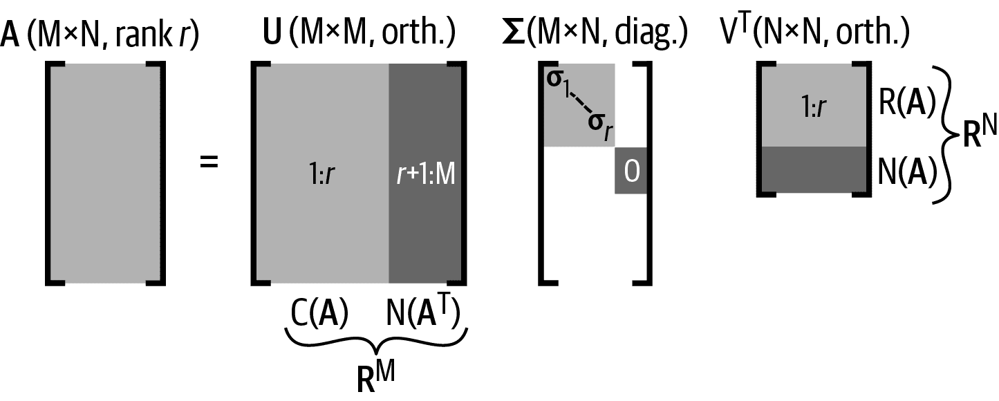
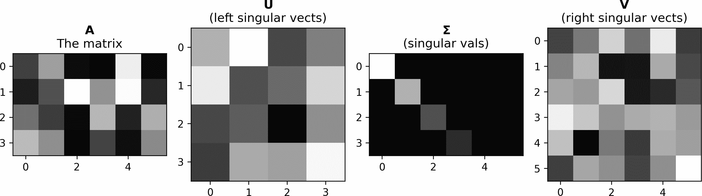
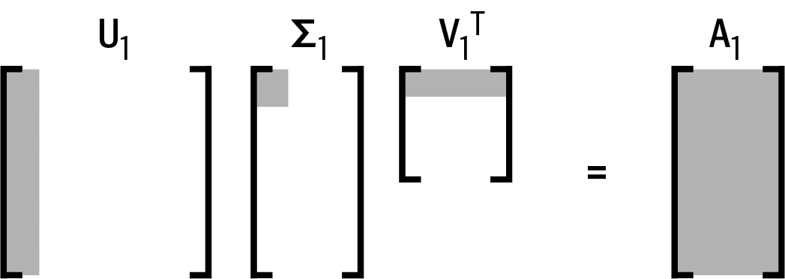
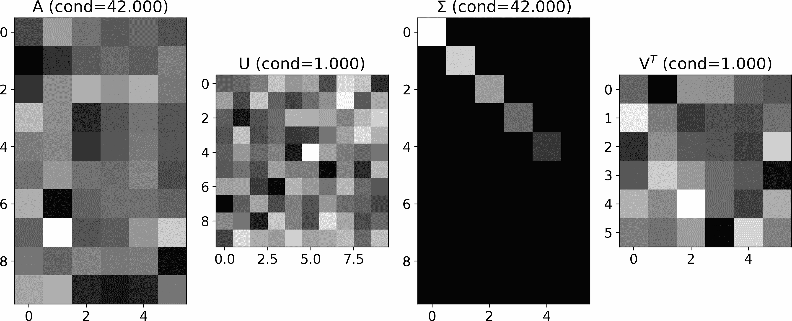
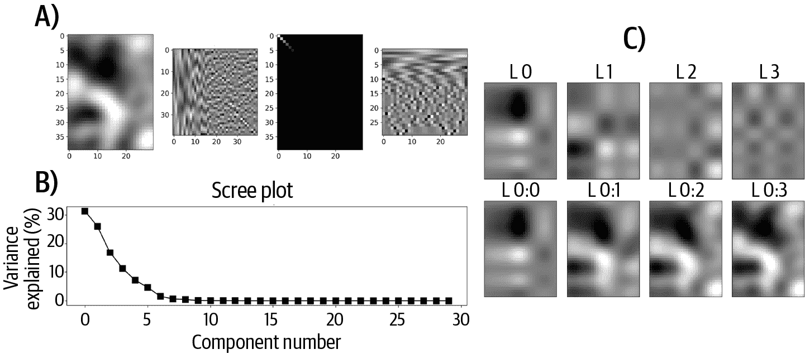

# 第十四章：奇异值分解

上一章真的很密集！我尽力使其易于理解和严谨，而不至于陷入对数据科学少相关的细节中。

幸运的是，大部分你学到的关于特征分解的内容都适用于奇异值分解。这意味着本章会更容易也更简短。

奇异值分解的目的是将矩阵分解为三个矩阵的乘积，称为左奇异向量（ <math alttext="粗体大写 U"><mi>𝐔</mi></math> ）、奇异值（<math alttext="粗体大写 Sigma"><mi mathvariant="bold">Σ</mi></math>）和右奇异向量（ <math alttext="粗体大写 V"><mi>𝐕</mi></math> ）：

<math alttext="bold upper A equals bold upper U bold upper Sigma bold upper V Superscript upper T" display="block"><mrow><mi mathvariant="bold">A</mi> <mo>=</mo> <mi mathvariant="bold">U</mi> <mi mathvariant="bold">Σ</mi> <msup><mi mathvariant="bold">V</mi> <mtext>T</mtext></msup></mrow></math>

这种分解看起来类似于特征分解。事实上，你可以把奇异值分解看作是对非方阵的特征分解的一般化，或者你可以把特征分解看作是奇异值分解在方阵情况下的特殊情况。¹

奇异值可与特征值相比较，而奇异向量矩阵则与特征向量可比较（在某些情况下这两组量是相同的，我稍后会解释）。

# 奇异值分解的全局视角

我想先让你了解矩阵的概念和解释，然后在本章后面解释如何计算奇异值分解。

图 14-1 显示了奇异值分解的概览。



###### 图 14-1. 奇异值分解的全局视角

在这张图中可以看到奇异值分解的许多重要特性；我将在本章中更详细地解释这些特性，但先简要列举一下：

+   <math alttext="粗体大写 U"><mi>𝐔</mi></math> 和 <math alttext="粗体大写 V"><mi>𝐕</mi></math> 都是方阵，即使 <math alttext="粗体大写 A"><mi>𝐀</mi></math> 不是方阵。

+   奇异向量矩阵 <math alttext="粗体大写 U"><mi>𝐔</mi></math> 和 <math alttext="粗体大写 V"><mi>𝐕</mi></math> 是正交的，意味着 <math alttext="粗体大写 U 上标 T 上标 bold upper U 等于 bold upper I"><mrow><msup><mi>𝐔</mi> <mtext>T</mtext></msup> <mi>𝐔</mi> <mo>=</mo> <mi>𝐈</mi></mrow></math> 和 <math alttext="粗体大写 V 上标 T 上标 bold upper V 等于 bold upper I"><mrow><msup><mi>𝐕</mi> <mtext>T</mtext></msup> <mi>𝐕</mi> <mo>=</mo> <mi>𝐈</mi></mrow></math> 。提醒一下，这意味着每一列都与其他列正交，且任何一个列子集与任何其他（非重叠）列子集也正交。

+   <math alttext="粗体大写 U"><mi>𝐔</mi></math> 的前 *r* 列提供了矩阵 <math alttext="粗体大写 A"><mi>𝐀</mi></math> 的列空间的正交基向量，而其余列则提供了左零空间的正交基向量（除非 *r* = *M*，此时矩阵具有满列秩且左零空间为空）。

+   <math alttext="bold upper V Superscript upper T"><msup><mi>𝐕</mi> <mtext>T</mtext></msup></math> 的前*r*行（即<math alttext="bold upper V"><mi>𝐕</mi></math> 的列）为行空间提供正交基向量，而其余行为零空间提供正交基向量。

+   奇异值矩阵是与<math alttext="bold upper A"><mi>𝐀</mi></math>相同大小的对角矩阵。奇异值始终按从最大（左上角）到最小（右下角）排序。

+   所有奇异值都是非负实数。它们不能是复数或负数，即使矩阵包含复数。

+   非零奇异值的数量等于矩阵的秩。

或许 SVD 最惊人的地方在于它揭示了矩阵的四个子空间：列空间和左空间由<math alttext="bold upper U"><mi>𝐔</mi></math>的前*r*列和最后*M* − *r*到*M*列，而行空间和零空间由<math alttext="bold upper V Superscript upper T"><msup><mi>𝐕</mi> <mtext>T</mtext></msup></math> 的前*r*行和最后*N* − *r*到*N*行提供。对于矩形矩阵，如果*r* = *M*，则左空间为空，如果*r* = *N*，则零空间为空。

## 奇异值与矩阵的秩

矩阵的秩被定义为非零奇异值的数量。这个原因来自于前面的讨论，即矩阵的列空间和行空间被定义为通过它们对应的奇异值进行缩放以在矩阵空间中具有一定“体积”的左奇异向量和右奇异向量，而左空间和右空间被定义为通过它们进行缩放为零的左奇异向量和右奇异向量。因此，列空间和行空间的维数由非零奇异值的数量决定。

实际上，我们可以查看 NumPy 函数`np.linalg.matrix_rank`来看 Python 如何计算矩阵的秩（我稍作修改以便专注于关键概念）：

```
S = svd(M,compute_uv=False) # return only singular values
tol = S.max() * max(M.shape[-2:]) * finfo(S.dtype).eps
return count_nonzero(S > tol)
```

返回的值是超过`tol`值的奇异值数量。`tol`是什么？这是一个容忍度水平，考虑可能的舍入误差。它被定义为此数据类型的机器精度(`eps`)，按照最大奇异值和矩阵的大小进行缩放。

因此，我们再次看到“黑板上的数学”与计算机上实现的精确数学之间的差异：矩阵的秩实际上并不是计算为非零奇异值的数量，而是计算为大于某个小数的奇异值的数量。有可能忽略一些真正非零但由于精度误差而被忽略的奇异值，但这相对于在真正值为零的情况下由于精度误差而错误地增加矩阵的秩的风险来说更为合理。

# Python 中的 SVD

在 Python 中计算 SVD 相对直观：

```
U,s,Vt = np.linalg.svd(A)
```

NumPy 的 `svd` 函数有两个需要注意的特点。首先，奇异值作为一个向量返回，而不是与 <math alttext="bold upper A"><mi>𝐀</mi></math> 相同大小的矩阵。这意味着你需要一些额外的代码来获取 <math alttext="bold upper Sigma"><mi mathvariant="bold">Σ</mi></math> 矩阵：

```
S = np.zeros(np.shape(A))
np.fill_diagonal(S,s)
```

你可能最初想到使用 `np.diag(s)`，但那只适用于方阵 <math alttext="bold upper A"><mi>𝐀</mi></math> 的正确奇异值矩阵。因此，我首先创建了正确大小的零矩阵，然后用奇异值填充对角线。

第二个特点是 NumPy 返回矩阵 <math alttext="bold upper V Superscript upper T"><msup><mi>𝐕</mi> <mtext>T</mtext></msup></math> ，而不是 <math alttext="bold upper V"><mi>𝐕</mi></math> 。这对于习惯于 MATLAB 的读者可能会感到困惑，因为 MATLAB 的 `svd` 函数返回矩阵 <math alttext="bold upper V"><mi>𝐕</mi></math> 。在文档字符串中有提示，描述了矩阵 `vh`，其中的 `h` 表示 Hermitian，即对称复值矩阵的名称。

图 14-2 展示了 `svd` 函数的输出（奇异值已转换为矩阵）。



###### 图 14-2\. 显示了奇异值分解的示例矩阵的整体情况

# 奇异值分解和矩阵的秩-1“层”

我在上一章节展示的第一个方程是特征值方程的向量-标量版本（ <math alttext="bold upper A bold v equals lamda bold v"><mrow><mi>𝐀</mi> <mi>𝐯</mi> <mo>=</mo> <mi>λ</mi> <mi>𝐯</mi></mrow></math> ）。我在本章开头使用了*矩阵*奇异值分解方程（ <math alttext="bold upper A equals bold upper U bold upper Sigma bold upper V Superscript upper T"><mrow><mi mathvariant="bold">A</mi><mo>=</mo><mi mathvariant="bold">U</mi><mi mathvariant="bold">Σ</mi><msup><mi mathvariant="bold">V</mi> <mtext>T</mtext></msup></mrow></math> ）；对于一个向量，这个方程是什么样子？我们可以用两种不同的方式来书写它，突出奇异值分解的不同特点：

<math alttext="StartLayout 1st Row 1st Column bold upper A bold v 2nd Column equals bold u sigma 2nd Row 1st Column bold u Superscript upper T Baseline bold upper A 2nd Column equals sigma bold v Superscript upper T EndLayout" display="block"><mtable displaystyle="true"><mtr><mtd columnalign="right"><mrow><mi>𝐀</mi> <mi>𝐯</mi></mrow></mtd> <mtd columnalign="left"><mrow><mo>=</mo> <mi>𝐮</mi> <mi>σ</mi></mrow></mtd></mtr> <mtr><mtd columnalign="right"><mrow><msup><mi>𝐮</mi> <mtext>T</mtext></msup> <mi>𝐀</mi></mrow></mtd> <mtd columnalign="left"><mrow><mo>=</mo> <mi>σ</mi> <msup><mi>𝐯</mi> <mtext>T</mtext></msup></mrow></mtd></mtr></mtable></math>

这些方程有点类似于特征值方程，只是有两个向量而不是一个。因此，它们的解释略微更为细腻：总体来说，这些方程表明矩阵对一个向量的作用与一个不同向量的标量作用相同。

注意第一个方程意味着 <math alttext="bold u"><mi>𝐮</mi></math> 在 <math alttext="bold upper A"><mi>𝐀</mi></math> 的列空间中，而 <math alttext="bold v"><mi>𝐯</mi></math> 提供了组合列的权重。第二个方程同样如此，但 <math alttext="bold v"><mi>𝐯</mi></math> 在 <math alttext="bold upper A"><mi>𝐀</mi></math> 的行空间中，<math alttext="bold u"><mi>𝐮</mi></math> 提供了权重。

但这并不是我想在本节中集中讨论的内容；我想考虑的是当你将一个左奇异向量乘以一个右奇异向量时会发生什么。因为奇异向量与相同的奇异值配对，我们需要将第*i*个左奇异向量乘以第*i*个奇异值，再乘以第*i*个右奇异向量。

注意这个向量-向量乘法中的方向：左边是列，右边是行（见图 14-3）。这意味着结果将是一个与原始矩阵大小相同的外积矩阵。此外，该外积是一个秩-1 矩阵，其范数由奇异值决定（因为奇异向量是单位长度的）：

<math alttext="bold u 1 sigma 1 bold v 1 Superscript upper T Baseline equals bold upper A 1" display="block"><mrow><msub><mi>𝐮</mi> <mn>1</mn></msub> <msub><mi>σ</mi> <mn>1</mn></msub> <msubsup><mi>𝐯</mi> <mn>1</mn> <mtext>T</mtext></msubsup> <mo>=</mo> <msub><mi>𝐀</mi> <mn>1</mn></msub></mrow></math>

###### 图 14-3\. 奇异向量的外积创建一个矩阵“层”

方程中的下标*1*表示使用第一个奇异向量和第一个（最大的）奇异值。我称之为<math alttext="bold upper A 1"><msub><mi>𝐀</mi> <mn>1</mn></msub></math>的结果，因为它不是原始矩阵<math alttext="bold upper A"><mi>𝐀</mi></math>；相反，它是与<math alttext="bold upper A"><mi>𝐀</mi></math>相同大小的秩-1 矩阵。不仅如此，它是最重要的“层”之一。它之所以如此重要，是因为它具有最大的奇异值（关于这一点的详细内容将在后面的部分介绍）。

有了这个理解，我们可以通过对所有与<math alttext="sigma greater-than 0"><mrow><mi>σ</mi> <mo>></mo> <mn>0</mn></mrow></math>相关的 SVD“层”求和来重构原始矩阵 ²：

<math alttext="bold upper A equals sigma-summation Underscript i equals 1 Overscript r Endscripts bold u Subscript i Baseline sigma Subscript i Baseline bold v Subscript i Superscript upper T" display="block"><mrow><mi>𝐀</mi> <mo>=</mo> <munderover><mo>∑</mo> <mrow><mi>i</mi><mo>=</mo><mn>1</mn></mrow> <mi>r</mi></munderover> <msub><mi>𝐮</mi> <mi>i</mi></msub> <msub><mi>σ</mi> <mi>i</mi></msub> <msubsup><mi>𝐯</mi> <mi>i</mi> <mtext>T</mtext></msubsup></mrow></math>

展示这个求和的要点在于，你不一定需要使用所有的*r*层；相反，你可以重构另一个矩阵，让我们称之为<math alttext="bold upper A overTilde"><mover accent="true"><mi>𝐀</mi> <mo>˜</mo></mover></math>，其中包含了前*k* < *r*层。这被称为矩阵<math alttext="bold upper A"><mi>𝐀</mi></math>的*低秩逼近* — 在这种情况下，是一个秩为*k*的逼近。

例如，在数据清理中使用低秩逼近。其思想是与小奇异值相关联的信息对数据集的总方差贡献较小，因此可能反映出可以去除的噪声。在下一章中会详细介绍。

# SVD from EIG

好的，在本章的这一点上，你已经了解了理解和解释 SVD 矩阵的基础。我相信你想知道的是如何产生 SVD 的这个神奇公式。也许它非常复杂，只有高斯能理解？或者可能需要很长时间来解释，不适合放在一个章节里？

错了！

实际上，SVD 非常简单（在概念上；手动执行 SVD 又是另一回事）。它只是来自计算矩阵乘以其转置的特征分解。以下方程显示如何推导奇异值和左奇异向量：

<math alttext="StartLayout 1st Row 1st Column bold upper A bold upper A Superscript upper T Baseline equals 2nd Column left-parenthesis bold upper U bold upper Sigma bold upper V Superscript upper T Baseline right-parenthesis left-parenthesis bold upper U bold upper Sigma bold upper V Superscript upper T Baseline right-parenthesis Superscript upper T 2nd Row 1st Column equals 2nd Column bold upper U bold upper Sigma bold upper V Superscript upper T Baseline bold upper V bold upper Sigma Superscript upper T Baseline bold upper U Superscript upper T 3rd Row 1st Column equals 2nd Column bold upper U bold upper Sigma squared bold upper U Superscript upper T EndLayout" display="block"><mtable displaystyle="true"><mtr><mtd columnalign="right"><mrow><mi mathvariant="bold">A</mi> <msup><mi mathvariant="bold">A</mi> <mtext>T</mtext></msup> <mo>=</mo></mrow></mtd> <mtd columnalign="left"><mrow><mrow><mo>(</mo> <mi mathvariant="bold">U</mi> <mi mathvariant="bold">Σ</mi> <msup><mi mathvariant="bold">V</mi> <mtext>T</mtext></msup> <mo>)</mo></mrow> <msup><mrow><mo>(</mo><mi mathvariant="bold">U</mi><mi mathvariant="bold">Σ</mi><msup><mi mathvariant="bold">V</mi> <mtext>T</mtext></msup> <mo>)</mo></mrow> <mtext>T</mtext></msup></mrow></mtd></mtr> <mtr><mtd columnalign="right"><mo>=</mo></mtd> <mtd columnalign="left"><mrow><mi mathvariant="bold">U</mi> <mi mathvariant="bold">Σ</mi> <msup><mi mathvariant="bold">V</mi> <mtext>T</mtext></msup> <mi mathvariant="bold">V</mi> <msup><mi mathvariant="bold">Σ</mi> <mtext>T</mtext></msup> <msup><mi mathvariant="bold">U</mi> <mtext>T</mtext></msup></mrow></mtd></mtr> <mtr><mtd columnalign="right"><mo>=</mo></mtd> <mtd columnalign="left"><mrow><mi mathvariant="bold">U</mi> <msup><mi mathvariant="bold">Σ</mi> <mn>2</mn></msup> <msup><mi mathvariant="bold">U</mi> <mtext>T</mtext></msup></mrow></mtd></mtr></mtable></math>

换句话说，<math alttext="bold upper A bold upper A Superscript upper T"><mrow><mi>𝐀</mi> <msup><mi>𝐀</mi> <mtext>T</mtext></msup></mrow></math>的特征向量是<math alttext="bold upper A"><mi>𝐀</mi></math>的左奇异向量，<math alttext="bold upper A bold upper A Superscript upper T"><mrow><mi>𝐀</mi> <msup><mi>𝐀</mi> <mtext>T</mtext></msup></mrow></math>的平方特征值是<math alttext="bold upper A"><mi>𝐀</mi></math>的奇异值。

这一洞察揭示了 SVD 的三个特点：（1）奇异值非负，因为平方数不能为负数；（2）奇异值是实数，因为对称矩阵具有实数特征值；（3）奇异向量正交，因为对称矩阵的特征向量是正交的。

右奇异值来自矩阵转置的预乘：

<math alttext="StartLayout 1st Row 1st Column bold upper A Superscript upper T Baseline bold upper A equals 2nd Column left-parenthesis bold upper U bold upper Sigma bold upper V Superscript upper T Baseline right-parenthesis Superscript upper T Baseline left-parenthesis bold upper U bold upper Sigma bold upper V Superscript upper T Baseline right-parenthesis 2nd Row 1st Column equals 2nd Column bold upper V bold upper Sigma Superscript upper T Baseline bold upper U Superscript upper T Baseline bold upper U bold upper Sigma bold upper V Superscript upper T 3rd Row 1st Column equals 2nd Column bold upper V bold upper Sigma squared bold upper V Superscript upper T EndLayout" display="block"><mtable displaystyle="true"><mtr><mtd columnalign="right"><mrow><msup><mi mathvariant="bold">A</mi> <mtext>T</mtext></msup> <mi mathvariant="bold">A</mi> <mo>=</mo></mrow></mtd> <mtd columnalign="left"><mrow><msup><mrow><mo>(</mo><mi mathvariant="bold">U</mi><mi mathvariant="bold">Σ</mi><msup><mi mathvariant="bold">V</mi> <mtext>T</mtext></msup> <mo>)</mo></mrow> <mtext>T</mtext></msup> <mrow><mo>(</mo> <mi mathvariant="bold">U</mi> <mi mathvariant="bold">Σ</mi> <msup><mi mathvariant="bold">V</mi> <mtext>T</mtext></msup> <mo>)</mo></mrow></mrow></mtd></mtr> <mtr><mtd columnalign="right"><mo>=</mo></mtd> <mtd columnalign="left"><mrow><mi mathvariant="bold">V</mi> <msup><mi mathvariant="bold">Σ</mi> <mtext>T</mtext></msup> <msup><mi mathvariant="bold">U</mi> <mtext>T</mtext></msup> <mi mathvariant="bold">U</mi> <mi mathvariant="bold">Σ</mi> <msup><mi mathvariant="bold">V</mi> <mtext>T</mtext></msup></mrow></mtd></mtr> <mtr><mtd columnalign="right"><mo>=</mo></mtd> <mtd columnalign="left"><mrow><mi mathvariant="bold">V</mi> <msup><mi mathvariant="bold">Σ</mi> <mn>2</mn></msup> <msup><mi mathvariant="bold">V</mi> <mtext>T</mtext></msup></mrow></mtd></mtr></mtable></math>

实际上，您可以重新排列 SVD 方程以解出右奇异向量，而无需计算<math alttext="bold upper A Superscript upper T Baseline bold upper A"><mrow><msup><mi>𝐀</mi> <mtext>T</mtext></msup> <mi>𝐀</mi></mrow></math>的特征分解：

<math alttext="bold upper V Superscript upper T Baseline equals bold upper Sigma Superscript negative 1 Baseline bold upper U Superscript upper T Baseline bold upper A" display="block"><mrow><msup><mi mathvariant="bold">V</mi> <mtext>T</mtext></msup> <mo>=</mo> <msup><mi mathvariant="bold">Σ</mi> <mrow><mo>-</mo><mn>1</mn></mrow></msup> <msup><mi mathvariant="bold">U</mi> <mtext>T</mtext></msup> <mi mathvariant="bold">A</mi></mrow></math>

当然，如果您已经知道<math alttext="bold upper V"><mi>𝐕</mi></math> ，则可以推导出<math alttext="bold upper U"><mi>𝐔</mi></math> 的互补方程。

## SVD of <math alttext="bold upper A Superscript upper T Baseline bold upper A"><mrow><msup><mi>𝐀</mi> <mtext>T</mtext></msup> <mi>𝐀</mi></mrow></math>

简而言之，如果一个矩阵可以表示为<math alttext="bold upper S equals bold upper A Superscript upper T Baseline bold upper A"><mrow><mi>𝐒</mi> <mo>=</mo> <msup><mi>𝐀</mi> <mtext>T</mtext></msup> <mi>𝐀</mi></mrow></math> ，那么它的左奇异向量和右奇异向量是相等的。换句话说：

<math alttext="bold upper S equals bold upper U bold upper Sigma bold upper V Superscript upper T Baseline equals bold upper V bold upper Sigma bold upper U Superscript upper T Baseline equals bold upper U bold upper Sigma bold upper U Superscript upper T Baseline equals bold upper V bold upper Sigma bold upper V Superscript upper T" display="block"><mrow><mi mathvariant="bold">S</mi> <mo>=</mo> <mi mathvariant="bold">U</mi> <mi mathvariant="bold">Σ</mi> <msup><mi mathvariant="bold">V</mi> <mtext>T</mtext></msup> <mo>=</mo> <mi mathvariant="bold">V</mi> <mi mathvariant="bold">Σ</mi> <msup><mi mathvariant="bold">U</mi> <mtext>T</mtext></msup> <mo>=</mo> <mi mathvariant="bold">U</mi> <mi mathvariant="bold">Σ</mi> <msup><mi mathvariant="bold">U</mi> <mtext>T</mtext></msup> <mo>=</mo> <mi mathvariant="bold">V</mi> <mi mathvariant="bold">Σ</mi> <msup><mi mathvariant="bold">V</mi> <mtext>T</mtext></msup></mrow></math>

这个断言的证明源于将<math alttext="bold upper S"><mi>𝐒</mi></math>和<math alttext="bold upper S Superscript upper T"><msup><mi>𝐒</mi> <mtext>T</mtext></msup></math>的 SVD 写出来，然后考虑<math alttext="bold upper S equals bold upper S Superscript upper T"><mrow><mi>𝐒</mi> <mo>=</mo> <msup><mi>𝐒</mi> <mtext>T</mtext></msup></mrow></math>的含义。我留给你自己去探索！我还鼓励您在 Python 中使用随机对称矩阵来确认。

实际上，对于对称矩阵，SVD 与特征分解是相同的。这对主成分分析有影响，因为 PCA 可以使用数据协方差矩阵的特征分解，协方差矩阵的 SVD 或数据矩阵的 SVD 来执行。

## 将奇异值转换为解释的方差

奇异值的总和是矩阵中的总“方差”量。这是什么意思？如果你将矩阵中的信息视为包含在一个气泡中，那么奇异值的总和就像是那个气泡的体积。

所有方差都包含在奇异值中的原因是奇异向量被规范化为单位大小，这意味着它们不提供大小信息（即，<math alttext="parallel-to bold upper U bold w parallel-to equals parallel-to bold w parallel-to"><mrow><mo>∥</mo> <mi>𝐔</mi> <mi>𝐰</mi> <mo>∥</mo> <mo>=</mo> <mo>∥</mo> <mi>𝐰</mi> <mo>∥</mo></mrow></math> ）。³ 换句话说，奇异向量指向某个方向，而奇异值则表示距离有多远。

“原始”奇异值处于矩阵的数值尺度中。这意味着如果将数据乘以一个标量，那么奇异值将会增加。而这又意味着，奇异值难以解释，并且基本上不可能在不同数据集之间进行比较。

因此，将奇异值转换为解释的总百分比通常是有用的。公式很简单；每个奇异值 *i* 规范化如下：

<math alttext="sigma Subscript i Baseline overTilde equals StartFraction 100 sigma Subscript i Baseline Over sigma-summation sigma EndFraction" display="block"><mrow><mover accent="true"><msub><mi>σ</mi> <mi>i</mi></msub> <mo>˜</mo></mover> <mo>=</mo> <mfrac><mrow><mn>100</mn><msub><mi>σ</mi> <mi>i</mi></msub></mrow> <mrow><mo>∑</mo><mi>σ</mi></mrow></mfrac></mrow></math>

例如，在主成分分析中，这种归一化常用来确定解释 99% 方差的成分数量。这可以解释为系统复杂性的一个指标。

重要的是，这种归一化不会影响奇异值之间的相对距离；它只是将数值尺度改变为更容易解释的尺度。

## 条件数

在本书中我多次提到，矩阵的条件数用于指示矩阵的数值稳定性。现在你了解了奇异值，可以更好地理解如何计算和解释条件数。

矩阵的条件数定义为最大奇异值与最小奇异值的比值。通常用希腊字母 *κ*（kappa）表示：

<math alttext="kappa equals StartFraction sigma Subscript m a x Baseline Over sigma Subscript min Baseline EndFraction" display="block"><mrow><mi>κ</mi> <mo>=</mo> <mfrac><msub><mi>σ</mi> <mrow><mi>m</mi><mi>a</mi><mi>x</mi></mrow></msub> <msub><mi>σ</mi> <mo form="prefix" movablelimits="true">min</mo></msub></mfrac></mrow></math>

在统计学和机器学习中，条件数常用于评估矩阵在计算其逆矩阵和使用其解决方程组（如最小二乘法）时的稳定性。当然，非可逆矩阵的条件数为 NaN，因为 <math alttext="sigma slash 0 equals"><mrow><mi>σ</mi> <mo>/</mo> <mn>0</mn> <mo>=</mo></mrow></math> ‽。

但是，数值上满秩且条件数较大的矩阵仍可能不稳定。虽然在理论上可逆，但实际上其逆矩阵可能不可靠。这样的矩阵被称为*病态矩阵*。你可能在 Python 的警告消息中见过这个术语，有时伴随着“结果可能不准确”的短语。

对于条件数较大的病态矩阵有什么问题？随着条件数的增加，矩阵趋向于奇异。因此，病态矩阵几乎是“几乎奇异的”，其逆由于数值误差风险增加而不可信。

有几种方法可以思考病态矩阵的影响。一种是由于舍入误差导致解的精度降低。例如，条件数约为 10⁵意味着解（例如矩阵逆或最小二乘问题）失去了五个有效数字（例如，从精度 10^(−16)降至 10^(−11)）。

第二种解释与前述有关，是噪声放大因子。如果矩阵的条件数约为 10⁴，那么噪声可能会使最小二乘问题的解受到 10⁴的影响。这听起来可能很多，但如果您的数据精度为 10^(−16)，这可能是一个微不足道的放大效应。

第三，条件数表示解对数据矩阵扰动的敏感性。良好条件的矩阵可以在添加噪声时保持解的最小变化。相比之下，对病态矩阵添加少量噪声可能会导致完全不同的解。

矩阵何时被认为是病态？没有确定的阈值。没有一个魔法数字可以将良好条件的矩阵与病态矩阵分开。不同的算法将适用不同的阈值，这些阈值取决于矩阵中的数值。

很明显：要认真对待关于病态矩阵的警告信息。它们通常表明某些地方出了问题，结果不可信。

# SVD 和 MP 伪逆

矩阵的奇异值分解逆矩阵非常优雅。假设矩阵是方阵且可逆，我们有：

<math alttext="StartLayout 1st Row 1st Column bold upper A Superscript negative 1 2nd Column equals left-parenthesis bold upper U bold upper Sigma bold upper V Superscript upper T Baseline right-parenthesis Superscript negative 1 Baseline 2nd Row 1st Column Blank 2nd Column equals bold upper V bold upper Sigma Superscript negative 1 Baseline bold upper U Superscript negative 1 Baseline 3rd Row 1st Column Blank 2nd Column equals bold upper V bold upper Sigma Superscript negative 1 Baseline bold upper U Superscript upper T EndLayout" display="block"><mtable displaystyle="true"><mtr><mtd columnalign="right"><msup><mi mathvariant="bold">A</mi> <mrow><mo>-</mo><mn>1</mn></mrow></msup></mtd> <mtd columnalign="left"><mrow><mo>=</mo> <msup><mrow><mo>(</mo><mi mathvariant="bold">U</mi><mi mathvariant="bold">Σ</mi><msup><mi mathvariant="bold">V</mi> <mtext>T</mtext></msup> <mo>)</mo></mrow> <mrow><mo>-</mo><mn>1</mn></mrow></msup></mrow></mtd></mtr> <mtr><mtd columnalign="left"><mrow><mo>=</mo> <mi mathvariant="bold">V</mi> <msup><mi mathvariant="bold">Σ</mi> <mrow><mo>-</mo><mn>1</mn></mrow></msup> <msup><mi mathvariant="bold">U</mi> <mrow><mo>-</mo><mn>1</mn></mrow></msup></mrow></mtd></mtr> <mtr><mtd columnalign="left"><mrow><mo>=</mo> <mi mathvariant="bold">V</mi> <msup><mi mathvariant="bold">Σ</mi> <mrow><mo>-</mo><mn>1</mn></mrow></msup> <msup><mi mathvariant="bold">U</mi> <mtext>T</mtext></msup></mrow></mtd></mtr></mtable></math>

换句话说，我们只需求逆<math alttext="bold upper Sigma"><mi mathvariant="bold">Σ</mi></math>，因为<math alttext="bold upper U Superscript negative 1 Baseline equals bold upper U Superscript upper T"><mrow><msup><mi>𝐔</mi> <mrow><mo>-</mo><mn>1</mn></mrow></msup> <mo>=</mo> <msup><mi>𝐔</mi> <mtext>T</mtext></msup></mrow></math>。此外，因为<math alttext="bold upper Sigma"><mi mathvariant="bold">Σ</mi></math>是对角矩阵，其逆可以通过倒转每个对角元素来获得。然而，这种方法仍然受到数值不稳定性的影响，因为微小的奇异值可能反映出精度错误（例如 10^(−15)），在求逆时会变得极大。

现在让我们来看一下计算 MP 伪逆的算法。您已经等待了许多章节；我感谢您的耐心。

MP 伪逆几乎与前面示例中显示的完全逆矩阵计算相同；唯一的修改是反转<math alttext="bold upper Sigma"><mi mathvariant="bold">Σ</mi></math>中的*非零*对角元素，而不是尝试反转所有对角元素。（在实践中，“非零”被实现为高于某个阈值以应对精度误差。）

就是这样！这就是伪逆的计算方法。您可以看到它非常简单和直观，但需要相当多的线性代数背景知识才能理解。

更好的是：因为 SVD 适用于任何大小的矩阵，MP 伪逆可以应用于非方阵。实际上，高矩阵的 MP 伪逆等于其左逆，而宽矩阵的 MP 伪逆等于其右逆。（快速提醒，伪逆表示为<math alttext="bold upper A Superscript plus"><msup><mi>𝐀</mi> <mo>+</mo></msup></math>，<math alttext="bold upper A Superscript asterisk"><msup><mi>𝐀</mi> <mo>*</mo></msup></math>或<math alttext="bold upper A Superscript dagger"><msup><mi>𝐀</mi> <mo>†</mo></msup></math>。）

通过在练习中自己实现，您将更多地了解伪逆。

# 摘要

我希望您同意，在努力学习特征分解后，再多付出一点努力就能更好地理解 SVD。SVD 可以说是线性代数中最重要的分解方法，因为它揭示了关于矩阵的丰富和详细信息。以下是其关键点：

+   SVD 将一个（任意大小和秩）矩阵分解为三个矩阵的乘积，称为*左奇异向量* <math alttext="bold upper U"><mi>𝐔</mi></math> ，*奇异值* <math alttext="bold upper Sigma"><mi mathvariant="bold">Σ</mi></math> 和*右奇异向量* <math alttext="bold upper V Superscript upper T"><msup><mi>𝐕</mi> <mtext>T</mtext></msup></math> 。

+   前*r*（其中*r*是矩阵秩）个左奇异向量为矩阵的列空间提供一组标准正交基，而后续的奇异向量为左零空间提供一组标准正交基。

+   对于右奇异向量也是类似的情况：前*r*个向量为行空间提供一组标准正交基，而后续的向量为零空间提供一组标准正交基。请注意，右奇异向量实际上是<math alttext="bold upper V"><mi>𝐕</mi></math>的*行*，这些行是<math alttext="bold upper V Superscript upper T"><msup><mi>𝐕</mi> <mtext>T</mtext></msup></math>的*列*。

+   非零奇异值的数量等于矩阵的秩。在实践中，很难区分非常小的非零奇异值与零值奇异值的精度误差。像 Python 这样的程序会使用容差阈值来区分它们。

+   第 *k* 个左奇异向量和第 *k* 个右奇异向量的外积，乘以第 *k* 个奇异值，产生一个秩-1 矩阵，可以解释为矩阵的“层”。基于层重建矩阵具有许多应用，包括去噪和数据压缩。

+   从概念上讲，SVD 可以从 <math alttext="bold upper A bold upper A Superscript upper T"><mrow><mi>𝐀</mi> <msup><mi>𝐀</mi> <mtext>T</mtext></msup></mrow></math> 的特征分解中获得。

+   超级重要的摩尔-彭罗斯伪逆计算为 <math alttext="bold upper V bold upper Sigma Superscript plus Baseline bold upper U Superscript upper T"><mrow><mi mathvariant="bold">V</mi><msup><mi mathvariant="bold">Σ</mi> <mo>+</mo></msup> <msup><mi mathvariant="bold">U</mi> <mtext>T</mtext></msup></mrow></math> ，其中 <math alttext="bold upper Sigma Superscript plus"><msup><mi mathvariant="bold">Σ</mi> <mo>+</mo></msup></math> 通过反转对角线上的非零奇异值获得。

# 代码练习。

##### 练习 14-1。

你学到对于对称矩阵，奇异值和特征值是相同的。那么奇异向量和特征向量呢？使用一个随机 <math alttext="5 times 5"><mrow><mn>5</mn> <mo>×</mo> <mn>5</mn></mrow></math> <math alttext="bold upper A Superscript upper T Baseline bold upper A"><mrow><msup><mi>𝐀</mi> <mtext>T</mtext></msup> <mi>𝐀</mi></mrow></math> 矩阵来回答这个问题。接下来，使用加法方法再次尝试创建对称矩阵（ <math alttext="bold upper A Superscript upper T Baseline plus bold upper A"><mrow><msup><mi>𝐀</mi> <mtext>T</mtext></msup> <mo>+</mo> <mi>𝐀</mi></mrow></math> ）。注意 <math alttext="bold upper A Superscript upper T Baseline plus bold upper A"><mrow><msup><mi>𝐀</mi> <mtext>T</mtext></msup> <mo>+</mo> <mi>𝐀</mi></mrow></math> 的特征值的符号。

##### 练习 14-2。

Python 可以选择返回“经济”SVD，这意味着奇异向量矩阵在较小的*M*或*N*处被截断。请查阅文档字符串以了解如何实现此功能。与高和宽矩阵确认。注意，通常应返回完整矩阵；经济型 SVD 主要用于非常大的矩阵和/或计算能力非常有限的情况。

##### 练习 14-3。

正交矩阵（如左和右奇异向量矩阵）的一个重要特性是它们可以旋转向量但不改变其大小。这意味着经过正交矩阵乘法后，向量的大小保持不变。通过在 Python 中使用来自随机矩阵 SVD 的奇异向量矩阵和随机向量来证明 <math alttext="parallel-to bold upper U bold w parallel-to equals parallel-to bold w parallel-to"><mrow><mo>∥</mo> <mi>𝐔</mi> <mi>𝐰</mi> <mo>∥</mo> <mo>=</mo> <mo>∥</mo> <mi>𝐰</mi> <mo>∥</mo></mrow></math>。然后通过实证方法演示这一点。

##### 练习 14-4。

创建一个具有指定条件数的随机高瘦矩阵。通过创建两个随机方阵<math alttext="bold upper U"><mi>𝐔</mi></math>和<math alttext="bold upper V"><mi>𝐕</mi></math>，以及一个矩形的<math alttext="bold upper Sigma"><mi mathvariant="bold">Σ</mi></math>来实现这一点。确认<math alttext="bold upper U bold upper Sigma bold upper V Superscript upper T"><mrow><mi mathvariant="bold">U</mi><mi mathvariant="bold">Σ</mi><msup><mi mathvariant="bold">V</mi> <mtext>T</mtext></msup></mrow></math>的经验条件数与您指定的数字相同。像图 14-4 一样在图中可视化您的结果。（我使用了一个条件数为 42。⁴）



###### 图 14-4\. 习题 14-3 的结果

##### 习题 14-5\.

你在这里的目标很简单：编写代码以重现图 14-5。这个图显示了什么？面板 A 展示了一个<math alttext="30 times 40"><mrow><mn>30</mn> <mo>×</mo> <mn>40</mn></mrow></math>的随机矩阵，我通过对随机数进行平滑（实现为 2D 高斯和随机数之间的 2D 卷积）创建了它；如果你对图像处理和滤波不熟悉，请随意从我的代码解决方案中复制创建这个矩阵的代码。面板 A 的其余部分展示了 SVD 矩阵。有趣的是，早期的奇异向量（与较大的奇异值相关联）更加平滑，而后来的则更加粗糙；这是来自空间滤波的效果。

面板 B 展示了一个“scree plot”，即归一化为百分比方差解释的奇异值图。请注意，前几个分量占了图像中大部分的方差，而后续的分量每个都只解释了相对较少的方差。确认所有归一化奇异值的总和为 100\. 面板 C 展示了前四个“层次”——定义为<math alttext="bold u Subscript i Baseline sigma Subscript i Baseline bold v Subscript i Superscript upper T"><mrow><msub><mi>𝐮</mi> <mi>i</mi></msub> <msub><mi>σ</mi> <mi>i</mi></msub> <msubsup><mi>𝐯</mi> <mi>i</mi> <mtext>T</mtext></msubsup></mrow></math>——在顶部行和这些层次的累积和在底部行。你可以看到每个层次都向矩阵添加了更多信息；右下角的图像（标题为“L 0:3”）是一个秩为 4 的矩阵，但在视觉上与面板 A 中原始的秩 30 矩阵非常相似。



###### 图 14-5\. 习题 14-5 的结果

##### 习题 14-6\.

根据本章描述实现 MP 伪逆。你需要定义一个容差来忽略微小但非零的奇异值。请不要查阅 NumPy 的实现，也不要回顾本章的早期代码，而是利用你对线性代数的知识自行设计容差。

在一个 <math alttext="5 times 5"><mrow><mn>5</mn> <mo>×</mo> <mn>5</mn></mrow></math> 秩为 3 的矩阵上测试你的代码。将结果与 NumPy 的 `pinv` 函数的输出进行比较。最后，检查 `np.linalg.pinv` 的源代码以确保你理解其实现。

##### 练习 14-7\.

通过计算高列满秩矩阵的显式左逆证明 MP 伪逆等于左逆，（ <math alttext="left-parenthesis bold upper A Superscript upper T Baseline bold upper A right-parenthesis Superscript negative 1 Baseline bold upper A Superscript upper T"><mrow><msup><mrow><mo>(</mo><msup><mi>𝐀</mi> <mtext>T</mtext></msup> <mi>𝐀</mi><mo>)</mo></mrow> <mrow><mo>-</mo><mn>1</mn></mrow></msup> <msup><mi>𝐀</mi> <mtext>T</mtext></msup></mrow></math> )，以及 <math alttext="bold upper A"><mi>𝐀</mi></math> 的伪逆。对于宽行满秩矩阵，重复右逆的情况。

##### 练习 14-8\.

考虑特征值方程 <math alttext="bold upper A bold v equals lamda bold v"><mrow><mi>𝐀</mi> <mi>𝐯</mi> <mo>=</mo> <mi>λ</mi> <mi>𝐯</mi></mrow></math> 。现在你已经了解了伪逆，可以稍微玩弄一下这个方程。特别是，使用在第十三章开始时使用的 <math alttext="2 times 2"><mrow><mn>2</mn> <mo>×</mo> <mn>2</mn></mrow></math> 矩阵计算 <math alttext="bold v Superscript plus"><msup><mi>𝐯</mi> <mo>+</mo></msup></math> 并确认 <math alttext="bold v bold v Superscript plus Baseline equals 1"><mrow><mi>𝐯</mi> <msup><mi>𝐯</mi> <mo>+</mo></msup> <mo>=</mo> <mn>1</mn></mrow></math> 。接下来，确认以下恒等式：

<math alttext="StartLayout 1st Row 1st Column bold v Superscript plus Baseline bold upper A bold v 2nd Column equals lamda bold v Superscript plus Baseline bold v 2nd Row 1st Column bold upper A bold v bold v Superscript plus 2nd Column equals lamda bold v bold v Superscript plus EndLayout" display="block"><mtable displaystyle="true"><mtr><mtd columnalign="right"><mrow><msup><mi>𝐯</mi> <mo>+</mo></msup> <mi>𝐀</mi> <mi>𝐯</mi></mrow></mtd> <mtd columnalign="left"><mrow><mo>=</mo> <mi>λ</mi> <msup><mi>𝐯</mi> <mo>+</mo></msup> <mi>𝐯</mi></mrow></mtd></mtr> <mtr><mtd columnalign="right"><mrow><mi>𝐀</mi> <mi>𝐯</mi> <msup><mi>𝐯</mi> <mo>+</mo></msup></mrow></mtd> <mtd columnalign="left"><mrow><mo>=</mo> <mi>λ</mi> <mi>𝐯</mi> <msup><mi>𝐯</mi> <mo>+</mo></msup></mrow></mtd></mtr></mtable></math>

¹ 对于所有方阵，奇异值分解与特征分解并不相同；稍后详细讨论。

² 没有意义对零值奇异值求和，因为那只是在加零矩阵。

³ 这个陈述的证明在练习 14-3 中。

⁴ 这是对《银河系漫游指南》的另一个引用。
