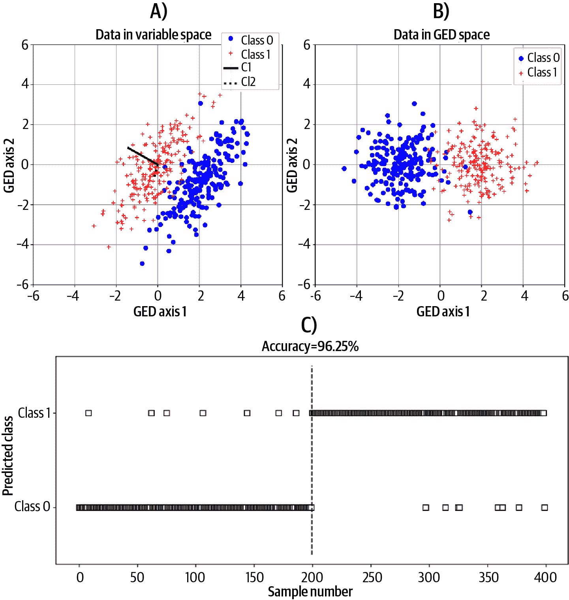

# 第十五章：特征分解和奇异值分解应用

特征分解和奇异值分解是线性代数赋予现代人类文明的宝藏。它们在现代应用数学中的重要性不可低估，其应用遍布各种学科。

在本章中，我将重点介绍您在数据科学及相关领域可能遇到的三个应用程序。我的主要目标是向您展示，一旦您学习了本书中的线性代数主题，表面上复杂的数据科学和机器学习技术实际上是相当合理且容易理解的。

# 使用特征分解和奇异值分解进行 PCA

PCA 的目的是为数据集找到一组基向量，这些向量指向最大化变量之间协变性的方向。

想象一个 N 维数据集存在于 N 维空间中，其中每个数据点是该空间中的一个坐标。当您考虑将数据存储在一个矩阵中时，矩阵具有 *N* 个观测（每行是一个观测）和 *M* 个特征（每列是一个特征，也称为变量或测量）；数据存在于<math alttext="double-struck upper R Superscript upper M"><msup><mi>ℝ</mi> <mi>M</mi></msup></math>，并且包含 *N* 个向量或坐标。

在二维示例中，如图 15-1 所示。左侧面板显示了数据在其原始数据空间中的情况，其中每个变量为数据提供了一个基向量。显然，两个变量（x 和 y 轴）彼此相关，并且数据中有一个方向能够更好地捕捉到这种关系，超过了任一特征基向量。


###### 图 15-1。PCA 在二维中的图形概述

PCA 的目标是找到一组新的基向量，使得变量之间的线性关系与基向量最大地对齐——这正是图 15-1 右侧面板所展示的内容。重要的是，PCA 有一个约束条件，即新的基向量必须是原始基向量的正交旋转。在练习中，您将看到这个约束条件的影响。

在接下来的部分，我将介绍计算 PCA 的数学和过程；在练习中，您将有机会使用特征分解和奇异值分解实现 PCA，并将结果与 Python 实现的 PCA 进行比较。

## PCA 的数学基础

PCA 结合了方差的统计概念和线性代数中的线性加权组合概念。方差是数据集围绕其平均值的离散程度的度量。PCA 假设方差是有益的，并且在数据空间中具有更多方差的方向更重要（也就是“方差=相关性”）。

但在 PCA 中，我们不仅仅关注一个变量内的方差；相反，我们希望找到跨所有变量的线性加权组合，使得该成分的方差最大化（一个*成分*是变量的线性加权组合）。

让我们用数学方式表达这一点。矩阵 <math alttext="bold upper X"><mi>𝐗</mi></math> 是我们的数据矩阵（一个高的、全列秩的观测特征矩阵），<math alttext="bold w"><mi>𝐰</mi></math> 是权重向量。我们在 PCA 中的目标是找到一组权重 <math alttext="bold w"><mi>𝐰</mi></math> ，使得 <math alttext="bold upper X bold w"><mrow><mi>𝐗</mi> <mi>𝐰</mi></mrow></math> 的方差最大化。方差是一个标量，因此我们可以写下如下方程：

<math alttext="lamda equals parallel-to bold upper X bold w parallel-to" display="block"><mrow><mi>λ</mi> <mo>=</mo> <msup><mrow><mo>∥</mo><mi>𝐗</mi><mi>𝐰</mi><mo>∥</mo></mrow> <mn>2</mn></msup></mrow></math>

当数据均值为零（即，每个数据变量的均值为零）时，平方向量范数实际上与方差相同；¹ 我们省略了缩放因子 1/(N − 1)，因为它不会影响我们优化目标的解决方案。

该方程的问题在于你可以简单地将 <math alttext="bold w"><mi>𝐰</mi></math> 设置为巨大的数；权重越大，方差越大。解决方案是通过数据变量的加权组合的范数来缩放权重的范数：

<math alttext="lamda equals StartFraction parallel-to bold upper X bold w parallel-to Over parallel-to bold w parallel-to EndFraction" display="block"><mrow><mi>λ</mi> <mo>=</mo> <mfrac><msup><mrow><mo>∥</mo><mi>𝐗</mi><mi>𝐰</mi><mo>∥</mo></mrow> <mn>2</mn></msup> <msup><mrow><mo>∥</mo><mi>𝐰</mi><mo>∥</mo></mrow> <mn>2</mn></msup></mfrac></mrow></math>

现在我们有两个向量范数的比率。我们可以将这些范数扩展为点积，以获得对方程的一些见解：

<math alttext="StartLayout 1st Row 1st Column lamda 2nd Column equals StartFraction bold w Superscript upper T Baseline bold upper X Superscript upper T Baseline bold upper X bold w Over bold w Superscript upper T Baseline bold w EndFraction 2nd Row 1st Column bold upper C 2nd Column equals bold upper X Superscript upper T Baseline bold upper X 3rd Row 1st Column lamda 2nd Column equals StartFraction bold w Superscript upper T Baseline bold upper C bold w Over bold w Superscript upper T Baseline bold w EndFraction EndLayout" display="block"><mtable displaystyle="true"><mtr><mtd columnalign="right"><mi>λ</mi></mtd> <mtd columnalign="left"><mrow><mo>=</mo> <mfrac><mrow><msup><mi>𝐰</mi> <mtext>T</mtext></msup> <msup><mi>𝐗</mi> <mtext>T</mtext></msup> <mi>𝐗</mi><mi>𝐰</mi></mrow> <mrow><msup><mi>𝐰</mi> <mtext>T</mtext></msup> <mi>𝐰</mi></mrow></mfrac></mrow></mtd></mtr> <mtr><mtd columnalign="right"><mi>𝐂</mi></mtd> <mtd columnalign="left"><mrow><mo>=</mo> <msup><mi>𝐗</mi> <mtext>T</mtext></msup> <mi>𝐗</mi></mrow></mtd></mtr> <mtr><mtd columnalign="right"><mi>λ</mi></mtd> <mtd columnalign="left"><mrow><mo>=</mo> <mfrac><mrow><msup><mi>𝐰</mi> <mtext>T</mtext></msup> <mi>𝐂</mi><mi>𝐰</mi></mrow> <mrow><msup><mi>𝐰</mi> <mtext>T</mtext></msup> <mi>𝐰</mi></mrow></mfrac></mrow></mtd></mtr></mtable></math>

现在我们发现 PCA 的解法与找到最大化数据协方差矩阵的*标准化*二次形式的方向向量相同。

这一切都很好，但我们如何实际找到向量 <math alttext="bold w"><mi>𝐰</mi></math> 中的元素来最大化 <math alttext="lamda"><mi>λ</mi></math> ？

线性代数的方法是考虑不只是单一向量解，而是整个解集。因此，我们使用矩阵 <math alttext="bold upper W"><mi>𝐖</mi></math> 而不是向量 <math alttext="bold w"><mi>𝐰</mi></math> 重写方程。这将给出一个在线性代数中不合法的矩阵作为分母；因此，我们通过其逆矩阵乘以：

<math alttext="bold upper Lamda equals left-parenthesis bold upper W Superscript upper T Baseline bold upper W right-parenthesis Superscript negative 1 Baseline bold upper W Superscript upper T Baseline bold upper C bold upper W" display="block"><mrow><mi mathvariant="bold">Λ</mi> <mo>=</mo> <msup><mrow><mo>(</mo><msup><mi mathvariant="bold">W</mi> <mtext>T</mtext></msup> <mi mathvariant="bold">W</mi><mo>)</mo></mrow> <mrow><mo>-</mo><mn>1</mn></mrow></msup> <msup><mi mathvariant="bold">W</mi> <mtext>T</mtext></msup> <mi mathvariant="bold">C</mi> <mi mathvariant="bold">W</mi></mrow></math>

从这里，我们应用一些代数，看看会发生什么：

<math alttext="StartLayout 1st Row 1st Column bold upper Lamda 2nd Column equals left-parenthesis bold upper W Superscript upper T Baseline bold upper W right-parenthesis Superscript negative 1 Baseline bold upper W Superscript upper T Baseline bold upper C bold upper W 2nd Row 1st Column bold upper Lamda 2nd Column equals bold upper W Superscript negative 1 Baseline bold upper W Superscript minus upper T Baseline bold upper W Superscript upper T Baseline bold upper C bold upper W 3rd Row 1st Column bold upper Lamda 2nd Column equals bold upper W Superscript negative 1 Baseline bold upper C bold upper W 4th Row 1st Column bold upper W bold upper Lamda 2nd Column equals bold upper C bold upper W EndLayout" display="block"><mtable displaystyle="true"><mtr><mtd columnalign="right"><mi mathvariant="bold">Λ</mi></mtd> <mtd columnalign="left"><mrow><mo>=</mo> <msup><mrow><mo>(</mo><msup><mi mathvariant="bold">W</mi> <mtext>T</mtext></msup> <mi mathvariant="bold">W</mi><mo>)</mo></mrow> <mrow><mo>-</mo><mn>1</mn></mrow></msup> <msup><mi mathvariant="bold">W</mi> <mtext>T</mtext></msup> <mi mathvariant="bold">C</mi> <mi mathvariant="bold">W</mi></mrow></mtd></mtr> <mtr><mtd columnalign="right"><mi mathvariant="bold">Λ</mi></mtd> <mtd columnalign="left"><mrow><mo>=</mo> <msup><mi mathvariant="bold">W</mi> <mrow><mo>-</mo><mn>1</mn></mrow></msup> <msup><mi mathvariant="bold">W</mi> <mrow><mo>-</mo><mtext>T</mtext></mrow></msup> <msup><mi mathvariant="bold">W</mi> <mtext>T</mtext></msup> <mi mathvariant="bold">C</mi> <mi mathvariant="bold">W</mi></mrow></mtd></mtr> <mtr><mtd columnalign="right"><mi mathvariant="bold">Λ</mi></mtd> <mtd columnalign="left"><mrow><mo>=</mo> <msup><mi mathvariant="bold">W</mi> <mrow><mo>-</mo><mn>1</mn></mrow></msup> <mi mathvariant="bold">C</mi> <mi mathvariant="bold">W</mi></mrow></mtd></mtr> <mtr><mtd columnalign="right"><mrow><mi mathvariant="bold">W</mi> <mi mathvariant="bold">Λ</mi></mrow></mtd> <mtd columnalign="left"><mrow><mo>=</mo> <mi mathvariant="bold">C</mi> <mi mathvariant="bold">W</mi></mrow></mtd></mtr></mtable></math>

令人惊讶的是，我们发现 PCA 的解法是对数据协方差矩阵执行特征分解。特征向量是数据变量的权重，它们对应的特征值是数据沿每个方向的方差（<math alttext="bold upper W"><mi>𝐖</mi></math> 的每一列）。

因为协方差矩阵是对称的，它们的特征向量——因此主成分——是正交的。这对 PCA 在数据分析中的适用性有重要的影响，你将在练习中发现。

## 执行 PCA 的步骤

数学已经清楚了，下面是实施 PCA 的步骤：

1.  计算数据的协方差矩阵。得到的协方差矩阵将按特征-特征排列。在计算协方差之前，数据中的每个特征必须进行均值中心化。

1.  对该协方差矩阵进行特征值分解。

1.  按照大小降序排序特征值，并相应地排序特征向量。PCA 的特征值有时被称为*潜在因子得分*。

1.  计算“成分得分”，作为所有数据特征的加权组合，其中特征向量提供权重。与最大特征值相关联的特征向量是“最重要”的成分，意味着它具有最大的方差。

1.  将特征值转换为百分比方差解释，以便于解释。

## 通过 SVD 进行 PCA

PCA 可以通过前述的特征值分解或通过 SVD 等效地进行。使用 SVD 执行 PCA 有两种方法：

+   对协方差矩阵进行 SVD。该过程与先前描述的相同，因为 SVD 和特征值分解是协方差矩阵的相同分解方法。

+   直接对数据矩阵进行 SVD。在这种情况下，右奇异向量（矩阵 <math alttext="bold upper V"><mi>𝐕</mi></math> ）等价于协方差矩阵的特征向量（如果数据矩阵按特征-观察存储，则左奇异向量）。在计算 SVD 之前，数据必须进行均值中心化。奇异值的平方根等价于协方差矩阵的特征值。

在执行 PCA 时，您应该使用特征值分解还是 SVD？您可能认为 SVD 更容易，因为它不需要协方差矩阵。对于相对较小且干净的数据集，这是正确的。但对于更大或更复杂的数据集，可能需要数据选择，或者可能因为内存需求过高而无法直接对整个数据矩阵进行 SVD。在这些情况下，先计算协方差矩阵可以增加分析的灵活性。但是选择特征值分解还是 SVD 通常是个人喜好的问题。

# 线性判别分析

线性判别分析（LDA）是一种常用于机器学习和统计学中的多变量分类技术。最初由罗纳德·费舍尔开发，³他因其对统计学数学基础的众多重要贡献而常被称为统计学的“祖父”。

LDA 的目标是在数据空间中找到一个方向，最大化地分离数据的类别。图 A 中展示了一个示例问题数据集，图 15-2。从视觉上看，两个类别是可分离的，但在任何单个数据轴上它们都不可分离—这从边际分布的视觉检查中显而易见。

进入 LDA。LDA 将在数据空间中找到一组基向量，使得两个类别能够最大化分离。图 B 在 LDA 空间的图示中展示了相同的数据。现在分类很简单——在轴-1 上具有负值的观测标记为类别“0”，而在轴 1 上具有正值的观测标记为类别“1”。在轴 2 上，数据完全无法分离，这表明在这个数据集中，一个维度足以实现准确的分类。


###### 图 15-2\. LDA 的二维问题示例

听起来不错，对吧？但这样一种数学奇迹是如何运作的呢？事实上，它非常直接，基于广义特征分解，你在第十三章末尾学习过这个方法。

让我从目标函数开始：我们的目标是找到一组权重，使得变量的加权组合能够最大化地将类别分开。该目标函数可以类似于 PCA 的目标函数进行表达：

<math alttext="lamda equals StartFraction parallel-to bold upper X Subscript upper B Baseline bold w parallel-to Over parallel-to bold upper X Subscript upper W Baseline bold w parallel-to EndFraction" display="block"><mrow><mi>λ</mi> <mo>=</mo> <mfrac><mrow><mrow><mo>∥</mo></mrow><msub><mi>𝐗</mi> <mi>B</mi></msub> <msup><mrow><mi>𝐰</mi><mo>∥</mo></mrow> <mn>2</mn></msup></mrow> <mrow><mrow><mo>∥</mo></mrow><msub><mi>𝐗</mi> <mi>W</mi></msub> <msup><mrow><mi>𝐰</mi><mo>∥</mo></mrow> <mn>2</mn></msup></mrow></mfrac></mrow></math>

用简单的英语说，我们想找到一组特征权重<math alttext="bold w"><mi>𝐰</mi></math>，以最大化数据特征<math alttext="bold upper X Subscript upper B"><msub><mi>𝐗</mi> <mi>B</mi></msub></math>的方差与数据特征<math alttext="bold upper X Subscript upper W"><msub><mi>𝐗</mi> <mi>W</mi></msub></math>的方差的*比率*。注意，这些权重适用于所有数据观测。（在讨论完数学后，我会详细讨论数据特征*B*和*W*。）

线性代数的解决方案源于与 PCA 部分描述类似的论证。首先，将<math alttext="parallel-to bold upper X Subscript upper B Baseline bold w parallel-to"><mrow><mrow><mo>∥</mo></mrow> <msub><mi>𝐗</mi> <mi>B</mi></msub> <msup><mrow><mi>𝐰</mi><mo>∥</mo></mrow> <mn>2</mn></msup></mrow></math>扩展为<math alttext="bold w Superscript upper T Baseline bold upper X Subscript upper B Superscript upper T Baseline bold upper X Subscript upper B Baseline bold w"><mrow><msup><mi>𝐰</mi> <mtext>T</mtext></msup> <msubsup><mi>𝐗</mi> <mi>B</mi> <mtext>T</mtext></msubsup> <msub><mi>𝐗</mi> <mi>B</mi></msub> <mi>𝐰</mi></mrow></math>，并将其表示为<math alttext="bold w Superscript upper T Baseline bold upper C Subscript upper B Baseline bold w"><mrow><msup><mi>𝐰</mi> <mtext>T</mtext></msup> <msub><mi>𝐂</mi> <mi>B</mi></msub> <mi>𝐰</mi></mrow></math>；其次，考虑一组解而不是一个解；第三，将除法替换为逆的乘法；最后，进行一些代数运算并观察结果：

<math alttext="StartLayout 1st Row 1st Column bold upper Lamda 2nd Column equals left-parenthesis bold upper W Superscript upper T Baseline bold upper C Subscript upper W Baseline bold upper W right-parenthesis Superscript negative 1 Baseline bold upper W Superscript upper T Baseline bold upper C Subscript upper B Baseline bold upper W 2nd Row 1st Column bold upper Lamda 2nd Column equals bold upper W Superscript negative 1 Baseline bold upper C Subscript upper W Superscript negative 1 Baseline bold upper W Superscript minus upper T Baseline bold upper W Superscript upper T Baseline bold upper C Subscript upper B Baseline bold upper W 3rd Row 1st Column bold upper Lamda 2nd Column equals bold upper W Superscript negative 1 Baseline bold upper C Subscript upper W Superscript negative 1 Baseline bold upper C Subscript upper B Baseline bold upper W 4th Row 1st Column bold upper W bold upper Lamda 2nd Column equals bold upper C Subscript upper W Superscript negative 1 Baseline bold upper C Subscript upper B Baseline bold upper W 5th Row 1st Column bold upper C Subscript upper W Baseline bold upper W bold upper Lamda 2nd Column equals bold upper C Subscript upper B Baseline bold upper W EndLayout" display="block"><mtable displaystyle="true"><mtr><mtd columnalign="right"><mi mathvariant="bold">Λ</mi></mtd> <mtd columnalign="left"><mrow><mo>=</mo> <msup><mrow><mo>(</mo><msup><mi mathvariant="bold">W</mi> <mtext>T</mtext></msup> <msub><mi mathvariant="bold">C</mi> <mi>W</mi></msub> <mi mathvariant="bold">W</mi><mo>)</mo></mrow> <mrow><mo>-</mo><mn>1</mn></mrow></msup> <msup><mi mathvariant="bold">W</mi> <mtext>T</mtext></msup> <msub><mi mathvariant="bold">C</mi> <mi>B</mi></msub> <mi mathvariant="bold">W</mi></mrow></mtd></mtr> <mtr><mtd columnalign="right"><mi mathvariant="bold">Λ</mi></mtd> <mtd columnalign="left"><mrow><mo>=</mo> <msup><mi mathvariant="bold">W</mi> <mrow><mo>-</mo><mn>1</mn></mrow></msup> <msubsup><mi mathvariant="bold">C</mi> <mi>W</mi> <mrow><mo>-</mo><mn>1</mn></mrow></msubsup> <msup><mi mathvariant="bold">W</mi> <mrow><mo>-</mo><mtext>T</mtext></mrow></msup> <msup><mi mathvariant="bold">W</mi> <mtext>T</mtext></msup> <msub><mi mathvariant="bold">C</mi> <mi>B</mi></msub> <mi mathvariant="bold">W</mi></mrow></mtd></mtr> <mtr><mtd columnalign="right"><mi mathvariant="bold">Λ</mi></mtd> <mtd columnalign="left"><mrow><mo>=</mo> <msup><mi mathvariant="bold">W</mi> <mrow><mo>-</mo><mn>1</mn></mrow></msup> <msubsup><mi mathvariant="bold">C</mi> <mi>W</mi> <mrow><mo>-</mo><mn>1</mn></mrow></msubsup> <msub><mi mathvariant="bold">C</mi> <mi>B</mi></msub> <mi mathvariant="bold">W</mi></mrow></mtd></mtr> <mtr><mtd columnalign="right"><mrow><mi mathvariant="bold">W</mi> <mi mathvariant="bold">Λ</mi></mrow></mtd> <mtd columnalign="left"><mrow><mo>=</mo> <msubsup><mi mathvariant="bold">C</mi> <mi>W</mi> <mrow><mo>-</mo><mn>1</mn></mrow></msubsup> <msub><mi mathvariant="bold">C</mi> <mi>B</mi></msub> <mi mathvariant="bold">W</mi></mrow></mtd></mtr> <mtr><mtd columnalign="right"><mrow><msub><mi mathvariant="bold">C</mi> <mi>W</mi></msub> <mi mathvariant="bold">W</mi> <mi mathvariant="bold">Λ</mi></mrow></mtd> <mtd columnalign="left"><mrow><mo>=</mo> <msub><mi mathvariant="bold">C</mi> <mi>B</mi></msub> <mi mathvariant="bold">W</mi></mrow></mtd></mtr></mtable></math>

换句话说，LDA 的解决方案来自于对两个协方差矩阵进行广义特征分解。特征向量是权重，广义特征值是每个分量的方差比率。⁴

现在数学部分已经搞定，用来构建<math alttext="bold upper X Subscript upper B"><msub><mi>𝐗</mi> <mi>B</mi></msub></math>和<math alttext="bold upper X Subscript upper W"><msub><mi>𝐗</mi> <mi>W</mi></msub></math>的数据特征是什么？嗯，根据问题的性质和分析的具体目标，实施该公式有不同的方式。但在典型的 LDA 模型中，<math alttext="bold upper X Subscript upper B"><msub><mi>𝐗</mi> <mi>B</mi></msub></math>来自于类间协方差，而<math alttext="bold upper X Subscript upper W"><msub><mi>𝐗</mi> <mi>W</mi></msub></math>来自于类内协方差。

在类内协方差简单来说是数据样本在每个类别内协方差的平均值。类间协方差来自于创建一个新的数据矩阵，其中包括每个类别内的特征平均值。我将在练习中为您讲解这个过程。如果您熟悉统计学，那么您会认识到这种表述类似于 ANOVA 模型中组间平方误差与组内平方误差比率的形式。

最后两点说明：广义特征分解的特征向量不受强制要求是正交的。这是因为<math alttext="bold upper C Subscript upper W Superscript negative 1 Baseline bold upper C Subscript upper B"><mrow><msubsup><mi>𝐂</mi> <mi>W</mi> <mrow><mo>-</mo><mn>1</mn></mrow></msubsup> <msub><mi>𝐂</mi> <mi>B</mi></msub></mrow></math>通常不是对称矩阵，尽管两个协方差矩阵本身是对称的。非对称矩阵没有正交特征向量的约束。您将在练习中看到这一点。

最后，LDA（线性判别分析）将始终找到一个*线性*解决方案（当然，这在*L*DA 的名称中就已经明确了），即使数据*不*是线性可分的。非线性分离将需要对数据进行变换或使用像人工神经网络这样的非线性分类方法。LDA 在产生结果方面仍然有效；作为数据科学家，您需要确定该结果是否适合和可解释于给定问题。

# 通过 SVD 进行低秩逼近

我在上一章解释了低秩逼近的概念（例如，练习 14-5）。其思想是对数据矩阵或图像进行 SVD 分解，然后使用 SVD 分量的某个子集重构该数据矩阵。

您可以通过将选定的<math alttext="sigma"><mi>σ</mi></math>设置为零，或创建新的 SVD 矩阵（这些矩阵是矩形的，移除要被拒绝的向量和奇异值）来实现这一点。第二种方法更为推荐，因为它减少了要存储的数据大小，您将在练习中看到这一点。通过这种方式，SVD 可以用于将数据压缩到较小的大小。

## SVD 用于去噪

通过 SVD 进行去噪仅仅是低秩逼近的一个应用。唯一的区别在于，SVD 的组成部分被选择排除，因为它们代表噪声，而不是对数据矩阵作出小贡献。

待移除的组件可能是与最小奇异值相关联的层—这在与小型设备不完美相关的低振幅噪声的情况下是这样。但对数据影响更大的较大噪声源可能具有较大的奇异值。这些噪声组件可以通过基于它们特征的算法或视觉检查来识别。在练习中，您将看到使用 SVD 分离添加到图像中的噪声源的示例。

# 总结

恭喜你！你已经读完了本书的内容（除了下面的练习）！请花点时间为自己和你对学习和投资大脑的承诺感到自豪（毕竟，这是你最宝贵的资源）。我为你感到骄傲，如果我们能见面，我会和你击掌、拳头碰、肘部碰或者在当时社会/医学上合适的方式表示祝贺。

我希望你觉得本章帮助你看到特征分解和奇异值分解在统计学和机器学习应用中的重要性。这里是我必须包括的关键点总结：

+   PCA 的目标是找到一组权重，使得数据特征的线性加权组合具有最大方差。这个目标反映了 PCA 的基本假设，“方差等于相关性”。

+   PCA 作为数据协方差矩阵的特征分解实现。特征向量是特征权重，而特征值可以缩放以编码每个组件所占的百分比方差（一个*组件*是线性加权组合）。

+   PCA 可以等效地使用协方差矩阵或数据矩阵的 SVD 实现。

+   线性判别分析（LDA）用于多变量数据的线性分类。可以看作是 PCA 的扩展：PCA 最大化方差，而 LDA 最大化两个数据特征之间的方差比。

+   LDA 作为两个协方差矩阵的广义特征分解实现，这些矩阵由两个不同的数据特征形成。这两个数据特征通常是类间协方差（要最大化）和类内协方差（要最小化）。

+   低秩逼近涉及从奇异向量/值的子集中复制矩阵，并用于数据压缩和去噪。

+   对于数据压缩，与最小奇异值相关联的组件被移除；对于数据去噪，捕捉噪声或伪影的组件被移除（它们对应的奇异值可能很小或很大）。

# 练习

## PCA

我喜欢土耳其咖啡。它用非常细磨的豆子制成，没有过滤器。整个制作和享用过程都很美妙。如果你和土耳其人一起喝，也许你可以算算你的命运。

这个练习不是关于土耳其咖啡，而是关于对包含来自伊斯坦布尔证券交易所的时间序列数据以及来自其他几个国家不同股票指数的股票交易数据的数据集进行 PCA⁵。我们可以使用这个数据集来询问，例如国际股票交易是否由全球经济的一个共同因素驱动，或者不同国家是否拥有独立的金融市场。

##### 练习 15-1\.

在执行 PCA 之前，请导入并检查数据。我对数据进行了多个绘图，显示在图 15-3 中；欢迎您重现这些图表和/或使用不同方法探索数据。


###### 图 15-3\. 对国际股票交易所数据集的一些调查

现在进行 PCA。按照本章前面提到的五个步骤实施 PCA。像图 15-4 一样可视化结果。使用代码展示 PCA 的几个特性：

1.  成分时间序列的方差（使用 `np.var`）等于与该成分相关联的特征值。您可以在这里查看前两个成分的结果：

    ```
    Variance of first two components:
    [0.0013006  0.00028585]

    First two eigenvalues:
    [0.0013006  0.00028585]
    ```

1.  主成分之间的相关性（即股票交易所的加权组合）1 和 2 为零，即正交。

1.  可视化前两个成分的特征向量权重。权重显示每个变量对成分的贡献程度。


###### 图 15-4\. 伊斯坦布尔证券交易所数据集的 PCA 结果

**讨论：** 屏风图强烈表明国际股票交易所受全球经济的一个共同因素驱动：有一个大成分解释了数据中约 64%的方差，而其他成分每个都解释了不到 15%的方差（在纯随机数据集中，我们预计每个成分解释 100/9 = 11%的方差，加减噪声）。

对这些成分的统计显著性进行严格评估超出了本书的范围，但基于对屏风图的视觉检查，我们并不能完全有理由解释第一个成分之后的成分；似乎这个数据集的大部分方差都整齐地适合一个维度。

从降维的角度来看，我们可以将整个数据集减少到与最大特征值相关联的分量（通常称为*顶部分量*），从而使用 1D 向量表示这个 9D 数据集。当然，我们会失去信息——如果我们只关注顶部分量，数据集中 36%的信息会被移除——但希望信号的重要特征位于顶部分量中，而不重要的特征，包括随机噪声，则被忽略了。

##### 练习 15-2\.

通过（1）数据协方差矩阵的 SVD 和（2）数据矩阵本身的 SVD 来重现结果。请记住<math alttext="bold upper X Superscript upper T Baseline bold upper X"><mrow><msup><mi>𝐗</mi> <mtext>T</mtext></msup> <mi>𝐗</mi></mrow></math>的特征值是<math alttext="bold upper X"><mi>𝐗</mi></math>的平方奇异值；此外，必须将协方差矩阵上的缩放因子应用于奇异值以找到等价性。

##### 练习 15-3\.

将你的“手动”PCA 与 Python 的 PCA 例程的输出进行比较。你需要进行一些在线研究，以找出如何在 Python 中运行 PCA（这是 Python 编程中最重要的技能之一！），但我会给你一个提示：它在 sklearn.decomposition 库中。

# sklearn 还是手动实现 PCA？

应该通过编写代码来计算和特征分解协方差矩阵来计算 PCA，还是使用 sklearn 的实现？始终存在使用自己的代码以最大程度定制与使用预包装代码以最大程度便捷之间的权衡。理解数据科学分析背后的数学的无数和令人惊奇的好处之一是，你可以定制分析以满足你的需求。在我的研究中，我发现自己实现 PCA 能给我更多的自由和灵活性。

##### 练习 15-4\.

现在你将在模拟数据上执行 PCA，这将突显 PCA 的潜在限制之一。目标是创建一个包含两个“流”数据的数据集，并在顶部绘制主成分，就像图 15-5 中一样。


###### 图 15-5\. 练习 15-4 的结果

这里是创建数据的方法：

1.  创建一个大小为 1,000 × 2 的矩阵，其中的随机数是从正态（高斯）分布中抽取的，其中第二列的数值缩小了 0.05 倍。

1.  创建一个 2 × 2 的纯旋转矩阵（参见第七章）。

1.  垂直堆叠两份数据副本：一份是数据按角度<math alttext="theta"><mi>θ</mi></math> = −*π*/6 旋转，另一份是按角度<math alttext="theta"><mi>θ</mi></math> = −*π*/3 旋转。得到的数据矩阵大小为 2,000 × 2。

使用 SVD 实现 PCA。我将奇异向量的尺度放大了 2 倍以进行视觉检查。

**讨论：** 主成分分析（PCA）非常适合降低高维数据集的维度。这可以促进数据压缩、数据清理和数值稳定性问题（例如，想象一个具有条件数 10¹⁰ 的 200 维数据集，将其降低到具有条件数 10⁵ 的最大 100 维）。但是，由于正交性约束，维度本身可能不是提取特征的最佳选择。确实，在 图 15-5 中方差的主要方向在数学上是正确的，但我相信您会感觉到这些不是捕获数据特征的最佳基向量。

## 线性判别分析。

##### 练习 15-5。

您将在模拟的 2D 数据上执行 LDA。模拟数据具有优势，因为您可以操纵效应大小、噪声的数量和性质、类别数量等。

您将创建的数据在 图 15-2 中显示。创建两组正态分布随机数，每组大小为 <math alttext="200 times 2"><mrow><mn>200</mn> <mo>×</mo> <mn>2</mn></mrow></math>，第二维度添加到第一维度（这会在变量之间引入相关性）。然后给第一组数字添加一个 xy 偏移量 [2 −1]。方便起见，创建一个包含两个数据类别的 <math alttext="400 times 2"><mrow><mn>400</mn> <mo>×</mo> <mn>2</mn></mrow></math> 矩阵，以及一个包含 400 个元素的类别标签向量（我用 0 表示第一类，1 表示第二类）。

使用 `sns.jointplot` 和 `plot_joint` 重新生成图 A 在 图 15-2 中的图形。

##### 练习 15-6。

现在进行 LDA。使用 NumPy 和/或 SciPy 编写代码，而不是使用 sklearn 等内置库（我们稍后会讲到）。

类内协方差矩阵 <math alttext="bold upper C Subscript upper W"><msub><mi>𝐂</mi> <mi>W</mi></msub></math> 是通过分别计算每个类别的协方差然后对这些协方差矩阵取平均值来创建的。类间协方差矩阵 <math alttext="bold upper C Subscript upper B"><msub><mi>𝐂</mi> <mi>B</mi></msub></math> 是通过计算每个数据特征（在本例中为 xy 坐标）在每个类别内的均值，将所有类别的特征均值向量串联起来（这将创建一个 <math alttext="2 times 2"><mrow><mn>2</mn> <mo>×</mo> <mn>2</mn></mrow></math> 的矩阵，对于两个特征和两个类别），然后计算该串联矩阵的协方差矩阵。

从 第十三章 中记住，广义特征值分解是使用 SciPy 的 `eigh` 函数实现的。

投影到 LDA 空间的数据计算如 <math alttext="bold upper X overTilde bold upper V"><mrow><mover accent="true"><mi>𝐗</mi> <mo>˜</mo></mover> <mi>𝐕</mi></mrow></math> ，其中 <math alttext="bold upper X overTilde"><mover accent="true"><mi>𝐗</mi> <mo>˜</mo></mover></math> 包含所有类别的拼接数据，每个特征进行了均值中心化，<math alttext="bold upper V"><mi>𝐕</mi></math> 是特征向量矩阵。

计算分类准确率，简单来说就是每个数据样本在第一个 LDA 成分上的投影是负数（“类 0”）还是正数（“类 1”）。图 C 在 图 15-6 中展示了每个数据样本的预测类别标签。

最后，展示如 图 15-6 中所示的结果。



###### 图 15-6\. 练习 15-6 的结果

##### 练习 15-7\.

我在 第十三章 中提到，对于广义特征分解，特征向量矩阵 <math alttext="bold upper V"><mi>𝐕</mi></math> 不是正交的，但在“分母”矩阵空间中是正交的。你的目标是在这里通过实验证明这一点。

计算并检查 <math alttext="bold upper V Superscript upper T Baseline bold upper V"><mrow><msup><mi>𝐕</mi> <mtext>T</mtext></msup> <mi>𝐕</mi></mrow></math> 和 <math alttext="bold upper V Superscript upper T Baseline bold upper C Subscript upper W Baseline bold upper V"><mrow><msup><mi>𝐕</mi> <mtext>T</mtext></msup> <msub><mi>𝐂</mi> <mi>W</mi></msub> <mi>𝐕</mi></mrow></math> 的结果。忽略微小的精度误差，哪一个产生了单位矩阵？

##### 练习 15-8\.

现在使用 Python 的 sklearn 库重现我们的结果。使用 `sklearn.discriminant_analysis` 中的 `LinearDiscriminantAnalysis` 函数。生成类似于 图 15-7 的图，并确认总体预测准确率与前一练习中“手动”LDA 分析的结果一致。此函数支持多种不同的求解器；使用 `eigen` 求解器以匹配前一练习，并继续完成以下练习。

在你的“手动”LDA 上绘制预测标签；你应该会发现两种方法的预测标签是相同的。


###### 图 15-7\. 练习 15-8 的结果

##### 练习 15-9\.

让我们使用 sklearn 探索收缩正则化的效果。正如我在第 12 和 13 章中写的那样，显然，收缩会降低训练数据的性能；重要的问题是正则化是否提高了在未见过的数据上的预测准确性（有时称为*验证集*或*测试集*）。因此，您应该编写代码来实现训练/测试拆分。我通过随机排列样本索引在 0 到 399 之间，首先在前 350 个样本上进行训练，然后在最后 50 个样本上进行测试来实现这一点。由于样本数量较少，我重复了这个随机选择 50 次，并将平均准确率作为每个收缩量在图 15-8 中的准确率。


###### 图 15-8\. 练习 15-9 的结果

**讨论：** 收缩通常对验证性能产生负面影响。虽然看起来通过一些收缩可以改善性能，但多次重复代码表明这些只是一些随机波动。深入探讨正则化更适合专门的机器学习书籍，但我想在这里强调的是，许多在机器学习中开发的“技巧”并不一定在所有情况下都有利。

## 低秩近似的奇异值分解（SVD）

##### 练习 15-10\.

伊戈尔·斯特拉文斯基（IMHO 是所有时代最伟大的音乐作曲家之一），无疑是 20 世纪最具影响力的音乐家之一。他还对艺术、媒体和批评的性质发表了许多发人深省的言论，包括我最喜欢的一句话：“艺术越受限制，它就越自由。”有一幅由伟大的巴勃罗·毕加索创作的著名而引人入胜的斯特拉文斯基的画像。这幅画像在[维基百科上有](https://oreil.ly/BtSZv)，我们将在接下来的几个练习中使用这幅图片。像我们在本书中使用过的其他图片一样，它本质上是一个 3D 矩阵（ <math alttext="640 times 430 times 3"><mrow><mn>640</mn> <mo>×</mo> <mn>430</mn> <mo>×</mo> <mn>3</mn></mrow></math> ），但我们将其转换为灰度图像（2D）以方便处理。

本练习的目的是重复练习 14-5，在其中根据奇异值分解的四个“层次”重新创建了一个接近光滑噪声图像的近似图像（请回顾那个练习以刷新您的记忆）。使用斯特拉文斯基的图像制作像图 15-9 那样的图表。这里的主要问题是：使用前四个分量重建图像是否像上一章那样取得了良好的结果？


###### 图 15-9\. 练习 15-10 的结果

##### 练习 15-11\.

好吧，在上一个练习的最后一个问题的答案是一个响亮的“不行！”秩为 4 的近似太糟糕了！看起来和原始图像完全不一样。这个练习的目标是使用更多层来重建图像，以便低秩近似是合理准确的——然后计算所获得的压缩量。

从生成 Figure 15-10 开始，显示原始图像、重建图像和误差图，即原始图像与近似图像的平方差。对于这个图，我选择了 *k* = 80 个组件，但鼓励你探索不同数值（即不同秩的近似）。


###### Figure 15-10\. 练习 15-11 的结果

接下来，计算压缩比率，即低秩近似使用的字节与原始图像使用的字节的百分比。我的 *k* = 80 的结果如下所示。⁶ 请记住，使用低秩近似时，你不需要存储完整图像或完整的奇异值分解矩阵！

```
      Original is 2.10 mb
Reconstruction is 2.10 mb
Recon vectors are 0.65 mb (using k=80 comps.)

Compression of 31.13%
```

##### 练习 15-12\.

为什么我选择了 *k* = 80 而不是，例如，70 或 103？说实话，这相当随意。这个练习的目标是看看是否可以使用误差图来确定适当的秩参数。

在从 1 到奇异值数量的重建秩的 `for` 循环中，创建低秩近似并计算原始图像与 *k* 秩近似之间的 Frobenius 距离。然后，像 Figure 15-11 中那样绘制随秩变化的误差图。误差随秩增加而减少，但没有明显的最佳秩。有时在优化算法中，误差函数的导数更具信息性；试试看！


###### Figure 15-11\. 练习 15-12 的结果

这个练习的最后想法是：*k* = 430 的重建误差（即完全奇异值分解）应该是完全为 0。是吗？显然不是，否则我就不会写这个问题了。但你应该自己确认一下。这又是应用线性代数中精度误差的又一次演示。

## 图像去噪的奇异值分解

##### 练习 15-13\.

让我们看看是否能将低秩近似的概念扩展到去噪斯特拉文斯基的图片。这个练习的目标是添加噪声并检查奇异值分解的结果，接下来的练习将涉及“投影出”损坏的部分。

噪声将是空间正弦波。你可以在 Figure 15-12 中看到噪声和损坏的图像。


###### Figure 15-12\. 练习 15-13 的准备工作

现在我将描述如何创建二维正弦波（也称为 *正弦光栅*）。这是练习你的数学到代码转换技能的好机会。二维正弦波的公式是：

<math alttext="bold upper Z equals sine left-parenthesis 2 pi f left-parenthesis bold upper X cosine left-parenthesis theta right-parenthesis plus bold upper Y sine left-parenthesis theta right-parenthesis right-parenthesis right-parenthesis" display="block"><mrow><mi>𝐙</mi> <mo>=</mo> <mo form="prefix">sin</mo> <mo>(</mo> <mn>2</mn> <mi>π</mi> <mi>f</mi> <mo>(</mo> <mi>𝐗</mi> <mo form="prefix">cos</mo> <mo>(</mo> <mi>θ</mi> <mo>)</mo> <mo>+</mo> <mi>𝐘</mi> <mo form="prefix">sin</mo> <mo>(</mo> <mi>θ</mi> <mo>)</mo> <mo>)</mo> <mo>)</mo></mrow></math>

在这个公式中，*f*是正弦波的频率，<math alttext="theta"><mi>θ</mi></math>是旋转参数，<math alttext="pi"><mi>π</mi></math>是常数 3.14…。<math alttext="bold upper X"><mi>𝐗</mi></math>和<math alttext="bold upper Y"><mi>𝐘</mi></math>是函数评估的网格位置，我设置为从−100 到 100 的整数，步数设置为与斯特拉文斯基图片大小相匹配。我设置<math alttext="f"><mi>f</mi></math> = .02 和<math alttext="theta"><mi>θ</mi></math> = *π*/6。

在继续进行其他练习之前，我建议您花一些时间使用正弦光栅代码，探索更改参数对生成的图像的影响。但请使用我之前写的参数，以确保您可以复现我随后的结果。

接下来，通过将噪声添加到图像中来损坏斯特拉文斯基图片。您应该首先将噪声缩放到 0 到 1 的范围内，然后将噪声和原始图片相加，然后重新缩放。将图像在 0 到 1 之间缩放的方法是应用以下公式：

<math alttext="bold upper R overTilde equals StartFraction bold upper R minus min left-parenthesis bold upper R right-parenthesis Over max left-parenthesis bold upper R right-parenthesis minus min left-parenthesis bold upper R right-parenthesis EndFraction" display="block"><mrow><mover accent="true"><mi>𝐑</mi> <mo>˜</mo></mover> <mo>=</mo> <mfrac><mrow><mi>𝐑</mi><mo>-</mo><mtext>min</mtext><mo>(</mo><mi>𝐑</mi><mo>)</mo></mrow> <mrow><mtext>max</mtext><mo>(</mo><mi>𝐑</mi><mo>)</mo><mo>-</mo><mtext>min</mtext><mo>(</mo><mi>𝐑</mi><mo>)</mo></mrow></mfrac></mrow></math>

现在您有了带噪声的图像。重现图 15-13，这与图 15-6 相同，但使用了有噪声的图像。


###### 图 15-13\. 练习 15-13 的结果

**讨论：** 比较图 15-13 与图 15-9 是很有意思的。尽管我们基于一个特征（正弦波光栅）创建了噪声，但 SVD 将该光栅分为两个重要性相等的分量（大致相等的奇异值）。这两个分量不是正弦波光栅，而是垂直方向的补丁。然而，它们的总和产生了光栅的对角线条带。

##### 练习 15-14\. 

现在进行去噪。看起来噪音包含在第二和第三个分量中，所以你现在的目标是使用除了这两个分量之外的所有分量来重建图像。制作一个类似于图 15-14 的图。


###### 图 15-14\. 练习 15-14 的结果

**讨论：** 去噪效果还可以，但肯定不完美。不完美的原因之一是噪音并非完全包含在两个维度中（注意图 15-14 的中间面板并不完全匹配噪音图像）。此外，噪声投影（由第 1 和第 2 个分量制成的图像）具有负值，并分布在零附近，尽管正弦光栅没有负值。（您可以通过绘制噪音图像的直方图来确认这一点，我在在线代码中展示了这一点。）图像的其余部分需要有值的波动来解释这一点，以便全面重建只有正值。

¹ 在线代码演示了这一点。

² 在练习 15-3 中，您还将学习如何使用 Python 的 scikit-learn 库实现主成分分析（PCA）。

³ 实际上，线性判别分析也称为费舍尔判别分析。

⁴ 我不会详细讲述这个充满微积分的证明，但它只是主成分分析部分给出的证明的一个小变体。

⁵ 数据引用：Akbilgic, Oguz. (2013). 伊斯坦布尔证券交易所。UCI 机器学习库。数据来源网站：[*https://archive-beta.ics.uci.edu/ml/datasets/istanbul+stock+exchange*](https://archive-beta.ics.uci.edu/ml/datasets/istanbul+stock+exchange)。

⁶ 有些不确定是否一兆字节是 1000²还是 1024²字节；我使用了后者，但这不影响压缩比。

⁷ 可能的解释是这是一个二维的奇异*平面*，而不是一对奇异*向量*；在这个平面上，任意两个线性独立的向量都可以是基向量，Python 选择了一对正交向量。
