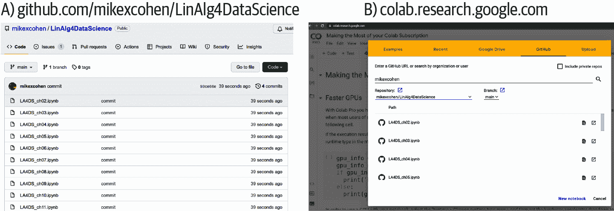
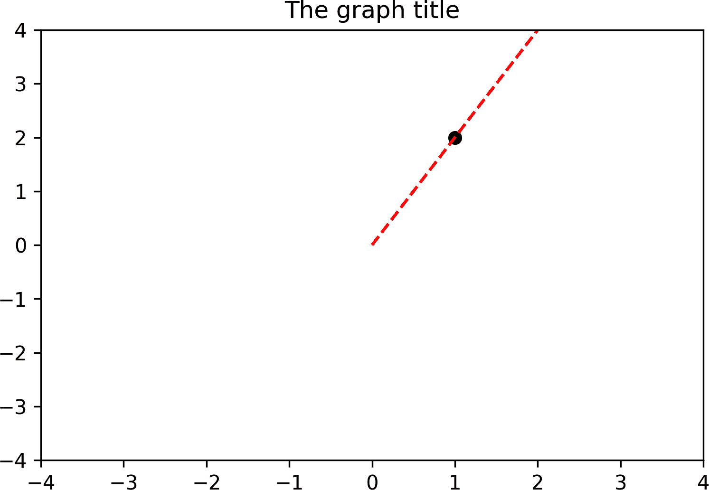
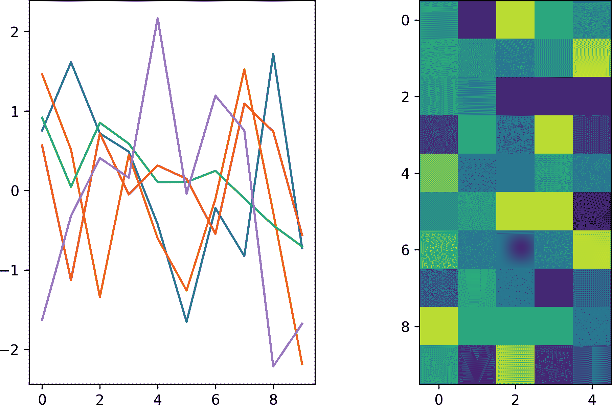
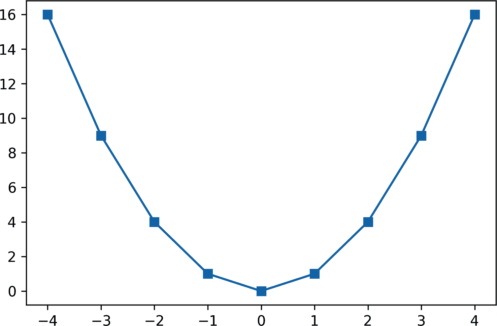
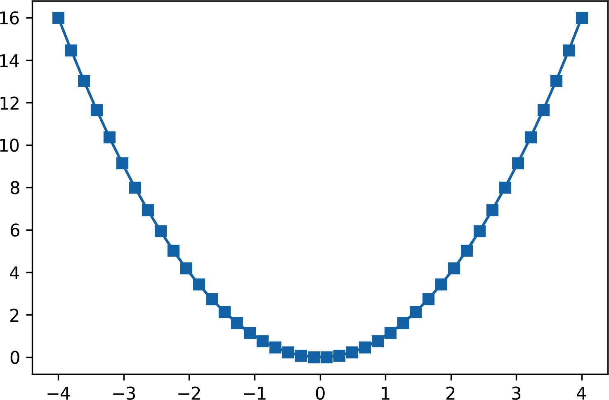
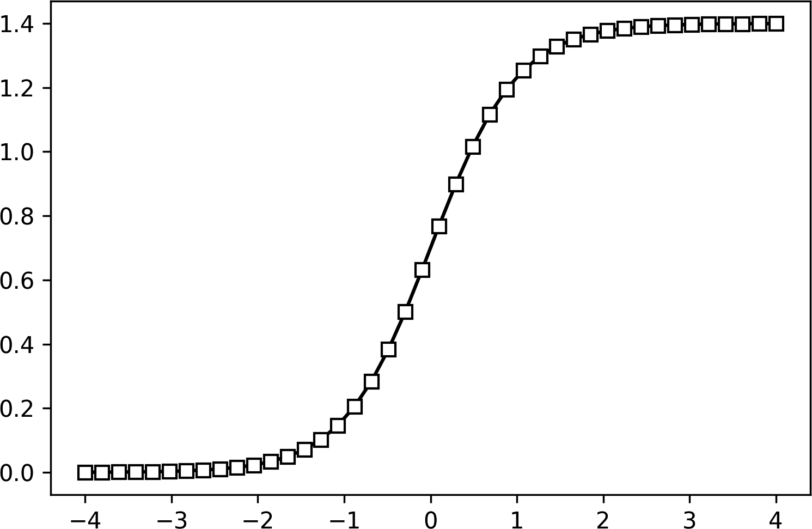

# 第十六章：Python 教程

如我在第一章中所解释的，这一章节是关于 Python 编程的速成课程。它旨在让你迅速掌握基础知识，以便跟上本书其余部分的代码，但并不旨在成为 Python 掌握的完整来源。如果你正在寻找一本专门的 Python 书籍，我推荐[*Learning Python*](https://oreil.ly/learning-python)（由 Mark Lutz（O’Reilly）著）。

在阅读本章节时，请打开一个 Python 会话。（稍后我会解释如何操作。）你不仅仅通过*阅读*本章节来学习 Python；你需要阅读、在 Python 中输入代码、修改和测试代码等等。

此外，在本章中，你应该手动键入所有在此处打印的代码。本书的所有其他章节的代码都可以在网上找到，但我希望你手动输入本章的代码。一旦你更熟悉 Python 编码，手动输入大量代码会显得乏味且浪费时间。但当你初学编程时，你需要*编码*——也就是用手指键入所有内容。不要只是看页面上的代码。

# 为什么选择 Python，以及有哪些替代方案？

Python 被设计成一种通用编程语言。你可以使用 Python 进行文本分析、处理 Web 表单、创建算法以及无数其他应用。Python 在数据科学和机器学习中也被广泛使用；对于这些应用程序，Python 基本上只是一个计算器。嗯，它是一个非常强大和多功能的计算器，但我们（人类）还不够聪明，不能用头脑或纸和笔完成所有数值计算。

Python 目前（2022 年）是数据科学中最常用的数值处理程序（其他竞争者包括 R、MATLAB、Julia、JavaScript、SQL 和 C）。Python 是否会继续保持数据科学的主导语言？我不知道，但我表示怀疑。计算机科学的历史充满了声称将永存的“最终语言”。（你有没有编写过 FORTRAN、COBOL、IDL、Pascal 等？）但 Python 目前非常流行，*现在*你正在学习应用线性代数。无论如何，好消息是编程语言具有强大的迁移学习能力，这意味着建立 Python 熟练度将有助于你学习其他语言。换句话说，学习 Python 的时间是投资，而不是浪费。

# IDE（交互式开发环境）

Python 是一种编程语言，你可以在许多不同的应用程序中运行 Python，这些应用程序被称为*环境*。不同的环境由不同的开发者按照不同的偏好和需求创建。你可能会遇到的一些常见 IDE 包括 Visual Studio、Spyder、PyCharm 和 Eclipse。也许最常用于学习 Python 的 IDE 称为 Jupyter 笔记本。

我使用 Google 的 Colab Jupyter 环境为本书编写了代码（下一节将详述）。一旦您熟悉了 Jupyter，可以花些时间尝试其他 IDE，看看它们是否更适合您的需求和偏好。然而，在这里我建议使用 Jupyter，因为它将帮助您跟随并重现图表。

# 本地和在线使用 Python

因为 Python 是免费且轻量级的，可以在各种操作系统上运行，无论是在您的计算机上还是在云服务器上：

在本地运行 Python

您可以在任何主要操作系统上安装 Python（Windows、Mac、Linux）。如果您习惯于安装程序和软件包，那么您可以根据需要安装库。对于本书，您主要需要 NumPy、matplotlib、SciPy 和 sympy。

但如果您正在阅读这篇文章，那么您的 Python 技能可能有限。在这种情况下，我建议通过[Anaconda 软件包](https://www.anaconda.com)安装 Python。它是免费且易于安装，Anaconda 将自动安装您在本书中所需的所有库。

在线运行 Python

在阅读本书时，我建议在网络上运行 Python。云端 Python 的优势在于您无需在本地安装任何内容，也无需使用自己的计算资源，您可以从任何浏览器、任何计算机和任何操作系统访问您的代码。我更喜欢使用 Google 的 Colaboratory 环境，因为它与我的 Google Drive 同步。这使我可以将 Python 代码文件保存在我的 Google Drive 上，然后从[*https://colab.research.google.com*](https://colab.research.google.com)打开它们。如果您希望避免使用 Google 服务，还有其他几个基于云的 Python 环境可供选择（尽管我不确定是否真的可能）。

Google Colab 可免费使用。您需要一个 Google 账号来访问它，但这也是免费的。然后您可以简单地将代码文件上传到您的 Google Drive，并在 Colab 中打开它们。

## 在 Google Colab 中使用代码文件

现在我将解释如何下载和访问本书的 Python 笔记本文件。如我之前所述，本章节没有代码文件。

有两种方法可以将书中的代码放到您的 Google Drive 上：

+   前往[*https://github.com/mikexcohen/LinAlg4DataScience*](https://github.com/mikexcohen/LinAlg4DataScience)，点击上面标有“Code”的绿色按钮，然后点击“Download ZIP”（见图 16-1）。这将下载代码仓库，然后您可以将这些文件上传到您的 Google Drive 上。现在，从您的 Google Drive 上，您可以双击文件，或者右键点击并选择“使用 Google Colaboratory”进行打开。

+   直接转到[*https://colab.research.google.com*](https://colab.research.google.com)，选择“GitHub”选项卡，并在搜索栏中搜索“mikexcohen”。您将找到我所有的公共 GitHub 存储库；您需要选择名为“LinAlg4DataScience”的那一个。从那里，您可以点击其中一个文件来打开笔记本。

    请注意，这是此笔记本的只读副本；您所做的任何更改都不会被保存。因此，建议将该文件复制到您的 Google Drive 中。



###### 图 16-1\. 从 GitHub（左）获取代码到 Colab（右）

现在您已经知道如何将书中的代码文件导入 Google Colab，是时候开始使用一个全新的笔记本来开始本章的工作了。点击菜单选项“文件”，然后选择“新笔记本”以创建一个新的笔记本。它将被称为“Untitled1.ipynb”或类似的名称。（扩展名*ipynb*代表“交互式 Python 笔记本”。）建议通过点击屏幕左上角的文件名来更改文件名。默认情况下，新文件会被放置在您的 Google Drive 的“Colab Notebooks”文件夹中。

# 变量

您可以将 Python 用作计算器。让我们试试；在代码单元格中键入以下内容：

```
4 + 5.6
```

输入该代码单元格时，什么都不会发生。您需要告诉 Python 运行该代码。在单元格处*激活*（如果在单元格内看到光标闪烁，则表示代码单元格处于活动状态），通过按下键盘上的 Ctrl-Enter（Mac 上为 Command-Enter）来执行此操作。还有用于在单元格中运行代码的菜单选项，但是使用键盘快捷键编码更容易和更快。

请花点时间来探索算术运算。您可以使用不同的数字、括号进行分组以及像`-`、`/`和`*`等不同的操作。还要注意，间距不会影响结果：`2*3`与`2 * 3`是相同的。（对于 Python 编码的其他方面，间距很重要；我们稍后会详细介绍。）

对于处理单个数字来说，这种方法并不适用于应用程序。这就是为什么我们需要*变量*。变量是指向存储在内存中的数据的名称。这类似于语言如何使用单词来指代现实世界中的对象。例如，我的名字是 Mike，但我不是*Mike*；我是由数以万亿计的细胞组成的人类，这些细胞以某种方式能够行走、说话、进食、做梦、讲冷笑话以及做其他无数的事情。但这太复杂了，无法解释，因此为了方便，人们称我为“Mike X Cohen”。因此，在 Python 中，变量只是对存储的数据（如数字、图像、数据库等）的便捷引用。

我们通过为变量分配一个值来在 Python 中创建变量。键入以下内容：

```
var1 = 10
var2 = 20.4
var3 = 'hello, my name is Mike'
```

运行该单元格将创建变量。现在您可以开始使用它们了！例如，在新单元格中运行以下代码：

```
var1 + var2

>> 30.4
```

# 输出

在代码块中看到的`>>`是运行代码单元格的结果。之后的文本是在评估单元格中的代码时在屏幕上看到的内容。

现在试试这个：

```
var1 + var3
```

啊，你刚刚遇到了你的第一个 Python 错误！欢迎加入俱乐部 :) 别担心，编码错误非常常见。实际上，*优秀程序员和糟糕程序员的区别在于，优秀程序员从错误中学习，而糟糕程序员认为优秀程序员从不犯错*。

Python 中的错误可能很难理解。以下是我屏幕上的错误消息：

```
TypeError                                 Traceback (most recent call last)
<ipython-input-3-79613d4a2a16> in <module>()
      3 var3 = 'hello, my name is Mike'
      4
----> 5 var1 + var3

TypeError: unsupported operand type(s) for +: 'int' and 'str'
```

Python 用箭头指示错误行。希望这个错误消息能帮助我们理解出了什么问题以及如何解决它，错误消息会打印在底部。在这种情况下，错误消息是`TypeError`。那是什么意思，以及什么是“类型”？

## 数据类型

结果表明变量有*类型*，描述变量存储的数据种类。不同的类型使得计算更高效，因为操作在不同类型的数据上表现不同。

Python 中有许多数据类型。我将在这里介绍四种，并在你通过本书时学习更多数据类型：

整数

这些被称为`int`，是整数，如−3、0、10 和 1,234。

浮点数

这些被称为`float`，但这只是一个带有小数点的数字的术语，如−3.1、0.12345 和 12.34。请注意，`floats`和`ints`在视觉上可能相同，但它们在 Python 函数中的处理方式是不同的。例如，3 是一个`int`，而 3.0 是一个`float`。

字符串

这些被称为`str`，是文本。在这里，也要注意`*5*`（对应于字符 5 的字符串）和`5`（对应于数字 5 的`int`）之间的区别。

列表

列表是一组项目的集合，每个项目可以有不同的数据类型。

列表在 Python 编程中非常方便且无处不在。以下代码展示了列表的三个重要特征：(1) 用方括号[ ]表示，(2) 逗号分隔列表项，(3) 单个列表项可以有不同的数据类型：

```
list1 = [ 1,2,3 ]
list2 = [ 'hello',123.2,[3,'qwerty'] ]
```

第二个列表显示列表可能包含其他列表。换句话说，`list2`的第三个元素本身就是一个列表。

如果你想访问`list2`的第二个元素怎么办？可以使用*索引*提取单独的列表元素，下一节我将教你如何操作。

你可以使用函数`type`来确定数据类型。例如，在一个新的单元格中评估以下内容：

```
type(var1)
```

嘿，等等，什么是“函数”？你可以期待在下下节中学习如何使用和创建函数；首先我想回到索引的话题。

# 我的变量应该叫什么？

变量命名有一些严格的规则。变量名不能以数字开头（尽管可以包含数字），也不能包含空格或类似!@#$%^&*()的非字母数字字符。下划线 _ 是允许的。

变量命名也有一些指导方针。最重要的指导方针是使变量名有意义且可解释。例如，`rawDataMatrix`比`q`要好得多作为变量名。在代码中可能会创建数十个变量，你希望能够从变量名推断出变量所引用的数据。

## 索引

*索引*意味着访问列表（以及相关数据类型，包括向量和矩阵）中的特定元素。这是如何提取列表的第二个元素：

```
aList = [ 19,3,4 ]
aList[1]

>> 3
```

注意，索引是在变量名后面使用方括号进行的，然后是你想要索引的数字。

但等一下 —— 我写道我们想要*第二个*元素；为什么代码访问元素`1`呢？这不是打字错误！Python 是一种从 0 开始索引的语言，这意味着索引`0`是第一个元素（在本例中是数字 19），索引`1`是第二个元素，依此类推。

如果你对从 0 开始的编程语言感到陌生，那么这似乎很奇怪和令人困惑。我完全理解。我希望能说练习一段时间后就能变得很熟练，但事实是从 0 开始的索引总是会引起困惑和错误。这只是你必须注意的一点。

如何访问`aList`中的数字 4？你可以直接索引为`aList[2]`。但是 Python 的索引具有一个巧妙的特性，你可以*反向*索引列表元素。要访问列表的最后一个元素，你可以输入`aList[-1]`。你可以将`-1`视为环绕到列表末尾。同样，倒数第二个列表元素是`aList[-2]`，依此类推。

# 函数

*函数*是一个可以多次运行而无需重复键入所有单独代码片段的代码集合。有些函数很短，只包含几行代码，而其他函数可能有数百或数千行代码。

在 Python 中使用括号紧跟在函数名后面表示函数。以下是一些常见的函数：

```
type()  # returns the data type
print() # prints text information to the notebook
sum()   # adds numbers together
```

函数可以接受输入并可能提供输出。Python 函数的一般结构如下：

```
output1,output2 = functionname(input1,input2,input3)
```

回到以前的函数：

```
dtype = type(var1)
print(var1+var2)
total = sum([1,3,5,4])

>> 30.4
```

`print()`是一个非常有用的函数。Python 仅打印单元格中最后一行的输出，而且只有当该行不涉及变量赋值时才会这样做。例如，写下以下代码：

```
var1+var2
total = var1+var2
print(var1+var2)
newvar = 10

>> 30.4
```

有四行代码，所以你可能期望 Python 给出四个输出。但只给出一个输出，对应于`print()`函数。前两行不打印其输出，因为它们不是最终行，而最后一行不打印其输出，因为它是变量赋值。

## 方法作为函数

*方法*是直接在变量上调用的函数。不同的数据类型有不同的方法，这意味着适用于列表的方法可能不适用于字符串。

例如，列表数据类型有一个称为`append`的方法，可以向现有列表添加额外的元素。这里有一个例子：

```
aSmallList = [ 'one','more' ]
print(aSmallList)

aSmallList.append( 'time' )
print(aSmallList)

>> ['one','more']
['one','more','time']
```

注意语法格式：方法与函数类似，都有括号和（对于某些方法）输入参数。但是方法与变量名用句点连接，并且可以直接修改变量而无需显式输出。

请稍等片刻，更改代码以使用不同的数据类型——例如，使用字符串而不是列表。重新运行代码将生成以下错误消息：

```
AttributeError: 'str' object has no attribute 'append'
```

此错误消息意味着字符串数据类型不识别`append`函数（*属性*是变量的属性；方法是其中一种属性）。

方法是面向对象编程和类的核心部分。这些是 Python 的方面，应在专门的 Python 书籍中讨论，但不用担心——你不需要完全理解面向对象编程就能学习本书的线性代数部分。

## 编写自定义函数

Python 中有*许多*可用的函数。太多了，数不胜数。但永远不会有完美的函数能够完全满足你的需求。因此，你最终会编写自己的函数。

创建自己的函数既简单又方便；您使用内置关键字`def`定义函数（*关键字*是保留名称，不能重新定义为变量或函数），然后指定函数名和可能的输入，并以冒号结束该行。之后的任何行，如果缩进两个空格，则包括在函数中。¹ Python 对行首的空格要求非常严格（但对行内其他地方的空格则不那么严格）。任何输出都由`return`关键字指示。

让我们从一个简单的例子开始：

```
def add2numbers(n1,n2):
  total = n1+n2
  print(total)
  return total
```

此函数接受两个输入并计算、打印和输出它们的总和。现在是调用函数的时候了：

```
s = add2numbers(4,5)
print(s)

>> 9
9
```

为什么数字`9`会出现两次？它被打印一次是因为在函数内部调用了`print()`函数，然后当我在函数后调用`print(s)`时，它第二次被打印出来了。要确认这一点，请尝试更改调用函数后的行为`print(s+1)`。 （修改代码以查看输出效果是学习 Python 的好方法；只需确保撤销您的更改。）

注意，在函数内部分配给输出的变量名（`total`）可以与我调用函数时使用的变量名（`s`）不同。

编写自定义函数允许灵活性很高——例如，设置可选输入和默认参数，检查数据类型和一致性等。但是对函数的基本理解对本书已经足够。

## 库

Python 设计为安装和运行都简单快速。但缺点是 Python 的基本安装只带有少量内置函数。

因此，开发人员创建了专注于特定主题的函数集合，称为*库*。一旦将库导入 Python，你就可以访问该库中所有可用的函数、变量类型和方法。

根据 Google 搜索，Python 有超过 130,000 个库。别担心，你不需要记住它们所有！在本书中，我们将只使用一些专门用于数值处理和数据可视化的库。线性代数最重要的库称为*NumPy*，这是“numerical Python”的合成词。

Python 库与基本的 Python 安装分开，这意味着你需要从网上下载它们，然后导入到 Python 中。这使得它们可以在 Python 内部使用。你只需要下载它们一次，但在每个 Python 会话中都需要重新导入它们。²

## NumPy

要将 NumPy 库导入 Python，输入：

```
import numpy as np
```

注意导入库的一般公式：`import libraryname as abbreviation`。缩写是一个便捷的快捷方式。要访问库中的函数，你写下库的缩写名称、一个点，和函数的名称。例如：

```
average = np.mean([1,2,3])
sorted1 = np.sort([2,1,3])
theRank = np.linalg.matrix_rank([[1,2],[1,3]])
```

代码的第三行显示，库可以有子库，或者*模块*，嵌套在其中。在这种情况下，NumPy 有许多函数，然后在 NumPy 内部有一个名为`linalg`的库，其中包含更多特别与线性代数相关的函数。

NumPy 有自己的数据类型称为*NumPy 数组*。NumPy 数组最初看起来类似于列表，因为它们都存储信息的集合。但 NumPy 数组只存储数字，并且具有对数学编码有用的属性。以下代码显示如何创建一个 NumPy 数组：

```
vector = np.array([ 9,8,1,2 ])
```

## NumPy 中的索引和切片

我想回到讨论如何访问变量内的单个元素。你可以使用索引来访问 NumPy 数组的一个元素，方法与索引列表完全相同。在以下代码块中，我使用`np.arange`函数创建了一个整数数组从-4 到`4。在代码中没有错误，第二个输入是+5`，但返回的值结束于 4。Python 通常使用*排除*上界，这意味着 Python 计数直到但*不包括*你指定的最后一个数字：

```
ary = np.arange(-4,5)
print(ary)
print(ary[5])

>> [-4 -3 -2 -1  0  1  2  3  4]
1
```

这一切都很好，但如果你想访问前三个元素呢？或者每隔一个元素呢？现在是从*索引*进入*切片*的时候了。

切片很简单：用冒号指定起始和结束索引。只需记住 Python 的范围有排除上界。因此，要获取数组的前三个元素，我们切片到索引 3 + 1 = 4，但我们需要考虑基于 0 的索引，这意味着前三个元素的索引是 0、1 和 2，我们使用`0:3`来切片：

```
ary[0:3]

>> array([-4, -3, -2])
```

你可以使用跳过操作符索引每个第二个元素：

```
ary[0:5:2]

>> array([-4, -2, 0])
```

索引与跳过的形式是`[start:stop:skip]`。你可以通过跳过-1 来反向运行整个数组，就像这样：`ary[::-1]`。

我知道，有点令人困惑。我保证通过实践，这将变得更容易。

# 可视化

线性代数中的许多概念——以及数学的大多数其他领域——最好通过计算机屏幕来理解。

Python 中的大多数数据可视化由 matplotlib 库处理。图形显示的某些方面取决于 IDE。然而，本书中的所有代码在任何 Jupyter 环境下（通过 Google Colab、另一个云服务器或本地安装）都可以直接使用。如果你使用不同的 IDE，可能需要进行一些微调。

打`matplotlib.pyplot`真的很繁琐，所以通常将这个库缩写为`plt`。你可以在下一个代码块中看到这一点。

让我们从绘制点和线开始。看看你能否理解以下代码如何映射到图 16-2：

```
import matplotlib.pyplot as plt
import numpy as np

plt.plot(1,2,'ko') # 1) plot a black circle
plt.plot([0,2],[0,4],'r--') # 2) plot a line
plt.xlim([-4,4]) # 3) set the x-axis limits
plt.ylim([-4,4]) # 4) set the y-axis limits
plt.title('The graph title') # 5) graph title
```



###### 图 16-2\. 数据可视化，第一部分

你成功解码了这段代码吗？代码行＃1 表示在 XY 位置`1,2`处绘制一个黑色圆圈（`ko`中的`k`是黑色，`o`是圆圈）。代码行＃2 提供的是数字列表而不是单个数字。这指定了一条从 XY 坐标（0, 0）开始并以坐标（2, 4）结束的线条。`r--`表示红色虚线。代码行＃3 和＃4 设置了*x*轴和*y*轴的限制，当然，线＃5 创建了一个标题。

在继续之前，花点时间探索这段代码。画一些额外的点和线，尝试不同的标记（提示：探索字母`o`、`s`和`p`）和不同的颜色（尝试`r`、`k`、`b`、`y`、`g`和`m`）。

下一个代码块介绍了子图和图像。*子图*是将图形区域（称为*图*）分割成一个网格，可以在其中绘制不同的可视化方式。与前一个代码块类似，请在阅读我的描述之前看看你能否理解这段代码是如何生成图 16-3 的：

```
_,axs = plt.subplots(1,2,figsize=(8,5)) # 1) create subplots
axs[0].plot(np.random.randn(10,5)) # 2) line plot on the left
axs[1].imshow(np.random.randn(10,5)) # 3) image on the right
```



###### 图 16-3\. 数据可视化，第二部分

Code line #1 创建子图。`plt.subplots` 函数的前两个输入指定了网格的几何结构——在这种情况下，是一个<math alttext="1 times 2"><mrow><mn>1</mn> <mo>×</mo> <mn>2</mn></mrow></math>子图矩阵，意味着一行两列，也就是两个并排的图。第一个输入指定了图的总尺寸，元组中的两个元素分别对应宽度和高度（尺寸总是以宽度、高度列出，记忆顺序的助记法是 WH，代表“白宫”）。`plt.subplots` 函数提供了两个输出。第一个是整个图形的句柄，我们不需要，所以使用下划线代替变量名。第二个输出是一个包含每个轴句柄的 NumPy 数组。*句柄* 是指向图中对象的特殊类型变量。

现在来看代码行 #2。这应该看起来很熟悉，与前一个代码块相似；两个新概念是绘制到特定轴而不是整个图形（使用 `plt.`）以及输入矩阵而不是单个数字。Python 为矩阵的每一列创建一个单独的线条，这就是为什么在 图 16-3 中看到五条线的原因。

最后，代码行 #3 显示了如何创建图像。矩阵经常被视为图像，正如你在 第五章 中学到的那样。图像中每个小块的颜色映射到矩阵中的一个数值。

好吧，关于在 Python 中创建图形，还有*很多*可以说的。但我希望这个介绍足以让你入门。

# 将公式翻译成代码

将数学方程转换为 Python 代码有时简单，有时困难。但这是一项重要的技能，通过练习你会有所进步。让我们从简单的例子开始，如 方程式 16-1。

##### 方程式 16-1\. 一个方程

<math alttext="y equals x squared" display="block"><mrow><mi>y</mi> <mo>=</mo> <msup><mi>x</mi> <mn>2</mn></msup></mrow></math>

你可能认为以下代码会起作用：

```
y = x**2
```

但你会收到一个错误消息 (`NameError: name *x* is not defined`)。问题在于我们在定义变量 `x` 之前尝试使用它。那么如何定义 `x` 呢？实际上，当你看数学方程时，你定义了 *x* 而并没有真正考虑它：*x* 的范围从负无穷到正无穷。但你不会画出那么远的函数 —— 你可能会选择一个有限的范围来绘制该函数，也许是 −4 到 +4。这个范围是我们在 Python 中要指定的：

```
x = np.arange(-4,5)
y = x**2
```

图 16-4 展示了使用 `plt.plot(x,y,'s-')` 创建的函数图。



###### 图 16-4\. 数据可视化，第三部分

看起来还行，但我觉得它有些粗糙；我希望线条更平滑。我们可以通过增加分辨率来实现这一点，这意味着在−4 到+4 之间有更多的点。我将使用函数 `np.linspace()`，它接受三个输入：起始值、终止值和中间点数：

```
x = np.linspace(-4,4,42)
y = x**2
plt.plot(x,y,'s-')
```

现在我们在−4 和+4 之间均匀分布的 42 个点。这使得绘图更平滑（图 16-5）。注意，`np.linspace`输出的向量以+4 结束。这个函数具有包含边界。有些函数是包含边界的，有些是排除边界的，这有点令人困惑。别担心，你会掌握的。



###### 图 16-5\. 数据可视化，第四部分

让我们试试另一个函数到代码的转换。我还要借此机会向你介绍一个叫做*软编码*的概念，这意味着为可能稍后更改的参数创建变量。

在查看我接下来的代码之前，请将以下数学函数翻译成代码并生成绘图：

<math display="block"><mtable displaystyle="true"><mtr><mtd columnalign="right"><mrow><mi>f</mi> <mo>(</mo> <mi>x</mi> <mo>)</mo></mrow></mtd> <mtd columnalign="left"><mrow><mo>=</mo> <mfrac><mi>α</mi> <mrow><mn>1</mn><mo>+</mo><msup><mi>e</mi> <mrow><mo>-</mo><mi>β</mi><mi>x</mi></mrow></msup></mrow></mfrac></mrow></mtd></mtr> <mtr><mtd columnalign="right"><mi>α</mi></mtd> <mtd columnalign="left"><mrow><mo>=</mo> <mn>1.4</mn></mrow></mtd></mtr> <mtr><mtd columnalign="right"><mi>β</mi></mtd> <mtd columnalign="left"><mrow><mo>=</mo> <mn>2</mn></mrow></mtd></mtr></mtable></math>

这个函数称为*S 型函数*，在应用数学中经常用作非线性激活函数，例如在深度学习模型中。<math alttext="alpha"><mi>α</mi></math>和<math alttext="beta"><mi>β</mi></math>是该方程的参数。在这里，我已经为它们设置了具体的值。但一旦你的代码运行起来，你可以探索改变这些参数对生成图表的影响。实际上，使用代码理解数学，我个人认为，³ 是学习数学的绝佳方式。

有两种方法可以编写此函数。一种是直接将<math alttext="alpha"><mi>α</mi></math>和<math alttext="beta"><mi>β</mi></math>的数值放入函数中。这是*硬编码*的一个例子，因为参数数值直接实现在函数中。

另一种方法是将 Python 变量设置为这两个参数，然后在创建数学函数时使用这些参数。这就是*软编码*，它使得你的代码更易于阅读、修改和调试：

```
x = np.linspace(-4,4,42)
alpha = 1.4
beta  = 2

num = alpha # numerator
den = 1 + np.exp(-beta*x) # denominator
fx  = num / den
plt.plot(x,fx,'s-');
```

注意，我已经将函数创建分成了三行代码，分别指定了分子和分母，然后它们的比率。这使得你的代码更清晰、更易读。始终努力使你的代码易于阅读，因为这样做（1）减少错误的风险，（2）便于调试。

图 16-6 显示了生成的 S 型曲线。花点时间玩玩代码：改变`x`变量的限制和分辨率，改变`alpha`和`beta`参数的值，甚至可能改变函数本身。*数学是美丽的，Python 是你的画布，代码是你的画笔！*



###### 图 16-6\. 数据可视化，第五部分

# 打印格式化和 F-Strings

你已经知道如何使用`print()`函数打印出变量。但那只是打印一个变量而没有其他文本。F-Strings 允许你更好地控制输出格式。观察：

```
var1 = 10.54
print(f'The variable value is {var1}, which makes me happy.')

>> The variable value is 10.54, which makes me happy.
```

注意 f-string 的两个关键特征：在第一个引号之前的`f`和用花括号{}包围的变量名称，这些变量名称会被替换为变量值。

下一个代码块进一步突显了 f-strings 的灵活性：

```
theList = ['Mike',7]
print(f'{theList[0]} eats {theList[1]*100} grams of chocolate each day.')

>> Mike eats 700 grams of chocolate each day.
```

从这个例子中学到的两个关键点：（1）别担心，我实际上不会每天吃那么多巧克力（嗯，并不是每天），以及（2）你可以使用索引和大括号内的代码，Python 会输出计算结果。

f-string 格式化的最后一个特性：

```
pi = 22/7
print(f'{pi}, {pi:.3f}')

>> 3.142857142857143, 3.143
```

该代码中的关键添加是`:.3f`，它控制输出的格式。这段代码告诉 Python 在小数点后打印三个数字。看看当你将`3`改成其他整数时会发生什么，以及在冒号前包含一个整数时会发生什么。

还有许多其他的格式选项——以及其他灵活的文本输出方式——但是对于本书而言，f-strings 的基本实现就是你需要知道的全部。

# 控制流

编程的力量和灵活性来自于赋予代码根据某些变量或用户输入状态调整其行为的能力。代码中的动态性来自于*控制流*语句。

## 比较器

*比较器*是特殊字符，允许您比较不同的值。比较器的结果是一种称为*布尔*的数据类型，它取两个值之一：`True`或`False`。以下是几个例子：

```
print( 4<5 ) # 1
print( 4>5 ) # 2
print( 4==5 ) # 3
```

这些行的输出分别是#1 为`True`，#2 和#3 为`False`。

那第三个语句包含一个双等号符号。它与单等号符号非常不同，你已经知道它用于给变量赋值。

另外两个比较器是`<=`（小于或等于）和`>=`（大于或等于）。

## 如果语句

`If`语句很直观，因为你经常使用它们：*如果我累了，那么我会休息一下眼睛*。

基本的`if`语句有三部分：`if`关键字、*条件语句*和*代码内容*。条件语句是一个评估为真或假的代码片段，后面跟着一个冒号（:）。如果条件为真，则运行所有缩进的代码；如果条件为假，则不运行任何缩进的代码，并且 Python 将继续运行未缩进的代码。

这是一个例子：

```
var = 4
if var==4:
  print(f'{var} equals 4!')

print("I'm outside the +for+ loop.")

>> 4 equals 4!
I'm outside the +for+ loop.
```

这里是另一个例子：

```
var = 4
if var==5:
  print(f'{var} equals 5!')

print("I'm outside the +for+ loop.")

>> I'm outside the +for+ loop.
```

如果第一条消息被跳过，因为 4 不等于 5；因此，条件语句为假，因此 Python 忽略所有缩进的代码。

### elif 和 else

这两个例子展示了基本的`if`语句形式。`If`语句可以包含额外的条件，以增加信息流的复杂性。在阅读我的下面对以下代码的解释和在您的计算机上输入之前，请尝试理解代码，并对打印出的消息做出预测：

```
var = 4

if var==5:
  print('var is 5') # code 1
elif var>5:
  print('var > 5') # code 2
else:
  print('var < 5') # code 3

print('Outside the if-elif-else')
```

当 Python 遇到这样的代码语句时，它会从上到下进行处理。因此，Python 将从`if`后的第一个条件开始。如果该条件为真，则 Python 将运行代码 1，然后*跳过所有后续的条件*。也就是说，一旦 Python 遇到真条件，就会运行缩进的代码，并且`if`语句结束。如果后续条件也为真，Python 不会检查它们或运行它们的缩进代码。

如果第一个条件为假，Python 将继续下一个条件，即`elif`（短为“else if”）。同样，如果条件为真，则 Python 将运行缩进的代码，否则将跳过缩进的代码。此代码示例显示了一个`elif`语句，但您可以有多个这样的语句。

`else`语句最终没有条件。这就像`if`语句的“备选方案”：如果所有前面的条件都为假，则运行它。如果至少一个条件为真，则不会评估`else`代码。

此代码示例的输出是：

```
var <5
Outside the if-elif-else
```

### 多个条件

您可以使用`and`和`or`组合条件。这是“如果下雨*并且*我需要步行，则我会带上雨伞”的编码类比。以下是几个示例：

```
if 4==4 and 4<10:
  print('Code example 1.')

if 4==5 and 4<10:
  print('Code example 2.')

if 4==5 or 4<10:
  print('Code example 3.')

>> Code example 1.
Code example 3.
```

文本`Code example 2`没有打印，因为 4 不等于 5。然而，使用`or`时，*至少一个*条件为真，因此运行了后续代码。

## `For`循环

现在你的 Python 技能已经足以打印出 1–10 的数字。你可以使用以下代码：

```
print(1)
print(2)
print(3)
```

等等。但这不是一种可扩展的策略——如果我让你打印出一百万以内的数字呢？

在 Python 中重复代码是通过*循环*来完成的。最重要的一种循环称为*`for`循环*。要创建一个`for`循环，您指定一个可迭代对象（*iterable*是一个用于迭代变量中的每个元素的变量；列表可以用作可迭代对象），然后指定在`for`循环内运行的任意数量的代码行。我将从一个非常简单的示例开始，然后我们将进一步构建：

```
for i in range(0,10):
  print(i+1)
```

运行该代码将输出 0 到 10 的数字。函数`range()`创建一个具有自己的数据类型*range*的可迭代对象，通常用于`for`循环。范围变量包含从 0 到 9 的整数。（不包括上限！另外，如果从 0 开始计数，则不需要第一个输入，因此`range(10)`与`range(0,10)`相同）。但我的指令是打印 1 到 10 的数字，因此我们需要在`print`函数内添加 1。此示例还突出显示您可以将迭代变量用作常规数值变量。

`for`循环可以迭代其他数据类型。考虑以下示例：

```
theList = [ 2,'hello',np.linspace(0,1,14) ]
for item in theList:
  print(item)
```

现在我们正在对列表进行迭代，循环变量`item`在每次迭代时设置为列表中的每个项目。

## 嵌套控制语句

将流程控制语句嵌套在其他流程控制语句中可以为您的代码增加额外的灵活性。试着弄清楚代码的作用并对其输出进行预测。然后将其输入 Python 并测试您的假设：

```
powers = [0]*10

for i in range(len(powers)):
  if i%2==0 and i>0:
    print(f'{i} is an even number')

  if i>4:
    powers[i] = i**2

print(powers)
```

我还没有教你关于`%`运算符。这被称为*模运算符*，它返回除法后的余数。因此，7%3 = 1，因为 3 可以整除 7 两次，余数为 1。同样，6%2 = 0，因为 2 可以整除 6 三次，余数为 0。事实上，对于*所有*偶数，k%2 = 0；对于*所有*奇数，k%2 = 1。因此，类似于`i%2==0`的语句是测试数值变量`i`是偶数还是奇数的一种方法。

# 测量计算时间

在编写和评估代码时，您通常会想知道计算机运行某些代码需要多长时间。在 Python 中，有几种测量经过时间的方法；这里展示了一种简单的方法，使用时间库：

```
import time

clockStart = time.time()
# some code here...
compTime = time.time() - clockStart
```

这个想法是查询操作系统的本地时间两次（这是函数`time.time()`的输出）：一次是在运行某些代码或函数之前，一次是在运行代码之后。时钟时间的差异就是计算时间。结果是以秒为单位的经过时间。通常可以将结果乘以 1,000 以将结果以毫秒（ms）打印出来。

# 获取帮助和进一步学习

我相信你听过这句话“数学不是一项旁观运动”。编程也是如此：学习编程的唯一方法就是编程。你会犯很多错误，会因为无法弄清楚如何让 Python 按照你的意愿运行而感到沮丧，会看到很多你无法解释的错误和警告信息，只会对宇宙和其中的一切感到非常恼火。（是的，你知道我指的是什么感觉。）

## 当事情出现问题时该怎么办

请允许我自我放纵地讲个笑话：四个工程师上了一辆车，但车发动不了。机械工程师说：“这可能是正时皮带的问题。”化学工程师说：“不，我认为问题在于气体/空气混合物。”电气工程师说：“听起来像是火花塞有问题。”最后，软件工程师说：“我们只需下车再上车。”

故事的寓意是，当你在代码中遇到一些无法解释的问题时，可以尝试重新启动*内核*，这是运行 Python 的引擎。这不会修复编程错误，但可能会解决由于变量被覆盖或重命名、内存超载或系统故障而引起的错误。在 Jupyter 笔记本中，您可以通过菜单选项重新启动内核。请注意，重新启动内核会清除所有变量和环境设置。您可能需要重新从头运行代码。

如果错误持续存在，那么搜索互联网上的错误消息、你正在使用的函数名称或问题描述的简要说明。Python 拥有庞大的国际社区，有许多在线论坛讨论和解决 Python 编程问题和困惑。

# 总结

掌握像 Python 这样的编程语言需要多年的专注学习和实践。即使达到一个良好的初学者水平也需要几周甚至几个月的时间。希望本章为你提供了足够的技能来完成这本书。但正如我在第一章中所写的，如果你发现自己理解数学但在代码上苦苦挣扎，那么你可能需要放下这本书，进行更多的 Python 训练，然后再回来。

另一方面，你也应该把这本书看作是提高你的 Python 编程技能的一种方式。所以如果你不理解书中的某些代码，学习线性代数就是学习更多 Python 的完美借口！

¹ 一些集成开发环境接受两个或四个空格；其他只接受四个空格。我认为两个空格看起来更清晰。

² 如果你通过 Anaconda 安装了 Python，或者你正在使用 Google 的 Colab 环境，你不需要为本书下载任何库，但你需要导入它们。

³ 据说这是千禧一代的术语，意思是“依我拙见”。
