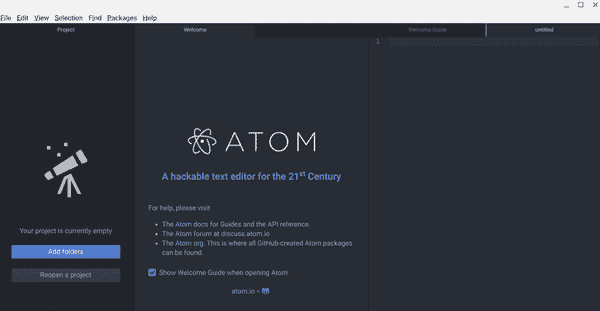

# 第一章：介绍数据整理和数据质量

如今，似乎数据是解决所有问题的答案：我们利用产品和餐厅评论中的数据来决定购买和就餐地点；公司利用我们阅读、点击和观看的数据来决定生产什么内容和展示哪些广告；招聘人员使用数据来决定哪些申请者可以获得面试机会；政府利用数据决定从如何分配公路资金到您的孩子就读学校的所有事务。数据——无论是简单的数字表格还是“人工智能”系统的基础——渗透着我们的生活。数据对我们每天的经历和机会产生的广泛影响正是为何数据整理——以及将继续成为——任何有兴趣了解和影响数据驱动系统运作方式的人必备的技能。同样，评估——甚至改善——数据质量的能力对于希望使这些有时（深度）有缺陷的系统更加有效的人来说也是不可或缺的。

尽管术语*数据整理*和*数据质量*对不同人意味着不同的事物，我们将从本章开始简要概述本书涉及的三个主要主题：数据整理、数据质量和 Python 编程语言。这一概述的目标是让您对我对这些主题的方法有所了解，部分原因是您可以判断本书是否适合您。之后，我们将花一些时间讨论如何访问和配置软件工具及其他资源，这些工具和资源是您需要跟随和完成本书中练习所必需的。尽管本书引用的所有资源都是免费使用的，但许多编程书籍和教程默认读者会在自己拥有的（通常是相当昂贵的）计算机上编程。然而，由于我*真的*相信任何有意愿的人都可以学会使用 Python 整理数据，我希望确保即使您没有自己的功能齐全的计算机，本书中的内容也可以为您提供帮助。为了帮助确保这一点，您在本书和接下来的章节中找到的所有解决方案都是在 Chromebook 上编写和测试的；它们也可以使用免费的在线工具在您自己的设备或学校或公共图书馆等地的共享计算机上运行。我希望通过展示数据整理的知识和工具不仅是可获得的，而且是激发和赋权的实践，来鼓励您探索这个令人兴奋的实践领域。

# “数据整理”是什么？

数据整理是将“原始”或“找到的”数据转换为可用于生成见解和意义的过程。驱动每一个实质性数据整理工作的是一个*问题*：关于您想调查或了解更多的世界的某些内容。当然，如果您来到这本书是因为您对学习编程感到非常兴奋，那么数据整理可以是一个很好的开始方法，但让我现在敦促您不要试图在没有参与前几章节中的数据质量过程的情况下直接跳到编程。因为数据整理虽然可以从编程技能中受益，但它远不止于学习如何访问和操作数据；它涉及做出判断、推理和选择。正如本书将阐明的那样，大多数容易获取的数据质量并不特别好*质量*，因此如果不考虑数据质量就尝试进行数据整理，就像试图在没有方向盘的情况下驾驶汽车一样：您可能会到达*某个地方*——并且很快！——但那可能不是您想要去的地方。如果您打算花时间整理和分析数据，您应该尽量确保这至少是*有可能*值得努力的数据。

然而，与此同样重要的是，没有比将新技能与您真正*想要*做到“正确”的事情联系起来更好的学习方式，因为个人兴趣将帮助您度过不可避免的挫折。这并不意味着您选择的问题必须具有全球重要性。它可以是关于您喜爱的视频游戏、乐队或茶叶类型的问题。它可以是关于您学校、社区或社交媒体生活的问题。它可以是关于经济、政治、信仰或金钱的问题。它只需是*您*真正关心的事情。

一旦您掌握了问题，您就可以开始数据整理过程。尽管具体步骤可能需要根据您的特定项目进行调整（或重复），但原则上，数据整理涉及以下一些或所有步骤：

1.  定位或收集数据

1.  审查数据

1.  “清理”，标准化，转换和/或增强数据

1.  分析数据

1.  可视化数据

1.  传达数据

当然，每个步骤所需的时间和精力可能差异很大：如果您希望加快您已经在工作中进行的数据整理任务，您可能已经掌握了数据集，并基本知道其包含内容。另一方面，如果您试图回答关于您社区中城市支出的问题，那么收集数据可能是您项目中最具挑战性的部分。

此外，请注意，尽管我已经对前述列表进行了编号，但数据处理过程实际上更像是一个循环而不是线性的步骤集。往往情况是，随着你对正在处理的数据的含义和背景了解得更多，你需要重新审视早期的步骤。例如，在分析大型数据集时，你可能会发现令人惊讶的模式或值，这会导致你对在“审查”步骤中可能做出的假设产生疑问。这几乎总是意味着需要获取更多信息——要么来自原始数据源，要么是完全新的数据源——以便在继续分析或可视化之前真正理解正在发生的事情。最后，虽然我没有明确将其列入列表中，但每个步骤最好以*研究和*开头会更加准确。虽然我们工作中的“整理”部分主要集中在我们面前的数据集（们）上，但“质量”部分几乎完全是关于研究和背景的，并且这两者对数据整理过程的每个阶段都是至关重要的。

如果现在所有这些看起来有点令人不知所措，请不要担心！本书中的示例都是围绕真实数据集构建的，当你跟随编码和质量评估过程时，这一切将开始感觉更加自然。如果你正在进行自己的数据整理项目，并开始感到有点迷茫，只需不断提醒自己你试图回答的问题。这不仅会提醒你为什么要费心学习关于数据格式和 API 访问密钥的细枝末节，¹ 它几乎总是会直观地引导你进入数据整理过程的下一个“步骤”——无论是可视化数据还是进行一点点*更多*的研究以改善其背景和质量。

# 什么是“数据质量”？

世界上有大量的数据和访问和收集它的方式。但并非所有数据都是平等的。理解数据质量是数据整理的重要组成部分，因为任何基于数据驱动的洞见都只能像其构建在之上的数据一样好。² 因此，如果你试图用数据理解世界的某些有意义的事物，你必须首先确保你所拥有的数据能够准确反映这个世界。正如我们将在后面的章节中看到（特别是第三章和第六章），改进数据质量的工作几乎永远不像通常看起来整洁的、标签清晰的行和列数据那样简单明了。

这是因为——尽管使用了像*机器学习*和*人工智能*这样的术语——计算工具能做的唯一事情就是按照给定给它们的指令使用提供的数据。即使是最复杂、最先进和最抽象的数据在其实质上也是不可逆转地人类的，因为它是关于如何测量和如何测量的人类决策的结果。此外，即使是今天最先进的计算机技术也是通过大规模的模式匹配来进行“预测”和“决策”——这些模式存在于*人类*“训练”它们提供的数据的特定选择中。*计算机没有原创思想，也不会进行创造性的跳跃*；它们在许多任务（如解释论点的“要旨”或故事情节）上基本上是不擅长的，这是人类找到直觉的地方。另一方面，计算机擅长执行重复的计算，非常快速，而不会感到无聊、疲倦或分心。换句话说，尽管计算机是人类判断和智慧的奇妙补充，但它们只能增强它们，而不能替代它们。

这意味着参与数据收集、获取和分析的人类必须确保其质量，以便我们的数据工作的输出实际上*具有意义*。虽然我们将在第三章中详细讨论数据质量，但我确实希望介绍两个不同（尽管同样重要）的评估数据质量的维度：（1）数据本身的完整性，以及（2）数据与特定问题或问题的“匹配”或适当性。

## 数据完整性

对于我们的目的，数据集的*完整性*是通过构成它的数据值和描述符来评估的。例如，如果我们的数据集包括随时间的测量结果，它们是按一致的间隔记录还是零散记录的？这些数值代表直接的个体读数，还是只有平均值可用？是否有*数据字典*提供有关数据收集、记录或解释的详细信息，例如提供相关单位？一般来说，数据*完整*、*原子化*和*良好注释*—等特性使其被认为具有更高的完整性，因为这些特点使得进行更广泛和更结论性的分析成为可能。然而，在大多数情况下，您会发现某个给定的数据集在任何数据完整性维度上都不足，这意味着您需要尽力了解其局限性并在可能的情况下加以改进。尽管这通常意味着通过找到其他可以补充、上下文化或扩展它的数据集来增强给定的数据集，但几乎*总是*意味着超越任何种类的“数据”并联系到专家：那些设计数据、收集数据、以前使用过数据或对您的数据应该解决的主题领域非常了解的人。

## 数据“匹配”

然而，即使数据集完整性很好，除非它*也*适合你的特定目的，否则不能被视为高质量的数据。比如说，假设你有兴趣知道哪个 Citi Bike 站点在给定的 24 小时内租借和归还了最多的自行车。尽管实时的[Citi Bike API](http://gbfs.citibikenyc.com/gbfs/gbfs.json)包含高完整性的数据，但它对于回答哪个 Citi Bike 站点在特定日期看到最大周转量的问题并不合适。在这种情况下，使用[Citi Bike“行程历史”数据](https://s3.amazonaws.com/tripdata/index.html)来回答这个问题会更好。

当然，很少有数据拟合问题能如此简单解决；通常我们必须在能够自信地知道我们的数据集*确实*适合我们选择的问题或项目之前进行大量的完整性工作。然而，无法绕过这种时间投入：无论是数据完整性还是数据拟合的捷径最终都会损害数据整理工作的质量和相关性。事实上，今天计算系统造成的许多危害都与数据拟合问题有关。例如，使用描述一个现象（如收入）的数据来尝试回答有关一个潜在相关但基本上不同的现象（如教育程度）的问题，可能导致对世界发生情况的扭曲结论，有时带来毁灭性后果。在某些情况下，使用这样的代理测量是不可避免的。例如，基于患者可观察症状的初始医疗诊断可能需要提供紧急治疗，直到更为确定的测试结果可用。然而，尽管在个体层面上有时可以接受这样的代替物，但任何代理测量与真实现象之间的差距随着数据和使用它的系统规模而扩大。当这种情况发生时，我们最终得到的是对我们希望阐明的现实的极度扭曲视图。幸运的是，我们将在第三章中进一步探讨的一些方法可以防止这些类型的错误。

# 为什么选择 Python？

如果你正在阅读本书，很可能已经听说过 Python 编程语言，并且你甚至可能相当确定它是开始或扩展数据整理工作的正确工具。即使是这种情况，我认为简要回顾一下 Python 特别适合本书中我们将要进行的数据整理和质量工作的原因也是值得的。当然，如果你之前*没有*听说过 Python，那么请将其视为介绍什么使它成为当今使用中最流行和功能强大的编程语言之一。

## 多功能性

作为一种通用编程语言，Python 的最大优势之一是其多功能性：可以轻松地用于访问 API、从网络中抓取数据、进行统计分析以及生成有意义的可视化。虽然许多其他编程语言也能完成其中的一些功能，但很少有像 Python 一样在所有这些方面表现得如此出色。

## 可访问性

Python 创建者 Guido van Rossum 设计语言时的一个目标是制造 [“像普通英语一样易于理解的代码”](https://en.wikipedia.org/wiki/Guido_van_Rossum#Python)。Python 使用英语关键词，而许多其他脚本语言（如 R 和 JavaScript）使用标点符号。因此，对于英语读者来说，Python 可能比其他脚本语言更容易学习和更直观。

## 可读性

Python 编程语言的一个核心原则是 [“可读性至关重要”](https://en.wikipedia.org/wiki/Zen_of_Python)。在大多数编程语言中，代码的视觉布局与其功能无关——只要“标点符号”正确，计算机就能理解。相比之下，Python 是一种“依赖空白”的语言：如果没有正确的制表符和/或空格字符缩进代码，它实际上什么也不会做，只会产生一堆错误。虽然这可能需要一些时间来适应，但它确实在 Python 程序中强制实施了一种可读性，这可以使阅读其他人的代码（或更可能是你自己的代码在一段时间后）变得不那么困难。可读性的另一个方面是*注释*和其他方式记录你的工作，我将在 “文档化、保存和版本管理你的工作” 中详细讨论。

## 社区

Python 拥有一个非常庞大且活跃的用户社区，其中许多人帮助创建和维护着各种代码“库”，极大地扩展了你可以利用自己的 Python 代码快速实现的功能。例如，Python 拥有像 *NumPy* 和 *Pandas* 这样流行且成熟的代码库，可以帮助你清理和分析数据，以及像 *Matplotlib* 和 *Seaborn* 这样用于创建可视化的库。还有一些强大的库，如 *Scikit-Learn* 和 *NLTK*，可以处理机器学习和自然语言处理中的繁重工作。一旦掌握了本书中将介绍的 Python 数据处理的基本要点（我们将使用许多刚提到的库），你可能会发现自己渴望探索这些库可能实现的功能，而这只需几行代码。幸运的是，撰写这些库代码的同行们通常也会写博客文章、制作视频教程，并分享代码示例，这些都可以帮助你扩展你的 Python 工作。

同样，Python 社区的规模和热情意味着很容易找到您可能遇到的常见（甚至不那么常见）问题和错误的答案 —— 通常会在线发布详细的解决方案。因此，与具有较小用户群的更专业的语言相比，调试 Python 代码可能更容易。

## Python 的替代方案

尽管 Python 有很多值得推荐的地方，但您可能也在考虑其他工具来满足数据整理的需求。以下是您可能听说过的一些工具的简要概述，以及为什么我选择了 Python 而不是其他工具进行此项工作：

R

R 编程语言可能是 Python 在数据工作方面的最近竞争对手，许多团队和组织都依赖于 R，因为它集数据整理、高级统计建模和可视化功能于一身。同时，R 缺乏 Python 的一些易用性和可读性。

SQL

简单查询语言（SQL）就是那样：一种旨在“切片和切块”数据库数据的语言。虽然 SQL 可以很强大和有用，但它要求数据以特定格式存在才能发挥作用，因此在第一次“整理”数据时使用范围有限。

Scala

尽管 Scala 非常适合处理大型数据集，但与 Python 相比，它的学习曲线要陡峭得多，并且用户社区要小得多。Julia 也是如此。

Java、C/C++

虽然这些工具具有庞大的用户社区，并且非常多功能，但它们缺乏 Python 的自然语言和可读性倾向，更倾向于构建软件而不是进行数据整理和分析。

JavaScript

在基于 web 的环境中，JavaScript 是无价的，并且许多流行的可视化工具（例如 D3）都是使用 JavaScript 的变体构建的。同时，JavaScript 没有像 Python 那样的数据分析功能广泛，并且通常速度较慢。

# 编写和“运行” Python

要跟着本书的练习进行，您需要熟悉一些工具，这些工具将帮助您编写和运行 Python 代码；您还需要一个备份和文档化代码的系统，以防止因一次错误的按键而丢失宝贵的工作，*并且*，以便您在很长时间没有看到代码时，也可以轻松地提醒自己所有这些优秀代码能做什么。因为解决这些问题有多种工具集，我建议您先阅读以下部分，然后选择最适合您偏好和资源的方法（或方法组合）。从高层次来看，关键决策将是您是否希望仅“在线”工作 —— 也就是说，使用通过互联网访问的工具和服务 —— 还是您可以并且希望能够在没有互联网连接的情况下进行 Python 工作，这需要在您控制的设备上安装这些工具。

我们在不同的情境下写作时会有不同的风格和结构：你可能在写电子邮件时使用不同的风格和结构，而在发送短信时则不同；在求职信中，你可能会完全采用不同的语气。我知道，我也会根据需要完成的任务使用不同的写作工具：当我需要与同事协作编辑文档时，我会使用在线文档，但在我设备上，我更喜欢使用超简单的文本编辑器写作书籍和论文。更特定的文档格式，比如 PDF，通常用于合同和其他不希望他人轻易更改的重要文档。

就像自然人类语言一样，Python 可以用不同类型的文档来编写，每种文档支持稍微不同的编写、测试和运行代码的风格。Python 文档的主要类型是 *notebook* 和 *standalone files*。虽然任何一种类型的文档都可以用于数据整理、分析和可视化，但它们具有略微不同的优势和要求。由于将一种格式转换为另一种格式需要一些调整，我已经将本书中的练习提供了这两种格式。我这样做不仅是为了让你有选择你认为最容易或最有用的文档类型的灵活性，而且还让你可以比较它们并自行查看翻译过程如何影响代码。以下是这些文档类型的简要概述，以帮助你做出初步选择：

Notebooks

Python *notebook* 是一个交互式文档，用于运行代码块，使用浏览器窗口作为界面。在本书中，我们将使用一个称为“Jupyter”的工具来创建、编辑和执行我们的 Python notebook。[⁶] 使用 notebook 编程 Python 的一个关键优势是，它们提供了一种简单的方式来在一个地方编写、运行和记录你的 Python 代码。如果你寻求更多“点与点”编程体验，或者完全在线工作对你很重要，你可能会更喜欢 notebook。事实上，同样的 Python notebook 可以在本地设备或在线编码环境中使用，几乎不需要做任何改动，这意味着如果你 (1) 无法访问能够安装软件的设备，或者 (2) 你可以安装软件但也希望在没有机器的情况下工作，这个选项可能适合你。

Standalone files

*独立* Python 文件实际上就是包含 Python 代码的任何纯文本文件。你可以使用任何基本文本编辑器创建这样的独立 Python 文件，尽管我强烈建议你使用专门用于编写代码的编辑器，比如 Atom（我将在“安装 Python、Jupyter Notebook 和代码编辑器”中介绍设置过程）。虽然你选择的编写和编辑代码的软件取决于你自己，但通常你唯一能够*运行*这些独立 Python 文件的地方是在已安装 Python 编程语言的物理设备（如计算机或手机）上。你（以及你的计算机）将能够通过它们的*.py*文件扩展名识别出独立的 Python 文件。尽管它们起初可能看起来更受限制，独立的 Python 文件也有一些优点。你不需要互联网连接来运行独立文件，它们也不需要你将数据上传到云端。虽然这两个条件在本地运行笔记本时也成立，但你在运行独立文件时也*不必*等待任何软件启动。一旦安装了 Python，你就可以从*命令行*立即运行独立的 Python 文件（稍后将详细介绍这一点）——如果你需要定期运行 Python 脚本，这尤其有用。虽然笔记本能够独立运行代码的能力使它们看起来更易接近一些，但独立 Python 文件始终运行你的代码“从头开始”，这有助于你避免如果你以不正确的顺序运行笔记本代码而产生的错误或不可预测的结果。

当然，你不必只选择其中一种；许多人发现笔记本在*探索*或*解释*数据方面特别有用（感谢它们交互式和用户友好的格式），而独立文件更适合于*访问、转换*和*清理*数据（因为独立文件可以更快速、更容易地在不同数据集上运行相同的代码，例如）。也许更重要的问题是你想要在线还是本地工作。如果你没有一个可以安装 Python 的设备，你需要在基于云的笔记本上工作；否则，你可以选择在你的设备上使用笔记本或独立文件（或两者兼而有之！）。正如之前所述，本书中的所有练习都可以在线或本地使用笔记本，以便你尽可能灵活地使用，也可以比较在每种情况下完成相同任务的方式！

# 在自己的设备上使用 Python

要理解和运行 Python 代码，您需要在设备上安装 Python。根据您的设备，可能有可下载的安装文件，或者您可能需要使用一个称为*命令行*的文本界面（如果您在设备上使用 Python，则必须使用它）。无论哪种方式，目标都是至少让您能够使用 Python 3.9 进行操作。⁷ 安装好 Python 后，您可以继续安装 Jupyter 笔记本和/或代码编辑器（此处的说明适用于 [Atom](https://atom.io)）。如果您计划只在云端工作，您可以直接跳到“使用在线 Python”获取有关如何入门的信息。

## 从命令行开始

如果您计划在本地设备上使用 Python，您需要学习如何使用*命令行*（有时也称为*终端*或*命令提示符*），这是一种通过文本方式向计算机提供指令的方法。虽然原则上您可以用命令行做任何鼠标能做的事情，但它特别适合安装代码和软件（尤其是我们将在本书中使用的 Python 库）以及备份和运行代码。虽然可能需要一点时间来适应，但命令行对于许多与编程相关的任务通常比使用鼠标更快速、更直接。也就是说，我将提供使用命令行和鼠标的说明，两者都可以使用，您可以根据具体任务选择更方便的方式。

要开始，请打开命令行（有时也称为*终端*）界面，并使用它来为我们的数据整理工作创建一个文件夹。如果您使用的是 Chromebook、macOS 或 Linux 设备，请搜索“终端”，然后选择名为 Terminal 的应用程序；如果是在 Windows PC 上，请搜索“powershell”，然后选择名为 Windows PowerShell 的程序。

###### 提示

要在 Chromebook 上启用 Linux，只需进入 Chrome OS 设置（点击开始菜单中的齿轮图标，或在启动器中搜索“设置”）。在左侧菜单底部，您会看到一个名为“Linux（Beta）”的小企鹅图标。点击它并按照说明启用您的机器上的 Linux。在继续之前，您可能需要重新启动。

一旦打开了终端，现在是创建一个新文件夹的时候了！为帮助您入门，这里是一些有用的命令行术语快速词汇表：

`ls`

“列出”命令显示当前位置的文件和文件夹。这是一个文本版本，与查找器窗口中看到的相似。

`cd` *`foldername`*

“更改目录”命令将您从当前位置移动到*`foldername`*，只要您在使用`ls`命令时显示了*`foldername`*。这相当于在查找器窗口中双击一个文件夹。

`cd ../`

“改变目录”再次，但是`../`会将您当前的位置移动到包含的文件夹或位置。

`cd ~/`

“改变目录”，但`~/`会返回到您的“主目录”。

`mkdir` *`文件夹名称`*

用名称为*`文件夹名称`*创建目录。这相当于使用鼠标选择新建→文件夹，在其图标出现后命名文件夹。

###### 提示

在使用命令行时，您实际上无需完整输入文件或文件夹的全名；可以将其视为搜索，只需输入前几个（区分大小写的）名称字符。完成后，按 Tab 键，名称将尽可能自动完成。

例如，如果您在一个文件夹中有两个文件，一个叫做*xls_parsing.py*，另一个叫做*xlsx_parsing.py*（在您完成第四章后会有这种情况），并且您想要运行后者，您可以输入**`python xl`**然后按 Tab 键，这将使命令行自动完成为**`python xls`**。在这一点上，由于两个可能的文件名分歧，您需要输入`x`或`_`，再按 Tab 键一次将完成其余的文件名，然后就可以继续进行了！

每次在设备上打开新的终端窗口时，您将处于被称为“主目录”的位置。在 macOS、Windows 和 Linux 机器上，这通常是“用户”文件夹，与您首次登录时看到的“桌面”区域不同。这一点可能会让人感到有些迷惑，因为当您在终端窗口中首次运行`ls`时，看到的文件和文件夹可能会很陌生。不用担心；只需通过输入以下内容将您的终端定位到常规桌面：

```py
cd ~/Desktop
```

到终端并按下 Enter 或 Return 键（为了效率起见，我将在此之后仅称其为 Enter 键）。

在 Chromebook 上，Python（以及我们需要的其他程序）只能从*Linux files*文件夹内运行，因此您实际上无法导航到桌面，必须打开一个终端窗口。

接下来，在您的终端窗口中输入以下命令并按 Enter 键：

```py
mkdir data_wrangling
```

您看到文件夹出现了吗？如果是这样，恭喜您在命令行中创建了您的第一个文件夹！如果没有，请仔细检查命令行提示符左侧的文本（在 Chromebook 上为`$`，在 macOS 上为`%`，在 Windows 上为`>`）。如果您没有看到其中的`Desktop`一词，请运行`cd ~/Desktop`然后再试一次。

现在您已经在命令行中练习了一点，让我们看看它如何在安装和测试 Python 时有所帮助。

## 安装 Python、Jupyter Notebook 和代码编辑器

为了简化事务，我们将使用一个名为 Miniconda 的软件*分发管理器*，它将自动安装 Python 和 Jupyter Notebook。即使您不打算在自己的编码中使用笔记本，由于它们非常受欢迎，因此能够查看和运行*其他*人的笔记本也很有用，并且不会占用设备太多的额外空间。除了启动您的 Python 和 Jupyter Notebook 工具外，安装 Miniconda 还将创建一个名为`conda`的新命令行函数，使您能够快速轻松地保持 Python 和 Jupyter Notebook 的更新状态。⁸ 您可以在附录 A 中找到有关如何进行这些更新的更多信息。

如果您计划在笔记本中进行大部分的 Python 编程工作，我仍然建议安装一个代码编辑器。即使您从未使用它们来编写一行 Python 代码，代码编辑器也是查看、编辑甚至创建自己的数据文件比大多数设备内置文本编辑软件更有效和高效的不可或缺的工具。最重要的是，代码编辑器还进行称为*语法高亮*的操作，这基本上是代码和数据的内置语法检查。虽然这听起来可能不起眼，但实际上，这将使您的编码和调试过程*大大*加快和更可靠，因为当出现问题时，您会（确切地）知道从哪里查找。这些功能的结合使得一个可靠的代码编辑器成为 Python 编程*和*通用数据处理中最重要的工具之一。

在本书中，我将使用并参考 Atom（[*https://atom.io*](https://atom.io)）代码编辑器，它是免费、跨平台且开源的。如果您调整设置，您将找到许多方法来定制您的编码环境以满足您的需求。在本书中提到某些字符或代码位的颜色时，它们反映了 Atom 中默认的“One Dark”主题，但请根据您的需要使用任何设置。

###### 注意

您需要一个强大稳定的互联网连接和约 30-60 分钟的时间来完成以下设置和安装过程。我还强烈建议您将设备插入电源。

### Chromebook

要在 Chromebook 上安装您的数据处理工具套件，首先您需要知道您的 Chrome OS 操作系统版本是 32 位还是 64 位。

要查找这些信息，请打开 Chrome 设置（点击开始菜单中的齿轮图标，或在启动器中搜索“设置”），然后点击左下角的“关于 Chrome OS”。在窗口顶部附近，您将看到版本号，后面跟着`(32-bit)`或`(64-bit)`，如图 1-1 所示。


###### 图 1-1\. Chrome OS 版本详细信息

在继续设置之前，请记录这些信息。

#### 安装 Python 和 Jupyter Notebook

要开始，请下载与你的 Chrome OS 版本位数格式匹配的[Linux 安装程序](https://docs.conda.io/en/latest/miniconda.html#latest-miniconda-installer-links)。然后，打开你的*下载*文件夹，并将安装程序文件（以*.sh*结尾）拖放到*Linux 文件*文件夹中。

接下来，打开一个终端窗口，运行**`ls`**命令，并确保你看到 Miniconda 的*.sh*文件。如果看到了，请运行以下命令（记住，你可以只输入文件名的开头，然后按 Tab 键，它会自动完成！）：

```py
bash _Miniconda_installation_filename_.sh
```

在你的终端窗口中按照出现的指示（接受许可证和`conda init`提示），然后关闭并重新打开你的终端窗口。接下来，你需要运行以下命令：

```py
conda init
```

然后再次关闭并重新打开你的终端窗口，以便通过以下命令安装 Jupyter Notebook：

```py
conda install jupyter
```

对后续提示选择是，最后关闭你的终端一次，然后你就可以了！

#### 安装 Atom

要在你的 Chromebook 上安装 Atom，你需要从[*https://atom.io*](https://atom.io)下载*.deb*包，并将其保存在（或移动到）你的*Linux 文件*文件夹中。

要使用终端安装软件，请打开一个终端窗口并输入：

```py
sudo dpkg -i atom-amd64.deb
```

按 Enter 键。⁹ 当文本滚动完成并且命令提示符（以`$`结束）重新出现时，安装完成。

或者，你可以在*Linux 文件*文件夹中右键点击*.deb*文件，并从上下文菜单的顶部选择“用 Linux 安装”，然后点击“安装”和“确定”。你会在屏幕右下角看到一个进度条，并在安装完成时收到通知。

无论你选择哪种方法，安装完成后，你应该会在“Linux 应用”气泡中看到绿色的 Atom 图标。

### macOS

在 macOS 上安装 Miniconda 有两种选择：你可以使用终端通过*.sh*文件安装，或者下载并双击*.pkg*安装程序进行安装。

#### 安装 Python 和 Jupyter Notebook

要开始，请转到[Miniconda 安装程序链接页面](https://docs.conda.io/en/latest/miniconda.html#latest-miniconda-installer-links)。如果想通过终端进行安装，下载以*.sh*结尾的 Python 3.9 “bash”文件；如果喜欢使用鼠标，下载*.pkg*文件（在下载过程中，操作系统可能会弹出警告通知，“此类文件可能会损害您的计算机”，请选择“保留”）。

无论你选择哪种方法，打开你的*下载*文件夹，并将文件拖放到你的桌面上。

如果你想通过终端尝试安装 Miniconda，请先打开一个终端窗口，并使用`cd`命令将其指向你的桌面：

```py
cd ~/Desktop
```

接下来，运行**`ls`**命令，并确保您在结果列表中看到 Miniconda 的*.sh*文件。如果看到了，请运行以下命令（记住，您只需键入文件名的开头，然后按 Tab 键，它将自动补全！）：

```py
bash _Miniconda_installation_filename_.sh
```

按照您终端窗口中显示的说明进行操作：

+   使用空格键逐页浏览许可协议，并在看到`(END)`时按回车键。

+   键入**`yes`**再按回车键接受许可协议。

+   按回车键确认安装位置，并键入**`yes`**再按回车键接受`conda init`提示。

最后，关闭您的终端窗口。

如果您更喜欢使用鼠标进行安装，只需双击*.pkg*文件，然后按照安装说明进行操作。

现在您已经安装了 Miniconda，您需要打开一个新的终端窗口并键入：

```py
conda init
```

然后按回车键。接下来，关闭并重新打开您的终端窗口，并使用以下命令（后跟回车键）安装 Jupyter Notebook：

```py
conda install jupyter
```

对后续提示选择是。

#### 安装 Atom

要在 Mac 上安装 Atom，请访问[*https://atom.io*](https://atom.io)，然后单击大黄色下载按钮下载安装程序。

在您的*Downloads*文件夹中单击*atom-mac.zip*文件，然后将 Atom 应用程序（其旁边将有一个绿色图标）拖入*Applications*文件夹（这可能会提示您输入密码）。

### Windows 10+

要在 Windows 10+上安装您的数据整理工具套件，首先需要知道您的 Windows 10 操作系统版本是 32 位还是 64 位。

要找到这些信息，请打开开始菜单，然后选择齿轮图标以进入设置菜单。在弹出的窗口中，选择系统 → 关于在左侧菜单中。在名为“设备规格”的部分中，您将看到“系统类型”，其中将指定您是否拥有 32 位或 64 位系统。有关官方说明，请参阅[Microsoft 相关 FAQ](https://support.microsoft.com/en-us/windows/32-bit-and-64-bit-windows-frequently-asked-questions-c6ca9541-8dce-4d48-0415-94a3faa2e13d)。

在继续设置之前，请记下这些信息。

#### 安装 Python 和 Jupyter Notebook

要开始，请访问[Miniconda 安装程序链接页面](https://docs.conda.io/en/latest/miniconda.html#latest-miniconda-installer-links)，并下载适合您系统的 Python 3.9 安装程序（32 位或 64 位）。一旦*.exe*文件下载完成，请点击安装程序菜单，保留预选项（您可以跳过推荐的教程和最后的“Anaconda 核心”注册）。

安装完成后，在“最近添加”列表的顶部，你应该会看到两个新项目在你的开始菜单中：“Anaconda Prompt (miniconda3)” 和 “Anaconda Powershell Prompt (miniconda3)” ，如图 图 1-2 所示。虽然两者都适用于我们的目的，但我建议你在本书中使用 Powershell 作为你的“终端”界面。


###### 图 1-2\. Anaconda 选项在开始菜单中

现在你已经安装了 Miniconda，需要打开一个新的终端（Powershell）窗口并输入：

```py
conda init
```

然后按回车。接下来，按照说明关闭并重新打开你的终端窗口，并使用以下命令（然后按回车）来安装 Jupyter Notebook：

```py
conda install jupyter
```

回答是（通过输入 **`y`** 然后按回车键）来回应后续的提示。

#### 安装 Atom

要在 Windows 10+机器上安装 Atom，请访问 [*https://atom.io*](https://atom.io) 并点击大黄色的“下载”按钮下载安装程序。

点击 *Atom-Setup-x64.exe* 文件，¹⁰ 并等待安装完成；Atom 应该会自动启动。你可以回答蓝色弹出窗口的询问，关于是否注册为默认的 *atom://* URI 处理程序，选择是。

### 测试你的设置

为了确保 Python 和 Jupyter Notebook 都按预期工作，请首先打开一个终端窗口，将其指向你在“命令行入门”中创建的 *data_wrangling* 文件夹，然后运行以下命令:¹¹

```py
cd ~/Desktop/data_wrangling
```

然后，运行：

```py
python --version
```

如果你看到类似这样的内容：

```py
Python 3.9.4
```

这意味着 Python 安装成功。

接下来，通过运行以下命令来测试 Jupyter Notebook：

```py
jupyter notebook
```

如果一个浏览器窗口打开¹²，看起来像图 1-3，那么你已经准备好开始了！


###### 图 1-3\. Jupyter Notebook 在一个空文件夹中运行

# 在线使用 Python

如果你想跳过在你的机器上安装 Python 和代码编辑器的麻烦（并且你计划只在有强大，稳定的互联网连接时使用 Python），通过 Google Colab 在线使用 Jupyter 笔记本是一个很好的选择。你只需要一个无限制的 Google 账户即可开始（如果你愿意，可以创建一个新的——确保你知道你的密码！）。如果这些要素都准备好了，你就可以开始与 “Hello World!” 玩耍了！

# 你好，世界！

现在你已经准备好使用你的数据整理工具，可以开始编写和运行你的第一个 Python 程序了。为此，我们将遵循编程传统，创建一个简单的“Hello World”程序；它的设计目的只是打印出“Hello World!”这几个词。要开始，你需要一个新的文件，可以在其中编写和保存你的代码。

## 使用 Atom 创建一个独立的 Python 文件

Atom 就像任何其他文本编辑程序一样工作；你可以使用鼠标启动它，甚至可以使用终端启动它。

要使用鼠标启动它，请在设备上找到程序图标：

Chromebook

在“Linux 应用”应用程序泡泡内。

Mac

在*应用程序*或在 Mac 的启动台中。

Windows

在 Windows 的“开始”菜单或通过搜索启动。如果在 Windows 10 上第一次安装 Atom 后，在“开始”菜单或搜索中找不到 Atom，你可以在 YouTube 上找到[故障排除视频](https://youtube.com/watch?v=N4liFqsK9nM)。

或者，你可以通过在终端中运行以下命令来打开 Atom：

```py
atom
```

当你在 Chromebook 上首次打开 Atom 时，你会看到“为新钥匙环选择密码”的提示。由于我们只会使用 Atom 进行代码和数据编辑，你可以点击取消关闭此提示。在 macOS 上，你会看到一个警告，Atom 是从互联网下载的——你也可以忽略此提示。

现在你应该看到一个类似于图 1-4 中显示的屏幕。

默认情况下，当 Atom 启动时，会显示一个或多个“欢迎”选项卡；你可以通过将鼠标悬停在文本上方并在右侧显示的`x`关闭按钮上单击来关闭这些选项卡。这将把*未命名*文件移到屏幕中央（如果你愿意，你也可以通过将鼠标悬停在其右边缘直到出现`<`，然后单击它来折叠左侧的项目面板）。



###### 图 1-4\. Atom 欢迎界面

在我们开始编写任何代码之前，让我们先保存文件，这样我们就知道在哪里找到它——在我们的*data_wrangling*文件夹中！在“文件”菜单中，选择“另存为…”，并将文件保存在你的*data_wrangling*文件夹中，文件名为*HelloWorld.py*。

###### 小贴士

当保存独立的 Python 文件时，确保添加*.py*扩展名是非常重要的。虽然你的 Python 代码没有这个扩展名也能正常工作，但是正确的扩展名将允许 Atom 执行我在“安装 Python、Jupyter Notebook 和代码编辑器”中提到的非常有用的语法高亮功能。这个功能将使你第一次就更容易写出正确的代码！

## 使用 Jupyter 创建新的 Python 笔记本

你可能已经注意到，当你测试 Jupyter Notebook 时，在“测试你的设置”中，你使用的界面实际上只是一个常规的浏览器窗口。信不信由你，当你运行`jupyter notebook`命令时，你的常规计算机实际上在设备上创建了一个微型 Web 服务器！¹³一旦主 Jupyter 窗口启动并运行，你可以使用鼠标在你的 Web 浏览器中创建新的 Python 文件和运行其他命令！

要开始，请打开一个终端窗口并使用以下命令：

```py
cd ~/Desktop/data_wrangling/
```

移动到你的桌面上的*data_wrangling*文件夹。接下来，运行：

```py
jupyter notebook
```

你会看到在终端窗口上运行过的许多代码，并且你的计算机应该会自动打开一个浏览器窗口，显示一个空目录。在右上角的“新建”下选择“Python 3”以打开一个新的笔记本。在 Jupyter 标志旁边的左上角双击*Untitled*来命名你的文件为*HelloWorld*。

###### 警告

因为 Jupyter Notebook 实际上在你的本地计算机上运行一个 Web 服务器（是的，与常规网站运行的相同类型），所以*你需要保持该终端窗口打开并运行*，只要你在与笔记本交互。如果关闭该特定终端窗口，你的笔记本将“崩溃”。

幸运的是，Jupyter Notebook 每两分钟自动保存一次，因此即使发生崩溃，你可能也不会丢失太多工作。话虽如此，你可能会希望最小化你用来启动 Jupyter 的终端窗口，以免在工作时意外关闭它。

## 使用 Google Colab 创建一个新的 Python 笔记本

首先，登录你要用于数据整理工作的 Google 帐户，然后访问[Colab 网站](https://colab.research.google.com)。你将看到类似于图 1-5 所示的叠加层。


###### 图 1-5\. Google Colab 登录页面（已登录）

在右下角选择新笔记本，然后在左上角双击以替换*Untitled0.ipynb*为*HelloWorld.ipynb*。¹⁴

# 添加代码

现在，我们将编写我们的第一段代码，用于打印出“Hello World”这几个字。无论你使用哪种类型的 Python 文件，示例 1-1 中显示的代码都是一样的。

##### 示例 1-1\. *hello_world.py*

```py
# the code below should print "Hello World!"
print("Hello World!")
```

## 在独立文件中

你只需复制（或键入）示例 1-1 中的代码到你的文件中并保存即可！

## 在笔记本中

创建新文件时，默认情况下会有一个空的“代码单元格”（在 Jupyter Notebook 中，你会看到左侧的`In [ ]`；在 Google Colab 中，有一个小的“播放”按钮）。复制（或键入）示例 1-1 中的代码到该单元格中。

# 运行代码

现在我们已经添加并保存了 Python 代码到我们的文件中，我们需要*运行*它。

## 在独立文件中

打开一个终端窗口，并使用以下命令将其移动到你的*data_wrangling*文件夹中：

```py
cd ~/Desktop/data_wrangling
```

运行**`ls`**命令，确保你的*HelloWorld.py*文件在响应中列出。最后运行：

```py
python HelloWorld.py
```

你应该会看到这几个字`Hello World!`打印在自己的一行上，然后命令提示符返回（表示程序已经运行完毕）。

## 在笔记本中

点击单元格左侧的“播放”按钮。你会看到在其下打印出`Hello World!`这几个字。

如果一切都如预期般工作——恭喜！你现在已经写下了你的第一段 Python 代码！

# 记录、保存和版本化你的工作

在我们真正深入讨论 Python 在第二章中之前，还有一些准备工作要做。我知道这些可能看起来很乏味，但确保你已经为正确记录工作奠定了基础将为你节省数十个小时的努力和挫折。更重要的是，仔细注释、保存和版本控制你的代码是“防弹”数据整理工作的关键部分。虽然现在可能并不那么吸引人，但很快所有这些步骤都将成为第二天性（我保证！），你会看到它们为你的数据工作增加了多少速度和效率。

## 文档记录

你可能已经注意到，在你的代码单元格或 Python 文件中的第一行中写的内容在“Hello World！” *没有*显示在输出中；只有`Hello World!`被打印出来了。我们文件中的第一行是一个*注释*，它提供了对接下来代码行（行）将做什么的简明语言描述。几乎所有编程语言（和一些数据类型！）都提供了一种包括注释的方法，正是因为它们是为任何阅读你代码的人提供上下文和解释所必需的出色方式¹⁵。

尽管许多个人程序员倾向于忽视（即：跳过）注释过程，但这可能是你可以养成的单个最有价值的编程习惯。当你查看 Python 程序时，它不仅会为你和任何你合作的人节省大量时间和精力，而且注释也是真正内化你对编程更广泛学习的*最佳方式*。因此，即使这本书提供的代码示例已经有注释，我*强烈*建议你用自己的话重新编写它们。这将有助于确保将来再次打开这些文件时，它们将包含对你第一次理解每个特定编码挑战的清晰解释。

数据整理的另一个重要文档过程是保留我称之为“数据日记”。就像个人日记一样，你的数据日记可以按照你喜欢的方式书写和组织；关键是在做事的时候记录下*你正在做的事情*。无论你是在网上寻找数据、给专家发邮件还是设计程序，你都需要一个地方来记录所有事情，因为你*肯定会*忘记。

任何数据整理项目中“日记”的第一条目应该是*您试图回答的问题*。虽然这可能是一项挑战，但请尝试将您的问题写成一个句子，并将其放在数据整理项目日记的顶部。为什么重要的是您的问题必须是一个句子？因为真正的数据整理过程将不可避免地使您沉迷于足够多的“兔子洞”——例如回答有关数据来源的问题，或解决某些编程问题——这很容易让您忘记最初试图完成的任务（及其原因）。但一旦您在数据日记的顶部有了这个问题，您随时可以回到这个问题来进行提醒。

您的数据日记问题对于帮助您在数据整理时决定如何分配时间也将非常宝贵。例如，您的数据集可能包含对您不熟悉的术语——您应该尝试追踪每一个单词的含义吗？是的，*如果*这样做有助于回答您的问题。如果不是，可能是时候转向另一个任务了。

当然，一旦您成功回答了您的问题（而且您会成功的！至少部分成功），您几乎肯定会发现您有更多问题想要回答，或者您想要在一周、一个月或一年后再次回答同样的问题。随手拿出您的数据日记作为指南将帮助您*快速*且更轻松地下次完成。这并不是说这不需要努力：根据我的经验，保持一个详尽的数据日记会使得项目第一次完成时间延长约 40%，但在下一次（例如使用数据集的新版本）时，完成速度至少会快两倍。拥有数据日记还是一种有价值的工作证明：如果您曾试图了解数据整理结果的过程，您的数据日记将包含您（或任何其他人）可能需要的所有信息。

然而，关于*如何*保持您的数据日记，真的取决于您自己。有些人喜欢进行大量的花式格式化；其他人只使用简单的纯文本文件。您甚至可能想使用真正的纸质笔记本！对您有效的任何方法都可以。当您需要与他人沟通您的数据（及整理过程）时，您的数据日记将是一份宝贵的参考，您应该按照最适合您的方式进行组织。

## 保存

除了通过注释和数据日记仔细记录您的工作外，您还需要确保定期保存。幸运的是，“保存”过程基本上已内置到我们的工作流程中：笔记本会定期自动保存，并且要运行我们独立文件中的代码，我们必须首先保存更改。无论您是依赖键盘快捷键（对我来说，按下 Ctrl+S 几乎成了一种紧张的习惯）还是使用鼠标驱动的菜单，您可能至少每 10 分钟就想保存一次工作。

###### 小贴士

如果你在使用独立文件，需要熟悉的一件事是你的代码编辑器如何指示文件有未保存的更改。例如，在 Atom 中，当文件有未保存的更改时，文档标签右侧会出现一个小彩点。如果你运行的代码表现不符合你的预期，请先确认是否已保存，然后再尝试一次。

## 版本控制

编程——就像大多数写作一样——是一个迭代的过程。我的首选方法一直是先写一点代码，测试一下，如果有效，再写一点并再次测试。这种方法的一个目标是使得在不小心“破坏”代码的情况下更容易回退。¹⁶

同时，当你不得不离开代码时，无法保证代码一定“运行”——无论是因为孩子回家了、学习休息结束，还是该睡觉了。你总想要有一个“安全”的代码副本，以备不时之需。这就是版本控制的作用所在。

### 开始使用 GitHub

版本控制基本上只是一个备份系统，可以在你的计算机和云端备份你的代码。在本书中，我们将使用 GitHub 进行版本控制；这是一个非常流行的网站，你可以免费备份你的代码。尽管与 GitHub 互动的方式有很多种，但我们将使用命令行，因为只需几个快速的命令，你的代码就可以安全地存储，等待下次继续工作。要开始使用，你需要在 GitHub 上创建一个账号，在计算机上安装 Git，然后将这些账号连接起来：

1.  访问 GitHub 网站 [*https://github.com*](https://github.com)，并点击“Sign Up”。输入你喜欢的用户名（可能需要尝试几个才能找到一个可用的），你的电子邮箱地址，以及选择的密码（确保记下来或保存到密码管理器中——很快你会需要它！）。

1.  登录后，点击左侧的“New”按钮。这将打开如下所示的“创建新仓库”页面，详见图 1-6。

1.  给你的仓库起一个名字。这可以是任何你喜欢的东西，但我建议你使用描述性的名称，比如 *data_wrangling_exercises*。

1.  选择“Private”单选按钮，并选中旁边的“Add a README file”选项前面的复选框。

1.  点击“Create repository”按钮。


###### 图 1-6\. 在 GitHub.com 上创建新仓库（或“repo”）

现在您将看到一个页面，显示 *data_wrangling_exercises* 以大号字体展示，右上方有一个小铅笔图标。点击铅笔图标，您将看到一个编辑界面，在此您可以添加文本。这是您的*README*文件，您可以用它来描述您的仓库。因为我们将使用此仓库（或简称“repo”）来存储此书中的练习，您可以只添加一句说明，如 Figure 1-7 所示。

滚动到页面底部，您将看到您的个人资料图标，右侧有一个可编辑区域，显示“提交更改”，在其下方是一些默认文本，显示“更新 README.md”。将该默认文本替换为您所做内容的简要描述；这就是您的“提交消息”。例如，我写道：“添加仓库内容描述”，如 Figure 1-8 所示。然后点击“提交更改”按钮。


###### Figure 1-7\. 在 GitHub 上更新*README*文件


###### Figure 1-8\. 添加提交消息到 README 文件更改

屏幕刷新后，您将看到添加到主文件下 *data_wrangling_exercises* 标题下的文本。在这之上，您应该能看到您的提交消息文本，以及自您点击“提交更改”以来经过的大约时间。如果您点击右侧标有“2 次提交”的文字，您将看到“提交历史”，其中显示了到目前为止（仅有两次）对该仓库进行的所有更改，如 Figure 1-9 所示。如果您想查看提交如何改变特定文件，请点击右侧的六位字符代码，您将看到所谓的*差异*（即“difference”）视图文件。左侧是提交前文件的版本，右侧是此提交文件的版本。


###### Figure 1-9\. 我们新仓库的简要提交历史

到此为止，您可能会想知道这与备份代码有何关系，因为我们所做的只是点击一些按钮并编辑一些文本。现在我们在 GitHub 上启动了一个“repo”，我们可以在本地计算机上创建其副本，并使用命令行对工作代码进行“提交”，并通过几个命令将其备份到此网站。

#### 对于本地文件备份：安装和配置 Git

就像 Python 本身一样，Git 是您在计算机上安装并通过命令行运行的软件。由于版本控制是大多数编码过程中不可或缺的部分，Git 在 macOS 和 Linux 上是内置的；Windows 机器的安装说明可以在[GitHub 上找到](https://github.com/git-guides/install-git)，对于 ChromeBook，您可以使用[Termux 应用](https://techrepublic.com/article/how-to-use-github-in-chrome-os)安装 Git。完成必要步骤后，打开终端窗口并输入：

```py
git --version
```

然后按‘enter’。如果*任何*东西打印出来，说明您已经有了 Git！然而，您仍然需要通过运行以下命令来设置用户名和电子邮件（您可以使用任何喜欢的名称和电子邮件）：

```py
git config --global user.email *your_email@domain.com*
git config --global user.name *your_username*

```

现在您已经安装了 Git 并向本地 Git 账户添加了您喜欢的名称和电子邮件，需要在设备上创建*身份验证密钥*，以便在备份代码时，GitHub 知道这确实是来自您的（而不仅仅是来自世界另一端猜出您用户名和密码的人）。

要做到这一点，您需要创建所谓的*SSH 密钥* —— 这是存储在您设备上的一长串唯一字符，GitHub 可以用它来识别您的设备。在命令行上创建这些密钥很容易：只需打开终端窗口并输入：

```py
ssh-keygen -t rsa -b 4096 -C "*your_email@domain.com*"

```

当您看到“输入要保存密钥的文件”提示时，只需按 Enter 或 Return 键，以保存默认位置（这样稍后当我们想要将其添加到 GitHub 时会更容易找到）。当您看到以下提示时：

```py
Enter passphrase (empty for no passphrase):
```

*一定要添加一个密码！*但*不要*把它作为您的 GitHub（或任何其他）账户的密码。然而，由于您每次想要将代码备份到 GitHub 时都需要提供此密码，¹⁷它需要是易于记忆的 —— 您可以尝试使用您喜欢的歌曲或诗歌第二段的前三个单词，例如。只要它至少有 8-12 个字符长，您就可以设置好了！

一旦您再次输入确认密码，您就可以将密钥复制到您的 GitHub 账户上；这将使 GitHub 能够将您账户上的密钥与设备上的密钥匹配。要做到这一点，请首先点击 GitHub 右上角的个人资料图标，从下拉菜单中选择“Settings”。然后，在左侧导航栏中，点击“SSH and GPG Keys”选项。在右上角，点击“New SSH key”按钮，如图 Figure 1-10 所示。


###### 图 1-10\. GitHub.com 上的 SSH 密钥页面

要访问刚生成的 SSH 密钥，您需要导航到设备上的主用户文件夹（这是新终端窗口将打开的文件夹），并设置它（临时）以显示隐藏文件：

Chromebook

你的主用户文件夹实际上就是名为*Linux files*的文件夹。要显示隐藏文件，只需单击任何文件窗口右上角的三个堆叠点，并选择“显示隐藏文件”。

macOS

使用 Command-Shift-.键盘快捷键来显示/隐藏隐藏文件。

Windows

在任务栏上打开文件资源管理器，然后选择“查看” → “选项” → “更改文件夹和搜索选项”。在“高级设置”中的“视图”选项卡中，选择“显示隐藏文件、文件夹和驱动器”，然后点击“确定”。

找到一个文件夹（它实际上是一个文件夹！）叫做*.ssh*，点击进入它，然后使用基本文本编辑器（如 Atom），打开名为*id_rsa.pub*的文件。使用键盘选择并复制文件中的所有内容，然后将其粘贴到标有“密钥”的空文本区域中，如图 1-11 所示。


###### 图 1-11\. 将你的 SSH 密钥上传到你的 GitHub.com 账户

最后，给这个密钥起一个名字，这样你就知道它与哪个设备相关联，并点击“添加新 SSH 密钥”按钮——你可能需要重新输入你的主 GitHub 密码。就这样！现在你可以继续保持隐藏文件的隐藏状态，并完成将你的 GitHub 帐户连接到你的设备和/或 Colab 帐户的过程。

###### 提示

我建议使用键盘快捷键复制/粘贴你的 SSH 密钥，因为确切的字符串（包括空格）实际上是有影响的；如果你使用鼠标，可能会出现拖动的情况。然而，如果你粘贴你的密钥而 GitHub 报错了，有几件事情可以尝试：

+   确保你上传的是*.pub*文件的内容（你实际上不想对另一个文件做任何操作）。

+   关闭文件（不保存）然后重试。

如果你仍然遇到问题，你可以直接删除整个.ssh 文件夹并生成新的密钥——因为它们还没有添加到任何地方，所以重新开始并没有损失！

#### 把这一切联系到一起

我们的最后一步是在我们的本地计算机上创建 GitHub 仓库的链接副本。这可以通过`git clone`命令轻松完成：

1.  打开一个终端窗口，导航到你的*data_wrangling*文件夹。

1.  在 GitHub 上，转到*`your_github_username`/data_wrangling_exercises*。

1.  仍在 GitHub 上，点击页面顶部的“Code”按钮。

1.  在“使用 SSH 克隆”弹出窗口中，点击 URL 旁边的小剪贴板图标，如图 1-12 所示。

    

    ###### 图 1-12\. 检索回购的 SSH 位置

1.  回到你的终端窗口，输入**`git clone`**，然后粘贴从剪贴板中的 URL（或者如果需要，直接输入）。它看起来可能是这样的：

    ```py
    git clone git@github.com:susanemcg/data_wrangling_exercises.git
    ```

1.  你可能会收到一个提示，问你是否要将目标添加到已知主机列表中。输入**`yes`**并按回车键。如果提示，输入你的 SSH 密码。

1.  看到“完成”消息后，输入**`ls`**。现在你应该在*data_wrangling*文件夹中看到*data_wrangling_exercises*。

1.  最后，输入**`cd data_wrangling_exercises`**并按 Enter 键将终端移动到复制的仓库中。使用`ls`命令让终端显示*README.md*文件。

哇！这可能看起来很多，但请记住，您只需创建一次 SSH 密钥，并且每个仓库只需克隆一次（本书中的所有练习都可以在同一个仓库中完成）。

现在让我们通过将我们的 Python 文件添加到我们的仓库中来看看这一切是如何运作的。在 Finder 窗口中，导航到您的*data_wrangling*文件夹。保存并关闭您的*HelloWorld.py*或*HelloWorld.ipynb*文件，并将其拖放到*data_wrangling_exercises*文件夹中。回到终端，使用`ls`命令确认您看到您的 Python 文件。

我们的最后一步是使用`add`命令告知 Git 我们希望我们的 Python 文件成为备份到 GitHub 的一部分。然后我们将使用`commit`保存当前版本，接着使用`push`命令实际上传到 GitHub。

要做到这一点，我们将从终端窗口中运行`git status`开始。这应该生成一个提到“未跟踪文件”的消息，并显示您的 Python 文件的名称。这正是我们预期的（但运行`git status`是确认的好方法）。现在我们将执行之前描述的添加、提交和推送过程。请注意，`add`命令会在终端中产生输出消息：

1.  在终端中运行**`git add`** *`your_python_filename`*。

1.  然后运行**`git commit -m "添加我的 Hello World Python 文件。"`** *`your_python_filename`*。`-m`命令指示使用引号中的文本作为提交消息，相当于我们刚才在 GitHub 上输入的*README*更新的命令行等价物。

1.  最后，运行**`git push`**。

最后的命令是上传您的文件到 GitHub（请注意，如果您没有可用的互联网连接，这显然不起作用，但您可以随时进行提交并在再次连接互联网时运行`push`命令）。确认一切工作正常后，重新加载 GitHub 仓库页面，您将看到已添加您的 Python 文件和提交消息！

#### 用于在线备份 Python 文件：将 Google Colab 连接到 GitHub

如果您正在进行所有的数据整理工作，您可以直接将 Google Colab 连接到您的 GitHub 账户。确保您已登录到您的数据整理 Google 账户，然后访问[*https://colab.research.google.com/github*](https://colab.research.google.com/github)。在弹出窗口中，它将要求您登录到您的 GitHub 账户，然后“授权 Colaboratory”。一旦您这样做了，您可以从左侧的下拉菜单中选择一个 GitHub 仓库，该仓库中的任何 Jupyter 笔记本将显示在下方。

###### 注意

查看你的 GitHub 仓库在 Google Colab 上的视图将*仅显示* Jupyter 笔记本（以 *.ipynb* 结尾的文件）。要查看仓库中的所有文件，您需要访问 GitHub 网站。

#### 将所有这些联系起来

如果你正在使用 Google Colab，在 GitHub 仓库中添加新文件的方法是选择 文件 → 在 GitHub 中保存副本。在自动打开和关闭几个弹出窗口后（这是 Colab 在后台登录到您的 GitHub 帐户），您将再次可以从左上角的下拉菜单中选择要将文件保存到的 GitHub 仓库。然后，您可以选择保留（或更改）笔记本名称并添加提交消息。如果您在此窗口中勾选“包括到 Colaboratory 的链接”，那么 GitHub 中的文件将包含一个小的“在 Colab 中打开”的标签，您可以点击它来自动从 GitHub 中打开笔记本到 Colab 中。这种方式没有明确备份到 GitHub 的任何笔记本将位于您的 Google Drive 中，名为*Colab Notebooks*的文件夹中。您也可以通过访问[Colab 网站](https://colab.research.google.com)并在顶部选择 Google Drive 选项卡来找到它们。

# 结论

本章的目标是为您提供本书中可以期待学到的内容的概述：我所说的数据整理和数据质量的含义，以及为什么我认为 Python 编程语言是这项工作的正确工具。

此外，我们还介绍了所有设置，让您可以开始（并继续！）使用 Python 进行数据整理，通过提供设置您选择的编程环境的说明：在您自己的设备上使用“独立”Python 文件或 Jupyter 笔记本，或者使用 Google Colab 在线使用 Jupyter 笔记本。最后，我们还介绍了如何使用版本控制（无论您选择哪种设置）来备份、分享和记录您的工作。

在下一章中，我们将远离我们的“Hello World”程序，逐步学习 Python 编程语言的基础知识，甚至开始我们的第一个数据整理项目：纽约市 Citi Bike 系统的一天。

¹ 我们将分别在第四章和第五章详细讨论这些内容。

² 在计算机领域，这通常被表达为“垃圾进/垃圾出”。

³ 披露：许多 ProPublica 员工，包括本系列的首席记者，都是我的前同事。

⁴ “机器偏见”系列在学术界引发了广泛的辩论，一些人对 ProPublica 对*偏见*的定义持有异议。然而，更重要的是，这场争议催生了一个全新的学术研究领域：机器学习和智能中的公平与透明度。

⁵ 记住，即使一个错位的空格字符在 Python 中也可能会导致问题。

⁶ 这款软件还可以用于创建 R 和其他脚本语言的笔记本。

⁷ 这里的数字称为*版本号*，它们随着 Python 语言的变更和升级逐步增加。第一个数字（`3`）表示“主要”版本，第二个数字（`9`）表示“次要”版本。与常规的十进制不同，次要版本可以高于 9，所以未来您可能会遇到 Python 3.12。

⁸ Miniconda 是流行软件“Anaconda”的较小版本，但由于后者安装了 R 编程语言和其他一些我们不需要的项目，我们将使用 Miniconda 来节省设备空间。

⁹ 如果您使用的是 32 位 Chromebook，文件名可能会有所不同。

¹⁰ 如果您使用的是 32 位系统，安装程序的文件名可能会有所不同。

¹¹ 除非另有说明，所有终端命令都应该在按下 Enter 或 Return 键之后执行。

¹² 如果您看到提示询问如何“打开此文件”，我建议选择 Google Chrome。

¹³ 别担心，它不会在互联网上可见！

¹⁴ Jupyter Notebook 的早期版本被称为“iPython Notebook”，这就是*.ipynb*文件扩展名的来源。

¹⁵ 尤其是“未来的你”！

¹⁶ 这意味着我不再得到预期的输出，或者得到错误信息而没有任何输出！

¹⁷ 根据您的设备，您可以将此密码保存到您的“钥匙链”中。更多信息请参见[Github 上的文档](https://docs.github.com/en/github/authenticating-to-github/connecting-to-github-with-ssh/working-with-ssh-key-passphrases)。
