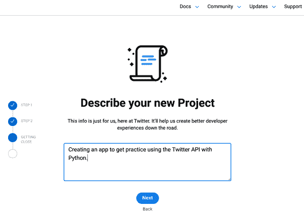

# 第五章\. 访问基于 Web 的数据

互联网是一个不可思议的数据来源；可以说，这是数据成为我们社会、经济、政治甚至创意生活中如此主导的原因。在 第四章 中，我们专注于数据整理的过程，重点是访问和重新格式化已保存在我们设备或云端的基于文件的数据。与此同时，这些数据的大部分最初来自互联网 —— 无论是从网站下载的，如失业数据，还是从 URL 检索的，如 Citi Bike 数据。然而，现在我们已经掌握了如何使用 Python 解析和转换各种基于文件的数据格式，是时候看看首先收集这些文件涉及哪些内容了 —— 特别是当这些文件中包含的数据是实时的、基于 feed 的类型时。为此，我们将在本章的大部分时间内学习如何获取通过 API 提供的数据 —— 这些是我在 第四章 中早期提到的应用程序接口。API 是我们访问由实时或按需服务生成的数据的主要（有时是唯一）途径，例如社交媒体平台、流媒体音乐和搜索服务，以及许多其他私人和公共（例如政府生成的）数据来源。

尽管 API 的许多优点（参见 “为什么使用 API？” 进行复习）使它们成为数据收集公司提供的热门资源，但这样做也存在显著的成本和风险。对于像社交媒体平台这样以广告为驱动的企业来说，一个过于全面的外部产品或项目在数据收集方面是一种利润风险。关于个人的大量数据的即时可用性也显著增加了隐私风险。因此，通过许多 API 访问数据通常需要事先向数据收集者注册，甚至在请求数据时完成基于代码的登录或 *身份验证* 过程。与此同时，API 提供的数据可访问性是改善政府系统透明度^(1)和私营公司责任^(2)的有力工具，因此创建帐户和保护访问基于 API 的数据的任何 Python 脚本的前期工作是非常值得的。

在本章的过程中，我们将介绍如何通过 API 访问一系列基于网络的、数据供稿类型的数据集，涵盖从基本的、无需登录的资源到社交媒体平台如 Twitter 的多步骤、高度保护的 API。正如我们将在“访问在线 XML 和 JSON”中看到的那样，这个光谱的简单端涉及使用 Python 的*requests*库下载已经格式化为 JSON 或 XML 的网页——我们只需要 URL。在“专用 API：添加基本身份验证”中，我们将继续讨论通过[Federal Reserve Economic Database (FRED)](https://fred.stlouisfed.org/docs/api/fred) API 获取的数据访问过程。这与我们在示例 4-12 和 4-15 中看到的数据相同，但与其使用我提供的示例文件不同，您将通过编程方式下载任何最新数据*每次运行脚本时*。

这将需要在[FRED 网站](https://fred.stlouisfed.org/docs/api/fred)上创建一个帐户，以及创建并保护您自己的基本 API“密钥”，以便检索数据。最后，在“专用 API：使用 OAuth 工作”中，我们将介绍像 Twitter 这样的社交媒体平台所需的更复杂的 API 身份验证过程。尽管需要大量的前期工作，但学习如何通过编程方式与这些 API 进行交互具有巨大的回报——在大多数情况下，您可以随时重新运行这些脚本，以获取这些服务提供的最新数据。^(3) 当然，并非我们需要的每个数据源都提供 API，因此我们将在“网页抓取：最后的数据来源”中解释如何使用 Python 的*Beautiful Soup*库以*负责任的方式*“抓取”网站上的数据。尽管在许多情况下，这些数据访问任务可以通过浏览器和鼠标完成，但您很快就会看到，使用 Python 如何帮助我们通过使过程更快、更可重复来扩展我们的数据检索工作。

# 访问在线 XML 和 JSON

在“使用 Python 处理数据供稿类型数据”中，我们探讨了访问和转换两种常见形式的基于网络的数据（XML 和 JSON）的过程。然而，我们没有解决的是如何将这些数据文件从互联网上下载到您的计算机上的问题。然而，借助多功能的 Python *requests*库，仅需几行代码即可访问和下载这些数据，而无需打开网页浏览器。

为了进行比较，让我们从“手动”下载我们在之前示例中使用的两个文件开始：示例 4-13 中的 BBC 文章的 RSS 供稿和“一个数据源，两种方式”中提到的 Citi Bike JSON 数据。

对于这两种数据源，处理过程基本相同：

1.  访问目标 URL；在这种情况下，选择以下之一：

    +   [*http://feeds.bbci.co.uk/news/science_and_environment/rss.xml*](http://feeds.bbci.co.uk/news/science_and_environment/rss.xml)

    +   [*https://gbfs.citibikenyc.com/gbfs/en/station_status.json*](https://gbfs.citibikenyc.com/gbfs/en/station_status.json)

1.  上下文点击（也称为“右键单击”或有时“Ctrl+单击”，具体取决于您的系统）。从出现的菜单中简单地选择“另存为”，并将文件保存到您的 Jupyter 笔记本或 Python 脚本所在的同一文件夹中。

就是这样！现在，您可以在更新的 XML 文件上运行 示例 4-13 中的脚本，或将 Citi Bike JSON 数据粘贴到 [*https://jsonlint.com*](https://jsonlint.com) 中，查看在正确格式化时其外观如何。请注意，尽管 BBC 页面在浏览器中看起来几乎像是一个“普通”网站，但根据其 *.xml* 文件扩展名，它也会下载为格式良好的 XML。

现在我们已经看到如何手动完成这一过程的部分，让我们看看在 Python 中完成同样工作需要做些什么。为了简短起见，示例 5-1 中的代码将下载并保存 *两个* 文件，一个接着一个。

##### 示例 5-1\. data_download.py

```py
# a basic example of downloading data from the web with Python,
# using the requests library
#
# the source data we are downloading will come from the following URLs:
# http://feeds.bbci.co.uk/news/science_and_environment/rss.xml
# https://gbfs.citibikenyc.com/gbfs/en/station_status.json

# the `requests` library lets us write Python code that acts like
# a web browser
import requests

# our chosen XML filename
XMLfilename = "BBC_RSS.xml"

# open a new, writable file for our XML output
xml_output_file = open(XMLfilename,"w")

# use the requests library's "get" recipe to access the contents of our
# target URL and store it in our `xml_data` variable
xml_data=requests.get('http://feeds.bbci.co.uk/news/science_and_environment/rss.xml')

# the requests library's `get()` function puts contents of the web page
# in a property `text`
# we'll `write` that directly to our `xml_output_file`
xml_output_file.write(xml_data.text)

# close our xml_output_file
xml_output_file.close()

# our chosen JSON filename
JSONfilename = "citibikenyc_station_status.json"

# open a new, writable file for our JSON output
json_output_file = open(JSONfilename,"w")

# use the `requests` library's `get()` recipe to access the contents of our
# target URL and store it in our `json_data` variable
json_data = requests.get('https://gbfs.citibikenyc.com/gbfs/en/station_status.json')

# `get()` the contents of the web page and write its `text`
# directly to `json_output_file`
json_output_file.write(json_data.text)

# close our json_output_file
json_output_file.close()
```

很简单，对吧？除了不同的文件名外，示例 5-1 生成的 *.xml* 和 *.json* 文件与我们手动从网页保存的文件完全相同。一旦我们设置好了这个脚本，当然，要获取最新数据只需再次运行它，新数据将覆盖早期的文件。

# 引入 API

直到这一点，我们大部分的数据整理工作都集中在数据源上，这些数据源的内容几乎完全由数据提供者控制。实际上，电子表格文件的内容，以及文档——甚至是刚才在 示例 5-1 中访问的包含 XML 和 JSON 的网页——可能根据我们访问它们的时间而变化，但我们并没有真正影响它们包含什么数据。

同时，我们大多数人习惯于使用互联网获取更符合我们需求的信息。当我们寻找信息时，通常第一步是在搜索引擎中输入关键词或短语，我们期望收到基于我们选择的组合的高度定制的“结果”列表。当然，我们无法控制实际存在哪些网页以供我们的搜索检索，但对于大多数人来说，这个过程如此常见和有用，以至于我们很少停下来考虑背后正在发生的事情。

尽管它们具有视觉导向的界面，但搜索引擎实际上只是 API 的一个特殊实例。它们本质上只是允许您与包含互联网上网站信息的数据库进行 *接口* 的网页，如它们的 URL、标题、文本、图片、视频等。当您输入搜索词并按 Enter 或 Return 键时，搜索引擎会 *查询* 其数据库，以获取与您搜索有关的网页内容，并更新您正在查看的网页，以在列表中显示这些结果。尽管社交媒体平台和其他在线服务提供的专门 API 需要我们以非常特定的方式进行身份验证 *并且* 结构化我们的搜索，但搜索引擎和更专业的 API 之间共享的功能足够多，以至于我们可以通过解构基本的 Google 搜索来学习一些有用的 API 知识。

# 基础 API：搜索引擎示例

尽管互联网搜索引擎可能是最直接的 API 形式，但从屏幕上看到它们的行为并不总是显而易见。例如，如果您访问 Google 并搜索“weather sebastopol”，您可能会看到类似于 图 5-1 的页面。


###### 图 5-1\. 样本搜索结果

虽然搜索结果的格式可能非常熟悉，但现在让我们更仔细地查看 URL 栏中发生的事情。您看到的肯定与 图 5-1 的屏幕截图不同，但它应该至少包含部分相同的信息。具体来说，现在在 *您的* URL 栏中查找以下内容：

```py
q=weather+sebastopol
```

找到了吗？太好了。现在在不刷新页面的情况下，将搜索框中的文本更改为“weather san francisco”，然后按 Enter 键。再次查看 URL 中的文本，找到：

```py
q=weather+san+francisco
```

最后，复制并粘贴以下内容到您的 URL 栏，然后按 Enter 键：

```py
https://www.google.com/search?q=weather+san+francisco
```

注意到了吗？希望当您在 Google 的搜索栏中输入“weather san francisco”并按 Enter 键时，您看到的搜索结果与直接访问 Google 搜索 URL 并附加 `q=weather+san+francisco` 的情况几乎相同。这是因为 `q=weather+san+francisco` 是传送您实际搜索词到 Google 数据库的 *查询字符串* 部分；其他所有内容只是 Google 为定制或跟踪目的附加的附加信息。

虽然 Google 可以（而且将会！）向我们的搜索 URL 添加任何它想要的内容，*我们*也可以通过添加其他有用的键值对来扩展其功能。例如，在“智能搜索特定数据类型”中，我们探讨了通过在搜索框查询中添加`filetype: .xml`来搜索特定文件类型，如*.xml*；同样，我们可以直接在 URL 栏中通过添加相应的键值对`as_filetype=xml`来完成相同的操作：

```py
https://www.google.com/search?q=weather+san+francisco&as_filetype=xml
```

不仅将返回正确格式的结果，还请注意它也会更新搜索框的内容！

Google 搜索引擎在这种情况下的行为几乎与我们在本章剩余部分将看到的更专业 API 相同。大多数 API 遵循我们在此搜索示例中看到的一般结构，其中*终端点*（在本例中为`https://www.google.com/search`）与一个或多个*查询参数*或*键值对*（例如`as_filetype=xml`或`q=weather+san+francisco`）结合，形成*查询字符串*，该字符串附加在表示查询字符串开始的问号（`?`）之后。API 终端点和查询字符串结构的一般概述如图 5-2 所示。


###### 图 5-2\. 基本查询字符串结构

尽管这种结构非常普遍，但以下是关于基于查询字符串的 API 的一些其他有用提示：

+   键值对（例如`as_filetype=xml`，`num=5`，甚至`q=weather+san+francisco`）可以*以任何顺序*出现，只要它们添加在表示查询字符串开始的问号（`?`）之后即可。

+   对于给定 API 而言，具体的键和值是由 API 提供者确定的，只有通过阅读 API 文档或通过实验（尽管这可能会带来自身的问题），才能识别出来。附加到查询字符串中的任何不是被识别键或有效参数值的内容都可能会被忽略。

尽管这些特征几乎适用于所有 API，但其中绝大多数在您创建登录并提供独特的专用“密钥”以及查询时，不会允许您访问任何数据，这些密钥需要首先进行身份验证（或*认证*）。这部分 API 流程是我们接下来将要讨论的内容。

# 专用 API：添加基本认证

使用大多数 API 的第一步是与 API 提供商创建某种类型的账户。尽管许多 API 允许*您*免费使用它们，但在互联网上编译、存储、搜索和返回数据的过程仍然存在风险并且需要花钱，因此提供商希望跟踪谁在使用他们的 API，并且可以随时切断您的访问权限。^(4) 这个身份验证过程的第一部分通常包括创建一个账户并为自己和/或每个项目、程序或“应用程序”请求一个 API “密钥”。在像我们现在要进行的“基本” API 身份验证过程中，一旦您在服务提供商的网站上创建了您的 API 密钥，您只需像任何其他查询参数一样将其附加到您的数据请求中，即可成功检索数据。

举例来说，让我们开始设置以编程方式访问我们在示例 4-15 中使用的失业数据。我们将首先在 FRED 网站上创建一个账户并请求一个 API 密钥。一旦我们有了这个，我们就可以简单地将其附加到我们的查询字符串中并开始下载数据！

## 获取 FRED API 密钥

要在美联储经济数据库（FRED）创建账户，请访问[*https://fred.stlouisfed.org*](https://fred.stlouisfed.org)，并点击右上角的“我的账户”，如图 5-3 所示。


###### 图 5-3\. FRED 登录链接

按照弹出窗口中的说明操作，可以创建一个带有新用户名和密码的账户或使用您的 Google 账户登录。一旦您的注册/登录过程完成，点击“我的账户”链接将打开一个下拉菜单，其中包括一个名为“API Keys”的选项，如图 5-4 所示。


###### 图 5-4\. FRED 账户操作

点击该链接将带您到一个页面，您可以使用“请求 API 密钥”按钮请求一个或多个 API 密钥。在接下来的页面上，您将被要求提供一个简要描述将使用 API 密钥的应用程序；这可以只是一两个句子。您还需要通过勾选提供的框同意服务条款。点击“请求 API 密钥”按钮完成整个过程。

如果您的请求成功（应该会成功），您将被带到一个显示已生成密钥的中间页面。如果您离开了那个页面，您可以随时登录并访问[*https://research.stlouisfed.org/useraccount/apikeys*](https://research.stlouisfed.org/useraccount/apikeys)以查看您所有可用的 API 密钥。

## 使用您的 API 密钥请求数据

现在您有了 API 密钥，让我们探讨如何请求我们在示例 4-15 中使用的数据。首先尝试在浏览器中加载以下 URL：

```py
https://api.stlouisfed.org/fred/series/observations?series_id=U6RATE&file_type=json
```

即使您已在该浏览器上登录到 FRED，您也会看到如下内容：

```py
{"error_code":400,"error_message":"Bad Request.  Variable api_key is not set.
Read https:\/\/research.stlouisfed.org\/docs\/api\/api_key.html for more
information."}
```

这是一个非常描述性的错误消息：它不仅告诉您出了什么问题，还提示了如何修复它。由于您刚刚创建了一个 API 密钥，所以您只需将其作为附加参数添加到您的请求中：

```py
https://api.stlouisfed.org/fred/series/observations?series_id=U6RATE&file_type=json&
api_key=*YOUR_API_KEY_HERE*

```

用您的 API 密钥替换`YOUR_API_KEY_HERE`。在浏览器中加载该页面将返回类似以下的内容：

```py
{"realtime_start":"2021-02-03","realtime_end":"2021-02-03","observation_start":
"1600-01-01","observation_end":"9999-12-31","units":"lin","output_type":1,
"file_type":"json","order_by":"observation_date","sort_order":"asc","count":324,
"offset":0,"limit":100000,"observations":[{"realtime_start":"2021-02-03",
"realtime_end":"2021-02-03","date":"1994-01-01","value":"11.7"},
...
{"realtime_start":"2021-02-03","realtime_end":"2021-02-03","date":"2020-12-01",
"value":"11.7"}]}
```

很棒，对吧？现在您知道如何使用 API 密钥进行数据请求，是时候复习如何*定制*这些请求和在使用 Python 脚本时保护您的 API 密钥了。

# 阅读 API 文档

如前面的示例所示，一旦我们拥有 API 密钥，我们就可以随时从 FRED 数据库加载最新数据。我们所需做的只是构建我们的查询字符串并添加我们的 API 密钥。

那么我们如何知道 FRED API 将接受哪些键/值对以及它们将返回什么类型的信息呢？唯一真正可靠的方法是阅读 API *文档*，它应该提供使用指南和（希望的话）API 的示例。

不幸的是，API 文档没有被广泛采用的标准，这意味着使用新的 API 几乎总是一种反复试验的过程，特别是如果文档质量不佳或提供的示例不包含您正在寻找的信息。事实上，甚至*找到*特定 API 的文档并不总是一件直接的事情，通常通过网络搜索是最简单的途径。

例如，从[FRED 主页](https://fred.stlouisfed.org)获取到 FRED API 文档需要点击页面中部大约一半的工具选项卡，然后在页面右下角选择开发者 API 链接，这将带您到[*https://fred.stlouisfed.org/docs/api/fred*](https://fred.stlouisfed.org/docs/api/fred)。相比之下，通过网络搜索“fred api documentation”将直接带您到相同的页面，如图 5-5 所示。


###### 图 5-5\. FRED API 文档页面

不幸的是，此页面上的链接列表实际上是一组*端点*——不同的基本 URL，您可以使用它们来请求更具体的信息（请记住*端点*是在问号 (`?`) 之前的所有内容，它与*查询字符串*分隔开）。在前面的例子中，您使用了端点 `https://api.stlouisfed.org/fred/series/observations`，然后配对了 `series_id=U6RATE`、`file_type=json`，当然，还有您的 API 密钥，以生成响应。

在 图 5-5 中滚动页面并点击标有“fred/series/observations”的文档链接，会将你带到 [*https://fred.stlouisfed.org/docs/api/fred/series_observations.html*](https://fred.stlouisfed.org/docs/api/fred/series_observations.html)，该页面列出了该特定端点的所有有效查询键（或*参数*）以及这些键可以具有的有效值和一些示例查询 URL，如 图 5-6 所示。


###### 图 5-6\. FRED API *observations* 端点文档

例如，你可以通过使用 `limit` 参数来限制返回的观测数量，或者通过添加 `sort_order=desc` 来反转返回结果的排序顺序。你还可以指定特定的数据格式（例如 `file_type=xml` 用于 XML 输出）或单位（例如 `units=pc1` 以查看输出作为与一年前相比的百分比变化）。

# 在使用 Python 时保护你的 API 密钥

正如你可能已经猜到的那样，从 FRED（或其他类似的 API）下载数据就像用你完整的查询替换 示例 5-1 中的其中一个 URL 一样简单，因为它生成的网页只是互联网上的另一个 JSON 文件。

同时，该查询包含一些特别敏感的信息：你的 API 密钥。记住，就 FRED（或任何其他 API 所有者）而言，对于在其平台上使用你的 API 密钥进行的任何活动，你都要负责。这意味着虽然你*始终*希望用诸如 Git 这样的工具记录、保存和版本化你的代码，但你*绝不*希望你的 API 密钥或其他凭据最终被其他人可以访问的文件所获取。

###### 警告

正确保护你的 API 密钥需要一些努力，如果你是第一次使用数据、Python 或 API（或三者兼有），你可能会被诱惑跳过接下来的几节，只是把你的 API 凭据留在可能被上传到互联网的文件中。^(5) 不要这么做！虽然现在你可能会想，“谁会有兴趣看*我的*工作？”或“我只是随便玩玩而已—有什么区别？”但你应该知道两件事。

首先，与文档一样，如果现在没有正确处理保护您的凭据，以后要做这件事情会*更加*困难和耗时，部分原因是到那时您可能已经忘记了具体涉及的内容，另一部分原因是*可能已经太晚*。其次，虽然我们中很少有人觉得自己正在做的事情“重要”或足够“可见”，以至于其他人*会*去查看它，但现实是，恶意行为者并不在乎他们的替罪羊是谁——如果您让它变得容易，他们可能会选择您。此外，后果可能不仅仅是使您被踢出数据平台。2021 年，SolarWinds 的前 CEO 声称，通过对公司软件的弱点，通过实习生个人 GitHub 账户上上传的一个弱密码文件，可能导致数千个高安全性系统的大规模入侵。^(6) 换句话说，即使你只是“练习”，你最好一开始就做好安全保护。

保护您的 API 凭据是一个两部分的过程：

1.  您需要将 API 密钥或其他敏感信息与其余代码分开。我们将通过将这些凭据存储在单独的文件中，并且仅在实际运行脚本时主代码加载它们来实现这一点。

1.  您需要一种可靠的方法来确保在使用 Git 进行代码备份时，例如，这些凭证文件*绝对不会*备份到任何在线位置。我们将通过在包含这些文件的任何文件名中加入`credentials`这个词，并使用`gitignore`文件来确保它们不会上传到 GitHub。

实现这两个目标的最简单方法是为包含 API 密钥或其他敏感登录相关信息的任何文件定义命名约定。在这种情况下，我们将确保任何这类文件在文件名中都包含`credentials`这个词。然后，我们将确保创建或更新一种名为*.gitignore*的特殊类型的 Git 文件，该文件存储了关于告诉 Git 哪些文件不应*永远*提交到我们的存储库和/或上传到 GitHub 的规则。通过为我们的“凭证”文件添加到*.gitignore*的规则，我们保证不会意外上传包含敏感登录信息的任何文件到 GitHub。

## 创建你的“凭证”文件

直到现在，我们一直将完成特定任务（如下载或转换数据文件）的所有代码放入单个 Python 文件或笔记本中。然而，出于安全性和重复使用的考虑，当我们使用 API 时，将功能代码与凭据分开更为合理。幸运的是，这个过程非常简单。

首先，创建并保存一个名为*FRED_credentials.py*的新的空白 Python 文件。为了简单起见，请将此文件放在计划用于从 FRED 下载数据的 Python 代码所在的同一文件夹中。

然后，简单地创建一个新变量并将其值设置为你自己的 API 密钥，如 示例 5-2 所示。

##### 示例 5-2\. 示例 FRED 凭据文件

```py
my_api_key = "*`your_api_key_surrounded_by_double_quotes`*"
```

现在只需保存你的文件！

## 在单独的脚本中使用你的凭据

现在，你的 API 密钥作为另一个文件中的变量存在，你可以将其导入到任何你想要使用它的文件中，使用我们之前用来导入其他人创建的库的相同方法。 示例 5-3 是一个使用存储在我的 *FRED_credentials.py* 文件中的 API 密钥下载 FRED 的 U6 失业数据的示例脚本。

##### 示例 5-3\. FRED_API_example.py

```py
# import the requests library
import requests

# import our API key
from FRED_credentials import my_api_key 

# specify the FRED endpoint we want to use
FRED_endpoint = "https://api.stlouisfed.org/fred/series/observations?"

# also specify the query parameters and their values
FRED_parameters = "series_id=U6RATE&file_type=json"

# construct the complete URL for our API request, adding our API key to the end
complete_data_URL = FRED_endpoint + FRED_parameters +"&api_key="+my_api_key

# open a new, writable file with our chosen filename
FRED_output_file = open("FRED_API_data.json","w")

# use the `requests` library's `get()` recipe to access the contents of our
# target URL and store it in our `FRED_data` variable
FRED_data = requests.get(complete_data_URL)

# `get()` the contents of the web page and write its `text`
# directly to `FRED_output_file`
FRED_output_file.write(FRED_data.text)

# close our FRED_output_file
FRED_output_file.close()
```


我们可以通过使用 `from` 关键字与我们的凭据文件的名称（注意，这里我们*不*包括 *.py* 扩展名）来使我们的 API 对这个脚本可用，然后告诉它`import`包含我们的 API 密钥的变量。

现在，我们已成功将我们的 API 凭据与代码的主要部分分开，我们需要确保我们的凭据文件在我们`git commit`我们的工作和/或`git push`到互联网时不会意外被备份。为了简单而系统地做到这一点，我们将使用一种特殊类型的文件，称为 *.gitignore*。

## 开始使用 .gitignore

正如其名称所示，*.gitignore* 文件让你指定某些类型的文件——惊喜，惊喜！——你希望 Git “忽略”，而不是跟踪或备份。通过创建（或修改）存储库中 *.gitignore* 文件中的模式匹配规则，我们可以预定义我们的存储库将跟踪或上传哪些类型的文件。虽然我们*理论上*可以通过从不使用 `git add` 来手动完成相同的操作——但使用 *.gitignore* 文件可以强制执行此行为^(8) *并且*防止 Git 每次运行 `git status` 时“警告”我们有未跟踪的文件。*没有* *.gitignore* 文件，我们将不得不确认每次提交时要忽略的文件——这会很快变得乏味，并很容易导致错误。只需一次匆忙的 `git add -A` 命令就可能意外开始跟踪我们的敏感凭据文件——并且将文件*移出*你的 Git 历史比将其加入要困难得多。更好的办法是通过一点准备来避免整个问题。

换句话说，*.gitignore* 文件是我们的朋友，让我们创建通用规则，防止我们意外跟踪不想要的文件，并确保 Git 只报告我们真正关心的文件的状态。

目前，我们将在与我们的*FRED_credentials.py*文件相同的文件夹/存储库中创建一个新的*.gitignore*文件，只是为了感受一下它们是如何工作的。^(9) 为此，我们将首先在 Atom 中打开一个新文件（或者您可以直接在 GitHub 存储库中添加一个新文件），并将其保存在与您的*FRED_credentials.py*相同的文件夹中，名称为*.gitignore*（确保文件名以点（`.`）开头——这很重要！）。

接下来，在您的文件中添加以下行：

```py
# ignoring all credentials files
**credentials*
```

与 Python 一样，*.gitignore*文件中的注释以井号（`#`）符号开头，因此此文件的第一行只是描述性的。第二行的内容（`**credentials*`）是一种*正则表达式*——一种特殊的模式匹配系统，它让我们可以以一种类似于向另一个人解释的方式描述字符串（包括文件名）。^(10) 在这种情况下，表达式`**credentials*`转换为“此存储库中任何位置包含单词*credentials*的文件。”通过将此行添加到我们的*.gitignore*文件中，我们确保此存储库中任何文件名中包含单词*credentials*的文件都不会被跟踪或上传到 GitHub。

要查看您的*.gitignore*文件的效果，请保存文件，然后在命令行中运行：

```py
git status
```

虽然您应该看到您为示例 5-3 中的代码创建的新文件，但*不*应该看到您的*FRED_credentials.py*文件列为“未跟踪”。如果您想确保您打算忽略的文件实际上正在被忽略，您还可以运行：

```py
git status --ignored
```

这将仅显示您的存储库中当前被忽略的文件。在其中，您可能还会看到*__pycache__*文件夹，我们也不需要备份它。

# 专用 API：使用 OAuth 工作

到目前为止，我们拥有一切可以使用通常被描述为“基本”身份验证流程的 API 所需的东西：我们在 API 提供商那里创建一个账户，并获得一个我们将附加到我们的数据请求中的密钥，就像我们在示例 5-3 中所做的那样。

虽然这个过程非常简单直接，但它也有一些缺点。如今，API 可以做的远不止返回数据：它们还是应用程序发布更新到社交媒体账户或向您的在线日历添加项目的方式。为了实现这一点，它们显然需要某种访问权限来访问您的账户——但当然您不想随意与应用程序和程序共享您的登录凭据。如果您只是向应用程序提供了这些信息，稍后要*停止*应用程序访问您的账户的唯一方法就是更改您的用户名和密码，然后您必须向所有您仍然*想要*使用的应用程序提供您更新后的凭据，以便它们继续工作……情况会变得混乱而复杂，很快就会变得混乱而复杂。

OAuth 认证工作流程旨在通过提供一种方式来提供 API 访问而不传递一堆用户名和密码来解决这些问题。总体上，这是通过编写所谓的 *授权循环* 来实现的，包括三个基本步骤：

1.  获取和编码您的 API 密钥和“密钥”（每个都只是您从 API 提供商那里获取的字符串，就像我们在 FRED API 密钥中所做的那样）。

1.  将这两个字符串的编码组合作为（又一个）“密钥”发送到特定的“授权”端点/URL。

1.  从授权端点接收一个*访问令牌*（又一个字符串）。访问令牌是您实际发送到 API 数据端点的内容，以及您的查询信息。

虽然这听起来可能很复杂，但请放心，在实践中，即使这个听起来复杂的过程也主要是在特定顺序中传递和传回某些 URL 的字符串。是的，在这个过程中，我们需要对它们进行一些“编码”，但正如你可能猜到的那样，这部分将由一个方便的 Python 库为我们处理。

尽管需要完成授权循环并获取访问令牌，但通过 Python 与这些更专门的 API 交互的过程与我们在“专门 API：添加基本身份验证”中看到的基本相同。我们将创建一个账号，请求 API 凭据，然后创建一个文件，其中包含这些凭据，并做一些准备工作，以便我们可以在我们的主脚本中使用它们。然后我们的主脚本将导入这些凭据，并使用它们从目标平台请求数据并将其写入输出文件。

对于这个示例，我们将使用 Twitter API，但您可以对其他使用 OAuth 方法的平台（如 Facebook）使用大致相同的流程。在这里我们*不会*花费太多时间讨论如何结构化特定查询，因为任何给定 API 的细节都可能填满一本书！尽管如此，一旦您掌握了这个认证过程，您将拥有开始尝试各种 API 并可以开始练习访问您想要的数据的所需内容。让我们开始吧！

## 申请 Twitter 开发者账号

就像我们几乎每次想使用新的 API 一样，我们的第一步将是从 Twitter 请求一个 API 密钥。即使您已经有了 Twitter 账号，您也需要申请“开发者访问权限”，大约需要 15 分钟（不包括 Twitter 审核和/或批准的时间）。首先访问 [Twitter 开发者 API “申请访问权限” 页面](https://developer.twitter.com/en/apply-for-access)，并点击“申请开发者帐户”按钮。登录后，系统将提示您提供有关您计划如何使用 API 的更多信息。对于本次练习，您可以选择“业余爱好者”和“探索 API”，如 图 5-7 所示。


###### 图 5-7\. Twitter 开发者 API 用例选择

在接下来的步骤中，您将被要求提供一个超过 200 个字符的说明，说明您计划使用 API 的目的；您可以输入类似以下内容：

> 使用 Twitter API 来学习如何使用 Python 进行数据整理。有兴趣尝试 OAuth 循环，并从公共 Twitter 资源和对话中获取不同类型的信息。

由于我们在这里的目标只是通过 Python 脚本和 OAuth 循环练习从 Twitter 下载数据，您可以将对四个后续问题的回答切换为“否”，如 图 5-8 所示，但如果您开始以其他方式使用 API，则需要更新这些答案。


###### 图 5-8\. Twitter 开发者 API 预期用途

在接下来的两个屏幕中，您将查看您之前的选择，并点击一个复选框以确认开发者协议。然后，点击“提交申请”，这将触发一个验证电子邮件。如果几分钟内未收到邮件，请务必检查您的垃圾邮件和已删除邮件。一旦找到邮件，请点击邮件中的链接以确认您的访问权限！

## 创建您的 Twitter “App” 和凭据

一旦 Twitter 批准了您的开发者访问权限，您可以通过登录到 Twitter 账户并访问 [*https://developer.twitter.com/en/portal/projects-and-apps*](https://developer.twitter.com/en/portal/projects-and-apps) 来创建一个新的“应用程序”。在页面中央，点击“创建项目”按钮。

这里您将通过一个迷你版的开发者访问申请过程：您需要为项目提供一个名称，指明您打算如何使用 Twitter API，用文字描述该目的，并为与该项目关联的第一个应用程序命名，如 图 5-9 至 图 5-12 所示。


###### 图 5-9\. Twitter 项目创建：项目名称


###### 图 5-10\. Twitter 项目创建：项目目的



###### 图 5-11\. Twitter 项目创建：项目描述


###### 图 5-12\. Twitter 项目创建：应用程序名称

一旦您添加了您的应用程序名称，您将看到一个显示您的 API 密钥、API 密钥秘钥和 Bearer 令牌的屏幕，如图 5-13 所示。^(11)


###### 图 5-13\. Twitter API 密钥和令牌屏幕

由于安全原因，您只能在*此屏幕*上查看您的 API 密钥和 API 密钥秘钥，因此我们将立即将它们放入我们的 Twitter 凭据文件中（请注意，在开发者仪表板的其他地方，它们被称为“API 密钥”和“API 密钥秘钥” - 即使是大型科技公司也可能在一致性方面出现问题！）。但不要担心！如果您意外地太快从此屏幕点击离开，错误复制了值，或者发生其他任何事情，您都可以随时返回到[您的仪表板](https://developer.twitter.com/en/portal/dashboard)，并单击您的应用程序旁边的密钥图标，如图 5-14 所示。


###### 图 5-14\. 带应用的 Twitter 仪表板

然后，只需在“Consumer Keys”下点击“重新生成”即可获得新的 API 密钥和 API 密钥秘钥，如图 5-15 所示。

现在我们知道如何访问我们应用程序的 API 密钥和 API 密钥秘钥，我们需要将它们放入一个新的“凭据”文件中，类似于我们为我们的 FRED API 密钥创建的文件。要做到这一点，请创建一个名为*Twitter_credentials.py*的新文件，并将其保存在您要放置用于访问 Twitter 数据的 Python 脚本的文件夹中，如示例 5-4 所示。

##### 示例 5-4\. Twitter_credentials.py

```py
my_Twitter_key = "*`your_api_key_surrounded_by_double_quotes`*"
my_Twitter_secret = "*`your_api_key_secret_surrounded_by_double_quotes`*"
```


###### 图 5-15\. Twitter 重新生成密钥

###### 警告

确保在存储 Twitter API 密钥和 API 密钥秘钥的文件名中包含单词`credentials`！回想一下在“使用 .gitignore 开始”中，我们创建了一个规则，忽略任何文件名包含单词`credentials`的文件，以确保我们的 API 密钥永远不会因疏忽上传到 GitHub。因此，请务必仔细检查您文件名中的拼写！为了确保额外的确定性，您总是可以运行：

```py
git status --ignored
```

在命令行中确认所有您的凭据文件确实被忽略。

## 编码您的 API 密钥和秘钥

到目前为止，我们与 FRED API 做的事情并没有*太*不同；我们只是需要在我们的凭据文件中创建两个变量（`my_Twitter_key`和`my_Twitter_secret`），而不是一个。

现在，但是，我们需要对这些值进行一些工作，以便为身份验证过程的下一步获取它们正确的格式。虽然我不会深入研究在这些接下来的步骤中发生的“内部工作”细节，但请知道，这些编码和解码步骤对于保护 API 密钥和 API 密钥密钥的原始字符串值以便安全发送到互联网上是必要的。

因此，对于我们的*Twitter_credentials.py*文件，我们现在将添加几行代码，以使完成的文件看起来像 Example 5-5。

##### 示例 5-5\. Twitter_credentials.py

```py
my_Twitter_key = "your_api_key_surrounded_by_double_quotes"
my_Twitter_secret = "your_api_key_secret_surrounded_by_double_quotes"

# import the base64 encoding library
import base64 

# first, combine the API Key and API Key Secret into a single string
# adding a colon between them
combined_key_string = my_Twitter_key+':'+my_Twitter_secret

# use the `encode()` method on that combined string,
# specifying the ASCII format (see: https://en.wikipedia.org/wiki/ASCII)
encoded_combined_key = combined_key_string.encode('ascii')

# encode the ASCII-formatted string to base64
b64_encoded_combined_key = base64.b64encode(encoded_combined_key)

# _decode_ the encoded string back to ASCII,
# so that it's ready to send over the internet
auth_ready_key = b64_encoded_combined_key.decode('ascii')
```


该库将允许我们将我们的原始 API 密钥和 API 密钥密钥转换为发送到 Twitter 授权端点的正确格式。

现在我们已经正确编码了 API 密钥和 API 密钥密钥，我们可以将*just*的`auth_ready_key`导入到我们将用来指定和拉取数据的脚本中。在进行一次请求以获取我们的*access token*到授权端点之后，我们终于(!)准备好检索一些推文了！

## 从 Twitter API 请求访问令牌和数据

正如我们在 Example 5-3 中所做的那样，我们现在将创建一个 Python 文件（或笔记本），在那里我们将执行我们的 Twitter 数据加载过程的下两个步骤：

1.  请求（和接收）从 Twitter 获取访问令牌或*bearer token*。

1.  将该 bearer token 包含在发送给 Twitter 的数据请求中并接收结果

### 请求访问令牌：get versus post

从 Twitter 请求访问或 bearer token 实际上只是向*授权端点*发送格式良好的请求，该端点是[*https://api.twitter.com/oauth2/token*](https://api.twitter.com/oauth2/token)。但是，与将我们的`auth_ready_key`附加到端点 URL 不同，我们将使用称为*post*请求的东西（回想一下，在示例 5-1 和 5-3 中，我们使用的`requests`方法称为`get`）。

在这里，使用`post`请求是重要的部分，因为它在一定程度上提供了比`get`请求更高的安全性^(12)，但主要是因为当我们要求 API 执行*超出*简单返回数据的操作时，`post`请求实际上是标准。因此，当我们使用`post`提交我们的`auth_ready_key`时，Twitter API 将处理我们的唯一密钥并返回一个唯一的 bearer token。

在 Python 中构建我们的`post`请求时，我们需要创建两个`dict`对象：一个包含请求的*headers*，其中包含我们的`auth_ready_key`和一些其他信息，另一个包含请求的*data*，在这种情况下将指定我们正在请求凭证。然后，我们将这些作为参数传递给*requests*库的`post`方法，而不是像在示例 5-6 中所示那样将它们粘贴在 URL 字符串的末尾。

##### 示例 5-6\. Twitter_data_download.py

```py
# import the encoded key from our credentials file
from Twitter_credentials import auth_ready_key

# include the requests library in order to get data from the web
import requests

# specify the Twitter endpoint that we'll use to retrieve
# our access token or "bearer" token
auth_url = 'https://api.twitter.com/oauth2/token'

# add our `auth_ready_key` to a template `dict` object provided
# in the Twitter API documentation
auth_headers = {
    'Authorization': 'Basic '+auth_ready_key,
    'Content-Type': 'application/x-www-form-urlencoded;charset=UTF-8'
} 

# another `dict` describes what we're asking for
auth_data = {
    'grant_type': 'client_credentials'
} 

# make our complete request to the authorization endpoint, and store
# the results in the `auth_resp` variable
auth_resp = requests.post(auth_url, headers=auth_headers, data=auth_data)

# pull the access token out of the json-formatted data
# that the authorization endpoint sent back to us
access_token = auth_resp.json()['access_token']
```


这个`dict`包含了授权端点想要返回访问令牌所需的信息。这包括我们的编码密钥及其数据格式。


`auth_headers`和`auth_data`对象的格式是由 API 提供者定义的。

实际上非常直接了当，对吧？如果一切顺利（我们马上会确认），我们只需在这个脚本中添加几行代码，就可以使用我们的访问令牌请求关于 Twitter 上发生的实际数据。

现在我们已经有了一个访问令牌（或*Bearer 令牌*），我们可以继续请求一些推文。为了演示目的，我们将保持请求简单：我们将请求包含单词*Python*的最近推文的基本搜索请求，并要求最多返回四条推文。在示例 5-7 中，我们在示例 5-6 中开始的脚本基础上构建并发出此请求，包括我们新获取的 Bearer 令牌在头部。一旦响应返回，我们将数据写入文件。然而，由于我们在返回的 JSON 数据中除了推文文本外还有很多内容，我们也会仅仅打印出每条推文的文本，以确保我们获得了正确（有时是意外的）结果 ;-)

##### 示例 5-7\. Twitter_data_download.py，继续

```py
# now that we have an access/bearer token, we're ready to request some data!

# we'll create a new dict that includes this token
search_headers = {
    'Authorization': 'Bearer ' + access_token
}

# this is the Twitter search API endpoint for version 1.1 of the API
search_url  = 'https://api.twitter.com/1.1/search/tweets.json'

# create a new dict that includes our search query parameters
search_params = {
    'q': 'Python',
    'result_type': 'recent',
    'count': 4
} 

# send our data request and store the results in `search_resp`
search_resp = requests.get(search_url, headers=search_headers, params=search_params)

# parse the response into a JSON object
Twitter_data = search_resp.json()

# open an output file where we can save the results
Twitter_output_file = open("Twitter_search_results.json", "w")

# write the returned Twitter data to our output file
Twitter_output_file.write(str(Twitter_data)) 

# close the output file
Twitter_output_file.close()

# loop through our results and print the text of the Twitter status
for a_Tweet in Twitter_data['statuses']: 
    print(a_Tweet['text'] + '\n')
```


在这种情况下，我们的查询（`q`）是`Python`，我们正在寻找`recent`结果，并且我们希望最多返回`4`条推文。请记住，我们可以包含在此对象中的键和值由数据提供者定义。


因为 Twitter 返回的响应是一个 JSON 对象，所以在我们将其写入文件之前，我们必须使用内置的 Python `str()` 函数将其转换为字符串。


由于每个结果中包含的信息都很多，我们将打印出每条返回的推文文本，以便了解其内容。`statuses`是 JSON 对象中的推文列表，推文的实际文本可以通过键`text`访问。

根据 Twitter 用户最近对 Python 的活动程度，即使你只在几分钟内再次运行此脚本，你可能会看到不同的结果。^(13) 当然，你可以更改此搜索以包含任何你想要的查询术语；只需根据需要修改`search_params`变量的值。要查看所有可能的参数及其有效值，你可以查看[此特定 Twitter API 端点的 API 文档](https://developer.twitter.com/en/docs/twitter-api/v1/tweets/search/api-reference/get-search-tweets)。

就是这样了！虽然 Twitter 提供了许多不同的 API（其他 API 允许你实际上发布到你自己的时间轴甚至别人的时间轴），但是在访问和处理数据方面，我们在这里所讲述的内容足以让你开始使用这些以及其他类似的 API 了。

# API 伦理

现在你知道如何从像 Twitter 这样的服务中发出 API 请求（以及其他使用 OAuth 流程的服务），你可能会想象你可以用收集到的数据做很多有趣的事情。然而，在你开始编写几十个脚本来跟踪你喜欢的在线话题讨论之前，现在是时候进行一些实际和伦理上的思考了。

首先，几乎每个 API 都使用*速率限制*来限制在给定时间间隔内可以进行多少数据请求。例如，在我们在示例 5-7 中使用的特定 API 端点上，你可以在 15 分钟的时间段内最多发出 450 个请求，每个请求最多可以返回 100 条推文。如果超过这个限制，你的数据请求可能会在 Twitter 确定下一个 15 分钟窗口开始之前无法返回数据。

第二，虽然你可能没有详细阅读开发者协议（别担心，你并不孤单；^(14) ），你总是可以在[在线参考副本](https://developer.twitter.com/en/developer-terms/agreement-and-policy)中找到相关内容。该协议包含一些具有重要实际和伦理意义的条款。例如，Twitter 的开发者协议*明确*禁止“与 Twitter 外部的数据匹配”这一行为——也就是说，不得将 Twitter 数据与用户的其他信息结合，除非用户直接提供了这些信息或明确同意。协议还规定了您如何存储和展示从 API 获取的 Twitter 内容，以及一系列其他规则和限制。

无论这些服务条款是否具有法律约束力，^(15)或者在本质上是否真正符合伦理，记住最终是*你*的责任确保你以伦理方式收集、分析、存储和共享*任何*数据。这意味着考虑到你可能使用的数据涉及的人的隐私和安全，以及思考聚合和分享的影响。

当然，如果伦理问题容易识别和达成一致，我们将生活在一个截然不同的世界中。因为它们不是，许多组织都设有明确定义的审查流程和监督委员会，旨在帮助探索并（如果可能的话）解决在例如研究和数据收集影响人类之前的伦理问题。对我个人来说，当试图思考伦理问题时，我仍然认为一个好的起点是["新闻记者职业道德准则"协会](https://spj.org/ethicscode.asp)。虽然这份文件并没有详细涵盖每一个可能的伦理情境，但它阐述了一些核心原则，我认为所有数据用户在收集、分析和分享信息时都应该考虑。

然而，最重要的是，*无论*你做出什么选择，你都准备好支持它们。数据获取和整理的一大可能性是能够发现新信息并生成新的见解。就像现在完全掌握做到这一点的技能一样，使用它们的责任也完全掌握在你的手中。

# 网络抓取：最后的数据来源

虽然 API 是由公司和组织设计的，目的是通过互联网提供访问通常是丰富多样的数据集，但仍然有大量信息只存在于基于表单或高度格式化的网页上，而不是 API 甚至不是 CSV 或 PDF。对于这类情况，唯一的真正解决方案就是*网络抓取*，这是使用代码以程序化方式检索网页内容，并系统地从中提取一定量（通常是结构化的）数据的过程。

我将网络抓取称为“最后的数据来源”的原因是，这是一个技术上和伦理上都很复杂的过程。创建网络抓取的 Python 脚本几乎总是需要手动浏览杂乱的 HTML 代码，以定位你所寻找的数据，通常需要大量的试错才能成功地从中分离出你想要的信息。这是耗时的、琐碎的，而且经常令人沮丧。如果网页稍作改变，你可能需要从头开始，以使你的脚本与更新后的页面配合工作。

网络抓取在伦理上也很复杂，因为出于各种原因，许多网站所有者*不希望*你抓取他们的页面。编写不良的抓取程序可能会使网站不可访问，从而影响其他用户。快速连续进行大量脚本数据请求也可能会增加网站所有者的成本，因为他们需要支付自己的服务提供商在短时间内返回所有数据。因此，许多网站在其服务条款中明确禁止网络抓取。

同时，如果重要信息——尤其是关于强大组织或政府机构的信息——*仅*通过网页可获取，那么即使违反了服务条款，抓取也可能是你*唯一*的选择。虽然本书的范围远远超出了在这个主题上提供任何伪法律建议的范围，请记住，即使你的脚本编写得负责任，并且有一个良好的公共利益原因支持你的抓取活动，你可能会面临来自网站所有者的制裁（如“停止和放弃”信函）甚至法律诉讼。

因此，我强烈建议，在你开始撰写*任何*网络抓取脚本之前，通过 Sophie Chou 展示的优秀决策树仔细思考一下。该决策树见图 5-16^(16)。


###### 图 5-16\. 网络抓取决策树（Sophie Chou，Storybench.org，2016）

一旦确定了抓取是你唯一/最佳选择，就该开始工作了。

## 仔细地抓取 MTA

为了这个例子，我们将使用网络抓取来下载和提取纽约市地铁站提供的网页数据，时间跨度回溯到 2010 年。为了尽可能负责任地进行此操作，我们将确保我们编写的*任何*Python 脚本：

1.  确定了我们是谁以及如何联系我们（在示例中，我们将包括一个电子邮件地址）。

1.  在网页请求之间暂停，以确保我们不会压倒服务器。

此外，我们将结构化和分离脚本的各个部分，以确保我们只在绝对必要时下载特定网页。为此，我们将首先下载并保存包含个别旋转门数据文件链接的网页副本。然后，我们将编写一个单独的脚本，通过初始页面的*保存*版本提取我们需要的数据。这样，我们从网页中提取数据时的任何试错都会发生在我们保存的版本上，这意味着不会给 MTA 的服务器增加额外负载。最后，我们将编写第三个脚本，解析我们提取链接的文件，并下载过去四周的数据。

在我们开始编写任何代码之前，让我们先看看[我们打算抓取的页面](http://web.mta.info/developers/turnstile.html)。正如您所看到的，该页面只是一个标题和一个长长的链接列表，每个链接将带您转到一个逗号分隔的*.txt*文件。要加载这些数据文件的最近几周，我们的第一步是下载此索引样式页面的副本（示例 5-8）。

##### 示例 5-8\. MTA_turnstiles_index.py

```py
# include the requests library in order to get data from the web
import requests

# specify the URL of the web page we're downloading
# this one contains a linked list of all the NYC MTA turnstile data files
# going back to 2010
mta_turnstiles_index_url = "http://web.mta.info/developers/turnstile.html"

# create some header information for our web page request
headers = {
    'User-Agent': 'Mozilla/5.0 (X11; CrOS x86_64 13597.66.0) ' + \
                  'AppleWebKit/537.36 (KHTML, like Gecko) ' + \
                  'Chrome/88.0.4324.109 Safari/537.36',
    'From': 'YOUR NAME HERE - youremailaddress@emailprovider.som'
} 

# send a `get()` request for the URL, along with our informational headers
mta_web_page = requests.get(mta_turnstiles_index_url, headers=headers)

# open up a writable local file where we can save the contents of the web page
mta_turnstiles_output_file = open("MTA_turnstiles_index.html","w")

# write the `text` web page to our output file
mta_turnstiles_output_file.write(mta_web_page.text)

# close our output file!
mta_turnstiles_output_file.close()
```


由于我们在这里*没有*使用 API，我们希望主动向网站所有者提供有关我们是谁以及如何联系我们的信息。在这种情况下，我们描述了浏览器应如何处理我们的流量，以及我们的名称和联系信息。这些数据网站所有者将能够在他们的服务器日志中看到。

现在，您将在与您的 Python 脚本相同的文件夹中有一个名为*MTA_turnstiles_index.html*的文件。要查看它包含的内容，您只需双击它，它应该会在您默认的网络浏览器中打开。当然，因为我们只下载了页面上的原始代码，而没有额外的文件、图片和其他材料，它看起来可能有些奇怪，可能与图 5-17 所示的内容类似。

幸运的是，这一点根本不重要，因为我们在这里追求的是存储在页面 HTML 中的链接列表。然而，在我们担心如何通过程序获取这些数据之前，我们首先需要在页面的 HTML 代码中找到它。为此，我们将使用我们的网络浏览器的*检查工具*。


###### 图 5-17\. 在浏览器中查看我们的 MTA 网页的本地副本

## 使用浏览器检查工具

在您面前浏览器中打开 MTA 转门数据页面的本地副本后，向下滚动，直到您可以看到“数据文件”标题，如图 5-17 所示。为了更精确地针对我们在这个网页上希望使用 Python 脚本获取的*只有*信息，我们需要尝试识别一些围绕它的 HTML 代码中的独特内容——这将使我们的脚本更容易迅速地锁定我们想要的内容。最简单的方法是通过“检查”常规浏览器界面旁边的代码来做到这一点。

要开始，请将鼠标光标置于“数据文件”文本上，然后右键单击（也称为“右键单击”或有时“Ctrl+单击”，取决于您的系统）。在弹出的菜单底部，如图 5-18 所示，选择“检查”。


###### 图 5-18\. 在浏览器中查看我们的 MTA 网页的本地副本上的上下文菜单

虽然你特定浏览器的检查工具窗口的确切位置和形状会有所不同（此截图来自 Chrome 浏览器），但它的内容应该至少在某种程度上类似于图 5-19 中的图像。


###### 图 5-19\. 检查工具示例

无论你的浏览器窗口显示在哪里（有时它会锚定在浏览器窗口的侧面或底部，并且如图 5-19 所示，通常有多个信息窗格），我们希望在检查工具窗口中找到的主要内容是“数据文件”这几个字。如果你在窗口出现后找不到它们（或者根本就没看见过它们！），只需将鼠标移动到网页上的这些字上并右键单击，以再次打开检查工具窗口。

在这种情况下，如果你用鼠标悬停在检查工具窗口中显示的代码上：

```py
<div class="span-84 last">
```

你应该能在浏览器窗口中看到网页的“数据文件”部分被突出显示。根据被突出显示的区域，*似乎*这段代码包含了我们感兴趣的所有链接列表，我们可以通过在检查工具窗口中向下滚动来确认这一点。在那里，我们将看到我们想要的所有数据链接（以*.txt*结尾）确实在这个`div`中（注意它们在其下缩进了吗？这是另一个嵌套工作的实例！）。现在，如果我们能确认类`span-84 last`只存在于网页的一个地方，我们就有一个写 Python 脚本以提取链接列表的良好起点。

## Python 网页抓取解决方案：Beautiful Soup

在我们开始编写下一个 Python 脚本之前，让我们确认我们下载的页面上类`span-84 last`确实是唯一的。这样做的最简单方法是首先在 Atom 中打开页面（右键单击文件名而不是双击，并从“打开方式”菜单选项中选择 Atom），这将显示页面的代码。然后执行常规的“查找”命令（Ctrl+F 或 Command+F）并搜索`span-84 last`。事实证明，即使是`span-84`部分在我们的文件中也只出现了一次，所以我们可以将我们的 Python 脚本限制在查找该 HTML 标签内嵌的链接信息上。

现在我们准备编写 Python 脚本，从网页中提取链接。为此，我们将安装并使用*Beautiful Soup*库，这是广泛用于解析网页上通常混乱标记的库。虽然*Beautiful Soup*在某些功能上与我们在示例 4-12 中使用的*lxml*库有所重叠，但它们之间的主要区别在于*Beautiful Soup*可以处理甚至不太完美结构的 HTML 和 XML——这通常是我们在网页上不可避免要处理的内容。此外，*Beautiful Soup*允许我们根据几乎任何特征来“抓取”标记——类名、标签类型，甚至是属性值，因此它几乎成为了从网页标记“汤”中提取数据的首选库。你可以阅读关于该库的[完整文档](https://crummy.com/software/BeautifulSoup/bs4/doc)，但安装它的最简单方法与我们用于其他库的方法相同，即在命令行上使用`pip`：

```py
pip install beautifulsoup4
```

现在，我们可以使用 Python 打开我们网页的本地副本，并使用*Beautiful Soup*库快速抓取我们需要的所有链接，并将它们写入一个简单的*.csv*文件，如示例 5-9 所示。

##### 示例 5-9\. MTA_turnstiles_parsing.py

```py
# import the Beautiful Soup recipe from the bs4 library
from bs4 import BeautifulSoup

# open the saved copy of our MTA turnstiles web page
# (original here: http://web.mta.info/developers/turnstile.html)
mta_web_page = open("MTA_turnstiles_index.html", "r")

# define the base URL for the data files
base_url = "http://web.mta.info/developers/" 

# the `BeautifulSoup` recipe takes the contents of our web page and another
# "ingredient", which tells it what kind of code it is working with
# in this case, it's HTML
soup = BeautifulSoup(mta_web_page, "html.parser")

# using the "find" recipe, we can pass a tag type and class name as
# "ingredients" to zero in on the content we want.
data_files_section = soup.find("div", class_="span-84 last") 

# within that div, we can now just look for all the "anchor" (`a`) tags
all_data_links = data_files_section.find_all("a")

# need to open a file to write our extracted links to
mta_data_list = open("MTA_data_index.csv","w")

# the `find_all()` recipe returns a list of everything it matches
for a_link in all_data_links:

    # combine our base URL with the contents of each "href" (link) property,
    # and store it in `complete_link`
    complete_link = base_url+a_link["href"]

    # write this completed link to our output file, manually adding a
    # newline `\n` character to the end, so each link will be on its own row
    mta_data_list.write(complete_link+"\n")

# once we've written all the links to our file, close it!
mta_data_list.close()
```


如果我们点击网页上的一个数据链接，我们会发现实际数据文件位于 URL 的第一部分是`http://web.mta.info/developers/`，但每个链接只包含后半部分的 URL（格式为`data/nyct/turnstile/turnstile_YYMMDD.txt`）。因此，为了使我们的下载脚本具有可用的链接，我们需要指定“基础”URL。


由于我们使用检查工具的工作，我们可以直接定位到一个`class`为`span-84 last`的`div`来开始寻找我们需要的链接。请注意，在 Python 中`class`这个词有特殊含义，因此在此使用时 Beautiful Soup 会在其后附加下划线（例如，`class_`）。

好了！现在我们应该有一个包含我们感兴趣的所有数据链接的新文件。接下来，我们需要使用一个新的脚本读取该列表，并下载这些 URL 中的文件。但是，由于我们不希望通过过快下载文件而过载 MTA 网站，我们将使用内置的 Python *time*库来确保我们的请求每秒或每两秒之间有间隔。此外，我们将确保只下载我们真正需要的四个文件，而不是仅仅为了下载而下载。要了解这个第二个脚本的组织方式，请查看示例 5-10。

##### 示例 5-10\. MTA_turnstiles_data_download.py

```py
# include the requests library in order to get data from the web
import requests

# import the `os` Python library so we can create a new folder
# in which to store our downloaded data files
import os

# import the `time` library
import time 

# open the file where we stored our list of links
mta_data_links = open("MTA_data_index.csv","r")

# create a folder name so that we can keep the data organized
folder_name = "turnstile_data"

# add our header information
headers = {
    'User-Agent': 'Mozilla/5.0 (X11; CrOS x86_64 13597.66.0) ' + \
                  'AppleWebKit/537.36 (KHTML, like Gecko) ' + \
                  'Chrome/88.0.4324.109 Safari/537.36',
    'From': 'YOUR NAME HERE - youremailaddress@emailprovider.som'
}

# the built-in `readlines()` function converts our data file to a
# list, where each line is an item
mta_links_list = mta_data_links.readlines()

# confirm there isn't already a folder with our chosen name
if os.path.isdir(folder_name) == False:

    # create a new folder with that name
    target_folder = os.mkdir(folder_name)

# only download the precise number of files we need
for i in range(0,4):

    # use the built-in `strip()` method to remove the newline (`\n`)
    # character at the end of each row/link
    data_url = (mta_links_list[i]).strip()

    # create a unique output filename based on the url
    data_filename = data_url.split("/")[-1] 

    # make our request for the data
    turnstile_data_file = requests.get(data_url, headers=headers)

    # open a new, writable file inside our target folder
    # using the appropriate filename
    local_data_file = open(os.path.join(folder_name,data_filename), "w")

    # save the contents of the downloaded file to that new file
    local_data_file.write(turnstile_data_file.text)

    # close the local file
    local_data_file.close()

    # `sleep()` for two seconds before moving on to the next item in the loop
    time.sleep(2)
```


这个库将允许我们在数据请求之间“暂停”我们的下载脚本，以免在太短的时间内向 MTA 服务器发送过多请求（可能会惹上麻烦）。


在这里，我们将链接 URL 根据斜杠分割，然后使用[negative indexing](https://w3schools.com/python/gloss_python_string_negative_indexing.asp)从结果列表中获取最后一项，负索引从字符串末尾开始计数。这意味着位置为`-1`的项是最后一项，这里是*.txt*文件名。这是我们将用于保存数据的本地副本的文件名。

如果一切顺利，您现在应该有一个名为*turnstile_data*的新文件夹，其中保存了最近的四个闸机数据文件。挺不错，对吧？

# 结论

现在我们已经探索了多种实际获取数据并将其转换为可用格式的方法，接下来的问题是：我们应该如何处理这些数据？由于所有这些数据整理的目标是能够回答问题并生成一些关于世界的见解，所以我们现在需要从*获取*数据的过程转向评估、改进和分析数据的过程。为此，在下一章中，我们将对一个公共数据集进行数据质量评估，以便理解其可能性和局限性，以及我们的数据整理工作如何帮助我们充分利用它。

^(1) 就像[例如美国财政部](https://fiscaldata.treasury.gov/api-documentation)一样。

^(2) 例如，请参阅[*The Markup*](https://themarkup.org/google-the-giant/2021/04/09/how-we-discovered-googles-social-justice-blocklist-for-youtube-ad-placements)和[*NPR*](https://npr.org/2021/08/04/1024791053/facebook-boots-nyu-disinformation-researchers-off-its-platform-and-critics-cry-f)上的文章。

^(3) 这也是构建自己“应用程序”的第一步！

^(4) 虽然如果您在太短的时间内提出太多数据请求，这种情况可能发生得最有可能，但大多数 API 提供者可以在任何时候出于任何原因终止您对其 API 的访问。

^(5) 例如，当您`git push`您的代码时。

^(6) “黑客利用 SolarWinds 的主导地位进行大规模间谍活动” 作者 Raphael Satter、Christopher Bing 和 Joseph Menn，[*https://reuters.com/article/global-cyber-solarwinds/hackers-at-center-of-sprawling-spy-campaign-turned-solarwinds-dominance-against-it-idUSKBN28P2N8*](https://reuters.com/article/global-cyber-solarwinds/hackers-at-center-of-sprawling-spy-campaign-turned-solarwinds-dominance-against-it-idUSKBN28P2N8); “前 SolarWinds CEO 指责实习生泄露 *solarwinds123* 密码” 作者 Brian Fung 和 Geneva Sands，[*https://www.cnn.com/2021/02/26/politics/solarwinds123-password-intern*](https://www.cnn.com/2021/02/26/politics/solarwinds123-password-intern).

^(7) 这就是为什么使 Python 在您的设备上运行的程序通常被称为 Python *解释器* —— 因为它将我们人类编写的代码转换为您的设备实际可以理解的字节码。

^(8) 即使我们运行，比如 `git add -A` 或 `git commit -a`。

^(9) 一个仓库可以在不同的文件夹中有不同的 *.gitignore* 文件；要获取完整的详情，您可以查看 [文档](https://git-scm.com/docs/gitignore)。

^(10) 我们在 示例 4-16 中使用了 *glob* 库，并将在 “正则表达式：强化的字符串匹配” 中详细讨论它。

^(11) 这些密钥已被替换，将不再起作用！

^(12) 例如，`post` 请求的内容不会像 `get` 请求那样保存在浏览器历史记录中。

^(13) 请记住，每次运行脚本时，您也将覆盖输出文件，因此它只会包含最新的结果。

^(14) Aleecia M. McDonald 和 Lorrie Faith Cranor， “阅读隐私政策的成本”， *I/S: 信息社会法律与政策杂志* 4 (2008): 543， [*https://kb.osu.edu/bitstream/handle/1811/72839/ISJLP_V4N3_543.pdf*](https://kb.osu.edu/bitstream/handle/1811/72839/ISJLP_V4N3_543.pdf)， 以及 Jonathan A. Obar 和 Anne Oeldorf-Hirsch，“互联网上最大的谎言：忽视社交网络服务的隐私政策和服务条款”， *信息、传播与社会* 23 号 1 (2020): 128–147， [*https://papers.ssrn.com/sol3/papers.cfm?abstract_id=2757465*](https://papers.ssrn.com/sol3/papers.cfm?abstract_id=2757465).

^(15) Victoria D. Baranetsky，“数据新闻与法律”， *Tow Center for Digital Journalism* (2018) [*https://doi.org/10.7916/d8-15sw-fy51*](https://doi.org/10.7916/d8-15sw-fy51).

^(16) 伴随的博客文章也很棒：[*https://storybench.org/to-scrape-or-not-to-scrape-the-technical-and-ethical-challenges-of-collecting-data-off-the-web*](https://storybench.org/to-scrape-or-not-to-scrape-the-technical-and-ethical-challenges-of-collecting-data-off-the-web)。
