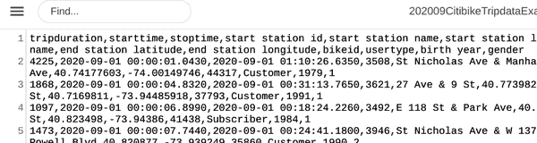
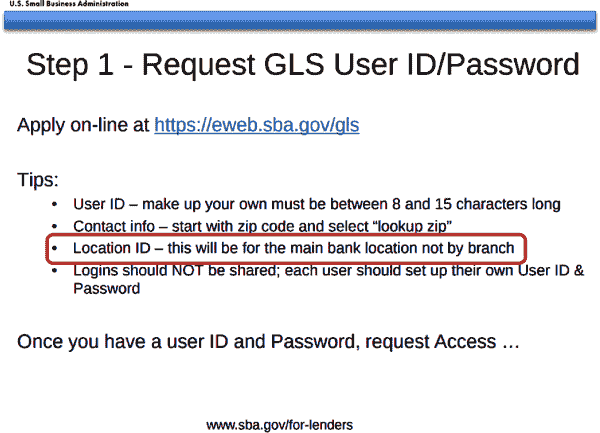

# 第七章：清理、转换和增强数据

大多数情况下，我们最初找到、收集或获取的数据在某种方式上都不完全符合我们的需求。格式不合适，数据结构错误，或者其单位需要调整。数据本身可能包含错误、不一致或间断。它可能包含我们不理解的引用，或者暗示着尚未实现的额外可能性。无论限制是什么，在我们使用数据作为洞察力的源头的过程中，不可避免地我们将不得不以某种方式对其进行清理、转换和/或增强，以使其发挥最大的作用。

到目前为止，我们推迟了大部分这项工作，因为我们有更紧急的问题需要解决。在第四章中，我们的重点是将数据从一个棘手的文件格式中提取出来，并转换为更易访问的形式；在第六章中，我们的重点是彻底评估我们数据的质量，以便我们可以就是否值得进行增强和分析做出明智的决定。

现在，然而，是时候卷起袖子，开始对我来说是数据整理和质量工作的第二阶段：准备我们拥有的数据，以进行我们想要执行的分析。我们的数据处于我们需要的表格类型格式，并且我们已经确定它的质量足够高，可以产生*一些*有用的见解，即使它们不完全是我们最初想象的那些。

由于显然不可能识别和解决与清理、转换和/或增强数据相关的每一个可能的问题或技术，因此我的方法是通过处理我们已经遇到过的实际示例来进行工作，在这些任务中至少需要一个或多个。例如，我们将看看我们可能需要使用在第二章和第四章中遇到的数据集来转换日期类型信息的不同方法。我们还将探讨如何清理同时包含结构化数据*和*元数据的数据文件中的“无用杂质”。我们甚至会探索*正则表达式*，这为我们提供了一种强大的方式，可以选择数据字段的某些部分或匹配特定的术语和模式，无视大小写和/或标点符号。在此过程中，我们将设法涵盖您在清理和转换大多数数据集时可能需要的工具和策略的相当范围。至少，在本章中概述的方法将为您提供一个有用的起点，如果您遇到真正棘手或独特的挑战。

# 选择 Citi Bike 数据的子集

在 “使用 Citi Bike 数据上路” 中，我们使用了 Citi Bike 系统数据来测试刚刚开始使用的 Python 概念，例如 `for...in` 循环和 `if/else` 条件语句。为了方便起见，我们从 [2020 年 9 月系统数据文件](https://s3.amazonaws.com/tripdata/index.html) 中摘录了一个样本数据集。

在许多情况下，我们需要对大型数据集进行分段以进行分析 —— 无论是因为我们没有时间或计算资源来一次性处理所有内容，还是因为我们只对数据集的一个子集感兴趣。如果我们只想选择特定数量的行，我们可以使用 “添加迭代器：range 函数” 中描述的 `for...in` 循环和 `range()` 函数。但我们可能也希望根据数据的值摘录数据。例如，我在选择所有 2020 年 9 月 1 日的骑行时就这样做了，但我们可能还想做一些更加微妙的事情，比如分别评估工作日 Citi Bike 骑行和周末及假期的骑行。

让我们从第一个任务开始，仅从较大数据集中摘录 2020 年 9 月 1 日的骑行。从概念上讲，这很简单：我们只想保留数据集中包含在 9 月 1 日开始的骑行的每一行。然而，如果我们简要地回顾一下数据集，就会发现即使这个任务也并不简单。



###### 图 7-1\. Citi Bike 骑行数据的前几行

正如您在 Figure 7-1 中所看到的，`starttime` 列不仅仅是一个日期，而是一种包括月、日和年以及小时、分钟和秒（精确到四位小数点）的日期/时间格式。例如，这个数据文件中的第一个条目，`starttime` 的值如下所示：

```py
2020-09-01 00:00:01.0430
```

显然，如果我们只想分析第一天的骑行，或者仅在早晨“高峰期”通勤时间骑行，或者仅工作日骑行，我们需要一种有效地基于该列中部分信息过滤数据的方法。但我们有哪些选项可以完成这些任务呢？在接下来的几节中，我们将依次研究每个任务 —— 查找特定日期上的骑行、特定时间范围内的骑行以及特定“类型”日期上的骑行。在此过程中，我们将学习 Python 提供的一些工具来解决这些问题，以及何时以及为什么我们可能会选择其中一种方法。

## 简单分割

解决第一个问题——仅摘录在 2020 年 9 月 1 日开始的骑行数据——如果我们结合一些我们在之前示例中已经使用过的工具，其实是相对容易的。首先要认识到，当我们用 Python 读取基本的 CSV 文件时，大部分数据都会被视为字符串。^(2) 这意味着，即使我们人类清楚地知道`2020-09-01 00:00:01.0430`应该被*解释*为日期和时间，Python 只是将其视为一组数字和字符。

通过这种方式查看`starttime`字段，如何找到所有在 2020 年 9 月 1 日开始的骑行变得更加直接，因为我们数据中包含“日期”信息的部分总是通过单个空格与“时间”信息分隔开来。这意味着，如果我们能找到一种方法只查看出现在那个空格*之前*的内容，我们就可以轻松地建立一个`if/else`条件来将其与我们的目标日期字符串——在这种情况下是`2020-09-01`——进行比较，并利用该比较来保留我们想要的行。

尽管这看起来可能不那么迷人，但内置字符串`split()`将在这里发挥关键作用。在之前的练习中，当我们需要分解文件名或 URL 时，它已经扮演了一个支持角色；实际上，我们在“动词 ≈ 函数”中就曾经使用过它来说明函数和方法之间的区别！作为一个复习，这个方法允许我们指定一个字符，用来将字符串分割成几部分。该方法的输出是一个列表，其中包含字符串中以指定字符分割的“剩余”部分，按照它们出现的顺序排列，且移除了你用`split()`分割的字符。因此，将字符串`2020-09-01 00:00:01.0430`按空格分割将产生列表`['2020-09-01', '00:00:01.0430']`。

为了看到这种方法的简单和有效，让我们修改我们的脚本，从“骑行 Citi Bike 数据”开始。在示例 7-1 中，我已经简化了一些注释，因为这些任务现在更加熟悉，但在脚本顶部概述你的脚本目标仍然是一个好主意。

##### 示例 7-1\. citibike_september1_rides.py

```py
# objectives: filter all September 2020 Citi Bike rides, and output a new
#             file containing only the rides from 2020-09-01

# program outline:
# 1\. read in the data file: 202009-citibike-tripdata.csv
# 2\. create a new output file, and write the header row to it.
# 3\. for each row in the file, split the `starttime` value on space:
#       a. if the first item in the resulting list is '2020-09-01', write
#          the row to our output file
# 4\. close the output file

# import the "csv" library
import csv

# open our data file in "read" mode
source_file = open("202009-citibike-tripdata.csv","r")

# open our output file in "write" mode
output_file = open("2020-09-01-citibike-tripdata.csv","w")

# pass our source_file to the DictReader "recipe"
# and store the result in a variable called `citibike_reader`
citibike_reader = csv.DictReader(source_file)

# create a corresponding DictWriter and specify that the
# header should be the same as the `citibike_reader` fieldnames
output_writer = csv.DictWriter(output_file, fieldnames=citibike_reader.fieldnames)

# write the header row to the output file
output_writer.writeheader()

# use a `for...in` loop to go through our `citibike_reader` list of rows
for a_row in citibike_reader:

    # get the value in the 'starttime' column
    start_timestamp = a_row["starttime"]

    # split the value in 'starttime' on the space character
    timelist = start_timestamp.split(" ")

    # the "date" part of the string will be the first item, position 0
    the_date = timelist[0]

    # if `the_date` matches our desired date
    if the_date == "2020-09-01":

        # write that row of data to our output file
        output_writer.writerow(a_row)

# close the output file
output_file.close()
```

很简单，对吧？当然，你可以很容易地修改这个脚本以捕获不同的日期，甚至是多个日期。例如，你可以修改`if`语句，使其像这样：

```py
 if the_date == "2020-09-01" or the_date == "2020-09-02":
```

当然，如果你只想查找两到三个特定日期，这种`or`语句完全可以胜任，但如果你需要查找更多日期，情况就会变得*非常*复杂（你可能还记得我们在示例 6-12 中得到的类似笨拙的条件）。为了以我们需要的精度过滤数据，而不生成非常复杂、笨拙和容易出错的代码，我们将更适合使用一个全新的工具包：*正则表达式*。

## 正则表达式：超级字符串匹配

一个*正则表达式*（通常缩写为*regex*），允许您快速有效地在更大的字符串或文本块中搜索字符串模式。在大多数情况下，如果您试图解决匹配或过滤问题，并发现解决方案涉及*大量*的`and`或`or`语句，这早期迹象表明您真正需要的是一个正则表达式。

正则表达式存在于大多数编程语言中，它们简洁、强大，有时*极其*棘手。虽然单个正则表达式可以包含甚至非常复杂的搜索模式，设计工作如预期般工作的正则表达式可以非常耗时，通常需要大量试验和错误才能做对。由于我们的目标是让我们的数据整理工作既高效*又*可理解，我们将在这里专注于提供通过其他方式难以实现的独特功能的短正则表达式。虽然有些任务中正则表达式是不可或缺的工具，但它们不是解决每个问题的工具，并且通常与其他技术配合使用效果最佳。

要开始，让我们使用正则表达式来解决过滤掉在典型“早晨通勤”时间内进行的乘车的问题，我们在这里估计为从上午 7 点到 9 点。任何正则表达式的处理都始于我们自己区分我们*想要*匹配的内容和我们*不想*匹配的内容。在这里，我们将从一个*外部*我们确定的时间范围之外的`starttime`条目开始：

```py
 2020-09-01 00:00:01.0430
```

现在让我们看一个*在*其中的`starttime`条目：

```py
 2020-09-01 00:08:17.5150
```

现在，让我们首先承认，我们*可以*用之前看到的字符串分割方法来解决这个问题。我们可以从`:`字符开始分割，第二个实例中，这样做会给我们带来这个：

```py
['2020-09-01 00', '08', '17.5150']
```

然后我们可以从列表中取出中间项，并使用*复合条件*——即，连接两个或多个测试的`if`语句来查看它是否与字符串`'07'`、`'08'`或`'09'`匹配。

这种方法当然*有效*，但感觉有点笨拙。它需要多个步骤和一个三部分条件语句，这很快会变得难以阅读。而正则表达式则能让我们在一个步骤中缩小到这些小时值，同时仍然相当可读。然而，在我们深入编写正则表达式本身之前，让我们快速概述一下 Python 正则表达式的词汇表。

因为正则表达式必须使用字符和字符串来描述*字符和字符串*的模式，Python 正则表达式“语言”使用一组*元字符*和特殊序列来使描述你正在搜索的模式变得更简单。在表 7-1 中，我包含了一些最有用的元素，摘自更完整的列表[在 W3Schools 上](https://w3schools.com/python/python_regex.asp)。

表格 7-1\. 常见的正则表达式构建块

| 表达式 | 描述 |
| --- | --- |
| [] | 一组字符 |
| “\” | 表示一个特殊序列（也可以用于转义特殊字符） |
| . | 任何字符（除换行符之外） |
| * | 零个或多个发生次数 |
| + | 一个或多个发生次数 |
| {} | 正好指定数量的发生次数 |
| &#124; | 或者 |
| () | 捕获和分组 |
| \d | 返回一个匹配，其中字符串包含数字（从 0 到 9 的数字） |
| \D | 返回一个匹配，其中字符串不包含数字 |
| \s | 返回一个匹配，其中字符串包含空白字符 |
| \S | 返回一个匹配，其中字符串不包含空白字符 |
| \w | 返回一个匹配，其中字符串包含任何单词字符（从 a 到 Z 的字符，数字从 0 到 9，以及下划线 _ 字符） |
| \W | 返回一个匹配，其中字符串不包含任何单词字符 |

与写作一样，正则表达式给了我们多种捕获我们正在寻找的模式的方法。在大多数情况下，我们的目标是定义一个能匹配我们需要查找的内容的模式，同时避免*意外*地匹配到其他任何内容。对于我们的“高峰时间”问题，我们可以利用这样一个事实：在`starttime`列中的“小时”数字被冒号（`:`）包围，*并且没有其他字符包围*。这意味着我们可以在我们的正则表达式中使用这种“被冒号包围”的模式，并且可以确信不会意外地匹配到字符串的其他部分。为了看看这是否像我们希望的那样工作，让我们设置几个示例正则表达式，针对一些（真实和构造的）样本数据进行测试，如示例 7-2 中所示。

##### 示例 7-2\. regex_tests.py

```py
# the goal of this script is to try out how a couple of regular expressions
# fare with some sample test data. 

# import the regular expression library
import re

# using the `re.compile()` method is a helpful way of keeping a reference to
# our various regular expressions
bookend_regex = re.compile("\s0[7-9]:") 

# always try to be descriptive with the variable names
one_sided_regex = re.compile("0[7-9]:")

# this example should *fail*
sample1 = "2020-09-01 00:00:01.0430"

# this example should *match*
sample2 = "2020-09-01 09:04:23.7930"

# this example should *fail*
sample3 = "2020-09-01 10:07:02.0510"

# let's see what happens!
print("bookend_regex:")
print(bookend_regex.search(sample1))
print(bookend_regex.search(sample2))
print(bookend_regex.search(sample3))

print("one_sided_regex:")
print(one_sided_regex.search(sample1))
print(one_sided_regex.search(sample2))
print(one_sided_regex.search(sample3))
```


除了这样的示例文件，你还可以使用[W3Schools regex demo](https://w3schools.com/python/trypython.asp?filename=demo_regex)在线测试你的 Python 正则表达式。


即使你在脚本中只使用它们一次，我*强烈建议*在文件顶部定义你的正则表达式，使用一个恰当命名的变量。这是保持追踪它们功能的最简单、最有效的方法，尤其是如果你要使用多个正则表达式的话！

当你在示例 7-2 中运行脚本时，你的输出应该看起来像这样：

```py
bookend_regex:
None
<re.Match object; span=(10, 14), match=' 09:'>
None
one_sided_regex:
None
<re.Match object; span=(11, 14), match='09:'>
<re.Match object; span=(14, 17), match='07:'>
```

如你所见，“两端”正则表达式，我们指定了两个冒号，正确地匹配了（*并且*在所有三种情况下未匹配）；另一方面，“单侧”正则表达式却错误地在`sample3`的*seconds*值上找到了匹配。这正是为什么尽可能精确地定义你要查找的字符串是如此重要的原因。如果你查看之前打印出的`Match object`，你会看到它包含关于匹配内容（例如，`match='07:'`）及其位置（例如，在字符串的索引位置 14 到 17）的信息。

到目前为止，这似乎相当简单。然而，当我们想要匹配的内容的*结构*发生变化时，情况可能会变得有些棘手。例如，如果我们希望将我们感兴趣的时间段扩展到上午 7 点到 10 点，我们的`bookend_regex`原本无法正常工作，因为它指定了冒号后的第一个字符必须是`0`。我们可以尝试将数字范围的选项添加到我们的数字范围中，例如：

```py
plus_ten = re.compile("\s[01][0789]:")

print("plus_ten")
print(plus_ten.search("2020-09-01 18:09:11.0980"))
```

这产生了输出：

```py
plus_ten
<re.Match object; span=(10, 14), match=' 18:'>
```

正如我们从输出中可以看到的那样，问题在于我们的数据使用的是 24 小时制，将匹配到我们不希望的一系列时间。这是因为正则表达式并不像我们想象的那样“看到”数字 —— 它们只看到字符序列。这就是为什么`18`会返回匹配结果 —— 我们的正则表达式允许以`0`或`1`开头，然后跟随`0`、`7`、`8`或`9`。虽然我们显然是以数字`07`、`08`、`09`和`10`为目标编写的，但我们的代码打开了更多的可能性。

在这种情况下的解决方案是使用“或” *管道* 字符（`|`），我们可以用它来组合两个（或其他）完全不同的正则表达式。在这种情况下，它看起来会像示例 7-3 中展示的内容。

##### 示例 7-3\. 捕获 7 到 10

```py
seven_to_ten = re.compile("\s0[7-9]:|\s10:")
```

请尝试使用几个样本数据点自行验证，确认它是否符合我们的需求（而不包含其他内容）。

我不会进一步深入讨论正则表达式；正如我们在“网页抓取：最后的数据来源”中探讨的那样，没有两个正则表达式问题（或解决方案）是相同的。但我希望你能看到这些方法提供了做模式匹配的潜力，这些模式匹配仅依靠复合条件和基本字符串函数可能非常笨拙。

## 制作日期

将类似日期的数据视为字符串的一个吸引人之处在于，正如我们在处理各种失业数据来源格式时在第四章中所看到的，它们的解释方式在数据源和甚至 Python 库之间可能会有显著差异。然而，在某些情况和任务中，将类似日期的数据转换为实际的`datetime`类型非常有用。例如，如果我们想要从我们的 Citi Bike 数据中分离出工作日骑行数据，我们*可以*尝试通过查看日历，识别所有工作日的日期，然后创建一个巨大的字符串比较列表或编写正则表达式来匹配它们。在 2020 年 9 月的数据中，这样一个正则表达式对象可能看起来像是示例 7-4 中展示的内容。

##### 示例 7-4\. 2020 年 9 月的工作日正则表达式

```py
september2020_weekday = re.compile("-0[123489]-|-1[0145678]-|-2[1234589]-|-30-")
```

唉。这当然*有效*，但几乎不可能阅读，并且仍然基本上是一个巨大的复合条件——即使它因为是正则表达式而被捕获的字符较少。此外，这并不是一个很好扩展的解决方案。如果我们想将分析扩展到*其他*月份，那意味着得重新查看日历。

幸运的是，精心构建的 Python `datetime` 对象具有多个内置方法，可以帮助处理这类任务。实际上，有一个简单的 `weekday()` 方法，根据某个日期所在星期的日期返回从 0 到 6 的数字（[0 表示星期一，6 表示星期日](https://docs.python.org/3/library/datetime.html#datetime.date.weekday)）。这意味着，如果我们将 `starttime` 列的内容转换为日期格式，就像在示例 7-5 中显示的那样，我们可以使用这个方法快速识别对应于*任何*日期的星期几。这将帮助我们将代码应用于其他数据源——例如不同月份或年份的乘客数据——而无需进行任何操作！

##### 示例 7-5\. weekday_rides.py

```py
# objectives: filter all September 2020 Citi Bike rides, and output a new
#             file containing only weekday rides

# program outline:
# 1\. read in the data file: 202009-citibike-tripdata.csv
# 2\. create a new output file, and write the header row to it.
# 3\. for each row in the file, make a date from the `starttime`:
#       a. if it's a weekday, write the row to our output file
# 4\. close the output file

# import the "csv" library
import csv

# import the "datetime" library
from datetime import datetime

# open our data file in "read" mode
source_file = open("202009-citibike-tripdata.csv","r")

# open our output file in "write" mode
output_file = open("202009-citibike-weekday-tripdata.csv","w")

# convert source data to a DictReader; store the result in `citibike_reader`
citibike_reader = csv.DictReader(source_file)

# create a corresponding DictWriter and specify its fieldnames
output_writer = csv.DictWriter(output_file, fieldnames=citibike_reader.fieldnames)

# actually write the header row to the output file
output_writer.writeheader()

# use a `for...in` loop to go through our `citibike_reader` list of rows
for a_row in citibike_reader:

    # convert the value in the 'starttime' column to a date object
    the_date = datetime.strptime(a_row['starttime'], '%Y-%m-%d %H:%M:%S.%f') 

    # if `the_date` is a weekday
    if the_date.weekday() <= 4: 
        # write that row of data to our output file
        output_writer.writerow(a_row)

# close the output file
output_file.close()
```


如示例 6-1 所述，提供[源数据的格式](https://docs.python.org/3/library/datetime.html#strftime-strptime-behavior)将有助于我们的脚本运行更快、更可靠。


`weekday()` 方法将[星期一置于位置`0`](https://docs.python.org/3/library/datetime.html#datetime.date.weekday)，因此查找包括`4`在内的任何内容将捕获星期一到星期五的值。

根据您的设备，您可能会注意到示例 7-5 中的脚本运行时间较长。例如，在我的（性能不是很强的）设备上，完成所需时间超过 85 秒。而在示例 7-4 中使用正则表达式完成同样的任务只需 45 秒。我还可以更轻松地调整正则表达式，以跳过官方工作日但同时也是假期的日子（如劳动节）。

那么哪种方法更好呢？像往常一样，*这要看情况*。对于你特定的数据整理/清理/转换过程，什么才是最有效的方法将取决于你的需求和资源。如果你要在十年的 Citi Bike 数据中寻找工作日通勤模式，你可能最好使用`weekday()`方法，因为你无需修改代码以处理不同的月份或年份。另一方面，如果你没有太多的月份可供使用，并且执行速度（以及绝对精确度）是你的首要关注点，你可能更喜欢正则表达式的方法。你可能也会发现正则表达式让你想抓狂，或者使用多个步骤以获得完美结果让你发疯。正如我们将在第八章中进一步探讨的那样，所有这些都可以成为特定设计选择的合理理由——只要确保选择是*你的*选择。

# 数据文件的清理

在第四章中，我们遇到了许多需要“清理”的数据集实例，否则这些数据集将显得笨拙或难以理解。例如，在我们处理老式 *.xls* 文件的过程中（参见示例 4-6），我们遇到了几个明显的问题。首先，电子表格中包含了表格类型的数据以及描述性的标题信息，尽管原则上很有用，但为了分析其余部分，这些信息显然需要重新安排位置。其次，*.xls* 格式不支持“真实”的日期，这导致我们从 *.xls* 转换到 *.csv* 的初步转换结果中，日期应有的地方出现了一堆无意义的数字。虽然一开始我选择先搁置这些问题，但现在是解决它们的时候了。

在思考第一个问题时，我想强调的是，我们*绝对不*希望简单地“丢弃”当前存储在 *fredgraph.xls* 文件顶部的信息。正如我们在第六章的工作中所明显的那样，元数据是一种宝贵的资源，我们*永远*不希望从[主要来源](https://loc.gov/programs/teachers/getting-started-with-primary-sources)中丢弃元数据。相反，在这种情况下，我更倾向于将一个文件拆分为两个文件。我们将剥离出元数据，并将其存储在一个独立但同名的文本文件中，同时解析并将表格类型的数据保存为便于分析的 *.csv* 格式。

在电子表格程序中查看我们的源*.xls*文件时，可以很容易地直观地看到元数据何时结束并且表格类型的数据从何处开始。真正的问题是：我们在脚本中如何检测这种转换？正如数据清洗经常出现的情况一样，最有效的解决方案并不总是优雅的。元数据在其包含列标题的行中结束，而表格类型的数据开始。如果我们在处理文件时查看每行的第一个值，我们可以在遇到第一个列标题时停止向元数据文件写入并开始向*.csv*写入。由于值`observation_date`是此数据集的第一个列标题，所以我们会在找到它出现在当前行开头时进行这一转换。

###### 提示

在开始之前，仔细检查您的源文件，查看元数据在其中的位置。特别是在数据包含估计值或其他限定词的情况下，您可能会发现元数据既在表格类型数据之前，也在其*之后*。

要了解如何从我们的单个源文件创建这两个特定用途的文件，请查看示例 7-6 中的脚本（如果您需要复习本示例中某些代码选择，请参考示例 4-6）。

##### 示例 7-6\. xls_meta_parsing.py

```py
# converting data in an .xls file with Python to csv + metadata file
# using the "xrld" library. First, pip install the xlrd library:
# https://pypi.org/project/xlrd/2.0.1/

# import the "xlrd" library
import xlrd

# import the `csv` library, to create our output file
import csv

# pass our filename as an ingredient to the `xlrd` library's
# `open_workbook()` "recipe"
# store the result in a variable called `source_workbook`
source_workbook = xlrd.open_workbook("fredgraph.xls")

# open and name a simple metadata text file
source_workbook_metadata = open("fredgraph_metadata.txt","w") 

# an `.xls` workbook can have multiple sheets
for sheet_name in source_workbook.sheet_names():

    # create a variable that points to the current worksheet by
    # passing the current value of `sheet_name` to the `sheet_by_name` recipe
    current_sheet = source_workbook.sheet_by_name(sheet_name)

    # create "xls_"+sheet_name+".csv" as an output file for the current sheet
    output_file = open("xls_"+sheet_name+".csv","w")

    # use the `csv` library's "writer" recipe to easily write rows of data
    # to `output_file`, instead of reading data *from* it
    output_writer = csv.writer(output_file)

    # create a Boolean variable to detect if we've hit our table-type data yet
    is_table_data = False 

    # now, we need to loop through every row in our sheet
    for row_num, row in enumerate(current_sheet.get_rows()):

        # pulling out the value in the first column of the current row
        first_entry = current_sheet.row_values(row_num)[0]

        # if we've hit the header row of our data table
        if first_entry == 'observation_date':

            # it's time to switch our "flag" value to "True"
            is_table_data = True

        # if `is_table_data` is True
        if is_table_data:

            # write this row to the data output file
            output_writer.writerow(current_sheet.row_values(row_num))

        # otherwise, this row must be metadata
        else:

            # since we'd like our metadata file to be nicely formatted, we
            # need to loop through the individual cells of each metadata row
            for item in current_sheet.row(row_num):

                    # write the value of the cell
                    source_workbook_metadata.write(item.value)

                    # separate it from the next cell with a tab
                    source_workbook_metadata.write('\t')

            # at the end of each line of metadata, add a newline
            source_workbook_metadata.write('\n')

    # just for good measure, let's close our output files
    output_file.close()
    source_workbook_metadata.close()
```


虽然我们在这里只创建一个元数据文件，但如果需要，我们可以轻松将这一过程的这部分移至`for`循环内，并为每个工作表创建一个唯一的元数据文件。


这种布尔（True/False）变量通常被描述为*标志*变量。其思想是我们在循环之外设置其值，然后在发生特定事件时“翻转”其值——这样我们就不必两次循环遍历所有数据。在这里，我们将使用它来检查何时应该开始向我们的“数据”文件而不是我们的“元数据”文件写入。

在我们继续处理这个（仍然难以理解的）文件中的日期之前，我想强调在 示例 7-6 中引入的一种新技术：所谓的 *标志变量* 的使用。这个术语通常指的是用于跟踪是否发生了某个事件或满足了某个条件的布尔（True/False）变量，特别是在循环内部。例如，在 示例 7-6 中，我们使用 `is_table_data` 变量来跟踪是否已经遇到标记我们表格数据开始的数据行。由于我们 `for...in` 循环中的给定数据行在下一个数据行读取后基本上被“遗忘”，因此我们需要在循环之前创建这个变量。这样可以使 `is_table_data` 变量在我们循环的 *范围* 之外保持可用——这是我们将在 第八章 中更详细地看到的概念。

# 解密 Excel 日期

我们可以避免那些 Excel 日期不再的问题。尽管希望你不会经常遇到这种情况，但我在这里包含它是为了完整性，并且因为它展示了代码通常会如何演变——通常在我们添加甚至看似小的功能时变得更加复杂和难以阅读。例如，在 示例 7-7 中，我们需要检查变量是否包含数字，信不信由你，我们需要一个名为 *numbers* 的库来做到这一点。尽管这部分基本上很简单，但你很快会在 示例 7-7 中看到，如何需要转换这些日期值需要调整我们写入输出文件的表格类型数据的方法。

##### 示例 7-7\. xls_meta_and_date_parsing.py

```py
# converting data in an .xls file with Python to csv + metadata file, with
# functional date values using the "xrld" library.
# first, pip install the xlrd library:
# https://pypi.org/project/xlrd/2.0.1/

# then, import the `xlrd` library
import xlrd

# import the csv library
import csv

# needed to test if a given value is *some* type of number
from numbers import Number

# for parsing/formatting our newly interpreted Excel dates
from datetime import datetime

# pass our filename as an ingredient to the `xlrd` library's
# `open_workbook()` "recipe"
# store the result in a variable called `source_workbook`
source_workbook = xlrd.open_workbook("fredgraph.xls")

# open and name a simple metadata text file
source_workbook_metadata = open("fredgraph_metadata.txt","w")

# an `.xls` workbook can have multiple sheets
for sheet_name in source_workbook.sheet_names():

    # create a variable that points to the current worksheet by
    # passing the current value of `sheet_name` to the `sheet_by_name` recipe
    current_sheet = source_workbook.sheet_by_name(sheet_name)

    # create "xls_"+sheet_name+".csv" as an output file for the current sheet
    output_file = open("xls_"+sheet_name+"_dates.csv","w")

    # use the `csv` library's "writer" recipe to easily write rows of data
    # to `output_file`, instead of reading data *from* it
    output_writer = csv.writer(output_file)

    # create a Boolean variable to detect if we've hit our table-type data yet
    is_table_data = False

    # now, we need to loop through every row in our sheet
    for row_num, row in enumerate(current_sheet.get_rows()):

        # pulling out the value in the first column of the current row
        first_entry = current_sheet.row_values(row_num)[0]

        # if we've hit the header row of our data table
        if first_entry == 'observation_date':

            # it's time to switch our "flag" value to "True"
            is_table_data = True

        # if `is_table_data` is True
        if is_table_data:

            # extract the table-type data values into separate variables
            the_date_num = current_sheet.row_values(row_num)[0]
            U6_value = current_sheet.row_values(row_num)[1]

            # create a new row object with each of the values
            new_row = [the_date_num, U6_value]

            # if the `the_date_num` is a number, then the current row is *not*
            # the header row. We need to transform the date.
            if isinstance(the_date_num, Number):

                # use the xlrd library's `xldate_as_datetime()` to generate
                # a Python datetime object
                the_date_num = xlrd.xldate.xldate_as_datetime(
                    the_date_num, source_workbook.datemode) 

                # overwrite the first value in the new row with
                # the reformatted date
                new_row[0] = the_date_num.strftime('%m/%d/%Y') 

            # write this new row to the data output file
            output_writer.writerow(new_row)

        # otherwise, this row must be metadata
        else:

            # since we'd like our metadata file to be nicely formatted, we
            # need to loop through the individual cells of each metadata row
            for item in current_sheet.row(row_num):

                    # write the value of the cell
                    source_workbook_metadata.write(item.value)

                    # separate it from the next cell with a tab
                    source_workbook_metadata.write('\t')

            # at the end of each line of metadata, add a newline
            source_workbook_metadata.write('\n')

    # just for good measure, let's close our output files
    output_file.close()
    source_workbook_metadata.close()
```


使用 *xlrd* 库的 `xldate_as_datetime()` 方法转换这些 *.xls* “日期”需要同时使用数字值 *和* [工作簿的 `datemode`](https://xlrd.readthedocs.io/en/latest/api.html#xlrd.book.Book.datemode)，以便正确生成 Python datetime 对象。^(4)


在这里，我决定使用适当的 `strftime()` 格式将日期写入我的表格类型数据文件，格式为 `MM/DD/YYYY`，但如果你喜欢，也可以使用其他格式。

虽然*xlrd*库使将我们奇怪的 Excel 日期转换为可理解的内容的过程相对简单，但我认为示例 7-7 中的代码展示了如何快速增加复杂性——特别是通过额外的、嵌套的`if`语句——从而使最初非常简单的程序变得复杂。这就是为什么我们将花费第八章来探讨有效和高效地简化我们的代码的策略和技术的原因之一：我们希望确保它不仅能够完成我们需要的所有工作，而且还足够可读和可重用，以经受时间的考验。

# 从固定宽度数据生成真正的 CSV 文件

另一个我们在将固定宽度数据转换为*.csv*时也只取得了中等成功的实例是在示例 4-7，在那里，我们成功地将源数据转换为逗号分隔文件，但结果实际上相当不尽如人意：它保留了许多原始文件的格式化遗留问题，这可能会阻碍我们未来的数据分析工作。

幸运的是，我们遇到的“前导”和/或“尾随”空白问题非常常见，因为通常生成此类数据的数据技术已经存在了很长时间。因此，解决这个问题非常简单：解决方案存在于内置的 Python `strip()`函数中，正如示例 7-8 所示。

##### 示例 7-8\. fixed_width_strip_parsing.py

```py
# an example of reading data from a fixed-width file with Python.
# the source file for this example comes from the NOAA and can be accessed here:
# https://www1.ncdc.noaa.gov/pub/data/ghcn/daily/ghcnd-stations.txt
# the metadata for the file can be found here:
# https://www1.ncdc.noaa.gov/pub/data/ghcn/daily/readme.txt

# import the `csv` library, to create our output file
import csv

filename = "ghcnd-stations"

# reading from a basic text file doesn't require any special libraries
# so we'll just open the file in read format ("r") as usual
source_file = open(filename+".txt", "r")

# the built-in "readlines()" method does just what you'd think:
# it reads in a text file and converts it to a list of lines
stations_list = source_file.readlines()

# create an output file for our transformed data
output_file = open(filename+".csv","w")

# use the `csv` library's "writer" recipe to easily write rows of data
# to `output_file`, instead of reading data *from* it
output_writer = csv.writer(output_file)

# create the header list
headers = ["ID","LATITUDE","LONGITUDE","ELEVATION","STATE","NAME","GSN_FLAG",
           "HCNCRN_FLAG","WMO_ID"]

# write our headers to the output file
output_writer.writerow(headers)

# loop through each line of our file (multiple "sheets" are not possible)
for line in stations_list:

    # create an empty list, to which we'll append each set of characters that
    # makes up a given "column" of data
    new_row = []

    # ID: positions 1-11
    new_row.append((line[0:11]).strip()) 

    # LATITUDE: positions 13-20
    new_row.append((line[12:20]).strip())

    # LONGITUDE: positions 22-30
    new_row.append((line[21:30]).strip())

    # ELEVATION: positions 32-37
    new_row.append((line[31:37]).strip())

    # STATE: positions 39-40
    new_row.append((line[38:40]).strip())

    # NAME: positions 42-71
    new_row.append((line[41:71]).strip())

    # GSN_FLAG: positions 73-75
    new_row.append((line[72:75]).strip())

    # HCNCRN_FLAG: positions 77-79
    new_row.append((line[76:79]).strip())

    # WMO_ID: positions 81-85
    new_row.append((line[80:85]).strip())

    # now all that's left is to use the
    # `writerow` function to write new_row to our output file
    output_writer.writerow(new_row)

# just for good measure, let's close the `.csv` file we just created
output_file.close()
```


如果您将此代码与示例 4-7 中的代码进行比较，您会看到除了我们对每个字符串应用了`strip()`方法之外，它们是完全相同的。

再次看到，修改我们原始代码以解决格式化或“清理”问题并不一定很难，但结果得到的脚本也不*完全*优雅。用`strip()`方法从输出中去除空白绝对是直接的，但在此过程中我们不得不添加大量括号——这让我们的代码比我们期望的要不那么可读。

这说明了创建良好、高质量 Python 代码与更典型的写作过程如何相似。如果我们将第四章中的初步工作视为我们最终程序的“大纲”，在这里我们解决了将数据格式至少转换为我们所需的表格类型*结构*的高级问题，这为我们留下了空间，以后可以回来修订该工作，填充细节，使其在处理我们正在处理的特定数据集时更加细致。

同样地，在 第八章 中，我们将进一步推进这个修订过程，优化这些程序——这些程序已经做到我们需要的一切——以便它们更加简明和易于理解，就像我们对待任何一篇写作一样。这种迭代式的编程方法不仅意味着我们最终得到了更好、更有用的代码；它还帮助我们将复杂的编程问题分解成一系列较少令人畏惧的步骤，我们可以逐步解决。同样重要的是，无论我们处于过程的哪个阶段，我们都有一个可以依赖的功能程序。这种逐步的方法在我们接下来要处理的更复杂的数据清洗任务中特别有用：解决意外的拼写差异。

# 纠正拼写不一致

在 第六章 中，我们使用了“指纹识别”过程来帮助解决我们的支票保护计划（PPP）数据中可能存在的银行信息拼写不一致的可能性——这是任何依赖人工数据输入的数据集中常见的问题。当然，在我们编写的 示例 6-11 中，只是通过计算产生不同指纹的条目数量来估计`OriginatingLender`列中真正唯一条目的数量。我们发现我们的数据集包含了 4,337 个唯一的银行名称，但只有 4,242 个唯一的指纹——这表明多达 95 个银行名称实际上 *是* 相同的，但包含拼写错误，因为它们生成了相同的指纹。

因为这 95 个潜在的拼写错误可能会影响成千上万行的数据，我们需要一种方法来转换我们的数据集，以便我们可以放心地按贷方机构聚合它。与此同时，我们也不希望 *过度纠正*，将本不相符的条目分组在一起。

这里是一个实例，*转换*我们的数据非常宝贵：我们不希望冒失丢失任何原始数据（保留它对验证和抽查至关重要），但我们 *也* 需要转换它以支持我们未来的分析工作。由于我们的数据集很大，分组和过滤以满足我们的需求可能会耗费大量时间，因此我们希望通过实际 *添加* 新列到数据集中来保留该工作的结果。这样一来，我们既能保留我们的原始数据 *也* 能在单个文件中保留转换工作的好处。

幸运的是，我们已经有一些常用库可以使这个过程相当简单。由于我们已经知道如何使用指纹过程聚合名称（来自 示例 6-11），更棘手的部分可能是确定具有相同指纹的银行是否应当被视为不同的组织。回顾 示例 6-7 的输出（方便起见在 示例 7-9 中再现），我们看到并不是很多字段包含“originating”贷款人信息，因此，我们最有可能的选择是通过比较包含在 `OriginatingLenderLocationID` 中的值来决定两个共享所有相同单词的起始银行是否应当被视为不同的组织，例如，“First Bank Texas” 和 “Texas First Bank”。

##### 示例 7-9。最近的样本数据转置

```py
LoanNumber                                          9547507704
DateApproved                                        05/01/2020
SBAOfficeCode                                              464
ProcessingMethod                                           PPP
BorrowerName                             SUMTER COATINGS, INC.
BorrowerAddress                          2410 Highway 15 South
BorrowerCity                                            Sumter
BorrowerState                                             <NA>
BorrowerZip                                         29150-9662
LoanStatusDate                                      12/18/2020
LoanStatus                                        Paid in Full
Term                                                        24
SBAGuarantyPercentage                                      100
InitialApprovalAmount                                769358.78
CurrentApprovalAmount                                769358.78
UndisbursedAmount                                            0
FranchiseName                                             <NA>
ServicingLenderLocationID                                19248
ServicingLenderName                               Synovus Bank
ServicingLenderAddress                           1148 Broadway
ServicingLenderCity                                   COLUMBUS
ServicingLenderState                                        GA
ServicingLenderZip                                  31901-2429
RuralUrbanIndicator                                          U
HubzoneIndicator                                             N
LMIIndicator                                              <NA>
BusinessAgeDescription       Existing or more than 2 years old
ProjectCity                                             Sumter
ProjectCountyName                                       SUMTER
ProjectState                                                SC
ProjectZip                                          29150-9662
CD                                                       SC-05
JobsReported                                                62
NAICSCode                                               325510
RaceEthnicity                                       Unanswered
UTILITIES_PROCEED                                         <NA>
PAYROLL_PROCEED                                      769358.78
MORTGAGE_INTEREST_PROCEED                                 <NA>
RENT_PROCEED                                              <NA>
REFINANCE_EIDL_PROCEED                                    <NA>
HEALTH_CARE_PROCEED                                       <NA>
DEBT_INTEREST_PROCEED                                     <NA>
BusinessType                                       Corporation
OriginatingLenderLocationID                              19248
OriginatingLender                                 Synovus Bank
OriginatingLenderCity                                 COLUMBUS
OriginatingLenderState                                      GA
Gender                                              Unanswered
Veteran                                             Unanswered
NonProfit                                                 <NA>
```

在我们继续之前，当然，我们要确保理解 `OriginatingLenderLocationID` 中的数据实际上*表示*什么。幸运的是，当我们搜索“originating lender location id”时，第一个结果是来自 SBA 网站的[另一份文档](https://sba.gov/sites/default/files/articles/ETran_Origination_01_2014.pdf)。通过这个 PDF 搜索术语“location”，我们来到了 图 7-2 所示的页面，这使我们放心，“Location ID” 的值输入不应该因为同一银行的不同分支而改变，而是表示一个给定银行的*主*分支。



###### 图 7-2。关于贷款人位置 ID 的信息

借助这些额外的信息，我们可以创建一个包含新列 `OriginatingLenderFingerprint` 的 PPP 贷款数据版本，其中包含 `OriginatingLender` 的指纹和 `OriginatingLenderLocationID` 的组合，如 示例 7-10 所示。稍后，我们可以利用这个值快速地按原始贷款人聚合我们的数据，同时（合理地）确信我们既不因拼写错误而未能匹配条目，*也不*将本应为两家独立银行的机构视为一家。

##### 示例 7-10。ppp_add_fingerprints.py

```py
# quick script for adding a "fingerprint" column to our loan data, which will
# help us confirm/correct for any typos or inconsistencies in, e.g., bank names

# import the csv library
import csv

# importing the `fingerprints` library
import fingerprints

# read the recent data sample into a variable
ppp_data = open('public_150k_plus_recent.csv','r')

# the DictReader function makes our source data more usable
ppp_data_reader = csv.DictReader(ppp_data)

# create an output file to write our modified dataset to
augmented_ppp_data = open('public_150k_plus_fingerprints.csv','w')

# create a "writer" so that we can output whole rows at once
augmented_data_writer = csv.writer(augmented_ppp_data)

# because we're adding a column, we need to create a new header row as well
header_row = []

# for every column header
for item in ppp_data_reader.fieldnames: 

    # append the existing column header
    header_row.append(item)

    # if we're at 'OriginatingLender'
    if item == 'OriginatingLender':

        # it's time to add a new column
        header_row.append('OriginatingLenderFingerprint')

# now we can write our expanded header row to the output file
augmented_data_writer.writerow(header_row)

# iterate through every row in our data
for row in ppp_data_reader:

    # create an empty list to hold our new data row
    new_row = [] 

    # for each column of data in the *original* dataset
    for column_name in ppp_data_reader.fieldnames:

        # first, append this row's value for that column
        new_row.append(row[column_name])

        # when we get to the 'OriginatingLender' column, it's time
        # to add our new "fingerprint" value
        if column_name == 'OriginatingLender':

            # our fingerprint will consist of the generated fingerprint PLUS
            # the OriginatingLenderLocationID
            the_fingerprint = fingerprints.generate(row[column_name]) + \
                              " " + row['OriginatingLenderLocationID']

            # append the compound fingerprint value to our row
            new_row.append(the_fingerprint)

    # once the whole row is complete, write it to our output file
    augmented_data_writer.writerow(new_row)

# close both files
augmented_ppp_data.close()
ppp_data.close()
```


虽然这看起来可能有些多余，但这第一个循环实际上**只存在**于创建我们的新标题行。与往常一样，我们希望尽可能地避免引入拼写错误，因此在这种情况下，整个额外的循环是值得的（比手动打出这个列表要*好*多了）。


由于我们正在添加一列数据，所以我们需要像处理标题行一样，逐项构建新的数据行。

结果文件的结构与原始文件相同，只是在`OriginatingLender`和`OriginatingLenderCity`之间添加了一个新的`OriginatingLenderFingerprint`列，如你可以在 Example 7-11 中看到的那样。

##### Example 7-11\. 带指纹的 PPP 数据

```py
LoanNumber                                           9547507704
DateApproved                                         05/01/2020
SBAOfficeCode                                               464
ProcessingMethod                                            PPP
BorrowerName                              SUMTER COATINGS, INC.
BorrowerAddress                           2410 Highway 15 South
BorrowerCity                                             Sumter
BorrowerState                                               NaN
BorrowerZip                                          29150-9662
LoanStatusDate                                       12/18/2020
LoanStatus                                         Paid in Full
Term                                                         24
SBAGuarantyPercentage                                       100
InitialApprovalAmount                                 769358.78
CurrentApprovalAmount                                 769358.78
UndisbursedAmount                                           0.0
FranchiseName                                               NaN
ServicingLenderLocationID                                 19248
ServicingLenderName                                Synovus Bank
ServicingLenderAddress                            1148 Broadway
ServicingLenderCity                                    COLUMBUS
ServicingLenderState                                         GA
ServicingLenderZip                                   31901-2429
RuralUrbanIndicator                                           U
HubzoneIndicator                                              N
LMIIndicator                                                NaN
BusinessAgeDescription        Existing or more than 2 years old
ProjectCity                                              Sumter
ProjectCountyName                                        SUMTER
ProjectState                                                 SC
ProjectZip                                           29150-9662
CD                                                        SC-05
JobsReported                                               62.0
NAICSCode                                              325510.0
RaceEthnicity                                        Unanswered
UTILITIES_PROCEED                                           NaN
PAYROLL_PROCEED                                       769358.78
MORTGAGE_INTEREST_PROCEED                                   NaN
RENT_PROCEED                                                NaN
REFINANCE_EIDL_PROCEED                                      NaN
HEALTH_CARE_PROCEED                                         NaN
DEBT_INTEREST_PROCEED                                       NaN
BusinessType                                        Corporation
OriginatingLenderLocationID                               19248
OriginatingLender                                  Synovus Bank
OriginatingLenderFingerprint                 bank synovus 19248
OriginatingLenderCity                                  COLUMBUS
OriginatingLenderState                                       GA
Gender                                               Unanswered
Veteran                                              Unanswered
NonProfit                                                   NaN
```

尽管这种转换将帮助我们通过特定的“发起方”借方轻松聚合数据，但我们也可以迅速地用“服务方”借方进行复制。我们甚至可以编写一个脚本，比较这两个结果指纹的值，创建一个“标志”列，指示特定贷款的服务方和发起方银行是否相同。

# 通向“简单”解决方案的曲折路径

我希望你觉得 Example 7-10 的练习很简单，但我想告诉你，前面的脚本并不是我尝试的第一个解决方案——甚至不是第二或第三个。事实上，事实上，在我*最终*意识到我的最终方法是在确保来自同一家银行的贷款被分组在一起的同时，不会意外地混淆两个不同机构之间，我可能花了大约十几个小时，思考，尝试，处理失败。

我将描述我实际通过这个过程工作的方式，因为——希望*也*变得清楚——数据整理（以及编程一般来说）不仅仅是编码，更多的是推理和问题解决。这意味着要仔细思考面前的问题，尝试不同的解决方案，而且，也许最重要的是，即使感觉像是“扔掉”了一大堆工作，也要愿意改变方向，这些对于数据整理比能够记住两行 Python 代码更加重要^(5)。因此，为了说明这些问题解决努力的一个方面，我将（相对而言）简要地在这里为你概述我尝试的不同方法，然后确定了在“纠正拼写不一致性”中的解决方案。

起初，我从 Example 6-11 最小地调整脚本开始，创建了一个只包含那些指纹的新列，并写了一个新的 CSV，添加了这个新列。但我意识到，一些名字相似的银行很可能会共享相同的“指纹”，所以我编写了一个脚本，做了以下几件事：

1.  创建了一个唯一指纹的列表。

1.  对于每个唯一的指纹，创建了一个新的列表（实际上是一个`pandas` DataFrame），包含所有唯一的`OriginatingLenderLocationID`值。

1.  如果有多个不同的`OriginatingLenderLocationID`值，我就*更新*“指纹”列以整合`OriginatingLenderLocationID`，就像我们最终为示例 7-10 中的*所有*条目所做的那样。

然而，即使创建*那*个脚本，比这份编号概要看起来更复杂得多。第一步当然很容易 —— 我们几乎已经做过了。但当我开始在`pandas`中使用新文件时，我的小笔记本电脑记忆不足，所以我把工作移到了 Google Colab。这给了我更多的内存来工作（某种程度上），但现在每次我离开几分钟以上，我都必须重新验证并从我的 Google Drive 文件中重新加载数据 —— 每次都要额外花几分钟。此外，虽然我*相当*有信心已经正确地更新了我的 DataFrame 中的值，但尝试通过搜索我确信应该存在的新指纹来检查我的工作并不可靠：有时我会得到匹配，有时我得到一个空的 DataFrame！再加上每次运行步骤 3 大约需要 3 分钟或更多的时间，你可以想象我花了多少小时（以及多么沮丧！）才确信我的代码实际上按预期工作。

当然，一旦我成功编码（并检查）了这个多步解决方案，我意识到结果与我最初开始时并没有太大的不同。事实上，有点*不*令人满意，因为现在我的新`OriginatingLenderFingerprint`列的格式不一致：有些附加了`OriginatingLenderLocationID`，有些则没有。但由于指纹的实际*值*并不重要 —— 只需能够准确地用于汇总和消除歧义的意图 —— 我为什么要费事仅将位置 ID 添加到那些有多个条目的指纹？它们*全部*都可以附加位置 ID 吗？

当然，直到*那*一点，我才费事查看了图 7-2 中显示的文档，确认添加位置 ID 不会破坏应该相同的指纹。^(6) 这就是我全面回到原点的方式：与其分配可能重叠的指纹，然后试图通过一种笨拙而耗时的搜索过程“清理”问题，还不如从一开始就将`OriginatingLenderLocationID`作为新的“指纹”列的一部分。

在花费数小时解决如何“修复”原始指纹——并在此过程中，应对我的设备限制，Google Colab 的变数，以及修改脚本后等待几分钟才能运行的乏味过程中——我不会假装没有感到失望，意识到最佳解决方案实际上只涉及对原始脚本进行小调整（虽然不是我最初开始的那个）。

但是，经过多年的数据整理，如果有一件事我学到的，那就是学会何时放手并重新开始（或回到起点）是你可以培养的最重要的技能之一。有时你必须放弃一个数据集，即使你已经花费了大量时间研究、评估和清理它。同样，有时你必须放弃一个编程方法，即使你已经花了几个小时阅读文档和尝试新方法，只是为了得到你想要的结果。因为最终的目标*不是*使用特定的数据集，或者使用特定的库或编码方法。*而是使用数据来理解世界的某些方面。*如果你能保持这个焦点，那么在需要时放手将会更容易。

你可能会发现，在你开始亲身体验之后，接受这个过程变得更容易——无论它涉及放弃一个数据集还是一个你已经花了几个小时去处理的脚本解决方案。例如，在我专注于“修复”原始的纯文本指纹之前，我真的不知道如何在`pandas` DataFrame 中更新数值；现在我知道了（我*真的*知道）。我现在也对 Google Colab 的优势和不一致性有了更多了解，并且想起了与处理多样化数据集相关的一些关键“坑”（在下一节中会详述）。

对于可能无法用来回答特定问题的数据集，也是一样的道理：只因为它们不适合当前项目，并不意味着它们对另一个项目也不适用。但是，无论你是否再次查看它们，与这些数据集一起工作将教会你许多东西：关于数据主题，关于某些数据类型的陷阱和可能性，关于该主题的专家等等。换句话说，放弃一个数据集或编码方法*从来不是*“浪费”：你获得的经验只会让你的下一次尝试变得更好，如果你愿意的话。

# 会让你陷入困境的要点！

需要记录工作的一个原因是，您写文档的对象很多时候其实只是“未来的您”，可能会在数天、数周或数月之后返回特定的数据集、脚本，甚至整个 Python 环境。在这段时间里，曾经显而易见的事情会变得令人困惑和难以理解，除非您充分记录它们，即使是常见的“经验教训”在您匆忙或专注于其他事物时也可能被忽视。我在过去几章的练习中也有这样的体验，特别是在努力检查自己的工作时。对我来说，这种经历只是又一次提醒我，当脚本出现问题时，通常是一些简单的错误 ;-)

以下是一些需要牢记的常见陷阱：

确认大小写

每当您检查两个字符串是否相同时，请记住大小写是有影响的！当我在处理示例 6-16 时，起初我忽视了所有企业名称（但不包括银行名称！）都是大写的事实。我曾经沮丧地花了几分钟时间，认为我的数据集中并没有包含`WATERFORD RECEPTIONS`的例子，直到最后我再次查看数据并意识到了我的错误。

坚持数据类型

当我按照“通往‘简单’解决方案的迂回路径”中描述的过程工作时，我再次遇到了找不到应该在数据集中的值的问题。然而，我忘记了*pandas*库（与*csv*库不同）实际上尝试为读入 DataFrame 的数据列应用数据类型。在这种情况下，`OriginatingLenderLocationID`变成了一个数字（而不是字符串），所以我的尝试去匹配该列的特定值失败了，因为我试图将例如数字`71453`与字符串`"71453"`进行匹配—这肯定是行不通的！

在那种情况下，我发现最简单的解决方案只是在`read_csv()`函数调用中添加一个参数，指定所有数据应该被读取为字符串（例如，`fingerprinted_data1 = pd.read_csv('public_150k_plus_fingerprints.csv', dtype='string')`）。^(7) 这也防止了数据中的一些较大金额被转换为科学计数法（例如，`1.21068e+06` 而不是 `1210681`）。

在基本的错字之后，这里描述的数据类型“陷阱”可能是您在数据整理中最常遇到的“错误”之一。所以，如果您发现自己在某些时候犯了类似的疏忽，请尽量不要过于沮丧。这实际上只是表明您的编程逻辑很好，只需修正一些格式即可。

# 扩展您的数据

在 示例 7-10 中添加`OriginatingLenderFingerprint`列是增加 PPP 贷款数据实用性和可用性的宝贵方式，但是增加数据集价值的另一种好方法是寻找*其他*可以用来增强它的数据集。当数据集*维度结构化*时，通常这样做最容易，因为它已经引用了某种广泛使用的标准。在我们的 PPP 贷款数据中，我们有一个例子，即称为`NAICSCode`的列，在快速的网页搜索^(8) 中确认它是：

> …北美工业分类系统（North American Industry Classification System）。NAICS 系统是为联邦统计机构开发的，用于收集、分析和发布与美国经济相关的统计数据。

有了这个，我们可能可以通过为每个条目添加关于 NAICS 代码的更多信息来增强我们的数据，例如，这可能有助于我们更好地了解参与 PPP 贷款计划的行业和企业类型。虽然我们可能可以从主网站提取一个完整的 NAICS 代码列表，但是在网上搜索`naics sba`可以找到一些有趣的选项。具体来说，SBA 提供了一份 PDF，提供了有关 [根据 NAICS 代码为企业设置的小型企业管理局规模标准的信息](https://sba.gov/sites/default/files/2019-08/SBA%20Table%20of%20Size%20Standards_Effective%20Aug%2019%2C%202019.pdf)，可以用百万美元或员工人数来表示。除了为我们提供 NAICS 代码本身更易读的描述外，通过这些额外信息增强我们的 PPP 贷款数据可以帮助我们回答更一般的问题，即什么实际上符合“小企业”的资格。

我们处理这个的过程与以前做过的数据合并并没有太大不同，无论是我们将遵循的过程*还是*它引入的问题。首先，我们将寻找 SBA 尺寸标准的非 PDF 版本。在 PDF 的第一页点击“SBA 尺寸标准网页”链接将我们带到更 [一般的 SBA 网站页面](https://sba.gov/federal-contracting/contracting-guide/size-standards)，在“数值要求”部分，我们找到了一个标有 [“小型企业规模标准表”](https://sba.gov/document/support-object-object-table-size-standards) 的链接。滚动该页面，可以找到一个可下载的 [XLSX 版本](https://sba.gov/sites/default/files/2019-08/SBA%20Table%20of%20Size%20Standards_Effective%20Aug%2019%2C%202019.xlsx) ，这是之前 PDF 文档的第二张表格（其中包含实际的代码和描述）。从这里，我们可以将第二张表格（包含实际代码和描述）导出为 CSV 文件。现在，我们可以导入并与我们的 PPP 贷款数据进行匹配。

正如您将在示例 7-12 中看到的，每当我们集成新的数据源时，这意味着我们必须像处理“主”数据集一样评估、清理和转换它。在这种情况下，这意味着我们希望主动将 PPP 贷款数据中`NAICSCode`列中的任何`<NA>`值更新为一个标志值（我选择了字符串“None”），以防止它们与我们 SBA NAICS 代码文件中本质上是随机的`<NA>`值匹配。同样，一旦我们完成了合并，我们仍然希望看到我们的 PPP 贷款文件中哪些代码*没有*成功匹配。暂时，我们将暂时不决定如何处理它们，直到我们在分析阶段进行了更深入的挖掘，看看我们是否想要“填补”它们（例如，使用常规 NAICS 值/解释），将它们标记为 SBA 的非典型值，或两者兼而有之。

##### 示例 7-12\. ppp_adding_naics.py

```py
# script to merge our PPP loan data with information from the SBA's NAICS
# size requirements, found here:
# https://www.sba.gov/document/support--table-size-standards

# import pandas to facilitate the merging and sorting
import pandas as pd

# read our PPP loan data into a new DataFrame
ppp_data = pd.read_csv('public_150k_plus_fingerprints.csv', dtype='string') 

# read the NAICS data into a separate DataFrame
sba_naics_data = pd.read_csv('SBA-NAICS-data.csv', dtype='string')

# if there's no value in the 'NAICSCode' column, replace it with "None"
ppp_data['NAICSCode'] = ppp_data['NAICSCode'].fillna("None") 

# merge the two datasets using a "left" merge
merged_data = pd.merge(ppp_data, sba_naics_data, how='left',
                      left_on=['NAICSCode'], right_on=['NAICS Codes'],
                      indicator=True)

# open a file to save our merged data to
merged_data_file = open('ppp-fingerprints-and-naics.csv', 'w')

# write the merged data to an output file as a CSV
merged_data_file.write(merged_data.to_csv())

# print out the values in the '_merge' column to see how many
# entries in our loan data don't get matched to an NAICS code
print(merged_data.value_counts('_merge'))

# create a new DataFrame that is *just* the unmatched rows
unmatched_values = merged_data[merged_data['_merge']=='left_only']

# open a file to write the unmatched values to
unmatched_values_file = open('ppp-unmatched-naics-codes.csv', 'w')

# write a new CSV file that contains all the unmatched NAICS codes in our
# PPP loan data, along with how many times it appears
unmatched_values_file.write(unmatched_values.value_counts('NAICSCode').to_csv())
```


使用`dtype='string'`参数强制`pandas`将整个数据集视为字符串；这将使后续的匹配和比较任务更加可预测。


如果我们不进行此替换，我们的数据将与*SBA-NAICS-data.csv*文件中的不可预测的`NA`值匹配。

正如我们在示例 7-12 中所做的那样增强数据集，可以帮助我们扩展我们可以用它来回答的问题类型，以及帮助支持更快、更全面的数据分析和解释。与此同时，每当我们引入新数据时，我们都需要完成与我们应用于“主”数据集相同的评估、清理、转换和（甚至可能）增强的生命周期。这意味着我们将始终需要在使我们的主要数据更为复杂（并可能更有用）与找到和处理我们用来增强它的“次要”数据之间取得平衡所需的时间和精力。

# 结论

尽管数据清理、转换和增强的可能性与数据集和分析可能性一样多样，但本章的主要目标是说明数据清理、转换和增强中的常见问题，并介绍一些解决这些问题的关键方法。

在我们继续尝试用我们的数据生成见解之前，我们将在第八章中稍作“绕道”，重点介绍一些编程最佳实践，这些最佳实践可以帮助我们确保我们的代码尽可能清晰、高效和有效。因为使用 Python 进行数据整理已经让我们能够做到其他工具无法做到的事情，优化我们的代码以实现更好的使用和重复使用，是确保我们充分利用每个程序和代码片段的另一种方式，这在大多数情况下意味着构建结构更为灵活、可组合和可读的文件，正如我们现在所看到的！

^(1) 虽然 Citi Bike 数据文件的数据格式在 2021 年初有所改变，但在此日期之前的文件仍然遵循这些示例中的格式。

^(2) 即使不是这样，我们也可以将它们转换为字符串。

^(3) 当然，除非你在团队中工作——那么你需要考虑每个人的需求。当轮到你使用*他们*的代码时，你会感到高兴的。

^(4) 当然，Macs 和 PCs 使用不同的“基准”日期，因为……*原因*。

^(5) 相信我，大多数专业程序员每五分钟就会在网上查找东西。

^(6) 起初，我担心`OriginatingLenderLocationID`可能指的是单个银行分支机构。

^(7) 事实上，我最终在示例 7-10 的最终代码中甚至没有使用这种方法，但我在示例 7-12 中确实找到了它的用途！

^(8) 这导致我们跳转至 [*https://naics.com/what-is-a-naics-code-why-do-i-need-one*](https://naics.com/what-is-a-naics-code-why-do-i-need-one)。
