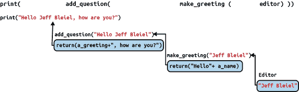

# 第八章：结构化和重构你的代码

在我们继续进行数据整理的分析和可视化工作之前，我们将简要“绕道”，讨论一些关于如何充分利用我们迄今为止所做的一切的策略。在过去的几章中，我们探讨了如何从各种数据格式和来源中访问和解析数据，如何从实际角度评估其质量，以及如何清理和增强数据以便进行最终的分析。在这个过程中，我们相对简单的程序已经发生了演变和变化，不可避免地变得更加复杂和深奥。我们的`for`循环现在有了一个或者（更多）嵌套的`if`语句，而其中一些现在嵌入了明显的“魔法”数字（比如我们在 示例 7-5 中的 `the_date.weekday() <= 4`）。这只是更功能化代码的代价吗？

请记住，注释我们的代码可以在很大程度上帮助我们保持脚本逻辑对潜在合作者和我们未来自己的可理解性。但事实证明，详细的文档（尽管我很喜欢）并不是提高 Python 代码清晰度的唯一方式。就像其他类型的书面文件一样，Python 支持一系列有用的机制来结构化和组织我们的代码。通过明智地利用这些机制，我们可以使将来更加简单地使用和重用我们的编程工作。

因此，在本章中，我们将讨论工具和概念，使我们能够以既可读又可重用的方式优化我们的代码。这个过程被称为*重构*，它展示了使用 Python 进行数据整理工作的又一种方式，即使我们在需要时可以依赖于*别人*的库所提供的功能，我们也可以*同时*创建新的编码“捷径”，这些捷径可以完全按照我们自己的偏好和需求定制。

# 重新审视自定义函数

当我们在第二章远古时期介绍 Python 基础知识时，我们碰到的一个概念是“定制”或*用户定义*函数。¹ 在 示例 2-7 中，我们看到了一个自定义函数如何用于封装当提供特定名称时打印问候语的简单任务——当然，我们可以创建简单或复杂得多的自定义函数。然而，在我们深入探讨编写自己的自定义函数的机制之前，让我们退后一步，思考哪些设计考量最有助于我们决定*何时*编写自定义函数可能最有帮助。当然，就像所有写作一样，没有多少硬性规则，但接下来的一些启发法则可以帮助您决定何时以及如何重构可能是值得的。

## 你会多次使用它吗？

像变量一样，识别出可以从中受益于重新打包成自定义函数的代码部分的一种方法是查找任何被多次执行的特定任务。从验证输入到格式化输出（比如我们在示例 7-7 中所做的），以及其中的一切内容，如果你当前的脚本包含大量繁琐的条件语句或重复的步骤，那就表明你可能需要考虑设计一些自定义函数。同时要记住，你考虑的重复并不一定需要存在于单个脚本中，重构仍然是值得的。如果你发现你经常在你写的脚本中频繁地执行某些特定任务（例如，测试给定日期是否为工作日，就像我们在示例 7-5 中所做的那样），你可以将自定义函数放入外部脚本，并在可能需要的任何地方引用它，就像我们在第 5 章中处理凭据文件时所做的那样。

## 它是不是又丑又令人困惑？

在进行工作的同时记录你的工作是对当前合作者和未来自己的一种礼物²。同时，彻底地注释你的代码——特别是如果你不仅包含*如何*而且*为什么*采取这种方法的解释，我仍然建议——最终可能会使代码变得有些难以管理。因此，创建真正易于理解的代码，实际上是在提供足够详细的同时也足够简洁，以便你的文档实际上被阅读到。

将相关的代码片段打包成自定义函数实际上是帮助你解决这个难题的关键方法：像变量一样，自定义函数可以（而且应该！）具有描述性的名称。仅仅通过*读取*函数名称，查看你的代码的人就会获得关于正在发生的事情的一些基本信息，而无需立即在其周围添加多行描述性评论。如果函数名称足够描述性，或者某个读者暂时不需要更多细节，他们可以直接继续进行。与此同时，如果他们需要，他们仍然可以找到你那些可爱的、描述性的函数文档——这些文档被整齐地放在程序的另一部分（或者完全是另一个文件）中。这意味着你的主脚本的*内联*注释可以保持相对简洁，而不会牺牲文档的完整性。

## 你只是真的**讨厌**默认功能吗？

好吧，也许这并不是编写自定义函数的*最佳*理由，但这是一个真实存在的理由。随着时间的推移，你可能会发现，在数据整理工作中，有一些你需要反复完成的任务，而现有的函数和库中总是有一些让你感到*困扰*的地方。也许是一个你觉得名称令人困惑的函数名，因此你*总是*不得不准确地记住它叫什么。或者可能是有一个你总是忘记添加的参数，这使得一切都变得更加困难（我在看你，`pd.read_csv()`，带上你的`dtype='string'`参数！）。如果你是独自工作或是在一个小团队中，编写帮助简化生活的自定义函数完全没问题，因为它们*确实*有用。你不需要一个宏伟的理由。如果它能让你的生活变得更轻松，那就去做吧！这就是作为程序员的力量。

当然，这也有一些限制。除非你想以更正式和深入的方式编写 Python 代码，否则你不能有效地做一些事情，比如定义一个与现有函数同名的新函数，或者让像`+`或`-`这样的运算符表现得有所不同。³ 但是，如果你只是希望一个经常使用的现有函数工作方式略有不同，那就去做吧——只要确保你充分记录你的版本！

# 理解作用域

现在我们已经讨论了一些可能会使用自定义函数重构代码的*理由*，是时候稍微讨论一下具体的实现方式了。当你开始编写自定义函数时，可能最重要的概念就是*作用域*。虽然我们以前没有用过这个术语，但*作用域*实际上是我们自从在“名字的背后”中声明第一个变量以来一直在使用的概念。在那个例子中，我们看到我们可以：

1.  创建并赋值给一个变量（`author = "Susan E. McGregor"`）。

1.  使用该变量后面引用其内容并将其值传递给一个函数（`print(author)`）。

同时，我们知道，如果我们创建了一个仅仅包含以下一行代码的程序：

```py
print(author)
```

我们会得到一个错误，因为在我们这个仅有一行的脚本的宇宙中，没有标记为`author`的内存盒。因此，Python 会向我们抛出一个错误，并拒绝继续执行。

当我们谈论编程中的*作用域*时，我们实际上是在讨论从特定代码片段的视角看当前“宇宙”的范围。每个脚本都有一个作用域，在计算机逐行读取每行代码时，从顶部到底部逐步演变，这就是导致例子 8-1 和 8-2 中脚本（非常预期的）行为的原因。

##### Example 8-1\. 在作用域中没有`author`变量

```py
# no variable called "author" exists in the same "universe"
# as this line of code; throw an error
print(author)
```

##### Example 8-2\. 在作用域中的`author`变量

```py
# create variable "author"
author = "Susan E. McGregor"

# variable "author" exists in the "universe" of this line of code; carry on!
print(author)
```

就像每当我们创建一个新变量时，计算机内存中都会创建一个新的“盒子”一样，每当我们定义一个新的自定义函数时，也会为其创建一个新的小宇宙或*作用域*。这意味着当我们使用自定义函数时，我们不仅在视觉上而且在逻辑上和功能上将我们的代码分隔开。这意味着我们可以像对待我们一直在本书中使用的内置 Python 方法和库函数那样对待我们*自己*的自定义函数：作为我们提供“配料”并返回某个值或新制作的 Python 对象的“食谱”。唯一的区别在于，使用自定义函数时，我们就是厨师！

为了在实践中理解这一切的含义，让我们重新访问示例 2-7 来自第二章，但稍作调整，如示例 8-3 所示。

##### 示例 8-3\. greet_me_revisited.py

```py
# create a function that prints out a greeting
# to any name passed to the function
def greet_me(a_name):
    print("Variable `a_name` in `greet_me`: "+a_name)
    print("Hello "+a_name)

# create a variable named `author`
author = "Susan E. McGregor"

# create another variable named `editor`
editor  = "Jeff Bleiel"

a_name = "Python"
print("Variable `a_name` in main script: "+a_name)

# use my custom function, `greet_me` to output "Hello" messages to each person
greet_me(author)
greet_me(editor)

print("Variable `a_name` in main script again: "+a_name)
```

这将产生以下输出：

```py
Variable `a_name` in main script: Python
Variable `a_name` in `greet_me`: Susan E. McGregor
Hello Susan E. McGregor
Variable `a_name` in `greet_me`: Jeff Bleiel
Hello Jeff Bleiel
Variable `a_name` in main script again: Python
```

因为任何自定义函数都会自动获得其自己的作用域，所以该函数只能“看到”显式传递给它的变量和值。反过来，在该函数内部的值和变量实际上是从主脚本中“隐藏”的。这一结果之一是，当我们编写自定义函数时，我们无需担心主脚本中已经使用了哪些变量名，反之亦然。因此，我们通常需要更少地定义唯一的变量名，这在我们开始编写更长和更复杂的脚本时非常有帮助。它*还*意味着一旦我们的自定义函数按预期工作，我们可以使用甚至修改其功能细节*而不*需要调整周围脚本中的变量和函数。

# 定义函数“配料”的参数

我们已经有了相当多的经验，提供给 Python 内置方法和函数（正式称为*参数*）或者我们迄今为止使用的许多库提供的“配料”。然而，当我们开始编写自定义函数时，我们需要更详细地探索定义这些函数将接受的*参数*的过程。⁴

首先要知道的是，与某些编程语言不同，Python 不需要（甚至实际上不允许）*坚持*函数的参数具有特定的数据类型。⁵ 如果有人想要将完全错误类型的数据传递给您的函数，他们完全可以这样做。因此，作为函数的作者，您需要决定是否以及如何确认（或*验证*）传递给您自定义函数的参数或“配料”的适当性。原则上，有三种方法可以处理这个问题：

+   检查已传递到函数中的所有参数的数据类型，如果发现不喜欢的内容，请向程序员提出投诉。

+   将您的代码包装在[Python 的 `try...except` 块](https://w3schools.com/python/python_try_except.asp)中，以便您可以捕获某些类型的错误而不会停止整个程序。您还可以使用这个来自定义向程序员传达发生了什么错误的消息。

+   不用担心它，让函数的用户（换句话说，程序员）通过使用默认的 Python 错误消息来解决任何问题。

尽管这看起来有点随意，但在这一点上，我的主要建议实际上是选择第三种选择：不要担心它。并非因为不会发生错误（它们会发生——如果需要恢复对它们的某些了解，可以重新访问“快进”），而是因为我们在这里的主要兴趣是处理数据，而不是编写企业级 Python。与我们在第四章中编写的脚本一样，我们希望在尝试通过程序处理的内容和依赖程序员（无论他们是谁）自行调查和处理之间取得平衡。由于我们编写的程序如果出错不会使网站崩溃或破坏数据的唯一副本，因此似乎不去预料和处理可能出现的每一个错误更为合理。当然，如果您清楚地记录了您的函数——这是我们将在“使用 pydoc 记录自定义脚本和函数的详细过程”中更详细地查看的过程，那么其他程序员在首次避免错误方面将拥有一切所需。

## 你的选择是什么？

即使我们不试图为数千人使用编写自定义函数，我们仍然可以使它们灵活且功能齐全。其中一个最简单的方法是编写我们的函数来解决问题的最常见版本，但允许像我们在*pandas*⁶和其他库中看到的那样的可选参数，这使它们在某种程度上可以适应。例如，我们可以修改我们的`greet_me()`函数，使其具有默认的问候语“Hello”，*同时*可以被程序员传入的可选值覆盖。这使我们能够编写可以在多种情境下有效使用的函数。例如，让我们看看在示例 8-4 中显示的`greet_me`的修改版本。

##### 示例 8-4\. greet_me_options.py

```py
# create a function that prints out a greeting to any name
def greet_me(a_name, greeting="Hello"):
    print(greeting+" "+a_name)

# create a variable named author
author = "Susan E. McGregor"

# create another variable named editor
editor  = "Jeff Bleiel"

# use `greet_me()` to output greeting messages to each person

# say "Hello" by default
greet_me(author)
# let the programmer specify "Hi" as the greeting
greet_me(editor, greeting="Hi")
```

如您所见，添加可选参数实际上就是在函数定义中指定默认值；如果程序员传递了不同的值，那么在调用函数时它将简单地覆盖该默认值。

## Getting Into Arguments?

在函数声明中提供默认值并不是向自定义函数添加可选参数的唯一方法。Python 还支持两种通用类型的可选参数，`*args` 和 `**kwargs`：

`*args`

`*args` 参数在想要将多个值列表传递到函数中并且给所有这些值分配名称和/或默认值会很麻烦时非常有用。作为 `*args` 传递的值被存储为列表，因此它们可以通过编写 `for...in` 循环逐个访问（例如 `for arg in args`）。

`**kwargs`

`**kwargs` 参数类似于 `*args`，不同之处在于它允许将任意数量的关键字参数传递给函数，而不为它们分配默认值，就像我们在 [示例 8-4](https://wiki.example.org/greet_me_options) 中为 `greeting` 所做的那样。通过这种方式传递的值可以通过 `kwargs.get()` 方法访问（例如 `my_var = kwargs.get("greeting")`）。

如果使用 `*args` 和 `**kwargs` 看起来像是在编写自定义函数时保持选项开放的一种便利方式，我要告诉你的是，最好始终编写解决你*实际问题*的自定义函数（和脚本！），而不是你*认为*可能在未来某处出现的问题。虽然极限灵活性的概念一开始可能看起来很吸引人，但通常会导致花费大量时间*思考*“某天”的问题，而不是*实际*解决我们面前的问题。谁有时间去做那些呢？我们有数据要处理！

# 返回值

到目前为止，我们对 `greet_me()` 函数的变化目标相当有限；我们实际上只是用它们来打印（稍微）定制的消息到控制台。相比之下，我们从外部库中使用的函数非常强大；它们可以将一个简单的 *.csv* 文件转换为 *pandas* DataFrame，或者将一个整个 *.xls* 文件转换为详细列表和属性的集合，几乎可以捕捉到这种多层文件类型的每个方面。尽管这种级别的 Python 编程超出了本书的范围，但我们仍然可以创建干净、超级有用的自定义函数，利用*返回值*的威力。

如果参数/参数是我们函数“食谱”中的“成分”，那么*返回值*就是最终的菜肴——被我们程序的其余部分消耗的输出。实际上，返回值只是数据片段；它们可以是*字面值*（如字符串“Hello”），或者它们可以是任何数据类型的变量。它们之所以有用，是因为它们让我们可以将函数需要的任何东西交给它，并获取我们需要的东西，而不必担心（至少从主程序的视角或*作用域*来看）如何制造这个比喻的香肠。如果我们重新构造 [示例 8-3](https://wiki.example.org/greet_me_revisited) 中基本的 `greet_me()` 函数以使用返回值，它可能看起来像 [示例 8-5](https://wiki.example.org/make_greeting)。

##### 示例 8-5\. make_greeting.py

```py
# create a function that **returns** a greeting to any name passed in
def make_greeting(a_name):
    return("Hello "+a_name)

# create a variable named author
author = "Susan E. McGregor"

# create another variable named editor
editor  = "Jeff Bleiel"

# use my custom function, `greet_me()` to build and store
# the "Hello" messages to each person
author_greeting = make_greeting(author)
editor_greeting = make_greeting(editor)

# now `print()` the greetings built and returned by each function call
print(author_greeting)
print(editor_greeting)
```

起初，你可能会想，“这有什么帮助？” 虽然我们的主程序实际上*变得更长*了，但它也可以说变得更加灵活和易于理解。 因为我的`make_greeting()`函数*返回*问候语（而不是直接打印它），我可以对其做更多事情。 当然，我可以像我们在示例 8-5 中所做的那样直接打印它，但我现在也可以将其返回值存储在变量中，并稍后做其他事情。 例如，我可以添加以下行：

```py
print(editor_greeting+", how are you?")
```

虽然这条新消息看起来可能不那么令人兴奋，但它允许我将*一些*工作分隔到函数中（在本例中，向任何姓名添加“你好”），同时*也*为输出提供了更多灵活性（例如，向其中一个添加更多文本而不是另一个）。

# 攀登“堆栈”

当然，为了存储一个简单的问候语而创建一个全新的变量似乎比它值得的麻烦多了。 实际上，没有规定我们必须在将函数的输出存储在变量中之前将其传递给另一个函数——我们实际上可以“嵌套”我们的函数调用，以便第一个函数的*输出*直接成为下一个函数的*输入*。 这是一种策略，我们以前实际上已经使用过，通常是在操作字符串并将其传递给`print()`函数时，就像我们在示例 7-8 中将`strip()`函数调用添加到我们的*.csv*构建过程中所做的那样。 但是，我们可以对*任何*一组函数执行此操作，假设第一个函数返回下一个函数需要的内容。 要了解实际操作的工作原理，请查看示例 8-5 的重写，显示在示例 8-6 中，我添加了一个新函数来向问候消息附加“，你好吗？”文本。

##### 示例 8-6\. make_greeting_no_vars.py

```py
# function that returns a greeting to any name passed in
def make_greeting(a_name):
    return("Hello "+a_name)

# function that adds a question to any greeting
def add_question(a_greeting):
    return(a_greeting+", how are you?")

# create a variable named author
author = "Susan E. McGregor"

# create another variable named editor
editor  = "Jeff Bleiel"

# print the greeting message
print(make_greeting(author))

# pass the greeting message to the question function and print the result!
print(add_question(make_greeting(editor)))
```

尽管代码语句`print(make_greeting(author))`仍然相当容易解释，但使用`print(add_question(make_greeting(editor)))`时情况开始变得更加复杂，希望这有助于说明函数调用嵌套的实用性是有限的。 函数调用嵌套越多，阅读代码就越困难，即使“操作顺序”逻辑保持不变：始终首先执行“最内层”函数，并且其返回值“上升”以成为下一个函数的输入。 *那*个返回值然后上升到下一个函数，依此类推。 在传统编程术语中，这被称为*函数堆栈*，其中最内层函数是堆栈的“底部”，最外层函数是“顶部”。⁷ 示例 8-6 的最后一行的函数堆栈示意图如图 8-1 所示。

尽管这种函数调用嵌套是[整个编程哲学](https://en.wikipedia.org/wiki/Functional_programming)的核心，但出于可读性考虑，在大多数情况下最好谨慎使用。



###### 图 8-1\. 一个嵌套的函数调用堆栈

# 为了乐趣和利润进行重构

现在，我们已经探讨了一些重构我们代码的关键原则和机制，让我们看看如何利用它来提高之前章节中一些脚本的清晰度。当我们浏览以下示例时，请记住，关于什么时候以及如何重构（就像*任何*编辑过程一样）部分取决于个人偏好和风格。因此，在每个示例下面，我将描述我的选择背后的推理；当您开发*自己*的重构实践时，您可能会发现这些是有用的模型。

## 用于识别工作日的函数

在示例 7-5 中，我们创建了一个小脚本，旨在读取我们的[Citi Bike 骑行数据](https://s3.amazonaws.com/tripdata/index.html)，并输出一个仅包含工作日骑行的新文件。虽然在那个示例中我们所使用的方法本质上没有什么问题，但出于几个原因，我认为它是重构的一个好候选项。

首先，现有脚本依赖于一些笨拙且不太描述性的函数调用。第一个调用是将可用日期字符串转换为 Python 可以有意义地评估的实际`datetime`格式所必需的：

```py
the_date = datetime.strptime(a_row['starttime'], '%Y-%m-%d %H:%M:%S.%f')

```

类似地，尽管内置的`weekday()`方法相对直观（尽管它可能更好地命名为`dayofweek()`），我们必须将其与“魔术数字”`4`进行比较，以确定`the_date`实际上是一个工作日：

```py
if the_date.weekday() <= 4:
```

总体而言，我认为如果去除这些相对隐晦的格式和比较，代码的这些部分会更易读。

其次，检查特定的类似日期的字符串是否是周一至周五的工作日似乎是在数据整理工作中可能会频繁遇到的问题。如果我将这个任务封装到一个自定义函数中，我可以在其他脚本中轻松重复使用它。

查看我是如何重构示例 7-5 脚本的，可以参考示例 8-7。

##### Example 8-7\. weekday_rides_refactored.py

```py
# objective: filter all September, 2020 Citi Bike rides, and output a new
#             file containing only weekday rides

# program outline:
# 1\. read in the data file: 202009-citibike-tripdata.csv
# 2\. create a new output file, and write the header row to it.
# 3\. for each row in the file, make a date from the `starttime`:
#       a. if it's a weekday, write the row to our output file
# 4\. close the output file

# import the "csv" library
import csv

# import the "datetime" library
from datetime import datetime

def main(): 
    # open our data file in "read" mode
    source_file = open("202009-citibike-tripdata.csv","r")

    # open our output file in "write" mode
    output_file = open("202009-citibike-weekday-tripdata.csv","w")

    # pass our source_file to the DictReader "recipe"
    # and store the result in a variable called `citibike_reader`
    citibike_reader = csv.DictReader(source_file)

    # create a corresponding DictWriter; specify its fieldnames should
    # be drawn from `citibike_reader`
    output_writer = csv.DictWriter(output_file,
                                   fieldnames=citibike_reader.fieldnames)

    # actually write the header row to the output file
    output_writer.writeheader()

    # loop through our `citibike_reader` rows
    for a_row in citibike_reader:

        # if the current 'starttime' value is a weekday
        if is_weekday(a_row['starttime']): 
            # write that row of data to our output file
            output_writer.writerow(a_row)

    # close the output file
    output_file.close()

def is_weekday(date_string, date_format='%Y-%m-%d %H:%M:%S.%f'): 

    # convert the value in the 'date_string' to datetime format
    the_date = datetime.strptime(date_string, date_format)

    # if `the_date` is a weekday (i.e., its integer value is 0-5)
    if the_date.weekday() <= 4:
        return(True)
    else:
        return(False)

if __name__ == "__main__": 
    main()
```


将我们的顶级脚本包装成名为`main()`的函数是 Python 的一种约定，也具有重要的功能目的。因为计算机按顺序从上到下读取 Python 代码，如果我们*不*将此代码包装在函数中，那么当计算机在达到`if is_weekday(a_row['starttime'])`时还没有到达`is_weekday()`的定义时，会抛出错误。


我们可以使用`is_weekday()`函数来处理将我们的日期字符串转换为“真实”日期及其工作日值的微妙细节。这个描述性函数名以高层次传达了正在发生的事情，而不强迫读者深入研究具体细节。


计算机仍然像往常一样从顶部到底部阅读，但是当它首先遇到`main()`和`is_weekday()`函数定义时，我们不要求它执行任何操作，直到脚本的最底部。

正如您所看到的，尽管示例 8-7 中的大部分代码（甚至许多注释）与示例 7-5 中的代码相同，但它们已经以一种使程序的`main()`部分更加简洁和可读的方式重新组织了。当然，如果程序员*想*知道如何识别工作日的细节，那么`is_weekday()`函数定义中的具体内容就在那里。但是，如果他们只是简单地阅读脚本的主要部分，并且非常容易确认它正在按照概述所述的方式执行。

## 元数据无需混乱

在示例 7-7 中，我们构建了一个单一脚本，基于示例 4-6 和 7-6 中的代码，它有效地解释了 Microsoft Excel 日期，并将我们的源数据文件分割成元数据文本文件和结构化的*.csv*文件。虽然生成的脚本完成了所有我们需要的工作，但其代码变得臃肿且难以阅读，充斥着难以理解的条件语句和晦涩的日期格式化函数调用。

在这里，我们可以通过处理不同类型的行内容（分别为*.csv*或*.txt*文件）的格式化来稍作整理。这需要在我们脚本的逻辑上进行一定的重新排列（和澄清）。这也展示了在将所有必要信息*传递给*我们自定义函数时可能会遇到的一些挑战。在示例 8-8 中概述的方法展示了我目前首选的处理这些问题的方式。

##### 示例 8-8\. xls_meta_and_date_parsing_refactored.py

```py
# converting data in an .xls file with Python to csv + metadata file, with
# functional date values using the "xrld" library.
# first, pip install the xlrd library:
# https://pypi.org/project/xlrd/2.0.1/

# then, import the `xlrd` library
import xlrd

# import the csv library
import csv

# needed to test if a given value is *some* type of number
from numbers import Number

# for parsing/formatting our newly interpreted Excel dates
from datetime import datetime

def main():

    # use `open_workbook()` to load our data in the `source_workbook` variable
    source_workbook = xlrd.open_workbook("fredgraph.xls")

    global the_datemode 

    the_datemode = source_workbook.datemode 

    # open and name a simple metadata text file
    source_workbook_metadata = open("fredgraph_metadata.txt","w")

    # an `.xls` workbook can have multiple sheets
    for sheet_name in source_workbook.sheet_names():

        # create a variable that points to the current worksheet
        current_sheet = source_workbook.sheet_by_name(sheet_name)

        # create "xls_"+sheet_name+".csv" as current sheet's output file
        output_file = open("xls_"+sheet_name+"_dates.csv","w")

        # use the `writer()` recipe to write `.csv`-formatted rows
        output_writer = csv.writer(output_file)

        # Boolean variable to detect if we've hit our table-type data yet
        is_table_data = False

        # now, we need to loop through every row in our sheet
        for row_num, row in enumerate(current_sheet.get_rows()):

            # pulling out the value in the first column of the current row
            first_entry = current_sheet.row_values(row_num)[0]

            # if we've hit the header row of our data table
            if first_entry == 'observation_date':

                # it's time to switch our "flag" value to "True"
                is_table_data = True

            # if `is_table_data` is True
            if is_table_data:

                # pass the requisite data to out `create_table_row()` function
                new_row = create_table_row(current_sheet, row_num) 

                # write this new row to the data output file
                output_writer.writerow(new_row)

            # otherwise, this row must be metadata
            else:

                # pass the requisite data to our `create_meta_text()` function
                metadata_line = create_meta_text(current_sheet, row_num)

                # write this new row to the metadata output file
                source_workbook_metadata.write(metadata_line)

        # just for good measure, let's close our output files
        output_file.close()
        source_workbook_metadata.close()

def create_table_row(the_sheet, the_row_num):

    # extract the table-type data values into separate variables
    the_date_num = the_sheet.row_values(the_row_num)[0]
    U6_value = the_sheet.row_values(the_row_num)[1]

    # create a new row object with each of the values
    new_row = [the_date_num, U6_value]

    # if the `the_date_num` is a number, then the current row is *not*
    # the header row. We need to transform the date.
    if isinstance(the_date_num, Number):

        # use the xlrd library's `xldate_as_datetime()` to generate
        # a Python datetime object
        the_date_num = xlrd.xldate.xldate_as_datetime(the_date_num, the_datemode)

        # create a new list containing `the_date_num` (formatted to MM/DD/YYYY
        # using the `strftime()` recipe) and the value in the second column
        new_row = [the_date_num.strftime('%m/%d/%Y'),U6_value]

    # return the fully formatted row
    return(new_row)

def create_meta_text(the_sheet, the_row_num):

    meta_line = ""

    # since we'd like our metadata file to be nicely formatted, we
    # need to loop through the individual cells of each metadata row
    for item in the_sheet.row(the_row_num):

            # write the value of the cell, followed by a tab character
            meta_line = meta_line + item.value + '\t'

    # at the end of each line of metadata, add a newline
    meta_line = meta_line+'\n'

    # return the fully formatted line
    return(meta_line)

if __name__ == "__main__":
    main()
```


尽管应该节制使用，但在这里创建一个称为`the_datemode`的*全局*变量意味着它的值可以被*任何*函数访问（这里的`global`指的是它的作用域）。请注意，在 Python 中，全局变量不能在声明它们的同一行中赋值，这就是为什么这在两个单独的代码语句中完成的原因。


例如，如果我们*没有*创建一个全局变量来作为日期模式，那么我们将不得不将其作为另一个参数传递给`create_table_row()`，这在某种程度上感觉有些不协调。

如果您将 示例 8-8 与 示例 8-7 进行比较，您会发现它们有几个关键特征是相同的：脚本中的所有内容都已被划分为函数，并且常规的 `main()` 函数调用受到 `if __name__ == "__main__":` 条件保护。这个示例还与 示例 7-7 几乎完美重叠：包含的内容都是一样的，虽然它已被重新排列为三个函数而不是单一的线性脚本，但大部分代码几乎完全相同。

我想在这里要说明的一部分是，重构您的代码并不一定是一项巨大的工程，但其结果是无价的。作为一个程序，示例 8-8 的结构现在基本上是全部逻辑而没有具体细节——烦琐的细节由我们的新函数处理。如果我突然需要从 FRED 数据库下载并解析新的数据系列，我会很自信地将其扔给这个脚本看看会发生什么，因为如果有问题，*我知道该去哪里修复它们*。而不是不得不深入整个程序，可能出现新数据源的任何格式问题几乎肯定是由 `create_table_row()` 或 `create_meta_text()` 中的代码导致的——即使出现问题，也只会出现在其中之一。这意味着为了使此脚本适应新的（类似的）数据源，我可能只需要查看（也许）十几行代码。这肯定比浏览接近 100 行要好得多！

换句话说，虽然重构数据处理脚本通常不意味着*编写*更多的代码，但当您希望以后使用、重复使用或调整它时，这确实可以节省*阅读*的时间——这也是 Python 帮助您扩展数据处理工作的另一种方式。

鉴于所有不使用全局变量的理由，为什么我最终决定在这里使用一个？首先，`source_workbook.datemode` 只有*一个*可能的值，因为每个 Excel 电子表格只有一个 `datemode` 属性。因此，即使一个特定的工作簿包含了 20 个不同的工作表，每个工作表包含 100 列数据，所有这些工作表的 `datemode` 值仍然只有一个、单一、不变的值。因此，在概念上，`datemode` 的值实际上是“全局”的；我们用来存储此值的变量也应该如此。并且由于 `datemode` 的值不会在脚本内部更新，因此从中检索到意外值的风险较小。

然而，与所有写作一样，这些选择部分取决于品味——即使我们自己的品味随时间也可能改变。起初，我喜欢创建一个函数来“构建”每个表数据行和另一个函数来“构建”每行元数据文本的对称性，但是打破这种对称性并完全避免使用全局 `datemode` 变量，如 Example 8-9 中所示，也有其可取之处。

##### Example 8-9\. xls_meta_and_date_parsing_refactored_again.py

```py
# converting data in an .xls file with Python to csv + metadata file, with
# functional date values using the "xrld" library.
# first, pip install the xlrd library:
# https://pypi.org/project/xlrd/2.0.1/

# then, import the `xlrd` library
import xlrd

# import the csv library
import csv

# needed to test if a given value is *some* type of number
from numbers import Number

# for parsing/formatting our newly interpreted Excel dates
from datetime import datetime

def main():

    # use `open_workbook()` to load our data in the `source_workbook` variable
    source_workbook = xlrd.open_workbook("fredgraph.xls")

    # open and name a simple metadata text file
    source_workbook_metadata = open("fredgraph_metadata.txt","w")

    # an `.xls` workbook can have multiple sheets
    for sheet_name in source_workbook.sheet_names():

        # create a variable that points to the current worksheet
        current_sheet = source_workbook.sheet_by_name(sheet_name)

        # create "xls_"+sheet_name+".csv" as the current sheet's output file
        output_file = open("xls_"+sheet_name+"_dates.csv","w")

        # use the `writer()` recipe to write `.csv`-formatted rows
        output_writer = csv.writer(output_file)

        # Boolean variable to detect if we've hit our table-type data yet
        is_table_data = False

        # now, we need to loop through every row in our sheet
        for row_num, row in enumerate(current_sheet.get_rows()):

            # pulling out the value in the first column of the current row
            first_entry = current_sheet.row_values(row_num)[0]

            # if we've hit the header row of our data table
            if first_entry == 'observation_date':

                # it's time to switch our "flag" value to "True"
                is_table_data = True

            # if `is_table_data` is True
            if is_table_data:

                # extract the table-type data values into separate variables
                the_date_num = current_sheet.row_values(row_num)[0]
                U6_value = current_sheet.row_values(row_num)[1]

                # if the value is a number, then the current row is *not*
                # the header row, so transform the date
                if isinstance(the_date_num, Number): 
                    the_date_num = format_excel_date(the_date_num,
                                                     source_workbook.datemode)

                # write this new row to the data output file
                output_writer.writerow([the_date_num, U6_value])

            # otherwise, this row must be metadata
            else:

                # pass the requisite data to our `create_meta_text()` function
                metadata_line = create_meta_text(current_sheet, row_num)

                # write this new row to the metadata output file
                source_workbook_metadata.write(metadata_line)

        # just for good measure, let's close our output files
        output_file.close()
        source_workbook_metadata.close()

def format_excel_date(a_date_num, the_datemode):

    # use the xlrd library's `xldate_as_datetime()` to generate
    # a Python datetime object
    a_date_num = xlrd.xldate.xldate_as_datetime(a_date_num, the_datemode)

    # create a new list containing the_date_num (formatted to MM/DD/YYYY
    # using the `strftime()` recipe) and the value in the second column
    formatted_date = a_date_num.strftime('%m/%d/%Y')

    return(formatted_date)

def create_meta_text(the_sheet, the_row_num):

    meta_line = ""

    # since we'd like our metadata file to be nicely formatted, we
    # need to loop through the individual cells of each metadata row
    for item in the_sheet.row(the_row_num):

            # write the value of the cell, followed by a tab character
            meta_line = meta_line + item.value + '\t'

    # at the end of each line of metadata, add a newline
    meta_line = meta_line+'\n'

    return(meta_line)

if __name__ == "__main__":
    main()
```


尽管我不再将并行信息传递给自定义函数以生成表格类型和元数据输出文件，但放弃对称性可以避免我创建全局变量的需求。

这些哪一个是更好的解决方案呢？与所有写作一样，这取决于您的偏好、使用案例和*受众*。有些团体或机构会对选择使用或避免全局变量持有“见解”，有些会认为更短的解决方案更可取，而另一些则会重视结构对称性或可重用性。虽然 Example 8-9 牺牲了一些结构对称性，但它*生成*的函数可能更广泛地可重用。哪一个更重要的选择，如常，由您自己来确定。

# 使用 `pydoc` 记录自定义脚本和函数

到目前为止，我们一直在对我们的代码采取彻底但自由的文档方法。从原则上讲，这种方法没有任何问题，特别是如果它确实帮助确保您首先*进行*文档编制。然而，随着您的 Python 脚本清单（及其潜在的受众）的扩展，有能力查看您的个人自定义函数集合而无需逐个打开和阅读每个 Python 文件是非常有用的。即使没有其他影响，打开大量文件会增加误操作引入错误到您依赖的其他许多脚本中的函数的风险，这是毁掉您一天的一种非常快速的方法。

幸运的是，通过稍微格式化，我们可以调整现有的程序描述和注释，使其适用于称为 `pydoc` 的命令行函数。这将使我们能够仅通过提供相关文件名就可以在命令行打印出我们的脚本和函数描述。

要看到实际效果，让我们从重构另一个脚本开始。在这种情况下，我们将修改 Example 7-8 以使其更加简洁。在此过程中，我还将更新脚本顶部的注释（并向我们的新函数添加一些注释），使它们与 `pydoc` 命令兼容。您可以在 Example 8-10 中看到这个效果。

##### Example 8-10\. fixed_width_strip_parsing_refactored.py

```py
""" NOAA data formatter  Reads data from an NOAA fixed-width data file with Python and outputs
a well-formatted CSV file.

The source file for this example comes from the NOAA and can be accessed here:
https://www1.ncdc.noaa.gov/pub/data/ghcn/daily/ghcnd-stations.txt

The metadata for the file can be found here:
https://www1.ncdc.noaa.gov/pub/data/ghcn/daily/readme.txt

Available functions
-------------------
* convert_to_columns: Converts a line of text to a list

Requirements
------------
* csv module

"""
# we'll start by importing the "csv" library
import csv

def main():
    # variable to match our output filename to the input filename
    filename = "ghcnd-stations"

    # we'll just open the file in read format ("r") as usual
    source_file = open(filename+".txt", "r")

    # the "readlines()" method converts a text file to a list of lines
    stations_list = source_file.readlines()

    # as usual, we'll create an output file to write to
    output_file = open(filename+".csv","w")

    # and we'll use the `csv` library to create a "writer" that gives us handy
    # "recipe" functions for creating our new file in csv format
    output_writer = csv.writer(output_file)

    # we have to "hard code" these headers using the contents of `readme.txt`
    headers = ["ID","LATITUDE","LONGITUDE","ELEVATION","STATE","NAME",
               "GSN_FLAG","HCNCRN_FLAG","WMO_ID"]

    # create a list of `tuple`s with each column's start and end index
    column_ranges = [(1,11),(13,20),(22,30),(32,37),(39,40),(42,71),(73,75),
                     (77,79),(81,85)] 

    # write our headers to the output file
    output_writer.writerow(headers)

    # loop through each line of our file
    for line in stations_list:

        # send our data to be formatted
        new_row = convert_to_columns(line, column_ranges)

        # use the `writerow` function to write new_row to our output file
        output_writer.writerow(new_row)

    # for good measure, close our output file
    output_file.close()

def convert_to_columns(data_line, column_info, zero_index=False): 
    """Converts a line of text to a list based on the index pairs provided

    Parameters
    ----------
    data_line : str
        The line of text to be parsed
    column_info : list of tuples
        Each tuple provides the start and end index of a data column
    zero_index: boolean, optional
        If False (default), reduces starting index position by one

    Returns
    -------
    list
        a list of data values, stripped of surrounding whitespace
    """

    new_row = []

    # function assumes that provided indices are *NOT* zero-indexed,
    # so reduce starting index values by 1
    index_offset = 1

    # if column_info IS zero-indexed, don't offset starting index values
    if zero_index:
        index_offset = 0

    # go through list of column indices
    for index_pair in column_info:

        # pull start value, modifying by `index_offset`
        start_index = index_pair[0]-index_offset

        # pull end value
        end_index = index_pair[1]

        # strip whitespace from around the data
        new_row.append((data_line[start_index:end_index]).strip())

    # return stripped data
    return new_row

if __name__ == "__main__":
    main()
```


通过在文件和`convert_to_columns()`函数描述的开头和结尾使用一对三个双引号(`"""`)，它们在文件中可视化显示，与文件中其他注释区分开，并且现在可以通过在终端中运行以下命令来访问`pydoc`：⁹

```py
pydoc fixed_width_strip_parsing_refactored
```

这将在命令行界面中显示所有文件和函数描述（使用箭头键上下滚动，或者使用空格键一次向下移动整个“页面”）。要退出文档并返回命令行，只需按下 q 键。


而不是编写用于从给定文本行中提取每列数据的独特代码行，我将所有列的起始/结束值放入了一个[Python `tuple`](http://docs.python.org/3.3/library/stdtypes.html?highlight=tuple#tuples)列表中，这些值基本上是不可改变的列表。


将每行数据与列的起始/结束信息一起传递给`convert_to_columns()`函数，我们可以使用`for...in`循环将文本转换为列。这不仅使我们的主脚本更易读，*而且*使得这个函数可重复使用，适用于我们需要拆分成列的*任何*文本行，只要我们按正确格式传入起始/结束索引对。我甚至添加了一个名为`zero_index`的标志值，允许我们使用这个函数处理考虑零为第一位置的起始/结束对（默认值假定—如此数据集—第一位置是“1”）。

请注意，除了查看整个文件的文档之外，还可以使用`pydoc`通过运行以下命令查看单个函数（例如`convert_to_columns()`函数）的文档：

```py
pydoc fixed_width_strip_parsing_refactored.convert_to_columns
```

并且像您为整个文件所做的那样浏览/退出其文档。

# 命令行参数的案例

将一个长脚本重构为一系列函数并不是使我们的数据整理代码更可重用的唯一方法。对于多步骤的数据整理过程（例如涉及下载数据的，如示例 5-8，或者转换 PDF 图像为文本的，如示例 4-16），将我们的*代码*分解成多个脚本是节省时间和精力的另一种方式。首先，这种方法使我们最大限度地减少了执行下载数据或实际转换 PDF 页到图像等资源密集型任务的频率。更重要的是，这些任务往往相当机械化—我们下载的数据或我们转换的 PDF 是什么并不重要；我们的脚本几乎总是在做同样的事情。因此，我们只需要一些额外的技巧，就可以将我们当前定制的数据整理脚本转换为可以一次又一次重复使用的独立代码。

例如，让我们回顾一下示例 5-8。在这个脚本中，我们主要是下载网页内容；只是在这种情况下，我们已经“硬编码”了特定的[target file](http://web.mta.info/developers/turnstile.html)。同样，下载 XML 和 JSON 文件的代码在示例 5-1 中几乎相同——唯一的区别是源 URL 和本地副本的文件名。如果有一种方法可以重构这些脚本，使得*整个过程*更像一个函数，那么从长远来看，这可能会为我们节省大量的时间和精力。

幸运的是，这对于独立的 Python 文件来说非常容易实现，多亏了内置的*argparse* Python 库，它允许我们编写脚本来需要并且使用从命令行传入的参数。得益于*argparse*，我们无需为每个想要下载的单个网页编写新脚本，因为它允许我们直接从命令行指定目标 URL*和*输出文件的名称，如示例 8-11 所示。

##### 示例 8-11\. webpage_saver.py

```py
""" Web page Saver!

Downloads the contents of a web page and saves it locally

Usage
-----
python webpage_saver.py target_url filename

Parameters
----------
target_url : str
    The full URL of the web page to be downloaded
filename : str
    The desired filename of the local copy

Requirements
------------
* argparse module
* requests module

"""
# include the requests library in order to get data from the web
import requests

# include argparse library to pull arguments from the command line
import argparse

# create a new `ArgumentParser()`
parser = argparse.ArgumentParser()

# arguments will be assigned based on the order in which they were provided
parser.add_argument("target_url", help="Full URL of web page to be downloaded") 
parser.add_argument("filename", help="The desired filename of the local copy")
args = parser.parse_args()

# pull the url of the web page we're downloading from the provided arguments
target_url = args.target_url

# pull the intended output filename from the provided arguments
output_filename = args.filename

# create appropriate header information for our web page request
headers = {
    'User-Agent': 'Mozilla/5.0 (X11; CrOS x86_64 13597.66.0) ' + \
                  'AppleWebKit/537.36 (KHTML, like Gecko) ' + \
                  'Chrome/88.0.4324.109 Safari/537.36',
    'From': 'YOUR NAME HERE - youremailaddress@emailprovider.som'
}

# because we're just loading a regular web page, we send a `get` request to the
# URL, along with our informational headers
webpage = requests.get(target_url, headers=headers)

# opening up a local file to save the contents of the web page to
output_file = open(output_filename,"w")

# the web page's code is in the `text` property of the website's response
# so write that to our file
output_file.write(webpage.text)

# close our output file!
output_file.close()
```


在这里，我们正在分配参数名称，我们可以用它来从我们的脚本内部访问通过命令行传递的值。帮助文本很重要！要描述清楚但简洁。

现在我们*应该*有一个简单的方法来下载任何网页到我们的设备，而无需为每个独特的 URL 编写脚本。例如，如果我们运行：

```py
python webpage_saver.py "http://web.mta.info/developers/turnstile.html" \
"MTA_turnstiles_index.html"
```

我们将得到与示例 5-8 完全相同的结果，但我们也可以*同时*运行：

```py
python webpage_saver.py \
"https://www.citibikenyc.com/system-data/operating-reports" \
"citibike_operating_reports.html"
```

无需*打开*，更不用说修改我们的脚本，就可以获取 Citi Bike 的运营报告。方便，不是吗？

###### 提示

使用特定于任务的脚本和命令行参数可以节省时间，但如果最终将复杂的 URL 逐字符复制到命令行界面，则不能。为了简化事情，这里有一个快速概述如何根据您的操作系统复制/粘贴到命令行：

Linux（包括 Chromebook）

高亮显示您要复制的 URL/文本，然后上下文右键单击并选择复制。在您的命令行窗口中，只需单击即可自动粘贴。

Windows/Macintosh

高亮显示您要复制的 URL/文本，然后上下文右键单击并选择复制。在您的命令行窗口中，再次上下文右键单击并选择粘贴。

# 脚本和笔记本之间的区别

到现在为止，你可能已经注意到，在前面的章节中，我*没有*描述一种将命令行参数传递到 Jupyter 笔记本中的方法，也没有多谈论如何为 Jupyter 笔记本生成和交互式地使用脚本和函数文档。这并不是因为这些事情是不可能的，而是因为 Jupyter 笔记本的设计是为了让你与 Python 交互的方式与独立脚本不同，而且这些概念对它们的适用性较少。作为一个在 Jupyter（原名 IPython）笔记本出现之前就开始使用 Python 的人，我的偏好仍然倾向于独立的脚本来处理大多数的 Python 数据整理任务。虽然笔记本（通常）非常适合于测试和调整代码片段，但一旦我确定了适合特定数据整理任务的方法，我几乎总是会回到独立的脚本上来。这主要是因为在项目进展更深时，我常常会对打开和修改脚本的过程感到不耐烦，更不用说启动一个 Web 服务器或等待网页加载（我甚至可能没有互联网连接！）。这些都是我更喜欢使用命令行参数和独立脚本来处理常见而直接的任务的原因之一。

正如我们很快将看到的那样，Jupyter 笔记本的交互性使它们在实验和尤其是分享数据分析和可视化部分时，比独立的 Python 脚本稍显优越。因此，在我们转向第 9 和 10 章节的这些主题时，你会发现更多关于 Jupyter 笔记本的引用。

# 结论

在这一章中，我们暂时离开了数据整理的实质性工作，重新审视了一些之前因代码难以掌控而变得杂乱的工作。通过重构的过程，我们探讨了如何将*能用*的代码重组成*用得好*的代码，因为这样的代码更易读且可重用。随着我们的数据整理项目的发展，这将帮助我们建立并利用我们自己的一套自定义函数集，以满足我们特定的数据整理需求。同样地，通过为我们的文档应用更多结构，我们使其能够从命令行直接访问并且变得有用，这样我们可以在不打开一个单独的脚本的情况下找到我们需要的脚本或函数。而且，我们也将重构的逻辑应用到了我们的脚本中，这样我们就能够定制它们的功能而无需打开*它们*！

在接下来的章节中，我们将回到数据分析的焦点，并概述一些基本的数据分析技术。之后，在第十章中，我们将（简要地）介绍一些核心的可视化方法，这将帮助你更好地理解和展示你的数据，从而更好地与世界分享你的数据整理见解！

¹ 在这种情况下，程序员实际上被认为是“用户”。

² 实际上，良好的文档有时会挽救你的生活。

³ 虽然做这些事情确实可能，但远远超出了大多数数据整理活动的范围，因此也超出了本书的范围。

⁴ 在技术上，*参数*描述的是在函数定义中分配的变量名称，而*参数*则是在调用函数时传递的实际值。尽管在实践中，这些术语经常互换使用。

⁵ 所谓的“静态类型”编程语言实际上会在你的代码运行之前就抱怨你向函数或方法传递了错误的数据类型。

⁶ 又来了，`dtype='string'`！

⁷ 这个术语也是为什么论坛被称为*Stack* Exchange 的原因。

⁸ 你可以在[*https://freecodecamp.org/news/if-name-main-python-example*](https://freecodecamp.org/news/if-name-main-python-example)找到有关此约定背后推理的有用描述/演示。

⁹ 我在这里使用的实际结构/格式是从[*https://realpython.com/documenting-python-code/#documenting-your-python-code-base-using-docstrings*](https://realpython.com/documenting-python-code/#documenting-your-python-code-base-using-docstrings)的指南中衍生出的不同风格的混合。虽然在与大团队合作时使用标准方法可能很重要，但如果你是单独工作或在小团队中工作，那就找到适合你的风格吧！
