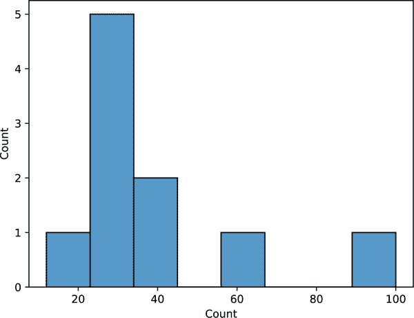
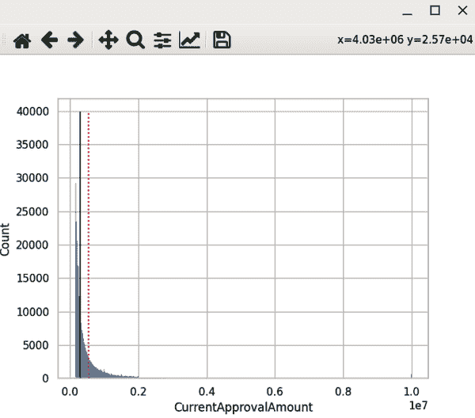
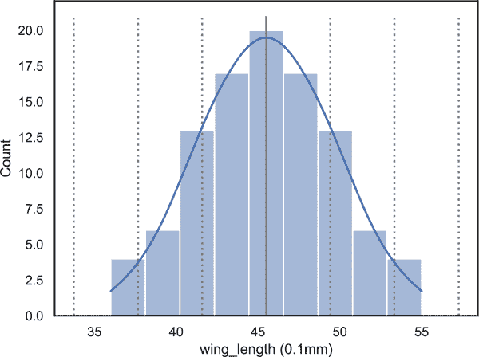
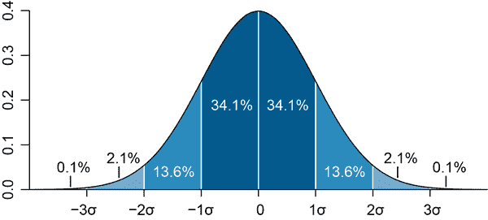
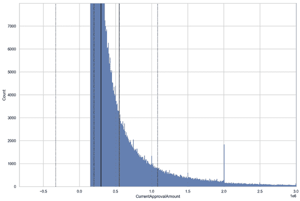
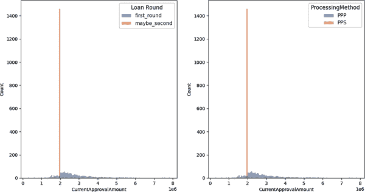
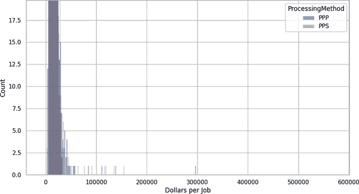

# 第九章 数据分析简介

到目前为止，本书主要关注获取、评估、转换和增强数据的各种细节。我们探讨了如何编写代码来从互联网获取数据，从不友好的格式中提取数据，评估其完整性，并解决不一致性问题。我们甚至花了一些时间考虑如何确保我们用来做所有这些事情的工具——我们的 Python 脚本——能够优化以满足我们当前和未来的需求。

此时，我们需要重新审视这一切工作的*目的*。在“数据整理是什么？”一文中，我描述了数据整理的目的是将“原始”数据转化为可以生成洞察和意义的东西。但是，除非我们进行至少*一定程度*的分析，否则我们无法知道我们的整理工作是否足够，或者它们可能产生什么样的洞察。从这个意义上说，停留在增强/转换阶段的数据整理工作就像是摆放好你的厨房材料然后离开厨房一样。你不会花几个小时仔细准备蔬菜和测量配料，除非你打算*烹饪*。而数据分析就是这样：将所有精心清理和准备好的数据转化为新的洞察和知识。

如果你担心我们再次陷入抽象，不用担心——数据分析的基础知识足够简单和具体。就像我们的数据质量评估一样，它们是技术努力的一部分，加上四分之三的判断力。是的，数据分析的基础包括令人放心的、2 + 2 = 4 风格的数学，但洞察力依赖于*解释*这些非常简单公式的输出。这就是你需要逻辑和研究的地方——以及人类的判断和专业知识——来弥合这一差距。

在本章的过程中，我们将探讨数据分析的基础知识——特别是关于*中心趋势*和*分布*的简单度量，这些帮助我们为数据赋予有意义的背景。我们还将介绍根据这些度量进行适当推断的经验法则，以及数值和*视觉*分析在帮助我们理解数据集内趋势和异常中的作用。在章节的末尾，我们将讨论数据分析的局限性，以及为什么从“什么”到*为什么*总是需要比传统的“数据”更多。当然，在此过程中，我们还将看到 Python 如何帮助我们完成所有这些任务，以及为什么它是从快速计算到必要可视化的正确工具。

# 背景是关键

如果我现在以$0.50 的价格向你出售一个苹果，你会买吗？为了这个例子，假设你喜欢苹果，而且你正想吃点零食。此外，这是一个漂亮的苹果：光滑、芬芳，并且手感沉重。还假设你确信我并没有企图用这个苹果伤害你。它只是一个漂亮、新鲜的苹果，售价为$0.50。你会买吗？

对大多数人来说，答案是：*这取决于情况*。取决于什么呢？很多事情。无论你有多么相信我（以及我那几乎完美得过分的苹果），如果站在我旁边的人也在卖每个$0.25 的好看苹果，你可能会买他的。为什么呢？显而易见，它们更便宜，即使我的*非常*棒的苹果可能也不会比旁边的那个好*两倍*。同时，如果你的表兄站在我另一边，卖每个$0.60 的美味苹果，你可能会支持他的新苹果销售初创企业，而选择买他的。

这可能看起来是一个非常复杂的果选购决策过程，但实际上我们经常做出这种选择，并且结果有时令人意外。像[丹·阿里尔](https://danariely.com/all-about-dan)和[蒂姆·哈福德](https://timharford.com/articles/undercovereconomist)这样的经济学家已经进行了研究，说明了“免费”礼物的影响有多大，即使它会带来额外的成本，或者我们在了解周围人的收入后，我们对自己的工资满意度会降低。[¹] 大多数的优先事项和决策都依赖于价值判断，为了有效地做出这些判断，我们需要了解我们的选择有哪些。如果我可以以$0.50 买到童话般完美的苹果，我会买吗？也许吧。但如果我能在下一个拐角找到一个价格几乎相同的，那可能就不会了。但如果我赶时间，否则还得走一英里才能买到，我可能会选择买。尽管我们都明白“这取决于情况”的意思，更精确地说“这取决于*背景*”。

背景的重要性在于，孤立的数据点毫无意义；即使它事实上“正确”，单个数据点也无法帮助我们做出决策。一般来说，产生和获取新知识是将新信息与我们已知的信息联系起来的过程。换句话说，知识不在于数据本身，而在于它与其他事物的*关系*。因为我们无法详尽地探索每个决策所需的背景（包括你对表兄新苹果初创企业的关切以及支持家庭努力的重要性），我们通常不得不限制自己，仅仅审视那些我们可以（或选择）持续测量和量化的背景部分。换句话说，我们求助于数据。

我们如何从数据中得出背景？我们进行诸如调查其来源的活动，询问谁收集了数据，何时收集的，以及为什么收集的—这些答案有助于阐明数据包含了什么以及可能缺失了什么。我们还寻找方法系统地比较每个数据点与其余部分，以帮助理解它如何符合—或打破—整个数据集可能存在的任何模式。当然，这些活动不太可能给我们提供确定的“答案”，但它们会为我们提供见解和思路，我们可以与他人分享并用来激发我们对周围世界正在发生的事情的*下一个*问题。

# 同样但不同

在生成数据洞察力时，建立背景至关重要，但我们如何知道哪些背景*至关重要*呢？考虑到我们可以识别的无限关系*类型*，即使在一个相当小的数据集中，我们如何决定要关注哪些呢？例如，在示例 2-9 中的数据，它只是一个简单（虚构的）页面计数列表：

```py
page_counts = [28, 32, 44, 23, 56, 32, 12, 34, 30]
```

即使只有这么几个数字，我们可以想象到很多种“背景”类型：例如，我们可以按照奇偶值描述它们，或者可以被 8 整除的值。问题是，这些关系大多数并不那么有趣。我们怎么知道哪些关系才是有趣的呢？

结果表明，人类大脑对两种特定的关系特别敏感和关注：相同和不同。几乎任何类型的刺激中的趋势和异常—从[在云朵或彩票结果中看到模式](https://archive.is/20130121151738/http://dbskeptic.com/2007/11/04/apophenia-definition-and-analysis)到[快速识别类似对象之间方向的差异](https://csc2.ncsu.edu/faculty/healey/PP)—都会引起我们的注意。这意味着*趋势*和*异常*本质上是有趣的。因此，当我们想要为我们的数据建立有意义的背景时，一个非常好的起点就是研究给定数据集中的个体记录在相互之间的相似性或差异性方面。

# 典型是什么？评估中心倾向

某物“平均”是什么意思？在我们日常生活中使用这个术语时，它通常是“平凡”，“预期”或“典型”的代名词。鉴于其特别*不*引人注目的联想，因此在许多情况下，“平均”也可以是“无聊”的同义词。

然而，当涉及到分析数据时，事实证明“平均”值实际上是我们感兴趣的，因为它是比较的基础—而比较是人类非常关心的一件事。还记得有关工资的研究吗？作为人类，我们想知道影响我们的事物与其他人的“典型”相比如何。因此，即使我们永远不希望*成为*“平均”，总体而言，我们仍然想知道它是什么，以及我们自己的经验与之相比如何。

## 那意味着什么？

您可能已经熟悉计算一组数字“平均值”的过程：将它们全部加起来，然后除以数量。这种特定的*集中趋势*度量更准确地称为*算术平均值*，它的计算方式就是您记得的那样。因此，对于我们的`page_counts`变量，数学计算如下：

```py
mean_pgs = (28+32+44+23+56+32+12+34+30)/9
```

这将给我们（大致）一个平均值：

```py
32.333333333333336
```

作为“典型”章节长度的代表，这看起来相当合理：我们的许多章节的页数非常接近 30，甚至有两个章节的页数*恰好*是 32 页。因此，每章平均页数略高于 32 看起来是合理的。

虽然在这种情况下平均值可能已经为我们服务得很好，但有许多情况下，将其作为“典型性”的度量可能会极大地误导我们。例如，让我们再想象添加了一个*非常*长的章节（比如 100 页）到我们的书中。我们计算平均值的方法是一样的：

```py
mean_pgs = (28+32+44+23+56+32+12+34+30+100)/10
```

但现在均值将会是：

```py
39.1
```

突然间，我们的“平均”章节长度增加了近 6 页，尽管我们只添加了一个新章节，而我们一半的章节都是 28-34 页长。在这种情况下，大约 39 页的章节真的算是“典型”的吗？实际上并不是。

即使在这个小例子中，我们看到虽然在*一些*情况下算术平均值是一个合理的“典型性”度量，但它也受极端值的影响很大——而其中之一就足以使其作为数据集“典型性”的简写变得毫无用处。但我们还有什么其他选择呢？

## 拥抱中位数

在数据集中考虑“典型”值的另一种方法是弄清楚字面上的“中间”值。在数据分析中，记录系列的“中间”值被称为*中位数*，我们可以用比计算平均值时更少的数学操作找到它：只需排序和计数即可。例如，在我们的原始章节长度集合中，首先要将值从低到高排序:^(2)

```py
page_counts = [28, 32, 44, 23, 56, 32, 12, 34, 30]
page_counts.sort()
print(page_counts)
```

这给了我们

```py
[12, 23, 28, 30, 32, 32, 34, 44, 56]
```

现在，我们所要做的就是选择“中间”值——即位于列表开始和结束之间的值。由于这是一个九项列表，中间值将是第五个位置的值（左右各四项）。因此，我们的`page_count`数据集的*中位数*值是 32。

现在，让我们看看当我们添加那个额外长的章节时中位数会发生什么变化。我们排序后的数据看起来像这样：

```py
[12, 23, 28, 30, 32, 32, 34, 44, 56, 100]
```

那么中位数呢？由于列表现在有一个*偶数*项，我们可以取*两个*“中间”值，将它们加在一起，然后除以二。在这种情况下，这将是位置 5 和位置 6 的值，它们都是 32。因此我们的中位数值是 (32 + 32) / 2 = 32。即使在我们添加了额外长的章节后，中位数值仍然相同！

起初你可能会想：“等等，这感觉不对。增加了一个全新的章节——一个真的*很长*的章节，但中位数值竟然*一点都没有*变化。它不应该至少有些变动吗？”

平均数和中位数之间的真正区别在于，平均数受数据集中具体*数值*的影响非常大——比如它们的高低——而中位数主要受到特定数值出现的*频率*的影响。在某种意义上，中位数更接近于“一值一票”的方法，而平均数则让最极端的数值“说得最响亮”。由于我们当前的目标是理解数据集中的“典型”数值，中位数通常会是最具代表性的选择。

# 不同的思考方式：识别异常值

在“同中有异”中，我注意到人类总体上对“相同”和“不同”的兴趣。在研究我们两种可能的中心趋势测量方法时，我们探讨了数据集中数值相似的方式。但是数值在哪些方面不同呢？如果我们再次查看我们原始的`page_count`列表，我们可能会相信，32 页的章节相对“典型”，甚至 30 页、28 页或 34 页的章节也是如此。但是 12 页的章节呢？或者 56 页的章节呢？它们显然不太典型，但我们怎么知道哪些数值足够*不同*，以至于真正“异常”呢？

这是我们必须开始将数学与人类判断结合起来的地方。中心趋势的度量可以被相当明确地计算出来，但确定数据集中哪些值真正异常——即哪些是*异常值*或*离群值*——不能仅凭算术来确定。然而，随着数据集变得越来越大和复杂，人类有效地将其解释为数据点集合变得更加困难。^(4) 那么我们如何可能对大型数据集应用人类判断？我们需要利用我们最大和最全面的数据处理资源：人类视觉系统。^(5)

# 数据分析的可视化

数据工作中可视化的角色是双重的。一方面，可视化可以用来帮助我们*分析*和理解数据；另一方面，它可以用来*传达*我们从分析中获得的见解。利用数据进行后一目的——作为一种交流工具，与更广泛的观众分享有关数据的见解——是我们将在第十章深入探讨的内容。在这里，我们将集中讨论可视化如何为我们提供对所拥有数据的洞察。

为了理解可视化如何帮助我们识别数据中的极值，我们首先需要直接看数据本身。在这种情况下，我并不是指我们会打开 CSV 文件并开始逐条阅读数据记录。相反，我们将创建一种特殊类型的条形图，称为*直方图*，其中每个条形表示数据集中某个特定值出现的次数。例如，我们可以看到我们（扩展后的）`page_count` 数据的一个非常简单的直方图，如 图 9-1 所示。



###### 图 9-1\. 一个基本的直方图

对于像我们的 `page_counts` 示例这样的小数据集，直方图不能告诉我们太多；实际上，仅有 10 个值的数据集可能对于*中心趋势*（如*均值*和*中位数*）或*离群值*的概念来说数据点太少了。即便如此，在 图 9-1 中，你可以看到一个看起来像模式的*初步*形态：长度相等的两章形成了一个双高峰，而其余大多数章节的唯一页数则形成了紧密聚集的单高度条形。而在右端的*远处*，是我们的 100 页章节，附近没有其他值。虽然根据数学，我们可能已经倾向于认为 100 页的章节是异常值或*离群值*，但这个直方图肯定加强了这种解释。

当然，为了真正体会可视化在数据分析中的力量，我们需要查看一个数据集，其中的值我们根本无法像我们对待页数统计列表那样“用眼睛”观察。幸运的是，我们在第六章中处理的支付保护计划（PPP）数据在这方面绝对不缺乏，因为它包含数十万条贷款记录。为了了解通过 PPP 批准的贷款金额中什么是“典型”的和什么不是，“我们将编写一个快速脚本来生成当前批准的贷款金额的直方图。然后，我们将在直方图上标注均值和中位数，以便看看每种测量中心趋势的潜力。之后，我们将回到通过可视化数据和一些数学来识别可能的离群值的问题。

为使其工作，我们将再次利用一些强大的 Python 库——具体来说是 *matplotlib* 和 *seaborn*——它们都具有用于计算和可视化数据的功能。虽然 *matplotlib* 仍然是在 Python 中创建图表和图形的基础库，但我们还使用 *seaborn* 来支持更高级的计算和格式。由于这两者高度兼容（*seaborn* 实际上是构建在 *matplotlib* 之上的），这种组合将为我们提供所需的灵活性，既可以快速创建这里需要的基本可视化，又可以定制它们以有效呈现数据在第十章中的内容。

现在，让我们专注于我们的可视化过程的分析尺度。我们将从使用 `CurrentApprovalAmount` 值创建 PPP 贷款数据的基本直方图开始。我们还将添加均值和中位数线以提供更多背景信息，如示例 9-1 所示。

##### 示例 9-1\. ppp_loan_central_measures.py

```py
# `pandas` for reading and assessing our data
import pandas as pd

# `seaborn` for its built-in themes and chart types
import seaborn as sns

# `matplotlib` for customizing visual details
import matplotlib.pyplot as plt

# read in our data
ppp_data = pd.read_csv('public_150k_plus_221.csv')

# set a basic color theme for our visualization
sns.set_theme(style="whitegrid")

# use the built-in `mean()` and `median()` methods in `pandas
mean = ppp_data['CurrentApprovalAmount'].mean() 
median = ppp_data['CurrentApprovalAmount'].median()

# create a histogram of the values in the `CurrentApprovalAmount` column
approved_loan_plot = sns.histplot(data=ppp_data, x="CurrentApprovalAmount")

# get the min and max y-values on our histogram
y_axis_range = approved_loan_plot.get_ylim() 

# add the vertical lines at the correct locations
approved_loan_plot.vlines(mean, 0, y_axis_range[1], color='crimson', ls=':') 
approved_loan_plot.vlines(median, 0, y_axis_range[1], color='green', ls='-')

# the matplotlib `show()` method actually renders the visualization
plt.show() 
```


在我们的 PPP 数据中，`CurrentApprovalAmount` 列告诉我们每笔贷款当前批准的金额（无论是否已发放）。


`get_ylim()` 方法以列表形式返回 y 轴的最低和最高值。我们主要将使用它来设置均值和中位数线的可读长度。


我们可以通过指定“x”位置、“y”起点、“y”终点、颜色和线型，在直方图（或其他可视化图表）上添加垂直线。请注意，“x”和“y”值的单位是相对于数据集的，*而不是*图表的视觉大小。


在 Jupyter 笔记本中，并非必须显式调用 *matplotlib* 的 `show()` 方法，就像 `print()` 语句一样，我更倾向于包含它们以确保清晰和一致性。默认情况下，图表将以“交互”模式呈现（在 Jupyter 中，您需要包含 `%matplotlib notebook` “魔术”命令，正如我在提供的文件中所做的那样），这使我们能够放大、平移和详细探索直方图，而无需编写更多代码。

大多数情况下，您正在查看由运行此脚本生成的图表（希望看起来像图 9-2 那样），并在想：“现在怎么办？”诚然，这种初始可视化看起来有些乏味，甚至有点令人困惑。不过不用担心！如果有什么的话，这可以作为你首次学习分析可视化与沟通可视化*不同*之处的案例研究。例如像这样的分析性可视化，需要更多的阅读、理解和改进工作，而不像我们希望用于一般沟通的*任何*可视化那样。然而，对于生成关于我们数据洞察的见解，这实际上是一个很好的起点。

不过，在我们继续进行数据分析之前，让我们花点时间来欣赏 Python 为这张图表提供的非常老派但无比有用的界面。与其说仅仅是一个静态图像，我们的 Python 脚本还*同时*提供了一个完整的工具栏（显示在图 9-2 中），我们可以用来与之交互：缩放、平移、修改甚至保存输出。当然，我们可以（并且最终会）使用代码自定义这张图表的内容和美观性，但事实上，我们可以有效地探索我们的数据，而无需不断修改和重新运行我们的代码，这大大节省了时间。为了了解可能的操作，请花几分钟自己玩弄控件。当您准备好继续进行数据分析时，只需点击“主页”图标将图表恢复到初始视图，并在接下来的章节中跟随进行。



###### 图 9-2\. PPP 贷款直方图

## 我们的数据的形状是什么？理解直方图

当我们在表格类型的数据中工作时，我们倾向于从行数和列数的角度考虑其“形状”（这实际上正是 DataFrame 的`pandas.shape`属性返回的内容）。在这种情况下，我们感兴趣的“形状”是直方图的实际形状，它将帮助我们识别可能有趣或重要的模式或异常。在这些情况下，我们首先要查找的一些内容包括：

对称性

我们的数据在垂直方向上对称吗？也就是说，我们能否在可视化数据的某个地方画一条垂直线，使得一侧的柱形图看起来（大致上）像另一侧的镜像？

密度

我们的数据值大多集中在哪里（如果有的话）？是否有多个集群还是只有一个？

毫不奇怪，这些问题不仅仅涉及美学。数据集直方图的形状反映了通常所描述的*分布*。由于某些分布具有特定的属性，我们可以利用数据的*分布*帮助我们识别典型、不寻常以及值得进一步审查的内容。

## 对称性的意义

在自然界中，对称是常见的现象。植物和动物在许多方面都倾向于对称；例如，狗的脸和橡树叶都展示了所谓的*对称性*——我们可以描述为一侧是另一侧的“镜像”。然而，在生物群体中，某些物理特征的分布也经常表现出对称性，例如身高或翅膀长度。我们的直方图让我们可以直观地观察这种对称性，通过展示在人口中特定身高或翅膀长度的*频率*。一个经典的例子显示在图 9-3，显示了 20 世纪中叶由一组生物学家测量的家蝇翅膀长度。^(6)

对称的钟形曲线，如图 9-3，有时被描述为“正常”，“标准”或“高斯”分布。如果你曾经遇到过学术成绩“曲线调整”，那么你的同学们的成绩就是按照这种分布调整的：即在顶部或底部几乎没有分数，大部分集中在中间。

然而，高斯分布的力量不仅在于其漂亮的形状；更在于这种形状意味着我们可以*做*什么。展示高斯分布的数据集可以用一种非对称分布无法做到的方式进行描述和比较，因为我们可以有意义地计算两个特定的测量值：*标准偏差*，它量化数据值的数值范围，其中大多数值可以找到；以及每个值的*z-分数*，它描述了其在标准偏差方面与均值的距离。由于高斯分布的基本对称性，即使使用不同的比例尺度，我们也可以使用*标准偏差*和*z-分数*来比较两组功能上相似的数据。例如，如果学生成绩呈现高斯分布，我们可以计算和比较各个学生的 z-分数（即他们相对于他们同学的表现）。这样，即使一个教师的学生成绩平均分在 90 分以上，另一个教师的在 70 分左右，如果两组学生的成绩都真正服从高斯分布，我们仍然可以确定哪些学生在各个同学群体中表现最好或最需要帮助——这是“名义”成绩（例如 74 或 92）永远无法告诉我们的事情。



###### 图 9-3\. 家蝇翅膀长度

这些特征还告诉我们如何考虑测量集中趋势和异常值。例如，在“完美”的高斯分布中，均值和中位数将具有相同的值。此外，值的 z 分数为我们提供了一个快速的方式来识别特定值是典型还是不寻常，因为我们预期具有给定 z 分数的数据值的百分比是明确定义的。混乱了吗？别担心。就像任何其他复杂的数据关系一样，如果我们将其可视化，这一切都会更加清晰。



###### 图 9-4\. 显示正态分布，展示了在均值附近 1、2 和 3 个标准差（σ）内的值的百分比

正如您在图 9-4 中所看到的那样，^(7)，如果我们数据的分布是高斯的，超过数据值的三分之二（34.1% + 34.1% = 68.2%）可以在均值的一个标准差（通常如此命名，以希腊字母 σ 表示）内找到。另外 27.2%可以在均值的一个到两个标准差之间找到，最后的 4.2%可以在均值的两到三个标准差之间找到。这意味着对于高斯分布，*99.7%的所有值都可以在均值的 3 个标准差内找到*。

那么，有什么影响呢？嗯，要记住，在数据分析中，我们的一个基本目标是理解数据集的典型值和真正极端的值。虽然均值和中位数为数据集的“典型”值提供了一个快速的简写，但是像标准差以及我们可以从中计算的 z 分数帮助我们系统地评估哪些值可能是真正不寻常的。

不出所料，使用 Python 计算这些值非常简单。使用*pandas*或*statistics*库，我们可以快速找到数据集（σ）的标准差的值，然后使用它在我们的直方图上放置线条，显示出相关的 z 分数值。例如，我们将继续使用用于生成图 9-3 的数据的例子，如示例 9-2 所示。

##### 示例 9-2\. wing_length_with_sd.py

```py
# `pandas` to read in our data
import pandas as pd

# `seaborn` for built-in themes and chart types
import seaborn as sns

# `matplotlib` for customizing visual details
import matplotlib.pyplot as plt

# `statistics` easily calculating statistical measures
import statistics

# read in our data
wing_data = pd.read_csv('wing_length - s057.csv')

# set a basic color theme for our visualization
sns.set_theme(style="white")

# create the histogram, allowing `seaborn` to choose default "bin" values
wing_plot = sns.histplot(data=wing_data, x="wing_length (0.1mm)", kde="True") 

# calculate the standard deviation via the `statistics` `stdev()` method
sd = statistics.stdev(wing_data['wing_length (0.1mm)']) 

# get the min and max y-values on our histogram
y_axis_range = wing_plot.get_ylim()

# plot the mean as a solid line
mean = wing_data['wing_length (0.1mm)'].mean()
wing_plot.vlines(mean, 0, y_axis_range[1], color='gray', ls='-')

# plot the three standard deviation boundary lines on either side of the mean
for i in range(-3,4): 

    # find the current boundary value
    z_value = mean + (i*sd)

    # don't draw a second line over the mean line
    if z_value != mean:

        # plot a dotted gray line at each boundary value
        wing_plot.vlines(z_value, 0, y_axis_range[1], color='gray', ls=':')

# show the plot!
plt.show()
```


每个“bin”是一系列*实际*数据值，这些值将被合并到单个直方图条中；`kde`参数是为我们的可视化添加平滑线的。该线条近似于我们期望的模式，如果我们的数据集有无限数据点的话。


我们也可以使用*pandas*的`std()`方法：`wing_data['wing_length (0.1mm)'].std()`。


请记住，我们的循环将在`range()`提供的第二个值*之前*停止，因此要获取三行正数，我们将第二个值设为`4`。通过从一个负数开始，我们实际上*从*平均值开始减去——这是我们想要的，因为我们希望捕获高于*和*低于平均值的值。

当您审查[示例 9-2](https://example.org/wing_length_with_sd)的输出时，您可能会想到：“太好了，我们在关于虫子的数据上画了一些线。这将如何帮助我解释*真实*数据？”毕竟，这些家蝇翅长数据的原型高斯分布看起来与我们绘制 PPP 贷款数据时得到的输出不太相似，后者明显是*不*对称的，而您的大多数数据可能也是如此。

那么，当我们的数据分布缺乏对称性时该怎么办呢？我们已经知道如何找到不对称分布的“中间值”，就像在[示例 9-1](https://example.org/ppp_loan_central_measures)中那样：通过计算中位数，而不是平均数。但是如何识别极端值呢？由于不对称或*偏斜*的分布不是对称的，因此不存在单一的“标准”偏差，我们也不能用它来计算 z 分数。然而，我们仍然可以有用地将不对称的数据集分成一种方式，这样可以让我们洞察可能异常或极端值。

像寻找中位数一样，这种分割过程其实非常简单。首先，我们找到已排序数据集的中间值——也就是中位数。现在，我们将每一半数据记录视为一个独立的数据集，并找到*它们*的中位数值。传统上，下半部分的中位数被标记为 Q1，而上半部分的中位数被标记为 Q3。此时，我们已将数据集分成了四部分，或*四分位数*，每部分包含相同数量的数据值。

这对我们有什么帮助？嗯，记住 z 分数告诉我们的一大部分是*具有相似值的数据点的百分比*。例如，查看[图 9-4](https://example.org/gaussian_distro)，我们可以看到 z 分数为 0.75 的数据点（正如我们预期的那样）距离均值少于一个标准偏差——我们知道整体数据集中大约 68.2%的所有数据值都会如此。通过将数据分成四分位数，我们已经开始了类似的路径。例如，在我们的数据集中，任何数值*数值上*小于 Q1 的值，根据定义，小于我们拥有的所有数据值的至少 75%。

不过，我们*真正*寻找的是识别潜在异常值的方法。比起所有数据值的 75%来说，更小或更大都算数，但这还远远不是*极端*的。仅仅识别我们的四分位数边界还不够。

幸运的是，我们可以使用我们的 Q1 和 Q3 值来计算数据集的*下限*和*上限*。如果我们的数据分布实际上是正态的，这些边界将几乎完美地与均值加三个标准差以下和以上的值对齐。当然，我们使用它们正是因为我们的数据*不是*正态分布，我做这个比较是为了说明我们可以用它们来帮助识别非对称分布数据集中的极端值。

就像找到中位数一样，计算上限和下限实际上是非常简单的。我们首先找到一个称为*四分位数间距*（IQR）的值——这是 Q3 和 Q1 值之间的数值差异的花哨名称。然后我们将该值乘以 1.5，并从 Q1 中减去它以获得下限，将其加到 Q3 以获得上限。就是这样！

IQR（四分位数间距）= Q3 – Q1

下限 = Q1 – （1.5 × IQR）

上限 = Q3 + （1.5 × IQR）

在正态分布中，我们的上限和下限值大约是平均值的三倍标准差之上或之下，但这是否意味着超出我们上限和下限的每个值都自动成为*异常值*？不是。但是找到这些边界确实帮助我们缩小可能需要*寻找*异常值的范围。同样重要的是，这些测量帮助我们了解哪些值*不是*异常值，即使它们在数值上看起来与中位数或平均数提供的“典型”或“预期”值有很大差异。

举个例子，让我们回到 PPP 贷款数据。100 万美元的贷款似乎很多，即使——像我们现在这样——你只看的是起始额超过 15 万美元的贷款。但是 100 万美元的贷款真的*不寻常*吗？这就是我们的中心趋势和离散度测量（在这种情况下是中位数、四分位数以及下限和上限值）真正能帮助我们的地方。让我们看看我们添加了这些值后直方图的样子，如示例 9-3 所示，然后看看我们的想法。

##### 示例 9-3\. ppp_loan_central_and_dist.py

```py
# `pandas` for reading and assessing our data
import pandas as pd

# `seaborn` for its built-in themes and chart types
import seaborn as sns

# `matplotlib` for customizing visual details
import matplotlib.pyplot as plt

# read in our data
ppp_data = pd.read_csv('public_150k_plus_221.csv')

# set a basic color theme for our visualization
sns.set_theme(style="whitegrid")

# use the built-in `mean()` and `median()` methods in `pandas
mean = ppp_data['CurrentApprovalAmount'].mean()
median = ppp_data['CurrentApprovalAmount'].median()

# Q1 is the value at the position in our dataset
# that has 25% of data readings to its left
Q1 = ppp_data['CurrentApprovalAmount'].quantile(0.25)

# Q3 is the value at the position in our dataset
# that has 75% of data readings to its left
Q3 = ppp_data['CurrentApprovalAmount'].quantile(0.75)

# IQR is the difference between the Q3 and Q1 values
IQR = Q3-Q1

# and now we calculate our lower and upper bounds
lower_bound = Q1 - (1.5*IQR)
upper_bound = Q3 + (1.5*IQR)

# use `seaborn` to plot the histogram
approved_loan_plot = sns.histplot(data=ppp_data, x="CurrentApprovalAmount")

# get the min and max y-values on our histogram
y_axis_range = approved_loan_plot.get_ylim()

# add mean line in gray
approved_loan_plot.vlines(mean, 0, y_axis_range[1], color='gray', ls='-')

# other lines in black (median solid, others dotted)
approved_loan_plot.vlines(median, 0, y_axis_range[1], color='black', ls='-')
approved_loan_plot.vlines(lower_bound, 0, y_axis_range[1], color='black', ls=':')
approved_loan_plot.vlines(Q1, 0, y_axis_range[1], color='black', ls=':')
approved_loan_plot.vlines(Q3, 0, y_axis_range[1], color='black', ls=':')
approved_loan_plot.vlines(upper_bound, 0, y_axis_range[1], color='black', ls=':')

# show the plot!
plt.show()
```

如您从所得图表的放大视图中可以看出（见图 9-5），实际上并没有支持声称 100 万美元贷款是不寻常的证据；这笔金额远低于我们为该数据集计算的上界。因此，即使这笔金额超过了迄今批准的所有贷款的四分之三（因为当前标记为图表 x 轴上的 1.0 1e6 的 100 万美元标记位于我们的 Q3 线右侧），但这仍然不足以使任何 100 万美元的贷款很可能值得进一步调查。至少，这可能不是我们想要开始的地方。



###### 图 9-5. PPP 当前贷款金额直方图的详细信息，中位数、四分位数和边界以黑色标出，平均值以灰色标出

那么我们应该在数据中的哪里寻找可能有趣的模式呢？*就在我们面前*，在我们已经有的图表上。因为虽然我们*可以*开始寻找更复杂的统计指标来计算和评估，但即使这基本的可视化也显示出数据中一些引人注目的模式。首先值得注意的是——即使只是为了让我们对我们选择的统计指标感到放心——这个数据集的平均值几乎与我们的第三四分位数处于相同的分布位置。如果我们对在这个数据集中选择中位数而不是平均值作为中心倾向度量有任何疑虑，这个事实应该让我们放心。我们还可以看到的另一件事情——在图 9-5 中展示的数据视图中，如果我们向右滚动更远，我们会看到数据中有些奇怪的小尖峰，表明某个特定的贷款金额被相对频繁地批准了。鉴于它们在周围数据模式中的显著突出，我们可能接下来应该看一看这些数值。

## 计算“集群”

想象一下，你正在走在拥挤的街道上，你注意到对面角落聚集了一群人。你会怎么做？在一个大多数行人只关心从一个地方到另一个地方的繁忙大街上，即使有一两个人在同一时间停在同一个地方，也足以表明*有事情发生*。无论“事情”最终是否是一个弹奏音乐的艺人，一个销售特别受欢迎小吃的摊贩，还是一个盒子里装满小猫咪的盒子，我们的视觉系统都被异常所吸引，这正是因为偏离趋势表明至少有些不寻常的事情正在发生。

这也是为什么数据可视化是分析数据的如此有价值的工具——我们的眼睛和大脑都被设计成能够快速感知模式，并能迅速注意到与这些模式的偏离。有时候模式形成的原因很容易猜到，有时候则不那么简单。但在任何可预测的模式中——无论是街上人群的流动，钟形的数据分布，还是平滑倾斜的曲线——任何打破这种模式的现象都值得调查。

在图 9-5 的情况下，我们可以看到一系列这种模式违背的范围。首先是图表左侧的清晰线条，这是一个很好的提醒，即我们的数据集仅包含批准的高于$150,000 的贷款金额，而不是所有已批准的贷款。如果我们忽视了这一点，数据在左侧边缘的明显和硬性截止是一个很好的提醒。

但也存在另一组模式违规：在我们的柱状图周围出现小尖峰，位于 x 轴上特定点附近，如$2 百万的数据值。这些是从哪里来的呢？虽然我们不能确定，但扫描我们的柱状图显示，类似的尖峰出现在大约$500,000 的间隔处，特别是当贷款金额增加时。在某种程度上，这些可能是“圆”数字的结果：如果您要求$1,978,562.34，为什么不将其“四舍五入”为$2 百万呢？当然，这仍然比您可能需要的多$21,437.66——对大多数人来说这是*很多*钱。鉴于 PPP 贷款旨在支持特定成本，确实有点奇怪，*那么多*贷款——根据我们的图表，近 2000 笔——竟然恰好达到了$2 百万。

那么到底发生了什么呢？这就是我们需要进行一些额外研究以有效解释我们在数据中看到的内容的地方。根据我的经验，我的第一步将是查阅 PPP 贷款的规则，看看我是否能弄清楚为什么$2 百万可能是如此受欢迎的请求金额。例如，$2 百万是基于业务的特定属性或所请求支持的最低还是最高允许金额吗？

经过一点搜索，小企业管理局（SBA）的[网站](https://sba.gov/funding-programs/loans/covid-19-relief-options/paycheck-protection-program/second-draw-ppp-loan)似乎提供了部分答案：

> 对于大多数借款人，第二次提款 PPP 贷款的最高贷款金额是 2019 年或 2020 年平均月工资成本的 2.5 倍，最高为$2 百万。对于住宿和餐饮服务部门的借款人（使用 NAICS 72 确认），第二次提款 PPP 贷款的最高贷款金额为 2019 年或 2020 年平均月工资成本的 3.5 倍，最高为$2 百万。

由于$2 百万是几乎所有申请所谓的第二次提款（或第二轮）PPP 贷款的各种类型企业的上限，包括那些最初可能有资格获得更多资金的企业，因此有道理，获批的$2 百万贷款的集群如此之大。

当然，这个“答案”只会带来更多问题。 根据文件，第二轮 PPP 贷款的上限为 2 百万美元； 第一轮贷款最多可以达到 1,000 万美元。 如果有这么多企业请求第二轮贷款的上限，这表明许多企业 1）已经获得了第一轮贷款，并且 2）他们的第一轮贷款可能甚至比 2 百万美元更大，因为如果他们在第一轮中符合更高的贷款金额，那么他们必须将其调整到 2 百万美元以下。 换句话说，我们可能期望那些在第二轮贷款中请求*精确* 2 百万美元的企业是那些获得最大 PPP 贷款救济总额批准的企业之一。 当然，如果他们确实获得了一些最大的资金池，我们（可能还有许多其他人！）肯定想知道这件事。

# **2 百万美元问题**

为了了解那些请求第二轮 PPP 贷款 2 百万美元的公司之间可能存在的共同特征，我们首先需要有效地在我们的数据集中隔离它们的记录。 我们该如何做呢？ 嗯，我们知道我们对获得多笔贷款的公司感兴趣，这意味着他们的 `BorrowerName` *应该* 在我们的数据中出现多次。 我们还知道在 2021 年 1 月 13 日之前没有发放第二轮贷款。 通过结合这两个观点，我们可能可以利用我们的数据整理技能来比较好地识别请求第二轮贷款 2 百万美元的公司。

为了实现这一点，我们将对我们的数据集进行一些关键的转换：

1.  我们将为每笔贷款创建一个新列，包含 `first_round` 或 `maybe_second` 标签，具体取决于它是否在 2021 年 1 月 13 日之前发放。 虽然我们不能确定所有在那之后发放的贷款都是“第二轮”，但我们*可以*确定在那之前发放的所有贷款都是“第一轮”。

1.  在我们的数据集中查找重复条目。 每笔批准的贷款都会创建一个单独的记录，因此如果同一家企业获得了两笔贷款的批准，那么其信息在记录中将出现两次。

这里的逻辑是，如果我们在我们的数据中找到了给定的企业名称两次，*并且*这些记录具有不同的“轮次”标签，这可能表明实际上这是一家已获批两笔独立贷款的企业。

通常情况下，我们将调用一些 Python 库来完成这项工作。 我们需要像往常一样使用 *pandas*，但我们还将使用另一个名为 *numpy* 的库，它具有许多有用的数组/列表函数（*pandas* 在幕后实际上严重依赖于 *numpy*）。 我还将再次引入 *seaborn* 和 *matplotlib*，以便我们在进行数据集演变评估时有生成可视化的选项。

尽管我们在处理这些数据时的概念是相当直观的，但在执行此分析时所涉及的整理工作却需要进行相当多的步骤，正如您在示例 9-4 中所看到的。

##### 示例 9-4\. who_got_2_loans_by_date.py

```py
# `pandas` for data loading/transformations
import pandas as pd

# `seaborn` for visualization
import seaborn as sns

# `matplotlib` for detailed visualization support
import matplotlib.pyplot as plt

# `numpy` for manipulating arrays/lists
import numpy as np

# load our data
ppp_data = pd.read_csv('public_150k_plus_borrower_fingerprint_a.csv') 

# convert the `DateApproved` column to an actual datetime data type
ppp_data['DateApproved'] = pd.to_datetime(ppp_data['DateApproved']) 

# create a variable to hold the second-round start date
second_round_start =  pd.to_datetime('2021-01-13')

# treat today's date to use as the "upper" limit on possible second-round loans
todays_date = pd.to_datetime('today')

# use 1/1/2020 as a "lower" limit, since it's before the PPP launched
program_start = pd.to_datetime('2020-01-01')

# pass our boundaries and category labels to the pandas `cut()` function
loan_round = pd.cut(ppp_data.DateApproved,
                    bins=[program_start,second_round_start, todays_date],
                    labels=['first_round', 'maybe_second']) 

# insert the new column at the position we specify
ppp_data.insert(2,'Loan Round',loan_round)

# this "pivot table" will return a Series showing the number
# of times a particular 'BorrowerNameFingerprint' appears in the dataset
loan_count = ppp_data.pivot_table(index=['BorrowerNameFingerprint'], aggfunc='size')

# convert our Series to a DataFrame and give it a name
loan_count_df = loan_count.to_frame('Loan Count') 

# use the `describe()` method to print out summary statistics
print("Description of duplicate borrower table:")
print(loan_count_df.describe()) 
```


此文件是通过对`BorrowerName`运行我们的指纹识别过程生成的，详见“找到指纹”。


我们想知道在 2021 年 1 月 13 日之前批准的贷款。这样做的最快方法是将我们的`DateApproved`字符串转换为“真实”日期，并将其与之比较。


pandas 的`cut()`函数允许我们通过对现有列应用边界和标签来创建新列。在这种情况下，我们根据是否在 2021 年 1 月 13 日之前批准来为每条记录标记。


为了方便起见，我们可以使用`describe()`方法。


我们预计此表中的最大值将为`2`，因为根据 PPP 的规定，任何企业都不得获得超过两笔贷款。

如果您运行示例 9-4 中的代码，一分钟内什么都没有发生，不要泄气。在我的 Chromebook 上，这个脚本大约需要 40 到 90 秒的时间来执行（取决于我同时运行的其他 Linux 应用程序数量）。^(10) 但是，执行完成后，您的输出将类似于以下内容：

```py
Description of duplicate borrower table:
          Loan Count
count  694279.000000
mean        1.104022
std         0.306489
min         1.000000
25%         1.000000
50%         1.000000
75%         1.000000
max        12.000000
```

从这次初步尝试来看，似乎有些问题。我们的`.describe()`命令的输出为我们提供了一个快速获取几乎所有我们感兴趣的摘要统计信息的方法（这里标记的 Q1、中位数和 Q3 根据直方图上出现在其左侧的值的百分比进行标记，分别为 25%、50%和 75%）。这些值表明，少于 25%的所有企业获得了多于一笔贷款（否则 75%的值将大于 1），这是有道理的。但是最大值令人担忧，因为 PPP 规则似乎不允许单个企业获得超过两笔贷款，更不用说 12 笔了！让我们通过在我们在示例 9-4 中编写的内容中添加示例 9-5 中显示的代码来仔细查看。

##### 示例 9-5\. who_got_2_loans_by_date.py（续）

```py
# start by sorting our DataFrame of loan counts from greatest to least
sorted_loan_counts = loan_count_df.sort_values(by=['Loan Count'], ascending=False)

# create a new DataFrame with *only* those that have more than two loans
more_than_two = sorted_loan_counts[sorted_loan_counts['Loan Count'] > 2]

# print one instance of each business name that appears in `more_than_two`
print("Businesses that seem to have gotten more than 2 loans:")
print(more_than_two.shape)

print("Number of businesses that appear to have gotten precisely 2 loans:")
precisely_two = sorted_loan_counts[sorted_loan_counts['Loan Count'] == 2]
print(precisely_two.shape)
```

现在我们得到了以下额外的输出：

```py
Businesses that seem to have gotten more than 2 loans:
(58, 1)
Number of businesses that appear to have gotten precisely 2 loans:
(72060, 1)
```

这表明可能只有（相对）少数企业可能获得了超过两笔贷款，我们可以将这些情况归因于我们选择的指纹方法（`BorrowerName`、`BorrowerCity`和`BorrowerState`的组合），以及相同城市中申请 PPP 资金的单个特许经营可能存在多个实例的可能性。无论如何，这些情况足够少，不太可能对我们的分析结果产生重大影响，因此我们暂时不会专注于追踪它们的细节。至少第二段输出表明，72060 家企业恰好获得了两笔贷款似乎到目前为止是合理的，因为这明显少于我们总数据集的 25%，因此与我们的`Loan Count`数据框架得到的汇总统计数据一致（因为 Q3 的值仍然为 1，这意味着少于 25%的所有企业名称在我们的数据集中出现了超过一次）。

当然，这仍然只是一个估算；如果我们有更正式的第二轮贷款计数会更好。正如第六章结尾所述，小企业管理局确实发布了[官方数据字典](https://data.sba.gov/dataset/ppp-foia/resource/aab8e9f9-36d1-42e1-b3ba-e59c79f1d7f0)供 PPP 贷款数据使用，尽管它并没有包含我们希望看到的所有信息，但它确实表明`ProcessingMethod`字段区分了第一轮（`PPP`）和第二轮（`PPS`）贷款。让我们这样来看待我们的数据，并通过在我们的文件中进一步添加示例 9-6 中的代码，与我们基于姓名匹配的估算进行比较。

##### 示例 9-6\. who_got_2_loans_by_date.py（继续）

```py
# use `ProcessingMethod` value to identify second-round loans
pps_loans = ppp_data[ppp_data['ProcessingMethod'] == 'PPS']

# print out the `shape` of this DataFrame to see how many businesses we have
print("Number of loans labeled as second round:")
print(pps_loans.shape)
```

重新运行我们的脚本会产生额外的输出：

```py
Number of loans labeled as second round:
(103949, 52)
```

哇！即使我们可能的指纹方法过于宽松，我们仍然未能找到超过 30 万家企业同时获得两笔贷款。我们该怎么办？

首先，请意识到这并不是一个不寻常的情况。我们处理大约 75 万条数据记录，每一条记录都是多个个体（包括借款人、贷款人，可能还包括 SBA）输入的组合。仍然存在这么多的差异并不令人惊讶（我在以下边栏中列举了一些），但并非一切都无法挽回。记住，我们最初感兴趣的是那些在第二轮贷款中恰好获得 200 万美元的企业，这可能只是获得两笔贷款的所有企业中的一小部分。我们仍然可以继续进行分析的这部分内容，以便于：（1）测试我们基于日期的第二轮贷款估算的有效性，以及（2）看看我们能从那些第二轮贷款中恰好获得 200 万美元的特定企业子集中学到什么。

此时，我们将使用 `PaymentProcessingMethod` 列的信息来*验证*我们先前使用名称匹配和基于日期的贷款轮次估计的工作。为此，我们将把我们的 `Loan Count` DataFrame 合并回我们的原始数据集。然后，我们将仅选择我们*估计*是第二轮贷款的$2M 贷款，基于它们的日期。最后，我们将比较那些使用 `ProcessingMethod` 值为 `PPS` 的已知$2M 第二轮贷款的数量。显然，这将意味着在我们的文件中添加更多代码，如 示例 9-7 所示。

##### 示例 9-7\. who_got_2_loans_by_date.py（继续更多）

```py
# how many loans in our derived data frame were approved for precisely $2M
# during the (possibly) second-round timeframe?

# merge our `loan_count_df` back to keep track of businesses
# we labeled as having precisely two loans
ppp_data_w_lc = pd.merge(ppp_data, loan_count_df,
                         on=['BorrowerNameFingerprint'], how='left')

# now get *all* the records of business names we associated with two loans
matched_two_loans = ppp_data_w_lc[(ppp_data_w_lc['Loan Count'] == 2)]

# select those loans our `maybe_second` loans that have a value of $2M
maybe_round2_2M = matched_two_loans[(matched_two_loans[
                                    'CurrentApprovalAmount'] == 2000000.00) &
                                    (matched_two_loans[
                                    'Loan Round'] == 'maybe_second')]
print("Derived $2M second-round loans:")
print(maybe_round2_2M.shape)

# select those loans that we *know* are second round and have a value of $2M
pps_got_2M = pps_loans[pps_loans['CurrentApprovalAmount'] == 2000000.00]
print("Actual $2M second-round loans:")
print(pps_got_2M.shape)
```

将这段代码添加到我们的主文件中，可以再输出几行：

```py
Derived $2M second-round loans:
(1175, 53)
Actual $2M second-round loans:
(1459, 52)
```

如果我们将这些结果与以前的结果进行比较，看起来我们做得更好了一些。在*所有*贷款中，我们似乎匹配了 103,949 个实际第二轮贷款中的 72,060 个，约占 70%。对于获得$2M 第二轮贷款批准的组织，我们找到了 1,459 个中的 1,115 个，约占 80%。

那么我们能对得到第二轮$2M 贷款的企业说些什么呢？除非我们找到那些 `BorrowerNameFingerprint` 在其第一轮和第二轮贷款之间不同的 284 家公司的匹配，否则我们无法百分之百自信地说出任何话。但是，我们仍然可以看看我们的 80%样本，并看看我们发现了什么。为此，我将采取以下步骤：^(13)

1.  查找所有确实获得了$2M 第二轮贷款的企业的唯一 `BorrowerNameFingerprint` 值。

1.  根据这个列表创建一个 DataFrame (`biz_names_df`)，并用标志值 `2Mil2ndRnd` 填充它。

1.  将这个 DataFrame 合并回我的数据集，并使用标志值来获取*所有*这些企业的贷款记录（第一轮和第二轮）。

1.  对这些企业在两轮中获得的贷款金额进行一些基本分析，并可视化这些金额，比较官方第二轮指定（即 `ProcessingMethod == 'PPS'`）与我们基于日期推断的类别。

当然，现在我已经在列表中写出了我的脚本应该采取的步骤（这正是你应该放在你的数据日记和/或程序大纲中的内容），现在只需在我们现有的工作下编码；为了清晰起见，我把它放在了第二个脚本文件中，完整的代码如 示例 9-8 所示。

##### 示例 9-8\. who_got_2M_with_viz.py

```py
# `pandas` for data loading/transformations
import pandas as pd

# `seaborn` for visualization
import seaborn as sns

# `matplotlib` for detailed visualization support
import matplotlib.pyplot as plt

# `numpy` for manipulating arrays/lists
import numpy as np

# load our data
ppp_data = pd.read_csv('public_150k_plus_borrower_fingerprint_a.csv')

# convert the `DateApproved` column to an actual datetime data type
ppp_data['DateApproved'] = pd.to_datetime(ppp_data['DateApproved'])

# create a variable to hold the second-round start date
second_round_start =  pd.to_datetime('2021-01-13')

# treat today's date to use as the "upper" limit on possible second-round loans
todays_date = pd.to_datetime('today')

# use 1/1/2020 as a "lower" limit, since it's before the PPP launched
program_start = pd.to_datetime('2020-01-01')

# pass our boundaries and category labels to the pandas `cut()` function
loan_round = pd.cut(ppp_data.DateApproved,
                    bins=[program_start,second_round_start, todays_date],
                    labels=['first_round', 'maybe_second'])

# insert the new column at the position we specify
ppp_data.insert(2,'Loan Round',loan_round)

# this "pivot table" will return a Series showing the number
# of times a particular 'BorrowerNameFingerprint' appears in the dataset
loan_count = ppp_data.pivot_table(index=['BorrowerNameFingerprint'],
                                  aggfunc='size')

# convert our Series to a DataFrame and give it a name
loan_count_df = loan_count.to_frame('Loan Count')

# use the `describe()` method to print out summary statistics
print("Description of duplicate borrower table:")
print(loan_count_df.describe())

# start by sorting our DataFrame of loan counts from greatest to least
sorted_loan_counts = loan_count_df.sort_values(by=['Loan Count'],
                                               ascending=False)

# create a new DataFrame with *only* those that have more than two loans
more_than_two = sorted_loan_counts[sorted_loan_counts['Loan Count'] > 2]

# print one instance of each business name that appears in `more_than_two`
print("Businesses that seem to have gotten more than 2 loans:")
print(more_than_two.shape)

print("Number of businesses that appear to have gotten precisely 2 loans:")
precisely_two = sorted_loan_counts[sorted_loan_counts['Loan Count'] == 2]
print(precisely_two.shape)

# use `ProcessingMethod` value to identify second-round loans
pps_loans = ppp_data[ppp_data['ProcessingMethod'] == 'PPS']

# print out the `shape` of this DataFrame to see how many businesses we have
print("Number of loans labeled as second round:")
print(pps_loans.shape)

# how many loans in our derived data frame were approved for precisely $2M
# during the (possibly) second-round timeframe?

# merge our `loan_count_df` back to keep track of businesses
# we labeled as having precisely two loans
ppp_data_w_lc = pd.merge(ppp_data, loan_count_df,
                         on=['BorrowerNameFingerprint'], how='left')

# now get *all* the records of business names we associated with two loans
matched_two_loans = ppp_data_w_lc[(ppp_data_w_lc['Loan Count'] == 2)]

# select those loans our `maybe_second` loans that have a value of $2M
maybe_round2_2M = matched_two_loans[
                    (matched_two_loans['CurrentApprovalAmount'] == 2000000.00) &
                    (matched_two_loans['Loan Round'] == 'maybe_second')]
print("Derived $2M second-round loans:")
print(maybe_round2_2M.shape)

# select those loans that we *know* are second round and have a value of $2M
pps_got_2M = pps_loans[pps_loans['CurrentApprovalAmount'] == 2000000.00]
print("Actual $2M second-round loans:")
print(pps_got_2M.shape)

# isolate the fingerprints of businesses that got $2M second-round loans approved
biz_names = pd.unique(pps_got_2M['BorrowerNameFingerprint'])

# convert that list to a DataFrame
biz_names_df = pd.DataFrame(biz_names, columns=['BorrowerNameFingerprint'])

# create a new array of the same length as our biz_names_df and fill with
# a flag value
fill_column = np.full((len(biz_names),1), '2Mil2ndRnd')
biz_names_df['GotSecond'] = fill_column

# now merge this new, two-column DataFrame back onto our full_data list,
# so that we (hopefully) find their first-round loans as well
second_round_max = pd.merge(ppp_data_w_lc, biz_names_df,
                            on='BorrowerNameFingerprint')

# now all the loans that share fingerprints with the ones that got the max
# amount in the second round should have the flag value '2Mil2ndRnd' in the
# 'GotSecond' column
second_max_all_loans = second_round_max[
                                second_round_max['GotSecond'] == '2Mil2ndRnd']

# we expect this to be twice the number of businesses that received $2M
# second-round loans
print('Total # of loans approved for most orgs that got $2M for second round:')
print(second_max_all_loans.shape)

# how much money were these businesses approved to get from the PPP, total?
total_funds = second_max_all_loans['CurrentApprovalAmount'].sum()
print("Total funds approved for identified orgs that could have " + \
      "second-round max:")
print(total_funds)

# plot our date-based `Loan Round`-labeled data next to records
# separated by `ProcessingMethod`. Do we get the same results?

# set the seaborn theme
sns.set_theme(style="whitegrid")

# use `matplotlib` `subplots()` to plot charts next to each other
# use `tuples` to access the different subplots later
fig, ((row1col1, row1col2)) = plt.subplots(nrows=1, ncols=2)

# plot the histogram of our date-based analysis
date_based = sns.histplot(data=second_max_all_loans, x='CurrentApprovalAmount',
                          hue='Loan Round', ax=row1col1)

# plot the histogram of our data-based analysis
data_based = sns.histplot(data=second_max_all_loans, x='CurrentApprovalAmount',
                          hue='ProcessingMethod', ax=row1col2)

# show the plot!
plt.show()
```

运行这个脚本将给我们提供所有以前示例的输出，再加上几行额外的输出：

```py
Total # of loans approved for most orgs that got $2M for second round:
(2634, 54)
Total funds approved for identified orgs that could have second-round max:
6250357574.44
```

起初，看起来有些不对劲，因为我们可能期望我们的总贷款数量为 2 × 1,175 = 2,350。但请记住，我们根据第二轮是否批准了恰好$2M 的贷款以及我们未能根据`BorrowerNameFingerprint`匹配 284 笔贷款。这意味着我们拥有所有第二轮贷款，但在这些数字中缺少 284 笔第一轮贷款。换句话说，我们*预计*应该有(2 × 1,175) + 284 = 2,634 — 而确实如此！好极了！总是很好当*某些事物*能够匹配。这意味着，尽管我们的“总”数字仍然不是 100%准确，但这个估算是对这些企业在 PPP 基金中获批的*最小*总贷款金额的一个相对合理的估计：约 60 亿美元。

最后，让我们看一下在图 9-6 中显示的可视化，这是由脚本生成的视图，我们可以比较我们的`Loan Round`分类如何与指定的`PPS`贷款相匹配。这是验证我们工作的一个粗略（但仍然有用）方法，结果看起来相当不错！^(14)



###### 图 9-6. 对于接受两笔 PPP 贷款的企业，大多数批准贷款的金额，按贷款轮次计算

有趣的是，图 9-6 还说明了另一件事情：似乎有相当数量的企业在第二轮获得$2M 贷款时违反了我们之前的假设，即第一轮贷款时这些公司获得的金额更多，当时的限额更高。像往常一样，解答一个问题时，我们又产生了另一个问题！当然，我们已经完成的工作将为我们回答它提供一个起点。在我们继续下一个问题与回答之前，我们需要谈论数据分析和解释的另一个重要组成部分：*比例性*。

# 比例响应

想象一下，你和一些朋友出去吃饭。你刚吃过，所以你只点了一杯饮料，但是你的三个朋友非常饥饿，每人都点了一份完整的餐。当账单到来时，你们如何决定谁该付多少？我们大多数人会同意，最明智的做法是计算或至少估算每个人点的菜单在总账单中占的*比例*，然后让每个人按此比例付款，还包括对应的税和小费。

当我们分析数据时，同样的逻辑也适用。在“2 百万美元的问题”中，我们看到一些特定类型的企业通过 PPP 获得的*总*资金，尽管 60 亿美元听起来很多，我们应该更关心这些企业如何*使用*这些资金，而不是它们获得的绝对美元数。由于 PPP 旨在保持人员在岗，我们可能想知道这些企业收到的资金与它们保存的工作岗位数量有多大关系，这个过程我称之为*理性化*数据。^(15)

幸运的是，理性化我们的数据过程非常简单：我们通过将一个数字除以另一个数字来计算两个数据值之间的*比率*。例如，如果我们想知道在“2 百万美元的问题”中识别的公司每份工作花费多少美元，我们可以（经过一些理智检查后）将`PAYROLL_PROCEED`的值除以每条记录中`JobsReported`的值，如在示例 9-9 中所示。

##### 示例 9-9\. dollars_per_job_2M_rnd2.py

```py
# `pandas` for data loading/transformations
import pandas as pd

# `seaborn` for visualization
import seaborn as sns

# `matplotlib` for customizing visuals
import matplotlib.pyplot as plt

# `numpy` for manipulating arrays/lists
import numpy as np

# load our data
ppp_data = pd.read_csv('public_150k_plus_borrower_fingerprint_a.csv')

# first, sanity check our data
print(ppp_data[ppp_data['JobsReported'] <= 0]) 

# drop the records with no value in `JobsReported`
ppp_data.drop(labels=[437083,765398], axis=0) 

# calculate the dollars per job
dollars_per_job = ppp_data['CurrentApprovalAmount']/ppp_data['JobsReported']

# insert the new column into our original dataset
ppp_data.insert(3, 'Dollars per Job', dollars_per_job)

# use `ProcessingMethod` value to identify second-round loans
pps_loans = ppp_data[ppp_data['ProcessingMethod'] == 'PPS']

# select all second-round loans that have a value of $2M
pps_got_2M = pps_loans[pps_loans['CurrentApprovalAmount'] == 2000000.00]
print("Actual $2M second-round loans:")
print(pps_got_2M.shape)

# pull fingerprints of businesses approved for $2M second-round loans
biz_names = pd.unique(pps_got_2M['BorrowerNameFingerprint'])

# convert that list to a DataFrame
biz_names_df = pd.DataFrame(biz_names, columns=['BorrowerNameFingerprint'])

# create an array of the same length as `biz_names_df`; fill with flag value
fill_column = np.full((len(biz_names),1), '2Mil2ndRnd')
biz_names_df['GotSecond'] = fill_column

# now merge this new, two-column DataFrame back onto our full_data list
second_round_max = pd.merge(ppp_data, biz_names_df, on='BorrowerNameFingerprint')

# all loans whose fingerprints match those of businesses that got $2M
# in the second round should have `2Mil2ndRnd` in the `GotSecond` column
second_max_all_loans = second_round_max[
                                second_round_max['GotSecond'] == '2Mil2ndRnd']

# sbould be 2x the number of businesses approved for $2M second-round
print('Total # of loans approved for most orgs that got $2M for second round:')
print(second_max_all_loans.shape)

# how much money were these businesses approved to get from the PPP, total?
total_funds = second_max_all_loans['CurrentApprovalAmount'].sum()
print("Total funds approved for identified orgs that could have " + \
      "second-round max:")
print(total_funds)

# now, let's plot that new column on our selected dataset

# set the seaborn theme
sns.set_theme(style="whitegrid")

# the `matplotlib` `subplots()` to plot charts side by side
fig, ((row1col1)) = plt.subplots(nrows=1, ncols=1)

# plot the histogram of our date-based analysis
date_based = sns.histplot(data=second_max_all_loans, x='Dollars per Job',
                          hue='ProcessingMethod', ax=row1col1)

# show the plots!
plt.show()
```


结果表明，有几家企业没有报告*任何*工作岗位，这将破坏我们的计算。由于只有两条记录有此问题，我们将它们删除，使用它们*pandas*分配的行标签。

尽管这里的文本输出确认我们正在查看在“2 百万美元的问题”中检查过的相同一组贷款，我们的理性化数据突显了一些首轮贷款中的显著异常，其中少数公司似乎已经获得了超过每份工作 10 万美元的限制的贷款，如图 9-7 所示。 



###### 图 9-7\. 公司获得的第二轮 2 百万美元贷款的每份工作的详细情况

我们怎么看待这一点呢？您可能会注意到，到现在为止，我们已经偏离了我们在“大流行和 PPP”中提出的问题，我们最初试图评估 PPP 是否帮助“拯救”美国企业。虽然这一焦点帮助我们通过数据质量评估，但进行一些背景分析已经引发了许多新的问题和方向——我认为当涉及数据整理时，这种情况非常普遍。希望这将鼓励您继续使用新数据集，看看您还能发现什么！

# 结论

在所有这些分析之后，我们学到了一些新东西——其中一些特定于此数据集，但许多则更具一般适用性：

+   在 PPP 贷款计划中，只有相对少数公司被批准获得最大允许的第二轮金额。虽然他们中的许多公司在第一轮贷款中申请了比这更多的金额，但也有一些没有。

+   少数公司在第一轮贷款中声称每报告的工作超过 10 万美元的情况下，被批准获得 200 万美元的第二轮贷款。

+   人工录入的数据总是一团糟。这就是为什么数据清洗是一个持续的、迭代的过程。记录你的工作对于能够捍卫你的结果至关重要。

因此，我们的入门数据分析给我们留下了比答案更多的问题。在这一点上，我们只有一种方法可以了解更多信息：与人交谈。当然，我们发现的一些模式看起来[有些可疑](https://papers.ssrn.com/sol3/papers.cfm?abstract_id=3906395)，但我们有太多未知因素，无法在这一点上提出任何有力的声明。例如，许多第二轮 200 万美元贷款在数据发布时尚未拨款，因此一些公司可能实际上获得或使用的远少于这个数额。由于 PPP 规则只要求贷款的最低百分比用于工资支出才能免除，看起来获得了过多贷款的公司可能只是将差额用于其他允许的支出，如抵押利息或医疗费用。换句话说，尽管我们可以从这种类型的数值数据分析中学到一些东西，但这永远不足以告诉我们整个故事——无论是如何还是为什么。这是我们需要直接人类输入的事情。

一旦我们完成了这项工作，并清楚了我们想要分享什么见解，我们就准备好开始考虑如何最有效地向他人传达我们所学到的内容。正如我们的数据分析依赖于数据和人类判断和输入一样，最有效的数据沟通几乎总是涉及文字和可视化之间的平衡。正如我们将在下一章看到的那样，通过精心制作我们的文字和可视化，我们可以更好地确保我们打算传达的信息真正被听到。

^(1) 详见[*可预测的非理性*](https://danariely.com/books/predictably-irrational/)，作者丹·阿里尔（Harper）获取更多信息。

^(2) 从技术上讲，您也可以按从高到低的顺序排序，但从较低值开始是传统的，并且从长远来看会更容易些。

^(3) 实际上，有多种方法可以选择偶数个数据点的中位数值，但只要你保持一致，任何一种方法都可以。从经验上讲，这种方法感觉最直观，我也看到它被最频繁地使用。

^(4) 虽然关于人类可以在*工作记忆*中保存的项目数量的精确估计不同，但研究人员*确实*同意这种能力是有限的。请参阅[*https://ncbi.nlm.nih.gov/pmc/articles/PMC2864034*](https://ncbi.nlm.nih.gov/pmc/articles/PMC2864034)和[*https://pnas.org/content/113/27/7459*](https://pnas.org/content/113/27/7459)。

^(5) 尽管还有很长的路要走，但是对于盲人或视觉受损者来说，关于减少这些方法对视觉的依赖的研究非常令人振奋。参见[触觉图形的令人振奋研究](https://dl.acm.org/doi/abs/10.1145/3373625.3418027)，尤其是[*http://shape.stanford.edu/research/constructiveVizAccess/assets20-88.pdf*](http://shape.stanford.edu/research/constructiveVizAccess/assets20-88.pdf)。

^(6) 请参阅罗伯特·R·索卡尔和普雷斯顿·E·亨特的《关于 DDT 抗性和非抗性家蝇品系的形态计量分析》，[*https://doi.org/10.1093/aesa/48.6.499*](https://doi.org/10.1093/aesa/48.6.499)；相关数据在那里提供。

^(7) M. W. Toews，《知识共享署名 2.5》，[*https://creativecommons.org/licenses/by/2.5*](https://creativecommons.org/licenses/by/2.5)，通过[维基媒体共享](https://en.wikipedia.org/wiki/Normal_distribution#/media/File:Standard_deviation_diagram.svg)。

^(8) 特别是相对于稍高或稍低于这些值的贷款金额。

^(9) 它就这么发生了。

^(10) 如果太*多*，输出将显示`Killed`。这表明你可能需要关闭一些应用程序或者考虑迁移到云端。

^(11) 请参阅[*https://sba.gov/document/support-faq-ppp-borrowers-lenders*](https://sba.gov/document/support-faq-ppp-borrowers-lenders)和[*https://sba.gov/document/support-sba-franchise-directory*](https://sba.gov/document/support-sba-franchise-directory)获取更多信息。

^(12) 尽管你可以在文件*ppp_fingerprint_borrowers.py*中找到它。

^(13) 请注意，我故意以*稍微*迂回的方式进行这个过程，以展示更多数据整理和可视化策略，但是作为练习，随时可以重新调整这段代码，使其更高效！

^(14) 如果我们在数值上进行比较，我们会发现它们是完全相同的，至少对于我们第二轮获得 200 万美元批准的公司子集来说。

^(15) 这个术语在商业和统计/数据科学领域有更具体的含义，但是*比例化*听起来有点奇怪。而且，它更符合实际的计算过程！
