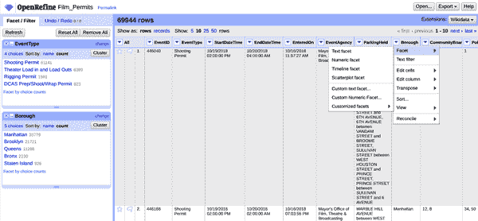

# 第十一章。超越 Python

Python 是一款异常强大且多才多艺的工具，特别适用于处理数据。如果你已经跟着本书的练习走过来，希望你开始对使用它来推动自己的数据整理项目感到自信了。由于充满活力的 Python 社区以及其成员创建和维护的不断发展的一系列有用库，你在本书中学习基础知识的工作将仍然是宝贵的，无论你的下一个数据整理项目是明天还是明年。此外，虽然 Python 作为一种编程语言在许多方面独特，但你在这里获得的编程技能和词汇将让你在其他编程语言中获得一个起步，特别是像 JavaScript 这样相对面向对象的语言。

然而，本书中我试图澄清的一件事是，有时“程序化”解决问题并不是真正最有效的方式。例如，在第四章中，我们在处理 Excel 和 XML 文件时强调，有时试图以编程方式做事情是毫无意义的。例如，在示例 4-12 中，我们本可以编写一个 Python 脚本来遍历整个 XML 文档以发现其结构，但毫无疑问，直接查看我们的数据，识别我们感兴趣的元素，并编写我们的 Python 程序以直接定位它们，会更快、更容易。同样，有时编写 Python 程序甚至会比一个特定的数据整理项目需要的工作量更大，特别是如果它更小或更具探索性质。尽管 *pandas* 是一个非常有用的库，但你仍然可能需要编写大量代码来基本了解新数据集包含的内容。换句话说，虽然我完全相信 Python 的强大和多才多艺使其成为不可或缺的数据整理工具，但我还想强调一些其他免费和/或开源工具，我认为你在数据整理项目中会发现它们很有用^(1)，作为 Python 的补充。

# 数据审查的附加工具

当实际访问和整理数据时，Python 在速度和灵活性方面表现出色，但在让你实际查看数据方面并不特别适合。因此，在本书中，当我们希望以视觉方式浏览数据集时，我们依赖基本文本编辑器（偶尔也会使用网络浏览器）。虽然文本编辑器在这方面是一个很好的第一步，但你也会希望至少熟悉以下每种程序类型中的一种，以帮助你快速初步了解数据——特别是如果你处理的文件不是太大。

## 电子表格程序

可能在开始阅读本书之前，您已经熟悉了电子表格程序，无论是在线版本（如 Google Sheets）、付费的本地软件选项（如 Microsoft Excel），还是基于社区贡献支持的开源替代品（如 LibreOffice Calc）。电子表格程序通常捆绑在“办公”风格的软件套件中，提供基本的计算、分析和制图功能。总体而言，这些程序的功能差异并不大，尽管有些比其他程序更灵活。例如，我更喜欢[LibreOffice](https://libreoffice.org)，因为它是免费的、开源的，并且跨平台运行（包括不常见的平台，如 Linux）。它甚至有一个适用于 Chromebook 和 Android 设备的认证应用，名为[Collabora](https://collaboraoffice.com/press-releases/collabora-office-ships-for-chromebooks)。也就是说，如果您已经拥有或熟悉特定的电子表格程序，没有重要的理由要切换到其他程序，只要您不因为购买它而陷入财务困境。无论您选择什么，绝对*不要*使用盗版软件；在勒索软件肆虐的世界中，这简直不值得冒设备和数据的风险！

虽然许多电子表格程序具有接近 Python 所做功能的高级函数（规模较小），但我通常会用它们来完成非常具体的数据整理和评估任务。特别是，我经常会使用电子表格程序快速执行以下操作：

更改文件格式

例如，如果我的数据以多表格 XLSX 文件形式提供，我可能会在电子表格程序中打开它，并将我感兴趣的表格保存为 *.csv* 文件。

重命名列

如果列数不多，我可能会将那些具有尴尬或不明确标题的列更改为对我目的更可读和/或更直观的内容。

对数据值有一个“感觉”

提供的“日期”列中的值是否实际上是日期？还是仅仅是年份？是否有很多明显缺失的数据值？如果我的数据集相对较小，只是在电子表格程序中视觉扫描数据有时足以确定我是否拥有所需的数据，或者我是否需要继续进行。

生成基本摘要统计信息

当然，我可以用 Python 来做这些，而且大部分时间我确实这样做。但是如果我的数据只有几百行，输入`=MEDIAN()` 然后选择感兴趣的单元格有时会更快，特别是如果我的原始数据文件中有元数据需要去除的情况（正如我们在第四章，以及第七章 和 8 章 中看到的）。

当然，每个工具都有其取舍，而在电子表格程序中预览数据可能会产生一些意想不到的结果。正如你可能从我们处理 XLS 样式“日期”的延长冒险中猜到的那样，预览包含类似日期值的文件可能会导致这些值根据特定电子表格程序及其默认处理和呈现日期的方式显示非常不同。因此，如果原始数据格式是基于文本的（例如 *.csv*、*.tsv* 或 *.txt*），你应该*始终*使用文本编辑器检查类似日期值。同样，务必确认任何包含数字的单元格的格式（无论是默认还是应用的格式），因为值的截断或四舍五入可能会掩盖数据中重要的变化。

## OpenRefine

我在初探更大、结构化数据集时经常使用的工具之一是 [OpenRefine](https://openrefine.org)。根据我的经验，OpenRefine 是一款独特的软件工具，有助于弥合传统电子表格程序和像 Python 这样的全面编程语言之间的差距。与电子表格程序类似，OpenRefine 通过图形用户界面（GUI）操作，因此大部分工作都涉及使用鼠标进行指点和点击。*不同于*电子表格程序的是，你无需滚动数据行来了解其内容；相反，你可以使用菜单选项创建*分面*，提供类似于 [pandas `value_counts()` 方法](https://pandas.pydata.org/docs/reference/api/pandas.Series.value_counts.html) 的汇总信息，而无需编写任何代码。OpenRefine 还支持批量编辑，实现了几种字符串匹配算法（包括我们在 Example 6-11 中使用的指纹方法），并且可以分段导入大文件（例如，每次 100,000 行）。事实上，当我处理新数据集时，OpenRefine 通常是我首选的工具，因为它能轻松打开各种数据格式，甚至提供了方便的实时预览，根据你选择的分隔符解析数据。一旦加载数据集，OpenRefine 还能几乎一键回答像“列 *x* 中最常见的值是什么？”这样的问题。最后，每当你在 OpenRefine 中对数据文件进行实际更改（而不仅仅是聚类或分面化），它都会自动记录你的操作在一个可导出的 *.json* 文件中，然后你可以将这些操作应用到*不同的* OpenRefine 文件中，以便在几秒钟内自动重复这些操作。如果你需要为定期由数据提供者更新的数据集重命名或重新排列数据列，这将非常有用。然而，如果需要*其他人*能够执行此操作而他们没有或不能使用 Python，则更为有用。

大多数情况下，我使用 OpenRefine 能够轻松完成以下操作：

预览大型数据集的小片段

OpenRefine 允许您加载（或跳过）数据集中的任意行数。这对于大型数据集特别有用，当我想要了解它们的内容，但我对它们的内容一无所知时。我可以开始加载 50,000 或 100,000 行数据，并使用细分和其他功能来了解数据类型及整体数据集的组织方式。

快速获取数据集的顶层信息

纽约市最常请求的[电影许可证类型](https://data.cityofnewyork.us/City-Government/Film-Permits/tg4x-b46p)是什么？最受欢迎的行政区是哪一个？如图 11-1 所示，OpenRefine 可以让你在一两次点击中获取这些统计数据，并允许你快速创建交叉制表。

进行电子表格程序不支持的基本转换

一些电子表格程序缺乏某些功能，比如按特定字符分割字符串的能力，或者可能有限的正则表达式支持。OpenRefine 中我最喜欢的功能之一是批量编辑，你可以通过左侧的细分窗口快速轻松地进行操作。

自动生成宏

许多电子表格程序允许你记录*宏*来自动化某些操作，但 OpenRefine 默认会为你记录这些操作，使其成为一个学习曲线较低的更强大的工具。

当然，在使用 OpenRefine 时会有一些需要适应的方面。首先，尽管安装越来越用户友好，但它依赖于另一种名为 Java 的编程语言安装在你的计算机上，因此启动它可能是一个多步骤的过程。一旦安装完成，启动程序的方式也有些不同：你需要点击（或双击）程序图标启动，并且在某些情况下，需要打开一个指向你“本地主机”地址的浏览器窗口（通常是 `http://127.0.0.1:3333/` 或 `http://localhost:3333`）。和 Jupyter Notebook 一样，OpenRefine 实际上在你的计算机上通过一个微型 Web 服务器运行，其界面就像一个功能强大的电子表格程序的网页版。尽管存在这些怪癖，OpenRefine 非常有用，通常是进行初始探索（可能是混乱的）数据集的绝佳选择。

###### 图 11-1. OpenRefine 纽约市电影许可证细分

# 共享和展示数据的附加工具

在第十章中，我们专注于如何使用 Python 和关键库如`seaborn`和`matplotlib`选择和改进可视化。虽然使用这些工具可以实现令人印象深刻的定制程度，但有时您可能只需要对可视化进行小调整，可能不希望或无法使用 Python 从原始数据源重新生成它。

如果你需要快速添加或更改可视化中的某些小细节，拥有图像编辑软件是非常有价值的。虽然你可能熟悉用于编辑图像的非常强大且非常昂贵的商业软件应用程序，但你可能没有意识到也有类似强大的免费且开源的工具。

## JPG、PNG 和 GIF 的图像编辑

对于编辑像素图像，如果你想要强大但又不想（或者无法）支付太多费用，GNU 图像处理程序（GIMP）是一个特别不错的选择。[GIMP](https://gimp.org) 是免费且开源的，它适用于各个平台。尽管其用户界面的风格明显过时（在撰写本文时正在进行界面改进），但事实上，该程序可能可以满足你所需的任何基本（以及非常基本的）高质量图像编辑，尤其是如果你只是想要添加（或删除）一些文本或图像注释，更新坐标轴标签等。

的确，GIMP 的学习曲线可能有点陡峭。键盘快捷键可能不是你所期望的，而且一些菜单的位置和它们的图标外观与商业软件中看到的不匹配。尽管如此，除非你是另一个图像编辑程序的专家并且愿意支付（并且继续支付）以获取它的访问权限，否则你在学习 GIMP 上投入的任何时间都是值得的。特别是如果你只需要偶尔访问图像编辑软件，GIMP 是一个强大且灵活的选择。

## 编辑 SVG 和其他矢量格式的软件

如果你计划将你的可视化内容用于印刷或其他高分辨率（或灵活分辨率）的环境中，你很可能会选择以矢量格式保存它。尽管文件大小会更大，但矢量图形比其像素驱动的对应物更加灵活；它们可以在不失真或模糊的情况下进行缩放。然而，它们不能有效地通过像 GIMP 这样的位图软件进行编辑。

再次强调，如果你有商业软件的预算，你应该继续使用它——但是在这里，你也有一个免费且开源的选择。像 GIMP 一样，[Inkscape](https://inkscape.org) 是免费的、开源的，并且跨平台。而且，像 GIMP 一样，它几乎拥有与昂贵的商业矢量编辑软件相同的所有功能。更重要的是，如果你花时间熟悉矢量编辑软件，它不仅会让你调整数字到印刷的数据图形，矢量编辑软件还是 T 恤印刷、激光切割和许多其他数字到物理工作的基本工具。如果你刚开始学习，Inkscape 绝对是正确的选择：免费！

# 对伦理的思考

本书的主要焦点是培养数据整理技能，这在很大程度上是为了支持我们对数据质量进行评估和改进的兴趣。在此过程中，我们已经涉及到了数据质量的更广泛影响，无论是抽象还是具体的。数据质量差可能导致分析产生误导性、扭曲性或歧视性的世界观；再加上今天[数据驱动系统的规模和普及性](https://penguinrandomhouse.com/books/241363/weapons-of-math-destruction-by-cathy-oneil)，可能带来的损害是巨大且深远的。虽然您可以使用本书中的方法来测试和改进数据的质量，但遗憾的是，获取“高质量”数据的方式仍有很大改进空间，有些方法可能并不道德。正如在数据整理过程的其他部分一样，您需要自行决定您愿意使用什么类型的数据以及其目的。

确保您的数据整理工作不会无意中违反自己道德标准的一个策略是制定清单。通过列出关于数据来源以及分析结果将如何使用的问题，您可以在早期确定是否愿意进行特定的数据整理项目。以下清单改编自数据专家[DJ Patil、Hilary Mason 和 Mike Loukides](https://oreilly.com/radar/of-oaths-and-checklists)共享的清单。与第三章中数据特征列表一样，这里的目的并不是除非每个问题的答案都是“是”，否则拒绝一个数据项目；目标是批判性地思考*所有*数据质量方面，包括那些可能超出我们控制范围的方面。诚然，我们可能只能拒绝（而不是改变）不符合我们道德标准的项目，但如果您表达您的担忧，您可能会帮助为其他人也表达担忧留出空间。最糟糕的情况是项目由其他人接手，而您的良心会（在某种程度上）得到宽慰。最好的情况是，您可能会激励其他人在接手下一个项目之前考虑其工作的道德影响。以下是您可能希望包含的一些问题：

1.  数据收集的设计是否反映了其所涉及社区的价值观？

1.  那个社区的成员知道数据是如何收集的吗？他们有拒绝的有意义方式吗？

1.  数据是否已经经过代表性评估？

1.  有没有方法来测试数据的偏见？

1.  我们的数据特征是否准确地代表了我们想描述的现象？

1.  如果数据过时，我们的分析是否会被替换？

最终，您可能会发现您对数据的关注焦点有所不同。无论您决定在自己的清单中包含什么内容，只要您提前明确您的数据原则，您会发现遵守这些原则要容易得多。

# 结论

在本书的过程中，我们涵盖了从 Python 编程和数据质量评估的基础知识，到从六种文件格式和 API 中整理数据。我们将我们的技能应用于一些典型混乱和问题多多的真实世界数据，并优化我们的代码以便未来项目更加轻松。我们甚至探索了如何进行基本数据分析，并通过可视化呈现数据来支持我们的洞见。

如果你已经走到这一步，那么我想到这时候你一定已经染上了某种“病毒”：对编程、对数据、对分析和可视化——或者可能是以上所有内容的热情。不管是什么原因把你带到这本书，我希望你找到了至少一部分你寻找的内容，也许还包括了足够的信心迈出下一步。因为无论未来数据整理领域会发生什么变化，有一件事是肯定的：我们需要尽可能多的人来批判性和深思熟虑地进行这项工作。为什么不能是你其中之一呢？

^(1) 当然可以！
