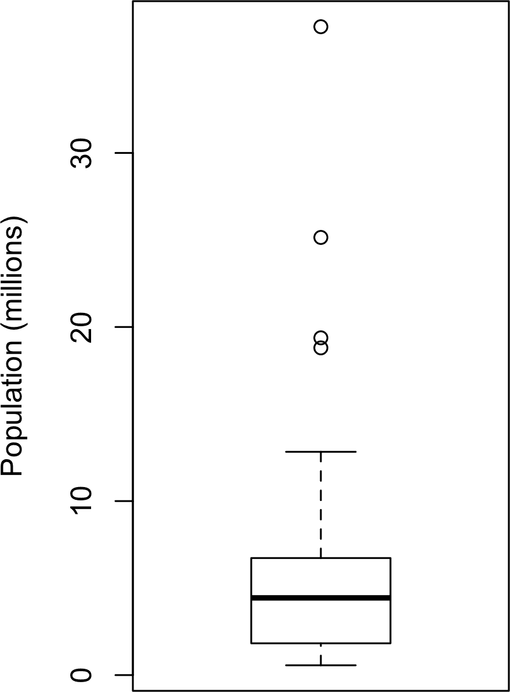

# 第一章：探索性数据分析

本章重点介绍数据科学项目的第一步：探索数据。

古典统计学几乎完全专注于*推断*，这是一套有时复杂的程序，用于根据小样本对大总体进行结论。1962 年，[约翰·W·图基](https://oreil.ly/LQw6q)在他的开创性论文《数据分析的未来》[[图基-1962]](bibliography01.xhtml#图基-1962)中呼吁改革统计学。他提出了一门名为*数据分析*的新科学学科，将统计推断仅作为其中的一个组成部分。图基与工程和计算机科学界建立了联系（他创造了*比特*一词，代表二进制位，以及*软件*一词），他的最初原则令人惊讶地持久，并构成了数据科学的基础之一。探索性数据分析领域始于图基于 1977 年撰写的现已成为经典的书籍《探索性数据分析》[[图基-1977]](bibliography01.xhtml#图基-1977)。图基提出了简单的图表（例如，箱线图、散点图），这些图表与汇总统计数据（均值、中位数、分位数等）一起，有助于描绘数据集的全貌。

随着计算能力的普及和表达性数据分析软件的出现，探索性数据分析已经远远超出了其最初的范围。推动这一学科发展的关键因素包括新技术的快速发展，获取更多更大的数据，以及在各种学科中更广泛地使用定量分析。斯坦福大学统计学教授、图基的前本科生大卫·多诺霍（David Donoho）根据他在新泽西州普林斯顿市图基百年纪念研讨会上的发言撰写了一篇优秀的文章[[多诺霍-2015]](bibliography01.xhtml#多诺霍-2015)。多诺霍将数据科学的起源追溯到图基在数据分析方面的开创性工作。


###### 图 1-1\. 约翰·图基，这位杰出的统计学家的思想在 50 多年前形成了数据科学的基础

# 结构化数据元素

数据来自许多来源：传感器测量、事件、文本、图像和视频。*物联网*（IoT）正在喷发信息流。其中许多数据是非结构化的：图像是像素的集合，每个像素包含 RGB（红、绿、蓝）颜色信息。文本是单词和非单词字符的序列，通常按部分、子部分等组织。点击流是用户与应用程序或网页交互的行动序列。事实上，数据科学的一个主要挑战是将这些原始数据的洪流转化为可操作的信息。要应用本书涵盖的统计概念，非结构化的原始数据必须被处理和转换成结构化形式。结构化数据的一种常见形式是具有行和列的表格——数据可能来自关系数据库或为研究而收集。

有两种基本类型的结构化数据：数值和分类。数值数据有两种形式：*连续*，如风速或时间持续，以及*离散*，如事件发生的次数。*分类*数据只取固定集合的值，如电视屏幕类型（等离子、LCD、LED 等）或州名（阿拉巴马州、阿拉斯加州等）。*二元*数据是分类数据的一个重要特例，只取两个值之一，如 0/1、是/否或真/假。另一种有用的分类数据类型是*有序*数据，在这种数据中，类别是有序的；一个例子是数值评级（1、2、3、4 或 5）。

我们为什么要费心对数据类型进行分类？事实证明，为了数据分析和预测建模的目的，数据类型对于确定视觉显示类型、数据分析或统计模型类型是很重要的。事实上，数据科学软件如*R*和*Python*使用这些数据类型来提高计算性能。更重要的是，变量的数据类型决定了软件如何处理该变量的计算。

软件工程师和数据库程序员可能会想知道为什么我们甚至需要*分类*和*有序*数据用于分析。毕竟，类别只是文本（或数字）值的集合，底层数据库会自动处理内部表示。然而，将数据明确标识为分类数据，与文本不同，确实提供了一些优势：

+   知道数据是分类的可以作为一个信号，告诉软件如何进行统计过程，比如生成图表或拟合模型。特别是，有序数据可以在*R*中表示为`ordered.factor`，在图表、表格和模型中保留用户指定的顺序。在*Python*中，`scikit-learn`通过`sklearn.preprocessing.OrdinalEncoder`支持有序数据。

+   存储和索引可以进行优化（如关系数据库中）。

+   给定分类变量可能采用的可能值在软件中被强制执行（类似枚举）。

第三个“好处”可能会导致意外或预期之外的行为：在*R*中，数据导入函数（例如`read.csv`）的默认行为是自动将文本列转换为`factor`。对该列的后续操作将假定该列的唯一可允许值是最初导入的值，而分配新的文本值将引发警告并生成`NA`（缺失值）。*Python*中的`pandas`包不会自动进行此类转换。但是，您可以在`read_csv`函数中显式指定列为分类。

## 进一步阅读

+   [`pandas`文档](https://oreil.ly/UGX-4)描述了不同的数据类型以及它们如何在*Python*中操作。

+   数据类型可能会令人困惑，因为类型可能会重叠，并且一个软件中的分类法可能与另一个软件中的不同。[R 教程网站](https://oreil.ly/2YUoA)涵盖了*R*的分类法。[`pandas`文档](https://oreil.ly/UGX-4)描述了不同的数据类型以及它们如何在*Python*中操作。

+   数据库在数据类型的分类中更为详细，包括精度级别、固定长度或可变长度字段等考虑因素；参见[SQL 的 W3Schools 指南](https://oreil.ly/cThTM)。

# 矩形数据

在数据科学中，分析的典型参考框架是*矩形数据*对象，例如电子表格或数据库表。

*矩形数据*是指二维矩阵，行表示记录（案例），列表示特征（变量）；*数据框*是*R*和*Python*中的特定格式。数据并不总是以此形式开始：非结构化数据（例如文本）必须经过处理和操作，以便将其表示为矩形数据中的一组特征（参见“结构化数据元素”）。对于大多数数据分析和建模任务，关系数据库中的数据必须提取并放入单个表中。

表 1-1\. 典型的数据框格式

| 类别 | 货币 | 卖家评级 | 时长 | 结束日 | 收盘价 | 开盘价 | 竞争性？ |
| --- | --- | --- | --- | --- | --- | --- | --- |
| 音乐/电影/游戏 | 美国 | 3249 | 5 | 星期一 | 0.01 | 0.01 | 0 |
| 音乐/电影/游戏 | 美国 | 3249 | 5 | 星期一 | 0.01 | 0.01 | 0 |
| 汽车行业 | 美国 | 3115 | 7 | 星期二 | 0.01 | 0.01 | 0 |
| 汽车行业 | 美国 | 3115 | 7 | 星期二 | 0.01 | 0.01 | 0 |
| 汽车行业 | 美国 | 3115 | 7 | 星期二 | 0.01 | 0.01 | 0 |
| 汽车行业 | 美国 | 3115 | 7 | 星期二 | 0.01 | 0.01 | 0 |
| 汽车行业 | 美国 | 3115 | 7 | 星期二 | 0.01 | 0.01 | 1 |
| 汽车行业 | 美国 | 3115 | 7 | 星期二 | 0.01 | 0.01 | 1 |

在 表 1-1 中，存在测量或计数数据（例如，持续时间和价格）和分类数据（例如，类别和货币）。如前所述，在 表 1-1 中的最右列中有一种特殊形式的分类变量，即二元（是/否或 0/1）变量 —— 一个指示变量，显示拍卖是否竞争（是否有多个竞标者）。当场景是预测拍卖是否竞争时，这个指示变量也恰好是一个 *结果* 变量。

## 数据框和索引

传统数据库表有一个或多个列被指定为索引，本质上是行号。这可以极大地提高某些数据库查询的效率。在 *Python* 中，使用 `pandas` 库，基本的矩形数据结构是一个 `DataFrame` 对象。默认情况下，`DataFrame` 根据行的顺序创建一个自动整数索引。在 `pandas` 中，还可以设置多级/层次化索引以提高某些操作的效率。

在 *R* 中，基本的矩形数据结构是一个 `data.frame` 对象。一个 `data.frame` 也有一个基于行顺序的隐式整数索引。原生的 *R* `data.frame` 不支持用户指定或多级索引，尽管可以通过 `row.names` 属性创建自定义键。为了弥补这个不足，两个新的包正在广泛使用：`data.table` 和 `dplyr`。两者都支持多级索引，并在处理 `data.frame` 时提供了显著的加速。

# 术语差异

矩形数据的术语可能令人困惑。统计学家和数据科学家对同一概念使用不同术语。对于统计学家来说，*预测变量* 在模型中用于预测 *响应* 或 *因变量*。对于数据科学家来说，*特征* 用于预测 *目标*。一个特别令人困惑的同义词是：计算机科学家会将单个行称为 *样本*；而对统计学家来说，*样本* 意味着一组行。

## 非矩形数据结构

除了矩形数据外，还有其他数据结构。

时间序列数据记录了同一变量的连续测量。它是统计预测方法的原始材料，也是设备生成的数据的关键组成部分 —— 物联网数据。

用于地图和位置分析的空间数据结构比矩形数据结构更复杂和多样化。在 *对象* 表示中，数据的焦点是一个对象（例如，一座房子）及其空间坐标。相比之下，在 *场* 视图中，关注的是空间的小单元和相关度量的值（例如像素亮度）。

图（或网络）数据结构用于表示物理、社会和抽象关系。例如，社交网络的图表，如 Facebook 或 LinkedIn，可以表示网络上人与人之间的联系。通过道路连接的分布中心是物理网络的一个例子。图结构对于某些类型的问题很有用，比如网络优化和推荐系统。

这些数据类型中的每一个在数据科学中都有其专门的方法。本书的重点是矩形数据，这是预测建模的基本构建单元。

# 统计学中的图表

在计算机科学和信息技术中，术语*图*通常用于描述实体之间的连接及其基础数据结构。在统计学中，*图*用于指代各种绘图和*可视化*，不仅仅是实体之间的连接，并且该术语仅适用于可视化，而不是数据结构本身。

## 进一步阅读

+   [关于 *R* 中数据框的文档](https://oreil.ly/NsONR)

+   [关于 *Python* 中数据框的文档](https://oreil.ly/oxDKQ)

# 位置估计

具有测量或计数数据的变量可能有数千个不同的值。探索数据的基本步骤是为每个特征（变量）获取一个“典型值”：数据大部分位于何处的估计（即其中心趋势）。

乍一看，总结数据似乎相当简单：只需取数据的*均值*。事实上，虽然均值易于计算且使用方便，但它并不总是最佳的中心值度量。因此，统计学家开发并推广了几种替代均值的估计方法。

# 度量和估计

统计学家经常用术语*估计*来表示从手头数据计算出的值，以区分我们从数据中看到的内容和理论上的真实或确切状态。数据科学家和业务分析师更倾向于将这样的值称为*度量*。这种差异反映了统计学与数据科学的方法：不确定性的考虑是统计学学科的核心，而具体的业务或组织目标是数据科学的重点。因此，统计学家进行估计，而数据科学家进行度量。

## 均值

最基本的位置估计是平均值，或者*平均*值。平均值是所有值的总和除以值的数量。考虑以下数字集合：{3 5 1 2}。平均值为 (3 + 5 + 1 + 2) / 4 = 11 / 4 = 2.75。你会遇到符号 <math alttext="x overbar"><mover accent="true"><mi>x</mi> <mo>¯</mo></mover></math>（读作“x-bar”），用于表示从总体中取样的样本的均值。计算一组*n*个值 <math alttext="x 1 comma x 2 comma ellipsis comma x Subscript n Baseline"><mrow><msub><mi>x</mi> <mn>1</mn></msub> <mo>,</mo> <msub><mi>x</mi> <mn>2</mn></msub> <mo>,</mo> <mo>...</mo> <mo>,</mo> <msub><mi>x</mi> <mi>n</mi></msub></mrow></math> 的公式为：

<math display="block"><mrow><mtext>Mean</mtext> <mo>=</mo> <mover accent="true"><mi>x</mi> <mo>¯</mo></mover> <mo>=</mo> <mfrac><mrow><msubsup><mo>∑</mo> <mi>i=1</mi> <mi>n</mi></msubsup> <msub><mi>x</mi> <mi>i</mi></msub></mrow> <mi>n</mi></mfrac></mrow></math>

###### 注意

*N*（或*n*）指的是记录或观测的总数。在统计学中，如果它是指的总体，则大写；如果是指的总体的样本，则小写。在数据科学中，这种区别并不是很重要，所以你可能会看到两种写法。

均值的一种变体是*修剪均值*，你可以通过删除每端的固定数量的排序值，然后取剩余值的平均值来计算。用 <math alttext="x Subscript left-parenthesis 1 right-parenthesis Baseline comma x Subscript left-parenthesis 2 right-parenthesis Baseline comma ellipsis comma x Subscript left-parenthesis n right-parenthesis Baseline"><mrow><msub><mi>x</mi> <mrow><mo>(</mo><mn>1</mn><mo>)</mo></mrow></msub> <mo>,</mo> <msub><mi>x</mi> <mrow><mo>(</mo><mn>2</mn><mo>)</mo></mrow></msub> <mo>,</mo> <mo>...</mo> <mo>,</mo> <msub><mi>x</mi> <mrow><mo>(</mo><mi>n</mi><mo>)</mo></mrow></msub></mrow></math> 来表示排序值，其中 <math alttext="x Subscript left-parenthesis 1 right-parenthesis"><msub><mi>x</mi> <mrow><mo>(</mo><mn>1</mn><mo>)</mo></mrow></msub></math> 是最小值， <math alttext="x Subscript left-parenthesis n right-parenthesis"><msub><mi>x</mi> <mrow><mo>(</mo><mi>n</mi><mo>)</mo></mrow></msub></math> 是最大值，计算剔除 <math alttext="p"><mi>p</mi></math> 个最小和最大值后的修剪均值的公式为：

<math display="block"><mrow><mtext>Trimmed</mtext> <mtext>mean</mtext> <mo>=</mo> <mover accent="true"><mi>x</mi> <mo>¯</mo></mover> <mo>=</mo> <mfrac><mrow><msubsup><mo>∑</mo> <mrow><mi>i</mi><mo>=</mo><mi>p</mi><mo>+</mo><mn>1</mn></mrow> <mrow><mi>n</mi><mo>-</mo><mi>p</mi></mrow></msubsup> <msub><mi>x</mi> <mrow><mo>(</mo><mi>i</mi><mo>)</mo></mrow></msub></mrow> <mrow><mi>n</mi><mo>-</mo><mn>2</mn><mi>p</mi></mrow></mfrac></mrow></math>

修剪均值消除极端值的影响。例如，在国际跳水比赛中，五位评委的最高分和最低分被剔除，而[最终得分是剩余三位评委评分的平均值](https://oreil.ly/uV4P0)。这样做可以防止单个评委操纵分数，可能有利于他们国家的参赛选手。修剪均值被广泛使用，在许多情况下比使用普通均值更可取—详见“中位数和健壮估计”进一步讨论。

另一种平均数是*加权平均数*，计算方法是将每个数据值 <math alttext="x Subscript i"><msub><mi>x</mi> <mi>i</mi></msub></math> 乘以用户指定的权重 <math alttext="w Subscript i"><msub><mi>w</mi> <mi>i</mi></msub></math>，然后除以权重的总和。加权平均数的公式为：

<math alttext="Weighted mean x overbar Subscript w Baseline equals StartFraction sigma-summation Underscript i equals 1 Overscript n Endscripts w Subscript i Baseline x Subscript i Baseline Over sigma-summation Underscript i equals 1 Overscript n Endscripts w Subscript i Baseline EndFraction" display="block"><mrow><mi>Weighted</mi> <mi>mean</mi> <mo>=</mo> <msub><mover accent="true"><mi>x</mi> <mo>¯</mo></mover> <mi>w</mi></msub> <mo>=</mo> <mfrac><mrow><msubsup><mo>∑</mo> <mrow><mi>i</mi><mo>=</mo><mn>1</mn></mrow> <mi>n</mi></msubsup> <msub><mi>w</mi> <mi>i</mi></msub> <msub><mi>x</mi> <mi>i</mi></msub></mrow> <mrow><msubsup><mo>∑</mo> <mrow><mi>i</mi><mo>=</mo><mn>1</mn></mrow> <mi>n</mi></msubsup> <msub><mi>w</mi> <mi>i</mi></msub></mrow></mfrac></mrow></math>

使用加权平均数有两个主要动机：

+   有些值本质上比其他值更变化，高变化的观察结果会被赋予较低的权重。例如，如果我们从多个传感器中取平均值，而其中一个传感器的精度较低，则我们可能会降低该传感器的数据权重。

+   收集的数据未能平等地代表我们有兴趣测量的不同群体。例如，由于在线实验的进行方式，我们可能没有一个能够准确反映用户群体中所有群体的数据集。为了纠正这一点，我们可以给予那些代表性不足群体的值更高的权重。

## 中位数和鲁棒估计

*中位数*是数据排序列表中的中间数。如果数据值的数量是偶数，中间值实际上不在数据集中，而是分割排序数据成上半部分和下半部分的两个值的平均值。与使用所有观察值的平均数相比，中位数仅依赖于排序数据中心的值。虽然这可能看起来是一个劣势，因为平均数对数据更为敏感，但在许多情况下，中位数是位置测量的更好指标。例如，我们想要查看西雅图华盛顿州湖畔周围各个社区的典型家庭收入。如果我们比较梅迪纳社区和温德米尔社区，使用平均数会产生非常不同的结果，因为比尔·盖茨住在梅迪纳。如果我们使用中位数，比尔·盖茨有多富有并不重要——中间观察值的位置将保持不变。

基于与加权平均数相同的原因，也可以计算*加权中位数*。与中位数类似，我们首先对数据进行排序，尽管每个数据值都有一个关联的权重。加权中位数不是排序列表的中间数，而是这样一个值，使得排序列表的下半部分和上半部分的权重之和相等。与中位数一样，加权中位数对异常值具有鲁棒性。

### 异常值

中位数被称为位置的 *稳健* 估计，因为它不受可能扭曲结果的 *异常值*（极端情况）的影响。异常值是数据集中与其他值非常远的任何值。异常值的确切定义在某种程度上是主观的，尽管在各种数据摘要和图中使用了某些惯例（参见“百分位数和箱线图”）。异常值本身并不使数据值无效或错误（如前面关于比尔·盖茨的例子）。尽管如此，异常值通常是由于数据错误（例如混合不同单位的数据，如千米与米）或传感器的错误读数而导致的。当异常值是由于错误数据时，均值将导致位置估计不佳，而中位数仍然有效。无论如何，应该识别异常值，并且通常值得进一步调查。

# 异常检测

与典型的数据分析相比，在 *异常检测* 中，异常值是感兴趣的点，而更大部分的数据主要用于定义“正常”，以便测量异常。

中位数并不是唯一的位置稳健估计。事实上，修剪均值被广泛使用以避免异常值的影响。例如，修剪数据底部和顶部的 10%（一种常见选择）将在除了最小数据集外的所有情况下保护免受异常值的影响。修剪均值可以被视为中位数和均值之间的折衷：它对数据中的极值稳健，但使用更多数据来计算位置估计。

# 其他稳健的位置度量

统计学家已经开发出大量其他位置估计器，主要目标是开发比均值更稳健且更有效（即更能辨别数据集之间小位置差异）的估计器。虽然这些方法可能对小数据集有用，但对大或中等规模的数据集不太可能提供额外的好处。

## 示例：人口和谋杀率的位置估计

表 1-2 显示了包含每个美国州（2010 年人口普查）的人口和谋杀率（以每年每 100,000 人的谋杀数单位）的数据集的前几行。

表 1-2\. 人口和谋杀率 `data.frame` 状态的几行示例

|  | 州 | 人口 | 谋杀率 | 缩写 |
| --- | --- | --- | --- | --- |
| 1 | 阿拉巴马州 | 4,779,736 | 5.7 | AL |
| 2 | 阿拉斯加州 | 710,231 | 5.6 | AK |
| 3 | 亚利桑那州 | 6,392,017 | 4.7 | AZ |
| 4 | 阿肯色州 | 2,915,918 | 5.6 | AR |
| 5 | 加利福尼亚州 | 37,253,956 | 4.4 | CA |
| 6 | 科罗拉多州 | 5,029,196 | 2.8 | CO |
| 7 | 康涅狄格州 | 3,574,097 | 2.4 | CT |
| 8 | 特拉华州 | 897,934 | 5.8 | DE |

使用 *R* 计算人口的均值、修剪均值和中位数：

```py
> state <- read.csv('state.csv')
> mean(state[['Population']])
[1] 6162876
> mean(state[['Population']], trim=0.1)
[1] 4783697
> median(state[['Population']])
[1] 4436370
```

要在*Python*中计算平均值和中位数，我们可以使用数据帧的`pandas`方法。修剪均值需要`scipy.stats`中的`trim_mean`函数：

```py
state = pd.read_csv('state.csv')
state['Population'].mean()
trim_mean(state['Population'], 0.1)
state['Population'].median()
```

平均值大于修剪均值，后者大于中位数。

这是因为修剪均值排除了最大和最小的五个州（`trim=0.1`从每端剔除 10%）。如果我们想要计算全国的平均谋杀率，我们需要使用加权平均值或中位数来考虑各州的不同人口。由于基本的*R*没有加权中位数函数，我们需要安装诸如`matrixStats`的软件包：

```py
> weighted.mean(state[['Murder.Rate']], w=state[['Population']])
[1] 4.445834
> library('matrixStats')
> weightedMedian(state[['Murder.Rate']], w=state[['Population']])
[1] 4.4
```

权重均值可在`NumPy`中找到。对于加权中位数，我们可以使用专用软件包[wquantiles](https://oreil.ly/4SIPQ)：

```py
np.average(state['Murder.Rate'], weights=state['Population'])
wquantiles.median(state['Murder.Rate'], weights=state['Population'])
```

在这种情况下，加权平均值和加权中位数大致相同。

## 进一步阅读

+   维基百科关于[中心趋势](https://oreil.ly/qUW2i)的文章详细讨论了各种位置测量。

+   约翰·图基于 1977 年经典著作*探索性数据分析*(Pearson) 仍广泛阅读。

# 变异性估计

位置仅是总结特征的一个维度。第二个维度*变异性*，也称为*分散*，用于衡量数据值是密集聚集还是分散。统计学的核心在于变异性：测量它，减少它，区分随机变异和真实变异，识别真实变异的各种来源，并在其存在的情况下做出决策。

就像有不同的方法来测量位置（平均值，中位数等），也有不同的方法来测量变异性。

## 标准偏差及相关估计

最广为使用的变异性估计基于估计的位置与观察数据之间的差异或*偏差*。对于数据集{1, 4, 4}，平均值为 3，中位数为 4。相对于平均值的偏差为差值：1 – 3 = –2，4 – 3 = 1，4 – 3 = 1。这些偏差告诉我们数据围绕中心值的分散程度。

一种测量变异性的方法是估计这些偏差的典型值。平均偏差本身不会告诉我们太多——负偏差抵消了正偏差。事实上，从平均值的偏差之和正好是零。相反，一种简单的方法是取偏差绝对值的平均值。在前面的例子中，偏差的绝对值为{2 1 1}，它们的平均值是(2 + 1 + 1) / 3 = 1.33。这被称为*平均绝对偏差*，可用以下公式计算：

<math display="block"><mrow><mtext>Mean</mtext> <mtext>absolute</mtext> <mtext>deviation</mtext> <mo>=</mo> <mfrac><mrow><msubsup><mo>∑</mo> <mrow><mi>i</mi><mo>=</mo><mn>1</mn></mrow> <mi>n</mi></msubsup> <mfenced separators="" open="|" close="|"><msub><mi>x</mi> <mi>i</mi></msub> <mo>-</mo><mover accent="true"><mi>x</mi> <mo>¯</mo></mover></mfenced></mrow> <mi>n</mi></mfrac></mrow></math>

其中<math alttext="x overbar"><mover accent="true"><mi>x</mi> <mo>¯</mo></mover></math>是样本均值。

最为人熟知的变异性估计是*方差*和*标准偏差*，这些都基于平方偏差。方差是平方偏差的平均数，标准偏差是方差的平方根：

<math display="block"><mtable displaystyle="true"><mtr><mtd><mtext>Variance</mtext></mtd> <mtd><mo>=</mo> <msup><mi>s</mi> <mn>2</mn></msup> <mo>=</mo> <mfrac><mrow><munderover><mo>∑</mo> <mrow class="MJX-TeXAtom-ORD"><mi>i</mi> <mo>=</mo> <mn>1</mn></mrow> <mi>n</mi></munderover> <msup><mrow><mo>(</mo> <msub><mi>x</mi> <mi>i</mi></msub> <mo>−</mo> <mrow class="MJX-TeXAtom-ORD"><mover><mi>x</mi> <mo>¯</mo></mover></mrow> <mo>)</mo></mrow> <mn>2</mn></msup></mrow> <mrow><mi>n</mi> <mo>−</mo> <mn>1</mn></mrow></mfrac></mtd></mtr> <mtr><mtd><mtext>Standard deviation</mtext></mtd> <mtd><mo>=</mo> <mi>s</mi> <mo>=</mo> <msqrt><mtext>Variance</mtext></msqrt></mtd></mtr></mtable></math>

标准差比方差更容易解释，因为它与原始数据在同一尺度上。尽管其公式更复杂且不直观，但统计学上更偏好标准差而不是均值绝对偏差。这是因为在统计理论中，数学上使用平方值比绝对值更方便，尤其是对于统计模型而言。

方差、标准差和均值绝对偏差对异常值和极端值都不稳健（有关稳健估计位置的讨论，请参见“中位数和稳健估计”）。方差和标准差特别对异常值敏感，因为它们基于平方偏差。

一个稳健的变异性估计是*中位数绝对偏差*或 MAD：

<math display="block"><mrow><mtext>Median</mtext> <mtext>absolute</mtext> <mtext>deviation</mtext> <mo>=</mo> <mtext>Median</mtext> <mfenced separators="" open="(" close=")"><mfenced separators="" open="|" close="|"><msub><mi>x</mi> <mn>1</mn></msub> <mo>-</mo> <mi>m</mi></mfenced> <mo>,</mo> <mfenced separators="" open="|" close="|"><msub><mi>x</mi> <mn>2</mn></msub> <mo>-</mo> <mi>m</mi></mfenced> <mo>,</mo> <mo>...</mo> <mo>,</mo> <mfenced separators="" open="|" close="|"><msub><mi>x</mi> <mi>N</mi></msub> <mo>-</mo> <mi>m</mi></mfenced></mfenced></mrow></math>

其中*m*是中位数。与中位数类似，MAD 不受极端值的影响。还可以计算类似于修剪均值的修剪标准差（参见“均值”）。

###### 注意

方差、标准差、均值绝对偏差和中位数绝对偏差不是等价的估计，即使数据来自正态分布的情况下也是如此。事实上，标准差总是大于均值绝对偏差，而均值绝对偏差本身大于中位数绝对偏差。有时，中位数绝对偏差会乘以一个常数缩放因子，以便在正态分布的情况下与标准差处于同一尺度上。常用的缩放因子 1.4826 意味着正态分布的 50%落在<math alttext="plus-or-minus MAD"><mrow><mo>±</mo> <mi>MAD</mi></mrow></math>的范围内（参见，例如，[*https://oreil.ly/SfDk2*](https://oreil.ly/SfDk2)）。

## 基于百分位数的估计

一个估计离散度的不同方法是基于排序数据的分散程度。基于排序（排名）数据的统计称为*顺序统计*。最基本的度量是*范围*：最大数和最小数之间的差异。最小值和最大值本身对于识别异常值是有用的，但范围对异常值非常敏感，作为数据离散度的一般度量不太有用。

为了避免对异常值过于敏感，我们可以在删除每端的值后查看数据的范围。形式上，这些类型的估计是基于*百分位数*之间的差异。在数据集中，第*P*百分位数是这样一个值，至少有*P*百分比的值取得此值或更小，至少有（100 – *P*）百分比的值取得此值或更大。例如，要找到 80th 百分位数，请对数据进行排序。然后，从最小值开始，前进 80％到最大值。注意，中位数与第 50 百分位数是相同的东西。百分位数本质上与*分位数*相同，分位数由分数索引（因此.8 分位数与 80th 百分位数相同）。

变异性的常见测量是第 25 百分位数和第 75 百分位数之间的差异，称为*四分位距*（或 IQR）。这里有一个简单的例子：{3,1,5,3,6,7,2,9}。我们对这些进行排序得到{1,2,3,3,5,6,7,9}。第 25 百分位数是 2.5，第 75 百分位数是 6.5，因此四分位距为 6.5 – 2.5 = 4。软件可能有略有不同的方法，导致不同的答案（见下面的提示）；通常，这些差异较小。

对于非常大的数据集，计算精确的百分位数可能非常耗费计算资源，因为它需要对所有数据值进行排序。机器学习和统计软件使用特殊算法，比如[[张-王-2007]](bibliography01.xhtml#Zhang-Wang-2007)，来获取一个可以非常快速计算并且保证具有一定准确度的近似百分位数。

# 百分位数：精确定义

如果我们有偶数个数据（*n*为偶数），则根据前述定义，百分位数是模糊的。事实上，我们可以取得任何值介于顺序统计量<math alttext="x Subscript left-parenthesis j right-parenthesis"><msub><mi>x</mi> <mrow><mo>(</mo><mi>j</mi><mo>)</mo></mrow></msub></math>和<math alttext="x Subscript left-parenthesis j plus 1 right-parenthesis"><msub><mi>x</mi> <mrow><mo>(</mo><mi>j</mi><mo>+</mo><mn>1</mn><mo>)</mo></mrow></msub></math>之间的任何值，其中*j*满足：

<math display="block"><mrow><mn>100</mn> <mo>*</mo> <mfrac><mi>j</mi> <mi>n</mi></mfrac> <mo>≤</mo> <mi>P</mi> <mo><</mo> <mn>100</mn> <mo>*</mo> <mfrac><mrow><mi>j</mi><mo>+</mo><mn>1</mn></mrow> <mi>n</mi></mfrac></mrow></math>

形式上，百分位数是加权平均值：

<math display="block"><mrow><mtext>Percentile</mtext> <mrow><mo>(</mo> <mi>P</mi> <mo>)</mo></mrow> <mo>=</mo> <mfenced separators="" open="(" close=")"><mn>1</mn> <mo>-</mo> <mi>w</mi></mfenced> <msub><mi>x</mi> <mrow><mo>(</mo><mi>j</mi><mo>)</mo></mrow></msub> <mo>+</mo> <mi>w</mi> <msub><mi>x</mi> <mrow><mo>(</mo><mi>j</mi><mo>+</mo><mn>1</mn><mo>)</mo></mrow></msub></mrow></math>

对于某些权重*w*，介于 0 和 1 之间。统计软件对选择*w*的方法有略有不同。事实上，*R*函数`quantile`提供了九种不同的替代方法来计算分位数。除了小数据集外，通常不需要担心百分位数的精确计算方式。在撰写本文时，*Python*的`numpy.quantile`仅支持一种方法，即线性插值。

## 例子：州人口的变异性估计

表 1-3（为方便起见，从表 1-2 重复）显示了包含每个州人口和谋杀率的数据集中的前几行。

表 1-3\. 由州人口和谋杀率组成的`data.frame`数据集的前几行

|  | 州名 | 人口 | 谋杀率 | 缩写 |
| --- | --- | --- | --- | --- |
| 1 | 阿拉巴马 | 4,779,736 | 5.7 | AL |
| 2 | 阿拉斯加 | 710,231 | 5.6 | AK |
| 3 | 亚利桑那 | 6,392,017 | 4.7 | AZ |
| 4 | 阿肯色 | 2,915,918 | 5.6 | AR |
| 5 | 加利福尼亚 | 37,253,956 | 4.4 | CA |
| 6 | 科罗拉多 | 5,029,196 | 2.8 | CO |
| 7 | 康涅狄格 | 3,574,097 | 2.4 | CT |
| 8 | 特拉华 | 897,934 | 5.8 | DE |

使用*R*内置函数来计算标准偏差、四分位距（IQR）以及中位数绝对离差（MAD），我们可以对州人口数据的变异性进行估算：

```py
> sd(state[['Population']])
[1] 6848235
> IQR(state[['Population']])
[1] 4847308
> mad(state[['Population']])
[1] 3849870
```

`pandas`数据帧提供了计算标准偏差和百分位数的方法。使用百分位数，我们可以轻松确定 IQR。对于稳健的 MAD，我们使用`statsmodels`包中的`robust.scale.mad`函数：

```py
state['Population'].std()
state['Population'].quantile(0.75) - state['Population'].quantile(0.25)
robust.scale.mad(state['Population'])
```

标准偏差几乎是 MAD 的两倍大（在*R*中，默认情况下，MAD 的尺度调整为与均值相同的尺度）。这并不奇怪，因为标准偏差对异常值很敏感。

## 进一步阅读

+   David Lane 的在线统计资源有一节关于百分位数的内容：[百分位数部分](https://oreil.ly/o2fBI)。

+   Kevin Davenport 在*R*-Bloggers 上有一篇[有关中位数偏差及其稳健特性的有用文章](https://oreil.ly/E7zcG)。

# 探索数据分布

我们讨论过的每一个估算值都总结了单个数字来描述数据的位置或变异性。总体上探索数据如何分布也是很有用的。

## 百分位数和箱线图

在“基于百分位数的估算”中，我们探讨了如何使用百分位数来衡量数据的扩展性。百分位数对于总结整个分布也是有价值的。通常报告四分位数（第 25、50 和 75 个百分位数）和分位数（第 10、20、…、90 个百分位数）是很常见的。百分位数对于总结分布的*尾部*（外围范围）尤为重要。流行文化将术语*one-percenters*用来指称处于财富前 99%的人群。

表 1-4 显示了按州划分的谋杀率的一些百分位数。在*R*中，这将由`quantile`函数生成：

```py
quantile(state[['Murder.Rate']], p=c(.05, .25, .5, .75, .95))
   5%   25%   50%   75%   95%
1.600 2.425 4.000 5.550 6.510
```

在*Python*中，`pandas`数据帧方法`quantile`提供了这一功能：

```py
state['Murder.Rate'].quantile([0.05, 0.25, 0.5, 0.75, 0.95])
```

表 1-4\. 按州划分的谋杀率的百分位数

| 5% | 25% | 50% | 75% | 95% |
| --- | --- | --- | --- | --- |
| 1.60 | 2.42 | 4.00 | 5.55 | 6.51 |

中位数为每 10 万人口 4 起谋杀案，尽管变异性很大：第 5 百分位数仅为 1.6，第 95 百分位数为 6.51。

*箱线图*，由 Tukey 提出[[Tukey-1977]](bibliography01.xhtml#Tukey-1977)，基于百分位数，可以快速可视化数据的分布。图 1-2 展示了*R*生成的按州人口的箱线图：

```py
boxplot(state[['Population']]/1000000, ylab='Population (millions)')
```

`pandas`提供了许多基本的数据帧探索图，其中之一就是箱线图：

```py
ax = (state['Population']/1_000_000).plot.box()
ax.set_ylabel('Population (millions)')
```



###### 图 1-2\. 各州人口的箱线图

从这个箱线图中，我们可以立即看出中位数州人口约为 500 万，一半的州人口介于约 200 万到约 700 万之间，还有一些高人口的异常值。箱子的顶部和底部分别是第 75 和第 25 百分位数。中位数由箱子中的水平线表示。虚线，称为*须*，从箱子的顶部和底部延伸到表示数据大部分范围的位置。箱线图有很多变化；例如，参见*R*函数 `boxplot` 的文档 [[R-base-2015]](bibliography01.xhtml#R-base-2015)。默认情况下，*R*函数将须延伸到箱子之外的最远点，但不会超过 1.5 倍的四分位距。*Matplotlib* 使用相同的实现；其他软件可能使用不同的规则。

任何超出须外的数据都会被绘制为单个点或圆圈（通常被视为异常值）。

## 频率表和直方图

一个变量的频率表将变量范围分成等间距的段，并告诉我们每个段中有多少值。表 1-5 显示了在*R*中计算的按州人口的频率表：

```py
breaks <- seq(from=min(state[['Population']]),
                to=max(state[['Population']]), length=11)
pop_freq <- cut(state[['Population']], breaks=breaks,
                right=TRUE, include.lowest=TRUE)
table(pop_freq)
```

函数 `pandas.cut` 创建了一个系列，将值映射到这些段中。使用 `value_counts` 方法，我们得到了频率表：

```py
binnedPopulation = pd.cut(state['Population'], 10)
binnedPopulation.value_counts()
```

表 1-5\. 按州计算的人口频率表

| 箱子编号 | 箱子范围 | 计数 | 州名 |
| --- | --- | --- | --- |
| 1 | 563,626–4,232,658 | 24 | 怀俄明州, 佛蒙特州, 北达科他州, 阿拉斯加州, 南达科他州, 特拉华州, 蒙大拿州, 罗德岛州, 新罕布什尔州, 缅因州, 夏威夷州, 爱达荷州, 内布拉斯加州, 西弗吉尼亚州, 新墨西哥州, 内华达州, 犹他州, 堪萨斯州, 阿肯色州, 密西西比州, 艾奥瓦州, 康涅狄格州, 俄克拉何马州, 俄勒冈州 |
| 2 | 4,232,659–7,901,691 | 14 | 肯塔基州, 路易斯安那州, 南卡罗来纳州, 阿拉巴马州, 科罗拉多州, 明尼苏达州, 威斯康星州, 马里兰州, 密苏里州, 田纳西州, 亚利桑那州, 印第安纳州, 马萨诸塞州, 华盛顿州 |
| 3 | 7,901,692–11,570,724 | 6 | 弗吉尼亚州, 新泽西州, 北卡罗来纳州, 乔治亚州, 密歇根州, 俄亥俄州 |
| 4 | 11,570,725–15,239,757 | 2 | 宾夕法尼亚州, 伊利诺伊州 |
| 5 | 15,239,758–18,908,790 | 1 | 佛罗里达州 |
| 6 | 18,908,791–22,577,823 | 1 | 纽约州 |
| 7 | 22,577,824–26,246,856 | 1 | 德克萨斯州 |
| 8 | 26,246,857–29,915,889 | 0 |  |
| 9 | 29,915,890–33,584,922 | 0 |  |
| 10 | 33,584,923–37,253,956 | 1 | 加利福尼亚州 |

最少人口的州是怀俄明州，有 563,626 人，而人口最多的是加利福尼亚州，有 37,253,956 人。这给我们提供了一个范围为 37,253,956 – 563,626 = 36,690,330，我们必须将其分成相等大小的箱子——假设是 10 个箱子。用 10 个相等大小的箱子，每个箱子的宽度为 3,669,033，因此第一个箱子的范围是从 563,626 到 4,232,658。相比之下，顶部箱子，从 33,584,923 到 37,253,956，只有一个州：加利福尼亚州。加利福尼亚州下面紧接着的两个箱子是空的，直到我们到达德克萨斯州。包括空箱子是很重要的；这些箱子中没有数值的事实是有用的信息。尝试不同的箱子大小也可能会很有用。如果箱子太大，可能会隐藏分布的重要特征。如果太小，则结果太细粒化，可能看不到整体情况。

###### 注

频率表和百分位数都通过创建柱来总结数据。一般来说，四分位数和十分位数在每个柱中的数量相同（等数量的柱），但柱的尺寸会有所不同。相比之下，频率表在柱中的计数会不同（等尺寸的柱），而柱的尺寸相同。

直方图是可视化频率表的一种方式，其中柱在 x 轴上，数据计数在 y 轴上。例如，在图 1-3 中，以 1000 万（1e+07）为中心的柱大约从 800 万到 1200 万，并且该柱中有六个州。要创建与表 1-5 相对应的直方图，在 *R* 中使用 `hist` 函数和 `breaks` 参数：

```py
hist(state[['Population']], breaks=breaks)
```

`pandas` 支持对数据框进行直方图的绘制，使用 `DataFrame.plot.hist` 方法。使用关键字参数 `bins` 来定义柱的数量。各种绘图方法返回一个轴对象，它允许使用 `Matplotlib` 进行进一步的可视化调整：

```py
ax = (state['Population'] / 1_000_000).plot.hist(figsize=(4, 4))
ax.set_xlabel('Population (millions)')
```

直方图显示在图 1-3 中。通常，直方图是这样绘制的：

+   空柱包含在图中。

+   柱的宽度相等。

+   柱数量（或者等价地，柱尺寸）由用户决定。

+   柱是连续的——柱之间没有空白，除非有一个空柱。


###### 图 1-3\. 州人口直方图

# 统计矩

在统计理论中，位置和变异性分别被称为分布的第一和第二*矩*。第三和第四矩被称为*偏度*和*峰度*。偏度指的是数据是否偏向于较大或较小的值，而峰度则表示数据具有极端值的倾向。一般来说，不使用度量来衡量偏度和峰度；相反，这些是通过视觉显示（如图 1-2 和 1-3）来发现的。

## 密度图和估计

与直方图相关的是密度图，它显示数据值的分布作为一条连续线。密度图可以被认为是一个平滑的直方图，尽管它通常是直接通过*核密度估计*（参见[[Duong-2001]](bibliography01.xhtml#Duong-2001)）从数据中计算出来的。图 1-4 显示了在直方图上叠加的密度估计。在 *R* 中，您可以使用 `density` 函数计算密度估计：

```py
hist(state[['Murder.Rate']], freq=FALSE)
lines(density(state[['Murder.Rate']]), lwd=3, col='blue')
```

`pandas` 提供 `density` 方法来创建密度图。使用参数 `bw_method` 来控制密度曲线的平滑度：

```py
ax = state['Murder.Rate'].plot.hist(density=True, xlim=[0,12], bins=range(1,12))
state['Murder.Rate'].plot.density(ax=ax) 
ax.set_xlabel('Murder Rate (per 100,000)')
```


绘图函数通常接受一个可选的轴（`ax`）参数，这将导致绘图添加到同一图中。

与图 1-3 中绘制的直方图的关键区别是 y 轴的比例尺：密度图将直方图绘制为比例而不是计数（在*R*中使用参数`freq=FALSE`指定）。注意密度曲线下的总面积=1，而不是在箱中的计数，您计算在 x 轴上任意两点之间的曲线下面积，这对应于分布位于这两点之间的比例。


###### 图 1-4\. 各州谋杀率密度

# 密度估计

密度估计是统计文献中一个丰富的主题，历史悠久。事实上，已经发表了超过 20 个*R*包，提供了密度估计的函数。[[邓-维克姆-2011]](bibliography01.xhtml#Deng-Wickham-2011)对*R*包进行了全面评估，特别推荐使用`ASH`或`KernSmooth`。`pandas`和`scikit-learn`中的密度估计方法也提供了良好的实现。对于许多数据科学问题，无需担心各种类型的密度估计，直接使用基础函数即可。

## 进一步阅读

+   一位纽约州立大学奥斯威戈分校的教授提供了一个[逐步指南，教你如何制作箱线图](https://oreil.ly/wTpnE)。

+   *R* 中的密度估计在[邓亨利和哈德利·维克姆的同名论文](https://oreil.ly/TbWYS)中有详细介绍。

+   *R*-Bloggers 有一篇关于*R*中直方图的[有用文章](https://oreil.ly/Ynp-n)，包括诸如分箱（breaks）等自定义元素。

+   *R*-Bloggers 也有一篇关于*R*中箱线图的[类似文章](https://oreil.ly/0DSb2)。

+   马修·康伦发表了一个[交互演示](https://oreil.ly/bC9nu)，展示了在核密度估计中选择不同核和带宽的影响。

# 探索二元和分类数据

对于分类数据，简单的比例或百分比可以清楚地展示数据的情况。

对于一个二元变量或具有少数类别的分类变量进行总结是相对容易的事情：我们只需计算 1 的比例，或者重要类别的比例。例如，表 1-6 显示了自 2010 年以来达拉斯/沃斯堡机场延误航班的延误原因百分比。延误被归类为由承运人控制、空中交通管制系统延误、天气、安全或迟到的入境飞机等因素引起。

表 1-6\. 达拉斯/沃斯堡机场各原因延误百分比

| 承运人 | ATC | 天气 | 安全 | 入境 |
| --- | --- | --- | --- | --- |
| 23.02 | 30.40 | 4.03 | 0.12 | 42.43 |

条形图经常在大众媒体中见到，是显示单个分类变量的常见视觉工具。类别列在 x 轴上，频率或比例列在 y 轴上。图 1-5 展示了达拉斯/沃斯堡（DFW）每年因延误导致的机场延误情况，使用*R*函数`barplot`生成：

```py
barplot(as.matrix(dfw) / 6, cex.axis=0.8, cex.names=0.7,
        xlab='Cause of delay', ylab='Count')
```

`pandas`也支持数据框的条形图：

```py
ax = dfw.transpose().plot.bar(figsize=(4, 4), legend=False)
ax.set_xlabel('Cause of delay')
ax.set_ylabel('Count')
```


###### 图 1-5\. 达拉斯/沃斯堡机场延误原因的条形图

注意，条形图类似于直方图；在条形图中，x 轴表示因子变量的不同类别，而在直方图中，x 轴表示数值刻度上单个变量的值。在直方图中，条通常显示为相互接触，间隙表示数据中未发生的值。在条形图中，条通常显示为相互分离。

饼图是条形图的替代方案，尽管统计学家和数据可视化专家通常避免使用饼图，因为它们在视觉上信息较少（见[[Few-2007]](bibliography01.xhtml#Few-2007)）。

# 数值数据作为分类数据

在“频率表和直方图”中，我们看到基于数据分箱的频率表。这将数值数据隐式转换为有序因子。从这个意义上说，直方图和条形图类似，不同之处在于条形图的 x 轴上的类别没有顺序。将数值数据转换为分类数据是数据分析中重要且广泛使用的步骤，因为它减少了数据的复杂性（和大小）。这有助于在分析的初期阶段发现特征之间的关系。

## 众数

众数是数据中出现最频繁的值（或在并列情况下的值）。例如，达拉斯/沃斯堡机场延误原因的众数是“进站”。另一个例子，在美国大部分地区，宗教偏好的众数将是基督教。众数是分类数据的简单摘要统计量，通常不用于数值数据。

## 期望值

一种特殊类型的分类数据是其中类别代表或可以映射到同一比例尺上的离散值的数据。例如，某家新云技术的市场营销人员提供两种服务级别，一个每月价格为$300，另一个每月价格为$50。市场营销人员提供免费网络研讨会以生成潜在客户，公司估计 5%的参与者将注册$300 的服务，15%将注册$50 的服务，而 80%将不会注册任何服务。出于财务目的，这些数据可以通过“期望值”来总结，这是一种加权平均值，其中权重是概率。

期望值的计算如下所示：

1.  将每个结果乘以其发生概率。

1.  对这些值求和。

在云服务示例中，网络研讨会参与者的预期价值因此为每月 $22.50，计算方法如下：

<math display="block"><mtable displaystyle="true"><mtr><mtd columnalign="right"><mrow><mi>E</mi> <mi>V</mi></mrow></mtd> <mtd><mo>=</mo></mtd> <mtd columnalign="left"><mrow><mo>(</mo> <mn>0</mn> <mo>.</mo> <mn>05</mn> <mo>)</mo> <mo>(</mo> <mn>300</mn> <mo>)</mo> <mo>+</mo> <mo>(</mo> <mn>0</mn> <mo>.</mo> <mn>15</mn> <mo>)</mo> <mo>(</mo> <mn>50</mn> <mo>)</mo> <mo>+</mo> <mo>(</mo> <mn>0</mn> <mo>.</mo> <mn>80</mn> <mo>)</mo> <mo>(</mo> <mn>0</mn> <mo>)</mo></mrow></mtd> <mtd><mo>=</mo></mtd> <mtd><mrow><mn>22</mn> <mo>.</mo> <mn>5</mn></mrow></mtd></mtr></mtable></math>

期望值实际上是加权平均的一种形式：它增加了未来预期和概率权重的概念，通常基于主观判断。期望值是业务估值和资本预算中的一个基本概念 - 例如，从新收购的五年利润的预期值，或者从诊所新患者管理软件的预期成本节省。

## 概率

我们上面提到了*概率*的概念。大多数人对概率有直观的理解，在天气预报（下雨的概率）或体育分析（获胜的概率）中经常遇到这个概念。体育和游戏更常用的表达方式是赔率，可以轻松转换为概率（如果一个团队获胜的赔率是 2 比 1，那么它获胜的概率是 2/（2+1）=2/3）。然而，令人惊讶的是，当涉及到定义概率时，概率的概念可以是深入探讨的源泉。幸运的是，在这里我们不需要一个正式的数学或哲学定义。对于我们的目的，事件发生的概率是如果情况可以一次又一次地重复发生，它将发生的比例。大多数情况下，这是一种想象出来的构造，但这是对概率的一个足够操作性的理解。

## 进一步阅读

没有统计课程是完整的，没有关于[误导性图表的课程](https://oreil.ly/rDMuT)，这通常涉及条形图和饼图。

# 相关性

在许多建模项目（无论是数据科学还是研究中）的探索性数据分析中，涉及检查预测变量之间的相关性，以及预测变量与目标变量之间的相关性。变量 X 和 Y（每个都具有测量数据）被认为是正相关的，如果 X 的高值与 Y 的高值相对应，并且 X 的低值与 Y 的低值相对应。如果 X 的高值与 Y 的低值相对应，反之亦然，则这些变量是负相关的。

考虑这两个变量，在某种意义上完全相关，即每个都从低到高：

+   v1: {1, 2, 3}

+   v2: {4, 5, 6}

产品的向量积之和是<math alttext="1 dot 4 plus 2 dot 5 plus 3 dot 6 equals 32"><mrow><mn>1</mn> <mo>·</mo> <mn>4</mn> <mo>+</mo> <mn>2</mn> <mo>·</mo> <mn>5</mn> <mo>+</mo> <mn>3</mn> <mo>·</mo> <mn>6</mn> <mo>=</mo> <mn>32</mn></mrow></math>。现在尝试随意调整其中一个并重新计算 - 产品的向量积之和永远不会高于 32。因此，这个产品的和可以用作度量标准；也就是说，观察到的和 32 可以与大量随机洗牌进行比较（实际上，这个想法涉及到基于重采样的估计；请参阅“置换检验”）。然而，这个度量所产生的值并不那么有意义，除非参考重采样分布。

更有用的是标准化的变体：*相关系数*，它提供了两个变量之间相关性的估计，总是在同一刻度上。要计算*Pearson 相关系数*，我们将变量 1 与变量 2 的均值偏差相乘，然后除以标准差的乘积：

<math alttext="r equals StartFraction sigma-summation Underscript i equals 1 Overscript n Endscripts left-parenthesis x Subscript i Baseline minus x overbar right-parenthesis left-parenthesis y Subscript i Baseline minus y overbar right-parenthesis Over left-parenthesis n minus 1 right-parenthesis s Subscript x Baseline s Subscript y Baseline EndFraction" display="block"><mrow><mi>r</mi> <mo>=</mo> <mfrac><mrow><msubsup><mo>∑</mo> <mrow><mi>i</mi><mo>=</mo><mn>1</mn></mrow> <mi>n</mi></msubsup> <mrow><mo>(</mo><msub><mi>x</mi> <mi>i</mi></msub> <mo>-</mo><mover accent="true"><mi>x</mi> <mo>¯</mo></mover><mo>)</mo></mrow><mrow><mo>(</mo><msub><mi>y</mi> <mi>i</mi></msub> <mo>-</mo><mover accent="true"><mi>y</mi> <mo>¯</mo></mover><mo>)</mo></mrow></mrow> <mrow><mrow><mo>(</mo><mi>n</mi><mo>-</mo><mn>1</mn><mo>)</mo></mrow><msub><mi>s</mi> <mi>x</mi></msub> <msub><mi>s</mi> <mi>y</mi></msub></mrow></mfrac></mrow></math>

注意，我们使用*n* – 1 而不是*n*进行除法；详见“自由度，*n*还是*n* – 1？”以获取更多细节。相关系数始终介于+1（完全正相关）和–1（完全负相关）之间；0 表示没有相关性。

变量可能具有非线性的关联，此时相关系数可能不是一个有用的度量指标。税率和筹集的收入之间的关系就是一个例子：随着税率从零增加，筹集的收入也增加。然而，一旦税率达到高水平并接近 100%，逃税增加，税收实际上会下降。

表 1-7，也称为*相关性矩阵*，展示了 2012 年 7 月至 2015 年 6 月期间电信股票的日收益之间的相关性。从表中可以看出，Verizon（VZ）和 ATT（T）的相关性最高。作为基础设施公司的 Level 3（LVLT）与其他公司的相关性最低。注意到对角线上的 1（股票与自身的相关性为 1），以及对角线以上和以下信息的冗余性。

表 1-7\. 电信股票收益之间的相关性

|  | T | CTL | FTR | VZ | LVLT |
| --- | --- | --- | --- | --- | --- |
| T | 1.000 | 0.475 | 0.328 | 0.678 | 0.279 |
| CTL | 0.475 | 1.000 | 0.420 | 0.417 | 0.287 |
| FTR | 0.328 | 0.420 | 1.000 | 0.287 | 0.260 |
| VZ | 0.678 | 0.417 | 0.287 | 1.000 | 0.242 |
| LVLT | 0.279 | 0.287 | 0.260 | 0.242 | 1.000 |

像表 1-7 这样的相关性表通常用于可视化显示多个变量之间的关系。图 1-6 展示了主要交易所交易基金（ETFs）的日收益之间的相关性。在*R*中，我们可以使用`corrplot`包轻松创建这种图表：

```py
etfs <- sp500_px[row.names(sp500_px) > '2012-07-01',
                 sp500_sym[sp500_sym$sector == 'etf', 'symbol']]
library(corrplot)
corrplot(cor(etfs), method='ellipse')
```

在*Python*中也可以创建相同的图表，但常见的包中并没有实现。然而，大多数支持使用热图可视化相关矩阵。以下代码演示了如何使用`seaborn.heatmap`包。在随附的源代码仓库中，我们包含了生成更全面可视化的*Python*代码：

```py
etfs = sp500_px.loc[sp500_px.index > '2012-07-01',
                    sp500_sym[sp500_sym['sector'] == 'etf']['symbol']]
sns.heatmap(etfs.corr(), vmin=-1, vmax=1,
            cmap=sns.diverging_palette(20, 220, as_cmap=True))
```

标准普尔 500 (SPY) 和道琼斯指数 (DIA) 的 ETF 具有很高的相关性。类似地，主要由科技公司组成的 QQQ 和 XLK 呈正相关。防御型 ETF，如跟踪黄金价格 (GLD)、石油价格 (USO) 或市场波动性 (VXX) 的 ETF，通常与其他 ETF 的相关性较弱或为负相关。椭圆的方向表明两个变量是否呈正相关（椭圆指向右上方）或负相关（椭圆指向左上方）。椭圆的阴影和宽度表示关联强度：更薄和更深的椭圆对应更强的关系。


###### 图 1-6\. ETF 收益之间的相关性

就像均值和标准差一样，相关系数对数据中的异常值非常敏感。软件包提供了经典相关系数的强健替代方案。例如，*R* 软件包 [`robust`](https://oreil.ly/isORz) 使用函数 `covRob` 来计算相关的强健估计。`scikit-learn` 模块中的方法 [*sklearn.covariance*](https://oreil.ly/su7wi) 实现了多种方法。

# 其他相关估计

统计学家很久以前提出了其他类型的相关系数，例如 *Spearman's rho* 或 *Kendall's tau*。这些是基于数据排名的相关系数。由于它们使用排名而不是值，这些估计对异常值鲁棒并且能处理某些非线性。然而，数据科学家通常可以依赖皮尔逊相关系数及其强健替代方案进行探索性分析。基于排名的估计的吸引力主要在于较小的数据集和特定的假设检验。

## 散点图

表示两个测量数据变量之间关系的标准方法是使用散点图。x 轴表示一个变量，y 轴表示另一个变量，图中的每个点都是一条记录。参见 图 1-7 关于 ATT 和 Verizon 每日收益相关性的图。这是在 *R* 中使用以下命令生成的：

```py
plot(telecom$T, telecom$VZ, xlab='ATT (T)', ylab='Verizon (VZ)')
```

同样的图形可以在 *Python* 中使用 `pandas` 的散点方法生成：

```py
ax = telecom.plot.scatter(x='T', y='VZ', figsize=(4, 4), marker='$\u25EF$')
ax.set_xlabel('ATT (T)')
ax.set_ylabel('Verizon (VZ)')
ax.axhline(0, color='grey', lw=1)
ax.axvline(0, color='grey', lw=1)
```

收益之间存在正相关关系：虽然它们围绕零点聚集，大多数日子里，股票上涨或下跌呈现一致性（右上和左下象限）。较少的日子里，一个股票大幅下跌，而另一个股票上涨，或反之（左上和右下象限）。

尽管图 图 1-7 仅显示了 754 个数据点，但已经明显看出在图的中部识别细节是多么困难。稍后我们将看到如何通过给点添加透明度，或者使用六角形分箱和密度图来帮助发现数据中的额外结构。


###### 图 1-7。ATT 和 Verizon 收益相关性的散点图

## 进一步阅读

*统计学*，第 4 版，David Freedman，Robert Pisani 和 Roger Purves（W. W. Norton，2007 年）对相关性有很好的讨论。

# 探索两个或更多变量

熟悉的估算器如均值和方差一次只考虑一个变量（*单变量分析*）。相关分析（参见“相关性”）是一种比较两个变量的重要方法（*双变量分析*）。在本节中，我们将探讨更多的估算和图表，以及超过两个变量的分析（*多变量分析*）。

与单变量分析类似，双变量分析涉及计算摘要统计信息并生成视觉显示。适当的双变量或多变量分析类型取决于数据的性质：数值还是分类。

## 六角形分箱和等高线（绘制数值对数值数据）

当数据值相对较少时，散点图是合适的。例如，在图 1-7 中的股票收益图仅涉及约 750 个数据点。对于包含数十万或数百万条记录的数据集，散点图会显得太密集，因此我们需要一种不同的方法来可视化关系。举例来说，考虑数据集`kc_tax`，它包含华盛顿州金县住宅物业的税务评估价值。为了聚焦于数据的主要部分，我们使用`subset`函数剔除非常昂贵或非常小/大的住宅：

```py
kc_tax0 <- subset(kc_tax, TaxAssessedValue < 750000 &
                  SqFtTotLiving > 100 &
                  SqFtTotLiving < 3500)
nrow(kc_tax0)
432693
```

在`pandas`中，我们按以下方式筛选数据集：

```py
kc_tax0 = kc_tax.loc[(kc_tax.TaxAssessedValue < 750000) &
                     (kc_tax.SqFtTotLiving > 100) &
                     (kc_tax.SqFtTotLiving < 3500), :]
kc_tax0.shape
(432693, 3)
```

图 1-8 是金县住宅完成平方英尺与税务评估价值之间关系的*六角形分箱*图。与绘制点不同，点会形成一个巨大的暗云，我们将记录分组到六角形箱中，并用颜色表示该箱中的记录数量。在这张图中，完成平方英尺与税务评估价值之间的正向关系是明显的。一个有趣的特点是在底部主（最暗）带上方还有额外带的暗示，表明这些住宅与主带中具有相同平方英尺但税务评估价值更高的住宅相同。

图 1-8 是由强大的*R*包`ggplot2`生成的，该包由 Hadley Wickham 开发[[ggplot2]](bibliography01.xhtml#ggplot2)。`ggplot2`是用于高级探索性数据分析的几个新软件库之一；请参见“可视化多个变量”：

```py
ggplot(kc_tax0, (aes(x=SqFtTotLiving, y=TaxAssessedValue))) +
  stat_binhex(color='white') +
  theme_bw() +
  scale_fill_gradient(low='white', high='black') +
  labs(x='Finished Square Feet', y='Tax-Assessed Value')
```

在*Python*中，可以使用`pandas`数据帧的`hexbin`方法轻松绘制六角形散点图：

```py
ax = kc_tax0.plot.hexbin(x='SqFtTotLiving', y='TaxAssessedValue',
                         gridsize=30, sharex=False, figsize=(5, 4))
ax.set_xlabel('Finished Square Feet')
ax.set_ylabel('Tax-Assessed Value')
```


###### 图 1-8。税务评估价值与完成平方英尺的六角形分箱图

图 1-9 使用等高线覆盖在散点图上以可视化两个数值变量之间的关系。这些等高线本质上是两个变量的地形图；每个等高线带代表着特定密度的点，随着接近“峰值”而增加。这幅图展示了与 图 1-8 相似的情况：主峰值的“北部”有一个次级峰值。这张图也是使用 `ggplot2` 中的内置 `geom_density2d` 函数创建的：

```py
ggplot(kc_tax0, aes(SqFtTotLiving, TaxAssessedValue)) +
  theme_bw() +
  geom_point(alpha=0.1) +
  geom_density2d(color='white') +
  labs(x='Finished Square Feet', y='Tax-Assessed Value')
```

`seaborn` 的 `kdeplot` 函数在 *Python* 中创建了一个等高线图：

```py
ax = sns.kdeplot(kc_tax0.SqFtTotLiving, kc_tax0.TaxAssessedValue, ax=ax)
ax.set_xlabel('Finished Square Feet')
ax.set_ylabel('Tax-Assessed Value')
```


###### 图 1-9\. 税评估值与完成平方英尺的等高线图

其他类型的图表用于显示两个数值变量之间的关系，包括 *热力图*。热力图、六边形分箱图和等高线图都能直观地展示二维密度。因此，它们是直方图和密度图的自然类比。

## 两个分类变量

总结两个分类变量的有用方法是列联表——按类别统计的表格。 表 1-8 显示了个人贷款等级与该贷款结果之间的列联表。这些数据来自于同行借贷业务领域的领先者 Lending Club 提供的数据。等级从 A（高）到 G（低）。结果可以是全额支付、当前、逾期或已冲销（不预期收回贷款余额）。此表显示了计数和行百分比。高等级贷款的逾期/冲销百分比与低等级贷款相比非常低。

表 1-8\. 贷款等级和状态的列联表

| Grade | Charged off | Current | Fully paid | Late | Total |
| --- | --- | --- | --- | --- | --- |
| A | 1562 | 50051 | 20408 | 469 | 72490 |
|  | 0.022 | 0.690 | 0.282 | 0.006 | 0.161 |
| B | 5302 | 93852 | 31160 | 2056 | 132370 |
|  | 0.040 | 0.709 | 0.235 | 0.016 | 0.294 |
| C | 6023 | 88928 | 23147 | 2777 | 120875 |
|  | 0.050 | 0.736 | 0.191 | 0.023 | 0.268 |
| D | 5007 | 53281 | 13681 | 2308 | 74277 |
|  | 0.067 | 0.717 | 0.184 | 0.031 | 0.165 |
| E | 2842 | 24639 | 5949 | 1374 | 34804 |
|  | 0.082 | 0.708 | 0.171 | 0.039 | 0.077 |
| F | 1526 | 8444 | 2328 | 606 | 12904 |
|  | 0.118 | 0.654 | 0.180 | 0.047 | 0.029 |
| G | 409 | 1990 | 643 | 199 | 3241 |
|  | 0.126 | 0.614 | 0.198 | 0.061 | 0.007 |
| Total | 22671 | 321185 | 97316 | 9789 | 450961 |

列联表可以只查看计数，也可以包括列和总百分比。在 Excel 中，数据透视表可能是创建列联表最常用的工具。在 *R* 中，`descr` 包中的 `CrossTable` 函数用于生成列联表，以下代码用于创建 表 1-8：

```py
library(descr)
x_tab <- CrossTable(lc_loans$grade, lc_loans$status,
                    prop.c=FALSE, prop.chisq=FALSE, prop.t=FALSE)
```

`pivot_table` 方法在 *Python* 中创建数据透视表。`aggfunc` 参数允许我们获取计数。计算百分比稍微复杂一些：

```py
crosstab = lc_loans.pivot_table(index='grade', columns='status',
                                aggfunc=lambda x: len(x), margins=True) 

df = crosstab.loc['A':'G',:].copy() 
df.loc[:,'Charged Off':'Late'] = df.loc[:,'Charged Off':'Late'].div(df['All'],
                                                                    axis=0) 
df['All'] = df['All'] / sum(df['All']) 
perc_crosstab = df
```


`margins` 关键字参数将添加列和行总和。


我们创建一个忽略列总和的数据透视表副本。


我们通过行总和划分行。


我们将 `'All'` 列除以其总和。

## 分类和数值数据

箱线图（见“百分位数和箱线图”）是一种简单的方式，用于根据分类变量比较数值变量的分布。例如，我们可能想比较不同航空公司的航班延误百分比。Figure 1-10 展示了一个月内由于航空公司控制内的延误占比：

```py
boxplot(pct_carrier_delay ~ airline, data=airline_stats, ylim=c(0, 50))
```

`pandas` 的 `boxplot` 方法接受 `by` 参数，将数据集分组并创建各自的箱线图：

```py
ax = airline_stats.boxplot(by='airline', column='pct_carrier_delay')
ax.set_xlabel('')
ax.set_ylabel('Daily % of Delayed Flights')
plt.suptitle('')
```


###### Figure 1-10\. 航空公司延误百分比的箱线图

阿拉斯加以最少的延误脱颖而出，而美国航空的延误最多：美国航空的下四分位数高于阿拉斯加的上四分位数。

*小提琴图*，由[[Hintze-Nelson-1998]](bibliography01.xhtml#Hintze-Nelson-1998)介绍，是箱线图的一种改进，绘制了密度估计，y 轴上显示了密度。密度是镜像和翻转的，形成填充的形状，类似于小提琴的形状。小提琴图的优势在于它可以显示箱线图中不易察觉的分布细微差别。另一方面，箱线图更清晰地显示了数据中的异常值。在 `ggplot2` 中，可以使用 `geom_violin` 函数创建小提琴图如下：

```py
ggplot(data=airline_stats, aes(airline, pct_carrier_delay)) +
  ylim(0, 50) +
  geom_violin() +
  labs(x='', y='Daily % of Delayed Flights')
```

小提琴图可通过 `seaborn` 包的 `violinplot` 方法创建：

```py
ax = sns.violinplot(airline_stats.airline, airline_stats.pct_carrier_delay,
                    inner='quartile', color='white')
ax.set_xlabel('')
ax.set_ylabel('Daily % of Delayed Flights')
```

相应的图表显示在 Figure 1-11。小提琴图显示了阿拉斯加和达美航空在接近零的分布集中，这种现象在箱线图中不太明显。您可以通过将 `geom_boxplot` 添加到图表中结合箱线图和小提琴图（尤其在使用颜色时效果更佳）。


###### Figure 1-11\. 航空公司延误百分比的小提琴图

## 可视化多个变量

用于比较两个变量的图表类型——散点图、六边形分箱图和箱线图——可以通过*条件化*的概念轻松扩展到更多变量。例如，请回顾图 1-8，展示了房屋完成平方英尺与其税评估值之间的关系。我们观察到有一组房屋具有较高的每平方英尺税评估值。深入研究，图 1-12 考虑了地理位置的影响，通过绘制一组邮政编码的数据。现在情况清晰多了：某些邮政编码（98105、98126）的税评估值要高得多，而其他邮政编码（98108、98188）较低。这种差异导致了我们在图 1-8 中观察到的集群。

我们使用`ggplot2`和*facets*（或条件变量，本例中为邮政编码）创建了图 1-12：

```py
ggplot(subset(kc_tax0, ZipCode %in% c(98188, 98105, 98108, 98126)),
         aes(x=SqFtTotLiving, y=TaxAssessedValue)) +
  stat_binhex(color='white') +
  theme_bw() +
  scale_fill_gradient(low='white', high='blue') +
  labs(x='Finished Square Feet', y='Tax-Assessed Value') +
  facet_wrap('ZipCode') 
```


使用`ggplot`函数`facet_wrap`和`facet_grid`来指定条件变量。


###### 图 1-12。按邮政编码划分的税评估值与完成平方英尺

大多数*Python*包基于`Matplotlib`进行可视化。虽然原则上可以使用`Matplotlib`创建分面图，但代码可能会变得复杂。幸运的是，`seaborn`有一种相对简单的方法来创建这些图形：

```py
zip_codes = [98188, 98105, 98108, 98126]
kc_tax_zip = kc_tax0.loc[kc_tax0.ZipCode.isin(zip_codes),:]
kc_tax_zip

def hexbin(x, y, color, **kwargs):
    cmap = sns.light_palette(color, as_cmap=True)
    plt.hexbin(x, y, gridsize=25, cmap=cmap, **kwargs)

g = sns.FacetGrid(kc_tax_zip, col='ZipCode', col_wrap=2) 
g.map(hexbin, 'SqFtTotLiving', 'TaxAssessedValue',
      extent=[0, 3500, 0, 700000]) 
g.set_axis_labels('Finished Square Feet', 'Tax-Assessed Value')
g.set_titles('Zip code {col_name:.0f}')
```


使用参数`col`和`row`来指定条件变量。对于单个条件变量，使用`col`与`col_wrap`将分面图包装成多行。


`map`方法调用`hexbin`函数，使用原始数据集的子集来绘制不同邮政编码的六边形分箱图。`extent`定义了 x 轴和 y 轴的限制。

在图形系统中，条件变量的概念是由 Rick Becker、Bill Cleveland 等人在贝尔实验室开发的*Trellis graphics*中首次提出的[[Trellis-Graphics]](bibliography01.xhtml#Trellis-Graphics)。这一思想已经传播到各种现代图形系统，例如*R*语言中的`lattice`[[lattice]](bibliography01.xhtml#lattice)和`ggplot2`包，以及*Python*中的`seaborn`[[seaborn]](bibliography01.xhtml#seaborn)和`Bokeh`[[bokeh]](bibliography01.xhtml#bokeh)模块。条件变量也是诸如 Tableau 和 Spotfire 等商业智能平台的核心组成部分。随着计算能力的大幅提升，现代可视化平台已远远超出探索性数据分析的初衷。然而，半个世纪前开发的关键概念和工具（例如简单的箱线图）仍然构成这些系统的基础。

## 进一步阅读

+   *用 R 进行现代数据科学*，作者 Benjamin Baumer，Daniel Kaplan 和 Nicholas Horton（Chapman & Hall/CRC Press，2017），对“图形语法”（在`ggplot`中的“gg”）有出色的阐述。

+   *ggplot2: 数据分析的优雅图形*，作者 Hadley Wickham（Springer，2009），是`ggplot2`的创建者的一个优秀资源。

+   Josef Fruehwald 有一个关于[`ggplot2`](https://oreil.ly/zB2Dz)的基于 Web 的教程。

# 概要

探索性数据分析（EDA），由 John Tukey 开创，为数据科学领域奠定了基础。EDA 的关键思想是，基于数据的任何项目的第一步，也是最重要的步骤是*查看数据*。通过对数据进行总结和可视化，您可以获得宝贵的直觉和对项目的理解。

本章回顾了从简单的度量，如位置和变异的估计，到丰富的可视化展示，探索多个变量之间的关系，如图 1-12 中所示。开源社区开发的多种工具和技术，结合*R*和*Python*语言的表现力，已经创造出大量探索和分析数据的方法。探索性分析应成为任何数据科学项目的基石。
