# 第二章：数据和抽样分布

一种普遍的误解认为大数据时代意味着不再需要抽样。事实上，各种质量和相关性的数据大量增加反而强化了抽样作为一种工具，以有效处理各种数据并尽量减少偏差。即使在大数据项目中，预测模型通常也是通过样本进行开发和试验的。样本也用于各种测试中（例如，比较网页设计对点击效果的影响）。

图 2-1 展示了本章讨论的概念的基础图示——数据和抽样分布。左侧代表了一个在统计学中假定遵循某种未知分布的总体。右侧展示了仅有的*样本*数据及其经验分布。从左侧到右侧，使用了一个*抽样*过程（用箭头表示）。传统统计学非常关注左侧，使用基于总体强假设的理论。现代统计学转向右侧，这里不需要这样的假设。

一般来说，数据科学家无需关注左侧的理论性质，而应集中精力于抽样程序和手头的数据。当然也有一些显著的例外情况。有时数据来自可以建模的物理过程。最简单的例子是抛硬币：这遵循二项分布。任何真实的二项式情况（购买或不购买、欺诈或无欺诈、点击或不点击）都可以通过抛硬币（当然要考虑到头朝上的概率被修改）有效地建模。在这些情况下，通过理解总体，我们可以获得额外的洞察。

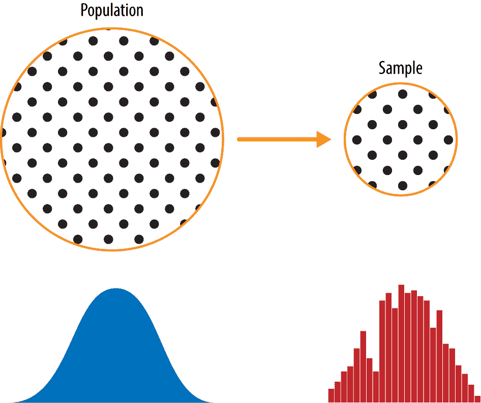

###### 图 2-1 总体与样本

# 随机抽样和样本偏差

*样本*是从较大数据集中取出的一部分数据；统计学家称这个较大的数据集为*总体*。在统计学中，总体与生物学中的概念不同——它是一个大的、定义明确（但有时是理论的或想象的）的数据集。

*随机抽样*是一个过程，其中总体中每个可用成员在每次抽样中被选中的机会都是相等的。结果得到的样本称为*简单随机样本*。抽样可以*有放回*进行，即在每次抽样后将观察结果放回总体，以便可能在未来再次选择。或者可以*无放回*进行，此时一旦选择了观察结果，它们就不再可用于未来的抽样。

在基于样本进行估计或建模时，数据质量通常比数据量更重要。数据质量在数据科学中涉及数据点的完整性、格式的一致性、数据的清洁度和准确性。统计学则增加了*代表性*的概念。

经典例子是 1936 年的*文学文摘*民意测验，预测阿尔夫·兰登将战胜富兰克林·罗斯福。当时的主要期刊*文学文摘*对其所有订阅者以及额外的个人名单进行了民意调查，总计超过 1000 万人，并预测兰登将大获全胜。盖洛普民意调查创始人乔治·盖洛普每两周对仅 2000 人进行调查，并准确预测了罗斯福的胜利。差异在于被调查者的选择。

*文学文摘*选择了数量，几乎没有关注选择方法。他们最终对具有相对较高社会经济地位的人群进行了调查（他们自己的订阅者，加上那些由于拥有电话和汽车等奢侈品而出现在市场营销名单中的人）。结果产生了*样本偏差*；即样本在某些有意义且非随机方式上与其所代表的更大人口不同。术语*非随机*很重要——几乎没有一个样本，包括随机样本，在精确代表整体人口方面都是完全代表性的。样本偏差发生在差异有意义时，并且预计在以与第一个样本相同方式抽取的其他样本中将继续存在。

# 自我选择抽样偏见

在像 Yelp 这样的社交媒体网站上读到的餐厅、酒店、咖啡馆等的评论往往带有偏见，因为提交评论的人并非随机选取，而是自愿撰写评论。这导致了自我选择偏见——那些有动力撰写评论的人可能有不好的经历，可能与该机构有关联，或者可能只是与不撰写评论的人群不同类型的人。需要注意的是，虽然自我选择样本可能不可靠地反映真实情况，但在简单比较一个机构与类似机构时可能更可靠；同样的自我选择偏见可能适用于每个样本。

## 偏差

统计偏差是指由测量或抽样过程中产生的系统性测量或抽样误差。重要的区别应该在于由随机机会引起的错误与由偏差引起的错误。考虑一支枪射击目标的物理过程。它不会每次都精确命中目标的中心，甚至几乎不会。一个无偏的过程会产生误差，但是这些误差是随机的，并且不会明显偏向任何方向（见图 2-2）。在图 2-3 中展示的结果显示了一个有偏的过程——在 x 和 y 方向上仍然存在随机误差，但也存在偏差。子弹倾向于落在右上象限。

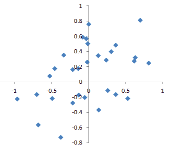

###### 图 2-2\. 有真实瞄准的枪击散点图

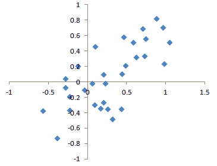

###### 图 2-3\. 有偏瞄准的枪击散点图

偏差有不同的形式，可以是可观察的，也可以是看不见的。当结果确实表明偏差时（例如，通过参考基准或实际值），这通常表明统计模型或机器学习模型被错误规定，或者遗漏了重要变量。

## 随机选择

为了避免样本偏差问题，这也导致*文摘*预测兰登胜过罗斯福，乔治·盖洛普（如图 2-4 所示）选择了更科学的方法来实现代表美国选民的样本。现在有各种方法来实现代表性，但所有方法的核心都是*随机抽样*。


###### 图 2-4\. 乔治·盖洛普，通过*文摘*的“大数据”失败而声名鹊起

随机抽样并不总是容易。正确定义可访问人口是关键。假设我们想生成客户的代表性概况，我们需要进行一项试点客户调查。这项调查需要具有代表性，但工作量很大。

首先，我们需要定义谁是客户。我们可能选择所有购买金额大于 0 的客户记录。我们是否包括所有过去的客户？是否包括退款？内部测试购买？经销商？无论是结算代理还是客户？

接下来，我们需要指定抽样程序。可以是“随机选择 100 名客户”。如果涉及从流量中抽样（例如实时客户交易或网页访问者），时间考虑可能很重要（例如工作日上午 10 点的网页访问者可能与周末晚上 10 点的网页访问者有所不同）。

在*分层抽样*中，将人口分成*分层*，并从每个分层中进行随机抽样。政治民意调查员可能希望了解白人、黑人和西班牙裔的选举偏好。从总体中进行简单随机抽样可能会产生过少的黑人和西班牙裔样本，因此在分层抽样中，这些分层可以加权，以获得等效的样本量。

## 规模与质量：什么时候规模重要？

在大数据时代，有时候较小的数据量更好。花在随机抽样上的时间和精力不仅可以减少偏差，还可以更多地关注数据探索和数据质量。例如，缺失数据和异常值可能包含有用的信息。追踪数百万条记录中的缺失值或评估异常值可能成本过高，但在数千条记录的样本中进行这样的操作可能是可行的。数据绘图和手动检查在数据量过大时会拖累工作进度。

当需要大量数据时*呢*？

大数据的价值经典场景是当数据不仅大而且稀疏时。考虑到谷歌收到的搜索查询，其中列是术语，行是单个搜索查询，单元格的值要么是 0，要么是 1，这取决于查询是否包含术语。目标是确定给定查询的最佳预测搜索目的地。英语语言中有超过 15 万个词汇，谷歌每年处理超过一万亿次查询。这产生了一个巨大的矩阵，其中绝大多数条目都是“0”。

这是一个真正的大数据问题——只有当积累了如此庞大的数据量时，才能为大多数查询返回有效的搜索结果。而且数据积累得越多，结果就越好。对于热门搜索词来说，这并不是问题——针对某个特定时间流行的几个极为热门主题，可以相对快速地找到有效数据。现代搜索技术的真正价值在于能够为各种各样的搜索查询返回详细和有用的结果，包括那些频率可能只有百万分之一的查询。

请考虑搜索短语“瑞奇·里卡多和小红帽”。在互联网早期，这个查询可能会返回有关乐队领队瑞奇·里卡多以及他出现的电视节目*I Love Lucy*和儿童故事*小红帽*的结果。这两个单独的项目可能有很多搜索引用，但组合查询的结果可能非常少。现在，随着积累了数万亿个搜索查询，这个搜索查询返回的是确切的*I Love Lucy*集，其中瑞奇用戏剧化的方式向他的婴儿儿子讲述*小红帽*的故事，混合了英语和西班牙语。

请记住，实际*相关*记录的数量可能只需数千个就足够有效。然而，需要数万亿的数据点来获取这些相关记录（当然，随机抽样是无助的）。另请参见“长尾分布”。

## 样本均值与总体均值

符号 <math alttext="x overbar"><mover accent="true"><mi>x</mi> <mo>¯</mo></mover></math>（发音为“x-bar”）用于表示来自总体的样本的均值，而 <math alttext="mu"><mi>μ</mi></math> 用于表示总体的均值。为什么要区分？关于样本的信息是观察到的，而关于大群体的信息通常是从较小的样本中推断出来的。统计学家喜欢在符号中保持这两者的区分。

## 进一步阅读

+   在 Ronald Fricker 的章节“在线调查的抽样方法”中，《The SAGE Handbook of Online Research Methods》第 2 版，由 Nigel G. Fielding、Raymond M. Lee 和 Grant Blank 编辑（SAGE Publications，2016）中可以找到有关抽样程序的有用审查。这一章节包括通常基于成本或可行性原因而使用的随机抽样修改的审查。

+   *文学文摘*投票失败的故事可以在[Capital Century website](https://oreil.ly/iSoQT)找到。

# 选择偏差

引用约基·贝拉的话：如果你不知道在找什么，那就努力找，你会找到的。

选择偏差是指有意或无意地选择数据的做法，以导致误导性或短暂的结论。

如果你提出一个假设并进行设计良好的实验来测试它，你可以对结论有很高的信心。然而，情况往往并非如此。通常，人们会查看现有数据并尝试识别模式。但这些模式是真实的吗？还是它们只是*数据窥探*的产物——即在数据中进行广泛搜索，直到发现有趣的东西？统计学家有一句话说：“如果你折磨数据足够长时间，迟早它会招供。”

当你使用实验验证假设时，你可以发现一种现象，与通过浏览现有数据发现的现象有所不同，这可以通过以下思想实验来阐明。

想象一下，有人告诉你他们可以抛硬币，使其在接下来的 10 次抛掷中都能正面朝上。你对此提出质疑（相当于一个实验），他们继续抛掷硬币 10 次，所有抛掷都正面朝上。显然，你会认为这个人有些特殊的天赋——10 次硬币抛掷都正面朝上的概率仅为 1/1,000。

现在想象一下，体育场的播音员要求出席的 20,000 人每人抛硬币 10 次，并在抛出 10 次正面时向礼官报告。在体育场中，*某人*得到 10 次正面的机会非常高（超过 99%——这是没有人得到 10 次正面的概率）。显然，事后选择体育场中得到 10 次正面的人（或人们）并不表示他们有任何特殊的天赋——这很可能是运气。

由于反复审查大数据集是数据科学的一个重要价值主张，选择偏差是一个需要担心的问题。数据科学家特别关注的一种选择偏差形式是约翰·埃尔德（Elder Research 创始人，一家著名的数据挖掘咨询公司）所称的*vast search effect*。如果你反复运行不同的模型并使用大数据集提出不同的问题，你必定会找到一些有趣的东西。但你找到的结果是否真的有趣，还是偶然的离群值？

我们可以通过使用一个保留集，有时甚至多个保留集，来验证性能。埃尔德还提倡使用他所称的*目标洗牌*（本质上是一种排列检验）来测试数据挖掘模型暗示的预测关联的有效性。

统计学中典型的选择偏差形式，除了广泛的搜索效应外，还包括非随机抽样（见“随机抽样和样本偏差”）、挑选数据、选择强调特定统计效应的时间间隔以及在结果看起来“有趣”时停止实验。

## 回归到平均

*回归到平均*是指在给定变量上连续测量的现象：极端观察往往会被更加中心的观察所跟随。对极端值给予特殊关注和意义可能导致一种形式的选择偏差。

体育迷熟悉“年度最佳新秀，第二年低迷”现象。在一个赛季开始职业生涯的运动员中（新秀班），总会有一个表现比其他所有人都好的。一般来说，这个“年度最佳新秀”在他的第二年表现不会那么好。为什么呢？

几乎所有主要的体育运动，至少那些使用球或冰球的运动，都有两个因素影响整体表现：

+   技巧

+   运气

回归到平均是特定形式选择偏差的结果。当我们选择表现最好的新秀时，技巧和好运可能都起到了作用。在他的下个赛季，技巧仍将存在，但很多时候好运不会再出现，所以他的表现会下降——即会回归。这种现象最早由弗朗西斯·高尔顿在 1886 年首次发现[[高尔顿-1886]](bibliography01.xhtml#Galton-1886)，他在与遗传倾向的关联中写到了它；例如，极端高个子男子的子女往往不会像他们的父亲那样高（见图 2-5）。

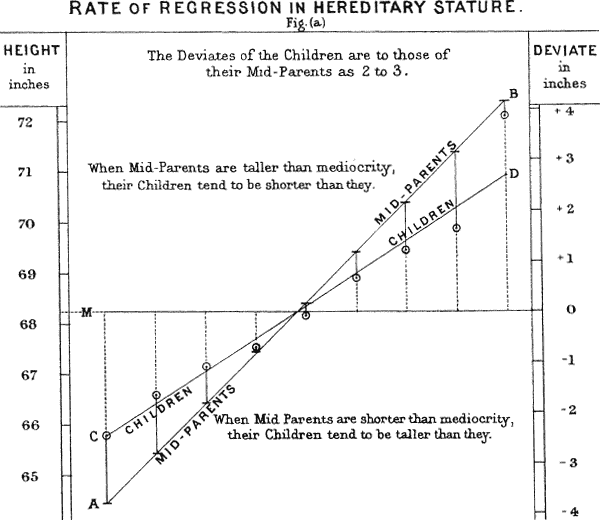

###### 图 2-5\. 高尔顿的研究发现了回归到平均现象。

###### 警告

回归到平均，意思是“回到原点”，与统计建模方法线性回归是不同的，线性回归是估计预测变量与结果变量之间的线性关系。

## 进一步阅读

+   克里斯托弗·J·帕努奇和埃德温·G·威尔金斯在（令人惊讶的不是统计学期刊）*整形外科*（2010 年 8 月）中的文章“识别和避免研究中的偏差”对可以进入研究的各种类型的偏差进行了优秀的回顾，包括选择偏差。

+   迈克尔·哈里斯的文章[“被随机性愚弄：通过选择偏差”](https://oreil.ly/v_Q0u)提供了对股市交易方案中选择偏差考虑的有趣回顾，从交易者的角度。

# 统计量的抽样分布

统计学术语中，一个统计量的*抽样分布*指的是同一总体中许多样本统计量的分布。经典统计学很大一部分关注于从（小）样本推断出（非常大）总体。

通常，样本是为了测量某些东西（使用*样本统计量*）或者建模某些东西（使用统计或机器学习模型）而抽取的。由于我们的估计或模型是基于样本的，所以可能存在误差；如果我们抽取不同的样本，可能会有所不同。因此，我们对可能存在的不同情况感兴趣—一个关键问题是*抽样变异性*。如果我们有大量数据，我们可以抽取额外的样本并直接观察样本统计量的分布。通常，我们将使用尽可能多的容易获取的数据来计算我们的估计或模型，因此从总体中抽取额外样本的选择并不容易。

###### 警告

重要的是要区分个别数据点的分布，称为*数据分布*，和样本统计量的分布，称为*抽样分布*。

样本统计量如均值的分布可能比数据本身的分布更加规则和钟形。统计量基于的样本越大，这种情况就越明显。此外，样本越大，样本统计量的分布就越窄。

这在一个使用 LendingClub 的贷款申请人年收入的例子中进行了说明（见“一个小例子：预测贷款违约”中对数据的描述）。从这些数据中取三个样本：1,000 个值的样本，5 个值均值的 1,000 个样本，以及 20 个值均值的 1,000 个样本。然后绘制每个样本的直方图，生成图 2-6。

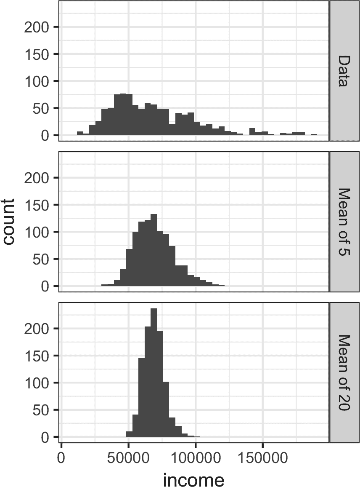

###### 图 2-6\. 1,000 名贷款申请人年收入的直方图（顶部），然后 5 个申请人的 1,000 个均值（中部），最后是 20 个申请人的 1,000 个均值（底部）

个别数据值的直方图广泛分布且向较高值倾斜，这在收入数据中是可以预期的。5 和 20 的均值直方图越来越紧凑，更呈钟形。以下是用可视化包`ggplot2`生成这些直方图的*R*代码：

```py
library(ggplot2)
# take a simple random sample
samp_data <- data.frame(income=sample(loans_income, 1000),
                        type='data_dist')
# take a sample of means of 5 values
samp_mean_05 <- data.frame(
  income = tapply(sample(loans_income, 1000*5),
                  rep(1:1000, rep(5, 1000)), FUN=mean),
  type = 'mean_of_5')
# take a sample of means of 20 values
samp_mean_20 <- data.frame(
  income = tapply(sample(loans_income, 1000*20),
                  rep(1:1000, rep(20, 1000)), FUN=mean),
  type = 'mean_of_20')
# bind the data.frames and convert type to a factor
income <- rbind(samp_data, samp_mean_05, samp_mean_20)
income$type = factor(income$type,
                     levels=c('data_dist', 'mean_of_5', 'mean_of_20'),
                     labels=c('Data', 'Mean of 5', 'Mean of 20'))
# plot the histograms
ggplot(income, aes(x=income)) +
  geom_histogram(bins=40) +
  facet_grid(type ~ .)
```

*Python*代码使用`seaborn`的`FacetGrid`来显示这三个直方图：

```py
import pandas as pd
import seaborn as sns

sample_data = pd.DataFrame({
    'income': loans_income.sample(1000),
    'type': 'Data',
})
sample_mean_05 = pd.DataFrame({
    'income': [loans_income.sample(5).mean() for _ in range(1000)],
    'type': 'Mean of 5',
})
sample_mean_20 = pd.DataFrame({
    'income': [loans_income.sample(20).mean() for _ in range(1000)],
    'type': 'Mean of 20',
})
results = pd.concat([sample_data, sample_mean_05, sample_mean_20])

g = sns.FacetGrid(results, col='type', col_wrap=1, height=2, aspect=2)
g.map(plt.hist, 'income', range=[0, 200000], bins=40)
g.set_axis_labels('Income', 'Count')
g.set_titles('{col_name}')
```

## 中心极限定理

我们刚才描述的现象被称为*中心极限定理*。它表明，从多个样本中抽取的均值将类似于熟悉的钟形正态曲线（见“正态分布”），即使源总体不服从正态分布，只要样本大小足够大且数据的偏离程度不是太大。中心极限定理允许使用类似 t 分布的正态近似公式来计算推断的抽样分布，例如置信区间和假设检验。

中心极限定理在传统统计学教材中受到广泛关注，因为它是假设检验和置信区间机制的基础，这些机制本身在这些教材中占据了相当大的篇幅。数据科学家应该意识到这一角色；然而，由于正式的假设检验和置信区间在数据科学中的作用不大，而*自助法*（见“自助法”）在任何情况下都可用，因此中心极限定理在数据科学实践中并不如此核心。

## 标准误差

*标准误差*是用于统计量抽样分布中的变异性的单一度量。可以使用基于样本值标准偏差*s*和样本大小*n*的统计量来估计标准误差：

<math display="block"><mrow><mtext>Standard</mtext> <mtext>error</mtext> <mo>=</mo> <mi>S</mi> <mi>E</mi> <mo>=</mo> <mfrac><mi>s</mi> <msqrt><mi>n</mi></msqrt></mfrac></mrow></math>

随着样本大小的增加，标准误差减小，这与图 2-6 中观察到的情况相对应。标准误差与样本大小之间的关系有时被称为*n 的平方根规则*：要将标准误差减少一半，样本大小必须增加四倍。

标准误差公式的有效性源于中心极限定理。实际上，你不需要依赖中心极限定理来理解标准误差。考虑以下测量标准误差的方法：

1.  从总体中收集一些全新的样本。

1.  对于每个新样本，计算统计量（例如平均值）。

1.  计算步骤 2 中计算出的统计量的标准偏差；将其用作标准误差的估计值。

在实践中，收集新样本来估计标准误差通常是不可行的（并且在统计上非常浪费）。幸运的是，事实证明，不必抽取全新样本；相反，可以使用*自助法*重新取样。在现代统计学中，自助法已成为估计标准误差的标准方法。它可用于几乎任何统计量，并不依赖于中心极限定理或其他分布假设。

# 标准差与标准误差

不要混淆标准偏差（用于衡量单个数据点的变异性）与标准误差（用于衡量样本统计量的变异性）。

## 进一步阅读

David Lane 的[在线统计多媒体资源](https://oreil.ly/pe7ra)具有一个有用的模拟，允许您选择一个样本统计量、一个样本大小和迭代次数，并可视化生成的频率分布直方图。

# 自举法

一种简单而有效的估计统计分布或模型参数的方法是从样本本身进行额外抽样，有放回地，然后对每个重新抽样计算统计量或模型。这个过程称为*bootstrap*，并不一定涉及数据或样本统计量正态分布的任何假设。

从概念上讲，你可以将 bootstrap 想象成复制原始样本成千上万次或百万次，这样你就有一个假设的总体，它包含来自原始样本的所有知识（只是更大）。然后，您可以从这个假设的总体中抽样，以估计抽样分布；参见图 2-7。

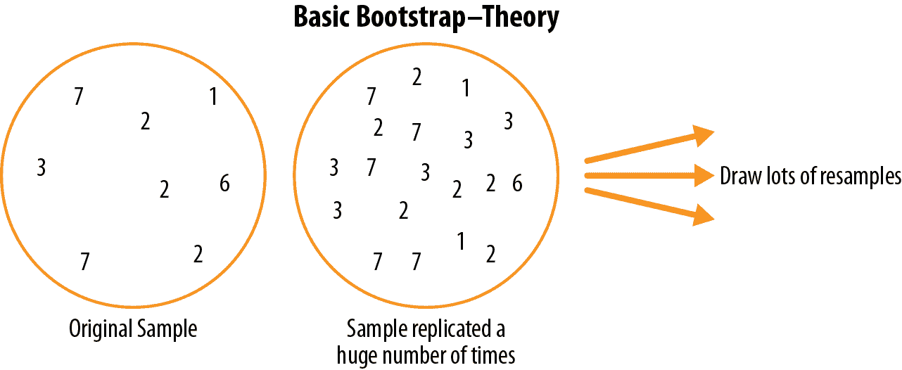

###### 图 2-7。bootstrap 的概念

实际上，并不需要大量复制样本。我们只需在每次抽取后替换每个观察值；也就是说，我们是*有放回地抽样*。通过这种方式，我们有效地创建了一个无限的总体，在这个总体中，从一个抽样到另一个抽样中抽取元素的概率保持不变。对于样本量为*n*的自举重新抽样平均值，算法如下：

1.  抽取一个样本值，记录它，然后替换它。

1.  重复*n*次。

1.  记录*n*个重新抽样值的平均值。

1.  重复步骤 1–3 *R*次。

1.  利用*R*的结果来：

    1.  计算它们的标准差（这估计了样本均值的标准误差）。

    1.  绘制直方图或箱线图。

    1.  寻找置信区间。

*R*，bootstrap 迭代次数，有些是任意设置的。你做的迭代次数越多，标准误差或置信区间的估计就越准确。此过程的结果是一组 bootstrap 样本统计或估计的模型参数，您可以检查它们的变化程度。

*R*包`boot`将这些步骤结合在一个函数中。例如，以下将 bootstrap 应用于贷款人收入的情况：

```py
library(boot)
stat_fun <- function(x, idx) median(x[idx])
boot_obj <- boot(loans_income, R=1000, statistic=stat_fun)
```

函数`stat_fun`计算给定索引`idx`的样本中位数。结果如下：

```py
Bootstrap Statistics :
    original   bias    std. error
t1*    62000 -70.5595    209.1515
```

原始的中位数估计值为$62,000。自举分布表明，估计值存在约为–$70 的*bias*，标准误差为$209。算法连续运行的结果会略有不同。

主要的*Python*包不提供 bootstrap 方法的实现。可以使用`scikit-learn`中的`resample`方法来实现：

```py
results = []
for nrepeat in range(1000):
    sample = resample(loans_income)
    results.append(sample.median())
results = pd.Series(results)
print('Bootstrap Statistics:')
print(f'original: {loans_income.median()}')
print(f'bias: {results.mean() - loans_income.median()}')
print(f'std. error: {results.std()}')
```

引导式自举可用于多变量数据，其中行作为单位进行抽样（见图 2-8）。例如，可以在引导样本数据上运行模型，以估计模型参数的稳定性（变异性），或者提高预测能力。对于分类和回归树（也称为*决策树*），在引导样本上运行多棵树，然后对它们的预测进行平均（或者在分类中进行多数投票），通常比使用单棵树效果更好。这个过程称为*装袋*（缩写为“引导聚合”；见“装袋和随机森林”）。

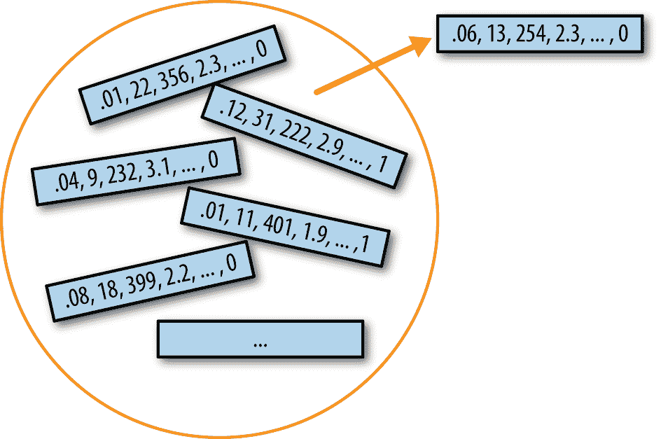

###### 图 2-8\. 多变量引导式抽样

引导式自举的重复重抽样在概念上很简单，经济学家兼人口统计学家朱利安·西蒙（Julian Simon）在他 1969 年的文本《社会科学基础研究方法》（Random House）中发表了包括引导式自举在内的多种重抽样实例汇编。然而，它在计算上是非常密集的，而在广泛可用计算能力之前并不可行。该技术因斯坦福统计学家布拉德利·埃弗隆在 1970 年代末至 1980 年代初的几篇期刊文章和一本书的出版而得名并流行起来。它特别受到那些使用统计学但不是统计学家的研究人员欢迎，适用于数学近似不容易得到的指标或模型。均值的抽样分布自 1908 年已得到很好的建立；许多其他指标的抽样分布并未。引导式自举可以用于样本量的确定；尝试不同的*n*值以查看抽样分布如何受影响。

当引导式自举首次提出时，它遭遇了相当多的怀疑；对许多人来说，它具有从稻草中纺出金的神奇色彩。这种怀疑源于对引导式自举目的的误解。

###### 警告

引导式自举不能补偿样本量不足；它不会创建新数据，也不会填补现有数据集中的空缺。它仅仅告诉我们，当从类似于我们原始样本的总体中抽取大量额外样本时，它们会如何行为。

## 重抽样与引导式自举

有时术语*重抽样*与*引导式自举*可以作为同义词使用，正如刚才所概述的。更多情况下，*重抽样*还包括置换程序（见“置换检验”），其中多个样本被合并，并且抽样可以无替换地进行。无论如何，术语*引导式自举*总是指从观察数据集中有替换地抽样。

## 进一步阅读

+   *引导式自举法*，由布拉德利·埃弗隆（Bradley Efron）和罗伯特·蒂布什拉尼（Robert Tibshirani）合著（查普曼与霍尔出版社，1993 年），是第一本有关引导式自举法的书籍。至今仍广受欢迎。

+   《统计科学》（第 18 卷，第 2 期）2003 年 5 月份关于 Bootstrap 的回顾（在彼得·霍尔的“Bootstrap 的简短前史”中讨论了其他先例，朱利安·西蒙于 1969 年首次发表了 Bootstrap 的初始论文）。

+   参见《统计学习导论》（Springer，2013）由加雷斯·詹姆斯、丹妮拉·威特、特雷弗·哈斯蒂和罗伯特·蒂布沙尼编写，关于 Bootstrap 和尤其是装袋的章节。

# 置信区间

频率表、直方图、箱线图和标准误差都是了解样本估计误差潜在误差的方式。置信区间是另一种方式。

人类天生对不确定性有抵触情绪；人们（尤其是专家）很少说“我不知道”。分析师和经理在承认不确定性的同时，当将估计呈现为单一数字（*点估计*）时，仍然过度信任估计。将估计呈现为一个范围而不是单一数字是抵消这种倾向的一种方式。置信区间以一种根植于统计抽样原理的方式来做到这一点。

置信区间始终带有一个覆盖水平，以百分比（高）表示，例如 90%或 95%。将 90%置信区间视为以下方式之一：它是包围样本统计的自助抽样分布的中心 90%的区间（参见“Bootstrap”）。更一般地，样本估计周围的*x*%置信区间应该在平均情况下，包含相似的样本估计*x*%的时间（当遵循类似的抽样过程时）。

给定大小为*n*的样本和感兴趣的样本统计量，Bootstrap 置信区间的算法如下：

1.  从数据中有放回地抽取大小为*n*的随机样本（重新抽样）。

1.  记录所重新抽样的兴趣统计量。

1.  重复步骤 1 至 2 多（*R*）次。

1.  对于*x*%置信区间，从分布的两端修剪[(100-*x*) / 2]%的*R*重新抽样结果。

1.  修剪点是*x*%自助法置信区间的端点。

图 2-9 显示了一个 90%置信区间，用于贷款申请人的年收入均值，基于一个样本，样本容量为 20，均值为$62,231。

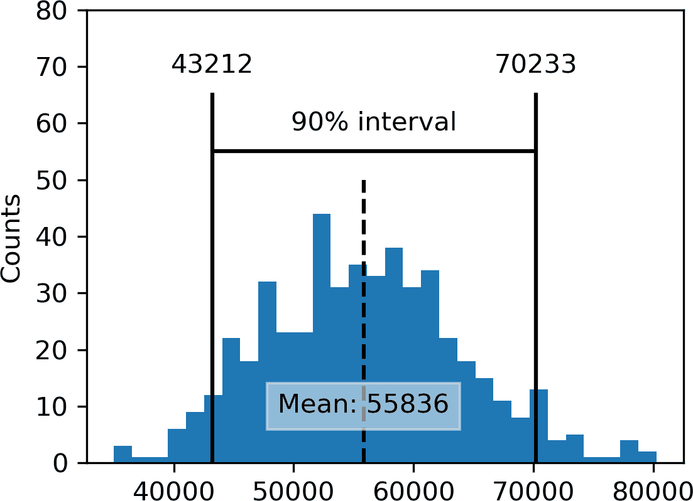

###### 图 2-9\. 基于 20 个样本的贷款申请人年收入的 Bootstrap 置信区间

Bootstrap 是一个通用工具，可用于生成大多数统计数据或模型参数的置信区间。根据半个世纪以上的无计算机统计分析的历史，统计教材和软件还将引用由公式生成的置信区间，特别是 t 分布（参见“学生 t 分布”）。

###### 注意

当然，当我们有样本结果时，我们真正感兴趣的是，“真实值位于某个区间的概率是多少？”这实际上并不是置信区间回答的问题，但却是大多数人解释答案的方式。

与置信区间相关的概率问题始于短语“给定抽样程序和人口，什么是……的概率？”要反过来，“给定样本结果，什么是（人群的真实情况）的概率？”涉及到更复杂的计算和更深层次的难题。

与置信区间相关联的百分比被称为*置信水平*。置信水平越高，区间越宽。此外，样本越小，区间越宽（即不确定性越大）。这两者都是有道理的：你希望越有信心，而且数据越少，你必须使置信区间足够宽以确保捕捉真实值。

###### 注意

对于数据科学家而言，置信区间是一个工具，用于了解样本结果可能的变异程度。数据科学家会利用这些信息，不是为了发表学术论文或向监管机构提交结果（像研究员可能会做的那样），而更有可能是为了传达估计误差的潜在风险，并且也许了解是否需要更大的样本。

## 进一步阅读

+   有关置信区间的自举方法，请参见*Introductory Statistics and Analytics: A Resampling Perspective*（Peter Bruce 著，Wiley，2014）或*Statistics: Unlocking the Power of Data*，第 2 版，由 Robin Lock 及其四位家庭成员（Wiley，2016）撰写。

+   工程师需要了解其测量精度的需求，或许比大多数学科更多地使用置信区间，*Modern Engineering Statistics*（Thomas Ryan 著，Wiley，2007）讨论了置信区间。它还审视了一种同样有用但受到较少关注的工具：*预测区间*（围绕单个值的区间，与平均值或其他摘要统计不同）。

# 正态分布

传统统计学中标志性的钟形正态分布。^(1) 样本统计量的分布通常呈正态分布的事实使其成为开发数学公式以近似这些分布的强大工具。

在正态分布中（图 2-10），数据的 68%位于平均值的一个标准偏差范围内，95%位于两个标准偏差范围内。

###### 警告

通常存在一个误解，即正态分布之所以叫正态分布，是因为大多数数据都遵循正态分布——即它是正常的。大多数在典型数据科学项目中使用的变量——事实上，大部分原始数据——*并不是*正态分布的：参见“长尾分布”。正态分布的实用性源于许多统计量在其抽样分布中*是*正态分布的。即便如此，正态性假设通常是最后的手段，当没有经验概率分布或自助抽样分布时才使用。

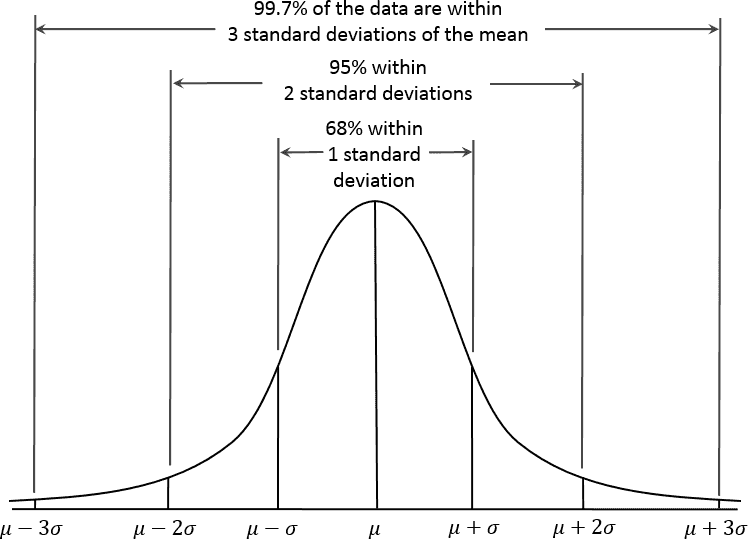

###### 图 2-10\. 正态曲线

###### 注意

正态分布也称为*高斯*分布，以 18 世纪末至 19 世纪初的杰出德国数学家卡尔·弗里德里希·高斯（Carl Friedrich Gauss）的名字命名。正态分布以前的另一个名称是“误差”分布。从统计学角度看，*误差*是实际值与样本均值等统计估计值之间的差异。例如，标准差（参见“变异性估计”）基于数据均值的误差。高斯对正态分布的研究源于他对天文测量误差的研究，这些误差被发现是正态分布的。

## 标准正态分布和 QQ 图

一个*标准正态*分布是指 x 轴上的单位以标准差表示离均值的距离。要将数据与标准正态分布进行比较，您需要减去均值，然后除以标准差；这也称为*归一化*或*标准化*（参见“标准化（归一化，z 分数）”）。请注意，这里的“标准化”与数据库记录标准化（转换为通用格式）无关。变换后的值称为*z 分数*，正态分布有时也称为*z 分布*。

*QQ 图*用于直观地确定样本与指定分布（在本例中是正态分布）有多接近。QQ 图将*z*分数按从低到高的顺序排列，并在 y 轴上绘制每个值的*z*分数；x 轴是该值排名对应的正态分布的分位数。由于数据已经标准化，单位对应于离均值的标准差数目。如果点大致落在对角线上，那么样本分布可以视为接近正态分布。图 2-11 显示了从正态分布中随机生成的 100 个值的 QQ 图；如预期的，点紧密跟随直线。可以使用*R*中的`qqnorm`函数生成此图：

```py
norm_samp <- rnorm(100)
qqnorm(norm_samp)
abline(a=0, b=1, col='grey')
```

在*Python*中，使用方法`scipy.stats.probplot`来创建 QQ 图：

```py
fig, ax = plt.subplots(figsize=(4, 4))
norm_sample = stats.norm.rvs(size=100)
stats.probplot(norm_sample, plot=ax)
```

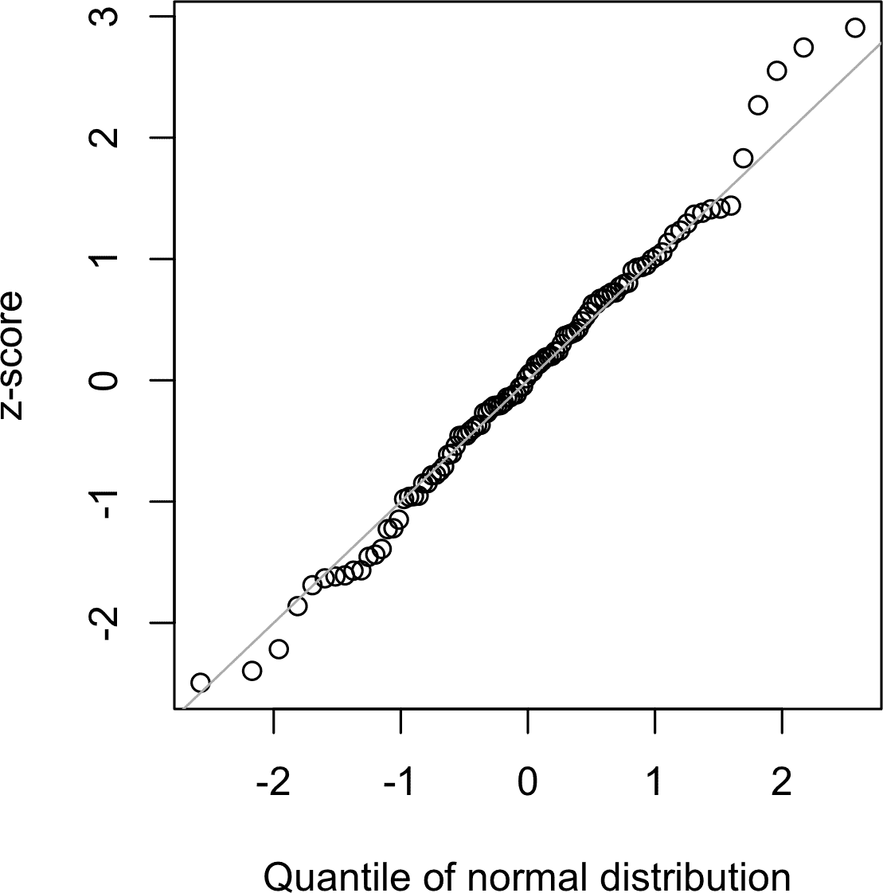

###### 图 2-11\. QQ 图，显示从标准正态分布中抽取的 100 个样本的样本

###### 警告

将数据转换为*z*-分数（即标准化或归一化数据）并不会使数据呈正态分布。它只是将数据放置在与标准正态分布相同的比例上，通常用于比较目的。

# 长尾分布

尽管正态分布在统计学上具有重要历史意义，并与名称所暗示的相反，数据通常不服从正态分布。

尽管正态分布通常适用且有用于误差分布和样本统计数据的分布，但它通常不描述原始数据的分布。有时，分布是高度*偏斜*的（不对称的），例如收入数据；或者分布可以是离散的，例如二项数据。对称和非对称的分布可能都有*长尾*。分布的尾部对应于极端值（小和大）。长尾及其防范在实际工作中广为认可。纳西姆·塔勒布提出了*黑天鹅*理论，预测异常事件，如股市崩盘，比正态分布预测的更有可能发生。

说明数据长尾特性的一个很好的例子是股票收益。图 2-12 显示了 Netflix（NFLX）每日股票收益的 QQ 图。这是通过 *R* 生成的：

```py
nflx <- sp500_px[,'NFLX']
nflx <- diff(log(nflx[nflx>0]))
qqnorm(nflx)
abline(a=0, b=1, col='grey')
```

相应的 *Python* 代码是：

```py
nflx = sp500_px.NFLX
nflx = np.diff(np.log(nflx[nflx>0]))
fig, ax = plt.subplots(figsize=(4, 4))
stats.probplot(nflx, plot=ax)
```

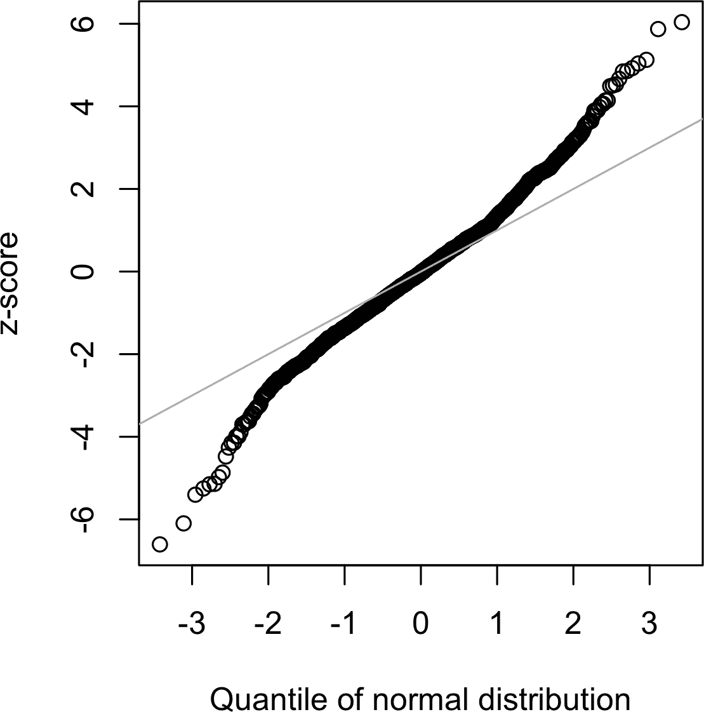

###### 图 2-12\. Netflix（NFLX）的收益的 QQ 图

与图 2-11 相比，低值的点远低于线，高值的点远高于线，表明数据不服从正态分布。这意味着我们更有可能观察到极端值，而不是数据具有正态分布时所预期的。图 2-12 显示了另一个常见现象：在距离均值一个标准差内的数据点接近线。Tukey 将此现象称为数据在中间部分“正常”，但尾部较长（见[[Tukey-1987]](bibliography01.xhtml#Tukey-1987)）。

###### 注意

关于将统计分布拟合到观察数据的任务，有大量的统计文献。要警惕对这项工作过于依赖数据的方法，这既是艺术也是科学。数据是变量，通常表面上看，可以符合多种形状和类型的分布。通常情况下，必须运用领域和统计知识来确定适合模拟给定情况的分布类型。例如，我们可能有关于服务器在许多连续五秒时间段内的互联网流量水平的数据。了解到“每个时间段事件”的最佳分布是泊松分布（见“泊松分布”）是有用的。

## 进一步阅读

+   *黑天鹅*，纳西姆·尼古拉斯·塔勒布著（Random House，2010 年）

+   *统计分布及其应用手册*，K. Krishnamoorthy 著（Chapman & Hall/CRC Press，2016 年）

# 学生 t-分布

*t-分布*是一个形状类似正态分布的分布，不过在尾部略微厚一些且更长。它被广泛用于描述样本统计量的分布。样本均值的分布通常呈现出 t-分布的形状，并且根据样本大小的不同有一系列不同的 t-分布。样本越大，t-分布就越接近正态分布。

t-分布通常被称为*学生 t*，因为它是由 W. S. 戈塞特于 1908 年在《生物统计学》上以“学生”名义发表的。戈塞特的雇主，吉尼斯啤酒厂，不希望竞争对手知道它正在使用统计方法，因此坚持要求戈塞特不在文章上使用自己的名字。

戈塞特想要回答的问题是“从一个更大的人口中抽取样本的均值的抽样分布是什么？”他首先进行了一项重采样实验——从一个包含 3000 个罪犯身高和左中指长度测量值的数据集中随机抽取了 4 个样本。（在这个时代，有很多关于罪犯数据的兴趣，以及发现犯罪倾向与生理或心理属性之间的相关性。）戈塞特将标准化的结果（*z*-分数）绘制在 x 轴上，频率绘制在 y 轴上。此外，他还推导出一个函数，现在被称为*学生 t*，并将这个函数拟合到样本结果上，绘制出比较（见图 2-13）。

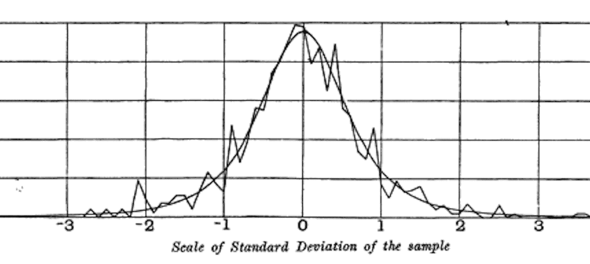

###### 图 2-13。戈塞特的重采样实验结果和拟合的 t-曲线（来自他 1908 年的《生物统计学》论文）

在考虑到抽样变异性后，可以将多种不同的统计量标准化到 t-分布上，以估计置信区间。考虑一个样本大小为*n*的样本，已计算出样本均值<math alttext="x overbar"><mover accent="true"><mi>x</mi> <mo>¯</mo></mover></math>。如果*s*是样本标准偏差，那么样本均值周围的 90%置信区间为：

<math alttext="x overbar plus-or-minus t Subscript n minus 1 Baseline left-parenthesis 0.05 right-parenthesis dot StartFraction s Over StartRoot n EndRoot EndFraction" display="block"><mrow><mover accent="true"><mi>x</mi> <mo>¯</mo></mover> <mo>±</mo> <msub><mi>t</mi> <mrow><mi>n</mi><mo>-</mo><mn>1</mn></mrow></msub> <mrow><mo>(</mo> <mn>0</mn> <mo>.</mo> <mn>05</mn> <mo>)</mo></mrow> <mo>·</mo> <mfrac><mi>s</mi> <msqrt><mi>n</mi></msqrt></mfrac></mrow></math>

其中<math alttext="t Subscript n minus 1 Baseline left-parenthesis .05 right-parenthesis"><mrow><msub><mi>t</mi> <mrow><mi>n</mi><mo>-</mo><mn>1</mn></mrow></msub> <mrow><mo>(</mo> <mo>.</mo> <mn>05</mn> <mo>)</mo></mrow></mrow></math>是 t-统计量的值，具有(*n* – 1)个自由度（见“自由度”），在 t-分布的两端“截取”了 5%。t-分布已被用作样本均值、两个样本均值之间的差异、回归参数和其他统计量的分布的参考。

如果 1908 年计算能力普遍存在，统计学无疑会更多地依赖计算密集型的重新采样方法。由于缺乏计算机，统计学家转向数学和函数，如 t-分布，来近似抽样分布。计算机能力使得在 1980 年代实现了实际的重新采样实验，但到那时，t-分布和类似分布的使用已经深入嵌入教科书和软件中。

t-分布准确地描述样本统计量的行为需要该样本统计量的分布形状类似于正态分布。事实证明，样本统计量通常是正态分布的，即使底层总体数据不是（这一事实导致广泛应用 t-分布）。这使我们回到了众所周知的*中心极限定理*现象（参见 “中心极限定理”）。

###### 注意

数据科学家需要了解 t-分布和中心极限定理吗？其实并不需要太多。t-分布用于经典统计推断，但并不是数据科学目的的核心。理解和量化不确定性和变化对数据科学家非常重要，但经验性的自助法抽样可以回答大多数有关抽样误差的问题。然而，数据科学家经常会在统计软件和*R*中的输出中遇到 t-统计量—例如，在 A/B 测试和回归中—因此熟悉其用途是有帮助的。

## 进一步阅读

+   原始的 W.S. Gosset 论文于 1908 年发表在 *Biometrika* 上，可作为[PDF](https://oreil.ly/J6gDg)获得。

+   关于 t-分布的标准处理可以在 David Lane 的[在线资源](https://oreil.ly/QxUkA)中找到。

# 二项分布

是/否（二项）结果是分析的核心，因为它们常常是决策或其他过程的最终结果；买/不买，点击/不点击，存活/死亡等。理解二项分布的核心是一组*试验*的概念，每个试验都有两种可能的结果和明确的概率。

例如，抛硬币 10 次是一个二项实验，共有 10 次试验，每次试验有两种可能的结果（正面或反面）；见 图 2-14。此类是*二元*结果，无需具有 50/50 的概率。任何总和为 1.0 的概率都是可能的。在统计学中，将“1”结果称为*成功*结果是传统做法；同时，也普遍将“1”分配给更为罕见的结果。使用术语*成功*并不意味着结果是理想的或有益的，但确实表明了感兴趣的结果。例如，贷款违约或欺诈交易是相对不常见的事件，我们可能对其进行预测，因此它们被称为“1s”或“成功”。


###### 图 2-14。美国五分镍的反面

二项分布是在给定试验次数(*n*)中的成功次数(*x*)的频率分布，每次试验中成功的指定概率(*p*)。有一系列的二项分布，取决于*n*和*p*的值。二项分布可以回答如下问题：

> 如果点击转化为销售的概率为 0.02，观察到 200 次点击中没有销售的概率是多少？

函数*R* `dbinom` 计算二项概率。例如：

```py
dbinom(x=2, size=5, p=0.1)
```

将返回 0.0729，即在*size*=5 次试验中观察到*x*=2 次成功的概率，每次试验成功的概率为*p*=0.1。对于上述示例，我们使用*x*=0，*size*=200，*p*=0.02。使用这些参数，`dbinom`返回概率为 0.0176。

我们经常有兴趣确定在*n*次试验中观察到*x*或更少成功的概率。在这种情况下，我们使用函数`pbinom`：

```py
pbinom(2, 5, 0.1)
```

这将返回 0.9914，即在五次试验中观察到两次或更少成功的概率，每次试验成功的概率为 0.1。

`scipy.stats`模块实现了大量的统计分布。对于二项分布，可以使用函数`stats.binom.pmf`和`stats.binom.cdf`：

```py
stats.binom.pmf(2, n=5, p=0.1)
stats.binom.cdf(2, n=5, p=0.1)
```

二项分布的均值为<math alttext="n times p"><mrow><mi>n</mi> <mo>×</mo> <mi>p</mi></mrow></math>；你也可以把这看作是*n*次试验中成功的预期数量，成功概率=*p*。

方差为<math alttext="n times p left-parenthesis 1 minus p right-parenthesis"><mrow><mi>n</mi> <mo>×</mo> <mi>p</mi> <mo>(</mo> <mn>1</mn> <mo>-</mo> <mi>p</mi> <mo>)</mo></mrow></math>。当试验次数足够多时（特别是当*p*接近 0.50 时），二项分布几乎与正态分布无法区分。事实上，使用大样本量计算二项概率是计算密集型的，大多数统计过程使用正态分布进行近似，具有均值和方差。

## 进一步阅读

+   阅读有关[“四叶玫瑰”](https://oreil.ly/nmkcs)的介绍，这是一种类似弹球的模拟设备，用于说明二项分布。

+   二项分布是统计学入门的重要内容，所有统计学入门教材都会有一两章讲解它。

# 卡方分布

统计学中的一个重要概念是*偏离期望*，特别是关于类别计数。期望松散地定义为“数据中没有异常或值得注意的事物”（例如，变量之间没有相关性或可预测的模式）。这也称为“零假设”或“零模型”（参见“零假设”）。例如，您可能希望测试一个变量（例如，表示性别的行变量）是否独立于另一个变量（例如，表示“在工作中被提升”的列变量），并且您有数据表单元格中每个计数的计数。衡量结果偏离独立性零期望程度的统计量是卡方统计量。它是观察到的值与预期值之间的差异，除以预期值的平方根，再平方，然后在所有类别上求和。这个过程标准化了统计量，使其可以与参考分布进行比较。更一般地说，卡方统计量是衡量一组观察值“适合”指定分布的程度的指标（“拟合优度检验”）。它对于确定多个处理（“A/B/C...测试”）在其效果上是否不同非常有用。

卡方分布是从零模型中重复重新抽取的数据的统计分布——详见“卡方检验”以获取详细算法，以及数据表的卡方公式。一组计数的低卡方值表明它们与预期分布非常接近。高卡方值表明它们与预期值有显著差异。与不同自由度相关的各种卡方分布存在（例如，观测数——参见“自由度”）。

## 进一步阅读

+   卡尔·皮尔逊和假设检验的诞生让卡方分布在现代统计学中占有重要位置——详细内容请参阅大卫·萨尔斯伯格的《*品茶的女士：统计学如何在二十世纪改变科学*》（W. H. Freeman，2001 年）。

+   欲了解更详细内容，请参阅本书中关于卡方检验的章节（“卡方检验”）。

# F-分布

在科学实验中的常见程序是在多个组中测试多种处理方法——比如在田地的不同区块上使用不同的肥料。这类似于卡方分布中提到的 A/B/C 测试（参见“卡方分布”），但我们处理的是连续测量值而不是计数。在这种情况下，我们关心的是组间均值差异是否超出了正常随机变异的预期。F 统计量衡量了这一点，是组间均值变异性与每个组内变异性（也称为残差变异性）之比。这种比较称为*方差分析*（见“ANOVA”）。F 统计量的分布是所有在空模型中通过随机排列数据时产生的值的频率分布，其中所有组均值相等。与不同自由度相关的多种 F 分布（例如，组数——见“自由度”）存在。F 的计算在 ANOVA 部分有详细说明。F 统计量还用于线性回归中，用于比较回归模型解释的变异与数据整体变异的比例。在回归和 ANOVA 例程中，*R*和*Python*会自动产生 F 统计量。

## 进一步阅读

乔治·科布的《*实验设计与分析导论*》（Wiley，2008）详细阐述了方差分解，有助于理解方差分析（ANOVA）和 F 统计量。

# 泊松及相关分布

许多过程以给定的总体速率随机产生事件——例如访问者访问网站或汽车通过收费站（时间分布的事件）；或者在一平方米布料中的瑕疵或每 100 行代码中的错别字（空间分布的事件）。

## 泊松分布

通过先前的聚合数据（例如，每年的流感感染数），我们可以估计单位时间或空间内事件的平均数（例如每天的感染数或每个人口普查单位的感染数）。我们可能还想知道一个单位的时间/空间与另一个单位相比有多大的不同。泊松分布告诉我们，当我们抽样许多这样的单位时，单位时间或空间内的事件分布。在处理排队问题时很有用，例如“我们需要多少能力才能确保在任何五秒内完全处理到达服务器上的互联网流量的 95%？”

泊松分布中的关键参数是<math alttext="lambda"><mi>λ</mi></math>，即 lambda。这是在指定的时间或空间间隔内发生的事件平均数。泊松分布的方差也是<math alttext="lambda"><mi>λ</mi></math>。

作为排队仿真的一部分，从泊松分布生成随机数是一种常见的技术。*R* 中的`rpois`函数完成这一任务，只需两个参数：所需的随机数数量和 lambda 值：

```py
rpois(100, lambda=2)
```

相应的`scipy`函数是`stats.poisson.rvs`：

```py
stats.poisson.rvs(2, size=100)
```

例如，以下代码将从均值为 2 的泊松分布生成 100 个随机数。例如，如果客户服务电话平均每分钟两次，此代码将模拟 100 分钟，返回这 100 分钟内每分钟的呼叫次数。

## 指数分布

使用与泊松分布中相同的参数 lambda，我们还可以对事件之间的时间分布进行建模：例如网站访问之间的时间或汽车抵达收费站之间的时间。它也用于工程学中的故障时间建模以及过程管理中的模拟，例如每个服务呼叫所需的时间。从指数分布生成随机数的*R*代码需要两个参数：`n`（要生成的数的数量）和`rate`（每个时间段的事件数量）。例如：

```py
rexp(n=100, rate=0.2)
```

在函数`stats.expon.rvs`中，参数的顺序是颠倒的：

```py
stats.expon.rvs(0.2, size=100)
```

该代码将从均值为 0.2 的指数分布生成 100 个随机数。因此，您可以用它来模拟 100 个时间间隔（以分钟为单位），表示服务电话之间的时间间隔，其中平均呼叫率为每分钟 0.2 次。

任何模拟研究中的关键假设，无论是对泊松分布还是指数分布，都是速率 lambda 在考虑的时间段内保持恒定。从全局角度来看，这很少是合理的；例如，道路交通或数据网络的流量会随着一天中的时间和一周中的日期变化。然而，时间段或空间区域通常可以分成足够均匀的片段，以使得在这些时间段内的分析或模拟是有效的。

## 估计故障率

在许多应用中，事件率 <math alttext="lamda"><mi>λ</mi></math> 已知或可以从先前的数据中估算出来。然而，对于罕见的事件，情况可能并非如此。例如，飞机发动机故障是足够罕见的（幸好），对于特定类型的发动机，可能没有足够的数据用于基于故障间隔时间的估计。如果根本没有数据，那么几乎没有依据可以估计事件率。不过，你可以进行一些猜测：如果在 20 小时后没有发生任何事件，那么可以相当肯定速率不是每小时 1 次。通过模拟或直接计算概率，你可以评估不同假设的事件率，并估计在其下的速率很不可能达到的阈值。如果有一些数据但不足以提供精确可靠的速率估计，可以应用拟合度检验（参见“卡方检验”）来评估各种速率与观察数据的拟合程度。

## 威布尔分布

在许多情况下，事件率并不会随时间保持恒定。如果变化的时间段远远长于事件之间的典型间隔，那就没有问题；你只需将分析分成相对恒定的速率的段落，如前所述。然而，如果事件率在时间间隔内发生变化，指数（或泊松）分布就不再有用。在机械故障中很可能会出现这种情况——随着时间的推移，故障风险增加。*威布尔*分布是指数分布的一种扩展，其中允许事件率随时间变化，由*形状参数* <math alttext="beta"><mi>β</mi></math> 指定。如果 <math alttext="beta"><mi>β</mi></math> > 1，则事件发生的概率随时间增加；如果 <math alttext="beta"><mi>β</mi></math> < 1，则概率减少。因为威布尔分布用于失效时间分析而不是事件率，所以第二个参数用特征寿命表示，而不是事件每个间隔的速率。所使用的符号是 <math alttext="eta"><mi>η</mi></math> ，希腊字母 eta。它也称为*比例*参数。

使用威布尔分布，估计任务现在包括估计两个参数，<math alttext="beta"><mi>β</mi></math> 和 <math alttext="eta"><mi>η</mi></math> 。软件用于建模数据并给出最佳拟合威布尔分布的估计。

生成威布尔分布随机数的*R*代码需要三个参数：`n`（要生成的数字的数量）、`shape`和`scale`。例如，以下代码将从形状为 1.5 和特征寿命为 5,000 的威布尔分布中生成 100 个随机数（寿命）：

```py
rweibull(100, 1.5, 5000)
```

要在*Python*中实现相同的功能，可以使用函数`stats.weibull_min.rvs`：

```py
stats.weibull_min.rvs(1.5, scale=5000, size=100)
```

## 进一步阅读

+   *现代工程统计*由 Thomas Ryan（Wiley，2007）撰写，其中有一章专门讨论工程应用中使用的概率分布。

+   在这里阅读关于威布尔分布的工程视角的内容[here](https://oreil.ly/1x-ga)和[here](https://oreil.ly/9bn-U)。

# 总结

在大数据时代，当需要准确估计时，随机抽样原则仍然很重要。数据的随机选择可以减少偏差，并产生比仅使用方便获得的数据更高质量的数据集。了解各种抽样和数据生成分布的知识使我们能够量化由随机变异可能导致的估计误差。与此同时，自助法（从观察到的数据集中带有替换地抽样）是一种吸引人的“一刀切”方法，用于确定样本估计中可能的误差。

^(1) 钟形曲线具有标志性意义，但也许有些被高估了。乔治·W·科布，这位以其对教授统计学初级课程的贡献而闻名的马萨诸塞州圣女大学统计学家，在 2015 年 11 月的《美国统计学家》编辑中辩称，“以正态分布为核心的标准初级课程已经超越了其核心性的有用性。”
