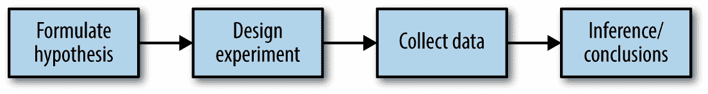
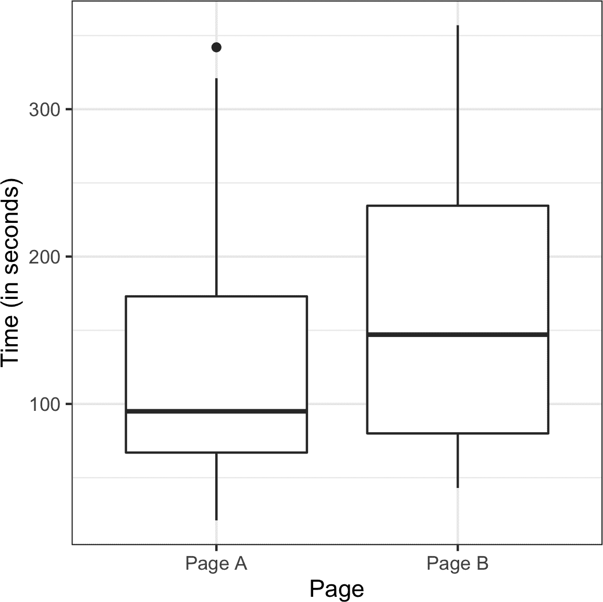
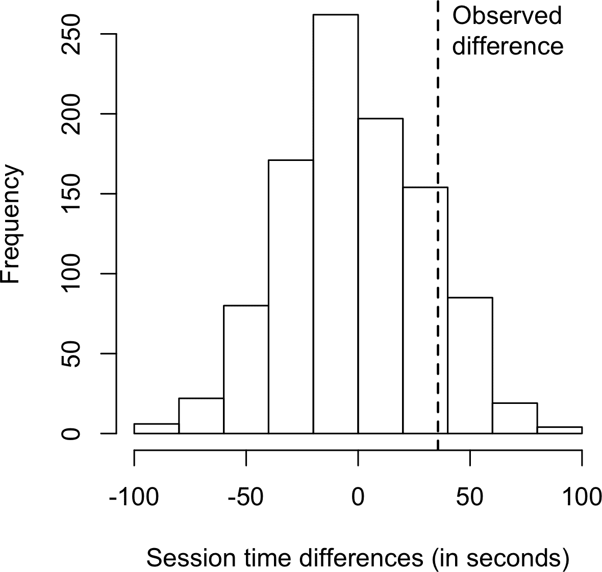
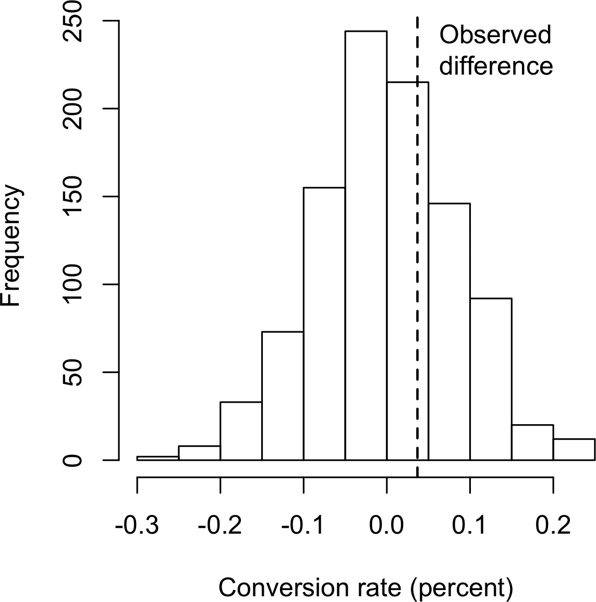
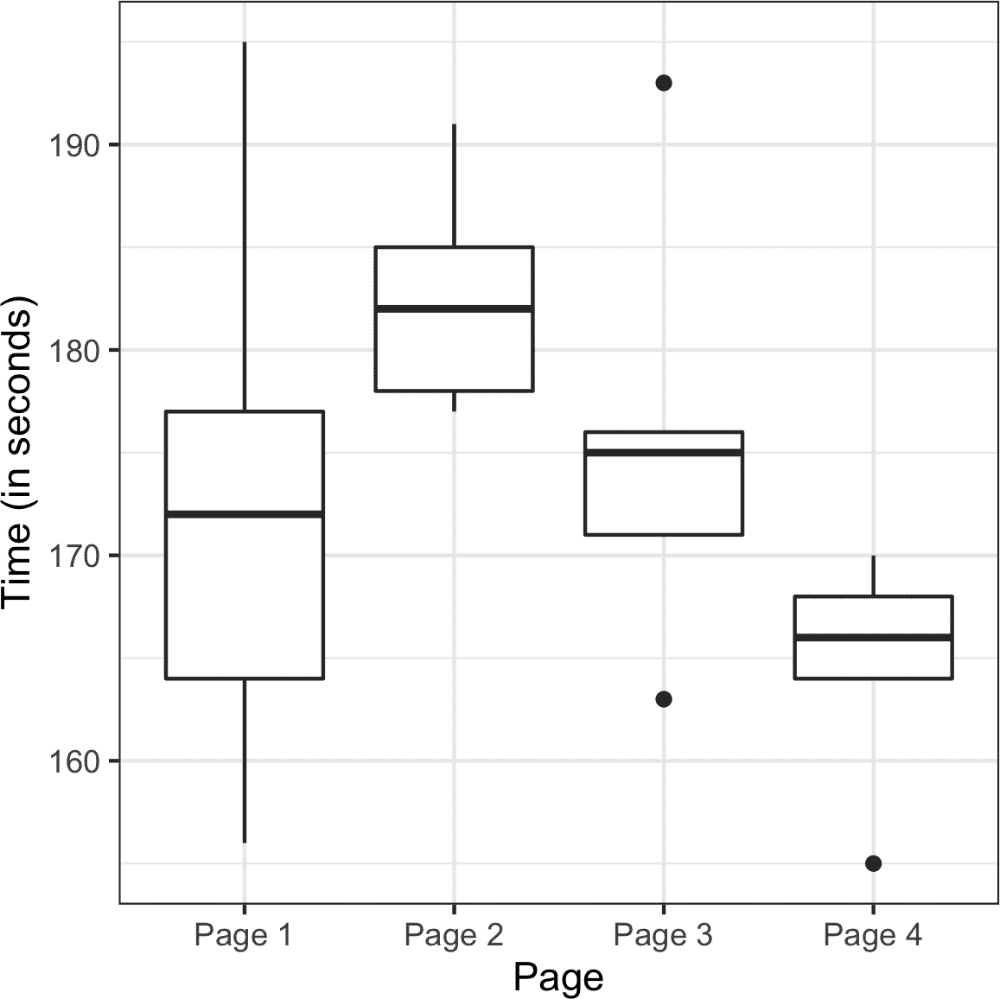
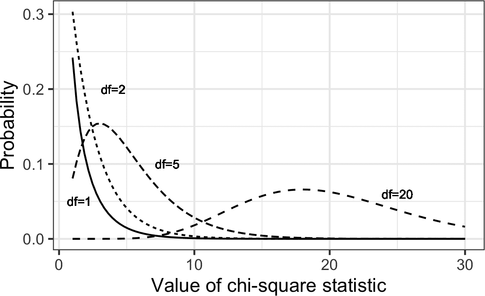

# 第三章\. 统计实验和显著性测试

实验设计是统计实践的基石，几乎在所有研究领域都有应用。目标是设计一个实验来确认或拒绝一个假设。数据科学家经常需要进行连续的实验，特别是关于用户界面和产品营销的方面。本章回顾了传统实验设计，并讨论了数据科学中一些常见挑战。还涵盖了统计推断中一些经常引用的概念，并解释了它们在数据科学中的意义和相关性（或缺乏相关性）。

每当您看到关于统计显著性、t 检验或 p 值的引用时，通常是在经典统计推断“管道”（见图 3-1）的背景下。这个过程从一个假设开始（“药物 A 比现有标准药物更好”，或者“价格 A 比现有价格 B 更有利可图”）。设计一个实验（可能是 A/B 测试）来检验这个假设——希望能够得出确切的结果。收集和分析数据，然后得出结论。术语 *推断* 反映了意图，即将实验结果应用于更大的过程或群体，这涉及到一组有限的数据。



###### 图 3-1\. 经典统计推断流程

# A/B 测试

A/B 测试是一个有两个组的实验，用来确定两种处理、产品、程序或类似物中哪个更优越。通常其中一种处理是标准现有处理，或者没有处理。如果使用了标准（或没有）处理，则称为 *对照组*。一个典型的假设是新处理比对照更好。

A/B 测试在网页设计和营销中很常见，因为结果很容易衡量。一些 A/B 测试的例子包括：

+   测试两种土壤处理方法，以确定哪种产生更好的种子发芽

+   测试两种治疗方法，以确定哪种更有效抑制癌症

+   测试两个价格，以确定哪个产生更多净利润

+   测试两个网络标题，以确定哪一个能产生更多点击（图 3-2）

+   测试两个网络广告，以确定哪个生成更多转化


###### 图 3-2\. 营销人员持续测试一种网页展示与另一种的差异

一个合适的 A/B 测试有 *实验对象* 可以分配到一个或另一个处理组中。实验对象可以是人、植物种子、网站访问者；关键是实验对象被暴露于处理中。理想情况下，实验对象是 *随机分配* 到处理中。通过这种方式，您可以知道处理组之间的任何差异是由以下两种因素之一引起的：

+   不同治疗方法的效果

+   分配给哪些治疗（即，随机分配可能导致自然表现更好的受试者集中在 A 或 B）

你还需要注意用于比较 A 组和 B 组的 *测试统计量* 或度量。在数据科学中，也许最常见的度量是二元变量：点击或不点击，购买或不购买，欺诈或非欺诈等。这些结果将总结在一个 2×2 的表格中。表格 3-1 是一个实际价格测试的 2×2 表格（有关这些结果的进一步讨论，请参阅“统计显著性和 p 值”）。

表格 3-1\. 电子商务实验结果的 2×2 表格

| 结果 | 价格 A | 价格 B |
| --- | --- | --- |
| 转化率 | 200 | 182 |
| 无转化 | 23,539 | 22,406 |

如果度量标准是连续变量（购买金额、利润等）或计数（例如住院天数、访问页面数），结果可能显示不同。如果我们关心的不是转化率而是每页浏览的收入，在 表格 3-1 中价格测试的结果在典型的默认软件输出中可能如下所示：

> 使用价格 A 的收入/页面浏览：平均 = 3.87，标准偏差 = 51.10
> 
> 使用价格 B 的收入/页面浏览：平均 = 4.11，标准偏差 = 62.98

“SD” 指的是每组内数值的标准偏差。

###### 警告

只因为统计软件（包括 *R* 和 *Python*）默认生成输出，并不意味着所有输出都是有用或相关的。你可以看到前述的标准偏差并不那么有用；它们表明，许多数值可能是负数，但负收入是不可行的。这些数据由一小部分相对较高的值（具有转化的页面浏览）和大量的零值（没有转化的页面浏览）组成。用一个单一数字总结这样的数据的变异性是困难的，虽然与平均绝对偏差（A 组为 7.68，B 组为 8.15）相比，标准偏差更为合理。

## 为什么需要一个对照组？

为什么不跳过对照组，只对一个组应用感兴趣的治疗，并将结果与先前的经验进行比较？

没有对照组，无法保证“其他所有条件相同”，任何差异是否真的是由于治疗（或偶然性）。当你有一个对照组时，它接受与治疗组相同的条件（除了感兴趣的治疗）。如果你只是与“基线”或先前的经验进行比较，除了治疗之外可能还有其他因素可能会不同。

# 研究中的盲法

*盲目研究*是指受试者不知道他们是否接受了治疗 A 或治疗 B。意识到接受了特定治疗可能会影响反应。*双盲*研究是指调查人员和协助者（例如医学研究中的医生和护士）也不知道哪些受试者接受了哪种治疗。当治疗性质透明时不可能进行盲法，例如从计算机与心理学家进行的认知治疗。

在数据科学中，A/B 测试通常用于网络环境。治疗可以是网页设计、产品价格、标题文字或其他项目。保持随机化原则需要一些思考。通常实验中的受试者是网站访客，我们感兴趣的结果包括点击、购买、访问时长、访问页面数量、是否访问特定页面等。在标准的 A/B 实验中，需要提前决定一个度量标准。可以收集多种行为度量标准并感兴趣，但如果实验预期会在治疗 A 和治疗 B 之间做出决策，需要预先确定一个单一的度量标准或*检验统计量*。在实验之后选择检验统计量会导致研究人员偏见。

## 为什么只是 A/B？为什么不是 C、D……？

A/B 测试在营销和电子商务领域很受欢迎，但远非唯一的统计实验类型。可以包括其他治疗方式。受试者可能会重复测量。在药物试验中，由于受试者稀缺、昂贵且随时间获得，有时会设计多次机会停止实验并得出结论。

传统的统计实验设计专注于回答关于特定治疗效果的静态问题。数据科学家对以下问题不太感兴趣：

> 价格 A 和价格 B 之间的差异在统计上是否显著？

而对以下问题感兴趣：

> 在多个可能的价格中，哪一个是最好的？

为此，使用了一种相对较新的实验设计类型：*多臂老虎机*（参见“多臂老虎机算法”）。

# 获取许可

在涉及人类主体的科学和医学研究中，通常需要得到他们的许可，并获得机构审查委员会的批准。作为运营的一部分进行的业务实验几乎从不这样做。在大多数情况下（例如，定价实验或关于显示哪个标题或提供哪个优惠的实验），这种做法被广泛接受。然而，Facebook 在 2014 年却违反了这种普遍接受的实验规范，当时它对用户的新闻提要进行了情感色彩的实验。Facebook 使用情感分析将新闻提要帖子分类为积极或消极，并改变显示给用户的积极/消极平衡。随机选择的用户中有些体验到更多积极的帖子，而其他人体验到更多消极的帖子。Facebook 发现，体验到更积极的新闻提要的用户更有可能自己积极发帖，反之亦然。然而，效果的幅度很小，Facebook 因未经用户同意进行实验而受到了很多批评。有些用户推测，如果他们得到了消极版本的提要，Facebook 可能会把一些极度沮丧的用户推向绝望的边缘。

## 进一步阅读

+   两组比较（A/B 测试）是传统统计学的基础，并且任何介绍性统计学文本都会广泛涵盖设计原则和推断过程。要在更多的数据科学背景中讨论 A/B 测试并使用重采样，请参阅彼得·布鲁斯（Wiley，2014 年）的*Introductory Statistics and Analytics: A Resampling Perspective*。

+   对于网页测试来说，测试的后勤方面与统计方面一样具有挑战性。一个好的起点是查看[Google Analytics 关于实验的帮助部分](https://oreil.ly/mAbqF)。

+   要注意在网上看到的关于 A/B 测试的无处不在的指南中的建议，比如在其中一个指南中提到的这些话：“等待大约 1,000 名访客并确保您运行测试一周。”这些一般的经验法则在统计上并没有意义；更多细节请参见“功效和样本大小”。

# 假设检验

假设检验，也称为*显著性检验*，在传统的已发表研究的统计分析中无处不在。它们的目的是帮助你了解观察到的效应是否可能是由随机机会造成的。

A/B 测试（见“A/B 测试”）通常在构建假设时构建。例如，假设可能是 B 价格能带来更高的利润。为什么我们需要一个假设？为什么不只看实验的结果然后选择表现更好的治疗方法？

答案在于人类大脑倾向于低估自然随机行为的范围。其中一种表现是未能预测极端事件，或所谓的“黑天鹅”（见“长尾分布”）。另一种表现是倾向于错误地将随机事件解释为具有某种意义的模式。统计假设检验的发明是为了防止研究人员被随机事件愚弄。

在一个设计良好的 A/B 测试中，您以这样一种方式收集 A 和 B 的治疗数据，使得 A 和 B 之间的任何观察到的差异必须要么是：

+   主观分配中的随机机会

+   A 和 B 之间的真实差异

统计假设检验是对 A/B 测试或任何随机实验的进一步分析，以评估随机机会是否可以合理解释观察到的 A 组和 B 组之间的差异。

## **零假设**

假设检验使用以下逻辑：“鉴于人类倾向于对异常但随机的行为做出反应并将其解释为某种有意义和真实的东西，在我们的实验中，我们将需要证明组别间的差异比随机机会可能产生的更为极端。” 这涉及一个基准假设，即治疗方法是等效的，任何组别之间的差异是由于偶然产生的。这个基准假设称为*零假设*。因此，我们的希望是，我们实际上可以证明零假设是*错误的*，并展示 A 组和 B 组的结果比随机机会产生的更为不同。

其中一种方法是通过重新抽样置换过程，将 A 组和 B 组的结果混合在一起，然后重复地将数据以类似大小的组合发放，并观察我们获得的极端差异频率有多少次与观察到的差异一样极端。从 A 组和 B 组的组合洗牌结果以及从中重新抽样的过程，体现了 A 组和 B 组等效和可互换的零模型，称为零假设。详见“重新抽样”。

## **替代假设**

假设检验的性质涉及不仅是零假设而且还有一个对立假设的抵消。以下是一些例子：

+   零假设 = “A 组和 B 组的平均数之间没有差异”; 替代 = “A 与 B 不同”（可能更大或更小）

+   零假设 = “A <math alttext="less-than-or-equal-to"><mo>≤</mo></math> B”; 替代 = “A > B”

+   零假设 = “B 不是比 A 大 X%”; 替代 = “B 比 A 大 X%”

总结起来，零假设和替代假设必须解释所有可能性。零假设的性质决定了假设检验的结构。

## 单边与双边假设检验

在 A/B 测试中经常会测试一个新选项（比如 B）与已建立的默认选项（A）相比，假设是你将坚持使用默认选项，除非新选项明显更好。在这种情况下，你希望通过假设检验避免被偶然误导，而且是在有利于 B 的方向上。你不关心在其他方向上被偶然误导，因为除非 B 明显更好，否则你将坚持使用 A。因此，你需要一个 *单向*（或单尾）假设检验。这意味着极端偶然结果只在一个方向上计入 p 值。

如果你希望通过假设检验避免被任何方向的偶然误导，替代假设是 *双向* 的（A 与 B 不同；可能更大或更小）。在这种情况下，你使用 *双向*（或双尾）假设。这意味着极端偶然结果在任何方向上都计入 p 值。

单尾假设检验通常适合 A/B 决策，其中需要做出决策，并且一种选项通常被指定为“默认”状态，除非另一种证明更好。然而，包括 *R* 和 *Python* 中的 `scipy` 在内的软件通常以其默认输出提供双尾检验，许多统计学家选择更保守的双尾检验，只是为了避免争论。单尾与双尾是一个令人困惑的主题，在数据科学中并不那么重要，因为 p 值计算的精度并不是非常重要。

## 进一步阅读

+   莱昂纳德·姆洛迪诺（Leonard Mlodinow）著 *The Drunkard’s Walk*（Pantheon，2008）是一本可读的调查，介绍了“随机性如何主宰我们的生活”。

+   大卫·弗里德曼（David Freedman）、罗伯特·皮萨尼（Robert Pisani）和罗杰·珀维斯（Roger Purves）的经典统计学文本 *Statistics*，第四版（W. W. Norton，2007），对大多数统计学主题进行了出色的非数学处理，包括假设检验。

+   彼得·布鲁斯（Peter Bruce）著 *Introductory Statistics and Analytics: A Resampling Perspective*（Wiley，2014）利用重采样开发了假设检验概念。

# Resampling

在统计学中，*重采样* 意味着从观察到的数据中重复抽样值，其一般目标是评估统计量的随机变异性。它还可用于评估和改进某些机器学习模型的准确性（例如，基于多个自举数据集构建的决策树模型的预测可以平均化，这个过程被称为 *bagging* — 见 “Bagging and the Random Forest”）。

有两种主要的重采样程序：*bootstrap* 和 *permutation* 测试。Bootstrap 用于评估估计量的可靠性；它在前一章已经讨论过（见 “The Bootstrap”）。Permutation tests 用于测试假设，通常涉及两个或更多组，我们在本节中讨论这些内容。

## Permutation Test

*置换*过程中涉及两个或更多样本，通常是 A/B 或其他假设检验中的组。*置换*意味着改变一组值的顺序。假设检验中的*置换检验*的第一步是将 A 组和 B 组（如果有的话，还有 C、D 等）的结果结合起来。这体现了空假设的逻辑实现，即暴露于组的处理方式没有差异。然后我们通过从这个结合集中随机抽取组来测试这个假设，看看它们之间有多大差异。*置换*过程如下所示：

1.  将不同组的结果合并成一个数据集。

1.  洗牌组合数据，然后随机抽取（不替换）与 A 组大小相同的重新采样（显然它会包含来自其他组的一些数据）。

1.  从剩余数据中随机抽取（不替换）与 B 组大小相同的重新采样。

1.  对 C、D 等组做同样的操作。现在你已经收集到了一组与原始样本大小相匹配的重新采样。

1.  对原始样本计算的任何统计量或估计值（例如，组间比例的差异），现在对重新采样计算，并记录；这构成一个置换迭代。

1.  重复前面的步骤*R*次，以获得检验统计量的置换分布。

现在回到组间的观察差异，并将其与置换差异集合进行比较。如果观察到的差异远远落在置换差异集合之内，那么我们没有证明任何事情——观察到的差异在偶然产生的范围内。然而，如果观察到的差异大部分位于置换分布之外，则我们得出结论偶然不是*负责*的。在技术术语中，差异是*统计显著*的。（见“统计显著性和 p-值”。）

## 例如：网站粘性

一家销售相对高价值服务的公司想要测试两种网页展示中哪种更能促成销售。由于所售服务价值高，销售频率低且销售周期长；累积足够的销售量来判断哪种展示更胜一筹需要太长时间。因此，该公司决定使用代理变量来衡量结果，使用详细的介绍服务的内页作为代理变量。

###### 提示

*代理*变量是代表真正感兴趣的变量的变量，该变量可能无法获取、成本过高或者测量时间过长。例如，在气候研究中，古冰芯的氧含量被用作温度的代理。至少对真正感兴趣的变量有*一些*数据是有用的，这样就可以评估它与代理的关联强度。

我们公司的一个潜在代理变量是详细落地页上的点击次数。更好的一个代理变量是人们在页面上花费的时间。合理地认为，一个能吸引人们注意力更长时间的网页会导致更多的销售。因此，我们的度量标准是平均会话时间，比较页面 A 和页面 B。

由于这是一个内部、专用页面，访问者数量不多。还要注意的是，我们使用的 Google Analytics 无法测量一个人的最后一次会话时间。而不是将该会话从数据中删除，Google Analytics 将其记录为零，因此需要额外的处理来删除这些会话。结果是两种不同演示的总共 36 个会话，其中页面 A 有 21 个，页面 B 有 15 个。使用 `ggplot`，我们可以通过并排箱线图直观比较会话时间：

```py
ggplot(session_times, aes(x=Page, y=Time)) +
  geom_boxplot()
```

`pandas` 的 `boxplot` 命令使用关键字参数 `by` 来创建图像：

```py
ax = session_times.boxplot(by='Page', column='Time')
ax.set_xlabel('')
ax.set_ylabel('Time (in seconds)')
plt.suptitle('')
```

箱线图，显示在 图 3-3 中，表明页面 B 的会话时间比页面 A 长。每组的均值可以在 *R* 中如下计算：

```py
mean_a <- mean(session_times[session_times['Page'] == 'Page A', 'Time'])
mean_b <- mean(session_times[session_times['Page'] == 'Page B', 'Time'])
mean_b - mean_a
[1] 35.66667
```

在 *Python* 中，我们首先通过页面筛选 `pandas` 数据帧，然后确定 `Time` 列的平均值：

```py
mean_a = session_times[session_times.Page == 'Page A'].Time.mean()
mean_b = session_times[session_times.Page == 'Page B'].Time.mean()
mean_b - mean_a
```

页面 B 的会话时间比页面 A 的平均多出 35.67 秒。问题是这种差异是否在随机机会可能产生的范围内，即是否具有统计学意义。一个回答这个问题的方法是应用置换检验——将所有会话时间合并然后重复随机洗牌并分成 21 组（回想一下 <math alttext="n Subscript upper A Baseline equals 21"><mrow><msub><mi>n</mi> <mi>A</mi></msub> <mo>=</mo> <mn>21</mn></mrow></math> 代表页面 A）和 15 组（ <math alttext="n Subscript upper B Baseline equals 15"><mrow><msub><mi>n</mi> <mi>B</mi></msub> <mo>=</mo> <mn>15</mn></mrow></math> 代表页面 B）。

要应用置换检验，我们需要一个函数将这 36 个会话时间随机分配给 21 个（页面 A）和 15 个（页面 B）的组。这个函数的 *R* 版本如下：

```py
perm_fun <- function(x, nA, nB)
{
  n <- nA + nB
  idx_b <- sample(1:n, nB)
  idx_a <- setdiff(1:n, idx_b)
  mean_diff <- mean(x[idx_b]) - mean(x[idx_a])
  return(mean_diff)
}
```

进行这种置换检验的 *Python* 版本如下：

```py
def perm_fun(x, nA, nB):
    n = nA + nB
    idx_B = set(random.sample(range(n), nB))
    idx_A = set(range(n)) - idx_B
    return x.loc[idx_B].mean() - x.loc[idx_A].mean()
```



###### 图 3-3\. 网页 A 和 B 的会话时间

此函数通过抽样（不替换）<math alttext="n Subscript upper B"><msub><mi>n</mi> <mi>B</mi></msub></math> 索引，并将它们分配给 B 组；剩余的 <math alttext="n Subscript upper A"><msub><mi>n</mi> <mi>A</mi></msub></math> 索引被分配给 A 组。返回两个均值之间的差异。将此函数调用 *R* = 1,000 次，并指定 <math alttext="n Subscript upper A Baseline equals 21"><mrow><msub><mi>n</mi> <mi>A</mi></msub> <mo>=</mo> <mn>21</mn></mrow></math> 和 <math alttext="n Subscript upper B Baseline equals 15"><mrow><msub><mi>n</mi> <mi>B</mi></msub> <mo>=</mo> <mn>15</mn></mrow></math>，得到会话时间差异的分布，可以绘制成直方图。在*R*中，使用`hist`函数可以这样做：

```py
perm_diffs <- rep(0, 1000)
for (i in 1:1000) {
  perm_diffs[i] = perm_fun(session_times[, 'Time'], 21, 15)
}
hist(perm_diffs, xlab='Session time differences (in seconds)')
abline(v=mean_b - mean_a)
```

在*Python*中，我们可以使用`matplotlib`创建一个类似的图形：

```py
perm_diffs = [perm_fun(session_times.Time, nA, nB) for _ in range(1000)]

fig, ax = plt.subplots(figsize=(5, 5))
ax.hist(perm_diffs, bins=11, rwidth=0.9)
ax.axvline(x = mean_b - mean_a, color='black', lw=2)
ax.text(50, 190, 'Observed\ndifference', bbox={'facecolor':'white'})
ax.set_xlabel('Session time differences (in seconds)')
ax.set_ylabel('Frequency')
```

直方图在图 3-4 中显示，随机排列的平均差异经常超过会话时间的观察差异（垂直线）。对于我们的结果，这种情况发生在 12.6% 的情况下：

```py
mean(perm_diffs > (mean_b - mean_a))
---
0.126
```

由于模拟使用随机数，所以百分比会有所变化。例如，在*Python*版本中，我们得到了 12.1%：

```py
np.mean(perm_diffs > mean_b - mean_a)
---
0.121
```

这表明，页面 A 和页面 B 之间会话时间的观察差异很大程度上在偶然变异范围内，因此在统计学上并不显著。



###### 图 3-4\. 页面 A 和页面 B 之间会话时间差异的频率分布；垂直线显示了观察差异

## 详尽排列和自助法排列测试

除了前面提到的随机洗牌过程，也称为*随机排列测试*或*随机化测试*，排列测试还有两个变体：

+   一个*详尽排列测试*

+   一个*自助法排列测试*

在详尽的排列测试中，我们不仅仅是随机洗牌和分割数据，而是找出所有可能的分割方式。这只适用于相对较小的样本量。通过大量重复的洗牌次数，随机排列测试的结果逼近详尽排列测试的结果，并在极限情况下逼近它们。详尽排列测试有时也被称为*精确测试*，因为它们具有保证空模型不会测试为“显著”超过测试的 alpha 水平的统计特性（参见“统计显著性和 p-值”）。

在自助重排置换检验中，步骤 2 和 3 中所述的抽样是*有放回地*进行的，而不是无放回地进行的。这样一来，重新抽样过程不仅模拟了将处理分配给受试者中的随机元素，还模拟了从总体中选择受试者的随机元素。统计学中遇到了这两种过程，它们之间的区别有些复杂，但在数据科学的实践中并不重要。

## 置换检验：数据科学的底线

置换检验是探索随机变化作用的有用启发式程序。它们相对容易编码、解释和解释，并且它们为绕过基于公式的统计学形式主义和“虚假决定论”提供了一个有用的绕道，公式“答案”的精确性往往暗示了不必要的确定性。

与公式方法相比，重抽样的一个优点是更接近推断的一刀切方法。数据可以是数值型或二元的。样本大小可以相同也可以不同。不需要假设数据正态分布。

## 进一步阅读

+   *《随机化检验》，第 4 版，尤金·埃奇顿和帕特里克·昂海纳*（Chapman & Hall/CRC Press，2007 年）—但不要太过于深入非随机抽样的林莽之中

+   *《入门统计与分析：重抽样视角》* 彼得·布鲁斯（Wiley，2014 年）

# 统计显著性和 p 值

统计显著性是统计学家衡量实验（甚至是对现有数据进行研究）是否产生了比偶然性更极端结果的方法。如果结果超出了偶然变异的范围，就说具有统计显著性。

考虑在表 3-2 中早期显示的网络测试结果。

表 3-2\. 电子商务实验结果的 2×2 表

| 结果 | 价格 A | 价格 B |
| --- | --- | --- |
| 转化 | 200 | 182 |
| 不进行转换 | 23,539 | 22,406 |

价格 A 的转化率几乎比价格 B 高出 5%（0.8425% = 200/(23539+200)*100，相对于 0.8057% = 182/(22406+182)*100——相差 0.0368 个百分点），这在高流量业务中是有意义的。我们这里有超过 45,000 个数据点，很容易将其视为“大数据”，不需要进行统计显著性测试（主要是为了考虑样本量小的采样变异性）。然而，转化率如此之低（不到 1%），以至于实际的有意义值——转化率——仅在 100 多个，而所需的样本量实际上是由这些转化决定的。我们可以通过重新采样程序测试价格 A 和价格 B 之间的转化率差异是否在 *偶然变化* 范围内。通过偶然变化，我们指的是由一个概率模型产生的随机变化，该模型体现了零假设，即两个速率之间没有差异（参见“零假设”）。以下排列程序询问：“如果两个价格共享相同的转化率，偶然变化能否产生与 5% 一样大的差异？”

1.  将标有 1 和 0 的卡片放入盒子中：这表示了 382 个 1 和 45,945 个 0 的假设共享转化率 = 0.008246 = 0.8246%。

1.  洗牌并从中抽出大小为 23,739 的重新采样（与价格 A 相同的 *n*），并记录有多少个 1。

1.  记录剩余 22,588（与价格 B 相同的 *n*）中的 1 的数量。

1.  记录 1 的比例差异。

1.  重复步骤 2–4。

1.  差异大于等于 0.0368 的频率有多少？

在“示例：网站粘性”中定义的 `perm_fun` 函数可重用，我们可以创建一个在 *R* 中随机排列的转化率差异直方图：

```py
obs_pct_diff <- 100 * (200 / 23739 - 182 / 22588)
conversion <- c(rep(0, 45945), rep(1, 382))
perm_diffs <- rep(0, 1000)
for (i in 1:1000) {
  perm_diffs[i] = 100 * perm_fun(conversion, 23739, 22588)
}
hist(perm_diffs, xlab='Conversion rate (percent)', main='')
abline(v=obs_pct_diff)
```

相应的 *Python* 代码如下：

```py
obs_pct_diff = 100 * (200 / 23739 - 182 / 22588)
print(f'Observed difference: {obs_pct_diff:.4f}%')
conversion = [0] * 45945
conversion.extend([1] * 382)
conversion = pd.Series(conversion)

perm_diffs = [100 * perm_fun(conversion, 23739, 22588)
              for _ in range(1000)]

fig, ax = plt.subplots(figsize=(5, 5))
ax.hist(perm_diffs, bins=11, rwidth=0.9)
ax.axvline(x=obs_pct_diff, color='black', lw=2)
ax.text(0.06, 200, 'Observed\ndifference', bbox={'facecolor':'white'})
ax.set_xlabel('Conversion rate (percent)')
ax.set_ylabel('Frequency')
```

参见 1,000 次重新采样结果的直方图，链接为图 3-5：正如在这个例子中所发生的那样，在这种情况下，观察到的差异 0.0368% 完全在偶然变化范围内。



###### 图 3-5\. 价格 A 和价格 B 之间的转化率差异的频率分布

## p 值

简单地观察图形并不是衡量统计显著性的非常精确的方法，所以更感兴趣的是 *p 值*。这是偶然模型产生比观察到的结果更极端结果的频率。我们可以从我们的排列测试中估算出一个 p 值，方法是取排列测试产生的差异等于或大于观察到的差异的比例：

```py
mean(perm_diffs > obs_pct_diff)
[1] 0.308
```

```py
np.mean([diff > obs_pct_diff for diff in perm_diffs])
```

在这里，*R* 和 *Python* 都使用 true 被解释为 1，false 被解释为 0 的事实。

p 值为 0.308，这意味着我们预计在 30% 的时间内会通过随机机会获得像这样的结果，或者更极端的结果。

在这种情况下，我们不需要使用排列测试来获取 p 值。由于我们有二项分布，可以近似计算 p 值。在 *R* 代码中，我们使用 `prop.test` 函数来实现这一点：

```py
> prop.test(x=c(200, 182), n=c(23739, 22588), alternative='greater')

	2-sample test for equality of proportions with continuity correction

data:  c(200, 182) out of c(23739, 22588)
X-squared = 0.14893, df = 1, p-value = 0.3498
alternative hypothesis: greater
95 percent confidence interval:
 -0.001057439  1.000000000
sample estimates:
     prop 1      prop 2
0.008424955 0.008057376
```

参数 `x` 表示每个组的成功次数，参数 `n` 表示试验次数。

方法 `scipy.stats.chi2_contingency` 使用的数值如 表 3-2 所示：

```py
survivors = np.array([[200, 23739 - 200], [182, 22588 - 182]])
chi2, p_value, df, _ = stats.chi2_contingency(survivors)

print(f'p-value for single sided test: {p_value / 2:.4f}')
```

正态近似得出一个 p 值为 0.3498，与排列测试得出的 p 值接近。

## 显著水平

统计学家不赞成将结果是否“太不寻常”交给研究者自行决定。相反，需要事先指定一个阈值，比如“比（零假设）结果的 5%更极端”; 这个阈值称为*显著水平*。常见的显著水平为 5%和 1%。任何选择的水平都是一个任意的决定——这个过程并不能保证 x% 的正确决策。这是因为所回答的概率问题不是“这是偶然事件的概率吗？”而是“在给定的偶然模型下，出现如此极端结果的概率是多少？”我们然后逆推关于偶然模型适当性的判断，但这个判断本身并不包含概率。这一点已经引起了很多混淆。

### p 值争议

近年来，关于 p 值的使用引起了相当大的争议。某些心理学期刊甚至“禁止”在提交的论文中使用 p 值，理由是仅基于 p 值的出版决策导致了糟糕研究的发表。许多研究人员对 p 值的真实含义知之甚少，他们在数据中和各种可能的假设之间摸索，直到找到一个产生显著 p 值（从而适合发表的论文）的组合。

真正的问题在于，人们希望从 p 值中得到比其实际含义更多的信息。以下是我们希望 p 值能传达的信息：

> 结果是由偶然导致的概率。

我们希望 p 值较低，这样我们就可以得出我们已经证明了某些东西。这就是许多期刊编辑解读 p 值的方式。但 p 值 *实际上* 代表着以下内容：

> *给定偶然模型*，观察结果如此极端的概率。

差异微妙但确实存在。显著的 p 值并不能像看起来承诺的那样“证明”你的结果有多可靠。当真正理解 p 值的含义时，其逻辑基础来支持“统计显著”的结论稍显薄弱。

2016 年 3 月，美国统计协会在经过长时间的内部讨论后，发布了一份关于 p 值使用的警示性声明。[ASA 声明](https://oreil.ly/WVfYU) 强调了研究人员和期刊编辑的六项原则：

> 1.  p 值可以指示数据与指定统计模型的不兼容程度。
> 1.  
> 1.  p 值不测量所研究假设为真的概率，也不测量数据仅由随机机会产生的概率。
> 1.  
> 1.  科学结论和商业或政策决策不应仅仅基于 p 值是否通过了特定的阈值。
> 1.  
> 1.  适当的推断需要完整报告和透明度。
> 1.  
> 1.  p 值或统计显著性不测量效应的大小或结果的重要性。
> 1.  
> 1.  单单 p 值本身并不能提供关于模型或假设证据的良好度量。

### 实际意义

即使一个结果在统计上是显著的，也不意味着它具有实际意义。如果一个没有实际意义的小差异是从足够大的样本中产生的，那么它也可能是统计上显著的。大样本确保即使是微小的、无意义的影响也足够大，可以排除偶然性作为解释。排除偶然性并不能神奇地使一个本质上不重要的结果变得重要。

## 类型 1 和类型 2 错误

在评估统计显著性时，可能存在两种类型的错误：

+   类型 1 错误是指错误地得出了一个效应是真实的结论，而实际上只是由于偶然性

+   类型 2 错误是指错误地得出一个效应不是真实的结论（即，由于偶然性），而实际上它是真实的

实际上，类型 2 错误并不是一个错误，而是判断样本量太小，无法检测到效应。当 p 值未达到统计显著性（例如，超过了 5%）时，我们真正表达的是“效应未经证实”。可能是因为更大的样本会产生更小的 p 值。

显著性检验（也称为 *假设检验*）的基本功能是防止被随机机会愚弄；因此，它们通常被设计成最小化类型 1 错误。

## 数据科学与 p 值

数据科学家的工作通常不会被发表在科学期刊上，因此对 p 值价值的争论有点学术化。对于数据科学家来说，p 值是一个有用的度量标准，在您想知道一个看起来有趣且有用的模型结果是否在正常机会变异范围内时。作为实验中的决策工具，p 值不应被认为是控制性的，而仅仅是决策上的另一个信息点。例如，p 值有时被用作某些统计或机器学习模型中的中间输入——根据其 p 值，一个特征可能被包含在模型中或从模型中排除。

## 进一步阅读

+   Stephen Stigler, “Fisher and the 5% Level,” *Chance* 21, no. 4 (2008): 12\. 这篇文章是对罗纳德·费希尔（Ronald Fisher）1925 年的著作 *Statistical Methods for Research Workers*（奥利弗与博伊德）的简短评论，以及费希尔对 5%水平显著性的强调。

+   另请参阅“假设检验”及其进一步阅读。

# t-Tests

根据数据是否包含计数数据或测量数据、样本数量以及被测量的内容，显著性检验有许多类型。一个非常常见的是*t-test*，以学生 t 分布命名，最初由 W.S.高斯特开发，用于近似单个样本均值的分布（见“学生 t 分布”）。

所有显著性检验都要求您指定一个*检验统计量*来衡量您感兴趣的效果，并帮助您确定观察到的效果是否在正常偶然变异的范围内。在重新取样检验中（参见“排列检验”中的排列讨论），数据的尺度并不重要。您从数据本身创建参考（零假设）分布，并直接使用检验统计量。

在 20 世纪 20 年代和 30 年代开发统计假设检验时，不可能随机洗牌数据数千次以进行重新取样检验。统计学家发现，基于高斯特的 t 分布的 t-test 是排列（洗牌）分布的良好近似。它用于非常常见的两样本比较——A/B 测试，其中数据是数值的。但为了无视尺度地使用 t 分布，必须使用标准化的检验统计量。

经典的统计学文本此时将展示各种包含高斯特分布的公式，并演示如何标准化您的数据以将其与标准 t 分布进行比较。这里没有展示这些公式，因为所有统计软件以及*R*和*Python*都包含了体现这些公式的命令。在*R*中，函数是`t.test`：

```py
> t.test(Time ~ Page, data=session_times, alternative='less')

	Welch Two Sample t-test

data:  Time by Page
t = -1.0983, df = 27.693, p-value = 0.1408
alternative hypothesis: true difference in means is less than 0
95 percent confidence interval:
     -Inf 19.59674
sample estimates:
mean in group Page A mean in group Page B
            126.3333             162.0000
```

函数`scipy.stats.ttest_ind`可以在*Python*中使用：

```py
res = stats.ttest_ind(session_times[session_times.Page == 'Page A'].Time,
                      session_times[session_times.Page == 'Page B'].Time,
                      equal_var=False)
print(f'p-value for single sided test: {res.pvalue / 2:.4f}')
```

备择假设是页面 A 的会话时间均值小于页面 B 的均值。p 值为 0.1408，接近于排列测试的 p 值 0.121 和 0.126（见“示例：Web 粘性”）。

在重新取样模式下，我们将解决方案构建为反映观察到的数据和要测试的假设，而不必担心数据是数值还是二进制、样本大小是否平衡、样本方差或其他各种因素。在公式世界中，存在许多变体，它们可能令人困惑。统计学家需要在这个世界中导航并学习它的地图，但数据科学家通常不需要——他们通常不会过多关注假设检验和置信区间的细节，就像研究人员为展示准备论文时那样。

## 进一步阅读

+   任何初级统计学教材都会有 t 统计量及其用途的示例；两本好书是《Statistics》，第 4 版，作者 David Freedman、Robert Pisani 和 Roger Purves（W. W. Norton，2007），以及《The Basic Practice of Statistics》，第 8 版，作者 David S. Moore、William I. Notz 和 Michael A. Fligner（W. H. Freeman，2017）。

+   关于 t 检验和重采样程序的同时处理，请参阅 Peter Bruce（Wiley，2014）的*Introductory Statistics and Analytics: A Resampling Perspective* 或 Robin Lock 及其四位 Lock 家族成员（Wiley，2016）的*Statistics: Unlocking the Power of Data*，第 2 版。

# 多重检验

正如我们之前提到的，在统计学中有一句话：“折磨数据足够长时间，它就会招供。” 这意味着如果您从足够多的不同角度查看数据并提出足够多的问题，您几乎无可避免地会发现一个统计显著的效果。

例如，如果您有 20 个预测变量和一个结果变量，所有这些变量都是随机生成的，那么如果您在 alpha = 0.05 水平上进行一系列 20 次显著性检验，至少会有一个预测变量（错误地）显示出统计显著性的概率相当高。正如前面讨论的那样，这被称为*Type 1 error*。您可以通过首先找到所有变量在 0.05 水平上都能正确地测试为非显著的概率来计算这一概率。一个变量能正确地测试为非显著的概率是 0.95，因此所有 20 个变量都能正确地测试为非显著的概率是 0.95 × 0.95 × 0.95…，即 0.95²⁰ = 0.36.^(1) 至少有一个预测变量（错误地）显示出显著性的概率是这个概率的反面，即 1 –（*所有变量都为非显著的概率*）= 0.64。这被称为*alpha inflation*。

这个问题与数据挖掘中过拟合问题相关，或者称为“将模型拟合到噪声中”。您添加的变量越多，或者运行的模型越多，某些东西被“显著”地发现的可能性就越大，仅仅是由于偶然性。

在监督学习任务中，使用一个保留集，在这个集合中模型评估数据是模型之前未见过的，可以减轻这种风险。在不涉及标记保留集的统计和机器学习任务中，基于统计噪声得出结论的风险仍然存在。

在统计学中，有一些旨在处理这个问题的程序，适用于非常具体的情况。例如，如果您正在比较多个治疗组的结果，您可能会提出多个问题。因此，对于治疗方案 A–C，您可能会问：

+   A 和 B 有何不同？

+   B 和 C 有何不同？

+   A 和 C 有何不同？

或者，在临床试验中，你可能想要在多个阶段检查治疗结果。在每种情况下，你都在提出多个问题，并且对于每个问题，你都在增加被偶然误导的机会。统计学中的调整程序可以通过将统计显著性的门槛设得比单个假设检验更严格来弥补这一点。这些调整程序通常涉及根据测试数量“分割阿尔法”。这样可以使每次测试的阿尔法（即，统计显著性的门槛）更小。其中一种调整程序，邦费罗尼校正，简单地将阿尔法除以比较数量。另一种，在比较多个组均值时使用的是图基的“诚实显著差异”，或*图基的 HSD*。该测试应用于组均值中的最大差异，将其与基于*t-分布*（大致等效于将所有值混合在一起，以原始组大小重新抽样组，并找到重新抽样组均值中的最大差异）的基准进行比较。

然而，多重比较问题不仅限于这些高度结构化的情况，并且与反复数据挖掘的现象相关，这导致了有关拷问数据的说法。换句话说，如果数据足够复杂，如果你还没有找到有趣的东西，那么你只是没有花足够长时间和精力去寻找。现在的数据比以往任何时候都更加丰富，2002 年至 2010 年间发表的期刊文章数量几乎翻了一番。这给了我们很多在数据中发现有趣事物的机会，包括多重性问题，比如：

+   检查组间的多个成对差异

+   查看多个子组结果（“我们在整体上没有发现显著的治疗效果，但我们发现了对于未婚女性 30 岁以下的效果”）

+   尝试许多统计模型

+   在模型中包含大量变量

+   向多个不同问题提问（即，不同可能的结果）

# False Discovery Rate

术语*假阳性发现率*最初用于描述给定一组假设检验会错误地识别显著效应的比率。随着基因组研究的出现，这个术语变得特别有用，因为可能在基因测序项目中进行大量的统计检验。在这些情况下，该术语适用于测试协议，并且单个错误的“发现”指的是假设检验的结果（例如，两个样本之间）。研究人员试图设置测试过程的参数，以控制指定水平上的假阳性发现率。在数据挖掘中，这个术语还被用于分类；它是类别 1 预测中的误分类率。或者换句话说，它是“发现”（将记录标记为“1”）是假的概率。在这里，我们通常处理 0 丰富且 1 有趣且稀少的情况（参见第五章和“罕见类问题”）。

由于“多重性”等一系列原因，更多的研究并不一定意味着更好的研究。例如，制药公司拜耳在 2011 年发现，当它试图复制 67 项科学研究时，只有 14 项可以完全复制。将近三分之二的研究根本无法复制。

无论如何，针对高度定义和结构化的统计测试的调整程序过于具体和不灵活，以至于不能普遍适用于数据科学家。对于数据科学家而言，多重性的关键点是：

+   对于预测建模，通过交叉验证（参见“交叉验证”）和使用保留样本，可以减少因为随机偶然性而导致虚假模型的风险。

+   对于其他没有标记保留集来检查模型的程序，您必须依赖于：

    +   请注意，您查询和操作数据越多，偶然因素可能会起到更大的作用。

    +   重新采样和模拟启发法提供了随机偶然基准，用以比较观察到的结果。

## 进一步阅读

+   关于一种过程（Dunnett's test）用于多重比较校正的简短说明，请参阅 David Lane 的[在线统计文本](https://oreil.ly/hd_62)。

+   Megan Goldman 提供了一个稍微更长的介绍，关于 Bonferroni 校正程序的处理方法，请参阅[这里](https://oreil.ly/Dt4Vi)。

+   关于更灵活的统计程序调整 p 值的深入处理，请参阅《Resampling-Based Multiple Testing》一书，作者为 Peter Westfall 和 Stanley Young（Wiley，1993 年）。

+   关于数据分区和在预测建模中使用保留样本的讨论，请参阅《Data Mining for Business Analytics》第二章，作者为 Galit Shmueli、Peter Bruce、Nitin Patel、Peter Gedeck、Inbal Yahav 和 Kenneth Lichtendahl（Wiley，2007–2020，有适用于*R*、*Python*、Excel 和 JMP 的版本）。

# 自由度

在许多统计测试和概率分布的文档和设置中，您会看到“自由度”的引用。这个概念适用于从样本数据计算的统计量，并且指的是可以自由变化的值的数量。例如，如果您知道一个包含 10 个值的样本的均值，那么有 9 个自由度（一旦知道了 9 个样本值，第 10 个可以计算出来，不再是自由变化的）。自由度参数，适用于许多概率分布，影响分布的形状。

自由度的数量是许多统计测试的输入。例如，自由度是在方差和标准差计算中看到的*n* – 1 的分母。为什么这很重要？当您使用样本来估计总体方差时，如果在分母中使用*n*，您将得到一个稍微有偏低的估计。如果在分母中使用*n* – 1，估计将不受这种偏差的影响。

传统统计课程或文本的很大一部分内容用于各种假设检验（t 检验，F 检验等）。当样本统计数据标准化以用于传统统计公式时，自由度是标准化计算的一部分，以确保您的标准化数据与适当的参考分布（t 分布，F 分布等）匹配。

对数据科学重要吗？实际上并不重要，至少在显著性测试的背景下不重要。首先，形式化的统计测试在数据科学中很少使用。其次，数据规模通常足够大，以至于对于数据科学家来说，分母是*n*还是*n* – 1 几乎没有真正的区别。（随着*n*的增大，使用*n*导致的偏差消失。）

然而，有一个情境很重要：在回归（包括逻辑回归）中使用因子变量时。如果存在完全冗余的预测变量，一些回归算法可能会失败。这种情况最常出现在将分类变量转换为二元指标（虚拟变量）时。考虑变量“星期几”。虽然一周有七天，但在指定星期几时只有六个自由度。例如，一旦知道星期几不是星期一到星期六，就可以确定它一定是星期日。因此，如果包括星期一到星期六的指标，再包括星期日将导致回归失败，因为会出现*多重共线性*错误。

## 进一步阅读

有[几个关于自由度的网络教程](https://oreil.ly/VJyts)。

# ANOVA

假设我们不是进行 A/B 测试，而是比较多个组，比如 A/B/C/D，每组都有数值数据。用于测试组间统计显著差异的统计程序称为*方差分析*，或简称*ANOVA*。

表 3-3 显示了四个网页的粘性，定义为访客在页面上停留的秒数。这四个页面被随机切换，以便每个网络访客随机接收一个页面。每个页面有五名访客，表 3-3 中的每一列都是独立的数据集。第一个查看页面 1 的观众与页面 2 的第一个查看者没有联系。请注意，在这样的网络测试中，我们无法完全实施经典的随机抽样设计，即从某个庞大人口中随机选择每个访客。我们必须根据它们的到来接受访客。访客可能因每天的时间、每周的时间、年份的季节、其互联网条件、使用的设备等因素而有所不同。在审查实验结果时应考虑这些因素作为潜在的偏倚。

表 3-3\. 四个网页的粘性（以秒为单位）

|  | 页面 1 | 页面 2 | 页面 3 | 页面 4 |
| --- | --- | --- | --- | --- |
|  | 164 | 178 | 175 | 155 |
|  | 172 | 191 | 193 | 166 |
|  | 177 | 182 | 171 | 164 |
|  | 156 | 185 | 163 | 170 |
|  | 195 | 177 | 176 | 168 |
| 平均值 | 172 | 185 | 176 | 162 |
| 总平均值 |  |  |  | 173.75 |

现在我们面临一个难题（见图 3-6）。当我们只比较两组时，这是一个简单的问题；我们只需查看每组的平均值之间的差异。但是有了四个平均值，就有六种可能的组间比较：

+   Page 1 相比于 Page 2

+   Page 1 相比于 Page 3

+   Page 1 相比于 Page 4

+   Page 2 相比于 Page 3

+   Page 2 相比于 Page 4

+   Page 3 相比于 Page 4

我们进行的*逐对*比较越多，就越容易被随机机会愚弄（见“多重测试”）。与担心我们可能做出的所有不同页面之间的比较不同，我们可以进行一个单一的总体测试，来回答这个问题：“所有页面是否具有相同的基础粘性，并且它们之间的差异是否是由于随机方式分配了一组共同的会话时间？”



###### 图 3-6\. 四组的箱线图显示它们之间存在显著差异

用于测试此项的过程是方差分析（ANOVA）。其基础可以在以下重抽样过程中看到（这里指定为页面粘性的 A/B/C/D 测试）：

1.  将所有数据汇总在一个单一的箱中。

1.  洗牌并抽取每个五个值的四次重抽样。

1.  记录四组中每组的平均值。

1.  记录四组均值之间的方差。

1.  重复步骤 2–4 多次（例如，1,000 次）。

重新抽样方差超过观察方差的比例是多少？这就是 p 值。

这种类型的排列检验比 “Permutation Test” 中使用的类型更为复杂。幸运的是，`lmPerm` 包中的 `aovp` 函数为此情况计算排列检验：

```py
> library(lmPerm)
> summary(aovp(Time ~ Page, data=four_sessions))
[1] "Settings:  unique SS "
Component 1 :
            Df R Sum Sq R Mean Sq Iter Pr(Prob)
Page         3    831.4    277.13 3104  0.09278 .
Residuals   16   1618.4    101.15
---
Signif. codes:  0 '***' 0.001 '**' 0.01 '*' 0.05 '.' 0.1 ' ' 1
```

p 值，由 `Pr(Prob)` 给出，为 0.09278。换句话说，假设存在相同的粘性底层，四页中响应率的差异有 9.3% 的可能性实际上是观察到的，这纯粹是偶然发生的。这种不太可能性不足以达到传统的统计显著性阈值 5%，因此我们得出结论，四页之间的差异可能是偶然造成的。

列 `Iter` 列出了排列检验中进行的迭代次数。其他列对应传统的 ANOVA 表，并将在下文中描述。

在 *Python* 中，我们可以使用以下代码计算排列检验：

```py
observed_variance = four_sessions.groupby('Page').mean().var()[0]
print('Observed means:', four_sessions.groupby('Page').mean().values.ravel())
print('Variance:', observed_variance)

def perm_test(df):
    df = df.copy()
    df['Time'] = np.random.permutation(df['Time'].values)
    return df.groupby('Page').mean().var()[0]

perm_variance = [perm_test(four_sessions) for _ in range(3000)]
print('Pr(Prob)', np.mean([var > observed_variance for var in perm_variance]))
```

## F 统计量

就像 t 检验可以用于比较两组均值而不是排列检验一样，基于 *F 统计量* 的 ANOVA 的统计检验也存在。F 统计量基于组均值间方差（即处理效应）与残差误差方差的比率。此比率越高，结果在统计上显著性越大。如果数据符合正态分布，则统计理论规定该统计量应该有一定分布。基于此，可以计算出 p 值。

在 *R* 中，我们可以使用 `aov` 函数计算 *ANOVA 表*：

```py
> summary(aov(Time ~ Page, data=four_sessions))
            Df Sum Sq Mean Sq F value Pr(>F)
Page         3  831.4   277.1    2.74 0.0776 .
Residuals   16 1618.4   101.2
---
Signif. codes:  0 ‘***’ 0.001 ‘**’ 0.01 ‘*’ 0.05 ‘.’ 0.1 ‘ ’ 1
```

`statsmodels` 包提供了 *Python* 中的 ANOVA 实现：

```py
model = smf.ols('Time ~ Page', data=four_sessions).fit()

aov_table = sm.stats.anova_lm(model)
aov_table
```

*Python* 代码的输出与 *R* 的几乎完全相同。

`Df` 是“自由度”，`Sum Sq` 是“平方和”，`Mean Sq` 是“均方差”（即均方差偏差的缩写），而 `F value` 是 F 统计量。对于总平均数，平方和是总平均数与 0 的偏离值的平方乘以 20（观察数）。总平均数的自由度根据定义为 1。

对于处理均值，自由度为 3（设置了三个值后，总平均值被设置，其他处理均值不能变动）。处理均值的平方和是处理均值与总平均数之间偏离的平方和。

对于残差，自由度为 20（所有观察值均可变动），SS 是个体观察值与处理均值之间的平方差之和。均方（MS）是平方和除以自由度。

F 统计量为 MS（处理）/MS（误差）。因此，F 值仅取决于此比率，可以与标准 F 分布进行比较，以确定处理均值之间的差异是否超出了随机机会变化的预期。

# 方差分解

数据集中的观察值可以被视为不同组成部分的总和。对于数据集中的任何观察数据值，我们可以将其分解为总体平均值、治疗效应和残差误差。我们称之为“方差分解”：

1.  以总体平均值开始（网页粘性数据为 173.75）。

1.  添加治疗效果，可能是负面的（自变量=网页）。

1.  添加残差误差，可能是负面的。

因此，A/B/C/D 测试表中左上角值的方差分解如下：

1.  以总体平均值开始：173.75。

1.  添加治疗（组）效应：-1.75（172 - 173.75）。

1.  添加残差：-8（164 - 172）。

1.  等于：164。

## 双向方差分析

刚刚描述的 A/B/C/D 测试是“单因素”方差分析，其中我们有一个变化的因素（组）。我们可能涉及第二个因素——比如“周末与工作日”的情况——收集每种组合的数据（A 组周末，A 组工作日，B 组周末等）。这将是“双向方差分析”，我们将通过识别“交互作用效应”类似于单因素方差分析来处理。在确定总体平均效应和治疗效应之后，我们然后将每组周末和工作日的观察结果分离，并找到这些子集的平均值与治疗平均值之间的差异。

您可以看到，方差分析，然后是双向方差分析，是通向完整统计模型（如回归和 logistic 回归）的第一步，在这些模型中，可以对多个因素及其影响进行建模（参见第四章）。

## 进一步阅读

+   *《入门统计与分析：重新抽样视角》*（Peter Bruce 著，Wiley 出版，2014 年）有一章关于方差分析。

+   *《实验设计与分析导论》*（George Cobb 著，Wiley 出版，2008 年）是其主题的全面且可读的处理。

# 卡方检验

网页测试通常超越 A/B 测试，同时测试多种治疗方法。卡方检验用于计数数据，以测试其与某些预期分布的拟合程度。在统计实践中，*chi-square*统计量最常见的用途是与<math alttext="r times c"><mrow><mi>r</mi> <mo>×</mo> <mi>c</mi></mrow></math>列联表一起使用，以评估变量之间独立性的零假设是否合理（另见“卡方分布”）。

卡方检验最初由卡尔·皮尔逊（1900 年）开发，术语*chi*来自皮尔逊在文章中使用的希腊字母Χ。

###### 注意

<math alttext="r times c"><mrow><mi>r</mi> <mo>×</mo> <mi>c</mi></mrow></math> 表示“行乘以列”——一个 2 × 3 表有两行和三列。

## 卡方检验：重新抽样方法

假设你正在测试三个不同的标题——A、B 和 C——并将它们分别在 1,000 名访客上运行，结果显示在表 3-4 中。

表 3-4。三个不同标题的网页测试结果

|  | 标题 A | 标题 B | 标题 C |
| --- | --- | --- | --- |
| Click | 14 | 8 | 12 |
| No-click | 986 | 992 | 988 |

这些标题显然有所不同。标题 A 的点击率几乎是 B 的两倍。虽然实际数字较小，但是一个重采样过程可以测试点击率是否超过了可能由偶然引起的程度。对于这个测试，我们需要有点击的“预期”分布，在这种情况下，这将是在所有三个标题共享相同点击率的零假设下的分布，总体点击率为 34/3,000。根据这一假设，我们的列联表将如表 3-5 所示。

表 3-5\. 如果所有三个标题具有相同的点击率（零假设下的预期）

|  | 标题 A | 标题 B | 标题 C |
| --- | --- | --- | --- |
| Click | 11.33 | 11.33 | 11.33 |
| No-click | 988.67 | 988.67 | 988.67 |

*皮尔逊残差*定义为：

<math display="block"><mrow><mi>R</mi> <mo>=</mo> <mfrac><mrow><mtext>Observed</mtext><mo>-</mo><mtext>Expected</mtext></mrow> <msqrt><mtext>Expected</mtext></msqrt></mfrac></mrow></math>

*R*测量实际计数与期望计数的差异程度（见 表 3-6）。

表 3-6\. 皮尔逊残差

|  | 标题 A | 标题 B | 标题 C |
| --- | --- | --- | --- |
| Click | 0.792 | –0.990 | 0.198 |
| No-click | –0.085 | 0.106 | –0.021 |

卡方统计量定义为平方皮尔逊残差的总和：

<math display="block"><mrow><mi>Χ</mi> <mo>=</mo> <munderover><mo>∑</mo> <mi>i</mi> <mi>r</mi></munderover> <munderover><mo>∑</mo> <mi>j</mi> <mi>c</mi></munderover> <msup><mi>R</mi> <mn>2</mn></msup></mrow></math>

其中*r*和*c*分别是行数和列数。该示例的卡方统计量为 1.666。这比在随机模型中可能出现的要多吗？

我们可以使用这个重采样算法进行测试：

1.  构建一个盒子，其中包含 34 个“1”（点击）和 2,966 个“0”（无点击）。

1.  洗牌，取三个独立的样本各 1,000 次，并计算每次的点击数。

1.  找到洗牌计数与期望计数之间的平方差异并将它们求和。

1.  重复步骤 2 和 3，例如 1,000 次。

1.  重复多次的重采样平方偏差总和是否超过观察到的频次？这就是 p 值。

函数`chisq.test`可以用于在*R*中计算重采样卡方统计量。对于点击数据，卡方检验如下：

```py
> chisq.test(clicks, simulate.p.value=TRUE)

	Pearson's Chi-squared test with simulated p-value (based on 2000 replicates)

data:  clicks
X-squared = 1.6659, df = NA, p-value = 0.4853
```

测试表明，这个结果很可能是随机得到的。

要在*Python*中运行置换检验，请使用以下实现：

```py
box = [1] * 34
box.extend([0] * 2966)
random.shuffle(box)

def chi2(observed, expected):
    pearson_residuals = []
    for row, expect in zip(observed, expected):
        pearson_residuals.append([(observe - expect) ** 2 / expect
                                  for observe in row])
    # return sum of squares
    return np.sum(pearson_residuals)

expected_clicks = 34 / 3
expected_noclicks = 1000 - expected_clicks
expected = [34 / 3, 1000 - 34 / 3]
chi2observed = chi2(clicks.values, expected)

def perm_fun(box):
    sample_clicks = [sum(random.sample(box, 1000)),
                     sum(random.sample(box, 1000)),
                     sum(random.sample(box, 1000))]
    sample_noclicks = [1000 - n for n in sample_clicks]
    return chi2([sample_clicks, sample_noclicks], expected)

perm_chi2 = [perm_fun(box) for _ in range(2000)]

resampled_p_value = sum(perm_chi2 > chi2observed) / len(perm_chi2)
print(f'Observed chi2: {chi2observed:.4f}')
print(f'Resampled p-value: {resampled_p_value:.4f}')
```

## 卡方检验：统计理论

渐近统计理论表明，卡方统计量的分布可以近似为*卡方分布*（见 “卡方分布”）。适当的标准卡方分布由*自由度*决定（见 “自由度”）。对于列联表，自由度与行数（*r*）和列数（*c*）相关如下：

<math display="block"><mrow><mtext>degrees</mtext> <mtext>of</mtext> <mtext>freedom</mtext> <mo>=</mo> <mo>(</mo> <mi>r</mi> <mo>-</mo> <mn>1</mn> <mo>)</mo> <mo>×</mo> <mo>(</mo> <mi>c</mi> <mo>-</mo> <mn>1</mn> <mo>)</mo></mrow></math>

卡方分布通常是偏态的，右侧有一个长尾；详见图 3-7，其中包括 1、2、5 和 20 自由度的分布。观察到的统计量越偏离卡方分布的中心，p 值就越低。

函数 `chisq.test` 可用于使用卡方分布作为参考计算 p 值：

```py
> chisq.test(clicks, simulate.p.value=FALSE)

	Pearson's Chi-squared test

data:  clicks
X-squared = 1.6659, df = 2, p-value = 0.4348
```

在 *Python* 中，使用函数 `scipy.stats.chi2_contingency`：

```py
chisq, pvalue, df, expected = stats.chi2_contingency(clicks)
print(f'Observed chi2: {chi2observed:.4f}')
print(f'p-value: {pvalue:.4f}')
```

p 值略低于重采样 p 值；这是因为卡方分布仅是统计量实际分布的近似。



###### 图 3-7\. 具有不同自由度的卡方分布

## 费希尔精确检验

卡方分布是刚刚描述的洗牌重采样测试的良好近似，除非计数非常低（特别是五个或更少）。在这种情况下，重采样过程将产生更准确的 p 值。事实上，大多数统计软件都有一个过程，可以实际枚举所有可能的重新排列（排列），记录它们的频率，并确定观察结果的极端程度。这被称为*费希尔精确检验*，以伟大的统计学家 R. A. 费希尔命名。*R* 中费希尔精确检验的基本形式代码很简单：

```py
> fisher.test(clicks)

	Fisher's Exact Test for Count Data

data:  clicks
p-value = 0.4824
alternative hypothesis: two.sided
```

p 值非常接近使用重采样方法得到的 p 值 0.4853。

在一些计数非常低而其他计数相当高的情况下（例如转化率中的分母），可能需要执行一个洗牌重排测试，而不是完全精确的检验，因为计算所有可能的排列的难度。前述的 *R* 函数有几个参数可以控制是否使用这种近似 (`simulate.p.value=TRUE or FALSE`)，使用多少次迭代 (`B=...`)，以及限制计算 *精确* 结果的计算约束 (`workspace=...`)。

在 *Python* 中，没有费希尔精确检验的易于使用的实现。

## 数据科学的相关性

卡方检验或费希尔精确检验，用于确定效应是否真实或可能是偶然产生的结果。在大多数经典统计应用中，卡方检验的作用是建立统计显著性，在研究或实验发表之前通常是必需的。但对于数据科学家来说，并不是那么重要。在大多数数据科学实验中，无论是 A/B 测试还是 A/B/C...，目标不仅仅是建立统计显著性，而是找到最佳处理方法。为此，多臂赌博机算法（参见“多臂赌博机算法”）提供了更完整的解决方案。

卡方检验的一个数据科学应用，特别是 Fisher 确切版本，是确定网页实验的适当样本大小。这些实验通常具有非常低的点击率，尽管曝光量可能很高，但计数率可能太低，无法在实验中得出明确的结论。在这种情况下，Fisher 确切检验、卡方检验和其他检验可以作为功效和样本大小计算的组成部分是有用的（见“功效和样本大小”）。

卡方检验广泛应用于研究中，研究人员希望找到那个难以捉摸的具有统计显著性的 p 值，这将允许发表成果。卡方检验或类似的重抽样模拟在数据科学应用中更多地作为一种筛选工具，用于确定效应或特征是否值得进一步考虑，而不是作为正式的显著性检验。例如，在空间统计和地图制作中使用它们来确定空间数据是否符合指定的空值分布（例如，犯罪是否比随机机会更集中在某一区域？）。它们还可以用于机器学习中的自动特征选择，以评估跨特征的类别普遍性，并识别类别普遍性异常高或低的特征，这与随机变化不兼容。

## 进一步阅读

+   R·A·费舍尔在 20 世纪初著名的“品茶女士”例子仍然是他确切检验的一个简单有效的说明。搜索“品茶女士”，你会找到一些很好的文章。

+   Stat Trek 提供了一个[卡方检验的好教程](https://oreil.ly/77DUf)。

# 多臂老虎机算法

多臂老虎机提供了一种测试方法，特别是网页测试，它允许显式优化和比传统统计方法更快的决策制定。

传统的 A/B 测试涉及根据指定的设计收集实验数据，以回答特定问题，例如，“哪个更好，处理 A 还是处理 B？”假设一旦我们得到了这个问题的答案，实验就结束了，我们就可以根据结果采取行动。

您可能会发现这种方法存在几个困难。首先，我们的答案可能不确定：“效果未被证明”。换句话说，实验结果可能显示出效果，但如果有效果，我们没有足够大的样本来证明它（达到传统统计标准的要求）。我们应该做出什么决定？其次，我们可能希望在实验结束之前开始利用获得的结果。第三，我们可能希望根据实验结束后获得的额外数据改变主意或尝试其他方法。传统的实验和假设检验方法可以追溯到 20 世纪 20 年代，而且相当死板。计算机技术和软件的出现使得更加强大和灵活的方法成为可能。此外，数据科学（以及业务普遍）并不像传统统计学那样担心统计显著性，而更关心优化整体工作和结果。

多臂老虎机算法在网络测试中非常流行，允许您同时测试多种治疗方法，并比传统统计设计更快地得出结论。它们的名字源自赌场中的老虎机，也称为单臂老虎机（因为它们被配置成稳定地从赌徒那里提取钱财）。如果您想象一个有多个手臂的老虎机，每个手臂的支付速率都不同，那么您就有了一个多臂老虎机，这就是这种算法的完整名称。

您的目标是尽可能赢取更多的钱，更具体地说，尽早确定并决定赢利的手臂。挑战在于您不知道每个手臂的总体支付率是多少 —— 您只知道各个手臂的单次拉动结果。假设每次“赢”的金额都相同，无论是哪个手臂。不同的是赢的概率。进一步假设您最初对每个手臂进行了 50 次尝试，并获得了以下结果：

+   手臂 A：50 次中赢了 10 次

+   手臂 B：50 次中赢了 2 次

+   手臂 C：50 次中赢了 4 次

一种极端的方法是说：“看起来 A 臂是赢家——让我们停止尝试其他臂并坚持使用 A。” 这充分利用了初始试验的信息。 如果 A 确实更优越，我们会从早期就获得这个好处。 另一方面，如果 B 或 C 确实更好，我们将失去发现这一点的机会。 另一种极端的方法是说：“这一切似乎都在偶然范围内——让我们保持所有的选择机会均等。” 这给了 A 的备选品最大的展示机会。 然而，在这个过程中，我们正在使用似乎是次优的处理方法。 我们要允许这样多久？ 赌徒算法采用混合方法：我们开始更频繁地拉 A，以利用其表面上的优势，但我们不放弃 B 和 C。 我们只是更少地拉它们。 如果 A 继续表现优异，我们将继续将资源（拉动）从 B 和 C 转移并更频繁地拉 A。 另一方面，如果 C 开始做得更好，而 A 开始做得更差，我们可以将拉动从 A 转移到 C。 如果其中一个证明比 A 更优秀，并且由于偶然在初始试验中隐藏了这一点，那么它现在有机会通过进一步测试出现。

现在考虑将其应用于网页测试。 而不是多个老虎机臂，您可能在网站上测试多个优惠、标题、颜色等。 客户要么点击（对商家来说是“赢”），要么不点击。 最初，优惠是随机和平等地显示的。 但是，如果一个优惠开始优于其他优惠，它可以更频繁地显示（“拉动”）。 但是，修改拉动率的算法的参数应该是什么？ 我们应该将“拉动率”更改为什么，以及何时更改？

这里有一个简单的算法，用于 A/B 测试的 epsilon-greedy 算法：

1.  生成一个介于 0 和 1 之间的均匀分布随机数。

1.  如果数字在 0 到 epsilon 之间（其中 epsilon 是介于 0 和 1 之间的数字，通常相当小），则抛硬币（50/50 概率），并且：

    1.  如果硬币正面朝上，则显示优惠 A。

    1.  如果硬币是反面朝上，则显示优惠 B。

1.  如果数字 ≥ epsilon，则显示到目前为止响应率最高的优惠。

Epsilon 是控制此算法的单个参数。 如果 epsilon 为 1，则我们最终得到一个标准的简单 A/B 实验（对每个对象在 A 和 B 之间进行随机分配）。 如果 epsilon 为 0，则我们最终得到一个纯粹的 *贪心* 算法——选择最佳的可用即时选项（局部最优解）。 它不寻求进一步的实验，只是将对象（网站访问者）分配给表现最佳的处理方式。

更复杂的算法使用“汤普森抽样”。该过程在每个阶段“抽样”（拉动老虎机手臂）以最大化选择最佳手臂的概率。当然，你不知道哪个是最佳手臂——这正是整个问题的关键！但随着每次抽样的观察结果，你会获得更多信息。汤普森抽样采用贝叶斯方法：最初假设一些奖励的先验分布，使用所谓的*贝塔分布*（这是贝叶斯问题中指定先验信息的常见机制）。随着每次抽样积累的信息，可以更新此信息，允许更好地优化选择正确的手臂。

赌徒算法能够高效处理 3 个以上的处理，并朝向选择“最佳”方向优化。对于传统的统计测试程序，处理 3 个以上的复杂决策远远超过传统的 A/B 测试，赌徒算法的优势则更为明显。

## 进一步阅读

+   John Myles White 在《网站优化的赌徒算法》（O’Reilly, 2012）中对多臂老虎机算法进行了出色的简要介绍。White 包括*Python*代码，以及评估老虎机性能的模拟结果。

+   关于汤普森抽样的更多（稍微技术性的）信息，请参见[《多臂老虎机问题的汤普森抽样分析》](https://oreil.ly/OgWrG)，作者是 Shipra Agrawal 和 Navin Goyal。

# 动力和样本量

如果你进行网页测试，如何决定它应该运行多长时间（即每种处理需要多少次印象）？尽管你可能在许多网页测试指南中读到，没有好的通用指导——这主要取决于实现期望目标的频率。

在样本量统计计算中，判断一个假设检验是否能够揭示处理 A 和处理 B 之间的差异是一个步骤。假设检验的结果——p 值——取决于处理 A 和处理 B 之间的实际差异大小，也取决于实验中选择组的随机性。但逻辑上讲，处理 A 和处理 B 之间的实际差异越大，我们的实验揭示它的可能性就越大；而差异越小，就需要更多数据来检测它。在棒球中区分打击率为.350 和.200 的击球手，并不需要很多打数。而要区分打击率为.300 和.280 的击球手，则需要更多打数。

*功效*是指在具有特定样本特征（大小和变异性）的情况下检测到指定*效应大小*的概率。例如，我们可能会（假设地）说，在 25 次打击中区分 .330 的击球手和 .200 的击球手的概率是 0.75。这里的效应大小是 0.130 的差异。“检测”意味着假设检验将拒绝“没有差异”的零假设，并得出存在真实效应的结论。因此，对于两名击球手的 25 次打击实验（*n* = 25），效应大小为 0.130，具有（假设的）功效为 0.75，或 75%。

您可以看到这里有几个可变部分，很容易在需要的众多统计假设和公式中陷入混乱（用于指定样本变异性、效应大小、样本大小、假设检验的 alpha 水平等，并计算功效）。事实上，有专门的统计软件来计算功效。大多数数据科学家不需要经历报告功效所需的所有正式步骤，例如在发表的论文中。但是，他们可能会面临一些情况，他们希望为 A/B 测试收集一些数据，而收集或处理数据涉及一些成本。在这种情况下，知道大约需要收集多少数据可以帮助避免这样的情况，即您付出一些努力收集数据，而结果最终变得无法确定。这里有一种相当直观的替代方法：

1.  从一些假设数据开始，这些数据代表了您对结果数据的最佳猜测（可能基于先前数据）—例如，一个包含 20 个 1 和 80 个 0 的盒子，代表一个 .200 的击球率，或者一个包含一些“网站上花费时间”的观察结果的盒子。

1.  简单地通过在第一个样本上添加所需的效应大小来创建第二个样本—例如，一个包含 33 个 1 和 67 个 0 的第二个盒子，或者一个在每个初始“网站上花费时间”上添加 25 秒的第二个盒子。

1.  从每个盒子中抽取大小为 *n* 的自举样本。

1.  对两个自举样本进行排列（或基于公式的）假设检验，并记录它们之间的差异是否在统计上显著。

1.  多次重复前面两个步骤，并确定差异显著的频率—这就是估计的功效。

## 样本大小

功效计算最常见的用途是估计您需要多大的样本。

例如，假设您正在观察点击率（点击数占曝光数的百分比），并测试一个新广告与现有广告的差异。在研究中需要累积多少点击次数？如果您只对显示出巨大差异的结果感兴趣（比如 50%的差异），可能一个相对较小的样本就足够了。另一方面，如果即使是微小的差异也值得关注，那么就需要一个更大的样本。一个标准的方法是建立一个政策，即新广告必须比现有广告好出一定百分比，比如 10%；否则，现有广告将继续使用。这个目标，即“效应大小”，驱动着样本量。

例如，假设当前的点击率约为 1.1%，您希望增加到 1.21%。所以我们有两个盒子：盒子 A 有 1.1%的 1（比如，110 个 1 和 9,890 个 0），盒子 B 有 1.21%的 1（比如，121 个 1 和 9,879 个 0）。首先，让我们从每个盒子中尝试 300 次抽样（这相当于每个广告 300 次“曝光”）。假设我们第一次抽样结果如下：

+   盒子 A：3 个 1

+   盒子 B：5 个 1

立即就可以看出，任何假设检验都会显示这种差异（5 比 3）远远在随机变动范围内。样本量（*n* = 每组 300 个）和效应大小（10%的差异）的组合太小，以至于任何假设检验都无法可靠地显示出差异。

因此，我们可以尝试增加样本量（让我们尝试 2,000 次曝光），并要求更大的改进（50%而不是 10%）。

例如，假设当前的点击率仍然是 1.1%，但我们现在希望增加 50%到 1.65%。所以我们有两个盒子：盒子 A 仍然有 1.1%的 1（比如，110 个 1 和 9,890 个 0），盒子 B 有 1.65%的 1（比如，165 个 1 和 9,868 个 0）。现在我们将从每个盒子中抽取 2,000 次。假设我们第一次抽样结果如下：

+   盒子 A：19 个 1

+   盒子 B：34 个 1

对于这种差异（34-19）的显著性检验仍然显示为“不显著”（尽管比之前的 5-3 差异更接近显著）。要计算功率，我们需要多次重复上述过程，或者使用可以计算功率的统计软件，但我们最初的抽样结果提示我们，即使是检测到 50%的改进，也需要数千次广告曝光。

总结一下，用于计算功率或所需样本量的有四个变动部分：

+   样本量

+   您希望检测的效应大小

+   进行测试的显著水平（α）

+   功率

指定其中三个，第四个可以计算。通常，您希望计算样本大小，因此必须指定其他三个。使用*R*和*Python*，您还必须指定备择假设为“更大”或“较大”，以进行单侧检验；请参阅“单向与双向假设检验”了解更多单侧与双侧检验的讨论。这里是一个涉及两个比例的检验的*R*代码，其中两个样本大小相同（使用`pwr`包）：

```py
effect_size = ES.h(p1=0.0121, p2=0.011)
pwr.2p.test(h=effect_size, sig.level=0.05, power=0.8, alternative='greater’)
--
     Difference of proportion power calculation for binomial distribution
                                                       (arcsine transformation)

              h = 0.01029785
              n = 116601.7
      sig.level = 0.05
          power = 0.8
    alternative = greater

NOTE: same sample sizes
```

函数`ES.h`计算效应大小。我们看到，如果我们希望达到 80%的功效，我们需要近 120,000 次印象的样本大小。如果我们寻求 50%的增长（`p1=0.0165`），样本大小可减少到 5,500 次印象。

`statsmodels`包含几种功效计算方法。在这里，我们使用`proportion_effectsize`来计算效应大小，并使用`TTestIndPower`来解决样本大小：

```py
effect_size = sm.stats.proportion_effectsize(0.0121, 0.011)
analysis = sm.stats.TTestIndPower()
result = analysis.solve_power(effect_size=effect_size,
                              alpha=0.05, power=0.8, alternative='larger')
print('Sample Size: %.3f' % result)
--
Sample Size: 116602.393
```

## 进一步阅读

+   *样本大小确定和功效*，作者托马斯·瑞安（Thomas Ryan）（Wiley, 2013），对这一主题进行了全面而易读的评论。

+   统计顾问史蒂夫·西蒙（Steve Simon）撰写了一篇[非常引人入胜的叙事风格文章](https://oreil.ly/18mtp)。

# 摘要

实验设计原则——将受试者随机分配到接受不同处理的两个或多个组中——允许我们对处理效果进行有效结论。最好包括“不做任何变化”的对照处理。正式的统计推断——假设检验、p 值、t 检验以及更多类似内容——在传统统计课程或文本中占据了大量时间和空间，但从数据科学的角度来看，这种形式大多数情况下并不需要。然而，仍然重要的是认识到随机变异可能会在数据分析中误导人类大脑的角色。直观的重采样过程（排列和自举）使数据科学家能够评估偶然变异在其数据分析中的作用程度。

^(1) 乘法规则指出，*n*个独立事件同时发生的概率等于各个事件概率的乘积。例如，如果你和我各抛一次硬币，你的硬币和我的硬币都是正面朝上的概率是 0.5 × 0.5 = 0.25。
