# 第四章：回归与预测

统计学中最常见的目标之一是回答问题“变量*X*（或更可能是<math alttext="upper X 1 comma ellipsis comma upper X Subscript p Baseline"><mrow><msub><mi>X</mi> <mn>1</mn></msub> <mo>,</mo> <mo>...</mo> <mo>,</mo> <msub><mi>X</mi> <mi>p</mi></msub></mrow></math>）与变量*Y*是否相关，如果相关，它们之间的关系是什么，我们能否用它来预测*Y*？”

统计学和数据科学之间的联系在预测领域尤为显著，特别是基于其他“预测”变量的值来预测结果（目标）变量。在这个过程中，通过已知结果的数据训练模型，然后应用于结果未知的数据，被称为*监督学习*。数据科学和统计学之间的另一个重要联系在于*异常检测*领域，其中最初用于数据分析和改进回归模型的回归诊断方法可以用于检测异常记录。

# 简单线性回归

简单线性回归提供了一个描述一个变量的大小与第二个变量的大小之间关系的模型，例如，随着*X*的增加，*Y*也增加。或者随着*X*的增加，*Y*减少¹。相关性是衡量两个变量关系的另一种方法，请参见“相关性”部分。不同之处在于，相关性衡量了两个变量之间关系的*强度*，而回归则量化了这种关系的*性质*。

## 回归方程

简单线性回归估计了*X*变化一定量时*Y*会如何变化。通过相关系数，变量*X*和*Y*是可以互换的。通过回归，我们尝试使用线性关系（即一条直线）来预测*Y*变量：

<math display="block" alttext="upper Y equals b 0 plus b 1 upper X"><mrow><mi>Y</mi> <mo>=</mo> <msub><mi>b</mi> <mn>0</mn></msub> <mo>+</mo> <msub><mi>b</mi> <mn>1</mn></msub> <mi>X</mi></mrow></math>

我们可以将这个关系读作“Y 等于 b[1]乘以 X，再加上一个常数 b[0]”。符号<math alttext="b 0"><msub><mi>b</mi> <mn>0</mn></msub></math>被称为*截距*（或常数），符号<math alttext="b 1"><msub><mi>b</mi> <mn>1</mn></msub></math>被称为*X*的*斜率*。在*R*输出中，它们都显示为*系数*，尽管在一般用法中，术语*系数*通常保留给<math alttext="b 1"><msub><mi>b</mi> <mn>1</mn></msub></math>。*Y*变量被称为*响应*或*因变量*，因为它取决于*X*。*X*变量被称为*预测*或*自变量*。机器学习社区倾向于使用其他术语，称*Y*为*目标*，*X*为*特征*向量。在本书中，我们将*预测*和*特征*这两个术语互换使用。

考虑散点图 Figure 4-1，显示工人暴露于棉尘的年数（`Exposure`）与肺活量的测量（`PEFR`或“呼气流量峰值”）。`PEFR`与`Exposure`有什么关系？仅凭图片很难判断。

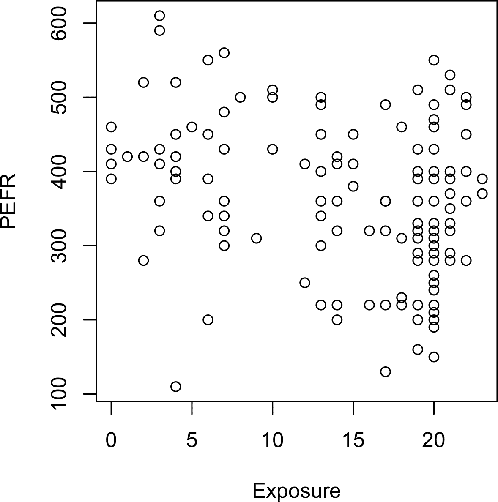

###### 图 4-1\. 棉尘暴露与肺活量

简单线性回归试图找到最佳线来预测响应变量`PEFR`与预测变量`Exposure`之间的关系：

<math display="block" alttext="PEFR equals b 0 plus b 1 Exposure"><mrow><mtext>PEFR</mtext> <mo>=</mo> <msub><mi>b</mi> <mn>0</mn></msub> <mo>+</mo> <msub><mi>b</mi> <mn>1</mn></msub> <mtext>Exposure</mtext></mrow></math>

在*R*中，`lm`函数可用于拟合线性回归：

```py
model <- lm(PEFR ~ Exposure, data=lung)
```

`lm`代表*线性模型*，`~`符号表示`PEFR`由`Exposure`预测。在此模型定义中，截距自动包含并适合。如果要从模型中排除截距，需要将模型定义写成如下形式：

```py
PEFR ~ Exposure - 1
```

打印`model`对象将产生以下输出：

```py
Call:
lm(formula = PEFR ~ Exposure, data = lung)

Coefficients:
(Intercept)     Exposure
    424.583       -4.185
```

截距，即<math alttext="b 0"><msub><mi>b</mi> <mn>0</mn></msub></math>，为 424.583，可解释为对于经历零年棉尘暴露的工人预测的`PEFR`。回归系数，或<math alttext="b 1"><msub><mi>b</mi> <mn>1</mn></msub></math>，可解释如下：每增加一年的棉尘暴露，工人的`PEFR`测量值减少了-4.185。

在*Python*中，我们可以使用`scikit-learn`包中的`LinearRegression`。（`statsmodels`包具有更类似于*R*的线性回归实现（`sm.OLS`）；我们稍后将在本章中使用它）：

```py
predictors = ['Exposure']
outcome = 'PEFR'

model = LinearRegression()
model.fit(lung[predictors], lung[outcome])

print(f'Intercept: {model.intercept_:.3f}')
print(f'Coefficient Exposure: {model.coef_[0]:.3f}')
```

该模型的回归线显示在 Figure 4-2 中。

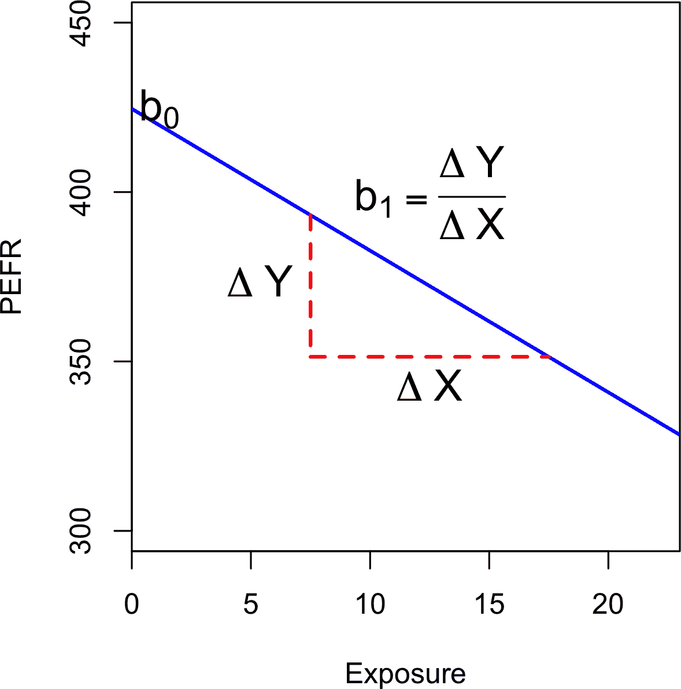

###### 图 4-2\. 适合肺活量数据的斜率和截距

## 拟合值和残差

回归分析中的重要概念是*拟合值*（预测值）和*残差*（预测误差）。一般来说，数据不会完全落在一条直线上，因此回归方程应包括显式的误差项 <math alttext="e Subscript i"><msub><mi>e</mi> <mi>i</mi></msub></math>：

<math display="block"><mrow><msub><mi>Y</mi> <mi>i</mi></msub> <mo>=</mo> <msub><mi>b</mi> <mn>0</mn></msub> <mo>+</mo> <msub><mi>b</mi> <mn>1</mn></msub> <msub><mi>X</mi> <mi>i</mi></msub> <mo>+</mo> <msub><mi>e</mi> <mi>i</mi></msub></mrow></math>

拟合值，也称为*预测值*，通常用<math alttext="ModifyingAbove upper Y With caret Subscript i"><msub><mover accent="true"><mi>Y</mi> <mo>^</mo></mover> <mi>i</mi></msub></math>（Y-hat）表示。这些值为：

<math display="block"><mrow><msub><mover accent="true"><mi>Y</mi> <mo>^</mo></mover> <mi>i</mi></msub> <mo>=</mo> <msub><mover accent="true"><mi>b</mi> <mo>^</mo></mover> <mn>0</mn></msub> <mo>+</mo> <msub><mover accent="true"><mi>b</mi> <mo>^</mo></mover> <mn>1</mn></msub> <msub><mi>X</mi> <mi>i</mi></msub></mrow></math>

符号 <math alttext="ModifyingAbove b With caret Subscript 0"><msub><mover accent="true"><mi>b</mi> <mo>^</mo></mover> <mn>0</mn></msub></math> 和 <math alttext="ModifyingAbove b With caret Subscript 1"><msub><mover accent="true"><mi>b</mi> <mo>^</mo></mover> <mn>1</mn></msub></math> 表示系数是根据已知值进行估计的。

# 帽子符号：估计值与已知值

“帽子”符号用于区分估计值和已知值。因此，符号 <math alttext="ModifyingAbove b With caret"><mover accent="true"><mi>b</mi> <mo>^</mo></mover></math>（“b-hat”）是未知参数 <math alttext="b"><mi>b</mi></math> 的估计值。为什么统计学家要区分估计值和真实值？估计值具有不确定性，而真实值是固定的。²

我们通过从原始数据中减去*预测*值来计算残差 <math alttext="ModifyingAbove e With caret Subscript i"><msub><mover accent="true"><mi>e</mi> <mo>^</mo></mover> <mi>i</mi></msub></math>：

<math display="block"><mrow><msub><mover accent="true"><mi>e</mi> <mo>^</mo></mover> <mi>i</mi></msub> <mo>=</mo> <msub><mi>Y</mi> <mi>i</mi></msub> <mo>-</mo> <msub><mover accent="true"><mi>Y</mi> <mo>^</mo></mover> <mi>i</mi></msub></mrow></math>

在*R*中，我们可以使用`predict`和`residuals`函数获取拟合值和残差：

```py
fitted <- predict(model)
resid <- residuals(model)
```

使用`scikit-learn`的`LinearRegression`模型，我们在训练数据上使用`predict`方法获取`fitted`值，然后获取`residuals`。正如我们将看到的，这是`scikit-learn`中所有模型遵循的通用模式：

```py
fitted = model.predict(lung[predictors])
residuals = lung[outcome] - fitted
```

图 4-3 展示了拟合到肺部数据的回归线的残差。残差是从数据点到回归线的垂直虚线的长度。

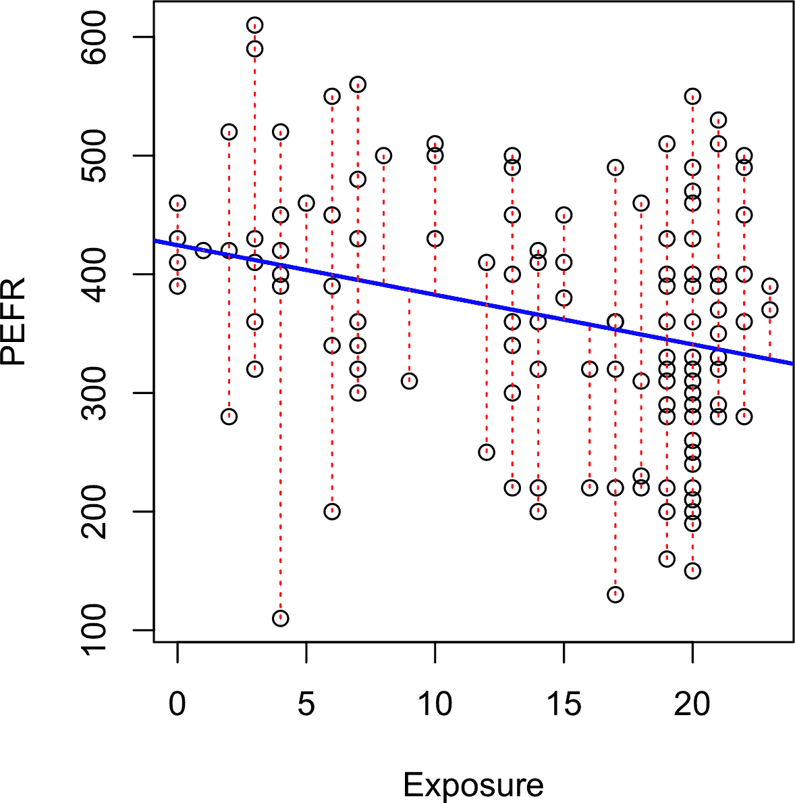

###### 图 4-3\. 回归线的残差（为了容纳所有数据，y 轴的比例与图 4-2 不同，因此看起来斜率明显不同）

## 最小二乘法

数据如何拟合模型？当存在明显关系时，可以想象手动拟合线条。实际上，回归线是通过最小化残差平方和（也称为*残差平方和*或*RSS*）的估计来确定的：

<math display="block"><mtable displaystyle="true"><mtr><mtd columnalign="right"><mrow><mi>R</mi> <mi>S</mi> <mi>S</mi></mrow></mtd> <mtd><mo>=</mo></mtd> <mtd columnalign="left"><mrow><munderover><mo>∑</mo> <mrow><mi>i</mi><mo>=</mo><mn>1</mn></mrow> <mi>n</mi></munderover> <msup><mfenced separators="" open="(" close=")"><msub><mi>Y</mi> <mi>i</mi></msub> <mo>-</mo><msub><mover accent="true"><mi>Y</mi> <mo>^</mo></mover> <mi>i</mi></msub></mfenced> <mn>2</mn></msup></mrow></mtd></mtr> <mtr><mtd><mo>=</mo></mtd> <mtd columnalign="left"><mrow><munderover><mo>∑</mo> <mrow><mi>i</mi><mo>=</mo><mn>1</mn></mrow> <mi>n</mi></munderover> <msup><mfenced separators="" open="(" close=")"><msub><mi>Y</mi> <mi>i</mi></msub> <mo>-</mo><msub><mover accent="true"><mi>b</mi> <mo>^</mo></mover> <mn>0</mn></msub> <mo>-</mo><msub><mover accent="true"><mi>b</mi> <mo>^</mo></mover> <mn>1</mn></msub> <msub><mi>X</mi> <mi>i</mi></msub></mfenced> <mn>2</mn></msup></mrow></mtd></mtr></mtable></math>

估计值 <math alttext="ModifyingAbove b With caret Subscript 0"><msub><mover accent="true"><mi>b</mi> <mo>^</mo></mover> <mn>0</mn></msub></math> 和 <math alttext="ModifyingAbove b With caret Subscript 1"><msub><mover accent="true"><mi>b</mi> <mo>^</mo></mover> <mn>1</mn></msub></math> 是使残差平方和最小化的值。

最小二乘法回归，又称普通最小二乘（OLS）回归，是通过最小化残差平方和来估计拟合线的方法。虽然通常认为这个方法最早由德国数学家卡尔·弗里德里希·高斯提出，但实际上是由法国数学家阿德里安-玛丽·勒让德于 1805 年首次发表。任何标准统计软件都可以快速、轻松地计算最小二乘法回归。

历史上，计算方便是广泛使用最小二乘法回归的原因之一。随着大数据的出现，计算速度仍然是一个重要因素。最小二乘法与均值（参见“中位数和鲁棒估计”）一样，对异常值敏感，尽管这通常只在小型或中型数据集中是一个显著问题。请参见“异常值”讨论回归中的异常值。

# 回归术语

当分析师和研究人员单独使用术语*回归*时，他们通常是指线性回归；重点通常在于开发一个线性模型，以解释预测变量与数值结果变量之间的关系。在其正式统计意义上，回归还包括产生预测变量和结果变量之间功能关系的非线性模型。在机器学习社区中，这个术语偶尔也被宽泛地用来指代产生预测数值结果的任何预测模型（与预测二元或分类结果的方法相对）。

## 预测与解释（分析）

历史上，回归的主要用途是阐明预测变量与结果变量之间的假定线性关系。其目标是理解这种关系，并使用回归拟合的数据来解释它。在这种情况下，主要关注回归方程的估计斜率<math alttext="ModifyingAbove b With caret"><mover accent="true"><mi>b</mi> <mo>^</mo></mover></math> 。经济学家想要了解消费者支出与 GDP 增长之间的关系。公共卫生官员可能希望了解公共信息宣传活动是否有效促进安全性行为实践。在这些情况下，重点不在于预测个别案例，而在于理解变量之间的整体关系。

随着大数据的出现，回归广泛用于形成模型以预测新数据的个别结果（即预测模型），而不是解释手头的数据。在这种情况下，主要关注的是拟合值 <math alttext="ModifyingAbove upper Y With caret"><mover accent="true"><mi>Y</mi> <mo>^</mo></mover></math> 。在营销中，回归可以用来预测广告活动规模对收入变化的影响。大学使用回归来预测学生的 GPA，基于他们的 SAT 成绩。

一个良好拟合数据的回归模型被设置为使*X*的变化导致*Y*的变化。然而，单独的回归方程并不能证明因果关系的方向。关于因果关系的结论必须来自对关系更广泛的理解。例如，回归方程可能显示网页广告点击次数与转化次数之间存在明确的关系。是我们对营销过程的了解，而不是回归方程，使我们得出点击广告导致销售而不是相反的结论。

## 进一步阅读

深入探讨预测与解释，请参阅加利特·舒默利的文章 [“解释还是预测？”](https://oreil.ly/4fVUY)。

# 多元线性回归

当存在多个预测变量时，方程式简单地扩展以适应它们：

<math display="block"><mrow><mi>Y</mi> <mo>=</mo> <msub><mi>b</mi> <mn>0</mn></msub> <mo>+</mo> <msub><mi>b</mi> <mn>1</mn></msub> <msub><mi>X</mi> <mn>1</mn></msub> <mo>+</mo> <msub><mi>b</mi> <mn>2</mn></msub> <msub><mi>X</mi> <mn>2</mn></msub> <mo>+</mo> <mo>...</mo> <mo>+</mo> <msub><mi>b</mi> <mi>p</mi></msub> <msub><mi>X</mi> <mi>p</mi></msub> <mo>+</mo> <mi>e</mi></mrow></math>

现在不再是一条线，我们有一个线性模型—每个系数与其变量（特征）之间的关系是线性的。

在简单线性回归中的所有其他概念，如最小二乘法拟合以及拟合值和残差的定义，都扩展到多元线性回归设置中。例如，拟合值由以下公式给出：

<math display="block"><mrow><msub><mover accent="true"><mi>Y</mi> <mo>^</mo></mover> <mi>i</mi></msub> <mo>=</mo> <msub><mover accent="true"><mi>b</mi> <mo>^</mo></mover> <mn>0</mn></msub> <mo>+</mo> <msub><mover accent="true"><mi>b</mi> <mo>^</mo></mover> <mn>1</mn></msub> <msub><mi>X</mi> <mrow><mn>1</mn><mo>,</mo><mi>i</mi></mrow></msub> <mo>+</mo> <msub><mover accent="true"><mi>b</mi> <mo>^</mo></mover> <mn>2</mn></msub> <msub><mi>X</mi> <mrow><mn>2</mn><mo>,</mo><mi>i</mi></mrow></msub> <mo>+</mo> <mo>...</mo> <mo>+</mo> <msub><mover accent="true"><mi>b</mi> <mo>^</mo></mover> <mi>p</mi></msub> <msub><mi>X</mi> <mrow><mi>p</mi><mo>,</mo><mi>i</mi></mrow></msub></mrow></math>

## 示例：King County 房屋数据

多元线性回归的一个例子是估算房屋价值。县评估员必须估算房屋的价值以进行税收评估。房地产专业人士和购房者参考流行的网站，如[Zillow](https://zillow.com)，以确定公正的价格。以下是华盛顿州西雅图市金县（King County）的几行住房数据，来自`house data.frame`：

```py
head(house[, c('AdjSalePrice', 'SqFtTotLiving', 'SqFtLot', 'Bathrooms',
               'Bedrooms', 'BldgGrade')])
Source: local data frame [6 x 6]

  AdjSalePrice SqFtTotLiving SqFtLot Bathrooms Bedrooms BldgGrade
         (dbl)         (int)   (int)     (dbl)    (int)     (int)
1       300805          2400    9373      3.00        6         7
2      1076162          3764   20156      3.75        4        10
3       761805          2060   26036      1.75        4         8
4       442065          3200    8618      3.75        5         7
5       297065          1720    8620      1.75        4         7
6       411781           930    1012      1.50        2         8
```

`pandas`数据框的`head`方法列出了顶部几行：

```py
subset = ['AdjSalePrice', 'SqFtTotLiving', 'SqFtLot', 'Bathrooms',
          'Bedrooms', 'BldgGrade']
house[subset].head()
```

目标是根据其他变量预测销售价格。`lm`函数通过在方程右侧包含更多项简单地处理多重回归情况；参数`na.action=na.omit`使得模型丢弃具有缺失值的记录：

```py
house_lm <- lm(AdjSalePrice ~ SqFtTotLiving + SqFtLot + Bathrooms +
               Bedrooms + BldgGrade,
               data=house, na.action=na.omit)
```

`scikit-learn`的`LinearRegression`也可以用于多元线性回归：

```py
predictors = ['SqFtTotLiving', 'SqFtLot', 'Bathrooms', 'Bedrooms', 'BldgGrade']
outcome = 'AdjSalePrice'

house_lm = LinearRegression()
house_lm.fit(house[predictors], house[outcome])
```

打印`house_lm`对象会产生以下输出：

```py
house_lm

Call:
lm(formula = AdjSalePrice ~ SqFtTotLiving + SqFtLot + Bathrooms +
    Bedrooms + BldgGrade, data = house, na.action = na.omit)

Coefficients:
  (Intercept)  SqFtTotLiving        SqFtLot      Bathrooms
   -5.219e+05      2.288e+02     -6.047e-02     -1.944e+04
     Bedrooms      BldgGrade
   -4.777e+04      1.061e+05
```

对于`LinearRegression`模型，截距和系数分别是拟合模型的`intercept_`和`coef_`字段：

```py
print(f'Intercept: {house_lm.intercept_:.3f}')
print('Coefficients:')
for name, coef in zip(predictors, house_lm.coef_):
    print(f' {name}: {coef}')
```

系数的解释与简单线性回归相同：预测值<math alttext="ModifyingAbove upper Y With caret"><mover accent="true"><mi>Y</mi> <mo>^</mo></mover></math>在<math alttext="upper X Subscript j"><msub><mi>X</mi> <mi>j</mi></msub></math>每单位变化时变化<math alttext="b Subscript j"><msub><mi>b</mi> <mi>j</mi></msub></math>，假设所有其他变量<math alttext="upper X Subscript k"><msub><mi>X</mi> <mi>k</mi></msub></math>对于<math alttext="k 不等于 j"><mrow><mi>k</mi> <mo>≠</mo> <mi>j</mi></mrow></math>保持不变。例如，将房屋增加一个完工平方英尺大约会增加大约 229 美元的估值；增加 1,000 平方英尺则意味着价值将增加约 228,800 美元。

## 评估模型

从数据科学的角度来看，最重要的性能指标是*均方根误差*，或*RMSE*。RMSE 是预测值<math alttext="ModifyingAbove y With caret Subscript i"><msub><mover accent="true"><mi>y</mi> <mo>^</mo></mover> <mi>i</mi></msub></math>的平均平方误差的平方根：

<math display="block"><mrow><mi>R</mi> <mi>M</mi> <mi>S</mi> <mi>E</mi> <mo>=</mo> <msqrt><mfrac><mrow><msubsup><mo>∑</mo> <mrow><mi>i</mi><mo>=</mo><mn>1</mn></mrow> <mi>n</mi></msubsup> <msup><mfenced separators="" open="(" close=")"><msub><mi>y</mi> <mi>i</mi></msub> <mo>-</mo><msub><mover accent="true"><mi>y</mi> <mo>^</mo></mover> <mi>i</mi></msub></mfenced> <mn>2</mn></msup></mrow> <mi>n</mi></mfrac></msqrt></mrow></math>

这衡量了模型的整体准确性，并且是与其他模型（包括使用机器学习技术拟合的模型）进行比较的基础。类似于 RMSE 的是*残差标准误差*，或者*RSE*。在这种情况下，我们有*p*个预测变量，RSE 由以下公式给出：

<math display="block"><mrow><mi>R</mi> <mi>S</mi> <mi>E</mi> <mo>=</mo> <msqrt><mfrac><mrow><msubsup><mo>∑</mo> <mrow><mi>i</mi><mo>=</mo><mn>1</mn></mrow> <mi>n</mi></msubsup> <msup><mfenced separators="" open="(" close=")"><msub><mi>y</mi> <mi>i</mi></msub> <mo>-</mo><msub><mover accent="true"><mi>y</mi> <mo>^</mo></mover> <mi>i</mi></msub></mfenced> <mn>2</mn></msup></mrow> <mfenced separators="" open="(" close=")"><mi>n</mi><mo>-</mo><mi>p</mi><mo>-</mo><mn>1</mn></mfenced></mfrac></msqrt></mrow></math>

唯一的区别在于分母是自由度，而不是记录数（参见“自由度”）。实际上，对于线性回归，在大数据应用中，RMSE 和 RSE 之间的差异非常小。

*R*中的`summary`函数计算了回归模型的 RSE 以及其他指标：

```py
summary(house_lm)

Call:
lm(formula = AdjSalePrice ~ SqFtTotLiving + SqFtLot + Bathrooms +
    Bedrooms + BldgGrade, data = house, na.action = na.omit)

Residuals:
     Min       1Q   Median       3Q      Max
-1199479  -118908   -20977    87435  9473035

Coefficients:
                Estimate Std. Error t value Pr(>|t|)
(Intercept)   -5.219e+05  1.565e+04 -33.342  < 2e-16 ***
SqFtTotLiving  2.288e+02  3.899e+00  58.694  < 2e-16 ***
SqFtLot       -6.047e-02  6.118e-02  -0.988    0.323
Bathrooms     -1.944e+04  3.625e+03  -5.363 8.27e-08 ***
Bedrooms      -4.777e+04  2.490e+03 -19.187  < 2e-16 ***
BldgGrade      1.061e+05  2.396e+03  44.277  < 2e-16 ***
---
Signif. codes:  0 ‘***’ 0.001 ‘**’ 0.01 ‘*’ 0.05 ‘.’ 0.1 ‘ ’ 1

Residual standard error: 261300 on 22681 degrees of freedom
Multiple R-squared:  0.5406,	Adjusted R-squared:  0.5405
F-statistic:  5338 on 5 and 22681 DF,  p-value: < 2.2e-16
```

`scikit-learn`提供了许多回归和分类的度量指标。这里，我们使用`mean_squared_error`来获取 RMSE，使用`r2_score`来获取决定系数：

```py
fitted = house_lm.predict(house[predictors])
RMSE = np.sqrt(mean_squared_error(house[outcome], fitted))
r2 = r2_score(house[outcome], fitted)
print(f'RMSE: {RMSE:.0f}')
print(f'r2: {r2:.4f}')
```

使用`statsmodels`来获取*Python*中回归模型的更详细分析：

```py
model = sm.OLS(house[outcome], house[predictors].assign(const=1))
results = model.fit()
results.summary()
```

在这里使用的`pandas`方法`assign`添加了一个值为 1 的常数列到预测因子中。这对于建模截距是必需的。

在软件输出中，您还会看到另一个有用的度量指标是*决定系数*，也称为*R 平方*统计量或<math alttext="upper R squared"><msup><mi>R</mi> <mn>2</mn></msup></math>。R 平方介于 0 到 1 之间，衡量了模型解释数据变异的比例。主要用于回归分析中，帮助评估模型对数据的拟合程度。*R 平方*的公式如下：

<math display="block"><mrow><msup><mi>R</mi> <mn>2</mn></msup> <mo>=</mo> <mn>1</mn> <mo>-</mo> <mfrac><mrow><msubsup><mo>∑</mo> <mrow><mi>i</mi><mo>=</mo><mn>1</mn></mrow> <mi>n</mi></msubsup> <msup><mfenced separators="" open="(" close=")"><msub><mi>y</mi> <mi>i</mi></msub> <mo>-</mo><msub><mover accent="true"><mi>y</mi> <mo>^</mo></mover> <mi>i</mi></msub></mfenced> <mn>2</mn></msup></mrow> <mrow><msubsup><mo>∑</mo> <mrow><mi>i</mi><mo>=</mo><mn>1</mn></mrow> <mi>n</mi></msubsup> <msup><mfenced separators="" open="(" close=")"><msub><mi>y</mi> <mi>i</mi></msub> <mo>-</mo><mover accent="true"><mi>y</mi> <mo>¯</mo></mover></mfenced> <mn>2</mn></msup></mrow></mfrac></mrow></math>

分母与*Y*的方差成正比。*R*的输出还报告了*调整后的 R 平方*，该指标考虑了自由度，有效地惩罚了向模型添加更多预测因子的情况。在大数据集上，这通常与多元回归中的*R 平方*没有显著不同。

除了估计系数外，*R*和`statsmodels`还报告了系数的标准误差（SE）和*t 统计量*：

<math display="block"><mrow><msub><mi>t</mi> <mi>b</mi></msub> <mo>=</mo> <mfrac><mover accent="true"><mi>b</mi> <mo>^</mo></mover> <mrow><mtext>SE</mtext><mfenced separators="" open="(" close=")"><mover accent="true"><mi>b</mi> <mo>^</mo></mover></mfenced></mrow></mfrac></mrow></math>

t 统计量及其镜像，即 p 值，衡量了系数在统计上的显著性，即预测因子与目标变量的随机安排可能产生的范围之外的程度。t 统计量越高（p 值越低），预测因子越显著。由于简洁性是一个有价值的模型特征，因此有这样的工具来指导选择要包含为预测因子的变量是很有用的（参见“模型选择和逐步回归”）。

###### 警告

除了 t 统计量外，*R*和其他包通常还报告*p 值*（*R*输出中的`Pr(>|t|)`）和*F 统计量*。数据科学家通常不会过多解释这些统计量，也不会过多关注统计显著性问题。数据科学家主要专注于 t 统计量作为是否在模型中包含预测因子的有用指南。较高的 t 统计量（与接近 0 的 p 值相对应）表明应保留预测因子在模型中，而非常低的 t 统计量表明可以删除预测因子。参见“p-Value”以获取更多讨论。

## 交叉验证

经典统计回归指标（*R²*、F 统计量和 p 值）都是“样本内”指标——它们适用于用于拟合模型的相同数据。直观地，您可以看到，将一些原始数据保留下来，不用于拟合模型，然后将模型应用于留出的（保留）数据，以查看其表现如何，这是非常有意义的。通常，您会使用大多数数据来拟合模型，并使用较小的部分来测试模型。

“样本外”验证的这个想法并不新鲜，但直到较大的数据集变得更普遍之前，它并没有真正被接受；对于小数据集，分析师通常希望使用所有数据并拟合最佳的模型。

然而，使用留出样本会使你受到一些不确定性的影响，这仅仅来自于小样本的变异性。如果选择不同的留出样本，评估结果会有多大不同？

交叉验证将留出样本的概念扩展到多个连续的留出样本。基本*k 折交叉验证*算法如下：

1.  将*1/k*的数据留出作为留出样本。

1.  在剩余数据上训练模型。

1.  将模型应用（评分）于*1/k*的留出样本，并记录所需的模型评估指标。

1.  恢复数据的第*1/k*部分，并留出接下来的*1/k*部分（不包括任何第一次被选中的记录）。

1.  重复步骤 2 和 3。

1.  直到每条记录都在留出部分中使用为止。

1.  平均或以其他方式组合模型评估指标。

将数据分成训练样本和留出样本也称为*折叠*。

## 模型选择和逐步回归

在一些问题中，可以使用许多变量作为回归的预测变量。例如，要预测房屋价值，可以使用额外的变量如地下室面积或建造年份。在*R*中，这些很容易添加到回归方程中：

```py
house_full <- lm(AdjSalePrice ~ SqFtTotLiving + SqFtLot + Bathrooms +
                 Bedrooms + BldgGrade + PropertyType + NbrLivingUnits +
                 SqFtFinBasement + YrBuilt + YrRenovated +
                 NewConstruction,
               data=house, na.action=na.omit)
```

在*Python*中，我们需要将分类和布尔变量转换为数字：

```py
predictors = ['SqFtTotLiving', 'SqFtLot', 'Bathrooms', 'Bedrooms', 'BldgGrade',
              'PropertyType', 'NbrLivingUnits', 'SqFtFinBasement', 'YrBuilt',
              'YrRenovated', 'NewConstruction']

X = pd.get_dummies(house[predictors], drop_first=True)
X['NewConstruction'] = [1 if nc else 0 for nc in X['NewConstruction']]

house_full = sm.OLS(house[outcome], X.assign(const=1))
results = house_full.fit()
results.summary()
```

然而，添加更多变量并不一定意味着我们拥有更好的模型。统计学家使用奥卡姆剃刀原则来指导模型的选择：其他条件相等时，应优先使用简单的模型而不是更复杂的模型。

添加额外变量总是降低 RMSE 并增加<math alttext="upper R squared"><msup><mi>R</mi> <mn>2</mn></msup></math>的训练数据。因此，这些不适合帮助指导模型选择。包含模型复杂性的一种方法是使用调整后的<math alttext="upper R squared"><msup><mi>R</mi> <mn>2</mn></msup></math>：

<math><mstyle displaystyle="true"><mrow class="MJX-TeXAtom-ORD"><msubsup><mi>R</mi> <mrow class="MJX-TeXAtom-ORD"><mi>a</mi> <mi>d</mi> <mi>j</mi></mrow> <mn>2</mn></msubsup> <mo>=</mo> <mn>1</mn> <mo>−</mo> <mo stretchy="false">(</mo> <mn>1</mn> <mo>−</mo> <msup><mi>R</mi> <mn>2</mn></msup> <mo stretchy="false">)</mo> <mfrac><mrow><mi>n</mi> <mo>−</mo> <mn>1</mn></mrow> <mrow><mi>n</mi> <mo>−</mo> <mi>P</mi> <mo>−</mo> <mn>1</mn></mrow></mfrac></mrow></mstyle></math>

这里，*n* 是记录数，*P* 是模型中的变量数。

在 20 世纪 70 年代，日本著名统计学家赤池弘次开发了一种叫做*AIC*（赤池信息准则）的度量，惩罚模型中增加的项。在回归的情况下，AIC 的形式为：

+   AIC = 2*P* + *n* log(`RSS`/*n*)

其中*P*是变量数，*n*是记录数。目标是找到最小化 AIC 的模型；具有*k*个额外变量的模型会受到 2*k*的惩罚。

# AIC，BIC 和 Mallows Cp

AIC 的公式可能看起来有点神秘，但实际上是基于信息理论中的渐近结果。AIC 有几个变体：

AICc

AIC 的小样本修正版本。

BIC 或贝叶斯信息准则

与 AIC 类似，对于将额外变量包括在模型中，惩罚力度更强。

Mallows Cp

Colin Mallows 开发的 AIC 的一个变体。

这些通常作为样本内度量报告（即在训练数据上），使用留出数据进行模型评估的数据科学家不需要担心它们之间的差异或其背后的理论。

如何找到最小化 AIC 或最大化调整<math alttext="upper R squared"><msup><mi>R</mi> <mn>2</mn></msup></math>的模型？一种方法是搜索所有可能的模型，这称为*全子集回归*。这在具有大量数据和变量的问题中计算成本高昂，不可行。一个吸引人的替代方案是使用*逐步回归*。它可以从一个完整模型开始，并逐步删除没有意义的变量。这被称为*向后消除*。或者可以从一个常数模型开始，并逐步添加变量（*前向选择*）。作为第三个选择，我们还可以逐步添加和删除预测因子，以找到降低 AIC 或调整<math alttext="upper R squared"><msup><mi>R</mi> <mn>2</mn></msup></math>的模型。Venebles 和 Ripley 的*R*软件包中的`MASS`提供了一个称为`stepAIC`的逐步回归函数：

```py
library(MASS)
step <- stepAIC(house_full, direction="both")
step

Call:
lm(formula = AdjSalePrice ~ SqFtTotLiving + Bathrooms + Bedrooms +
    BldgGrade + PropertyType + SqFtFinBasement + YrBuilt, data = house,
    na.action = na.omit)

Coefficients:
              (Intercept)              SqFtTotLiving
                6.179e+06                  1.993e+02
                Bathrooms                   Bedrooms
                4.240e+04                 -5.195e+04
                BldgGrade  PropertyTypeSingle Family
                1.372e+05                  2.291e+04
    PropertyTypeTownhouse            SqFtFinBasement
                8.448e+04                  7.047e+00
                  YrBuilt
               -3.565e+03
```

`scikit-learn`没有逐步回归的实现。我们在我们的`dmba`包中实现了`stepwise_selection`、`forward_selection`和`backward_elimination`函数：

```py
y = house[outcome]

def train_model(variables): 
    if len(variables) == 0:
        return None
    model = LinearRegression()
    model.fit(X[variables], y)
    return model

def score_model(model, variables): 
    if len(variables) == 0:
        return AIC_score(y, [y.mean()] * len(y), model, df=1)
    return AIC_score(y, model.predict(X[variables]), model)

best_model, best_variables = stepwise_selection(X.columns, train_model,
                                                score_model, verbose=True)

print(f'Intercept: {best_model.intercept_:.3f}')
print('Coefficients:')
for name, coef in zip(best_variables, best_model.coef_):
    print(f' {name}: {coef}')
```


定义一个返回给定变量集的拟合模型的函数。


定义一个函数，为给定的模型和变量集返回一个分数。在这种情况下，我们使用`dmba`包中实现的`AIC_score`。

该函数选择了一个模型，其中从`house_full`中删除了几个变量：`SqFtLot`、`NbrLivingUnits`、`YrRenovated`和`NewConstruction`。

更简单的方法是*前向选择*和*后向选择*。在前向选择中，你从零个预测变量开始逐个添加，每一步都添加对<math alttext="upper R squared"><msup><mi>R</mi> <mn>2</mn></msup></math> 贡献最大的预测变量，并在贡献不再具有统计显著性时停止。在后向选择或*后向消除*中，你从完整模型开始，并去掉不具有统计显著性的预测变量，直到剩下所有预测变量都具有统计显著性的模型。

*Penalized regression*的灵感与 AIC 类似。与明确搜索离散模型集不同，模型拟合方程包含一个约束，对模型因过多变量（参数）而进行惩罚。与逐步、前向和后向选择完全消除预测变量不同，惩罚回归通过减少系数来施加惩罚，在某些情况下几乎降为零。常见的惩罚回归方法包括*岭回归*和*套索回归*。

逐步回归和全子集回归是*样本内*方法，用于评估和调整模型。这意味着模型选择可能会受到过度拟合（拟合数据中的噪声）的影响，并且在应用于新数据时可能表现不佳。避免这种情况的一种常见方法是使用交叉验证来验证模型。在线性回归中，过度拟合通常不是一个主要问题，因为数据上强加了简单（线性）全局结构。对于更复杂类型的模型，特别是对局部数据结构响应的迭代过程，交叉验证是一个非常重要的工具；详见“交叉验证”。

## 加权回归

统计学家使用加权回归来处理各种目的；特别是，在复杂调查分析中，这是很重要的。数据科学家可能会发现在两种情况下使用加权回归很有用：

+   当不同观察结果具有不同精度时，使用反方差加权；较高方差的观察结果获得较低的权重。

+   分析数据，其中行代表多个案例；权重变量编码每行代表多少个原始观测值。

例如，在房屋数据中，较早的销售比较不可靠，而比较近期的销售则较为可靠。使用`DocumentDate`确定销售年份，我们可以计算`Weight`作为距离 2005 年（数据开始的时间）的年数：

*R*

```py
library(lubridate)
house$Year = year(house$DocumentDate)
house$Weight = house$Year - 2005
```

*Python*

```py
house['Year'] = [int(date.split('-')[0]) for date in house.DocumentDate]
house['Weight'] = house.Year - 2005
```

我们可以使用`lm`函数中的`weight`参数计算加权回归：

```py
house_wt <- lm(AdjSalePrice ~ SqFtTotLiving + SqFtLot + Bathrooms +
                 Bedrooms + BldgGrade,
               data=house, weight=Weight)
round(cbind(house_lm=house_lm$coefficients,
            house_wt=house_wt$coefficients), digits=3)

                 house_lm    house_wt
(Intercept)   -521871.368 -584189.329
SqFtTotLiving     228.831     245.024
SqFtLot            -0.060      -0.292
Bathrooms      -19442.840  -26085.970
Bedrooms       -47769.955  -53608.876
BldgGrade      106106.963  115242.435
```

加权回归中的系数与原始回归略有不同。

大多数 `scikit-learn` 中的模型在调用 `fit` 方法时接受权重作为关键字参数 `sample_weight`：

```py
predictors = ['SqFtTotLiving', 'SqFtLot', 'Bathrooms', 'Bedrooms', 'BldgGrade']
outcome = 'AdjSalePrice'

house_wt = LinearRegression()
house_wt.fit(house[predictors], house[outcome], sample_weight=house.Weight)
```

## 进一步阅读

可以在《统计学习导论》（Gareth James, Daniela Witten, Trevor Hastie 和 Robert Tibshirani 著，Springer，2013）中找到关于交叉验证和重抽样的优秀处理。

# 使用回归进行预测

在数据科学中，回归的主要目的是预测。这一点很重要，因为回归作为一种古老而成熟的统计方法，其背景更多与其作为解释建模工具的传统角色相关，而不是预测。

## 外推的危险

回归模型不应用于超出数据范围之外的外推（不考虑用于时间序列预测的回归情况）。该模型仅对数据拥有足够观测值的预测变量值有效（即使在有足够数据的情况下，也可能存在其他问题—参见“回归诊断”）。举个极端的例子，假设使用`model_lm`来预测一个面积为 5,000 平方英尺的空地的价值。在这种情况下，所有与建筑相关的预测变量将为 0，回归方程将给出一个荒谬的预测值为–521,900 + 5,000 × –0.0605 = –$522,202。为什么会发生这种情况？数据仅包含具有建筑物的地块—没有对应于空地的记录。因此，模型无法通过数据告诉如何预测空地的销售价格。

## 置信区间与预测区间

统计学的大部分内容涉及理解和衡量变异性（不确定性）。回归输出中报告的 t-统计量和 p-值以正式方式处理这一点，这在变量选择时有时是有用的（参见“评估模型”）。更有用的指标是置信区间，它是放置在回归系数和预测周围的不确定性区间。理解这一点的简单方法是通过自助法（更多关于一般自助法程序的详情，请参见“自助法”）。在软件输出中遇到的最常见的回归置信区间是回归参数（系数）的置信区间。以下是用于生成数据集中 *P* 个预测变量和 *n* 条记录的回归参数（系数）置信区间的自助法算法：

1.  将每一行（包括结果变量）视为单独的“票据”，并将所有 *n* 张票据放入一个箱子中。

1.  随机抽取一张票据，记录其值，并将其放回箱中。

1.  重复步骤 2 *n* 次，现在你有了一个自助法重采样。

1.  对 Bootstrap 样本拟合回归，并记录估计的系数。

1.  重复步骤 2 到 4，例如 1,000 次。

1.  现在每个系数都有 1,000 个自举值；找到每个系数的适当百分位数（例如，90% 置信区间的第 5 和第 95 百分位数）。

您可以使用 *R* 中的 `Boot` 函数生成系数的实际自举置信区间，或者简单地使用基于公式的区间，这是 *R* 输出的常规部分。概念意义和解释是相同的，对于数据科学家来说并不是核心问题，因为它们涉及回归系数。数据科学家更感兴趣的是围绕预测 *y* 值（<math alttext="ModifyingAbove upper Y With caret Subscript i"><msub><mover accent="true"><mi>Y</mi> <mo>^</mo></mover> <mi>i</mi></msub></math>）的区间。对于 <math alttext="ModifyingAbove upper Y With caret Subscript i"><msub><mover accent="true"><mi>Y</mi> <mo>^</mo></mover> <mi>i</mi></msub></math> 的不确定性来自两个来源：

+   对相关的预测变量及其系数的不确定性（见前述自举算法）

+   个体数据点固有的附加误差

可以将个体数据点误差理解为：即使我们确定了回归方程是什么（例如，如果我们有大量记录来拟合它），给定一组预测变量的实际结果值也会有所不同。例如，几栋房子——每栋房子都有 8 个房间、6500 平方英尺的地块、3 间浴室和一个地下室——可能具有不同的价值。我们可以通过拟合值的残差来建模这个个体误差。用于模拟回归模型误差和个体数据点误差的自举算法如下所示：

1.  从数据中进行自举抽样（在前文详细解释）。

1.  拟合回归模型，并预测新值。

1.  随机从原始回归拟合中取一个单个残差，加到预测值上，并记录结果。

1.  重复步骤 1 至 3，比如说 1,000 次。

1.  找到结果的第 2.5 和第 97.5 百分位数。

# 预测区间还是置信区间？

预测区间涉及到单个数值的不确定性，而置信区间涉及到从多个数值计算得出的均值或其他统计量。因此，对于相同的数值来说，预测区间通常会比置信区间宽得多。我们在自举模型中模拟这个单个数值误差，通过选择一个个体残差来添加到预测值上。应该使用哪一个？这取决于上下文和分析的目的，但一般来说，数据科学家对特定的个体预测很感兴趣，因此预测区间更为合适。如果你应该使用预测区间而使用了置信区间，那么将极大地低估给定预测值的不确定性。

# 回归中的因子变量

*因子*变量，也称为*分类*变量，接受有限数量的离散值。例如，贷款目的可以是“债务合并”，“婚礼”，“汽车”等。二进制（是/否）变量，也称为*指示*变量，是因子变量的一种特殊情况。回归需要数值输入，因此因子变量需要被重新编码以在模型中使用。最常见的方法是将一个变量转换为一组二进制*虚拟*变量。

## 虚拟变量表示

在 King County 房屋数据中，有一个属性类型的因子变量；下面展示了一个小的六条记录子集：

*R*:

```py
head(house[, 'PropertyType'])
Source: local data frame [6 x 1]

   PropertyType
         (fctr)
1     Multiplex
2 Single Family
3 Single Family
4 Single Family
5 Single Family
6     Townhouse
```

*Python*:

```py
house.PropertyType.head()
```

有三种可能的取值：`Multiplex`、`Single Family` 和 `Townhouse`。要使用这个因子变量，我们需要将其转换为一组二进制变量。在*R*中，我们使用 `model.matrix` 函数来实现这一点：³

```py
prop_type_dummies <- model.matrix(~PropertyType -1, data=house)
head(prop_type_dummies)
  PropertyTypeMultiplex PropertyTypeSingle Family PropertyTypeTownhouse
1                     1                         0                     0
2                     0                         1                     0
3                     0                         1                     0
4                     0                         1                     0
5                     0                         1                     0
6                     0                         0                     1
```

函数 `model.matrix` 将数据框转换为适合线性模型的矩阵。属性类型 `PropertyType` 是一个具有三个不同水平的因子变量，表示为一个有三列的矩阵。在机器学习社区中，这种表示称为*独热编码*（见“独热编码器”）。

在*Python*中，我们可以使用 `pandas` 的 `get_dummies` 方法将分类变量转换为虚拟变量：

```py
pd.get_dummies(house['PropertyType']).head() 
pd.get_dummies(house['PropertyType'], drop_first=True).head() 
```


默认情况下，返回分类变量的独热编码。


关键字参数 `drop_first` 将返回 *P* - 1 列。使用它来避免多重共线性问题。

在某些机器学习算法中，如最近邻居和树模型，独热编码是表示因子变量的标准方式（例如，见“树模型”）。

在回归设置中，一个具有*P*个不同水平的因子变量通常由一个只有*P* - 1 列的矩阵表示。这是因为回归模型通常包括一个截距项。有了截距项后，一旦为*P* - 1 个二进制变量定义了值，第*P*个的值就已知且可能被认为是冗余的。添加第*P*列将导致多重共线性错误（见“多重共线性”）。

在*R*中的默认表示是使用第一个因子水平作为*参考*，并将其余水平解释为相对于该因子的：

```py
lm(AdjSalePrice ~ SqFtTotLiving + SqFtLot + Bathrooms +
       Bedrooms + BldgGrade + PropertyType, data=house)

Call:
lm(formula = AdjSalePrice ~ SqFtTotLiving + SqFtLot + Bathrooms +
    Bedrooms + BldgGrade + PropertyType, data = house)

Coefficients:
              (Intercept)              SqFtTotLiving
               -4.468e+05                  2.234e+02
                  SqFtLot                  Bathrooms
               -7.037e-02                 -1.598e+04
                 Bedrooms                  BldgGrade
               -5.089e+04                  1.094e+05
PropertyTypeSingle Family      PropertyTypeTownhouse
               -8.468e+04                 -1.151e+05
```

方法 `get_dummies` 可以通过可选的关键字参数 `drop_first` 来排除第一个因子作为*参考*：

```py
predictors = ['SqFtTotLiving', 'SqFtLot', 'Bathrooms', 'Bedrooms',
              'BldgGrade', 'PropertyType']

X = pd.get_dummies(house[predictors], drop_first=True)

house_lm_factor = LinearRegression()
house_lm_factor.fit(X, house[outcome])

print(f'Intercept: {house_lm_factor.intercept_:.3f}')
print('Coefficients:')
for name, coef in zip(X.columns, house_lm_factor.coef_):
    print(f' {name}: {coef}')
```

*R*回归的输出显示了两个与`PropertyType`对应的系数：`PropertyTypeSingle Family`和`PropertyTypeTownhouse`。由于在`PropertyTypeSingle Family == 0`和`PropertyTypeTownhouse == 0`时它被隐含定义，所以没有`Multiplex`的系数。这些系数被解释为相对于`Multiplex`，因此一个`Single Family`的房屋价值减少了将近$85,000，而一个`Townhouse`的房屋价值减少了超过$150,000。⁴

# 不同的因子编码方式

编码因子变量有几种不同的方法，被称为*对比编码*系统。例如，*偏差编码*，也称为*总和对比*，将每个水平与总体均值进行比较。另一种对比是*多项式编码*，适用于有序因子；参见章节“有序因子变量”。除了有序因子外，数据科学家通常不会遇到除参考编码或独热编码之外的任何编码类型。

## 具有多个水平的因子变量

一些因子变量可以生成大量的二进制虚拟变量——邮政编码是一个因子变量，在美国有 43,000 个邮政编码。在这种情况下，探索数据及预测变量与结果之间的关系，以确定类别中是否包含有用信息是有用的。如果是，您必须进一步决定是保留所有因子还是合并水平。

在金县，有 80 个房屋销售的邮政编码：

```py
table(house$ZipCode)

98001 98002 98003 98004 98005 98006 98007 98008 98010 98011 98014 98019
  358   180   241   293   133   460   112   291    56   163    85   242
98022 98023 98024 98027 98028 98029 98030 98031 98032 98033 98034 98038
  188   455    31   366   252   475   263   308   121   517   575   788
98039 98040 98042 98043 98045 98047 98050 98051 98052 98053 98055 98056
   47   244   641     1   222    48     7    32   614   499   332   402
98057 98058 98059 98065 98068 98070 98072 98074 98075 98077 98092 98102
    4   420   513   430     1    89   245   502   388   204   289   106
98103 98105 98106 98107 98108 98109 98112 98113 98115 98116 98117 98118
  671   313   361   296   155   149   357     1   620   364   619   492
98119 98122 98125 98126 98133 98136 98144 98146 98148 98155 98166 98168
  260   380   409   473   465   310   332   287    40   358   193   332
98177 98178 98188 98198 98199 98224 98288 98354
  216   266   101   225   393     3     4     9
```

`pandas`数据框的`value_counts`方法返回相同的信息：

```py
pd.DataFrame(house['ZipCode'].value_counts()).transpose()
```

`ZipCode`是一个重要的变量，因为它是房屋价值上的地理位置影响的代理变量。包含所有水平需要 79 个与自由度对应的系数。原始模型`house_lm`只有 5 个自由度；参见“评估模型”。此外，一些邮政编码只有一个销售。在某些问题中，您可以使用前两位或三位数字合并一个邮政编码，对应一个次大都会地理区域。对于金县，几乎所有销售都发生在 980xx 或 981xx，因此这并没有帮助。

另一种方法是根据另一个变量，如销售价格，对邮政编码进行分组。更好的方法是使用初始模型的残差形成邮政编码组。以下*R*中的`dplyr`代码基于`house_lm`回归的残差中位数将 80 个邮政编码合并为五组：

```py
zip_groups <- house %>%
  mutate(resid = residuals(house_lm)) %>%
  group_by(ZipCode) %>%
  summarize(med_resid = median(resid),
            cnt = n()) %>%
  arrange(med_resid) %>%
  mutate(cum_cnt = cumsum(cnt),
         ZipGroup = ntile(cum_cnt, 5))
house <- house %>%
  left_join(select(zip_groups, ZipCode, ZipGroup), by='ZipCode')
```

对于每个邮政编码，计算中位数残差，并使用`ntile`函数根据中位数对邮政编码进行分组。有关如何在回归中使用这作为改进术语的示例，请参见“混杂变量”。

在*Python*中，我们可以计算这些信息如下：

```py
zip_groups = pd.DataFrame([
    *pd.DataFrame({
        'ZipCode': house['ZipCode'],
        'residual' : house[outcome] - house_lm.predict(house[predictors]),
    })
    .groupby(['ZipCode'])
    .apply(lambda x: {
        'ZipCode': x.iloc[0,0],
        'count': len(x),
        'median_residual': x.residual.median()
    })
]).sort_values('median_residual')
zip_groups['cum_count'] = np.cumsum(zip_groups['count'])
zip_groups['ZipGroup'] = pd.qcut(zip_groups['cum_count'], 5, labels=False,
                                 retbins=False)

to_join = zip_groups[['ZipCode', 'ZipGroup']].set_index('ZipCode')
house = house.join(to_join, on='ZipCode')
house['ZipGroup'] = house['ZipGroup'].astype('category')
```

利用残差来辅助指导回归拟合的概念是建模过程中的一个基本步骤；请参阅“回归诊断”。

## 有序因子变量

一些因子变量反映了因子的水平；这些称为*有序因子变量*或*有序分类变量*。例如，贷款等级可以是 A、B、C 等，每个等级都比前一个等级更具风险性。通常，有序因子变量可以转换为数值并直接使用。例如，变量`BldgGrade`是一个有序因子变量。表 4-1 中显示了几种等级的类型。虽然等级具有特定的含义，但数值是按照从低到高的顺序排列的，对应于更高等级的房屋。在“多元线性回归”中拟合的回归模型`house_lm`中，`BldgGrade`被视为数值变量。

表 4-1\. 建筑等级及数值对应关系

| 值 | 描述 |
| --- | --- |
| 1 | 小木屋 |
| 2 | 次标准 |
| 5 | 中等 |
| 10 | 很好 |
| 12 | 豪华 |
| 13 | 豪宅 |

将有序因子视为数值变量可以保留包含在排序中的信息，如果将其转换为因子，则会丢失这些信息。

# 解释回归方程

在数据科学中，回归的最重要用途之一是预测某些依赖（结果）变量。然而，在某些情况下，从方程本身获取洞察力，以理解预测变量与结果之间的关系性质也是有价值的。本节提供了检查回归方程和解释它的指导。

## 相关的预测变量

在多元回归中，预测变量通常彼此相关。例如，检查在“模型选择和逐步回归”中拟合的模型`step_lm`的回归系数。

*R*：

```py
step_lm$coefficients
              (Intercept)             SqFtTotLiving                 Bathrooms
             6.178645e+06              1.992776e+02              4.239616e+04
                 Bedrooms                 BldgGrade PropertyTypeSingle Family
            -5.194738e+04              1.371596e+05              2.291206e+04
    PropertyTypeTownhouse           SqFtFinBasement                   YrBuilt
             8.447916e+04              7.046975e+00             -3.565425e+03
```

*Python*：

```py
print(f'Intercept: {best_model.intercept_:.3f}')
print('Coefficients:')
for name, coef in zip(best_variables, best_model.coef_):
    print(f' {name}: {coef}')
```

`Bedrooms`的系数是负的！这意味着向房屋添加卧室会降低其价值。这怎么可能呢？这是因为预测变量是相关的：较大的房屋通常有更多的卧室，而房屋价值受大小驱动，而不是卧室数量。考虑两个完全相同大小的房屋：合理地期望拥有更多但更小的卧室的房屋会被认为不太理想。

拥有相关的预测变量可能会使回归系数的符号和数值难以解释（并可能使估计的标准误差增大）。卧室、房屋面积和浴室数量这些变量都是相关的。这在下面的*R*示例中得到了说明，该示例从方程中移除变量`SqFtTotLiving`、`SqFtFinBasement`和`Bathrooms`后拟合了另一个回归方程：

```py
update(step_lm, . ~ . - SqFtTotLiving - SqFtFinBasement - Bathrooms)

Call:
lm(formula = AdjSalePrice ~ Bedrooms + BldgGrade + PropertyType +
    YrBuilt, data = house, na.action = na.omit)

Coefficients:
              (Intercept)                   Bedrooms
                  4913973                      27151
                BldgGrade  PropertyTypeSingle Family
                   248998                     -19898
    PropertyTypeTownhouse                    YrBuilt
                   -47355                      -3212
```

`update`函数可用于向模型中添加或移除变量。现在卧室的系数为正——符合我们的预期（尽管现在这实际上是作为房屋尺寸的代理，因为这些变量已被移除）。

在*Python*中，没有相当于*R*的`update`函数的功能。我们需要使用修改后的预测变量列表重新拟合模型：

```py
predictors = ['Bedrooms', 'BldgGrade', 'PropertyType', 'YrBuilt']
outcome = 'AdjSalePrice'

X = pd.get_dummies(house[predictors], drop_first=True)

reduced_lm = LinearRegression()
reduced_lm.fit(X, house[outcome])
```

相关变量只是解释回归系数的一个问题。在`house_lm`中，没有变量来说明房屋的位置，模型将非常不同类型的地区混合在一起。位置可能是一个*混淆*变量；请参阅“混淆变量”以进一步讨论。

## 多重共线性

相关变量的一个极端情况产生了多重共线性——在预测变量之间存在冗余。完美多重共线性发生在一个预测变量可以表示为其他变量的线性组合时。多重共线性发生在以下情况下：

+   一个变量因错误而多次被包含。

+   从一个因子变量创建*P*个哑变量，而不是*P* - 1 个哑变量（请参阅“回归中的因子变量”）。

+   两个变量几乎完全与彼此相关。

在回归中，多重共线性必须得到解决——变量应该被移除，直到多重共线性消失。在完美多重共线性存在的情况下，回归没有一个明确定义的解。许多软件包，包括*R*和*Python*，可以自动处理某些类型的多重共线性。例如，如果在`house`数据的回归中两次包含`SqFtTotLiving`，则结果与`house_lm`模型的结果相同。在非完美多重共线性的情况下，软件可能会得出一个解，但结果可能不稳定。

###### 注意

多重共线性对于树、聚类和最近邻等非线性回归方法并不是一个问题，在这些方法中保留*P*个哑变量（而不是*P* - 1 个）可能是明智的选择。尽管如此，在这些方法中，预测变量的非冗余性仍然是一种美德。

## 混淆变量

对于相关变量，问题是包含具有与响应变量类似的预测关系的不同变量。对于*混淆变量*，问题是省略了一个重要变量，该变量未包含在回归方程中。对方程系数的天真解释可能导致无效结论。

例如，来自“示例：金县住房数据”的金县回归方程`house_lm`。`SqFtLot`，`Bathrooms`和`Bedrooms`的回归系数都为负。原始回归模型不包含代表位置的变量——房价的一个非常重要的预测因子。为了建模位置，包括一个将邮政编码分为五个组的变量`ZipGroup`，从最便宜（1）到最昂贵（5）：⁵

```py
lm(formula = AdjSalePrice ~ SqFtTotLiving + SqFtLot + Bathrooms +
    Bedrooms + BldgGrade + PropertyType + ZipGroup, data = house,
    na.action = na.omit)

Coefficients:
              (Intercept)              SqFtTotLiving
               -6.666e+05                  2.106e+02
                  SqFtLot                  Bathrooms
                4.550e-01                  5.928e+03
                 Bedrooms                  BldgGrade
               -4.168e+04                  9.854e+04
PropertyTypeSingle Family      PropertyTypeTownhouse
                1.932e+04                 -7.820e+04
                ZipGroup2                  ZipGroup3
                5.332e+04                  1.163e+05
                ZipGroup4                  ZipGroup5
                1.784e+05                  3.384e+05
```

在*Python*中相同的模型：

```py
predictors = ['SqFtTotLiving', 'SqFtLot', 'Bathrooms', 'Bedrooms',
              'BldgGrade', 'PropertyType', 'ZipGroup']
outcome = 'AdjSalePrice'

X = pd.get_dummies(house[predictors], drop_first=True)

confounding_lm = LinearRegression()
confounding_lm.fit(X, house[outcome])

print(f'Intercept: {confounding_lm.intercept_:.3f}')
print('Coefficients:')
for name, coef in zip(X.columns, confounding_lm.coef_):
    print(f' {name}: {coef}')
```

`ZipGroup`显然是一个重要的变量：预计位于最昂贵邮政编码组的房屋销售价格较高，约为$340,000。`SqFtLot`和`Bathrooms`的系数现在为正，并且每增加一个浴室，销售价格增加$5,928。

`Bedrooms`的系数仍然为负。尽管这听起来不直观，但这是房地产中众所周知的现象。对于具有相同可居住面积和浴室数量的房屋来说，拥有更多但因此更小的卧室与价值较低的房屋相关联。

## 交互作用和主效应

统计学家喜欢区分*主效应*或自变量和主效应之间的*交互*。主效应通常在回归方程中称为*预测变量*。当模型中仅使用主效应时的一个隐含假设是，预测变量与响应之间的关系独立于其他预测变量。这通常并非如此。

例如，适用于“混杂变量”中的金县住房数据的模型包括几个变量作为主要效应，包括`ZipCode`。在房地产中，位置至关重要，可以自然地假设，例如，房屋大小与销售价格之间的关系取决于位置。在低租金区建造的大房子不会像在昂贵地区建造的大房子一样保持相同的价值。在*R*中使用`*`运算符可以包括变量之间的交互。对于金县数据，以下内容适合于`SqFtTotLiving`和`ZipGroup`之间的交互：

```py
lm(formula = AdjSalePrice ~ SqFtTotLiving * ZipGroup + SqFtLot +
    Bathrooms + Bedrooms + BldgGrade + PropertyType, data = house,
    na.action = na.omit)

Coefficients:
              (Intercept)              SqFtTotLiving
               -4.853e+05                  1.148e+02
                ZipGroup2                  ZipGroup3
               -1.113e+04                  2.032e+04
                ZipGroup4                  ZipGroup5
                2.050e+04                 -1.499e+05
                  SqFtLot                  Bathrooms
                6.869e-01                 -3.619e+03
                 Bedrooms                  BldgGrade
               -4.180e+04                  1.047e+05
PropertyTypeSingle Family      PropertyTypeTownhouse
                1.357e+04                 -5.884e+04
  SqFtTotLiving:ZipGroup2    SqFtTotLiving:ZipGroup3
                3.260e+01                  4.178e+01
  SqFtTotLiving:ZipGroup4    SqFtTotLiving:ZipGroup5
                6.934e+01                  2.267e+02
```

结果模型有四个新项：`SqFtTotLiving:ZipGroup2`，`SqFtTotLiving:ZipGroup3`等等。

在*Python*中，我们需要使用`statsmodels`包来训练具有交互效应的线性回归模型。该包设计类似于*R*，允许使用公式接口定义模型：

```py
model = smf.ols(formula='AdjSalePrice ~ SqFtTotLiving*ZipGroup + SqFtLot + ' +
     'Bathrooms + Bedrooms + BldgGrade + PropertyType', data=house)
results = model.fit()
results.summary()
```

`statsmodels`包处理分类变量（例如，`ZipGroup[T.1]`，`PropertyType[T.Single Family]`）和交互项（例如，`SqFtTotLiving:ZipGroup[T.1]`）。

地点和房屋大小似乎存在强烈的交互作用。对于位于最低`ZipGroup`的房屋，其斜率与主效应`SqFtTotLiving`的斜率相同，即每平方英尺 118 美元（这是因为*R*对因子变量使用*参照*编码；详见“回归中的因子变量”）。对于位于最高`ZipGroup`的房屋，斜率为主效应加上`SqFtTotLiving:ZipGroup5`，即 115 美元加 227 美元 = 每平方英尺 342 美元。换句话说，在最昂贵的邮政编码组中增加一个平方英尺几乎能使预测销售价格增加三倍，相比增加一个平方英尺的平均增幅。

# 使用交互项进行模型选择

在涉及许多变量的问题中，决定应该包括哪些交互项在模型中可能具有挑战性。通常采用几种不同的方法：

+   在某些问题中，先验知识和直觉可以指导选择包括在模型中的交互项。

+   逐步选择（详见“模型选择和逐步回归”）可用于筛选各种模型。

+   惩罚回归可以自动适配大量可能的交互项。

+   或许最常见的方法是使用*树模型*及其派生物*随机森林*和*梯度提升树*。这类模型会自动搜索最优的交互项；详见“树模型”。

# 回归诊断

在解释建模（即在研究背景下），除了前面提到的度量标准之外（见“评估模型”），还采取各种步骤来评估模型与数据的拟合程度；大多数是基于残差分析的。这些步骤并不直接解决预测精度问题，但在预测设置中提供有用的见解。

## 异常值

一般而言，极端值，也称为*异常值*，是与大多数其他观测值远离的观测值。正如需要处理位置和变异估计（见“位置估计”和“变异性估计”）中的异常值一样，异常值可能导致回归模型的问题。在回归中，异常值是其实际*y*值与预测值差异显著的记录。可以通过检查*标准化残差*来检测异常值，标准化残差是残差除以残差的标准误差。

没有将异常值与非异常值分开的统计理论。相反，有关观察结果需要与数据主体有多远的（任意的）经验法则，才能称为异常值。例如，在箱线图中，异常值是那些远离箱体边界的数据点（见“百分位数和箱线图”），其中“太远”=“超过四分位距的 1.5 倍”。在回归中，标准化残差是通常用于确定记录是否被分类为异常值的度量标准。标准化残差可以解释为“距离回归线的标准误差数”。

让我们在 *R* 中为 98105 邮政编码中所有销售的金县房屋销售数据拟合回归：

```py
house_98105 <- house[house$ZipCode == 98105,]
lm_98105 <- lm(AdjSalePrice ~ SqFtTotLiving + SqFtLot + Bathrooms +
                 Bedrooms + BldgGrade, data=house_98105)
```

在 *Python* 中：

```py
house_98105 = house.loc[house['ZipCode'] == 98105, ]

predictors = ['SqFtTotLiving', 'SqFtLot', 'Bathrooms', 'Bedrooms', 'BldgGrade']
outcome = 'AdjSalePrice'

house_outlier = sm.OLS(house_98105[outcome],
                       house_98105[predictors].assign(const=1))
result_98105 = house_outlier.fit()
```

我们使用 `rstandard` 函数在 *R* 中提取标准化残差，并使用 `order` 函数获取最小残差的索引：

```py
sresid <- rstandard(lm_98105)
idx <- order(sresid)
sresid[idx[1]]
    20429
-4.326732
```

在 `statsmodels` 中，使用 `OLSInfluence` 分析残差：

```py
influence = OLSInfluence(result_98105)
sresiduals = influence.resid_studentized_internal
sresiduals.idxmin(), sresiduals.min()
```

从模型中最大的高估是超过回归线四倍标准误差，对应于 757,754 美元的高估。这个异常值对应的原始数据记录在 *R* 中如下：

```py
house_98105[idx[1], c('AdjSalePrice', 'SqFtTotLiving', 'SqFtLot',
              'Bathrooms', 'Bedrooms', 'BldgGrade')]

AdjSalePrice SqFtTotLiving SqFtLot Bathrooms Bedrooms BldgGrade
         (dbl)         (int)   (int)     (dbl)    (int)     (int)
20429   119748          2900    7276         3        6         7
```

在 *Python* 中：

```py
outlier = house_98105.loc[sresiduals.idxmin(), :]
print('AdjSalePrice', outlier[outcome])
print(outlier[predictors])
```

在这种情况下，似乎记录存在问题：在该邮政编码中，这种大小的房屋通常售价远高于 119,748 美元。图 4-4 显示了这次销售的法定保证书摘录：显然，这次销售仅涉及部分产权。在这种情况下，异常值对应的是一笔异常的销售，不应包括在回归中。异常值也可能是其他问题的结果，如“手残”数据录入或单位不匹配（例如，报告销售额为千美元而不是美元）。

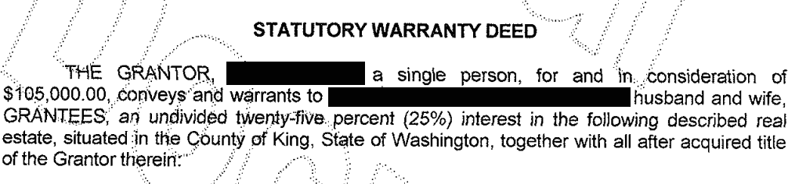

###### 图 4-4。最大负残差的法定保证书

对于大数据问题，异常值通常不是拟合回归用于预测新数据时的问题。然而，在异常检测中，异常值是核心，其目的就是找到异常值。异常值也可能对应于欺诈案例或意外行为。无论哪种情况，检测异常值都可能是业务上的关键需求。

## 有影响力的值

一个值，如果去掉会显著改变回归方程，被称为*有影响力的观测*。在回归中，这样的值不一定与大的残差相关联。例如，考虑图 4-5 中的回归线。实线对应于所有数据的回归，而虚线对应于移除右上角的点的回归。显然，即使与大的异常值（来自完整回归）无关，该数据值对回归的影响仍然巨大。认为这个数据值对回归具有很高的*杠杆*。

除了标准化残差（参见“异常值”），统计学家还开发了几个度量标准，以确定单个记录对回归的影响。一个常见的杠杆度量是*帽子值*；值大于<math alttext="2 左括号 上标 P 加 1 右括号 斜杠 n"><mrow><mn>2</mn> <mo>(</mo> <msup><mi>P</mi><mo>+</mo><mn>1</mn></msup> <mo>)</mo> <mo>/</mo> <mi>n</mi></mrow></math>表示高杠杆的数据值。⁶

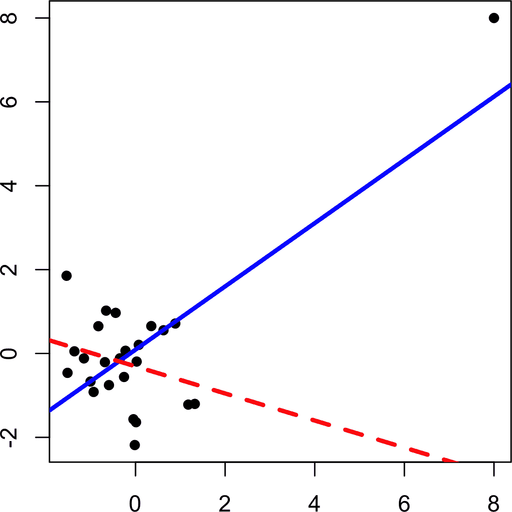

###### 图 4-5 回归中有影响力的数据点的示例

另一个度量标准是*Cook 距离*，它将影响定义为杠杆和残差大小的组合。一个经验法则是，如果 Cook 距离超过<math alttext="4 斜杠 左括号 n 减 上标 P 减 1 右括号"><mrow><mn>4</mn> <mo>/</mo> <mo>(</mo> <mi>n</mi> <mo>-</mo> <msup><mi>P</mi><mo>-</mo><mn>1</mn></msup> <mo>)</mo></mrow></math>，则观测具有很高的影响力。

*影响力图*或*气泡图*将标准化残差、帽子值和 Cook 距离结合在一个图中。图 4-6 显示了金县房屋数据的影响力图，并可以通过以下*R*代码创建：

```py
std_resid <- rstandard(lm_98105)
cooks_D <- cooks.distance(lm_98105)
hat_values <- hatvalues(lm_98105)
plot(subset(hat_values, cooks_D > 0.08), subset(std_resid, cooks_D > 0.08),
     xlab='hat_values', ylab='std_resid',
     cex=10*sqrt(subset(cooks_D, cooks_D > 0.08)), pch=16, col='lightgrey')
points(hat_values, std_resid, cex=10*sqrt(cooks_D))
abline(h=c(-2.5, 2.5), lty=2)
```

下面是创建类似图形的*Python*代码：

```py
influence = OLSInfluence(result_98105)
fig, ax = plt.subplots(figsize=(5, 5))
ax.axhline(-2.5, linestyle='--', color='C1')
ax.axhline(2.5, linestyle='--', color='C1')
ax.scatter(influence.hat_matrix_diag, influence.resid_studentized_internal,
           s=1000 * np.sqrt(influence.cooks_distance[0]),
           alpha=0.5)
ax.set_xlabel('hat values')
ax.set_ylabel('studentized residuals')
```

显然有几个数据点在回归中具有很大的影响。可以使用函数`cooks.distance`计算 Cook 距离，可以使用`hatvalues`计算诊断结果。帽子值绘制在 x 轴上，残差绘制在 y 轴上，点的大小与 Cook 距离的值相关。

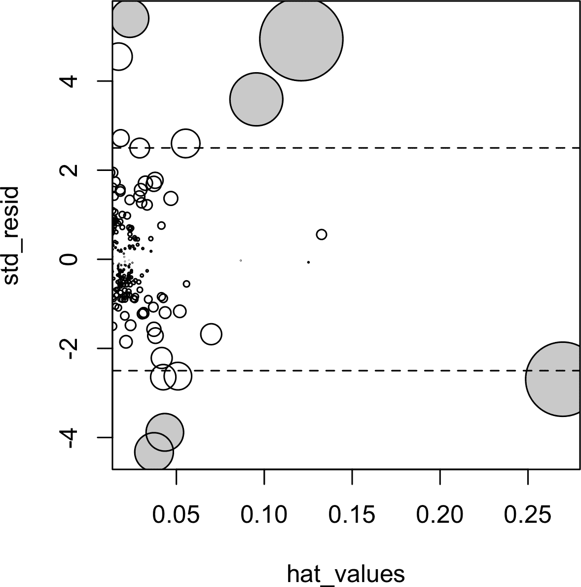

###### 图 4-6 一个绘图以确定哪些观测具有很高的影响力；Cook 距离大于 0.08 的点以灰色突出显示

表 4-2 比较了使用完整数据集和去除高度有影响力的数据点（Cook 距离 > 0.08）的回归。

`Bathrooms`的回归系数发生了相当大的变化。⁷

表 4-2 比较了使用完整数据和去除有影响力数据后的回归系数

|  | 原始数据 | 去除影响后 |
| --- | --- | --- |
| (Intercept) | –772,550 | –647,137 |
| SqFtTotLiving | 210 | 230 |
| SqFtLot | 39 | 33 |
| Bathrooms | 2282 | –16,132 |
| Bedrooms | –26,320 | –22,888 |
| BldgGrade | 130,000 | 114,871 |

为了可靠地拟合可以预测未来数据的回归模型，识别具有影响力的观察结果仅在较小的数据集中有用。对于涉及大量记录的回归，单个观察结果不太可能对拟合方程产生极端影响（尽管回归仍可能存在极大的异常值）。然而，对于异常检测的目的，识别具有影响力的观察结果是非常有用的。

## 异方差性、非正态性和相关误差

统计学家非常关注残差的分布。事实证明，普通最小二乘法（见“最小二乘法”）在广泛的分布假设下是无偏的，并且在某些情况下是“最优”的估计量。这意味着在大多数问题中，数据科学家不需要过于担心残差的分布。

残差的分布主要与正式统计推断（假设检验和 p 值）的有效性相关，这对主要关注预测准确性的数据科学家影响较小。正态分布的误差表明模型完整；不正态分布的误差表明模型可能存在遗漏。为了使正式推断完全有效，假设残差正态分布、方差相同且独立。数据科学家可能关注的一个领域是对预测值的置信区间的标准计算，这些置信区间基于对残差的假设（见“置信区间与预测区间”）。

*异方差性* 指的是在预测值范围内残差方差不恒定。换句话说，某些范围内的误差比其他范围大。可视化数据是分析残差的方便方式。

在 *R* 中，以下代码绘制了`lm_98105`回归拟合中预测值的绝对残差与预测值的关系图，详见“异常值”：

```py
df <- data.frame(resid = residuals(lm_98105), pred = predict(lm_98105))
ggplot(df, aes(pred, abs(resid))) + geom_point() + geom_smooth()
```

图 4-7 展示了得到的图形。使用 `geom_smooth`，可以轻松叠加绝对残差的平滑曲线。该函数调用 `loess` 方法（局部估计散点图平滑）生成 x 轴和 y 轴上变量关系的平滑估计散点图（见“散点图平滑处理”）。

在 *Python* 中，`seaborn`包中的`regplot`函数可以创建类似的图形：

```py
fig, ax = plt.subplots(figsize=(5, 5))
sns.regplot(result_98105.fittedvalues, np.abs(result_98105.resid),
            scatter_kws={'alpha': 0.25}, line_kws={'color': 'C1'},
            lowess=True, ax=ax)
ax.set_xlabel('predicted')
ax.set_ylabel('abs(residual)')
```

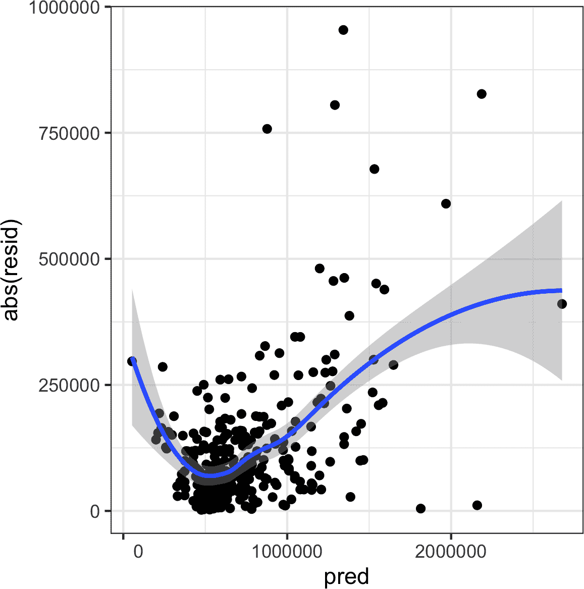

###### 图 4-7\. 绘制残差绝对值与预测值关系图

显然，残差的方差在更高价值的房屋上倾向于增加，但在更低价值的房屋上也很大。此图表明`lm_98105`具有*异方差*的误差。

# 数据科学家为什么要关心异方差性？

异方差性表明不同预测值范围的预测误差不同，并且可能暗示模型不完整。例如，`lm_98105`中的异方差性可能表明回归在高价值和低价值房屋中留下了一些未解释的因素。

图 4-8 是对`lm_98105`回归的标准化残差的直方图。该分布的尾部明显比正态分布长，并且在较大残差方向上呈现轻微偏斜。

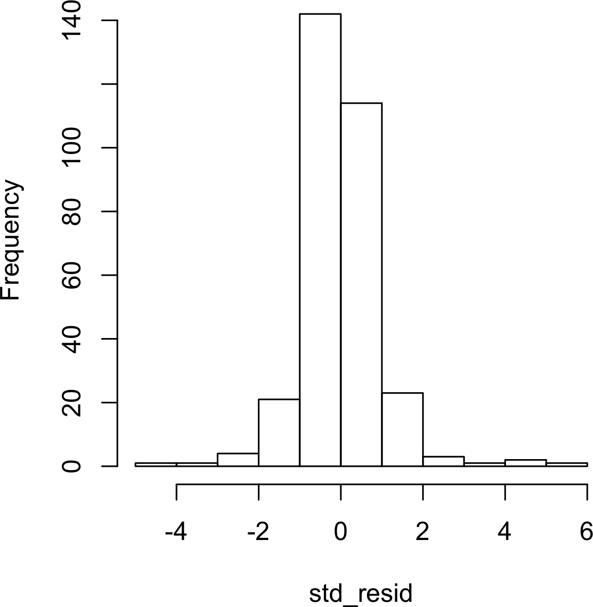

###### 图 4-8。房屋数据回归残差的直方图

统计学家可能还会检查误差是否独立。这对于随时间或空间收集的数据尤为重要。 *德宾-沃森*统计量可用于检测涉及时间序列数据的回归中是否存在显著的自相关性。如果回归模型的误差相关，则此信息可以有助于进行短期预测，并应纳入模型中。请参阅 Galit Shmueli 和 Kenneth Lichtendahl（Axelrod Schnall，2018）的*用 R 进行实用时间序列预测*第 2 版，以了解有关如何将自相关信息构建到用于时间序列数据的回归模型中的更多信息。如果目标是更长期的预测或解释模型，则微观层面上的过多自相关数据可能会分散注意力。在这种情况下，平滑处理或首先收集更少细粒度的数据可能是适当的。

即使回归可能违反了分布假设之一，我们是否应该在意呢？在数据科学中，兴趣主要在于预测准确性，因此可能需要对异方差性进行一些审查。您可能会发现数据中存在一些模型未捕获的信号。然而，仅仅为了验证正式的统计推断（p 值，F 统计量等）而满足分布假设并不是对于数据科学家非常重要的。

# 散点平滑曲线

回归是关于响应变量和预测变量之间关系建模的。在评估回归模型时，使用*散点平滑曲线*可以直观地突出两个变量之间的关系是很有用的。

例如，在 图 4-7 中，绝对残差与预测值之间关系的平滑显示出残差的方差取决于残差值。在这种情况下，使用了 `loess` 函数；`loess` 的工作原理是通过反复拟合一系列局部回归来实现平滑。虽然 `loess` 可能是最常用的平滑方法，*R* 中还提供了其他散点图平滑方法，如超平滑 (`supsmu`) 和核平滑 (`ksmooth`)。在 *Python* 中，我们可以在 `scipy` (`wiener` 或 `sav`) 和 `statsmodels` (`kernel_regression`) 中找到额外的平滑方法。对于评估回归模型，通常不需要担心这些散点图平滑方法的细节。

## 局部残差图和非线性

*局部残差图* 是可视化估计拟合效果和预测变量与结果之间关系的一种方式。局部残差图的基本思想是隔离一个预测变量与响应之间的关系，*考虑所有其他预测变量*。局部残差可以被视为一个“合成结果”值，将基于单个预测变量的预测与全回归方程的实际残差结合起来。对于预测变量 <math alttext="upper X Subscript i"><msub><mi>X</mi> <mi>i</mi></msub></math> 的局部残差是普通残差加上与 <math alttext="upper X Subscript i"><msub><mi>X</mi> <mi>i</mi></msub></math> 相关的回归项：

<math display="block" alttext="Partial residual equals Residual plus ModifyingAbove b With caret Subscript i Baseline upper X Subscript i Baseline"><mrow><mtext>Partial</mtext> <mtext>residual</mtext> <mo>=</mo> <mtext>Residual</mtext> <mo>+</mo> <msub><mover accent="true"><mi>b</mi> <mo>^</mo></mover> <mi>i</mi></msub> <msub><mi>X</mi> <mi>i</mi></msub></mrow></math>

其中 <math alttext="ModifyingAbove b With caret Subscript i"><msub><mover accent="true"><mi>b</mi> <mo>^</mo></mover> <mi>i</mi></msub></math> 是估计的回归系数。在 *R* 中的 `predict` 函数有一个选项可以返回单个回归项 <math alttext="ModifyingAbove b With caret Subscript i Baseline upper X Subscript i"><mrow><msub><mover accent="true"><mi>b</mi> <mo>^</mo></mover> <mi>i</mi></msub> <msub><mi>X</mi> <mi>i</mi></msub></mrow></math> ：

```py
terms <- predict(lm_98105, type='terms')
partial_resid <- resid(lm_98105) + terms
```

局部残差图显示了 <math alttext="upper X Subscript i"><msub><mi>X</mi> <mi>i</mi></msub></math> 预测变量在 x 轴上和局部残差在 y 轴上。使用 `ggplot2` 能够轻松叠加局部残差的平滑曲线：

```py
df <- data.frame(SqFtTotLiving = house_98105[, 'SqFtTotLiving'],
                 Terms = terms[, 'SqFtTotLiving'],
                 PartialResid = partial_resid[, 'SqFtTotLiving'])
ggplot(df, aes(SqFtTotLiving, PartialResid)) +
  geom_point(shape=1) + scale_shape(solid = FALSE) +
  geom_smooth(linetype=2) +
  geom_line(aes(SqFtTotLiving, Terms))
```

`statsmodels` 包中有一个名为 `sm.graphics.plot_ccpr` 的方法，可以创建类似的局部残差图：

```py
sm.graphics.plot_ccpr(result_98105, 'SqFtTotLiving')
```

*R* 和 *Python* 中的图表相差一个常数偏移量。在 *R* 中，添加一个常数以使项的平均值为零。

结果图显示在图 4-9 中。部分残差是对`SqFtTotLiving`对销售价格贡献的估计。`SqFtTotLiving`与销售价格之间的关系显然是非线性的（虚线）。回归线（实线）低估了小于 1,000 平方英尺的房屋的销售价格，并高估了 2,000 到 3,000 平方英尺之间的房屋价格。对于超过 4,000 平方英尺的房屋，数据点太少，无法得出结论。


###### 图 4-9\. 变量`SqFtTotLiving`的部分残差图

在这种情况下，这种非线性是有道理的：在小房屋中增加 500 平方英尺会产生比在大房屋中增加 500 平方英尺更大的差异。这表明，与其对`SqFtTotLiving`使用简单的线性项，不如考虑非线性项（参见“多项式和样条回归”）。

# 多项式和样条回归

响应与预测变量之间的关系不一定是线性的。对药物剂量的反应通常是非线性的：加倍剂量通常不会导致加倍的反应。产品需求并非是营销投入的线性函数；在某些点上，需求可能会饱和。有许多方法可以扩展回归以捕捉这些非线性效应。

# 非线性回归

当统计学家谈论*非线性回归*时，他们指的是无法使用最小二乘法拟合的模型。哪些模型是非线性的？基本上所有响应不能表达为预测变量的线性组合或其某种变换的模型。非线性回归模型更难且计算量更大，因为它们需要数值优化。因此，如果可能的话，通常更倾向于使用线性模型。

## 多项式

*多项式回归*涉及在回归方程中包含多项式项。使用多项式回归几乎可以追溯到回归本身的发展，比如 Gergonne 在 1815 年的一篇论文中。例如，响应*Y*与预测变量*X*之间的二次回归将采取以下形式：

<math display="block"><mrow><mi>Y</mi> <mo>=</mo> <msub><mi>b</mi> <mn>0</mn></msub> <mo>+</mo> <msub><mi>b</mi> <mn>1</mn></msub> <mi>X</mi> <mo>+</mo> <msub><mi>b</mi> <mn>2</mn></msub> <msup><mi>X</mi> <mn>2</mn></msup> <mo>+</mo> <mi>e</mi></mrow></math>

多项式回归可以通过*R*中的`poly`函数进行拟合。例如，以下示例使用 King County 房屋数据为`SqFtTotLiving`拟合二次多项式：

```py
lm(AdjSalePrice ~  poly(SqFtTotLiving, 2) + SqFtLot +
                BldgGrade + Bathrooms + Bedrooms,
                    data=house_98105)

Call:
lm(formula = AdjSalePrice ~ poly(SqFtTotLiving, 2) + SqFtLot +
   BldgGrade + Bathrooms + Bedrooms, data = house_98105)

Coefficients:
           (Intercept)  poly(SqFtTotLiving, 2)1  poly(SqFtTotLiving, 2)2
            -402530.47               3271519.49                776934.02
               SqFtLot                BldgGrade                Bathrooms
                 32.56                135717.06                 -1435.12
              Bedrooms
              -9191.94
```

在`statsmodels`中，我们使用`I(SqFtTotLiving**2)`将平方项添加到模型定义中：

```py
model_poly = smf.ols(formula='AdjSalePrice ~  SqFtTotLiving + ' +
                '+ I(SqFtTotLiving**2) + ' +
                'SqFtLot + Bathrooms + Bedrooms + BldgGrade', data=house_98105)
result_poly = model_poly.fit()
result_poly.summary()  
```


截距和多项式系数与*R*不同。这是由于不同的实现。其余系数和预测是等效的。

现在与`SqFtTotLiving`相关联的系数有两个：一个是线性项，另一个是二次项。

局部残差图（请参阅 “局部残差图和非线性”）表明回归方程与 `SqFtTotLiving` 相关的曲率。与线性拟合相比，拟合线更接近局部残差的平滑（请参阅 “样条”）而不是图 4-10 中的多项式回归拟合。

`statsmodels` 实现仅适用于线性项。附带的源代码提供了一个对多项式回归也适用的实现。

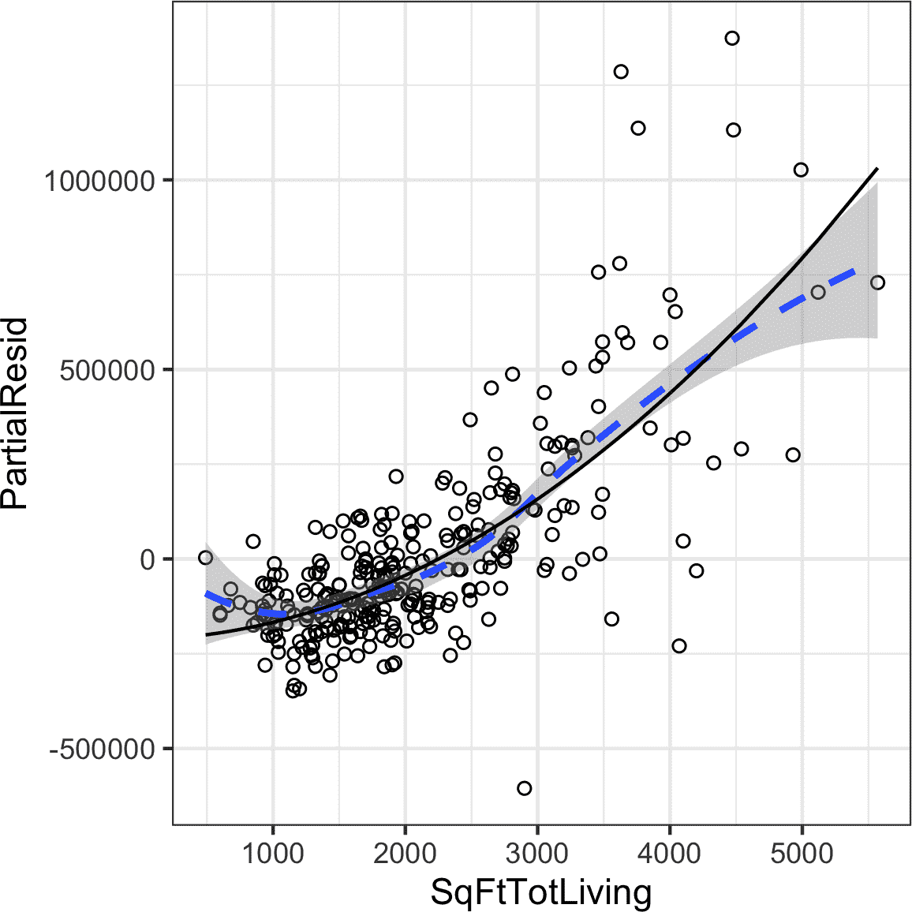

###### 图 4-10\. 变量 `SqFtTotLiving` 的多项式回归拟合（实线）与平滑曲线（虚线；关于样条的详细内容请参见下一节）

## 样条

多项式回归仅捕捉非线性关系中的一定曲率。添加更高阶的项，如四次多项式，通常会导致回归方程中不期望的“波动”。对建模非线性关系的一种替代和通常更优越的方法是使用*样条*。*样条*提供了一种在固定点之间平滑插值的方法。样条最初由制图员用于绘制平滑曲线，特别是在船舶和飞机建造中。

样条是通过使用权重弯曲薄木片（称为“鸭子”）制作的；请参阅 图 4-11。


###### 图 4-11\. 样条最初是使用可弯曲的木材和“鸭子”制作的，是制图员用来拟合曲线的工具（照片由 Bob Perry 提供）

样条的技术定义是一系列分段连续的多项式。它们最早在二战期间由罗马尼亚数学家 I. J. Schoenberg 在美国阿伯丁试验场首次开发。多项式片段在预测变量的一系列固定点上平滑连接，称为*节点*。样条的制定比多项式回归复杂得多；统计软件通常处理样条拟合的详细信息。*R* 软件包 `splines` 包括函数 `bs`，用于在回归模型中创建*b-样条*（基础样条）项。例如，以下向房屋回归模型添加了一个 b-样条项：

```py
library(splines)
knots <- quantile(house_98105$SqFtTotLiving, p=c(.25, .5, .75))
lm_spline <- lm(AdjSalePrice ~ bs(SqFtTotLiving, knots=knots, degree=3) +
  SqFtLot + Bathrooms + Bedrooms + BldgGrade,  data=house_98105)
```

需要指定两个参数：多项式的阶数和节点的位置。在本例中，预测变量 `SqFtTotLiving` 使用三次样条（`degree=3`）模型。默认情况下，`bs` 将节点放置在边界；此外，还在下四分位数、中位数四分位数和上四分位数处放置了节点。

在 *statsmodels* 的公式接口中，支持类似于 *R* 的样条用法。这里，我们使用 `df` 指定 *b-样条*，其自由度为 `df`。这将创建 `df` – `degree` = 6 – 3 = 3 个内部节点，其位置与上述 *R* 代码中计算的方式相同：

```py
formula = 'AdjSalePrice ~ bs(SqFtTotLiving, df=6, degree=3) + ' +
          'SqFtLot + Bathrooms + Bedrooms + BldgGrade'
model_spline = smf.ols(formula=formula, data=house_98105)
result_spline = model_spline.fit()
```

与线性项相比，样条项的系数没有直接含义。因此，使用视觉显示来揭示样条拟合的性质更为有用。图 4-12（#SplineRegressionPlot）显示了回归的部分残差图。与多项式模型相比，样条模型更接近平滑，展示了样条的更大灵活性。在这种情况下，曲线更贴近数据。这是否意味着样条回归是更好的模型？未必：经济上不合理的是，非常小的房屋（小于 1,000 平方英尺）的价值可能比稍大的房屋高。这可能是混杂变量的结果；请参阅 “混杂变量”。

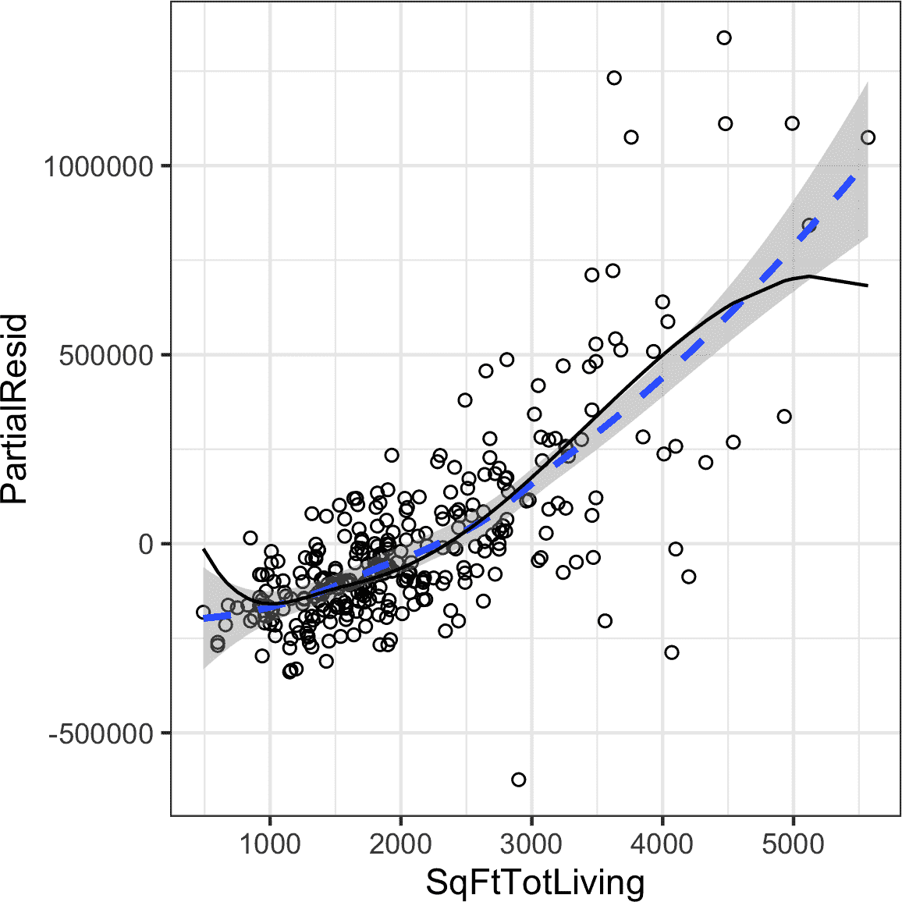

###### 图 4-12\. 变量 `SqFtTotLiving` 的样条回归拟合（实线）与平滑曲线（虚线）对比

## 广义可加模型

假设您怀疑响应与预测变量之间存在非线性关系，可以通过先验知识或检查回归诊断来确定。多项式项可能无法灵活捕捉关系，而样条项则需要指定节点。*广义可加模型*（*Generalized additive models*），简称*GAM*，是一种灵活的建模技术，可以用于自动拟合样条回归。在 *R* 中，`mgcv` 包可用于将 GAM 模型拟合到房屋数据中：

```py
library(mgcv)
lm_gam <- gam(AdjSalePrice ~ s(SqFtTotLiving) + SqFtLot +
                    Bathrooms +  Bedrooms + BldgGrade,
                    data=house_98105)
```

术语 `s(SqFtTotLiving)` 告诉 `gam` 函数查找样条项的“最佳”节点（见 图 4-13）。

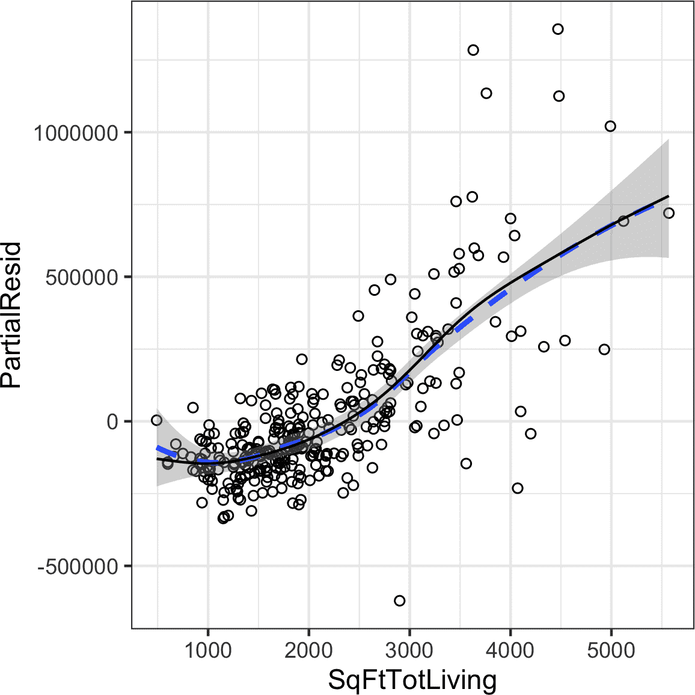

###### 图 4-13\. 变量 `SqFtTotLiving` 的 GAM 回归拟合（实线）与平滑曲线（虚线）对比

在 *Python* 中，我们可以使用 `pyGAM` 包。它提供了回归和分类的方法。在这里，我们使用 `LinearGAM` 来创建回归模型：

```py
predictors = ['SqFtTotLiving', 'SqFtLot', 'Bathrooms',  'Bedrooms', 'BldgGrade']
outcome = 'AdjSalePrice'
X = house_98105[predictors].values
y = house_98105[outcome]

gam = LinearGAM(s(0, n_splines=12) + l(1) + l(2) + l(3) + l(4))  
gam.gridsearch(X, y)
```


`n_splines` 的默认值为 20\. 对于较大的 `SqFtTotLiving` 值，这会导致过拟合。值为 12 可以得到一个更合理的拟合。

## 进一步阅读

+   关于样条模型和 GAM，请参阅《统计学习的要素》第二版（2009），作者 Trevor Hastie、Robert Tibshirani 和 Jerome Friedman，以及其基于 *R* 的较短版本，《统计学习导论》（2013），作者 Gareth James、Daniela Witten、Trevor Hastie 和 Robert Tibshirani，两者均为 Springer 出版。

+   欲了解更多关于使用回归模型进行时间序列预测的信息，请参阅 Galit Shmueli 和 Kenneth Lichtendahl 的《使用 R 进行实用时间序列预测》（Axelrod Schnall，2018）。

# 总结

或许没有其他统计方法像回归那样多年来被广泛使用——建立多个预测变量与一个结果变量之间关系的过程。其基本形式为线性：每个预测变量都有一个系数，描述其与结果的线性关系。更高级的回归形式，如多项式和样条回归，允许关系是非线性的。在经典统计中，重点是找到与观察数据良好匹配的模型来解释或描述某一现象，模型的强度是通过传统的*样本内*指标来评估。相反，在数据科学中，目标通常是对新数据进行预测，因此使用基于预测精度的样本外数据指标。变量选择方法用于减少维度并创建更紧凑的模型。

¹ 本章及后续章节内容 © 2020 Datastats, LLC，Peter Bruce，Andrew Bruce 和 Peter Gedeck；经许可使用。

² 在贝叶斯统计中，真实值被假定为具有特定分布的随机变量。在贝叶斯背景下，不是未知参数的估计，而是后验和先验分布。

³ `model.matrix` 中的 `-1` 参数产生一种独热编码表示（通过删除截距，因此为“-”）。否则，在 *R* 中默认生成一个具有 *P* - 1 列的矩阵，其中第一个因子水平作为参考。

⁴ 这看起来不直观，但可以解释为位置作为混杂变量的影响；详见“混杂变量”。

⁵ 金县有 80 个邮政编码，其中几个只有少量销售。`ZipGroup`是将相似的邮政编码聚类到一个组中，作为因子变量的一种替代方案。详见“具有多个水平的因子变量”。

⁶ 术语*帽值*源于回归中帽矩阵的概念。多元线性回归可以用公式表示为 <math alttext="ModifyingAbove upper Y With caret equals upper H upper Y"><mrow><mover accent="true"><mi>Y</mi> <mo>^</mo></mover> <mo>=</mo> <mi>H</mi> <mi>Y</mi></mrow></math> 其中 <math alttext="upper H"><mi>H</mi></math> 是帽矩阵。帽值对应于 <math alttext="upper H"><mi>H</mi></math> 的对角线。

⁷ `Bathrooms` 的系数变为负数，这是不直观的。没有考虑到地理位置，而且邮政编码 98105 包含了不同类型的住宅区域。参见“混杂变量”讨论混杂变量。
