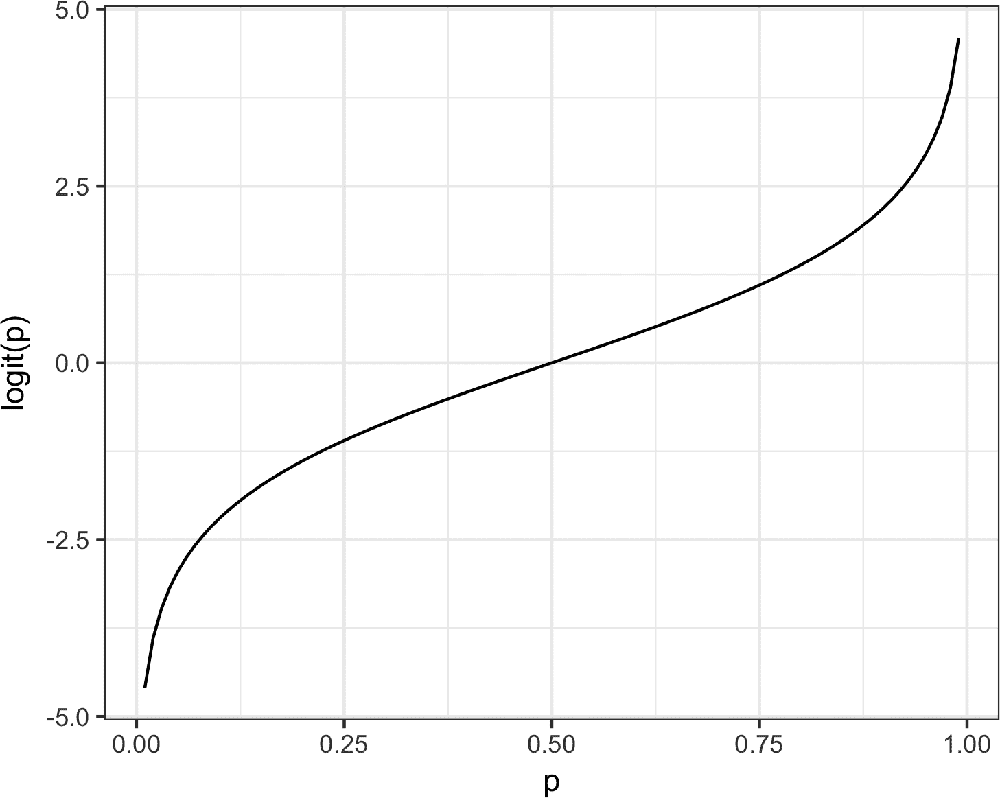

# 第五章：分类

数据科学家经常被要求自动化解决业务问题的决策。一封电子邮件是否是钓鱼尝试？客户是否可能流失？网页用户是否可能点击广告？这些都是*分类*问题，一种*监督学习*形式，我们首先在已知结果的数据上训练模型，然后将模型应用于结果未知的数据。分类可能是最重要的预测形式：目标是预测记录是 1 还是 0（钓鱼/非钓鱼，点击/不点击，流失/不流失），或者在某些情况下是多个类别之一（例如，Gmail 将您的收件箱分类为“主要”，“社交”，“促销”或“论坛”）。

通常，我们需要的不仅仅是简单的二元分类：我们想知道案例属于某个类别的预测概率。与其让模型简单地分配一个二元分类不同，大多数算法可以返回属于感兴趣类别的概率分数（倾向性）。实际上，在逻辑回归中，默认输出是在对数几率（log-odds）尺度上，必须将其转换为倾向性。在*Python*的`scikit-learn`中，逻辑回归与大多数分类方法一样，提供两种预测方法：`predict`（返回类别）和`predict_proba`（返回每个类别的概率）。然后可以使用滑动截止点将倾向性分数转换为决策。一般的方法如下所示：

1.  为感兴趣的类别建立一个截止概率，高于这个概率则认为记录属于该类别。

1.  估计（使用任何模型）记录属于感兴趣类别的概率。

1.  如果该概率高于截止概率，则将新记录分配给感兴趣的类别。

截止点越高，预测为 1 的记录越少，即认为属于感兴趣类别的记录越少。截止点越低，预测为 1 的记录越多。

本章涵盖了几种关键的分类技术和估计倾向性的方法；下一章描述了可以用于分类和数值预测的其他方法。

# 朴素贝叶斯

朴素贝叶斯算法使用观察到的预测器值的概率，给定一个结果，来估计真正感兴趣的内容：观察到结果*Y = i*的概率，给定一组预测器值。^(1)

要理解朴素贝叶斯分类，我们可以从想象完全或精确的贝叶斯分类开始。对于要分类的每条记录：

1.  找到具有相同预测配置文件的所有其他记录（即预测值相同的地方）。

1.  确定这些记录属于哪些类别，并且哪个类别最普遍（即最可能）。

1.  分配该类别给新记录。

上述方法相当于找到样本中与要分类的新记录完全相同的所有记录，即所有预测变量值都相同。

###### 注意

标签预测变量必须是标准朴素贝叶斯算法中的分类（因子）变量。有关使用连续变量的两种解决方案，请参阅“数值预测变量”。

## 为什么精确贝叶斯分类不切实际

当预测变量的数量超过几个时，将没有准确匹配的记录将要分类。考虑一个根据人口统计变量预测投票的模型。即使是一个相当大的样本，也可能不包含一个新记录的准确匹配，该记录是美国中西部高收入的男性拉丁裔，在上次选举中投票，在上次选举中没有投票，有三个女儿和一个儿子，离过婚。而且这只是八个变量，对于大多数分类问题来说是一个小数量。只需添加一个具有五个同等频率类别的新变量，就会将匹配概率降低 5 倍。

## 朴素解决方案

在朴素贝叶斯解决方案中，我们不再将概率计算限制为与要分类的记录匹配的那些记录。相反，我们使用整个数据集。朴素贝叶斯修改如下：

1.  对于二元响应 *Y = i*（*i* = 0 或 1），估算每个预测变量 <math alttext="upper P left-parenthesis upper X Subscript j Baseline vertical-bar upper Y equals i right-parenthesis"><mrow><mi>P</mi> <mo>(</mo> <msub><mi>X</mi> <mi>j</mi></msub> <mo>|</mo> <mi>Y</mi> <mo>=</mo> <mi>i</mi> <mo>)</mo></mrow></math> 的条件概率；这些是观察 *Y = i* 时预测变量值在记录中的概率。该概率通过训练集中 *Y = i* 记录中 *X[j]* 值的比例来估算。

1.  将这些概率相乘，然后乘以属于 *Y = i* 的记录的比例。

1.  为所有类别重复步骤 1 和 2。

1.  通过将步骤 2 中为第 *i* 类计算的值除以所有类别的这种值的总和来估算结果 *i* 的概率。

1.  将记录分配给具有此预测变量集的最高概率的类别。

该朴素贝叶斯算法也可以陈述为根据一组预测变量 <math alttext="upper X 1 comma ellipsis comma upper X Subscript p Baseline"><mrow><msub><mi>X</mi> <mn>1</mn></msub> <mo>,</mo> <mo>⋯</mo> <mo>,</mo> <msub><mi>X</mi> <mi>p</mi></msub></mrow></math> 观察结果 *Y = i* 的概率的方程：

<math display="block"><mi>P</mi> <mo stretchy="false">(</mo> <mi>Y</mi> <mo>=</mo> <mi>i</mi> <mrow class="MJX-TeXAtom-ORD"><mo stretchy="false">|</mo></mrow> <msub><mi>X</mi> <mn>1</mn></msub> <mo>,</mo> <msub><mi>X</mi> <mn>2</mn></msub> <mo>,</mo> <mo>…</mo> <mo>,</mo> <msub><mi>X</mi> <mi>p</mi></msub> <mo stretchy="false">)</mo></math>

下面是使用精确贝叶斯分类计算类别概率的完整公式：

<math display="block"><mi>P</mi> <mo stretchy="false">(</mo> <mi>Y</mi> <mo>=</mo> <mi>i</mi> <mrow class="MJX-TeXAtom-ORD"><mo stretchy="false">|</mo></mrow> <msub><mi>X</mi> <mn>1</mn></msub> <mo>,</mo> <msub><mi>X</mi> <mn>2</mn></msub> <mo>,</mo> <mo>…</mo> <mo>,</mo> <msub><mi>X</mi> <mi>p</mi></msub> <mo stretchy="false">)</mo> <mo>=</mo> <mfrac><mrow><mi>P</mi> <mo stretchy="false">(</mo> <mi>Y</mi> <mo>=</mo> <mi>i</mi> <mo stretchy="false">)</mo> <mi>P</mi> <mo stretchy="false">(</mo> <msub><mi>X</mi> <mn>1</mn></msub> <mo>,</mo> <mo>…</mo> <mo>,</mo> <msub><mi>X</mi> <mi>p</mi></msub> <mrow class="MJX-TeXAtom-ORD"><mo stretchy="false">|</mo></mrow> <mi>Y</mi> <mo>=</mo> <mi>i</mi> <mo stretchy="false">)</mo></mrow> <mrow><mi>P</mi> <mo stretchy="false">(</mo> <mi>Y</mi> <mo>=</mo> <mn>0</mn> <mo stretchy="false">)</mo> <mi>P</mi> <mo stretchy="false">(</mo> <msub><mi>X</mi> <mn>1</mn></msub> <mo>,</mo> <mo>…</mo> <mo>,</mo> <msub><mi>X</mi> <mi>p</mi></msub> <mrow class="MJX-TeXAtom-ORD"><mo stretchy="false">|</mo></mrow> <mi>Y</mi> <mo>=</mo> <mn>0</mn> <mo stretchy="false">)</mo> <mo>+</mo> <mi>P</mi> <mo stretchy="false">(</mo> <mi>Y</mi> <mo>=</mo> <mn>1</mn> <mo stretchy="false">)</mo> <mi>P</mi> <mo stretchy="false">(</mo> <msub><mi>X</mi> <mn>1</mn></msub> <mo>,</mo> <mo>…</mo> <mo>,</mo> <msub><mi>X</mi> <mi>p</mi></msub> <mrow class="MJX-TeXAtom-ORD"><mo stretchy="false">|</mo></mrow> <mi>Y</mi> <mo>=</mo> <mn>1</mn> <mo stretchy="false">)</mo></mrow></mfrac></math>

根据条件独立的朴素贝叶斯假设，该方程变为：

<math display="block"><mi>P</mi> <mo stretchy="false">(</mo> <mi>Y</mi> <mo>=</mo> <mi>i</mi> <mrow class="MJX-TeXAtom-ORD"><mo stretchy="false">|</mo></mrow> <msub><mi>X</mi> <mn>1</mn></msub> <mo>,</mo> <msub><mi>X</mi> <mn>2</mn></msub> <mo>,</mo> <mo>…</mo> <mo>,</mo> <msub><mi>X</mi> <mi>p</mi></msub> <mo stretchy="false">)</mo> <mo>=</mo> <mfrac><mrow><mi>P</mi> <mo stretchy="false">(</mo> <mi>Y</mi> <mo>=</mo> <mi>i</mi> <mo stretchy="false">)</mo> <mi>P</mi> <mo stretchy="false">(</mo> <msub><mi>X</mi> <mn>1</mn></msub> <mrow class="MJX-TeXAtom-ORD"><mo stretchy="false">|</mo></mrow> <mi>Y</mi> <mo>=</mo> <mi>i</mi> <mo stretchy="false">)</mo> <mo>…</mo> <mi>P</mi> <mo stretchy="false">(</mo> <msub><mi>X</mi> <mi>p</mi></msub> <mrow class="MJX-TeXAtom-ORD"><mo stretchy="false">|</mo></mrow> <mi>Y</mi> <mo>=</mo> <mi>i</mi> <mo stretchy="false">)</mo></mrow> <mrow><mi>P</mi> <mo stretchy="false">(</mo> <mi>Y</mi> <mo>=</mo> <mn>0</mn> <mo stretchy="false">)</mo> <mi>P</mi> <mo stretchy="false">(</mo> <msub><mi>X</mi> <mn>1</mn></msub> <mrow class="MJX-TeXAtom-ORD"><mo stretchy="false">|</mo></mrow> <mi>Y</mi> <mo>=</mo> <mn>0</mn> <mo stretchy="false">)</mo> <mo>…</mo> <mi>P</mi> <mo stretchy="false">(</mo> <msub><mi>X</mi> <mi>p</mi></msub> <mrow class="MJX-TeXAtom-ORD"><mo stretchy="false">|</mo></mrow> <mi>Y</mi> <mo>=</mo> <mn>0</mn> <mo stretchy="false">)</mo> <mo>+</mo> <mi>P</mi> <mo stretchy="false">(</mo> <mi>Y</mi> <mo>=</mo> <mn>1</mn> <mo stretchy="false">)</mo> <mi>P</mi> <mo stretchy="false">(</mo> <msub><mi>X</mi> <mn>1</mn></msub> <mrow class="MJX-TeXAtom-ORD"><mo stretchy="false">|</mo></mrow> <mi>Y</mi> <mo>=</mo> <mn>1</mn> <mo stretchy="false">)</mo> <mo>…</mo> <mi>P</mi> <mo stretchy="false">(</mo> <msub><mi>X</mi> <mi>p</mi></msub> <mrow class="MJX-TeXAtom-ORD"><mo stretchy="false">|</mo></mrow> <mi>Y</mi> <mo>=</mo> <mn>1</mn> <mo stretchy="false">)</mo></mrow></mfrac></math>

为什么这个公式被称为“朴素”？我们做出了一个简化的假设，即给定观察结果的预测变量向量的*精确条件概率*可以通过各个条件概率的乘积 <math alttext="upper P left-parenthesis upper X Subscript j Baseline vertical-bar upper Y equals i right-parenthesis"><mrow><mi>P</mi> <mo>(</mo> <msub><mi>X</mi> <mi>j</mi></msub> <mo>|</mo> <mi>Y</mi> <mo>=</mo> <mi>i</mi> <mo>)</mo></mrow></math> 很好地估计。换句话说，在估计 <math alttext="upper P left-parenthesis upper X Subscript j Baseline vertical-bar upper Y equals i right-parenthesis"><mrow><mi>P</mi> <mo>(</mo> <msub><mi>X</mi> <mi>j</mi></msub> <mo>|</mo> <mi>Y</mi> <mo>=</mo> <mi>i</mi> <mo>)</mo></mrow></math> 而不是 <math alttext="upper P left-parenthesis upper X 1 comma upper X 2 comma ellipsis upper X Subscript p Baseline vertical-bar upper Y equals i right-parenthesis"><mrow><mi>P</mi> <mo>(</mo> <msub><mi>X</mi> <mn>1</mn></msub> <mo>,</mo> <msub><mi>X</mi> <mn>2</mn></msub> <mo>,</mo> <mo>⋯</mo> <msub><mi>X</mi> <mi>p</mi></msub> <mo>|</mo> <mi>Y</mi> <mo>=</mo> <mi>i</mi> <mo>)</mo></mrow></math> 的情况下，我们假设 <math alttext="upper X Subscript j"><msub><mi>X</mi> <mi>j</mi></msub></math> 对于所有其他预测变量 <math alttext="upper X Subscript k"><msub><mi>X</mi> <mi>k</mi></msub></math> （对于 <math alttext="k not-equals j"><mrow><mi>k</mi> <mo>≠</mo> <mi>j</mi></mrow></math> ）是*独立*的。

*R*中有几个包可以用来估计朴素贝叶斯模型。以下是使用`klaR`包对贷款支付数据拟合模型的示例：

```py
library(klaR)
naive_model <- NaiveBayes(outcome ~ purpose_ + home_ + emp_len_,
                          data = na.omit(loan_data))
naive_model$table
$purpose_
          var
grouping   credit_card debt_consolidation home_improvement major_purchase
  paid off  0.18759649         0.55215915       0.07150104     0.05359270
  default   0.15151515         0.57571347       0.05981209     0.03727229
          var
grouping      medical      other small_business
  paid off 0.01424728 0.09990737     0.02099599
  default  0.01433549 0.11561025     0.04574126

$home_
          var
grouping    MORTGAGE       OWN      RENT
  paid off 0.4894800 0.0808963 0.4296237
  default  0.4313440 0.0832782 0.4853778

$emp_len_
          var
grouping     < 1 Year   > 1 Year
  paid off 0.03105289 0.96894711
  default  0.04728508 0.95271492
```

模型的输出是条件概率 <math alttext="upper P left-parenthesis upper X Subscript j Baseline vertical-bar upper Y equals i right-parenthesis"><mrow><mi>P</mi> <mo>(</mo> <msub><mi>X</mi> <mi>j</mi></msub> <mo>|</mo> <mi>Y</mi> <mo>=</mo> <mi>i</mi> <mo>)</mo></mrow></math> 。

在*Python*中，我们可以使用`scikit-learn`中的`sklearn.naive_bayes.MultinomialNB`。在拟合模型之前，我们需要将分类特征转换为虚拟变量。

```py
predictors = ['purpose_', 'home_', 'emp_len_']
outcome = 'outcome'
X = pd.get_dummies(loan_data[predictors], prefix='', prefix_sep='')
y = loan_data[outcome]

naive_model = MultinomialNB(alpha=0.01, fit_prior=True)
naive_model.fit(X, y)
```

可以通过`feature_log_prob_`属性从拟合模型中导出条件概率。

该模型可用于预测新贷款的结果。我们使用数据集的最后一个值进行测试：

```py
new_loan <- loan_data[147, c('purpose_', 'home_', 'emp_len_')]
row.names(new_loan) <- NULL
new_loan
       	 purpose_    home_  emp_len_
	1 small_business MORTGAGE  > 1 Year
```

在*Python*中，我们可以这样获取该值：

```py
new_loan = X.loc[146:146, :]
```

在这种情况下，模型预测一个默认值（*R*）：

```py
predict(naive_model, new_loan)
$class
[1] default
Levels: paid off default

$posterior
      paid off   default
[1,] 0.3463013 0.6536987
```

正如我们讨论过的，`scikit-learn`的分类模型有两种方法——`predict`返回预测的类别，`predict_proba`返回类别概率：

```py
print('predicted class: ', naive_model.predict(new_loan)[0])

probabilities = pd.DataFrame(naive_model.predict_proba(new_loan),
                             columns=loan_data[outcome].cat.categories)
print('predicted probabilities', probabilities)
--
predicted class:  default
predicted probabilities
    default  paid off
0  0.653696  0.346304
```

预测还返回一个`posterior`概率的估计。朴素贝叶斯分类器因产生*偏倚*估计而闻名。然而，如果目标是根据*Y* = 1 的概率对记录进行*排名*，则不需要无偏估计，朴素贝叶斯能够产生良好的结果。

## 数值预测变量

贝叶斯分类器仅适用于分类预测变量（例如垃圾邮件分类，其中词语、短语、字符等的存在与否是预测任务的核心）。要将朴素贝叶斯应用于数值预测变量，必须采用以下两种方法之一：

+   将数值预测变量分箱并转换为分类预测变量，然后应用前一节的算法。

+   使用概率模型（例如正态分布，参见“正态分布”）来估计条件概率<math alttext="upper P left-parenthesis upper X Subscript j Baseline vertical-bar upper Y equals i right-parenthesis"><mrow><mi>P</mi> <mo>(</mo> <msub><mi>X</mi> <mi>j</mi></msub> <mo>|</mo> <mi>Y</mi> <mo>=</mo> <mi>i</mi> <mo>)</mo></mrow></math> 。

###### 警告

当训练数据中缺少预测变量类别时，该算法会将新数据中的结果变量概率分配为*零概率*，而不是简单地忽略该变量并使用其他变量的信息，如其他方法可能会做的那样。大多数朴素贝叶斯的实现都使用平滑参数（拉普拉斯平滑）来防止这种情况发生。

## 进一步阅读

+   *统计学习要素*，第 2 版，作者特雷弗·哈斯蒂、罗伯特·蒂布什拉尼和杰罗姆·弗里德曼（Springer，2009）。

+   在《商业分析数据挖掘》（Wiley，2007–2020，包括*R*、*Python*、Excel 和 JMP 版本）一书中有一整章介绍朴素贝叶斯。该书的作者是加利特·舒梅利、彼得·布鲁斯、尼汀·帕特尔、彼得·格德克、因巴尔·雅哈夫和肯尼斯·利克滕达尔。

# 判别分析

*判别分析*是最早的统计分类器；它由 R·A·费舍尔于 1936 年在《遗传学年刊》期刊上发表的一篇文章中介绍。^(2)

虽然判别分析包括几种技术，但最常用的是*线性判别分析*，即*LDA*。费舍尔最初提出的方法实际上与 LDA 略有不同，但其原理基本相同。随着更复杂技术的出现，如树模型和逻辑回归，LDA 的应用变得不那么广泛了。

但在某些应用中仍可能会遇到 LDA，并且它与其他更广泛使用的方法存在联系（例如主成分分析；参见“主成分分析”）。

###### 警告

线性判别分析不应与潜在狄利克雷分配（也称为 LDA）混淆。潜在狄利克雷分配用于文本和自然语言处理，与线性判别分析无关。

## 协方差矩阵

要理解判别分析，首先需要介绍两个或多个变量之间的 *协方差* 的概念。协方差衡量了变量 <math alttext="x"><mi>x</mi></math> 和 <math alttext="z"><mi>z</mi></math> 之间的关系。用 <math alttext="x overbar"><mover accent="true"><mi>x</mi> <mo>¯</mo></mover></math> 和 <math alttext="z overbar"><mover accent="true"><mi>z</mi> <mo>¯</mo></mover></math> 表示每个变量的均值（参见 “均值”）。变量 <math alttext="x"><mi>x</mi></math> 和 <math alttext="z"><mi>z</mi></math> 的协方差 <math alttext="s Subscript x comma z"><msub><mi>s</mi> <mrow><mi>x</mi><mo>,</mo><mi>z</mi></mrow></msub></math> 定义如下：

<math display="block"><mrow><msub><mi>s</mi> <mrow><mi>x</mi><mo>,</mo><mi>z</mi></mrow></msub> <mo>=</mo> <mfrac><mrow><msubsup><mo>∑</mo> <mrow><mi>i</mi><mo>=</mo><mn>1</mn></mrow> <mi>n</mi></msubsup> <mrow><mo>(</mo><msub><mi>x</mi> <mi>i</mi></msub> <mo>-</mo><mover accent="true"><mi>x</mi> <mo>¯</mo></mover><mo>)</mo></mrow><mrow><mo>(</mo><msub><mi>z</mi> <mi>i</mi></msub> <mo>-</mo><mover accent="true"><mi>z</mi> <mo>¯</mo></mover><mo>)</mo></mrow></mrow> <mrow><mi>n</mi><mo>-</mo><mn>1</mn></mrow></mfrac></mrow></math>

其中 *n* 为记录数（注意我们除以 *n* – 1 而不是 *n*；参见 “自由度，*n* 还是 *n* – 1？”）。

与相关系数类似（参见 “相关性”），正值表示正相关，负值表示负相关。但是，相关性的取值范围限制在 –1 到 1 之间，而协方差的尺度依赖于变量 <math alttext="x"><mi>x</mi></math> 和 <math alttext="z"><mi>z</mi></math> 的尺度。*协方差矩阵* <math alttext="normal upper Sigma"><mi>Σ</mi></math> 对于变量 <math alttext="x"><mi>x</mi></math> 和 <math alttext="z"><mi>z</mi></math> 包括对角线上的各自变量方差，<math alttext="s Subscript x Superscript 2"><msubsup><mi>s</mi> <mi>x</mi> <mn>2</mn></msubsup></math> 和 <math alttext="s Subscript z Superscript 2"><msubsup><mi>s</mi> <mi>z</mi> <mn>2</mn></msubsup></math> ，以及非对角线上的变量对之间的协方差：

<math display="block"><mrow><mover accent="true"><mi>Σ</mi> <mo>^</mo></mover> <mo>=</mo> <mfenced open="[" close="]"><mtable><mtr><mtd><msubsup><mi>s</mi> <mi>x</mi> <mn>2</mn></msubsup></mtd> <mtd><msub><mi>s</mi> <mrow><mi>x</mi><mo>,</mo><mi>z</mi></mrow></msub></mtd></mtr> <mtr><mtd><msub><mi>s</mi> <mrow><mi>z</mi><mo>,</mo><mi>x</mi></mrow></msub></mtd> <mtd><msubsup><mi>s</mi> <mi>z</mi> <mn>2</mn></msubsup></mtd></mtr></mtable></mfenced></mrow></math>

###### 注意

请记住，标准偏差用于将变量标准化为 *z*-分数；协方差矩阵用于这一标准化过程的多变量扩展。这称为马哈拉诺比斯距离（参见 “其他距离度量”），与 LDA 函数相关。

## 费歇尔线性判别

简单起见，让我们专注于一个分类问题，我们希望仅使用两个连续数值变量<math alttext="left-parenthesis x comma z right-parenthesis"><mrow><mo>(</mo> <mi>x</mi> <mo>,</mo> <mi>z</mi> <mo>)</mo></mrow></math>来预测二进制结果*y*。技术上，判别分析假设预测变量是正态分布的连续变量，但实际上，即使与正态分布的极端偏差，该方法也表现良好，并且适用于二元预测变量。费舍尔线性判别法区分了组间变异与组内变异。具体而言，试图将记录分为两组，线性判别分析（LDA）专注于最大化“组间”平方和<math alttext="normal upper S normal upper S Subscript normal b normal e normal t normal w normal e normal e normal n"><msub><mi>SS</mi> <mi>between</mi></msub></math>（衡量两组之间的变异）相对于“组内”平方和<math alttext="normal upper S normal upper S Subscript normal w normal i normal t normal h normal i normal n"><msub><mi>SS</mi> <mi>within</mi></msub></math>（衡量组内变异）。在这种情况下，两组对应于*y* = 0 的记录<math alttext="left-parenthesis x 0 comma z 0 right-parenthesis"><mrow><mo>(</mo> <msub><mi>x</mi> <mn>0</mn></msub> <mo>,</mo> <msub><mi>z</mi> <mn>0</mn></msub> <mo>)</mo></mrow></math>和*y* = 1 的记录<math alttext="left-parenthesis x 1 comma z 1 right-parenthesis"><mrow><mo>(</mo> <msub><mi>x</mi> <mn>1</mn></msub> <mo>,</mo> <msub><mi>z</mi> <mn>1</mn></msub> <mo>)</mo></mrow></math>。该方法找到了最大化这两个平方和比例的线性组合<math alttext="w Subscript x Baseline x plus w Subscript z Baseline z"><mrow><msub><mi>w</mi> <mi>x</mi></msub> <mi>x</mi> <mo>+</mo> <msub><mi>w</mi> <mi>z</mi></msub> <mi>z</mi></mrow></math>：

<math display="block"><mfrac><msub><mi>SS</mi> <mi>between</mi></msub> <msub><mi>SS</mi> <mi>within</mi></msub></mfrac></math>

组间平方和是两组均值之间的平方距离，组内平方和是每组内均值周围的加权协方差矩阵的扩展。直觉上，通过最大化组间平方和和最小化组内平方和，该方法实现了两组之间的最大分离。

## 简单示例

`MASS`包与 W. N. Venables 和 B. D. Ripley（Springer，1994）合著的书籍*Modern Applied Statistics with S*相关联，为*R*提供了 LDA 的函数。以下是将此函数应用于一组贷款数据样本，使用两个预测变量`borrower_score`和`payment_inc_ratio`，并输出估计的线性判别器权重：

```py
library(MASS)
loan_lda <- lda(outcome ~ borrower_score + payment_inc_ratio,
                     data=loan3000)
loan_lda$scaling
                          LD1
borrower_score 	   7.17583880
payment_inc_ratio -0.09967559
```

在*Python*中，我们可以使用`LinearDiscriminantAnalysis`来自`sklearn.discriminant_analysis`。`scalings_`属性给出了估计的权重：

```py
loan3000.outcome = loan3000.outcome.astype('category')

predictors = ['borrower_score', 'payment_inc_ratio']
outcome = 'outcome'

X = loan3000[predictors]
y = loan3000[outcome]

loan_lda = LinearDiscriminantAnalysis()
loan_lda.fit(X, y)
pd.DataFrame(loan_lda.scalings_, index=X.columns)
```

# 使用判别分析进行特征选择

如果在运行 LDA 之前对预测变量进行了标准化，那么判别权重就是变量重要性的度量，从而提供了一种计算效率高的特征选择方法。

`lda`函数可以预测“违约”与“已结清”的概率：

```py
pred <- predict(loan_lda)
head(pred$posterior)
   paid off   default
1 0.4464563 0.5535437
2 0.4410466 0.5589534
3 0.7273038 0.2726962
4 0.4937462 0.5062538
5 0.3900475 0.6099525
6 0.5892594 0.4107406
```

拟合模型的`predict_proba`方法返回“违约”和“已结清”结果的概率：

```py
pred = pd.DataFrame(loan_lda.predict_proba(loan3000[predictors]),
                    columns=loan_lda.classes_)
pred.head()
```

预测图有助于说明线性判别分析（LDA）的工作原理。使用`predict`函数的输出，可以生成关于违约概率的估计的图，如下所示：

```py
center <- 0.5 * (loan_lda$mean[1, ] + loan_lda$mean[2, ])
slope <- -loan_lda$scaling[1] / loan_lda$scaling[2]
intercept <- center[2] - center[1] * slope

ggplot(data=lda_df, aes(x=borrower_score, y=payment_inc_ratio,
                        color=prob_default)) +
  geom_point(alpha=.6) +
  scale_color_gradientn(colors=c('#ca0020', '#f7f7f7', '#0571b0')) +
  scale_x_continuous(expand=c(0,0)) +
  scale_y_continuous(expand=c(0,0), lim=c(0, 20)) +
  geom_abline(slope=slope, intercept=intercept, color='darkgreen')
```

在 Python 中使用以下代码创建类似的图：

```py
# Use scalings and center of means to determine decision boundary
center = np.mean(loan_lda.means_, axis=0)
slope = - loan_lda.scalings_[0] / loan_lda.scalings_[1]
intercept = center[1] - center[0] * slope

# payment_inc_ratio for borrower_score of 0 and 20
x_0 = (0 - intercept) / slope
x_20 = (20 - intercept) / slope

lda_df = pd.concat([loan3000, pred['default']], axis=1)
lda_df.head()

fig, ax = plt.subplots(figsize=(4, 4))
g = sns.scatterplot(x='borrower_score', y='payment_inc_ratio',
                    hue='default', data=lda_df,
                    palette=sns.diverging_palette(240, 10, n=9, as_cmap=True),
                    ax=ax, legend=False)

ax.set_ylim(0, 20)
ax.set_xlim(0.15, 0.8)
ax.plot((x_0, x_20), (0, 20), linewidth=3)
ax.plot(*loan_lda.means_.transpose())
```

生成的图如图 5-1 所示。在对角线线左侧的数据点被预测为违约（概率大于 0.5）。


###### 图 5-1. 使用两个变量（借款人信用评分和还款占收入比例）的 LDA 预测贷款违约情况

使用判别函数权重，LDA 将预测空间分成两个区域，如实线所示。在两个方向上距离该线更远的预测具有更高的置信度（即，概率远离 0.5）。

# 判别分析的扩展

更多预测变量：虽然本节的文本和示例仅使用了两个预测变量，但是 LDA 同样适用于超过两个预测变量。唯一的限制因素是记录的数量（估计协方差矩阵需要每个变量足够数量的记录，在数据科学应用中通常不是问题）。

判别分析还有其他变体。最知名的是二次判别分析（QDA）。尽管其名称如此，但 QDA 仍然是一个线性判别函数。主要区别在于，在 LDA 中，协方差矩阵被假定为对应于*Y* = 0 和*Y* = 1 的两组相同。在 QDA 中，允许两组的协方差矩阵不同。实际上，在大多数应用中，这种差异并不重要。

## 进一步阅读

+   Trevor Hastie、Robert Tibshirani 和 Jerome Friedman（Springer，2009）的《统计学习的要素》第二版和 Gareth James、Daniela Witten、Trevor Hastie 和 Robert Tibshirani（Springer，2013）的《统计学习简介》及其简化版都有一个关于判别分析的章节。

+   Galit Shmueli、Peter Bruce、Nitin Patel、Peter Gedeck、Inbal Yahav 和 Kenneth Lichtendahl（Wiley，2007–2020，涵盖*R*、*Python*、Excel 和 JMP 版本）的《商业分析的数据挖掘》有一个关于判别分析的完整章节。

+   出于历史兴趣，费舍尔关于这个主题的原始文章，“在分类问题中使用多个测量值”，于 1936 年发表在*优生学年鉴*（现称为*遗传学年鉴*）中，可以在[网上](https://oreil.ly/_TCR8)找到。

# 逻辑回归

逻辑回归类似于多元线性回归（见第四章），只是结果是二元的。 各种转换被用来将问题转换为可以拟合线性模型的问题。 与 *K* 近邻和朴素贝叶斯不同，类别判别分析与逻辑回归类似，它是一种结构化模型方法，而不是数据中心方法。 由于其快速的计算速度和输出易于快速评分新数据的模型，它是一种流行的方法。

## 逻辑响应函数和对数几率

逻辑回归的关键要素是 *逻辑响应函数* 和 *对数几率*，其中我们将一个概率（在 0-1 范围内）映射到更广泛的范围，适用于线性建模。

第一步是将结果变量看作不是二元标签，而是标签为“1”的概率 *p*。 幼稚地说，我们可能会诱使将 *p* 建模为预测变量的线性函数：

<math display="block"><mrow><mi>p</mi> <mo>=</mo> <msub><mi>β</mi> <mn>0</mn></msub> <mo>+</mo> <msub><mi>β</mi> <mn>1</mn></msub> <msub><mi>x</mi> <mn>1</mn></msub> <mo>+</mo> <msub><mi>β</mi> <mn>2</mn></msub> <msub><mi>x</mi> <mn>2</mn></msub> <mo>+</mo> <mo>⋯</mo> <mo>+</mo> <msub><mi>β</mi> <mi>q</mi></msub> <msub><mi>x</mi> <mi>q</mi></msub></mrow></math>

然而，拟合这个模型并不能确保 *p* 会最终落在 0 和 1 之间，因为概率必须如此。

相反，我们通过将 *logistic response* 或 *inverse logit* 函数应用到预测变量上来对 *p* 进行建模：

<math display="block"><mrow><mi>p</mi> <mo>=</mo> <mfrac><mn>1</mn> <mrow><mn>1</mn><mo>+</mo><msup><mi>e</mi> <mrow><mo>-</mo><mo>(</mo><msub><mi>β</mi> <mn>0</mn></msub> <mo>+</mo><msub><mi>β</mi> <mn>1</mn></msub> <msub><mi>x</mi> <mn>1</mn></msub> <mo>+</mo><msub><mi>β</mi> <mn>2</mn></msub> <msub><mi>x</mi> <mn>2</mn></msub> <mo>+</mo><mo>⋯</mo><mo>+</mo><msub><mi>β</mi> <mi>q</mi></msub> <msub><mi>x</mi> <mi>q</mi></msub> <mo>)</mo></mrow></msup></mrow></mfrac></mrow></math>

这个转换确保 *p* 保持在 0 和 1 之间。

为了将指数表达式从分母中提取出来，我们考虑*赔率*而不是概率。 赔率，对于所有赌徒来说都很熟悉，是“成功”（1）与“失败”（0）的比率。 就概率而言，赔率是事件发生的概率除以事件不发生的概率。 例如，如果一匹马获胜的概率为 0.5，则“不会获胜”的概率为（1 - 0.5）= 0.5，而赔率为 1.0：

<math display="block"><mrow><mi>Odds</mi> <mrow><mo>(</mo> <mi>Y</mi> <mo>=</mo> <mn>1</mn> <mo>)</mo></mrow> <mo>=</mo> <mfrac><mi>p</mi> <mrow><mn>1</mn><mo>-</mo><mi>p</mi></mrow></mfrac></mrow></math>

我们可以使用逆赔率函数从赔率中获得概率：

<math display="block"><mrow><mi>p</mi> <mo>=</mo> <mfrac><mi>Odds</mi> <mrow><mn>1</mn><mo>+</mo> <mi>Odds</mi></mrow></mfrac></mrow></math>

我们将这个与前面显示的 logistic response function 结合起来，得到：

<math display="block"><mrow><mi>Odds</mi> <mrow><mo>(</mo> <mi>Y</mi> <mo>=</mo> <mn>1</mn> <mo>)</mo></mrow> <mo>=</mo> <msup><mi>e</mi> <mrow><msub><mi>β</mi> <mn>0</mn></msub> <mo>+</mo><msub><mi>β</mi> <mn>1</mn></msub> <msub><mi>x</mi> <mn>1</mn></msub> <mo>+</mo><msub><mi>β</mi> <mn>2</mn></msub> <msub><mi>x</mi> <mn>2</mn></msub> <mo>+</mo><mo>⋯</mo><mo>+</mo><msub><mi>β</mi> <mi>q</mi></msub> <msub><mi>x</mi> <mi>q</mi></msub></mrow></msup></mrow></math>

最后，两边取对数，我们得到涉及预测变量的线性函数的表达式：

<math display="block"><mrow><mo form="prefix">log</mo> <mrow><mo>(</mo> <mi>Odds</mi> <mrow><mo>(</mo> <mi>Y</mi> <mo>=</mo> <mn>1</mn> <mo>)</mo></mrow> <mo>)</mo></mrow> <mo>=</mo> <msub><mi>β</mi> <mn>0</mn></msub> <mo>+</mo> <msub><mi>β</mi> <mn>1</mn></msub> <msub><mi>x</mi> <mn>1</mn></msub> <mo>+</mo> <msub><mi>β</mi> <mn>2</mn></msub> <msub><mi>x</mi> <mn>2</mn></msub> <mo>+</mo> <mo>⋯</mo> <mo>+</mo> <msub><mi>β</mi> <mi>q</mi></msub> <msub><mi>x</mi> <mi>q</mi></msub></mrow></math>

*对数几率* 函数，也称为 *logit* 函数，将概率 *p* 从<math alttext="left-parenthesis 0 comma 1 right-parenthesis"><mrow><mo>(</mo> <mn>0</mn> <mo>,</mo> <mn>1</mn> <mo>)</mo></mrow></math>映射到任何值<math alttext="left-parenthesis negative normal infinity comma plus normal infinity right-parenthesis"><mrow><mo>(</mo> <mo>-</mo> <mi>∞</mi> <mo>,</mo> <mo>+</mo> <mi>∞</mi> <mo>)</mo></mrow></math> —见图 5-2。 转换过程完成；我们使用线性模型来预测概率，然后可以通过应用截断规则将其映射到类标签 —— 任何概率大于截断的记录都被分类为 1。



###### 图 5-2\. 将概率映射到适合线性模型比例的 logit 函数的图形

## 逻辑回归和 GLM

逻辑回归公式中的响应是二元结果 1 的对数几率。我们只观察到二元结果，而不是对数几率，因此需要特殊的统计方法来拟合方程。逻辑回归是广义线性模型（GLM）的一个特例，旨在将线性回归扩展到其他设置中。

在*R*中，要拟合逻辑回归，使用`glm`函数，并将`family`参数设置为`binomial`。以下代码将逻辑回归拟合到“K-Nearest Neighbors”中介绍的个人贷款数据中：

```py
logistic_model <- glm(outcome ~ payment_inc_ratio + purpose_ +
                        home_ + emp_len_ + borrower_score,
                      data=loan_data, family='binomial')
logistic_model

Call:  glm(formula = outcome ~ payment_inc_ratio + purpose_ + home_ +
    emp_len_ + borrower_score, family = "binomial", data = loan_data)

Coefficients:
               (Intercept)           payment_inc_ratio
                   1.63809                     0.07974
purpose_debt_consolidation    purpose_home_improvement
                   0.24937                     0.40774
    purpose_major_purchase             purpose_medical
                   0.22963                     0.51048
             purpose_other      purpose_small_business
                   0.62066                     1.21526
                  home_OWN                   home_RENT
                   0.04833                     0.15732
         emp_len_ > 1 Year              borrower_score
                  -0.35673                    -4.61264

Degrees of Freedom: 45341 Total (i.e. Null);  45330 Residual
Null Deviance:	    62860
Residual Deviance: 57510 	AIC: 57540
```

响应为`outcome`，如果贷款已还清则为 0，如果贷款违约则为 1。`purpose_`和`home_`是表示贷款目的和房屋所有权状态的因子变量。与线性回归一样，具有*P*个级别的因子变量用*P* – 1 列表示。在*R*中，默认使用*reference*编码，并且所有级别都与参考级别进行比较（参见“Factor Variables in Regression”）。这些因子的参考级别分别是`credit_card`和`MORTGAGE`。变量`borrower_score`是一个从 0 到 1 的分数，表示借款人的信用价值（从差到优）。此变量是使用多个其他变量通过*K*-最近邻算法创建的—参见“KNN as a Feature Engine”。

在*Python*中，我们使用`sklearn.linear_model`中的`LogisticRegression`类来执行逻辑回归。参数`penalty`和`C`用于通过 L1 或 L2 正则化防止过拟合。默认情况下启用正则化。为了不使用正则化来拟合，我们将`C`设置为一个非常大的值。参数`solver`选择所使用的最小化器；`liblinear`方法是默认方法。

```py
predictors = ['payment_inc_ratio', 'purpose_', 'home_', 'emp_len_',
              'borrower_score']
outcome = 'outcome'
X = pd.get_dummies(loan_data[predictors], prefix='', prefix_sep='',
                   drop_first=True)
y = loan_data[outcome]

logit_reg = LogisticRegression(penalty='l2', C=1e42, solver='liblinear')
logit_reg.fit(X, y)
```

与*R*不同，`scikit-learn`从`y`的唯一值（*paid off*和*default*）派生类。在内部，这些类按字母顺序排序。由于这与*R*中使用的因子顺序相反，您会发现系数是反向的。`predict`方法返回类标签，`predict_proba`按`logit_reg.classes_`属性中可用的顺序返回概率。

## 广义线性模型

广义线性模型（GLM）的两个主要组成部分：

+   概率分布或家族（在逻辑回归的情况下为二项式）

+   链接函数—即将响应映射到预测变量的转换函数（在逻辑回归的情况下为 logit 函数）

逻辑回归远远是广义线性模型中最常见的形式。数据科学家会遇到其他类型的广义线性模型。有时候会使用对数链接函数而不是 logit；在实践中，使用对数链接函数不太可能在大多数应用中导致非常不同的结果。泊松分布通常用于建模计数数据（例如用户在某段时间内访问网页的次数）。其他家族包括负二项分布和伽马分布，通常用于建模经过时间（例如失效时间）。与逻辑回归相比，使用这些模型的 GLM 的应用更加微妙，需要更多的注意。除非您熟悉并理解这些方法的效用和缺陷，最好避免使用这些模型。

## 逻辑回归预测值

从逻辑回归中得到的预测值是以对数几率的形式：<math alttext="ModifyingAbove upper Y With caret equals log left-parenthesis normal upper O normal d normal d normal s left-parenthesis upper Y equals 1 right-parenthesis right-parenthesis"><mrow><mover accent="true"><mi>Y</mi> <mo>^</mo></mover> <mo>=</mo> <mo form="prefix">log</mo> <mrow><mo>(</mo> <mi>Odds</mi> <mrow><mo>(</mo> <mi>Y</mi> <mo>=</mo> <mn>1</mn> <mo>)</mo></mrow> <mo>)</mo></mrow></mrow></math> 。预测概率由逻辑响应函数给出：

<math display="block"><mrow><mover accent="true"><mi>p</mi> <mo>^</mo></mover> <mo>=</mo> <mfrac><mn>1</mn> <mrow><mn>1</mn><mo>+</mo><msup><mi>e</mi> <mrow><mo>-</mo><mover accent="true"><mi>Y</mi> <mo>^</mo></mover></mrow></msup></mrow></mfrac></mrow></math>

例如，看一下*R*中模型`logistic_model`的预测结果：

```py
pred <- predict(logistic_model)
summary(pred)
     Min.   1st Qu.    Median      Mean   3rd Qu.      Max.
-2.704774 -0.518825 -0.008539  0.002564  0.505061  3.509606
```

在*Python*中，我们可以将概率转换为数据框，并使用`describe`方法获取分布的这些特征：

```py
pred = pd.DataFrame(logit_reg.predict_log_proba(X),
                    columns=loan_data[outcome].cat.categories)
pred.describe()
```

将这些值转换为概率是一个简单的变换：

```py
prob <- 1/(1 + exp(-pred))
> summary(prob)
   Min. 1st Qu.  Median    Mean 3rd Qu.    Max.
0.06269 0.37313 0.49787 0.50000 0.62365 0.97096
```

可以直接使用`scikit-learn`中的`predict_proba`方法获取概率：

```py
pred = pd.DataFrame(logit_reg.predict_proba(X),
                    columns=loan_data[outcome].cat.categories)
pred.describe()
```

这些数据在 0 到 1 的范围内，尚未声明预测值是违约还是已偿还。我们可以将大于 0.5 的任何值声明为违约。在实际操作中，如果目标是识别罕见类别的成员，则通常适合使用较低的截断值（见“罕见类问题”）。

## 解释系数和比率比

逻辑回归的一个优点是它能够快速对新数据进行评分，而无需重新计算。另一个优点是与其他分类方法相比，模型的解释相对容易。关键的概念是理解*比率比*。对于二元因子变量*X*，比率比最容易理解：

<math display="block"><mrow><mtext>odds</mtext> <mtext>ratio</mtext> <mo>=</mo> <mfrac><mrow><mi>Odds</mi> <mo>(</mo><mi>Y</mi><mo>=</mo><mn>1</mn><mo>|</mo><mi>X</mi><mo>=</mo><mn>1</mn><mo>)</mo></mrow> <mrow><mi>Odds</mi> <mo>(</mo><mi>Y</mi><mo>=</mo><mn>1</mn><mo>|</mo><mi>X</mi><mo>=</mo><mn>0</mn><mo>)</mo></mrow></mfrac></mrow></math>

这被解释为*X* = 1 时*Y* = 1 的几率与*X* = 0 时*Y* = 1 的几率之比。如果比率比为 2，则*X* = 1 时*Y* = 1 的几率是*X* = 0 时的两倍。

为什么要关注比率比而不是概率？我们使用比率是因为逻辑回归中的系数<math alttext="beta Subscript j"><msub><mi>β</mi> <mi>j</mi></msub></math> 是<math alttext="upper X Subscript j"><msub><mi>X</mi> <mi>j</mi></msub></math> 的比率比的对数。

举个例子可以更清楚地说明。对于在“逻辑回归与广义线性模型”中拟合的模型，`purpose_small_business` 的回归系数为 1.21526。这意味着与用来偿还信用卡债务的贷款相比，向小企业贷款减少了违约的几率，相对于被偿还<math><mrow><mi>e</mi> <mi>x</mi> <mi>p</mi> <mo>(</mo> <mn>1</mn> <mo>.</mo> <mn>21526</mn> <mo>)</mo> <mo>≈</mo> <mn>3</mn> <mo>.</mo> <mn>4</mn></mrow></math>。显然，用于创建或扩展小企业的贷款远比其他类型的贷款风险要高得多。

图 5-3 显示了赔率比大于 1 时赔率比和对数赔率比之间的关系。由于系数在对数尺度上，系数增加 1 会导致赔率比增加<math><mrow><mi>e</mi> <mi>x</mi> <mi>p</mi> <mo>(</mo> <mn>1</mn> <mo>)</mo> <mo>≈</mo> <mn>2</mn> <mo>.</mo> <mn>72</mn></mrow></math>。


###### 图 5-3\. 赔率比和对数赔率比之间的关系

数值变量 *X* 的赔率比可以类似地解释：它们测量 *X* 单位变化对赔率比的影响。例如，将支付收入比率从 5 增加到 6 会使贷款违约的几率增加<math><mrow><mi>e</mi> <mi>x</mi> <mi>p</mi> <mo>(</mo> <mn>0</mn> <mo>.</mo> <mn>08244</mn> <mo>)</mo> <mo>≈</mo> <mn>1</mn> <mo>.</mo> <mn>09</mn></mrow></math>。变量 `borrower_score` 是借款人信用评分，范围从 0（低）到 1（高）。与最差的借款人相比，最佳借款人违约贷款的几率较小，因为系数<math><mrow><mi>e</mi> <mi>x</mi> <mi>p</mi> <mo>(</mo> <mo>-</mo> <mn>4</mn> <mo>.</mo> <mn>61264</mn> <mo>)</mo> <mo>≈</mo> <mn>0</mn> <mo>.</mo> <mn>01</mn></mrow></math>。换句话说，最差信用评分借款人的违约风险是最佳借款人的 100 倍！

## 线性回归和逻辑回归：相似与不同之处

线性回归和逻辑回归有许多共同点。两者都假设一个参数化的线性形式来关联预测变量与响应变量。探索和找到最佳模型的方法非常相似。对线性模型的扩展，比如使用预测变量的样条变换（参见“样条”），同样适用于逻辑回归设置中。逻辑回归在两个基本方面有所不同：

+   模型拟合方式（最小二乘法不适用）

+   模型残差的性质和分析

### 拟合模型

线性回归使用最小二乘法进行拟合，拟合质量使用 RMSE 和 R-squared 统计量进行评估。在逻辑回归中（不同于线性回归），没有封闭形式的解，必须使用*最大似然估计*（MLE）拟合模型。最大似然估计是一个过程，试图找到最有可能产生我们所看到数据的模型。在逻辑回归方程中，响应不是 0 或 1，而是响应为 1 的对数几率的估计。MLE 找到的解决方案使得估计的对数几率最能描述观察到的结果。算法的机制涉及一种拟牛顿优化，该优化在评分步骤（*费舍尔评分*）和根据当前参数更新参数以改进拟合之间迭代。

幸运的是，大多数从业者不需要关注拟合算法的细节，因为这是由软件处理的。大多数数据科学家不需要担心拟合方法，除了理解这是在某些假设下找到一个良好模型的方法。

# 处理因子变量

在逻辑回归中，因子变量应该像线性回归一样进行编码；参见“回归中的因子变量”。在*R*和其他软件中，这通常是自动处理的，通常使用引用编码。本章覆盖的所有其他分类方法通常使用独热编码表示（参见“独热编码器”）。在*Python*的`scikit-learn`中，最容易使用独热编码，这意味着在回归中只能使用*n – 1*个结果虚拟变量。

## 评估模型

与其他分类方法一样，逻辑回归的评估方式是根据模型分类新数据的准确性（见“评估分类模型”）。与线性回归一样，还有一些额外的标准统计工具可用于检查和改进模型。除了估计的系数外，*R*报告系数的标准误（SE）、*z*-值和 p 值：

```py
summary(logistic_model)

Call:
glm(formula = outcome ~ payment_inc_ratio + purpose_ + home_ +
    emp_len_ + borrower_score, family = "binomial", data = loan_data)

Deviance Residuals:
     Min        1Q    Median        3Q       Max
-2.51951  -1.06908  -0.05853   1.07421   2.15528

Coefficients:
                            Estimate Std. Error z value Pr(>|z|)
(Intercept)                 1.638092   0.073708  22.224  < 2e-16 ***
payment_inc_ratio           0.079737   0.002487  32.058  < 2e-16 ***
purpose_debt_consolidation  0.249373   0.027615   9.030  < 2e-16 ***
purpose_home_improvement    0.407743   0.046615   8.747  < 2e-16 ***
purpose_major_purchase      0.229628   0.053683   4.277 1.89e-05 ***
purpose_medical             0.510479   0.086780   5.882 4.04e-09 ***
purpose_other               0.620663   0.039436  15.738  < 2e-16 ***
purpose_small_business      1.215261   0.063320  19.192  < 2e-16 ***
home_OWN                    0.048330   0.038036   1.271    0.204
home_RENT                   0.157320   0.021203   7.420 1.17e-13 ***
emp_len_ > 1 Year          -0.356731   0.052622  -6.779 1.21e-11 ***
borrower_score             -4.612638   0.083558 -55.203  < 2e-16 ***
---
Signif. codes:  0 ‘***’ 0.001 ‘**’ 0.01 ‘*’ 0.05 ‘.’ 0.1 ‘ ’ 1

(Dispersion parameter for binomial family taken to be 1)

    Null deviance: 62857  on 45341  degrees of freedom
Residual deviance: 57515  on 45330  degrees of freedom
AIC: 57539

Number of Fisher Scoring iterations: 4
```

包`statsmodels`提供了广义线性模型（`GLM`）的实现，提供类似详细信息：

```py
y_numbers = [1 if yi == 'default' else 0 for yi in y]
logit_reg_sm = sm.GLM(y_numbers, X.assign(const=1),
                      family=sm.families.Binomial())
logit_result = logit_reg_sm.fit()
logit_result.summary()
```

P 值的解释与回归中的相同注意事项，应该更多地视为变量重要性的相对指标（见“评估模型”），而不是统计显著性的正式衡量。逻辑回归模型具有二元响应，没有关联的 RMSE 或 R-squared。相反，逻辑回归模型通常使用更一般的分类指标进行评估；参见“评估分类模型”。

许多线性回归的概念也适用于逻辑回归设置（及其他广义线性模型）。例如，您可以使用逐步回归、拟合交互项或包括样条项。与逻辑回归相关的混淆和相关变量的相同问题也适用于此（参见“解释回归方程”）。您可以使用`mgcv`包在*R*中拟合广义加性模型（参见“广义加性模型”）：

```py
logistic_gam <- gam(outcome ~ s(payment_inc_ratio) + purpose_ +
                    home_ + emp_len_ + s(borrower_score),
                    data=loan_data, family='binomial')
```

`statsmodels`的公式接口也支持*Python*中的这些扩展：

```py
import statsmodels.formula.api as smf
formula = ('outcome ~ bs(payment_inc_ratio, df=4) + purpose_ + ' +
           'home_ + emp_len_ + bs(borrower_score, df=4)')
model = smf.glm(formula=formula, data=loan_data, family=sm.families.Binomial())
results = model.fit()
```

### 残差分析

逻辑回归与线性回归不同的一个领域是在残差分析中。与线性回归类似（见图 4-9），在*R*中计算部分残差是直观的：

```py
terms <- predict(logistic_gam, type='terms')
partial_resid <- resid(logistic_model) + terms
df <- data.frame(payment_inc_ratio = loan_data[, 'payment_inc_ratio'],
                 terms = terms[, 's(payment_inc_ratio)'],
                 partial_resid = partial_resid[, 's(payment_inc_ratio)'])
ggplot(df, aes(x=payment_inc_ratio, y=partial_resid, solid = FALSE)) +
  geom_point(shape=46, alpha=0.4) +
  geom_line(aes(x=payment_inc_ratio, y=terms),
            color='red', alpha=0.5, size=1.5) +
  labs(y='Partial Residual')
```

结果图显示在图 5-4 中。估计拟合线穿过两组点云。顶部点云对应响应为 1（违约贷款），底部点云对应响应为 0（偿还贷款）。这在逻辑回归的残差中非常典型，因为输出是二进制的。预测被测量为 logit（几率的对数），这总是某个有限值。实际值是绝对的 0 或 1，对应于无限的 logit，无论是正还是负，因此残差（添加到拟合值）永远不会等于 0。因此，在部分残差图中，绘制的点云要么位于拟合线的上方，要么位于下方。尽管在逻辑回归中，部分残差不如回归中有价值，但仍然有助于确认非线性行为和识别高度影响力的记录。

当前主要*Python*包中没有部分残差的实现。我们提供*Python*代码以创建配套源代码库中的部分残差图。


###### 图 5-4。逻辑回归的部分残差

###### 警告

某些`summary`函数的输出可以有效地忽略。离散参数不适用于逻辑回归，而是适用于其他类型的广义线性模型。残差偏差和评分迭代次数与最大似然拟合方法有关；参见“最大似然估计”。

## 进一步阅读

+   逻辑回归的标准参考书是 David Hosmer、Stanley Lemeshow 和 Rodney Sturdivant 的《应用逻辑回归》，第 3 版（Wiley, 2013）。

+   Joseph Hilbe 的两本书也很受欢迎：《逻辑回归模型》（非常全面，2017 年）和《逻辑回归实用指南》（简洁，2015 年），均出自 Chapman & Hall/CRC Press。

+   *统计学习的要素*第二版（Trevor Hastie, Robert Tibshirani, 和 Jerome Friedman 著，Springer 出版，2009 年）以及它的精简版本 *统计学习导论*（Gareth James, Daniela Witten, Trevor Hastie, 和 Robert Tibshirani 著，Springer 出版，2013 年）都有关于逻辑回归的章节。

+   *数据挖掘与商业分析*（Galit Shmueli, Peter Bruce, Nitin Patel, Peter Gedeck, Inbal Yahav, and Kenneth Lichtendahl 著，Wiley 出版，2007–2020 年，包括 *R*、*Python*、Excel 和 JMP 版本）一书有一整章讲述逻辑回归。

# 评估分类模型

在预测建模中，通常会训练多个不同的模型，将每个模型应用于留出样本，并评估其性能。有时，在评估和调整了多个模型之后，如果有足够的数据，会使用第三个未使用过的留出样本来估计所选模型在完全新数据上的表现。不同的学科和从业者也会使用术语 *验证* 和 *测试* 来指代留出样本。基本上，评估过程试图了解哪个模型产生了最准确和有用的预测。

衡量分类性能的一种简单方法是计算预测正确的比例，即测量 *准确性*。准确性只是总误差的一种度量方式：

<math display="block"><mrow><mtext>accuracy</mtext> <mo>=</mo> <mfrac><mrow><mo>∑</mo> <mrow><mi>True</mi> <mi>Positive</mi></mrow> <mo>+</mo><mo>∑</mo> <mrow><mi>True</mi> <mi>Negative</mi></mrow></mrow> <mrow><mi>Sample</mi> <mi>Size</mi></mrow></mfrac></mrow></math>

在大多数分类算法中，每个案例被分配一个“估计为 1 的概率”。^(3) 默认决策点或截断通常为 0.50 或 50%。如果概率高于 0.5，则分类为“1”；否则为“0”。另一个默认截断是数据中 1 的普遍概率。

## 混淆矩阵

分类指标的核心是 *混淆矩阵*。混淆矩阵是一张表，显示了按响应类型分类的正确和错误预测的数量。*R* 和 *Python* 中有几个包可用于计算混淆矩阵，但在二元情况下，通过手动计算一个是简单的。

要说明混淆矩阵，请考虑在平衡数据集上训练的 `logistic_gam` 模型（参见 Figure 5-4）。按照通常的惯例，*Y* = 1 对应于感兴趣的事件（例如违约），而 *Y* = 0 对应于负面（或通常的）事件（例如已偿还）。以下计算了应用于整个（不平衡的）训练集中的 `logistic_gam` 模型的混淆矩阵在 *R* 中：

```py
pred <- predict(logistic_gam, newdata=train_set)
pred_y <- as.numeric(pred > 0)
true_y <- as.numeric(train_set$outcome=='default')
true_pos <- (true_y==1) & (pred_y==1)
true_neg <- (true_y==0) & (pred_y==0)
false_pos <- (true_y==0) & (pred_y==1)
false_neg <- (true_y==1) & (pred_y==0)
conf_mat <- matrix(c(sum(true_pos), sum(false_pos),
                     sum(false_neg), sum(true_neg)), 2, 2)
colnames(conf_mat) <- c('Yhat = 1', 'Yhat = 0')
rownames(conf_mat) <- c('Y = 1', 'Y = 0')
conf_mat
      Yhat = 1 Yhat = 0
Y = 1 14295    8376
Y = 0 8052     14619
```

在 *Python* 中：

```py
pred = logit_reg.predict(X)
pred_y = logit_reg.predict(X) == 'default'
true_y = y == 'default'
true_pos = true_y & pred_y
true_neg = ~true_y & ~pred_y
false_pos = ~true_y & pred_y
false_neg = true_y & ~pred_y

conf_mat = pd.DataFrame([[np.sum(true_pos), np.sum(false_neg)],
                         [np.sum(false_pos), np.sum(true_neg)]],
                       index=['Y = default', 'Y = paid off'],
                       columns=['Yhat = default', 'Yhat = paid off'])
conf_mat
```

预测结果为列，真实结果为行。矩阵的对角线元素显示了正确预测的数量，而非对角线元素显示了错误预测的数量。例如，14,295 笔违约贷款被正确预测为违约，但 8,376 笔违约贷款被错误预测为已偿还。

图 5-5 展示了二元响应 *Y* 的混淆矩阵与不同指标之间的关系（有关指标的更多信息，请参见“精度、召回率和特异性”）。与贷款数据示例一样，实际响应沿行，预测响应沿列。对角线框（左上角、右下角）显示了预测 <math alttext="修改上方的上箭头 Y"><mover accent="true"><mi>Y</mi> <mo>^</mo></mover></math> 正确预测响应的情况。一个未明确指出的重要指标是假阳率（精度的镜像）。当 1 很少见时，假阳率相对于所有预测的阳性可能会很高，导致出现这样的不直观情况，即预测的 1 最有可能是 0。这个问题困扰着广泛应用的医学筛查测试（例如，乳房 X 光检查）：由于这种情况的相对罕见，阳性测试结果很可能不意味着患有乳腺癌。这导致公众非常困惑。


###### 图 5-5\. 二元响应的混淆矩阵和各种指标

###### 警告

在这里，我们将实际响应沿行呈现，预测响应沿列呈现，但将其反转也是很常见的。一个显着的例子是 *R* 中流行的 `caret` 包。

## 罕见类别问题

在许多情况下，待预测的类别存在不平衡，其中一个类别比另一个类别更普遍——例如，合法的保险索赔与欺诈性索赔，或者在网站上浏览者与购买者之间的情况。罕见的类别（例如，欺诈性索赔）通常是更感兴趣的类别，并且通常被指定为 1，与更普遍的 0 相对应。在典型情况下，1 是更重要的情况，因为将它们错误分类为 0 比将 0 错误分类为 1 更为昂贵。例如，正确识别欺诈性保险索赔可能会节省数千美元。另一方面，正确识别非欺诈性索赔仅仅节省了您手动进行更仔细审查的成本和精力（如果索赔被标记为“欺诈性”，那么您会这样做）。

在这种情况下，除非类别很容易分开，否则最准确的分类模型可能是将所有东西简单地分类为 0。例如，如果网上商店的浏览者中只有 0.1% 最终购买，那么一个预测每个浏览者都会离开而不购买的模型将达到 99.9% 的准确率。但是，它将是无用的。相反，我们会满意一个总体上不太准确但擅长识别购买者的模型，即使在此过程中它会错误地将一些非购买者分类错误。

## 精度、召回率和特异性

除了纯准确度之外的指标——更加细致的指标——在评估分类模型时通常使用。其中几个指标在统计学中有着悠久的历史，特别是在生物统计学中，它们用于描述诊断测试的预期性能。*精度*衡量了预测正面结果的准确性（见图 5-5）：

<math display="block"><mrow><mtext>precision</mtext> <mo>=</mo> <mfrac><mrow><mo>∑</mo> <mrow><mi>True</mi> <mi>Positive</mi></mrow></mrow> <mrow><mo>∑</mo> <mrow><mi>True</mi> <mi>Positive</mi></mrow> <mo>+</mo><mo>∑</mo> <mrow><mi>False</mi> <mi>Positive</mi></mrow></mrow></mfrac></mrow></math>

*召回率*，也被称为*敏感性*，衡量了模型预测正面结果的能力——它正确识别的 1 的比例（见图 5-5）。术语*敏感性*在生物统计学和医学诊断中经常使用，而*召回率*在机器学习社区中更为常见。召回率的定义是：

<math display="block"><mrow><mtext>recall</mtext> <mo>=</mo> <mfrac><mrow><mo>∑</mo> <mrow><mi>True</mi> <mi>Positive</mi></mrow></mrow> <mrow><mo>∑</mo> <mrow><mi>True</mi> <mi>Positive</mi></mrow> <mo>+</mo><mo>∑</mo> <mrow><mi>False</mi> <mi>Negative</mi></mrow></mrow></mfrac></mrow></math>

另一个使用的度量指标是*特异性*，它衡量了模型预测负面结果的能力：

<math display="block"><mrow><mtext>specificity</mtext> <mo>=</mo> <mfrac><mrow><mo>∑</mo> <mrow><mi>True</mi> <mi>Negative</mi></mrow></mrow> <mrow><mo>∑</mo> <mrow><mi>True</mi> <mi>Negative</mi></mrow> <mo>+</mo><mo>∑</mo> <mrow><mi>False</mi> <mi>Positive</mi></mrow></mrow></mfrac></mrow></math>

我们可以从*R*中的`conf_mat`计算出三个指标：

```py
# precision
conf_mat[1, 1] / sum(conf_mat[,1])
# recall
conf_mat[1, 1] / sum(conf_mat[1,])
# specificity
conf_mat[2, 2] / sum(conf_mat[2,])
```

这里是在*Python*中计算指标的等效代码：

```py
conf_mat = confusion_matrix(y, logit_reg.predict(X))
print('Precision', conf_mat[0, 0] / sum(conf_mat[:, 0]))
print('Recall', conf_mat[0, 0] / sum(conf_mat[0, :]))
print('Specificity', conf_mat[1, 1] / sum(conf_mat[1, :]))

precision_recall_fscore_support(y, logit_reg.predict(X),
                                labels=['default', 'paid off'])
```

`scikit-learn`具有一个自定义方法`precision_recall_fscore_support`，可以一次计算精度和召回率/特异性。

## ROC 曲线

你可以看到，在召回率和特异性之间存在一种权衡。捕捉更多的 1 通常意味着将更多的 0 误分类为 1。理想的分类器应该能够优秀地分类 1，而不会误将更多的 0 分类为 1。

描述这种权衡的度量指标是“接收者操作特征曲线”，通常称为*ROC 曲线*。ROC 曲线将召回率（敏感性）绘制在 y 轴上，特异性绘制在 x 轴上。^(4) ROC 曲线显示了随着更改分类记录的截断点来确定如何分类记录时，召回率和特异性之间的权衡。特异性在 x 轴上绘制，左侧为 1，右侧为 0。

+   x 轴以特异性为标尺，左侧为 1，右侧为 0

+   x 轴以 1-特异性为标尺，左侧为 0，右侧为 1

无论以何种方式执行，曲线看起来都是相同的。计算 ROC 曲线的过程如下：

1.  按照被预测为 1 的概率对记录进行排序，从最可能的开始，以最不可能的结束。

1.  根据排序记录计算累积特异性和召回率。

在*R*中计算 ROC 曲线很简单。以下代码计算了贷款数据的 ROC：

```py
idx <- order(-pred)
recall <- cumsum(true_y[idx] == 1) / sum(true_y == 1)
specificity <- (sum(true_y == 0) - cumsum(true_y[idx] == 0)) / sum(true_y == 0)
roc_df <- data.frame(recall = recall, specificity = specificity)
ggplot(roc_df, aes(x=specificity, y=recall)) +
  geom_line(color='blue') +
  scale_x_reverse(expand=c(0, 0)) +
  scale_y_continuous(expand=c(0, 0)) +
  geom_line(data=data.frame(x=(0:100) / 100), aes(x=x, y=1-x),
            linetype='dotted', color='red')
```

在*Python*中，我们可以使用`scikit-learn`函数`sklearn.metrics.roc_curve`来计算 ROC 曲线所需的信息。你也可以找到类似的*R*包，例如`ROCR`：

```py
fpr, tpr, thresholds = roc_curve(y, logit_reg.predict_proba(X)[:,0],
                                 pos_label='default')
roc_df = pd.DataFrame({'recall': tpr, 'specificity': 1 - fpr})

ax = roc_df.plot(x='specificity', y='recall', figsize=(4, 4), legend=False)
ax.set_ylim(0, 1)
ax.set_xlim(1, 0)
ax.plot((1, 0), (0, 1))
ax.set_xlabel('specificity')
ax.set_ylabel('recall')
```

结果显示在图 5-6 中。虚线对角线对应于不比随机机会更好的分类器。一个极其有效的分类器（或者在医学情况下，一个极其有效的诊断测试）将有一个 ROC 曲线，它贴近左上角——能够正确识别大量的 1，而不会误将大量的 0 误分类为 1。对于这个模型，如果我们希望分类器的特异性至少为 50%，那么召回率约为 75%。


###### 图 5-6\. 贷款数据的 ROC 曲线

# 精确率-召回率曲线

除了 ROC 曲线之外，检查[精确率-召回率（PR）曲线](https://oreil.ly/_89Pr)也是很有启发性的。PR 曲线的计算方式类似，只是数据按概率从低到高排序，并计算累积的精确率和召回率统计数据。PR 曲线在评估高度不平衡结果的数据时尤为有用。

## AUC

ROC 曲线是一个有价值的图形工具，但它本身并不构成分类器性能的单一度量标准。然而，ROC 曲线可以用来生成曲线下面积（AUC）指标。AUC 简单地是 ROC 曲线下的总面积。AUC 值越大，分类器越有效。AUC 为 1 表示一个完美的分类器：它正确分类所有的 1，并且不会将任何 0 误分类为 1。

一个完全无效的分类器——对角线——其 AUC 为 0.5。

图 5-7 展示了贷款模型的 ROC 曲线下面积。AUC 的值可以通过在*R*中进行数值积分来计算：

```py
sum(roc_df$recall[-1] * diff(1 - roc_df$specificity))
    [1] 0.6926172
```

在*Python*中，我们可以像*R*中显示的那样计算准确率，或者使用`scikit-learn`的函数`sklearn.metrics.roc_auc_score`。您需要提供期望值为 0 或 1：

```py
print(np.sum(roc_df.recall[:-1] * np.diff(1 - roc_df.specificity)))
print(roc_auc_score([1 if yi == 'default' else 0 for yi in y],
                    logit_reg.predict_proba(X)[:, 0]))
```

模型的 AUC 约为 0.69，对应于一个相对较弱的分类器。


###### 图 5-7\. 贷款数据的 ROC 曲线下面积

# 假阳性率混淆

假阳性/假阴性率经常被与特异性或敏感性混淆或混合（即使在出版物和软件中也是如此！）。有时假阳性率被定义为测试为阳性的真阴性比例。在许多情况下（如网络入侵检测），该术语用于指代被正确分类为阴性的阳性信号的比例。

## 提升度

使用 AUC 作为评估模型的指标优于简单的准确度，因为它可以评估分类器在整体准确度和识别更重要的 1 的需要之间的平衡。但它并不能完全解决稀有案例问题，您需要将模型的概率截断值降低到 0.5 以下，以避免所有记录都被分类为 0。在这种情况下，要使记录被分类为 1，可能只需要概率为 0.4、0.3 或更低。实际上，我们最终过度识别 1，反映了它们更重要的情况。

调整此截断值将提高捕捉 1 的机会（以误将更多的 0 误分类为 1 为代价）。但最佳截断值是多少？

提升（lift）的概念允许您推迟回答这个问题。而是，您按其预测的概率顺序考虑记录。比如，对于被分类为 1 的前 10%，算法相较于简单随机选择，表现如何？如果在这个前 10%中，您能获得 0.3%的响应，而不是整体随机选择的 0.1%，则称算法在前 10%中具有 3 的*提升*（也称为*增益*）。提升图（增益图）在数据范围内量化这一点。它可以逐十分位生成，也可以连续覆盖整个数据范围。

要计算提升图，首先生成显示召回率在 y 轴上和记录总数在 x 轴上的*累积增益图*。*提升曲线*是累积增益与对应随机选择的对角线的比率。*十分位增益图*是预测建模中最古老的技术之一，可以追溯到互联网商务之前的日子。它们特别受直邮专业人员欢迎。直邮是一种昂贵的广告方法，如果不加区分地应用，广告商使用预测模型（早期非常简单的模型）来识别可能有最高回报的潜在客户。

# 提升

有时术语*提升*（uplift）用于与提升相同的意思。在更严格的设置中，当进行 A/B 测试并且治疗（A 或 B）随后用作预测模型中的预测变量时，采用了替代含义。提升是预测响应改善*针对个别案例*，使用治疗 A 与治疗 B。这是通过首先使用设置为 A 的预测器对个别案例进行评分，然后再次切换到设置为 B 的预测器来确定的。营销人员和政治竞选顾问使用这种方法确定应向哪些客户或选民使用哪种消息处理。

提升曲线允许您查看为将记录分类为 1 而设置不同概率截断的后果。这可以是确定适当截断水平的中间步骤。例如，税务机构可能只有一定数量的资源可以用于税务审核，并希望将其用于最有可能的税务违规者。考虑到其资源限制，该机构会使用提升图来估计在哪里划定税务审核的界限，哪些税务申报可以选择进行审核，哪些可以留下。

## 进一步阅读

评估和评估通常在特定模型的背景下进行（例如*K*最近邻或决策树）；三本独立章节处理该主题的书籍是：

+   *数据挖掘*，第 3 版，Ian Whitten、Eibe Frank 和 Mark Hall（Morgan Kaufmann，2011 年）。

+   *现代数据科学与 R*，Benjamin Baumer、Daniel Kaplan 和 Nicholas Horton（Chapman & Hall/CRC Press，2017 年）。

+   *用于商业分析的数据挖掘*，Galit Shmueli、Peter Bruce、Nitin Patel、Peter Gedeck、Inbal Yahav 和 Kenneth Lichtendahl（Wiley，2007-2020 年，包括*R*、*Python*、Excel 和 JMP 的版本）。

# 不平衡数据的策略

前一节讨论了使用超出简单准确度的指标评估分类模型，适用于不平衡数据——关注的结果（例如网站上的购买行为、保险欺诈等）很少出现的数据。在本节中，我们将探讨可以改善不平衡数据预测建模性能的额外策略。

## **欠采样**

如果您有足够的数据，就像贷款数据一样，一个解决方案是*欠采样*（或降采样）主导类别，使要建模的数据在 0 和 1 之间更加平衡。欠采样的基本思想是，主导类别的数据具有许多冗余记录。处理更小、更平衡的数据集可以提升模型性能，并使数据准备、探索和试验模型变得更容易。

数据量有多少才够？这取决于具体的应用场景，但通常来说，对于较少出现的类别，拥有数万条记录就足够了。1 和 0 的区分越明显，需要的数据量就越少。

在“逻辑回归”分析的贷款数据基于一个平衡的训练集：一半的贷款已经偿还，另一半处于违约状态。预测值相似：一半的概率小于 0.5，另一半大于 0.5。在完整数据集中，只有约 19%的贷款处于违约状态，如在 *R* 中显示的那样：

```py
mean(full_train_set$outcome=='default')
[1] 0.1889455
```

在 *Python* 中：

```py
print('percentage of loans in default: ',
      100 * np.mean(full_train_set.outcome == 'default'))
```

如果我们使用完整数据集来训练模型会发生什么？让我们看看在 *R* 中的情况：

```py
full_model <- glm(outcome ~ payment_inc_ratio + purpose_ + home_ +
                            emp_len_+ dti + revol_bal + revol_util,
                 data=full_train_set, family='binomial')
pred <- predict(full_model)
mean(pred > 0)
[1] 0.003942094
```

并在 *Python* 中：

```py
predictors = ['payment_inc_ratio', 'purpose_', 'home_', 'emp_len_',
              'dti', 'revol_bal', 'revol_util']
outcome = 'outcome'
X = pd.get_dummies(full_train_set[predictors], prefix='', prefix_sep='',
                   drop_first=True)
y = full_train_set[outcome]

full_model = LogisticRegression(penalty='l2', C=1e42, solver='liblinear')
full_model.fit(X, y)
print('percentage of loans predicted to default: ',
      100 * np.mean(full_model.predict(X) == 'default'))
```

只有 0.39%的贷款预测会违约，即预期数量的 1/47 以下。^(5) 因为模型使用所有数据进行训练，因此已偿还贷款占据了主导地位，而未偿还贷款数量较少。从直觉上讲，即使是违约贷款，由于预测数据的不可避免的变化，模型也很可能会找到一些类似的未违约贷款。当使用平衡样本时，大约 50%的贷款预测会违约。

## 过采样和上/下加权

对欠采样方法的一个批评是它丢弃了数据并未充分利用手头所有的信息。如果您拥有一个相对较小的数据集，并且罕见类包含几百或几千条记录，则降低主导类的样本量有可能丢失有用的信息。在这种情况下，您应该通过抽取带替换的额外行来过采样（上采样）罕见类，而不是降低主导情况的样本量。

通过对数据进行加权，您可以达到类似的效果。许多分类算法接受一个权重参数，允许您对数据进行上/下加权。例如，在*R*中使用`glm`的`weight`参数将权重向量应用于贷款数据：

```py
wt <- ifelse(full_train_set$outcome=='default',
             1 / mean(full_train_set$outcome == 'default'), 1)
full_model <- glm(outcome ~ payment_inc_ratio + purpose_ + home_ +
                            emp_len_+ dti + revol_bal + revol_util,
                  data=full_train_set, weight=wt, family='quasibinomial')
pred <- predict(full_model)
mean(pred > 0)
[1] 0.5767208
```

大多数`scikit-learn`方法允许在`fit`函数中使用关键字参数`sample_weight`指定权重：

```py
default_wt = 1 / np.mean(full_train_set.outcome == 'default')
wt = [default_wt if outcome == 'default' else 1
      for outcome in full_train_set.outcome]

full_model = LogisticRegression(penalty="l2", C=1e42, solver='liblinear')
full_model.fit(X, y, sample_weight=wt)
print('percentage of loans predicted to default (weighting): ',
      100 * np.mean(full_model.predict(X) == 'default'))
```

对于违约贷款，权重设置为<math alttext="StartFraction 1 Over p EndFraction"><mfrac><mn>1</mn> <mi>p</mi></mfrac></math> ，其中*p*是违约的概率。未违约贷款的权重为 1。违约贷款和未违约贷款的权重总和大致相等。预测值的均值现在约为 58%，而不是 0.39%。

请注意，加权提供了一个替代方案，既不需要过采样罕见类，也不需要降低主导类的样本量。

# 调整损失函数

许多分类和回归算法优化特定的标准或*损失函数*。例如，逻辑回归试图最小化偏差。在文献中，一些人建议修改损失函数以避免罕见类所引起的问题。实际操作中，这很难做到：分类算法可能非常复杂且难以修改。通过加权可以轻松改变损失函数，以便在记录权重较低的情况下减少误差，而不是记录权重较高的情况。

## 数据生成

通过引入 bootstrap 的一种上采样变体（参见“过采样和上/下加权”），可以通过扰动现有记录来生成新记录。这个想法的直觉是，由于我们只观察到有限的一组实例，算法没有丰富的信息集来构建分类“规则”。通过创建与现有记录相似但不完全相同的新记录，算法有机会学习更健壮的规则集。这个概念在精神上与增强统计模型（如 boosting 和 bagging，参见第六章）类似。

该想法随着*SMOTE*算法的发布而受到关注，它代表“合成少数过采样技术”。SMOTE 算法找到与正在上采样的记录相似的记录（参见“K 最近邻”），并创建一个合成记录，该记录是原始记录和相邻记录的随机加权平均值，其中权重针对每个预测变量分别生成。创建的合成过采样记录数量取决于为使数据集在结果类别方面大致平衡所需的过采样比例。

在*R*中有几种 SMOTE 的实现。处理不平衡数据的最全面的包是`unbalanced`。它提供了各种技术，包括一种“Racing”算法来选择最佳方法。然而，SMOTE 算法足够简单，可以直接在*R*中使用`FNN`包实现。

*Python*包`imbalanced-learn`实现了与`scikit-learn`兼容的 API，提供了各种过采样和欠采样方法，并支持将这些技术与 boosting 和 bagging 分类器一起使用。

## 基于成本的分类

在实践中，准确率和 AUC 是选择分类规则的一种不太精确的方法。通常，可以为假阳性与假阴性分配一个估计成本，并更适合于将这些成本合并以确定在分类 1 和 0 时的最佳截断点。例如，假设新贷款违约的预期成本为<math alttext="upper C"><mi>C</mi></math>，而已偿还贷款的预期收益为<math alttext="upper R"><mi>R</mi></math>。那么该贷款的预期收益为：

<math display="block"><mrow><mtext>expected</mtext> <mtext>return</mtext> <mo>=</mo> <mi>P</mi> <mo>(</mo> <mi>Y</mi> <mo>=</mo> <mn>0</mn> <mo>)</mo> <mo>×</mo> <mi>R</mi> <mo>+</mo> <mi>P</mi> <mo>(</mo> <mi>Y</mi> <mo>=</mo> <mn>1</mn> <mo>)</mo> <mo>×</mo> <mi>C</mi></mrow></math>

不仅仅将贷款简单标记为违约或已偿还，或者确定违约概率，更有意义的是确定贷款是否有正期望收益。预测的违约概率是一个中间步骤，必须与贷款的总价值结合起来来确定预期利润，这是业务的最终规划指标。例如，可能会选择放弃较小价值的贷款，而选择具有稍高预测违约概率的较大贷款。

## 探索预测

单一度量，如 AUC，不能评估模型在某种情况下的所有适用性方面。图 5-8 展示了四种不同模型对贷款数据进行拟合时使用的决策规则，仅使用两个预测变量：`borrower_score`和`payment_inc_ratio`。这些模型包括线性判别分析（LDA）、逻辑线性回归、使用广义加性模型（GAM）拟合的逻辑回归以及树模型（参见“树模型”）。在线性判别分析（LDA）和逻辑线性回归中，这些模型在本例中给出了几乎相同的结果。树模型产生了最不规则的规则，具有两个步骤。最后，逻辑回归的 GAM 拟合代表了树模型和线性模型之间的折衷。


###### 图 5-8\. 四种不同方法的分类规则比较

在更高维度中或在 GAM 和树模型的情况下，甚至为这些规则生成区域都不容易可视化预测规则。

无论如何，总是有必要对预测值进行探索性分析。

## 进一步阅读

+   *数据科学与业务*的作者 Tom Fawcett 在[不平衡类问题](https://oreil.ly/us2rd)上有一篇很好的文章。

+   欲了解更多关于 SMOTE 的信息，请参阅 Nitesh V. Chawla, Kevin W. Bowyer, Lawrence O. Hall 和 W. Philip Kegelmeyer 在[“SMOTE：合成少数过采样技术”](https://oreil.ly/bwaIQ)中的论文，《人工智能研究杂志》第 16 卷（2002 年）：321-357。

+   也请参阅 Analytics Vidhya 内容团队的[“在*R*中处理不平衡分类问题的实用指南”](https://oreil.ly/gZUDs)，2016 年 3 月 28 日。

# 概要

分类是预测记录属于两个或多个类别中的哪一个的过程，是预测分析的基本工具。贷款是否违约（是或否）？它是否预付？网络访问者是否会点击链接？他们是否会购买东西？保险索赔是否欺诈？在分类问题中，通常一个类别是主要关注的（例如欺诈性保险索赔），在二元分类中，这个类别被指定为 1，而其他更普遍的类别为 0。通常，过程的关键部分是估计*倾向分数*，即属于感兴趣类别的概率。常见的情况是感兴趣类别相对稀有。在评估分类器时，有许多模型评估指标超出简单的准确性；在罕见类情况下，将所有记录分类为 0 可能会产生高准确性。

^(1) 本章及后续章节版权 © 2020 Datastats, LLC, Peter Bruce, Andrew Bruce, and Peter Gedeck；已获授权使用。

^(2) 令人惊讶的是，第一篇关于统计分类的文章竟然发表在一本致力于优生学的期刊上。确实，统计学早期发展与优生学之间存在[令人不安的联系](https://oreil.ly/eUJvR)。

^(3) 并非所有方法都能提供概率的无偏估计。在大多数情况下，只要方法提供与无偏概率估计产生相同排名的排名即可满足要求；然后截止方法在功能上是等效的。

^(4) ROC 曲线首次用于描述二战期间雷达接收站的性能，其任务是正确识别（分类）反射的雷达信号并警示防御部队迎击来袭飞机。

^(5) 由于实现方式的差异，*Python* 中的结果略有不同：1%，大约是预期数量的 1/18。
