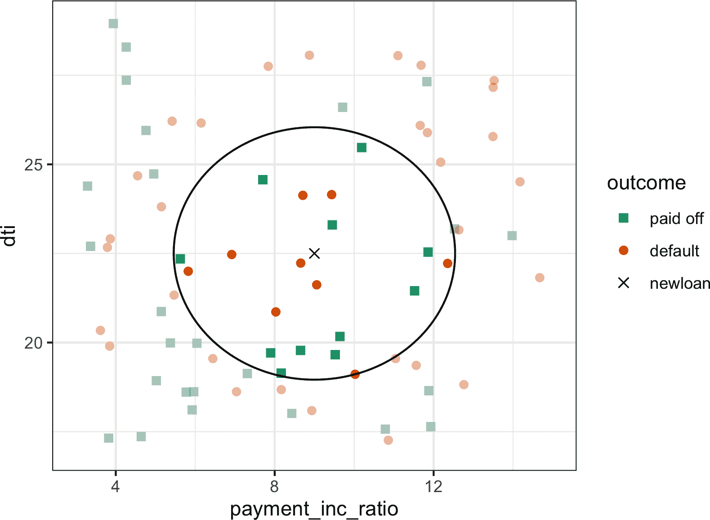
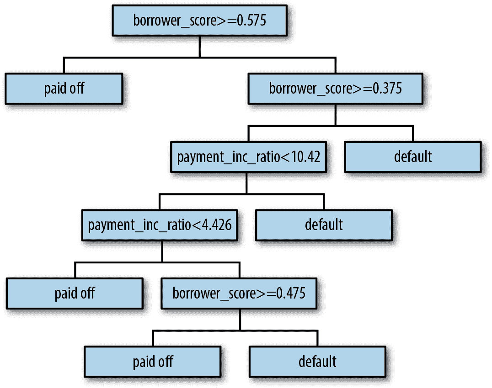
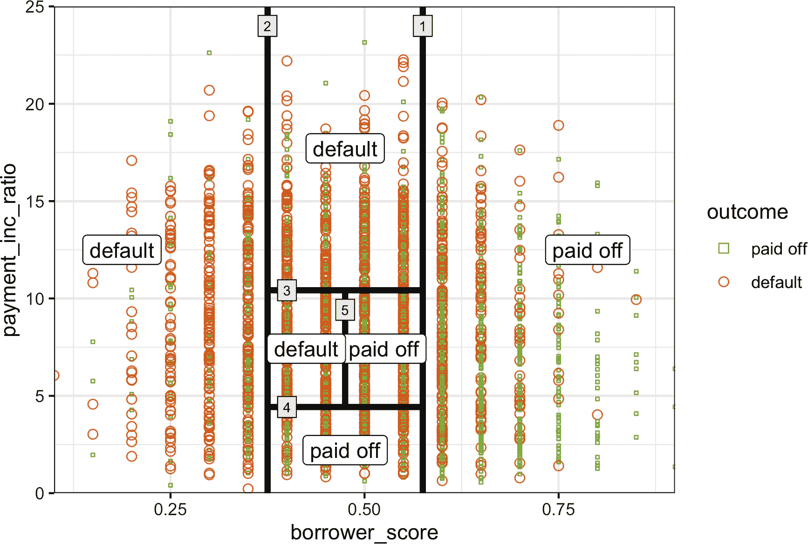
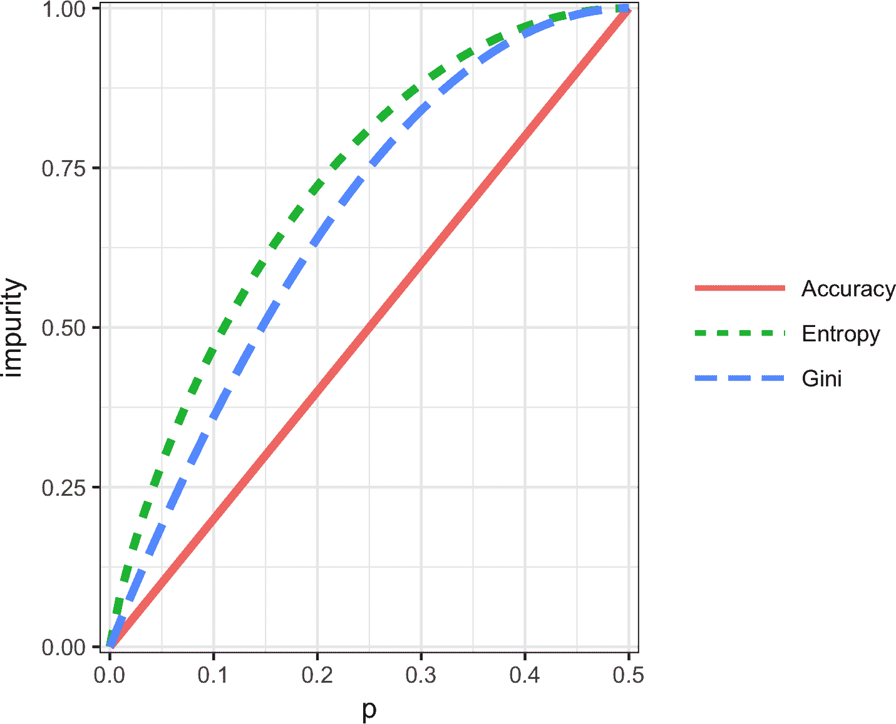
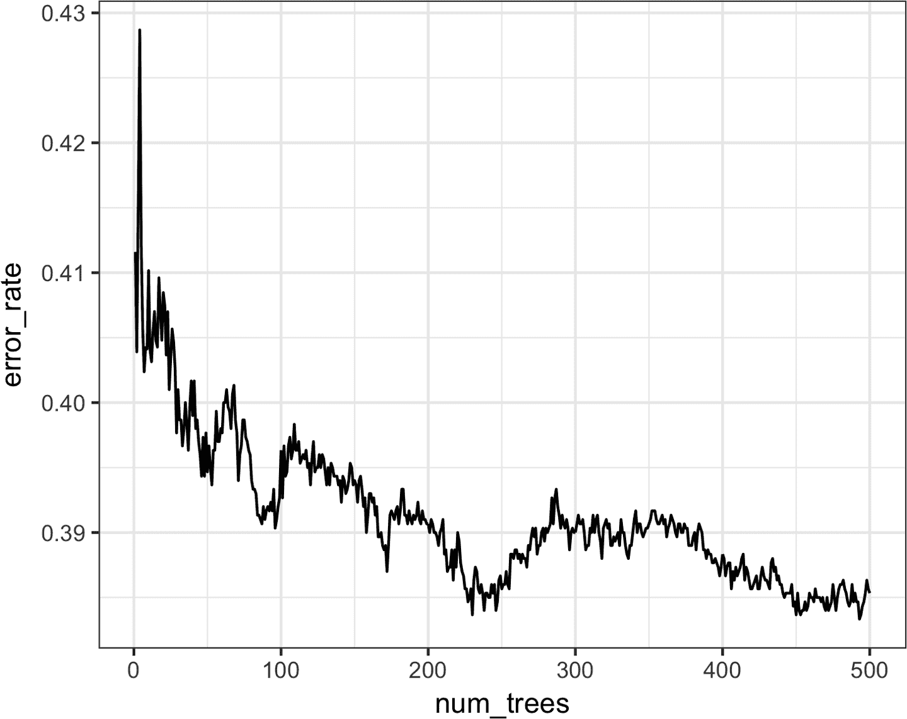
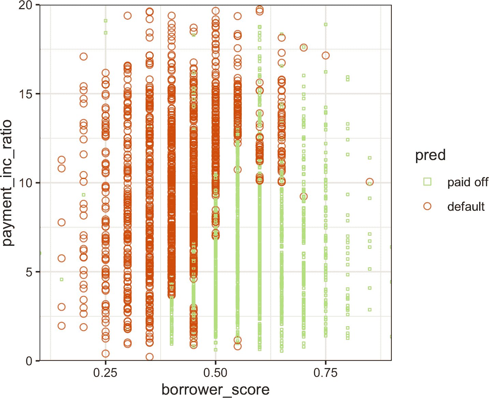
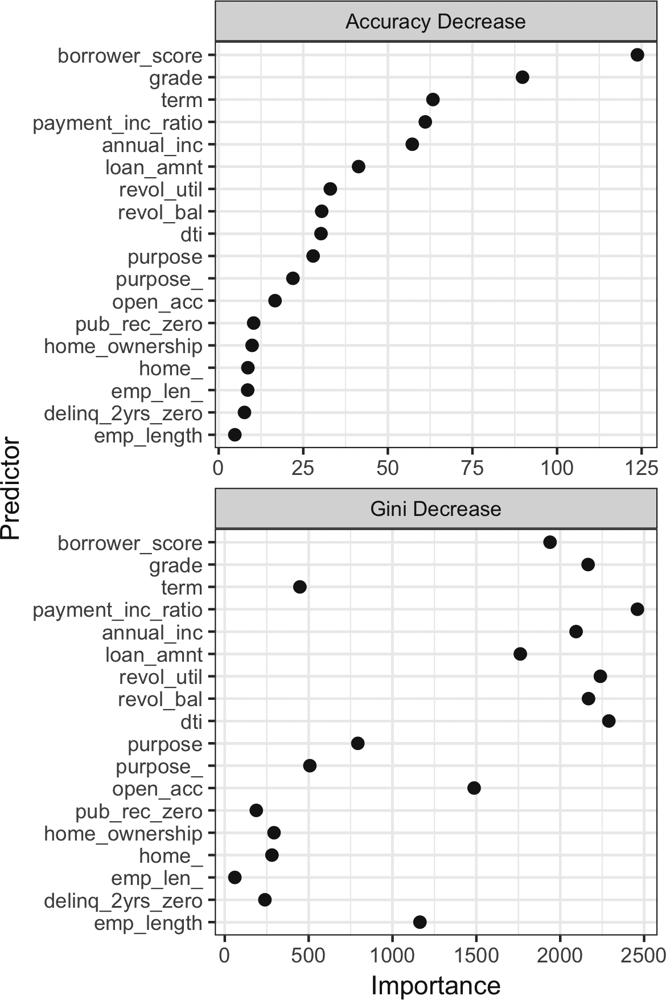
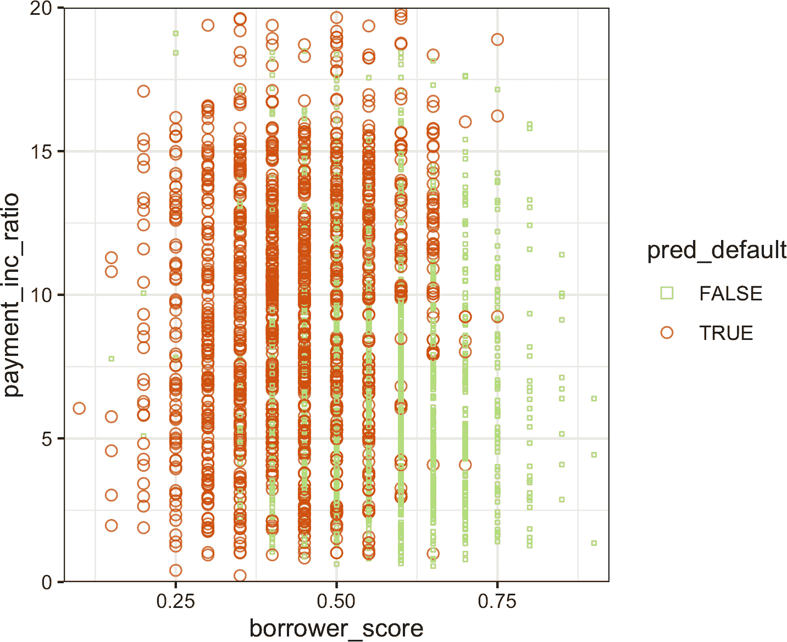
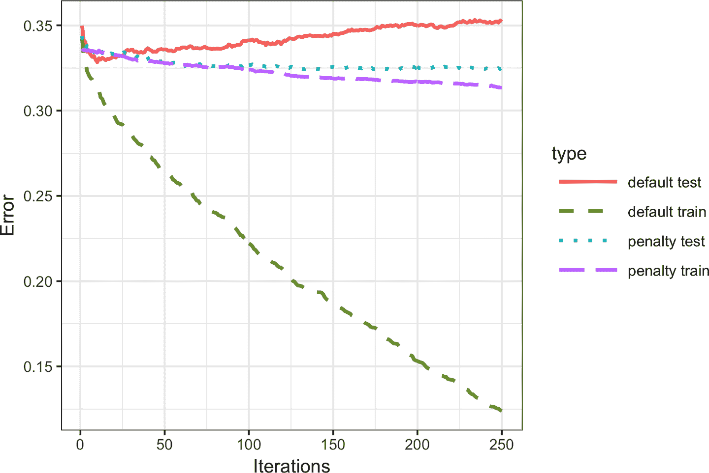

# 第六章：统计机器学习

最近统计学的进展致力于开发更强大的自动化预测建模技术，包括回归和分类。这些方法，如前一章讨论的那些，是*监督方法*——它们在已知结果的数据上训练，并学会在新数据中预测结果。它们属于*统计机器学习*的范畴，与经典统计方法不同，它们是数据驱动的，不寻求对数据施加线性或其他整体结构。例如，*K*-最近邻方法相当简单：根据相似的记录进行分类。最成功和广泛使用的技术基于应用于*决策树*的*集成学习*。集成学习的基本思想是使用多个模型来形成预测，而不是仅使用单个模型。决策树是一种灵活和自动的技术，用于学习关于预测变量和结果变量之间关系的规则。事实证明，集成学习与决策树的结合导致了一些性能最佳的现成预测建模技术。

许多统计机器学习技术的发展可以追溯到加州大学伯克利分校的统计学家列奥·布雷曼（见图 6-1）和斯坦福大学的杰瑞·弗里德曼。他们的工作与伯克利和斯坦福的其他研究人员一起，始于 1984 年的树模型的发展。随后在 1990 年代开发的装袋（bagging）和提升（boosting）等集成方法奠定了统计机器学习的基础。


###### 图 6-1 列奥·布雷曼，加州大学伯克利分校的统计学教授，是今天数据科学家工具包中许多技术发展的前沿人物

# 机器学习与统计学的对比

在预测建模的背景下，机器学习与统计学的区别是什么？两个学科之间没有明显的分界线。机器学习更倾向于开发能够扩展到大数据的高效算法，以优化预测模型。统计学通常更关注模型的概率理论和基本结构。装袋法和随机森林（参见“装袋法和随机森林”）最初坚定地发展在统计学阵营中。增强（参见“增强”），另一方面，在两个学科中都有发展，但更多地受到机器学习一侧的关注。无论历史如何，增强的前景确保它将作为一种技术在统计学和机器学习中蓬勃发展。

# K-最近邻

*K*-最近邻（KNN）的思想非常简单。^(1) 对于每个待分类或预测的记录：

1.  找到*K*个具有相似特征的记录（即类似的预测值）。

1.  为了分类，找出类似记录中的主要类别，并将该类别分配给新记录。

1.  对于预测（也称为*KNN 回归*），找到类似记录中的平均值，并预测新记录的该平均值。

KNN 是较简单的预测/分类技术之一：不需要拟合模型（如回归）。这并不意味着使用 KNN 是一个自动化过程。预测结果取决于特征如何缩放、相似性如何衡量以及*K*的设置大小。此外，所有预测变量必须为数值形式。我们将通过分类示例说明如何使用 KNN 方法。

## 小例子：预测贷款违约

表 6-1 显示了来自 LendingClub 的个人贷款数据的几个记录。LendingClub 是 P2P 借贷领域的领先者，投资者汇集资金向个人提供贷款。分析的目标是预测新潜在贷款的结果：偿还还是违约。

表 6-1\. LendingClub 贷款数据的几个记录和列

| 结果 | 贷款金额 | 收入 | 目的 | 工作年限 | 房屋所有权 | 州 |
| --- | --- | --- | --- | --- | --- | --- |
| 偿还 | 10000 | 79100 | 债务合并 | 11 | 按揭 | NV |
| 偿还 | 9600 | 48000 | 搬迁 | 5 | 按揭 | TN |
| 偿还 | 18800 | 120036 | 债务合并 | 11 | 按揭 | MD |
| 违约 | 15250 | 232000 | 小企业 | 9 | 按揭 | CA |
| 偿还 | 17050 | 35000 | 债务合并 | 4 | 租房 | MD |
| 偿还 | 5500 | 43000 | 债务合并 | 4 | 租房 | KS |

考虑一个非常简单的模型，只有两个预测变量：`dti`，即债务支付（不包括抵押贷款）与收入的比率，以及 `payment_inc_ratio`，即贷款支付与收入的比率。这两个比率均乘以 100。使用一个小集合的 200 笔贷款，`loan200`，具有已知的二元结果（违约或未违约，由预测变量 `outcome200` 指定），并且将 *K* 设为 20，可以在 *R* 中如下计算要预测的新贷款 `newloan`，其 `dti=22.5` 和 `payment_inc_ratio=9`：^(2)

```py
newloan <- loan200[1, 2:3, drop=FALSE]
knn_pred <- knn(train=loan200[-1, 2:3], test=newloan, cl=loan200[-1, 1], k=20)
knn_pred == 'paid off'
[1] TRUE
```

KNN 预测是贷款违约。

虽然 *R* 有本地的 `knn` 函数，但贡献的 *R* 软件包 [`FNN`, for Fast Nearest Neighbor](https://oreil.ly/RMQFG) 在大数据方面效果更好，提供了更多的灵活性。

`scikit-learn` 软件包在 *Python* 中提供了 KNN 的快速高效实现：

```py
predictors = ['payment_inc_ratio', 'dti']
outcome = 'outcome'

newloan = loan200.loc[0:0, predictors]
X = loan200.loc[1:, predictors]
y = loan200.loc[1:, outcome]

knn = KNeighborsClassifier(n_neighbors=20)
knn.fit(X, y)
knn.predict(newloan)
```

图 6-2 提供了此示例的视觉展示。要预测的新贷款是中间的交叉点。方块（已还清）和圆圈（违约）表示训练数据。大黑色圆圈显示了最近的 20 个点的边界。在这种情况下，圆圈内有 9 笔违约贷款，相比之下有 11 笔已还清贷款。因此，贷款的预测结果是已还清。请注意，如果仅考虑三个最近的邻居，则预测将是贷款违约。



###### 图 6-2\. KNN 预测贷款违约使用两个变量：债务收入比和贷款支付收入比

###### 注

尽管 KNN 在分类的输出通常是二元决策，例如贷款数据中的违约或已还清，但 KNN 程序通常提供了输出介于 0 到 1 之间的概率（倾向性）。概率基于 *K* 个最近邻居中某一类的分数。在前述示例中，此违约的概率将被估计为 <math alttext="nine-twenty-ths"><mfrac><mn>9</mn> <mn>20</mn></mfrac></math>，即 0.45。使用概率分数可以让您使用除简单多数投票（0.5 的概率）之外的分类规则。这在存在类别不平衡问题时尤为重要；参见 “不平衡数据的策略”。例如，如果目标是识别罕见类别的成员，则截止点通常设置在低于 50% 的概率上。一种常见的方法是将截止点设置为罕见事件的概率。

## 距离度量

使用*距离度量*来确定相似性（接近度），这是一个衡量两条记录（*x[1]*, *x[2]*, …, *x[p]*）和（*u[1]*, *u[2]*, …, *u[p]*）之间距离的函数。两个向量之间最流行的距离度量是*欧氏距离*。要测量两个向量之间的欧氏距离，将一个向量减去另一个向量，平方差值，求和，然后取平方根：

<math display="block"><mrow><msqrt><mrow><msup><mrow><mo>(</mo><msub><mi>x</mi> <mn>1</mn></msub> <mo>-</mo><msub><mi>u</mi> <mn>1</mn></msub> <mo>)</mo></mrow> <mn>2</mn></msup> <mo>+</mo> <msup><mrow><mo>(</mo><msub><mi>x</mi> <mn>2</mn></msub> <mo>-</mo><msub><mi>u</mi> <mn>2</mn></msub> <mo>)</mo></mrow> <mn>2</mn></msup> <mo>+</mo> <mo>⋯</mo> <mo>+</mo> <msup><mrow><mo>(</mo><msub><mi>x</mi> <mi>p</mi></msub> <mo>-</mo><msub><mi>u</mi> <mi>p</mi></msub> <mo>)</mo></mrow> <mn>2</mn></msup></mrow></msqrt> <mo>.</mo></mrow></math>

另一个常见的数值数据距离度量是*曼哈顿距离*：

<math display="block"><mrow class="MJX-TeXAtom-ORD"><mo stretchy="false">|</mo></mrow> <msub><mi>x</mi> <mn>1</mn></msub> <mo>−</mo> <msub><mi>u</mi> <mn>1</mn></msub> <mrow class="MJX-TeXAtom-ORD"><mo stretchy="false">|</mo></mrow> <mo>+</mo> <mrow class="MJX-TeXAtom-ORD"><mo stretchy="false">|</mo></mrow> <msub><mi>x</mi> <mn>2</mn></msub> <mo>−</mo> <msub><mi>u</mi> <mn>2</mn></msub> <mrow class="MJX-TeXAtom-ORD"><mo stretchy="false">|</mo></mrow> <mo>+</mo> <mo>⋯</mo> <mo>+</mo> <mrow class="MJX-TeXAtom-ORD"><mo stretchy="false">|</mo></mrow> <msub><mi>x</mi> <mi>p</mi></msub> <mo>−</mo> <msub><mi>u</mi> <mi>p</mi></msub> <mrow class="MJX-TeXAtom-ORD"><mo stretchy="false">|</mo></mrow></math>

欧氏距离对应于两点之间的直线距离（例如，鸟儿飞行的距离）。曼哈顿距离是两点在单一方向上的距离（例如，沿着矩形城市街区行驶）。因此，如果相似性定义为点对点的旅行时间，则曼哈顿距离是一个有用的近似值。

在测量两个向量之间的距离时，具有相对较大规模的变量（特征）将主导测量结果。例如，在贷款数据中，距离几乎完全取决于收入和贷款金额这两个变量，这些变量的度量单位是数十或数百万。比率变量与之相比几乎不计。我们通过标准化数据来解决这个问题；参见“标准化（归一化，z 分数）”。

# 其他距离度量

还有许多其他衡量向量之间距离的度量标准。对于数值数据，*马氏距离*很有吸引力，因为它考虑了两个变量之间的相关性。这是有用的，因为如果两个变量高度相关，马氏距离本质上将这些变量视为距离上的单一变量。欧氏距离和曼哈顿距离不考虑相关性，实际上更加关注支持这些特征的属性。马氏距离是主成分之间的欧氏距离（参见“主成分分析”）。使用马氏距离的缺点是增加了计算工作量和复杂性；它是通过*协方差矩阵*计算的（参见“协方差矩阵”）。

## 独热编码器

表 6-1 中的贷款数据包含几个因子（字符串）变量。大多数统计和机器学习模型要求将这种类型的变量转换为一系列二进制虚拟变量，传达相同的信息，如表 6-2 所示。与仅仅表示家庭占有状态为“有抵押贷款”，“无抵押贷款”，“租房”或“其他”的单一变量不同，我们最终得到四个二进制变量。第一个变量将是“有抵押贷款—是/否”，第二个变量将是“无抵押贷款—是/否”，依此类推。因此，这一个预测因子，家庭占有状态，产生一个向量，其中有一个 1 和三个 0，可用于统计和机器学习算法中。短语*独热编码*来源于数字电路术语，用来描述电路设置中只允许一个位为正（热）的情况。

表 6-2\. 将表 6-1 中的家庭占有因子数据表示为数字虚拟变量

| 有抵押贷款 | 无抵押贷款 | 其他 | 租房 |
| --- | --- | --- | --- |
| 1 | 0 | 0 | 0 |
| 1 | 0 | 0 | 0 |
| 1 | 0 | 0 | 0 |
| 1 | 0 | 0 | 0 |
| 0 | 0 | 0 | 1 |
| 0 | 0 | 0 | 1 |

###### 注意

在线性和逻辑回归中，独热编码会导致多重共线性问题；参见“多重共线性”。在这种情况下，会省略一个虚拟变量（其值可以从其他值推断出）。但在 KNN 和本书中讨论的其他方法中，这不是一个问题。

## 标准化（归一化，z-分数）

在测量中，我们通常更关心的是“与平均值相比有多大差异”，而不是“具体数值是多少”。标准化，也称为*归一化*，通过减去均值并除以标准差，将所有变量放在类似的尺度上；这样做可以确保一个变量不会仅仅因为其原始测量的尺度而对模型产生过大影响：

<math display="block"><mrow><mi>z</mi> <mo>=</mo> <mfrac><mrow><mi>x</mi><mo>-</mo><mover accent="true"><mi>x</mi> <mo>¯</mo></mover></mrow> <mi>s</mi></mfrac></mrow></math>

这种转换的结果通常被称为*z 分数*。然后，测量结果以“距离平均值的标准差数”表示。

###### 警告

在这个统计上下文中的*归一化*与*数据库归一化*不要混淆，后者是消除冗余数据并验证数据依赖性。

对于 KNN 和其他一些过程（例如主成分分析和聚类），在应用程序之前考虑对数据进行标准化是至关重要的。为了说明这个想法，KNN 应用于贷款数据，使用`dti`和`payment_inc_ratio`（参见“一个小例子：预测贷款违约”）以及另外两个变量：`revol_bal`，申请人的总可循环信贷额度（以美元计），和`revol_util`，使用的信贷百分比。待预测的新记录如下所示：

```py
newloan
  payment_inc_ratio dti revol_bal revol_util
1            2.3932   1      1687        9.4
```

`revol_bal`的大小（以美元计）比其他变量大得多。`knn`函数将最近邻的索引作为属性`nn.index`返回，可以用来显示`loan_df`中最接近的五行：

```py
loan_df <- model.matrix(~ -1 + payment_inc_ratio + dti + revol_bal +
                          revol_util, data=loan_data)
newloan <- loan_df[1, , drop=FALSE]
loan_df <- loan_df[-1,]
outcome <- loan_data[-1, 1]
knn_pred <- knn(train=loan_df, test=newloan, cl=outcome, k=5)
loan_df[attr(knn_pred, "nn.index"),]

        payment_inc_ratio  dti revol_bal revol_util
35537             1.47212 1.46      1686       10.0
33652             3.38178 6.37      1688        8.4
25864             2.36303 1.39      1691        3.5
42954             1.28160 7.14      1684        3.9
43600             4.12244 8.98      1684        7.2
```

在模型拟合后，我们可以使用`scikit-learn`的`kneighbors`方法来识别训练集中与`loan_df`中最接近的五行：

```py
predictors = ['payment_inc_ratio', 'dti', 'revol_bal', 'revol_util']
outcome = 'outcome'

newloan = loan_data.loc[0:0, predictors]
X = loan_data.loc[1:, predictors]
y = loan_data.loc[1:, outcome]

knn = KNeighborsClassifier(n_neighbors=5)
knn.fit(X, y)

nbrs = knn.kneighbors(newloan)
X.iloc[nbrs[1][0], :]
```

这些邻居中`revol_bal`的值非常接近新记录中的值，但其他预测变量却大相径庭，基本上不起作用。

将此与使用*R*函数`scale`对标准化数据应用 KNN 进行比较，该函数计算每个变量的*z*-分数：

```py
loan_df <- model.matrix(~ -1 + payment_inc_ratio + dti + revol_bal +
                          revol_util, data=loan_data)
loan_std <- scale(loan_df)
newloan_std <- loan_std[1, , drop=FALSE]
loan_std <- loan_std[-1,]
loan_df <- loan_df[-1,]  
outcome <- loan_data[-1, 1]
knn_pred <- knn(train=loan_std, test=newloan_std, cl=outcome, k=5)
loan_df[attr(knn_pred, "nn.index"),]
        payment_inc_ratio   dti  revol_bal  revol_util
2081            2.61091    1.03       1218         9.7
1439            2.34343    0.51        278         9.9
30216           2.71200    1.34       1075         8.5
28543           2.39760    0.74       2917         7.4
44738           2.34309    1.37        488         7.2
```


我们还需要从`loan_df`中删除第一行，以便行号相互对应。

首先使用预测变量训练`sklearn.preprocessing.StandardScaler`方法，然后在训练 KNN 模型之前对数据集进行转换：

```py
newloan = loan_data.loc[0:0, predictors]
X = loan_data.loc[1:, predictors]
y = loan_data.loc[1:, outcome]

scaler = preprocessing.StandardScaler()
scaler.fit(X * 1.0)

X_std = scaler.transform(X * 1.0)
newloan_std = scaler.transform(newloan * 1.0)

knn = KNeighborsClassifier(n_neighbors=5)
knn.fit(X_std, y)

nbrs = knn.kneighbors(newloan_std)
X.iloc[nbrs[1][0], :]
```

最接近的五个邻居在所有变量上都更相似，从而提供了更合理的结果。请注意，结果显示在原始比例上，但是 KNN 是应用于经过缩放的数据和新贷款预测的。

###### 提示

使用*z*-分数只是重新缩放变量的一种方法。可以使用更健壮的位置估计，例如中位数，而不是均值。同样，可以使用不同的尺度估计，例如四分位距，而不是标准偏差。有时，变量被“压缩”到 0–1 范围内也很重要。还要意识到，将每个变量缩放为单位方差在某种程度上是任意的。这意味着每个变量在预测能力中被认为具有相同的重要性。如果您有主观知识表明某些变量比其他变量更重要，那么可以将它们放大。例如，对于贷款数据，可以合理地期望支付收入比非常重要。

###### 注意

标准化（标准化）不会改变数据的分布形状；如果数据不是正态分布的，则不会使其成为正态分布（参见“正态分布”）。

## 选择 K

选择*K*对 KNN 的性能非常重要。最简单的选择是设置<math alttext="upper K equals 1"><mrow><mi>K</mi> <mo>=</mo> <mn>1</mn></mrow></math>，即 1-最近邻分类器。预测直观：它基于找到训练集中与待预测的新记录最相似的数据记录。设置<math alttext="upper K equals 1"><mrow><mi>K</mi> <mo>=</mo> <mn>1</mn></mrow></math>很少是最佳选择；使用*K* > 1-最近邻几乎总能获得更好的性能。

一般而言，如果*K*太低，我们可能会过度拟合：包括数据中的噪音。较高的*K*值提供了平滑处理，从而降低了在训练数据中过度拟合的风险。另一方面，如果*K*太高，我们可能会过度平滑数据，错过 KNN 捕获数据中的局部结构的能力，这是其主要优势之一。

最好平衡过拟合和过度平滑之间的*K*通常由准确度指标来确定，特别是在使用留出或验证数据进行准确度评估时。关于最佳*K*没有通用规则——它在很大程度上取决于数据的性质。对于结构化程度高且噪音少的数据，较小的*K*值效果最佳。从信号处理社区借来一个术语，这种类型的数据有时被称为具有高*信噪比*（*SNR*）的数据。具有典型高 SNR 的数据示例包括手写和语音识别数据集。对于噪音较多、结构较少的数据（信噪比低的数据），例如贷款数据，适合使用较大的*K*值。通常，*K*值落在 1 到 20 的范围内。通常选择奇数以避免平局。

# 偏差-方差权衡

过度平滑和过度拟合之间的张力是*偏差-方差权衡*的一个例子，这是统计模型拟合中普遍存在的问题。方差是指由于选择训练数据而产生的建模误差；也就是说，如果选择不同的训练数据集，得到的模型会不同。偏差是指由于未能正确识别出真实世界情况而产生的建模误差；如果简单地添加更多的训练数据，这种误差不会消失。当一个灵活的模型过度拟合时，方差会增加。您可以通过使用更简单的模型来减少这种情况，但由于失去了对真实情况建模的灵活性，偏差可能会增加。处理这种权衡的一般方法是通过*交叉验证*。详细信息请参见“交叉验证”。

## 作为特征引擎的 KNN

KNN 之所以受欢迎，是因为其简单直观的特性。就性能而言，KNN 本身通常无法与更复杂的分类技术竞争。然而，在实际模型拟合中，KNN 可以与其他分类技术一起以分阶段的方式使用，以添加“局部知识”：

1.  KNN 对数据进行运算，对于每条记录，都会得出一个分类（或类的准概率）。

1.  结果被添加为记录的新特征，然后再对数据运行另一种分类方法。因此，原始预测变量被使用了两次。

起初，您可能会想知道，由于它两次使用了一些预测变量，这个过程是否会导致多重共线性问题（参见“多重共线性”）。这不是一个问题，因为被纳入第二阶段模型的信息是高度局部的，仅来自几个附近的记录，因此是额外信息而不是冗余信息。

###### 注意

您可以将 KNN 的这种分阶段使用视为集成学习的一种形式，其中多个预测建模方法与彼此结合使用。它也可以被视为一种特征工程形式，其目的是提取具有预测能力的特征（预测变量）。通常这涉及对数据的一些手动审查；KNN 提供了一种相对自动化的方法来实现这一点。

例如，考虑金县房屋数据。在定价待售住宅时，房地产经纪人将根据最近售出的类似房屋——称为“comps”——确定价格。本质上，房地产经纪人正在执行 KNN 的手动版本：通过查看类似房屋的销售价格，他们可以估计一处住宅的销售价格。我们可以为统计模型创建一个新的特征，以模仿房地产专业人员通过 KNN 应用到最近销售中的做法。预测值是销售价格，现有的预测变量可以包括位置、总面积、建筑类型、土地面积以及卧室和浴室数量。我们通过 KNN 添加的新预测变量（特征）是每条记录的 KNN 预测器（类似于房地产经纪人的 comps）。由于我们在预测数值值，所以使用 K 最近邻居的平均值，而不是多数投票（称为*KNN 回归*）。

同样地，对于贷款数据，我们可以创建代表贷款流程不同方面的特征。例如，以下*R*代码将构建一个代表借款人信用价值的特征：

```py
borrow_df <- model.matrix(~ -1 + dti + revol_bal + revol_util + open_acc +
                            delinq_2yrs_zero + pub_rec_zero, data=loan_data)
borrow_knn <- knn(borrow_df, test=borrow_df, cl=loan_data[, 'outcome'],
                  prob=TRUE, k=20)
prob <- attr(borrow_knn, "prob")
borrow_feature <- ifelse(borrow_knn == 'default', prob, 1 - prob)
summary(borrow_feature)
   Min. 1st Qu.  Median    Mean 3rd Qu.    Max.
  0.000   0.400   0.500   0.501   0.600   0.950
```

使用`scikit-learn`，我们使用训练模型的`predict_proba`方法来获取概率：

```py
predictors = ['dti', 'revol_bal', 'revol_util', 'open_acc',
              'delinq_2yrs_zero', 'pub_rec_zero']
outcome = 'outcome'

X = loan_data[predictors]
y = loan_data[outcome]

knn = KNeighborsClassifier(n_neighbors=20)
knn.fit(X, y)

loan_data['borrower_score'] = knn.predict_proba(X)[:, 1]
loan_data['borrower_score'].describe()
```

结果是基于借款人的信用历史预测借款人违约可能性的特征。

# 树模型

树模型，也称为*分类和回归树*（*CART*），^(3) *决策树*或简称*树*，是一种由 Leo Breiman 等人在 1984 年最初开发的有效和流行的分类（和回归）方法。树模型及其更强大的后继者*随机森林*和*提升树*（见“Bagging 和随机森林”和“提升”）构成了数据科学中用于回归和分类的最广泛使用和强大的预测建模工具的基础。

树模型是一组易于理解和实现的“如果-那么-否则”规则。与线性和逻辑回归相比，树具有发现数据中复杂交互作用的隐藏模式的能力。然而，与 KNN 或朴素贝叶斯不同，简单的树模型可以用易于解释的预测者关系来表达。

# 运筹学中的决策树

*决策树*一词在决策科学和运筹学中有着不同（也更老的）含义，它指的是一种人类决策分析过程。在这个含义下，决策点、可能的结果以及它们的估计概率被列在一个分支图表中，选择具有最大期望值的决策路径。

## 一个简单的例子

在 *R* 中适配树模型的两个主要包是 `rpart` 和 `tree`。使用 `rpart` 包，将模型拟合到 3,000 条贷款数据记录样本，使用变量 `payment_inc_ratio` 和 `borrower_score`（见“K-最近邻”以获取数据描述）：

```py
library(rpart)
loan_tree <- rpart(outcome ~ borrower_score + payment_inc_ratio,
                   data=loan3000, control=rpart.control(cp=0.005))
plot(loan_tree, uniform=TRUE, margin=0.05)
text(loan_tree)
```

`sklearn.tree.DecisionTreeClassifier` 提供了一个决策树的实现。`dmba` 包提供了一个方便的函数，在 Jupyter 笔记本内创建可视化：

```py
predictors = ['borrower_score', 'payment_inc_ratio']
outcome = 'outcome'

X = loan3000[predictors]
y = loan3000[outcome]

loan_tree = DecisionTreeClassifier(random_state=1, criterion='entropy',
                                   min_impurity_decrease=0.003)
loan_tree.fit(X, y)
plotDecisionTree(loan_tree, feature_names=predictors,
                 class_names=loan_tree.classes_)
```

结果树显示在 图 6-3 中。由于不同的实现，您会发现 *R* 和 *Python* 的结果并不相同；这是预期的。这些分类规则是通过遍历层次树来确定的，从根开始，如果节点为真则向左移动，否则向右移动，直到达到叶子节点。

通常，树被倒置绘制，所以根在顶部，叶在底部。例如，如果我们获得一个 `borrower_score` 为 0.6 和 `payment_inc_ratio` 为 8.0 的贷款，我们将在最左边的叶子处结束，并预测该贷款将被偿还。



###### 图 6-3\. 一个简单的树模型拟合到贷款数据的规则

在 *R* 中也很容易产生树的漂亮打印版本：

```py
loan_tree
n= 3000

node), split, n, loss, yval, (yprob)
    * denotes terminal node

1) root 3000 1445 paid off (0.5183333 0.4816667)
  2) borrower_score>=0.575 878  261 paid off (0.7027335 0.2972665) *
  3) borrower_score< 0.575 2122  938 default (0.4420358 0.5579642)
    6) borrower_score>=0.375 1639  802 default (0.4893228 0.5106772)
      12) payment_inc_ratio< 10.42265 1157  547 paid off (0.5272256 0.4727744)
        24) payment_inc_ratio< 4.42601 334  139 paid off (0.5838323 0.4161677) *
        25) payment_inc_ratio>=4.42601 823  408 paid off (0.5042527 0.4957473)
          50) borrower_score>=0.475 418  190 paid off (0.5454545 0.4545455) *
          51) borrower_score< 0.475 405  187 default (0.4617284 0.5382716) *
      13) payment_inc_ratio>=10.42265 482  192 default (0.3983402 0.6016598) *
    7) borrower_score< 0.375 483  136 default (0.2815735 0.7184265) *
```

树的深度由缩进显示。每个节点对应于由该分区中普遍结果确定的临时分类。 “损失”是由分区中的临时分类产生的错误分类数。例如，在节点 2 中，总共有 878 条记录中的 261 条错误分类。括号中的值分别对应于已偿还或违约的记录比例。例如，在预测违约的节点 13 中，超过 60% 的记录是违约贷款。

`scikit-learn` 文档描述了如何创建决策树模型的文本表示。我们在我们的 `dmba` 包中包含了一个方便的函数：

```py
print(textDecisionTree(loan_tree))
--
node=0 test node: go to node 1 if 0 <= 0.5750000178813934 else to node 6
  node=1 test node: go to node 2 if 0 <= 0.32500000298023224 else to node 3
    node=2 leaf node: [[0.785, 0.215]]
    node=3 test node: go to node 4 if 1 <= 10.42264986038208 else to node 5
      node=4 leaf node: [[0.488, 0.512]]
      node=5 leaf node: [[0.613, 0.387]]
  node=6 test node: go to node 7 if 1 <= 9.19082498550415 else to node 10
    node=7 test node: go to node 8 if 0 <= 0.7249999940395355 else to node 9
      node=8 leaf node: [[0.247, 0.753]]
      node=9 leaf node: [[0.073, 0.927]]
    node=10 leaf node: [[0.457, 0.543]]
```

## 递归分区算法

构建决策树的算法称为*递归分区*，非常直观和简单。数据使用能够最好地将数据分隔成相对同质分区的预测器值反复分区。图 6-4 显示了图 6-3 中树创建的分区。第一个规则由规则 1 描述，即`borrower_score >= 0.575`并分割绘图的右侧部分。第二个规则是`borrower_score < 0.375`并分割左侧部分。



###### 图 6-4. 适用于贷款数据的简单树模型的前三条规则

假设我们有响应变量*Y*和一组*P*个预测变量*X[j]*，对于<math alttext="j equals 1 comma ellipsis comma upper P"><mrow><mi>j</mi> <mo>=</mo> <mn>1</mn> <mo>,</mo> <mo>⋯</mo> <mo>,</mo> <mi>P</mi></mrow></math>的分区*A*，递归分区将找到将*A*分割为两个子分区的最佳方法：

1.  对于每个预测变量*X[j]*：

    1.  对于每个*X[j]*的值*s[j]*：

        1.  将具有*X[j]*值小于*s[j]*的记录在*A*中拆分为一个分区，将其余*X[j]*值大于或等于*s[j]*的记录拆分为另一个分区。

        1.  测量*A*每个子分区内类的同质性。

    1.  选择产生类内最大同质性的*s[j]*的值。

1.  选择变量*X[j]*和分割值*s[j]*，以产生类内最大同质性。

现在进入递归部分：

1.  用整个数据集初始化*A*。

1.  应用分区算法将*A*分割成两个子分区，*A[1]*和*A[2]*。

1.  在子分区*A[1]*和*A[2]*上重复步骤 2。

1.  当不能再进行足够改进分区同质性的分区时，算法终止。

最终结果是数据的分区，如图 6-4 中所示，除了在*P*维度中，每个分区根据该分区中响应的多数投票预测为 0 或 1 的结果。

###### 注意

除了进行二元 0/1 预测外，树模型还可以根据分区中 0 和 1 的数量生成概率估计。估计值简单地是分区中 0 或 1 的总和除以分区中的观察次数：

<math display="block"><mrow><mtext>Prob</mtext> <mrow><mo>(</mo> <mi>Y</mi> <mo>=</mo> <mn>1</mn> <mo>)</mo></mrow> <mo>=</mo> <mfrac><mrow><mtext>Number</mtext><mtext>of</mtext><mtext>1s</mtext><mtext>in</mtext><mtext>the</mtext><mtext>partition</mtext></mrow> <mrow><mtext>Size</mtext><mtext>of</mtext><mtext>the</mtext><mtext>partition</mtext></mrow></mfrac></mrow></math>

估计值<math alttext="Prob left-parenthesis upper Y equals 1 right-parenthesis"><mrow><mtext>Prob</mtext> <mo>(</mo> <mi>Y</mi> <mo>=</mo> <mn>1</mn> <mo>)</mo></mrow></math>然后可以转换为二进制决策；例如，如果 Prob(*Y* = 1) > 0.5，则将估计值设置为 1。

## 测量同质性或不纯度

树模型递归地创建预测*Y* = 0 或*Y* = 1 的分区（记录集）*A*。从前面的算法中可以看出，我们需要一种方法来衡量分区内的同质性，也称为*类纯度*。或者等效地，我们需要衡量分区的不纯度。预测的准确性是分区内错误分类的记录比例*p*，其范围从 0（完美）到 0.5（纯粹的随机猜测）。

结果表明，准确率不是衡量纯度的好指标。相反，衡量纯度的两个常见方法是*基尼不纯度*和*信息熵*。虽然这些（以及其他）纯度度量适用于具有两个以上类别的分类问题，但我们关注二元情况。一组记录*A*的基尼不纯度为：

<math display="block"><mrow><mi>I</mi> <mo>(</mo> <mi>A</mi> <mo>)</mo> <mo>=</mo> <mi>p</mi> <mo>(</mo> <mn>1</mn> <mo>-</mo> <mi>p</mi> <mo>)</mo></mrow></math>

熵测量由以下公式给出：

<math display="block"><mrow><mi>I</mi> <mrow><mo>(</mo> <mi>A</mi> <mo>)</mo></mrow> <mo>=</mo> <mo>-</mo> <mi>p</mi> <msub><mo form="prefix">log</mo> <mn>2</mn></msub> <mrow><mo>(</mo> <mi>p</mi> <mo>)</mo></mrow> <mo>-</mo> <mrow><mo>(</mo> <mn>1</mn> <mo>-</mo> <mi>p</mi> <mo>)</mo></mrow> <msub><mo form="prefix">log</mo> <mn>2</mn></msub> <mrow><mo>(</mo> <mn>1</mn> <mo>-</mo> <mi>p</mi> <mo>)</mo></mrow></mrow></math>

图 6-5 显示基尼不纯度（重新缩放）和熵测量类似，熵对中等和高准确率得分给出较高的不纯度评分。



###### 图 6-5。基尼不纯度和熵测量

# 基尼系数

不要将基尼不纯度与*基尼系数*混淆。它们代表类似的概念，但基尼系数仅适用于二元分类问题，并且与 AUC 度量相关（参见“AUC”）。

不纯度度量在前面描述的分裂算法中使用。对于数据的每个拟议分区，都会测量每个分裂产生的分区的不纯度。然后计算加权平均值，并选择（在每个阶段）产生最低加权平均值的分区。

## 阻止树继续生长

随着树变得越来越大，分裂规则变得更加详细，树逐渐从识别数据中真实可靠的关系的“大”规则转变为反映了只有噪音的“微小”规则。完全生长的树导致完全纯净的叶子，因此在对其进行训练的数据上对数据进行分类的准确率为 100%。当然，这种准确率是虚假的——我们已经过度拟合（见“偏差-方差权衡”）数据，拟合了训练数据中的噪音，而不是我们想要在新数据中识别的信号。

我们需要一种方法来确定何时停止树的生长，以便在一个阶段上对新数据进行泛化。在*R*和*Python*中，有各种方法来停止分裂：

+   避免分裂分区，如果结果子分区太小，或者终端叶子太小。在`rpart`（*R*）中，这些约束分别由参数`minsplit`和`minbucket`控制，默认值分别为`20`和`7`。在*Python*的`DecisionTreeClassifier`中，我们可以使用参数`min_samples_split`（默认为`2`）和`min_samples_leaf`（默认为`1`）来控制这一点。

+   如果新的分区不能“显著”减少不纯度，则不要分割分区。在`rpart`中，这由*复杂度参数* `cp` 控制，它衡量树的复杂程度——越复杂，`cp`值越大。在实践中，`cp`用于通过对树中额外复杂度（分割）附加惩罚来限制树的增长。`DecisionTreeClassifier`（*Python*）具有参数`min_impurity_decrease`，它限制基于加权不纯度减少值的分割。在这里，较小的值将导致更复杂的树。

这些方法涉及任意规则，对探索性工作可能有用，但我们无法轻易确定最优值（即最大化使用新数据预测准确性的值）。我们需要结合交叉验证和系统地更改模型参数或通过修剪修改树。

### 在*R*中控制树的复杂度。

使用复杂度参数`cp`，我们可以估计什么样的树在新数据中表现最佳。如果`cp`太小，则树将过度拟合数据，适应噪声而不是信号。另一方面，如果`cp`太大，则树将过于简单且具有较少的预测能力。在`rpart`中，默认值为 0.01，尽管对于更大的数据集，你可能会发现这个值太大了。在前面的例子中，`cp`设置为`0.005`，因为默认值导致树只有一个分割。在探索性分析中，仅需尝试几个值即可。

确定最佳的`cp`值是偏差-方差权衡的一个实例。估计一个好的`cp`值的最常见方法是通过交叉验证（参见“交叉验证”）：

1.  将数据分割为训练集和验证（留置）集。

1.  使用训练数据生长树。

1.  逐步修剪树，在每一步中使用*训练*数据记录`cp`。

1.  注意对应于*验证*数据上最小错误（损失）的`cp`值。

1.  将数据重新分割为训练和验证集，并重复生成、修剪和记录`cp`的过程。

1.  一次又一次地执行此操作，并计算反映每棵树最小错误的`cp`的平均值。

1.  回到原始数据或未来数据，并以此最佳的`cp`值停止生成树。

在`rpart`中，可以使用参数`cptable`生成`cp`值及其相关的交叉验证错误（在*R*中为`xerror`）的表格，从中可以确定具有最低交叉验证错误的`cp`值。

### 在*Python*中控制树的复杂度。

`scikit-learn` 的决策树实现中既没有复杂度参数，也没有剪枝功能。解决方法是对不同参数值的组合进行网格搜索。例如，我们可以将 `max_depth` 变化范围设置为 5 到 30，将 `min_samples_split` 设置为 20 到 100。`scikit-learn` 中的 `GridSearchCV` 方法是通过交叉验证组合进行穷举搜索的便捷方式。然后，通过交叉验证的模型性能选择最优参数集。

## 预测连续值

使用树进行连续值预测（也称为*回归*）遵循相同的逻辑和步骤，只是在每个子分区中，不纯度是通过与平均值的平方偏差（平方误差）来衡量的，预测性能是通过每个分区中的均方根误差（RMSE）（参见“评估模型”）来判断的。

`scikit-learn` 有 `sklearn.tree.DecisionTreeRegressor` 方法来训练决策树回归模型。

## 如何使用树

组织中的预测建模者面临的一个重大障碍是所使用方法的被视为“黑盒子”的特性，这导致组织的其他部门反对使用这些方法。在这方面，树模型具有两个吸引人的方面：

+   树模型提供了一个可视化工具，用于探索数据，以获得哪些变量是重要的，以及它们如何相互关联的想法。树可以捕捉预测变量之间的非线性关系。

+   树模型提供了一组规则，可以有效地传达给非专业人员，用于实施或“销售”数据挖掘项目。

然而，在预测方面，利用多个树的结果通常比仅使用单个树更强大。特别是，随机森林和提升树算法几乎总是提供更优越的预测准确性和性能（参见“装袋和随机森林” 和 “提升”），但单棵树的上述优势会丧失。

## 进一步阅读

+   Analytics Vidhya 内容团队，[“基于树的算法：从头开始的完整教程（*R* & *Python*）”](https://oreil.ly/zOr4B)，2016 年 4 月 12 日。

+   Terry M. Therneau、Elizabeth J. Atkinson 和 Mayo Foundation，[“使用 RPART 程序介绍递归分区”](https://oreil.ly/6rLGk)，2019 年 4 月 11 日。

# 装袋和随机森林

1906 年，统计学家弗朗西斯·高尔顿（Francis Galton）在英格兰一个乡村展会上参与了一个竞猜展出牛的装重比赛。共有 800 个猜测，虽然个别猜测相差很大，但平均值和中位数都在牛的真实重量范围内误差不超过 1%。詹姆斯·苏罗维埃基在他的著作《众智》（The Wisdom of Crowds，Doubleday 出版，2004 年）中探讨了这一现象。这一原则同样适用于预测模型：多模型的平均值（或多数票制）——即模型的集成——比单一模型更为精确。

集成方法已应用于多种不同的建模方法，最为公众熟知的是在 Netflix Prize 中的应用，该竞赛由 Netflix 提供 100 万美元奖金，以奖励那些能提高 10%以上准确预测用户评分的模型。集成模型的简化版本如下：

1.  开发一个预测模型，并记录给定数据集的预测结果。

1.  在相同数据上重复多个模型的拟合。

1.  对于每个要预测的记录，取预测结果的平均值（或加权平均值，或多数投票）。

集成方法在决策树中应用最为系统和有效。集成树模型非常强大，能够以相对较少的努力构建出良好的预测模型。

在简单的集成算法基础上，有两个主要的集成模型变体：*bagging* 和 *boosting*。在集成树模型中，它们被称为 *random forest* 模型和 *boosted tree* 模型。本节重点介绍 *bagging*；*boosting* 见 “Boosting”。

## Bagging

Bagging，即“bootstrap aggregating”，由 Leo Breiman 于 1994 年提出。假设我们有一个响应 *Y* 和 *P* 个预测变量 <math alttext="bold upper X equals upper X 1 comma upper X 2 comma ellipsis comma upper X Subscript upper P Baseline"><mrow><mi>𝐗</mi> <mo>=</mo> <msub><mi>X</mi> <mn>1</mn></msub> <mo>,</mo> <msub><mi>X</mi> <mn>2</mn></msub> <mo>,</mo> <mo>⋯</mo> <mo>,</mo> <msub><mi>X</mi> <mi>P</mi></msub></mrow></math>，具有 *N* 条记录。

Bagging 与集成的基本算法类似，不同之处在于，每个新模型是基于一个自助采样重新拟合的。以下更正式地呈现了该算法：

1.  初始化 *M*，要拟合的模型数量，和 *n*，要选择的记录数（*n* < *N*）。设置迭代 <math alttext="m equals 1"><mrow><mi>m</mi> <mo>=</mo> <mn>1</mn></mrow></math> 。

1.  从训练数据中获取一个自助采样（即带有替换的样本）以形成子样本 <math alttext="upper Y Subscript m"><msub><mi>Y</mi> <mi>m</mi></msub></math> 和 <math alttext="bold upper X Subscript m"><msub><mi>𝐗</mi> <mi>m</mi></msub></math>（称为“包”）。

1.  使用 <math alttext="upper Y Subscript m"><msub><mi>Y</mi> <mi>m</mi></msub></math> 和 <math alttext="bold upper X Subscript m"><msub><mi>𝐗</mi> <mi>m</mi></msub></math> 训练模型，创建一组决策规则 <math alttext="ModifyingAbove f With caret Subscript m Baseline left-parenthesis bold upper X right-parenthesis"><mrow><msub><mover accent="true"><mi>f</mi> <mo>^</mo></mover> <mi>m</mi></msub> <mrow><mo>(</mo> <mi>𝐗</mi> <mo>)</mo></mrow></mrow></math>。

1.  将模型计数器递增 <math alttext="m equals m plus 1"><mrow><mi>m</mi> <mo>=</mo> <mi>m</mi> <mo>+</mo> <mn>1</mn></mrow></math>。如果 *m* <= *M*，则转到步骤 2。

在 <math alttext="ModifyingAbove f With caret Subscript m"><msub><mover accent="true"><mi>f</mi> <mo>^</mo></mover> <mi>m</mi></msub></math> 预测概率 <math alttext="upper Y equals 1"><mrow><mi>Y</mi> <mo>=</mo> <mn>1</mn></mrow></math> 的情况下，袋装估计如下：

<math alttext="ModifyingAbove f With caret equals StartFraction 1 Over upper M EndFraction left-parenthesis ModifyingAbove f With caret Subscript 1 Baseline left-parenthesis bold upper X right-parenthesis plus ModifyingAbove f With caret Subscript 2 Baseline left-parenthesis bold upper X right-parenthesis plus ellipsis plus ModifyingAbove f With caret Subscript upper M Baseline left-parenthesis bold upper X right-parenthesis right-parenthesis" display="block"><mrow><mover accent="true"><mi>f</mi> <mo>^</mo></mover> <mo>=</mo> <mfrac><mn>1</mn> <mi>M</mi></mfrac> <mfenced separators="" open="(" close=")"><msub><mover accent="true"><mi>f</mi> <mo>^</mo></mover> <mn>1</mn></msub> <mrow><mo>(</mo> <mi>𝐗</mi> <mo>)</mo></mrow> <mo>+</mo> <msub><mover accent="true"><mi>f</mi> <mo>^</mo></mover> <mn>2</mn></msub> <mrow><mo>(</mo> <mi>𝐗</mi> <mo>)</mo></mrow> <mo>+</mo> <mo>⋯</mo> <mo>+</mo> <msub><mover accent="true"><mi>f</mi> <mo>^</mo></mover> <mi>M</mi></msub> <mrow><mo>(</mo> <mi>𝐗</mi> <mo>)</mo></mrow></mfenced></mrow></math>

## 随机森林

*随机森林* 基于对决策树应用装袋算法，但有一个重要扩展：除了对记录进行采样外，该算法还对变量进行采样。^(4) 在传统决策树中，为了确定如何创建分区 *A* 的子分区，算法通过最小化 Gini 不纯度等准则来选择变量和分割点（请参阅“测量同质性或不纯度”）。随机森林中，在算法的每个阶段，变量的选择限于*变量的随机子集*。与基本树算法（请参阅“递归分区算法”）相比，随机森林算法增加了另外两个步骤：前面讨论过的装袋（请参阅“装袋和随机森林”），以及在每次分割时对变量进行自助采样：

1.  从 *记录* 中获取一个自助（有替换地）子样本。

1.  对于第一个分割，随机无重复地采样 *p* < *P* *变量*。

1.  对于每个采样变量 <math alttext="upper X Subscript j left-parenthesis 1 right-parenthesis Baseline comma upper X Subscript j left-parenthesis 2 right-parenthesis Baseline comma ellipsis comma upper X Subscript j left-parenthesis p right-parenthesis Baseline"><mrow><msub><mi>X</mi> <mrow><mi>j</mi><mo>(</mo><mn>1</mn><mo>)</mo></mrow></msub> <mo>,</mo> <msub><mi>X</mi> <mrow><mi>j</mi><mo>(</mo><mn>2</mn><mo>)</mo></mrow></msub> <mo>,</mo> <mo>...</mo> <mo>,</mo> <msub><mi>X</mi> <mrow><mi>j</mi><mo>(</mo><mi>p</mi><mo>)</mo></mrow></msub></mrow></math>，应用分割算法：

    1.  对于每个值 <math alttext="s Subscript j left-parenthesis k right-parenthesis"><msub><mi>s</mi> <mrow><mi>j</mi><mo>(</mo><mi>k</mi><mo>)</mo></mrow></msub></math> 的 <math alttext="upper X Subscript j left-parenthesis k right-parenthesis"><msub><mi>X</mi> <mrow><mi>j</mi><mo>(</mo><mi>k</mi><mo>)</mo></mrow></msub></math>：

        1.  将记录分割为分区 *A*，其中 *X*[*j*(*k*)] < *s*[*j*(*k*)] 作为一个分区，剩余记录，其中 <math alttext="upper X Subscript j left-parenthesis k right-parenthesis Baseline greater-than-or-equal-to s Subscript j left-parenthesis k right-parenthesis"><mrow><msub><mi>X</mi> <mrow><mi>j</mi><mo>(</mo><mi>k</mi><mo>)</mo></mrow></msub> <mo>≥</mo> <msub><mi>s</mi> <mrow><mi>j</mi><mo>(</mo><mi>k</mi><mo>)</mo></mrow></msub></mrow></math> 作为另一个分区。

        1.  测量 *A* 的每个子分区内类的同质性。

    1.  选择值 <math alttext="s Subscript j left-parenthesis k right-parenthesis"><msub><mi>s</mi> <mrow><mi>j</mi><mo>(</mo><mi>k</mi><mo>)</mo></mrow></msub></math>，以产生类内最大的分区同质性。

1.  选择变量 <math alttext="upper X Subscript j left-parenthesis k right-parenthesis"><msub><mi>X</mi> <mrow><mi>j</mi><mo>(</mo><mi>k</mi><mo>)</mo></mrow></msub></math> 和分割值 <math alttext="s Subscript j left-parenthesis k right-parenthesis"><msub><mi>s</mi> <mrow><mi>j</mi><mo>(</mo><mi>k</mi><mo>)</mo></mrow></msub></math>，以产生类内最大的分区同质性。

1.  继续下一个拆分，并重复前面的步骤，从第二步开始。

1.  按照相同的步骤继续进行额外的拆分，直到树生长完毕。

1.  回到第 1 步，获取另一个自举子样本，并重新开始过程。

每一步抽样多少变量？一个经验法则是选择 <math alttext="StartRoot upper P EndRoot"><msqrt><mi>P</mi></msqrt></math>，其中 *P* 是预测变量的数量。包 `randomForest` 在 *R* 中实现了随机森林。以下应用此包到贷款数据（参见 “K-最近邻” 对数据的描述）：

```py
rf <- randomForest(outcome ~ borrower_score + payment_inc_ratio,
                   data=loan3000)
rf

Call:
 randomForest(formula = outcome ~ borrower_score + payment_inc_ratio,
     data = loan3000)
           	Type of random forest: classification
                     Number of trees: 500
No. of variables tried at each split: 1

    	OOB estimate of error rate: 39.17%
Confusion matrix:
        default  paid off  class.error
default     873       572   0.39584775
paid off    603       952   0.38778135
```

在 *Python* 中，我们使用 `sklearn.ensemble.RandomForestClassifier` 方法：

```py
predictors = ['borrower_score', 'payment_inc_ratio']
outcome = 'outcome'

X = loan3000[predictors]
y = loan3000[outcome]

rf = RandomForestClassifier(n_estimators=500, random_state=1, oob_score=True)
rf.fit(X, y)
```

默认情况下，训练了 500 棵树。由于预测器集中只有两个变量，算法在每个阶段随机选择变量进行拆分（即每个阶段的自举子样本大小为 1）。

*袋外* (*OOB*) 错误估计是对留在该树训练集之外的数据应用于训练模型的错误率。使用模型输出，可以将 OOB 错误绘制成在随机森林中树的数量的图表化在 *R*：

```py
error_df = data.frame(error_rate=rf$err.rate[,'OOB'],
                      num_trees=1:rf$ntree)
ggplot(error_df, aes(x=num_trees, y=error_rate)) +
  geom_line()
```

`RandomForestClassifier` 的实现没有简单的方法来获取随机森林中树的数量作为袋外估计。我们可以训练一系列分类器，树的数量逐渐增加，并跟踪 `oob_score_` 值。然而，这种方法并不高效：

```py
n_estimator = list(range(20, 510, 5))
oobScores = []
for n in n_estimator:
    rf = RandomForestClassifier(n_estimators=n, criterion='entropy',
                                max_depth=5, random_state=1, oob_score=True)
    rf.fit(X, y)
    oobScores.append(rf.oob_score_)
df = pd.DataFrame({ 'n': n_estimator, 'oobScore': oobScores })
df.plot(x='n', y='oobScore')
```

结果显示在 图 6-6 中。错误率从超过 0.44 迅速下降，稳定在约 0.385。预测值可以从 `predict` 函数获取，并在 *R* 中按以下方式绘制：

```py
pred <- predict(rf, prob=TRUE)
rf_df <- cbind(loan3000, pred = pred)
ggplot(data=rf_df, aes(x=borrower_score, y=payment_inc_ratio,
                       shape=pred, color=pred, size=pred)) +
    geom_point(alpha=.8) +
    scale_color_manual(values = c('paid off'='#b8e186', 'default'='#d95f02')) +
    scale_shape_manual(values = c('paid off'=0, 'default'=1)) +
    scale_size_manual(values = c('paid off'=0.5, 'default'=2))
```

在 *Python* 中，我们可以创建一个类似的图表如下所示：

```py
predictions = X.copy()
predictions['prediction'] = rf.predict(X)
predictions.head()

fig, ax = plt.subplots(figsize=(4, 4))

predictions.loc[predictions.prediction=='paid off'].plot(
    x='borrower_score', y='payment_inc_ratio', style='.',
    markerfacecolor='none', markeredgecolor='C1', ax=ax)
predictions.loc[predictions.prediction=='default'].plot(
    x='borrower_score', y='payment_inc_ratio', style='o',
    markerfacecolor='none', markeredgecolor='C0', ax=ax)
ax.legend(['paid off', 'default']);
ax.set_xlim(0, 1)
ax.set_ylim(0, 25)
ax.set_xlabel('borrower_score')
ax.set_ylabel('payment_inc_ratio')
```



###### 图 6-6\. 随着更多树的添加，随机森林准确性的改善示例

图 6-7 显示的图表对随机森林的性质非常揭示。

随机森林方法是一种“黑箱”方法。它产生比简单树更准确的预测，但失去了简单树直观的决策规则。随机森林的预测也有些噪音：请注意，一些信用评分非常高（表示高信用度）的借款人最终仍然会有违约预测。这是数据中一些异常记录的结果，显示了随机森林过拟合的危险（见“偏差-方差权衡”）。



###### 图 6-7\. 随机森林应用于贷款违约数据的预测结果

## 变量重要性

当您为具有许多特征和记录的数据构建预测模型时，随机森林算法展现了其能力。它能够自动确定哪些预测变量是重要的，并发现与交互项相对应的预测变量之间的复杂关系（见“交互作用和主效应”）。例如，使用所有列拟合贷款违约数据的模型。以下是*R*中的示例：

```py
rf_all <- randomForest(outcome ~ ., data=loan_data, importance=TRUE)
rf_all
Call:
 randomForest(formula = outcome ~ ., data = loan_data, importance = TRUE)
               Type of random forest: classification
                     Number of trees: 500
No. of variables tried at each split: 4

        OOB estimate of  error rate: 33.79%

Confusion matrix:
         paid off default class.error
paid off    14676    7995   0.3526532
default      7325   15346   0.3231000
```

以及在*Python*中：

```py
predictors = ['loan_amnt', 'term', 'annual_inc', 'dti', 'payment_inc_ratio',
              'revol_bal', 'revol_util', 'purpose', 'delinq_2yrs_zero',
              'pub_rec_zero', 'open_acc', 'grade', 'emp_length', 'purpose_',
              'home_', 'emp_len_', 'borrower_score']
outcome = 'outcome'

X = pd.get_dummies(loan_data[predictors], drop_first=True)
y = loan_data[outcome]

rf_all = RandomForestClassifier(n_estimators=500, random_state=1)
rf_all.fit(X, y)
```

参数`importance=TRUE`要求`randomForest`存储有关不同变量重要性的额外信息。函数`varImpPlot`将绘制变量相对性能的图表（相对于置换该变量）：

```py
varImpPlot(rf_all, type=1) 
varImpPlot(rf_all, type=2) 
```


准确性的平均降低


节点纯度的平均降低

在*Python*中，`RandomForestClassifier`在训练过程中收集关于特征重要性的信息，并在`feature_importances_`字段中提供：

```py
importances = rf_all.feature_importances_
```

“Gini 减少”作为拟合分类器的`feature_importance_`属性可用。然而，准确性的降低并不是*Python*的开箱即用功能。我们可以使用以下代码计算它（`scores`）：

```py
rf = RandomForestClassifier(n_estimators=500)
scores = defaultdict(list)

# cross-validate the scores on a number of different random splits of the data
for _ in range(3):
    train_X, valid_X, train_y, valid_y = train_test_split(X, y, test_size=0.3)
    rf.fit(train_X, train_y)
    acc = metrics.accuracy_score(valid_y, rf.predict(valid_X))
    for column in X.columns:
        X_t = valid_X.copy()
        X_t[column] = np.random.permutation(X_t[column].values)
        shuff_acc = metrics.accuracy_score(valid_y, rf.predict(X_t))
        scores[column].append((acc-shuff_acc)/acc)
```

结果显示在图 6-8 中。可以使用此*Python*代码创建类似的图表：

```py
df = pd.DataFrame({
    'feature': X.columns,
    'Accuracy decrease': [np.mean(scores[column]) for column in X.columns],
    'Gini decrease': rf_all.feature_importances_,
})
df = df.sort_values('Accuracy decrease')

fig, axes = plt.subplots(ncols=2, figsize=(8, 4.5))
ax = df.plot(kind='barh', x='feature', y='Accuracy decrease',
             legend=False, ax=axes[0])
ax.set_ylabel('')

ax = df.plot(kind='barh', x='feature', y='Gini decrease',
             legend=False, ax=axes[1])
ax.set_ylabel('')
ax.get_yaxis().set_visible(False)
```

有两种衡量变量重要性的方法：

+   当变量的值被随机置换（`type=1`）时，模型的准确性会下降。随机置换值的效果是移除该变量的所有预测能力。准确性是从袋外数据计算的（因此这个度量实际上是一个交叉验证的估计）。

+   通过 Gini 不纯度得分的平均减少（参见“测量同质性或不纯度”）对所有分裂在变量上的节点（`type=2`）进行计算。这度量了包含该变量后节点纯度的提高程度。此度量基于训练集，因此不如在袋外数据上计算的度量可靠。



###### 图 6-8。适用于贷款数据的完整模型拟合的变量重要性

图 6-8 的顶部和底部面板显示了根据准确度和 Gini 不纯度减少的变量重要性。两个面板中的变量都按准确度减少进行排序。这两种度量产生的变量重要性得分相当不同。

由于准确度减少是一个更可靠的度量标准，我们为什么要使用 Gini 不纯度减少度量？默认情况下，`randomForest`只计算这个 Gini 不纯度：Gini 不纯度是算法的副产品，而通过变量的模型准确度需要额外的计算（随机置换数据并预测这些数据）。在计算复杂度很重要的情况下，比如在拟合数千个模型的生产环境中，可能不值得额外的计算工作。此外，Gini 减少揭示了随机森林用于制定其分割规则的哪些变量（回想一下，在简单树中很容易看到的信息，在随机森林中实际上丢失了）。

## 超参数

与许多统计机器学习算法一样，随机森林可以被视为一个黑盒算法，其中有一些调节盒子如何工作的旋钮。这些旋钮称为*超参数*，它们是在拟合模型之前需要设置的参数；它们不会作为训练过程的一部分进行优化。虽然传统的统计模型需要选择（例如，在回归模型中使用的预测变量的选择），但是随机森林的超参数更为关键，特别是为了避免过度拟合。特别是，随机森林的两个最重要的超参数是：

`nodesize`/`min_samples_leaf`

终端节点（树中的叶子）的最小大小。对于分类，默认值为 1，在*R*中回归为 5。*Python*中的`scikit-learn`实现都默认为 1。

`maxnodes`/`max_leaf_nodes`

每个决策树中的最大节点数。默认情况下，没有限制，树的大小将根据`nodesize`的约束进行调整。请注意，在*Python*中，您指定的是最大终端节点数。这两个参数有关联：

<math alttext="maxnodes equals 2 max reverse-solidus bar leaf reverse-solidus bar nodes negative 1" display="block"><mrow><mi>maxnodes</mi> <mo>=</mo> <mn>2</mn> <mi>max</mi> <mo>_</mo> <mi>leaf</mi> <mo>_</mo> <mi>nodes</mi> <mo>-</mo> <mn>1</mn></mrow></math>

或许会忽略这些参数，仅使用默认值。然而，当将随机森林应用于嘈杂的数据时，使用默认值可能会导致过拟合。当您增加 `nodesize`/`min_samples_leaf` 或设置 `maxnodes`/`max_leaf_nodes` 时，算法将拟合较小的树，并且不太可能创建虚假的预测规则。可以使用交叉验证（参见 “Cross-Validation”）来测试设置不同超参数值的效果。

# Boosting

集成模型已成为预测建模的标准工具。*Boosting* 是创建模型集成的一般技术。它与 *bagging* 大致同时发展（参见 “Bagging and the Random Forest”）。像 bagging 一样，boosting 最常用于决策树。尽管它们有相似之处，但 boosting 采用的是一种截然不同的方法，带有更多的花里胡哨。因此，虽然 bagging 可以相对轻松地完成，但 boosting 在应用时需要更多的注意。如果将这两种方法比作汽车，那么 bagging 可以被视为本田雅阁（可靠而稳定），而 boosting 则可以被视为保时捷（强大但需要更多关注）。

在线性回归模型中，经常会检查残差，以查看是否可以改进拟合（参见 “Partial Residual Plots and Nonlinearity”）。Boosting 将这个概念推广到更深层次，并拟合一系列模型，其中每个后续模型旨在减少前一个模型的误差。通常使用几种算法变体：*Adaboost*、*gradient boosting* 和 *stochastic gradient boosting*。后者，即随机梯度 boosting，是最通用且广泛使用的。事实上，通过正确选择参数，该算法可以模拟随机森林。

## Boosting 算法

存在各种 boosting 算法，它们的基本思想本质上是相同的。最容易理解的是 Adaboost，其过程如下：

1.  初始化 *M*，要拟合的模型的最大数量，并设置迭代计数器 <math alttext="m equals 1"><mrow><mi>m</mi> <mo>=</mo> <mn>1</mn></mrow></math> 。为观测权重 <math alttext="w Subscript i Baseline equals 1 slash upper N"><mrow><msub><mi>w</mi> <mi>i</mi></msub> <mo>=</mo> <mn>1</mn> <mo>/</mo> <mi>N</mi></mrow></math> 初始化，其中 <math alttext="i equals 1 comma 2 comma ellipsis comma upper N"><mrow><mi>i</mi> <mo>=</mo> <mn>1</mn> <mo>,</mo> <mn>2</mn> <mo>,</mo> <mo>...</mo> <mo>,</mo> <mi>N</mi></mrow></math> 。初始化集成模型 <math alttext="ModifyingAbove upper F With caret Subscript 0 Baseline equals 0"><mrow><msub><mover accent="true"><mi>F</mi> <mo>^</mo></mover> <mn>0</mn></msub> <mo>=</mo> <mn>0</mn></mrow></math> 。

1.  使用观测权重<math alttext="w 1 comma w 2 comma ellipsis comma w Subscript upper N Baseline"><mrow><msub><mi>w</mi> <mn>1</mn></msub> <mo>,</mo> <msub><mi>w</mi> <mn>2</mn></msub> <mo>,</mo> <mo>...</mo> <mo>,</mo> <msub><mi>w</mi> <mi>N</mi></msub></mrow></math> ，训练一个模型<math alttext="ModifyingAbove f With caret Subscript m"><msub><mover accent="true"><mi>f</mi> <mo>^</mo></mover> <mi>m</mi></msub></math>，最小化由误分类观测权重定义的加权误差<math alttext="e Subscript m"><msub><mi>e</mi> <mi>m</mi></msub></math>。

1.  将模型添加到集成模型中：<math alttext="ModifyingAbove upper F With caret Subscript m Baseline equals ModifyingAbove upper F With caret Subscript m minus 1 Baseline plus alpha Subscript m Baseline ModifyingAbove f With caret Subscript m"><mrow><msub><mover accent="true"><mi>F</mi> <mo>^</mo></mover> <mi>m</mi></msub> <mo>=</mo> <msub><mover accent="true"><mi>F</mi> <mo>^</mo></mover> <mrow><mi>m</mi><mo>-</mo><mn>1</mn></mrow></msub> <mo>+</mo> <msub><mi>α</mi> <mi>m</mi></msub> <msub><mover accent="true"><mi>f</mi> <mo>^</mo></mover> <mi>m</mi></msub></mrow></math>，其中<math alttext="alpha Subscript m Baseline equals StartFraction log 1 minus e Subscript m Baseline Over e Subscript m Baseline EndFraction"><mrow><msub><mi>α</mi> <mi>m</mi></msub> <mo>=</mo> <mfrac><mrow><mo form="prefix">log</mo><mn>1</mn><mo>-</mo><msub><mi>e</mi> <mi>m</mi></msub></mrow> <msub><mi>e</mi> <mi>m</mi></msub></mfrac></mrow></math>。

1.  更新权重<math alttext="w 1 comma w 2 comma ellipsis comma w Subscript upper N Baseline"><mrow><msub><mi>w</mi> <mn>1</mn></msub> <mo>,</mo> <msub><mi>w</mi> <mn>2</mn></msub> <mo>,</mo> <mo>...</mo> <mo>,</mo> <msub><mi>w</mi> <mi>N</mi></msub></mrow></math>，使误分类的观测权重增加。增加的大小取决于<math alttext="alpha Subscript m"><msub><mi>α</mi> <mi>m</mi></msub></math>，较大的<math alttext="alpha Subscript m"><msub><mi>α</mi> <mi>m</mi></msub></math>值会导致权重增加。

1.  增加模型计数器<math alttext="m equals m plus 1"><mrow><mi>m</mi> <mo>=</mo> <mi>m</mi> <mo>+</mo> <mn>1</mn></mrow></math>。如果<math alttext="m less-than-or-equal-to upper M"><mrow><mi>m</mi> <mo>≤</mo> <mi>M</mi></mrow></math>，则转到步骤 2。

提升后的估计如下：

<math alttext="ModifyingAbove upper F With caret equals alpha 1 ModifyingAbove f With caret Subscript 1 Baseline plus alpha 2 ModifyingAbove f With caret Subscript 2 Baseline plus ellipsis plus alpha Subscript upper M Baseline ModifyingAbove f With caret Subscript upper M" display="block"><mrow><mover accent="true"><mi>F</mi> <mo>^</mo></mover> <mo>=</mo> <msub><mi>α</mi> <mn>1</mn></msub> <msub><mover accent="true"><mi>f</mi> <mo>^</mo></mover> <mn>1</mn></msub> <mo>+</mo> <msub><mi>α</mi> <mn>2</mn></msub> <msub><mover accent="true"><mi>f</mi> <mo>^</mo></mover> <mn>2</mn></msub> <mo>+</mo> <mo>⋯</mo> <mo>+</mo> <msub><mi>α</mi> <mi>M</mi></msub> <msub><mover accent="true"><mi>f</mi> <mo>^</mo></mover> <mi>M</mi></msub></mrow></math>

通过增加误分类观测的权重，该算法迫使模型更加深入地训练表现不佳的数据。因子<math alttext="alpha Subscript m"><msub><mi>α</mi> <mi>m</mi></msub></math>确保误差较低的模型具有较大的权重。

梯度提升类似于 Adaboost，但将问题表述为成本函数的优化。梯度提升不是调整权重，而是对*伪残差*进行模型拟合，这样更重视较大残差的训练效果。与随机森林类似，随机梯度提升通过在每个阶段对观测和预测变量进行抽样，为算法引入随机性。

## XGBoost

提升的最广泛使用的公共领域软件是 XGBoost，这是由华盛顿大学的 Tianqi Chen 和 Carlos Guestrin 最初开发的随机梯度提升的实现。作为一个计算效率高的实现，它在大多数主要数据科学软件语言中作为一个包提供。在*R*中，XGBoost 可作为[包`xgboost`](https://xgboost.readthedocs.io)和同名包在*Python*中使用。

`xgboost`方法有许多参数可以调整（参见“超参数和交叉验证”）。两个非常重要的参数是`subsample`，控制每次迭代应抽样的观测部分，以及`eta`，是应用于提升算法中的权重缩减因子（参见“提升算法”）。使用`subsample`使提升算法的行为类似于随机森林，不同之处在于抽样是无替换的。缩减参数`eta`有助于通过减小权重的变化来防止过拟合（权重变化较小意味着算法对训练集的过拟合可能性较小）。以下示例在*R*中应用`xgboost`到贷款数据中，仅使用两个预测变量：

```py
predictors <- data.matrix(loan3000[, c('borrower_score', 'payment_inc_ratio')])
label <- as.numeric(loan3000[,'outcome']) - 1
xgb <- xgboost(data=predictors, label=label, objective="binary:logistic",
               params=list(subsample=0.63, eta=0.1), nrounds=100)
[1]	train-error:0.358333
[2]	train-error:0.346333
[3]	train-error:0.347333
...
[99]	train-error:0.239333
[100]	train-error:0.241000
```

注意`xgboost`不支持公式语法，因此预测变量需要转换为`data.matrix`，响应变量需要转换为 0/1 变量。`objective`参数告诉`xgboost`这是什么类型的问题；基于此，`xgboost`将选择一个优化度量。

在*Python*中，`xgboost`有两种不同的接口：`scikit-learn` API 和类似*R*中的更功能化接口。为了与其他`scikit-learn`方法保持一致，一些参数已经重命名。例如，`eta`被重命名为`learning_rate`；使用`eta`不会失败，但不会产生预期的效果：

```py
predictors = ['borrower_score', 'payment_inc_ratio']
outcome = 'outcome'

X = loan3000[predictors]
y = loan3000[outcome]

xgb = XGBClassifier(objective='binary:logistic', subsample=0.63)
xgb.fit(X, y)
--
XGBClassifier(base_score=0.5, booster='gbtree', colsample_bylevel=1,
       colsample_bynode=1, colsample_bytree=1, gamma=0, learning_rate=0.1,
       max_delta_step=0, max_depth=3, min_child_weight=1, missing=None,
       n_estimators=100, n_jobs=1, nthread=None, objective='binary:logistic',
       random_state=0, reg_alpha=0, reg_lambda=1, scale_pos_weight=1, seed=None,
       silent=None, subsample=0.63, verbosity=1)
```

预测值可以从*R*中的`predict`函数中获得，并且由于只有两个变量，可以与预测变量绘制对比图：

```py
pred <- predict(xgb, newdata=predictors)
xgb_df <- cbind(loan3000, pred_default = pred > 0.5, prob_default = pred)
ggplot(data=xgb_df, aes(x=borrower_score, y=payment_inc_ratio,
                  color=pred_default, shape=pred_default, size=pred_default)) +
         geom_point(alpha=.8) +
         scale_color_manual(values = c('FALSE'='#b8e186', 'TRUE'='#d95f02')) +
         scale_shape_manual(values = c('FALSE'=0, 'TRUE'=1)) +
         scale_size_manual(values = c('FALSE'=0.5, 'TRUE'=2))
```

在*Python*中可以使用以下代码创建相同的图形：

```py
fig, ax = plt.subplots(figsize=(6, 4))

xgb_df.loc[xgb_df.prediction=='paid off'].plot(
    x='borrower_score', y='payment_inc_ratio', style='.',
    markerfacecolor='none', markeredgecolor='C1', ax=ax)
xgb_df.loc[xgb_df.prediction=='default'].plot(
    x='borrower_score', y='payment_inc_ratio', style='o',
    markerfacecolor='none', markeredgecolor='C0', ax=ax)
ax.legend(['paid off', 'default']);
ax.set_xlim(0, 1)
ax.set_ylim(0, 25)
ax.set_xlabel('borrower_score')
ax.set_ylabel('payment_inc_ratio')
```

结果显示在图 6-9 中。从质量上讲，这与随机森林的预测类似；请参见图 6-7。预测结果有些嘈杂，即一些借款人即使借款者评分非常高，最终也会被预测为违约。



###### 图 6-9\. XGBoost 应用于贷款违约数据的预测结果

## 正则化：避免过拟合

盲目应用 `xgboost` 可能导致由于对训练数据的 *过度拟合* 而导致的不稳定模型。过拟合问题有两个方面：

+   模型在训练集之外的新数据上的准确性将下降。

+   模型的预测结果变化很大，导致结果不稳定。

任何建模技术都可能存在过拟合的风险。例如，如果回归方程中包含了太多变量，模型可能会产生虚假预测。然而，对于大多数统计技术，可以通过谨慎选择预测变量来避免过拟合。即使是随机森林通常在不调整参数的情况下也能产生合理的模型。

然而，对于 `xgboost` 来说并非如此。在贷款数据集上使用 `xgboost` 进行训练集时，包括模型中的所有变量。在 *R* 中，可以这样做：

```py
seed <- 400820
predictors <- data.matrix(loan_data[, -which(names(loan_data) %in%
                                       'outcome')])
label <- as.numeric(loan_data$outcome) - 1
test_idx <- sample(nrow(loan_data), 10000)

xgb_default <- xgboost(data=predictors[-test_idx,], label=label[-test_idx],
                       objective='binary:logistic', nrounds=250, verbose=0)
pred_default <- predict(xgb_default, predictors[test_idx,])
error_default <- abs(label[test_idx] - pred_default) > 0.5
xgb_default$evaluation_log[250,]
mean(error_default)
-
iter train_error
1:  250    0.133043

[1] 0.3529
```

我们使用 `train_test_split` 函数在 *Python* 中将数据集分割为训练集和测试集：

```py
predictors = ['loan_amnt', 'term', 'annual_inc', 'dti', 'payment_inc_ratio',
              'revol_bal', 'revol_util', 'purpose', 'delinq_2yrs_zero',
              'pub_rec_zero', 'open_acc', 'grade', 'emp_length', 'purpose_',
              'home_', 'emp_len_', 'borrower_score']
outcome = 'outcome'

X = pd.get_dummies(loan_data[predictors], drop_first=True)
y = pd.Series([1 if o == 'default' else 0 for o in loan_data[outcome]])

train_X, valid_X, train_y, valid_y = train_test_split(X, y, test_size=10000)

xgb_default = XGBClassifier(objective='binary:logistic', n_estimators=250,
                            max_depth=6, reg_lambda=0, learning_rate=0.3,
                            subsample=1)
xgb_default.fit(train_X, train_y)

pred_default = xgb_default.predict_proba(valid_X)[:, 1]
error_default = abs(valid_y - pred_default) > 0.5
print('default: ', np.mean(error_default))
```

测试集包含从完整数据随机抽取的 10,000 条记录，训练集包含其余记录。增强学习导致训练集的错误率仅为 13.3%。然而，测试集的错误率要高得多，为 35.3%。这是由于过拟合造成的：虽然增强学习可以很好地解释训练集中的变异性，但预测规则不适用于新数据。

增强学习提供了几个参数来避免过拟合，包括参数 `eta`（或 `learning_rate`）和 `subsample`（参见 “XGBoost”）。另一种方法是 *正则化*，这是一种修改成本函数以 *惩罚* 模型复杂性的技术。决策树通过最小化诸如基尼不纯度分数之类的成本标准来拟合（参见 “测量同质性或不纯度”）。在 `xgboost` 中，可以通过添加一个衡量模型复杂性的项来修改成本函数。

`xgboost` 中有两个正则化模型的参数：`alpha` 和 `lambda`，分别对应曼哈顿距离（L1 正则化）和平方欧几里得距离（L2 正则化）（参见 “距离度量”）。增加这些参数将惩罚更复杂的模型，并减少拟合的树的大小。例如，看看如果在 *R* 中将 `lambda` 设置为 1,000 会发生什么：

```py
xgb_penalty <- xgboost(data=predictors[-test_idx,], label=label[-test_idx],
                       params=list(eta=.1, subsample=.63, lambda=1000),
                       objective='binary:logistic', nrounds=250, verbose=0)
pred_penalty <- predict(xgb_penalty, predictors[test_idx,])
error_penalty <- abs(label[test_idx] - pred_penalty) > 0.5
xgb_penalty$evaluation_log[250,]
mean(error_penalty)
-
iter train_error
1:  250     0.30966

[1] 0.3286
```

在 `scikit-learn` API 中，这些参数称为 `reg_alpha` 和 `reg_lambda`：

```py
xgb_penalty = XGBClassifier(objective='binary:logistic', n_estimators=250,
                            max_depth=6, reg_lambda=1000, learning_rate=0.1,
                            subsample=0.63)
xgb_penalty.fit(train_X, train_y)
pred_penalty = xgb_penalty.predict_proba(valid_X)[:, 1]
error_penalty = abs(valid_y - pred_penalty) > 0.5
print('penalty: ', np.mean(error_penalty))
```

现在训练误差仅比测试集上的误差略低。

在 *R* 中，`predict` 方法提供了一个方便的参数 `ntreelimit`，强制只使用前 *i* 棵树进行预测。这使我们可以直接比较样本内与样本外的错误率随着模型增加的变化：

```py
error_default <- rep(0, 250)
error_penalty <- rep(0, 250)
for(i in 1:250){
  pred_def <- predict(xgb_default, predictors[test_idx,], ntreelimit=i)
  error_default[i] <- mean(abs(label[test_idx] - pred_def) >= 0.5)
  pred_pen <- predict(xgb_penalty, predictors[test_idx,], ntreelimit=i)
  error_penalty[i] <- mean(abs(label[test_idx] - pred_pen) >= 0.5)
}
```

在 *Python* 中，我们可以使用 `predict_proba` 方法并带有 `ntree_limit` 参数：

```py
results = []
for i in range(1, 250):
    train_default = xgb_default.predict_proba(train_X, ntree_limit=i)[:, 1]
    train_penalty = xgb_penalty.predict_proba(train_X, ntree_limit=i)[:, 1]
    pred_default = xgb_default.predict_proba(valid_X, ntree_limit=i)[:, 1]
    pred_penalty = xgb_penalty.predict_proba(valid_X, ntree_limit=i)[:, 1]
    results.append({
        'iterations': i,
        'default train': np.mean(abs(train_y - train_default) > 0.5),
        'penalty train': np.mean(abs(train_y - train_penalty) > 0.5),
        'default test': np.mean(abs(valid_y - pred_default) > 0.5),
        'penalty test': np.mean(abs(valid_y - pred_penalty) > 0.5),
    })

results = pd.DataFrame(results)
results.head()
```

模型的输出返回训练集中`xgb_default$evaluation_log`组件的错误信息。通过将其与样本外的错误结合起来，我们可以绘制错误与迭代次数的关系图：

```py
errors <- rbind(xgb_default$evaluation_log,
                xgb_penalty$evaluation_log,
                ata.frame(iter=1:250, train_error=error_default),
                data.frame(iter=1:250, train_error=error_penalty))
errors$type <- rep(c('default train', 'penalty train',
                     'default test', 'penalty test'), rep(250, 4))
ggplot(errors, aes(x=iter, y=train_error, group=type)) +
  geom_line(aes(linetype=type, color=type))
```

我们可以使用`pandas`的绘图方法创建折线图。第一个图返回的轴允许我们在同一图上叠加额外的线条。这是许多*Python*图形包支持的模式：

```py
ax = results.plot(x='iterations', y='default test')
results.plot(x='iterations', y='penalty test', ax=ax)
results.plot(x='iterations', y='default train', ax=ax)
results.plot(x='iterations', y='penalty train', ax=ax)
```

结果显示在图 6-10 中， 默认模型持续改善训练集的准确度，但实际上对于测试集来说却变得更糟。惩罚模型则没有这种行为。



###### 图 6-10\. 默认的 XGBoost 错误率与惩罚版本的对比

## 超参数和交叉验证

`xgboost`具有让人望而却步的一系列超参数；有关讨论，请参见“XGBoost 超参数”。正如在“正则化：避免过拟合”中所看到的，具体的选择可以显著改变模型的拟合效果。面对庞大的超参数组合选择，我们该如何做出指导性的选择？解决这个问题的一种标准方法是使用*交叉验证*；请参见“交叉验证”。交叉验证将数据随机分成*K*个不同的组，也称为*折叠*。对于每个折叠，模型在不在折叠中的数据上进行训练，然后在折叠中的数据上进行评估。这给出了模型在样本外数据上准确度的衡量。最佳的超参数组合是由具有最低整体错误的模型给出的，该错误通过计算每个折叠的平均错误得出。

为了说明这种技术，我们将其应用于`xgboost`的参数选择。在这个例子中，我们探索了两个参数：收缩参数`eta`（即`learning_rate`—参见“XGBoost”）和树的最大深度`max_depth`。参数`max_depth`是叶节点到树根的最大深度，默认值为六。这为我们提供了另一种控制过拟合的方式：深树往往更复杂，可能会导致数据过拟合。首先我们设置了折叠和参数列表。在*R*中，可以这样做：

```py
N <- nrow(loan_data)
fold_number <- sample(1:5, N, replace=TRUE)
params <- data.frame(eta = rep(c(.1, .5, .9), 3),
                     max_depth = rep(c(3, 6, 12), rep(3,3)))
```

现在我们将上述算法应用于使用五折交叉验证计算每个模型和每个折叠的错误。

```py
error <- matrix(0, nrow=9, ncol=5)
for(i in 1:nrow(params)){
  for(k in 1:5){
    fold_idx <- (1:N)[fold_number == k]
    xgb <- xgboost(data=predictors[-fold_idx,], label=label[-fold_idx],
                   params=list(eta=params[i, 'eta'],
                               max_depth=params[i, 'max_depth']),
                   objective='binary:logistic', nrounds=100, verbose=0)
    pred <- predict(xgb, predictors[fold_idx,])
    error[i, k] <- mean(abs(label[fold_idx] - pred) >= 0.5)
  }
}
```

在以下*Python*代码中，我们创建了所有可能的超参数组合，并使用每个组合拟合和评估模型：

```py
idx = np.random.choice(range(5), size=len(X), replace=True)
error = []
for eta, max_depth in product([0.1, 0.5, 0.9], [3, 6, 9]):  
    xgb = XGBClassifier(objective='binary:logistic', n_estimators=250,
                        max_depth=max_depth, learning_rate=eta)
    cv_error = []
    for k in range(5):
        fold_idx = idx == k
        train_X = X.loc[~fold_idx]; train_y = y[~fold_idx]
        valid_X = X.loc[fold_idx]; valid_y = y[fold_idx]

        xgb.fit(train_X, train_y)
        pred = xgb.predict_proba(valid_X)[:, 1]
        cv_error.append(np.mean(abs(valid_y - pred) > 0.5))
    error.append({
        'eta': eta,
        'max_depth': max_depth,
        'avg_error': np.mean(cv_error)
    })
    print(error[-1])
errors = pd.DataFrame(error)
```


我们使用*Python*标准库中的`itertools.product`函数来创建两个超参数的所有可能组合。

由于我们正在拟合总共 45 个模型，这可能需要一些时间。错误被存储为一个矩阵，模型沿行排列，而折叠沿列排列。使用函数`rowMeans`，我们可以比较不同参数设置的错误率。

```py
avg_error <- 100 * round(rowMeans(error), 4)
cbind(params, avg_error)
  eta max_depth avg_error
1 0.1         3     32.90
2 0.5         3     33.43
3 0.9         3     34.36
4 0.1         6     33.08
5 0.5         6     35.60
6 0.9         6     37.82
7 0.1        12     34.56
8 0.5        12     36.83
9 0.9        12     38.18
```

交叉验证表明，使用较小的`eta`/`learning_rate`值和更浅的树会产生更准确的结果。由于这些模型也更加稳定，所以最佳参数是`eta=0.1`和`max_depth=3`（或可能是`max_depth=6`）。

# 摘要

本章已经描述了两种分类和预测方法，这些方法灵活地和局部地从数据中“学习”，而不是从适用于整个数据集的结构模型（例如线性回归）开始。*K*-最近邻居是一个简单的过程，它查看类似记录并将它们的主要类别（或平均值）分配给要预测的记录。尝试不同的预测变量的截断（分割）值，树模型迭代地将数据划分为越来越同类的部分和子部分。最有效的分割值形成一条路径，同时也是通向分类或预测的“规则”。树模型是一个非常强大且受欢迎的预测工具，通常优于其他方法。它们已经衍生出各种集成方法（随机森林、提升、装袋），以提高树的预测能力。

^(1) 本章及后续章节版权所有 © 2020 Datastats, LLC, Peter Bruce, Andrew Bruce, 和 Peter Gedeck；已获授权使用。

^(2) 对于这个例子，我们将`loan200`数据集中的第一行作为`newloan`，并将其从训练数据集中排除。

^(3) CART 一词是 Salford Systems 注册商标，与他们的树模型特定实现相关。

^(4) *随机森林*一词是 Leo Breiman 和 Adele Cutler 的商标，并许可给 Salford Systems。没有标准的非商标名称，而随机森林这个术语就像 Kleenex 与面巾纸一样与该算法同义。
