# 第七章 无监督学习

*无监督学习*一词指的是从数据中提取意义而不是在标记数据（已知感兴趣结果的数据）上训练模型的统计方法。在第 4 到 6 章中，目标是构建一个模型（一组规则）来从一组预测变量中预测响应变量。这是监督学习。相比之下，无监督学习也构建数据模型，但不区分响应变量和预测变量。

无监督学习可以用于实现不同的目标。在某些情况下，它可以在没有标记响应的情况下创建预测规则。*聚类*方法可用于识别有意义的数据组。例如，利用用户在网站上的点击和人口统计数据，我们可能能够将不同类型的用户分组。然后网站可以根据这些不同类型进行个性化设置。

在其他情况下，目标可能是将数据的维度*减少*到一组更易管理的变量。然后可以将这个减少的集合用作预测模型的输入，例如回归或分类模型。例如，我们可能有数千个传感器来监控一个工业过程。通过将数据减少到更小的一组特征，我们可能能够构建比包含来自数千个传感器的数据流更强大且可解释的模型，以预测过程失败。

最后，无监督学习可以被看作是探索性数据分析（参见第一章）的延伸，用于处理大量变量和记录的情况。其目的是深入了解数据集以及不同变量之间的关系。无监督技术允许您筛选和分析这些变量，并发现它们之间的关系。

# 无监督学习与预测

无监督学习在预测中可以发挥重要作用，无论是回归问题还是分类问题。在某些情况下，我们希望在没有标记数据的情况下预测一个类别。例如，我们可能希望根据一组卫星传感器数据预测一个区域的植被类型。由于没有响应变量来训练模型，聚类为我们提供了一种识别共同模式和对区域进行分类的方法。

聚类对于“冷启动问题”尤为重要。在这种类型的问题中，比如推出新的营销活动或识别潜在的新型欺诈或垃圾邮件，我们最初可能没有任何响应来训练模型。随着时间的推移，随着数据的收集，我们可以更多地了解系统并构建传统的预测模型。但是聚类通过识别人群段落帮助我们更快地启动学习过程。

无监督学习对于回归和分类技术也很重要。在大数据中，如果小的子群体在整体群体中代表不足，那么训练模型可能在该子群体上表现不佳。通过聚类，可以识别和标记子群体。然后可以为不同的子群体拟合单独的模型。或者，可以用自己的特征表示子群体，迫使整体模型明确考虑子群体身份作为预测因子。

# 主成分分析

通常，变量会一起变化（共变），某些变量的变化实际上是由另一变量的变化重复的（例如，餐厅账单和小费）。主成分分析（PCA）是一种发现数值变量共变方式的技术。^(1)

PCA 的理念是将多个数值预测变量组合成较小的一组变量，这些变量是原始集合的加权线性组合。这组较小的变量，即*主成分*，“解释”了整个变量集合的大部分变异性，从而降低了数据的维度。用于形成主成分的权重显示了原始变量对新主成分的相对贡献。

PCA 最初由 [卡尔·皮尔逊提出](https://oreil.ly/o4EeC)。在或许是第一篇无监督学习论文中，皮尔逊认识到在许多问题中，预测变量存在变异性，因此他开发了 PCA 作为一种模拟这种变异性的技术。PCA 可以看作是线性判别分析的无监督版本；参见 “判别分析”。

## 简单示例

对于两个变量，<math alttext="upper X 1"><msub><mi>X</mi> <mn>1</mn></msub></math> 和 <math alttext="upper X 2"><msub><mi>X</mi> <mn>2</mn></msub></math> ，有两个主成分 <math alttext="upper Z Subscript i"><msub><mi>Z</mi> <mi>i</mi></msub></math>（ <math alttext="i equals 1"><mrow><mi>i</mi> <mo>=</mo> <mn>1</mn></mrow></math> 或 2）：

<math display="block"><mrow><msub><mi>Z</mi> <mi>i</mi></msub> <mo>=</mo> <msub><mi>w</mi> <mrow><mi>i</mi><mo>,</mo><mn>1</mn></mrow></msub> <msub><mi>X</mi> <mn>1</mn></msub> <mo>+</mo> <msub><mi>w</mi> <mrow><mi>i</mi><mo>,</mo><mn>2</mn></mrow></msub> <msub><mi>X</mi> <mn>2</mn></msub></mrow></math>

权重 <math alttext="left-parenthesis w Subscript i comma 1 Baseline comma w Subscript i comma 2 Baseline right-parenthesis"><mrow><mo>(</mo> <msub><mi>w</mi> <mrow><mi>i</mi><mo>,</mo><mn>1</mn></mrow></msub> <mo>,</mo> <msub><mi>w</mi> <mrow><mi>i</mi><mo>,</mo><mn>2</mn></mrow></msub> <mo>)</mo></mrow></math> 被称为成分*载荷*。这些将原始变量转换为主成分。第一个主成分，<math alttext="upper Z 1"><msub><mi>Z</mi> <mn>1</mn></msub></math> ，是最能解释总变化的线性组合。第二个主成分，<math alttext="upper Z 2"><msub><mi>Z</mi> <mn>2</mn></msub></math> ，与第一个成分正交，并尽可能多地解释剩余的变化。（如果有额外的成分，每一个都会与其他成分正交。）

###### 注意

通常也会计算基于预测变量偏差的主成分，而不是基于值本身。

你可以使用`princomp`函数在*R*中计算主成分。以下是对雪佛龙（CVX）和埃克森美孚（XOM）股票价格回报进行主成分分析的示例：

```py
oil_px <- sp500_px[, c('CVX', 'XOM')]
pca <- princomp(oil_px)
pca$loadings

Loadings:
    Comp.1 Comp.2
CVX -0.747  0.665
XOM -0.665 -0.747

               Comp.1 Comp.2
SS loadings       1.0    1.0
Proportion Var    0.5    0.5
Cumulative Var    0.5    1.0
```

在*Python*中，我们可以使用`scikit-learn`中的`sklearn.decomposition.PCA`实现：

```py
pcs = PCA(n_components=2)
pcs.fit(oil_px)
loadings = pd.DataFrame(pcs.components_, columns=oil_px.columns)
loadings
```

雪佛龙和埃克森美孚的第一个主成分权重为-0.747 和-0.665，第二个主成分的权重为 0.665 和-0.747。如何解释这一点？第一个主成分基本上是 CVX 和 XOM 的平均值，反映了这两家能源公司之间的相关性。第二个主成分衡量了 CVX 和 XOM 股票价格分歧的时候。

将主成分与数据一起绘制非常有教育意义。在这里我们使用*R*创建了一个可视化效果：

```py
loadings <- pca$loadings
ggplot(data=oil_px, aes(x=CVX, y=XOM)) +
  geom_point(alpha=.3) +
  stat_ellipse(type='norm', level=.99) +
  geom_abline(intercept = 0, slope = loadings[2,1]/loadings[1,1]) +
  geom_abline(intercept = 0, slope = loadings[2,2]/loadings[1,2])
```

下面的代码使用*Python*创建类似的可视化效果：

```py
def abline(slope, intercept, ax):
    """Calculate coordinates of a line based on slope and intercept"""
    x_vals = np.array(ax.get_xlim())
    return (x_vals, intercept + slope * x_vals)

ax = oil_px.plot.scatter(x='XOM', y='CVX', alpha=0.3, figsize=(4, 4))
ax.set_xlim(-3, 3)
ax.set_ylim(-3, 3)
ax.plot(*abline(loadings.loc[0, 'CVX'] / loadings.loc[0, 'XOM'], 0, ax),
        '--', color='C1')
ax.plot(*abline(loadings.loc[1, 'CVX'] / loadings.loc[1, 'XOM'], 0, ax),
        '--', color='C1')
```

结果显示在图 7-1 中。

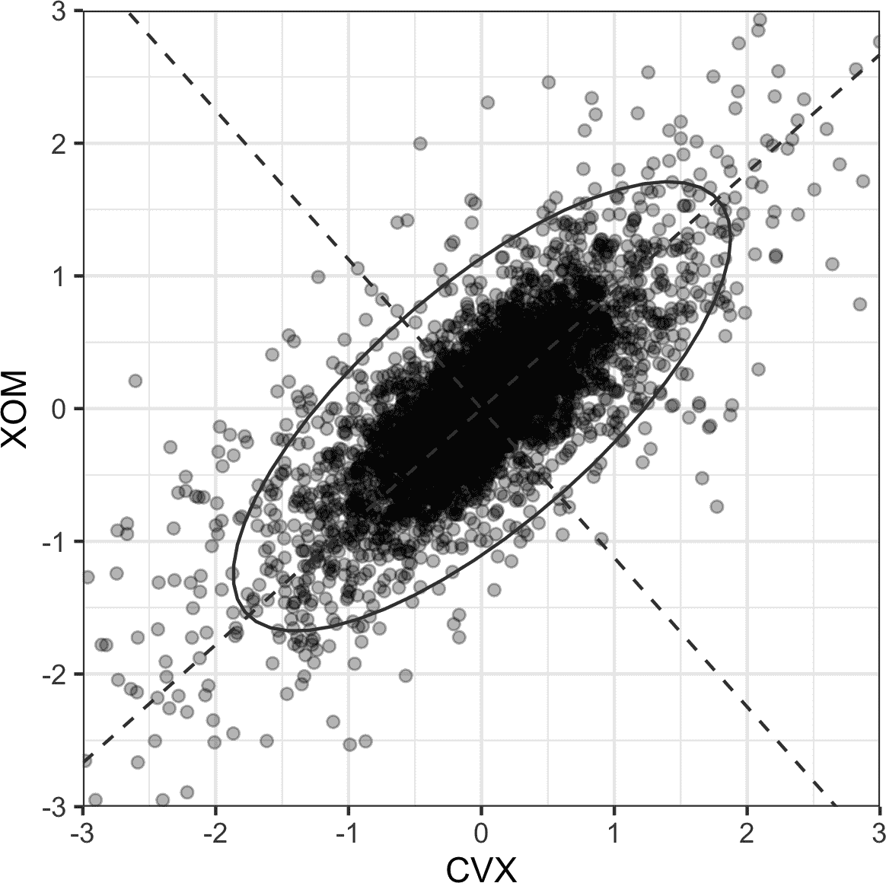

###### 图 7-1\. 雪佛龙（CVX）和埃克森美孚（XOM）股票回报的主成分

虚线显示了两个主成分的方向：第一个主成分沿着椭圆的长轴，第二个主成分沿着短轴。您可以看到，雪佛龙和埃克森美孚的股票回报中的大部分变异性都由第一个主成分解释。这是有道理的，因为能源股票价格往往会作为一组移动。

###### 注意

第一个主成分的权重都为负，但反转所有权重的符号并不会改变主成分。例如，使用第一个主成分的权重 0.747 和 0.665 等同于负权重，就像由原点和 1,1 定义的无限线条等同于由原点和-1,-1 定义的线条一样。

## 计算主成分

从两个变量到更多变量的过程很简单。对于第一个成分，只需将额外的预测变量包括在线性组合中，并分配权重以优化所有预测变量的协变化进入这第一个主成分（*协方差*是统计术语；见“协方差矩阵”）。主成分的计算是一种经典的统计方法，依赖于数据的相关矩阵或协方差矩阵，并且执行迅速，不依赖迭代。正如前面所述，主成分分析仅适用于数值变量，而不适用于分类变量。整个过程可以描述如下：

1.  在创建第一个主成分时，PCA 得出了最大化解释总方差百分比的预测变量的线性组合。

1.  然后，这个线性组合就成为第一个“新”预测变量*Z*[1]。

1.  PCA 重复此过程，使用不同的权重与相同的变量，以创建第二个新的预测变量*Z*[2]。权重的设置使得*Z*[1]和*Z*[2]不相关。

1.  该过程持续进行，直到您获得与原始变量*X*[i]一样多的新变量或组件*Z*[i]。

1.  选择保留尽可能多的组件，以解释大部分的方差。

1.  到目前为止，每个组件都有一组权重。最后一步是通过将这些权重应用于原始值来将原始数据转换为新的主成分分数。然后可以使用这些新分数作为减少的预测变量集。

## 解释主成分

主成分的性质通常揭示了关于数据结构的信息。有几种标准的可视化显示方法可帮助您获取有关主成分的见解。其中一种方法是*屏幕图*，用于可视化主成分的相对重要性（该名称源于图表与屏坡的相似性；这里，y 轴是特征值）。以下*R*代码显示了 S&P 500 中几家顶级公司的示例：

```py
syms <- c( 'AAPL', 'MSFT', 'CSCO', 'INTC', 'CVX', 'XOM',
   'SLB', 'COP', 'JPM', 'WFC', 'USB', 'AXP', 'WMT', 'TGT', 'HD', 'COST')
top_sp <- sp500_px[row.names(sp500_px)>='2005-01-01', syms]
sp_pca <- princomp(top_sp)
screeplot(sp_pca)
```

从`scikit-learn`结果创建加载图的信息可在`explained_variance_`中找到。在这里，我们将其转换为`pandas`数据框架，并用它制作条形图：

```py
syms = sorted(['AAPL', 'MSFT', 'CSCO', 'INTC', 'CVX', 'XOM', 'SLB', 'COP',
               'JPM', 'WFC', 'USB', 'AXP', 'WMT', 'TGT', 'HD', 'COST'])
top_sp = sp500_px.loc[sp500_px.index >= '2011-01-01', syms]

sp_pca = PCA()
sp_pca.fit(top_sp)

explained_variance = pd.DataFrame(sp_pca.explained_variance_)
ax = explained_variance.head(10).plot.bar(legend=False, figsize=(4, 4))
ax.set_xlabel('Component')
```

如图 7-2 所示，第一个主成分的方差非常大（通常情况下如此），但其他顶级主成分也很显著。

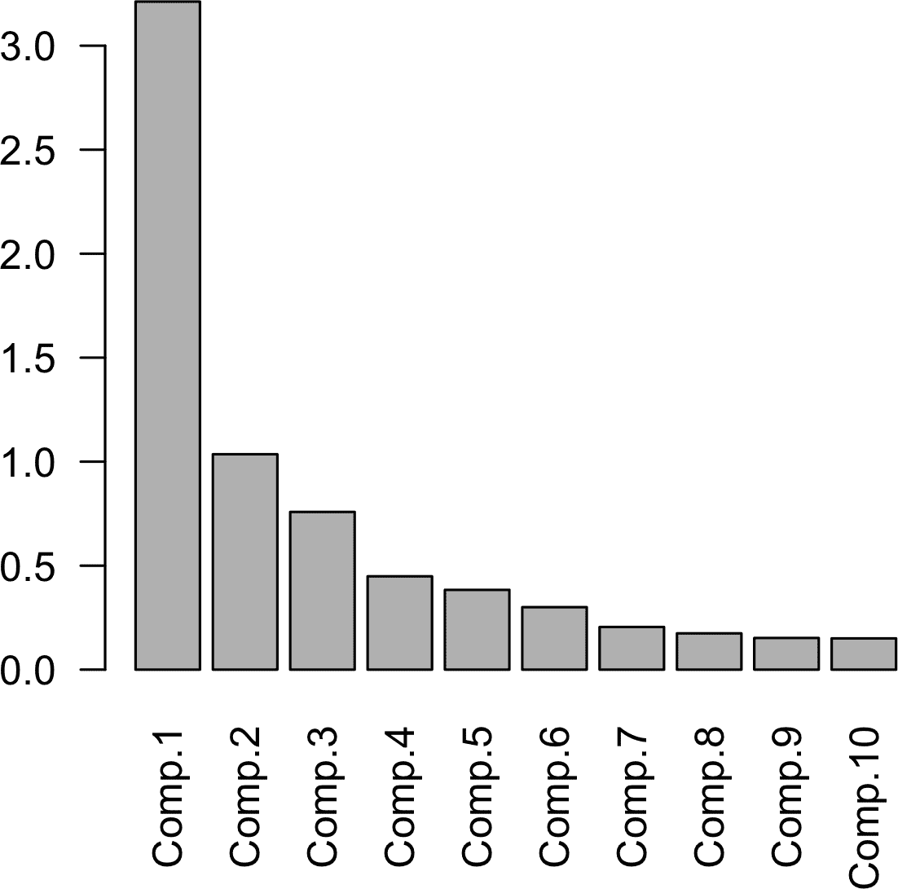

###### 图 7-2\. S&P 500 中热门股票的 PCA 的屏幕图

绘制顶级主成分的权重可能特别有启发性。在*R*中，一种方法是使用`tidyr`包中的`gather`函数与`ggplot`结合使用：

```py
library(tidyr)
loadings <- sp_pca$loadings[,1:5]
loadings$Symbol <- row.names(loadings)
loadings <- gather(loadings, 'Component', 'Weight', -Symbol)
ggplot(loadings, aes(x=Symbol, y=Weight)) +
  geom_bar(stat='identity') +
  facet_grid(Component ~ ., scales='free_y')
```

这是在*Python*中创建相同可视化的代码：

```py
loadings = pd.DataFrame(sp_pca.components_[0:5, :], columns=top_sp.columns)
maxPC = 1.01 * np.max(np.max(np.abs(loadings.loc[0:5, :])))

f, axes = plt.subplots(5, 1, figsize=(5, 5), sharex=True)
for i, ax in enumerate(axes):
    pc_loadings = loadings.loc[i, :]
    colors = ['C0' if l > 0 else 'C1' for l in pc_loadings]
    ax.axhline(color='#888888')
    pc_loadings.plot.bar(ax=ax, color=colors)
    ax.set_ylabel(f'PC{i+1}')
    ax.set_ylim(-maxPC, maxPC)
```

前五个成分的负载显示在图 7-3 中。第一个主成分的负载具有相同的符号：这对于所有列共享一个公共因子的数据是典型的（在这种情况下，是整体股市趋势）。第二个成分捕捉了能源股票的价格变化相对于其他股票的情况。第三个成分主要是对比了苹果和 CostCo 的动态。第四个成分对比了斯伦贝谢（SLB）与其他能源股票的动态。最后，第五个成分主要受到金融公司的影响。

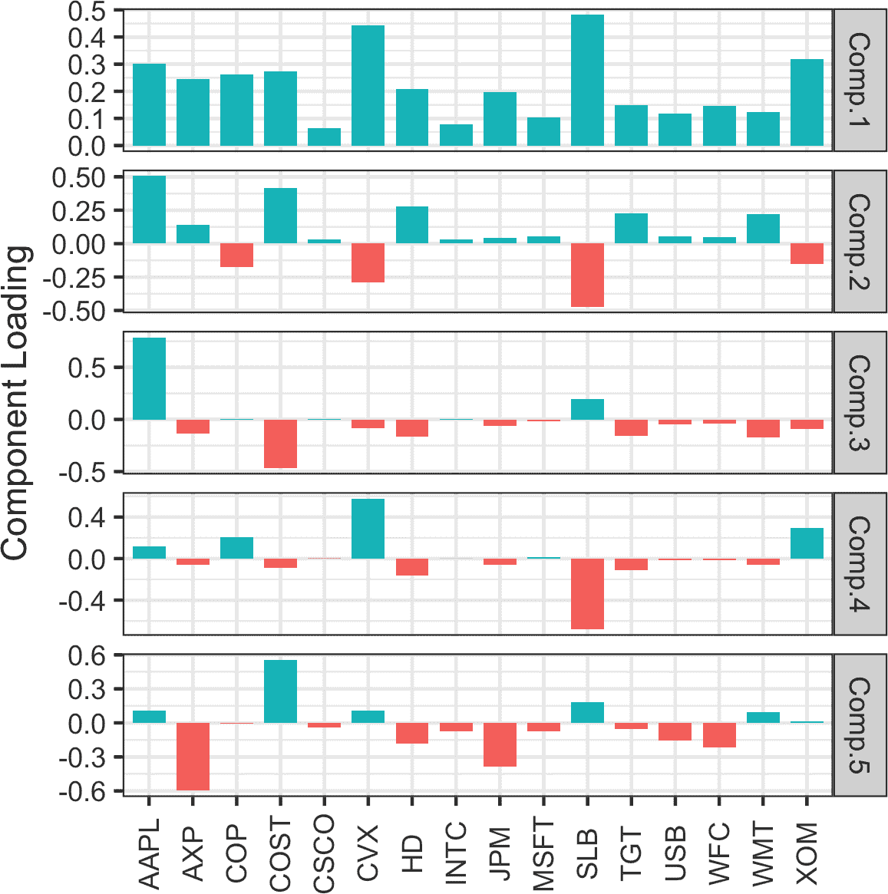

###### 图 7-3\. 股价回报的前五个主成分的负载

# 如何选择成分数量？

如果你的目标是降低数据的维度，你必须决定选择多少个主成分。最常见的方法是使用一种临时规则来选择解释“大部分”方差的成分。你可以通过研究屏斜图来直观地做到这一点，例如图 7-2。或者，你可以选择前几个成分，使累积方差超过一个阈值，比如 80%。此外，你还可以检查负载以确定成分是否具有直观的解释。交叉验证提供了一种更正式的方法来选择显著成分的数量（参见“交叉验证”了解更多）。

## 对应分析

PCA 不能用于分类数据；然而，一个有点相关的技术是*对应分析*。其目标是识别类别之间的关联，或者分类特征之间的关联。对应分析与主成分分析的相似之处主要在于底层——用于尺度化维度的矩阵代数。对应分析主要用于低维分类数据的图形分析，并不像 PCA 那样用于大数据的维度减少作为预处理步骤。

输入可以看作是一个表格，其中行代表一个变量，列代表另一个变量，单元格表示记录计数。输出（经过一些矩阵代数运算后）是一个*双标图* —— 一个散点图，其轴经过缩放（并且通过百分比显示该维度解释的方差量）。轴上的单位含义与原始数据的直觉连接并不大，散点图的主要价值在于以图形方式说明彼此相关的变量（通过图中的接近度）。例如，参见图 7-4，在该图中，家务任务按照是否共同完成（垂直轴）和妻子或丈夫是否有主要责任（水平轴）进行排列。对应分析已经存在了几十年，就像这个示例的精神一样，根据任务的分配。

在*R*中，有多种用于对应分析的软件包。这里我们使用`ca`软件包：

```py
ca_analysis <- ca(housetasks)
plot(ca_analysis)
```

在*Python*中，我们可以使用`prince`软件包，它使用`scikit-learn` API 实现了对应分析：

```py
ca = prince.CA(n_components=2)
ca = ca.fit(housetasks)

ca.plot_coordinates(housetasks, figsize=(6, 6))
```


###### 图 7-4\. 房屋任务数据的对应分析的图形表示

## 进一步阅读

想要详细了解主成分分析中交叉验证的使用方法，请参阅 Rasmus Bro, K. Kjeldahl, A.K. Smilde, 和 Henk A. L. Kiers 的文章，[“Component Models 的交叉验证：对当前方法的批判性审视”](https://oreil.ly/yVryf)，发表于*分析与生物分析化学*390 卷，5 期（2008 年）。

# K-Means 聚类

聚类是一种将数据分成不同组的技术，其中每组内的记录彼此相似。聚类的目标是识别重要且有意义的数据组。这些组可以直接使用，深入分析，或者作为预测回归或分类模型的特征或结果。*K-means*是最早开发的聚类方法之一；它仍然被广泛使用，因为算法相对简单且能够扩展到大数据集。

*K*-means 通过最小化每个记录到其分配的群集的均值的平方距离来将数据分成*K*个群集。这被称为*群内平方和*或*群内 SS*。*K*-means 不能确保群集大小相同，但能找到最佳分离的群集。

# 标准化

通常会通过减去均值并除以标准差来对连续变量进行标准化。否则，具有大量数据的变量会在聚类过程中占主导地位（参见“标准化（归一化，z-分数）”）。

## 一个简单的例子

首先考虑一个数据集，包含*n*个记录和两个变量，<math alttext="x"><mi>x</mi></math> 和 <math alttext="y"><mi>y</mi></math> 。假设我们想将数据分成<math alttext="upper K equals 4"><mrow><mi>K</mi> <mo>=</mo> <mn>4</mn></mrow></math>个群集。这意味着将每个记录<math alttext="left-parenthesis x Subscript i Baseline comma y Subscript i Baseline right-parenthesis"><mrow><mo>(</mo> <msub><mi>x</mi> <mi>i</mi></msub> <mo>,</mo> <msub><mi>y</mi> <mi>i</mi></msub> <mo>)</mo></mrow></math> 分配给一个群集*k*。考虑到将<math alttext="n Subscript k"><msub><mi>n</mi> <mi>k</mi></msub></math>个记录分配给群集*k*，群集的中心<math alttext="left-parenthesis x overbar Subscript k Baseline comma y overbar Subscript k Baseline right-parenthesis"><mrow><mo>(</mo> <msub><mover accent="true"><mi>x</mi> <mo>¯</mo></mover> <mi>k</mi></msub> <mo>,</mo> <msub><mover accent="true"><mi>y</mi> <mo>¯</mo></mover> <mi>k</mi></msub> <mo>)</mo></mrow></math> 是群集中点的均值：

<math display="block"><mtable displaystyle="true"><mtr><mtd><msub><mrow class="MJX-TeXAtom-ORD"><mover><mi>x</mi><mo stretchy="false">¯</mo></mover></mrow> <mi>k</mi></msub></mtd> <mtd><mo>=</mo> <mfrac><mn>1</mn><msub><mi>n</mi><mi>k</mi></msub></mfrac> <munder><mo>∑</mo> <mrow class="MJX-TeXAtom-ORD"><mtable rowspacing="0.1em" columnspacing="0em 0em 0em 0em" displaystyle="false"><mtr><mtd><mi>i</mi><mo>∈</mo></mtd></mtr> <mtr><mtd><mrow class="MJX-TeXAtom-ORD"><mtext>Cluster</mtext></mrow> <mi>k</mi></mtd></mtr></mtable></mrow></munder> <msub><mi>x</mi> <mi>i</mi></msub></mtd></mtr> <mtr><mtd><msub><mrow class="MJX-TeXAtom-ORD"><mover><mi>y</mi><mo stretchy="false">¯</mo></mover></mrow> <mi>k</mi></msub></mtd> <mtd><mo>=</mo> <mfrac><mn>1</mn><msub><mi>n</mi><mi>k</mi></msub></mfrac> <munder><mo>∑</mo> <mrow class="MJX-TeXAtom-ORD"><mtable rowspacing="0.1em" columnspacing="0em 0em 0em 0em" displaystyle="false"><mtr><mtd><mi>i</mi><mo>∈</mo></mtd></mtr> <mtr><mtd><mrow class="MJX-TeXAtom-ORD"><mtext>Cluster</mtext></mrow> <mi>k</mi></mtd></mtr></mtable></mrow></munder> <msub><mi>y</mi><mi>i</mi></msub></mtd></mtr></mtable></math>

# 聚类平均值

在具有多个变量的记录聚类中（典型情况），术语*簇均值*不是指单一数字，而是指变量均值向量。

簇内平方和由以下给出：

<math display="block"><mrow><msub><mtext>SS</mtext> <mi>k</mi></msub> <mo>=</mo> <munder><mo>∑</mo> <mrow><mi>i</mi><mo>∈</mo><mtext>Cluster</mtext><mi>k</mi></mrow></munder> <msup><mfenced separators="" open="(" close=")"><msub><mi>x</mi> <mi>i</mi></msub> <mo>-</mo><msub><mover accent="true"><mi>x</mi> <mo>¯</mo></mover> <mi>k</mi></msub></mfenced> <mn>2</mn></msup> <mo>+</mo> <msup><mfenced separators="" open="(" close=")"><msub><mi>y</mi> <mi>i</mi></msub> <mo>-</mo><msub><mover accent="true"><mi>y</mi> <mo>¯</mo></mover> <mi>k</mi></msub></mfenced> <mn>2</mn></msup></mrow></math>

*K*-means 找到了记录分配方式，以最小化所有四个聚类的簇内平方和<math alttext="SS Subscript 1 Baseline plus SS Subscript 2 Baseline plus SS Subscript 3 Baseline plus SS Subscript 4"><mrow><msub><mtext>SS</mtext> <mn>1</mn></msub> <mo>+</mo> <msub><mtext>SS</mtext> <mn>2</mn></msub> <mo>+</mo> <msub><mtext>SS</mtext> <mn>3</mn></msub> <mo>+</mo> <msub><mtext>SS</mtext> <mn>4</mn></msub></mrow></math>：

<math display="block"><mrow><munderover><mo>∑</mo> <mrow><mi>k</mi><mo>=</mo><mn>1</mn></mrow> <mn>4</mn></munderover> <msub><mtext>SS</mtext> <mi>k</mi></msub></mrow></math>

聚类的典型用途是在数据中找到自然的、分离的聚类。另一个应用是将数据分为预定数量的单独组，聚类用于确保这些组尽可能彼此不同。

例如，假设我们想将每日股票收益分为四组。可以使用*K*-means 聚类将数据分隔为最佳分组。请注意，每日股票收益以一种实际上是标准化的方式报告，因此我们不需要对数据进行标准化。在*R*中，可以使用`kmeans`函数执行*K*-means 聚类。例如，以下基于两个变量——埃克森美孚（`XOM`）和雪佛龙（`CVX`）的每日股票收益来找到四个簇：

```py
df <- sp500_px[row.names(sp500_px)>='2011-01-01', c('XOM', 'CVX')]
km <- kmeans(df, centers=4)
```

我们使用*Python*中`scikit-learn`的`sklearn.cluster.KMeans`方法：

```py
df = sp500_px.loc[sp500_px.index >= '2011-01-01', ['XOM', 'CVX']]
kmeans = KMeans(n_clusters=4).fit(df)
```

每条记录的簇分配作为`cluster`组件（*R*）返回：

```py
> df$cluster <- factor(km$cluster)
> head(df)
                  XOM        CVX cluster
2011-01-03 0.73680496  0.2406809       2
2011-01-04 0.16866845 -0.5845157       1
2011-01-05 0.02663055  0.4469854       2
2011-01-06 0.24855834 -0.9197513       1
2011-01-07 0.33732892  0.1805111       2
2011-01-10 0.00000000 -0.4641675       1
```

在`scikit-learn`中，聚类标签可在`labels_`字段中找到：

```py
df['cluster'] = kmeans.labels_
df.head()
```

前六条记录分配到簇 1 或簇 2。聚类的均值也返回（*R*）：

```py
> centers <- data.frame(cluster=factor(1:4), km$centers)
> centers
  cluster        XOM        CVX
1       1 -0.3284864 -0.5669135
2       2  0.2410159  0.3342130
3       3 -1.1439800 -1.7502975
4       4  0.9568628  1.3708892
```

在`scikit-learn`中，聚类中心可在`cluster_centers_`字段中找到：

```py
centers = pd.DataFrame(kmeans.cluster_centers_, columns=['XOM', 'CVX'])
centers
```

簇 1 和簇 3 代表“下跌”市场，而簇 2 和簇 4 代表“上涨”市场。

由于*K*-means 算法使用随机起始点，结果可能在后续运行和不同实现方法之间有所不同。一般而言，应检查波动是否过大。

在这个例子中，只有两个变量，可以直观地展示聚类及其均值：

```py
ggplot(data=df, aes(x=XOM, y=CVX, color=cluster, shape=cluster)) +
  geom_point(alpha=.3) +
  geom_point(data=centers,  aes(x=XOM, y=CVX), size=3, stroke=2)
```

`seaborn`的`scatterplot`函数使得可以通过属性（`hue`）和样式（`style`）轻松着色点：

```py
fig, ax = plt.subplots(figsize=(4, 4))
ax = sns.scatterplot(x='XOM', y='CVX', hue='cluster', style='cluster',
                     ax=ax, data=df)
ax.set_xlim(-3, 3)
ax.set_ylim(-3, 3)
centers.plot.scatter(x='XOM', y='CVX', ax=ax, s=50, color='black')
```

所得图中显示了图 7-5 中的聚类分配和聚类均值。请注意，即使这些聚类没有很好地分离，*K*-means 也会将记录分配到聚类中（这在需要将记录最优地分成组时非常有用）。

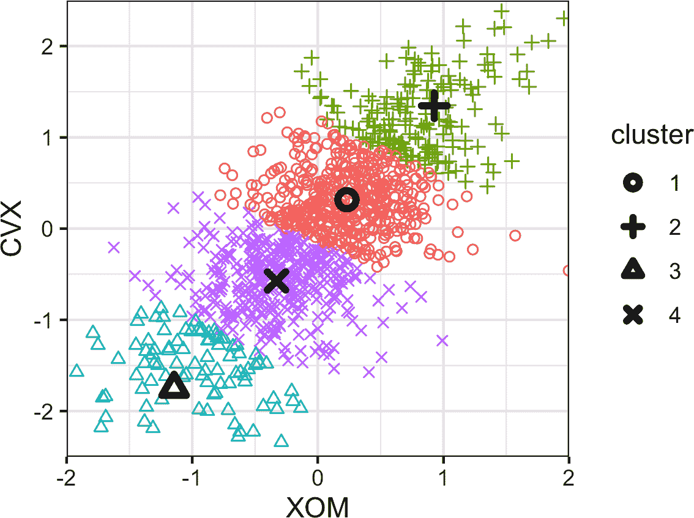

###### 图 7-5\. 应用于埃克森美孚和雪佛龙每日股票收益的 K 均值聚类（聚类中心用黑色符号突出显示）

## K 均值算法

通常情况下，*K*均值可以应用于具有*p*个变量的数据集<math alttext="upper X 1 comma ellipsis comma upper X Subscript p Baseline"><mrow><msub><mi>X</mi> <mn>1</mn></msub> <mo>,</mo> <mo>...</mo> <mo>,</mo> <msub><mi>X</mi> <mi>p</mi></msub></mrow></math> 。虽然*K*均值的确切解决方案在计算上非常困难，但启发式算法提供了计算局部最优解的有效方法。

算法从用户指定的*K*和初始聚类均值开始，然后迭代以下步骤：

1.  将每条记录分配到最近的聚类均值，方法是通过平方距离来衡量。

1.  根据记录的分配计算新的聚类均值。

当记录分配到聚类时不再改变时，算法收敛。

对于第一次迭代，您需要指定一个初始的聚类均值集。通常情况下，您可以通过随机将每个记录分配给*K*个聚类之一，然后找到这些聚类的均值来完成此操作。

由于此算法不能保证找到最佳可能的解决方案，建议使用不同的随机样本多次运行算法以初始化算法。当使用多组迭代时，*K*均值结果由具有最低聚类内平方和的迭代给出。

*R*函数`kmeans`的`nstart`参数允许您指定尝试的随机起始次数。例如，以下代码使用 10 个不同的起始聚类均值运行*K*均值以找到 5 个聚类：

```py
syms <- c( 'AAPL', 'MSFT', 'CSCO', 'INTC', 'CVX', 'XOM', 'SLB', 'COP',
           'JPM', 'WFC', 'USB', 'AXP', 'WMT', 'TGT', 'HD', 'COST')
df <- sp500_px[row.names(sp500_px) >= '2011-01-01', syms]
km <- kmeans(df, centers=5, nstart=10)
```

函数会自动从 10 个不同的起始点中返回最佳解决方案。您可以使用参数`iter.max`来设置算法允许的每个随机起始的最大迭代次数。

默认情况下，`scikit-learn`算法会重复 10 次（`n_init`）。参数`max_iter`（默认为 300）可用于控制迭代次数：

```py
syms = sorted(['AAPL', 'MSFT', 'CSCO', 'INTC', 'CVX', 'XOM', 'SLB', 'COP',
               'JPM', 'WFC', 'USB', 'AXP', 'WMT', 'TGT', 'HD', 'COST'])
top_sp = sp500_px.loc[sp500_px.index >= '2011-01-01', syms]
kmeans = KMeans(n_clusters=5).fit(top_sp)
```

## 解释聚类

聚类分析的一个重要部分可能涉及对聚类的解释。`kmeans`的两个最重要的输出是聚类的大小和聚类均值。对于上一小节的示例，生成的聚类大小由以下*R*命令给出：

```py
km$size
[1] 106 186 285 288 266
```

在*Python*中，我们可以使用标准库中的`collections.Counter`类来获取这些信息。由于实现的差异和算法固有的随机性，结果会有所不同：

```py
from collections import Counter
Counter(kmeans.labels_)

Counter({4: 302, 2: 272, 0: 288, 3: 158, 1: 111})
```

聚类大小相对平衡。不平衡的聚类可能是由于远离异常值或非常不同于数据其余部分的记录组成，这两者都可能需要进一步检查。

您可以使用`gather`函数与`ggplot`结合来绘制聚类的中心：

```py
centers <- as.data.frame(t(centers))
names(centers) <- paste("Cluster", 1:5)
centers$Symbol <- row.names(centers)
centers <- gather(centers, 'Cluster', 'Mean', -Symbol)
centers$Color = centers$Mean > 0
ggplot(centers, aes(x=Symbol, y=Mean, fill=Color)) +
  geom_bar(stat='identity', position='identity', width=.75) +
  facet_grid(Cluster ~ ., scales='free_y')
```

创建此可视化的*Python*代码与我们用于 PCA 的代码类似：

```py
centers = pd.DataFrame(kmeans.cluster_centers_, columns=syms)

f, axes = plt.subplots(5, 1, figsize=(5, 5), sharex=True)
for i, ax in enumerate(axes):
    center = centers.loc[i, :]
    maxPC = 1.01 * np.max(np.max(np.abs(center)))
    colors = ['C0' if l > 0 else 'C1' for l in center]
    ax.axhline(color='#888888')
    center.plot.bar(ax=ax, color=colors)
    ax.set_ylabel(f'Cluster {i + 1}')
    ax.set_ylim(-maxPC, maxPC)
```

生成的图表显示在图 7-6 中，显示了每个集群的性质。例如，集群 4 和 5 对应于市场下跌和上涨的日子。集群 2 和 3 分别以消费者股票上涨日和能源股票下跌日为特征。最后，集群 1 捕捉到了能源股票上涨和消费者股票下跌的日子。

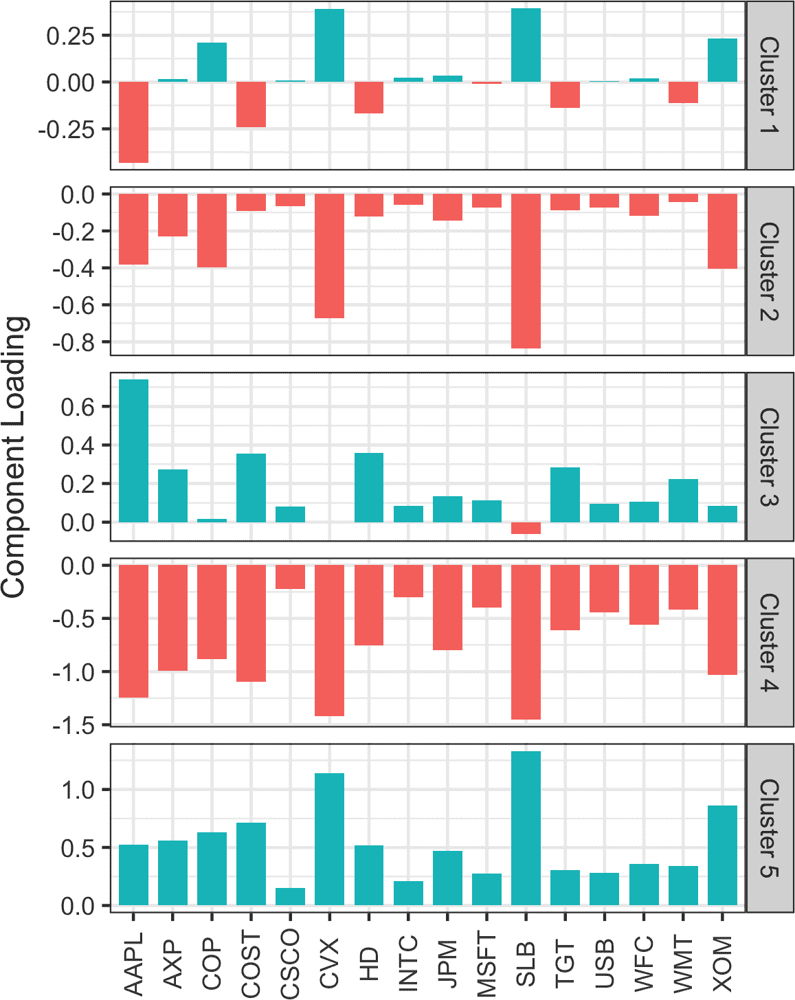

###### 图 7-6\. 每个集群中变量的均值（“集群均值”）

# 聚类分析与主成分分析

集群均值图表的精神类似于主成分分析（PCA）的载荷。主要区别在于，与 PCA 不同，集群均值的符号是有意义的。PCA 识别变化的主要方向，而聚类分析找到彼此附近的记录组。

## 选择集群数量

*K*-means 算法要求您指定集群数量*K*。有时，集群数量由应用程序驱动。例如，管理销售团队的公司可能希望将客户聚类成“人物角色”以便于专注和引导销售电话。在这种情况下，管理考虑因素将决定所需客户段数——例如，两个可能不会产生有用的客户差异化，而八个可能太多难以管理。

在缺乏实际或管理考虑因素决定的集群数量的情况下，可以使用统计方法。没有单一标准方法来找到“最佳”集群数量。

一个常见的方法是*肘方法*，其目标是确定集群的集合何时解释了数据的“大部分”方差。在此集合之外添加新的集群对解释的方差贡献相对较少。肘部是在累积解释的方差在陡峭上升后变得平缓的点，因此得名此方法。

图 7-7 显示了默认数据在集群数量从 2 到 15 范围内解释的累积百分比方差。在此示例中，肘部在哪里？在这个例子中没有明显的候选者，因为方差解释的增量逐渐下降。这在没有明确定义集群的数据中非常典型。这可能是肘方法的一个缺点，但它确实揭示了数据的本质。

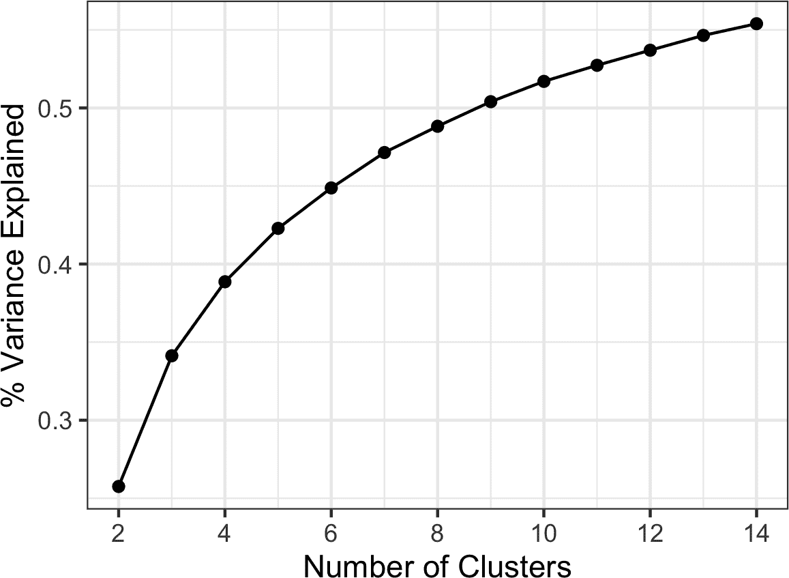

###### 图 7-7\. 股票数据应用肘方法

在*R*中，`kmeans`函数并没有提供一个单一的命令来应用肘方法，但可以从`kmeans`的输出中很容易地应用，如下所示：

```py
pct_var <- data.frame(pct_var = 0,
                      num_clusters = 2:14)
totalss <- kmeans(df, centers=14, nstart=50, iter.max=100)$totss
for (i in 2:14) {
  kmCluster <- kmeans(df, centers=i, nstart=50, iter.max=100)
  pct_var[i-1, 'pct_var'] <- kmCluster$betweenss / totalss
}
```

对于`KMeans`的结果，我们从属性`inertia_`中获取这些信息。在转换为`pandas`数据框后，我们可以使用其`plot`方法创建图表：

```py
inertia = []
for n_clusters in range(2, 14):
    kmeans = KMeans(n_clusters=n_clusters, random_state=0).fit(top_sp)
    inertia.append(kmeans.inertia_ / n_clusters)

inertias = pd.DataFrame({'n_clusters': range(2, 14), 'inertia': inertia})
ax = inertias.plot(x='n_clusters', y='inertia')
plt.xlabel('Number of clusters(k)')
plt.ylabel('Average Within-Cluster Squared Distances')
plt.ylim((0, 1.1 * inertias.inertia.max()))
ax.legend().set_visible(False)
```

在评估要保留多少个聚类时，也许最重要的测试是：这些聚类在新数据上能否被复制？这些聚类是否可解释，并且它们是否与数据的一般特征相关联，还是仅反映特定实例？部分可以通过交叉验证来评估；参见“交叉验证”。

通常情况下，没有一条单一的规则能够可靠地指导产生多少个聚类。

###### 注意

根据统计学或信息理论有几种更正式的方法来确定聚类数。例如，[Robert Tibshirani、Guenther Walther 和 Trevor Hastie 提出了基于统计理论的“间隙”统计量](https://oreil.ly/d-N3_) 来识别拐点。对于大多数应用程序来说，理论方法可能是不必要的，甚至不合适。

# 层次聚类

*层次聚类*是一种替代*K*-均值的方法，可以产生非常不同的聚类。层次聚类允许用户可视化指定不同聚类数的效果。在发现异常或畸变组或记录方面更为敏感。层次聚类还适合直观的图形显示，有助于更容易地解释聚类。

层次聚类的灵活性伴随着成本，且层次聚类不适用于具有数百万条记录的大数据集。即使是具有几万条记录的中等规模数据，层次聚类也可能需要大量的计算资源。实际上，大多数层次聚类的应用集中在相对小型的数据集上。

## 简单示例

层次聚类适用于一个具有*n*条记录和*p*个变量的数据集，并基于两个基本构建块：

+   一个距离度量 <math alttext="d Subscript i comma j"><msub><mi>d</mi> <mrow><mi>i</mi><mo>,</mo><mi>j</mi></mrow></msub></math> 用于测量两个记录*i*和*j*之间的距离。

+   一个不相似度度量 <math alttext="upper D Subscript upper A comma upper B"><msub><mi>D</mi> <mrow><mi>A</mi><mo>,</mo><mi>B</mi></mrow></msub></math> 用于基于成员之间的距离 <math alttext="d Subscript i comma j"><msub><mi>d</mi> <mrow><mi>i</mi><mo>,</mo><mi>j</mi></mrow></msub></math> 来测量两个聚类*A*和*B*之间的差异。

对于涉及数值数据的应用程序，最重要的选择是不相似度度量。层次聚类通过将每条记录设置为其自己的集群，并迭代以合并最不相似的集群来开始。

在 *R* 中，可以使用 `hclust` 函数执行层次聚类。与 `kmeans` 不同之处在于，它基于成对距离 <math alttext="d Subscript i comma j"><msub><mi>d</mi> <mrow><mi>i</mi><mo>,</mo><mi>j</mi></mrow></msub></math> 而不是数据本身。可以使用 `dist` 函数计算这些距离。例如，以下代码对一组公司的股票回报应用了层次聚类：

```py
syms1 <- c('GOOGL', 'AMZN', 'AAPL', 'MSFT', 'CSCO', 'INTC', 'CVX', 'XOM', 'SLB',
           'COP', 'JPM', 'WFC', 'USB', 'AXP', 'WMT', 'TGT', 'HD', 'COST')
# take transpose: to cluster companies, we need the stocks along the rows
df <- t(sp500_px[row.names(sp500_px) >= '2011-01-01', syms1])
d <- dist(df)
hcl <- hclust(d)
```

聚类算法将数据框的记录（行）进行聚类。由于我们想要对公司进行聚类，因此需要*转置*（`t`）数据框，使得股票沿着行，日期沿着列。

`scipy` 包在 `scipy.cluster.hierarchy` 模块中提供了多种不同的层次聚类方法。这里我们使用 `linkage` 函数以“complete”方法：

```py
syms1 = ['AAPL', 'AMZN', 'AXP', 'COP', 'COST', 'CSCO', 'CVX', 'GOOGL', 'HD',
         'INTC', 'JPM', 'MSFT', 'SLB', 'TGT', 'USB', 'WFC', 'WMT', 'XOM']
df = sp500_px.loc[sp500_px.index >= '2011-01-01', syms1].transpose()

Z = linkage(df, method='complete')
```

## 树状图

层次聚类自然适合以树状图形式展示，称为*树状图*。该名称源自希腊语单词*dendro*（树）和*gramma*（绘制）。在 *R* 中，你可以轻松地使用 `plot` 命令生成这个图：

```py
plot(hcl)
```

我们可以使用 `dendrogram` 方法绘制 *Python* 中 `linkage` 函数的结果：

```py
fig, ax = plt.subplots(figsize=(5, 5))
dendrogram(Z, labels=df.index, ax=ax, color_threshold=0)
plt.xticks(rotation=90)
ax.set_ylabel('distance')
```

结果显示在 Figure 7-8 中（注意，我们现在绘制的是相互相似的公司，而不是日期）。树的叶子对应记录。树中分支的长度表示相应聚类之间的差异程度。谷歌和亚马逊的回报彼此及其他股票的回报非常不同。石油股票（SLB, CVX, XOM, COP）位于它们自己的聚类中，苹果（AAPL）独立成一类，其余的股票彼此相似。

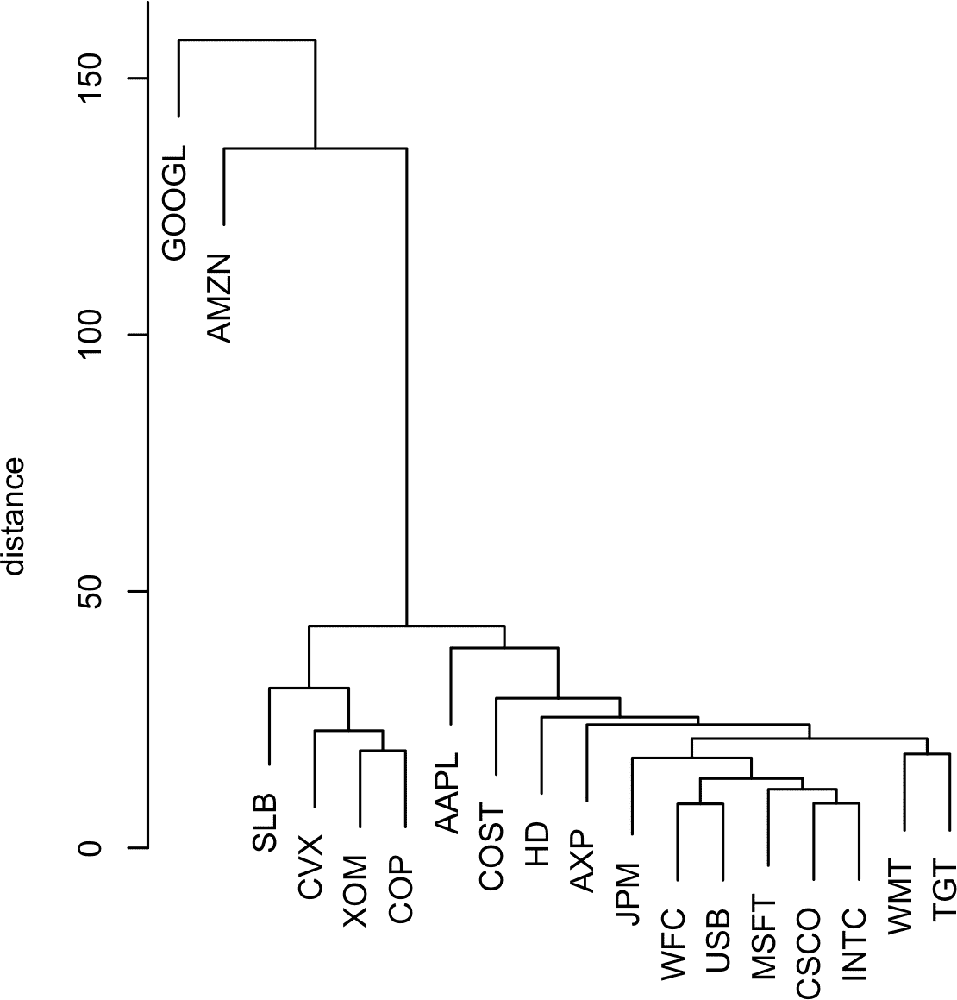

###### 图 7-8\. 股票的树状图

与*K*-means 相比，不需要预先指定聚类的数量。在图形上，你可以通过一个水平线上下移动来识别不同数量的聚类；聚类在水平线与垂直线交点处定义。要提取特定数量的聚类，可以使用 `cutree` 函数：

```py
cutree(hcl, k=4)
GOOGL  AMZN  AAPL  MSFT  CSCO  INTC   CVX   XOM   SLB   COP   JPM   WFC
    1     2     3     3     3     3     4     4     4     4     3     3
  USB   AXP   WMT   TGT    HD  COST
    3     3     3     3     3     3
```

在 *Python* 中，你可以使用 `fcluster` 方法实现同样的效果：

```py
memb = fcluster(Z, 4, criterion='maxclust')
memb = pd.Series(memb, index=df.index)
for key, item in memb.groupby(memb):
    print(f"{key} : {', '.join(item.index)}")
```

需要提取的聚类数量设置为 4，你可以看到谷歌和亚马逊各自属于自己的一个聚类。所有的石油股票属于另一个聚类。剩下的股票在第四个聚类中。

## 凝聚算法

层次聚类的主要算法是*凝聚*算法，它是通过迭代地合并相似的聚类来实现的。凝聚算法首先将每个记录视为自己单独的聚类，然后逐步构建越来越大的聚类。第一步是计算所有记录对之间的距离。

对于每对记录 <math alttext="left-parenthesis x 1 comma x 2 comma ellipsis comma x Subscript p Baseline right-parenthesis"><mrow><mo>(</mo> <msub><mi>x</mi> <mn>1</mn></msub> <mo>,</mo> <msub><mi>x</mi> <mn>2</mn></msub> <mo>,</mo> <mo>...</mo> <mo>,</mo> <msub><mi>x</mi> <mi>p</mi></msub> <mo>)</mo></mrow></math> 和 <math alttext="left-parenthesis y 1 comma y 2 comma ellipsis comma y Subscript p Baseline right-parenthesis"><mrow><mo>(</mo> <msub><mi>y</mi> <mn>1</mn></msub> <mo>,</mo> <msub><mi>y</mi> <mn>2</mn></msub> <mo>,</mo> <mo>...</mo> <mo>,</mo> <msub><mi>y</mi> <mi>p</mi></msub> <mo>)</mo></mrow></math> ，我们使用距离度量 <math alttext="d Subscript x comma y"><msub><mi>d</mi> <mrow><mi>x</mi><mo>,</mo><mi>y</mi></mrow></msub></math> 来衡量这两个记录之间的距离（见 “距离度量”）。例如，我们可以使用欧氏距离：

<math display="block"><mrow><mi>d</mi> <mrow><mo>(</mo> <mi>x</mi> <mo>,</mo> <mi>y</mi> <mo>)</mo></mrow> <mo>=</mo> <msqrt><mrow><msup><mrow><mo>(</mo><msub><mi>x</mi> <mn>1</mn></msub> <mo>-</mo><msub><mi>y</mi> <mn>1</mn></msub> <mo>)</mo></mrow> <mn>2</mn></msup> <mo>+</mo> <msup><mrow><mo>(</mo><msub><mi>x</mi> <mn>2</mn></msub> <mo>-</mo><msub><mi>y</mi> <mn>2</mn></msub> <mo>)</mo></mrow> <mn>2</mn></msup> <mo>+</mo> <mo>⋯</mo> <mo>+</mo> <msup><mrow><mo>(</mo><msub><mi>x</mi> <mi>p</mi></msub> <mo>-</mo><msub><mi>y</mi> <mi>p</mi></msub> <mo>)</mo></mrow> <mn>2</mn></msup></mrow></msqrt></mrow></math>

现在我们转向簇间距离。考虑两个簇 *A* 和 *B*，每个簇都有一组不同的记录，<math alttext="upper A equals left-parenthesis a 1 comma a 2 comma ellipsis comma a Subscript m Baseline right-parenthesis"><mrow><mi>A</mi> <mo>=</mo> <mo>(</mo> <msub><mi>a</mi> <mn>1</mn></msub> <mo>,</mo> <msub><mi>a</mi> <mn>2</mn></msub> <mo>,</mo> <mo>...</mo> <mo>,</mo> <msub><mi>a</mi> <mi>m</mi></msub> <mo>)</mo></mrow></math> 和 <math alttext="upper B equals left-parenthesis b 1 comma b 2 comma ellipsis comma b Subscript q Baseline right-parenthesis"><mrow><mi>B</mi> <mo>=</mo> <mo>(</mo> <msub><mi>b</mi> <mn>1</mn></msub> <mo>,</mo> <msub><mi>b</mi> <mn>2</mn></msub> <mo>,</mo> <mo>...</mo> <mo>,</mo> <msub><mi>b</mi> <mi>q</mi></msub> <mo>)</mo></mrow></math> 。我们可以通过使用 *A* 的成员与 *B* 的成员之间的距离来衡量簇间的不相似性 <math alttext="upper D left-parenthesis upper A comma upper B right-parenthesis"><mrow><mi>D</mi> <mo>(</mo> <mi>A</mi> <mo>,</mo> <mi>B</mi> <mo>)</mo></mrow></math> 。

一种衡量不相似性的方法是 *complete-linkage* 方法，它是 *A* 和 *B* 之间所有记录对之间的最大距离。

<math display="block"><mrow><mi>D</mi> <mrow><mo>(</mo> <mi>A</mi> <mo>,</mo> <mi>B</mi> <mo>)</mo></mrow> <mo>=</mo> <mo movablelimits="true" form="prefix">max</mo> <mi>d</mi> <mrow><mo>(</mo> <msub><mi>a</mi> <mi>i</mi></msub> <mo>,</mo> <msub><mi>b</mi> <mi>j</mi></msub> <mo>)</mo></mrow> <mtext>for</mtext> <mtext>all</mtext> <mtext>pairs</mtext> <mi>i</mi> <mo>,</mo> <mi>j</mi></mrow></math>

这里定义了两两之间的最大差异作为不相似性的度量。

聚合算法的主要步骤包括：

1.  创建一个初始的簇集，其中每个簇由数据中的单个记录组成。

1.  计算所有簇对 <math alttext="upper D left-parenthesis upper C Subscript k Baseline comma upper C Subscript script l Baseline right-parenthesis"><mrow><mi>D</mi> <mo>(</mo> <msub><mi>C</mi> <mi>k</mi></msub> <mo>,</mo> <msub><mi>C</mi> <mi>ℓ</mi></msub> <mo>)</mo></mrow></math> 之间的不相似性。

1.  合并两个最不相似的群集 <math alttext="upper C Subscript k"><msub><mi>C</mi> <mi>k</mi></msub></math> 和 <math alttext="upper C Subscript script l"><msub><mi>C</mi> <mi>ℓ</mi></msub></math>，其度量为 <math alttext="upper D left-parenthesis upper C Subscript k Baseline comma upper C Subscript script l Baseline right-parenthesis"><mrow><mi>D</mi> <mo>(</mo> <msub><mi>C</mi> <mi>k</mi></msub> <mo>,</mo> <msub><mi>C</mi> <mi>ℓ</mi></msub> <mo>)</mo></mrow></math> 。

1.  如果有多个群集保留，请返回步骤 2。否则，我们完成了。

## 不相似度量

有四种常见的不相似度量：*完全链接*，*单链接*，*平均链接*和*最小方差*。这些（以及其他度量）都由大多数层次聚类软件支持，包括`hclust`和`linkage`。前文定义的完全链接方法倾向于产生成员相似的群集。单链接方法是两个群集中记录之间的最小距离：

<math display="block"><mrow><mi>D</mi> <mrow><mo>(</mo> <mi>A</mi> <mo>,</mo> <mi>B</mi> <mo>)</mo></mrow> <mo>=</mo> <mo movablelimits="true" form="prefix">min</mo> <mi>d</mi> <mrow><mo>(</mo> <msub><mi>a</mi> <mi>i</mi></msub> <mo>,</mo> <msub><mi>b</mi> <mi>j</mi></msub> <mo>)</mo></mrow> <mtext>for</mtext> <mtext>all</mtext> <mtext>pairs</mtext> <mi>i</mi> <mo>,</mo> <mi>j</mi></mrow></math>

这是一种“贪婪”方法，生成的群集可能包含非常不同的元素。平均链接方法是所有距离对的平均值，代表了单链接方法和完全链接方法之间的折衷。最后，最小方差方法，也称为*Ward*方法，类似于*K*-均值，因为它最小化了群内平方和（见“K 均值聚类”）。

图 7-9 利用四种方法对埃克森美孚和雪佛龙的股票收益进行层次聚类。每种方法都保留了四个群集。

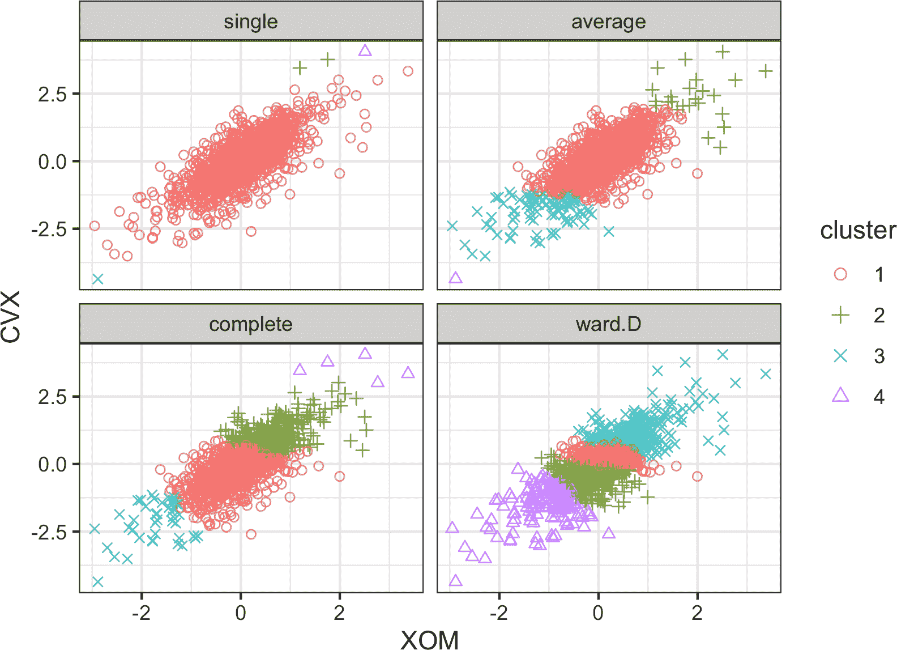

###### 图 7-9。应用于股票数据的差异度量的比较

结果大不相同：单链接度量将几乎所有点分配到一个单一群集中。除了最小方差方法（*R*：`Ward.D`；*Python*：`ward`）之外，所有度量方法最终都至少有一个包含少数异常点的群集。最小方差方法与*K*-均值群集最为相似；与图 7-5 比较。

# Model-Based Clustering

层次聚类和*K*-means 等聚类方法是基于启发式方法的，主要依赖于找到彼此接近的簇，直接使用数据进行测量（不涉及概率模型）。在过去的 20 年里，人们已经投入了大量精力来开发基于模型的聚类方法。华盛顿大学的 Adrian Raftery 和其他研究人员在模型化聚类方面做出了重要贡献，包括理论和软件两方面。这些技术基于统计理论，并提供了更严谨的方法来确定簇的性质和数量。例如，在可能存在一组记录彼此相似但不一定彼此接近的情况下（例如，具有高收益方差的科技股），以及另一组记录既相似又接近的情况下（例如，波动性低的公用事业股），这些技术可以被使用。

## 多元正态分布

最广泛使用的基于模型的聚类方法基于*多元正态*分布。多元正态分布是正态分布对一组*p*个变量<math alttext="upper X 1 comma upper X 2 comma ellipsis comma upper X Subscript p Baseline"><mrow><msub><mi>X</mi> <mn>1</mn></msub> <mo>,</mo> <msub><mi>X</mi> <mn>2</mn></msub> <mo>,</mo> <mo>...</mo> <mo>,</mo> <msub><mi>X</mi> <mi>p</mi></msub></mrow></math>的泛化。该分布由一组均值<math alttext="mu bold equals mu bold 1 bold comma mu bold 2 bold comma ellipsis bold comma mu Subscript bold p Baseline"><mrow><mi>μ</mi> <mo>=</mo> <msub><mi>μ</mi> <mn mathvariant="bold">1</mn></msub> <mo>,</mo> <msub><mi>μ</mi> <mn mathvariant="bold">2</mn></msub> <mo>,</mo> <mo>...</mo> <mo>,</mo> <msub><mi>μ</mi> <mi>𝐩</mi></msub></mrow></math>和一个协方差矩阵<math alttext="normal upper Sigma"><mi>Σ</mi></math>定义。协方差矩阵是变量之间相关程度的度量（有关协方差的详细信息，请参阅“协方差矩阵”）。协方差矩阵<math alttext="normal upper Sigma"><mi>Σ</mi></math>由*p*个方差<math alttext="sigma 1 squared comma sigma 2 squared comma ellipsis comma sigma Subscript p Superscript 2"><mrow><msubsup><mi>σ</mi> <mn>1</mn> <mn>2</mn></msubsup> <mo>,</mo> <msubsup><mi>σ</mi> <mn>2</mn> <mn>2</mn></msubsup> <mo>,</mo> <mo>...</mo> <mo>,</mo> <msubsup><mi>σ</mi> <mi>p</mi> <mn>2</mn></msubsup></mrow></math>和所有变量对<math alttext="sigma Subscript i comma j"><msub><mi>σ</mi> <mrow><mi>i</mi><mo>,</mo><mi>j</mi></mrow></msub></math>的协方差组成。将变量放在行上并复制到列上，矩阵看起来像这样：

<math display="block"><mrow><mi>Σ</mi> <mo>=</mo> <mfenced open="[" close="]"><mtable><mtr><mtd><msubsup><mi>σ</mi> <mn>1</mn> <mn>2</mn></msubsup></mtd> <mtd><msub><mi>σ</mi> <mrow><mn>1</mn><mo>,</mo><mn>2</mn></mrow></msub></mtd> <mtd><mo>⋯</mo></mtd> <mtd><msub><mi>σ</mi> <mrow><mn>1</mn><mo>,</mo><mi>p</mi></mrow></msub></mtd></mtr> <mtr><mtd><msub><mi>σ</mi> <mrow><mn>2</mn><mo>,</mo><mn>1</mn></mrow></msub></mtd> <mtd><msubsup><mi>σ</mi> <mrow><mn>2</mn></mrow> <mn>2</mn></msubsup></mtd> <mtd><mo>⋯</mo></mtd> <mtd><msub><mi>σ</mi> <mrow><mn>2</mn><mo>,</mo><mi>p</mi></mrow></msub></mtd></mtr> <mtr><mtd><mo>⋮</mo></mtd> <mtd><mo>⋮</mo></mtd> <mtd><mo>⋱</mo></mtd> <mtd><mo>⋮</mo></mtd></mtr> <mtr><mtd><msub><mi>σ</mi> <mrow><mi>p</mi><mo>,</mo><mn>1</mn></mrow></msub></mtd> <mtd><msubsup><mi>σ</mi> <mrow><mi>p</mi><mo>,</mo><mn>2</mn></mrow> <mn>2</mn></msubsup></mtd> <mtd><mo>⋯</mo></mtd> <mtd><msubsup><mi>σ</mi> <mrow><mi>p</mi></mrow> <mn>2</mn></msubsup></mtd></mtr></mtable></mfenced></mrow></math>

注意协方差矩阵在从左上到右下的对角线周围是对称的。由于 <math alttext="sigma Subscript i comma j Baseline equals sigma Subscript j comma i"><mrow><msub><mi>σ</mi> <mrow><mi>i</mi><mo>,</mo><mi>j</mi></mrow></msub> <mo>=</mo> <msub><mi>σ</mi> <mrow><mi>j</mi><mo>,</mo><mi>i</mi></mrow></msub></mrow></math> ，只有 <math alttext="left-parenthesis p times left-parenthesis p minus 1 right-parenthesis right-parenthesis slash 2"><mrow><mo>(</mo> <mi>p</mi> <mo>×</mo> <mo>(</mo> <mi>p</mi> <mo>-</mo> <mn>1</mn> <mo>)</mo> <mo>)</mo> <mo>/</mo> <mn>2</mn></mrow></math> 个协方差项。总之，协方差矩阵有 <math alttext="left-parenthesis p times left-parenthesis p minus 1 right-parenthesis right-parenthesis slash 2 plus p"><mrow><mo>(</mo> <mi>p</mi> <mo>×</mo> <mo>(</mo> <mi>p</mi> <mo>-</mo> <mn>1</mn> <mo>)</mo> <mo>)</mo> <mo>/</mo> <mn>2</mn> <mo>+</mo> <mi>p</mi></mrow></math> 个参数。分布表示为：

<math display="block"><mrow><mrow><mo>(</mo> <msub><mi>X</mi> <mn>1</mn></msub> <mo>,</mo> <msub><mi>X</mi> <mn>2</mn></msub> <mo>,</mo> <mo>...</mo> <mo>,</mo> <msub><mi>X</mi> <mi>p</mi></msub> <mo>)</mo></mrow> <mo>∼</mo> <msub><mi>N</mi> <mi>p</mi></msub> <mrow><mo>(</mo> <mi>μ</mi> <mo>,</mo> <mi>Σ</mi> <mo>)</mo></mrow></mrow></math>

这是一种符号化的表达方式，表明所有变量都服从正态分布，整体分布由变量均值向量和协方差矩阵完全描述。

图 7-10 显示了两个变量 *X* 和 *Y* 的多变量正态分布的概率轮廓（例如，0.5 概率轮廓包含分布的 50%）。

均值分别为 <math><mrow><msub><mi>μ</mi> <mi>x</mi></msub> <mo>=</mo> <mn>0</mn> <mo>.</mo> <mn>5</mn></mrow></math> 和 <math><mrow><msub><mi>μ</mi> <mi>y</mi></msub> <mo>=</mo> <mo>-</mo> <mn>0</mn> <mo>.</mo> <mn>5</mn></mrow></math> ，协方差矩阵为：

<math display="block"><mrow><mi>Σ</mi> <mo>=</mo> <mfenced separators="" open="[" close="]"><mtable><mtr><mtd><mn>1</mn></mtd> <mtd><mn>1</mn></mtd></mtr> <mtr><mtd><mn>1</mn></mtd> <mtd><mn>2</mn></mtd></mtr></mtable></mfenced></mrow></math>

因为协方差 <math alttext="sigma Subscript x y"><msub><mi>σ</mi> <mrow><mi>x</mi><mi>y</mi></mrow></msub></math> 是正的，*X* 和 *Y* 是正相关的。

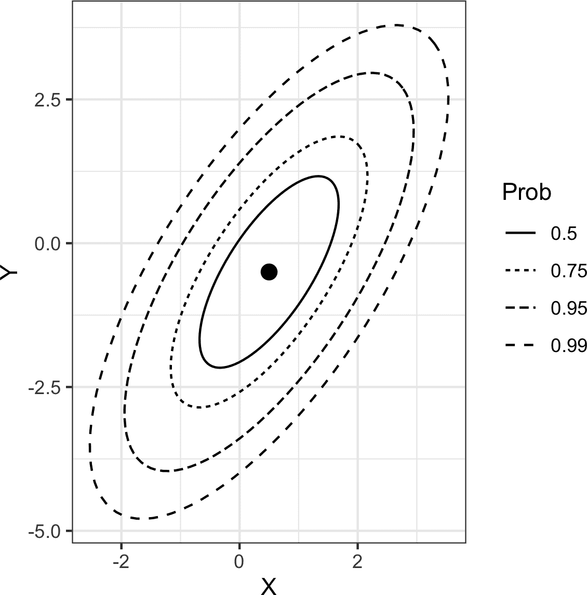

###### 图 7-10\. 两维正态分布的概率轮廓

## 混合正态分布

基于模型的聚类背后的关键思想是，假设每个记录都分布在*K*个多元正态分布之一中，其中*K*是聚类的数量。每个分布都有不同的均值<math alttext="mu"><mi>μ</mi></math>和协方差矩阵<math alttext="normal upper Sigma"><mi>Σ</mi></math>。例如，如果您有两个变量*X*和*Y*，那么每一行<math alttext="left-parenthesis upper X Subscript i Baseline comma upper Y Subscript i Baseline right-parenthesis"><mrow><mo>(</mo> <msub><mi>X</mi> <mi>i</mi></msub> <mo>,</mo> <msub><mi>Y</mi> <mi>i</mi></msub> <mo>)</mo></mrow></math>被建模为从*K*个多元正态分布<math alttext="upper N left-parenthesis mu 1 comma normal upper Sigma 1 right-parenthesis comma upper N left-parenthesis mu 2 comma normal upper Sigma 2 right-parenthesis comma ellipsis comma upper N left-parenthesis mu Subscript upper K Baseline comma normal upper Sigma Subscript upper K Baseline right-parenthesis"><mrow><mi>N</mi> <mrow><mo>(</mo> <msub><mi>μ</mi> <mn>1</mn></msub> <mo>,</mo> <msub><mi>Σ</mi> <mn>1</mn></msub> <mo>)</mo></mrow> <mo>,</mo> <mi>N</mi> <mrow><mo>(</mo> <msub><mi>μ</mi> <mn>2</mn></msub> <mo>,</mo> <msub><mi>Σ</mi> <mn>2</mn></msub> <mo>)</mo></mrow> <mo>,</mo> <mo>...</mo> <mo>,</mo> <mi>N</mi> <mrow><mo>(</mo> <msub><mi>μ</mi> <mi>K</mi></msub> <mo>,</mo> <msub><mi>Σ</mi> <mi>K</mi></msub> <mo>)</mo></mrow></mrow></math>中的一个中抽样。

*R*有一个非常丰富的基于模型的聚类包`mclust`，最初由 Chris Fraley 和 Adrian Raftery 开发。使用这个包，我们可以将模型-based 聚类应用到之前使用*K*-means 和层次聚类分析过的股票收益数据中：

```py
> library(mclust)
> df <- sp500_px[row.names(sp500_px) >= '2011-01-01', c('XOM', 'CVX')]
> mcl <- Mclust(df)
> summary(mcl)
Mclust VEE (ellipsoidal, equal shape and orientation) model with 2 components:

 log.likelihood    n df       BIC       ICL
      -2255.134 1131  9 -4573.546 -5076.856

Clustering table:
  1   2
963 168
```

`scikit-learn`有`sklearn.mixture.GaussianMixture`类来进行基于模型的聚类：

```py
df = sp500_px.loc[sp500_px.index >= '2011-01-01', ['XOM', 'CVX']]
mclust = GaussianMixture(n_components=2).fit(df)
mclust.bic(df)
```

如果您执行此代码，您会注意到计算时间明显长于其他程序。使用`predict`函数提取集群分配，我们可以可视化这些聚类：

```py
cluster <- factor(predict(mcl)$classification)
ggplot(data=df, aes(x=XOM, y=CVX, color=cluster, shape=cluster)) +
  geom_point(alpha=.8)
```

这是创建类似图形的*Python*代码：

```py
fig, ax = plt.subplots(figsize=(4, 4))
colors = [f'C{c}' for c in mclust.predict(df)]
df.plot.scatter(x='XOM', y='CVX', c=colors, alpha=0.5, ax=ax)
ax.set_xlim(-3, 3)
ax.set_ylim(-3, 3)
```

结果图显示在图 7-11 中。有两个聚类：一个在数据中间，另一个在数据外围。这与使用*K*-means（图 7-5）和层次聚类（图 7-9）获得的紧凑聚类非常不同。

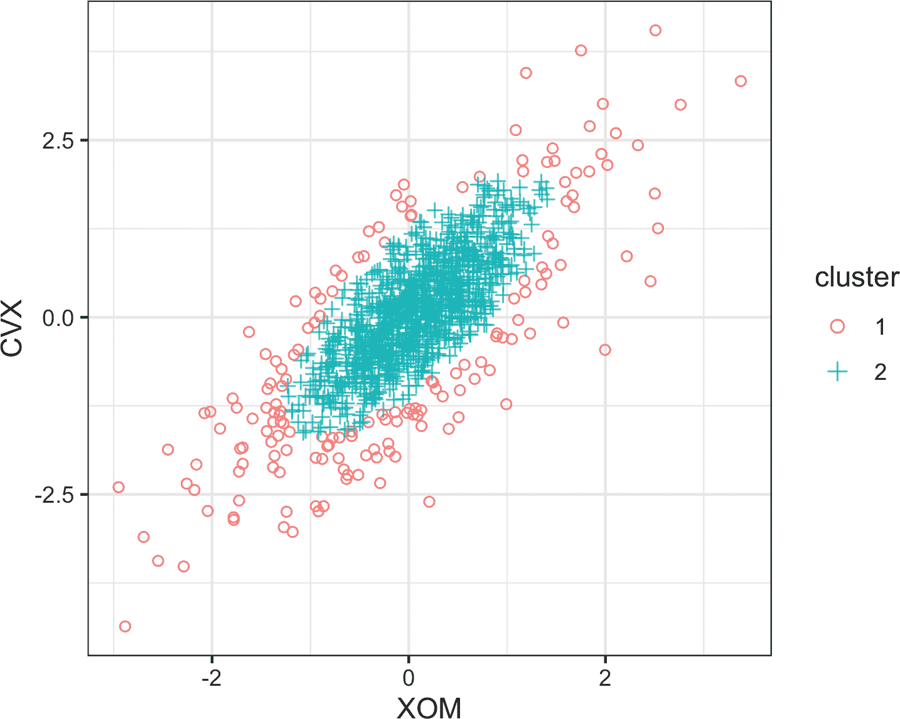

###### 图 7-11\. 使用`mclust`获得股票收益数据的两个聚类

您可以使用`summary`函数提取正态分布的参数：

```py
> summary(mcl, parameters=TRUE)$mean
          [,1]        [,2]
XOM 0.05783847 -0.04374944
CVX 0.07363239 -0.21175715
> summary(mcl, parameters=TRUE)$variance
, , 1
          XOM       CVX
XOM 0.3002049 0.3060989
CVX 0.3060989 0.5496727
, , 2

         XOM      CVX
XOM 1.046318 1.066860
CVX 1.066860 1.915799
```

在*Python*中，您可以从结果的`means_`和`covariances_`属性中获取此信息：

```py
print('Mean')
print(mclust.means_)
print('Covariances')
print(mclust.covariances_)
```

这些分布具有类似的均值和相关性，但第二个分布具有更大的方差和协方差。由于算法的随机性，结果在不同运行之间可能略有不同。

使用`mclust`生成的聚类可能看起来令人惊讶，但实际上，它展示了该方法的统计特性。基于模型的聚类的目标是找到最佳的多元正态分布集合。股票数据看起来具有正态分布的形状：请参见图 7-10 的轮廓。然而，事实上，股票回报比正态分布具有更长的尾部分布。为了处理这一点，`mclust`对大部分数据拟合一个分布，然后再拟合一个方差较大的第二个分布。

## 选择聚类数

与*K*-means 和层次聚类不同，`mclust`在*R*中（本例中为两个）自动选择聚类数。它通过选择 BIC 值最大的聚类数来完成此操作（BIC 类似于 AIC；请参见“模型选择和逐步回归”）。BIC 通过选择最适合的模型来平衡模型中参数数量的惩罚。在基于模型的聚类中，增加更多的聚类始终会改善拟合，但会引入更多的模型参数。

###### 警告

请注意，在大多数情况下，BIC 通常被最小化。`mclust`包的作者决定将 BIC 定义为相反的符号，以便更容易地解释图表。

`mclust`拟合了 14 种不同的模型，并随着成分数量的增加自动选择了一个最优模型。您可以使用`mclust`中的一个函数绘制这些模型的 BIC 值：

```py
plot(mcl, what='BIC', ask=FALSE)
```

聚类数或不同多元正态模型（成分）的数量显示在 x 轴上（请参见图 7-12）。

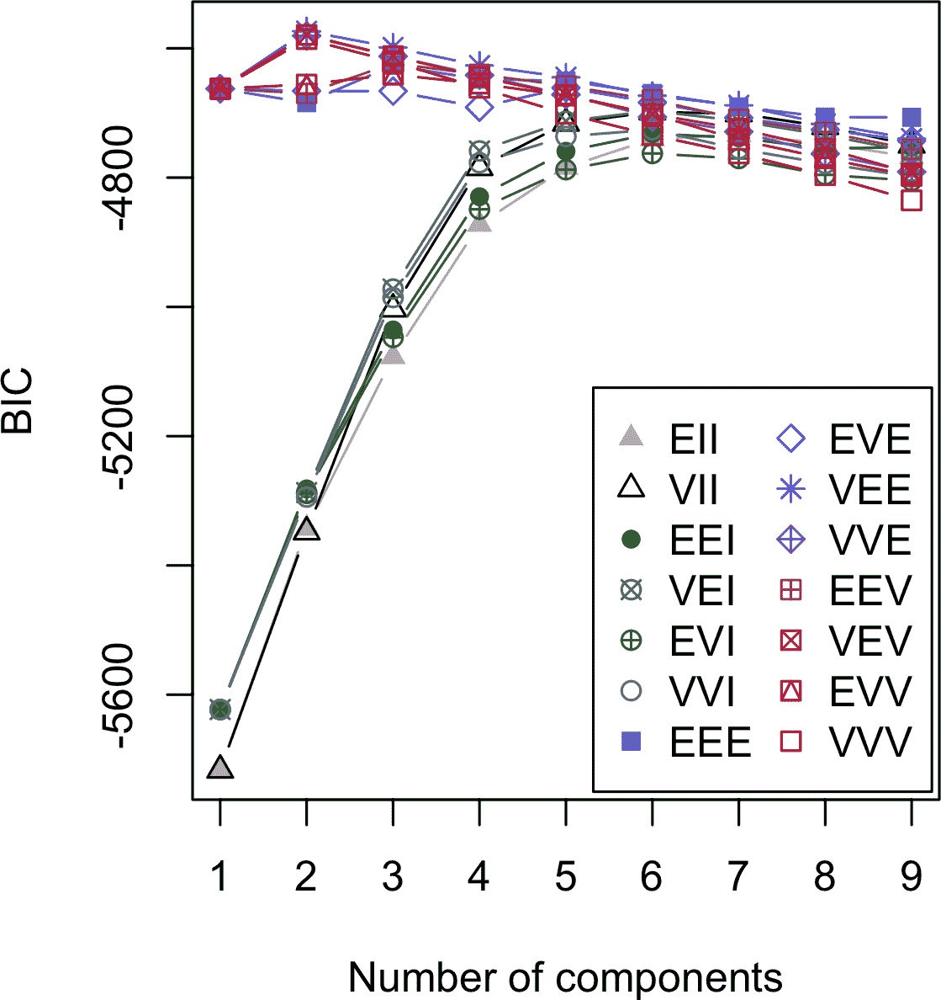

###### 图 7-12. 股票回报数据的 14 种模型的 BIC 值随成分数量增加而变化

另一方面，`GaussianMixture`的实现不会尝试各种组合。如所示，使用*Python*可以轻松运行多种组合。该实现按照通常的方式定义 BIC。因此，计算出的 BIC 值将为正数，我们需要将其最小化。

```py
results = []
covariance_types = ['full', 'tied', 'diag', 'spherical']
for n_components in range(1, 9):
    for covariance_type in covariance_types:
        mclust = GaussianMixture(n_components=n_components, warm_start=True,
                                 covariance_type=covariance_type) 
        mclust.fit(df)
        results.append({
            'bic': mclust.bic(df),
            'n_components': n_components,
            'covariance_type': covariance_type,
        })

results = pd.DataFrame(results)

colors = ['C0', 'C1', 'C2', 'C3']
styles = ['C0-','C1:','C0-.', 'C1--']

fig, ax = plt.subplots(figsize=(4, 4))
for i, covariance_type in enumerate(covariance_types):
    subset = results.loc[results.covariance_type == covariance_type, :]
    subset.plot(x='n_components', y='bic', ax=ax, label=covariance_type,
                kind='line', style=styles[i])
```


使用`warm_start`参数，计算将重用上一次拟合的信息。这将加快后续计算的收敛速度。

该图类似于用于确定选择*K*-means 中的聚类数的弯曲图，但所绘制的值是 BIC 而不是解释方差的百分比（参见图 7-7）。一个显著的差异是，`mclust` 显示了 14 条不同的线！这是因为 `mclust` 实际上为每个聚类大小拟合了 14 种不同的模型，并最终选择最适合的模型。`GaussianMixture` 实现的方法较少，因此线的数量只有四条。

`mclust` 为什么要适配这么多模型来确定最佳的多变量正态分布集？这是因为有多种方法来为拟合模型参数化协方差矩阵 <math alttext="normal upper Sigma"><mi>Σ</mi></math>。在大多数情况下，您无需担心模型的细节，可以简单地使用`mclust`选择的模型。在本例中，根据 BIC，三种不同的模型（称为 VEE、VEV 和 VVE）使用两个分量给出最佳拟合。

###### 注意

基于模型的聚类是一个丰富且快速发展的研究领域，而本文中的覆盖范围仅涉及该领域的一小部分。事实上，`mclust` 的帮助文件目前长达 154 页。理解模型基础聚类的微妙之处可能比大多数数据科学家遇到的问题所需的工作还要多。

基于模型的聚类技术确实具有一些局限性。这些方法需要对数据的模型假设，而聚类结果非常依赖于该假设。计算要求甚至比层次聚类还要高，使其难以扩展到大数据。最后，该算法比其他方法更复杂，不易访问。

## 进一步阅读

欲了解更多关于基于模型聚类的详情，请参阅[`mclust`](https://oreil.ly/bHDvR) 和 [`GaussianMixture`](https://oreil.ly/GaVVv) 文档。

# 缩放和分类变量

无监督学习技术通常要求数据适当缩放。这与许多回归和分类技术不同，这些技术中缩放并不重要（一个例外是*K*-最近邻算法；参见“K-最近邻”）。

例如，对于个人贷款数据，变量具有非常不同的单位和数量级。一些变量具有相对较小的值（例如，就业年限），而其他变量具有非常大的值（例如，以美元计的贷款金额）。如果数据未经缩放，则 PCA、*K*-means 和其他聚类方法将由具有大值的变量主导，并忽略具有小值的变量。

对于某些聚类过程，分类数据可能会带来特殊问题。与*K*最近邻算法一样，无序因子变量通常会使用独热编码转换为一组二进制（0/1）变量（有关“一热编码器”的更多信息，请参见“一热编码器”）。不仅二进制变量可能与其他数据不同尺度，而且二进制变量仅有两个值的事实可能会在 PCA 和*K*-means 等技术中带来问题。

## 缩放变量

变量的尺度和单位差异很大，在应用聚类过程之前需要适当进行标准化。例如，我们来看一下没有进行标准化的贷款违约数据的`kmeans`应用情况：

```py
defaults <- loan_data[loan_data$outcome=='default',]
df <- defaults[, c('loan_amnt', 'annual_inc', 'revol_bal', 'open_acc',
                   'dti', 'revol_util')]
km <- kmeans(df, centers=4, nstart=10)
centers <- data.frame(size=km$size, km$centers)
round(centers, digits=2)

   size loan_amnt annual_inc revol_bal open_acc   dti revol_util
1    52  22570.19  489783.40  85161.35    13.33  6.91      59.65
2  1192  21856.38  165473.54  38935.88    12.61 13.48      63.67
3 13902  10606.48   42500.30  10280.52     9.59 17.71      58.11
4  7525  18282.25   83458.11  19653.82    11.66 16.77      62.27
```

下面是相应的*Python*代码：

```py
defaults = loan_data.loc[loan_data['outcome'] == 'default',]
columns = ['loan_amnt', 'annual_inc', 'revol_bal', 'open_acc',
           'dti', 'revol_util']

df = defaults[columns]
kmeans = KMeans(n_clusters=4, random_state=1).fit(df)
counts = Counter(kmeans.labels_)

centers = pd.DataFrame(kmeans.cluster_centers_, columns=columns)
centers['size'] = [counts[i] for i in range(4)]
centers
```

变量`annual_inc`和`revol_bal`主导了聚类，而且聚类大小差异很大。聚类 1 只有 52 名成员，收入相对较高且循环信贷余额也较高。

缩放变量的常见方法是通过减去均值并除以标准差来转换它们为*z*-分数。这称为*标准化*或*归一化*（有关使用*z*-分数的更多讨论，请参见“标准化（归一化，z-分数）”）：

<math display="block"><mrow><mi>z</mi> <mo>=</mo> <mfrac><mrow><mi>x</mi><mo>-</mo><mover accent="true"><mi>x</mi> <mo>¯</mo></mover></mrow> <mi>s</mi></mfrac></mrow></math>

查看当`kmeans`应用于标准化数据时，聚类发生了什么变化：

```py
df0 <- scale(df)
km0 <- kmeans(df0, centers=4, nstart=10)
centers0 <- scale(km0$centers, center=FALSE,
                 scale=1 / attr(df0, 'scaled:scale'))
centers0 <- scale(centers0, center=-attr(df0, 'scaled:center'), scale=FALSE)
centers0 <- data.frame(size=km0$size, centers0)
round(centers0, digits=2)

  size loan_amnt annual_inc revol_bal open_acc   dti revol_util
1 7355  10467.65   51134.87  11523.31     7.48 15.78      77.73
2 5309  10363.43   53523.09   6038.26     8.68 11.32      30.70
3 3713  25894.07  116185.91  32797.67    12.41 16.22      66.14
4 6294  13361.61   55596.65  16375.27    14.25 24.23      59.61
```

在*Python*中，我们可以使用`scikit-learn`的`StandardScaler`。`inverse_transform`方法允许将聚类中心转换回原始尺度：

```py
scaler = preprocessing.StandardScaler()
df0 = scaler.fit_transform(df * 1.0)

kmeans = KMeans(n_clusters=4, random_state=1).fit(df0)
counts = Counter(kmeans.labels_)

centers = pd.DataFrame(scaler.inverse_transform(kmeans.cluster_centers_),
                       columns=columns)
centers['size'] = [counts[i] for i in range(4)]
centers
```

聚类大小更加平衡，聚类不再由`annual_inc`和`revol_bal`主导，数据中显示出更多有趣的结构。请注意，在前面的代码中，中心被重新缩放到原始单位。如果我们没有进行缩放，结果值将以*z*-分数的形式呈现，因此解释性会降低。

###### 注意

PCA 也需要缩放。使用*z*-分数相当于在计算主成分时使用相关矩阵（有关“相关性”请参见“相关性”），而不是协方差矩阵。通常，用于计算 PCA 的软件通常有使用相关矩阵的选项（在*R*中，`princomp`函数具有`cor`参数）。

## 主导变量

即使变量在同一尺度上测量并准确反映了相对重要性（例如股票价格的变动），有时重新缩放变量也可能很有用。

假设我们在“解释主成分”中增加了 Google（GOOGL）和 Amazon（AMZN）的分析。我们来看一下下面*R*中是如何实现的：

```py
syms <- c('GOOGL', 'AMZN', 'AAPL', 'MSFT', 'CSCO', 'INTC', 'CVX', 'XOM',
          'SLB', 'COP', 'JPM', 'WFC', 'USB', 'AXP', 'WMT', 'TGT', 'HD', 'COST')
top_sp1 <- sp500_px[row.names(sp500_px) >= '2005-01-01', syms]
sp_pca1 <- princomp(top_sp1)
screeplot(sp_pca1)
```

在*Python*中，我们得到的 screeplot 如下：

```py
syms = ['GOOGL', 'AMZN', 'AAPL', 'MSFT', 'CSCO', 'INTC', 'CVX', 'XOM',
        'SLB', 'COP', 'JPM', 'WFC', 'USB', 'AXP', 'WMT', 'TGT', 'HD', 'COST']
top_sp1 = sp500_px.loc[sp500_px.index >= '2005-01-01', syms]

sp_pca1 = PCA()
sp_pca1.fit(top_sp1)

explained_variance = pd.DataFrame(sp_pca1.explained_variance_)
ax = explained_variance.head(10).plot.bar(legend=False, figsize=(4, 4))
ax.set_xlabel('Component')
```

screeplot 显示了顶级主成分的方差。在这种情况下，图 7-13 中的 screeplot 显示，第一和第二主成分的方差远大于其他成分。这通常表明一个或两个变量主导了载荷。这确实是这个例子的情况：

```py
round(sp_pca1$loadings[,1:2], 3)
      Comp.1 Comp.2
GOOGL  0.781  0.609
AMZN   0.593 -0.792
AAPL   0.078  0.004
MSFT   0.029  0.002
CSCO   0.017 -0.001
INTC   0.020 -0.001
CVX    0.068 -0.021
XOM    0.053 -0.005
...
```

在 *Python* 中，我们使用以下方法：

```py
loadings = pd.DataFrame(sp_pca1.components_[0:2, :], columns=top_sp1.columns)
loadings.transpose()
```

前两个主成分几乎完全由 GOOGL 和 AMZN 主导。这是因为 GOOGL 和 AMZN 的股价波动主导了变异性。

处理这种情况时，可以选择将它们保留原样，重新缩放变量（参见“缩放变量”），或者将主导变量从分析中排除并单独处理。没有“正确”的方法，处理方法取决于具体应用。

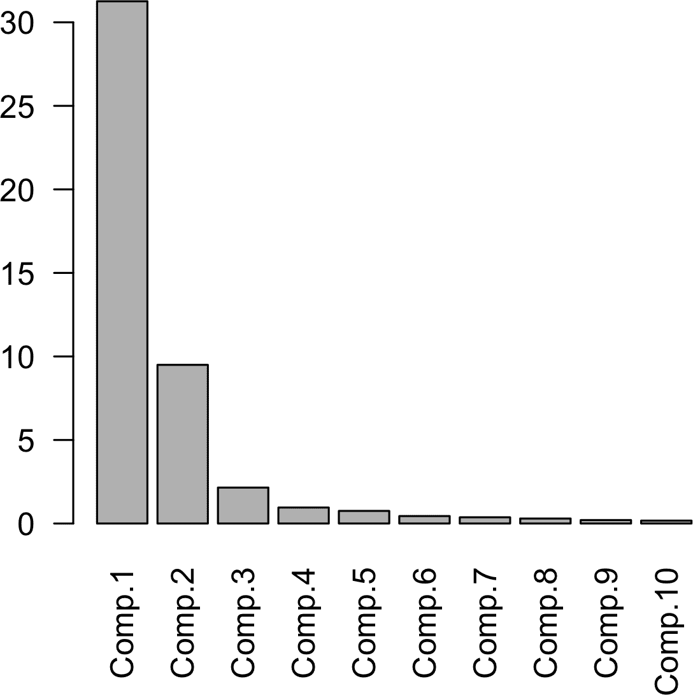

###### 图 7-13\. 来自标准普尔 500 指数中排名前列股票 PCA 的 screeplot，包括 GOOGL 和 AMZN

## 分类数据和 Gower 距离

对于分类数据，必须将其转换为数值数据，可以通过排名（有序因子）或编码为一组二进制（虚拟）变量来实现。如果数据包含混合连续和二进制变量，通常需要对变量进行缩放，以使范围相似；参见“缩放变量”。一种流行的方法是使用*Gower 距离*。

Gower 距离背后的基本思想是根据数据类型对每个变量应用不同的距离度量：

+   对于数值变量和有序因子，距离计算为两个记录之间差值的绝对值（*曼哈顿距离*）。

+   对于分类变量，如果两个记录之间的类别不同，则距离为 1；如果类别相同，则距离为 0。

Gower 距离的计算方法如下：

1.  计算每个记录的所有变量对 *i* 和 *j* 的距离 <math alttext="d Subscript i comma j"><msub><mi>d</mi> <mrow><mi>i</mi><mo>,</mo><mi>j</mi></mrow></msub></math>。

1.  缩放每对 <math alttext="d Subscript i comma j"><msub><mi>d</mi> <mrow><mi>i</mi><mo>,</mo><mi>j</mi></mrow></msub></math>，使最小值为 0，最大值为 1。

1.  将变量之间的成对缩放距离相加，使用简单或加权平均，创建距离矩阵。

为了说明 Gower 距离，从 *R* 中的贷款数据中取几行：

```py
> x <- loan_data[1:5, c('dti', 'payment_inc_ratio', 'home_', 'purpose_')]
> x
# A tibble: 5 × 4
    dti payment_inc_ratio   home            purpose
  <dbl>             <dbl> <fctr>             <fctr>
1  1.00           2.39320   RENT                car
2  5.55           4.57170    OWN     small_business
3 18.08           9.71600   RENT              other
4 10.08          12.21520   RENT debt_consolidation
5  7.06           3.90888   RENT              other
```

在 *R* 中的 `cluster` 包中的函数 `daisy` 可用于计算 Gower 距离：

```py
library(cluster)
daisy(x, metric='gower')
Dissimilarities :
          1         2         3         4
2 0.6220479
3 0.6863877 0.8143398
4 0.6329040 0.7608561 0.4307083
5 0.3772789 0.5389727 0.3091088 0.5056250

Metric :  mixed ;  Types = I, I, N, N
Number of objects : 5
```

在撰写本文时，Gower 距离尚未包含在任何流行的 Python 包中。然而，正在进行的工作包括将其包含在 `scikit-learn` 中。一旦实施完成，我们将更新相应的源代码。

所有距离介于 0 和 1 之间。距离最大的记录对是 2 和 3：它们的`home`和`purpose`值不同，并且它们的`dti`（负债收入比）和`payment_inc_ratio`（支付收入比）水平非常不同。记录 3 和 5 的距离最小，因为它们的`home`和`purpose`值相同。

可以将从 `daisy` 计算出的 Gower 距离矩阵传递给 `hclust` 进行层次聚类（参见 “Hierarchical Clustering”）：

```py
df <- defaults[sample(nrow(defaults), 250),
               c('dti', 'payment_inc_ratio', 'home', 'purpose')]
d = daisy(df, metric='gower')
hcl <- hclust(d)
dnd <- as.dendrogram(hcl)
plot(dnd, leaflab='none')
```

结果显示的树状图如 图 7-14 所示。个体记录在 x 轴上无法区分，但我们可以在 0.5 处水平切割树状图，并使用以下代码检查某个子树中的记录：

```py
dnd_cut <- cut(dnd, h=0.5)
df[labels(dnd_cut$lower[[1]]),]
        dti payment_inc_ratio home_           purpose_
44532 21.22           8.37694   OWN debt_consolidation
39826 22.59           6.22827   OWN debt_consolidation
13282 31.00           9.64200   OWN debt_consolidation
31510 26.21          11.94380   OWN debt_consolidation
6693  26.96           9.45600   OWN debt_consolidation
7356  25.81           9.39257   OWN debt_consolidation
9278  21.00          14.71850   OWN debt_consolidation
13520 29.00          18.86670   OWN debt_consolidation
14668 25.75          17.53440   OWN debt_consolidation
19975 22.70          17.12170   OWN debt_consolidation
23492 22.68          18.50250   OWN debt_consolidation
```

此子树完全由贷款目的标记为“债务合并”的所有者组成。尽管严格分离并非所有子树的特点，但这说明了分类变量倾向于在聚类中被组合在一起。


###### 图 7-14\. 应用于混合变量类型贷款违约数据样本的 `hclust` 的树状图

## 混合数据的聚类问题

*K*-means 和 PCA 最适合连续变量。对于较小的数据集，最好使用带有 Gower 距离的层次聚类。原则上，*K*-means 也可以应用于二进制或分类数据。通常会使用“独热编码器”表示法（参见 “One Hot Encoder”）将分类数据转换为数值。然而，在实践中，使用 *K*-means 和 PCA 处理二进制数据可能会比较困难。

如果使用标准的 *z*-分数，二进制变量将主导聚类的定义。这是因为 0/1 变量仅取两个值，*K*-means 可以通过将所有取值为 0 或 1 的记录分配到单个聚类中获得较小的簇内平方和。例如，在包括因子变量 `home` 和 `pub_rec_zero` 的贷款违约数据中应用 `kmeans`，如下所示的 *R* 代码：

```py
df <- model.matrix(~ -1 + dti + payment_inc_ratio + home_ + pub_rec_zero,
                   data=defaults)
df0 <- scale(df)
km0 <- kmeans(df0, centers=4, nstart=10)
centers0 <- scale(km0$centers, center=FALSE,
                 scale=1/attr(df0, 'scaled:scale'))
round(scale(centers0, center=-attr(df0, 'scaled:center'), scale=FALSE), 2)

    dti payment_inc_ratio home_MORTGAGE home_OWN home_RENT pub_rec_zero
1 17.20              9.27          0.00        1      0.00         0.92
2 16.99              9.11          0.00        0      1.00         1.00
3 16.50              8.06          0.52        0      0.48         0.00
4 17.46              8.42          1.00        0      0.00         1.00
```

在 *Python* 中：

```py
columns = ['dti', 'payment_inc_ratio', 'home_', 'pub_rec_zero']
df = pd.get_dummies(defaults[columns])

scaler = preprocessing.StandardScaler()
df0 = scaler.fit_transform(df * 1.0)
kmeans = KMeans(n_clusters=4, random_state=1).fit(df0)
centers = pd.DataFrame(scaler.inverse_transform(kmeans.cluster_centers_),
                       columns=df.columns)
centers
```

前四个聚类实质上是因子变量不同水平的代理。为了避免这种行为，可以将二进制变量缩放到比其他变量具有更小的方差。或者，对于非常大的数据集，可以将聚类应用于具有特定分类值的数据子集。例如，可以单独将放贷给有抵押贷款、全额拥有房屋或租房的人士的贷款进行聚类。

# 总结

对于数值数据的降维，主要工具是主成分分析或 *K*-means 聚类。两者都需要注意数据的适当缩放，以确保有意义的数据降维。

对于具有高度结构化数据且簇之间分离良好的聚类，所有方法可能会产生类似的结果。每种方法都有其优势。*K*-means 可扩展到非常大的数据并且易于理解。层次聚类可以应用于混合数据类型——数值和分类数据，并且适合直观显示（树状图）。基于模型的聚类建立在统计理论之上，提供了更严格的方法，与启发式方法相对。然而，对于非常大的数据集，*K*-means 是主要的方法。

在存在噪声数据的情况下，如贷款和股票数据（以及数据科学家将面对的大部分数据），选择更加明显。*K*-means、层次聚类，特别是基于模型的聚类都会产生非常不同的解决方案。数据科学家该如何操作？不幸的是，没有简单的经验法则可以指导选择。最终使用的方法将取决于数据规模和应用的目标。

^(1) 本章及后续章节内容 © 2020 Datastats, LLC, Peter Bruce, Andrew Bruce, and Peter Gedeck；已获得授权使用。
