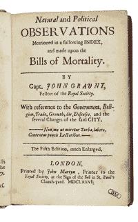
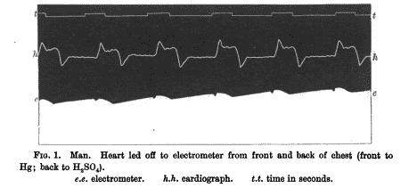
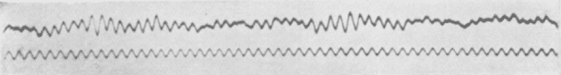
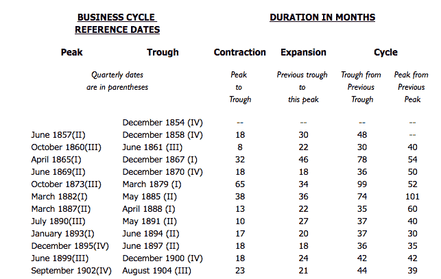

# 第一章：时间序列：概述和简史

由于通过物联网、医疗数字化和智能城市的兴起而大量产生这类数据，时间序列数据及其分析变得越来越重要。在未来几年，我们可以预期时间序列数据的数量、质量和重要性将迅速增长。

随着持续监控和数据收集变得更加普遍，对具有统计和机器学习技术的时间序列分析的需求将增加。事实上，最有前途的新模型结合了这两种方法。因此，我们将详细讨论每一种方法。我们将研究和使用广泛的时间序列技术，这些技术有助于分析和预测人类行为、科学现象和私营部门的数据，因为所有这些领域都提供丰富的时间序列数据。

让我们从一个定义开始。*时间序列分析*是从按时间顺序排列的点中提取有意义的总结和统计信息的努力。这样做是为了诊断过去的行为以及预测未来的行为。在本书中，我们将使用各种方法，从一百年前的统计模型到新开发的神经网络架构。

技术的发展从未在真空中或出于纯理论兴趣而发展。时间序列分析的创新源于新的数据收集、记录和可视化方式。接下来我们简要讨论时间序列分析在各种应用中的出现。

# 多样化应用中的时间序列历史

时间序列分析常常涉及到因果关系的问题：过去是如何影响未来的？有时，这些问题（及其答案）严格地被视为各自学科的一部分，而不是时间序列分析的一般学科的一部分。因此，各种学科为时间序列数据集提供了新的思考方式。

在本节中，我们将调查一些历史上的时间序列数据和分析示例，涉及以下学科：

+   医学

+   天气

+   经济学

+   天文学

正如我们将看到的，这些学科中的发展速度及每个领域中的贡献与当时可用的时间序列数据的性质密切相关。

## 医学作为时间序列问题

医学是一个数据驱动的领域，几个世纪以来为人类知识贡献了有趣的时间序列分析。现在，让我们研究医学中几个时间序列数据源的例子，以及它们如何随着时间的推移而出现。

尽管预后在医学实践中是一个重要部分，但医学在思考未来预测的数学方面起步相对缓慢。这有多种原因。统计学和概率思维是近期的现象，这些学科在医学发展的许多世纪里并不可用。此外，大多数医生在没有便捷的专业交流和病人或人群健康的正式记录基础设施的情况下独立实践。因此，即使早期的医生接受了统计思维的训练，他们也可能没有合理的数据来得出结论。

这并不是要批评早期的医生，而是解释为什么一个早期时间序列创新在人口健康领域来自于一位卖帽子的商人而不是一位医生，这其实是合理的思考：在早期世纪，城市帽子销售商可能比医生更擅长记录和发现趋势。

创新者是约翰·格朗特，他是 17 世纪伦敦的一名帽商。格朗特进行了一项对伦敦教区自 1500 年代初以来保存的死亡记录的研究。在此过程中，他创立了人口统计学学科。1662 年，他出版了*《自然与政治观察……根据死亡账单制作》*（参见图 1-1）。

###### 图 1-1\. 约翰·格朗特的寿命表是将时间序列思维应用于医学问题的最早成果之一。来源：[维基百科](https://perma.cc/2FHJ-67SB)。

在这本书中，格朗特首次提出了*寿命表*，你可能知道它们为*精算表*。这些表格显示了一个特定年龄的人在下一个生日之前死亡的概率。作为第一个已知制定和出版寿命表的人，格朗特也是第一个记录人类健康统计学的人。他的寿命表看起来类似于表 1-1，取自一些莱斯大学统计学[课程笔记](https://perma.cc/HU6A-9W22)。

表 1-1\. 约翰·格朗特寿命表样本

| 年龄 | 该年龄段内死亡比例 | 开始该年龄段时生存比例 |
| --- | --- | --- |
| 0–6 | 0.36 | 1.0 |
| 7–16 | 0.24 | 0.64 |
| 17–26 | 0.15 | 0.40 |
| 27–36 | 0.09 | 0.25 |

不幸的是，格朗特对人类生存进行数学思考的方式并没有被广泛接受。一个更加互联和数据驱动的世界开始形成——包括国家、认证、专业社团、科学期刊，以及更晚的政府强制健康记录——但医学继续关注生理而非统计学。

这有其可以理解的原因。首先，在少数研究对象中研究解剖学和生理学已经几个世纪为医学带来了主要进展，大多数人（甚至科学家）坚持尽可能长时间使用已知的方法。在生理学如此成功的情况下，没有必要进一步探索其他领域。其次，医师没有足够的报告基础设施来归纳和分享信息，使统计方法优于临床观察。

与统计学和数据分析的其他分支相比，时间序列分析进入主流医学的步伐更为缓慢，可能是因为时间序列分析对记录系统的要求更高。记录必须随时间链接在一起，并最好定期收集。因此，作为流行病学实践的时间序列分析直到最近才逐渐出现，一旦政府和科学基础设施足够，可以确保良好且持久的时间记录。

同样地，使用时间序列分析进行个性化医疗仍然是一个年轻而具有挑战性的领域，因为创建一致的数据集可能会非常困难。即使是基于小型案例研究的研究，也很难维持与个体群体的联系和参与，而且非常困难且昂贵。当这些研究进行了长时间后，它们往往会成为其领域的经典作品，尽管在资金和管理方面存在挑战，但其数据能够解决重要问题。¹

### 医疗仪器

对于单个患者的时间序列分析比群体级健康研究有着更早且更成功的历史。时间序列分析进入医学领域始于 1901 年发明的第一台实用心电图仪（ECG），通过记录通过心脏的电信号来诊断心脏疾病（见图 1-2）。另一种时间序列仪器脑电图（EEG），1924 年引入医学，非侵入性地测量大脑的电脉冲，为医务人员在医学诊断中应用时间序列分析创造了更多机会（见图 1-3）。

这两种时间序列仪器都是第二次工业革命中重新利用的思想和技术来增强医学的一部分。

###### 图 1-2\. 来自 Augustus D. Waller, M.D.于 1877 年的原始论文[“A Demonstration on Man of Electromotive Changes Accompanying the Heart’s Beat”](https://perma.cc/ZGB8-3C95)中的早期心电图记录。最早期的心电图仪难以制造和使用，因此在几十年后才成为医师实际工具。

###### 图 1-3\. 1924 年的第一份人类 EEG 记录。来源：[维基百科](https://oreil.ly/P_M4U)。

ECG 和 EEG 时间序列分类工具仍然是非常实用的研究领域，比如估计突发心脏危机或癫痫的风险。这些测量数据是丰富的数据源，但这些数据的一个“问题”是，它通常只适用于特定疾病的患者。这些机器不会生成能更广泛告知人类健康和行为的长期时间序列，因为它们的测量很少在疾病出现之前或在患者身上应用很长时间。

幸运的是，从数据分析的角度来看，我们正在摆脱 ECG 等医疗时间序列数据占主导地位的时代。随着可穿戴传感器和“智能”电子医疗设备的出现，许多健康的人类自动或几乎不需要人工干预地进行常规测量，导致对患病和健康人群的长期数据持续收集。这与上个世纪几乎只在患病人群中进行、访问权限非常有限的医疗时间序列数据形成鲜明对比。

正如最近的新闻报道所显示的，从巨大的社交媒体公司到金融机构再到零售巨头，各种非传统的参与者正在进入医疗领域。他们很可能都计划利用大数据集来简化医疗保健。医疗领域不仅有新的参与者，还有新的技术。个性化的基因驱动医学意味着时间序列数据正在越来越多地被测量和重视。由于不断增长的现代医疗数据集，无论是医疗保健还是时间序列分析都有望在未来几年内发展，特别是在响应医疗部门利润丰厚的数据集方面。希望时间序列能够使每个人受益。

## 天气预测

出于显而易见的原因，天气预测长期以来一直是许多人关注的焦点。古希腊哲学家亚里士多德深入研究了天气，他的著作《气象学》探讨了天气的原因和顺序，这些观点一直占主导地位直到文艺复兴时期。那时，科学家们开始借助新发明的仪器，如晴雨表，收集与天气相关的数据，以测量大气状态。他们使用这些仪器每天甚至每小时记录时间序列。这些记录保存在各种地方，包括私人日记和地方城镇的日志。几个世纪以来，这仍然是西方文明跟踪天气的唯一方式。

在 19 世纪 50 年代，罗伯特·菲茨罗伊被任命为英国新政府部门的负责人，记录和发布针对水手的与天气有关的数据。[³] 菲茨罗伊创造了术语*天气预报*。当时，他因预测质量而受到批评，但现在他被认为在他用来发展这些预报的科学方面领先于他的时代。他建立了在报纸上印刷天气预报的习惯；它们是《伦敦时报》上首次印刷的预报。菲茨罗伊现在被誉为“预报之父”。

在 19 世纪末，即使在许多大气测量技术已经投入使用数百年后，电报也允许从许多不同地点快速编制时间序列中的大气条件。这种实践在 19 世纪 70 年代成为世界许多地区的标准，并导致了基于其他地理位置发生的事情预测本地天气的第一个有意义的数据集的创建。

到了 20 世纪初，通过这些编制的数据集积极追求用计算方法预测天气的想法。早期计算天气的努力需要大量的工作，但效果不佳。虽然物理学家和化学家对相关自然法则有很好的证明，但同时应用所有自然法则的数量太多。由此产生的方程系统如此复杂，以至于第一次有人尝试进行计算时，这是一个显著的科学突破。

几十年的研究随后进行，以简化物理方程的方式增加准确性和计算效率。这些行业内的诀窍甚至传承到当前的天气预测模型中，这些模型运行在已知物理原理和经过验证的启发式方法的混合之上。

如今，许多政府从世界各地数百甚至数千个气象站进行高度精细的气象测量，这些预测建立在具有精确气象站位置和设备信息的数据基础上。这些努力的根源可以追溯到 19 世纪 70 年代的协调数据集，甚至更早的文艺复兴时期的地方天气日记记录实践。

不幸的是，天气预报是越来越多地涉及到时间序列预测领域的科学攻击的一个例子。不仅全球温度的时间序列辩论被政治化，甚至像[预测飓风路径](https://perma.cc/D9GG-FND2)这样的更普通的时间序列预测任务也被如此。

## 预测经济增长

市场中生产和效率的指标长期以来一直提供有趣的时间序列分析数据。最有趣和紧迫的是基于过去预测未来经济状态的问题。这样的预测不仅仅有助于赚钱，还有助于促进繁荣和避免社会灾难。让我们讨论一下经济预测历史上的一些重要发展。

经济预测源于 19 世纪末和 20 世纪初美国和欧洲的周期性银行危机引发的焦虑。那时，企业家和研究人员都从经济可以类比为一个周期性系统的想法中汲取灵感，就像天气被认为会表现出来一样。他们认为，通过正确的测量，可以做出预测并避免崩溃。

早期经济预测的语言甚至反映了天气预报的语言。这种类比并非无意义。在 20 世纪初，经济和天气预测确实相似：两者都相当糟糕。但经济学家的愿景创造了一个至少可以期待进展的环境，因此形成了多种公共和私人机构来跟踪经济数据。早期经济预测努力导致了经济指标的创建以及这些指标的表格化和公开历史记录，这些至今仍在使用。我们甚至会在本书中使用其中一些。

当今，美国和大多数其他国家都有成千上万的政府研究人员和记录员，他们的工作是尽可能准确地记录数据，并使其对公众可用（参见图 1-4）。这一做法被证明对经济增长和避免经济灾难以及痛苦的经济周期有着无价的贡献。此外，企业受益于数据丰富的环境，因为这些公共数据集允许交通运输提供者、制造商、小企业主甚至农民预测未来市场情况。所有这些都源于试图识别被认为是周期性银行失败原因的“商业周期”，这是经济学中时间序列分析的早期形式。

###### 图 1-4\. 美国联邦政府资助许多政府机构和相关非营利组织，记录重要统计数据并制定经济指标。来源：[美国经济研究局](https://www.nber.org/cycles/cyclesmain.html)。

政府收集的许多经济数据，特别是最具新闻价值的数据，往往是人口整体经济福祉的代理。其中一个例子是申请失业救济的人数。例如，政府对国内生产总值的估计以及在特定年份收到的总税收的报告。

由于对经济预测的渴望，政府已经成为数据的典藏家以及税收的征收者。这些数据的收集使得现代经济学、现代金融业以及数据科学普遍蓬勃发展。由于时间序列分析从经济问题中发展而来，我们现在比过去的任何政府都能够更安全地避免许多银行和金融危机。此外，已经有数百本时间序列教科书以经济学教科书的形式写成，专门用于理解这些金融指标的节奏。

### 交易市场

让我们回到历史的一面。随着政府在数据收集方面的成功，私人组织开始效仿政府的记录方式。随着时间的推移，商品和股票交易所变得越来越技术化。金融年鉴也变得流行起来。这种现象既因市场参与者变得更加复杂，也因新兴技术使得更大程度的自动化和对价格的新思考方式成为可能。

所有这些详细的记录使得通过数学而不是直觉从市场赚钱的追求成为可能，这种方式完全由统计数据（以及最近的机器学习）驱动。早期的先驱们手工进行这种数学工作，而当前的“量化交易员”则通过非常复杂和专有的时间序列分析方法来完成。

*机械交易*或通过算法进行时间序列预测的先驱之一是理查德·丹尼斯。丹尼斯是一个自成一家的百万富翁，以教导他们一些关于如何何时交易的选择性规则而闻名，从而将普通人（称为海龟）转变为明星交易员。这些规则是在 20 世纪 70 年代和 80 年代开发的，与 20 世纪 80 年代的“人工智能”思想相呼应，其中启发式规则仍然在如何构建能在现实世界中工作的智能机器的范式中占主导地位。

自那时以来，许多“机械”交易者已经采纳了这些规则，结果在竞争激烈的自动化市场中变得不那么赚钱了。机械交易者的数量和财富继续增长，他们不断寻找下一个最好的东西，因为竞争非常激烈。

## 天文学

天文学在很大程度上依赖于随时间绘制物体、轨迹和测量数据。因此，天文学家是时间序列的大师，既用于校准仪器，也用于研究感兴趣的对象。举个例子，关于时间序列数据的悠久历史，可以考虑到太阳黑子时间序列早在公元前 800 年就已记录在古代中国，使得太阳黑子数据收集成为有史以来记录最完善的自然现象之一。

过去一个世纪最激动人心的一些天文学发现与时间序列分析有关。发现变星（可用于推断星系距离）和观察超新星等瞬变事件（这增强了我们对宇宙如何随时间变化的理解）都是基于光的波长和强度的时间序列数据的实时监测的结果。时间序列对于我们可以了解和测量宇宙的内容产生了根本性影响。

顺便提一下，这种对天文图像的监测甚至让天文学家们能够在事件发生时捕捉到它们（或者说在我们能够观察到它们时，这可能需要数百万年）。([链接](https://perma.cc/2TNK-2TFW))

在过去几十年中，随着形式上带有时间戳的数据的大量涌现，天文学中的时间序列数据获得了爆炸性的增长，各种新型望远镜收集各种天体数据。一些天文学家甚至称之为时间序列的“数据洪流”。

# 时间序列分析腾飞

乔治·博克斯是一位开创性的统计学家，他帮助开发了一种流行的时间序列模型，是一位伟大的实用主义者。他曾经说过，“所有模型都是错误的，但有些是有用的。”

Box 提出了这个观点，以回应一种普遍的态度，即适当的时间序列建模是找到最适合数据的模型的问题。正如他解释的那样，任何模型能够描述真实世界的想法是非常不太可能的。Box 在 1978 年做出了这一声明，这在时间序列分析这样一个重要领域的历史上似乎有些晚，但事实上，这一正式学科非常年轻。

例如，使乔治·博克斯闻名的成就之一，即 Box-Jenkins 方法——被认为是时间序列分析的基本贡献——直到 1970 年才首次出现。⁴ 有趣的是，这种方法最初并非出现在学术期刊上，而是在统计学教科书《时间序列分析：预测与控制》（Wiley）中。顺便说一句，这本教材仍然很受欢迎，目前已经是第五版。

最初的 Box-Jenkins 模型是应用于从燃气炉排放的二氧化碳水平数据集。虽然燃气炉本身并不有趣，但用于展示该方法的 300 点数据集确实显得有些过时。当然，20 世纪 70 年代已经有更大的数据集可用，但请记住，那时处理这些数据集是非常困难的。那个时代还没有像 R、Python 甚至 C++这样的便利工具。研究人员有充分的理由专注于小数据集和最小化计算资源的方法。

随着计算机的发展，时间序列分析和预测也在不断进步，更大的数据集和更便捷的编码工具为更多实验和回答更有趣的问题铺平了道路。Rob Hyndman 教授的[预测竞赛历史](https://perma.cc/32LJ-RFJW)提供了恰当的例子，展示了时间序列预测竞赛如何以与计算机发展并行的速度发展。

教授 Hyndman 认为，“时间序列预测精度的最早非平凡研究”始于 1969 年在诺丁汉大学的博士论文，就在 Box-Jenkins 方法发表的一年之前。那次最初的尝试很快被有组织的时间序列预测竞赛所跟随，最早的竞赛于 20 世纪 70 年代初期举行，涵盖了约 100 个数据集。⁵ 这并不算差，但如果必要的话，完全可以手工完成。

到了 20 世纪 70 年代末，研究人员已经组织了一场拥有约 1,000 个数据集的竞赛，规模显著扩大。顺便说一句，这个时代也标志着第一款商业微处理器的出现、软盘的发展、苹果早期个人电脑和计算机语言 Pascal 的发展。可以肯定这些创新中的一些是有帮助的。到 20 世纪 90 年代末，一次时间序列预测竞赛包括了 3,000 个数据集。尽管这些数据集的收集和整理是相当庞大的，无疑反映了大量工作和创意，但与现在可用的数据量相比显得微不足道。时间序列数据无处不在，很快一切都将成为时间序列。

这种数据集规模和质量的迅速增长源于过去几十年来计算机技术的巨大进步。硬件工程师成功延续了摩尔定律的趋势——预测计算能力的指数增长——在这段时间内。随着硬件变得更小、更强大和更高效，显然更容易大量生产，价格也更加可承受——从带有传感器的微型便携式计算机到支撑现代数据密集型互联网的大型数据中心。最近，可穿戴设备、机器学习技术和 GPU 已经彻底改变了可供研究的数据的数量和质量。⁶

随着计算能力的增强，时间序列无疑会受益匪浅，因为时间序列数据的许多方面在计算上是具有挑战性的。随着计算和数据资源的增加，时间序列分析可以预期将继续快速发展。

# 统计时间序列分析的起源

统计学是一门非常年轻的科学。统计、数据分析和时间序列的进展始终强烈依赖于数据何时、何地、以何种方式可用及其数量。时间序列分析作为一门学科的出现，不仅与概率论的发展密切相关，同样也与稳定的国家形成有关，这些国家首次实现了记录的真实和有趣目标。我们之前已经在各种学科中覆盖了这一点。现在我们将思考时间序列本身作为一门学科。

时间序列分析作为一门学科的开始之一是将自回归模型应用于实际数据。这直到 20 世纪 20 年代才发生。剑桥大学的实验物理学家转变为统计讲师的乌德尼·尤尔，将自回归模型应用于太阳黑子数据，提供了一种新的思考数据的方式，与旨在拟合振荡频率的方法形成对比。尤尔指出，自回归模型并不假设周期性模型的开始：

> 当期谱分析应用于尊重任何物理现象的数据时，期望能够引出一个或多个真实的周期性时，通常，我觉得，有一种倾向，从最初的假设开始，即周期性或周期性仅被这种更或少的随机叠加波动（这些波动以任何方式都不会打扰基础周期功能或功能的稳定进程…似乎没有理由假设它是先验上最有可能的假设。

尤尔的思想是他自己的，但很可能某些历史影响促使他注意到传统模型预设了自己的结果。作为一位曾在德国（量子力学理论蓬勃发展的中心）工作过的前实验物理学家，尤尔肯定意识到最近强调了量子力学的概率性质的发展。他也会认识到，将思维狭窄到预设太多的模型中会有多大危险，正如量子力学被发现前的古典物理学家们所做的那样。

随着世界变得更有秩序、更可记录和更可预测，特别是在第二次世界大战后，早期实际时间序列分析中出现了业务部门提出的问题。以业务为导向的时间序列问题在其起源上重要，但不过度理论化。这些问题包括预测需求、估计未来原材料价格和对制造成本进行对冲。在这些工业应用案例中，技术被采用是因为它们有效，被拒绝是因为它们无效。工业工作者有时能够访问比当时学者更大的数据集（现在仍是如此）。这意味着有时候实际上是实用但在理论上尚未深入探索的技术在广泛使用之前进入了使用。

# 机器学习时间序列分析的起源

早期的时间序列分析中的机器学习可以追溯到几十年前。一篇常被引用的 1969 年的论文，“预测的组合”，分析了将预测组合而非选择“最佳预测”作为提高预测性能的方法。这个想法起初让传统统计学家感到憎恶，但集成方法已经成为许多预测问题中的黄金标准。集成方法拒绝了相对于所有可能模型来说完美甚至显著优越的预测模型的概念。

较近期，时间序列分析和机器学习的实际应用最早出现在 1980 年代，涵盖了各种各样的场景：

+   计算机安全专家提出异常检测作为识别黑客/入侵的方法。

+   动态时间规整，作为“测量”时间序列相似性的主要方法之一，因为计算能力终于允许对不同音频记录之间的“距离”进行相对较快的计算而进入使用。

+   递归神经网络的发明显示其在从损坏数据中提取模式方面的实用性。

时间序列分析和预测还未到达它们的黄金时期，到目前为止，时间序列分析仍然由传统统计方法和更简单的机器学习技术主导，例如树的集成和线性拟合。我们仍在等待一个能够预测未来的重大突破。

# 更多资源

+   关于时间序列分析和预测的历史：

    Kenneth F. Wallis，《重新审视弗朗西斯·高尔顿的预测竞赛》，《统计科学》29, no. 3 (2014): 420–24, https://perma.cc/FJ6V-8HUY。

    这是关于在县级集市上预测屠宰牛的重量的一篇非常早期的历史和统计讨论，当时牲畜还活着。

    G. Udny Yule，《关于研究扰动系列中周期性的一种方法，特别参考沃尔弗的太阳黑子数》, 《伦敦皇家学会哲学交易系列 A，数学或物理特征的论文》226 (1927): 267–98, https://perma.cc/D6SL-7UZS。

    Udny Yule 的开创性论文是对实际数据应用自回归移动平均分析的最早尝试，展示了一种消除假定周期性分析的方法。

    J.M. Bates 和 C. W. J. Granger，《预测的组合》，《组织研究季刊》20, No. 4 (1969): 451–68, https://perma.cc/9AEE-QZ2J。

    这篇开创性论文描述了在时间序列预测中使用集成的方法。平均模型比寻找一个完美模型更适合预测的观点对许多传统统计学家来说既新颖又有争议。

    Jan De Gooijer 和 Rob Hyndman，《时间序列预测 25 年》，《国际预测杂志》22 卷，第 3 期（2006 年）：443–73，https://perma.cc/84RG-58BU。

    这是对 20 世纪时间序列预测研究的彻底统计摘要。

    Rob Hyndman，《时间序列预测竞赛简史》，Hyndsight 博客，2018 年 4 月 11 日，https://perma.cc/32LJ-RFJW。

    这篇更短、更具体的历史记录提供了过去 50 年中主要时间序列预测竞赛的具体数字、地点和作者。

+   关于特定领域的时间序列历史和评论：

    NASA，《历经岁月的天气预报》，Nasa.gov，2002 年 2 月 22 日，https://perma.cc/8GK5-JAVT。

    NASA 讲述了天气预报的历史，重点介绍了 20 世纪特定研究挑战和成功之间的关系。

    Richard C. Cornes，《伦敦和巴黎的早期气象数据：扩展北大西洋涛动系列》（https://perma.cc/NJ33-WVXH），博士论文，英国诺里奇东英吉利大学环境科学学院，2010 年 5 月，https://perma.cc/NJ33-WVXH。

    这篇博士论文生动地描述了欧洲两座重要城市的天气信息种类，包括详细列出历史天气的位置和性质的时间序列格式。

    Dan Mayer，《医学与统计学简史》（https://perma.cc/WKU3-9SUX），收录于《基础证据医学》（英国剑桥：剑桥大学出版社，2004 年），https://perma.cc/WKU3-9SUX。

    Mayer 的这一章突出了医学与统计学之间的关系如何极大地依赖于使医疗从业者能够获得数据和统计培训的社会和政治因素。

    Simon Vaughan，《天文学中的随机时间序列》（https://perma.cc/J3VS-6JYB），《英国皇家学会哲学会刊物 A：数学、物理和工程科学》371 卷，第 1984 号（2013 年）：1–28，https://perma.cc/J3VS-6JYB。

    Vaughan 总结了时间序列分析在天文学中的多种应用方式，并警告天文学家重新发现时间序列原理或错过与统计学家极具潜力的合作的危险。

¹ 例如，包括英国医生研究和护士健康研究。

² 参见，例如，Darrell Etherington，《亚马逊、摩根大通和伯克希尔哈撒韦将建立自己的医疗保健公司》，TechCrunch，2018 年 1 月 30 日，https://perma.cc/S789-EQGW；Christina Farr，《Facebook 派遣医生秘密任务，请求医院分享患者数据》，CNBC，2018 年 4 月 5 日，https://perma.cc/65GF-M2SJ。

³ 同一位罗伯特·菲茨罗伊曾是 HMS *Beagle*号的船长，正是在这次环球航行中带领查尔斯·达尔文探索世界。这次航行为达尔文提供了进化论自然选择理论的证据。

⁴ Box-Jenkins 方法已成为选择 ARMA 或 ARIMA 模型最佳参数的经典技术，用于对时间序列进行建模。更多内容请参见第六章。

⁵ 即不同领域的 100 个独立数据集，时间序列的长度各异。

⁶ 鉴于人类随身携带的各种小工具以及在购物、工作电脑门户登录、浏览互联网、检查健康指标、打电话或使用 GPS 导航时产生的时间戳，我们可以安全地说，一个普通美国人一生中可能每年产生数千个时间序列数据点。
