# 第二章：找到和整理时间序列数据。

在本章中，我们讨论了在预处理时间序列数据时可能出现的问题。其中一些问题对经验丰富的数据分析师来说可能很熟悉，但时间戳带来了特定的困难。与任何数据分析任务一样，清理和正确处理数据通常是时间戳流水线中最重要的步骤。花哨的技术不能修复混乱的数据。

大多数数据分析师需要找到、对齐、清理和平滑他们自己的数据，无论是为了学习时间序列分析还是为了在其组织中做有意义的工作。在准备数据时，你需要完成各种任务，从合并不同列到重新采样不规则或缺失的数据，再到将时间序列与不同时间轴对齐。本章将帮助你走向一个有趣且适当准备的时间序列数据集。

我们讨论了以下对于查找和清理时间序列数据有用的技能：

+   从在线存储库中找到时间序列数据。

+   发现和准备不原本用于时间序列的数据来源的时间序列数据。

+   处理时间序列数据时你会遇到的常见难题，特别是由于时间戳而引起的困难。

阅读完本章后，你将掌握识别和准备有趣的时间序列数据源进行下游分析所需的技能。

# 如何找到时间序列数据。

如果你对如何找到时间序列数据和如何清理它感兴趣，那么在这一章中对你最有帮助的资源取决于这两者哪个是你的主要目标：

+   找到适合学习或实验目的的合适数据集。

+   从不明确存储在面向时间的形式中的现有数据中创建一个时间序列数据集。

在第一种情况下，你应该找到已知基准的现有数据集，以便确定你是否正确地进行了分析。这些通常作为竞赛数据集（如 Kaggle）或存储库数据集来找到。在这些情况下，即使已经为你做了一些初步工作，你可能也需要为特定目的清理数据。

在第二种情况下，你应该考虑有效的方法来识别有趣的时间戳数据，将其转换为系列，清理它，并将其与其他时间戳数据对齐，以制作有趣的时间序列数据。我将这些在野数据集称为*发现的时间序列*（这是我自己的术语，不是技术语言）。

接下来我们讨论准备好的数据集和发现的时间序列。

## 准备好的数据集。

学习分析或建模技术的最佳方式是在各种数据集上运行它，并看看如何应用它以及它是否帮助你达到具体目标。在这种情况下，准备好的选项是很有帮助的。

尽管时间序列数据随处可见，但并非总是能够在需要时找到想要的数据类型。如果您经常处于这种位置，您可能希望熟悉一些常用的时间序列数据存储库，因此我们将讨论您应该考虑的几个选项。

### UCI 机器学习库

[UCI 机器学习库](https://perma.cc/M3XC-M9HU)（见图 2-1）包含大约 80 个时间序列数据集，从意大利城市的每小时空气质量样本到亚马逊文件访问日志再到糖尿病患者的活动、食物和血糖信息记录。这些都是非常不同类型的数据，浏览文件显示它们反映了跨时间跟踪信息的不同方式，但每个都是时间序列。

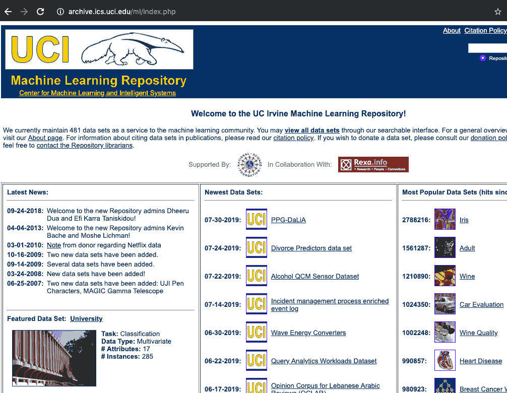

###### 图 2-1\. UCI 机器学习库包含时间序列数据集的带注释列表。

考虑 UCI 存储库中时间序列部分下列出的[第一个数据集](https://perma.cc/8E7D-ESGM)，这是关于工作缺勤的数据集（见图 2-2）。

快速查看数据显示，时间列限制为“缺勤月份”、“星期几”和“季节”，没有年份列。存在重复的时间索引，但还有一列指示员工身份，以便我们可以区分这些重复的时间点。最后，还有各种员工属性列。

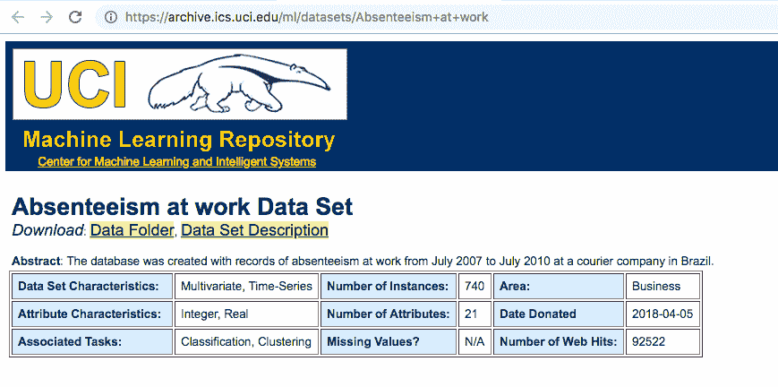

###### 图 2-2\. 工作缺勤数据集是 UCI 机器学习库时间序列数据集列表中的第一个。

这个数据集可能非常具有挑战性，因为您首先需要确定数据是否全来自一年，或者行进展中 1 到 12 个月的循环是否表明年份在变化。您还需要决定是从整体上看问题，从单位时间的缺勤率角度看数据，还是查看数据集中报告的每个 ID 的缺勤情况（见图 2-3）。在第一种情况下，您将拥有一个单一的时间序列，而在后一种情况下，您将拥有多个具有重叠时间戳的时间序列。您如何查看数据将取决于您想要回答的问题。

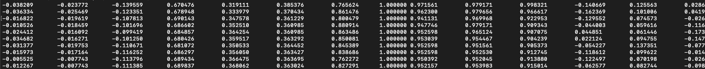

###### 图 2-3\. 澳大利亚手语数据集中一个文件的前几行。正如您所看到的，这是一种宽文件格式。

将缺勤数据集与列表中早期的另一个数据集进行对比，即[澳大利亚手语标志数据集](https://perma.cc/TC5E-Z6H4)，其中包括使用 Nintendo PowerGlove 录制的主题使用澳大利亚手语的录音。数据格式为宽 CSV 文件，每个文件夹表示个体测量，并且文件名指示手语标志。

在这个数据集中，列没有标签，也没有时间戳。尽管如此，这是时间序列数据；时间轴计算时间步长的前进，而不管实际事件发生的时间。注意，对于将符号视为时间序列的目的来说，时间单位并不重要；重要的是事件的顺序，以及您是否可以从数据描述中假设或确认测量是按照规律间隔进行的。

从检查这两个数据集可以看出，您将遇到各种数据处理挑战。我们已经注意到的一些问题有：

+   不完整的时间戳

+   时间轴可以是数据中的水平或垂直轴

+   时间概念的变化

### UEA 和 UCR 时间序列分类库

[UEA 和 UCR 时间序列分类库](https://perma.cc/56Q5-YPNT)是一个新的努力，提供一组常见的时间序列数据，可用于时间序列分类任务的实验和研究。它还展示了非常多样化的数据。我们可以通过查看两个数据集来看到这一点。

其中一个数据集是瑜伽动作分类任务。[分类任务](https://perma.cc/U6MU-2SCZ)涉及区分两位表演者在录制图像时执行瑜伽姿势转换系列的能力。图像被转换为一维系列。数据存储在 CSV 文件中，标签为最左侧列，其余列表示时间步长。时间从左到右穿过列，而不是从上到下穿过行。

展示了每个性别的两个样本时间序列图，见图 2-4。

# 单变量与多变量时间序列

到目前为止，我们查看的数据集是*单变量*时间序列；即它们只有一个变量随时间变化。

*多变量*时间序列是在每个时间戳测量多个变量的序列。它们特别适合分析，因为通常测量的变量彼此相关，并显示彼此之间的时间依赖性。我们稍后会遇到多变量时间序列数据。

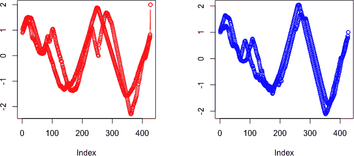

###### 图 2-4\. 展示了一个男性和一个女性演员重复执行瑜伽动作的情况。我们绘制了每个演员的两个样本时间序列。x 轴上没有显式的时间标签。重要的不是时间单位，而是 x 轴数据点是否均匀分布，正如这里所展示的那样。

也要考虑[葡萄酒数据集](https://perma.cc/CJ7A-SXFD)，其中葡萄酒根据其光谱的形状被分类为不同地区。那么这与时间序列分析有何关联呢？*光谱*是光波长与强度的图示。在这里，我们看到一个时间序列分类任务，其中根本没有时间的流逝。然而，时间序列分析适用，因为在 x 轴上有一个独特且有意义的排序，其具体含义是沿该轴的距离。时间序列分析通过利用 x 轴的顺序提供的额外信息，无论是时间还是波长或其他东西，与横截面分析有所不同。我们可以在 图 2-5 中看到这样一个“时间”序列的图示。虽然没有时间元素，但我们仍在看一个有序的数据系列，因此时间序列的常规概念同样适用。¹

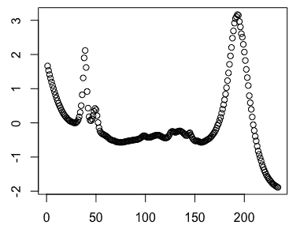

###### 图 2-5\. UCI 葡萄酒数据集中葡萄酒的样本光谱。曲线中的峰值指示具有特别高吸收率的波长区域。波长在 x 轴上均匀分布，而 y 轴表示吸收率，也是线性刻度。我们可以使用时间序列分析来比较诸如上述曲线之类的曲线。

### 政府时间序列数据集

几十年甚至几个世纪以来，美国政府一直是可靠的时间序列数据提供者。例如，[NOAA 国家环境信息中心](https://perma.cc/EA5R-TP5L)发布了与全国各气象站有关的各种时间序列数据，涉及温度和降水，甚至可以每 15 分钟精细化。[劳工统计局](https://www.bls.gov/)每月发布全国失业率指数。[疾病控制与预防中心](https://perma.cc/Y6KG-T948)在流感季节期间每周发布流感病例统计。[圣路易斯联邦储备银行](https://fred.stlouisfed.org/)提供了一系列非常丰富和有用的经济时间序列数据。

对于初次涉足时间序列分析，我建议您仅对这些现实世界的政府数据集进行探索性分析和可视化。学习这些数据集可能会很困难，因为它们提出了极为复杂的问题。例如，许多经济学家在官方发布前整个职业生涯都在努力预测失业率，但仅有有限的成功。

对于政府面临的重要但难以解决的问题，预测未来不仅在社会上有益，而且在经济上也很有利可图。许多聪明而受过良好训练的人正在解决这些问题，尽管技术水平仍然有些令人失望。解决困难问题是很好的，但不建议在这些问题上学习。

### 其他有用的来源

虽然我们不能详尽地覆盖所有优秀的时间序列数据源，但还有几个其他的资源库你应该探索：

[Comp   [CompEngine](https://comp-engine.org)

这个“自组织时间序列数据数据库”拥有超过 25,000 个时间序列数据库，总计接近 1.4 亿个单独的数据点。这个资源库及其在网页界面上提供的相关软件，重点是促进和推广*高度比较时间序列分析*（hctsa）。这种分析的目标是生成高级洞见，理解各种时间行为的多种类型，而无需特定学科的数据。

[Mcomp](https://cran.r-project.org/package=Mcomp) 和 [M4comp2018](https://github.com/carlanetto/M4comp2018) R 包

这些 R 包提供了 1982 年 M 竞赛（1,001 个时间序列）、2000 年 M3 竞赛（3,003 个时间序列）和 2018 年 M4 竞赛（100,000 个时间序列）的竞赛数据。这些时间序列预测竞赛之前在第一章中提到了 Rob Hyndman 教授关于时间序列预测的历史。R 的[*tscompdata*](https://github.com/robjhyndman/tscompdata)包中还包含了更多的时间序列预测竞赛数据。最后，还可以在 CRAN 的时间序列包资源库列表中找到更多专业的时间序列数据集，详情请见[时间序列包的 CRAN 资源库列表](https://perma.cc/2694-D79K)中的“时间序列数据”头部。

## 发现时间序列

在本章的早些时候，我们讨论了“发现时间序列”的概念，即我们从野外数据源中自行整理出来的时间序列数据。更具体地说，这些时间序列是从没有特别为时间序列分析设置的单个数据点中整理出来的，但具有足够的信息来构建时间序列。以从存储公司交易的 SQL 数据库中为特定客户拼接的交易时间序列为例，这就是一个干净的例子。在这种情况下，只要数据库中保存了时间戳或某种时间戳的代理，就可以构建时间序列。² 我们还可以想象从相同的数据中构建的其他时间序列，例如公司每天的总交易量时间序列或每周女性客户的总美元交易量时间序列。我们甚至可以想象生成多变量时间序列数据，例如一个时间序列，分别表示每周所有未满 18 岁客户的总交易量、每周 65 岁以上女性的总支出和公司每周的广告支出。这将在每个时间步骤给我们提供三个指标，一个多变量时间序列。

在结构化数据中找到时间序列数据，即使未明确存储为时间序列，也可以很容易，因为时间戳是无处不在的。以下是一些在数据库中看到时间戳的示例：

事件的时间戳记录

如果您的数据有时间戳，您就有可能构建时间序列。即使您只记录了文件访问时的时间而没有其他信息，您也有了一个时间序列。例如，在这种情况下，您可以模拟时间戳之间的时间差，并将其标记为其后时间戳，使得您的时间序列将由时间轴上的时间和值轴上的时间差组成。您可以进一步进行聚合，将这些时间差作为更大时间段的平均值或总和，或者您可以单独记录它们。

“无时间性”测量，其中另一种测量替代时间

在某些情况下，数据中时间并不显式，但在数据集的基础逻辑中有所体现。例如，当距离由已知的实验参数引起时，您可能会将数据视为“距离与值”的关系。如果您能够将其中一个变量映射到时间上，那么您就拥有了一个时间序列。或者，如果您的一个轴具有已知的距离和排序关系（例如波长），那么您也正在查看时间序列数据，例如前面提到的葡萄酒光谱案例。

物理迹象

许多科学学科记录物理迹象，无论是医学、听力还是天气。这些曾经是通过模拟过程生成的物理迹象，但现在它们以数字格式存储。尽管它们可能存储在不显而易见的格式中，例如图像文件或数据库的单个向量字段中，但这些也是时间序列。

# 将一组表中的时间序列数据收集进行改装

发现的时间序列的典型例子是从存储在 SQL 数据库中的状态类型和事件类型数据中提取的。这也是最相关的示例，因为仍然有大量数据存储在传统的结构化 SQL 数据库中。

想象一下为一个大型非营利组织工作。您一直在跟踪各种可能适合进行时间序列分析的因素：

+   电子邮件接收者对电子邮件的反应随时间变化：他们是否打开了邮件？

+   会员历史记录：会员是否有间断的会员资格期？

+   交易历史记录：个人何时购买以及我们能预测吗？

您可以使用几种时间序列技术来查看数据：

+   您可以生成成员对电子邮件响应的二维直方图以了解成员是否因电子邮件而感到疲劳的时间线。（我们将在第三章中说明使用二维直方图来理解时间序列的方法。）

+   你可以将捐赠预测转化为时间序列预测问题。（我们将在 第 4 章 中讨论经典的统计预测。）

+   你可以检查在重要情况下成员行为轨迹的典型模式是否存在。例如，是否存在一种典型的事件模式表明一个成员即将离开您的组织（也许连续三封电子邮件被删除）？在时间序列分析中，你可以将这视为基于外部动作检测成员潜在状态的方法。（我们将在 第 7 章 中讨论时间序列分析的状态空间方法。）

正如我们所看到的，在一个简单的 SQL 数据库中有许多时间序列的问题和答案。在许多情况下，组织在设计数据库架构时并未计划进行时间序列分析。在这种情况下，我们需要从不同的表和来源收集和组装时间序列。

## 一个案例：组装时间序列数据收集

如果你有幸有几个相关的数据源可用，你将需要将它们排列在一起，可能要处理不同的时间戳约定或数据中不同的粒度级别。让我们为我们正在使用的非营利组织示例创建一些数字。假设你有如下所示的数据：表 2-1 到 表 2-3：

表 2-1\. 每位成员加入的年份和当前会员状态

| 成员 ID | 加入年份 | 成员状态 |
| --- | --- | --- |
| 1 | 2017 | 金 |
| 2 | 2018 | 银 |
| 3 | 2016 | 无效 |

表 2-2\. 一周内成员打开的电子邮件数量

| 成员 ID | 周 | 打开的邮件数 |
| --- | --- | --- |
| 2 | 2017-01-08 | 3 |
| 2 | 2017-01-15 | 2 |
| 1 | 2017-01-15 | 1 |

表 2-3\. 成员捐赠给您组织的时间

| 成员 ID | 时间戳 | 捐赠金额 |
| --- | --- | --- |
| 2 | 2017-05-22 11:27:49 | 1,000 |
| 2 | 2017-04-13 09:19:02 | 350 |
| 1 | 2018-01-01 00:15:45 | 25 |

你可能已经用过这种表格形式的数据工作过。有了这样的数据，你可以回答许多问题，比如成员打开的邮件总数与捐赠总数之间的关系。

你还可以回答与时间有关的问题，比如一个成员是在加入后不久捐赠还是很久之后捐赠。然而，如果不将这些数据转换为更适合时间序列的格式，你就无法深入了解可能帮助你预测某人何时可能捐赠的更精细行为（比如根据他们最近是否在打开邮件）。

你需要将这些数据放入一个合理的时间序列分析格式中。你将需要解决一些挑战。

你应该从考虑我们已有数据的时间轴开始。在上述表格中，我们有三个层次的时间分辨率：

+   一个年度成员状态

+   一周内打开的电子邮件总数

+   捐赠的即时时间戳

您还需要检查数据是否意味着您认为它意味着什么。例如，您可能想要确定成员状态是年度状态还是最近的状态。回答这个问题的一个方法是检查是否有任何成员有多个条目：

```
## python 
>>> YearJoined.groupby('memberId').count().
                   groupby('memberStats').count()

1000
```

在这里，我们可以看到所有 1,000 名成员只有一个状态，因此他们加入的年份很可能确实是`YearJoined`，并且伴随一个可能是成员当前状态或加入时的状态。这影响如何使用状态变量，因此，如果您打算进一步分析这些数据，您需要与了解数据管道的人澄清。如果您将成员的当前状态应用于过去数据的分析中，这将是一种*预测*，因为您会向时间序列模型输入在当时无法知道的内容。这就是为什么在不知道分配时间的状态变量（例如`YearJoined`）时，您不应该使用它的原因。

查看电子邮件表，`week`列及其内容都表明数据是一个周时间戳或时间段。这必须是一周的汇总，所以我们应该将这些时间戳视为每周期而不是相隔一周的时间戳。

您应该评估一些重要的特征。例如，您可以从询问时间中如何报告周开始。虽然我们可能没有信息来重新组织表格，但如果与我们的行业相比，一周的划分方式有些奇怪，我们可能也想了解这一点。对于分析人类活动，通常有意义的是查看星期日至星期六或星期一至星期日的日历周，而不是与人类活动周期不太一致的周。因此，例如，不要随意从一月一日开始您的一周。

您还可以问空周是否报告了？也就是说，成员在表中打开 0 封电子邮件的周是否有位置？当我们想要进行面向时间的建模时，这很重要。在这种情况下，我们需要始终在数据中有空周存在，因为 0 周仍然是一个数据点。

```
## python
>>> emails[emails.EmailsOpened < 1]

Empty DataFrame
Columns: [EmailsOpened, member, week]
Index: []
```

有两种可能性：要么空值没有报告，要么成员总是至少有一个电子邮件事件。任何使用电子邮件数据的人都知道，让人们打开电子邮件很难，因此成员每周至少打开一封电子邮件的假设是相当不可能的。在这种情况下，我们可以通过查看仅一个用户的历史来解决这个问题。

```
## python
>>> emails[emails.member == 998]
      EmailsOpened member  week
25464  1           998   2017-12-04
25465  3           998 2017-12-11
25466  3           998 2017-12-18
25467  3           998 2018-01-01
25468  3           998 2018-01-08
25469  2           998 2018-01-15
25470  3           998 2018-01-22
25471  2           998 2018-01-29
25472  3           998 2018-02-05
25473  3           998 2018-02-12
25474  3           998 2018-02-19
25475  2           998 2018-02-26
25476  2           998 2018-03-05

```

我们可以看到一些周是缺失的。在 2017 年 12 月 18 日后，2017 年 12 月没有任何电子邮件事件。

通过计算该成员的第一个和最后一个事件之间应该有多少周观察，我们可以更数学地检查这一点。首先，我们计算成员任期的长度，以周为单位。

```
## python
>>> (max(emails[emails.member == 998].week) - 
                     min(emails[emails.member == 998].week)).days/7
25.0

```

然后我们看看该成员有多少周的数据：

```
## python
>>> emails[emails.member == 998].shape
(24, 3)

```

我们这里有 24 行，但应该有 26 行。这显示这个成员的一些周数据是缺失的。顺便说一句，我们也可以通过分组操作同时对所有成员运行此计算，但是仅考虑一个成员更易于理解示例。

现在我们已确认确实有缺失的周，我们将继续填补空白，以便我们现在拥有完整的数据集。我们不能确定识别所有缺失的周，因为有些可能发生在我们记录的日期之前或之后。然而，我们可以做的是填补成员在非空事件发生之前和之后第一个和最后一个时间之间的缺失值。

通过利用 Pandas 的索引功能，填充所有成员的所有缺失周要比编写我们自己的解决方案更容易。我们可以为 Pandas 数据框生成一个 `MultiIndex`，这将创建周和成员的所有组合——即笛卡尔积：

```
## python
>>> complete_idx = pd.MultiIndex.from_product((set(emails.week),
                                      set(emails.member)))

```

我们使用此索引重新索引原始表格，并填充缺失的值——在这种情况下，假设没有记录意味着没有可记录的内容，我们还重置索引以使成员和周信息作为列可用，并将这些列命名为：

```
## python
>>> all_email = emails.set_index(['week', 'member']).
                             reindex(complete_idx, fill_value = 0).
                             reset_index()
>>> all_email.columns = ['week', 'member', 'EmailsOpened']

```

让我们再次看看成员 998：

```
## python
>>> all_email[all_email.member == 998].sort_values('week')
  week     member EmailsOpened
2015-02-09 998    0
2015-02-16 998    0
2015-02-23 998    0
2015-03-02 998    0
2015-03-09 998    0
```

注意我们一开始就有大量的零。这些可能是成员加入组织之前的时间，因此他们不会出现在电子邮件列表中。在我们想要保留成员真正空闲周的分析中，没有太多种类。如果我们有成员开始接收电子邮件的确切日期，我们将有一个客观的截止日期。由于现状如此，我们将让数据指导我们。对于每个成员，我们通过将电子邮件 `DataFrame` 按成员分组，并选择最大和最小周值来确定 `start_date` 和 `end_date` 截止日期：

```
## python
>>> cutoff_dates = emails.groupby('member').week.
                           agg(['min', 'max']).reset_index)
>>> cutoff_dates = cutoff_dates.reset_index()
```

我们从 `DataFrame` 中删除那些在时间线上没有贡献意义的行，具体来说是每个成员的第一个非零计数之前的 0 行：

```
## python
>>> for _, row in cutoff_dates.iterrows(): 
>>>   member     = row['member']
>>>   start_date = row['min']
>>>   end_date   = row['max'] 
>>>   all_email.drop(
              all_email[all_email.member == member]
             [all_email.week < start_date].index, inplace=True) 
>>>   all_email.drop(all_email[all_email.member == member]
             [all_email.week > end_date].index, inplace=True)
```

# < 还是 <= ?

我们使用 < 和 > 操作符，不包括等号，因为 `start_date` 和 `end_date` 包含了有意义的数据点，并且因为我们正在删除数据，而不是保留数据，按照我们的代码编写。在这种情况下，我们希望在分析中包括这些周，因为它们是第一个和最后一个有意义的数据点。

你最好与你的数据工程师和数据库管理员一起工作，说服他们以时间感知的方式存储数据，特别是关于如何创建时间戳及其含义。你能在上游解决的问题越多，下游数据管道的工作就越少。

现在我们已经清理了电子邮件数据，我们可以考虑新的问题。例如，如果我们想考虑成员电子邮件行为与捐赠的关系，我们可以做一些事情：

+   将`DonationAmount`聚合到每周，以便时间段可比。然后可以合理地询问捐赠是否与成员对电子邮件的响应有某种关联。

+   将上周的`EmailsOpened`作为给定周的`DonationAmount`的预测因子。请注意，我们必须使用上周的数据，因为`EmailsOpened`是一周的汇总统计数据。如果我们想要预测星期三的捐款，并且我们的`EmailsOpened`总结了从周一到周日的电子邮件开启行为，那么使用同一周的信息可能会告诉我们成员在我们能知道之后的行为（例如，他们是否在捐款后的星期五打开了电子邮件）。

## 构建一个基础时间序列。

考虑如何将电子邮件和捐款数据相互关联。我们可以将捐款数据降采样，使其变成一个每周的时间序列，可与电子邮件数据进行比较。作为一个组织，我们对每周总金额感兴趣，因此我们通过求和将时间戳聚合为每周周期。一周内捐款超过一个的情况不太可能发生，因此每周捐款金额将反映大多数捐赠者的个人捐款金额。

```
## python
>>> donations.timestamp = pd.to_datetime(donations.timestamp)
>>> donations.set_index('timestamp', inplace = True)
>>> agg_don = donations.groupby('member').apply(
              lambda df: df.amount.resample("W-MON").sum().dropna())

```

在这段代码中，我们首先将字符串字符转换为适当的时间戳数据类，以便从 Pandas 的内置日期相关索引中获益。我们将时间戳设为索引，这是对数据帧进行重新采样所必需的。最后，对于从子集到每个会员得到的数据帧，我们按周分组并汇总捐款，删除没有捐款的周，然后将它们收集在一起。

请注意，我们进行了带锚定周的重新采样，以便与我们电子邮件表中已有的同一周日期匹配。还要注意，从人类角度来看，将周锚定在“星期一”是有意义的。

现在我们有了捐款信息和电子邮件信息以相同频率采样的数据，我们可以将它们连接起来。只要我们已经将周的数据锚定到同一周的某一天，Pandas 使这变得很简单。我们可以迭代每个会员，并合并数据帧：

```
## python
>>> for member, member_email in all_email.groupby('member'):
>>>     member_donations = agg_donations[agg_donations.member 
                                         == member]

>>> 	 member_donations.set_index('timestamp', inplace = True) 
>>> 	 member_email.set_index    ('week', inplace = True) 

>>> 	 member_email = all_email[all_email.member == member]
>>> 	 member_email.sort_values('week').set_index('week') 

>>> 	 df = pd.merge(member_email, member_donations, how = 'left', 
                 			  left_index = True, 
                 			  right_index = True)
>>> 	 df.fillna(0) 

>>> 	 df['member'] = df.member_x 
>>> 	 merged_df = merged_df.append(df.reset_index()
                   			 [['member', 'week', 'emailsOpened', 'amount']])

```

现在我们有了按会员排列的电子邮件和捐款数据。对于每个会员，我们只包括有意义的周，而不是会员期前后的周。

我们可能会将电子邮件行为视为与捐赠行为相关的“状态”变量，但我们可能希望从上周保留状态，以避免预先看到。例如，假设我们正在构建一个模型，该模型使用电子邮件行为来预测会员的下次捐赠。在这种情况下，我们可能会考虑观察一周内电子邮件打开的模式作为潜在的指标。我们需要将给定周的捐赠与上周的电子邮件行为对齐。我们可以轻松地对我们的数据进行处理，使其按周对齐，然后根据适当的周数进行移动。例如，如果我们想将捐赠向前推移一周，我们可以使用 shift 运算符轻松实现，尽管我们需要确保对每个会员都这样做：

```
## python
>>> df = merged_df[merged_df.member == 998]
>>> df['target'] = df.amount.shift(1)
>>> df = df.fillna(0)
>>> df
```

最好将这个目标存储在一个新列中，而不是覆盖旧列，特别是如果你没有将捐赠金额的时间戳也同时前移。我们使用 Pandas 内置的 shift 功能，将捐赠金额向未来推移了一周。你也可以用负数向过去推移。通常情况下，你会有更多的预测因子而不是目标变量，因此将目标变量向后移动是合理的。我们可以在这里看到代码的结果：

```
amount 	 emailsOpened   member   	week         target
 0       	1            998 		2017-12-04     	0
 0       	3            998 		2017-12-11     	0
 0       	3            998 		2017-12-18     	0
 0       	0            998 		2017-12-25     	0
 0       	3            998 		2018-01-01     	0
50       	3            998 		2018-01-08     	0
 0       	2            998 		2018-01-15    	50

```

现在我们已经填补了缺失的行，为会员 998 创建了所需的 26 行。我们的数据现在更加清洁和完整。

总结一下，这些是我们用来重构数据的特定于时间序列的技术：

1.  *重新校准我们数据的分辨率*以适应我们的问题。通常数据提供的时间信息比我们实际需要的更加具体。

1.  避免使用数据来生成时间戳，从而*避免预先看到*数据的可用性。

1.  记录*所有相关时间段*，即使“什么也没发生”。零计数与其他计数同样具有信息量。

1.  通过不使用数据来生成我们还不应该知道的信息的时间戳，*避免预先看到*。

到目前为止，我们通过使捐赠和电子邮件时间序列在相同时间点和相同频率采样来创建了原始发现时间序列。然而，在进行分析之前，我们没有彻底清理这些数据或者完全探索它们。这是我们将在第三章中进行的工作。

# 时间戳问题

时间戳对于时间序列分析非常有帮助。通过时间戳，我们可以推断出许多有趣的特征，比如时间的具体时段或一周中的某一天。这些特征对于理解数据尤为重要，尤其是涉及人类行为的数据。然而，时间戳也有其难点。在这里，我们讨论了时间戳数据的一些困难。

## 哪个时间戳？

当看到时间戳时，你应该首先问的问题是：这个时间戳是由什么过程生成的，是怎样生成的，以及何时生成的。通常发生的事件并不一定与记录事件的时间一致。例如，研究人员可能会在笔记本上写下一些内容，然后稍后将其转录到用作日志的 CSV 文件中。时间戳是否表示他们写下内容的时间，还是将其转录到 CSV 文件的时间？或者移动应用程序用户可能会在他们的手机离线时执行操作，以便数据稍后通过一些时间戳的组合上传到您的服务器。这些时间戳可以反映行为发生的时间，应用程序记录行为的时间，元数据上传到服务器的时间，或者从服务器下载数据返回到应用程序时的时间（或数据管道中的任何其他事件）。

一开始，时间戳可能会提供清晰度，但如果缺乏适当的文档，这种清晰度很快就会消失。当您查看新的时间戳时，您的第一步应始终是尽可能好地了解事件时间的来源。

一个具体的例子将说明这些困难。假设您正在查看从减肥移动应用程序中获取的数据，并看到餐饮日记，其中包含如表 2-4 所示的条目。

Table 2-4\. 减肥应用程序的样本餐饮日记

| 时间 | 摄入 |
| --- | --- |
| Mon, April 7, 11:14:32 | 煎饼 |
| Mon, April 7, 11:14:32 | 三明治 |
| Mon, April 7, 11:14:32 | pizza |

可能是这位用户同时吃了煎饼、三明治和披萨，但更有可能的情况是什么？用户是否指定了这个时间，还是它是自动创建的？界面是否提供了用户可以调整或选择忽略的自动时间？对这些问题的一些答案可以更好地解释相同时间戳背后的原因，而不是一个试图减肥的用户同时吃了煎饼、披萨和三明治作为开胃菜。

即使用户确实在 11:14 时吃了所有这些食物，但世界上哪里是 11:14 呢？这是用户的本地时间还是全球时钟？即使在用户在一顿饭中吃了所有这些食物的情况下（尽管可能性很小），仅凭这些行就不能很好地了解到这顿饭的时间方面。我们不知道这是早餐、午餐、晚餐还是小吃。要向用户提供有趣的信息，我们需要能够具体讨论一天中的当地小时，而没有时区信息我们无法做到这一点。

解决这些问题的最佳方法是查看所有收集和存储数据的代码，或者与编写该代码的人交谈。在研究系统上所有可用的人类和技术数据规范后，你还应该亲自尝试整个系统，以确保数据的行为与你被告知的一致。你对数据管道了解得越深入，你就越不太可能因为时间戳实际上不是你认为的那样而问错问题。

你需全面了解数据，对于上游管道的工作人员来说，他们并不知道你为分析准备了什么。尽可能地亲自评估时间戳生成的方式。因此，如果你正在分析来自移动应用管道的数据，请下载该应用，在各种情况下触发事件，并查看你自己的数据是什么样子。在与管理数据管道的人交谈后，你可能会对你的行为如何记录感到惊讶。追踪多个时钟和不同情况很困难，因此大多数数据集会简化时间的真实情况。你需要确切了解它们的处理方式。

## 猜测时间戳以理解数据含义

如果你处理遗留数据管道或未记录的数据，你可能无法探索工作中的管道或与维护它的人交谈的选项。你需要进行一些实证调查，以了解是否能推断出时间戳的含义：

+   如同前面的示例中所做的那样阅读数据，你可以对时间戳含义产生初步的假设。在前述情况下，查看多个用户的数据，看看是否存在相同模式（具有相同时间戳和不太可能的单一餐内容的多行），或者这是否是个异常情况。

+   使用聚合级别分析，你可以测试关于时间戳含义或可能含义的假设。对于前面的数据，存在一些未解的问题：

    +   时间戳是本地时间还是世界协调时间（UTC）？

    +   时间是否反映了用户的操作或某种外部约束，比如连接性？

### 本地时间还是世界协调时间？

大多数时间戳都以世界协调时间（UTC）或单一时区存储，这取决于服务器的位置，而与用户的位置无关。按照本地时间存储数据是相当不寻常的。但我们应该考虑这两种可能性，因为“野外”中都有这两种情况。

我们假设，如果时间是本地时间戳（每个用户的本地时间），我们应该在数据中看到反映白天和黑夜行为的日常趋势。更具体地说，我们应该期待在夜间，即使在大多数文化中人们不会在深夜吃饭的时段，也应该看到餐次数显著减少。对于我们移动应用程序的示例，如果我们创建一天内每小时餐次计数的直方图，应该会发现几个小时内记录的餐次较少。

如果我们在显示的小时内没有看到以日为导向的模式，我们可以得出结论，数据很可能是由某个全球时钟标记的，并且用户群体必须分布在许多不同的时区。在这种情况下，推断个别用户的当地时间将非常具有挑战性（假设没有时区信息）。我们可能会考虑每个用户的个别探索，看看是否可以编写启发式代码来近似标记用户的时区，但这样的工作既计算密集又不总是准确。

即使你无法准确确定用户的时区，拥有全局时间戳仍然很有用。首先，你可以确定你的应用服务器在何时何地最频繁记录饭菜时间。你还可以计算用户记录的每餐之间的时间差异，因为时间戳是绝对时间，所以不需要担心用户是否更改了时区。除了侦探工作之外，这也是一种有趣的特征生成方式：

```
## python
>>> df['dt'] = df.time - df.time.shift(-1)

```

`dt`列将是你可以在分析中使用的特征。使用这种时间差异也可以让你有机会估计每个用户的时区。你可以查看用户通常具有长`dt`的时间，这可能指向该用户的夜间发生时间。从那里开始，你可以开始确定每个人的“夜间”时间，而不必进行峰对峰分析。

### 用户行为还是网络行为？

返回到我们短数据样本提出的另一个问题，我们问的是我们的用户是否吃了奇怪的饭菜，或者我们的时间戳是否与上传活动相关。

用来确定用户时区的相同分析方法也适用于确定时间戳是否是用户或网络行为的功能。一旦你有了`dt`列（如先前计算的），你可以寻找 0 值的聚类，并且可以定性地确定它们是单个行为事件还是单个网络事件。你还可以查看`dt`是否在不同的日期间隔内表现出周期性。如果它们是用户行为的功能，它们更可能是周期性的，而不是网络连接或其他软件相关行为的功能。

总结一下，以下是一些你可能能够用现有数据集解决的问题，即使几乎没有关于时间戳如何生成的信息：

+   使用每个用户的时间戳差异来了解餐食间隔或数据条目间隔（根据你的工作假设，时间指示用户行为或网络行为）。

+   描述聚合用户行为，以确定在 24 小时周期内你的服务器最可能活跃的时间。

## 什么是有意义的时间尺度？

您应该基于关于您正在研究的行为的领域知识以及您能确定的与数据收集方式相关的细节，对您接收到的时间戳的时间分辨率持保留态度。

例如，想象一下您正在查看日销售数据，但您知道在许多情况下，经理们会等到周末报告数据，估计粗略的日常数字而不是每天记录它们。由于回忆问题和内在认知偏差，测量误差可能会相当大。您可以考虑将销售数据的分辨率从日常更改为每周，以减少或平均这种系统误差。否则，您应该构建一个模型，考虑不同工作日之间可能存在的偏误。例如，可能经理在星期五报告数据时系统性地高估他们的星期一业绩。

# 心理时间贴现

*时间贴现*是一种称为*心理距离*的现象的表现，它描述了我们在进行距离较远的估算或评估时更加乐观（也更不现实）的倾向。时间贴现预测，与最近记忆中记录的数据相比，从较远过去报告的数据将系统性地存在偏差。这与更普遍的遗忘问题不同，并暗示了非随机误差。每当您查看手动输入但未与记录事件同时发生的人工生成数据时，请记住这一点。

另一种情况涉及对系统的物理知识。例如，一个人的血糖水平变化速度存在一定的限制，因此，如果您在几秒钟内查看一系列血糖测量值，您可能应该对它们进行平均处理，而不是将它们视为不同的数据点。任何医生都会告诉您，如果您在几秒钟内查看了许多测量值，那么您正在研究设备的误差而不是血糖变化的速率。

# 人类知道时间在流逝

每当您在测量人类时，请记住人们对时间的流逝有多种反应方式。例如，最近的研究显示，调整一个人视野中的时钟速度会影响该人血糖水平变化的速度。

# 清洗您的数据

在本节中，我们将解决时间序列数据集中的以下常见问题：

+   缺失数据

+   更改时间序列的频率（即上采样和下采样）

+   平滑数据

+   处理数据的季节性

+   防止无意识的超前看法

## 处理缺失数据

缺失数据非常普遍。例如，在医疗保健领域，医疗时间序列中的缺失数据可能有多种原因：

+   患者未遵守所需的测量。

+   患者的健康统计数据很好，因此不需要进行特定的测量。

+   患者被遗忘或未经适当治疗。

+   医疗设备发生了随机技术故障。

+   发生了数据输入错误。

一般化地说，与横截面数据分析相比，时间序列分析中缺失数据更为常见，因为纵向采样的负担特别重：不完整的时间序列非常普遍，因此已经开发出方法来处理记录中的空缺。

处理时间序列缺失数据最常见的方法有：

插补

当我们根据对整个数据集的观察填补缺失数据时。

插值

当我们使用相邻数据点来估计缺失值时。插值也可以是一种插补形式。

删除受影响的时间段

当我们选择根本不使用具有缺失数据的时间段时。

我们将讨论插补和插值，并很快展示这些方法的机制。我们关注保留数据，而像删除具有缺失数据的时间段这样的方法会导致模型的数据减少。是否保留数据或丢弃问题时间段将取决于您的用例以及考虑到模型数据需求是否能够牺牲这些时间段。

### 准备数据集以测试缺失数据插补方法

我们将使用自 1948 年以来由美国政府发布的[月度失业数据](https://data.bls.gov/timeseries/LNS14000000)（可免费下载）。然后我们将从这些基础数据生成两个数据集：一个是真正随机缺失数据的情况，另一个是时间序列历史上最高失业率的月份。这将为我们提供两个测试案例，以查看在随机和系统性缺失数据存在的情况下，插补的行为如何。

###### 提示

我们将转向 R 来进行下一个示例。在整本书中，我们将自由切换使用 R 和 Python。我假设您在使用数据框架和 R 与 Python 中的矩阵方面具有一定的背景知识。

```
## R
> require(zoo)        ## zoo provides time series functionality 
> require(data.table) ## data.table is a high performance data frame

> unemp <- fread("UNRATE.csv")
> unemp[, DATE := as.Date(DATE)]
> setkey(unemp, DATE)

> ## generate a data set where data is randomly missing
> rand.unemp.idx <- sample(1:nrow(unemp), .1*nrow(unemp))
> rand.unemp     <- unemp[-rand.unemp.idx]

> ## generate a data set where data is more likely 
> ## to be missing when unemployment is high
> high.unemp.idx <- which(unemp$UNRATE > 8)
> num.to.select  <- .2 * length(high.unemp.idx)
> high.unemp.idx <- sample(high.unemp.idx,)
> bias.unemp     <- unemp[-high.unemp.idx]

```

因为我们从数据表中删除了行来创建一个带有缺失数据的数据集，所以我们需要读取缺失的日期和 NA 值，对于这一点，`data.table`包的*rolling join*功能非常有用。

```
## R
> all.dates <- seq(from = unemp$DATE[1], to = tail(unemp$DATE, 1), 
                                                  by = "months")
> rand.unemp = rand.unemp[J(all.dates), roll=0]
> bias.unemp = bias.unemp[J(all.dates), roll=0]
> rand.unemp[, rpt := is.na(UNRATE)]
## here we label the missing data for easy plotting

```

使用滚动连接，我们生成数据集开始和结束日期之间应该可用的所有日期序列。这为我们提供了数据集中要填充为`NA`的行。

现在我们有了带有缺失值的数据集，我们将看一下填充这些缺失值的几种具体方法：

+   前向填充

+   移动平均

+   插值

我们将比较这些方法在随机缺失和系统缺失数据集中的性能。由于我们从完整数据集生成了这些数据集，因此实际上可以确定它们的表现而不是推测。当然，在现实世界中，我们永远不会有缺失数据来检查我们的数据插补。

### 前向填充

填补缺失值的最简单方法之一是向前传递缺失点前的最后已知值，这种方法被称为*前向填充*。不需要数学或复杂的逻辑。只需考虑随着可用数据的时间推移经验，您可以看到在时间的缺失点，您唯一可以确信的是已记录的数据。在这种情况下，使用最近的已知测量是有意义的。

可以使用`zoo`包中的`na.locf`轻松实现前向填充：

```
## R
> rand.unemp[, impute.ff := na.locf(UNRATE, na.rm = FALSE)]
> bias.unemp[, impute.ff := na.locf(UNRATE, na.rm = FALSE)]
> 
> ## to plot a sample graph showing the flat portions
> unemp[350:400, plot (DATE, UNRATE,    
                          col = 1, lwd = 2, type = 'b')]
> rand.unemp[350:400, lines(DATE, impute.ff, 
                          col = 2, lwd = 2, lty = 2)]
> rand.unemp[350:400][rpt == TRUE, points(DATE, impute.ff, 
                          col = 2, pch = 6, cex = 2)]

```

这将导致一个看起来很自然的图形，除非您看到重复的数值以解决缺失数据，如在图 2-6 中所示。正如您在图中所注意到的，前向填充的数值通常不会偏离真实数值太远。

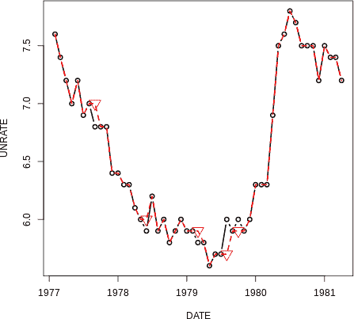

###### 图 2-6\. 原始时间序列用实线绘制，以及用虚线绘制的具有随机缺失点的前向填充值的时间序列。前向填充的值标记有向下指向的三角形。

我们还可以通过将系列的值相互绘制来比较这些系列的值。也就是说，对于每个时间步，我们将真实已知值与具有插值值的同一时间的值进行绘制。大多数值应完全匹配，因为大多数数据是存在的。我们在图 2-7 中看到这一点体现在 1:1 线上。我们还看到一些点散布在该线外，但它们似乎并没有系统偏离。

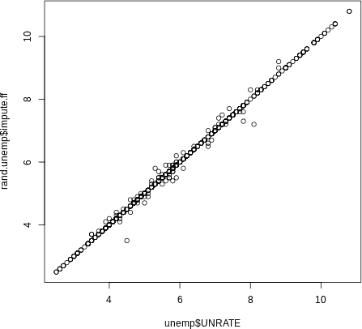

###### 图 2-7\. 绘制真实失业率与前向填充系列的图形。这张图表明，前向填充并没有系统地扭曲数据。

# 向后填充

正如您可以将过去的值带入以填补缺失数据一样，您也可以选择向后传播值。然而，这是一种预测，所以只有在您不打算从数据中预测未来，并且从领域知识来看，向后填充数据比向前填充更合理时，才应该这样做。

在某些情况下，前向填充是完成缺失数据的最佳方法，即使“更高级的方法”也是可能的。例如，在医疗环境中，缺失值通常表示医务人员认为不必重新测量值，可能是因为预期患者的测量值是正常的。在许多医疗情况下，这意味着我们可以应用前向填充到缺失值，使用最后已知的值，因为这是激励医务人员不重新测量的假设。

向前填充有许多优点：它计算上不那么要求，可以轻松应用于实时流数据，并且在插补方面表现出色。我们很快会看到一个例子。

### 移动平均

我们还可以使用滚动均值或中位数来填充数据。被称为*移动平均*，它类似于向前填充，因为您使用过去的值来“预测”缺失的未来值（插补可以是一种预测形式）。然而，使用移动平均时，您将使用*多个*最近过去时间的输入。

在许多情况下，移动平均数据插补比向前填充更适合任务。例如，如果数据嘈杂，并且你有理由怀疑任何个别数据点相对于整体平均值的价值，你应该使用移动平均而不是向前填充。向前填充可能会包括比你感兴趣的“真实”度量更多的随机噪声，而平均化可以去除部分噪声。

为了防止前瞻，仅使用发生在缺失数据点之前的数据。因此，您的实现可能会像这样：

```
## R
> ## rolling mean without a lookahead
> rand.unemp[, impute.rm.nolookahead := rollapply(c(NA, NA, UNRATE), 3,
>              function(x) {
>                          if (!is.na(x[3])) x[3] else mean(x, na.rm = TRUE)
>                          })]         
> bias.unemp[, impute.rm.nolookahead := rollapply(c(NA, NA, UNRATE), 3,
>              function(x) {
>                          if (!is.na(x[3])) x[3] else mean(x, na.rm = TRUE)
>                          })]        

```

我们将缺失数据的值设置为其之前值的平均值（因为我们以最终值为索引，并使用此值来确定其是否缺失以及如何替换它）。

###### 提示

移动平均不一定是算术平均。例如，指数加权移动平均会更加重视近期数据而不是过去的数据。另外，几何平均在展现强序列相关性的时间序列和值随时间复合的情况下会有帮助。

在用移动平均插补缺失数据时，考虑您是否需要仅使用前瞻数据来了解移动平均值的值，或者是否愿意构建前瞻。如果您不关心前瞻，您的最佳估计将包括缺失数据之前和之后的点，因为这将最大化输入到您估计中的信息。在这种情况下，您可以实现一个滚动窗口，如使用`zoo`包的`rollapply()`功能所示：

```
## R
> ## rolling mean with a lookahead
> rand.unemp[, complete.rm := rollapply(c(NA, UNRATE, NA), 3,
>             function(x) {
>                         if (!is.na(x[2])) 
>                             x[2]                               
>                         else 
>                             mean(x, na.rm = TRUE)
>                         })]         

```

在可视化和记录应用程序中使用过去和未来信息对于数据预处理很有用，但正如前面提到的，如果您正在准备将数据馈送到预测模型中，则不合适。

前瞻移动平均和使用未来和过去数据计算的移动平均的结果显示在图 2-8 中。

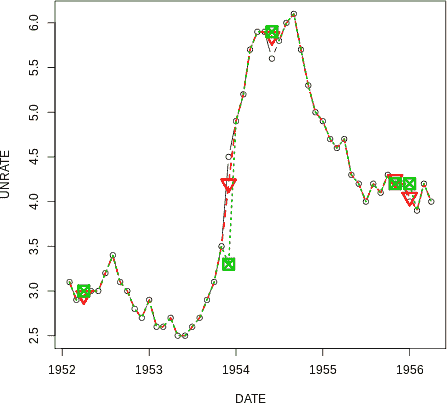

###### 图 2-8\. 虚线显示了没有前瞻的移动平均插补，而虚线则显示了具有前瞻的移动平均插补。同样，方形显示了非前瞻插补点，而倒三角形显示了具有前瞻的移动平均。

滚动平均数据插补可以减少数据集的方差。这是在计算准确性、R²统计或其他误差指标时需要记住的事情。你的计算可能会高估模型的性能，这是构建时间序列模型时经常遇到的问题。

# 使用数据集的平均值来填补缺失数据

在横断面的情况下，常见的方法是通过在变量缺失的地方填入平均值或中位数来填补缺失数据。虽然这可以用于时间序列数据，但大多数情况下并不合适。知道数据集的平均值涉及看向未来……这就是预先看！

### 插值

插值是一种根据我们希望整体数据行为的几何约束来确定缺失数据点值的方法。例如，线性插值将缺失数据限制为与已知相邻点一致的线性拟合。

线性插值特别有用和有趣，因为它允许你利用你对系统随时间行为的了解。例如，如果你知道系统以线性方式行为，你可以将这种知识应用进去，这样只有线性趋势会用于填补缺失数据。在贝叶斯术语中，它允许你向你的插补注入*先验*。

与移动平均类似，插值可以这样做，以便同时查看过去和未来的数据，或者只查看一个方向。通常的注意事项是：如果你接受这样做会导致预先看的影响，并且你确定这对你的任务不是问题，那么允许你的插值只有未来数据访问。

在这里，我们使用过去和未来的数据点进行插值（参见图 2-9）：

```
## R
> ## linear interpolation
> rand.unemp[, impute.li := na.approx(UNRATE)]
> bias.unemp[, impute.li := na.approx(UNRATE)]
> 
> ## polynomial interpolation
> rand.unemp[, impute.sp := na.spline(UNRATE)]
> bias.unemp[, impute.sp := na.spline(UNRATE)]
> 
> use.idx = 90:120
> unemp[use.idx, plot(DATE, UNRATE, col = 1, type = 'b')]
> rand.unemp[use.idx, lines(DATE, impute.li, col = 2, lwd = 2, lty = 2)]
> rand.unemp[use.idx, lines(DATE, impute.sp, col = 3, lwd = 2, lty = 3)]

```

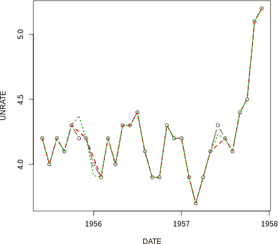

###### 图 2-9\. 虚线显示线性插值，而点线显示样条插值。

有许多情况适合使用线性（或样条）插值。考虑平均每周温度，其中根据一年中的时间，有升高或降低温度的已知趋势。或者考虑增长中的企业的年销售数据。如果趋势是每年业务量线性增长，基于该趋势填补缺失数据是合理的数据插补。换句话说，我们可以使用线性插值，这将考虑到趋势，而不是移动平均，它将不会。如果存在增值趋势，则移动平均将系统地低估缺失值。

也有很多情况不适合线性（或样条）插值。例如，如果您在天气数据集中缺少降水数据，您不应该在线性插值已知天数之间外推；我们都知道，降水并不是这样工作的。同样，如果我们看的是某人每天的睡眠小时数，但是缺少了几天的数据，我们不应该在线性外推睡眠小时数之间。例如，已知的端点之一可能包括熬夜学习后的 30 分钟小睡。这不太可能估算缺失的数据。

### 总体比较

现在我们已经进行了几种不同类型的插补，我们可以查看结果，比较这些不同的数据插补在这个数据集上的表现如何。

我们生成了两个具有缺失数据的数据集，一个是随机缺失数据，另一个是缺失了不利数据点（高失业率）。当我们比较我们采用的方法以确定哪种方法产生了最佳结果时，我们可以看到均方误差可能会有很大的百分比差异：

```
## R
> sort(rand.unemp[ , lapply(.SD, function(x) mean((x - unemp$UNRATE)²,
>												  na.rm = TRUE)),
>          .SDcols = c("impute.ff", "impute.rm.lookahead", 
>		 			                "impute.rm.nolookahead", "impute.li", 
>                      "impute.sp")])
impute.li   impute.rm.lookahead   impute.sp   impute.ff   impute.rm.nolookahead
0.0017      0.0019       		  0.0021      0.0056      0.0080

> sort(bias.unemp[ , lapply(.SD, function(x) mean((x - unemp$UNRATE)²,
> 												  na.rm = TRUE)),
>          .SDcols = c("impute.ff", "impute.rm.lookahead", 
>					                 "impute.rm.nolookahead", "impute.li", 
>                      "impute.sp")])
impute.sp    impute.li   impute.rm.lookahead  impute.rm.nolookahead   impute.ff
0.0012       0.0013      0.0017               0.0030                  0.0052

```

请记住，前述的许多方法都包含了前瞻性。唯一不包含前瞻性的方法是前向填充和没有前瞻性的移动平均（也有带有前瞻性的移动平均）。因此，不足为奇的是在错误方面存在一系列差异，并且没有前瞻性的方法表现不如其他方法。

### 最终备注

在这里，我们涵盖了时间序列应用中最简单和最常用的缺失数据插补方法。数据插补仍然是数据科学研究的一个重要领域。你做出的决策越重要，就越需要仔细考虑数据缺失的潜在原因及其修正可能带来的潜在影响。以下是你应该记住的一些谨慎提示：

+   无法证明数据真的是随机缺失，而且在大多数真实世界的情况下，缺失并不真的是随机的，这也不足为奇。

+   有时测量数据缺失的概率可以通过您已经测量的变量来解释，但有时则不然。具有许多特征的广泛数据集是调查缺失数据模式可能解释的最佳方式，但这并不是时间序列分析的常规方法。

+   当您需要了解将缺失数据插入值引入的不确定性时，您应该运行各种场景，并尽可能与参与数据收集过程的人交流。

+   您应该考虑如何处理缺失数据以适应后续数据使用。您必须小心防止前瞻性，或者决定前瞻性将如何严重影响您后续工作的有效性。

## 上采样和下采样

常常来自不同来源的相关时间序列数据将不具有相同的采样频率。这是你可能希望改变数据采样频率的众多原因之一。当然，你不能改变信息实际被测量的速率，但你可以改变数据收集中时间戳的频率。这被称为*上采样*和*下采样*，分别用于增加或减少时间戳的频率。

我们在“从一组表中重新调整时间序列数据收集”中对时间数据进行了降采样。在这里，我们更加通用地讨论了降采样和上采样的如何和为什么。

###### 注意

降采样是将数据子集化，使时间戳的频率低于原始时间序列。上采样则是将数据表示为如果它被更频繁地收集的情况。

### 降采样

任何时候，当你降低数据的频率，你就在进行**降采样**。这通常发生在以下情况下。

#### 数据的原始分辨率不合理

原始数据粒度不合理的原因很多。例如，你可能测量得太频繁了。假设你有一个数据集，其中某人每秒测量一次室外空气温度。常识告诉我们，这种测量过于频繁，相对于额外的数据存储和处理负担，可能提供的新信息非常有限。事实上，测量误差可能与秒与秒之间的空气温度变化一样大。因此，你可能不希望存储这种过多且无信息量的数据。在这种情况下——也就是对定期采样的数据来说——降采样就像是选择每 *n* 个元素一样简单。

#### 关注季节周期的特定部分

在时间序列中不必担心季节数据，你可以选择创建一个只关注一个季节的子系列。例如，我们可以应用降采样来创建一个子系列，就像在这种情况下，我们从原始的月度时间序列中生成了一组一月份的测量值。在这个过程中，我们将数据降低到了年度频率。

```
## R
> unemp[seq.int(from = 1, to = nrow(unemp), by = 12)]
DATE         UNRATE
1948-01-01    3.4
1949-01-01    4.3
1950-01-01    6.5
1951-01-01    3.7
1952-01-01    3.2
1953-01-01    2.9
1954-01-01    4.9
1955-01-01    4.9
1956-01-01    4.0
1957-01-01    4.2

```

#### 与低频率数据进行匹配

你可能希望降低数据的频率，以便与其他低频数据匹配。在这种情况下，你可能希望对数据进行聚合或降采样，而不仅仅是丢弃数据点。这可以是简单的平均值或总和，也可以是更复杂的加权平均，后续值具有更高的权重。我们之前在捐赠数据中看到，将一周内的所有捐款总额相加的想法可能更加有趣。

相比之下，对于我们的经济数据，最有可能感兴趣的是年均值。我们使用均值而不是滚动均值，因为我们想要总结一年的情况，而不是获取该年的最新值，强调的是最近性。我们通过将日期格式化为字符串，将其年份作为例子来分组，展示如何可以创造性地利用类似 SQL 的操作进行时间序列功能：

```
## R
> unemp[, mean(UNRATE), by = format(DATE, "%Y")]
format   V1
1948    3.75
1949    6.05
1950    5.21
1951    3.28
1952    3.03
1953    2.93
1954    5.59
1955    4.37
1956    4.13
1957    4.30

```

### 上采样

上采样并不简单等同于下采样的逆过程。下采样在现实世界中是有意义的；决定更少频繁地进行测量是简单的。相比之下，上采样可能就像试图白嫖一样——也就是说，不进行实时测量却希望从不频繁的测量中获取高分辨率数据。引用流行的`R`时间序列包[`XTS`](https://perma.cc/83E9-4N79)的作者的话：

> 不可能将低周期性的系列转换为高周期性的系列 - 例如，从每周到每日或每日到 5 分钟柱，因为那需要魔法。

然而，有合理的理由希望以比其默认频率更高的频率标记数据。在这样做时，你需要记住数据的限制。请记住，你只是增加了更多的时间标签，而不是增加了更多信息。

让我们讨论一些上采样有意义的情况。

#### 不规则时间序列

上采样的一个非常常见的原因是你有一个不规则采样的时间序列，你希望将其转换为定期的时间序列。这是一种上采样，因为你将所有数据转换为一个频率，这个频率可能高于数据之间滞后所指示的频率。如果出于这个原因进行上采样，你已经知道如何通过滚动连接来实现，就像我们在填补缺失的经济数据时所做的那样，通过 R：

```
## R
> all.dates <- seq(from = unemp$DATE[1], to = tail(unemp$DATE, 1),
>                  by = "months")
> rand.unemp = rand.unemp[J(all.dates), roll=0]

```

#### 不同频率下的输入采样

有时，你仅仅需要上采样低频信息，以便将其与高频信息一起在需要输入对齐和同时采样的模型中传递。你必须对前瞻性保持警惕，但如果我们假设已知状态在出现新的已知状态之前是真实的，我们可以安全地上采样并传递我们的数据。例如，假设我们知道（相对地）大多数新的工作岗位都是在每月的第一天开始的。我们可能会决定使用给定月份的失业率来代表整个月份（不考虑它是前瞻性，因为我们假设失业率在整个月份内保持稳定）。

```
## R
> daily.unemployment = unemp[J(all.dates), roll = 31]
> daily.unemployment
   DATE      UNRATE
1948-01-01    3.4
1948-01-02    3.4
1948-01-03    3.4
1948-01-04    3.4
1948-01-05    3.4

```

#### 时间序列动态的知识

如果你对变量通常的时间行为有基础知识，你也可能能够将上采样问题视为缺失数据问题。在这种情况下，我们已经讨论过的所有技术仍然适用。插值是产生新数据点的最有可能的方法，但你需要确保你的系统动态能够证明你的插值决策是合理的。

正如前面讨论的，即使在最干净的数据集中，上采样和下采样也会经常发生，因为你几乎总是希望比较不同时间尺度的变量。还应该指出，Pandas 具有特别方便的上采样和下采样功能，使用`resample`方法。

## 平滑数据

数据平滑可以出于各种原因进行，尤其是在进行数据可视化之前，常常会对真实世界的时间序列数据进行平滑，以便讲述数据背后的可理解故事。在本节中，我们进一步讨论为什么进行平滑以及最常见的时间序列平滑技术：指数平滑。

### 平滑的目的

尽管异常值检测是一个独立的主题，如果你有理由认为数据应该平滑，你可以通过移动平均值来消除测量的突变，测量误差或两者都有的情况。即使这些突变是准确的，它们可能也不反映底层过程，并且可能更多地是仪器问题的问题；这就是为什么平滑数据是相当常见的。

平滑数据与填充缺失数据密切相关，因此这里也涉及到一些技术。例如，你可以通过应用滚动均值来平滑数据，无论是否有前瞻，因为这只是计算其平滑值时所用窗口的点相对位置的问题。

当你在平滑数据时，你需要考虑一些问题：

+   为什么要平滑？平滑可以达到多种目的：

    数据准备

    你的原始数据是否不适用？例如，你可能知道非常高的值不太可能或不符合物理规律，但你需要一种有原则的方法来处理它们。平滑是最直接的解决方案。

    特征生成

    从数据中取样，无论是关于一个人、图像或其他任何内容的许多特征，然后用几个度量标准对其进行总结。通过这种方式，一个更全面的样本被折叠成几个维度或减少到几个特征。特征生成对机器学习尤为重要。

    预测

    对某些类型的过程来说，最简单的预测形式是均值回归，你可以通过从平滑特征进行预测来获得这种形式。

    可视化

    你想要在看似杂乱的散点图中增加一些信号吗？如果是这样，你这样做的意图是什么？

+   平滑或不平滑将如何影响你的结果？

    +   你的模型是否假设数据是嘈杂和不相关的，从而使你的平滑可能会影响这种假设？

    +   在实时生产模型中是否需要平滑？如果是的话，您需要选择一种不使用前瞻的平滑方法。

    +   您是否有一个原则性的平滑方法，或者您将只进行超参数网格搜索？如果是后者，您将如何确保使用时间感知的交叉验证形式，以确保未来的数据不会向过去泄漏？

### 指数平滑

平滑时，通常不会将所有时间点等同看待。特别是，您可能希望将最近的数据视为信息更多的数据，这种情况下指数平滑是一个不错的选择。与我们之前讨论过的移动平均相比——在那种情况下，每个数据缺失的点可以被补充为其周围点的平均值——指数平滑更加关注时间性，将更近期的点权重更高，而不太近期的点权重则指数级减少（因此得名）。

指数平滑的工作原理如下。对于给定的时间段 *t*，通过计算来找到系列的平滑值：

时间 *t* 的平滑值 <math xmlns="http://www.w3.org/1998/Math/MathML"><mrow><mo>=</mo> <msub><mi>S</mi> <mi>t</mi></msub> <mo>=</mo> <mi>d</mi> <mo>×</mo> <mo>;</mo> <msub><mi>S</mi> <mrow><mi>t</mi><mo>-</mo><mn>1</mn></mrow></msub> <mo>+</mo> <mrow><mo>(</mo> <mn>1</mn> <mo>–</mo> <mi>d</mi> <mo>)</mo></mrow> <mo>×</mo> <msub><mi>x</mi> <mi>t</mi></msub></mrow></math>

考虑这如何随时间传播。时间 (*t* – 1) 的平滑值本身就是同样东西的产物：

<math xmlns="http://www.w3.org/1998/Math/MathML"><mrow><msub><mi>S</mi> <mrow><mi>t</mi><mo>-</mo><mn>1</mn></mrow></msub> <mo>=</mo> <mi>d</mi> <mo>×</mo> <msub><mi>S</mi> <mrow><mi>t</mi><mo>-</mo><mn>2</mn></mrow></msub> <mo>+</mo> <mrow><mo>(</mo> <mn>1</mn> <mo>–</mo> <mi>d</mi> <mo>)</mo></mrow> <mo>×</mo> <msub><mi>x</mi> <mrow><mi>t</mi><mo>-</mo><mn>1</mn></mrow></msub></mrow></math>

因此，我们可以看到在时间 *t* 的平滑值有一个更复杂的表达式：

<math xmlns="http://www.w3.org/1998/Math/MathML"><mrow><mi>d</mi> <mo>×</mo> <mrow><mo>(</mo> <mi>d</mi> <mo>×</mo> <msub><mi>S</mi> <mrow><mi>t</mi><mo>–</mo><mn>2</mn></mrow></msub> <mo>+</mo> <mrow><mo>(</mo> <mn>1</mn> <mo>–</mo> <mi>d</mi> <mo>)</mo></mrow> <mo>×</mo> <msub><mi>x</mi> <mrow><mi>t</mi><mo>-</mo><mn>1</mn></mrow></msub> <mo>)</mo></mrow> <mo>+</mo> <mrow><mo>(</mo> <mn>1</mn> <mo>-</mo> <mi>d</mi> <mo>)</mo></mrow> <mo>×</mo> <msub><mi>x</mi> <mi>t</mi></msub></mrow></math>

数学倾向的读者会注意到我们有以下形式的系列：

<math xmlns="http://www.w3.org/1998/Math/MathML"><mrow><msup><mi>d</mi> <mn>3</mn></msup> <mo>×</mo> <msub><mi>x</mi> <mrow><mi>t</mi><mo>-</mo><mn>3</mn></mrow></msub> <mo>+</mo> <msup><mi>d</mi> <mn>2</mn></msup> <mo>×</mo> <msub><mi>x</mi> <mrow><mi>t</mi><mo>-</mo><mn>2</mn></mrow></msub> <mo>+</mo> <mi>d</mi> <mo>×</mo> <msub><mi>x</mi> <mrow><mi>t</mi><mo>-</mo><mn>1</mn></mrow></msub></mrow></math>

实际上，正是因为这种形式，指数移动平均相当容易处理。更多详细信息可以在在线和教科书中广泛找到；参见我的最喜爱的摘要在“更多资源”中。

我将在 Python 中进行平滑演示，因为 Pandas 包含多种平滑选项。平滑选项在 R 中也广泛可用，包括基础 R，以及许多时间序列包中。

虽然我们一直在看美国失业率数据，我们将转向另一个常用的数据集：航空公司乘客数据集（追溯到 Box 和 Jenkins 的著名时间序列书籍并广泛可用）。原始数据集记录了按月分解的数千名航空公司乘客：

```
## python
>>> air
       Date  Passengers    
0    1949-01       112  
1    1949-02       118  
2    1949-03       132  
3    1949-04       129 
4    1949-05       121 
5    1949-06       135  
6    1949-07       148  
7    1949-08       148  
8    1949-09       136  
9    1949-10       119  
10   1949-11       104 

```

我们可以使用各种衰减因子以及应用 Pandas 的 `ewma()` 函数轻松地平滑乘客的值，如下所示：

```
## python
>>> air['Smooth.5'] = pd.ewma(air, alpha = .5).Passengers
>>> air['Smooth.9'] = pd.ewma(air, alpha = .9).Passengers

```

正如我们所见，`alpha` 参数的水平，也称为*平滑系数*，影响值更新到其当前值与保留现有平均值信息的程度。`alpha` 值越高，值就越快地更新到其当前价格。Pandas 接受多个参数，所有这些参数都插入相同的方程，但它们提供了多种方式来思考如何指定指数移动平均数。³

```
## python
>>> air
       Date  Passengers    Smooth.5  Smooth.9
0    1949-01       112  112.000000  112.000000
1    1949-02       118  116.000000  117.454545
2    1949-03       132  125.142857  130.558559
3    1949-04       129  127.200000  129.155716
4    1949-05       121  124.000000  121.815498
5    1949-06       135  129.587302  133.681562
6    1949-07       148  138.866142  146.568157
7    1949-08       148  143.450980  147.856816
8    1949-09       136  139.718200  137.185682
9    1949-10       119  129.348974  120.818568
10   1949-11       104  116.668295  105.681857

```

然而，简单的指数平滑在具有长期趋势的数据（用于预测）中表现不佳。霍尔特方法和霍尔特-温特斯平滑是两种应用于具有趋势或趋势和季节性数据的指数平滑方法。

还有许多广泛使用的平滑技术。例如，卡尔曼滤波器通过将时间序列过程建模为已知动态和测量误差的组合来平滑数据。LOESS（局部估计散点平滑）是一种非参数方法，用于局部平滑数据。这些方法及其他方法逐渐提供了更复杂的理解平滑的方式，但计算成本也随之增加。需要注意的是，卡尔曼滤波和 LOESS 都包含了早期和晚期的数据，因此如果使用这些方法，要注意信息向时间向后的泄露，以及它们通常不适合用于准备用于预测应用的数据。

平滑是一种常用的预测形式，当你测试更复杂的方法是否实际上产生成功的预测时，可以使用平滑后的时间序列（无前瞻）作为一种简单的空模型。

# 季节性数据

数据中的季节性是任何一种频率稳定的重复行为。它可以在同一时间发生多种不同的频率。例如，人类行为倾向于具有每日季节性（每天固定时间吃午餐），每周季节性（星期一类似于其他星期一）和每年季节性（元旦交通量较低）。物理系统也展示了季节性，比如地球绕太阳公转的周期。

辨别和处理季节性是建模过程的一部分。另一方面，它也是一种数据清理的形式，例如经济上重要的[美国就业报告](https://perma.cc/GX6J-QJG9)。事实上，许多政府统计数据，特别是经济数据，在发布时都会进行非季节性调整。

要了解季节性数据平滑能做什么，我们回到经典的航空公司乘客计数数据集。通过绘图可以快速显示这是高度季节性的数据，但前提是你制作正确的图表。

注意使用 R 的默认图（使用点; 参见图 2-10）与添加参数来指示你想要一条线的区别（参见图 2-11）。

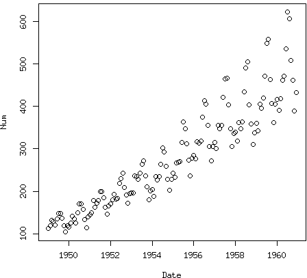

###### 图 2-10\. 从散点图中明显可见数据均值和方差的增加，但我们看不到明显的季节性趋势。

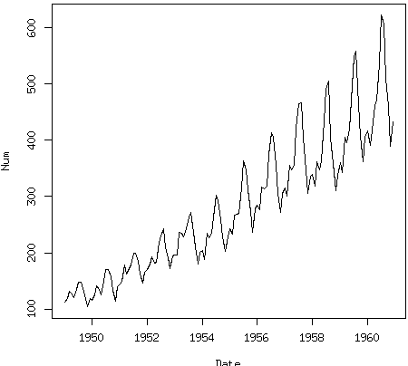

###### 图 2-11\. 线图清楚地显示了季节性。

如果您仅查看默认的 R 图表，可能会忽略数据的季节性特征。希望这种情况不会持续太久，毫无疑问，您还会做其他探索数据的工作，也许是使用自相关图（在第三章中讨论）或其他诊断工具。

# 人类是习惯的动物。

人类行为数据几乎总是具有某种形式的季节性，即使有几个周期（每小时的模式，每周的模式，夏冬季的模式等）。

散点图确实比线图更清楚地显示了一些信息。我们的数据的方差正在增加，均值也在增加，当我们看到数据点以锥形向外散布时，这一点尤为明显，倾向于向上。这些数据显然具有增长趋势，因此我们可能会对其进行对数转换或差分处理，具体取决于我们模型的需求。这些数据也显然具有增加方差的趋势。在建模章节中，我们将更详细地讨论特定于模型的季节性数据转换，所以这里不再详细说明。

除了线图中关于季节性的证据外，我们还获得了有用的信息。我们了解到季节性的种类。也就是说，我们看到数据不仅仅是季节性的，而且是以乘法方式的季节性。随着总体值的增加，季节波动也增加（可以将这视为从峰值到低谷的大小变化）。

我们可以像这样轻松地将数据分解为其季节性、趋势和剩余部分，只需一行 R 代码即可显示。

```
## R
> plot(stl(AirPassengers, "periodic"))

```

根据原始数据，得出的图表看起来非常合理（参见图 2-12）。我们可以想象将季节性、趋势和剩余数据重新组合以获得原始序列。我们还可以看到，这种特定的分解没有考虑到这一系列显示的是乘法季节性而不是加法季节性，因为残差在时间序列的开始和结束时最大。看起来，这种分解将平均季节变异性作为季节性分量的变异性。

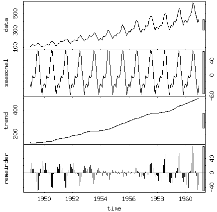

###### 图 2-12\. 将原始时间序列分解为季节性组成部分、趋势和残差。请注意每个图表的 y 轴，它们非常不同。请注意，这是每个图表右侧灰色条的原因。这些灰色条的绝对大小相同（以 y 轴单位表示），因此它们的相对不同显示是对不同组成部分不同 y 轴比例的视觉提醒。

要初步了解其工作原理，我们可以查看官方的 R 文档：

> 季节性分量是通过 LOESS 平滑季节子序列（所有一月值的系列...）找到的。如果`s.window = “periodic”`，平滑实际上被取均值替代。季节性值被移除，余下的被平滑以找到趋势。总体水平从季节分量中移除并加到趋势分量中。这个过程迭代几次。余数分量是季节加趋势拟合的残差。

早先引入的 LOESS 方法是一种计算量大的平滑数据点的方法，它涉及使用移动窗口根据其邻近点估计每个点的平滑值（我希望你的前瞻警报正在响起！）。

# 时区

时区本质上是乏味、痛苦且难以正确处理，即使花费大量精力也是如此。这就是为什么你绝不应该使用自己的解决方案。时区自诞生以来就非常复杂，随着个人计算机的出现变得更加复杂。其中有许多原因：

+   时区受政治和社会决策的影响。

+   没有标准的方式在不同语言之间或通过 HTTP 协议传输时区信息。

+   没有单一的协议来命名时区或确定夏令时偏移的开始和结束日期。

+   因夏令时的存在，某些时区一年中会出现两次特定的时间！

大多数语言依赖于底层操作系统获取时区信息。不幸的是，Python 内置的自动时间检索函数`datetime.datetime.now()`不返回带时区信息的时间戳。部分原因在于设计上的考虑。标准库中的一些决定包括禁止在`datetime`模块中包含时区信息（因为这些信息经常更改），允许`datetime`对象既带有时区信息又不带有时区信息。然而，将带有时区和不带有时区的对象进行比较将引发`TypeError`。

一些博主声称，多数库都假定`tzinfo==None`。虽然这一说法难以证实，但与大多数经验一致。人们也报告难以 pickle 带有时区标记的对象，因此如果你打算使用 pickling，这也是一个早期需要检查的事项。⁴

让我们看看在 Python 中使用时区的方法。你可能会使用的主要库包括`datetime`、`pytz`和`dateutil`。此外，Pandas 提供了基于后两个库的便捷时区相关功能。

接下来我们将介绍最重要的时区功能。

首先注意，当你从`datetime`模块检索“现在”时，它并不包含时区信息，尽管它会给出适合你所在时区的正确时间。例如，注意`now()`和`utcnow()`的响应差异：

```
## python
>>> datetime.datetime.utcnow()
datetime.datetime(2018, 5, 31, 14, 49, 43, 187680)

>>> datetime.datetime.now()
datetime.datetime(2018, 5, 31, 10, 49, 59, 984947)
>>> # as we can see, my computer does not return UTC 
>>> # even though there is no time zone attached

>>> datetime.datetime.now(datetime.timezone.utc)
datetime.datetime(2018, 5, 31, 14, 51, 35, 601355, 
                  tzinfo=datetime.timezone.utc)

```

注意，如果我们确实传入一个时区，我们将得到正确的信息，但这不是默认行为。在 Python 中处理时区时，我们创建一个时区对象，例如美国太平洋时间的`western`时区：

```
## python
>>> western = pytz.timezone('US/Pacific')
>>> western.zone
'US/Pacific'

```

然后我们可以使用这些对象来`localize`一个时区，如下所示：

```
## python
>>> ## the API supports two ways of building a time zone–aware time, 
>>> ## either via 'localize' or to convert a time zone from one locale 
>>> ## to another
>>> # here we localize
>>> loc_dt = western.localize(datetime.datetime(2018, 5, 15, 12, 34, 0))
datetime.datetime(2018, 5, 15, 12, 34, 
            tzinfo=<DstTzInfo 'US/Pacific' PDT-1 day, 17:00:00 DST>)

```

请注意，然而，直接将时区传递给`datetime`构造函数通常不会产生我们期望的结果：

```
## python
>>> london_tz = pytz.timezone('Europe/London')
>>> london_dt = loc_dt.astimezone(london_tz)

>>> london_dt
datetime.datetime(2018, 5, 15, 20, 34, 
               tzinfo=<DstTzInfo 'Europe/London' BST+1:00:00 DST>)

>>> f = '%Y-%m-%d %H:%M:%S %Z%z'
>>> datetime.datetime(2018, 5, 12, 12, 15, 0, 
                       tzinfo = london_tz).strftime(f)
'2018-05-12 12:15:00 LMT-0001'

>>> ## as highlighted in the pytz documentation using the tzinfo of
>>> ## the datetime.datetime initializer does not always lead to the 
>>> ## desired outcome, such as with the London example

>>> ## according to the pytz documentation, this method does lead to 
>>> ## the desired results in time zones without daylight savings

```

这一点非常重要，比如在计算时间差时。以下三个示例中的第一个是要注意的地方：

```
## python
>>> # generally you want to store data in UTC and convert only when 
>>> # generating human-readable output
>>> # you can also do date arithmetic with time zones
>>> event1 = datetime.datetime(2018, 5, 12, 12, 15, 0, 
                               tzinfo = london_tz)
>>> event2 = datetime.datetime(2018, 5, 13, 9, 15, 0, 
                               tzinfo = western)
>>> event2 - event1
>>> ## this will yield the wrong time delta because the time zones 
>>> ## haven't been labelled properly

>>> event1 = london_tz.localize(
                 datetime.datetime(2018, 5, 12, 12, 15, 0))
>>> event2 = western.localize(
                 datetime.datetime(2018, 5, 13, 9, 15, 0))
>>> event2 - event1

>>> event1 = london_tz.localize(
               (datetime.datetime(2018, 5, 12, 12, 15, 0))).
                  astimezone(datetime.timezone.utc)
>>> event2 = western.localize(
               datetime.datetime(2018, 5, 13, 9, 15, 0)).
                  astimezone(datetime.timezone.utc)
>>> event2 - event1

```

`pytz`提供了常见时区和按国家划分的时区列表，这两者都可以作为方便的参考：

```
## python
## have a look at pytz.common_timezones
>>> pytz.common_timezones
(long output...)

## or country specific
>>> pytz.country_timezones('RU')
['Europe/Kaliningrad', 'Europe/Moscow', 'Europe/Simferopol', 
'Europe/Volgograd', 'Europe/Kirov', 'Europe/Astrakhan', 
'Europe/Saratov', 'Europe/Ulyanovsk', 'Europe/Samara', 
'Asia/Yekaterinburg', 'Asia/Omsk', 'Asia/Novosibirsk', 
'Asia/Barnaul', 'Asia/Tomsk', 'Asia/Novokuznetsk', 
'Asia/Krasnoyarsk', 'Asia/Irkutsk', 'Asia/Chita', 
'Asia/Yakutsk', 'Asia/Khandyga', 'Asia/Vladivostok', 
'Asia/Ust-Nera', 'Asia/Magadan', 'Asia/Sakhalin', 
'Asia/Srednekolymsk', 'Asia/Kamchatka', 'Asia/Anadyr']
>>>
>>> pytz.country_timezones('fr')
>>> ['Europe/Paris']

```

特别棘手的问题是夏令时问题。某些人类可读的时间存在两次（在秋季落后），而其他时间根本不存在（在春季提前跳过）：

```
## python
>>> ## time zones
>>> ambig_time = western.localize(
                    datetime.datetime(2002, 10, 27, 1, 30, 00)).
                       astimezone(datetime.timezone.utc)
>>> ambig_time_earlier = ambig_time - datetime.timedelta(hours=1)
>>> ambig_time_later = ambig_time + datetime.timedelta(hours=1)
>>> ambig_time_earlier.astimezone(western)
>>> ambig_time.astimezone(western)
>>> ambig_time_later.astimezone(western)

>>> #results in this output
datetime.datetime(2002, 10, 27, 1, 30, 
            tzinfo=<DstTzInfo 'US/Pacific' PDT-1 day, 17:00:00 DST>)
datetime.datetime(2002, 10, 27, 1, 30, 
            tzinfo=<DstTzInfo 'US/Pacific' PST-1 day, 16:00:00 STD>)
datetime.datetime(2002, 10, 27, 2, 30, 
            tzinfo=<DstTzInfo 'US/Pacific' PST-1 day, 16:00:00 STD>)
>>> # notice that the last two timestamps are identical, no good!

>>> ## in this case you need to use is_dst to indicate whether daylight 
>>> ## savings is in effect
>>> ambig_time = western.localize(
        datetime.datetime(2002, 10, 27, 1, 30, 00), is_dst = True).
          astimezone(datetime.timezone.utc)
>>> ambig_time_earlier = ambig_time - datetime.timedelta(hours=1)
>>> ambig_time_later = ambig_time + datetime.timedelta(hours=1)
>>> ambig_time_earlier.astimezone(western)
>>> ambig_time.astimezone(western)
>>> ambig_time_later.astimezone(western)

datetime.datetime(2002, 10, 27, 0, 30, 
           tzinfo=<DstTzInfo 'US/Pacific' PDT-1 day, 17:00:00 DST>)
datetime.datetime(2002, 10, 27, 1, 30, 
           tzinfo=<DstTzInfo 'US/Pacific' PDT-1 day, 17:00:00 DST>)
datetime.datetime(2002, 10, 27, 1, 30, 
           tzinfo=<DstTzInfo 'US/Pacific' PST-1 day, 16:00:00 STD>)
## notice that now we don't have the same time happening twice. 
## it may appear that way until you check the offset from UTC

```

对于你的工作来说，时区问题可能并不重要，因此这些知识的实用性取决于你数据的性质。当然，在某些情况下，如果出错可能会有灾难性后果（比如，在时区变更期间飞行的商业航班生成天气预报，突然发现它们的位置发生了 drastical 改变）。

# 防止前瞻性

前瞻性在建模流水线中特别容易引入，特别是在使用 R 和 Python 提供的向量化功能数据操作界面时。很容易将变量向错误的方向移动、移动得比预期的多或少，或者以其他方式发现自己得到的数据并非完全“诚实”，因为在你的系统中，你可能在计划拥有数据之前就有了数据。

不幸的是，对于前瞻性，并没有一个明确的统计诊断—毕竟，时间序列分析的整个尝试就是对未知数进行建模。除非系统在某种程度上是确定性的，具有已知的动力学规律，否则很难区分非常好的模型和具有前瞻性的模型—也就是说，直到你将一个模型投入生产，并意识到你计划拥有它的数据时，你是否丢失了数据，或者简单地说，在生产中得到的结果并不反映你在训练过程中看到的情况。

防止这种尴尬的最佳方法是保持持续警惕。每当你进行数据的时间转移、平滑处理、填补数据或者上采样时，都要问自己在某个特定时间点是否能知道一些信息。记住，这不仅仅包括日历时间，还包括真实的时间滞后，以反映某件事情发生后到你的组织获得相关数据之间的延迟时间。例如，如果你的组织仅每周从 Twitter 上获取情感分析数据，你需要在训练和验证数据的分割中包括这种每周周期性。同样，如果你只能每月重新训练你的模型一次，你需要确定随着时间推移哪种模型适用于哪些数据。例如，你不能仅仅为七月份训练一个模型，然后将其应用于七月份进行测试，因为在实际情况下，如果训练需要很长时间，你将来不及准备好那个模型。

这里还有一些其他的想法，可以作为一个通用的检查清单。在规划构建模型时和事后审计过程时，都要记住这些想法：

+   如果你在平滑数据或填充缺失数据，要仔细考虑是否可能通过引入一个前瞻来影响你的结果。不仅要考虑这个问题，还要像之前进行实验一样，看看填补和平滑的效果如何。它们是否看起来是向前看的？如果是，你能否证明使用它们是合理的？（可能不是。）

+   用一个非常小的数据集（只有一个`data.table`中的几行或者任何数据格式中的几行时间步长）构建你的整个过程。然后，在每个步骤中进行随机抽查，看看是否意外地将任何信息在时间上移动到不适当的位置。

+   对于每一种数据，找出相对于其自身时间戳的滞后时间。例如，如果时间戳是数据“发生”的时间，而不是上传到服务器的时间，你需要知道这一点。数据帧的不同列可能具有不同的滞后时间。为了解决这个问题，你可以根据数据帧自定义滞后时间，或者（更好且更现实的方法）选择最大的滞后时间并应用于所有数据。虽然你不希望过度悲观地影响你的模型，但这是一个很好的起点，之后你可以逐步放松这些过于约束的规则，小心地进行一项一项的调整！

+   使用时间感知的错误（滚动）测试或交叉验证。这将在第十一章中讨论，但要记住，对于时间序列数据，随机化训练与测试数据集是行不通的。你不希望未来的信息泄漏到过去的模型中。

+   有意引入先行查看，并查看您的模型行为。尝试不同程度的先行查看，这样您就有了模型准确性如何变化的概念。如果您有一些先行查看的准确性概念，您就知道没有未来不公平知识的真实模型的上限将会如何。请记住，许多时间序列问题非常困难，因此一个具有先行查看的模型可能看起来很棒，直到您意识到您正在处理的是高噪声/低信号数据集。

+   缓慢添加功能，特别是您可能正在处理的功能，以便您可以查找跳跃。先行查看的一个标志是当某个特定功能表现出乎意料的好，并且没有很好的解释。在您的解释列表的顶部，应该始终是“先行查看”。

###### 注意

处理和清理与时间相关的数据可能是一个繁琐而细致的过程。

在数据清理和处理中引入*先行查看*是非常危险的！只有当它们是有意的时候，才应该使用先行查看，而这很少是适当的。

# 更多资源

+   关于缺失数据：

    Steffen Moritz 等，《比较 R 中单变量时间序列插补的不同方法》，未发表的研究论文，2015 年 10 月 13 日，[链接](https://perma.cc/M4LJ-2DFB)，https://perma.cc/M4LJ-2DFB。

    这份详尽的 2015 年总结概述了在单变量时间序列数据情况下输入时间序列数据的可用方法。单变量时间序列数据是一个特殊的挑战，因为许多先进的缺失数据插补方法依赖于观察协变量之间的分布，而在单变量时间序列情况下这种选择是不可用的。本文总结了各种 R 包的可用性和性能，以及这些方法在各种数据集上的实证结果。

    James Honaker 和 Gary King，《关于时间序列横截面数据中缺失值的处理方法》，《美国政治科学杂志》54 卷，2 期（2010 年）：561-81，[链接](https://perma.cc/8ZLG-SMSX)，https://perma.cc/8ZLG-SMSX。

    本文探讨了在宽面板协变量时间序列中缺失数据的最佳实践。

    Léo Belzile，《不规则时间序列和缺失值笔记》，未标明日期，[链接](https://perma.cc/8LHP-92FP)，https://perma.cc/8LHP-92FP。

    作者提供了处理不规则数据作为缺失数据问题的示例，以及一些常用 R 包的概述。

+   关于时区：

    Tom Scott，《时区和时间问题》，Computerphile 视频，2013 年 12 月 30 日，[链接](https://oreil.ly/iKHkp)，https://oreil.ly/iKHkp。

    这段时长 10 分钟、观看量超过 150 万的 YouTube 视频详细描述了处理时区的危险和挑战，特别是在 Web 应用程序的背景下。

    Wikipedia，《时区》，[链接](https://perma.cc/J6PB-232C)，https://perma.cc/J6PB-232C。

    这是一个简要而迷人的历史，揭示了在上个世纪之前时间的记录方式以及从铁路开始的技术进步如何导致不同地点的人们需要协调他们的时间。还有一些有趣的时区地图。

    Declan Butler，[“GPS 故障威胁数千台科学仪器”，](https://perma.cc/RPT6-AQBC)《自然》杂志，2019 年 4 月 3 日，https://perma.cc/RPT6-AQBC.

    本文与时区无直接关系，而是涉及时间戳问题的更普遍问题。它描述了一个最近的问题，即美国全球定位系统中的一个错误可能导致时间戳数据问题，因为它传输了一个从 1980 年 1 月 6 日开始计数的二进制 10 位“周数”。该系统总共只能涵盖 1024 周（2 的 10 次方）。这个计数在 2019 年 4 月第二次达到。未设计以应对此限制的设备将会重置为零，并错误地为科学和工业数据标记时间戳。本文描述了一些关于时间限制与科学设备不足以预见这一问题的困难。

+   关于平滑和季节性：

    Rob J. Hyndman 和 George Athanasopoulos，[“指数平滑”，](https://perma.cc/UX4K-2V5N) 收录于《预测：原理与实践》，第 2 版（墨尔本：OTexts，2018），https://perma.cc/UX4K-2V5N.

    Hyndman 和 Athanasopoulos 的介绍性学术教材中的这一章节，涵盖了时间序列数据的指数平滑方法，包括指数平滑的分类以及扩展到预测应用的方法。

    David Owen，[“启动指数移动平均的正确方式”，](https://perma.cc/ZPJ4-DJJK) Forward Motion 博客，2017 年 1 月 31 日，https://perma.cc/ZPJ4-DJJK.

    正如前面的一个侧记所强调的，指数移动平均的概念简单易懂，计算起来也很容易，但是如何“启动”计算则稍显复杂。我们希望确保我们的移动平均能够根据记录信息的时间长短来适应新信息的更新。如果我们在考虑这一点时启动移动平均，即使是一个新的移动平均也会像具有无限回溯的平均值一样行事，从而在应对新信息时不公平地进行折价。有关更多详细信息和计算解决方案，请参阅本博客文章。

    Avner Abrami，Aleksandr Arovkin 和 Younghun Kim，[“使用指数平滑单元的时间序列”，](https://perma.cc/2JRX-K2JZ) 未发表研究论文，最后修订于 2017 年 9 月 29 日，https://perma.cc/2JRX-K2JZ.

    这是一篇非常易于理解的时间序列研究论文，详细阐述了简单指数平滑的概念，以开发“指数平滑单元”。

+   关于函数数据分析：

    简-王，J.-M. Chiou，和 H.-G. Müller，《功能数据分析综述》，《统计学及其应用年度评论》，2015 年，https://perma.cc/3DNT-J9EZ。

    本统计文章提供了一种易于理解的数学概述，介绍了重要的功能数据分析技术。文章中还展示了一些有用的可视化技术。

    Shahid Ullah 和 Caroline F. Finch，《功能数据分析应用：系统综述》，《BMC 医学研究方法学》，第 13 卷，第 43 期（2013 年），https://perma.cc/VGK5-ZEUX。

    本评述采用跨学科的方法，调查了最近发表的使用功能数据分析进行的分析。作者认为功能数据分析技术具有比目前认知更广泛的适用性，并提出生物和健康科学可以通过更多地使用这些技术来查看医学时间序列数据的情况。

¹ 要了解更多关于这种数据分析的信息，还可以参考

² SQL 数据库是使用基于表的数据存储机制的传统数据库。例如，如果您想在 SQL 数据库中存储客户交易记录，您可能会有一个包含客户信息（包括唯一标识符）的表，以及另一个包含交易记录的表，每个交易记录都包含其中一个唯一的客户标识符。

³ 您可以根据自己的喜好指定阿尔法平滑因子、半衰期、跨度或质心。详情请参阅[文档](https://perma.cc/4265-4U8L)。

⁴ Pickling 是将 Python 对象以字节格式存储的过程。这通过流行的内置 `pickle` 模块完成。大多数情况下，泡菜工作得很好，但有时与时间相关的对象可能难以泡制。
