# 第三章：时间序列的探索性数据分析

我们将把我们对时间序列探索性数据分析的讨论分解为两个不同的部分。首先，我们讨论如何在时间序列上应用常用的数据方法。特别是，我们讨论如何将直方图、绘图和分组操作应用于时间序列数据。

其次，我们强调用于时间序列分析的基本时间方法——即专门针对时间序列数据开发的方法，只在具有时间关系的数据点之间的上下文中才有意义（而不是横截面的）。

# 熟悉的方法

我们首先考虑如何将常用的数据探索技术应用于时间序列数据集。这个过程与您在非时间序列数据上执行的过程相同。

您需要了解可用的列、它们的值范围以及哪些逻辑单位的测量效果最佳。您需要解答与任何新数据集相关的探索性问题，比如：

+   列之间是否存在强相关性？

+   您感兴趣的变量的整体平均值是多少？它的方差是多少？

要回答这些问题，您可以使用熟悉的技术，如绘图、汇总统计、应用直方图和使用有针对性的散点图。您还需要明确回答与时间相关的问题，比如：

+   您看到的值的范围是多少，它们是否按时间段或其他逻辑单位变化？

+   数据看起来是否一致且均匀测量，或者是否暗示随时间的变化或行为变化？

要解决这些问题，您需要之前提到的方法——直方图、散点图和汇总统计——以考虑时间轴。为了实现这种行为，我们将时间纳入到我们的统计中，作为图表中的轴或作为直方图或散点图中的分组操作中的一组。

在本节的其余部分，我们将通过几种不同类型的时间序列数据的探索性数据分析示例来探讨如何直接使用传统的非时间序列方法或带有时间特定修改的方法。为了演示这些探索方法，我们将使用 R 语言中提供的欧洲股票市场数据，这是一个时间序列数据集。

## 绘图

让我们探索 R 提供的典型时间序列，`EuStockMarkets` 数据集。为了对其有所了解，我们可以查看数据集的开头：

```
## R
> head(EuStockMarkets)
        DAX   SMI    CAC    FTSE
[1,] 1628.75 1678.1 1772.8 2443.6
[2,] 1613.63 1688.5 1750.5 2460.2
[3,] 1606.51 1678.6 1718.0 2448.2
[4,] 1621.04 1684.1 1708.1 2470.4
[5,] 1618.16 1686.6 1723.1 2484.7
[6,] 1610.61 1671.6 1714.3 2466.8
```

这是 R 语言中的内置数据集，包含了 1991 年至 1998 年期间四个主要欧洲股票指数的每日收盘价格。数据集仅包括工作日。

这个数据集比我们迄今为止看过的更好准备，因为它已经很好地格式化并对我们进行了取样。我们不需要担心缺失值、时区或不正确的测量，因此我们可以直接进行探索性数据分析。

我们查看这些数据的第一步将与非基于时间的时间序列非常相似，尽管我们在时间数据中有一个比在横截面数据中更简单的选项。我们可以单独绘制每个值，这样的绘图是有意义的。与横截面数据相对比，那里任何个体特征与数据集中的索引的绘图将只显示数据输入或从 SQL 服务器返回的顺序（换句话说，是任意顺序），但没有显示底层情况。然而，在时间序列的情况下，绘图非常具有信息性，就像您在图 3-1 中看到的那样。

```
## R
> plot(EuStockMarkets)

```

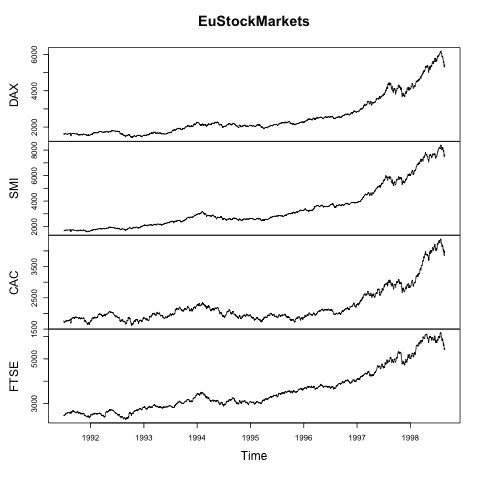

###### 图 3-1\. 时间序列数据的简单绘图。

注意，图像会通过简单的`plot()`命令自动分割成不同的时间序列。事实上，正如这里展示的，我们正在使用一个 R 中的`mts`对象（如果只有一个时间序列，我们将使用一个`ts`对象）：

```
## R
> class(EuStockMarkets)
[1] "mts"    "ts"     "matrix"

```

许多流行的包大量使用`ts`对象和其衍生类。这些对象配备了适当绘图函数的自动调用，正如我们在前面的例子中看到的，一个简单的`plot()`调用创建了一个标记齐全的多面板图。`ts`对象还有一些便利函数：

+   `frequency`用于查找数据的年度频率：

    ```
    ## R
    > frequency(EuStockMarkets)
    [1] 260
    ```

+   `start`和`end`用于找出系列中表示的第一个和最后一个时间：

    ```
    ## R
    > start(EuStockMarkets)
    [1] 1991  130
    > end(EuStockMarkets)
    1] 1998  169

    ```

+   `window`用于获取数据的时间段：

    ```
    ## R
    > window(EuStockMarkets, start = 1997, end = 1998)
    Time Series:
    Start = c(1997, 1)
    End = c(1998, 1)
    Frequency = 260
    	        DAX SMI CAC   FTSE
    1997.000 2844.09 3869.8 2289.6 4092.5
    1997.004 2844.09 3869.8 2289.6 4092.5
    1997.008 2844.09 3869.8 2303.8 4092.5
    ...
    1997.988 4162.92 6115.1 2894.5 5168.3
    1997.992 4055.35 5989.9 2822.9 5020.2
    1997.996 4125.54 6049.3 2869.7 5018.2
    1998.000 4132.79 6044.7 2858.1 5049.8

    ```

`ts`类有其优缺点。如前所述，`ts`及其衍生类在许多时间序列包中被广泛使用。此外，自动设置绘图参数可能会有所帮助。然而，索引有时可能会比较棘手，并且使用`window`访问数据的子段随着时间推移可能会感到不便。在本书中，您将看到多种包含和访问时间序列数据的方法，您可以根据自己的使用情况选择最方便的方式。

## 直方图

让我们继续比较时间序列和非时间序列数据的探索性数据分析。例如，我们想要对数据进行直方图分析，就像大多数探索性数据分析一样。我们通过对差分数据进行直方图分析，引入了一个新的问题，因为我们想要使用我们的时间轴（参见图 3-2）：

```
## R
> hist(     EuStockMarkets[, "SMI"], 30)
> hist(diff(EuStockMarkets[, "SMI"], 30))
```

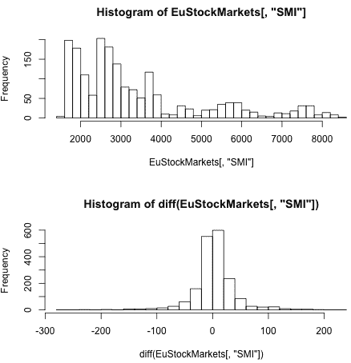

###### 图 3-2\. 未转换数据的直方图（顶部）极其宽阔，不显示正态分布。考虑到底层数据存在趋势，这是可以预料的。我们对数据进行差分以消除趋势，这将使数据转变为更接近正态分布的形式（底部）。

在时间序列的背景下，数据差的`hist()`通常比未转换数据的`hist()`更有趣。毕竟，在时间序列的背景下，通常（特别是在金融领域）最有趣的是一个值如何从一次测量到下一次测量的变化，而不是这个值的实际测量。这在绘图中尤为明显，因为对具有趋势的数据进行直方图统计不会产生非常信息丰富的可视化效果。

注意我们从差分系列的直方图中获得的新信息。虽然前一节中股票的原始图表描绘了股票不断上涨的非常乐观的经济图景，但这个直方图向我们展示了跟随股票的日常体验。差分的直方图告诉我们，时间序列的值随时间既上升（正差分值），又下降（负差分值），而且大致相同。股票指数并没有随时间完全同样的上升和下降，因为我们知道股票指数确实有一个增长趋势。然而，从这个直方图中我们可以看到，稍微偏向正差分而不是负差分正是导致这种趋势的原因。

这是为什么我们在抽样、总结和问数据问题时需要关注时间尺度的一个很好的例子。无论是表现看起来很好（长期图）还是一般般（差分图的直方图），都取决于我们的时间尺度：我们关心日常吗，还是我们有更长期的视角？如果我们在一个以年度盈利为目标的机构工作，我们需要考虑每次向上司报告倾向于负值的“差分”的短期经历。然而，如果我们是一个大型机构投资者——也许是大学或医院——我们可能负担得起采取长期视角，预期上升。后一种情况也有其挑战：我们如何花足够长的时间来最大化利润，但不至于失去机会？这些问题使得金融行业与时间序列研究和预测息息相关。

## 散点图

使用散点图的传统方法对时间序列数据与其他类型的数据同样有用。我们可以使用散点图来确定两只股票在特定时间点的联系以及它们的价格变动如何随时间相关。

在这个例子中，我们绘制了两种情况（见图 3-3）：

+   两只不同股票随时间变化的值

+   这两只股票每日变化的值随时间变化（通过 R 的`diff()`函数进行差分）

```
## R
> plot(     EuStockMarkets[, "SMI"],       EuStockMarkets[, "DAX"])
> plot(`diff`(EuStockMarkets[, "SMI"]), `diff`(EuStockMarkets[, "DAX"]))

```

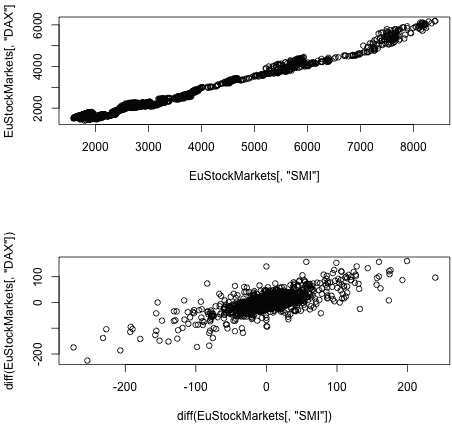

###### 图 3-3\. 两个股票指数的简单散点图显示了强烈的相关性。然而，我们有理由对这些图表持怀疑态度。

正如我们已经看到的，实际值比相邻时间点之间的差异信息更少，因此我们在第二个散点图中绘制了这些差异。这些看起来像是非常强的相关性，但实际关系并不像它们看起来那么强。（要深入了解，请跳到 “伪相关性” 一节。）

图 3-3 中的明显相关性很有趣，但即使它们是真实的相关性（但有理由怀疑它们是否是），这些也不是我们作为股票交易员可以货币化的相关性。当我们知道一只股票是涨还是跌时，与之相关的股票也已经涨或跌，因为我们是在相同时间点的值之间进行相关性分析。我们需要做的是找出一只股票之前的变化是否能预测另一只股票之后的变化。为此，在查看散点图之前，我们将一个股票的差异向后移动 1 步。仔细阅读以下代码；请注意，我们仍在进行差异化处理，但现在我们还在一个差分时间序列上应用了滞后（参见 图 3-4）：

```
## R
> plot(`lag`(diff(EuStockMarkets[, "SMI"]), 1), 
           diff(EuStockMarkets[, "DAX"]))

```

###### 提示

这些代码示例中的代码行易于阅读，因为每个部分都是对齐的。在编写长行的难以阅读的代码时，特别是在像 R 或 Python 这样的函数式编程语言中，这可能是诱人的，但尽量避免！

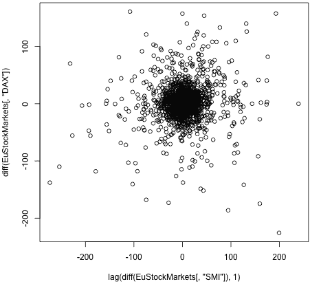

###### 图 3-4。在引入时间滞后后，股票之间的相关性消失了，这表明 SMI 似乎不能预测 DAX。

这个结果告诉我们一些重要的事情：

+   对于时间序列数据，虽然我们可能会使用与非时间序列数据相同的探索技术，但盲目应用是行不通的。我们需要考虑如何利用相同的技术，但应用在重塑后的数据上。

+   往往是不同时间点数据之间的关系或随时间变化的变化最能说明你的数据行为方式。

+   图 3-4 显示了为什么成为股票交易员可能会很困难。如果你是一名被动投资者并且耐心等待，你可能会从长期上升的趋势中受益。然而，如果你试图预测未来，你会发现这并不容易！

###### 警告

R 的 `lag()` 函数可能不会按照你预期的时间方向移动数据。 `lag()` 函数是向前的时间移动。记住这一点很重要，因为在特定用例中，你不会希望将数据移动到错误的时间方向，不同的用例可能需要前向和后向的时间移动。

# 时间序列特定的探索方法

分析时间序列数据的几种方法侧重于同一系列不同时间点的值之间的关系，如果你之前没有处理过时间序列数据，你可能以前没见过这些。在本章的其余部分，我们将介绍一些用于分类时间序列的概念和相关技术。

我们将探讨的概念包括：

稳定性

时间序列平稳的含义及其统计检验

自相关

说一个时间序列与自身相关意味着什么，以及这样的相关性对时间序列底层动态的指示

虚假相关性

一个相关性是虚假的意味着什么，以及你应该预期何时会遇到虚假相关性

我们将学习应用的方法包括：

+   滚动和扩展窗口函数

+   自相关函数

    +   自相关函数

    +   偏自相关函数

我们将按照从稳定性到自相关再到虚假相关性的顺序涵盖这些概念及其相应的方法。在我们深入具体内容之前，让我们讨论一下这种特定顺序背后的逻辑。

你可能会首先询问关于时间序列的一个问题，即它是否表现出反映一个“稳定”的系统还是一个不断变化的系统。稳定性的水平，或*平稳性*，是评估重要的，因为我们需要知道系统的长期过去行为如何反映其长期未来行为。一旦我们评估了时间序列的“稳定性”（这里并非以技术意义使用此词），我们试图确定是否存在该序列的内部动态（例如季节性变化）。也就是说，我们在寻找*自相关*，回答如何预测未来数据的基本问题，无论是远距离还是近距离的过去数据。最后，当我们认为已经找到了系统内部的某些行为动态时，我们需要确保我们不是基于根本不暗示我们希望发现的因果关系的动态来识别关系；因此，我们必须寻找*虚假相关性*。

## 理解稳定性

许多传统的统计时间序列模型依赖于时间序列的平稳性。一般来说，一个平稳的时间序列是指其统计性质随时间变化相对稳定，特别是在均值和方差方面。这看起来相对直观。

尽管如此，稳定性可能是一个棘手的概念，特别是在应用于实时序列数据时。这既太直觉了，也太容易让你依赖自己的直觉。在讨论稳定性的一般测试和如何应用这一概念的实际细节之前，我们将直观地和带有一定正式定义地讨论这个概念。

### 直觉

静止时间序列是指时间序列测量反映系统处于稳定状态。有时很难确定这究竟意味着什么，可以更容易地排除*不*是静止的东西，而不是说某些东西*是*静止的。一个明显的非静止数据的例子是我们在第二章中检查的航空乘客数据集，如图 3-5 中所示（提醒一下，在 R 中可以作为`AirPassengers`使用，并且广泛可供下载）。

有几个特征显示这个过程并不是静止的。首先，均值随时间增长而不是保持稳定。其次，每年的高峰和低谷之间的距离增大，因此过程的方差随时间增加。第三，该过程显示出强烈的季节性行为，与静止相反。

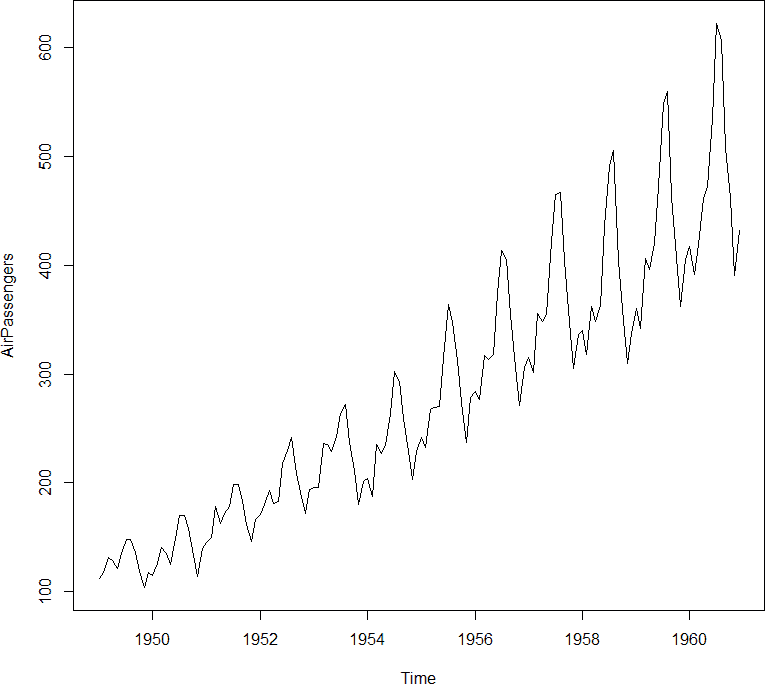

###### 图 3-5\. 航空乘客数据集是一个明显的非静止时间序列的典型示例。随着时间的推移，数据的均值和方差都在变化。我们还看到了季节性的证据，这本质上反映了一个非静止的过程。

### 静止性定义和增广迪基-富勒检验

一个静止过程的简单定义如下：如果对于所有可能的滞后*k*，*y[t]*，*y[t+1]*，...，*y[t+k]*的分布不依赖于*t*，则过程是静止的。

针对静止性的统计检验通常归结为一个问题：过程的特征方程是否存在单位根——即 1 是否是过程特征方程的解。[¹] 如果存在单位根，则线性时间序列是非静止的，尽管缺乏单位根并不证明静止性。解决静止性作为一个一般性问题仍然棘手，确定一个过程是否具有单位根仍然是当前的研究领域。

尽管如此，从随机游走的例子中可以得出单位根的简单直觉：

<math xmlns="http://www.w3.org/1998/Math/MathML"><mrow><msub><mi>y</mi> <mi>t</mi></msub> <mo>=</mo> <mi>ϕ</mi> <mo>×</mo> <msub><mi>y</mi> <mrow><mi>t</mi><mo>-</mo><mn>1</mn></mrow></msub> <mo>+</mo> <msub><mi>e</mi> <mi>t</mi></msub></mrow></math>

在这个过程中，给定时间点上的时间序列值是其前一个时间点值和一些随机误差的函数。如果*ϕ*等于 1，该序列具有单位根，将“逃跑”，并且不会是静止的。有趣的是，序列不是静止的并不意味着它必须具有趋势。随机游走是一个非静止时间序列的良好示例，没有潜在趋势。[²]

用于确定过程是否平稳的检验被称为*假设检验*。增广迪基-富勒（ADF）检验是评估时间序列平稳性问题最常用的指标。该检验提出一个空假设，即时间序列中存在单位根。根据检验结果，可以在指定的显著性水平上拒绝该空假设，这意味着在给定显著性水平下可以拒绝单位根的存在。

请注意，平稳性检验侧重于系列的均值是否变化。方差通过变换而非正式检验来处理。因此，系列是否平稳的测试实际上是对系列是否集成的测试。阶数为*d*的集成系列是一种必须差分*d*次才能变得平稳的系列。

迪基-富勒检验的框架如下：

<math xmlns="http://www.w3.org/1998/Math/MathML"><mrow><mi>Δ</mi> <msub><mi>y</mi> <mi>t</mi></msub> <mo>=</mo> <msub><mi>y</mi> <mi>t</mi></msub> <mtext>–</mtext> <msub><mi>y</mi> <mrow><mi>t</mi><mo>-</mo><mn>1</mn></mrow></msub> <mo>=</mo> <mrow><mo>(</mo> <mi>ϕ</mi> <mtext>–</mtext> <mn>1</mn> <mo>)</mo></mrow> <mo>×</mo> <msub><mi>y</mi> <mrow><mi>t</mi><mo>-</mo><mn>1</mn></mrow></msub> <mo>+</mo> <msub><mi>ϵ</mi> <mi>t</mi></msub></mrow></math>

然后，测试*ϕ* = 1 是否一个简单的*t*检验，检验滞后*y[t–1]*上的参数是否等于 0。ADF 检验的不同之处在于考虑更多的滞后，使得底层模型考虑更高阶的动态效应，可以写成一系列差分滞后：

<math xmlns="http://www.w3.org/1998/Math/MathML"><mrow><msub><mi>Y</mi> <mi>t</mi></msub> <mtext>–</mtext> <msub><mi>ϕ</mi> <mn>1</mn></msub> <mo>×</mo> <msub><mi>y</mi> <mrow><mi>t</mi><mo>-</mo><mn>1</mn></mrow></msub> <mtext>–</mtext> <msub><mi>ϕ</mi> <mn>2</mn></msub> <mo>×</mo> <msub><mi>y</mi> <mrow><mi>t</mi><mo>-</mo><mn>2</mn></mrow></msub> <mo>.</mo> <mo>.</mo> <mo>.</mo> <mo>=</mo> <msub><mi>ϵ</mi> <mi>t</mi></msub></mrow></math>

这需要更多的代数来写成一系列差分滞后，并且用于测试空假设的期望分布与原始迪基-富勒检验有所不同。ADF 检验是时间序列文献中最广泛展示的平稳性检验。

不幸的是，由于多种原因，这些检验远非你解决平稳性问题的灵丹妙药：

+   这些检验在区分*接近*单位根和单位根方面的能力较低。

+   样本量较小时，单位根的假阳性相当普遍。

+   大多数检验不会针对所有可能导致非平稳时间序列的问题进行测试。例如，有些测试专门测试系列的均值或方差（但不是两者都）。其他测试则更广泛地检查整体分布。在使用时，理解所应用测试的限制并确保这些限制与您对数据的信念一致至关重要。

# 设定替代空假设：KPSS 检验

虽然 ADF 检验假设存在单位根的空假设，但 Kwiatkowski-Phillips-Schmidt-Shin（KPSS）检验假设一个平稳过程的空假设。与 ADF 不同，KPSS 不在基础 R 中可用，但仍然广泛实施。关于这些检验的用途和正确使用方式存在一些细微差别；这些内容超出本文范围，但在[网络上广泛讨论](https://perma.cc/D3F2-TATY)。

### 在实践中

在实践中，平稳性对多种原因至关重要。首先，大量模型假设一个平稳过程，如具有已知强度和统计模型的传统模型。我们将在第六章中涵盖这些模型类。

更广义的一点是，非平稳时间序列模型在时间序列的度量指标变化时精度也会变化。也就是说，如果你正在寻找一个模型来帮助你估计一个具有非平稳均值和方差的时间序列的均值，那么你的模型中的偏差和误差将随时间变化，此时你的模型的价值变得值得怀疑。

通常情况下，一个时间序列可以通过几个简单的变换使其足够平稳。对数变换和平方根变换是两种流行的选择，特别是在时间上变化方差的情况下。同样地，通过差分来去除趋势是最常见的做法。有时候一个序列必须进行多次差分。然而，如果你发现自己进行了过多的差分（超过两三次），那么用差分来解决你的平稳性问题是不太可能的。

# 对数还是平方根？

虽然平方根通常比对数计算复杂性低，但你应该探索两种选择。考虑你的数据范围以及你希望如何压缩大值，而不是过早优化（即过度悲观化）你的代码和分析。

平稳性不是预测模型所做的唯一假设。另一个常见但不同的假设是输入变量或预测变量的正态分布。在这种情况下，可能需要其他变换。一个常见的变换是 Box Cox 变换，在 R 的`forecast`包和 Python 的`scipy.stats`中实现。该变换使非正态分布的数据（偏斜数据）更接近正态分布。然而，仅仅因为你可以对数据进行变换并不意味着你应该这样做。在转换之前，请仔细考虑原始数据集中数据点之间距离的含义，并确保无论任务如何，变换都能保留最重要的信息。

## 应用窗口函数

让我们回顾一下最重要的时间序列探索图表，这些图表可能在大多数初始时间序列分析中使用。

### 滚动窗口

一个特定于时间序列的常见函数是窗口函数，它是任何一种在聚合数据时压缩数据（正如我们在上一章中看到的下采样的情况）或平滑数据（也在第二章中讨论过）的函数。除了已经讨论过的应用外，平滑数据和窗口聚合数据可用于信息丰富的探索性可视化。

我们可以使用基于 R 的`filter()`函数计算移动平均线和其他涉及一系列点的线性函数的计算，如下所示：

```
## R
> ## calculate a rolling average using the base R
> ## filter function
> x  <- rnorm(n = 100, mean = 0, sd = 10) + 1:100
> mn <- function(n) rep(1/n, n)

> plot(x, type = 'l',               lwd = 1)
> lines(filter(x, mn( 5)), col = 2, lwd = 3, lty = 2)
> lines(filter(x, mn(50)), col = 3, lwd = 3, lty = 3)

```

此代码生成了图表图 3-6。

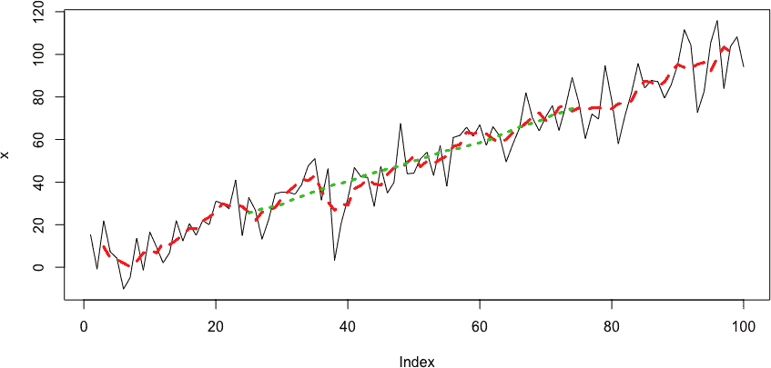

###### 图 3-6\. 通过滚动均值平滑生成的两条探索曲线。我们可以使用这些曲线来寻找特别嘈杂数据中的趋势，或者决定哪些线性行为偏离是有趣的研究对象，而哪些可能只是噪音。

如果我们在寻找不是窗口中所有点的线性组合的函数，则无法使用`filter()`，因为它依赖于数据的线性变换。但是，我们可以使用`zoo`。`zoo`包中的`rollapply()`函数非常方便（见图 3-7）：

```
## R
> ## you can also do more 'custom' functionality
> require(zoo)

> f1 <- rollapply(zoo(x), 20, function(w) min(w), 
>                align = "left",  partial = TRUE)
> f2 <- rollapply(zoo(x), 20, function(w) min(w), 
>                align = "right", partial = TRUE)

> plot (x,           lwd = 1,         type = 'l')
> lines(f1, col = 2, lwd = 3, lty = 2)
> lines(f2, col = 3, lwd = 3, lty = 3)

```

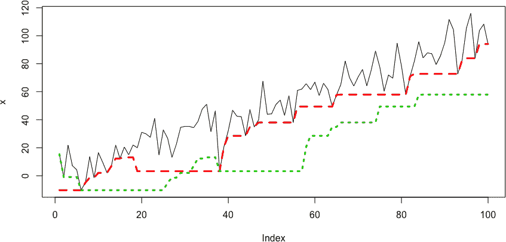

###### 图 3-7\. 滚动窗口最小值，左对齐（长划线）或右对齐（短划线）。左对齐可以看到未来的事件，而右对齐只能看到过去的事件。这一点很重要，避免了预先看看。然而，有时左对齐可以用来提出探索性问题，比如“如果我事先知道这个，那么它会有用吗？”有时即使预先看也不具信息性，这意味着特定变量不具信息性。当了解一个度量的未来对于帮助无济于事时，在时间序列的任何时间中，这个度量可能都不是有用的度量。

###### 警告

在`zoo`函数中使用`zoo`对象。如果直接将数值向量传递给`rollapply()`，则`align`参数将不会生效。您可以通过删除前面代码中对`x`的`zoo()`包装来确认这一点。您会发现这两条曲线是相同的，实际上这是一个悄无声息的失败，在时间序列分析中尤为危险，因为它可能引入意外的预看。这正是为什么您需要经常进行理性检查的例子，即使在探索性数据分析中也是如此。不幸的是，悄无声息的失败在许多流行的 R 包和其他脚本语言中并不罕见，因此保持警惕！

也有可能“自己动手”实现这种功能，这样做可以限制依赖。在这种情况下，我强烈建议从现有广泛使用的包（例如`zoo`）的[源代码](https://perma.cc/5LTP-Q45T)开始。因为即使对于单变量时间序列，也有许多意外情况需要考虑，比如如何处理`NA`以及如何处理系列的开始和结束，这些地方点数可能少于窗口指定的大小。

### 扩展窗口

扩展窗口在时间序列分析中使用较少，与滚动窗口相比，因其适用范围更为有限。扩展窗口仅在你估计一个稳定过程而非随时间演变或振荡显著的总结统计量时才有意义。扩展窗口从给定的最小尺寸开始，但随着时间序列的进行，窗口会逐渐扩展，包括直到特定时间的每个数据点，而不是保持一个有限且恒定的大小。

扩展窗口在随时间推移中提供了对测试统计量更大的确定性，使您能够从深入到特定时间序列中受益。但是，它仅在您假设您的基础系统是静止的情况下才有效。它可以帮助您保持“在线”摘要统计，就像在收集更多信息时实时估计它们一样。

如果您查看基础 R，您会意识到许多函数已存在作为扩展窗口的实现，例如`cummax`和`cummin`。您还可以轻松重新使用`cumsum`来创建累积均值。在下图中，我们展示了扩展窗口`max`和扩展窗口`mean`（参见图 3-8）：

```
## R
> # expanding windows
> plot(x, type = 'l', lwd = 1)
> lines(cummax(x),             col = 2, lwd = 3, lty = 2) # max
> lines(cumsum(x)/1:length(x), col = 3, lwd = 3, lty = 3) # mean

```

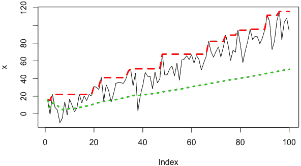

###### 图 3-8\. 扩展窗口“max”（长划线）和扩展窗口“mean”（短划线）。使用扩展窗口意味着最大值始终反映到那时的全局最大值，使其成为单调函数。由于扩展窗口的长“记忆”，扩展窗口均值比滚动均值低（参见图 3-7），因为扩展均值中的基础趋势不那么显著。这是好是坏还是中立，取决于我们的假设和对基础系统的知识。

如果您需要带有滚动窗口的自定义函数，您可以使用`rollapply()`，就像我们为滚动窗口所做的那样。在这种情况下，您需要指定一系列窗口大小而不是单个标量。运行以下代码将生成与图 3-8 相同的图，但这次是使用`rollapply()`而不是内置 R 函数创建的：

```
## R
> plot(x, type = 'l', lwd = 1)
> lines(rollapply(zoo(x), seq_along(x), function(w) max(w), 
>                         partial = TRUE, align = "right"), 
>          col = 2, lwd = 3, lty = 2)
> lines(rollapply(zoo(x), seq_along(x), function(w) mean(w), 
>                         partial = TRUE, align = "right"), 
>          col = 3, lwd = 3, lty = 3)

```

### 自定义滚动函数

我们只关心是否有可能应用自定义滚动函数。在实践中，这是您在分析已知具有已知基本行为规律或必要用于正确分析的有用启发式的时间序列领域时可能看到的内容。

例如，我们可能正在查看包含特定特征的窗口，这在领域知识的基础上具有信息意义。我们可能希望知道我们处于*单调*（比如，血糖上升）还是上下波动的情况，这表明是仪器噪声而不是趋势。我们可以为这种情况编写自定义函数，并使用移动或扩展窗口应用它。

## 理解和识别自相关

在其最基本的层面上，时间序列的自相关是指时间序列中的一个值在某一时间点可能与另一个时间点的值相关。请注意，“自相关”在此处是非正式使用，用于描述一个概念而非技术性描述。

举个自相关的例子，如果您拿年度时间序列的每日温度数据来说，您可能会发现，将每年的 5 月 15 日与每年的 8 月 15 日进行比较，会得到一些相关性，例如较热的 5 月 15 日倾向于与较热的 8 月 15 日相关联（或者倾向于与较冷的 8 月 15 日相关联）。这可能让您觉得已经学到了关于温度系统的潜在有趣事实，表明存在一定的长期可预测性。另一方面，您可能会发现相关性接近于零，这种情况下，您也会发现一些有趣的事实，即仅仅知道 5 月 15 日的温度并不能为您提供关于 8 月 15 日温度范围的任何信息。这就是自相关在轶事中的要点。

从这个简单的例子出发，我们将扩展到自相关，它通过不锚定到特定时间点来推广自相关。特别是，自相关提出了更一般的问题，即在特定时间序列中，任意两个点之间是否存在固定距离的相关性。接下来我们将更详细地讨论这一点，以及对偏自相关的最终阐述。

### 自相关函数

我们从[Wikipedia](https://perma.cc/U8JY-QD7U)对自相关的优秀定义开始：

> 自相关，也称为串行相关，是信号与延迟副本之间的相关性，其延迟作为延迟函数。非正式地说，它是观察之间的相似性，作为它们之间时间滞后的函数。

让我们用更简单的英语来解释一下。自相关告诉您不同时间点的数据点如何作为它们时间差的函数而线性相关。

*自相关函数*（ACF）可以通过绘图直观理解。我们可以在 R 中轻松绘制它（参见图 3-9）：

```
## R
> x <- 1:100
> y <- sin(x × pi /3)
> plot(y, type = "b")
> acf(y)

```

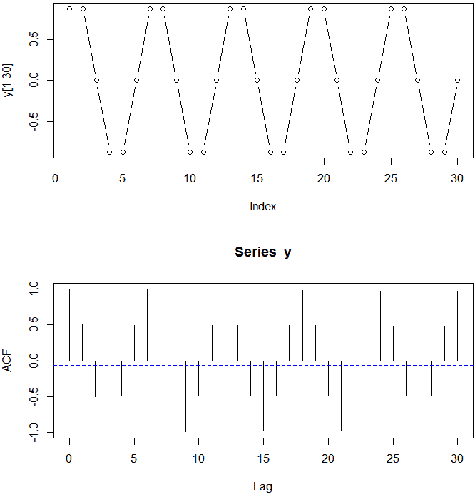

###### 图 3-9\. 正弦函数及其自相关函数的绘图。

从 ACF 中，我们可以看到，时间滞后为 0 的点之间的相关性为 1（对于每个时间序列都是如此），而滞后 1 的点之间的相关性为 0.5。滞后 2 的点之间的相关性为–0.5，依此类推。

计算 ACF 非常简单。我们可以使用`data.table`的`shift()`函数自己做到这一点：

```
## R
> cor(y, shift(y, 1), use = "pairwise.complete.obs")
[1] 0.5000015
> cor(y, shift(y, 2), use = "pairwise.complete.obs")
[1] -0.5003747

```

我们的计算与图 3-9 中的图形结果大致匹配。虽然可以使用自定义代码直接计算 ACF，但通常最好使用预先定义的版本，例如 R 的`acf`函数。这样做有几个优点：

+   自动绘图与有用的标签

+   通常但并非总是合理的最大滞后数，以及可以覆盖此最大值的选项

+   处理多变量时间序列的一个优雅方法

就数学角度而言，关于 ACF 有几个重要事实：

+   周期函数的 ACF 具有与原始过程相同的周期性。 您可以在前述正弦示例图中看到这一点。

+   周期函数的总和的自相关是每个函数单独自相关的总和。 您可以使用一些简单的代码轻松地制定一个示例。

+   所有时间序列在滞后 0 处的自相关系数为 1。

+   白噪声样本的自相关在除了 0 之外的所有滞后处大约为 0。

+   ACF 关于负滞后和正滞后对称，因此只需明确考虑正滞后。您可以尝试绘制手动计算的 ACF 来证明这一点。

+   确定显著非零 ACF 估计的统计规则由“临界区域”给出，其边界为+/–1.96 × sqrt(*n*)。 此规则依赖于足够大的样本量和过程的有限方差。

### **偏自相关函数**

偏自相关函数（PACF）比 ACF 更难理解。给定滞后的时间序列的偏自相关是在两个时间点之间的所有信息下，时间序列与其自身在该滞后处的偏相关。

在这里点头表示认同听起来很合理。但是，准确来说，什么是在两个时间点之间考虑信息？这意味着您需要计算多个条件相关并从总相关中减去这些。计算 PACF 并非易事，并且有多种估计方法。我们这里不讨论这些，但您可以在相关的 R 和 Python 文档中找到讨论。

PACF 在图形上比概念上更容易理解。 它在图表中的实用性也比讨论中更为明显（见图 3-10）：

```
## R
> y <- sin(x × pi /3)
> plot(y[1:30], type = "b")
> pacf(y)

```

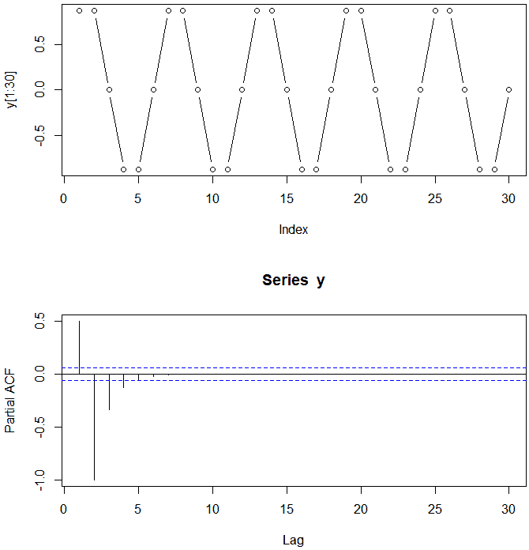

###### 图 3-10。 季节性无噪声过程的绘图和 PACF。

对于正弦级数的情况，PACF 与 ACF 形成鲜明对比。 PACF 显示哪些数据点是信息丰富的，哪些是较短时间周期的谐波。

对于季节性且无噪声的过程，如正弦函数，以周期 T 为周期，将在 T、2T、3T 等处看到相同的 ACF 值，直到无限大。 ACF 未能消除这些冗余相关性。 另一方面，PACF 显示了哪些相关性是特定滞后的“真实”信息相关性，而不是冗余性。 这对于知道我们何时收集了足够的信息以获得足够长的窗口在数据的适当时间尺度上是非常宝贵的。

PACF 的临界区域与 ACF 相同。 临界区域在<math xmlns="http://www.w3.org/1998/Math/MathML"><mrow><mo>±</mo> <mn>1</mn> <mo>.</mo> <mn>96</mn> <msqrt><mi>n</mi></msqrt></mrow></math>处有界。 任何计算的 PACF 值落在临界区域内的滞后实际上为零。

到目前为止，我们只看了完全无噪声的单频过程示例。现在我们看一个稍微复杂的例子。我们将考虑无噪声、低噪声和高噪声条件下两个正弦曲线的求和。

首先，让我们查看无噪声的情况下各自的图表（见图 3-11）：

```
## R
> y1 <- sin(x × pi /3)
> plot(y1, type = "b")
> acf (y1)
> pacf(y1)

> y2 <- sin(x × pi /10)
> plot(y2, type = "b")
> acf (y2)
> pacf(y2)

```

###### 提示

静止数据的自相关函数（ACF）应快速下降至零。对于非静止数据，滞后 1 的值为正且较大。

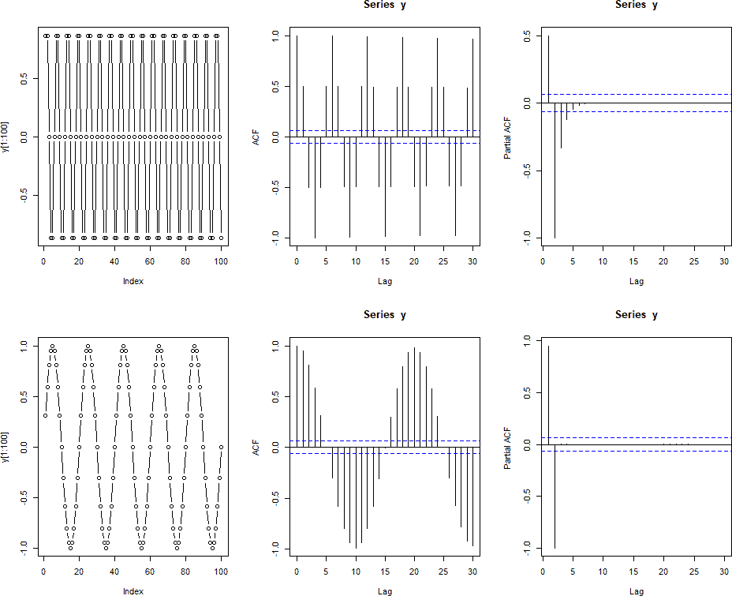

###### 图 3-11\. 两个正弦函数、它们的自相关函数（ACF）和偏自相关函数（PACF）的图表。

我们通过求和来结合这两个系列，并为求和系列创建相同的图表（见图 3-12）：

```
## R
> y <- y1 + y2
> plot(y, type = "b")
> acf (y)
> pacf(y)

```

正如我们所见，我们的 ACF 图与前述特性一致；两个周期系列的求和的 ACF 是各自 ACF 的和。您可以通过注意到 ACF 的正→负→正→负部分来清楚地看到这一点，这些部分与更慢振荡的 ACF 相关。在这些波浪中，您可以看到更高频 ACF 的快速波动。

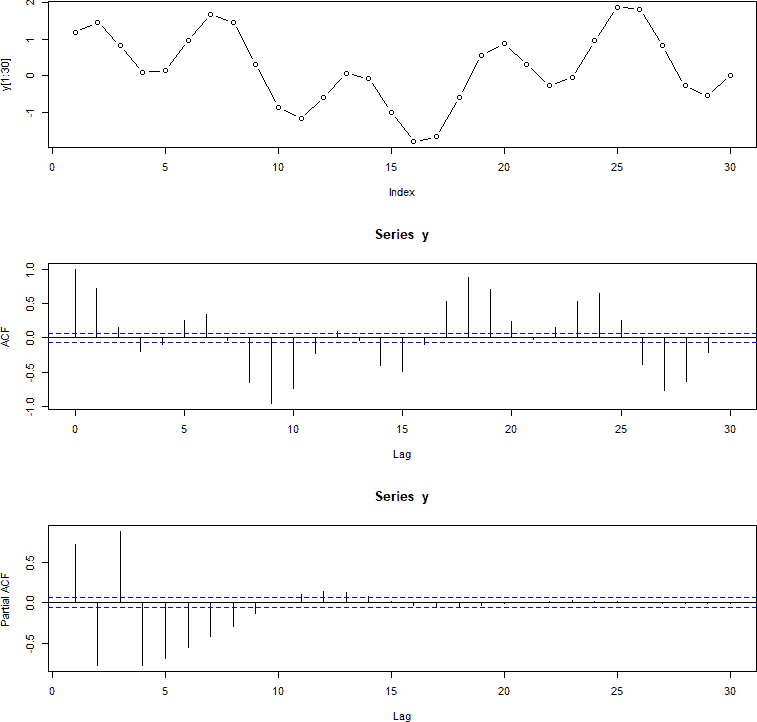

###### 图 3-12\. 两个正弦系列的求和的图表、自相关函数（ACF）和偏自相关函数（PACF）。

PACF 不是各个分量的 PACF 函数的简单求和。一旦计算出来，PACF 就足够简单理解，但生成或预测起来并不容易。该 PACF 表明，与原始系列中的任一点相比，分离由某个滞后分隔的点的相关性，考虑它们之间点的值时，在求和系列中更具信息性。这与系列的两个不同周期有关，这导致给定点不太由相邻点的值确定，因为现在两个周期的振荡在不同频率下继续。

让我们看看相同情况，但带有更多噪音（见图 3-13）：

```
## R
> noise1 <- rnorm(100, sd = 0.05)
> noise2 <- rnorm(100, sd = 0.05)

> y1 <- y1 + noise1
> y2 <- y2 + noise2
> y  <- y1 + y2

> plot(y1, type = 'b')
> acf (y1)
> pacf(y1)

> plot(y2, type = 'b')
> acf (y2)
> pacf(y2)

> plot(y, type = 'b')
> acf (y)
> pacf(y)

```

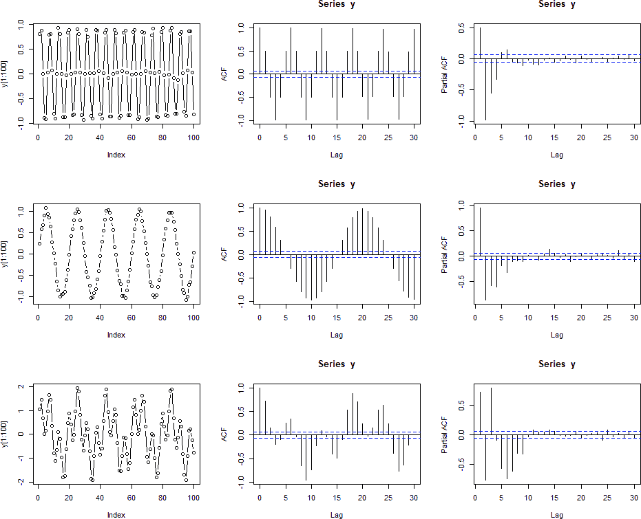

###### 图 3-13\. 两个带有噪声的正弦过程及其求和的图表、自相关函数（ACF）和偏自相关函数（PACF）。

最后，我们给时间序列添加更多噪声，使得初始数据本身甚至不看起来特别像正弦波。 （我们省略了代码示例，因为它与前一个示例相同，只是`rnorm`的`sd`参数更大。）我们可以看到，这增加了进一步的解释困难，特别是对 PACF。图 3-14 中的图与之前的图唯一的区别是噪声变量的`sd`值更大。

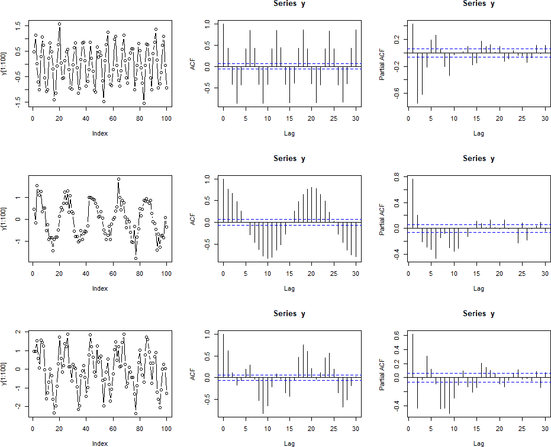

###### 图 3-14\. 两个正弦过程非常嘈杂的求和的图表、自相关函数（ACF）和偏自相关函数（PACF）。

让我们以一个真实数据集的 ACF 和 PACF 来总结。在下面，我们检查`AirPassengers`数据。根据我们到目前为止看到的内容，思考一下为什么 ACF 有这么多“关键”值（答案：它有趋势），以及为什么 PACF 对于一个大滞后有关键值（答案：年度季节循环，即使数据中有趋势也是可以识别的）。

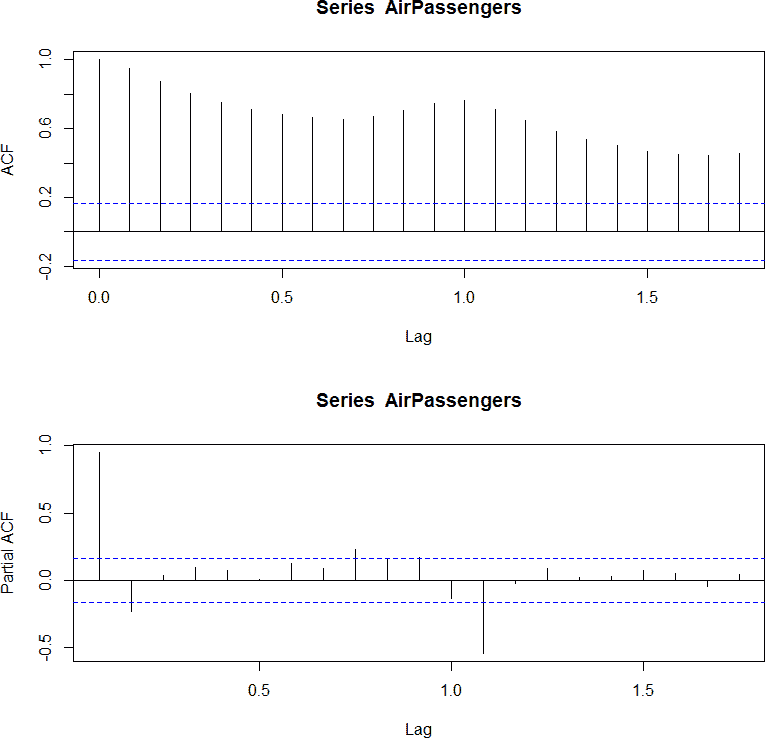

###### 图 3-16\. 对 AirPassengers 数据的自相关函数（ACF）和偏自相关函数（PACF）绘图。这里的滞后值不是单位数字，因为滞后以年的分数形式表示。这是因为 AirPassengers 数据集采用了一个 ts 对象的形式，该对象具有内置频率用于绘图（及其他目的）。

## 伪相关性

那些刚接触时间序列分析的人通常会从标准的探索性数据实践开始，例如将两个变量绘图并计算它们的相关性。新的分析师在数据探索过程的早期会非常兴奋，当他们注意到一个看似非常强的相关性和有益的关系时。他们会继续寻找其他令人惊讶的高相关性；多么令人惊叹的系统！他们会希望自己早些在职业生涯中开始处理时间序列数据。他们会对自己想：“我只是赢了。”

然后分析师将会稍微阅读一下时间序列分析（最佳情况），或者将他们的发现展示给其他人，并意识到并不是所有事情都说得通（并非最佳情况）。一个怀疑论者会指出，相关性太高了。似乎任何两个值都有关联。当分析师使用其他变量集重新运行分析时，会出现更多问题，并发现它们也有令人惊讶的高相关性。在某个时候，会清楚地意识到不可能有这么多真正的高相关性。

这一轨迹与计量经济学早期历史非常相似。19 世纪，当经济学家首次开始思考商业周期的概念时，其中一些人寻找了周期的外部驱动因素，比如太阳黑子（一个 11 年周期）或各种气象周期（比如假设的 4 年降水周期）。他们总是得到非常积极且强相关的结果，即使他们没有因果假设来解释这些结果。

许多经济学家和统计学家对此持怀疑态度，这是正当的。乌德尼·尤尔（Udny Yule）通过一篇题为[“为什么有时我们会得到无意义的相关性？”](https://www.jstor.org/stable/2341482)的论文正式调查了这个问题，从而开创了一个研究领域，并继续为学术界带来麻烦和乐趣。虚假相关性仍然是一个需要警惕的重要问题，在诉讼情境中尤为热议，其中一方断言存在关联，而另一方试图驳斥。类似地，一种质疑气候变化数据的尝试依赖于一个论点，即增加的碳排放和全球变暖之间的相关性是由两个数据集的趋势造成的虚假相关性（我认为这一论点并不令人信服）。

经济学家经过时间的学习已经了解到，具有基础趋势的数据可能会产生虚假相关性。以下是一个简单的思考方式：趋势时间序列中包含的信息比静止时间序列中的信息更多，因此数据点之间有更多的机会同时变动。

除了趋势之外，时间序列的一些其他常见特征也可能引入虚假相关性：

+   季节性——例如，考虑热狗消费与溺水死亡之间的虚假相关性（夏季）。

+   数据由于时间的制度变化而产生的水平或斜率变化（产生类似哑铃形的分布，其中高相关性毫无意义）。

+   累积求和数量（这是某些行业用来使模型或相关性看起来比实际更好的技巧）。

有一个众所周知的博客（现在也有一本书），充满了关于虚假相关性的精彩例子，我在图 3-17 中分享了其中一个。每当您试图认为您发现了一个特别强的关系时，请务必检查数据是否存在明显的问题原因，比如趋势。

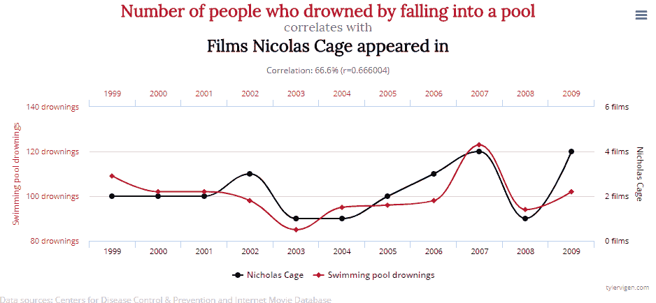

###### 图 3-17。一些虚假相关性看起来出奇地令人信服。此图摘自[Tyler Vigen 的网站](https://perma.cc/6UYH-FPBX)，展示了虚假相关性。

# 一些有用的可视化

图表对于时间序列的彻底探索性分析至关重要。您肯定希望通过时间轴来可视化数据，最好以一种能够回答数据集中您关心的一般问题的方式，比如特定变量的行为或数据点的整体时间分布。

本章早些时候，我们探讨了一些对任何数据分析师都很熟悉的绘图技术，例如根据时间绘制值的图表或随时间散点绘制不同列的值的图表。在探索性数据分析的最后一节中，我们讨论了几种特别有助于提供关于时间序列行为的新见解的可视化方法。

我们将看一些复杂程度不同的可视化：

+   一维可视化，以理解我们在第二章中组装的时间序列的整体时间分布

+   一个二维直方图，用于理解在许多并行测量（例如测量许多年或同一现象的许多时间序列）的情况下，值随时间的典型轨迹。

+   三维可视化中，时间可以占据多达两个维度或一个维度，但仍然可以隐含地存在

## 一维可视化

在许多单位测量的情况下（许多用户、成员等），我们并行考虑多个时间序列。在视觉上堆叠这些序列可能会很有趣，强调个体分析单位及其各自的时间框架。我们忽略测量的值，而是将数据存在的时间范围视为感兴趣的信息。时间跨度本身成为分析单位。在这里，我们使用了 R 语言的`timevis`包，但还有许多其他选择。我们查看了我们在第二章中准备的`donations`数据的一个小子集（参见图 3-18）：

```
## R
> require(timevis)
> donations <- fread("donations.csv")
> d         <- donations[, .(min(timestamp), max(timestamp)), user]
> names(d)  <- c("content", "start", "end")
> d         <- d[start != end]
> timevis(d[sample(1:nrow(d), 20)])

```

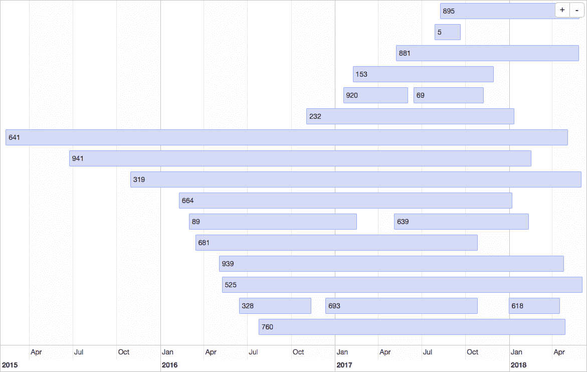

###### 图 3-18\. 一个随机样本的甘特图可以提供一些关于用户/捐赠者“活跃”时间段分布的想法。

图 3-18 中的图表帮助我们看到，全球会员群体可能有“繁忙”的时期。我们还从中获得了一些关于会员组织中个体捐赠时间跨度分布的感觉。

甘特图已经被使用了一个多世纪，最常见的是用于项目管理任务。它们在许多不同的行业中独立产生，一旦看到它们，这个概念就显而易见。尽管起源于项目管理，甘特图在时间序列分析中也很有用，其中有许多独立的参与者，而不是单一的过程被测量。图 3-18 中的图形迅速回答了我关于整个用户群体在捐赠历史上的重叠程度的问题，这是我在仅仅阅读表格数据时发现很难理解的分布。

## 二维可视化

现在我们将使用`AirPassengers`数据来查看季节性和趋势，但我们不应将时间视为线性。特别是，时间可以在多个轴上发生。当然，有从一天到另一天和一年到另一年的时间轴，但我们也可以考虑将时间布置在一天中的小时轴或一周中的日期轴上等等。通过这种方式，我们可以更容易地思考季节性，例如某些行为发生在一天的特定时间或一年中的特定月份。我们特别关注如何以季节方式理解我们的数据，而不仅仅是根据线性、时间顺序的可视化。

我们从`AirPassengers`的`ts`对象中提取数据，并将其放入适当的矩阵形式中：

```
## R
> t(matrix(AirPassengers, nrow = 12, ncol = 12))
     [,1] [,2] [,3] [,4] [,5] [,6] [,7] [,8] [,9] [,10] [,11] [,12]
[1,]   112 118  132 129 121  135 148 148 136   119 104 118
[2,]   115 126  141 135 125  149 170 170 158   133 114 140
[3,]   145 150  178 163 172  178 199 199 184   162 146 166
[4,]   171 180  193 181 183  218 230 242 209   191 172 194
[5,]   196 196  236 235 229  243 264 272 237   211 180 201
[6,]   204 188  235 227 234  264 302 293 259   229 203 229
[7,]   242 233  267 269 270  315 364 347 312   274 237 278
[8,]   284 277  317 313 318  374 413 405 355   306 271 306
[9,]   315 301  356 348 355  422 465 467 404   347 305 336
[10,]  340 318  362 348 363  435 491 505 404   359 310 337
[11,]  360 342  406 396 420  472 548 559 463   407 362 405
[12,]  417 391  419 461 472  535 622 606 508   461 390 432
```

注意，我们必须对数据进行转置，以使其与`ts`对象呈现的方式一致。

# 列优先与行优先

R 默认是[column major](https://perma.cc/L4BH-DKB8)，这与 Python 的`NumPy`（row major）以及大多数 SQL 数据库不同。了解给定语言中默认和可用的行为是有益的，这不仅仅是为了展示目的，还要考虑如何有效地管理和访问内存。

我们在反映一年中月份进展的一组轴上绘制每年的曲线（见图 3-19）：

```
## R
> colors <- c("green",  "red",         "pink",   "blue",
>               "yellow","lightsalmon", "black",  "gray",
>               "cyan",  "lightblue",   "maroon", "purple")
> matplot(matrix(AirPassengers, nrow = 12, ncol = 12), 
>           type = 'l', col = colors,  lty = 1, lwd = 2.5, 
>           xaxt = "n", ylab = "Passenger Count")
> legend("topleft", legend = 1949:1960, lty = 1, lwd = 2.5, 
>          col = colors)
> axis(1, at = 1:12, labels = c("Jan", "Feb", "Mar", "Apr", 
>                               "May", "Jun", "Jul", "Aug", 
>                               "Sep", "Oct", "Nov", "Dec"))

```

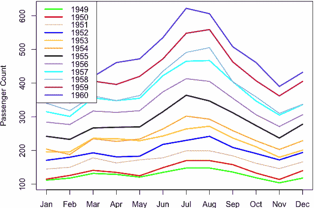

###### 图 3-19\. 按年份和月份计算的每月计数。⁴

使用`forecast`包可以更轻松地生成相同的图表（见图 3-20）：

```
## R
> require(forecast)
> seasonplot(AirPassengers)

```

x 轴是每年的月份。每年，航空公司乘客数量在七月或八月（第 7 和 8 月）达到峰值。大多数年份，三月（第 3 月）也有局部高峰。因此，该图可以显示更多关于季节性行为的细节。

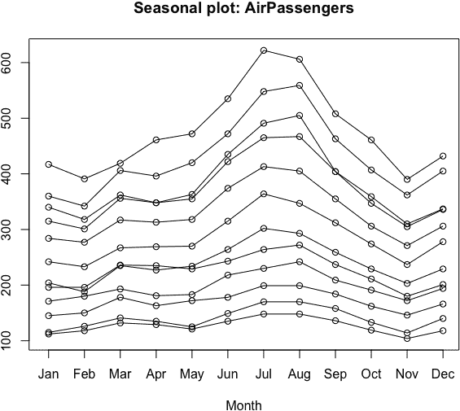

###### 图 3-20\. 使用 seasonplot()函数更轻松地生成类似的季节性图表。

不同年份的曲线很少交叉。增长非常强劲，几乎不可能在同一月份不同年份有相同数量的乘客。有一些例外情况，但在高峰月份并不多见。仅凭这些观察，我们就可以为航空公司提供建议，帮助其做出关于如何规划增长的决策。

更少标准但同样有用的按年份排列的每月曲线的备选图（见图 3-21）：

```
## R
> months <- c("Jan", "Feb", "Mar", "Apr", "May", "Jun", 
>            "Jul", "Aug", "Sep", "Oct", "Nov", "Dec")

> matplot(t(matrix(AirPassengers, nrow = 12, ncol = 12)), 
>             type = 'l', col = colors, lty = 1, lwd = 2.5)
> legend("left", legend = months,  
>                         col = colors, lty = 1, lwd = 2.5)

```

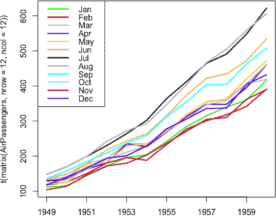

###### 图 3-21\. 按年份计算的每月曲线的时间序列。⁵

多年来，增长趋势正在加速，即增长率本身在增加。此外，七月和八月两个月增长速度比其他月份快。使用`forecast`包提供的简易可视化函数，我们可以获得类似的可视化和洞察（见图 3-22）：

```
## R
> monthplot(AirPassengers)

```

我们可以从这些图表中得出两个一般性观察：

+   时间序列有多个有用的时间轴可以绘制。我们使用了一年中每个月份（一月到十二月）的轴和数据集年份（第一年至最后/第十二年）的轴。

+   我们可以从堆叠时间序列数据的可视化中获取大量有用的信息和预测细节。

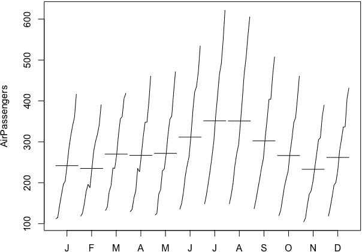

###### 图 3-22\. 通过使用 monthplot()函数，我们可以看到每月性能随着年份的变化如何变化。

接下来我们考虑一个适当的二维直方图。在时间序列的背景下，我们可以将二维直方图看作一个轴表示时间（或时间的代理）和另一个轴表示兴趣单位。我们刚刚做的“堆叠”图已经在成为二维直方图的路上，但需要一些改变：

+   我们需要在时间轴和乘客数量上对数据进行分箱。

+   我们需要更多数据。在堆叠曲线相互交错之前，二维直方图没有意义；它们不能单独被正确地看到。否则，二维直方图无法传达任何额外的信息。

我们在这个小数据集上生成了二维直方图作为示例，然后转向更有意义的示例。我们从头开始构建我们自己的二维直方图函数，如下所示：

```
## R
> hist2d <- function(data, nbins.y, xlabels) {
>   ## we make ybins evenly spaced to include 
>   ## minimum and maximum points
>   ymin = min(data)
>   ymax = max(data) × 1.0001 
>   ## the lazy way out to avoid worrying about inclusion/exclusion

>   ybins = seq(from = ymin, to = ymax, length.out = nbins.y + 1 )

>   ## make a zero matrix of the appropriate size
>   hist.matrix = matrix(0, nrow = nbins.y, ncol = ncol(data))

>   ## data comes in matrix form where each row 
>   ## represents one data point
>   for (i in 1:nrow(data)) {
>       ts = findInterval(data[i, ], ybins)
>       for (j in 1:ncol(data)) {
>         hist.matrix[ts[j], j] = hist.matrix[ts[j], j] + 1
>       }
>   }              
>   hist.matrix
> }

```

我们制作了一个带有热力图着色的直方图，如下所示：

```
## R
> h = hist2d(t(matrix(AirPassengers, nrow = 12, ncol = 12)), 5, months)
> image(1:ncol(h), 1:nrow(h), t(h), col = heat.colors(5),
>      axes = FALSE, xlab = "Time", ylab = "Passenger Count")
```

然而，得到的图像（图 3-23）并不是很令人满意。

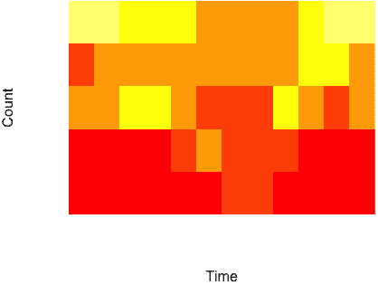

###### 图 3-23\. 我们自制的 AirPassengers 数据的二维直方图热力图。

这个图表是无用的，因为数据不足。我们只有 12 条曲线，并将它们分成 5 个桶。然而，更重要的问题是我们没有稳态数据。直方图的使用假设数据集是稳态的。在这种情况下，存在趋势，因此尽管我们想看到季节性，但趋势必然会妨碍。

现在我们来看一个样本数更多且没有趋势污染的数据集。这是来自 [UCR 时间序列分类存档](https://perma.cc/Y982-9FPS) 的 FiftyWords 数据集的子集。该数据集包括 50 个不同单词的表示，每个时间序列的长度相同。用于绘制 图 3-24 的数据子集是我在有关时间序列分类的一般教程中使用的数据集的一个片段。你可以 [下载该子集](https://oreil.ly/M6T-u)，但是对于这个练习的目的，你可以使用任何一个：

```
## R
> require(data.table)

> words <- fread(url.str)
> w1    <- words[V1 == 1]

> h = hist2d(w1, 25, 1:ncol(w1))

> colors <- gray.colors(20, start = 1, end = .5)
> par(mfrow = c(1, 2))
> image(1:ncol(h), 1:nrow(h), t(h), 
>      col = colors, axes = FALSE, xlab = "Time",  ylab = "Projection Value")
> image(1:ncol(h), 1:nrow(h), t(`log`(h)), 
>       col = colors, axes = FALSE, xlab = "Time", ylab = "Projection Value")

```

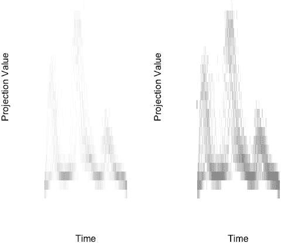

###### 图 3-24\. 单词音频度量的二维直方图。左图使用线性计数尺度，而右图使用对数计数尺度。

Figure 3-24 的右图看起来更好，因为计数根据对数变换进行了着色，而不是直接计数。

这是与将时间序列取对数以减少方差和减少离群值的距离的相同想法的应用。使用对数变换通过不浪费相对稀疏的高计数值的大部分范围来改进我们的可视化。

我们自制的选项不会像许多预制选项那样视觉上吸引人，所以我们应该看看它们有何不同。为了利用这些预制解决方案，我们需要重新调整数据，因为这些选项期望将 x-y 值对转换为二维直方图。与我们的自制解决方案不同，用于二维直方图的预制选项并非专门为时间序列数据设计。尽管如此，它们仍提供了出色的可视化解决方案（见图 Figure 3-25）：

```
## R
> w1 <- words[V1 == 1]

> ## melt the data to the pairs of paired-coordinates 
> ## expected by most 2d histogram implementations
> names(w1) <- c("type", 1:270)
> w1        <- melt(w1, id.vars = "type")

> w1        <- w1[, -1]
> names(w1) <- c("Time point", "Value")

> plot(hexbin(w1))

```

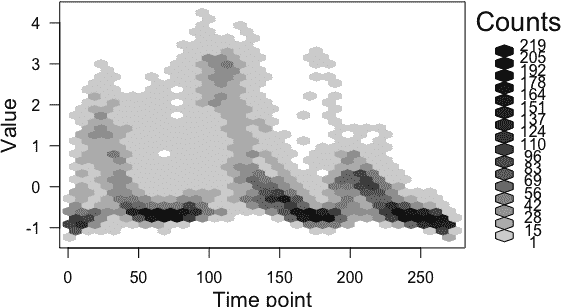

###### 图 3-25\. 同一数据的替代二维直方图可视化。

## 3D 可视化

3D 可视化并不随 base R 附带，但有许多可用的包。这里我展示了一些用 `plotly` 制作的快速图，我选择它是因为它生成的图可以在 RStudio 中轻松旋转并导出到 Web 界面。而且，下载和安装 `plotly` 通常很简单，这在所有可视化包中并非如此。

让我们考虑`AirPassengers`数据。我们将其绘制在三维空间中，使用两个维度表示时间（月份和年份），一个维度表示数据值：

```
## R
> require(plotly)
> require(data.table)

> months = 1:12
> ap = data.table(matrix(AirPassengers, nrow = 12, ncol = 12))
> names(ap) = as.character(1949:1960)
> ap[, month := months]
> ap = melt(ap, id.vars = 'month')
> names(ap) = c("month", "year", "count")

> p <- plot_ly(ap, x = ~month, y = ~year, z = ~count, 
>              color = ~as.factor(month)) %>%
>   add_markers() %>%
>   layout(scene = list(xaxis = list(title = 'Month'),
>                       yaxis = list(title = 'Year'),
>                       zaxis = list(title = 'PassengerCount')))

```

这种三维可视化帮助我们感受数据的整体形状。我们之前见过很多类似的内容，但扩展到三维散点图明显比二维直方图更好，也许是因为数据的稀缺性（参见图 3-26 和 3-27）。

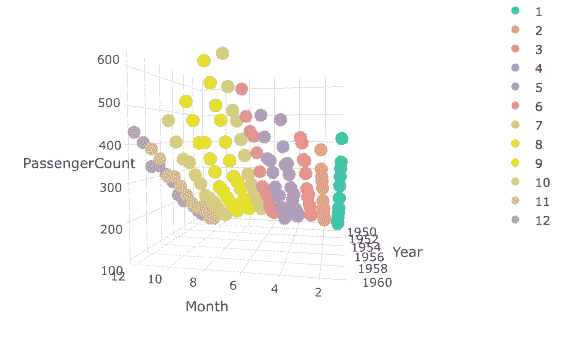

###### 图 3-26\. AirPassenger 数据的三维散点图。这个视角突出了季节性。⁶

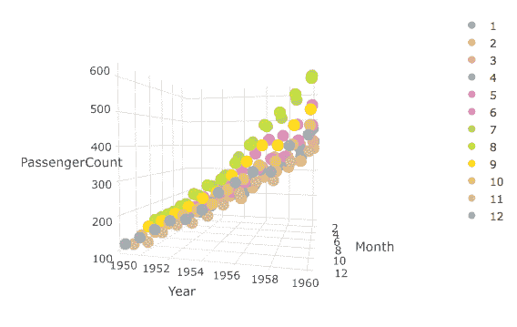

###### 图 3-27\. 同一数据的另一视角更清晰地说明了从一年到下一年的增长趋势。我强烈建议在您自己的计算机上运行这段代码，您可以自行旋转它。⁷

我们并不一定需要在时间上耗费两个轴。相反，我们可能会用两个轴表示位置，一个轴表示时间。我们可以如下方式可视化二维随机漫步，稍微修改了 `plotly` 的演示代码（见图 3-28 和 3-29）：

```
## R
> file.location <- 'https://raw.githubusercontent.com/plotly/datasets/master/\
 _3d-line-plot.csv'
> data <- read.csv(file.location)
> p <- plot_ly(data, x = ~x1, y = ~y1, z = ~z1, 
>                 type = 'scatter3d', mode = 'lines',
>                 line = list(color = '#1f77b4', width = 1)) 

```

图的交互性质是关键。不同的视角可能会误导或启示我们，这些效果在我们能够旋转数据之前是无法预知的。

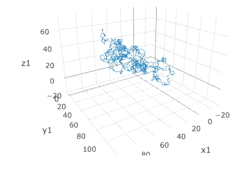

###### 图 3-28\. 关于二维随机漫步随时间变化的一个视角。

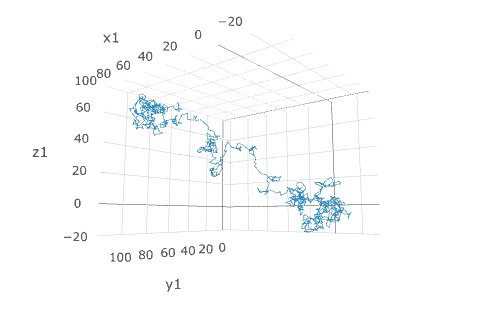

###### 图 3-29\. 同一个随机漫步的这一视角更加具有启发性。再次鼓励您自己尝试这段代码！

一个很好的练习是生成两维中嘈杂的季节性运动数据，并以我们在这里可视化随机漫步数据的方式进行可视化。在您看到的图中，与随机漫步数据相比应该有显著的差异。像 `plotly` 这样的包可以帮助您快速实验，并提供全面的视觉反馈。

# 更多资源：

+   关于虚假相关：

    Ai Deng, [“时间序列回归中虚假统计显著性的初步介绍,”](https://perma.cc/9CQR-RWHC) *《经济委员会通讯》* 14, 第 1 期 (2015), https://perma.cc/9CQR-RWHC。

    这篇关于虚假相关的行业介绍解释了数据中的虚假相关是如何出现的，对于在自己的数据集中找到和解决这个问题有很大帮助。这些材料写作水平非常容易理解。

    Tyler Vigen, [*《虚假相关》*](https://perma.cc/YY6R-SKWA) (纽约: 哈赤特出版社, 2015), https://perma.cc/YY6R-SKWA。

    这本记录荒谬时间序列相关性的集合对于任何时间序列分析师或思考的人都是必读。

    Antonio Noriega 和 Daniel Ventosa-Santaulària, [“在破碎趋势稳定性下的虚假回归,”](https://perma.cc/V993-SF4F) *《时间序列分析杂志》* 27, 第 5 期 (2006): 671–84, https://perma.cc/V993-SF4F。

    作者们通过理论和模拟数据展示，独立和随机生成的数据集水平或趋势变化如何影响虚假相关的存在。

    C.W.J. Granger 和 P. Newbold, [“计量经济学中的虚假回归,”](https://perma.cc/M8TE-AL6U) *《经济计量学杂志》* 2, 第 2 期 (1974): 111–20, https://perma.cc/M8TE-AL6U。

    这篇计量经济学文章因揭示处理虚假相关困难而获得了诺贝尔奖，并主张对相关时间序列的更强健方法。

+   关于探索性数据分析：

    David R. Brillinger 和 Mark A. Finney, [“一个关于蔓延火灾中温度波动的探索性数据分析,”](https://perma.cc/QB3D-APKM) *《环境计量学》* 25, 第 6 期 (2014): 443–53, https://perma.cc/QB3D-APKM。

    这是一篇非常详尽的示例，展示了学术界和政府研究人员如何分析具有地理时间网格的真实世界实验室数据。

    Robert H. Shumway 和 David S. Stoffer, [“时间序列回归与探索性数据分析,”](https://perma.cc/UC5B-TPVS) 收录于 *《带有 R 示例的时间序列分析及其应用》* (纽约: 斯普林格, 2011), https://perma.cc/UC5B-TPVS。

    这是作者针对研究生的时间序列分析的经典著作中关于探索性数据分析的章节。

+   更多可视化：

    Christian Tominski 和 Wolfgang Aigner, [“TimeViz 浏览器,”](https://perma.cc/94ND-6ZA5) https://perma.cc/94ND-6ZA5。

    这个惊人的目录展示了学术研究论文和行业使用案例中许多有趣的时间序列可视化的示例和源代码。

    Oscar Perpiñán Lamigueiro, [“GitHub 仓库，用于展示 R 中的时间序列、空间和时空数据,”](https://perma.cc/R69Y-5JPL) https://perma.cc/R69Y-5JPL。

    这本书包括了基于 R 的各种时间序列可视化的源代码，包括地理空间时间序列数据。

    Myles Harrison，《“R 语言中进行二维直方图的 5 种方法”》，R-bloggers，2014 年 9 月 1 日，https://perma.cc/ZCX9-FQQY。

    这是一本实用指南，介绍了 R 包提供的各种选项来构建二维直方图，并赋予它们有意义的颜色和分箱。除了基本概述外，[相关段落](https://edav.info/tidyquant.html)还提供了关于`tidyquant`包的详细说明，用于可视化股市数据，这是时间序列的重要来源。

+   在各种趋势上：

    Halbert White 和 Clive W.J. Granger，《“时间序列趋势的考量”》，《时间序列计量经济学杂志》3 卷 1 期（2011 年），https://perma.cc/WF2H-TVTL。

    这篇最新的学术文章指出，尽管趋势在数据中无处不在，甚至传统统计学对于描述数据中不同种类趋势的定义也并没有明确定义。作者以一种易于理解的方式，提供了关于非平稳数据可能具有潜在趋势的统计洞见，并指导如何改进数据的统计方法。

¹ 如果这对你没有印象，别担心。如果你希望深入了解，可以在“更多资源”中阅读更多内容。

² 由随机漫步生成的给定样本时间序列过程可能看起来有趋势，这在分析股票价格时间序列时特别引起了许多争论。

³ 使用 R 的`cor()`函数计算的样本相关性与使用 R 的`acf()`函数计算的样本自相关性可能不完全匹配，因为它们使用不同的除数。欲了解更多信息，请参阅[StackExchange](https://perma.cc/M7V6-HN5Y)。

⁴ 访问[GitHub 仓库](https://github.com/PracticalTimeSeriesAnalysis/BookRepo)查看原始图表，或自行绘制以获取更详细的查看。

⁵ 访问[GitHub 仓库](https://github.com/PracticalTimeSeriesAnalysis/BookRepo)查看原始图表，或自行绘制以获取更详细的查看。

⁶ 访问[GitHub 仓库](https://github.com/PracticalTimeSeriesAnalysis/BookRepo)查看原始图表，或自行绘制以获取更详细的查看。

⁷ 访问[GitHub 仓库](https://github.com/PracticalTimeSeriesAnalysis/BookRepo)查看原始图表，或自行绘制以获取更详细的查看。
