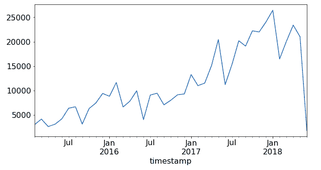
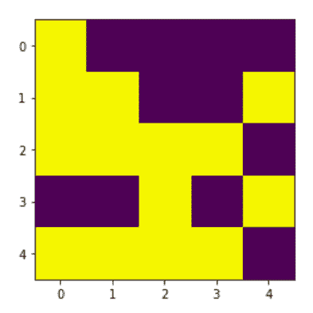
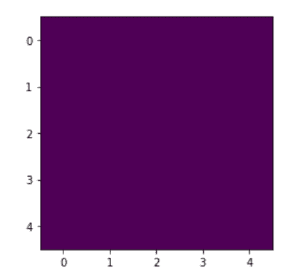
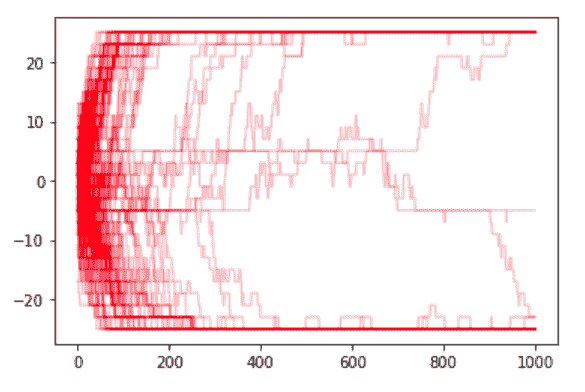

# 第四章：模拟时间序列数据

到目前为止，我们已经讨论了在哪里找到时间序列数据以及如何处理它。现在我们将看看如何通过模拟创建时间序列数据。

我们的讨论分为三部分。首先，我们将时间序列数据的模拟与其他类型的数据模拟进行比较，注意在考虑时间流逝时会出现哪些新的特别关注的领域。其次，我们看一些基于代码的模拟。第三，我们讨论时间序列模拟中的一些一般趋势。

本章的大部分内容将集中在生成各种类型时间序列数据的具体代码示例上。我们将逐个讨论以下示例：

+   我们模拟非营利组织成员多年来的电子邮件打开和捐赠行为。这与我们在"从表格集合中重塑时间序列数据收集"章节中检验的数据相关。

+   我们在一天之内模拟了 1,000 辆出租车的事件，这些出租车有不同的班次开始时间和与一天中小时相关的乘客接载频率。

+   我们使用相关物理定律，模拟给定温度和尺寸的磁性固体的逐步状态演变。

这三个代码示例对应于三类时间序列模拟：

启发式模拟

我们决定世界应该如何运作，确保它合理，然后一条规则一条规则地编写代码。

离散事件模拟

我们在我们的宇宙中构建具有特定规则的个体行为者，然后运行这些行为者，看看宇宙随时间的演变。

基于物理的模拟

我们应用物理定律来观察系统如何随时间演变。

模拟时间序列可以是一个有价值的分析练习，我们将在后续章节中演示，因为它涉及到具体的模型。

# 模拟时间序列的特别之处在于什么？

模拟数据是数据科学中很少被教授的一个领域，但对于时间序列数据却是一项特别有用的技能。这是因为时间数据的一个缺点是：同一时间序列中的两个数据点是不能完全比较的，因为它们发生在不同的时间。如果我们想考虑在特定时间发生了什么，我们就进入了模拟的世界。

模拟可以简单也可以复杂。在简单的一面，你会在任何关于时间序列的统计学教科书中遇到合成数据，比如随机漫步形式。这些通常通过随机过程的累积总和（如 R 的`rnorm`）或周期函数（如正弦曲线）生成。在更复杂的一面，许多科学家和工程师把他们的职业建立在模拟时间序列上。时间序列模拟仍然是许多领域的一个活跃研究领域，也是一个计算上要求高的领域，包括：

+   气象学

+   金融学

+   流行病学

+   量子化学

+   等离子体物理学

在某些情况下，行为的基本规则是被充分理解的，但由于方程的复杂性（气象学、量子化学、等离子物理学），仍然很难考虑到所有可能发生的事情。在其他情况下，不可能知道所有的预测变量，专家甚至不确定由于系统的随机非线性特性是否可以做出完美的预测（金融、流行病学）。

## 模拟与预测

模拟和预测是类似的练习。在这两种情况下，您必须形成关于基础系统动态和参数的假设，然后从这些假设中推断出数据点。

然而，在学习和开发模拟而不是预测时，需要记住重要的差异：

+   将定性观察整合到模拟中可能比整合到预测中更容易。

+   模拟是在规模上运行的，这样您可以看到许多替代场景（成千上万甚至更多），而预测应该更加仔细地制作。

+   模拟比预测风险较低；没有生命和资源在危险线上，因此您在最初的模拟轮次中可以更有创意和探索性。当然，最终您希望能够证明您构建模拟的方式，就像您必须证明您的预测一样。

# 代码中的模拟

接下来，我们将看一看编写时间序列模拟的三个例子。在阅读这些例子时，请考虑可以模拟的广泛数据范围，以生成“时间序列”，以及时间元素可以非常具体和人为驱动，比如捐赠的星期几和一天中的时间，但也可以非常不具体，基本上是未标记的，比如物理模拟的“第 n 步”。

在本节中，我们将讨论三个模拟的例子：

+   模拟合成数据集以测试我们关于组织成员之间接受组织电子邮件和愿意捐赠之间相关行为的假设。这是最自助的例子，因为我们硬编码关系并生成包括`for`循环在内的表格数据。

+   模拟合成数据集以探索出租车队的聚合行为，包括轮班时间和依赖时间的乘客频率。在这个数据集中，我们利用 Python 的面向对象属性以及生成器，在我们想要启动系统并观察其行为时非常有帮助。

+   模拟磁性材料逐渐定向其个体磁元素的物理过程，这些元素最初处于无序状态，但最终会融合成一个有序的系统。在这个例子中，我们看到物理法则如何驱动时间序列模拟，并将自然的时间尺度插入到一个过程中。

## 自己动手完成工作

当您编写模拟程序时，需要牢记适用于系统的逻辑规则。在这里，我们通过示例详细说明了程序员通过确保数据合理性来完成大部分工作（例如，不指定按照不合逻辑顺序发生的事件）。

我们首先定义会员的成员资格宇宙，即我们有多少会员以及每个会员何时加入组织。我们还将每个会员与会员状态配对：

```
## python
>>> ## membership status
>>> years        = ['2014', '2015', '2016', '2017', '2018']
>>> memberStatus = ['bronze', 'silver', 'gold', 'inactive']

>>> memberYears = np.random.choice(years, 1000, 
>>>               p = [0.1, 0.1, 0.15, 0.30, 0.35])
>>> memberStats = np.random.choice(memberStatus, 1000, 
>>>               p = [0.5, 0.3, 0.1, 0.1])

>>> yearJoined = pd.DataFrame({'yearJoined': memberYears,
>>>                          'memberStats': memberStats})

```

请注意，这些行代码中已经内置了许多规则/假设来模拟。我们设定了会员加入年份的具体概率。我们还使会员的状态完全独立于他们加入的年份。在现实世界中，我们可能已经能够做得比这更好，因为这两个变量应该有一定的关联，特别是如果我们想要激励人们继续保持会员身份。

我们制作了一张表格，表明会员每周何时打开邮件。在这种情况下，我们定义了我们组织的行为：我们每周发送三封邮件。我们还定义了会员在邮件方面的不同行为模式：

+   从不打开邮件

+   邮件开启率/参与度保持不变

+   参与度的增加或减少

我们可以想象根据老兵的轶事观察或者我们对影响数据的不可观察过程的新颖假设，使这一过程变得更加复杂和微妙：

```
## python
>>> NUM_EMAILS_SENT_WEEKLY = 3

>>> ## we define several functions for different patterns 
>>> def never_opens(period_rng):
>>>   return []

>>> def constant_open_rate(period_rng):
>>>   n, p = NUM_EMAILS_SENT_WEEKLY, np.random.uniform(0, 1)
>>>   num_opened = np.random.binomial(n, p, len(period_rng))
>>>   return num_opened

>>> def increasing_open_rate(period_rng):
>>>   return open_rate_with_factor_change(period_rng, 
>>>                                        np.random.uniform(1.01, 
>>>                                                          1.30))

>>> def decreasing_open_rate(period_rng):
>>>   return open_rate_with_factor_change(period_rng, 
>>>                                        np.random.uniform(0.5,  
>>>                                                          0.99))

>>> def open_rate_with_factor_change(period_rng, fac):
>>>     if len(period_rng) < 1 :
>>>         return [] 
>>>     times = np.random.randint(0, len(period_rng), 
>>>                                int(0.1 * len(period_rng)))    
>>>     num_opened = np.zeros(len(period_rng))
>>>     for prd in range(0, len(period_rng), 2):  
>>>         try:
>>>             n, p = NUM_EMAILS_SENT_WEEKLY, np.random.uniform(0, 
>>>                                                              1)
>>>             num_opened[prd:(prd + 2)] = np.random.binomial(n, p, 
>>>                                                            2)
>>>             p = max(min(1, p * fac), 0)
>>>         except:
>>>             num_opened[prd] = np.random.binomial(n, p, 1)
>>>     for t in range(len(times)):
>>>         num_opened[times[t]] = 0    
>>>     return num_opened

```

我们已经定义了模拟四种不同行为的函数：

从不打开我们发送给他们的邮件的会员

(`never_opens()`)

每周打开邮件数量大致相同的会员

(`constant_open_rate()`)

每周打开邮件数量逐渐减少的会员

(`decreasing_open_rate()`)

每周打开邮件数量逐渐增加的会员

(`increasing_open_rate()`)

我们确保那些随时间增加或减少参与度的人通过函数`open_rate_with_factor_change()`以及函数`increasing_open_rate()`和`decreasing_open_rate()`进行了相同的模拟。

我们还需要设计一个系统来模拟捐赠行为。我们不希望过于天真，否则我们的模拟将无法给我们带来关于我们应该期待什么的见解。也就是说，我们希望在模型中加入我们对会员行为的当前假设，然后测试基于这些假设的模拟是否与我们在真实数据中看到的相符。在这里，我们使捐赠行为与会员打开的邮件数量 loosely 但不是确定性地相关：

```
## python
>>> ## donation behavior
>>> def produce_donations(period_rng, member_behavior, num_emails, 
>>>                       use_id, member_join_year):
>>>     donation_amounts = np.array([0, 25, 50, 75, 100, 250, 500, 
>>>                                  1000, 1500, 2000])
>>>     member_has = np.random.choice(donation_amounts)    
>>>     email_fraction = num_emails  / 
>>>                        (NUM_EMAILS_SENT_WEEKLY * len(period_rng))  
>>>     member_gives = member_has * email_fraction
>>>     member_gives_idx = np.where(member_gives 
>>>                                  >= donation_amounts)[0][-1]
>>>     member_gives_idx = max(min(member_gives_idx, 
>>>                                len(donation_amounts) - 2), 
>>>                            1)
>>>     num_times_gave = np.random.poisson(2) * 
>>>                        (2018 - member_join_year)
>>>     times = np.random.randint(0, len(period_rng), num_times_gave)
>>>     dons = pd.DataFrame({'member'   : [], 
>>>                          'amount'   : [],  
>>>                          'timestamp': []})

>>>     for n in range(num_times_gave):    
>>>         donation = donation_amounts[member_gives_idx 
>>>                      + np.random.binomial(1, .3)]
>>>         ts = str(period_rng[times[n]].start_time 
>>>                   + random_weekly_time_delta())
>>>         dons = dons.append(pd.DataFrame(
>>>                   {'member'   : [use_id],
>>>                    'amount'   : [donation],
>>>                    'timestamp': [ts]}))
>>>     
>>>     if dons.shape[0] > 0:
>>>         dons = dons[dons.amount != 0]
>>>         ## we don't report zero donation events as this would not
>>>         ## be recorded in a real world database 
>>>                                    
>>>     return dons

```

我们在这里采取了一些步骤，以确保代码产生逼真的行为：

+   我们使总体捐款数量依赖于某人成为会员的时间长短。

+   我们生成每位会员的财富状态，建立了一个关于行为的假设，即捐款金额与一个人用于捐款的稳定金额相关。

因为我们的会员行为与特定时间戳相关联，所以我们必须选择每个会员何时进行捐赠以及在那一周的哪个时间进行捐赠。我们编写了一个实用函数来在一周内选择随机时间：

```
## python
>>> def random_weekly_time_delta():
>>>     days_of_week = [d for d in range(7)]
>>>     hours_of_day = [h for h in range(11, 23)]
>>>     minute_of_hour = [m for m in range(60)]
>>>     second_of_minute = [s for s in range(60)]
>>>     return pd.Timedelta(str(np.random.choice(days_of_week))   
>>>                             + " days" ) +
>>>          pd.Timedelta(str(np.random.choice(hours_of_day))     
>>>                             + " hours" )  +
>>>          pd.Timedelta(str(np.random.choice(minute_of_hour))   
>>>                             + " minutes") +
>>>          pd.Timedelta(str(np.random.choice(second_of_minute)) 
>>>                             + " seconds")

```

您可能已经注意到，我们只从时间戳的小时范围中提取了 11 到 23 点之间的小时（`hours_of_day = [h for h in range(11, 23)]`）。我们假设的是一个非常有限时区范围内的人们甚至只有一个单一时区的宇宙，因为我们不允许超出给定范围的小时。在这里，我们正在构建更多关于用户行为的基础模型。

因此，我们预期会看到我们的用户表现出统一的行为，就好像他们都在一个或几个相邻的时区内，而我们进一步推测合理的捐赠行为是人们从早上稍晚到晚上捐款，但不包括过夜和早上醒来时第一件事。

最后，我们将所有开发的组件放在一起，以一种方式模拟一定数量的会员和相关事件，确保事件仅在会员加入后发生，并且会员的电子邮件事件与其捐赠事件有一定关系（但关系不是不切实际小的）：

```
## python
>>> behaviors        = [never_opens, 
>>>                    constant_open_rate,
>>>                    increasing_open_rate, 
>>>                    decreasing_open_rate]
>>> member_behaviors = np.random.choice(behaviors, 1000, 
>>>                                    [0.2, 0.5, 0.1, 0.2])

>>> rng = pd.period_range('2015-02-14', '2018-06-01', freq = 'W')
>>> emails = pd.DataFrame({'member'      : [], 
>>>                        'week'        : [], 
>>>                        'emailsOpened': []})
>>> donations = pd.DataFrame({'member'   : [], 
>>>                           'amount'   : [], 
>>>                           'timestamp': []})

>>> for idx in range(yearJoined.shape[0]):
>>>     ## randomly generate the date when a member would have joined
>>>     join_date = pd.Timestamp(yearJoined.iloc[idx].yearJoined) + 
>>>                   pd.Timedelta(str(np.random.randint(0, 365)) + 
>>>                                   ' days')
>>>     join_date = min(join_date, pd.Timestamp('2018-06-01'))
>>>  
>>>     ## member should not have action timestamps before joining
>>>     member_rng = rng[rng > join_date]    
>>>   
>>>     if len(member_rng) < 1:
>>>         continue
>>> 
>>>     info = member_behaviorsidx
>>>     if len(info) == len(member_rng):
>>>         emails = emails.append(pd.DataFrame(
>>>            {'member': [idx] * len(info), 
>>>             'week': [str(r.start_time) for r in member_rng], 
>>>             'emailsOpened': info}))
>>>         donations = donations.append(
>>>            produce_donations(member_rng, member_behaviors[idx], 
>>>                                 sum(info), idx, join_date.year))

```

然后，我们查看捐款的时间行为，以了解我们可能如何尝试进行进一步分析或预测。我们绘制了数据集每个月收到的捐款总额的总和（见图 4-1）：

```
## python
>>> df.set_index(pd.to_datetime(df.timestamp), inplace = True)
>>> df.sort_index(inplace = True)
>>> df.groupby(pd.Grouper(freq='M')).amount.sum().plot()

```



###### 图 4-1. 数据集每个月收到的捐款总额。

从 2015 年到 2018 年，捐款数和已打开的电子邮件数量看起来随着时间的推移有所增加。这并不令人惊讶，因为成员数量随时间增加，如成员的累积总和和加入年份所示。事实上，我们模型的一个内置假设是，一旦成员加入，我们就可以无限期地保留其成员资格。我们没有设定终止成员资格的任何规定，除非允许成员打开越来越少的电子邮件。即使在这种情况下，我们也留下了继续捐赠的可能性。我们在图 4-1 中看到了这种无限期持续会员资格（及相关的捐赠行为）的假设。我们可能应该回过头来改进我们的代码，因为无限期的会员资格和捐赠并不是一个现实的情景。

这不是一个经典的时间序列模拟，因此可能更像是生成表格数据的练习。但我们确实必须意识到时间序列：

+   我们不得不做出关于我们的用户处于多少时间序列中的决策。

+   我们必须对我们将随时间建模的趋势类型做出决策：

    +   在电子邮件的情况下，我们决定有三种趋势：稳定、增长和减少的电子邮件开启率。

    +   在捐款的情况下，我们使捐款成为一个稳定的行为模式，与成员在其生命周期内打开的电子邮件数量有关。这包括一个前瞻，但由于我们正在生成数据，这是一种决定成员在组织中整体亲和力的方式，这将导致更多的电子邮件打开，也会增加捐款的频率。

+   我们必须小心确保在成员加入组织之前没有打开电子邮件或进行捐款。

+   我们必须确保我们的数据不会进入未来，以使其对数据的消费者更具现实意义。请注意，对于模拟来说，如果我们的数据进入未来是可以的。

但它并不完美。这里提出的代码笨拙不堪，并且不能产生一个真实的宇宙。更重要的是，由于只有程序员检查了逻辑，他们可能会错过一些边界情况，导致事件按照不合逻辑的顺序发生。在运行模拟之前，建立外部度量和有效性标准是防止此类错误的一种保护措施之一。

我们需要一种能够强制实现逻辑和一致的软件宇宙。我们将在下一节中看一看 Python 生成器作为更好的选择。

## 构建一个自运行的模拟宇宙

有时候你有一个特定的系统，你想为该系统设置规则并观察其运行。也许你想设想一下独立成员访问你的应用程序将使用的宇宙，或者你想试图验证一个基于假设的外部行为的内部决策理论。在这些情况下，你希望看到个体代理如何随时间推移贡献到你的聚合度量中。由于生成器的可用性，Python 在这项工作中尤为合适。当你开始构建软件而不仅仅停留在分析时，即使你更喜欢 R，使用 Python 也是有道理的。

生成器允许我们创建一系列独立（或依赖的！）行为者，并让它们运转起来，观察它们的行为，而无需太多样板代码来跟踪一切。

在接下来的代码示例中，我们探索一个出租车模拟。¹ 我们想象一下，一群打算在不同时间开始工作的出租车会以何种方式进行集体行动。为了做到这一点，我们希望创建许多个体出租车，将它们释放在一个虚拟城市中，并让它们汇报它们的活动。

这样的模拟可能异常复杂。为了演示目的，我们接受将构建一个比我们想象中更简单的世界（“所有模型都是错误的…”）。我们首先尝试理解 Python 生成器是什么。

让我们首先考虑一种我编写的用于获取出租车识别号的方法：

```
## python
>>> import numpy as np

>>> def taxi_id_number(num_taxis):
>>>    arr = np.arange(num_taxis)
>>>    np.random.shuffle(arr)
>>>    for i in range(num_taxis):
>>>        yield arr[i]

```

对于那些不熟悉生成器的人，这里是前面的代码示例：

```
## python
>>> ids = taxi_id_number(10)
>>> print(next(ids))
>>> print(next(ids))
>>> print(next(ids))

```

可能会打印出以下内容：

```
7
2
5

```

这将迭代直到发出 10 个数字，此时它将退出生成器中保存的`for`循环，并发出`StopIteration`异常。

`taxi_id_number()`生成一次性对象，它们之间都是相互独立的，并且保持自己的状态。这是一个生成器函数。你可以把生成器想象成维护自己的一小组状态变量的小对象，当你希望许多对象并行运行时特别有用，每个对象都关注自己的变量。

在这个简单的出租车模拟案例中，我们将出租车分成不同的班次，并且使用生成器来指示班次。我们通过在特定时间开始班次设置不同的概率，白天中段调度更多的出租车，而不是在晚上或过夜的班次：

```
## python
>>> def shift_info():
>>>    start_times_and_freqs = [(0, 8), (8, 30), (16, 15)]
>>>    indices               = np.arange(len(start_times_and_freqs))
>>>    while True:
>>>        idx   = np.random.choice(indices, p = [0.25, 0.5, 0.25])
>>>        start = start_times_and_freqs[idx]
>>>        yield (start[0], start[0] + 7.5, start[1])

```

注意`start_times_and_freqs`。这是我们第一段代码，将有助于将其变成时间序列模拟。我们指出一天中的不同时间段有不同的出租车分配概率。此外，一天中的不同时间有不同的平均出租车次数。

现在我们创建一个更复杂的生成器，它将使用前面的生成器来建立单个出租车的参数，并创建单个出租车的时间线：

```
## python
>>> def taxi_process(taxi_id_generator, shift_info_generator):
>>>    taxi_id = next(taxi_id_generator)
>>>    shift_start, shift_end, shift_mean_trips = 
>>>                                    next(shift_info_generator)
>>>    actual_trips = round(np.random.normal(loc   = shift_mean_trips, 
>>>                                          scale = 2))
>>>    average_trip_time = 6.5 / shift_mean_trips * 60 
>>>    # convert mean trip time to minutes
>>>    between_events_time = 1.0 / (shift_mean_trips - 1) * 60
>>>    # this is an efficient city where cabs are seldom unused
>>>    time = shift_start
>>>    yield TimePoint(taxi_id, 'start shift', time)    
>>>    deltaT = np.random.poisson(between_events_time) / 60
>>>    time += deltaT
>>>    for i in range(actual_trips):
>>>        yield TimePoint(taxi_id, 'pick up    ', time)
>>>        deltaT = np.random.poisson(average_trip_time) / 60
>>>        time += deltaT
>>>        yield TimePoint(taxi_id, 'drop off   ', time)
>>>        deltaT = np.random.poisson(between_events_time) / 60
>>>        time += deltaT        
>>>    deltaT = np.random.poisson(between_events_time) / 60
>>>    time += deltaT        
>>>    yield TimePoint(taxi_id, 'end shift  ', time)

```

在这里，出租车访问生成器来确定其 ID 编号、班次开始时间以及其开始时间的平均出租车次数。从那里开始，它将在自己的时间轴上运行一定数量的行程，并将这些行程传递给调用此生成器上的`next()`的客户端。实际上，这个生成器为单个出租车产生了时间序列点。

出租车生成器产生了`TimePoint`，其定义如下：

```
## python
>>> from dataclasses import dataclass

>>> @dataclass
>>> class TimePoint:
>>>    taxi_id:    int
>>>    name: str
>>>    time: float

>>>    def __lt__(self, other):
>>>        return self.time < other.time

```

我们使用相对较新的`dataclass`装饰器简化代码（这需要 Python 3.7）。我建议所有使用 Python 的数据科学家熟悉这个新的对数据友好的 Python 添加。

# Python 的 Dunder 方法

Python 的*dunder*方法，名称以双下划线开始和结束，是每个类的内置方法集。Dunder 方法在使用给定对象时会自动调用。这些方法有预定义的实现，可以在你自己定义类时覆盖。你可能希望这样做的原因有很多，例如在前面的代码中，我们希望仅基于它们的时间而不是基于它们的`taxi_id`或`name`属性来比较`TimePoint`。

Dunder 源于“double under”的缩写。

除了自动生成的`TimePoint`初始化器外，我们只需要其他两个 dunder 方法，`__lt__`（用于比较`TimePoint`）和`__str__`（用于打印`TimePoint`，这里没有显示）。我们需要比较，因为我们将把所有生成的`TimePoint`放入一个数据结构中，这个数据结构将按照它们的优先级来保持它们的顺序：一个*优先队列*是一个抽象数据类型，可以按任何顺序插入对象，但将按其优先级发射对象。

# 抽象数据类型

*抽象数据类型*是一种由其行为定义的计算模型，其行为由一组可能的操作和输入数据的枚举集合以及对于某些数据集的操作结果组成。

一个广为人知的抽象数据类型是先进先出（FIFO）数据类型。这要求对象从数据结构中被发射出来的顺序与它们被送入数据结构的顺序相同。程序员如何选择实现这一点是实现的问题，而不是定义的问题。

我们有一个模拟类来运行这些出租车生成器并保持它们的组装。这不仅仅是一个`dataclass`，因为它在初始化器中有相当多的功能，来将输入整理成一个合理的信息和处理数组。请注意，唯一面向公众的功能是`run()`函数：

```
## python
>>> import queue

>>> class Simulator:
>>>    def __init__(self, num_taxis):
>>>        self._time_points = queue.PriorityQueue()
>>>        taxi_id_generator = taxi_id_number(num_taxis)
>>>        shift_info_generator = shift_info()
>>>        self._taxis = [taxi_process(taxi_id_generator, 
>>>                                    shift_info_generator) for 
>>>                                             i in range(num_taxis)]        
>>>        self._prepare_run()        

>>>    def _prepare_run(self):
>>>        for t in self._taxis:
>>>            while True:
>>>                try:
>>>                    e = next(t)
>>>                    self._time_points.put(e)
>>>                except:
>>>                    break        

>>>    def run(self):
>>>        sim_time = 0
>>>        while sim_time < 24:
>>>            if self._time_points.empty():
>>>                break
>>>            p = self._time_points.get()
>>>            sim_time = p.time
>>>            print(p)

```

首先，我们创建所需数量的出租车生成器来表示正确数量的出租车。然后我们遍历每一个这些出租车，当它还有`TimePoint`时，将所有这些`TimePoint`推入优先队列。对象的优先级由我们对`TimePoint`类的`__lt__`实现决定，我们在其中比较开始时间。因此，当`TimePoint`被推入优先队列时，它们将准备好按时间顺序被发射出去。

我们运行模拟：

```
## python
>>> sim = Simulator(1000)
>>> sim.run()

```

下面是输出的样子（你的输出将会不同，因为我们还没有设置种子——每次运行代码时都会与上次迭代不同）：

```
id: 0539 name: drop off    time: 23:58
id: 0318 name: pick up     time: 23:58
id: 0759 name: end shift   time: 23:58
id: 0977 name: pick up     time: 23:58
id: 0693 name: end shift   time: 23:59
id: 0085 name: end shift   time: 23:59
id: 0351 name: end shift   time: 23:59
id: 0036 name: end shift   time: 23:59
id: 0314 name: drop off    time: 23:59

```

# 在生成随机数时设置种子

当您编写生成随机数的代码时，您可能希望确保它是可重现的（例如，如果您想为通常是随机的代码设置单元测试，或者如果您试图调试并希望缩小变异源以便更容易调试）。为了确保随机数以相同的非随机顺序输出，您设置了一个种子。这是一个常见操作，因此有关如何在任何计算机语言中设置种子的指南。

我们已经将显示简单性舍入到最接近的分钟，尽管我们有更精细的数据可用。我们使用什么时间分辨率将取决于我们的目的：

+   如果我们想为我们城市的人们制作一个教育展示，展示出出租车队对交通的影响，我们可以显示每小时的汇总。

+   如果我们是一个出租车应用程序，并且需要了解服务器的负载情况，我们可能希望查看逐分钟甚至更高分辨率数据，以考虑我们的基础设施设计和容量。

我们决定按照“发生”的方式报告出租车的“时间点”。也就是说，我们报告出租车乘车的开始（“接人”），而不是结束时间，尽管我们很容易可以压缩这一信息。这是使时间序列更加真实的一种方式，因为在实时流中，您很可能会以这种方式记录事件。

请注意，与前一种情况类似，我们的时间序列模拟尚未生成时间序列。我们已经生成了一个日志，并可以通过多种方式使其成为时间序列，然而：

+   在运行模拟的同时，将结果输出到 CSV 文件或时间序列数据库。

+   运行某种在线模型，连接到我们的模拟以了解如何开发实时流数据处理管道。

+   将输出保存到文件或数据库中，然后进行更多的后处理，以便以一种方便的形式（但可能与前瞻性风险相关）打包数据，例如将给定乘车的起始和结束时间配对，以研究出租车乘车时间在不同时间段的行为。

除了能够测试关于出租车系统动态的假设之外，模拟此数据还有几个优点。以下是一些情况，合成时间序列数据可能会有用：

+   相对于已知的模拟底层动态，测试各种预测模型的优点。

+   在等待真实数据时，为基于合成数据的数据构建管道。

作为时间序列分析员，您能够利用生成器和面向对象编程将大有裨益。此示例仅提供了一个如何利用此类知识简化生活并提高代码质量的例子。

# 对于广泛的模拟，请考虑基于代理的建模

我们在这里编码的解决方案还算可以，但需要大量样板来确保逻辑条件得到尊重。如果基于离散行动者的离散事件模拟能成为模拟时间序列数据的有用来源，则应考虑采用面向模拟的模块。[SimPy](https://simpy.readthedocs.io/en/latest)模块是一个有帮助的选择，具有易于访问的 API，并具有相当多的灵活性，可以执行我们在本节中处理的各种模拟任务。

## 物理模拟

在另一种模拟场景中，您可能完全掌握了定义系统的物理定律。然而，这不一定是物理本身，它也可以适用于许多其他领域：

+   金融量化研究人员通常会假设市场的“物理”规则。经济学家也是如此，尽管时间尺度不同。

+   心理学家提出了关于人类决策方式的“心理物理学”规则。这些规则可以用来生成关于期望人类对各种选项反应的“物理”规则。

+   生物学家研究系统如何在时间上响应各种刺激的规则。

一个了解简单物理系统某些规则的案例是模拟磁铁行为。这是我们要处理的情况，通过一个常见的统计力学模型称为伊辛模型²。我们将看看如何模拟其随时间的行为。我们将初始化磁性材料，使其各个磁性组件指向随机方向。然后，我们将观察这个系统如何在已知物理法则和几行代码的作用下演变成所有磁性组件指向相同方向的有序状态。

接下来我们讨论如何通过马尔可夫链蒙特卡洛（MCMC）方法实现这样的模拟，讨论该方法在一般情况下以及应用于这个特定系统时的工作原理。

在物理学中，MCMC 模拟可以用于了解个别分子中的量子跃迁如何影响该系统的聚集集合测量结果随时间的变化。在这种情况下，我们需要应用一些特定的规则：

1.  在马尔可夫过程中，未来状态的转移概率仅依赖于当前状态（而不是过去信息）。

1.  我们将施加一个物理特定的条件，要求能量的玻尔兹曼分布；即，<math xmlns="http://www.w3.org/1998/Math/MathML"><mrow><msub><mi>T</mi> <mrow><mi>i</mi><mi>j</mi></mrow></msub> <mo>/</mo> <msub><mi>T</mi> <mrow><mi>j</mi><mi>i</mi></mrow></msub> <mo>=</mo> <msup><mi>e</mi> <mrow><mo>-</mo><mi>b</mi><mo>(</mo><msub><mi>E</mi> <mi>j</mi></msub> <mo>-</mo><msub><mi>E</mi> <mi>i</mi></msub> <mo>)</mo></mrow></msup></mrow></math> 。对于大多数人来说，这只是一个实现细节，非物理学家无需担心。

我们按以下方式实施 MCMC 模拟：

1.  随机选择每个个体晶格点的起始状态。

1.  对于每个时间步长，选择一个个体晶格点并翻转其方向。

1.  根据您正在使用的物理定律计算此翻转导致的能量变化。在这种情况下，这意味着：

    +   如果能量变化为负，你正在过渡到一个更低能量状态，这将始终被偏爱，因此您会保持这种转换并继续到下一个时间步骤。

    +   如果能量变化不为负，你以 <math xmlns="http://www.w3.org/1998/Math/MathML"><msup><mi>e</mi> <mrow><mo>(</mo><mo>-</mo><mtext>energy</mtext><mtext>change</mtext><mo>)</mo></mrow></msup></math> 的接受概率接受它。这与规则 2 一致。

持续执行步骤 2 和 3，直到收敛，以确定您正在进行的任何综合测量的最可能状态。

让我们来看一下伊辛模型的具体细节。想象我们有一个由物体网格组成的二维材料，每个物体都有一个可以指向上或向下的微小磁铁。我们在时间零时随机放置这些微小磁铁，然后记录系统从随机状态到低温有序状态的演变。³

首先，我们配置我们的系统如下：

```
## python
>>> ### CONFIGURATION
>>> ## physical layout
>>> N           = 5 # width of lattice
>>> M           = 5 # height of lattice
>>> ## temperature settings
>>> temperature = 0.5
>>> BETA        = 1 / temperature

```

然后我们有一些实用方法，比如随机初始化我们的起始块：

```
>>> def initRandState(N, M):
>>>     block = np.random.choice([-1, 1], size = (N, M))
>>>     return block

```

我们还计算了相对于其邻居的中心状态对齐给定能量：

```
## python
>>> def costForCenterState(state, i, j, n, m):
>>>     centerS = state[i, j]
>>>     neighbors = [((i + 1) % n, j), ((i - 1) % n, j),
>>>                  (i, (j + 1) % m), (i, (j - 1) % m)]
>>>     ## notice the % n because we impose periodic boundary cond
>>>     ## ignore this if it doesn't make sense - it's merely a 
>>>     ## physical constraint on the system saying 2D system is like
>>>     ## the surface of a donut
>>>     interactionE = [state[x, y] * centerS for (x, y) in neighbors]
>>>     return np.sum(interactionE)

```

我们想要确定给定状态下整个块的磁化：

```
## python
>>> def magnetizationForState(state):
>>>    return np.sum(state)

```

这里是我们介绍了前面讨论过的 MCMC 步骤：

```
## python
>>> def mcmcAdjust(state):
>>>     n = state.shape[0]
>>>     m = state.shape[1]
>>>     x, y = np.random.randint(0, n), np.random.randint(0, m)
>>>     centerS = state[x, y]
>>>     cost = costForCenterState(state, x, y, n, m)
>>>     if cost < 0:
>>>         centerS *= -1
>>>     elif np.random.random() < np.exp(-cost * BETA):
>>>         centerS *= -1
>>>     state[x, y] = centerS
>>>     return state

```

现在我们实际运行一次模拟，我们需要一些记录以及对 MCMC 调整的重复调用：

```
## python
>>> def runState(state, n_steps, snapsteps = None):
>>>     if snapsteps is None:
>>>         snapsteps = np.linspace(0, n_steps, num = round(n_steps / (M * N * 100)),
>>>         						dtype = np.int32)
>>>     saved_states = []
>>>     sp = 0
>>>     magnet_hist = []
>>>     for i in range(n_steps):
>>>         state = mcmcAdjust(state)
>>>         magnet_hist.append(magnetizationForState(state))
>>>         if sp < len(snapsteps) and i == snapsteps[sp]:
>>>             saved_states.append(np.copy(state))
>>>             sp += 1
>>>     return state, saved_states, magnet_hist

```

然后我们运行模拟：

```
## python
>>> ### RUN A SIMULATION
>>> init_state = initRandState(N, M)
>>> print(init_state)
>>> final_state = runState(np.copy(init_state), 1000)

```

通过观察初始状态和最终状态，我们可以从这个模拟中得到一些见解（见 图 4-2）。



###### 图 4-2\. 一个 5 × 5 模拟铁磁材料的初始状态，每个状态随机选择为向上或向下旋转，概率相等。

在 图 4-2 中，我们研究了一个随机生成的初始状态。虽然您可能期望看到这两个状态更加混合，但请记住从概率上讲，得到完美的棋盘效应并不那么可能。尝试多次生成初始状态，您会发现这种看似“随机”或“50/50”的棋盘状态并不常见。然而，请注意，我们的大约一半站点起始于每种状态。还要意识到，您在初始状态中发现的任何模式很可能是您的大脑遵循的非常人类的倾向，即在那里没有任何模式的地方也看到模式。

我们将初始状态传递到 `runState()` 函数中，允许 1,000 个时间步骤后检查结果，并观察 图 4-3 中的结果。

这是在第 1,000 步拍摄的状态快照。此时至少有两个有趣的观察点。首先，与第 1,000 步相比，主导状态已经反转。其次，主导状态在数字上并不比第 1,000 步的另一主导状态更主导。这表明，即使在可能偏向于其它情况的情况下，温度也可能继续翻转站点。为了更好地理解这些动态，我们应该考虑绘制整体的聚合测量，比如磁化，或制作影片，在那里我们可以以时间序列格式查看我们的二维数据。



###### 图 4-3\. 在我们模拟中运行的最终低温状态，看起来像是在 1,000 个时间步骤时。

我们通过许多先前模拟的独立运行来获得随时间变化的磁化，如 图 4-4 所示：

```
## python
>>> we collect each time series as a separate element in results list
>>> results = []
>>> for i in range(100):
>>>     init_state = initRandState(N, M)
>>>     final_state, states, magnet_hist = runState(init_state, 1000)
>>>     results.append(magnet_hist)
>>> 
>>> ## we plot each curve with some transparency so we can see
>>> ## curves that overlap one another
>>> for mh in results:
>>>     plt.plot(mh,'r', alpha=0.2)

```

磁化曲线只是我们可以想象系统随时间演变的一个例子。我们还可以考虑记录 2D 时间序列，作为每个时间点总体状态的快照。或者可能有其他有趣的聚合变量在每一步测量，比如布局熵或总能量的测量。磁化或熵等量是相关的量，因为它们是每个晶格点状态几何布局的函数，但每个量略有不同的度量。



###### Figure 4-4\. 对系统进入低温时可能出现磁化状态的 100 次独立模拟，即使每个原始晶格点是随机初始化的。

我们可以像讨论出租车数据那样使用这些数据，即使底层系统完全不同。例如，我们可以：

+   利用模拟数据作为设置管道的动力。

+   在我们费心清理真实世界数据进行建模之前，用这些合成数据测试机器学习方法，看看它们是否有助于物理数据。

+   观看重要指标的电影般的图像，以开发关于系统更好的物理直觉。

# 关于模拟的最后说明

我们已经看过许多非常不同的例子，模拟测量描述随时间变化的行为。我们看过有关消费者行为（NGO 成员资格和捐赠）、城市基础设施（出租车接载模式）以及物理定律（随机磁性材料逐渐有序化）的模拟数据。这些例子应该使你感到足够自信，可以开始阅读模拟数据的代码示例，并且可以思考你自己的工作如何从模拟中受益。

过去，你可能在不知道如何测试数据假设或替代可能性的情况下做出关于数据的假设。模拟为你提供了这样的机会，这意味着你关于数据的讨论可以扩展到包括假设的例子和来自模拟的定量指标。这将在时间序列领域以及数据科学的其他分支中为你的讨论奠定基础，并开辟新的可能性。

## 统计模拟

统计模拟是模拟时间序列数据的最传统途径。当我们了解随机系统的基本动态并希望估计几个未知参数或查看不同假设对参数估计过程的影响时，它们尤其有用（我们将在本书后面看到一个例子）。即使对于物理系统，有时统计模拟效果也更好。

当我们需要确定我们对模拟精度的不确定性的定量度量时，时间序列数据的统计模拟也是非常有价值的。在传统的统计模拟中，例如 ARIMA 模型（将在第六章中讨论），误差的公式是被充分验证的，这意味着为了理解一个假设的基础统计模型的系统，您不需要运行许多模拟来对误差和方差进行数值断言。

## 深度学习模拟

深度学习模拟时间序列是一个新兴但有前途的领域。深度学习的优势在于即使在没有完全理解动态的情况下，也能捕捉时间序列数据中非常复杂的非线性动态。然而，这也是一个缺点，因为从业者在理解系统动态方面没有原则性的基础。

深度学习模拟也在隐私成为问题时提供了希望。例如，深度学习已被用于基于实际时间序列数据生成合成的异质时间序列数据，但不会泄露私人信息。如果可以确实地生成这样的数据集而不会泄露隐私信息，这将是非常宝贵的，因为研究人员可以访问大量（否则昂贵且侵犯隐私的）医疗数据。

# 更多资源

Cristóbal Esteban, Stephanie L. Hyland 和 Gunnar Rätsch, [“用递归条件生成对抗网络生成实值（医学）时间序列,”](https://perma.cc/Q69W-L44Z) 未发表手稿, 最后修订于 2017 年 12 月 4 日, https://perma.cc/Q69W-L44Z.

作者展示了如何利用生成对抗网络来生成看起来逼真的异质医疗时间序列数据。这是深度学习模拟可用于创建伦理、法律和（希望是）保护隐私的医疗数据集的一个示例，以便在医疗保健背景下为机器学习和深度学习提供更广泛的有用数据访问。

Gordon Reikard 和 W. Erick Rogers, [“预测海洋波浪：将基于物理模型与统计模型进行比较,”](https://perma.cc/89DJ-ZENZ) *海岸工程* 58 (2011): 409–16, https://perma.cc/89DJ-ZENZ.

本文提供了一个关于用物理或统计方法建模系统的两种截然不同方式的易于理解和实用的比较。研究人员得出结论，对于他们解决的特定问题，预测者感兴趣的时间尺度应该决定应用哪种范式。虽然本文是关于预测的，但模拟与之密切相关，并且相同的见解同样适用。

Wolfgang Härdle, Joel Horowitz 和 Jens-Peter Kreiss, [“时间序列的自举方法,”](https://perma.cc/6CQA-EG2E) *国际统计评论 / International Statistical Review* 71, no. 2 (2003): 435–59, https://perma.cc/6CQA-EG2E.

一篇经典的 2005 年综述文章，讨论了统计模拟时间序列数据在处理时间依赖性方面的困难。作者在一本高度技术性的统计期刊中解释了，为什么时间序列数据的自举方法落后于其他类型数据的方法，并且在写作时可用的有前景的方法是什么。由于技术发展并未有太大改变，这篇文章是一篇有用的、尽管具有挑战性的阅读材料。

¹ 本例受到 Luciano Ramalho 的书籍《[*流畅的 Python*](https://oreil.ly/fluent-python)》（O'Reilly 2015）的启发。我强烈推荐阅读该书的完整仿真章节，以提高你的 Python 编程技能，并看到基于代理的仿真的更多精彩机会。

² Ising 模型是一个众所周知且广泛教授的经典统计力学模型，用于研究磁铁。如果你有兴趣了解更多，你可以在编程和物理上下文中找到许多此模型的代码示例和进一步讨论。

³ Ising 模型更常用于理解铁磁体的平衡态，而不是考虑铁磁体如何进入平衡态的时间方面。然而，我们将随时间的演变视为时间序列。
