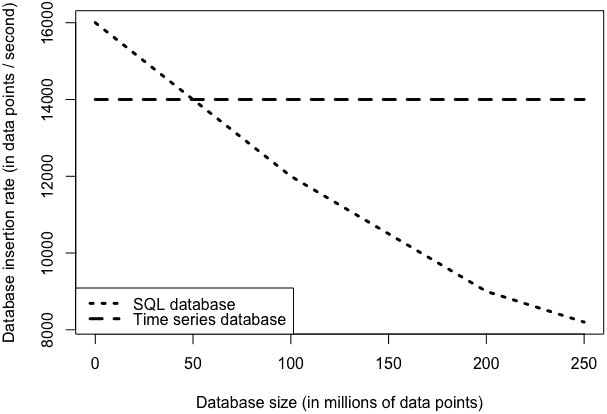

# 第五章：存储时间数据

时间序列数据的价值通常体现在回顾性而非实时流式场景中。因此，对于大多数时间序列分析来说，存储时间序列数据是必要的。

一个良好的存储解决方案应该能够在不需要大量计算资源投入的情况下，实现数据的轻松访问和可靠性。在本章中，我们将讨论设计时间序列数据存储时应考虑的数据集的各个方面。我们还将讨论 SQL 数据库、NoSQL 数据库以及各种平面文件格式的优势。

设计通用的时间序列存储解决方案是一项挑战，因为有许多不同种类的时间序列数据，每种数据都具有不同的存储、读写和分析模式。一些数据将被反复存储和检查，而其他数据只在短时间内有用，之后可以完全删除。

这里有几个时间序列存储的使用案例，它们具有不同的读、写和查询模式：

1.  您正在收集生产系统的性能指标。您需要将这些性能指标存储多年，但数据变老越久，它的详细程度就越低。因此，您需要一种存储形式，能够随着信息老化自动进行降采样和剪辑。

1.  您可以访问远程开源时间序列数据存储库，但需要在您的计算机上保留本地副本以减少网络流量。远程存储库将每个时间序列存储在一个可通过 Web 服务器下载的文件夹中，但您希望将所有这些文件合并到一个单一的数据库中，以简化操作。数据应该是不可变的，并且能够无限期地存储，因为它旨在是远程存储库的可靠副本。

1.  您通过在不同时间尺度上整合各种数据源，并进行不同的预处理和格式化，创建了自己的时间序列数据。数据的收集和处理是费力且耗时的。您希望将数据以最终形式存储，而不是反复运行预处理步骤，但您也希望保留原始数据，以备稍后探索预处理替代方案。随着您开发新的机器学习模型并随时间添加新的、更新的原始数据，您预计会经常回顾处理和原始数据。即使您为了分析而对数据进行降采样或剪辑，您也永远不会在存储中降低数据质量。

这些使用案例在其对系统的主要需求方面相当多样化：

性能随大小变化的重要性

在第一个用例中，我们将寻找一个能够集成自动化脚本以删除旧数据的解决方案。我们不会担心系统如何为大数据集进行扩展，因为我们计划保持数据集较小。相比之下，在第二和第三个用例中，我们预期会有稳定的大型数据集（用例 2）或大型且增长中的数据集（用例 3）。

随机访问数据点与顺序访问数据点的重要性

在用例 2 中，我们预计所有数据都将以相等的方式访问，因为这些时间序列数据在插入时都是相同的“年龄”，并且都引用了有趣的数据集。相比之下，在用例 1 和 3 中（尤其是在用例 1 中，根据前述描述），我们预计最近的数据会更频繁地被访问。

自动化脚本的重要性

用例 1 看起来可能会自动化，而用例 2 不需要自动化（因为数据是不可变的）。用例 3 表明几乎没有自动化，但需要获取和处理所有数据部分，而不仅仅是最近的数据。在用例 1 中，我们希望找到一个能够与脚本或存储过程集成的存储解决方案，而在用例 3 中，我们希望找到一个允许轻松定制数据处理的解决方案。

仅仅三个例子就已经很好地展示了一种通用时间序列解决方案需要满足的众多用例。

在实际用例中，您将能够定制您的存储解决方案，而不必担心找不到适合所有用例的工具。话虽如此，您始终会在类似的可用技术范围内进行选择，这些技术往往归结为以下几种：

+   SQL 数据库

+   NoSQL 数据库

+   平面文件格式

在本章中，我们涵盖了所有三种选项，并讨论了每种选项的优缺点。当然，具体情况取决于具体用例，但本章将为您提供在寻找适合您用例的时间序列存储选项时所需的基础。

我们首先讨论在选择存储解决方案时应该问什么问题。然后我们看一下 SQL 与 NoSQL 的大辩论，并检查一些最流行的时间序列存储解决方案。最后，我们考虑设置政策来让旧的时间序列数据过期并被删除。

# 定义需求

当您考虑存储时间序列数据时，您需要问自己一些问题：

+   *你将存储多少时间序列数据？这些数据会以多快的速度增长？* 你需要选择一个适合你预期数据增长速度的存储解决方案。从事时间序列工作的数据库管理员通常会对时间序列数据集的增长速度感到惊讶，尤其是那些从事事务性数据集工作的管理员。

+   *你的测量是否趋向于无尽的更新通道（例如，持续不断的网页流量更新），还是独立的事件（例如，过去 10 年每个主要美国假期的每小时空中交通时间序列）？* 如果你的数据像一个无尽的通道，你大多数情况下会查看最近的数据。另一方面，如果你的数据是一个由独立时间序列分割成单独事件的集合，那么时间上更远的事件可能仍然相当有趣。在后一种情况下，随机访问是更可能的模式。

+   *你的数据是定期还是不定期分布的？* 如果你的数据是定期分布的，你可以提前更准确地计算你预期收集的数据量以及数据的输入频率。如果你的数据是不定期分布的，你必须准备一个不太可预测的数据访问方式，能有效地处理静止期和写入活动期。

+   *你是否将持续收集数据，还是你的项目有一个明确定义的结束？* 如果你的数据收集有一个明确定义的结束，这将更容易知道你需要适应多大的数据集。然而，许多组织发现一旦开始收集某种类型的时间序列，就不想停止！

+   *你将如何处理你的时间序列？你需要实时可视化吗？为神经网络预处理数据以进行数千次迭代？高度可用于大型移动用户群体的分片数据？* 你的主要用例将表明你更可能需要顺序访问还是随机访问你的数据，以及延迟在你选择存储格式时应扮演的重要角色。

+   *你将如何剔除或降低数据采样率？你将如何防止无限增长？一个时间序列中个别数据点的生命周期应该是什么样子？* 不可能永久存储所有事件。最好是系统地和提前做出关于数据删除策略的决定，而不是临时决定。你越是能在前期做出承诺，你在存储格式选择上就能做出更好的选择。关于这点，我们将在下一节详细讨论。

这些问题的答案将表明你是否应该存储原始数据还是处理后的数据，数据是否应该根据时间或其他轴来定位在内存中，以及是否需要以便于读写的形式存储你的数据。用例会有所不同，所以你应该在每一个新数据集上做一次全新的盘点。

###### **提示**

*分片* 数据是一个大数据系统中的一部分，但分散到更小、更可管理的块中，通常分布在网络上的多个服务器上。

## **实时数据与存储数据**

在考虑数据的存储选项时，理解数据的生命周期至关重要。对于数据的实际使用案例能越实际，你需要保存的数据就越少，你需要担心找到最佳存储系统的时间也就越少，因为你不会迅速积累到无法处理的数据量。通常，组织会过度记录感兴趣的事件，并害怕丢失它们的数据存储，但是将更多数据存储在无法处理的形式中远不如在有意义的时间尺度上存储聚合数据有用。

对于短暂的数据，比如仅用于确保一切正常的性能数据，可能永远不需要将数据存储在收集的形式中，至少不需要很长时间。这对于事件驱动数据尤为重要，其中没有单个事件重要，而是感兴趣的是聚合统计数据。

假设你运行一个 Web 服务器，记录并向你报告每个移动设备加载特定网页所需的时间。结果是不规则的时间序列，可能看起来像表 5-1 所示。

表 5-1\. Web 服务器时间序列

| 时间戳 | 加载页面时间 |
| --- | --- |
| 2018 年 4 月 5 日晚上 10:22:24 | 23 秒 |
| 2018 年 4 月 5 日晚上 10:22:28 | 15 秒 |
| 2018 年 4 月 5 日晚上 10:22:41 | 14 秒 |
| 2018 年 4 月 5 日晚上 10:23:02 | 11 秒 |

由于多种原因，你可能对页面加载时间的任何单独测量都不感兴趣。你希望聚合数据（例如，每分钟平均加载时间），即使聚合统计数据也只有短暂的兴趣。假设你在那台服务器上通宵值班。你希望确保在你负责期间性能良好。你可以简化为你值班 12 小时的数据点，这将包含你可能需要的大部分信息，如 Table 5-2 所示。

表 5-2\. 值班时段简化数据点

| 时间段 | 最流行的访问小时 | 加载次数 | 平均加载时间 | 最大加载时间 |
| --- | --- | --- | --- | --- |
| 2018 年 4 月 5 日晚上 8 点至次日早上 8 点 | 23 时 | 3,470 | 21 秒 | 45 秒 |

在这种情况下，你不应计划无限期地存储单个事件。相反，你应该建立一个存储解决方案，仅提供临时存储的个体事件，直到数据进入其最终形式。通过防止数据暴增开始之前的操作，你将为自己和同事节省很多麻烦。与无人感兴趣的 3,470 个单独事件相比，你将拥有易于访问和紧凑的感兴趣数据。在可能的情况下，你应该通过聚合和去重简化数据存储。

接下来，我们考虑几种减少数据量而不丢失信息的机会。

### 缓慢变化的变量

如果你正在存储一个状态变量，请考虑只记录数值发生变化的数据点。例如，如果你每隔五分钟记录一次温度，你的温度曲线可能看起来像一个阶梯函数，特别是如果你只关心最接近度数的值。在这种情况下，存储重复数值是不必要的，通过不这样做你可以节省存储空间。

### 嘈杂的高频数据

如果你的数据很嘈杂，有理由不太关心任何特定的数据点。考虑在记录数据点之前对它们进行聚合，因为高噪声水平使得任何单个测量值的价值降低。当然，这将是相当特定于领域，并且你需要确保下游用户仍然能够评估其目的中测量数据中的噪声。

### 过时数据

数据越老，你的组织使用它的可能性就越小，除非以非常一般的方式。每当你开始记录一个新的时间序列数据集时，你应该预先考虑时间序列数据何时可能变得不相关：

+   是否有自然的过期日期？

+   如果不能，你能查看一下你的分析部门过去的研究，看看它们到底可以追溯到多远吗？你的数据集中最老的数据上次真正被 Git 仓库中的任何脚本访问是什么时候？

如果你能自动化地删除数据，而不会妨碍数据分析工作，你将通过减少可扩展性的重要性或者减少庞大数据集上慢查询的负担，来改善你的数据存储选项。

到目前为止，我们已经讨论了时间序列存储的一般使用情况范围。我们还回顾了一组关于如何生成和分析时间序列数据集的查询，以便这些查询可以指导我们选择存储格式。我们现在回顾两种常见的时间序列存储选项：数据库和文件。

# 数据库解决方案

对于几乎所有的数据分析师或数据工程师来说，数据库是如何存储数据的直观而熟悉的解决方案。与关系型数据一样，数据库通常是处理时间序列数据的良好选择。特别是当你需要一个开箱即用的解决方案时，其中具有经典数据库特性之一：

+   可扩展到多个服务器的存储系统

+   低延迟读/写系统

+   已经可以计算常用指标的函数（例如在分组查询中计算平均值，其中分组可以应用于时间指标）

+   可用于调整系统性能和分析瓶颈的故障排除和监控工具

这些是选择数据库而不是文件系统的充分理由，[其中之一](https://perma.cc/K994-RXE9)，特别是在处理新数据集时，你应该始终考虑数据库解决方案。数据库，特别是 NoSQL 数据库，可以帮助你保持灵活性。此外，与单独处理文件相比，数据库将使您的项目更快地启动，因为您将需要的大部分样板代码已经就位。即使最终决定采用文件存储解决方案（大多数人不会这样做），首先使用数据库可以帮助您确定在新的数据处理成熟时如何组织自己的文件结构。

在本节的其余部分，我们将介绍 SQL 和 NoSQL 数据库在时间序列中的各自优势，然后讨论目前流行的时间序列应用数据库选项。

好消息是，时间序列图表似乎是目前数据库领域中增长最快的类别，因此您可以期待在未来看到更多甚至更好的时间序列数据库解决方案选择。

## SQL 与 NoSQL 的比较

SQL 与 NoSQL 在时间序列数据库社区中的辩论与更广泛的领域一样活跃。许多专家数据库管理员坚持认为 SQL 是唯一的选择，并且没有任何形式的数据不能通过一组良好的关系表格进行很好地描述。尽管如此，在实践中，当组织试图扩展 SQL 解决方案以适应大量时间序列数据时，通常会出现性能下降的情况，因此始终值得考虑 NoSQL 解决方案，特别是如果您正在寻找一个开放的解决方案，可以扩展以适应时间序列数据收集开始时看不到有限时间范围的情况。

尽管 SQL 和 NoSQL 解决方案都可以适用于时间序列数据，但我们首先通过探索时间序列数据与 SQL 数据库开发的数据类型之间的不同，来激励我们讨论将数据库逻辑应用于时间序列数据的困难。

### 最初启发 SQL 数据库的数据特征

通过回顾 SQL 解决方案的历史，我们可以最好地理解 SQL 式思维与时间序列数据之间的不匹配。SQL 解决方案基于事务数据，这是完全描述离散事件所需的任何数据。事务由反映许多主键的属性组成，例如产品、参与者、时间和交易的价值。请注意，时间可以作为一个主键存在，但只能作为众多主键之一，而不是作为信息的主要轴。

事务数据有两个重要特征，与时间序列需求大不相同：

+   现有数据点经常会更新。

+   数据访问有些随机，因为不需要底层排序。

### 时间序列数据的特征

时间序列数据详细记录了某物的整个历史，而事务记录仅告诉我们最终状态。因此，时间序列数据通常不需要更新，这意味着随机访问的写操作不是首要考虑的。

这意味着在设计数据库用于时间序列时，性能目标对几十年来 SQL 数据库设计的关键性并不重要。事实上，考虑到在设计时间序列数据库时的目标，我们有着非常不同的优先级，因为我们将如何使用时间序列数据。我们时间序列数据使用案例的主要特征包括：

+   写操作优先于读操作。

+   数据的写入、读取和更新并非随机顺序，而是按照时间顺序相关的顺序进行。

+   并发读取远比事务数据更可能发生。

+   除了时间本身，几乎没有其他主键。

+   大量删除比单个数据点删除更常见。

这些特性支持使用 NoSQL 数据库，因为许多通用应用的 NoSQL 数据库提供了时间序列数据库所需的大部分功能，尤其是对写操作的强调优于读操作。从概念上讲，NoSQL 数据库与时间序列数据非常匹配，因为它们本身就反映了时间序列数据收集的各个方面，例如并非所有数据点都会收集所有字段。NoSQL 的灵活模式与时间序列数据天然契合。当前推动 NoSQL 数据库流行的很大一部分数据就是时间序列数据。

因此，开箱即用的 NoSQL 数据库在写操作方面往往比 SQL 数据库表现更好。图 5-1 展示了用于时间序列数据点插入（写操作）的常用 SQL 数据库与常用 NoSQL 数据库的性能比较。



###### 图 5-1\. 为了时间序列使用而设计的数据库的一个共同特征是，数据插入速率与数据库大小成正比。与传统的 SQL 存储解决方案相比，这是一个显著的优势。

### 如何在 SQL 和 NoSQL 之间做出选择

或许会让人觉得我在推动你使用 NoSQL，但 SQL 数据库也有许多良好的使用场景。在考虑自己的数据时，请记住这一适用于数据存储的原则，无论是在 SQL 数据库、NoSQL 数据库还是纯文本文件中：*那些通常在同一时间被请求的数据应该存储在相同的位置*。这是无论你的使用场景如何都是最重要的因素。

许多会议演示和博客文章把 NoSQL 解决方案宣扬为精确迎合高写入低更新情景的解决方案，其中数据不会随机排序。尽管如此，SQL 数据库仍然是一种可行且经常使用的时间序列存储选项。特别是，在一些对传统 SQL 数据库及其内存结构的重点进行架构变更后，这些挑战可以得到应对，同时保留 SQL 的一些[优势](https://perma.cc/3ZUQ-B5WC)。例如，如何简单且看似显而易见地构建 SQL 表的内存表示以考虑时间，可以显著提升性能。

最终，NoSQL 和 SQL 之间的区别高度依赖于实现，并不像它们被宣传的那样系统化或重要。让你的数据决定你选择这些技术中的某一个具体实现。当你考虑你的时间序列数据的属性和访问使用模式时，你可以记住一些一般的限制：

*SQL 在时间序列中的优点*

+   如果你的时间序列存储在 SQL 数据库中，你可以轻松地将其与存储在该数据库中的相关横截面数据关联起来。

+   分层时间序列数据与关系表是自然匹配的。适当的 SQL 模式集将帮助你组织相关的时间序列，并清晰地划分层次结构，而这些在 NoSQL 解决方案中可能会比较零散地分布。

+   如果你正在创建基于交易数据的时间序列，在这种情况下最好将数据存储在 SQL 数据库中，这样可以轻松进行验证、交叉引用等操作。

*NoSQL 在时间序列中的优点*

+   写入速度快。

+   如果你对未来数据不了解，设计一个智能和健壮的模式将是很困难的，它们是不错的选择。

+   对于不熟悉的用户来说，这些数据库通常是开箱即用的更高性能解决方案，因为你不太可能设计一个笨拙的模式或者被锁定在一个平庸的模式设计中。

## 流行的时间序列数据库和文件解决方案

现在我们将讨论一些流行的时间序列数据的数据库解决方案。这些给你一种可用性的感觉，除了传统的 SQL 解决方案之外。请注意，这里讨论的技术占据了一个拥挤和碎片化的技术景观。今年常用的技术明年可能不那么流行。因此，这个讨论不应被视为具体的技术推荐，而更像是一组样本，帮助说明市场的当前状态。

### 时间序列专用数据库及相关监控工具

首先，我们讨论专门用于存储和监控时间序列数据的工具。特别是，我们看一下时间序列数据库（InfluxDB）和另一款性能监控工具，它也可以作为时间序列存储解决方案（Prometheus）。每个工具的优势必然反映了其独特的重点和使用模式。

#### InfluxDB

InfluxDB 是一个专门针对时间序列的数据库，根据其在 GitHub 项目网页上的[描述](https://oreil.ly/6qmVH)：

> InfluxDB 是一个开源时间序列数据库，用于记录度量、事件并进行分析。

在 InfluxDB 中，数据按时间序列组织。InfluxDB 中的数据点包括：

+   一个时间戳

+   指示测量内容的标签

+   一个或多个键/值字段（例如 `temperature=25.3`）

+   包含元数据标签的键/值对

作为一个时序感知的数据库，InfluxDB 会自动为任何未带时间戳的数据点添加时间戳。此外，InfluxDB 使用类似于 SQL 的查询语言，例如：

```
SELECT * FROM access_counts WHERE value > 10000

```

InfluxDB 的其他优势包括：

+   数据保留选项，允许您轻松自动指定和删除陈旧数据

+   高数据摄取速度和激进的数据压缩

+   允许为个别时间序列添加标签，以便快速索引与特定条件匹配的时间序列

+   成为成熟的[TICK 堆栈](https://oreil.ly/KLjGo)的一部分，这是一个用于捕获、存储、监控和显示时间序列数据的平台

还有许多其他的时间序列专用数据库；目前 InfluxDB 是最流行的，因此您最有可能遇到它。它提供的选项是时间序列数据存储中常见的期望属性。

作为一个数据库，InfluxDB 是一个*推送式*系统，这意味着在使用它时，您将数据推送到数据库进行摄取。这与我们将讨论的下一个选项 Prometheus 不同。

鉴于这些规格，像 InfluxDB 这样的解决方案从一开始就以时序感知的方式提供所有一般功能。这意味着您可以利用现有的 SQL 技能，同时还能从捕获但控制时序数据增长的需求中获益。最后，在捕获时序数据时，您还可以获得所需的快速写入。

#### Prometheus

Prometheus [描述自己](https://github.com/prometheus/prometheus) 为一个“监控系统和时间序列数据库”，通过 HTTP 工作。这个描述表明它的一般重点：首先是监控，其次是存储。Prometheus 的一个巨大优势在于它是一个*拉取式*系统，这意味着用于拉取数据以创建时间序列的逻辑以及拉取的频率可以轻松调整和检查。

Prometheus 在紧急情况下是一个很好的资源，因为它是原子性和自我依赖的。然而，由于其拉取式架构，不能保证完全实时或准确。虽然它应该是快速和粗糙性能监控的首选技术，但不适用于数据必须是 100%准确的应用程序。

Prometheus 使用称为 PromQL 的功能表达语言进行查询：

```
access_counts > 10000

```

Prometheus 还通过 PromQL 提供了一个 API，用于许多常见的时间序列任务，甚至包括如何做出预测(`predict_linear()`)和计算时间序列的每单位时间增长率(`rate()`)等复杂功能。通过简单的接口也提供了时间段内的聚合。相比于 InfluxDB，Prometheus 更强调监控和分析，因此自动化数据整理功能较少。

Prometheus 是一个有用的时间序列存储解决方案，特别适用于实时流应用和数据可用性至关重要的场景。由于其自定义脚本语言和较少类似数据库的架构与 API，它具有较陡的学习曲线，但仍被许多开发人员广泛使用和喜爱。

### 通用 NoSQL 数据库

虽然时间序列特定的数据库提供了许多优势，但您也可以考虑更通用的 NoSQL 数据库的情况。这些数据库基于*文档*结构而不是*表*结构，并且通常不具备专门用于时间序列的显式功能。

尽管 NoSQL 数据库的灵活模式对于时间序列数据仍然很有用，特别是对于数据集的生命周期中数据收集的节奏和输入通道数量可能会发生变化的新项目。例如，时间序列可能最初只包含一个数据通道，但逐渐增加到包含更多种类的数据，所有数据都有时间戳。后来，可能会决定一些输入通道并不特别有用，它们可能会被停用。

在这种情况下，将数据存储在 SQL 表中将会因几个原因而困难，并导致大量 NaN，即数据不可用时的标记。相比之下，NoSQL 数据库在数据不可用时会简单地保留这些通道的缺失，而不是在矩形数据存储中标记大量 NaN。

一种受欢迎且性能出色的 NoSQL 时间序列数据库是 MongoDB。Mongo 特别关注其作为时间序列数据库的价值，并积极推动开发适合物联网的架构和指导。它提供了高级聚合特性，可用于按时间和与时间相关的分组的聚合操作，并提供了许多自动化流程来将时间分割为人类相关的标记，例如星期几或每月的日期：

+   `$dayOfWeek`

+   `$dayOfMonth`

+   `$hour`

此外，Mongo 专注于展示如何处理时间序列的广泛文档工作。¹ 一套准备好的文档和机构专注于时间序列数据明确意味着用户可以期待这个数据库会继续开发更多面向时间的功能。

然而，比所有这些功能更有用的是 Mongo 在随时间演变的架构上的灵活性。如果你在处理不断变化的数据收集实践的快速演变的时间序列数据集上工作，这种架构的灵活性将为你节省大量麻烦。

例如，想象一下一家医疗创业公司可能发生的时间序列数据收集实践：

1.  你的创业公司推出了一款血压应用，并只收集两个指标，收缩压和舒张压，鼓励用户每天多次测量…

1.  但是你的用户希望得到增强的生活方式建议，并且他们乐意为你提供更多的数据。用户提供从他们的生日到每月体重记录再到每小时步数和卡路里计数等一切。显然，这些不同类型的数据以截然不同的节奏进行收集…

1.  但后来你意识到一些数据并不是很有用，所以你停止了收集它…

1.  但是即使你不再使用，你的用户也会想念你的数据显示，所以你重新开始收集最受欢迎的数据…

1.  然后，你最大市场之一的政府通过了关于健康数据存储的法律，你需要清除那些数据或加密它，因此你需要一个新的加密字段…

1.  并且变化还在继续。

当你需要像这样的应用程序中描述的查询和架构灵活性时，你可以选择一个提供了合理平衡的通用 NoSQL 数据库，既具有时间特定性又具有更一般灵活性。

与时序特定数据库相比，通用 NoSQL 数据库的另一个优势是你可以更轻松地将非时序数据集成到同一数据库中，以便跨数据集引用相关数据。有时候，通用 NoSQL 数据库恰好是性能考量和类似 SQL 功能的完美结合，而无需为时序功能优化 SQL 数据库架构的聪明办法。

在本节中，我们已经研究了 NoSQL 数据库解决方案²，并调查了一些当前流行的选项。虽然我们可以预期主导市场的特定技术随着时间的推移而演变，但这些技术操作的一般原则和它们提供的优势将保持不变。作为一个快速回顾，我们在不同类型的数据库中发现的一些优势包括：

+   高读取或写入容量（或两者兼有）

+   灵活的数据结构

+   推送或拉取数据摄取

+   自动化数据修剪流程

时序数据库专用于时序特定任务，可以提供最多的开箱即用自动化功能，但其模式灵活性较低，整合相关的横截面数据的机会也较少，相比之下，通用的 NoSQL 数据库更具有这些特点。

一般而言，数据库比平面文件存储格式提供更大的灵活性，但这种灵活性意味着数据库不如简单的平面文件存储格式流畅，并且在 I/O 性能上也较差，接下来我们将讨论这一点。

# 文件解决方案

总而言之，数据库是一种集成了脚本和数据存储功能的软件。它本质上是一个包装在特殊软件中的平面文件，负责使该文件尽可能安全且易于使用。

有时候，摆脱这个外部层并全面承担数据存储的责任是有意义的。虽然这在商业应用中并不常见，但在科学研究中经常这样做，在极少数的工业应用（如高频交易）中，速度至关重要。在这种情况下，分析师将设计一个更复杂的数据管道，涉及分配存储空间、打开文件、读取文件、关闭文件、保护文件等，而不仅仅是编写一些数据库查询。

如果符合以下任何条件，平面文件解决方案是一个不错的选择：

+   你的数据格式已经成熟，因此可以承诺在相当长的时间内使用特定规范。

+   你的数据处理受 I/O 限制，因此在加速开发时间上投入是有意义的。

+   你不需要随机访问，而可以顺序读取数据。

在本节中，我们简要概述了一些常见的平面文件解决方案。你还应该记住，你始终可以[创建自己的文件存储格式](https://perma.cc/DU98-FWW9)，尽管这相当复杂，并且通常只有在你使用高性能语言（如 C++或 Java）时才值得这样做。

如果你的系统已经成熟且对性能要求敏感到足以支持平面文件系统，那么即使可能需要将数据迁出数据库，实施平面文件系统也有几个优点。这些优点包括：

+   平面文件格式与系统无关。如果需要共享数据，只需以已知的可共享格式提供文件即可。无需请求合作者远程访问你的数据库或设置他们自己的镜像数据库。

+   平面文件格式的 I/O 开销必然比数据库少，因为这只涉及对平面文件的简单读取操作，而不是对数据库的检索和读取操作。

+   平面文件格式编码了数据应该读取的顺序，而并非所有数据库都会这样做。这强制执行了数据的串行读取，这在某些情况下是可取的，比如用于深度学习训练体制。

+   与数据库相比，您的数据将占用比较小的内存空间，因为您可以最大程度地利用压缩机会。相关地，您可以调整数据压缩程度，以明确平衡在应用程序中最小化数据存储占用和 I/O 时间的愿望。更多的压缩将意味着更小的数据占用，但更长的 I/O 等待时间。

## NumPy

如果您的数据纯粹是数字，一种广泛使用的选择是 Python NumPy 数组。NumPy 数组可以轻松保存为各种格式，并且有许多基准出版物比较它们的相对性能。例如，[`array_storage_benchmark` GitHub 仓库](https://perma.cc/ZBS7-PR56) 专为测试各种 NumPy 文件格式的效率和速度而设计。

NumPy 数组的缺点是它们只有一个数据类型，这意味着您不能自动存储异构时间序列数据，而必须考虑是否可以将单一数据类型用于原始或处理后的数据（尽管有办法绕过此限制）。另一个缺点是，NumPy 数组不自然地为行或列添加标签，因此没有直接的方法为数组的每一行添加时间戳，例如。

使用 NumPy 数组的优点是可以使用多种选项保存，包括占用空间更小并且比数据库解决方案具有更快 I/O 的压缩二进制格式。从分析和存储的角度来看，它也是一种开箱即用的性能良好的数据结构。

## Pandas

如果您希望轻松标记数据或轻松存储异构时间序列数据（或两者兼有），请考虑不那么流畅但更灵活的 Pandas 数据框架。当您有一个时间序列，其中包含许多不同类型的数据（例如事件计数（整数）、状态测量（浮点数）和标签（字符串或独热编码））时，Pandas 数据框架特别有用。在这种情况下，您可能希望坚持使用 Pandas 数据框架（还要记住，“pandas”这个名字实际上来自于“面板数据”的省略，因此对许多用例来说，这是一种自然的格式）。

Pandas 数据框架被广泛使用，有多个在线资源可用于比较用于存储此类数据的[各种格式](https://perma.cc/BNJ5-EDGM)。

## 标准 R 等效物

存储 R 对象的本地格式是 `.Rds` 和 `.Rdata` 对象。这些都是二进制文件格式，因此它们在压缩和 I/O 方面必然比基于文本的格式更有效率，从这个角度来看，它们类似于 Python 中的 Pandas 数据框架。相关地，[`feather` 格式](https://perma.cc/4C3J-TBK8) 可用于在 R 和 Python 中以语言无关的文件格式保存数据框架。对于 R 用户来说，本地二进制格式（当然）是性能最佳的。表格 5-3 比较了文件格式选项。

表格 5-3\. 文件格式选项的大小和性能比较

| 格式名称 | 相对大小 | 相对加载时间 |
| --- | --- | --- |
| .RDS | 1 倍 | 1 倍 |
| feather | 2 倍 | 1 倍 |
| csv | 3 倍 | 20 倍 |

正如我们所见，本地格式明显是减少存储空间和 I/O 的优胜者，而那些使用文本文件格式而不是二进制文件的人在存储和 I/O 减速方面会付出沉重代价。

## Xarray

当你的时间序列数据扩展到许多维度时，可能是时候考虑更工业化的数据解决方案了，即[Xarray](http://xarray.pydata.org/en/stable)，这有多个理由是有用的：

+   命名维度

+   像 NumPy 这样的向量化数学操作

+   类似 Pandas 的分组操作

+   允许根据时间范围进行索引的类似数据库的功能

+   多种文件存储选项

Xarray 是一种支持许多时间序列特定操作的数据结构，例如在时间上索引和重采样、插值数据以及访问日期时间的各个组成部分。Xarray 作为一个高性能科学计算工具构建，对于时间序列分析应用来说被严重低估和轻视。

Xarray 是 Python 中的一种数据结构，它提供了多种存储选项。它实现了 pickle 和另一种称为`netCDF`的二进制文件格式，这是一种跨平台和多语言支持的通用科学数据格式。如果你希望在 Python 中提升你的时间序列应用能力，Xarray 是一个不错的起点。

正如您所见，有许多选项用于时间序列数据的平面文件存储，一些选项带有相关功能（如 Xarray），一些选项则具有非常简化的纯数字格式（如 NumPy）。当将数据集从面向数据库的流水线迁移到面向文件的流水线时，将会有一些与简化数据和重写脚本以将逻辑从数据库移出并放入显式 ETL（提取-转换-加载）脚本相关的成长阵痛。在性能至关重要的情况下，将数据移到文件中很可能是减少延迟的最重要一步。常见的希望采取此方法的情况包括：

+   对延迟敏感的预测，比如用于用户界面的软件

+   高 I/O 密集型重复数据访问情况，例如训练深度学习模型

另一方面，对于许多应用程序而言，数据库的便利性、可扩展性和灵活性远远超过了较高的延迟。你的最佳存储方案将在很大程度上取决于你存储的数据的性质以及你想要做什么。

# 更多资源

+   关于时间序列数据库技术：

    Jason Moiron，《关于时间序列数据库的思考》，jmoiron 博客，2015 年 6 月 30 日，https://perma.cc/8GDC-6CTX。

    这篇 2015 年的经典博文提供了一个早期时间段与时间序列数据库以及记录一切的崇拜之间的一瞥。这篇关于存储时间序列数据库选项和典型用例的高层次概述对于数据库管理和工程初学者非常有益。

    Preetam Jinka, [“时间序列数据库列表,”](https://perma.cc/9SCQ-9G57) Misframe 博客，2016 年 4 月 9 日，https://perma.cc/9SCQ-9G57.

    这份时间序列数据库的长列表经常更新，展示目前市场上的数据库。每个数据库条目都有重点介绍，说明特定数据库与竞争对手和前辈的关系。

    Peter Zaitsev, [“Percona 博客调查：您使用哪种数据库引擎存储时间序列数据？”](https://perma.cc/5PXF-BF7L) Percona 博客，2017 年 2 月 10 日，https://perma.cc/5PXF-BF7L.

    这项 2017 年的数据库工程师调查显示，关系数据库（SQL 数据库）继续作为一个群体占据主导地位，35% 的受访者表示他们使用这些数据库来存储时间序列数据。ElasticSearch、InfluxDB、MongoDB 和 Prometheus 也是受欢迎的选择。

    Rachel Stephens, [“时间序列数据库市场现状,”](https://perma.cc/WLA7-ABRU) RedMonk，2018 年 4 月 3 日，https://perma.cc/WLA7-ABRU.

    一位技术分析师最近的数据驱动撰写描述了通过对 GitHub 和 Stack Overflow 活动的实证调查，时间序列数据库存储的最流行解决方案。报告还显示由于时间序列数据的广泛用例以及数据库分段化的趋势，时间序列存储领域存在较高的分散度。

    Prometheus.io, [“Prometheus 文档：与其他备选方案的比较,”](https://perma.cc/M83E-NBHQ) 无日期，https://perma.cc/M83E-NBHQ.

    这份极其详细和全面的列表将 Prometheus 与其他流行的时间序列存储解决方案进行比较。您可以将此模型用作快速参考，了解与 Prometheus 替代方案相关的主导数据结构和存储结构。这是一个了解当前提供的选择以及各种为时序数据设计的数据库之间权衡的好地方。

+   关于调整通用数据库技术：

    Gregory Trubetskoy, [“高效在 PostgreSQL 中存储时间序列,”](https://perma.cc/QP2D-YBTS) Notes to Self 博客，2015 年 9 月 23 日，https://perma.cc/QP2D-YBTS.

    这篇较老但仍然相关的博文解释了如何以性能为重点在 Postgres 中存储时间序列。Trubetskoy 解释了“朴素”方法（数值列和时间戳列）的困难，并给出了基于 Postgres 数组的实用建议。

    Josiah Carlson, [“使用 Redis 作为时间序列数据库,”](https://perma.cc/RDZ2-YM22) InfoQ，2016 年 1 月 2 日，https://perma.cc/RDZ2-YM22.

    本文提供了有关如何使用 Redis 作为时间序列数据库的详细建议和示例。虽然 Redis 自创建以来一直被用于时间序列数据，但作者指出了几个需要注意的地方，以及可以在许多时间序列使用案例场景中应用的优势数据结构。这篇文章不仅对于学习如何使用 Redis 处理时间序列数据很有帮助，而且作为如何将更一般的工具重新用于时间序列特定用途的示例也非常有用。

    迈克·弗里德曼，[“时间序列数据：为什么（以及如何）使用关系数据库而不是 NoSQL”](https://perma.cc/A6CU-6XTZ)，Timescale 博客，2017 年 4 月 20 日，https://perma.cc/A6CU-6XTZ。

    TimescaleDB 的创始人在这篇博客文章中描述了他的团队如何构建一个具有特定于时间数据的内存布局修改的时间序列数据库作为关系数据库。TimescaleDB 认为传统 SQL 数据库在处理时间序列数据时的主要问题是不可扩展性，导致数据在内存中进出进行时间相关查询时性能缓慢。TimescaleDB 建议布置内存和内存映射以反映数据的时间性质，并减少将不同数据交换到内存中和从内存中交换出去的次数。

    希尔马尔·布赫塔，[“将多个表与有效时间范围合并为单个维度”](https://perma.cc/B8CT-BCEK)，Oraylis 博客，2014 年 11 月 17 日，https://perma.cc/B8CT-BCEK。

    虽然标题不太吸引人，但对于我们这些不是 SQL 数据库专家的人来说，这篇博客文章非常有用。它展示了一种处理标记为仅在特定时间范围内有效的数据及如何跨多个表进行联合的良好方式。这是一个令人惊讶地常见且难以解决的问题。所涉及的示例包括几个人力资源图表，包括雇员的雇佣有效日期、给定部门的有效日期、特定办公室位置的有效日期以及公司汽车的有效日期。一个非常可能的任务是确定某一天雇员的状态—该人是否受雇，并且在哪个部门、在哪个位置，并且是否有公司汽车？这听起来很直观，但要回答这个问题所需的 SQL 查询却很困难，在这篇文章中有详细的覆盖。

¹ 例如，参见[“MongoDB 中的时间序列数据模式设计”](https://perma.cc/E8XL-R3SY)，[“时间序列数据与 MongoDB：第一部分 – 简介”](https://perma.cc/A2D5-HDFB)，以及[“时间序列数据与 MongoDB：第二部分 – 模式设计最佳实践”](https://perma.cc/2LU7-YDHX)。相反的观点请参考[“如何在 MongoDB 中存储时间序列数据，以及为什么这是个坏主意”](https://perma.cc/T4KM-Z2B4)。

² SQL 数据库针对时间序列数据的优化超出了本书的范围，并且往往非常具体于使用情况。本章末尾的一些资源解答了这个问题。
