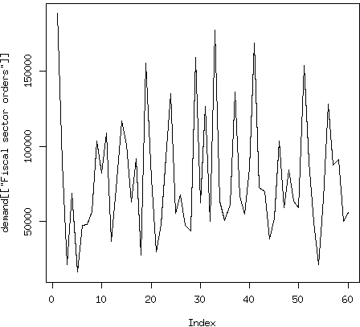

# 第六章：时间序列统计模型

在本章中，我们研究了一些时间序列的线性统计模型。这些模型与线性回归有关，但考虑到同一时间序列中数据点之间的相关性，与应用于横断面数据的标准方法形成对比，在后者中假设样本中的每个数据点独立于其他数据点。

我们将讨论的具体模型包括：

+   自回归（AR）模型，移动平均（MA）模型和自回归积分移动平均（ARIMA）模型

+   向量自回归（VAR）

+   层次模型。

这些模型传统上是时间序列预测的主力军，并继续在从学术研究到工业建模的广泛情境中应用。

# 为什么不使用线性回归？

作为数据分析师，您可能已经对线性回归非常熟悉。如果不熟悉，可以定义如下：线性回归假设您拥有*独立同分布*（iid）的数据。正如我们在前几章节中详细讨论的那样，这在时间序列数据中并非如此。在时间序列数据中，接近时间的点往往彼此强相关。事实上，如果没有时间相关性，时间序列数据几乎无法用于传统的时间序列任务，如预测未来或理解时间动态。

有时，时间序列教程和教科书会给人一种错误的印象，即线性回归对于时间序列没有用处。他们让学生认为简单的线性回归根本行不通。幸运的是，这完全不是事实。普通最小二乘线性回归可以应用于时间序列数据，只要以下条件成立：

*关于时间序列行为的假设*

+   时间序列对其预测变量具有线性响应。

+   没有输入变量在时间上是恒定的或与另一个输入变量完全相关的。这简单地扩展了传统线性回归对独立变量的要求，以考虑数据的时间维度。

*关于误差的假设*

+   对于每个时间点，考虑到所有时间段（向前和向后）的所有解释变量，误差的期望值为 0。

+   在任意给定时间点上的误差与过去或未来的输入是不相关的。因此，误差的自相关函数图表不会显示任何模式。

+   误差的方差与时间无关。

如果这些假设成立，那么普通最小二乘回归是系数的无偏估计，即使对于时间序列数据也是如此。¹ 在这种情况下，估计量的样本方差具有与标准线性回归相同的数学形式。因此，如果你的数据符合刚刚列出的假设，你可以应用线性回归，这无疑会帮助你提供时间序列行为的清晰和简单的直觉。

刚刚描述的数据要求类似于应用于横截面数据的标准线性回归的要求。我们增加的是对数据集时间特性的强调。

###### 警告

不要强行使用线性回归。当你的数据不满足所需的假设时，应用线性回归可能会产生一些后果：

+   你的系数将不会最小化模型的误差。

+   由于依赖未满足的假设，你用于确定系数是否为非零的*p*值将是错误的。这意味着你对系数显著性的评估可能是错误的。

当合适时，线性回归可以提供简单和透明性，但错误的模型肯定不是透明的！

可以质疑时间序列分析师是否过于严格地应用标准线性回归所需的假设，以至于不能使用线性回归技术。现实世界的分析师偶尔在模型假设上取得一些自由是有益的，只要了解这样做的潜在风险。

遵守模型假设的重要性在很大程度上取决于领域。有时候，模型会在明知其基本假设未被满足的情况下应用，因为相对于回报来说，后果并不严重。例如，在高频交易中，尽管没有人相信数据严格遵循所有标准假设，线性模型因为多种原因而非常受欢迎。²

# 什么是无偏估计量？

如果一个估计值既不是过高也不是过低，那么它使用的是一个无偏估计量。这通常是一件好事，尽管你应该注意*偏差-方差权衡*，这是对统计和机器学习问题的描述，在这些问题中，参数估计偏差较小的模型往往会有更高的参数估计方差。参数估计的方差反映了估计在不同数据样本中的变化程度。

如果你发现自己的情况适合使用线性回归进行预测任务，考虑利用`tslm()`，这是`forecast`[包](https://perma.cc/TR6C-4BUZ)中设计的提供时间序列数据的简易线性回归方法的函数。

# 为时间序列开发的统计方法

我们考虑专门为时间序列数据开发的统计方法。我们首先研究为单变量时间序列数据开发的方法，从自回归模型的非常简单的情况开始，即一个模型，它表示时间序列的未来值是其过去值的函数。然后，我们逐步深入复杂的模型，最后讨论多元时间序列的向量自回归以及一些额外的专门的时间序列方法，例如 GARCH 模型和层次建模。

## 自回归模型

自回归(AR)模型依赖于过去预测未来的直觉，因此假设一个时间序列过程，在这个过程中，时间*t*的值是该系列在早期时间点的值的函数。

我们对这个模型的讨论将更为详细，以便让您了解统计学家如何考虑这些模型及其特性。因此，我们从一个相当详细的理论概述开始。如果您对如何推导时间序列的统计模型特性不感兴趣，可以略读这部分内容。

### 使用代数来理解 AR 过程的约束条件。

自回归看起来就像许多人在尝试拟合时间序列时会使用的第一种方法，特别是如果除了时间序列本身外没有其他信息的话。它确实如其名称所示：对过去值进行回归以预测未来值。

最简单的 AR 模型，即 AR(1)模型，描述如下：

<math xmlns="http://www.w3.org/1998/Math/MathML"><mrow><msub><mi>y</mi> <mi>t</mi></msub> <mo>=</mo> <msub><mi>b</mi> <mn>0</mn></msub> <mo>+</mo> <msub><mi>b</mi> <mn>1</mn></msub> <mo>×</mo> <msub><mi>y</mi> <mrow><mi>t</mi><mo>-</mo><mn>1</mn></mrow></msub> <mo>+</mo> <msub><mi>e</mi> <mi>t</mi></msub></mrow></math>

在时间*t*的系列值是一个常数*b[0]*、其前一个时间步的值乘以另一个常数 <math xmlns="http://www.w3.org/1998/Math/MathML"><mrow><msub><mi>b</mi> <mn>1</mn></msub> <mo>×</mo> <msub><mi>y</mi> <mrow><mi>t</mi><mo>-</mo><mn>1</mn></mrow></msub></mrow></math> 和一个也随时间变化的误差项*e[t]*的函数。假定这个误差项具有恒定的方差和均值为 0。我们将仅回顾前一个时间点的自回归项称为 AR(1)模型，因为它包括一个一期滞后的查看。

顺便说一句，AR(1)模型与仅有一个解释变量的简单线性回归模型具有相同的形式。也就是说，它映射为：

<math xmlns="http://www.w3.org/1998/Math/MathML"><mrow><mi>Y</mi> <mo>=</mo> <msub><mi>b</mi> <mn>0</mn></msub> <mo>+</mo> <msub><mi>b</mi> <mn>1</mn></msub> <mo>×</mo> <mi>x</mi> <mo>+</mo> <mi>e</mi></mrow></math>

如果我们知道*b*[0]和*b*[1]的值，我们可以计算*y*[*t*]的期望值和方差，给定*y*[*t*–1]。参见 Equation 6-1.³

##### 方程式 6-1. <math xmlns="http://www.w3.org/1998/Math/MathML"><mrow><mi>E</mi> <mrow><mo>(</mo> <msub><mi>y</mi> <mi>t</mi></msub> <mo>|</mo> <msub><mi>y</mi> <mrow><mi>t</mi><mo>-</mo><mn>1</mn></mrow></msub> <mo>)</mo></mrow> <mo>=</mo> <msub><mi>b</mi> <mn>0</mn></msub> <mo>+</mo> <msub><mi>b</mi> <mn>1</mn></msub> <mo>×</mo> <msub><mi>y</mi> <mrow><mi>t</mi><mo>-</mo><mn>1</mn></mrow></msub> <mo>+</mo> <msub><mi>e</mi> <mi>t</mi></msub></mrow></math>

<math xmlns="http://www.w3.org/1998/Math/MathML"><mrow><mi>V</mi> <mi>a</mi> <mi>r</mi> <mrow><mo>(</mo> <msub><mi>y</mi> <mi>t</mi></msub> <mo>|</mo> <msub><mi>y</mi> <mrow><mi>t</mi><mo>-</mo><mn>1</mn></mrow></msub> <mo>)</mo></mrow> <mo>=</mo> <mi>V</mi> <mi>a</mi> <mi>r</mi> <mrow><mo>(</mo> <msub><mi>e</mi> <mi>t</mi></msub> <mo>)</mo></mrow> <mo>=</mo> <mi>V</mi> <mi>a</mi> <mi>r</mi> <mrow><mo>(</mo> <mi>e</mi> <mo>)</mo></mrow></mrow></math>

此表示法的推广允许 AR 过程的当前值依赖于最近的 *p* 个值，从而产生 AR(*p*) 过程。

现在我们转向更传统的符号表示，使用 *ϕ* 表示自回归系数：

<math xmlns="http://www.w3.org/1998/Math/MathML"><mrow><msub><mi>y</mi> <mi>t</mi></msub> <mo>=</mo> <msub><mi>ϕ</mi> <mn>0</mn></msub> <mo>+</mo> <msub><mi>ϕ</mi> <mn>1</mn></msub> <mo>×</mo> <msub><mi>y</mi> <mrow><mi>t</mi><mo>-</mo><mn>1</mn></mrow></msub> <mo>+</mo> <msub><mi>ϕ</mi> <mn>2</mn></msub> <mo>×</mo> <msub><mi>y</mi> <mrow><mi>t</mi><mo>-</mo><mn>2</mn></mrow></msub> <mo>+</mo> <mo>.</mo> <mo>.</mo> <mo>.</mo> <mo>+</mo> <msub><mi>ϕ</mi> <mi>p</mi></msub> <mo>×</mo> <msub><mi>y</mi> <mrow><mi>t</mi><mo>-</mo><mi>p</mi></mrow></msub> <mo>+</mo> <msub><mi>e</mi> <mi>t</mi></msub></mrow></math>

如 第三章 中讨论的，稳定性是时间序列分析中的关键概念，因为许多时间序列模型，包括 AR 模型，都需要它。

我们可以从稳定性的定义中确定 AR 模型保持稳定的条件。我们继续关注最简单的 AR 模型，即 AR(1) 在 方程 6-2 中。

##### 方程 6-2\. <math xmlns="http://www.w3.org/1998/Math/MathML"><mrow><msub><mi>y</mi> <mi>t</mi></msub> <mo>=</mo> <msub><mi>ϕ</mi> <mn>0</mn></msub> <mo>+</mo> <msub><mi>ϕ</mi> <mn>1</mn></msub> <mo>×</mo> <msub><mi>y</mi> <mrow><mi>t</mi><mo>-</mo><mn>1</mn></mrow></msub> <mo>+</mo> <msub><mi>e</mi> <mi>t</mi></msub></mrow></math>

我们假设过程是稳定的，然后“向后”推导看看这对系数意味着什么。首先，根据稳定性的假设，我们知道过程的期望值在所有时间点上必须相同。我们可以按照 AR(1) 过程的方程重新表述 *y[t]*：

<math xmlns="http://www.w3.org/1998/Math/MathML"><mrow><mi>E</mi> <mrow><mo>(</mo> <msub><mi>y</mi> <mi>t</mi></msub> <mo>)</mo></mrow> <mo>=</mo> <mi>μ</mi> <mo>=</mo> <mi>E</mi> <mrow><mo>(</mo> <msub><mi>y</mi> <mrow><mi>t</mi><mo>-</mo><mn>1</mn></mrow></msub> <mo>)</mo></mrow></mrow></math>

根据定义，*e[t]* 的期望值为 0。此外，phises 是常数，因此它们的期望值就是它们的恒定值。方程 6-2 在左侧简化为：

<math xmlns="http://www.w3.org/1998/Math/MathML"><mrow><mi>E</mi> <mrow><mo>(</mo> <msub><mi>y</mi> <mi>t</mi></msub> <mo>)</mo></mrow> <mo>=</mo> <mi>E</mi> <mrow><mo>(</mo> <msub><mi>ϕ</mi> <mn>0</mn></msub> <mo>+</mo> <msub><mi>ϕ</mi> <mn>1</mn></msub> <mo>×</mo> <msub><mi>y</mi> <mrow><mi>t</mi><mo>-</mo><mn>1</mn></mrow></msub> <mo>+</mo> <msub><mi>e</mi> <mi>t</mi></msub> <mo>)</mo></mrow></mrow></math>

<math xmlns="http://www.w3.org/1998/Math/MathML"><mrow><mi>E</mi> <mo>(</mo> <msub><mi>y</mi> <mi>t</mi></msub> <mo>)</mo> <mo>=</mo> <mi>μ</mi></mrow></math>

以及右侧为：

<math xmlns="http://www.w3.org/1998/Math/MathML"><mrow><msub><mi>ϕ</mi> <mn>0</mn></msub> <mo>+</mo> <msub><mi>ϕ</mi> <mn>1</mn></msub> <mo>×</mo> <mi>μ</mi> <mo>+</mo> <mn>0</mn></mrow></math>

这简化为：

<math xmlns="http://www.w3.org/1998/Math/MathML"><mrow><mi>μ</mi> <mo>=</mo> <msub><mi>ϕ</mi> <mn>0</mn></msub> <mo>+</mo> <msub><mi>ϕ</mi> <mn>1</mn></msub> <mo>×</mo> <mi>μ</mi></mrow></math>

这反过来意味着 (方程 6-3)。

##### 方程 6-3\. <math xmlns="http://www.w3.org/1998/Math/MathML"><mrow><mi>μ</mi> <mo>=</mo> <mfrac><msub><mi>ϕ</mi> <mn>0</mn></msub> <mrow><mn>1</mn><mo>-</mo><msub><mi>ϕ</mi> <mn>1</mn></msub></mrow></mfrac></mrow></math>

因此，我们找到了过程的均值与基础 AR(1) 系数之间的关系。

我们可以采取类似的步骤来查看恒定方差和协方差如何对 *ϕ* 系数施加条件。我们首先用 *ϕ*[0] 的值代替，我们可以从 方程 6-3 推导出 方程 6-4。

##### 方程 6-4\. <math xmlns="http://www.w3.org/1998/Math/MathML"><mrow><msub><mi>ϕ</mi> <mn>0</mn></msub> <mo>=</mo> <mi>μ</mi> <mo>×</mo> <mrow><mo>(</mo> <mn>1</mn> <mo>–</mo> <msub><mi>ϕ</mi> <mn>1</mn></msub> <mo>)</mo></mrow></mrow></math>

到 方程 6-2：

<math xmlns="http://www.w3.org/1998/Math/MathML"><mrow><msub><mi>y</mi> <mi>t</mi></msub> <mo>=</mo> <msub><mi>ϕ</mi> <mn>0</mn></msub> <mo>+</mo> <msub><mi>ϕ</mi> <mn>1</mn></msub> <mo>×</mo> <msub><mi>y</mi> <mrow><mi>t</mi><mo>-</mo><mn>1</mn></mrow></msub> <mo>+</mo> <msub><mi>e</mi> <mi>t</mi></msub></mrow></math>

<math xmlns="http://www.w3.org/1998/Math/MathML"><mrow><msub><mi>y</mi> <mi>t</mi></msub> <mo>=</mo> <mrow><mo>(</mo> <mi>μ</mi> <mo>–</mo> <mi>μ</mi> <mo>×</mo> <msub><mi>ϕ</mi> <mn>1</mn></msub> <mo>)</mo></mrow> <mo>+</mo> <msub><mi>ϕ</mi> <mn>1</mn></msub> <mo>×</mo> <msub><mi>y</mi> <mrow><mi>t</mi><mo>-</mo><mn>1</mn></mrow></msub> <mo>+</mo> <msub><mi>e</mi> <mi>t</mi></msub></mrow></math>

<math xmlns="http://www.w3.org/1998/Math/MathML"><mrow><msub><mi>y</mi> <mi>t</mi></msub> <mo>–</mo> <mi>μ</mi> <mo>=</mo> <msub><mi>ϕ</mi> <mn>1</mn></msub> <mrow><mo>(</mo> <msub><mi>y</mi> <mrow><mi>t</mi><mo>-</mo><mn>1</mn></mrow></msub> <mo>–</mo> <mi>μ</mi> <mo>)</mo></mrow> <mo>+</mo> <msub><mi>e</mi> <mi>t</mi></msub></mrow></math>

如果你检查方程 6-4，你会发现左右两边的表达式非常相似，即 <math xmlns="http://www.w3.org/1998/Math/MathML"><mrow><msub><mi>y</mi> <mi>t</mi></msub> <mo>–</mo> <mi>€</mi> <mi>“</mi> <mi>μ</mi></mrow></math> 和 <math xmlns="http://www.w3.org/1998/Math/MathML"><mrow><msub><mi>y</mi> <mrow><mi>t</mi><mo>-</mo><mn>1</mn></mrow></msub> <mo>–</mo> <mi>€</mi> <mi>“</mi> <mi>μ</mi></mrow></math> 。考虑到这个时间序列是平稳的，我们知道时间 *t* 的数学应与时间 *t*–1 的数学相同。我们将方程 6-4 重新写成一个时间步骤较早的方程 6-5。

##### 方程式 6-5\. <math xmlns="http://www.w3.org/1998/Math/MathML"><mrow><msub><mi>y</mi> <mrow><mi>t</mi><mo>-</mo><mn>1</mn></mrow></msub> <mo>–</mo> <mi>μ</mi> <mo>=</mo> <msub><mi>ϕ</mi> <mn>1</mn></msub> <mrow><mo>(</mo> <msub><mi>y</mi> <mrow><mi>t</mi><mo>-</mo><mn>2</mn></mrow></msub> <mo>–</mo> <mi>μ</mi> <mo>)</mo></mrow> <mo>+</mo> <msub><mi>e</mi> <mrow><mi>t</mi><mo>-</mo><mn>1</mn></mrow></msub></mrow></math>

我们可以将其代入方程 6-4 如下：

<math xmlns="http://www.w3.org/1998/Math/MathML"><mrow><msub><mi>y</mi> <mi>t</mi></msub> <mo>–</mo> <mi>μ</mi> <mo>=</mo> <msub><mi>ϕ</mi> <mn>1</mn></msub> <mrow><mo>(</mo> <msub><mi>ϕ</mi> <mn>1</mn></msub> <mrow><mo>(</mo> <msub><mi>y</mi> <mrow><mi>t</mi><mo>-</mo><mn>2</mn></mrow></msub> <mo>–</mo> <mi>μ</mi> <mo>)</mo></mrow> <mo>+</mo> <msub><mi>e</mi> <mrow><mi>t</mi><mo>-</mo><mn>1</mn></mrow></msub> <mo>)</mo></mrow> <mo>+</mo> <msub><mi>e</mi> <mi>t</mi></msub></mrow></math>

我们为了清晰起见重新排列方程 6-6。

##### 方程 6-6\. <math xmlns="http://www.w3.org/1998/Math/MathML"><mrow><msub><mi>y</mi> <mi>t</mi></msub> <mo>–</mo> <mi>μ</mi> <mo>=</mo> <msub><mi>e</mi> <mi>t</mi></msub> <mo>+</mo> <msub><mi>ϕ</mi> <mn>1</mn></msub> <mrow><mo>(</mo> <msub><mi>e</mi> <mrow><mi>t</mi><mo>-</mo><mn>1</mn></mrow></msub> <mo>+</mo> <msub><mi>ϕ</mi> <mn>1</mn></msub> <mrow><mo>(</mo> <msub><mi>y</mi> <mrow><mi>t</mi><mo>-</mo><mn>2</mn></mrow></msub> <mo>–</mo> <mi>μ</mi> <mo>)</mo></mrow> <mo>)</mo></mrow></mrow></math>

你应该注意到在方程 6-6 中还可以进行另一次替换，使用我们早期使用的同样递归替换，但这次不是在 *y*[t–1] 上工作，而是在 *y*[t–2] 上工作。如果你进行这种替换，模式就变得清晰了。

<math xmlns="http://www.w3.org/1998/Math/MathML"><mrow><msub><mi>y</mi> <mi>t</mi></msub> <mo>-</mo> <mi>μ</mi> <mo>=</mo> <msub><mi>e</mi> <mi>t</mi></msub> <mo>+</mo> <msub><mi>ϕ</mi> <mn>1</mn></msub> <mrow><mo>(</mo> <msub><mi>e</mi> <mrow><mi>t</mi><mo>-</mo><mn>1</mn></mrow></msub> <mo>+</mo> <msub><mi>ϕ</mi> <mn>1</mn></msub> <mrow><mo>(</mo> <msub><mi>e</mi> <mrow><mi>t</mi><mo>-</mo><mn>2</mn></mrow></msub> <mo>+</mo> <msub><mi>ϕ</mi> <mn>1</mn></msub> <mrow><mo>(</mo> <msub><mi>y</mi> <mrow><mi>t</mi><mo>-</mo><mn>3</mn></mrow></msub> <mo>-</mo> <mi>μ</mi> <mo>)</mo></mrow> <mo>)</mo></mrow> <mo>)</mo></mrow></mrow></math>

<math xmlns="http://www.w3.org/1998/Math/MathML"><mrow><mo>=</mo> <msub><mi>e</mi> <mi>t</mi></msub> <mo>+</mo> <mi>ϕ</mi> <mo>×</mo> <msub><mi>e</mi> <mrow><mi>t</mi><mo>-</mo><mn>1</mn></mrow></msub> <mo>+</mo> <msup><mi>ϕ</mi> <mn>2</mn></msup> <mo>×</mo> <msub><mi>e</mi> <mrow><mi>t</mi><mo>-</mo><mn>2</mn></mrow></msub> <mo>+</mo> <msup><mi>ϕ</mi> <mn>3</mn></msup> <mo>×</mo> <msub><mi>e</mi> <mrow><mi>t</mi><mo>-</mo><mn>3</mn></mrow></msub> <mo>+</mo> <mtext>(expressions</mtext> <mtext>still</mtext> <mtext>to</mtext> <mtext>be</mtext> <mtext>substituted)</mtext></mrow></math>

因此，我们可以更一般地得出结论，<math xmlns="http://www.w3.org/1998/Math/MathML"><mrow><msub><mi>y</mi> <mi>t</mi></msub> <mo>–</mo> <mi>μ</mi> <mo>=</mo> <msubsup><mo>∑</mo> <mrow><mi>i</mi><mo>=</mo><mn>1</mn></mrow> <mi>∞</mi></msubsup> <msubsup><mi>ϕ</mi> <mn>1</mn> <mi>i</mi></msubsup> <mo>×</mo> <msub><mi>e</mi> <mrow><mi>t</mi><mo>-</mo><mi>i</mi></mrow></msub></mrow></math> 。

用简单的英语来说，*y[t]* 减去过程均值是误差项的线性函数。

结果可以用来计算给定<math xmlns="http://www.w3.org/1998/Math/MathML"><mrow><mi>E</mi> <mo>[</mo> <mrow><mo>(</mo> <msub><mi>y</mi> <mi>t</mi></msub> <mo>-</mo> <mi>μ</mi> <mo>)</mo></mrow> <mo>×</mo> <msub><mi>e</mi> <mrow><mi>t</mi><mo>+</mo><mn>1</mn></mrow></msub> <mo>]</mo> <mo>=</mo> <mn>0</mn></mrow></math>的期望值，假设在不同*t*值上<math xmlns="http://www.w3.org/1998/Math/MathML"><msub><mi>e</mi> <mi>t</mi></msub></math>的值是独立的。由此我们可以得出结论，*y*[*t*–1]和*e[t]*的协方差为 0，这正如预期的那样。我们可以类似地应用逻辑来计算*y[t]*的方差通过平方这个等式：

<math xmlns="http://www.w3.org/1998/Math/MathML"><mrow><msub><mi>y</mi> <mi>t</mi></msub> <mo>-</mo> <mi>μ</mi> <mo>=</mo> <msub><mi>ϕ</mi> <mn>1</mn></msub> <mrow><mo>(</mo> <msub><mi>y</mi> <mrow><mi>t</mi><mo>-</mo><mn>1</mn></mrow></msub> <mo>-</mo> <mi>μ</mi> <mo>)</mo></mrow> <mo>+</mo> <msub><mi>e</mi> <mi>t</mi></msub></mrow></math>

<math xmlns="http://www.w3.org/1998/Math/MathML"><mrow><mi>v</mi> <mi>a</mi> <mi>r</mi> <mrow><mo>(</mo> <msub><mi>y</mi> <mi>t</mi></msub> <mo>)</mo></mrow> <mo>=</mo> <msubsup><mi>ϕ</mi> <mn>1</mn> <mn>2</mn></msubsup> <mi>v</mi> <mi>a</mi> <mi>r</mi> <mrow><mo>(</mo> <msub><mi>y</mi> <mrow><mi>t</mi><mo>-</mo><mn>1</mn></mrow></msub> <mo>)</mo></mrow> <mo>+</mo> <mi>v</mi> <mi>a</mi> <mi>r</mi> <mrow><mo>(</mo> <msub><mi>e</mi> <mi>t</mi></msub> <mo>)</mo></mrow></mrow></math>

因为由于平稳性方程两边的方差数量必须相等，所以(*var*(*y*[t]) = *var*(*y*[t] – 1)，这意味着：

<math xmlns="http://www.w3.org/1998/Math/MathML"><mrow><mi>v</mi> <mi>a</mi> <mi>r</mi> <mrow><mo>(</mo> <msub><mi>y</mi> <mi>t</mi></msub> <mo>)</mo></mrow> <mo>=</mo> <mfrac><mrow><mi>v</mi><mi>a</mi><mi>r</mi><mo>(</mo><msub><mi>e</mi> <mi>t</mi></msub> <mo>)</mo></mrow> <mrow><mn>1</mn><mo>–</mo><msubsup><mi>ϕ</mi> <mn>1</mn> <mn>2</mn></msubsup></mrow></mfrac></mrow></math>

鉴于方差根据定义必须大于或等于 0，我们可以看到，<math xmlns="http://www.w3.org/1998/Math/MathML"><msubsup><mi>ϕ</mi> <mn>1</mn> <mn>2</mn></msubsup></math>必须小于 1，以确保在前述方程的右侧有正值。这意味着对于平稳过程，我们必须有 –1 < *ϕ[1]* < 1。这是弱平稳的必要和充分条件。

我们研究了 AR(1)过程，因为它是最简单的自回归过程。在实践中，您将一直拟合更复杂的模型。可以推导出任意阶 AR(*p*)过程的类似平稳条件，并且有许多书籍在其中进行了演示。如果您有兴趣更详细地了解这一点，请查看本章末尾列出的资源。从这次讨论中最重要的收获是，通过一些代数和统计学，时间序列是非常易于理解的，并且平稳性不仅仅是绘制模型的问题，而是可以根据任何给定统计模型的具体情况进行计算的数学概念。

###### 提示

*分布*是描述由过程生成特定值的所有可能值的概率的统计函数。虽然您可能尚未正式遇到此术语，但无疑已经遇到了此概念。例如，考虑*钟形曲线*，它是一个概率分布，指出大多数测量值将接近并均匀分布在平均值的两侧。在统计学中通常称为*正态*或*高斯分布*。

### 选择 AR(p)模型的参数

要评估 AR 模型对数据的适用性，请从绘制过程及其*偏自相关函数*（PACF）开始。AR 过程的 PACF 应在 AR(*p*)过程的阶数*p*之外截尾为零，从而在数据中以实证方式给出 AR 过程的阶数的明确和视觉指示。

另一方面，AR 过程不会有信息性的自相关函数（ACF），尽管它将具有 ACF 的特征形状：随着时间偏移增加呈指数衰减。

让我们通过一些实际数据来看看这个。我们使用了发布在[UCI 机器学习库](https://perma.cc/B7EQ-DNLU)中的一些需求预测数据。

首先，我们按时间顺序绘制数据（图 6-1）。由于我们将其建模为 AR 过程，我们查看偏自相关函数以设置过程的阶数阈值（图 6-2）。



###### 图 6-1\. 每日银行订单数（2）。


###### 图 6-2\. 未转换订单时间序列的偏自相关图，如图 6-1 所示。

我们可以看到 PACF 的值在滞后 3 处穿过了 5%的显著性阈值。这与 R 语言`stats`包中的`ar()`函数的结果一致。如果没有指定自回归模型的阶数，`ar()`函数会自动选择其阶数：

```
## R
> fit <- ar(demand[["Banking orders (2)"]], method = "mle")
> fit

Call:
ar(x = demand[["Banking orders (2)"]], method = "mle")
Coefficients:
      1            2            3 
 -0.1360        -0.2014      -0.3175  

```

如果我们查看`ar()`函数的[文档](https://perma.cc/8H8Z-CX9R)，我们可以看到所选的阶数是根据*赤池信息准则*（AIC）确定的（我们保持了默认参数未改变）。这是有帮助的，因为它显示我们通过检查 PACF 所做的视觉选择与通过最小化信息准则进行的选择是一致的。这两种选择模型阶数的方式是不同的，但在这种情况下它们是一致的。

注意，`ar()`函数还为我们提供了模型的系数。然而，我们可能希望限制这些系数。例如，观察 PACF，我们可能会想知道是否真的要包括滞后-1 项的系数，或者是否应该将该项的系数指定为强制的 0，因为其 PACF 值远低于显著性阈值。在这种情况下，我们还可以使用`stats`包中的`arima()`函数。

在这里，我们展示了如何调用函数来拟合 AR(3)模型，通过将阶数参数设置为`c(3, 0, 0)`，其中 3 指的是 AR 分量的阶数（在后续示例中，我们将指定本章后几页中涵盖的差分和移动平均参数的其他分量）：

```
## R
> est <- arima(x = demand[["Banking orders (2)"]], 
>             order = c(3, 0, 0))
> est

Call:
arima(x = demand[["Banking orders (2)"]], order = c(3, 0, 0))

Coefficients:
         ar1 ar2      ar3 intercept
     -0.1358  -0.2013 -0.3176  79075.350
s.e.   0.1299  0.1289 0.1296   2981.125

sigma² estimated as 1.414e+09:  log likelihood = -717.42, 
                                 aic = 1444.83

```

要在我们的模型中注入先验知识或观点，我们可以将一个系数约束为 0。例如，如果我们想要在我们的模型中将滞后-1 项的系数约束为 0，我们可以使用以下调用：

```
## R
> est.1 <- arima(x = demand[["Banking orders (2)"]], 
>                order = c(3, 0, 0), 
>                fixed = c(0, NA, NA, NA))
> est.1

Call:
arima(x = demand[["Banking orders (2)"]], 
       order = c(3, 0, 0), 
       fixed = c(0, NA, NA, NA))

Coefficients:
     ar1   ar2       ar3     intercept
       0  -0.1831  -0.3031    79190.705
s.e.   0  0.1289    0.1298     3345.253

sigma² estimated as 1.44e+09:  log likelihood = -717.96, 
                                aic = 1443.91

```

将传递给`arima`函数的固定参数向量中的一个值设置为 0 而不是`NA`，将约束该值保持为 0：

```
## R
> fixed <- c(0, NA, NA, NA)
```

我们现在检查我们模型在训练数据上的表现，以评估我们模型对这个数据集的拟合程度。我们可以通过两种方式来做这件事。首先，我们绘制残差的自相关函数（即误差），以查看是否存在模型未覆盖的自相关模式。

由于`arima()`函数的输出，绘制残差非常简单（见图 6-3）：

```
## R
> acf(est.1$residuals)
```


###### 图 6-3\. 我们拟合的 AR(3)模型的残差的 ACF，强制滞后 - 1 参数为 0。

ACF 的值都未超过显著性阈值。当然，我们不应盲目依赖显著性阈值来评估或拒绝显著性，但这一观察结果是我们已认为合理的模型中的一个有用数据点。

我们在这里的残差（即误差项）中没有看到自相关的模式。如果我们看到这样的模式，我们可能会希望回到原始模型，并考虑包括额外的项以增加复杂性，以解释残差的显著自相关。

另一个常见的测试是*Ljung-Box 测试*，这是对时间序列随机性的整体测试。更正式地提出了以下零假设和备择假设：

+   H0: 数据不表现出串行相关。

+   H1: 数据表现出串行相关。

这个测试通常适用于 AR（更广义地说，是 ARIMA）模型，更具体地说是适用于模型拟合的残差而不是模型本身：

```
## R
> Box.test(est.1$residuals, lag = 10, type = "Ljung", fitdf = 3)

Box-Ljung test

data:  est.1$residuals
X-squared = 9.3261, df = 7, p-value = 0.2301

```

我们对我们的`est.1`模型应用 Ljung-Box 测试来评估其拟合优度。我们无法拒绝数据不表现出串行相关的零假设。这证实了我们刚刚通过绘制残差的 ACF 发现的结果。

### 使用 AR(p)过程进行预测

在接下来的章节中，我们将说明如何使用 AR 过程进行预测。我们首先探讨了一步预测的情况，然后讨论了多步预测与进一步情况的区别。好消息是从编码的角度来看，并没有太大的差异，尽管后者的基础数学更为复杂。

#### 向前预测一步

首先考虑我们想要用已知（或估计）的 AR 模型预测一步的情况。在这种情况下，我们实际上拥有所有所需的信息。

我们继续使用需求数据的模型，将滞后 - 1 系数约束为 0（之前作为`est.1`拟合）。

我们使用`forecast`包中的`fitted()`函数绘制预测图。这里是完整的代码；这样做非常简单：

```
## R
> require(forecast)
> plot(demand[["Banking orders (2)"]], type = 'l')
> lines(fitted(est.1), col = 3, lwd = 2) ## use the forecast package

```

这导致了图 6-4 所示的绘图结果。


###### 图 6-4\. 这里我们看到实线表示的原始时间序列和虚线表示的拟合时间序列。

# AR(p)模型是移动窗口函数。

我们除了使用`forecast`包的拟合功能来从我们的 AR(3)模型生成预测之外，还有一种选择：我们可以更明确地手工编写一个预测，通过使用`zoo`包的`rollapply()`函数来实现，这是我们之前讨论过的。该函数可以计算窗口函数，也可以计算 AR 过程。为此，我们将从`ar()`拟合中获取系数，并将这些权重应用于表示不同滞后值的输入向量，以在每个点上生成预测。我留给你作为一个练习。

现在让我们考虑预测的质量。如果我们计算预测值与实际值之间的相关性，我们得到 0.29。在某些情境下这并不差，但请记住，有时候对数据进行差分会消除看似强关系，取而代之的是一种基本上是随机的关系。

如果我们在拟合数据时数据确实不是真正稳定的，那么未识别的趋势就会伪装成良好的模型性能，而实际上它是我们在建模之前应该解决的数据特征。

我们可以对系列数据和预测值同时进行差分，以查看模型是否能够良好地预测一个时间段到下一个时间段的变化。即使在差分之后，我们的预测和数据显示出相似的模式，这表明我们的模型是有效的（参见图 6-5）。


###### 图 6-5。差分系列和差分预测之间存在强相关性，表明模型确实识别出了一种潜在的关系。

我们还可以通过绘制差分系列并观察其相关性来测试我们是否在同一时间预测相同的移动。此图表显示了一些相关性，我们可以通过计算相关值来确认。即使用于预测从一个时间步到下一个时间步的变化，该模型也能够正常工作。

回顾预测与实际值的原始图表，我们可以看到预测与数据之间的主要区别在于预测的变化幅度比数据小。它可能能够正确预测未来的方向，但无法准确预测不同时间段之间的变化幅度。这本身并不是问题，而是反映了预测是预测分布的均值，因此必然比采样数据具有更低的变异性。

统计模型的这一属性有时会在快速可视化的便利性中被忽视，这些可视化往往倾向于表明未来会比实际情况更加稳定。在呈现可视化数据时，请务必提醒观众正在绘制的内容。在这种情况下，我们的预测表明未来会比实际情况平稳得多。

#### 预测未来多个时间步

到目前为止，我们已经完成了单步预测。但是，我们可能希望进一步预测未来更长的时间。让我们想象一下，我们想要生成一个两步预测，而不是一个步预测。我们首先会生成一个步预测，然后使用这个预测值来确定我们需要预测的 <math xmlns="http://www.w3.org/1998/Math/MathML"><msub><mi>y</mi> <mi>t</mi></msub></math> 的值，以便预测 <math xmlns="http://www.w3.org/1998/Math/MathML"><msub><mi>y</mi> <mrow><mi>t</mi><mo>+</mo><mn>1</mn></mrow></msub></math> 。

请注意，在我们当前的模型中，从一步预测转变为两步预测实际上不需要这些复杂的操作，因为在预测 *y*[*t*] 时并没有使用 *y*[*t* – 1] 的值。我们知道所有需要知道的内容来进行两步预测，并且不需要估计。事实上，我们应该得到与一步预测相同的一系列值——不会有新的错误或变异源。

然而，如果我们希望预测更远的时间，我们需要生成预测的未来值作为预测的输入。让我们预测 *y*[*t*+3]。这将涉及一个模型，其系数依赖于 *y*[*t*+1] 和 *y[t]*。因此，我们需要预测这两个值——*y*[*t* + 1] 和 *y*[*t*]——然后依次使用这些估计值来预测 *y*[*t*+3]。与之前一样，我们可以使用 `forecast` 包中的 `fitted()` 函数来实现这一点——在编码上并不比单步预测更难。正如之前提到的，这也可以通过 `rollapply()` 方法来完成，但这样做需要更多的工作并且更容易出错。

现在我们使用 `fitted()` 函数，增加了一个额外的参数 `h` 作为预测的时间跨度。提醒一下，我们的对象 `est.1` 表示一个 AR(3) 过程，其滞后 -1 (时间减一) 的系数被限制为 0：

```
## R
> fitted(est.1, h = 3)
```

我们可以利用预测多个时间步骤的便利性，为不同的时间跨度生成多步预测。在下一个例子中，我们可以看到从同一基础模型生成的预测值随着前瞻时间增加而增加的方差。（注意，在显示中，四舍五入和逗号分隔修改了原始输出，以便更清楚地看到随着前瞻时间增加时估计方差的变化。）

正如你在图 6-6 中所见，随着预测时间的增加，预测的方差减少。这突显了模型的一个重要限制，即随着时间推移，实际数据的影响越来越小，因为输入数据的系数仅考虑有限的前几个时间点（在此模型中，仅回溯到滞后 - 3；即时间 - 3）。可以这样说，随着时间的推移，预测越来越接近无条件预测，即不受数据条件的影响。未来的预测接近于系列的均值，因此误差项和预测值的方差收缩为 0：

```
## R
> var(fitted(est.1, h = 3), na.rm = TRUE)
[1] 174,870,141
> var(fitted(est.1, h = 5), na.rm = TRUE)
[1] 32,323,722
> var(fitted(est.1, h = 10), na.rm = TRUE)
[1] 1,013,396
> var(fitted(est.1, h = 20), na.rm = TRUE)
[1] 1,176
> var(fitted(est.1, h = 30), na.rm = TRUE)
[1] 3.5

```

对于未来足够遥远的预测将仅仅预测过程的均值，这是有道理的。在未来某个时间点，我们当前的数据不会给我们提供与未来相关的具体合理信息，因此我们的预测逐渐回归到已知过程的基本特性，比如其均值。


###### 图 6-6. 对未来的预测绘图。随着预测时间的延长，y 轴的值范围越来越窄，模型越来越接近提供过程均值的常数预测。预测的视角从上到下分别是 3、10 和 30 个时间步。

从中要记住的重要一点是，AR（以及 MA、ARMA 和 ARIMA，稍后将讨论）模型最适合进行短期预测。这些模型对于较长时间段的预测失去了预测能力。

对于剩余的模型，我们将进行类似的处理，尽管总体上的细节较少。关于时间序列分析的所有标准教科书都有详细讨论。

## 移动平均模型

移动平均（MA）模型依赖于一个过程的图像，在这个过程中，每个时间点的值是最近过去值的“误差”项的函数，每个项相互独立。我们将在同样的步骤中回顾这个模型，就像我们研究 AR 模型一样。

# AR MA 等效性

在许多情况下，一个 MA 过程可以被表达为一个无限阶的 AR 过程。同样地，在许多情况下，一个 AR 过程可以被表达为一个无限阶的 MA 过程。要了解更多，请查看[MA 过程的可逆性](https://perma.cc/GJ6B-YASH)，[Wold 表示定理](https://perma.cc/B3DW-5QGB)，以及一般的[MA/AR 对偶性](https://perma.cc/K78H-YA6U)过程。这涉及到的数学远远超出了本书的范围！

### 该模型

移动平均模型可以类似于自回归模型来表达，只是线性方程中包含的项是现在和过去的误差项，而不是过程本身的现在和过去的值。因此，一个阶数为 *q* 的 MA 模型表示为：

<math xmlns="http://www.w3.org/1998/Math/MathML"><mrow><msub><mi>y</mi> <mi>t</mi></msub> <mo>=</mo> <mi>μ</mi> <mo>+</mo> <msub><mi>e</mi> <mi>t</mi></msub> <mo>+</mo> <msub><mi>θ</mi> <mn>1</mn></msub> <mo>×</mo> <msub><mi>e</mi> <mrow><mi>t</mi><mo>-</mo><mn>1</mn></mrow></msub> <mo>+</mo> <msub><mi>θ</mi> <mn>2</mn></msub> <mo>×</mo> <msub><mi>e</mi> <mrow><mi>t</mi><mo>-</mo><mn>2</mn></mrow></msub> <mo>.</mo> <mo>.</mo> <mo>.</mo> <mo>+</mo> <msub><mi>θ</mi> <mi>q</mi></msub> <mo>×</mo> <msub><mi>e</mi> <mrow><mi>t</mi><mo>-</mo><mi>q</mi></mrow></msub></mrow></math>

###### 警告

不要将 MA 模型与移动平均混淆。它们并不相同。一旦您知道如何拟合移动平均过程，甚至可以将 MA 模型的拟合与底层时间序列的移动平均进行比较。我留这个作为一个练习给你。

经济学家将这些误差项称为系统的“冲击”，而具有电气工程背景的人则可能将其视为一系列脉冲和模型本身作为有限脉冲响应滤波器，这意味着任何特定脉冲的影响仅保留有限时间。措辞并不重要，但许多独立事件在不同的过去时间影响当前过程值，每个事件都作出个别贡献，这是主要思想。

MA 模型根据定义是弱平稳的，无需对其参数施加任何约束。这是因为 MA 过程的均值和方差都是有限的，并且随时间不变，因为误差项被假定为均值为 0 的独立同分布。我们可以看到这样的表达式：

<math xmlns="http://www.w3.org/1998/Math/MathML"><mrow><mi>E</mi> <mo>(</mo> <msub><mi>y</mi> <mi>t</mi></msub> <mo>=</mo> <mi>μ</mi> <mo>+</mo> <msub><mi>e</mi> <mi>t</mi></msub> <mo>+</mo> <msub><mi>θ</mi> <mn>1</mn></msub> <mo>×</mo> <msub><mi>e</mi> <mrow><mi>t</mi><mo>-</mo><mn>1</mn></mrow></msub> <mo>+</mo> <msub><mi>θ</mi> <mn>2</mn></msub> <mo>×</mo> <msub><mi>e</mi> <mrow><mi>t</mi><mo>-</mo><mn>2</mn></mrow></msub> <mo>.</mo> <mo>.</mo> <mo>.</mo> <mo>+</mo> <msub><mi>θ</mi> <mi>q</mi></msub> <mo>×</mo> <msub><mi>e</mi> <mrow><mi>t</mi><mo>-</mo><mi>q</mi></mrow></msub> <mo>)</mo></mrow></math>

<math xmlns="http://www.w3.org/1998/Math/MathML"><mrow><mo>=</mo> <mi>E</mi> <mrow><mo>(</mo> <mi>μ</mi> <mo>)</mo></mrow> <mo>+</mo> <msub><mi>θ</mi> <mn>1</mn></msub> <mo>×</mo> <mn>0</mn> <mo>+</mo> <msub><mi>θ</mi> <mn>2</mn></msub> <mo>×</mo> <mn>0</mn> <mo>+</mo> <mo>.</mo> <mo>.</mo> <mo>.</mo> <mo>=</mo> <mi>μ</mi></mrow></math>

用于计算过程方差的事实是 *e[t]* 项是独立同分布的，并且还有一个一般的统计性质，即两个随机变量的和的方差等于它们各自方差的总和加上两倍的协方差。对于独立同分布变量，协方差为 0。这导致了以下表达式：

<math xmlns="http://www.w3.org/1998/Math/MathML"><mrow><mi>V</mi> <mi>a</mi> <mi>r</mi> <mrow><mo>(</mo> <msub><mi>y</mi> <mi>t</mi></msub> <mo>)</mo></mrow> <mo>=</mo> <mrow><mo>(</mo> <mn>1</mn> <mo>+</mo> <msubsup><mi>θ</mi> <mn>1</mn> <mn>2</mn></msubsup> <mo>+</mo> <msubsup><mi>θ</mi> <mn>2</mn> <mn>2</mn></msubsup> <mo>+</mo> <mo>.</mo> <mo>.</mo> <mo>.</mo> <mo>.</mo> <mo>+</mo> <msubsup><mi>θ</mi> <mi>q</mi> <mn>2</mn></msubsup> <mo>)</mo></mrow> <mo>×</mo> <msubsup><mi>σ</mi> <mi>e</mi> <mn>2</mn></msubsup></mrow></math>

因此，无论参数值如何，MA 过程的均值和方差都是随时间恒定的。

### 为 MA(q) 过程选择参数

我们对同样的数据拟合了一个 MA 模型，可以使用 ACF 来确定 MA 过程的阶数（见 Figure 6-7）。在继续阅读之前，请考虑一下 MA 过程的工作原理，并看看是否能理解为什么我们使用 ACF 而不是 PACF 来确定过程的阶数：

```
## R
> acf(demand[["Banking orders (2)"]])

```


###### 图 6-7\. 我们使用需求时间序列的 ACF 来确定 MA 模型的阶数。

# ACF 和 PACF 模式与 MA 和 AR 过程不同。

不同于自回归过程，其自相关函数缓慢衰减，MA 过程的定义确保了对于大于 *q* 的任何值，自相关函数具有尖锐的截断。这是因为自回归过程依赖于先前的项，并且它们通过先前的冲击对系统进行了融入，而 MA 模型则通过它们的值直接融入冲击，从而有一种机制可以阻止冲击传播无限期。

我们可以看到在滞后 3 和 9 处有显著的值，因此我们拟合了包含这些滞后的 MA 模型。我们需要注意，我们不要错误地将模型中的错系数约束为 0，我们可以通过打印显示来确认：

```
## R
> ma.est = arima(x = demand[["Banking orders (2)"]], 
                 order = c(0, 0, 9),
                 fixed = c(0, 0, NA, rep(0, 5), NA, NA))
> ma.est
 Call:
 arima(x = demand[["Banking orders (2)"]], order = c(0, 0, 9), 
       fixed = c(0, 0, NA, rep(0, 5), NA, NA))

 Coefficients:
       ma1  ma2      ma3  ma4  ma5  ma6  ma7  ma8      ma9  intercept
         0    0  -0.4725    0    0    0    0    0  -0.0120   79689.81
 s.e.    0    0   0.1459    0    0    0    0    0   0.1444    2674.60

 sigma² estimated as 1.4e+09:  log likelihood = -717.31,  
                                aic = 1442.61

```

我们还应该检查我们的拟合，就像我们对 AR 模型所做的那样，通过绘制模型残差的 ACF，并作为模型性能的第二个单独测试，运行 Ljung-Box 测试以检查残差的整体随机性。请注意，`Box.test()`的输入要求我们指定自由度的数量，即可以估计的模型参数数量，而不是被约束为特定值的数量。在这种情况下，自由参数是截距以及 MA3 和 MA9 项：

```
## R
> Box.test(ma.est$residuals, lag = 10, type = "Ljung", fitdf = 3)

Box-Ljung test

data:  ma.est$residuals
X-squared = 7.6516, df = 7, p-value = 0.3643

```

我们不能拒绝无残差点之间的时间相关性的原假设。同样，残差的 ACF 图表明没有时间相关性（这留作读者的练习）。

### 预测一个 MA(q)过程

我们可以再次使用`forecast`包的`fitted()`方法生成预测，这是用于 AR 过程的技术：

```
## R
> fitted(ma.est, h=1)

Time Series:
Start = 1
End = 60
Frequency = 1
[1]   90116.64  80626.91 74090.45   38321.61 74734.77 101153.20  65930.90
[8]  106351.80 104138.05 86938.99  102868.16 80502.02  81466.01  77619.15
[15] 100984.93  81463.10 61622.54   79660.81 88563.91  65370.99 104679.89
[22]  48047.39  73070.29 115034.16  80034.03 70052.29  70728.85  90437.86
[29]  80684.44  91533.59 101668.18  42273.27 93055.40  68187.65  75863.50
[36]  40195.15  82368.91  90605.60  69924.83 54032.55  90866.20  85839.41
[43]  64932.70  43030.64  85575.32  76561.14 82047.95  95683.35  66553.13
[50]  89532.20  85102.64  80937.97  93926.74 47468.84  75223.67 100887.60
[57]  92059.32  84459.85  67112.16  80917.23

```

MA 模型表现出强烈的均值回归，因此预测迅速收敛到过程的均值。这是合理的，因为该过程被认为是白噪声的函数。

如果您预测超出模型通过其顺序建立的范围，则预测将根据过程的定义必然是过程的均值。考虑一个 MA(1)模型：

<math xmlns="http://www.w3.org/1998/Math/MathML"><mrow><msub><mi>y</mi> <mi>t</mi></msub> <mo>=</mo> <mi>μ</mi> <mo>+</mo> <msub><mi>θ</mi> <mn>1</mn></msub> <mo>×</mo> <msub><mi>e</mi> <mrow><mi>t</mi><mo>-</mo><mn>1</mn></mrow></msub> <mo>+</mo> <msub><mi>e</mi> <mi>t</mi></msub></mrow></math>

要预测未来一个时间步长，我们对*y*[*t*+1]的估计是 <math xmlns="http://www.w3.org/1998/Math/MathML"><mrow><mi>μ</mi> <mo>+</mo> <msub><mi>θ</mi> <mn>1</mn></msub> <mo>×</mo> <msub><mi>y</mi> <mi>t</mi></msub> <mo>+</mo> <msub><mi>e</mi> <mi>t</mi></msub></mrow></math> 。如果我们想预测未来两个时间步长，我们的估计是：

<math xmlns="http://www.w3.org/1998/Math/MathML"><mrow><mi>E</mi> <mrow><mo>(</mo> <msub><mi>y</mi> <mrow><mi>t</mi><mo>+</mo><mn>2</mn></mrow></msub> <mo>=</mo> <mi>μ</mi> <mo>+</mo> <msub><mi>e</mi> <mrow><mi>t</mi><mo>+</mo><mn>2</mn></mrow></msub> <mo>+</mo> <msub><mi>θ</mi> <mn>1</mn></msub> <mo>×</mo> <mo>;</mo> <msub><mi>e</mi> <mrow><mi>t</mi><mo>+</mo><mn>1</mn></mrow></msub> <mo>)</mo></mrow> <mo>=</mo> <mi>μ</mi> <mo>+</mo> <mn>0</mn> <mo>+</mo> <msub><mi>θ</mi> <mn>1</mn></msub> <mo>×</mo> <mn>0</mn> <mo>=</mo> <mi>μ</mi></mrow></math>

对于 MA(1)过程，我们无法在一步之后提供有根据的预测，对于一般的 MA(*q*)过程，我们不能在比过程发射的均值更有根据地提供超过*q*步的预测。通过“有根据的”预测，我指的是我们最近的测量对预测的影响。

# 传统符号为负

请注意，MA 模型通常不像这里描述的那样编写。传统上，θ系数前的符号是负的。这是由于推导的原因，而将 MA 模型视为 AR 模型并对其参数施加约束的一种方式。这种公式，通过大量的代数运算，导致θ的系数为负。

通过我们刚刚拟合的 MA(9)模型生成预测，我们现在寻求未来 10 个时间步长的预测：

```
## R
> fitted(ma.est, h=10)

Time Series:
Start = 1
End = 60
Frequency = 1
[1]       NA NA       NA NA NA       NA NA NA
[9]       NA NA 79689.81 79689.81 79689.81 79689.81 79689.81 79689.81
[17] 79689.81 79689.81 79689.81 79689.81 79689.81 79689.81 79689.81 79689.81
[25] 79689.81 79689.81 79689.81 79689.81 79689.81 79689.81 79689.81 79689.81
[33] 79689.81 79689.81 79689.81 79689.81 79689.81 79689.81 79689.81 79689.81
[41] 79689.81 79689.81 79689.81 79689.81 79689.81 79689.81 79689.81 79689.81
[49] 79689.81 79689.81 79689.81 79689.81 79689.81 79689.81 79689.81 79689.81
[57] 79689.81 79689.81 79689.81 79689.81

```

当我们试图预测未来的 10 个时间步长时，我们预测每个时间步长的均值。即使没有花哨的统计模型，我们也可以做到这一点！

常识很重要。如果你在不理解其工作原理的情况下应用模型，可能会出现一些令人尴尬的事情，比如在你浪费了先前的时间和计算资源后，每天都向老板发送完全相同的预测。

## 自回归积分移动平均模型

现在我们已经分别检验了 AR 和 MA 模型，我们转向自回归积分移动平均（ARIMA）模型，该模型结合了这两者，认识到同一时间序列可能具有同时存在的 AR 和 MA 模型动态。这本身将导致一个 ARMA 模型，但我们扩展到 ARIMA 模型，它考虑了差分，一种去除趋势并使时间序列平稳的方法。

ARIMA 模型继续在性能上保持接近最先进的状态，特别是在数据集较小的情况下，更复杂的机器学习或深度学习模型表现不佳的情况下。然而，即使是 ARIMA 模型，尽管相对简单，也存在过拟合的危险。

### 模型

如果你一直在认真关注，那么此时你可能会摸不着头脑，因为我刚刚将同样的数据拟合到了 AR 和 MA 过程中，却没有加以评论。这是你在时间序列分析教材中有时会遇到的令人恼火的习惯。一些作者会承认这种数据的懒惰，而其他人则会漠然地忽视它。我们并没有深入调查我们之前的模型是否特别合适，但从我们使用的拟合过程中，似乎清楚地表明可以用 AR 或 MA 模型描述数据是有辩护理由的。这引发了一个问题：将这两种行为结合到同一个模型中是否有帮助？

表格 6-1 可以是检查时间序列过程的一个方便方法，以确定 AR、MA 或 ARMA 描述的最佳模型。

表格 6-1\. 确定最佳描述我们时间序列的模型

| 绘图类型 | AR(p) | MA(q) | ARMA |
| --- | --- | --- | --- |
| ACF 行为 | 缓慢下降 | 滞后 = *q*后急剧下降 | 无急剧截断 |
| PACF 行为 | 滞后 = p 后急剧下降 | 缓慢下降 | 无急剧截断 |

这将我们引向自回归移动平均（ARMA）模型，该模型适用于当 AR 和 MA 项单独描述的情况不足以充分描述经验动态时。这是一个常见情况，当 AR 和 MA 的诊断统计（PACF 和 ACF）指向非零值时，表明某个阶数的 AR 或 MA 项。这些可以结合到 ARMA 模型中。

# 沃尔德定理

沃尔德定理告诉我们，每个协方差平稳时间序列可以被写成两个时间序列的和，一个确定性的和一个随机的。根据这个定理，我们也可以说，一个平稳过程可以被 ARMA 模型合理地近似，尽管找到适当的模型当然可能相当困难。

在这里，我们通过对 MA 过程系数应用负号来切换到更传统的统计符号表示方式：

<math xmlns="http://www.w3.org/1998/Math/MathML"><mrow><msub><mi>y</mi> <mi>t</mi></msub> <mo>=</mo> <msub><mi>ϕ</mi> <mn>0</mn></msub> <mo>+</mo> <mo>∑</mo> <mrow><mo>(</mo> <msub><mi>ϕ</mi> <mi>i</mi></msub> <mo>×</mo> <mo>;</mo> <msub><mi>r</mi> <mrow><mi>t</mi><mo>-</mo><mi>i</mi></mrow></msub> <mo>)</mo></mrow> <mo>+</mo> <msub><mi>e</mi> <mi>t</mi></msub> <mo>–</mo> <mo>∑</mo> <mrow><mo>(</mo> <msub><mi>θ</mi> <mi>i</mi></msub> <mo>×</mo> <msub><mi>e</mi> <mrow><mi>t</mi><mo>-</mo><mi>i</mi></mrow></msub> <mo>)</mo></mrow></mrow></math>

ARMA 过程的平稳性取决于其 AR 组分的平稳性，并由相同的特征方程控制，该特征方程决定了 AR 模型是否平稳。

从 ARMA 模型到 ARIMA 模型的转变非常简单。ARIMA 模型与 ARMA 模型的区别在于 ARIMA 模型包括“整合”术语，这指的是模拟时间序列必须进行多少次差分以产生平稳性。

ARIMA 模型在实践中被广泛应用，特别是在学术研究和预测问题中，远远超过了 AR、MA 和 ARMA 模型。快速的 Google 学者搜索显示 ARIMA 被应用于各种预测问题，包括：

+   前往台湾的入境航空旅客

+   土耳其能源需求按燃料类型

+   印度批发蔬菜市场的日销售量

+   美国西部的急诊室需求

重要的是，差分的次数不应过大。一般来说，ARIMA（*p, d, q*）模型的每个参数值都应尽可能保持较小，以避免不必要的复杂性和对样本数据的过度拟合。作为一个并非普遍适用的经验法则，你应对*d*超过 2 和*p*和*q*超过 5 或左右持怀疑态度。此外，你应该预计*p*或*q*项将主导，并且另一个将相对较小。这些都是从分析师那里收集到的实践者笔记，并非硬性数学真理。

### 选择参数

ARIMA 模型在参数（*p, d, q*）方面进行规定。我们根据手头的数据选择合适的*p, d,*和*q*值。

下面是维基百科描述 ARIMA 模型的一些知名示例：

+   ARIMA(0, 0, 0)是一个白噪声模型。

+   ARIMA(0, 1, 0)是一个随机游走，带非零常数的 ARIMA(0, 1, 0)是带漂移的随机游走。

+   ARIMA(0, 1, 1)是指数平滑模型，ARIMA(0, 2, 2)与 Holt 线性方法相同，将指数平滑扩展到带趋势的数据，以便用于具有潜在趋势的数据预测。

我们根据领域知识的结合、各种拟合评估指标（如 AIC）以及对给定基础过程的 PACF 和 ACF 应如何出现的一般知识（如表 6-1 中描述的）来选择我们模型的顺序。接下来，我们将展示如何使用基于 PACF 和 ACF 的手动迭代过程以及基于`forecast`包的`auto.arima()`函数的自动参数选择工具来拟合 ARIMA 模型。

#### 手动拟合模型

有关选择 ARIMA 模型参数的启发法则，其中“简洁性至上”是首要考虑的。一个流行且长期存在的方法是 Box-Jenkins 方法，这是一个迭代的多步骤过程：

1.  利用你的数据、可视化和基础知识来选择适合你数据的模型类别。

1.  根据你的训练数据估计参数。

1.  根据训练数据评估你的模型性能，并调整模型参数以解决性能诊断中发现的弱点。

让我们通过一个拟合数据的例子来逐步进行。首先，我们需要一些数据。在这种情况下，为了透明和知道正确答案，我们从 ARMA 过程生成我们的数据：

```
## R
> require(forecast)
> set.seed(1017)
> ## order of arima model hidden on purpose
> y = arima.sim(n = 1000, list(ar = ###, ma = ###))

```

暂时不要关注创建的模型顺序；让我们把这当作一个谜题来解决。首先，我们应该绘制时间序列，正如我们总是做的，看它是否呈现稳态（图 6-8）。然后，我们检查*y*的 ACF 和 PACF（图 6-9），并与表 6-1 进行比较。


###### 图 6-8\. 我们时间序列的绘图。


###### 图 6-9\. 我们时间序列的 ACF 和 PACF。

我们可以看到，无论是 ACF 还是 PACF 都没有明显的截尾，这表明（见表 6-1），这是一个 ARMA 过程。我们首先拟合一个相对简单的 ARIMA(1, 0, 1)模型，因为我们看不到差分的必要性，也没有证据（图 6-10）。

```
## R
> ar1.ma1.model = Arima(y, order = c(1, 0, 1))
> par(mfrow = c(2,1))
> acf(ar1.ma1.model$residuals)
> pacf(ar1.ma1.model$residuals)

```


###### 图 6-10\. ARIMA(1, 0, 1)模型残差的 ACF 和 PACF。

图 6-10 中的残差显示出特别大的 PACF 值，表明我们还没有完全描述自回归行为。因此，我们通过添加更高阶的 AR 分量来扩展模型，在下面的代码中测试 ARIMA(2, 0, 1)模型，并绘制此更复杂模型残差的 ACF 和 PACF（图 6-11）：

```
## R
> ar2.ma1.model = Arima(y, order = c(2, 0, 1))
> plot(y, type = 'l')
> lines(ar2.ma1.model$fitted, col = 2)
> plot(y, ar2.ma1.model$fitted)
> par(mfrow = c(2,1))
> acf(ar2.ma1.model$residuals)
> pacf(ar2.ma1.model$residuals)

```


###### 图 6-11\. ARIMA(2, 0, 1)模型残差的 ACF 和 PACF。

图 6-11 中的残差再也不显示 ACF 或 PACF 的大值了。考虑到我们对一个简约模型的渴望以及过度拟合 ARIMA 模型的危险，一个明智的分析师可能会停在这里，因为在残差中没有进一步需要通过自回归、移动平均或差分组件进行拟合的行为。留给读者作为练习来考虑拟合更复杂的模型。尽管这里没有展示图形，我尝试用以下代码拟合更复杂的模型。我看到它们并没有显著改进模型与数据的拟合，也没有比前一个模型进一步降低 ACF 或 PACF 值。你可以自行验证：

```
## R
> ar2.ma2.model = Arima(y, order = c(2, 0, 2))
> plot(y, type = 'l')
> lines(ar2.ma2.model$fitted, col = 2)
> plot(y, ar2.ma2.model$fitted)
> par(mfrow = c(2,1))
> acf(ar2.ma2.model$residuals)
> pacf(ar2.ma2.model$residuals)
> 
> ar2.d1.ma2.model = Arima(y, order = c(2, 1, 2))
> plot(y, type = 'l')
> lines(ar2.d1.ma2.model$fitted, col = 2)
> plot(y, ar2.d1.ma2.model$fitted)
> par(mfrow = c(2,1))
> acf(ar2.d1.ma2.model$residuals)
> pacf(ar2.d1.ma2.model$residuals)

```

一个快速比较模型的方法在这里展示，我看看拟合模型的预测与实际值的相关性有多好：

```
## R
> cor(y, ar1.ma1.model$fitted)
[1] 0.3018926
> cor(y, ar2.ma1.model$fitted)
[1] 0.4683598
> cor(y, ar2.ma2.model$fitted)
[1] 0.4684905
> cor(y, ar2.d1.ma2.model$fitted)
[1] 0.4688166

```

从 ARIMA(1, 0, 1)模型转换到 ARIMA(2, 0, 1)模型（前两个模型）后，我们看到了显著的改善，相关性从 0.3 增加到了 0.47。另一方面，随着我们增加复杂性，相关性并没有显著提高。这进一步支持了我们早前得出的结论，即 ARIMA(2, 0, 1)模型似乎很好地描述了模型行为，并且没有必要添加更多的 AR 或 MA 分量来改善拟合。

顺便说一句，我们可以通过比较原始拟合系数（此处显示，之前被掩盖）与拟合系数来看一下拟合效果：

```
## R
## original coefficients
> y = arima.sim(n = 1000, list(ar = c(0.8, -0.4), ma = c(-0.7)))
> ar2.ma1.model$coef
         ar1          ar2          ma1    intercept 
 0.785028320 -0.462287054 -0.612708282 -0.005227573 

```

拟合系数与用于模拟数据的实际系数之间存在良好的匹配。

手动拟合 ARIMA 模型不仅仅是我们在这里展示的那样简单。几十年来，从业者们已经发展出了一些好的经验法则，用于识别问题，例如当某种类型的项过多时，当模型被过度差分时，当残差模式指向特定问题时等等。一个很好的起步资源是宾夕法尼亚州立大学一位教授编写的在线指南，可在[此处](https://perma.cc/P9BK-764B)获取。

有一些对手动拟合 ARIMA 过程的合理批评。手动拟合可能是一个定义不太清晰的过程，对分析师的判断力施加了很大压力，并且可能耗时且最终结果依赖路径。几十年来，这是一个表现良好的解决方案，用于生成实际世界中使用的预测，但并非完美。

#### 使用自动模型拟合

如今，在某些情况下，我们可以放弃手动迭代拟合过程，转而采用自动模型选择。我们的模型选择可以根据各种信息损失准则进行驱动，例如我们通过`forecast`包中的`auto.arima()`函数简要讨论的 AIC：

```
## R
> est = auto.arima(demand[["Banking orders (2)"]], 
            stepwise = FALSE, ## this goes slower 
                              ## but gets us a more complete search
            max.p = 3, max.q = 9)
>  est
Series: demand[["Banking orders (2)"]] 
ARIMA(0,0,3) with non-zero mean 

Coefficients:
          ma1      ma2      ma3       mean
      -0.0645  -0.1144  -0.4796  79914.783
s.e.   0.1327   0.1150   0.1915   1897.407

sigma² estimated as 1.467e+09:  log likelihood=-716.71
AIC=1443.42   AICc=1444.53   BIC=1453.89

```

在这种情况下，我们通过比较我们早期探索中的一行配置输入的先验知识，来放置了一个一行描述。换句话说，我们指定了 AR 和 MA 过程的最大阶数，我们准备接受的，实际上，模型选择选择了一个比我们指定的更加简洁的模型，包括没有 AR 项。尽管如此，这个模型拟合效果很好，除非我们有充分的理由这样做，否则我们不应该过多地对数据进行窥探。请注意，根据 AIC 标准，我们在前一节手动选择的 MA 模型略优于这个模型，但当我们查看图表时，这种差异似乎不具有意义。

留给读者的练习是将模型绘制为预测的模型，以及检查这个自动选择的模型的残差，并确认使用的模型似乎没有留下需要通过增加更多项来解决的残差行为。代码与我们在之前的 AR 和 MA 部分使用的代码没有区别。对于制作预测的情况也是如此，因此在此处省略了，因为我们选择的 ARIMA 模型与之前讨论和用于预测的 MA 模型并没有太大不同。

我们还可以快速研究当我们手动拟合模型时，`auto.arima()`在我们在上一节中生成的模型上的表现如何：

```
## R
> auto.model = auto.arima(y)
> auto.model
Series: y 
ARIMA(2,0,1) with zero mean 

Coefficients:
         ar1      ar2      ma1
      0.7847  -0.4622  -0.6123
s.e.  0.0487   0.0285   0.0522

sigma² estimated as 1.019:  log likelihood=-1427.21
AIC=2862.41   AICc=2862.45   BIC=2882.04

```

我们甚至没有使用`auto.arima()`的可选参数建议模型搜索从哪里开始，但它却收敛到了与我们相同的解决方案。因此，正如我们在这里所看到的，在某些情况下，我们会发现不同方法得出相同的解决方案。我们通过查看更简单模型的残差的 ACF 和 PACF 来驱动我们的分析，以构建更复杂的模型，而`auto.arima()`主要通过网格搜索来最小化 AIC 来驱动。当然，鉴于我们是从 ARIMA 过程生成原始数据，这代表了一个比许多现实数据更简单的情况。在后一种情况下，并不总是我们的手动拟合和自动模型选择得出相同的结论。

如果您将`auto.arima()`或类似的自动模型选择工具作为分析的重要组成部分，重要的是要阅读文档，尝试合成数据，并阅读其他分析师对此函数的使用经验。已知存在一些情况，该函数的表现不如预期简单，并且已知有一些解决方法。总体而言，这是一个很好的解决方案，但并不完美。⁴ 另外，关于`auto.arima()`的工作方式的良好描述，请参阅该主题的[在线教科书章节](https://perma.cc/P92B-6QXR)，该章节由该函数的作者罗布·亨德曼教授撰写。

我们演示了两种不同的参数估计方式：要么遵循 Box-Jenkins 方法来拟合模型，要么使用`forecast`包中的自动拟合。实际上，从业者对此有很强烈的意见，有些人激烈主张只支持手动迭代，而另一些人则坚决支持自动选择工具。这仍然是该领域的一个持续争论。从长远来看，随着大数据在时间序列分析中占据越来越多的地位，自动探索和模型拟合可能会主导大数据集时间序列分析。

## 向量自回归

在现实世界中，我们经常很幸运地有几个平行的时间序列，这些序列可能相互关联。我们已经探讨了如何清理和对齐这些数据，现在我们可以学习如何最大化利用它们。我们可以通过将 AR(*p*)模型推广到多变量的情况来做到这一点。这种模型的美妙之处在于它考虑了变量相互影响并相互影响——也就是说，并不存在一个特权的*y*，而其他所有变量都被指定为*x*。相反，拟合是对所有变量对称的。请注意，如果系列不是平稳的，可以像以前的其他模型一样应用差分。

# 外生和内生变量

在统计学中，一旦我们采用了变量相互影响的模型，我们称这些变量为*内生变量*，意味着它们的值由模型内部的内容解释。相反，*外生变量*是那些在模型内部无法解释的变量——也就是说，它们的值不能通过假设来解释，因此我们接受它们的值，不质疑它们产生的动态过程。

由于每个时间序列都被认为预测其他时间序列以及自身，我们将为每个变量拥有一个方程。假设我们有三个时间序列：我们将这些时间序列在时间*t*的值表示为*y*[1, *t*]、*y*[2, *t*]和*y*[3, *t*]。然后，我们可以将二阶（考虑两个时间滞后）向量自回归（VAR）方程写为：

<math xmlns="http://www.w3.org/1998/Math/MathML"><mrow><msub><mi>y</mi> <mrow><mn>1</mn><mo>,</mo><mi>t</mi></mrow></msub> <mo>=</mo> <msub><mi>ϕ</mi> <mn>01</mn></msub> <mo>+</mo> <msub><mi>ϕ</mi> <mrow><mn>11</mn><mo>,</mo><mn>1</mn></mrow></msub> <mo>×</mo> <msub><mi>y</mi> <mrow><mn>1</mn><mo>,</mo><mi>t</mi><mo>-</mo><mn>1</mn></mrow></msub> <mo>+</mo> <msub><mi>ϕ</mi> <mrow><mn>12</mn><mo>,</mo><mn>1</mn></mrow></msub> <mo>×</mo> <msub><mi>y</mi> <mrow><mn>2</mn><mo>,</mo><mi>t</mi><mo>-</mo><mn>1</mn></mrow></msub> <mo>+</mo> <msub><mi>ϕ</mi> <mrow><mn>13</mn><mo>,</mo><mn>1</mn></mrow></msub> <mo>×</mo> <msub><mi>y</mi> <mrow><mn>3</mn><mo>,</mo><mi>t</mi><mo>-</mo><mn>1</mn></mrow></msub> <mo>+</mo> <msub><mi>ϕ</mi> <mrow><mn>11</mn><mo>,</mo><mn>2</mn></mrow></msub> <mo>×</mo> <msub><mi>y</mi> <mrow><mn>1</mn><mo>,</mo><mi>t</mi><mo>-</mo><mn>2</mn></mrow></msub> <mo>+</mo> <msub><mi>ϕ</mi> <mrow><mn>12</mn><mo>,</mo><mn>2</mn></mrow></msub> <mo>×</mo> <msub><mi>y</mi> <mrow><mn>2</mn><mo>,</mo><mi>t</mi><mo>-</mo><mn>2</mn></mrow></msub> <mo>+</mo> <msub><mi>ϕ</mi> <mrow><mn>13</mn><mo>,</mo><mn>2</mn></mrow></msub> <mo>×</mo> <msub><mi>y</mi> <mrow><mn>3</mn><mo>,</mo><mi>t</mi><mo>-</mo><mn>2</mn></mrow></msub></mrow></math>

<math xmlns="http://www.w3.org/1998/Math/MathML"><mrow><msub><mi>y</mi> <mrow><mn>2</mn><mo>,</mo><mi>t</mi></mrow></msub> <mo>=</mo> <msub><mi>ϕ</mi> <mn>02</mn></msub> <mo>+</mo> <msub><mi>ϕ</mi> <mrow><mn>21</mn><mo>,</mo><mn>1</mn></mrow></msub> <mo>×</mo> <msub><mi>y</mi> <mrow><mn>1</mn><mo>,</mo><mi>t</mi><mo>-</mo><mn>1</mn></mrow></msub> <mo>+</mo> <msub><mi>ϕ</mi> <mrow><mn>22</mn><mo>,</mo><mn>1</mn></mrow></msub> <mo>×</mo> <msub><mi>y</mi> <mrow><mn>2</mn><mo>,</mo><mi>t</mi><mo>-</mo><mn>1</mn></mrow></msub> <mo>+</mo> <msub><mi>ϕ</mi> <mrow><mn>23</mn><mo>,</mo><mn>1</mn></mrow></msub> <mo>×</mo> <msub><mi>y</mi> <mrow><mn>3</mn><mo>,</mo><mi>t</mi><mo>-</mo><mn>1</mn></mrow></msub> <mo>+</mo> <msub><mi>ϕ</mi> <mrow><mn>21</mn><mo>,</mo><mn>2</mn></mrow></msub> <mo>×</mo> <msub><mi>y</mi> <mrow><mn>1</mn><mo>,</mo><mi>t</mi><mo>-</mo><mn>2</mn></mrow></msub> <mo>+</mo> <msub><mi>ϕ</mi> <mrow><mn>22</mn><mo>,</mo><mn>2</mn></mrow></msub> <mo>×</mo> <msub><mi>y</mi> <mrow><mn>2</mn><mo>,</mo><mi>t</mi><mo>-</mo><mn>2</mn></mrow></msub> <mo>+</mo> <msub><mi>ϕ</mi> <mrow><mn>23</mn><mo>,</mo><mn>2</mn></mrow></msub> <mo>×</mo> <msub><mi>y</mi> <mrow><mn>3</mn><mo>,</mo><mi>t</mi><mo>-</mo><mn>2</mn></mrow></msub></mrow></math>

<math xmlns="http://www.w3.org/1998/Math/MathML"><mrow><msub><mi>y</mi> <mrow><mn>1</mn><mo>,</mo><mi>t</mi></mrow></msub> <mo>=</mo> <msub><mi>ϕ</mi> <mn>03</mn></msub> <mo>+</mo> <msub><mi>ϕ</mi> <mrow><mn>31</mn><mo>,</mo><mn>1</mn></mrow></msub> <mo>×</mo> <msub><mi>y</mi> <mrow><mn>1</mn><mo>,</mo><mi>t</mi><mo>-</mo><mn>1</mn></mrow></msub> <mo>+</mo> <msub><mi>ϕ</mi> <mrow><mn>32</mn><mo>,</mo><mn>1</mn></mrow></msub> <mo>×</mo> <msub><mi>y</mi> <mrow><mn>2</mn><mo>,</mo><mi>t</mi><mo>-</mo><mn>1</mn></mrow></msub> <mo>+</mo> <msub><mi>ϕ</mi> <mrow><mn>33</mn><mo>,</mo><mn>1</mn></mrow></msub> <mo>×</mo> <msub><mi>y</mi> <mrow><mn>3</mn><mo>,</mo><mi>t</mi><mo>-</mo><mn>1</mn></mrow></msub> <mo>+</mo> <msub><mi>ϕ</mi> <mrow><mn>31</mn><mo>,</mo><mn>2</mn></mrow></msub> <mo>×</mo> <msub><mi>y</mi> <mrow><mn>1</mn><mo>,</mo><mi>t</mi><mo>-</mo><mn>2</mn></mrow></msub> <mo>+</mo> <msub><mi>ϕ</mi> <mrow><mn>32</mn><mo>,</mo><mn>2</mn></mrow></msub> <mo>×</mo> <msub><mi>y</mi> <mrow><mn>2</mn><mo>,</mo><mi>t</mi><mo>-</mo><mn>2</mn></mrow></msub> <mo>+</mo> <msub><mi>ϕ</mi> <mrow><mn>33</mn><mo>,</mo><mn>2</mn></mrow></msub> <mo>×</mo> <msub><mi>y</mi> <mrow><mn>3</mn><mo>,</mo><mi>t</mi><mo>-</mo><mn>2</mn></mrow></msub></mrow></math>

# 矩阵乘法

如果你熟悉线性代数，你会注意到，在矩阵表示法中，表达前面三个方程中显示的关系要简单得多。特别是，你可以以非常类似的方式编写 VAR。在矩阵形式中，这三个方程可以表示为：

<math xmlns="http://www.w3.org/1998/Math/MathML"><mrow><mi>y</mi> <mo>=</mo> <msub><mi>ϕ</mi> <mn>0</mn></msub> <mo>+</mo> <msub><mi>ϕ</mi> <mn>1</mn></msub> <mo>×</mo> <msub><mi>y</mi> <mrow><mi>t</mi><mo>-</mo><mn>1</mn></mrow></msub> <mo>+</mo> <msub><mi>ϕ</mi> <mn>2</mn></msub> <mo>×</mo> <msub><mi>y</mi> <mrow><mi>t</mi><mo>-</mo><mn>2</mn></mrow></msub></mrow></math>

其中*y*和*ϕ[0]*是 3 × 1 矩阵，而其他*ϕ*矩阵是 3 × 3 矩阵。

即使是简单的情况，你也可以看到模型中的参数数量增长得非常快。例如，如果我们有*p*个滞后和*N*个变量，我们可以看到每个变量的预测方程为<math xmlns="http://www.w3.org/1998/Math/MathML"><mrow><mn>1</mn> <mo>+</mo> <mi>p</mi> <mo>×</mo> <mi>N</mi></mrow></math>个值。由于我们有*N*个值要预测，这转化为<math xmlns="http://www.w3.org/1998/Math/MathML"><mrow><mi>N</mi> <mo>+</mo> <mi>p</mi> <mo>×</mo> <msup><mi>N</mi> <mn>2</mn></msup></mrow></math>总变量，这意味着变量数量与研究的时间序列数量成<math xmlns="http://www.w3.org/1998/Math/MathML"><mrow><mi>O</mi> <mo>(</mo> <msup><mi>N</mi> <mn>2</mn></msup> <mo>)</mo></mrow></math>比例增长。因此，我们不应仅仅因为有数据而随意引入时间序列，而应该将此方法保留给我们真正预期有关系的情况。

VAR 模型最常用于计量经济学。它们有时会受到批评，因为除了所有值互相影响的假设外，它们没有任何结构。正是因为这个原因，模型的拟合优度可能很难评估。然而，VAR 模型仍然很有用——例如，用于测试一个变量是否导致另一个变量。它们在需要预测多个变量并且分析师没有领域知识来确定任何特定关系的情况下，有时也会很有帮助。它们有时还可以帮助确定预测值的方差有多少归因于其基础“原因”。

这里有一个快速演示。让我们看看基础的 UCI 需求信息，并考虑使用第二列来预测银行订单 (2)，而不仅仅是它自己的数据（注意，由于对称处理变量的方式，我们也将预测该列）。让我们考虑使用来自交通控制部门的订单。听起来这应该是完全不同的，因此它可能提供相对于财政部门自身过去订单的相当独立的信息源。我们还可以想象，每列提供了有关经济状况以及未来需求增减的基础信息。

要确定要使用的参数，我们使用 `vars` 包，该包带有 `VARselect()` 方法：

```
## R
> VARselect(demand[, 11:12, with = FALSE], lag.max=4,
            +           type="const")
$selection
AIC(n)  HQ(n)  SC(n) FPE(n) 
   3      3      1      3 

$criteria
             1            2            3            4
AIC(n) 3.975854e+01 3.967373e+01 3.957496e+01 3.968281e+01
HQ(n)  3.984267e+01 3.981395e+01 3.977126e+01 3.993521e+01
SC(n)  3.997554e+01 4.003540e+01 4.008130e+01 4.033382e+01
FPE(n) 1.849280e+17 1.700189e+17 1.542863e+17 1.723729e+17

```

我们可以看到该函数提供了各种信息准则供选择。还请注意，我们指出我们希望拟合一个 `"const"` 项来适应非零均值。我们还可以选择拟合漂移项，或者二者都不拟合，但是 `"const"` 选项似乎最适合我们的数据。在这里，我们将从查看三个滞后开始，看看效果如何：

```
## R
> est.var <- VAR(demand[, 11:12, with = FALSE], p=3, type="const")
> est.var

> par(mfrow = c(2, 1))
> plot(demand$`Banking orders (2)`, type = "l")
> lines(fitted(est.var)[, 1], col = 2)
> plot(demand$`Banking orders (3)`, 
>      type = "l")
> lines(fitted(est.var)[, 2], col = 2)

> par(mfrow = c(2, 1))
> acf(demand$`Banking orders (2)` - fitted(est.var)[, 1])
> acf(demand$`Banking orders (3)` - 
>     fitted(est.var)[, 2])

```

此代码生成了图表显示在 6-12 和 6-13 中所示的图形。


###### 图 6-12\. 在顶部，我们看到了银行订单 (2) 的实际值（实线）与预测值（虚线），在底部，我们看到了银行订单 (3) 的同样情况。有趣的是，顶部的图表更像是一个典型的预测，其中预测相对于实际数据的变化有些“缓慢”，而在底部的图表中，我们看到预测实际上提前预测了变化。这表明银行订单 (2) “领先于” 银行订单 (3)，这意味着银行订单 (2) 在预测交通控制器订单方面是有帮助的，但可能不是反过来，或者至少不是在这种程度上。


###### 图 6-13\. 我们绘制了每个时间序列残差的自相关函数。请注意，对于两个序列，误差在滞后 3 处存在一些边缘显著的自相关，可能在模型中没有完全解释。

ACF 并未如我们所希望地清楚地支持残差中的无自相关性，因此在这种情况下，我们还可以通过`vars`包的`serial.test()`方法应用*Portmanteau 测试*来检验串行相关性。这个测试类似于我们在单变量情况下看到的串行相关性测试：

```
## R
> serial.test(est.var, lags.pt = 8, type="PT.asymptotic")

Portmanteau Test (asymptotic)

data:  Residuals of VAR object est.var
Chi-squared = 20.463, df = 20, p-value = 0.4293

```

由于*p*值如此之高，我们无法拒绝不存在残差中串行相关的零假设。这为我们提供了进一步的证据，证明该模型做得相当不错。

鉴于对于我们检验的单变量模型，我们逐步分析了各种模型，一直到 ARMA 和 ARIMA 版本，您可能会想知道是否存在 VARIMA 模型。确实存在，但由于 VAR 表现相对较好且已相当复杂，因此并不经常使用。在工业和学术用例中，您会发现使用 VAR 远远超过 VARIMA 的情况。

另一个相关的模型类是 CVAR 模型，即共整合向量自回归模型。这指的是个别时间序列不是平稳的，但时间序列的线性组合在不经过差分的情况下是平稳的。

## 统计模型的变体

存在许多其他类型的针对时间序列数据开发的统计模型。其中一些扩展了 ARIMA 模型，而其他一些则对时间动态的基本假设与 ARIMA 模型不同。在本节中，我们简要讨论一些最常用和知名的统计时间序列模型。

### 季节性 ARIMA

季节性 ARIMA（SARIMA）模型假设存在乘法季节性。因此，SARIMA 模型可以表示为 ARIMA（*p, d, q*）×（*P, D, Q*）*m*。该模型假设季节性行为本身可以被视为 ARIMA 过程，*m*指定每个季节周期中的时间步数。在这个因子中重要的是，该模型认识到时间相邻点可以互相影响，无论是在同一个季节内还是在不同季节内，但通过通常的时间接近方法。

确定 SARIMA 甚至比确定 ARIMA 模型更加棘手，因为您需要处理季节效应。幸运的是，在`forecasts`包中的`auto.arima()`可以像处理标准 ARIMA 估计任务一样处理这一点。正如早些时候讨论的那样，除非您有强有力的知识表明需要覆盖自动方法确定的选择模型，否则有很多理由选择自动参数选择。

### ARCH、GARCH 及其众多类似模型

ARCH 代表“条件异方差自回归”，这种模型几乎专门用于金融行业。它经常出现在时间序列课程中，因此在这里值得一提。这类模型基于这样一个观察结果：股票价格的方差并非恒定，实际上方差本身在较早的方差条件下似乎是自回归的（例如，股票交易所的高波动日出现成簇）。在这些模型中，被建模的是过程的方差，而不是过程本身。

### 分层时间序列模型

在现实世界中，分层时间序列非常常见，尽管它们并未以此形式呈现。你可以轻松地构想出它们可能出现的情况：

+   公司产品的总月需求金额，然后可以按 SKU 编号进行细分。

+   全体选民的每周政治民意调查数据，然后根据不同的人口统计学特征（重叠或非重叠），比如女性与男性，或者西班牙裔与非裔美国人。

+   每天进入欧盟的游客总数与特定成员国每天进入的游客数量的总计

处理分层时间序列的一个方便的方法是通过 R 的`hts`包。这个包既可以用于可视化分层时间序列数据，也可以用于生成预测。

可以使用一些历史上已经在这个包中可用的不同方法生成预测：

+   生成最低级的预测（最个性化的），然后将其汇总以生成更高级别的预测。

+   生成最高级别的预测，然后基于聚合每个组成部分的历史比例生成低级别的预测。这种方法在进行低级别预测时往往不太准确，尽管可以通过多种技术来预测聚合比例本身随时间的变化。

+   可以尝试通过选择“中间”方法来获取每种方法的最佳效果，其中会生成中层预测（假设你有多层级）。然后在广义上向上下传播，以进行其他预测。

最终，`hts`包的黄金标准在于，可以为所有层次的分层生成独立的预测。然后`hts`结合这些预测，以保证方法的一致性，如[Hyndman et al.](https://perma.cc/G4EG-6SMP)中所述。

我们在本章讨论的许多统计模型反过来又会应用于决定预测哪个层次的时间序列的问题。分层分析部分往往是围绕这些基础模型的一个包装器。

# 时间序列统计方法的优缺点

当您在考虑是否将此处描述的某个统计模型应用于时间序列问题时，从优缺点的库存开始可能是个不错的方法。这些优缺点在本节中详细列出。

优点

+   这些模型简单透明，因此可以清晰地理解其参数。

+   由于定义这些模型的简单数学表达式，可以以严格的统计方式推导出它们的有趣属性。

+   您可以将这些模型应用于相对较小的数据集，仍然可以获得良好的结果。

+   这些简单模型及其相关修改表现非常出色，甚至与非常复杂的机器学习模型相比也不遑多让。因此，您可以在不过度拟合的情况下获得良好的性能。

+   发展模型的订单和估计其参数的自动化方法非常成熟，因此可以轻松生成这些预测。

缺点

+   由于这些模型相当简单，因此在处理大数据集时并不总是能提升性能。如果您正在处理极大数据集，则可能更适合使用机器学习和神经网络方法的复杂模型。

+   这些统计模型侧重于分布的均值点估计，而不是分布本身。的确，您可以推导出样本方差等作为预测不确定性的某种替代，但您的基本模型只提供了有限的表达方式来相对于您在选择模型时所做的所有选择来表达不确定性。

+   根据定义，这些模型并非用于处理非线性动态，并且在描述非线性关系占主导地位的数据时表现不佳。

# 更多资源

+   经典文本：

    罗伯特·J·亨德曼和乔治·阿瑟纳索普洛斯，《*预测：原理与实践*》第二版（墨尔本：OTexts，2018），https://perma.cc/9JNK-K6US。

    这本实用且极易接近的教科书免费介绍了在 R 中预处理时间序列数据的所有基础知识以及利用该数据进行预测的方法。重点是让读者迅速掌握并熟练使用时间序列预测的实用方法。

    蔡瑞，《*金融时间序列分析*》（霍博肯，新泽西州：约翰·威利·父子，2001）。

    这本经典教材介绍了各种时间序列模型，包括对开发 AR、MA 和 ARIMA 模型的非常详尽和易于理解的章节，应用于历史股票价格。还包括大量的 R 实例。就可访问性而言，这是一本中等难度的书籍，假设读者具有某些统计学和其他数学知识，但对于已掌握高中微积分和入门统计学课程的任何人来说都是相当易读的。

    罗伯特·H·舒姆韦，《*时间序列分析及其应用*》（纽约，纽约州：斯普林格国际，2017）。

    这是另一本经典教科书，内容稍微更为理论化且不易理解。最好先看看 Tsay 的书，但这本书包括了更多关于统计时间序列模型数学过程的讨论。它还包括了从科学和经济数据源中得出的更广泛的数据分析。这本书比其他列出的教科书更具挑战性，但这是因为它内容密集且信息丰富，并不是因为它需要更高的数学能力水平（实际上并不需要，尽管如果读得太快可能会有这种感觉）。

+   启发性指导：

    Robert Nau，[“识别 ARIMA 模型的规则总结，”](https://perma.cc/37BY-9RAZ) 来自杜克大学 Fuqua 商学院的课程笔记，https://perma.cc/37BY-9RAZ。

    这些笔记详细指导您如何选择 ARIMA 模型的三个参数。当您阅读本摘要时，您会立即注意到对简约模型的强调。

    美国国家标准与技术研究院（NIST），[“Box-Jenkins 模型，”](https://perma.cc/3XSC-Y7AG) 收录于 *NIST/SEMATECH 统计方法 e-Handbook*（华盛顿特区：NIST，美国商务部，2003 年），https://perma.cc/3XSC-Y7AG。

    这部分在线 NIST 手册提供了实施 Box-Jenkins 方法的具体步骤，这是一种常用的 ARIMA 参数选择方法学。这也是 NIST 为时间序列统计分析提供的资源的一个很好的例子，作为更大型精心编纂的最佳实践手册的一部分。

    Rob J. Hyndman，[“ARIMAX 模型的混淆问题，”](https://perma.cc/4W44-RQZB) Hyndsight 博客，2010 年 10 月 4 日，https://perma.cc/4W44-RQZB。

    这篇简洁的博客文章来自著名预测专家 Rob Hyndman，描述了将协变量纳入 ARIMA 模型的方法，这是处理多变量时间序列的 VAR 替代方法。

    Richard Hardy，[“ARIMA 模型的交叉验证和正则化问题，”](https://perma.cc/G8NQ-RCCU) Cross Validated, StackExchange 上的问题，2015 年 5 月 13 日，https://perma.cc/G8NQ-RCCU。

    在自回归项较高或在 VAR 的情况下输入较多的情况下，正则化是有意义的，在许多行业中，这会带来显著的性能改进。这篇关于 Cross Validated 问答网站的帖子提供了一些初步讨论以及与计算实现和相关学术研究的链接。

¹ 请注意，即使在移除某些条件的情况下，普通最小二乘法仍然是无偏的。例如，当误差相关且异方差时，普通最小二乘法仍然可以提供系数的无偏估计，尽管存在效率问题。有关效率的更多信息，请参阅 [Wikipedia](https://perma.cc/4M4H-YKPS)。

² 在这种情况下，有一些缓解因素可以证明使用标准线性回归的合理性。首先，有人认为在足够短的时间尺度上，金融市场的波动彼此独立（iid）。其次，由于线性回归计算效率高，即使在假设不准确的情况下，快速模型在追求速度的行业中仍然是一个好模型。第三，使用这些模型的企业能够赚钱，因此他们一定是做对了什么。

³ 只有随后引用的方程式才编号。

⁴ 对于一些示例讨论，请参阅诸如 [Stack Overflow](https://perma.cc/2KM3-Z4R4) 和 [Rob Hyndman’s blog](https://perma.cc/9DH6-LGNW)。
