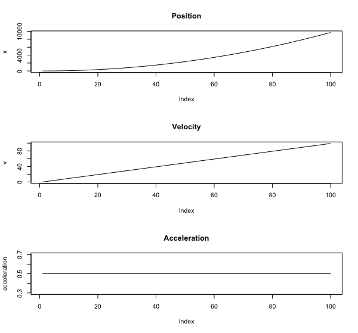
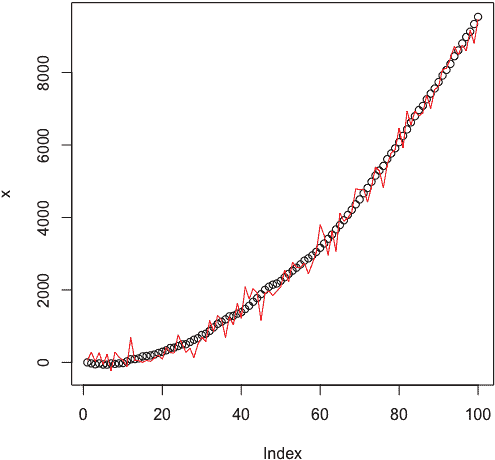
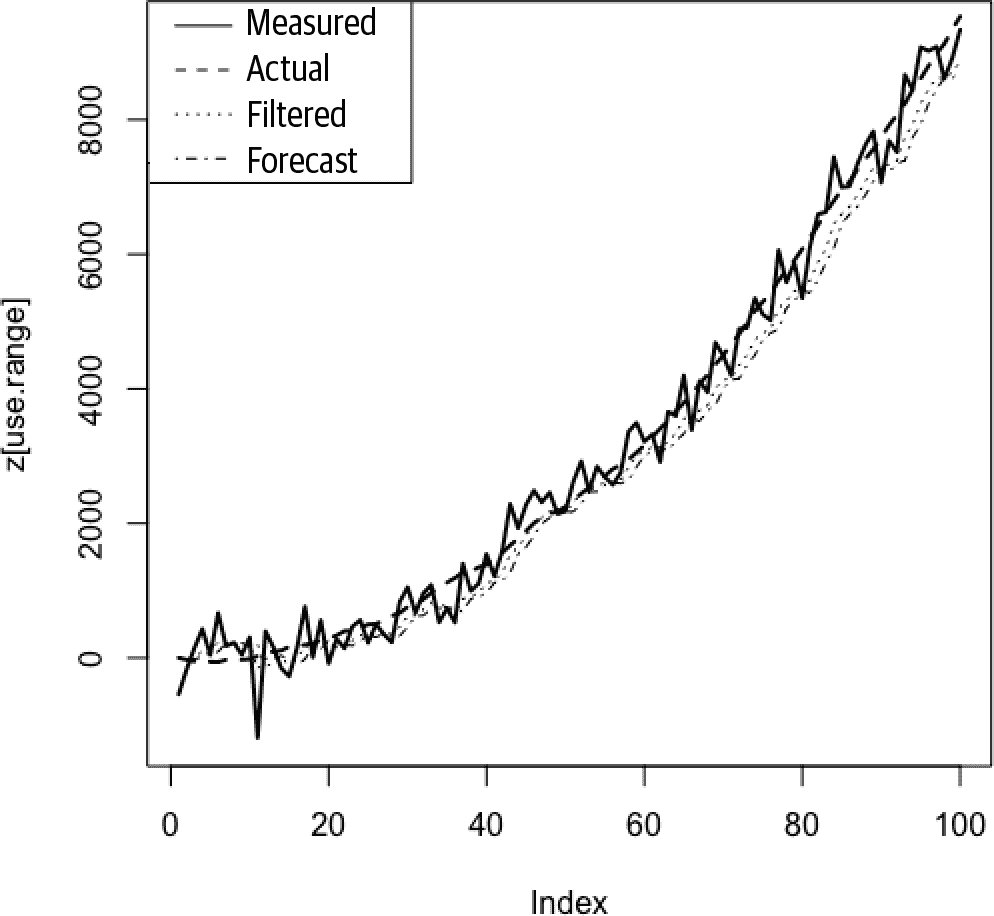
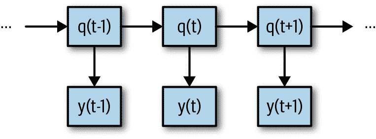
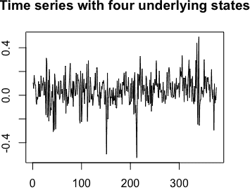
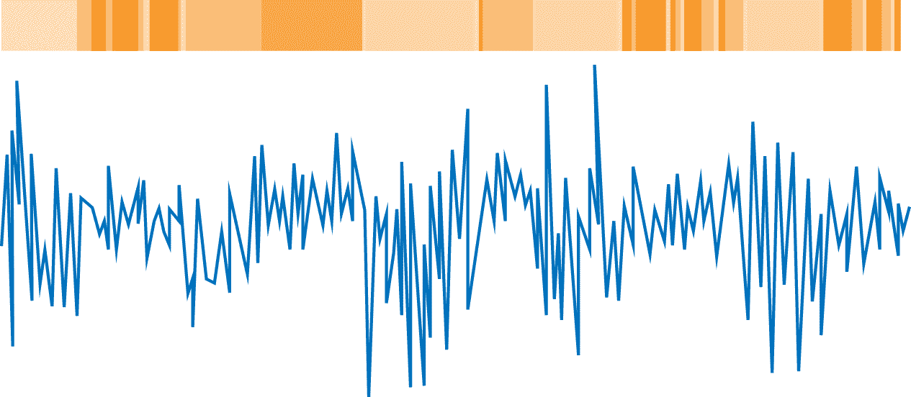
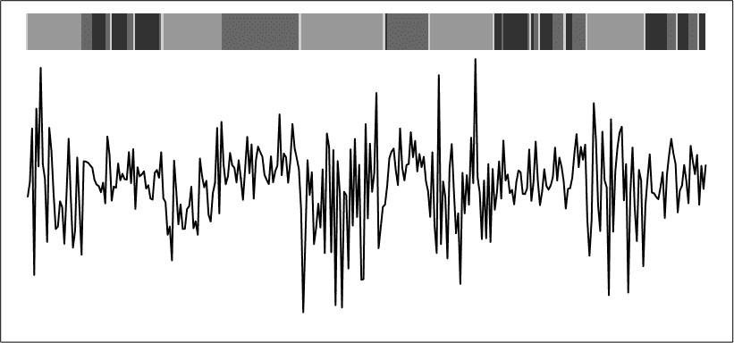
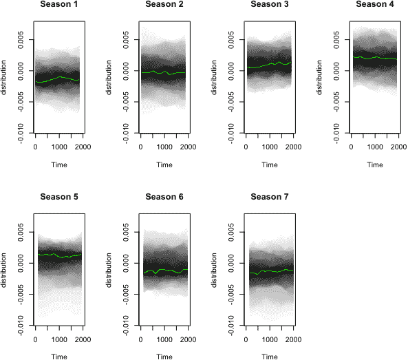
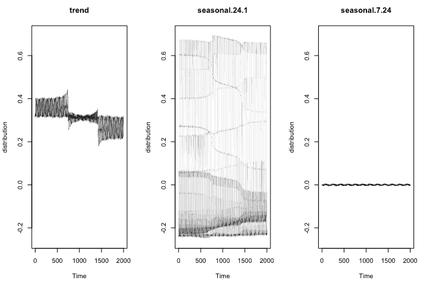
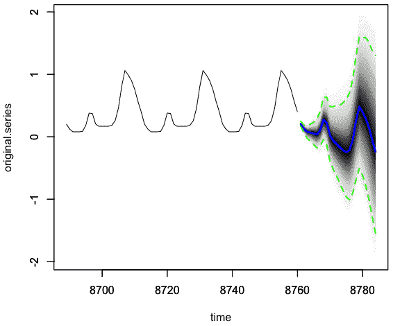

# 第七章：时间序列的状态空间模型

状态空间模型与我们在前一章中研究的统计模型类似，但更具有“现实世界”的动机。它们解决了在真实世界工程问题中出现的问题，例如在进行估计时如何考虑测量误差以及如何将先验知识或信念注入估计中。

状态空间模型假设一个世界，其中真实状态不能直接测量，而只能从可测量的内容推断。状态空间模型还依赖于指定系统的动态，例如世界真实状态如何随时间演变，既受内部动态的影响，也受到施加在系统上的外部力量的影响。

尽管在数学背景下你可能之前没见过状态空间模型，但你可能在日常生活中使用过它们。例如，想象一下你看到一名司机在交通中迂回。你试图确定司机要去哪里以及如何最好地保护自己。如果司机可能醉酒，你会考虑报警，而如果司机因一时分心而不会重复的原因，你可能会顾及自己的事务。在接下来的几秒或几分钟内，你将更新你对该司机的状态空间模型，然后决定该做什么。

使用状态空间模型的一个经典例子是发射到太空的火箭。我们知道牛顿定律，因此我们可以编写系统动态的规则以及随时间应该看起来如何运动。我们还知道我们的 GPS 或传感器或者我们用于跟踪位置的任何东西都会有一些测量误差，我们可以量化并试图考虑到我们计算不确定性的这种影响。最后，我们知道我们无法解释作用在特定火箭上的世界上所有力量，因为系统中存在许多未知因素，所以我们希望这个过程对其他未知噪声源具有鲁棒性，也许是太阳风或地球风或两者兼而有之。事实证明，在过去 50 年的统计和工程进步中，这些方法已被证明非常有用。

两种不同的历史趋势导致了状态空间模型的发展以及对它们所处理问题种类的兴趣。首先，在 20 世纪中期左右，我们进入了一个机械自动化的时代。天空中有火箭和航天器，潜艇的导航系统以及所有种类的其他自动发明，这些发明需要估计无法测量的系统状态。当研究人员考虑如何估计系统状态时，他们开始开发状态空间方法，最重要的是区分测量误差和系统中其他类型的不确定性。这导致了状态空间方法的首次应用。

在此期间，记录技术和相关计算也在发展。这导致了时间序列的数据集变得更大，包括更长或更详细的时间序列数据集。随着更多时间序列数据的可用性，可以与状态空间建模的新思维一起为其开发更多数据密集型方法。

在本章中，我们将学习这些常用的状态空间方法：

+   应用于线性高斯模型的卡尔曼滤波器

+   隐马尔可夫模型

+   贝叶斯结构时间序列

在每种情况下，使用这些模型是相当简便和良好实施的。对于每个模型，我们将对数学提出一些直觉，并讨论适合使用该方法的数据类型。最后，我们将看到每种方法的代码示例。

在每种情况下，我们将区分我们观察到的内容和产生我们观察结果的状态。在基于观察结果估计基础状态时，我们可以将我们的工作划分为不同的阶段或类别：

滤波

利用时间 *t* 处的测量更新我们对时间 *t* 处状态的估计

预测

利用时间 *t* - 1 处的测量生成时间 *t* 处预期状态的预测（同时允许我们推断时间 *t* 处的预期测量）

平滑

利用包括 *t* 时间点之前和之后的时间范围内的测量来估计时间 *t* 处的真实状态

这些操作的机制通常相似，但区别很重要。**滤波**是一种决定如何将最新信息与过去信息进行权衡，以更新我们对状态估计的方法。**预测**是在没有未来信息的情况下预测未来状态。**平滑**是在制定给定时间点状态的最佳估计时利用未来和过去信息的方法。

# 状态空间模型：优缺点

状态空间模型可用于确定性和随机应用，并且可以应用于连续采样数据和离散采样数据。¹

这一点单独就能让你对它们的效用和极大的灵活性有所了解。状态空间模型的灵活性是驱动这一类模型优缺点的根源。

状态空间模型有许多优势。状态空间模型允许对时间序列中通常最有趣的内容进行建模：产生被分析的嘈杂数据的动态过程和状态，而不仅仅是嘈杂数据本身。通过状态空间模型，我们在建模过程中注入了一个解释生成过程的模型，以解释首次产生过程的动因。这对于我们已经对系统如何运作有强有力理论或可靠知识的情况非常有用，而我们希望我们的模型帮助我们探索我们已经熟悉的一般动态的更多细节。

状态空间模型允许随时间改变系数和参数，这意味着它允许随时间改变的行为。在使用状态空间模型时，我们没有对数据施加平稳性条件。这与我们在第六章中检验的模型有很大不同，那里假设了一个稳定的过程，并且只用一个系列的系数来建模，而不是时间变化的系数。

尽管如此，状态空间模型也有一些缺点，有时状态空间模型的优点也是它的弱点：

+   由于状态空间模型如此灵活，需要设置许多参数，并且状态空间模型可以采取许多形式。这意味着特定状态空间模型的性质通常未被充分研究。当你制定一个适合你时间序列数据的状态空间模型时，你很少会在统计教科书或学术研究论文中找到其他人已经研究过该模型。这使得你在理解模型性能或可能出现错误的地方时，往往处于不太确定的领域。

+   状态空间模型在计算上可能非常耗费资源，因为涉及到许多参数。此外，某些类型的状态空间模型的参数数量非常庞大，这可能使你容易过拟合，特别是如果数据量不足的话。

# 卡尔曼滤波器

卡尔曼滤波器是一种成熟并广泛应用的方法，用于从时间序列中获得新信息，并与先前已知的信息以智能方式结合，以估计潜在状态。卡尔曼滤波器最初的应用之一是在阿波罗 11 号任务中，当 NASA 工程师意识到机载计算元件无法支持其他更耗费内存的位置估计技术时，选择了该滤波器。正如您将在本节中看到的那样，卡尔曼滤波器的优点在于它相对容易计算，并且不需要存储过去的数据来进行现在或未来的预测。

## 概述

对于初学者来说，卡尔曼滤波器的数学可能有些令人望而却步，不是因为它特别困难，而是因为需要跟踪相当数量的量，并且这是一个迭代的、有些循环的过程，涉及许多相关的量。因此，我们在这里不会推导卡尔曼滤波器的方程式，而是通过对这些方程式的高级概述来了解它们的工作原理。²

我们从线性高斯模型开始，假设我们的状态和观察具有以下动态：

*x[t] = F × x[t–1] + B × u[t] + w[t]*

*y[t] = A × x[t] + v[t]*

也就是说，时间*t*的状态是前一个时间步骤的状态(*F* × *x*[*t*–1])、外部力项(*B* × *u[t]*)和随机项(*w[t]*)的函数。同样，时间*t*的测量是状态在时间*t*和随机误差项、测量误差的函数。

让我们想象*x[t]*是宇宙飞船的实际位置，而*y[t]*是我们用传感器测量的位置。*v[t]*是我们传感器设备（或多个设备的范围）的测量误差。卡尔曼滤波器适用的基本方程是这个方程，它展示了如何在时间*t*给出新信息后更新我们的估计：

<math xmlns="http://www.w3.org/1998/Math/MathML" display="inline"><mover><mi>x</mi><mi>^</mi></mover></math>*[t]* = *K[t]* × *y[t]* + (1 – *K[t]*) × <math xmlns="http://www.w3.org/1998/Math/MathML" display="inline"><mover><mi>x</mi><mi>^</mi></mover></math>*[*t*–1]

我们在这里看到的是一个滤波步骤，即如何使用时间*t*的测量来更新我们在时间*t*的状态估计的决策。请记住，我们假设的情况是我们只能观察*y[t]*并推断状态，但不能确切知道状态。从上面我们看到，数量*K[t]*在我们的估计中建立了旧信息(*<math xmlns="http://www.w3.org/1998/Math/MathML" display="inline"><mover><mi>x</mi><mi>^</mi></mover></math>*[*t*–1])和新信息(*y[t]*)之间的平衡。

要深入了解更详细的机制，我们需要定义一些术语。我们使用*P[t]*来表示我们状态协方差的估计（这可以是标量或矩阵，取决于状态是否单变量或多变量，后者更常见）。*P^–[t]*是在考虑时间*t*的测量之前的时间*t*的估计。

我们还用*R*来表示测量误差方差，即*v[t]*的方差，这可以是一个标量或协方差矩阵，具体取决于测量的维度。*R*通常对于一个系统是很好定义的，因为它描述了特定传感器或测量设备的已知物理特性。对于*w[t]*的适当值*Q*在建模过程中较少定义并且需要调整。

然后我们从一个过程开始，该过程使我们在时间 0 处已知或估计了*x*和*P*的值。然后，在时间 0 后，我们遵循预测和更新阶段的迭代过程，预测阶段首先进行，然后是更新/过滤阶段，如此循环。

*预测:*

<math xmlns="http://www.w3.org/1998/Math/MathML" display="inline"><mover><mi>x</mi><mi>^</mi></mover></math> ^– [t] = F × <math xmlns="http://www.w3.org/1998/Math/MathML" display="inline"><mover><mi>x</mi><mi>^</mi></mover></math>[t–1] + B × u[t]

P^–[t] = F × P[t–1] × F^T + Q

*滤波:*

<math xmlns="http://www.w3.org/1998/Math/MathML" display="inline"><mover><mi>x</mi><mi>^</mi></mover></math>[t] = <math xmlns="http://www.w3.org/1998/Math/MathML" display="inline"><mover><mi>x</mi><mi>^</mi></mover></math> ^– [t] + K[t] × (y[t] – A × <math xmlns="http://www.w3.org/1998/Math/MathML" display="inline"><mover><mi>x</mi><mi>^</mi></mover></math>^-[t])

P[t] = (I – K[t] × A) × P^-[t]

其中*K[t]*，即 Kalman 增益，为：

K[t] = P ^– [t] × A^T × (A × P^-[t] × A^T + R) ^(– 1)

您将看到许多这种递归过程的可视化。有些将其分解为多个步骤，或许多达四到五步，但最简单的思考方式是：在没有*y[t]*（预测值）的测量的情况下，预测时间*t*的值，然后是在时间*t*，在已知测量*y[t]*后（过滤）所采取的步骤。

要开始，您需要以下值：

+   *R*和*Q*的估计值——分别是测量误差（易知）和状态随机性（通常估计）的协方差矩阵

+   估计或已知的状态值在时间 0，<math xmlns="http://www.w3.org/1998/Math/MathML" display="inline"><mover><mi>x</mi><mi>^</mi></mover></math>[0]（基于*y*[0]估计）

+   在时间*t*计划应用的力的预先知识以及这些如何影响状态——即矩阵*B*和值*u[t]*

+   知识系统动态，决定从一个时间步骤到另一个时间步骤的状态转移，即*F*

+   理解测量如何依赖于状态的知识，即*A*

有许多方法可以推导 Kalman 滤波器方程，包括从期望值的概率视角、最小二乘最小化问题，或作为最大似然估计问题。Kalman 滤波器的推导广泛可得，有兴趣的读者可以通过几次互联网搜索来深入了解这个主题。

## Kalman 滤波器的代码

我们考虑一个经典的用例：试图跟踪一个受牛顿力学影响、带有误差传感器的物体。我们根据牛顿运动定律生成一个时间序列，即物体的位置是其速度和加速度的函数。尽管底层运动是连续的，但我们想象进行离散测量。我们首先确定一系列加速度，然后假设位置和速度都从 0 开始。虽然这不符合物理实际情况，我们假设每个时间步长开始时有即时的加速度变化，并且稳定的加速度值：

```
## R
## rocket will take 100 time steps
ts.length <- 100

## the acceleration will drive the motion
a <- rep(0.5, ts.length)

## position and velocity start at 0
x  <- rep(0, ts.length)
v  <- rep(0, ts.length)
for (ts in 2:ts.length) {
  x[ts] <- v[ts - 1] * 2 + x[ts - 1] + 1/2 * a[ts-1] ^ 2 
  x[ts] <- x[ts] + rnorm(1, sd = 20) ## stochastic component
  v[ts] <- v[ts - 1] + 2 * a[ts-1]
}

```

如果您不了解或不记得牛顿运动定律，您可能希望熟悉一下，尽管在当前目的（计算*x[ts]*和*v[ts]*）上，您也可以直接接受这些。

一个快速的绘图练习向我们展示了我们通过结构化加速度所创建的运动（见图 7-1）：

```
## R
par(mfrow = c(3, 1))
plot(x,            main = "Position",     type = 'l')
plot(v,            main = "Velocity",     type = 'l')
plot(acceleration, main = "Acceleration", type = 'l')

```

我们假设这些变量将代表状态的完整描述，但我们唯一可用的数据是物体的位置，并且此数据仅来自于一个嘈杂的传感器。这个传感器在下面的代码中表示为 `x`，我们绘制了测量值如何与实际位置相关联在 Figure 7-2 中：

```
## R
z <-  x + rnorm(ts.length, sd = 300)
plot (x, ylim = range(c(x, z)))
lines(z)
```

在 Figure 7-2 中，我们看到一个恒定加速度（底部图）驱动线性增加的速度（中部图），从而在位移（顶部图）中产生一个抛物线形状。如果这些机械关系不熟悉，您可以接受它们或查阅物理入门教科书中关于基本力学的快速回顾。



###### 图 7-1\. 我们火箭的位置、速度和加速度。



###### 图 7-2\. 真实位置（点）与我们嘈杂的测量（线）的对比。请注意，位置 x 由于我们将噪声放入状态转移方程而不反映出完美的抛物线。

现在我们应用卡尔曼滤波器。首先，我们编写一个通用函数，反映了我们在本节早些时候讨论和推导的内容：

```
## R
kalman.motion <- function(z, Q, R, A, H) {
  dimState = dim(Q)[1]

  xhatminus <- array(rep(0, ts.length * dimState), 
                    c(ts.length, dimState)) 
  xhat      <- array(rep(0, ts.length * dimState), 
                    c(ts.length, dimState)) 

  Pminus <- array(rep(0, ts.length * dimState * dimState), 
                 c(ts.length, dimState, dimState))
  P      <- array(rep(0, ts.length * dimState * dimState), 
                 c(ts.length, dimState, dimState))  

  K <- array(rep(0, ts.length * dimState), 
            c(ts.length, dimState)) # Kalman gain

  # intial guesses = starting at 0 for all metrics
  xhat[1, ] <- rep(0, dimState)
  P[1, , ]  <- diag(dimState)

  for (k in 2:ts.length) {
    # time update
    xhatminus[k, ] <- A %*% matrix(xhat[k-1, ])
    Pminus[k, , ] <- A %*% P[k-1, , ] %*% t(A) + Q

    K[k, ] <- Pminus[k, , ] %*% H %*% 
                            solve( t(H) %*% Pminus[k, , ] %*% H + R )
    xhat[k, ] <- xhatminus[k, ] + K[k, ] %*% 
                            (z[k]- t(H) %*% xhatminus[k, ])
    P[k, , ] <- (diag(dimState)-K[k,] %*% t(H)) %*% Pminus[k, , ]
  }    

  ## we return both the forecast and the smoothed value
  return(list(xhat = xhat, xhatminus = xhatminus))
}

```

我们应用这个函数，只测量火箭的位置（不包括加速度或速度）：

```
## R
## noise parameters
R <- 10² ## measurement variance - this value should be set
          ## according to known physical limits of measuring tool 
          ## we set it consistent with the noise we added to x 
          ## to produce x in the data generation above
Q <- 10   ## process variance - usually regarded as hyperparameter
          ## to be tuned to maximize performance

## dynamical parameters
A <- matrix(1) ## x_t = A * x_t-1 (how prior x affects later x) 
H <- matrix(1) ## y_t = H * x_t   (translating state to measurement)

## run the data through the Kalman filtering method
xhat <- kalman.motion(z, diag(1) * Q, R, A, H)[[1]]

```

我们在 Figure 7-3 中绘制了真实位置、测量位置和估计位置。



###### 图 7-3\. 许多相关数量：测量位置、实际/真实位置、位置的滤波估计（即，在时间 t 时合并时间 t 的测量的位置的最佳估计）、位置的预测（即，在时间 t 时仅合并已知系统动态加上时间 t - 1 之前的测量，而不包括时间 t）。

卡尔曼滤波器消除了大部分测量误差中的噪声。它的效果取决于我们对 *R* 的值，即测量噪声参数，它反映了滤波器在最近值相对较早值之间应如何权衡。正如我们所见，该滤波器对数据的预测效果令人满意。特别是，注意到预测数据和实际数据之间没有滞后，这表明该方法不仅仅是基于上一个值预测当前值。

在这里，我们已经通过一个卡尔曼滤波器的简单例子进行了探讨。卡尔曼滤波器因其在各种应用中特别是在系统内部动态非常了解的情况下非常有用而广泛研究。这使得它成为像简单的火箭例子这样的情况下的理想工具，我们理解了驱动系统的动态。

在这个简单的例子中，请注意卡尔曼滤波器的全部威力和实用性尚未完全体现。当我们有多种测量方式时特别有用，比如同时使用多个设备测量不同量或同时测量相同物体。此外，如果您的领域很有前景，卡尔曼滤波器还有许多值得研究的扩展。

正如我们所示，卡尔曼滤波器的一个重要优点是它是递归的。这意味着在每个过程迭代中不必查看所有数据点。相反，在每个时间步，所有先前时间步骤的信息已经以最佳方式整合在少数估计参数中，即最近的状态和协方差估计。这种方法的美妙之处在于我们可以智能地更新，仅使用这些“摘要统计量”，并且我们已经知道如何相对于最新数据进行智能加权。这使得卡尔曼滤波器在计算时间或资源有限的实际应用中非常有用。在许多情况下，这也与真实系统的动态相一致，即过程相对马尔可夫（除了即时前状态外无记忆），并且是基于仅能以一定误差测量的基础状态的函数。

关于卡尔曼滤波器，还有许多有用的扩展我们这里没有讨论。卡尔曼滤波器的一个主要用途是将其适应于*平滑*，这意味着使用时间*t*之前和之后的数据来最佳估计时间*t*处的真实状态。数学和代码与已经呈现的内容类似。同样类似的是扩展卡尔曼滤波器（EKF），它将卡尔曼滤波器适应于具有非线性动态的数据。这也相对简单地实现，并且在各种 R 和 Python 软件包中广泛可用。

卡尔曼滤波器在时间序列长度上是*O(T)*，但相对于状态维度*d*是*O(d²)*。因此，在不必要过度指定状态时，采用更简化的规范就足够了。然而，正是这种对时间序列长度的线性特性使得卡尔曼滤波器在实际生产场景中普遍使用，并比为时间序列状态空间建模开发的其他滤波器更受欢迎。

# 隐马尔可夫模型

隐马尔可夫模型（Hidden Markov Models，HMMs）是一种特别有用和有趣的时间序列建模方法，因为它是时间序列分析中无监督学习的一个罕见实例，意味着没有标记的正确答案可以用来训练。HMM 受到与本章早期实验卡尔曼滤波器时类似的直觉驱使，即我们能够观察到的变量可能不是系统中最具描述性的变量。就像卡尔曼滤波器应用于线性高斯模型时一样，我们假设该过程具有状态，并且我们的观察结果提供关于此状态的信息。同样，我们需要对状态变量如何影响我们能观察到的内容有一些看法。在 HMM 的情况下，我们假设该过程是一个非线性过程，其特征是在离散状态之间跳跃。

## 模型工作原理

HMM 假设存在一些不直接可观察的状态。该系统是马尔可夫过程，这意味着仅通过系统的当前状态可以完全计算未来事件的概率。也就是说，知道系统的当前状态及其先前状态并不比仅仅知道系统的当前状态更有用。

马尔可夫过程通常用矩阵来描述。例如，假设有一个在 A 状态和 B 状态之间波动的系统。在任一状态下，该系统统计上更有可能保持在相同状态，而不是在任何不同的时间步骤翻转到另一状态。一个这样的系统可以用以下矩阵描述：

> |  | A | B |
> | --- | --- | --- |
> | A | 0.7 | 0.3 |
> | B | 0.2 | 0.8 |

假设我们的系统处于 A 状态，即(1, 0)。在这种情况下，系统保持在 A 状态的概率为 0.7，而系统翻转的概率为 0.3。我们不需要知道系统在其最近时刻之前处于什么状态。这就是马尔可夫过程的含义。

隐马尔可夫模型表示的是同类系统，不同的是我们不能直接从观察中推断出系统的状态。相反，我们的观察提供了关于系统状态的线索（参见图 7-4）。



###### 图 7-4\. HMM 的过程。在特定时间点系统的实际状态由 x(t)表示，而在特定时间点可观察的数据由 y(t)表示。仅 x(t)与思考 y(t)相关。换句话说，如果我们知道 x(t)，则 x(t − 1)不提供预测 y(t)的任何额外信息。同样，仅 x(t)与预测 x(t + 1)有关，而知道 x(t – 1)则不提供任何额外信息。这是系统的马尔可夫特性。

请注意，对于实际应用，状态通常会产生互相重叠的输出，因此不清楚哪个状态产生了输出的情况并不罕见。例如，我们将会将 HMM 应用于类似于图 7-5 的数据。这些数据是从四个状态模拟得到的，但是仅通过简单的视觉检查时间序列，并不明显有多少个状态，它们的划分在哪里，或者系统何时从一个状态转换到另一个状态。



###### 图 7-5\. 这个时间序列是用四个状态模拟的，但从视觉上观察并不清楚是否有四个状态，也不清楚一个状态何时结束以及另一个状态何时开始。

HMM 的一些现实应用示例包括：

+   [识别金融市场中的制度转变](https://perma.cc/JRT2-ZDVJ)

+   [DNA 测序信息的分类、预测和校正](https://perma.cc/4V4A-53TZ)

+   [通过 ECG 数据反映的睡眠阶段识别](https://perma.cc/G37Y-XBQH)

## 我们如何拟合模型

我们假设存在一个无法直接测量的状态，并且在许多可以应用这种技术的数据集中，没有办法得到一个可以证明正确的答案。那么这种算法如何在不事先了解任何信息的情况下识别隐藏状态？答案是：迭代。没有一个万能方法能够推导出解释观察到的最可能的隐藏状态序列，但是一旦我们完全指定了系统，就可以逐步逼近一个估计。

在一个 HMM 中，我们假设系统完全由以下信息描述：

+   从 *x(t)* 转移到 *x*(*t*) + 1 的*转移概率*。这等效于指定一个类似刚才提到的矩阵：在状态 A 和 B 之间转换。矩阵的大小取决于假设状态的数量。

+   *发射概率*，即给定 *x(t)* 后观察 *y(t)* 的概率。

+   系统的初始状态。

更具体地，以下是用于描述和拟合 HMM 过程所需的变量列表：

+   *Q* = *q*[1], *q*[2], …*q[N]* 系统的不同状态

+   *A* = *a[i,j]* = *a*[1,1], *a*[1,2], ...*a[N,N]* 转移概率矩阵，指示在任何给定时间步骤中从状态 i 转移到状态 j 的转移概率

+   *O* = *o*[1], *o*[2], …*o[T]* 从这个过程中按顺序抽样得到的一系列观测值，即观测序列的时间序列

+   *b[i(ot)]* 表示发射概率，即在状态为 *q[i]* 时观察到给定观察值 *o[t]* 的概率

+   *p* = *p*[1], *p*[2], …*p[N]*，初始概率分布，即系统以状态 *q*[1], *q*[2], …*q[N]* 开始的概率

然而，对于实际数据，一般都不知道这些变量中的任何一个。已知的只是实际可观测序列 *y*[1], *y*[2], …*y[t]*。

### Baum Welch 算法

在估计隐马尔可夫模型的参数时，我们使用*Baum Welch 算法*。这指导我们在复杂任务中估计所有参数的值，就像前面章节详细描述的那样。我们的任务是多方面的。我们正在寻求：

+   确定每个可能隐藏状态的不同发射概率，并确定从每个可能隐藏状态到每个其他可能隐藏状态的转移概率。我们使用 Baum-Welch 算法。

+   根据观测历史的完整信息确定每个时间步的最可能的隐藏状态。我们使用维特比算法（稍后描述）。

这是两个相关的任务，每个任务都很困难且计算量大。更重要的是，它们是相互依赖的。在两个相互关联的任务——参数估计和似然最大化——的情况下，我们可以使用*期望最大化算法*在这两个步骤之间迭代，直到找到一个可接受的解决方案。

要应用 Baum Welch 算法，第一步是指定似然函数，即给定假设参数的情况下观察到给定序列的概率。在我们的情况下，假设的参数将是假设状态每个数学参数。

例如，如果我们假设状态产生具有不同均值和标准差的高斯输出，并且这些值取决于状态，并假设一个双状态模型，我们可能描述模型为μ[1], σ[1], μ[2], 和 σ[2]，其中μ[*u*=*i*]表示第*i*个状态的均值，σ*[i]*表示第*i*个状态的标准差。这些可以描述发射概率，我们统称为θ。我们还可以将状态序列假设为*x*[1], *x*[2], …*x[t]*（我将其简记为*X[t]*），尽管我们无法观察到，但暂且假定我们能。

然后，似然函数将描述观察到的序列的可能性，给定发射概率的参数（即给定特定状态时观察到的给定观测的概率）和隐藏状态序列作为所有可能的*X[t]*的积分。*p*(*y*[1], *y*[2], …*y[t]* |μ[1], σ[1], μ[2], σ[2], …μ[*N*], σ[*Nt*]) = *p*(*y*[1], *y*[2], …*y[t]* |μ[1], σ[1], μ[2], σ[2], …μ[*N*], σ[*N*])。

然而，由于复杂性随时间步数呈指数增长，意味着详尽的网格搜索并不现实。因此，我们通过以下方式简化任务，应用 EM 算法：

1.  随机初始化发射概率变量。

1.  计算每个可能*X[t]*的概率，假设了发射概率值。

1.  使用这些*X[t]*的值生成发射概率变量的更好估计。

1.  重复步骤 2 和 3 直到收敛。

这意味着，更不正式地说，如果随机提出两个分布，我们将查看每个时间步长，并确定每个时间步长中特定状态被占据的概率（例如，在时间步长*t*时，状态 A 的概率是多少？状态 B 呢？）一旦我们为每个时间步长分配了假设状态，我们将使用这些标签重新估计发射概率（聚焦于状态的更好均值和标准差）。然后，我们会再次重复这个过程，使用新更新的发射概率变量来改进我们对*X[t]*轨迹的估计。

关于 EM 算法的一个重要点要记住的是，不能保证找到全局最优的参数集。因此，值得运行多次适应以查看多次初始化时的全局共识。还重要的是要记住，适应会需要一个烧入期，其适当长度将取决于您的数据和模型的细节。

### Viterbi 算法

一旦通过 Baum Welch 算法估计出 HMM 过程的参数，下一个感兴趣的问题是，在给定可观察值时间序列的情况下，最可能的潜在状态序列是什么。

与 Baum Welch 算法不同，Viterbi 算法保证为您提供您所询问问题的最佳解决方案。这是因为它是一种动态规划算法，旨在通过保存路径的部分解决方案全面而有效地探索可能的拟合范围，因此随着路径长度的增加，无需重新计算所有路径的所有路径长度（参见图 7-6）。



###### 图 7-6. Viterbi 算法搜索所有可能解释给定观察时间序列的路径，其中路径表示每个时间步长占据的状态。

## 在代码中拟合 HMM

虽然 HMM 拟合过程非常复杂，但它在 R 语言的多个软件包中实现。在这里，我们将使用`depmixS4`软件包。首先，我们需要制定一个适当的时间序列。我们可以通过以下代码来做到这一点：

```
## R
## notice in this case we have chosen to set a seed
## if you set the same seed, our numbers should match
set.seed(123) 

## set parameters for the distribution of each of the four
## market states we want to represent
bull_mu    <-  0.1
bull_sd    <-  0.1

neutral_mu <-  0.02
neutral_sd <-  0.08

bear_mu    <- -0.03
bear_sd    <-  0.2

panic_mu   <- -0.1
panic_sd   <-  0.3

## collect these parameters in vectors for easy indexing
mus <- c(bull_mu, neutral_mu, bear_mu, panic_mu)
sds <- c(bull_sd, neutral_sd, bear_sd, panic_sd)

## set some constants describing the time series we will generate
NUM.PERIODS     <- 10
SMALLEST.PERIOD <- 20
LONGEST.PERIOD  <- 40

## stochastically determine a series of day counts, with
## each day count indicating one 'run' or one state of the market
days <- sample(SMALLEST.PERIOD:LONGEST.PERIOD, NUM.PERIODS, 
               replace = TRUE)

## for each number of days in the vector of days
## we generate a time series for that run of days in a particular
## state of the market and add this to our overall time series
returns  <- numeric()
true.mean <- numeric()
for (d in days) {
  idx = sample(1:4, 1, prob = c(0.2, 0.6, 0.18, 0.02))
  returns <- c(returns, rnorm(d, mean = mus[idx], sd = sds[idx]))
  true.mean <- c(true.mean, rep(mus[idx], d))
}

```

在上述代码中，我们使用了一个受股市启发的例子，其中包含牛市、熊市、中性和恐慌模式。选择状态持续的随机天数，以及描述每个状态的发射概率分布的变量（即，_mu 和 _sd 变量，它们指示给定特定状态时我们期望看到的测量值类型）。

通过查看在样本中有多少天对应于每个`true.mean`，我们可以了解生成的时间序列的外观和每个状态的频率：

```
## R
> table(true.mean)
true.mean
-0.03  0.02   0.1 
  155   103    58 

```

灾难！虽然我们打算在模拟系列中包含四个状态，但只包含了三个。这可能是因为第四个状态被包含的概率非常低（0.02）。我们看到，最不可能的状态甚至没有被选入系列。对于给定的时间序列，我们并不能总是知道并非所有可能的状态实际上都包含在时间序列中，这也说明了为什么拟合隐马尔可夫模型困难，并且对算法有些不公平。尽管如此，我们将继续进行分析，指定四个组，看看会得到什么结果。³

我们仍需要拟合一个隐马尔可夫模型（HMM）。所得的 HMM 将为我们提供每个状态的后验概率时间序列，数量与我们指定的状态数量相符。与 EM 算法的早期描述一致，只需指定潜在状态的数量。其余将通过逐步迭代的前后过程逐渐确定。

通常情况下，通过正确的软件包，分析中的难点实际上在需要编写的代码量方面非常简单。在这种情况下，我们使用 R 中的`depmixS4⁴`包。该模型分为两步进行。首先，使用`depmix()`函数进行规定，指示预期分布、状态数量和用于拟合的输入数据。然后通过`fit`函数拟合模型，该函数以模型规范作为其输入。最后，为了生成状态标签的后验分布，我们使用`posterior()`函数。此时模型本身已经被拟合，因此这是一个将数据标记化的独立任务，现在可以估计状态分布和转移概率参数：

```
## R
require(depmixS4)
hmm.model  <- depmix(returns ~ 1, family = gaussian(), 
                    nstates = 4, data=data.frame(returns=returns))
model.fit  <- fit(hmm.model)
post_probs <- posterior(model.fit)

```

在这里，我们生成一个`hmm.model`，指定可观察向量为`returns`。我们还指定状态数量为`4`，并通过`family`参数的规定说明发射概率遵循高斯分布。我们通过`fit()`函数拟合模型，然后使用`posterior()`函数计算后验概率。后验概率告诉我们在给定时间内，对于我们通过拟合过程确定的模型参数，某个状态的概率。

现在我们可以按如下方式可视化状态及其测量值（参见图 7-7）：

```
## R
plot(returns, type = 'l', lwd = 3, col = 1, 
     yaxt = "n", xaxt = "n", xlab = "", ylab = "",
     ylim = c(-0.6, 0.6))

lapply(0:(length(returns) - 1, function (i) {
  ## add a background rectangle of the appropriate color
  ## to indicate the state during a given time step
  rect(i,-0.6,(i + 1),0.6, 
       col = rgb(0.0,0.0,0.0,alpha=(0.2 * post_probs$state[i + 1])),
       border = NA)
}

```



###### 图 7-7\. 在此图中，背景表示不同的状态，实线黑色线表示实际值。垂直白线显示的物体实际上是非常窄的切片，代表被估计处于四个状态中最罕见的状态的时间。

当我们查看模型通过其属性确定的假设分布参数时，我们可以获取有关我们原始数据生成参数的信息。

```
bull_mu    <-  0.1
bull_sd    <-  0.1

neutral_mu <-  0.02
neutral_sd <-  0.08

bear_mu    <- -0.03
bear_sd    <-  0.2

panic_mu   <- -0.1
panic_sd   <-  0.3

```

如果我们要匹配（记住恐慌状态没有出现在数据中），它会看起来像，实际上在数据中存在的状态组大致相关：

```
> attr(model.fit, "response")
[[1]]
[[1]][[1]] *<- coincidentally has a mean near the panic regime
              but that regime did not actually produce any data
              in the sample that was fit. instead the algorithm
              allotted this fourth state to more negative values*
Model of type gaussian (identity), formula: returns ~ 1
Coefficients: 
(Intercept) 
-0.09190191 
sd  0.03165587 

[[2]]
[[2]][[1]] *<- could be consistent with the bear market regime*
Model of type gaussian (identity), formula: returns ~ 1
Coefficients: 
(Intercept) 
-0.05140387 
sd  0.2002024 

[[3]]
[[3]][[1]]  *<- could be consistent with the bull market regime*
Model of type gaussian (identity), formula: returns ~ 1
Coefficients: 
(Intercept) 
  0.0853683 
sd  0.07115133 

[[4]]
[[4]][[1]] *<- could be somewhat consistent with the neutral market regime*
Model of type gaussian (identity), formula: returns ~ 1
Coefficients: 
  (Intercept) 
-0.0006163519 
sd  0.0496334 
```

如果我们的拟合结果与我们的基线隐藏状态不太吻合，可能的原因之一是我们没有使用适当的转移矩阵，而模型用了一个适合拟合的转移矩阵。我们状态之间的转换不是真正的马尔可夫过程，这可能会影响拟合效果。此外，我们拟合的是一个相对较短的时间序列，状态之间的转换较少，而 HMM 在更长的时间序列上表现更好，有更多的机会观察/推断状态转换。当你在尝试这种技术并准备将其拟合到真实数据时，我建议你想出更加现实的合成数据来测试提议的 HMM。请记住，在大多数真实数据情况下，你是在假设一个不可观测的状态，因此在更受控制的环境（使用合成数据）中思考模型性能的限制，然后再为更有野心的项目做准备。

HMM 非常适合分析许多种类的数据。HMM 已被用来模拟金融市场是处于增长还是衰退阶段，确定细胞内蛋白质折叠的阶段，以及描述人体运动（在深度学习出现之前）。这些模型继续是有用的，更多用于理解系统动态而非预测。此外，HMM 提供的不仅仅是一个点估计或预测。最后，我们可以将先验知识或信念注入到我们的模型中，例如指定用于拟合我们的 HMM 的状态数量。通过这种方式，我们既可以利用统计方法的好处，又可以对系统的先验知识进行参数化。

隐马尔可夫模型（HMM）的数学和计算非常有趣且易于理解。通过研究 HMM 拟合数据的最常见方法，你可以学习许多易于理解的编程技术和数值优化算法。你还将学习到动态规划技术，这对数据科学家或软件工程师非常有帮助。

与卡尔曼滤波器一样，HMM 可用于各种任务。事实上，由于离散状态的增加复杂性，与 HMM 系统相关的推断问题的种类更加复杂。当使用 HMM 时，你可能会面临一些推断任务，其中包括：

+   确定产生一系列观察结果的状态的最可能描述。这涉及估计这些状态的发射概率以及描述一个状态可能导致另一个状态的传输矩阵。我们做到了这一点，尽管我们没有明确看待过转移概率。

+   确定在给定一系列观察和状态描述及其发射和转移概率的情况下，最可能的状态序列。我们在前一任务中也这样做过。这有时被称为“最可能的解释”，通常使用维特比算法计算。

+   过滤和平滑。在这种情况下，过滤将对应于估计最近观测的最新时间步的隐藏状态。平滑将对应于确定在特定时间步给定之前、期间和之后的观察时，隐藏状态的最可能分布。

# 贝叶斯结构时间序列

贝叶斯结构时间序列（BSTS）与我们先前通过卡尔曼滤波处理的线性高斯模型相关。主要区别在于，贝叶斯结构时间序列提供了一种使用预先存在的组件构建更复杂模型的方式，可以反映关于系统已知事实或有趣假设的已知事实。然后我们设计结构，使用鲁棒拟合技术来估计我们数据模型的参数，并查看该模型是否能很好地描述和预测系统的行为。

与我们在卡尔曼滤波讨论中涵盖的线性高斯模型相比，BSTS 模型的数学和计算任务较为复杂。因此，我们将坚持概述一般情况，然后应用代码。

拟合 BSTS 模型有四个步骤，按以下顺序进行：

1.  定义了一个结构模型，包括先验的规定。

1.  应用卡尔曼滤波器来更新基于观测数据的状态估计。

1.  用于在结构模型内执行变量选择的尖峰与板条方法⁵。

1.  贝叶斯模型平均应用于合并结果以生成预测。

在下一个示例中，我们将仅关注步骤 1 和 2，其中我们通过预先存在的模块化组件定义一个灵活的模型，然后使用这个模型通过贝叶斯方法来拟合我们的数据，随着时间的推移更新参数估计。

## bsts 的代码

在这里，我们使用了来自谷歌的流行和强大的 BSTS 软件包 `bsts`，以及来自[OpenEI.org](https://openei.org)的开放数据集。

我们首先绘制数据以了解我们试图建模的内容（图 7-8）：

```
## R
elec = fread("electric.csv")

require(bsts)
n = colnames(elec)[9]
par(mfrow = c(2, 1))
plot(elec[[n]][1:4000])
plot(elec[[n]]1:96) 
## as discussed earlier in the book
## appropriate temporal scale is key to understanding ts data
```

![

###### 图 7-8\. 我们在上图中拟合的完整系列（两千个连续的小时测量），以及下图中更短、更易理解的数据子集。在查看日常模式时，图表更有意义。

通过查看我们的数据，我们能够了解如何建模。我们可以看到肯定存在每日模式，甚至可能存在一周中每日的模式。这些反映了我们将在模型中描述的季节性行为。此外，考虑到我们在图 7-8 上部面板中绘制整体数据时看到的非平稳行为，我们还希望允许数据中的趋势。

```
## R
ss <- AddLocalLinearTrend(list(), elec[[n]])
ss <- AddSeasonal(ss, elec[[n]], nseasons = 24, season.duration = 1 )
ss <- AddSeasonal(ss, elec[[n]], nseasons = 7,  season.duration = 24)

```

此模型中的局部线性趋势假设数据中的趋势的均值和斜率都遵循随机游走。⁶

模型的季节性组件有两个参数，一个表示不同季节的数量，另一个表示季节的持续时间。在第一个季节性组件中，我们添加一个反映每天循环的组件，每小时一个季节，每个季节持续一小时。在第二个季节性组件中，我们添加一个反映每周循环的组件，每天一个季节，每个季节持续 24 小时。

虽然您可能会想知道我们是否确实从星期一的凌晨 12:01 开始（或者我们希望如何定义一周），但保持一致性比确切的一天季节性标签是否与星期一完全对应更重要。在这里看到的循环模式中，似乎任何将数据分割为 24 小时的方式都可能适用于季节性分析。

代码中最耗费计算资源的部分如下所示。`bsts` 包的优势在于我们能够运行多个马尔可夫链蒙特卡洛（MCMC）后验计算：

```
## R
model1 <- bsts(elec[[n]],
               state.specification = ss,
               niter = 100)
plot(model1, xlim = c(1800, 1900)
```

我们还可以检查季节性组件。例如，我们可以像这样检查一周中每天的季节性组件（参见图 7-9 和图 7-10）：

```
## R
plot(model1, "seasonal", nseasons = 7, season.duration = 24)

```



###### 图 7-9。显示一周中各天的季节性，显示不同天的差异。还显示了每天的参数分布在时间上保持稳定。



###### 图 7-10。数据趋势以及每日和每周季节性组件的贡献分布。如果将这三个组件相加，就可以得到预测值。

一周中每天的季节性组件显示出很高的稳定性，而在图 7-10 中间绘图中显示的每天小时季节性则倾向于显示随时间变化的趋势，可能与白昼时间的变化相关。在图 7-10 中，我们还可以看到局部线性趋势的参数拟合，显示出整体电力需求的下降趋势。

最后，我们预测，包括未来预测的完整后验分布图（见图 7-11）。请注意，我们在此建模过程结束前具有灵活性，可以指定我们希望向前预测多少个时间段。请记住，这是小时数据，因此向前预测 24 个时间段可能看起来很有野心，但只相当于一天。我们还指出，我们希望看到预测前的 72 个时间段以供参考：

```
pred <- predict(model1, horizon = 24, quantiles = c(0.05, 0.95))
plot(pred, plot.original = 72)
```



###### 图 7-11。我们的数据最后 72 小时与未来 24 小时的预测，以及预测的 5%和 95%分位数边界。请注意，随着我们预测时间越来越远，预测的分布也变得更加散布。

在 `bsts` 软件包和贝叶斯结构时间序列建模中，我们甚至还未利用的可选功能有相当多。

+   我们没有指定非标准先验。

+   我们没有使用尖峰和平板法来选择回归变量。

+   我们没有使用贝叶斯模型平均。

这些都可以通过 `bsts` 软件包完成，并且您可以在文档中找到详细指导。

在我们的示例中，我们只是简单地介绍了 BSTS 的一些应用。以下是 BSTS 的其他几个重要选项：

+   BSTS 允许您在建模过程中注入任何类型的先验知识。在讨论卡尔曼滤波器时，我们介绍的标准线性高斯模型只是注入了一种相对基础的先验知识的一种方式，而 BSTS 提供了许多选项（例如，非对称先验）。

+   BSTS 模型允许您进行变量选择。

+   BSTS 模型可以通过贝叶斯模型平均进行组合，这有助于在首次选择模型时考虑与之相关的不确定性。

虽然我们在当前的建模案例中没有使用这些选项，但在使用 `bsts` 软件包时，它们并不难集成，并且您可以在网上找到许多示例。

# 更多资源

+   关于卡尔曼滤波器和线性高斯状态空间模型：

    Greg Welch 和 Gary Bishop，《“卡尔曼滤波器介绍”》，北卡罗来纳大学教堂山分校，1995 年技术报告，https://perma.cc/ZCU8-MXEF。

    这篇关于卡尔曼滤波器的介绍性概述提供了滤波器的推导和矩阵形式化。该介绍还讨论了扩展卡尔曼滤波器，在实际场景中更为常见，可用于非线性过程或非线性测量误差。

    R.E. 卡尔曼，《“线性滤波和预测问题的一种新方法”》，《ASME—基础工程杂志》82，D 系列（1960 年）：35–45，https://perma.cc/GNC4-YLEC。

    这篇 1960 年的研究文章是卡尔曼滤波器的最初介绍。如果具备统计学和微积分的基础，其数学内容是相当容易理解的，读起来很有趣，可以了解卡尔曼滤波器的原始动机及其创造者的智力背景。

    R. Labbe，[“Python 中的卡尔曼和贝叶斯滤波器”](https://perma.cc/CMU5-Y94A)，GitHub 仓库，https://perma.cc/CMU5-Y94A。

    这个庞大的 GitHub 仓库包含数十个使用卡尔曼滤波器及相关“过滤”技术的例子。该仓库像教科书一样，提供了详细的案例、相关 PDF 书籍以及带解答的练习题。

    Marie Auger-Méthé等，[“状态空间模型的隐秘小秘密：即使是简单的线性高斯模型也可能存在估计问题”](https://perma.cc/9D8V-Z7KJ)，*科学报告* 6 卷，编号 26677（2016 年），https://perma.cc/9D8V-Z7KJ。

    这篇文章突出了一个案例，即使是简单的线性高斯模型（比如我们在卡尔曼滤波器讨论中使用的模型），在面对测量误差远大于时间序列数值的情况下，也很容易发生极端的错误规定化。作者从生态学家的角度探讨了这个问题，但这个一般性问题在各种数据驱动学科中依然具有普遍的重要性，并且提供了与强调该方法的众多优点相比的平衡视角。

+   关于隐马尔可夫模型：

    Andrew Moore，[“隐马尔可夫模型”](https://perma.cc/K3HP-28T8)，卡内基梅隆大学计算机科学学院讲义，https://perma.cc/K3HP-28T8。

    这些全面的讲义概述了 HMM，包括估计算法的示例和机器人学中 HMM 在实际应用中的使用情况。

    Dan Klein，[“人工智能：隐马尔可夫模型”](https://perma.cc/V7U4-WPUA)，加州大学伯克利分校讲义，https://perma.cc/V7U4-WPUA。

    这是另一组易于查阅的参考笔记。其中列举了 HMM 在语音数字化和发展 AI 玩策略游戏中的实用示例。

    user34790，[“前向-后向和维特比算法之间的区别是什么？”](https://perma.cc/QNZ5-U3CN) 在交叉验证 StackExchange 上发布的问题，2012 年 7 月 6 日，https://perma.cc/QNZ5-U3CN。

    这篇 StackExchange 帖子提供了一个有趣的讨论和大纲，涉及针对特定 HMM 用例部署的多种估计算法。即使你对相关建模算法的细节不感兴趣，这篇帖子也能帮助你理解 HMM 如何用于理解时间序列数据的方式。

+   关于贝叶斯结构时间序列：

    Mark Steel，[“贝叶斯时间序列分析”](https://perma.cc/578D-XCVH)，收录于*宏观计量经济学与时间序列分析*，编辑 Steven N. Durlauf 和 Lawrence E. Blume（英国巴辛斯托克：Palgrave Macmillan，2010 年），35–45 页，https://perma.cc/578D-XCVH。

    这篇简短的阅读提供了关于贝叶斯时间序列分析中不同技术的全面概述，以及对每种方法优劣的简明评论。

    Steven Scott 和 Hal Varian，《用贝叶斯结构时间序列预测现在》，未发表论文，2013 年 6 月 28 日，https://perma.cc/4EJX-6WGA。

    这篇基于经济时间序列的 Google 论文展示了将时间序列预测问题应用于关于特定时间的数据的示例，这些数据随不同滞后期变得可用。特别地，作者使用当前的 Google 搜索来预测失业率，而后者只定期发布，而 Google 搜索计数则是持续可用的。这是通常所说的“现在预测”的一个例子，以指示实际上正在对当前情况进行的预测，因为有一个报告滞后。该论文使用贝叶斯结构时间序列和集成技术的组合。

    Jennifer Hoeting 等人，《贝叶斯模型平均：教程》，*统计科学* 14 卷 4 期（1999 年）：382–401，https://perma.cc/BRP8-Y33X。

    本文全面介绍了贝叶斯模型平均如何通过几种不同方法工作。正如本文所述，贝叶斯模型平均的目的是为了在模型选择过程中考虑由于不确定性而引起的不确定性。通过实例讲解，作者提供了更好估计预测中不确定性的方法。与此相关的，还有一个简要概述[BMA](https://perma.cc/U7M4-PRMW)，这是用于贝叶斯模型平均的 R 包。

¹ 在本书中，我们分析的是离散采样的数据，在现实世界的应用中最为常见。

² 我还建议阅读关于卡尔曼滤波器的许多替代简单解释，可以从[Mathematics StackExchange](https://perma.cc/27RK-YQ52)开始。

³ 注意到模拟数据的另一个问题是，我们没有建立转移概率矩阵来控制隐藏状态从一个状态到另一个状态的流动。实质上，我们内置了这样一种假设：一个状态在很多天内保持不变的可能性更大，然后以相等的概率跳转到任何其他状态。为了保持代码的简洁，我们省略了转移矩阵的正式规定和使用。

⁴ 此包的名称反映了 HMM 的另一个名称，*依赖混合模型*。

⁵ 要了解更多关于尖峰与平板方法的信息，请从[Wikipedia](https://perma.cc/4GNC-VDQY)开始。数学相当复杂，所以我们不会在这里进一步讨论它。尖峰与平板方法在有许多输入并需要变量选择来简化模型的情况下最为有用。

⁶ 更多信息请参阅[文档](https://perma.cc/2N77-ALJ4)。
