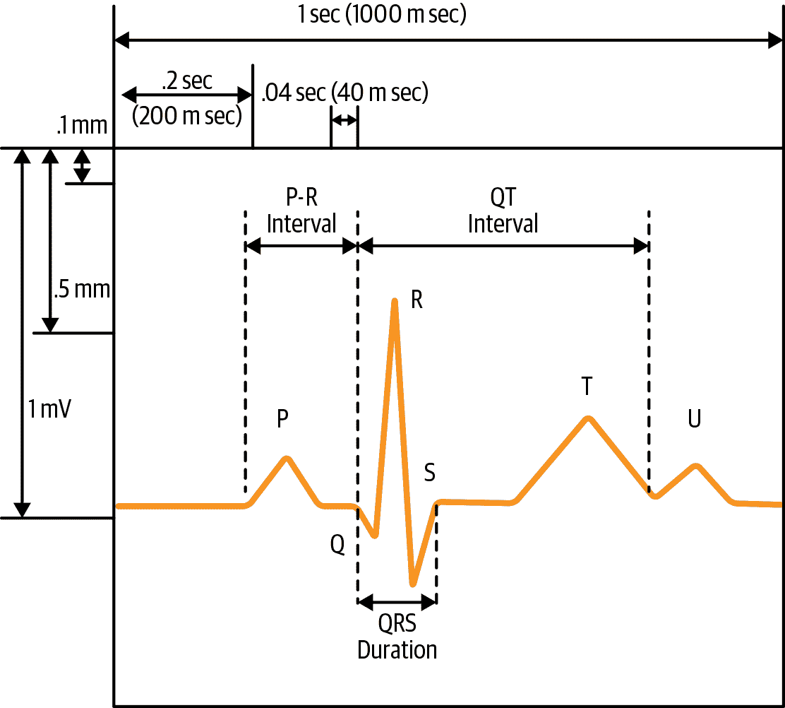

# 第八章：为时间序列生成和选择特征

在前两章中，我们探讨了依赖于使用时间序列中所有数据点来拟合模型的时间序列分析方法。然而，在为下一章讨论机器学习应用于时间序列分析做准备时，在本章中我们将学习时间序列的特征生成和选择。如果您对特征生成的概念不熟悉，那么很快就会了解了。这是一个直观的过程，使数据分析能够发挥创造性。

特征生成是将时间序列数据的最重要特征量化为几个数字值和分类标签的过程。通过一组特征来压缩原始时间序列数据，以描述该时间序列（我们稍后会通过一个快速示例来解释）。例如，一个非常简单的特征生成可以用平均值和时间序列中的时间步数来描述每个时间序列。这是一种在不逐步处理所有原始数据的情况下描述时间序列的方法。

特征生成的目的是尽可能多地压缩关于完整时间序列的信息到几个度量值中，或者用这些度量值来识别时间序列的最重要信息并丢弃其余部分。这对于机器学习方法非常重要，大多数机器学习方法是在非时间数据上开发的，但可以有效地应用于时间序列问题，前提是我们能将时间序列消化成适当格式的输入。在本章中，我们将特别关注允许我们自动生成常用时间序列特征的软件包，因此我们无需重新发明或手工编码它们。

一旦我们生成了一些有用的特征，我们必须确保它们确实有用。虽然手工制作过多无用的特征的可能性不大，但当您使用自动生成大量时间序列特征的代码时，就会遇到这个问题。因此，一旦生成了特征，我们必须检查它们，看看哪些可以在后续分析中丢弃。

传统的机器学习模型最初并未考虑时间序列，因此它们并不自动适用于时间序列分析应用。然而，使这些模型能够处理时间数据的一种方法是特征生成。例如，通过不是用一系列详细描述过程逐步输出的数字来描述单变量时间序列，而是用一组特征来描述它，我们可以访问为横截面数据设计的方法。

在本章中，我们将首先通过一个非常简单的时间序列特征生成示例来工作。然后，我们将审查时间序列的特征生成包，无论是在 R 还是 Python 中。最后，我们将通过一个自动特征生成和特征选择示例来工作。阅读完本章后，您将掌握为下游机器学习应用程序预处理时间序列数据集所需的所有技能，在第九章中介绍。

# 介绍性示例

想象一下过去一周的早晨、中午和晚上的温度如表 8-1 所示。

表 8-1\. 过去一周的温度

| 时间 | 温度（°F） |
| --- | --- |
| 星期一早晨 | 35 |
| 星期一中午 | 52 |
| 星期一晚上 | 15 |
| 星期二早晨 | 37 |
| 星期二中午 | 52 |
| 星期二晚上 | 15 |
| 星期三早晨 | 37 |
| 星期三中午 | 54 |
| 星期三晚上 | 16 |
| 星期四早晨 | 39 |
| 星期四中午 | 51 |
| 星期四晚上 | 12 |
| 星期五早晨 | 41 |
| 星期五中午 | 55 |
| 星期五晚上 | 20 |
| 星期六早晨 | 43 |
| 星期六中午 | 58 |
| 星期六晚上 | 22 |
| 星期日早晨 | 46 |
| 星期日中午 | 61 |
| 星期日晚上 | 35 |

您可以绘制这些数据，您会看到周期性（每日循环）的元素，以及总体温度上升的趋势。但我们不能将绘图图像存储在数据库中，大多数接受图像作为输入的方法都是数据密集型的，并试图将图像剥离为摘要度量。因此，我们应该自己做摘要度量。与其将表 8-1 中的 21 个数字描述为时间序列，我们可以用几个词和数字来描述这个系列：

+   日常/周期性

+   递增趋势；通过计算斜率可以使这一趋势更加量化

+   早晨、中午和晚上的均值

通过这样做，我们可以用 2 到 5 个数字来总结这个 21 点时间序列——这是一种在不丢失太多细节的情况下进行的数据压缩。这是特征生成的一个简单案例。然后，特征*选择*将涉及剔除任何不能充分描述以证明其包含必要性的特征。决定包含什么将取决于我们对特征的下游使用。

# 计算特征时的一般注意事项

就分析的任何方面而言，在计算时间序列数据集的时间序列特征时，您将希望思考您的分析是否合理，以及您投入生成特征的努力是否更可能因特征过多而导致过拟合，而不是产生有意义的见解。

最佳方法是在进行时间序列探索和清洗时开发一组潜在有用的特征。当您可视化数据并考虑什么区分了同一数据集中的不同时间序列或同一时间序列中的不同时间段时，您会得出关于哪种测量方法对于标记或预测时间序列有用的想法。您还可以从您对系统的任何背景知识或甚至您想通过后续分析测试的工作假设中获得有用的帮助。

接下来，我们将讨论在生成时间序列特征时需要牢记的几个不同考虑因素。

## 时间序列的本质

当您决定生成时间序列特征时，需要牢记您在数据探索和清洗过程中确定的时间序列的基本属性。

### 平稳性

平稳性是一个考虑因素。许多时间序列特征假设平稳性，并且在底层数据不平稳或至少不遍历时是无用的。例如，只有在时间序列是平稳的情况下，使用时间序列的平均值作为特征才是实际的，以便平均值的概念有意义。在我们有一个非平稳时间序列的情况下，这个值作为平均值测量的意义不大，因为这种情况下的值更多或少是一个偶然事件，是太多交织在一起的过程（如趋势或季节循环）的结果。

# 平稳时间序列与遍历时间序列

*遍历* 时间序列是一个在每个（相当大的）子样本都平等代表序列的序列。这是一个比平稳性更弱的标签，需要这些子样本具有相等的均值和方差。遍历性要求时间中的每个切片都“相等”，包含有关时间序列信息，但其统计测量（均值和方差）不一定相等。您可以在[StackExchange](https://perma.cc/5GW4-ZENE)找到有关此的有益讨论。

### 时间序列的长度

特征生成的另一个考虑因素是时间序列的长度。对于平稳时间序列而言，某些特征可能是合理的，但随着时间序列长度的增加，这些特征可能变得不稳定，例如时间序列的最小值和最大值。对于相同的基础过程，较长的时间序列可能会测量比由同一过程产生的较短时间序列更极端的最大和最小值，仅仅因为有更多的数据收集机会。

## 领域知识

领域知识应该是时间序列特征生成的关键，如果您有幸有一些见解的话。如何应用领域知识生成特定的时间序列特征的一些示例将在本章后面提供，但现在我们将专注于更一般的观点。

例如，如果你正在处理物理时间序列，你应该量化在你研究的系统时间尺度上有意义的特征，同时确保你选择的特征不会过度受传感器误差的特征影响而非底层系统的特征影响。

举个例子，假设你正在处理来自特定金融市场的数据。为了确保金融稳定，该市场规定了一天内的最大价格变动。如果价格变动过大，市场将关闭。在这种情况下，你可以考虑生成一个特征，指示某一天的最高价格。

## 外部考虑因素

你的计算资源及相关存储资源的范围同样重要。同样重要的是你生成特征的动机。你是生成用于存储以便能够丢弃大量原始数据的特征吗？还是仅仅计算单个分析的特征并计划仅保留原始数据？

你的时间序列特征生成的目的可能会影响你决定计算多少特征以及是否应考虑特别计算密集的特征。这也可能取决于你正在分析的数据集的整体大小。对于小数据集，所有这些决策都将风险较低，但对于极大的时间序列数据集，你可能会冒着开始一项特征生成任务但未完成的风险，浪费计算能量和编码。

在考虑了所有这些因素之后，尝试将特征列表组合在一起，并在一个小数据集上运行它们，以了解它们的运行速度。如果小数据集运行速度太慢，你应该在继续分析之前大幅减少你的时间序列。同样地，你可能需要在数据子集上探索计算负担特征的实用性，然后再使用完整数据集进行分析。

# 一个灵感来源目录，以寻找特征的地方

时间序列特征生成仅受你的数据、想象力、编码技能和领域知识的限制。只要你能想出一个合理一般且定义明确的方法来量化时间序列的行为，你就可以生成一个特征。一些简单且经常使用的时间序列特征等同于你在其他应用中使用过的同样的汇总统计函数，例如：

+   均值和方差

+   最大值和最小值

+   最后值与第一个值之间的差异

你还将直观地识别其他更具有挑战性的特征，虽然它们在计算上更具有挑战性，但通常是有用的。一些例子包括：

+   局部极大值和极小值的数量

+   时间序列的平滑性

+   时间序列的周期性和自相关

在这种情况下，您需要对实现定义进行一些定义，因为有不同的方法来识别这些常用特征。保持自己的特征生成代码库可用会很有帮助，但您可能还希望查看时间序列数据特征生成库，特别是在您对更具计算要求的特征感兴趣时。在这种情况下，您应该寻找一个优秀的实现，以确保代码既可靠又高效。

现在我们将转向使用时间序列特征生成库，特别关注通过自动特征生成可以获益的广泛特征范围。

## 开源时间序列特征生成库

曾有多次尝试自动化生成时间序列特征，因为它们往往在各个领域中具有趣味性、描述性，甚至预测性。

### tsfresh Python 模块

Python 中自动特征生成的一个特别引人注目的例子是 `tsfresh` 模块，它实现了大量通用特征。通过考虑一些可用的一般特征类别，我们可以了解到 [实现的特征](https://perma.cc/2RCC-DJLR) 的广度。这些包括：

描述性统计

这些驱动了我们在 第六章 中学习的传统统计时间序列方法，包括：

+   增广的迪基-富勒检验值

+   AR(k) 系数

+   滞后为 *k* 的自相关

物理启发的非线性和复杂性指标

该类别包括：

+   函数`c3()`是计算 <math xmlns="http://www.w3.org/1998/Math/MathML"><mrow><msup><mi>L</mi> <mn>2</mn></msup> <mrow><mo>(</mo> <msup><mi>X</mi> <mn>2</mn></msup> <mo>)</mo></mrow> <mo>×</mo> <mi>L</mi> <mrow><mo>(</mo> <mi>X</mi> <mo>)</mo></mrow> <mo>×</mo> <mi>X</mi></mrow></math>（其中 <math xmlns="http://www.w3.org/1998/Math/MathML"><mi>L</mi></math> 是滞后算子）期望值的代理。这被提议作为时间序列中 *非线性* 的一种度量。

+   函数`cid_ce()`计算从 0 到 n – 2 × 滞后的和的平方根，即 (*x[i] – x[i+1]*)²。这被提议作为时间序列 *复杂性* 的一种度量。

+   函数`friedrich_coefficients()`返回拟合模型描述复杂非线性运动的系数。

历史压缩计数

该类别包括诸如：

+   出现多次的时间序列值之和

+   最长连续子序列的长度，该子序列高于或低于均值

+   时间序列中最小值或最大值的最早出现

类似于`tsfresh`的模块可以帮助您节省时间并选择有效的特征选择实现。它还可以教育您描述数据的方式，这可能与您自己的研究不同但相关。使用模块还有许多其他好处，特别是当您将分析与开源、经过充分验证的工具结合使用时。

+   在计算标准特征时，没有必要重新发明轮子。通过使用共享库，您可以确保其他用户进行了一些准确性检查，而不是怀疑自己的代码并需要验证它。

+   此类库提供了计算特征的框架，而不仅仅是特征列表。例如，`tsfresh`具有特征计算器类，您可以使用它来为自己的目的扩展此库，同时享受系统化框架的好处。

+   此库设计用于与特征的下游消费者连接，最重要的是与`sklearn`连接，以便您的特征可以轻松传递给机器学习模型。

`tsfresh`库在技术上具有特别的风格，其中许多特征源于对科学实验数据分析思想的理解。

### Cesium 时间序列分析平台

一个更易接近但同样广泛的生成特征目录是[Cesium](http://cesium-ml.org/docs/index.html)库中实现的列表。当前列表在其[文档](http://cesium-ml.org/docs/feature_table.html)中可用，并且接下来我们选择一些有趣的特征进行讨论和检查。一般类别在[源代码](https://perma.cc/8HX4-MXBU)中分解，但我们在此进一步细分：

+   描述数据值的整体分布的特征，而不考虑其时间关系。此类别可以包括多种特征，尽管它们都是时间无关的：

    +   数据直方图中有多少个局部峰值？

    +   数据点中有多少百分比落在接近数据中位数的固定值窗口内？

+   描述数据时间分布的特征：

    +   以时间测量之间的分布为其自身分布，并计算类似于刚刚描述的统计量的特征，现在是在时间差异的分布上而不是数据值上

    +   计算下一个观测值在*n*个时间步骤内发生的概率的特征，考虑到观察到的分布

+   描述时间序列行为周期性度量的特征。通常，这些特征与*Lomb-Scargle 周期图*相关联。

刚刚描述的特征可以计算为整个时间序列或作为滚动或扩展窗口函数。考虑到我们在早期章节中学到的关于编写滚动和扩展窗口函数的机制，我们当然可以自己实现这些特征，并且我们有能力理解文档和这个库所做的事情的含义。在这种情况下，我们将应用滚动窗口函数来总结数据，而不是清理数据。时间序列分析中的相同技术在许多不同但同样有用的情况下使用。

`cesium`库提供了除特征生成外的补充功能。例如，它包括一个基于 Web 的 GUI 来执行特征生成，并且还与`sklearn`集成。

如果您在自己的数据上尝试这些库，您会注意到时间序列生成非常耗时。因此，您应该仔细考虑您需要为数据生成多少特征，以及在何时自动生成特征比仔细开发自己的特征更有意义。

这些库生成的许多特征在计算上是繁重的，并且——考虑到特征列表的广泛程度——通常不会解决您尝试回答的问题的关键点。通过一些领域知识，您甚至可能认识到某种特征是无关的、噪音的或不具有预测性的。不要无谓地计算这些无用的特征。这样做会减慢整个分析过程，而不会增加清晰度。自动特征生成库是有用的，但应该谨慎使用，而不是肆意使用。

### R 的`tsfeatures`包

`tsfeatures`，由 Rob Hyndman 等人开发，是一个方便的 R 包，用于生成各种常用和有用的时间序列特征。文档包括特征清单，其中包括以下有用的函数：

+   `acf_features()` 和 `pacf_features()`，它们分别计算与系列行为中自相关的重要性相关的一些相关值。对于`acf_features()`函数，文档描述了以下返回值：“一个包含 6 个值的向量：原始系列、一阶差分系列和两阶差分系列的第一个自相关系数和前 10 个自相关系数平方和。对于季节性数据，还返回第一个季节性滞后的自相关系数。”

+   `lumpiness()` 和 `stability()`，这些是瓦片窗口驱动的函数，以及 `max_level_shift()` 和 `max_var_shift()`，这些是滚动窗口驱动的函数。在每种情况下，都会对时间序列的重叠（滚动）或非重叠（瓦片）窗口上测量的值应用差异和多样性测量统计量。

+   [`unitroot_kpss()`](https://perma.cc/WF3Y-7MDJ) 和 [`unitroot_pp()`](https://perma.cc/54XY-4HWJ)。

`tsfeatures` 包有用地整合并包括了来自多个学术项目的时间序列特征研究，以及其他持续改进的努力，目的是创建在各种领域中有用的时间序列特征。这些包括：

+   `compengine()` 计算了由 comp-engine.org 项目开发的相同时间序列特征，这些特征在许多领域的时间序列数据中被发现是有帮助的。¹

+   一些特征借鉴自 `hctsa` [包](https://github.com/benfulcher/hctsa)，该包旨在在 Matlab 中运行高度比较的时间序列分析。其中一些特征包括：`autocorr_features()`、`firstmin_ac()`、`pred_features()` 和 `trev_num()`。你还可以从文档中找到其他特征。

[`tsfeatures` 文档](https://perma.cc/Y8E9-9XCK) 还包括每个生成特征函数的用途和输出的有用示例，以及广泛的参考文献，链接到与该包中提供的时间序列特征集相关的统计学和机器学习工作。

## 特定领域特征示例

另一个灵感来源可以来自为各种时间序列数据开发的特定领域特征。通常这些特征已经发展了几十年，要么来自经验性能够工作但不被很好理解的启发式方法，要么来自对系统底层机制如何工作的科学知识。

接下来我们将回顾两类时间序列数据（金融和医疗）的一些特定领域特征。

### 技术股市指标

技术股市指标可能是用于特定领域时间序列应用的最广泛记录和正式化的指标集。经济学家在过去一个世纪研究时间序列数据时，有一套他们常用的功能列表，用于量化金融市场的时间序列并进行预测。即使你对金融市场没有兴趣，这个列表也能启发人们看到，特定领域的特征列表也可以非常广泛、描述性和创造性。

为了让你了解这些指标有多复杂且高度特定于金融市场，这里包含了一个非详尽列表。考虑到其复杂性，人们花费整个职业生涯试图理解这些“信号”如何预测金融市场的涨跌。

相对强弱指数（RSI）

这个测量值等于 100 - 100 */*（1 + *RS*），其中*RS*是“上升”期间（价格上涨）平均增益与“下降”期间（价格下跌）平均损失的比率，这些上升和下降期间的回顾期是一个输入参数，因此可以对不同的回顾期获得不同的 RSI 值。交易员已经制定了关于 RSI 值截断的经验法则，指示资产相对真实价值是被低估还是被高估。RSI 被称为“动量指标”，因为它依赖于资产运动的测量。

移动平均收敛/发散（MACD）

这个指标本身由三个时间序列组成：

+   MACD 时间序列是资产短期指数移动平均值（“快速”）与资产长期指数移动平均值（“慢速”）之间的差异时间序列。

+   “平均”时间序列是 MACD 时间序列的指数移动平均值。

+   “分歧”时间序列是 MACD 时间序列与“平均”时间序列之间的差异。这通常是用于制定财务预测的值。其他输入系列（MACD 和平均值）通常仅准备用于创建“分歧”系列。

Chaikin 货币流（CMF）

这个指标衡量支出趋势的方向。要计算它：

+   计算资金流乘数：((*Close - Low*) - (*High - Close*))/*(*High - Low*)。

+   计算资金流量，即当天的交易量乘以资金流乘数。

+   对特定天数的资金流量进行汇总，并将其除以相同天数的成交量。该指标是一个“振荡器”，范围在-1 到 1 之间。它指示“购买压力”或“销售压力”，衡量市场的方向。

正如您从这篇对金融时间序列中可以构建的许多技术特性的小样本中看到的那样，有许多方法可以描述时间序列。金融市场是一个特别丰富且广泛研究的特征生成领域。

### 医疗保健时间序列

医疗保健是另一个具有特定领域含义甚至名称的时间序列特征的领域。正如我们在第一章中讨论的那样，健康数据提供了广泛的时间序列数据。其中一个例子是心电图数据（见图 8-2）。读取心电图既是科学也是艺术，各种特征由医生手动识别并用于读取时间序列。如果您将要选择心电图数据的机器学习研究特征，您肯定会首先研究这些特征，并与知识渊博的医生交谈，以了解这些特征的目的及其指示的内容。



###### 图 8-2。医疗专业人士用于读取心电图时间序列数据的时间序列特征示例。

类似地，如果您正在分析高分辨率血糖时间序列数据，了解影响每日数据的模式类型以及医疗专业人员如何理解和标记此数据也很有帮助（见图 8-3）。

图 8-2 和 8-3 中展示的两个时间序列提供了我们有兴趣找到局部最大值或它们之间距离的良好示例。因此，我们可以很容易地设想从`tsfresh`或`cesium`库中提取出与医疗时间序列相关的特定特征，这些特征与领域特定知识相关。


###### 图 8-3\. 在一天的血糖时间序列中，我们可以看到大多数医疗专业人士会在典型的一天中识别四个特征，其中一个特征与食物无关，而是被称为“黎明现象”。这是我们希望在一个或多个特征中识别的内容之一。

# 一旦生成了特征，如何选择这些特征

假设您已自动生成了许多特征来描述您的大型时间序列数据集。在首次通过数据时，您可能无法查看所有建议的特征，因此将自动特征*生成*与自动特征*选择*相结合可以帮助。一个有用的特征选择算法是 FRESH 算法，该算法在之前描述的`tsfresh`包中实现。FRESH 代表基于可扩展假设检验的特征提取。

FRESH 算法受到可用时间序列数据数量不断增加的推动，这些数据通常以分布方式存储，从而便于计算的并行化。该算法通过计算每个输入特征相对于目标变量的*p*值来评估每个输入特征的显著性。一旦计算完成，通过 Benjamini-Yekutieli 程序评估每个特征的*p*值，该程序根据有关可接受误差率等的输入参数确定保留哪些特征。*Benjamini-Yekutieli 程序*是在 FRESH 算法初始步骤中用于产生*p*值的假设检验期间限制发现的假阳性数量的方法。

要独自实施这些步骤将是一项相当艰巨的任务，但我们可以通过几行代码来完成，通过`tsfresh`。在这里，我们遵循模块文档中插图中使用的代码。首先，我们下载与机器人执行失败相关的时间序列数据：

```
## python
>> from tsfresh.examples.robot_execution_failures import 
                          download_robot_execution_failures, 
                          load_robot_execution_failures
>> download_robot_execution_failures()
>> timeseries, y = load_robot_execution_failures()

```

然后我们提取特征，无需指定它们，因为该软件包会自动计算所有特征。从这个意义上说，它与本章中给出的建议相抵触，因为它极度包容，不考虑计算资源的问题。在这个测试数据集中，数据点不多，但您可能不希望在未经缩小的情况下盲目地将其部署到您的数据集中：

```
## python
>> from tsfresh import extract_features
>> extracted_features = extract_features(timeseries, 
                                         column_id   = "id", 
                                         column_sort = "time")

```

虽然`tsfresh`提供了一种指定要计算哪些特征的方法，但在这个例子中，我们选择包括所有特征。您还可以手动设置那些需要考虑参数的特征的参数，而不是使用默认值。所有这些都在[文档](https://perma.cc/D5RS-BJ6T)中有详细描述和插图。

如果您执行了完整的提取，就像我们使用`tsfresh`提供的示例数据一样，您会看到计算了大量特征：

```
## python
>> extracted_features.columns
Index(['F_x__abs_energy', 'F_x__absolute_sum_of_changes',
       'F_x__agg_autocorrelation__f_agg_"mean"',
       'F_x__agg_autocorrelation__f_agg_"median"',
       'F_x__agg_autocorrelation__f_agg_"var"',
       'F_x__agg_linear_trend__f_agg_"max"__chunk_len_10__attr_
                                                        "intercept"',
       'F_x__agg_linear_trend__f_agg_"max"__chunk_len_10__attr_
                                                        "rvalue"',
       'F_x__agg_linear_trend__f_agg_"max"__chunk_len_10__attr_
                                                        "slope"',
       'F_x__agg_linear_trend__f_agg_"max"__chunk_len_10__attr_
                                                        "stderr"',
       'F_x__agg_linear_trend__f_agg_"max"__chunk_len_50__attr_
                                                        "intercept"',
       ...
       'T_z__time_reversal_asymmetry_statistic__lag_1',
       'T_z__time_reversal_asymmetry_statistic__lag_2',
       'T_z__time_reversal_asymmetry_statistic__lag_3',
       'T_z__value_count__value_-inf', 'T_z__value_count__value_0',
       'T_z__value_count__value_1', 'T_z__value_count__value_inf',
       'T_z__value_count__value_nan', 'T_z__variance',
       'T_z__variance_larger_than_standard_deviation'],
      dtype='object', name='variable', length=4764)

```

有 4,764 列。这比我们手工计算的特征数要多得多，但在实际数据集上运行却非常耗时。在决定如何和何时部署这样一组超大规模的特征时，请务必实际考虑您的计算能力以及仔细审查结果的能力。请记住，对于时间序列数据，异常值可能对后续分析产生特别重大且不利的影响。您将希望确保您选择的特征对异常值具有一定的抗性。

虽然 FRESH 算法有助于解释特征之间的依赖关系，但要理解它却有些困难。我们还可以使用更传统和透明的特征选择技术——*递归特征消除*（RFE）。我们可以使用 RFE 来补充我们对 FRESH 算法的使用，并增强我们对 FRESH 算法选择和未选择的特征之间差异程度的理解。

###### 注意

RFE 描述了一种逐步减少特征的特征选择方法，通过逐步从更加包容的模型中排除特征，直到选择过程开始时设定的最小特征数目为止。

这种技术被称为*后向选择*，因为您从最包容的模型开始，然后“向后”移动到更简单的模型。相比之下，*前向选择*是逐步添加特征，直到达到指定特征的最大数目或其他停止标准为止。

我们可以使用 RFE 进行特征选择，同时也可以作为评估特征重要性的一种方式。为了运行一个实验，我们从由 FRESH 算法保留的特征列表中随机选择 10 个特征，并从 FRESH 算法拒绝的特征列表中随机选择 10 个特征：

```
## R
>> x_idx = random.sample(range(len(features_filtered.columns)), 10)
>> selX = features_filtered.iloc[:, x_idx].values
>> unselected_features = list(set(extracted_features.columns)
                        .difference(set(features_filtered.columns)))
>> unselected_features = random.sample(unselected_features, 10)
>> unsel_x_idx = [idx for (idx, val) in enumerate(
           extracted_features.columns) if val in unselected_features]
>> unselX = extracted_features.iloc[:, unsel_x_idx].values
>> mixed_X = np.hstack([selX, unselX])

```

有了这组 20 个特征，我们可以进行 RFE，以了解这些特征对数据集和我们在 RFE 中使用的模型的重要性排名：

```
>> svc = SVC(kernel="linear", C=1)
>> rfe = RFE(estimator=svc, n_features_to_select=1, step=1)
>> rfe.fit(mixed_X, y)
>> rfe.ranking_
array([ 9, 12,  8,  1,  2,  3,  6,  4, 10, 11, 
       16,  5, 15, 14,  7, 13, 17, 18, 19, 20])

```

在这里，我们可以看到我们输入 RFE 算法的 20 个特征的相对排名。我们希望前 10 个特征（这些特征是由 FRESH 算法选定的）的排名高于未被 FRESH 算法选定的特征。这在很大程度上但不完全是这样的。例如，我们可以看到在数组的后半部分，表示未选定特征的排名中，实际上有第 5 和第 7 重要的特征，占据了所有 20 个特征中的前半部分。然而，我们不应期望完美匹配，结果在很大程度上是一致的。

我们可以使用 RFE 对选定的特征进行进一步修剪。如果我们尝试微调 FRESH 算法的输入参数或者首次输入到 FRESH 算法的特征数目，我们还可以将其用作健全性检查。

请注意，FRESH 算法本身基本上是无参数的，因此我们输入的特征的数量和质量是影响其输出的最佳方式。我们为 FRESH 算法设置的另一个参数是 `fdr_level`，即我们在生成特征后预期的无关特征的百分比。该参数默认为 0.05，但在生成大量特征而不考虑其是否适合您感兴趣的领域时，您可能决定将此值设置得更高，以增强特征过滤的选择性。

# 总结思考

在本章中，我们讨论了特征选择的动机，以及特征生成如何工作的简单示例，即使是一个短时间序列也可以将其转换为几乎与原始数据同样信息量的更紧凑的数字集。我们还看了两个用于在时间序列数据上实现自动特征生成和选择的 Python 模块的示例，这些模块可以方便地生成数千个时间序列的特征。因为通过这种方式生成的特征中有许多可能不特别有用，所以我们还看了选择最有用的特征的方法，以便将其传递到我们的分析管道的后续阶段，从而使特征生成不会生成嘈杂或无信息的特征。

特征生成对许多目的都很有用：

+   生成关于时间序列的下游数据，以一种适合于机器学习算法使用的格式，这些算法大多设计为接受每个数据点的特征集，而不是时间序列。

+   以一种方式总结时间序列数据，将时间观察压缩为几个数字和定性指标的简写。这不仅对分析有用，而且在我们不需要保留完整时间序列的情况下，还可以将时间序列数据存储为更简洁和可读的格式。

+   提供一组通用的度量来描述和识别在许多不同条件下可能已经被测量的数据的相似性。通过更广泛地总结我们的数据，我们可以使本来看起来不容易比较的数据变得可比较。

在第九章中，我们将使用特征生成来准备数据输入，用于多种依赖于时间序列特征而不是原始时间序列数据的机器学习算法，用于分类和预测目的。

# 更多资源

+   关于基于特征的时间序列分析：

    Ben D. Fulcher，[“基于特征的时间序列分析,”](https://perma.cc/6LZ6-S3NC) eprint arXiv:1709.08055, 2017, https://perma.cc/6LZ6-S3NC.

    这篇易于理解的综述文章是由在 Matlab 中实现 `tsfresh` 算法的同一人编写的。它提供了关于可以在时间序列数据上实现的不同特征种类的广泛分类。还包括了讨论特征生成作为数据探索形式以了解适用于给定时间序列数据集的分析的重要插图。强调了特征生成作为为多种机器学习算法准备数据输入的重要性，这些算法依赖于时间序列特征而不是原始时间序列数据进行分类和预测。

+   关于特征选择：

    Maximilian Christ 等，[“基于可扩展假设检验的时间序列特征提取（tsfresh—一个 Python 包）,”](https://oreil.ly/YDBM8) *Neurocomputing* 307 (2018): 72–7, https://oreil.ly/YDBM8.

    这篇文章介绍了 `tsfresh` Python 包和包含的 FRESH 算法，这些内容在本章节中有所讨论。还介绍了特定特征的计算效率和样本使用模式的信息。

    Maximilian Christ 等，[“工业大数据应用中的分布式和并行时间序列特征提取,”](https://arxiv.org/pdf/1610.07717.pdf) 于 ACML Workshop on Learning on Big Data (WLBD) 上发表的论文, Hamilton, NZ, 2016 年 11 月 16 日, https://arxiv.org/pdf/1610.07717.pdf.

    这篇对 FRESH 算法的更深入的技术解释和测试提供了关于算法工作原理的更多细节，以及为工业时间序列应用合适的原因，并在参考文献部分提供了广泛的背景阅读列表。

+   关于领域特定特征：

    Wikipedia，[“金融市场技术分析,”](https://perma.cc/8533-XFSZ) https://perma.cc/8533-XFSZ.

    这篇 Wikipedia 文章描述了技术分析是如何为金融市场发展的，以及许多常用指标的详尽列表。

    Amjed S. Al-Fahoum 和 Ausilah A. Al-Fraihat，[“使用频率和时频域线性分析的 EEG 信号特征提取方法,”](https://perma.cc/465U-QT53) *ISRN Neuroscience* 2014, no. 730218 (2014), https://perma.cc/465U-QT53.

    本文提供了在脑电信号领域测试标准时间序列特征的示例。在医疗时间序列生成特征的学术行业中，这篇论文提供了一个可访问的示例。

    Juan Bautista Cabral 等人，[“从 FATS 到 Feets：基于机器学习的天文特征提取工具的进一步改进，](https://perma.cc/8ZEM-Y892) *天文学与计算* 25（2018 年），https://perma.cc/8ZEM-Y892。

    本文讨论了最近重新设计的 Python 包，用于从天文时间序列数据中提取特征。虽然本文假设读者对天文学和特定软件包有一定了解，但对于了解特征提取软件设计的方式以及理解天文时间序列数据中特定挑战和变化仍然是一个有用的阅读材料。

    Alvin Rajkomar 等人，[“电子健康记录的可扩展和准确的深度学习的补充信息”，](https://perma.cc/2LKM-326C) *npj 数字医学* 1，第 18 号（2018 年），https://perma.cc/2LKM-326C。

    此补充信息与谷歌发布的有关深度学习在理解电子健康记录中极其成功使用的有趣论文相关。补充信息提供了有关如何将医疗记录转化为神经网络可以访问的定量输入特征的详细信息。如果您对深度学习不熟悉，建议先阅读第十章再回到此资源。此外，建议首先了解[用于深度学习的嵌入](https://perma.cc/3KAZ-9A3Y)的基本概念。

+   关于周期图谱：

    [“周期图谱”，](https://perma.cc/5DRZ-VPR9) 宾夕法尼亚州立大学埃伯利科学学院的讲座笔记，https://perma.cc/5DRZ-VPR9。

    宾夕法尼亚州立大学应用时间序列分析课程的讲座笔记介绍了周期图谱的概念，如何解释以及如何使用 R 计算。

    Jacob T. VanderPlas，[“理解朗伯-斯卡格尔周期图谱”，](https://arxiv.org/pdf/1703.09824.pdf) *天体物理学补充系列* 236，第 1 号（2018 年），https://arxiv.org/pdf/1703.09824.pdf。

    这篇广泛的文章提供了周期性估算器的直观理解，特别是朗伯-斯卡格尔方法。

¹ 对于有兴趣深入了解细节的读者，推荐查阅[时间序列特征集合 Catch22](https://perma.cc/57AG-V8NP)，这些特征已被证明在各种时间序列数据集中非常有用。将特征集从超过 4,000 个减少到仅 22 个，将计算时间减少了 1,000 倍，分类任务的准确度仅降低了 7%。研究人员使用的特征选择流程也非常值得学习，确保了一组相对独立但仍然准确的特征从其起始集中提取出来。

² 对于金融市场时间序列机器学习中可用的广泛特征目录，请参阅[Kaggle 博文](https://perma.cc/Q84C-44XD)。不幸的是，看起来那些代码并没有取得很大的成功，但它是基于其领域相关性对潜在有用特征进行详尽准备的一个很好的例子。
