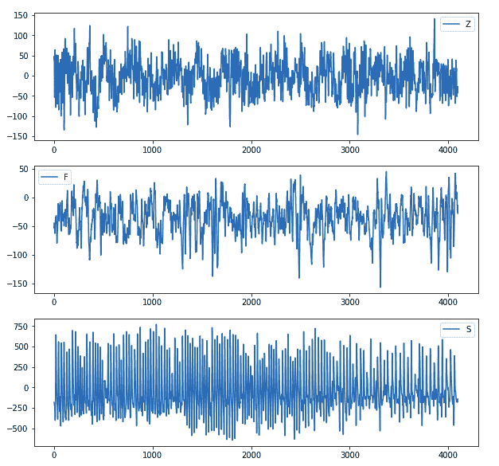
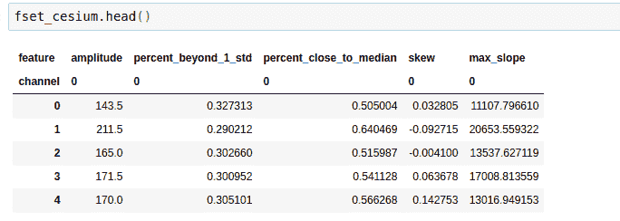
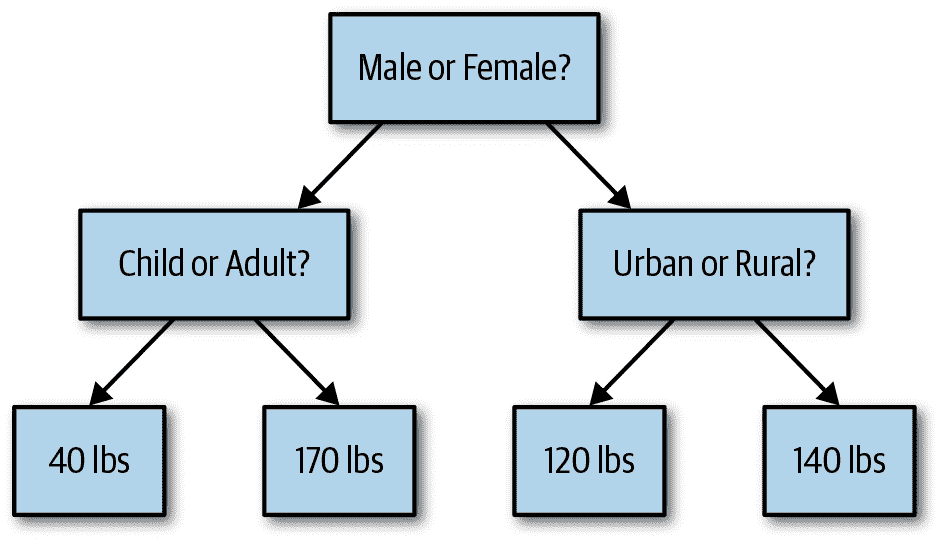
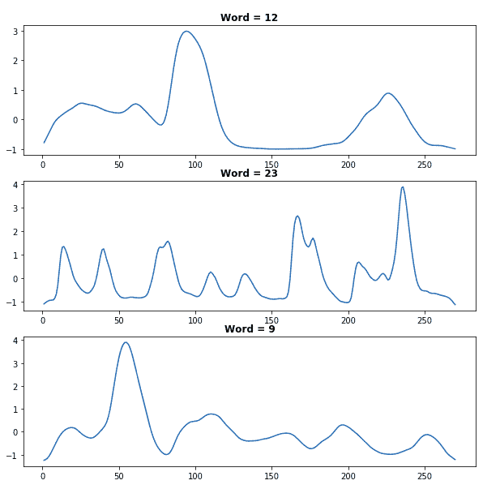
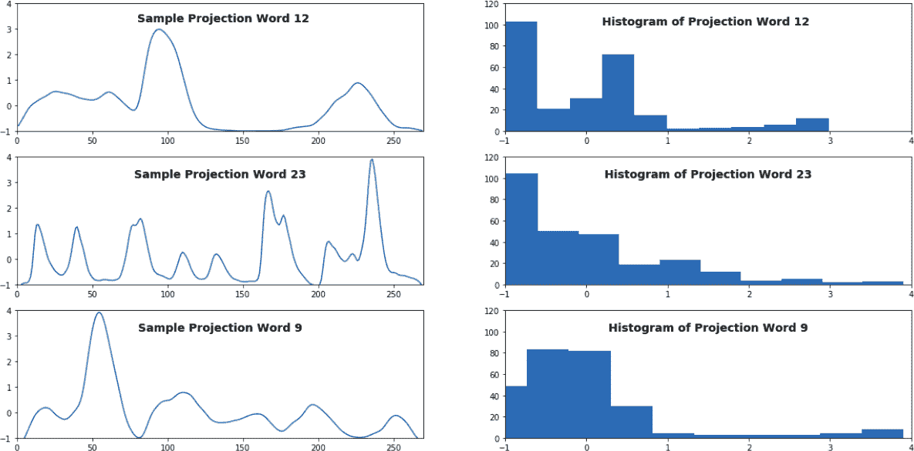
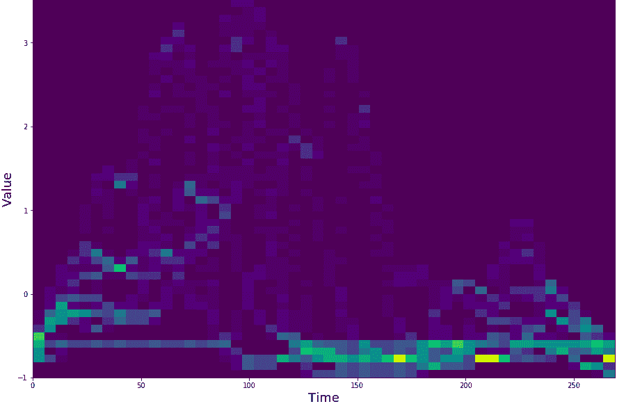
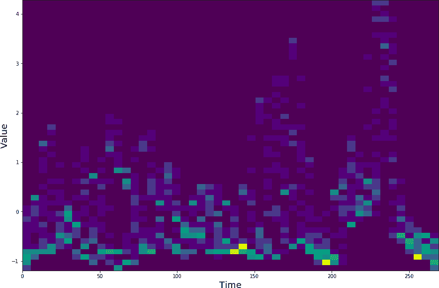
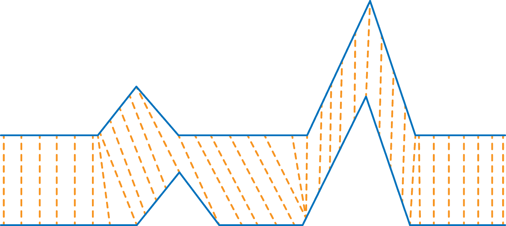

# 第九章：时间序列的机器学习

在本章中，我们将看几个例子，将机器学习方法应用于时间序列分析。这是时间序列分析的一个相对年轻的领域，但已显示出潜力。我们将研究的机器学习方法并不是原本为时间序列特定数据开发的——与我们在过去两章中研究的统计模型不同——但它们已被证明对其非常有用。

这一转向机器学习是从本书早期章节的预测工作中转变而来的。到目前为止，我们一直专注于时间序列预测的统计模型。在开发这些模型时，我们制定了关于时间序列动态和描述其行为中噪声和不确定性的统计的基本理论。然后，我们利用假设的过程动态进行预测，还估计了关于预测的不确定度。对于这些方法，模型识别和参数估计都要求我们认真思考如何最好地描述我们数据的动态。

现在我们转向那些不假设底层过程或关于底层过程的任何规则的方法。我们的注意力转向识别描述过程行为的模式，这些模式对于预测感兴趣的结果（如时间序列的适当分类标签）具有相关性。我们还将考虑无监督学习，以时间序列聚类的形式。

我们涵盖了基于树的方法进行预测和分类，以及聚类作为分类的一种形式。在基于树的方法中，形成时间序列的特征是使用方法的必要步骤，因为树不是一个“时间感知”的方法，不像 ARIMA 模型。

在聚类和基于距离的分类情况下，我们将看到我们可以选择使用特征或使用原始时间序列作为输入的选项。要将时间序列本身用作输入，我们研究了一种称为*动态时间规整*的距离度量标准，它可以直接应用于时间序列，保留了数据中完整的时间顺序信息，而不是将其折叠成一组必然有限的特征。

# 时间序列分类

在本节中，我们通过一个例子，演示如何将原始脑电图（EEG）时间序列数据转换为特征，然后可以将这些特征用于机器学习算法。之后，我们使用决策树方法对从 EEG 时间序列中提取的特征进行分类。

## 选择和生成特征

在上一章中，我们对时间序列特征生成的目的进行了一般讨论。我们还通过`tsfresh`对时间序列数据集生成特征进行了简要示例。现在我们将使用另一个讨论过的时间序列特征包`cesium`来生成特征。

`cesium`包的一个非常方便的属性之一是它提供了各种有用的时间序列数据集，包括最初来源于[2001 年研究论文](https://perma.cc/YZD5-CTJF)的 EEG 数据集。在这篇论文中，您可以阅读更多有关数据准备的详细信息。对于我们的目的，知道 EEG 时间序列数据集中的五个类别均代表从以下连续时间 EEG 样本中剪切出的等长片段即可。

+   健康人群闭眼和睁眼时的 EEG 记录（两个独立类别）

+   癫痫患者在发作期间无发作时的脑部 EEG 记录，来自两个非癫痫相关区域（两个独立类别）

+   在癫痫发作期间进行的颅内 EEG 记录（一个类别）。

我们通过`cesium`提供的便捷函数下载了该数据集：

```
## python
>>> from cesium import datasets
>>> eeg = datasets.fetch_andrzejak()
```

首先查看我们正在分析的数据的几个示例可能是有帮助的，以了解我们希望如何对这些时间序列进行分类：

```
## python
>>> plt.subplot(3, 1, 1)
>>> plt.plot(eeg["measurements"][0])
>>> plt.legend(eeg['classes'][0])
>>> plt.subplot(3, 1, 2)
>>> plt.plot(eeg["measurements"][300])
>>> plt.legend(eeg['classes'][300])
>>> plt.subplot(3, 1, 3)
>>> plt.plot(eeg["measurements"][450])
>>> plt.legend(eeg['classes'][450])

```

这些图表显示了 EEG 测量类别之间的一些差异（见图 9-1）。EEG 图表明显不同并不奇怪：它们正在测量不同大脑部分在健康受试者和癫痫患者中不同活动期间的活动。



###### 图 9-1\. 我们绘制了来自 EEG 数据集的三个随机选择样本。这些是独立的样本，而不是来自同一大脑不同部分的同时测量。每个是在不同时间对不同患者进行的独立时间序列测量。

这些可视化为特征生成提供了指导。例如，Z 类和 G 类似乎比 S 类具有更少的偏斜数据。此外，每个类别的值范围差异相当大，通过检查 y 轴可以看出。这表明幅度特征可能是有用的。此外，不仅仅是总振幅，而是点的整体分布在三个类别中似乎具有特征性差异。我们将在分析中使用这些特征以及其他几个，并且接下来我们展示生成这些特征的代码。

在这里，我们使用`cesium`生成特征：

```
## python
>>> from cesium import featurize.featurize_time_series as ft
>>> features_to_use = ["amplitude",
>>>                    "percent_beyond_1_std",
>>>                    "percent_close_to_median",
>>>                    "skew",
>>>                    "max_slope"]
>>> fset_cesium = ft(times           = eeg["times"],
>>>                  values          = eeg["measurements"],
>>>                  errors          = None,
>>>                  features_to_use = features_to_use,
>>>                  scheduler       = None)

```

这产生了我们的特征，如从 Jupyter 笔记本中截图的图 9-2 所示。



###### 图 9-2\. 我们在数据集中生成的前几个样本的特征数值。

请注意，这些值中许多没有经过标准化，所以如果我们使用假定已标准化输入的技术，这将是我们需要牢记的事情。

我们还应确认我们理解我们的特征指示的内容，并且我们的理解是否与`cesium`计算的内容相符。作为错误检查和常识确认的例证，我们可以验证一个时间序列样本的`percent_beyond_1_std`：

```
## python
>>> np.std(eeg_small["measurements"][0])
40.411
>>> np.mean(eeg_small["measurements"][0])
-4.132
>>> sample_ts = eeg_small["measurements"][0]
>>> sz = len(sample_ts)
>>> ll = -4.13 - 40.4
>>> ul = -4.13 + 40.4
>>> quals = [i for i in range(sz) if sample_ts[i] < ll or 
                                    sample_ts[i] > ul  ]
>>> len(quals)/len(ser)
0.327 ## this checks out with feature generated in Figure 9-2

```

# 特征应该是遍历的

在选择为时间序列生成特征时，请确保选择*遍历性*特征，意味着随着来自同一过程的更多数据的收集，测量的值将收敛到稳定值。不满足这一条件的例子是随机漫步，对于随机漫步来说，过程的平均值测量是无意义的，也不是遍历性的。随机漫步的平均值不会收敛到一个特定值。

在我们绘制的 EEG 数据中，从任何给定时间序列的不同子样本显然是可比较的，并且序列本身是弱稳态的，因此我们生成的特征是有意义的。

你应该能够验证你正在使用的任何特征。这只是一个负责任分析的简单问题。你不应该向你的算法提供你不能理解、解释和验证的信息。

###### 警告

不要过度使用特征生成库。编写自己的代码生成特征并不难。如果你在一个领域工作，在这个领域中特定组合的特征经常生成，你应该编写自己的代码，即使最初使用了一个包。

你可以通过各种方法优化你的代码，而普通探索性包的作者无法做到这一点。例如，如果你有几个特征依赖于时间序列的平均值计算，你可以创建代码只计算一次平均值，而不是分别计算每个特征一次。

## 决策树方法

基于树的方法反映了人类做决策的方式：一步一步地，以非常非线性的方式。它们反映了我们做复杂决策的方式：一步一步地思考一个变量如何影响我们的决策，然后是另一个变量，非常类似于流程图。

我假设你已经使用过决策树或可以快速直觉地理解决策树是什么。如果你需要更多支持，请暂停在这里并查看一些[背景阅读](https://perma.cc/G9AA-ANEN)。

图 9-3 展示了一个简单的决策树示例，用于估计某人的体重。



###### 图 9-3。在这个简单的回归树中，一系列逻辑分支用于得出人体预测体重。这是一个粗糙的模型，但它说明了即使是简单的树模型也可以应用于回归问题的非线性和多变方法。

在分析时间序列数据时，有大量人类行为表现得像一个决策树。例如，一名自主的股票市场交易员可能会使用技术指标，但他们可能会以串行的层次化方式使用它们，就像一棵树一样 —— 首先询问，例如，根据一个技术指标趋势动量的方向是什么，然后询问随时间变化波动率的演变情况，这第二个问题的答案与第一个问题以非线性的树状方式相互作用。很可能他们的大脑中有类似决策树结构，用来预测市场的走向。

同样，当医疗专业人员阅读脑电图（EEG）或心电图（ECG）时，通常会先寻找一个特征的存在，然后再考虑其他特征，依次通过一系列因素进行工作。如果一个特征存在而另一个不存在，将会导致与相反情况下不同的诊断，从而对患者预后产生不同的预测。

我们将使用从脑电图数据生成的特征作为输入，应用于两种不同的决策树方法，随机森林和梯度增强树，每种方法都可以用于分类任务。我们的任务将仅基于我们从原始数据生成的特征对讨论过的脑电图数据进行分类。

### 随机森林

随机森林是一种模型，其中我们不是使用单一的决策树，而是使用许多决策树。我们的分类或回归结果是这些树输出的平均值。随机森林寻求“众人的智慧”，其中众人由许多简单模型组成，每个模型本身可能并不特别好，但是所有这些模型在一起通常能够胜过一个经过精细调整的单一决策树。

早在 1969 年的研究论文《预测的组合》中，两位备受尊敬的统计学家 J.M.贝茨和 C.W.J.格兰杰提出了将一组模型组合以产生预测的想法，而不仅仅是努力寻找单一的“最佳”模型。该论文表明，组合两个单独的航空公司乘客数据预测可以导致具有较低均方误差的模型，这是一个令人惊讶且当时并不直观的结果。年轻一代分析师，他们通常是通过机器学习而不是统计学进入数据分析领域，对这样的想法感到直观而不是令人不安，而随机森林已经成为各种预测问题的得力工具。

随机森林是根据指定的树木数量和这些树木的最大允许深度来构建的。然后，对于每棵树，使用数据和其特征的随机样本来训练该树。这些树通常被参数化为相当简单，以避免过拟合，并且模型可以对许多一般模型求平均，其中没有一个特别好，但所有这些模型都足够一般化以避免数据中的“陷阱”。

正如前面提到的，我们将计算出的每个时间序列样本的特征输入模型作为我们的训练输出。理论上，我们可以考虑如何输入原始的时间序列数据，而不是计算出的特征，但是这种方法存在一些问题：

+   处理不等长时间序列会很复杂。

+   这么多输入（等于或接近时间步长的数量）将导致计算成本高昂的模型和训练。

+   假设没有特别重要的时间步长（因为任何给定时间步长都会与一个特征相关联），从树的角度来看，训练时会有很多噪音和非常少的信号。

因此，随机森林不适合处理原始形式的时间序列数据，但在其被压缩为摘要特征后，它们可以是有用的。以下是一些具体原因：

+   从效率/计算资源的角度来看，我们可以将极长的时间序列压缩成少数特征，并找到具有合理准确度的模型，这是非常棒的。

+   随机森林减少了过拟合的风险是有帮助的。正如我们之前讨论过的，过拟合对于时间序列分析是一个问题，因为过拟合和前瞻之间存在不利的协同效应。有意愿采用愚蠢/简单的方法可以部分解决这些问题。

+   对于我们没有工作模型或关于过程基础机制的假设的时间序列数据，随机森林可能特别合适。

一般规则是，分析师在时间序列分类案例中更容易成功地部署随机森林，而不是时间序列预测案例。相比之下，我们讨论的下一个方法，梯度提升树，在这两个任务中都取得了很大成功。

### 梯度提升树

*提升* 是另一种构建预测器集合的方法。提升按顺序创建模型，后续模型应纠正先前模型的错误，并且后续模型应更重视先前模型的数据拟合不良。

梯度提升树已成为首选的提升方法论，尤其在时间序列中表现卓越，这一点在最近几年的一些数据科学竞赛中得到了证明。

`XGBoost` 的工作方式是顺序构建树，每棵树都试图预测之前树组合的残差。例如，`XGBoost` 构建的第一棵树将尝试直接匹配数据（一个类别或数值）。第二棵树将尝试预测真实值减去预测值。第三棵树将尝试预测真实值减去第一棵树预测值再减去第二棵树对第一棵树残差的预测值。

然而，`XGBoost` 并不是无限地构建模型，试图无限制地最小化预测的残差的预测的残差。`XGBoost` 算法最小化的损失函数还包括一个惩罚项，用于限制将要生成的树的数量。也可以直接限制生成的树的数量。

在过去的几年中，许多人报告使用 `XGBoost` 比起传统的时间序列机器学习方法（例如在 Kaggle 竞赛或工业机器学习会议中）取得了更大的成功。

###### Tip

*Bagging*（或更正式地称为 *bootstrap aggregating*）是一种训练模型的技术，其中为集成中的每个不同模型随机生成训练集。随机森林通常在模型训练中使用 bagging 方法。

Boosting，正如已经注意到的，是一种训练模型的技术，其中一个集成由顺序训练的模型组成，每个模型专注于纠正其前任所犯的错误。Boosting 是梯度提升树模型训练的核心所在。

### Code example

对于随机森林和 `XGBoost`，编写一个机器学习模型可能比理解该模型的工作原理更容易。在这个例子中，我们将训练一个随机森林和一个梯度提升树模型来基于我们生成的特征对我们的 EEG 数据进行分类。

我们使用 `sklearn` 将我们的数据分成训练和测试数据集：

```
## python
>>> from sklearn.model_selection import train_test_split
>>> X_train, X_test, y_train, y_test = train_test_split(
     		fset_cesium.values, eeg["classes"], random_state=21)
```

我们首先使用随机森林分类器。在这里，我们可以看到如何轻松创建一个用于分类我们的 EEG 数据的模型：

```
## python
>>> from sklearn.ensemble import RandomForestClassifier
>>> rf_clf = RandomForestClassifier(n_estimators = 10, 
>>>                                 max_depth    =  3,
>>>                                 random_state = 21)
>>> rf_clf.fit(X_train, y_train)

```

我们随后可以通过对 `Classifier` 对象的方法调用来确定我们数据的外样准确性：

```
## python
>>> rf_clf.score(X_test, y_test)
0.616

```

在仅仅几行代码中，我们有一个模型，它比我作为一个没有医学教育的人类分类器做得更好。还要记住，由于特征选择，这个模型只看到摘要统计数据，而不是整个 EEG。

`XGBoost` 分类器的代码同样简单而简洁：

```
## python
>>> import xgboost as xgb
>>> xgb_clf = xgb.XGBClassifier(n_estimators    = 10, 
>>>                              max_depth    =  3,
>>>                              random_state = 21)
>>> xgb_clf.fit(X_train, y_train)
>>> xgb_clf.score(X_test, y_test)
0.648
```

我们可以看到 `XGBoost` 分类器模型比随机森林模型稍微好一些。它还训练速度稍快，正如我们可以通过这个快速实验计算每个模型的训练时间所看到的：

```
## python
>>> start = time.time()
>>> xgb_clf.fit(X_train, y_train)
>>> end = time.time()
>>> end - start
0.0189

## Random Forest
>>> start = time.time()
>>> rf_clf.fit(X_train, y_train)
>>> end = time.time()
>>> end - start
0.027

```

这种执行速度显著提高，随机森林比`XGBoost`花费的时间多 50%。虽然这不是一个明确的测试，但它确实指出了`XGBoost`的优势，特别是在处理大数据集时。您需要确保这种优势在使用更多示例和更多特征的更大数据集时扩展。

我们可以公平地问，是否有关于我们特定的超参数集合，使`XGBoost`比随机森林更有优势的内容。例如，如果我们通过设置较低的深度使用更简单的树，或者如果我们允许模型中存在更少的决策树总数，这些可能性都很容易测试，再次显示出`XGBoost`倾向于保持其优势。

例如，如果我们允许集成中有相同数量的决策树，但通过减少树的深度降低了复杂性，我们会发现梯度提升模型的准确性高于随机森林模型：

```
## python
>>> ## Test the same number of trees (10) but with less complexity
>>> ## (max_depth = 2)
>>> 
>>> ## XGBoost
>>> xgb_clf = xgb.XGBClassifier(n_estimators = 10, 
                             max_depth    =  2,
                             random_state = 21)
>>> xgb_clf.fit(X_train, y_train)
>>> xgb_clf.score(X_test, y_test)
0.616

>>> ## Random Forest
>>> rf_clf = RandomForestClassifier(n_estimators = 10,
                                max_depth    =  2,
                                random_state = 21)
>>> rf_clf.fit(X_train, y_train)
>>> rf_clf.score(X_test, y_test)
0.544
```

即使我们进一步减少树的复杂度，这也是真实的：

```
>>> ## Test the same number of trees (10) but with less complexity
>>> ## (max_depth = 1)

>>> ## XGBoost
>>> xgb_clf = xgb.XGBClassifier(n_estimators = 10,
                                max_depth    =  1,
                                random_state = 21)
>>> xgb_clf.fit(X_train, y_train)
>>> xgb_clf.score(X_test, y_test)
0.632

>>> ## Random Forest
>>> rf_clf = RandomForestClassifier(n_estimators = 10,
                                max_depth    =  1,
                                random_state = 21)
>>> rf_clf.fit(X_train, y_train)
>>> rf_clf.score(X_test, y_test)
0.376

```

解释梯度提升树优于随机森林的性能和潜在优势的几个可能原因。一个重要的考虑因素是，我们不能确定我们为分类选择的所有特征是否特别有用。这突显了梯度提升（梯度提升树）可能优于装袋（随机森林）的一个例子。提升会更有可能忽略无用的特征，因为它总是利用完整的特征集并优先选择相关的特征，而某些由装袋产生的树则被迫使用意义较小的特征。

这也表明了在与我们在上一章中讨论过的超级特征生成库配对时，提升的有用性。如果您采取生成数百个时间序列特征的方法——远远超出您能合理检查的数量——提升可能会避免真正灾难性的结果。

###### 提示

梯度提升树对于大数据集特别有用，包括大型时间序列数据集。您选择的实现可能会稍微影响您的准确性和训练速度。除了`XGBoost`，您还应考虑`LightGBM`和`CatBoost`。据报道，后两个软件包的性能有时比`XGBoost`快得多，尽管有时在样本外测试准确性略有下降。

### 分类与回归

在前面的例子中，我们考虑了用于时间序列分类的随机森林和梯度提升树方法。这些方法也可以用于时间序列预测。

许多统计学家认为，在预测领域，机器学习并没有比传统的时间序列统计分析更成功，或者说并没有更成功。然而，在过去几年中，梯度提升树用于预测已经起飞，并且在给定足够大的数据集时，通常在预测竞赛和工业应用中表现优异。然而，在这种情况下，需要花费大量时间来调整模型的参数以及准备时间序列特征。

梯度提升树模型的一个优势在于它们在筛选掉无关或嘈杂特征并专注于最重要特征方面接近“自动驾驶”。然而，仅凭这种倾向还不足以使模型达到最先进的性能。即使对于看似自动的方法，如梯度提升树，输出的好坏也取决于输入的质量。提高模型性能的最重要方式仍然是提供高质量和经过充分测试的输入特征。

有多种方法可以改进当前的模型。我们可以通过使用`XGBoost`的选项来生成特征重要性指标来学习。这可以帮助我们识别有用特征和无用特征的特性，然后我们可以通过添加类似于已判断为有用的特征的新特征来扩展数据集。我们还可以进行超参数网格搜索来调整模型参数化。最后，我们可以查看误标记数据的原始时间序列，看看是否有误标记数据的特性未被当前特征集所表示。我们可以考虑添加能更好地描述误标记数据的特征，进一步增强我们的输入。

# 聚类

聚类的一般理念是，彼此相似的数据点在分析目的上构成有意义的群组。这一理念对于时间序列数据和其他类型的数据同样适用。

正如我们之前讨论的那样，我假设您对非时间序列上下文中的相关机器学习概念有一定的了解。如果您对聚类技术不熟悉，我建议您在继续本节之前进行一些简短的[背景阅读](https://perma.cc/36EX-3QJU)。

时间序列的聚类可以用于分类和预测两种情况。在分类的情况下，我们可以使用聚类算法在训练阶段识别出所需的聚类数量。然后，我们可以使用这些聚类来建立时间序列的类型，并识别新样本是否属于特定群组。

在预测的情况下，应用可以是纯粹的聚类，也可以受到聚类的启发，以使用相关的距离度量（关于距离度量的更多内容即将详述）。有几种选项可以根据聚类和相关技术在未来的时间*H*内生成预测。请记住，在这种情况下，我们将不会完全观察到时间序列，而只能看到其前*N*步，我们希望预测其在时间步*N* + *h*的值。在这种情况下有几种选项。

一种选择是使用类成员资格来生成基于该类典型行为的预测。为此，首先确定时间序列样本根据其前*N*个时间步属于哪个聚类，然后根据聚类成员资格推断未来行为的可能性。具体来说，查看这个聚类中时间序列值在时间步*N*和时间步*N* + *h*之间如何变化。请注意，您需要基于其前*N*步执行所有时间序列的原始聚类，而不是基于时间序列的所有部分，以避免预先看到。

另一种选择是基于样本时间序列在样本空间中最近邻（或最近邻）的行为预测未来行为。在这种情况下，根据前*N*个时间步的指标，找到时间序列样本的最近邻（们），其完整轨迹已知。然后对这些最近邻的*N* + *h*行为取平均，这就是当前样本的预测。

在分类和预测的情况下，最重要的考虑因素是如何评估时间序列之间的相似性。可以使用各种距离度量进行聚类，并且已经有大量研究致力于思考如何在高维问题中测量距离。例如，两个求职者之间的“距离”是什么？两个血样本之间的“距离”是什么？这些挑战在横截面数据中已经存在，并且在时间序列数据中仍然存在。

在将聚类技术应用于时间序列数据时，我们有两类距离度量选项：

基于特征的距离

为时间序列生成特征，并将其视为计算数据的坐标。这并不能完全解决选择距离度量的问题，但它将问题缩小到与任何横截面数据集提出的距离度量问题相同的范围内。

基于原始时间序列数据的距离

找到一种方法来确定不同时间序列的“接近程度”，最好能够处理不同的时间尺度、不同的测量次数以及其他可能存在的时间序列样本之间的差异。

我们将把这两种距离度量应用于一个时间序列数据集，其中每个样本代表从 2D 图像到 1D 时间序列的手写单词的投影。

## 从数据生成特征

我们已经讨论了生成和选择特征的方法。在这里，我们考虑如何根据它们特征的相似性来评估时间序列数据集之间的距离。

在理想情况下，我们可能已经通过使用树来评估特征的重要性来删除不重要或无趣的时间序列。我们不希望将这些特征包含在距离计算中，因为它们可能会错误地指示两个时间序列之间的不同，而实际上它们只是不与我们分类任务中的类别或预测任务中的结果相关。

就像我们对 EEG 数据集所做的那样，我们从查看一些类别示例开始我们的分析，并注意随时间变化及时间序列结构中的明显差异。

我们的数据是 UEA 和 UCR 时间序列分类存储库提供的[FiftyWords](https://oreil.ly/yadNp)数据集的子集。这个数据集是根据一篇 2003 年的[论文](https://oreil.ly/01UJ8)中的方法进行释放的，该论文研究了在历史文档中聚类手写单词。在那篇论文中，作者开发了“单词轮廓”作为将手写单词的二维图像映射到一维曲线的一种方法，该曲线由相同数量的测量组成，无论单词长度如何。存储库数据集与论文中的数据集不完全相同，但原理相同。原始论文的目的是开发一种方法，通过单一标签标记文档中所有相似或相同的单词，以便人类可以返回并数字化地标记这些单词（这是一个现在可能会直接由神经网络完成的壮举，借助 20 年的技术进步来帮助完成任务）。

在这个例子中，我们看到了*投影文件*中的样本投影，其中“投影”指的是它们将图像从二维空间转换为一维空间，后者由于顺序的重要性，适合进行时间序列分析。请注意，“时间”轴实际上不是时间，而是书面文字从左到右的进展。尽管如此，概念是相同的——有序且等间距的数据——因此为了简单起见，在分析中我将使用*时间*和*时间上的*这两个词，尽管这并非严格正确。对于我们的用例，这没有区别。

在图 9-4 中，我们看到了几个不同单词的示例。¹

当我们检查这些数据时，特别是考虑到绘图中对人眼明显的模式，就像对 EEG 一样，我们可以制定一些特征作为我们分析的起点——例如，峰值的高度和位置以及它们上升的锐度和峰顶的形状。

我描述的许多特征开始听起来更像是图像识别特征，而不像时间序列，这对于特征生成是一个有用的视角。毕竟，视觉数据通常是我们可以轻松处理并且更直观的数据。在考虑特征时，将其视为图像可能会有所帮助。这个视角也说明了为什么生成特征可能会令人惊讶地困难。在某些情况下，通过检查时间序列可能很明显如何区分两个类别，但我们可能会发现编写代码并不那么明显。或者我们可能会发现，我们可以编写代码，但这非常费力。



###### 图 9-4\. 三个不同单词（12、23 和 9）的投影轮廓彼此非常不同。我们已经看到一些可以区分这些单词的特征：最大峰值或第二大峰值的时间位置（x 轴），有多少局部峰值，值的总范围以及曲线的平均凸度。

在过去的十年中，深度学习已经成为图像分类的最强表现者，有了足够的数据，我们可以在这些图像的基础上训练深度学习分类器（更多内容请参见第十章）。目前，对于我们来说，想出解决编程困难的方法将是有帮助的。例如，生成定位每个峰值的特征将会很困难，因为找峰值在程序上要求很高，而且有点艺术性。

我们还可以使用 1D 直方图，无论是所有类别示例的还是单个示例的。这可能建议出一些计算上较少要求的方法，用于识别峰值或找到其他代理值，这些代理值将映射到我们在时间序列中看到的整体形状。在这里，我们绘制了以前绘制过的相同的单个类成员，现在伴随它们的 1D 直方图（参见图 9-5）：

```
## python
>>> plt.subplot(3, 2, 1)
>>> plt.plot(words.iloc[1, 1:-1])
>>> plt.title("Word = " + str(words.word[1]), fontweight = 'bold')
>>> plt.subplot(3, 2, 2)
>>> plt.hist(words.iloc[1, 1:-1], 10)
>>> plt.subplot(3, 2, 3)
>>> plt.plot(words.iloc[3, 1:-1])
>>> plt.title("Word = " + str(words.word[3]), fontweight = 'bold')
>>> plt.subplot(3, 2, 4)
>>> plt.hist(words.iloc[3, 1:-1], 10)
>>> plt.subplot(3, 2, 5)
>>> plt.plot(words.iloc[5, 1:-1])
>>> plt.title("Word = " + str(words.word[11]), fontweight = 'bold')
>>> plt.subplot(3, 2, 6)
>>> plt.hist(words.iloc[5, 1:-1], 10)

```



###### 图 9-5\. 衡量类别的另一种方法是，头脑风暴有用的特征。特别是，单个类别示例的直方图表明直方图的属性，如局部峰值的数量，偏斜度和峰度可能会有所帮助，并且可能是一些显而易见的时间序列曲线属性的良好代理，这些属性对人眼来说很明显，但用代码识别起来并不容易。

我们还希望确保我们正在查看的示例与这些单词的其他示例不是离群值。因此，我们构造了两个单词的 2D 直方图，以了解个体变异（参见图 9-6）：

```
## python
>>> x = np.array([])
>>> y = np.array([])
>>> 
>>> w = 12
>>> selected_words = words[words.word == w]
>>> selected_words.shape
>>> 
>>> for idx, row in selected_words.iterrows():
>>>     y = np.hstack([y, row[1:271]])
>>>     x = np.hstack([x, np.array(range(270))])
>>>     
>>> fig, ax = plt.subplots()

```



###### 图 9-6\. 单词 = 12 的 1D 单词投影的 2D 直方图。y 轴是给定时间步长的值，x 轴代表每个时间序列样本/单词投影的 270 个时间步长。

图 9-6 展示了数据集中所有 word = 12 成员的 2D 直方图。虽然图 9-5 中的单个曲线表明我们应该专注于找到似乎主导时间序列的两个大峰值，但在这里我们看到，这一类大多数成员共同点可能是这些峰值之间的平坦区间，根据该区域内点的强度，这个区间似乎从大约时间步骤 120 到 200。

我们还可以使用这个 2D 直方图来建立这一类的最大峰值的截止点，这一点似乎在时间步骤 50 和 150 之间的位置变化。我们甚至可能希望编写一个像“在点 50 到 150 之间是否达到最大值”这样具体的功能。

我们出于同样的原因绘制了另一个 2D 直方图，这次选择 word 类别 23，该类别在我们在图 9-5 中绘制的例子中有许多小颠簸，这是一个难以量化的特征（参见图 9-7）。



###### 图 9-7\. word = 23 的 1D 单词投影的 2D 直方图。y 轴表示给定时间步骤的值，x 轴代表每个时间序列样本/单词投影的 270 个时间步骤。

看到 word 类别 23 在图 9-7 中特别“扩展”的直方图并不奇怪，因为即使我们在图 9-5 中绘制的例子中显示了许多特征，如果这些特征在样本之间没有完全匹配，我们也会预期在 2D 直方图中看到许多扩展。然而，我们还看到这一类的最大点值在这里的时间步骤范围内没有重叠，与 word 类别 12 相比。对于这一类，最大值出现在 150 之后，这是合理的，因为我们在 word 类别 23 示例中看到的两个最大峰值正好在这个范围内。2D 直方图倾向于证实，较早的峰值不如较晚的峰值高，表明有其他方法来量化这个时间序列的形状，以区别于其他类别。

这些 2D 直方图有助于让我们了解单个类别内特征的变异性，这样我们在考虑如何形成我们的特征时，就不会过分依赖一个单一的类别示例。

在这种情况下，我们选择生成一组从词投影形状衍生出的特征，以及从词投影直方图形状衍生出的另一组特征（将一维摘要投射到不同的一维摘要，再从中生成特征）。这是对我们在二维直方图中看到的大“模糊区域”的响应，表明存在高峰，但它们的位置并不特别稳定。使用直方图生成每个词投影的第二个特征形状可能比词投影本身更可靠和特征化。直方图表征系列中出现的值的类型，而不表征它们在系列中的位置，而对于我们来说，重要的是考虑到投影中的高峰并没有特别稳定的时间位置。

首先，我们为每个时间序列生成 270 个时间步长的特征。在这种情况下，我们缩短了用于生成代码可读性特征的函数名称：

```
from cesium import featurize.featurize_time as ft
```

```
## python
>>> word_vals      = words.iloc[:, 1:271]
>>> times          = []
>>> word_values    = []
>>> for idx, row in word_vals.iterrows():
>>>     word_values.append(row.values)
>>>     times.append(np.array([i for i in range(row.values.shape[0])]))
>>> 
>>> features_to_use = ['amplitude',
>>>                    'percent_beyond_1_std',
>>>                    'percent_close_to_median']
>>> featurized_words = ft(times           = times,
>>>                       values          = word_values,
>>>                       errors          = None,
>>>                       features_to_use = features_to_use,
>>>                       scheduler       = None)

```

接下来，我们生成直方图，并将其用作另一个要生成特征的时间序列：²

```
## python
>>> ## create some features derived from histogram
>>> times = []
>>> hist_values = []
>>> for idx, row in words_features.iterrows():
>>>     hist_values.append(np.histogram(row.values, 
>>>                                     bins=10, 
>>>                                     range=(-2.5, 5.0))[0] + .0001) 
>>>                                    ## 0s cause downstream problems
>>>     times.append(np.array([i for i in range(9)]))
>>> 
>>> features_to_use = ["amplitude",
>>>                    "percent_close_to_median",
>>>                    "skew"
>>>                   ]
>>> 
>>> featurized_hists = ft(times           = times,
>>>                       values          = hist_values,
>>>                       errors          = None,
>>>                       features_to_use = features_to_use,
>>>                       scheduler       = None)

```

我们通过传递给`np.histogram()`的参数，确保所有的直方图使用相同数量和值范围的箱子作为基础。这样做确保所有的直方图是直接可比较的，具有相同范围的箱值，这将在这些直方图通过时间序列特征生成时成为“时间”轴。如果我们不强制保持这种一致性，生成的特征可能不一定有意义，无法比较一个直方图与另一个。

最后，我们结合这两个特征来源：

```
## python
>>> features = pd.concat([featurized_words.reset_index(drop=True), 
>>>                       featurized_hists], 
>>>                       axis=1)

```

## 时间感知距离度量

运行聚类分析时，我们必须选择一个距离度量。对于时间序列特征，正如我们刚才所做的那样，我们可以将各种标准距离度量应用于它们，就像在横截面数据的标准聚类分析中所做的那样。如果您对在这些情况下选择距离度量的过程不熟悉，我建议您先做一些[背景阅读](https://perma.cc/MHL9-2Y8A)。

在本节中，我们将重点讨论通过定义它们之间的距离度量来测量时间序列之间相似性的问题。其中一个最著名的度量指标例子是动态时间规整（DTW）。DTW 适用于聚类时间序列，其最显著的特征是其整体形状，正如我们的词投影数据所示。

这项技术的名字源于其方法论，依赖于时间上的“扭曲”，以使时间序列沿其时间轴对齐，从而比较它们的形状。用图片来传达动态时间扭曲的概念远比用文字更有价值，所以请看一下图 9-8。时间（x 轴）被扭曲——即根据需要被扩展或收缩——以便在两条描绘的曲线（即两个时间序列）之间找到最佳的点对齐，以比较它们的形状。



###### 图 9-8\. 动态时间扭曲的工作原理。一个时间序列上的每个点都映射到另一个时间序列上的一个点，但并不要求必须有一对一的点映射。这有一些影响：(1) 时间序列不需要具有相同的长度或相同的时间尺度。重要的是形状。(2) 在拟合过程中，时间并不总是沿着相同的速度前进，并且可能不同时间序列的进展速度也不相同。通过时间的进展，我指的是沿着 x 轴方向的曲线。来源：[维基百科](https://perma.cc/F9ER-RTDS)。

注意，在这种算法的标准形式中，与另一条曲线相比的一个曲线上的实际时间值与另一个曲线上的时间轴上的时间值并不相关。我们可以比较一个以纳秒为单位测量的时间序列与另一个以千年为单位测量的时间序列（虽然这可能不是一个明智的练习）。算法的目的类似于比较该算法的视觉“形状”，而不是考虑时间流逝的多少。实际上，“时间”在这里只是指一个有序的均匀间隔的点集，而不是时间本身的概念。

DTW 的规则如下：

+   每一个时间序列中的点都必须至少与另一个时间序列中的一个点匹配。

+   每个时间序列的第一个和最后一个索引必须与另一个时间序列中相应的索引匹配。

+   点的映射必须使时间向前移动，而不是向后。通过匹配一个时间序列中的一个点与另一个时间序列中的一个已经在时间轴上过去的点，不能回到过去。然而，时间不必始终向前移动。例如，原始系列中的两个连续时间步骤可以通过在拟合期间被压缩到 x 轴上的相同位置来被扭曲，就像在图 9-8 中在上曲线/实线的第一个“弯曲”处所示。

有许多方法可以调整时间对齐以遵循这些规则，但选择的匹配是使曲线之间距离最小化的匹配。这个距离，或成本函数，通常被测量为匹配点之间的绝对差的和，其中绝对差是指点之间的值的差异。

现在我们对 DTW 的直观工作方式有了一定的了解，我们可以看看代码：

```
## python
>>> def distDTW(ts1, ts2):
>>>     ## this is setup
>>>     DTW={}
>>>     for i in range(len(ts1)):
>>>         DTW[(i, -1)] = np.inf
>>>     for i in range(len(ts2)):
>>>         DTW[(-1, i)] = np.inf
>>>     DTW[(-1, -1)] = 0
>>> 
>>>     ## this is where we actually calculate the optimum
>>>     ## one step at at time
>>>     for i in range(len(ts1)):
>>>         for j in range(len(ts2)):
>>>             dist = (ts1[i] - ts2[j])**2
>>>             DTW[(i, j)] = dist + min(DTW[(i-1, j)],
>>>                                      DTW[(i, j-1)], 
>>>                                      DTW[(i-1, j-1)])
>>>             ## this is an example of dynamic programming
>>> 
>>>     ## once we have found the complete path, we return 
>>>     ## the associated distance
>>>     return sqrt(DTW[len(ts1)-1, len(ts2)-1])

```

如评论所指出的，解决这个问题的方法是动态规划的一个例子，DTW 距离是一个经典的动态规划问题。我们可以从每个时间序列的开头逐步迈出一步，知道我们可以一步一步地建立解决方案，并参考我们先前的知识来做出后续的决策。

有许多不同的 DTW 实现，有各种各样的想法来使寻找最优解或接近最优解的过程更加高效。如果您正在处理更大的数据集，应该特别注意这些。

还有其他衡量时间序列之间距离的方法。以下是几种：

弗雷歇距离

这是两条曲线在时间扭曲遍历期间的最大距离，始终寻求最小化两条曲线之间的距离的一个示例。这种距离度量通常通过一个狗和它的主人伴随着两条曲线之间的系带进行解释。它们需要分别从开始到结束遍历每条曲线，它们可以以不同的速度前进，并且可以在曲线上改变速度，只要它们始终朝着同一个方向移动。弗雷歇距离是它们完成任务所需的系带的最短长度，遵循最佳轨迹（假设它们能找到！）。

皮尔逊相关系数

两个时间序列之间的相关性可以作为衡量它们之间距离的一种方式。与其他距离度量不同，通过最大化相关性指标来最小化时间序列之间的距离。相关性相对容易计算。然而，这种方法要求时间序列具有相同数量的数据点，或者将一个时间序列进行降采样以匹配另一个时间序列的较少数据点。计算相关性的时间复杂度为*O*(*n*)，这使得它在计算资源方面特别高效。

最长公共子序列

这种距离测量适用于表示分类或整数值序列的时间序列。在这种情况下，为了考虑两个时间序列的相似性，我们可以确定最长公共子序列的长度，即连续值完全相同的最长长度，尽管它们在时间序列中的确切位置不必匹配。与 DTW 类似，这意味着我们更关心找到一个共同性的形状，而不是共同形状出现的时间。还要注意，像 DTW 一样，但不像皮尔逊相关性，这不要求时间序列具有相同的长度。一个相关的测量是编辑距离，通过该距离我们找到我们需要对一个时间序列进行的更改数量，使其与另一个时间序列完全相同，并使用此值定义距离度量。

# 距离与相似性

有关测量时间序列之间距离的文献也使用相似性一词来描述这些度量。在大多数情况下，你可以将这些术语互换使用，即用来确定哪些时间序列更像或更不像彼此的一种方式。尽管如此，有些度量将是适当的距离，例如 Fréchet 距离，它可以用适当的单位（例如“英尺”或“kg/美元”或时间序列正在测量的任何度量单位）进行计算。其他度量则是无单位的，例如相关性。

有时，一点创意可以为寻找简单但恰当的解决方案提供很大帮助，因此，考虑清楚你的需求并尽可能具体地定义它们总是个好主意。考虑一个[Stack Overflow 帖子](https://perma.cc/389W-68AH)，寻找一种距离度量用于特定应用，即将时间序列分类以匹配之前聚类分析中的三个质心之一。这三个类别分别是：

+   一条平直的线。

+   时间序列开始处有峰值，其他时间为平直线。

+   时间序列结束处有峰值，其他时间为平直线。用户发现包括欧几里得距离和 DTW 在内的几种标准距离度量方法未能达到预期效果。在这种情况下，DTW 过于宽松，认为任何具有峰值的时间序列与开始处和结束处均有峰值的时间序列距离相等（因此，尽管计算复杂，DTW 并非万能药！）。

在这种情况下，一位聪明的评论者建议了一种转换，使距离度量工作得更好，即比较累积总和的时间序列而不是原始时间序列。在这种转换之后，无论是欧几里得距离还是 DTW 距离都能正确排序，使得时间序列在开始处有峰值的最短距离与该类别原型的距离最小，而不是与开始和结束处均有峰值的原型距离相等。这应该让我们想起我们之前学习过的分析，即通过转换时间序列可以使 ARIMA 模型适用，即使原始数据不满足必要条件。

不幸的是，选择距离度量的“自动驾驶”功能并不存在。你需要凭借自己的判断力来找到以下平衡：

+   最小化计算资源的使用。

+   选择强调时间序列特征与你最终目标最相关的度量。

+   确保你的距离度量反映了你正在配对的分析方法的假设和优缺点。例如，*k*-均值聚类不使用成对距离，而是最小化方差，因此只有类似于欧几里得距离的技术才有意义。

## 聚类代码

现在我们已经讨论了如何为聚类分析生成特征，以及如何直接在时间序列之间测量距离作为聚类的距离度量，我们将使用我们选择的特征和我们的配对 DTW 距离矩阵执行聚类，以比较结果。

### 规范化特征的层次聚类

我们为我们的单词作为时间序列计算了特征，分别为原始记录的时间序列和时间序列的直方图。这些特征可能在完全不同的尺度上出现，因此如果我们想对它们应用单一的距离度量，我们会像特征聚类的标准操作程序一样对它们进行标准化：

```
## python
>>> from sklearn import preprocessing
>>> feature_values = preprocessing.scale(features.values)

```

我们选择了一种层次聚类算法，并对 50 个聚类进行了拟合，因为我们试图将这些聚类与我们数据集中的 50 个单词匹配：

```
## python
>>> from sklearn.cluster import AgglomerativeClustering
>>> feature_clustering = AgglomerativeClustering(n_clusters = 50, 
>>>                                              linkage    = 'ward')
>>> feature_clustering.fit(feature_values)
>>> words['feature_labels'] = feature_clustering.fit_predict(p)

```

然后我们想看看这些聚类（其标签与原始单词标签无关）是否显示出与单词标签有用的对应关系：

```
## python
>>> from sklearn.metrics.cluster import homogeneity_score
>>> homogeneity_score(words.word, words.feature_labels)
0.508

```

我们很幸运地在处理标记数据，否则我们可能会根据我们形成的聚类得出错误的结论。在这种情况下，少于一半的聚类与单个词密切相关。如果我们回过头考虑如何改进这个结果，我们有几个选择：

+   我们只使用了六个特征。这并不是很多特征，所以我们可以添加更多。

+   我们可以寻找相对不相关的特征，这一点我们在这里没有做。

+   我们仍然缺少显然有用的特征。从数据的视觉探索中我们注意到一些特征，但没有包括在内，比如显著峰值的数量和位置。我们可能需要重新设计这个分析，以包括该信息或一些更好的代理。

+   我们应该探索使用其他距离度量，也许是那些更加强调某些特征而不是其他特征的度量，优先考虑人眼认为有用的特征。

### 使用 DTW 距离矩阵的层次聚类

我们已经完成了基于时间序列聚类的直接聚类的困难部分，通过计算通过 DTW 的配对距离矩阵。这是计算上非常耗费资源的，这就是为什么我们小心保存结果以便在需要时重新审视分析的原因：

```
## python
>>> p = pairwise_distances(X, metric = distDTW)
>>> ## this takes some time to calculate so worth saving for reuse
>>> with open("pairwise_word_distances.npy", "wb") as f:
    np.save(f, p)

```

现在我们已经有了它们，我们可以使用层次聚类算法：

```
## python
>>> from sklearn.cluster import AgglomerativeClustering
>>> dtw_clustering = AgglomerativeClustering(linkage   = 'average',
>>>                                         n_clusters = 50, 
>>>                                         affinity   = 'precomputed') 
>>> words['dtw_labels'] = dtw_clustering.fit_predict(p)

```

最后，与以往一样，我们比较拟合的聚类与已知标签之间的对应关系：

```
## python
>>> from sklearn.metrics.cluster import homogeneity_score, 
>>>                                     completeness_score
>>> homogeneity_score(words.word,  words.dtw_labels)
0.828
>>> completeness_score(words.word, words.dtw_labels)
0.923

```

我们看到基于 DTW 的这种聚类比我们基于特征的聚类要好得多。然而，如果你在自己的计算机上运行 DTW 距离计算代码——特别是如果它是一台标准笔记本电脑——你将看到 DTW 需要比我们选择的特征计算更长的时间。我们很可能可以改进我们基于特征的聚类，而现在计算出的 DTW 距离聚类则没有明显的改进途径。我们改进这一点的替代方案可能是：

+   包括特征以及 DTW 距离。从编码的角度来看，这很棘手，从概念的角度来看，也很难决定如何将特征与 DTW 距离结合起来。

+   尝试其他距离度量。正如前面讨论的那样，适当的距离度量将取决于您的数据、您的目标和您的下游分析。我们需要更明确地定义我们对这个词分析的目标，并几何地思考一下 DTW 是否真的是我们想要实现的最佳度量。

# 更多资源

+   关于时间序列距离和相似度测量：

    Meinard Müller，[“动态时间规整”，](https://perma.cc/R24Q-UR84) 收录于《信息检索》中，用于音乐和动作（柏林：斯普林格，2007 年），69–84，https://perma.cc/R24Q-UR84。

    Müller 书中的这一章节提供了动态时间规整的广泛概述，包括讨论为减少计算 DTW 的计算复杂度所做的常见近似。

    Stéphane Pelletier，[“计算两个多边形曲线之间的弗雷歇距离”，](https://perma.cc/5QER-Z89V)（讲座笔记，计算几何，麦吉尔大学，2002 年），https://perma.cc/5QER-Z89V。

    麦吉尔大学的这套讲座笔记提供了弗雷歇距离是什么以及如何计算的直观视觉和算法解释。

    Pjotr Roelofsen，[“时间序列聚类”，](https://perma.cc/K8HJ-7FFE) 硕士论文，商业分析，阿姆斯特丹自由大学，2018 年，https://perma.cc/K8HJ-7FFE。

    这篇关于时间序列聚类的硕士论文，从详尽且有用的讨论开始，介绍了计算时间序列之间距离的主流技术，包括距离计算的计算复杂度信息，以及帮助建立直觉的有用示例。

    Joan Serrà 和 Josep Ll. Arcos，[“时间序列分类相似度测量的经验评估”，](https://perma.cc/G2J4-TNMX) 《基于知识的系统》67 卷（2014 年）：305–14，https://perma.cc/G2J4-TNMX。

    本文对使用七种不同的时间序列相似度测量方法构建分类模型的外样本测试精度进行了经验分析：欧氏距离、傅里叶系数、AR 模型、DTW、编辑距离、时间扭曲编辑距离和最小跳跃成本不相似度。作者在 UCR 时间序列库的 45 个公开数据集上测试了这些测量方法。

+   关于时间序列的机器学习：

    Keogh Eamonn，[“时间序列数据挖掘简介”，](https://perma.cc/ZM9L-NW7J) 幻灯片教程，无日期，https://perma.cc/ZM9L-NW7J。

    这组幻灯片概述了预处理时间序列数据以进行机器学习，测量时间序列之间的距离，并识别可用于分析和比较的“主题”。

    Spyros Makridakis, Evangelos Spiliotis, 和 Vassilios Assimakopoulos, [“M4 竞赛：结果、发现、结论与未来方向,”](https://perma.cc/42HZ-YVUU) *国际预测学杂志* 34 卷, 第 4 期 (2018): 802–8, https://perma.cc/42HZ-YVUU.

    本文总结了 2018 年 M4 竞赛的结果，该竞赛比较了多种时间序列预测技术，包括许多集成技术，应用于随机选择的 10 万个时间序列数据，包括以不同频率收集的数据（年度、每小时等）。在竞赛结果的概述中，作者指出少数“混合”方法，在统计学上严重依赖但也包含一些机器学习组件，夺得了竞赛的头两名。这些结果表明了理解和应用统计学和机器学习方法在预测中的重要性。

¹ 注意，关于每个“单词”实际内容的信息是不可用的，并且当原始数据集编制时并不特别重要。其想法是认识到同一标签的所有单词都是相同的，以减少标记文档所需的人力工作。

² 就像单词预测本身一样，其中 x 轴实际上不是时间，而是另一个有序、均匀间隔的轴，可以看作是时间，直方图也是如此。在我们的分析中，可以将它们的 x 轴视为时间，以生成特征等目的。
