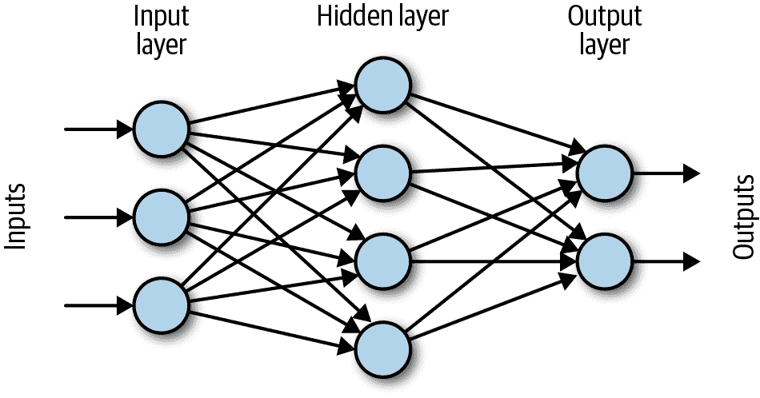

# 第十章：时间序列的深度学习

时间序列的深度学习是一个相对新的尝试，但是它是一个有希望的尝试。由于深度学习是一种高度灵活的技术，它对时间序列分析具有优势。最有希望的是，它提供了模拟高度复杂和非线性时间行为的可能性，而无需猜测功能形式——这可能对非统计预测技术是一个改变游戏规则的因素。

如果你对深度学习不熟悉，这里有一个段落摘要（稍后我们会详细讨论）。深度学习描述了机器学习的一个分支，其中构建了一个“图”，将输入节点连接到复杂的节点和边的结构中。通过边从一个节点传递到另一个节点时，值会乘以该边的权重，然后通常通过某种非线性激活函数传递。正是这种非线性激活函数使得深度学习如此有趣：它使我们能够拟合高度复杂、非线性的数据，这是之前没有成功做到的。

深度学习主要在过去 10 年内发展起来，随着商用硬件的改进和海量数据的提供，使得这种重型模型拟合成为可能。深度学习模型可以拥有数百万个参数，因此理解它们的一种方式是想象出你能想到的任何图，其中包括各种矩阵乘法和非线性变换，然后想象释放一个智能优化器，逐步调整这个大模型的权重，以便逐渐提供越来越好的输出。这就是深度学习的核心。

深度学习在预测方面尚未像在图像处理和自然语言处理等其他领域那样取得惊人的结果。然而，有充分的理由乐观地认为，深度学习最终将改进预测的技术，同时减少传统预测模型中常见的脆弱和高度统一的假设与技术要求。

当使用深度学习模型时，许多预处理数据以适应模型假设的头痛问题都不复存在：

+   没有稳态的要求。

+   无需开发选择参数的艺术和技能，例如评估季节性和季节性 ARIMA 模型的顺序。

+   无需对系统的底层动态做假设，这对状态空间建模非常有帮助。

在第九章讨论了这些优势后，这些优势应该听起来很熟悉，即将机器学习应用于时间序列。深度学习因多种原因而更加灵活：

+   许多机器学习算法在需要训练算法的维度和输入数据类型方面往往比较脆弱。相比之下，深度学习在模型和输入数据的性质上具有高度的灵活性。

+   异构数据对于许多常见的机器学习技术来说是具有挑战性的，而对于深度学习模型来说却很常见。

+   机器学习模型很少被开发用于时间序列问题，而深度学习则提供了灵活性，可以开发特定于时间数据的架构。

然而，深度学习并非万能药。尽管对于应用于时间序列的深度学习没有平稳性的要求，但实际上，除非标准架构被修改以适应趋势，深度学习在拟合带有趋势的数据方面表现不佳。因此，我们仍然需要预处理我们的数据或者我们的技术。

此外，深度学习最适合于不同通道中数值输入，所有数值都缩放到-1 到 1 之间的相似值。这意味着即使在理论上并不需要，你仍需要预处理你的数据。而且，你需要以避免前瞻的方式进行预处理，这不是整个深度学习社区花费大量时间完善的事项。

最后，针对面向时间的神经网络（其中最大的类别是循环神经网络或 RNN）的深度学习优化技术和建模并没有像图像处理（其中最大的类别是卷积神经网络或 CNN）那样发展得好。这意味着你在选择和训练架构方面会比非时间任务获得更少的最佳实践和经验法则指导。

除了将深度学习应用于时间序列的这些困难外，你会发现这样做的回报是一把双刃剑。首先，深度学习在时间序列的性能并不总是优于传统方法用于时间序列预测和分类。确实，预测是一个从深度学习中可以得到改进的领域，但至今这些改进还没有实质性的体现。

尽管如此，有理由期待将深度学习添加到你的时间序列分析工具包中会带来即时和长期的好处。首先，大型科技公司已经开始推出专门针对时间序列的深度学习服务，使用他们在内部开发的定制架构，通常考虑了行业特定的建模任务。你可以使用这些服务或将它们与你自己的分析结合，以获得良好的性能。

其次，你可能有一个数据集，在时间序列的深度学习中表现得非常出色。总的来说，你的信噪比越强，你的表现就会越好。我曾经有过不止一位新手程序员告诉我，他们用一些简单的深度学习取得了惊人的成功。

例如，一所大学发现，一个简单的 LSTM（稍后详细介绍）在预测哪些学生可能很快失败或辍学方面，与超负荷的指导顾问的表现一样好，以便学校可以联系这些学生并提供更多资源。虽然最好的结果是拥有更多的指导顾问，但令人欣慰的是，简单的 LSTM 应用于学生成绩和出勤记录的异质时间序列数据，可以通过标记他们进行联系和增强支持，来帮助改变脆弱的学生。未来，我相信我们可以期待更多这样的创新和支持性使用深度学习的时间序列。

###### 警告

记住，每个模型都有假设。机器学习模型，包括神经网络，在架构和训练方法上都不可避免地有内建的假设。即使是大多数神经网络在输入缩放到[–1, 1]时表现最佳，这也暗示着模型中存在强烈的假设，即使这些假设尚未被充分确认。

甚至可能是神经网络预测尚未达到最佳性能，更好地理解神经网络预测的理论基础和要求将导致性能提升。

如果您是深度学习的新手，本章节不会为您提供开始所需的所有概念和编程工具。然而，它将为您提供一个出发点，从这里，有许多好的教程、书籍，甚至在线课程可以帮助您深入学习。关于深度学习的好消息是，您不需要涉及数学就可以对其工作原理有一个大致了解，并知道如何编程。此外，各种级别的 API 都可用。这意味着初学者可以使用相当高级的 API 来尝试一些入门技术，而即使是专家也会使用这些高级 API 来节省时间。后来，当需要某些特定的架构创新时，随着您的理解加深，您可以使用更低级别的 API，在这些 API 中，更多的决策和具体规定由您自行决定。

本章将简要回顾激发和支持深度学习作为数学和计算机科学追求的概念，并提供您可以用来将深度学习模型应用于数据的代码的具体示例。

# 深度学习概念

深度学习在许多领域有其根源。生物学启发了人们，计算机科学家和量化分析师在思考是否建立智能机器的方法是模仿大脑，其神经元网络根据特定触发器发射。数学上的启发来自于万能逼近定理在各种激活函数上的证明，其中许多证明起源于 1980 年代末和 1990 年代初。最后，计算能力和可用性的增长，加上机器学习领域的蓬勃发展，显示出只要有足够的数据和参数，就可以建模和预测复杂系统。深度学习通过创建由数百万参数描述的网络，这些网络在大数据集上训练，并具有理论基础表明神经网络应能以高精度表示任意的非线性函数，进一步发展了这些想法。图 10-1 展示了一个简单的神经网络，即多层感知机（或全连接网络）。

在 图 10-1 中，我们可以看到多通道输入是如何以维度 d 的向量形式提供给模型的。节点表示输入值，边表示乘数。进入节点的所有边表示先前值乘以其所经过的边的值。单个节点中来自所有输入的这些值被求和，通常通过非线性激活函数传递，从而创建非线性。

我们可以看到输入由三个通道组成，即长度为 3 的向量。有四个隐藏单元。我们将每个输入与其分配给的四个隐藏单元的不同权重相乘，这意味着我们需要 3 × 4 = 12 个权重来完整描述问题。此外，由于我们随后将对这些不同乘法的结果求和，矩阵乘法不仅仅类似于我们所做的，而是确切地是我们所做的。



###### 图 10-1\. 一个简单的前馈网络。

如果我们想要详细描述我们正在做的步骤，可以大致如下：

1.  输入向量 X 共有三个元素。第一层的权重由 W[1] 表示，是一个 4 × 3 的矩阵，我们通过 W[1] × X[1] 计算隐藏层的值。这会得到一个 4 × 1 的矩阵，但实际上这并不是隐藏层的输出：

    W[1] × X[1]

1.  我们需要应用一个非线性函数，可以使用各种“激活函数”，如双曲正切（tanh）或 sigmoid 函数（*σ*）。通常我们还会在激活函数内部应用偏置 B1，这样隐藏层的输出实际上是：

    H = a(W[1] × X[1] + B[1])

1.  在 图 10-1 中描述的神经网络中，我们有两个输出要预测。因此，我们需要将四维隐藏状态输出转换为两个输出。传统上，最后一层不包括非线性激活函数，除非我们考虑在分类问题中应用 softmax。假设我们只是尝试预测两个数字，而不是两个概率或类别，因此我们简单地应用一个“密集层”将隐藏层的四个输出组合成最终的输出。这个密集层将四个输入组合成两个输出，因此我们需要一个 2 × 4 的矩阵 W[2]：

    Y = W[2] × H

希望这些内容能让您对这些模型的工作方式有所了解。总体思想是具有大量参数和非线性的机会。

选择正确数量和形式的参数、正确的训练超参数以及一个相对可访问的问题，这些都是一种艺术形式。魔法在于学习如何从一开始就以聪明的方式初始化这些参数，并确保模型朝着正确的方向朝着一个相对良好的解决方案前进。这是一类非凸模型，意图并非在于找到全局最优解。相反，思路是，只要找到聪明的方法来正则化模型，你就会找到一个“足够好”的局部最优解来满足你的需求。

# 编程神经网络

原则上理解神经网络如何工作可能比理解应用于此问题的相关编程框架要容易得多。然而，正如我们将在这里讨论的那样，这些框架通常具有几个共同的广泛主题。

## 数据、符号、操作、层和图

深度学习框架通常侧重于某种图形的概念及其构建。其核心思想是任何架构都可以描述为其各个组件及其相互关系。此外，将变量与实际值分离的概念也非常重要。因此，您可能会有一个符号 A 和一个符号 B，然后第三个符号 C，它是将 A 和 B 进行矩阵乘法得到的结果：

```
# pseudo code
symbol A;
symbol B;
symbol C = matmul(A, B);
```

由于符号与数据之间的关系，这种区分对于每个框架都至关重要。符号用于学习更一般的关系；数据可能存在噪声。即使我们可能有数百万甚至数十亿个值要为 A 提供输入，并且每个值都与相应的 B 和 C 成对出现，但只有一个符号 A。

当我们退一步思考我们如何处理数据时，这些就是操作。我们可以将符号相加或相乘，我们可以将这些视为操作。我们还可以执行单变量操作，例如改变符号的形状（也许将符号 A 从 2 × 4 矩阵转换为 8 × 1 矩阵），或通过激活函数传递值，例如计算 tanh(A)。

更进一步地，我们可以将层视为我们与常见架构相关联的传统处理单元，例如全连接层，在前一节中我们探讨过。考虑到激活函数和偏置以及核心矩阵操作，我们可以说：

层 L = tanh(A × B + 偏置)

在许多框架中，这一层可能表达为一个或两个层，而不是几个操作，这取决于是否有足够流行的操作组合来保证其作为层单元的独立指定。

最后，我们可以将多个层与彼此关联，一个传递到下一个：

层 L1 = tanh(A × B + 偏置 1)

层 L2 = tanh(L1 × D + 偏置 2)

所有这些符号、操作和层的整合形成一个图。图不一定是完全连接的——也就是说，并不一定所有的符号都彼此依赖。图的作用在于准确地整理哪些符号依赖于哪些其他符号以及依赖关系如何。这是至关重要的，因为当我们计算梯度以进行梯度下降时，我们可以在每次迭代中微调权重，以获得更好的解决方案。好处是，大多数现代深度学习包已经为我们处理了所有这些。我们不需要指定什么依赖于什么以及随着每个添加层如何改变梯度——这一切都已经内置。

更重要的是，正如我之前提到的，我们可以使用高级 API，这样我们就不需要像我在前面的示例中那样详细说明矩阵乘法。相反，如果我们想使用全连接层，这相当于矩阵乘法，然后是矩阵加法，再然后是某种元素级的激活函数，我们不需要编写所有的数学公式。例如，在`mxnet`中，我们可以通过以下简单的代码实现这一点：

```
## python
>>> import mxnet as mx
>>> fc1 = mx.gluon.nn.Dense(120, activation='relu')

```

这将给我们一个完全连接的层，将输入转换为 120 的输出维度。此外，这一行代表了我刚才提到的所有内容：矩阵乘法，接着是矩阵加法，再接着是逐元素的激活函数。

您可以在[文档](https://perma.cc/8PQW-4NKY)中验证这一点，或者在您知道权重时尝试样本输出和输入。令人印象深刻的是 API 不需要您做太多的事情。您不需要指定输入形状（虽然一旦构建了图形，这必须是一个常量，以便可以推断出来）。您不需要指定数据类型——这将默认为非常明智和最常用的`float32`（对于深度学习来说，`float64` 是过度的）。如果您的数据恰好以非 1D 形状每个示例传入，该层还将自动“展平”您的数据，以便以适当的形状输入到完全连接/密集层中。这对于初学者很有帮助，但是一旦您发展出一定的能力水平，重温文档以理解在一个简单的深度学习模型中有多少决策和细节被自动处理是很有益的。

这个简单的代码，当然，即使是用于短期深度学习任务，也不需要你所需要的一切。你需要描述你的输入、目标以及如何测量损失。你还需要将你的层置于模型中。我们在下面的代码中实现了这一点：

```
## python
>>> ## create a net rather than a freestanding layer
>>> from mx.gluon import nn
>>> net = nn.Sequential()
>>> net.add(nn.Dense(120, activation='relu'),
>>>         nn.Dense(1))
>>> net.initialize(init=init.Xavier())
>>> 
>>> ## define the loss we want
>>> L2Loss = gluon.loss.L2Loss()
>>> 
>>> trainer = gluon.Train(net.collect_params(), 'sgd', 
>>>                                  {'learning_rate': 0.01})

```

最后，假设我们已经按需设置好我们的数据，我们可以通过一个训练周期（即，所有数据的一次遍历）来运行如下：

```
## python
>>> for data,target in train_data:
>>>     ## calculate the gradient
>>>     with autograd.record():
>>>           out = net(data)
>>>           loss = L2Loss(output, data)
>>>     loss.backward()
>>>     ## apply the gradient to update the parameters
>>>     trainer.step(batch_size)

```

在大多数软件包中，如同在`mxnet`中一样，保存模型及其相关参数以供后续生产使用或额外训练也是很容易的：

```
## python
>>> net.save_parameters('model.params')
```

在接下来的例子中，我们将使用`mxnet`的`Module` API，以便展示创建图形和训练模型的另一种方式。

作为深度学习实践者，你最终会希望熟悉所有主要的软件包及其各种 API（通常软件包至少具有一个非常高级别的 API 和一个低级别的 API），这样你就能轻松阅读示例代码。掌握所有主要的深度学习模块知识对于跟上最新的行业实践和学术研究是必要的，因为这些信息最容易通过开源代码学习。

# 构建训练流水线

在本节中，我们将模拟相同的数据集：多年来多个地点的每小时电使用测量。我们将预处理这些数据，以便查看每小时电使用量的变化，这比预测总体值更加困难，因为我们正在观察时间序列中最不可预测的部分。

## 检查我们的数据集

我们使用一个小时电测量的开放数据仓库，在演示一个新的神经网络架构的代码库中提供（我们稍后在本文中会讨论）¹。为了了解这些数据的样子，我们在 R 中读取并快速绘制一些图：

```
## R
> elec = fread("electricity.txt")
> elec
       V1  V2  V3  V4  V5   V6 V7   V8  V9 V10 V11 V12 V13 V14 V15  V16 V17 V18
    1: 14  69 234 415 215 1056 29  840 226 265 179 148 112 171 229 1001  49 162
    2: 18  92 312 556 292 1363 29 1102 271 340 235 192 143 213 301 1223  64 216
    3: 21  96 312 560 272 1240 29 1025 270 300 221 171 132 185 261 1172  61 197
    4: 20  92 312 443 213  845 24  833 179 211 170 149 116 151 209  813  40 173
    5: 22  91 312 346 190  647 16  733 186 179 142 170  99 136 148  688  29 144

```

从快速检查中，我们可以看出我们有多少行和列的数据，以及没有时间戳。我们已经独立地被告知这些时间戳是每小时的，但我们不知道这些测量究竟是在什么时候进行的：

```
## R
> ncol(elec)
[1] 321
> nrow(elec)
[1] 26304

```

我们还可以绘制一些数据的随机样本，以了解其外观（见图 10-2）。由于这是小时数据，我们知道如果绘制 24 个数据点，我们将得到一整天的数据：

```
## R
> elec[125:148, plot(V4,    type = 'l', col = 1, ylim = c(0, 1000))]
> elec[125:148, lines(V14,  type = 'l', col = 2)]
> elec[125:148, lines(V114, type = 'l', col = 3)]

```

我们还制作了一周的图表（见图 10-3）：

```
## R
> elec[1:168, plot(V4,    type = 'l', col = 1, ylim = c(0, 1000))]
> elec[1:168, lines(V14,  type = 'l', col = 2)]
> elec[1:168, lines(V114, type = 'l', col = 3)]
```

请记住，我们不知道任何特定索引的本地时间是什么，尽管我们知道它们之间的关系。然而，与我们在第二章中的讨论一致，根据电力使用的模式，我们可能可以猜测哪些时间段代表标准人类日程的一部分。我们可能还可以识别周末。我们在这里没有这样做，但包含关于一天的时间和一周的时间模型可能是一个更深入分析和建模这一数据集的好主意。


###### 图 10-2\. 从数据集中抽取的三个不同位置的 24 小时样本，数据集中共有 321 个位置。虽然我们不知道这些索引对应的本地小时是哪些，但我们看到了一个连贯的日常模式。


###### 图 10-3\. 同一三个位置的数据的完整七天周期样本，与日常图中显示的相同。通过这种更广泛的数据查看，我们确认了我们对日常模式的感觉，表明每天有一个大峰值以及一些较小的特征在行为上似乎是一致的。

尽管我们可以预测数据的绝对值作为我们的预测技术，但这在学术论文和博客文章中已经完成。相反，我们将预测数据的差异。预测时间序列的差异而不是总值往往更具挑战性，因为数据更加嘈杂，我们可以在我们之前做过的类似图中看到这一点（见图 10-4）:²

```
## R
> elec.diff[1:168, plot( V4, type = 'l', col = 1, ylim = c(-350, 350))]
> elec.diff[1:168, lines(V14, type = 'l', col = 2)]
> elec.diff[1:168, lines(V114, type = 'l', col = 3)]

```


###### 图 10-4\. 同一三个站点的电力时间序列的一个星期样本，表示电力使用的逐小时变化。尽管这个序列仍然表现出模式，就像原始序列一样，但序列的不可预测组成部分变得更加明显，因为它们在差异系列的值中所占比例比在原始序列中所占比例要大。

如果我们要运行传统的统计模型，状态空间模型，甚至是机器学习模型，我们需要在此时进行大量分析，以查看数据集中不同用电站点之间的相关性。我们需要看看数据中是否随时间漂移，并评估其平稳性。

您也应该为深度学习做这些事情，这样您可以评估数据集的适当模型，并为您认为您的模型可以执行多好建立期望。然而，深度学习的美妙之处在于，即使我们的数据有些凌乱，甚至没有通过任何特定的统计测试来评估我们数据的质量，我们也可以继续前进。在生产环境中，我们将花更多时间进行数据探索，但出于本章的目的，我们将继续进行建模选项。

## 训练管道的步骤

通常情况下，当我们使用神经网络建模时，我们的脚本总是会有一些共同的步骤。这些脚本通常比我们拟合统计或传统机器学习模型时更难撰写，因为我们的数据集往往更大。此外，我们以批次方式拟合这些深层模型，因此我们使用迭代器而不是整个数据集的数组。

数据管道将包括以下步骤：

+   通过导入默认训练值的预设参数列表，使我们的代码易于配置，这特别方便，因为否则有太多的值需要设置。

+   将数据加载到内存中并进行预处理。

+   将数据塑造成适当预期的格式。

+   构建适合您使用的深度学习模块的迭代器。

+   构建一个图表，使用这些迭代器来了解期望的数据形状；这包括构建整个模型。

+   设置训练参数，如优化器、学习率以及训练的时期数。

+   建立一些记录系统，用于记录您的权重和每个时期的结果。

### 使我们的代码易于配置。

以下代码显示了我们如何完成这些任务。我们从标准导入列表开始：

```
## python
>>> from math import floor
>>> 
>>> ## for archiving
>>> import os
>>> import argparse
>>> 
>>> ## deep learning module
>>> import mxnet as mx
>>> 
>>> ## data processing
>>> import numpy as np
>>> import pandas as pd
>>> 
>>> ## custom reporting
>>> import perf

```

然后，我们使用一些硬编码变量和可调参数。在一定程度上，这些是基于经验和您在训练时的优先考虑因素。不要指望这些变量现在能够很有意义，因为其中许多参数适用于我们稍后在本章讨论的神经网络组件。主要的事情是注意参数的可调性：

```
## python
>>> ## some hyperparameters we won't tune via command line inputs
>>> DATA_SEGMENTS    = { 'tr': 0.6, 'va': 0.2, 'tst': 0.2}
>>> THRESHOLD_EPOCHS = 5
>>> COR_THRESHOLD    =  0.0005
>>>     
>>> ## set up parser
>>> parser = argparse.ArgumentParser()
>>> 
>>> ## DATA SHAPING
>>> parser.add_argument('--win',       type=int,   default=24*7)
>>> parser.add_argument('--h',         type=int,   default=3)
>>> 
>>> ## MODEL SPECIFICATIONS
>>> parser.add_argument('--model',     type=str,   default='rnn_model')
>>> ## cnn components
>>> parser.add_argument('--sz-filt',   type=str,   default=8)
>>> parser.add_argument('--n-filt',    type=int,   default=10)
>>> ## rnn components
>>> parser.add_argument('--rnn-units', type=int,   default=10)
>>> 
>>> ## TRAINING DETAILS
>>> parser.add_argument('--batch-n',   type=int,   default=1024)
>>> parser.add_argument('--lr',        type=float, default=0.0001)
>>> parser.add_argument('--drop',      type=float, default=0.2)
>>> parser.add_argument('--n-epochs',  type=int,   default=30)
>>> 
>>> ## ARCHIVE WORK
>>> parser.add_argument('--data-dir',  type=str,   default='../data')
>>> parser.add_argument('--save-dir',  type=str,   default=None)

```

具有许多可调参数至关重要，因为训练深度学习模型始终涉及超参数搜索，以改进从基线到模型的效果。通常调整的超参数会影响训练的各个方面，从数据准备（查看多久以前的时间）到模型规范（建立多复杂和什么样的模型）以及训练（训练多长时间，使用多大的学习率）。

在前述代码中有不同类别的参数。首先，数据形状化涉及我们如何处理我们的原始输入，本例中是一个 CSV 文件，其中包含 321 个站点的并行差分时间序列电力使用情况。为了塑造我们的数据，我们需要两个参数。`window`变量是我们允许我们的模型在试图进行预测时向后查看的时间范围。`horizon`变量是我们希望向前预测的时间跨度。请注意，这些并不是特定的单位，比如“5 分钟”，而是时间步长，与我们在早期章节的做法一致。像其他统计和机器学习模型一样，神经网络关心我们的计算表示，并不在意数据是 5 分钟还是 5 个纪元。

倒数第二部分，培训细节，通常是超参数优化中最重要的部分，也是最常调整的部分。在开始时，调整学习率并确保你没有选择一个远远偏离的数值是至关重要的。一个好的经验法则是从 0.001 开始，然后按数量级上下调整。拥有恰当的学习率并不是那么重要，但拥有正确的数量级却是很重要的。

模型规范允许我们指定各种模型（如 RNN 与 CNN 之间的比较）以及关于这些模型的架构细节。一般来说，我们将希望调整超参数。

对于当前的示例，我们在命令行中使用以下超参数提供给我们的脚本：

```
--drop=0.2 --win=96 --batch-n=128 --lr=0.001 --n-epochs=25 
--data-dir=/data/elec --save-dir=/archive/results 
--model=model_will_vary

```

### 准备我们的输入数据

一旦我们有了可配置的参数，就有一种方法可以向我们的脚本提供信息，例如文件的位置、我们想要预测的提前量以及我们想要在给定时间段内包含的时间回溯量。即使在初步读取和正确形状化数据的阶段，这些可配置的参数也非常重要。我们还需要安排基础设施来处理数据，因为神经网络是通过各种随机梯度下降的变体进行训练的，这意味着训练是逐批次进行的，一个周期意味着所有数据都已用于训练（尽管不是同时）。

接下来我们讨论通过迭代器为训练提供数据的高级过程以及塑造输入到迭代器的数据的细节。

#### 形状化输入数据

在前面的部分中，我们看到了如何从 NumPy 数组中形成迭代器，并且我们认为这些 NumPy 数组是已经准备好的。现在我们将讨论数据的形状，首先是概念上，然后是通过代码示例。我们将讨论两种数据格式，NC 和 NTC。

我们从一个与编码无关的实际示例开始讨论不同的输入数据格式。让我们想象我们有多变量时间序列数据，具有列 A、B 和 C。

| 时间 | A | B | C |
| --- | --- | --- | --- |
| *t* – 3 | 0 | –1 | –2 |
| *t* – 2 | 3 | –2 | –3 |
| *t* – 1 | 4 | –2 | –4 |
| *t* | 8 | –3 | –9 |

我们想要建立一个模型，预测一步，我们想要使用前两个时间点的数据来预测。我们希望使用 A、B 和 C 的数据来预测 A、B 和 C。我们将称我们的输入为 X，输出为 Y。

我们试图预测时间*t*的 Y。在时间*t*，这些是 Y 的实际值 = [A, B, C]：

> | *t* | 8 | –3 | –9 |
> | --- | --- | --- | --- |

我们指定，我们将为所有变量提供前两个时间点以进行预测。这总计如下：

| A, *t* – 1 | A, *t* – 2 | B, *t* – 1 | B, *t* – 2 | C, *t* – 1 | C, *t* – 2 |
| --- | --- | --- | --- | --- | --- |
| 4 | 3 | –2 | –2 | –4 | –3 |

同样地，为了预测时间*t* – 1 时的 Y，我们有以下数据作为我们的目标：

> | *t* – 1 | 4 | –2 | –4 |
> | --- | --- | --- | --- |

并且我们期望能够使用以下值进行预测：

| A, *t* – 2 | A, *t* – 3 | B, *t* – 2 | B, *t* – 3 | C, *t* – 2 | C, *t* – 3 |
| --- | --- | --- | --- | --- | --- |
| 3 | 0 | –2 | –1 | –3 | –2 |

如果我们想要将这两个数据点的输入存储在一个数据格式中，它看起来会像这样：

| 时间 | A, 时间 – 1 | A, 时间 – 2 | B, 时间 – 1 | B, 时间 – 2 | C, 时间 – 1 | C, 时间 – 2 |
| --- | --- | --- | --- | --- | --- | --- |
| *t* – 1 | 3 | 0 | –2 | –1 | –3 | –2 |
| *t* | 4 | 3 | –2 | –2 | –4 | –3 |

这被称为 NC 数据格式，其中*N*表示个体样本，*C*表示通道，这是描述多变量信息的另一种方式。我们将使用这种数据格式来训练全连接神经网络，并且它是我们将讨论的方法中的第一选项，该方法将输入数据以 CSV 格式接收并转换为正确形状和维度的 NumPy 数组。

另一方面，我们可以以不同的方式塑造数据，以创建一个特定的时间轴。这通常通过将数据放置在 NTC 格式中来完成，该格式指定了样本数量 × 时间 × 通道数。在这种情况下，样本是原始数据的每一行，即我们想要进行预测的每个时间切片（并且我们有可用数据来这样做）。时间维度是我们将查看多远以前的时间，例如在此示例中为两个时间步长（并在我们本章的示例脚本中通过`--win`指定）。

在 NTC 格式中，我们之前格式化的输入数据看起来会像这样，以预测*t* – 1 的水平：

| 时间 | A | B | C |
| --- | --- | --- | --- |
| *t* – 1 | 0, 3 | –1, –2 | –2, –3 |

或者，如果我们想要紧凑地表示我们先前生成的两个样本的输入数据，我们可以这样做：

| 时间 | A | B | C |
| --- | --- | --- | --- |
| *t* – 1 | 0, 3 | –1, –2 | –2, –3 |
| *t* | 3, 4 | –2, –2 | –3, –4 |

这可以与我们为 Y 生成的标签连接在一起：

| 时间 | A | B | C |
| --- | --- | --- | --- |
| *t* – 1 | 4 | –2 | –4 |
| *t* | 8 | –3 | –9 |

这两种表示法都没有比另一种更准确，但 NTC 表示法的一个便利之处在于时间具有显式的时间轴含义。

我们形成两种输入形状的原因是一些模型更喜欢一种格式，而另一些模型喜欢另一种。我们将使用 NTC 格式将输入提供给卷积和循环神经网络，这些我们将在本章后面讨论。

#### 构建迭代器

广义上讲，为训练程序提供数据，我们需要提供迭代器。迭代器不仅适用于深度学习或 Python，而是反映了对象沿着某种集合的通用概念，跟踪其位置并指示何时完成整个集合的遍历。在训练数据来自 NumPy 数组的情况下，形成迭代器非常简单。如果 `X` 和 `Y` 是 NumPy 数组，我们可以看到形成迭代器非常简单：

```
## python
>>> ################################
>>> ## DATA PREPARATION ##
>>> ################################
>>> 
>>> def prepare_iters(data_dir, win, h, model, batch_n):
>>>     X, Y = prepared_data(data_dir, win, h, model)
>>> 
>>>     n_tr = int(Y.shape[0] * DATA_SEGMENTS['tr'])
>>>     n_va = int(Y.shape[0] * DATA_SEGMENTS['va'])
>>> 
>>>     X_tr, X_valid, X_test = X[            : n_tr], 
>>>                             X[n_tr        : n_tr + n_va], 
>>>                             X[n_tr + n_va : ]
>>>     Y_tr, Y_valid, Y_test = Y[            : n_tr], 
>>>                             Y[n_tr        : n_tr + n_va], 
>>>                             Y[n_tr + n_va : ]
>>>     
>>>     iter_tr = mx.io.NDArrayIter(data       = X_tr,
>>>                                 label      = Y_tr,
>>>                                 batch_size = batch_n)
>>>     iter_val = mx.io.NDArrayIter(data       = X_valid,
>>>                                  label      = Y_valid,
>>>                                  batch_size = batch_n)
>>>     iter_test = mx.io.NDArrayIter(data       = X_test,
>>>                                   label      = Y_test,
>>>                                   batch_size = batch_n)
>>> 
>>>     return (iter_tr, iter_val, iter_test)

```

在这里，我们有一种准备数据集迭代器的方法，这些迭代器包装了由名为 `prepared_data()` 的方法接收的 `numpy` 数组（稍后详细说明）。一旦数组可用，它们将被分解为训练、验证和测试数据源，其中训练数据是最早的，验证数据用作调整超参数的一种方式，并具有外样本反馈，测试数据则保留到最后进行真正的测试。³

请注意，迭代器的初始化程序接受输入（`data`）、目标值（`label`）和 `batch_size` 参数，该参数反映了每次迭代中将使用多少个示例来计算梯度并更新模型权重。

### 在代码中形成数据的形状

现在我们知道要创建的两种数据形状，我们可以查看形成它的代码：

```
## python
>>> def prepared_data(data_dir, win, h, model_name):
>>>     df = pd.read_csv(os.path.join(data_dir, 'electricity.diff.txt'), 
>>>                      sep=',', header=0)
>>>     x  = df.as_matrix()
>>>     ## normalize data. notice this creates a lookahead since
>>>     ## we normalize based on values measured across the data set
>>>     ## so in a less basic pipeline we would compute these as
>>>     ## rolling statistics to avoid the lookahead problem
>>>     x = (x - np.mean(x, axis = 0)) / (np.std(x, axis = 0)) 
>>> 
>>>     if model_name == 'fc_model': ## NC data format
>>>         ## provide first and second step lookbacks in one flat input
>>>         X = np.hstack([x[1:-1], x[:-h]])
>>>         Y = x[h:]
>>>         return (X, Y)
>>>     else:                        ## TNC data format
>>>         # preallocate X and Y
>>>         # X shape = num examples * time win * num channels (NTC)
>>>         X = np.zeros((x.shape[0] - win - h, win, x.shape[1]))
>>>         Y = np.zeros((x.shape[0] - win - h, x.shape[1]))
>>>         
>>>         for i in range(win, x.shape[0] - h):
>>>             ## the target/label value is h steps ahead
>>>             Y[i-win] = x[i + h - 1     , :] 
>>>             ## the input data are the previous win steps
>>>             X[i-win] = x[(i - win) : i , :] 
>>>  
>>>         return (X, Y)

```

从文本文件中读取数据后，我们对每一列进行标准化。请注意，每一列都是单独标准化的，而不是整个数据集统一标准化。这是因为即使在我们简短的数据探索中，我们也看到不同的电力站具有非常不同的值（请参见图 10-2 和 10-4 中的图表）：

```
## python
>>> x = (x - np.mean(x, axis = 0)) / (np.std(x, axis = 0)) 

```

#### NC 数据格式

生成 NC 数据格式非常简单：

```
## python 
>>> if model_name == 'fc_model': ## NC data format
>>>     ## provide first and second step lookbacks in one flat input
>>>     X = np.hstack([x[1:-h], x[0:-(h+1)]])
>>>     Y = x[(h+1):]

```

生成代表时间 *t – h* 的 *X* 输入，以便在 *t* 时进行预测时，我们取 *x* 并移除最后 *h* 行（因为该输入数据需要比我们拥有的最新数据稍后的标签值）。然后，我们沿时间轴将这些数据向后移动，以产生进一步滞后的值，并且我们需要确保代表不同滞后的 NumPy 数组具有相同的形状，以便它们可以堆叠在一起。这就是导致前述公式的原因。值得在自己的计算机上通过这个过程并证明其有效性。你还可以考虑如何将表达式推广为任意长的回顾。

通过设置 `Pdb` 断点来检查我们的工作，并验证 `X` 和 `Y` 中的值是否与它们在 `x` 中的预期对应：

```
## python
(Pdb) X[0, 1:10] == x[1, 1:10]
array([ True,  True,  True,  True,  True,  True,  True,  True,  True])
(Pdb) X[0, 322:331] == x[0, 1:10]
array([ True,  True,  True,  True,  True,  True,  True,  True,  True])
(Pdb) Y[0, 1:10] == x[4, 1:10]
array([ True,  True,  True,  True,  True,  True,  True,  True,  True])

```

`X`中前半部分的列代表我们用于预测的最后时间点，而预测的标签/目标则比这个时间点晚三个步骤。这就是为什么`X[0, 1:10]`应该匹配`x[1, 1:10]`，而`Y[0, 1:10]`应该匹配`x[4, 1:10]`，因为它应该是向前三个时间步（我们的输入集将视野设定为`3`）。

可能会令人困惑的是，时间和样本（数据点索引）经常具有相同的标签，但它们是不同的概念。有我们预测的时间提前，有我们拍摄输入快照的时间，以便进行预测，还有我们查看以收集数据以进行预测的时间。这些值必然是相互关联的，但将这些概念分开是个好主意。

#### NTC 数据格式

生成 NTC 格式也不算太难：

```
## python
>>> # preallocate X and Y
>>> # X shape = num examples * time win * num channels (NTC)
>>> X = np.zeros((x.shape[0] - win - h, win, x.shape[1]))
>>> Y = np.zeros((x.shape[0] - win - h, x.shape[1]))
>>>         
>>> for i in range(win, x.shape[0] - h):
>>>      ## the target/label value is h steps ahead
>>>      Y[i-win] = x[i + h - 1     , :]
>>>      ## the input data are the previous win steps
>>>      X[i-win] = x[(i - win) : i , :]

```

对于任何给定的示例（即*N*维度，即第一维度），我们获取了输入数据的最后`win`行，跨所有列。这就是我们创建三维数据的方式。第一维度实际上是数据点索引，而在该数据点中提供的值总计为 2D 数据，即时间 × 通道（在这里是电力站）。

与之前一样，我们设置了`Pdb`断点来测试这段代码。同时注意，我们确认了我们对代码测试的理解。通常情况下，测试数据格式的代码比实际代码更具启发性，因为我们使用具体数字进行抽查测试：

```
## python
(Pdb) Y[0, 1:10] == x[98, 1:10]
array([ True,  True,  True,  True,  True,  True,  True,  True,  True])
(Pdb) X.shape
(26204, 96, 321)
(Pdb) X[0, :, 1] == x[0:96, 1]
array([ True,  True,  True,  True,  True,  True,  True,  True,  True,
        True,  True,  True,  True,  True,  True,  True,  True,  True,
        True,  True,  True,  True,  True,  True,  True,  True,  True,
        True,  True,  True,  True,  True,  True,  True,  True,  True,
        True,  True,  True,  True,  True,  True,  True,  True,  True,
        True,  True,  True,  True,  True,  True,  True,  True,  True,
        True,  True,  True,  True,  True,  True,  True,  True,  True,
        True,  True,  True,  True,  True,  True,  True,  True,  True,
        True,  True,  True,  True,  True,  True,  True,  True,  True,
        True,  True,  True,  True,  True,  True,  True,  True,  True,
        True,  True,  True,  True,  True,  True])

```

我们看到我们准备在`X`和`Y`中的第一个数据点（即第一行）对应于行 0 到 96（因为我们将可配置的窗口回溯设置为 96 个时间步长），而向前预测 3 个时间步对应于第 98 行（因为`x`结束于 95；请记住，对切片的索引排除切片中的最后一个数字，因此`x`表示从 0 到 95（包括 0 到 96）的所有行）。

数据处理代码容易出错，混乱且速度慢。然而，您会发现，每次编写和处理它时，它都会变得更加清晰。尽管如此，彻底测试您的数据处理代码并将其安全地保存在某处，以避免每次需要整理数据时都需要处理示例问题，这是明智的做法。此外，将此代码保存在版本控制系统中，并有一些方式跟踪使用哪个版本的代码来训练特定模型，也是明智的做法。

### 设置训练参数并建立记录系统

我们将在接下来的章节讨论各种模型的细节，因此暂时跳过与图构建相关的代码部分，直接进入训练和记录保留的逻辑。

这就是我们在接下来要重点讨论的简单示例中如何实现训练的方法：

```
## python
>>> def train(symbol, iter_train, valid_iter, iter_test,
>>>           data_names, label_names,
>>>           save_dir):
>>>     ## save training information/results 
>>>     if not os.path.exists(args.save_dir):
>>>         os.makedirs(args.save_dir)
>>>     printFile = open(os.path.join(args.save_dir, 'log.txt'), 'w')
>>>     def print_to_file(msg):
>>>         print(msg)
>>>         print(msg, file = printFile, flush = True)
>>>     ## archiving results header
>>>     print_to_file('Epoch     Training Cor     Validation Cor')
>>> 
>>>     ## storing prior epoch's values to set an improvement threshold
>>>     ## terminates early if progress slow
>>>     buf     = RingBuffer(THRESHOLD_EPOCHS)
>>>     old_val = None
>>> 
>>>     ## mxnet boilerplate
>>>     ## defaults to 1 gpu, of which index is 0
>>>     devs = [mx.gpu(0)]
>>>     module = mx.mod.Module(symbol,
>>>                            data_names=data_names,
>>>                            label_names=label_names,
>>>                            context=devs)
>>>     module.bind(data_shapes=iter_train.provide_data,
>>>                 label_shapes=iter_train.provide_label)
>>>     module.init_params(mx.initializer.Uniform(0.1))
>>>     module.init_optimizer(optimizer='adam',
>>>                           optimizer_params={'learning_rate': 
>>>                                             args.lr})
>>> 
>>>     ## training
>>>     for epoch in range( args.n_epochs):
>>>         iter_train.reset()
>>>         iter_val.reset()
>>>         for batch in iter_train:
>>>             # compute predictions
>>>             module.forward(batch, is_train=True) 
>>>             # compute gradients
>>>             module.backward() 
>>>             # update parameters 
>>>             module.update()                      
>>> 
>>>         ## training results
>>>         train_pred  = module.predict(iter_train).asnumpy()
>>>         train_label = iter_train.label[0][1].asnumpy()
>>>         train_perf  = perf.write_eval(train_pred, train_label,
>>>                                       save_dir, 'train', epoch)
>>> 
>>>         ## validation results
>>>         val_pred  = module.predict(iter_val).asnumpy()
>>>         val_label = iter_val.label[0][1].asnumpy()
>>>         val_perf = perf.write_eval(val_pred, val_label,
>>>                                    save_dir, 'valid', epoch)
>>> 
>>>         print_to_file('%d         %f       %f ' % 
>>>                      (epoch, train_perf['COR'], val_perf['COR']))
>>>         
>>>         # if we don't yet have measures of improvement, skip
>>>         if epoch > 0:        
>>>             buf.append(val_perf['COR'] - old_val) 
>>>          # if we do have measures of improvement, check them
>>>         if epoch > 2:                                
>>>             vals = buf.get()
>>>             vals = [v for v in vals if v != 0]
>>>             if sum([v < COR_THRESHOLD for v in vals]) == len(vals):
>>>                 print_to_file('EARLY EXIT')
>>>                 break
>>>         old_val = val_perf['COR']
>>>                 
>>>     ## testing
>>>     test_pred  = module.predict(iter_test).asnumpy()
>>>     test_label = iter_test.label[0][1].asnumpy()
>>>     test_perf = perf.write_eval(test_pred, test_label, 
>>>                                 save_dir, 'tst', epoch)
>>>     print_to_file('TESTING PERFORMANCE')
>>>     print_to_file(test_perf)

```

上述代码完成了多样的任务，都是例行公事。首先，我们设置了值来跟踪验证准确性分数历史，以确保训练看到改进。如果模型训练速度不够快，我们不希望继续旋转我们的 GPU，浪费时间和电力。

MXNet 的样板使用`Module` API（而不是我们在本章前面看到的`Gluon` API）：

```
## python
>>>     ## mxnet boilerplate
>>>     ## defaults to 1 gpu of which index is 0
>>>     devs = [mx.gpu(0)]
>>>     module = mx.mod.Module(symbol,
>>>                            data_names=data_names,
>>>                            label_names=label_names,
>>>                            context=devs)
>>>     module.bind(data_shapes=iter_train.provide_data,
>>>                 label_shapes=iter_train.provide_label)
>>>     module.init_params(mx.initializer.Uniform(0.1))
>>>     module.init_optimizer(optimizer='adam',
>>>                           optimizer_params={'learning_rate': 
>>>                                              args.lr})

```

这四行代码实现了以下功能：

1.  将神经网络的原始组件设置为计算图。

1.  设置数据形状，以便网络知道要期望什么并进行优化。

1.  初始化图中所有权重为随机值（这是一门艺术，不仅仅是从无限可能性中随机选择的一组数字）。

1.  初始化优化器，可以有各种风味，我们根据输入参数显式设置初始学习率。

接下来，我们使用我们的训练数据迭代器逐步递增我们在训练过程中的数据：

```
## python
>>> for epoch in range( args.n_epochs):
>>>    iter_train.reset()
>>>    iter_val.reset()
>>>    for batch in iter_train:
>>>        module.forward(batch, is_train=True) # compute predictions
>>>        module.backward()                    # compute gradients
>>>        module.update()                      # update parameters

```

然后，我们测量训练集和验证集的预测结果（与之前相同的外部`for`循环）：

```
## python
>>> ## training results
>>> train_pred  = module.predict(iter_train).asnumpy()
>>> train_label = iter_train.label[0][1].asnumpy()
>>> train_perf  = evaluate_and_write(train_pred, train_label,  
>>>                                  save_dir, 'train', epoch)
>>> 
>>> ## validation results
>>> val_pred  = module.predict(iter_val).asnumpy()
>>> val_label = iter_val.label[0][1].asnumpy()
>>> val_perf  = evaluate_and_write(val_pred, val_label,  
>>>                                save_dir, 'valid', epoch)

```

循环结束时有一些早停逻辑：

```
## python
>>> if epoch > 0:
>>>     buf.append(val_perf['COR'] - old_val)
>>> if epoch > 2:
>>>     vals = buf.get()
>>>     vals = [v for v in vals if v != 0]
>>>     if sum([v < COR_THRESHOLD for v in vals]) == len(vals):
>>>         print_to_file('EARLY EXIT')
>>>         break
>>> old_val = val_perf['COR']

```

这个笨重的代码做一些记录和简单逻辑，记录预测值与实际值之间每个连续相关值。如果从时代到时代的相关性没有充分改善足够的时代（或者甚至变得更糟），训练将停止。

### 评估指标

我们的函数`evaluate_and_write`，同时记录每个时代的相关性和目标值与估计值的原始值。我们在所有训练结束时对测试也是如此：

```
## python
>>> def evaluate_and_write(pred, label, save_dir, mode, epoch):
>>>     if not os.path.exists(save_dir):
>>>         os.makedirs(save_dir)
>>>         
>>>     pred_df  = pd.DataFrame(pred)
>>>     label_df = pd.DataFrame(label)
>>>     pred_df.to_csv( os.path.join(save_dir, '%s_pred%d.csv'  
>>>                                  % (mode, epoch)))
>>>     label_df.to_csv(os.path.join(save_dir, '%s_label%d.csv' 
>>>                                  % (mode, epoch)))
>>> 
>>>     return { 'COR': COR(label,pred) }

```

这反过来又利用了我们定义的相关函数，如下所示：

```
## python
>>> def COR(label, pred):
>>>     label_demeaned = label - label.mean(0)
>>>     label_sumsquares = np.sum(np.square(label_demeaned), 0)
>>> 
>>>     pred_demeaned = pred - pred.mean(0)
>>>     pred_sumsquares = np.sum(np.square(pred_demeaned), 0)
>>> 
>>>     cor_coef =  np.diagonal(np.dot(label_demeaned.T, pred_demeaned)) /
>>>                 np.sqrt(label_sumsquares * pred_sumsquares)                   
>>> 
>>>     return np.nanmean(cor_coef)

```

在这个数据集中偶尔会出现零方差的情况，这可能会在一列中创建一个`NAN`，所以我们选择使用`np.nanmean()`而不是`np.mean()`。

注意，我们在这里不包括的一个基本功能是保存模型权重，通过训练过程进行检查点。如果我们正在为生产进行训练并且需要能够重新加载模型并部署它，我们将使用`Module.save_checkpoint`（保存权重）和`Module.load`（从此加载模型回到内存，从此你可以继续训练或将模型部署到生产中）。有很多东西可以学习，开始一个合适的深度学习管道，但在这里我们保持基本。

### 汇总

我们在我们的`__main__`范围内把我们的管道组件放在一起：

```
## python
>>> if __name__ == '__main__':
>>>     # parse command line args
>>>     args = parser.parse_args()
>>> 
>>>     # create data iterators
>>>     iter_train, iter_val, iter_test = prepare_iters(
>>>         args.data_dir, args.win, args.h,
>>>         args.model, args.batch_n)    
>>> 
>>>     ## prepare symbols
>>>     input_feature_shape = iter_train.provide_data[0][1]    
>>>     
>>>     X = mx.sym.Variable(iter_train.provide_data[0].name )
>>>     Y = mx.sym.Variable(iter_train.provide_label[0].name)
>>>     
>>>     # set up model
>>>     model_dict = {
>>>         'fc_model'            : fc_model,
>>>         'rnn_model'           : rnn_model,
>>>         'cnn_model'           : cnn_model,
>>>         'simple_lstnet_model' : simple_lstnet_model
>>>         }
>>>     model = model_dict[args.model]
>>>     
>>>     symbol, data_names, label_names = model(iter_train,
>>>                                            input_feature_shape, 
>>>                                            X, Y,
>>>                                            args.win, args.sz_filt,
>>>                                            args.n_filt, args.drop)
>>> 
>>>     ## train 
>>>     train(symbol, iter_train, iter_val, iter_test,
>>>           data_names, label_names, args.save_dir)

```

在这里，我们利用我们刚刚安排好的基础设施。首先，我们解析命令行参数。然后，我们创建可配置输入的迭代器，包括我们的预测周期、回溯窗口、批处理大小以及我们想要构建的模型的名称。我们创建 MXNet 符号，并记录输入形状，这些都传递给我们创建模型的过程中。最后，我们将关于模型的信息、以及我们的迭代器和保存目录传递给训练函数，这部分很有趣：训练模型并输出其性能指标。

因此，在这种情况下，我们看到一个最小但完全功能的训练流水线，包括数据摄取和重塑、模型构建、模型训练以及重要数值记录用于模型评估。

顺便说一下，我们的`print_to_file()`方法只是`print()`的一个便利包装器：

```
## python
def print_to_file(msg):
     print(msg, file = printFile, flush = True)esfa
print_to_file(args)

```

当你训练模型时，你会想要创建一个记录。可能你最终选择的模型权重并不是你完成训练时的权重，而是之前的某个时间点。记录训练进展将帮助你调整与模型结构和训练相关的超参数，从参数数量的选择（以避免欠拟合或过拟合）到训练时的学习率（以避免在训练过程中进行过大或过小的调整）。

现在我们有了一个完整的最小可行流水线，只是缺少我们的模型。现在我们将看一些可以应用于时间序列数据的基本模型，并训练每个模型以查看其相对性能。

# 前馈网络

这本书在时间序列分析的背景下呈现前馈网络相当不寻常。大多数现代时间序列分析问题使用递归网络结构或者较少见的卷积网络结构。然而，我们从前馈神经网络开始，因为它是最简单和最具历史意义的网络结构。有几个原因使得它是一个好的起点：

+   前馈网络（Feed forward networks）具有高度可并行化的特点，这意味着它们的性能相当出色。如果你能找到一个合适的前馈模型，你可以非常快速地计算它。

+   前馈网络是检验您的序列是否真的具有复杂时间轴动态的良好测试。并非所有时间序列都真的是时间序列，即早期值与后续值具有特定关系的意义。将前馈神经网络作为一个基线进行拟合可能是一个好方法，与更简单的线性模型分开。

+   前馈网络组件通常集成到更大更复杂的时间序列深度学习架构中。因此，即使它们在您的工作中不会形成整个模型，您也需要了解它们的工作原理。

## 简单示例

前馈神经网络是最简单的神经网络类型，因此我们首先将前馈架构应用于一个时间序列示例。标准前馈神经网络的结构中并没有暗示时间关系，但算法可能仍然能够学习过去输入如何预测未来输入。我们在 图 10-1 中看到了一个前馈神经网络的示例。前馈神经网络是一系列全连接层，即每一层的输入连接到图中的每个节点。

我们从这个简单的示例开始，它使用了我们之前看到的第一种数据格式化方式。也就是说，我们的输入 `X` 简单地是 N × C 的二维数据（即样本 × 通道），其中时间成分已被展平成通道。这对应于以下数据格式化方式：

| A, *t* – 2 | A, *t* – 3 | B, *t* – 2 | B, *t* – 3 | C, *t* – 2 | C, *t* – 3 |
| --- | --- | --- | --- | --- | --- |
| 3 | 0 | –2 | –1 | –3 | –2 |

作为提醒，在代表数据这一分支的代码中：

```
## python
>>> if model_name == 'fc_model':
>>>    ## provide first and second step lookbacks in one flat input
>>>    X = np.hstack([x[1:-1], x[:-2]])
>>>    Y = x[2:]
>>>    return (X, Y)

```

我们随后使用 MXNet 的 `Module` API 构建一个全连接模型：

```
## python
>>> def fc_model(iter_train, window, filter_size, num_filter, dropout):
>>>     X = mx.sym.Variable(iter_train.provide_data[0].name)
>>>     Y = mx.sym.Variable(iter_train.provide_label[0].name)
>>> 
>>>     output = mx.sym.FullyConnected(data=X, num_hidden = 20)
>>>     output = mx.sym.Activation(output, act_type = 'relu')
>>>     output = mx.sym.FullyConnected(data=output, num_hidden = 10)
>>>     output = mx.sym.Activation(output, act_type = 'relu')
>>>     output = mx.sym.FullyConnected(data = output, num_hidden = 321)
>>> 
>>>     loss_grad = mx.sym.LinearRegressionOutput(data  = output, 
>>>                                               label = Y)
>>>     return loss_grad, [v.name for v in iter_train.provide_data], 
>>>                       [v.name for v in iter_train.provide_label]    

```

在这里，我们构建了一个三层全连接网络。第一层有 20 个隐藏单元，第二层有 10 个隐藏单元。在前两层之后，有一个“激活”层。这是使模型非线性的关键所在，如果没有这一层，模型将简单地成为一系列矩阵乘法，最终变成一个线性模型。全连接层有效地是：

<math xmlns="http://www.w3.org/1998/Math/MathML"><mi>Y</mi><mo>=</mo><mi>X</mi><msup><mi>W</mi><mi>T</mi></msup><mo>+</mo><mi>b</mi></math>

*W* 是一组权重，对应于矩阵乘法的修正维度，其输出结果是一个维度等于隐藏单元数的向量。然后加上一个偏置项 *b*。 *W* 和 *b* 中的权重都是可训练的。然而，训练一个这样的权重集，甚至一系列这样的权重集，将会非常无聊——它将是一个迂回的线性回归方式。然而，是在这组矩阵运算后应用的激活函数，如 tanh 和 ReLU，造成了兴趣，这些函数在图 10-5 和 10-6 中有所展示。


###### 图 10-5\. tanh 函数在小值处表现出非线性行为，随后在更高的值处变为函数常数，其导数为零。


###### 图 10-6\. ReLU 函数易于计算，同时引入了非线性。

在前述代码中，您会注意到我们将 ReLU 函数作为激活函数。在模型构建和超参数调整的早期阶段，测试各种激活函数（ReLU、tanh、sigmoid）通常是有意义的。

现在让我们使用这个模型进行训练，并看看它的表现：

```
Epoch     Training Cor     Validation Cor
0          0.578666       0.557897 
1          0.628315       0.604025 
2          0.645306       0.620324 
3          0.654522       0.629658 
4          0.663114       0.636299 
5          0.670672       0.640713 
6          0.677172       0.644602 
7          0.682624       0.648478 
8          0.688570       0.653288 
9          0.694247       0.657925 
10         0.699431       0.663191 
11         0.703147       0.666099 
12         0.706557       0.668977 
13         0.708794       0.670228 
14         0.711115       0.672429 
15         0.712701       0.673287 
16         0.714385       0.674821 
17         0.715376       0.674976 
18         0.716477       0.675744 
19         0.717273       0.676195 
20         0.717911       0.676139 
21         0.718690       0.676634 
22         0.719405       0.677273 
23         0.719947       0.677286 
24         0.720647       0.677451 

 TESTING PERFORMANCE
{'COR': 0.66301745}

```

这是一个良好的表现吗？在一个孤立的情况下很难说。当你进入深度学习模型时，只有当它能超越我们在前几章中查看过的显著简化模型时，才应该将其投入生产。深度学习模型预测所需的时间较长，通常具有更高的开销，因此只有当它能证明额外成本是合理的时候才应该使用。因此，当你用深度学习工具解决时间序列问题时，通常希望有先前拟合的模型作为一个客观的标准来超越。

无论如何，我们看到即使一个没有任何时间意识的模型也能训练并产生与测量值合理相关的预测。

## 使用注意力机制使前馈网络更具时间感知性

尽管前馈网络在时间序列问题上并未取得重大进展，但仍在进行研究，以设想可能增强其在序列数据上性能的架构变体。其中一种想法是*注意力*，它描述了添加到神经网络中的机制，允许它学习集中精力处理序列的哪一部分以及传入序列的哪一部分可能与期望的输出相关。

注意力的概念是，神经网络架构应该提供一种机制，让模型学会在什么时候学习哪些信息是重要的。这通过*注意力权重*来实现，每个时间步都要调整这些权重，使得模型学会如何结合不同时间步的信息。这些注意力权重乘以模型的输出或隐藏状态，从而将隐藏状态转换为*上下文向量*，因为隐藏状态现在更好地融入和关联时间序列中的所有信息，希望包括时间模式。

注意力首先在循环神经网络中开始使用（本章后面将更详细介绍），但其使用和实现实际上更容易理解，在一篇[研究论文](https://arxiv.org/pdf/1512.08756.pdf)中提出了一种应用于前馈架构的变体。该论文提出了一种方法，可以将前馈神经网络应用于序列数据，使得网络对序列的每个步骤的反应可以用作该网络最终输出的输入。这种方法还允许变长序列，就像真实世界问题中常见的变长时间序列一样。

图 10-7 展示了一个示例架构，说明了前馈神经网络如何用于处理序列数据的任务。


###### 图 10-7\. “前馈注意力机制。”

在每个时间步骤，前馈网络逐个应用于输入，为每个时间步骤生成一个“隐藏状态” *h[1]*...*h[T]*。这有效地创建了一系列隐藏状态。第二个神经网络专门用于学习 <math xmlns="http://www.w3.org/1998/Math/MathML"><mrow><mi>a</mi> <mo>(</mo> <msub><mi>h</mi> <mi>t</mi></msub> <mo>)</mo></mrow></math> ，显示在角落里，这就是注意机制。注意机制允许网络学习如何加权每个输入，其中每个输入表示来自不同时间点的状态。这使得机制能够确定在最终输入的总和中对哪些时间步骤进行更重或更轻的加权。

然后，在最终处理之前，不同时间的隐藏状态与它们的注意系数结合起来，以生成所寻找的目标/标签。设计这个网络的研究人员发现，在通常被认为需要递归神经网络来满足记住先前输入并将其与后来的输入结合起来的要求的各种任务上，它表现得相当不错。

这是一个很好的例子，说明在深度学习模型中没有简单的架构，因为甚至基本模型也有很多适应复杂时间序列问题的可能性。

正如注意到的那样，前向神经网络并不是处理时间序列问题的领先网络。然而，它们是建立相对简单模型性能的一个有用起点。有趣的是，如果我们不包括激活函数，我们可以使用这些来使用 MXNet 框架编码 AR 和 VAR 模型。这在某些情况下可能非常有用。更重要的是，有全连接模型的架构变体可以对某些时间序列数据集非常精确。

# CNNs

如果您已经接触过深度学习，您很可能对卷积神经网络（CNNs）非常熟悉。过去几年，计算机实现了极其复杂和复杂的卷积架构，以至于产生了令人瞠目结舌的、创纪录的、人类化的功能。尽管如此，卷积的概念相当直观，并且早在深度学习之前就已经存在。卷积长期以来在更透明的人类驱动的图像处理和图像识别研究中被广泛使用，从简单的高斯模糊开始。如果您不熟悉图像处理内核的概念，也不知道如何编写一个，[Stack Overflow](https://perma.cc/8U8Y-RBYW) 提供了一个很好的解释，说明了如何使用高级 API 或通过 NumPy 手动实现。

*卷积*意味着将一个核（一个矩阵）应用到一个较大的矩阵上，通过在较大矩阵上滑动核来形成一个新的矩阵。新矩阵的每个元素是核和较大矩阵的一个子部分的逐元素乘法的总和。这个核被重复应用，因此不同的特征可以出现。如何在多层上运作的示意图显示在图 10-8 中。


###### 图 10-8\. 一个卷积网络。许多指定核大小的二维窗口滑过原始图像，通过应用于图像的可训练权重产生许多特征映射。通常，这些特征映射会被汇聚和用激活函数进行后处理。这个过程在几层中重复进行，将许多特征折叠到一个较小的值范围内，最终导致例如分类评分。

由于多种原因，传统卷积不太适合时间序列。卷积的一个主要特点是所有空间被等同对待。这对图像来说是合理的，但对于时间序列来说却不是，因为某些时间点比其他时间点更接近。卷积网络通常被设计为尺度不变，以便在图像中识别马的时候，无论它占据图像的较大部分还是较小部分都能够被识别出来。然而，在时间序列中，我们可能希望保留尺度和缩放特征。例如，年度季节性振荡不应以与日常振荡相同的方式或相同的特征选择器进行解释，尽管在某些情况下这可能有所帮助。

正是卷积的这种双刃剑特性——它们的优势从时间序列的角度来看也是它们的弱点——这导致它们通常被用作时间序列分析网络的组成部分，而不是整个网络的主体。此外，这也导致它们更多地被研究用于分类而不是预测，尽管这两种用途在该领域中都有发现。

卷积网络在时间序列应用中的一些用途包括：

+   建立一个互联网用户浏览历史的“指纹”，有助于检测异常浏览活动

+   从心电图数据中识别异常心跳模式

+   基于大城市多个位置的过去记录生成交通预测

卷积本身并不适用于单变量时间序列，因此并不是所有情况下都十分有趣。多通道时间序列可能更有趣，因为我们可以开发一个二维（甚至三维）图像，其中时间仅是一个轴。

还有其他值得一提的架构创新，我们将在下一节讨论两个时间序列的卷积示例。

## 一个简单的卷积模型

我们可以将卷积模型拟合到我们的数据中，而不是完全连接的模型，通过替换不同的模型。在这种情况下（以及其余的示例中），我们采用 NTC 格式的数据，作为提醒，它看起来像这样：

> | 时间 | A | B | C |
> | --- | --- | --- | --- |
> | *t* – 1 | 0, 3 | –1, –2 | –2, –3 |
> | *t* | 3, 4 | –2, –2 | –3, –4 |

这是 N × T × C。然而，卷积层期望的数据是 `batch_size`, `channel`, `height` × `width`：

```
## python
>>> def cnn_model(iter_train, input_feature_shape, X, Y,
>>>               win, sz_filt, n_filter, drop):
>>>     conv_input = mx.sym.reshape(data=X, shape=(0, 1, win, -1)) 
>>>     ## Convolution expects 4d input (N x channel x height x width)
>>>     ## in our case channel = 1 (similar to a black and white image
>>>     ## height = time and width = channels slash electric locations
>>>     
>>>     cnn_output = mx.sym.Convolution(data=conv_input,
>>>                                     kernel=(sz_filt,
>>>                                             input_feature_shape[2]),
>>>                                     num_filter=n_filter)
>>>     cnn_output = mx.sym.Activation(data=cnn_output, act_type='relu')
>>>     cnn_output = mx.sym.reshape(mx.sym.transpose(data=cnn_output,
>>>                                                  axes=(0, 2, 1, 3)),
>>>                                 shape=(0, 0, 0)) 
>>>     cnn_output = mx.sym.Dropout(cnn_output, p=drop)
>>>         
>>>     output = mx.sym.FullyConnected(data=cnn_output,
>>>                                    num_hidden=input_feature_shape[2])
>>>     loss_grad = mx.sym.LinearRegressionOutput(data=output, label=Y)
>>>     return (loss_grad,
>>>             [v.name for v in iter_train.provide_data],
>>>             [v.name for v in iter_train.provide_label])   

```

再次注意，这并不包括任何明确的时间意识。不同的是，现在时间沿着单一轴排列，因此具有某种顺序。

这种时间意识能提高性能吗？可能并不是：

```
0          0.330701       0.292515 
1          0.389125       0.349906 
2          0.443271       0.388266 
3          0.491140       0.442201 
4          0.478684       0.410715 
5          0.612608       0.564204 
6          0.581578       0.543928 
7          0.633367       0.596467 
8          0.662014       0.586691 
9          0.699139       0.600454 
10         0.692562       0.623640 
11         0.717497       0.650300 
12         0.710350       0.644042 
13         0.715771       0.651708 
14         0.717952       0.651409 
15         0.712251       0.655117 
16         0.708909       0.645550 
17         0.696493       0.650402 
18         0.695321       0.634691 
19         0.672669       0.620604 
20         0.662301       0.597580 
21         0.680593       0.631812 
22         0.670143       0.623459 
23         0.684297       0.633189 
24         0.660073       0.604098 

 TESTING PERFORMANCE
{'COR': 0.5561901}

```

确定为何一个模型没有超越另一个模型可能是困难的。事实上，甚至模型的创建者对模型为何如此有效可能也会错误。这里几乎没有分析证明，考虑到数据集的轮廓有多重要，这也可能导致混淆。CNN 没有表现更好是否反映了大部分重要信息在最近的时间点上？还是反映了参数数量的不同？或者可能反映了未能选择好的超参数。在实际应用中，重要的是要理解性能是否合理，考虑到模型的结构、数据的结构以及可用的总参数数量。

我们还可以在代码中看到我们早停逻辑的一个缺陷。看起来它过于宽松。在这种情况下，我重新审视了这个问题，并注意到相关性的变化可能如下所示，经过一系列的 epochs：

```
[-0.023024142, 0.03423196, -0.008353353, 0.009730637, -0.029091835]

```

这意味着相关性的变化可能非常糟糕，甚至负面——只要偶尔有改善，即使是微小的改善，也会如此。这种宽松度证明是一个糟糕的决定，因此最好回溯到我们的流程管道，并设置更严格的早停条件。这是你在拟合深度学习模型时会遇到的一种让步和取舍。在建立管道时进行多次试运行有助于了解哪些参数适用于你的数据集和感兴趣的模型，要牢记，这些参数在不同的数据集中会有很大的差异。

## 替代卷积模型

尽管简单的卷积模型没有进行任何时间感知性的修改，但我们刚刚看到它表现出乎意料地好。现在我们讨论研究和工业中使用卷积架构解决时间序列问题的两种方法。

为什么这么吸引人呢？有几个原因。首先，卷积架构是经过验证的方法，实践者都熟知其中的最佳实践。这使得卷积模型很有吸引力，因为它们是已知的量。此外，卷积模型的参数很少，因为相同的滤波器一遍又一遍地重复使用，意味着没有太多需要训练的权重。最后，卷积模型的大部分计算可以并行进行，这意味着它们在推理过程中非常快速。

### 因果卷积

因果卷积最好通过图像来理解，因为这可以直观地表达卷积如何被修改以产生因果性和时间感。图 10-9 展示了一个*扩张因果卷积*的示例。因果性部分指的是只有早于当前时间的点可以输入到任何给定的卷积滤波器中。这就是为什么图像不对称的原因：早期的点流入到稍后时间使用的卷积中，但反之则不成立。

扩张部分指的是在卷积滤波器的排列中跳过点，使得任何给定点仅进入每个层次中的一个卷积滤波器。这促进了模型的稀疏性，并减少了冗余或重叠的卷积，使模型可以在保持总体计算合理的情况下更深入地观察过去的时间。


###### 图 10-9\. 此图描述了[WaveNet](https://perma.cc/Z4KZ-ZXBQ)架构的一个重要组成部分。在这里，我们看到卷积神经网络如何针对时间序列进行了架构修改。

这个扩张因果卷积的示例引入了时间因果性的概念，通过允许仅来自之前时间点的数据。也就是说，在这个图像中的卷积并非机会均等；它们只允许数据从过去流向未来，而不是反过来。原始输入中的每个数据点确实对最终的点产生影响。请注意这里的扩张是什么意思，即卷积的“深度”层之间跳过越来越多的数据点。在这里设置的扩张方式是，原始输入中的每个数据点都包含在最终的输入中，但只出现一次。这并不是扩张的必需条件，只是在这种情况下使用的方式。扩张也可以用于跳过时间点。

虽然因果卷积听起来复杂和理论化，但实际上执行起来非常简单。只需在矩阵的左侧添加填充——即添加早期时间步骤的零占位符，这样它们就不会对值产生贡献——然后设置填充为“valid”，这样卷积将只针对矩阵的实际边界运行，而不包括虚构的空单元。鉴于卷积的工作方式是元素逐元素乘积的总和，将零添加到图 10-9 的左侧意味着我们可以运行标准卷积，而额外的零单元格不会改变最终结果。

因果卷积在实际应用中取得了巨大成功，尤其是作为谷歌文本转语音和语音识别技术模型的一部分。

### 将时间序列转换为图片

卷积模型在图像分析上表现非常好，因此在试图使它们与时间序列相关时的一个好主意是找到一种将时间序列转换为图片的方法。有许多方法可以做到这一点，其中一个方法很有趣，因为它可以将单变量时间序列甚至转换为图片：构建循环图（参见图 10-10）。


###### 图 10-10\. 从左到右展示了四种类型时间序列的美观而深刻的可视化：（1）白噪声，（2）具有两个频率的谐波/季节性系列，（3）带有趋势的混沌数据，以及（4）自回归过程。来源：[维基百科](https://perma.cc/4BV2-57T4)，由诺伯特·马尔万（Norbert Marwan）于 2006 年提供。

循环图是一种在相位状态空间中描述时间序列何时大致重访先前时间点相同相位和状态的方法。这是通过二进制循环函数定义的。如果*f*(*i*) - *f*(*j*)足够小，则循环被定义为*R*(*i*, *j*) = 1；否则为 0。这导致了一个二进制的黑白图像，就像我们在图 10-10 中看到的那些。请注意，*i*和*j*是时间值，时间轴没有被限制或以任何方式限制。

尽管编写自己的循环图相对容易，但循环图功能也包含在诸如[`pyts`](https://perma.cc/4K5X-VYQR)之类的软件包中，并且绘图的[源代码](https://perma.cc/VS2Z-EJ8J)易于查找和理解。

我们可以想象，通过将多变量时间序列的不同变量视为图像的不同“通道”，将这个想法推广到单变量时间序列之外。这只是深度学习架构和技术非常灵活和开放变化的一个例子。

# RNNs

递归神经网络（RNNs）是一类广泛的网络，在输入随时间变化的同时应用相同的参数。这听起来很像我们之前介绍的前馈神经网络，然而 RNNs 构成学术界和工业界在基于序列的任务、语言、预测和时间序列分类中最成功的模型，全面或部分如此。RNN 和前馈网络之间的重要区别是：

+   RNN 逐个时间步地看到时间步骤。

+   RNN 保留了从一个时间步到另一个时间步的状态，正是这种状态以及其静态参数决定了它对每个步骤的每个新信息的响应更新。

+   因此，RNN 具有帮助它“更新”其状态（包括隐藏状态）的参数，从一个时间步到另一个时间步。

在介绍递归神经网络时，通常会通过“展开”范式来呈现，因为递归架构是基于单元的。这描述了相同参数一次又一次地使用，以便即使是非常长的时间序列，参数数量也相对较少（见图 10-11）。


###### 图 10-11\. 当递归神经网络架构应用于数据时，如何每个时间步展开一次。

然而，理解 RNN 如何工作的最简单方法可能只是看一个例子。我特别喜欢的 RNN 单元是门控循环单元（GRU）。有时，看到数学形式的表达式可能比看到代码更具威胁性，因此在此我提供了一个在 Python 中使用 NumPy 实现 GRU 的示例。如你所见，这里使用了两个激活函数：sigmoid 和 tanh。除此之外，我们所做的就是进行矩阵乘法和加法，以及逐元素矩阵乘法（*Hadamard 乘积*）。

```
## python
>>> ## this code is designed to work with weights exported
>>> ## from TensorFlow's 
>>> ## https://www.tensorflow.org/api_docs/python/tf/contrib/cudnn_rnn/CudnnGRU
>>> ## but can easily be repurposed to accommodate other weights
>>> def calc_gru(X, weights, num_inputs, num_features): 
>>>     Us = weights[:(3*num_features*num_inputs)] 
>>>     Us = np.reshape(Us, [3, num_features, num_inputs]) 
>>> 
>>>     Ws = weights[(3*num_features*num_inputs):(3*num_features*num_features +
        3*num_features*num_inputs)] 
>>>     Ws = np.reshape(Ws, [3, num_features, num_features]) 
>>> 
>>>     Bs = weights[(-6 * num_features) :] 
>>>     Bs = np.reshape(Bs, [6, num_features]) 
>>>     s = np.zeros([129, num_features]) 
>>>     h = np.zeros([129, num_features]) 
>>>      
>>>     for t in range(X.shape[0]):        
>>>         z = sigmoid(np.matmul(Us[0, :, :], X[t, :]) + 
>>>   np.matmul(Ws[0, :, :], s[t, :]) + Bs[0, :] + Bs[3, :]) 
>>>         r = sigmoid(np.matmul(Us[1, :, :], X[t, :]) + 
>>>   np.matmul(Ws[1, :, :], s[t, :]) + Bs[1, :] + Bs[4, :]) 
>>>         h[t+1, :] = np.tanh(np.matmul(Us[2, :, :], X[t, :]) + 
>>>   Bs[2, :] + 
>>>   r*(np.matmul(Ws[2, :, :], s[t, :]) + Bs[5, :])) 
>>>         s[t+1, :] = (1 - z)*h[t + 1, :] + z*s[t, :] 
>>>                          
>>>     return h, s

```

GRU 目前是最广泛使用的 RNN 单元之一。它是长短期记忆（LSTM）单元的简化版本，其操作方式类似。GRU 和 LSTM 之间的区别如下：

+   GRU 有两个“门”，而 LSTM 有三个。这些门用于确定允许多少新信息进入，保留多少旧信息等。因为 LSTM 有更多的门，所以它有更多的参数。

+   LSTM 往往具有更好的性能，但 GRU 训练速度更快（由于参数数量）。然而，有出版的结果显示，GRU 优于 LSTM。GRU 尤其可能在非语言任务中优于 LSTM。

正如你所看到的，区别更多地取决于适合你的培训资源的复杂程度以及你试图理解和预测的内容。

熟悉 GRU 和 LSTM 的矩阵实现非常重要，这样你就能了解它们的工作原理。一旦你了解了这一点，当它们在特定数据集上无法训练时，你也可以发展出一些直觉，知道为什么会这样。这里显示的格式可能难以识别动态特性的某些内容。

请注意，GRU 和 LSTM 都有助于解决当使用 RNN 时首次遇到的问题，即梯度爆炸和消失。由于同一参数的递归应用，经常出现梯度迅速降至零（无帮助）或无穷大（同样无帮助）的情况，这意味着反向传播难以进行，甚至不可能进行，因为递归网络已展开。这个问题通过 GRU 和 LSTM 得到了解决，因为它们倾向于保持单元中的输入和输出在可控的值范围内。这既是由于它们使用的激活函数的形式，也是由于更新门可以学习如何传递或不传递信息，从而使合理的梯度值比在没有门控概念的香草 RNN 单元中更有可能。

尽管 GRU 和 LSTM 都相对容易自行实现，正如刚刚展示的那样，在现实中你不会希望这样做。最重要的原因是，许多矩阵乘法操作可以被融合。用于处理这些操作并利用硬件的最有效和可访问的实现是 NVIDIA 的 cuDNN，它融合了 GRU 和 LSTM 单元所需的矩阵乘法操作。使用 cuDNN 接口而不是另一种实现显著提高了速度，甚至被一些 Kaggle 比赛的获胜者引用为赢与输的区别，因为它在加速训练过程中非常有帮助。所有主要的深度学习框架都提供对此实现的访问，尽管在某些情况下（例如 TensorFlow 的`tf.contrib.cudnn_rnn`），你需要使用特别指定的接口。在其他情况下，如 MXNet，你会默认使用 cuDNN，只要不对自定义展开的单元做任何花哨的处理。

## 继续我们的电力示例

我们也可以使用 RNN 来处理电力预测示例。同样地，我们从 TNC 数据格式作为输入开始。这是 RNN 的预期格式，因此我们甚至不需要对其进行更改：

```
## python
>>> def rnn_model(iter_train, window, filter_size, num_filter, 
>>>               dropout):
>>>     input_feature_shape = iter_train.provide_data[0][1]    
>>>     X = mx.sym.Variable(iter_train.provide_data[0].name)
>>>     Y = mx.sym.Variable(iter_train.provide_label[0].name)
>>> 
>>>     rnn_cells = mx.rnn.SequentialRNNCell()
>>>     rnn_cells.add(mx.rnn.GRUCell(num_hidden=args.rnn_units))
>>>     rnn_cells.add(mx.rnn.DropoutCell(dropout))
>>>     outputs, _ = rnn_cells.unroll(length=window, inputs=X, 
>>>                                   merge_outputs=False)
>>> 
>>>     output = mx.sym.FullyConnected(data=outputs[-1], 
>>>                                    num_hidden = 
                                       input_feature_shape[2])
>>>     loss_grad = mx.sym.LinearRegressionOutput(data  = output, 
>>>                                               label = Y)
>>> 
>>>     return loss_grad, [v.name for v in iter_train.provide_data], 
>>>                       [v.name for v in iter_train.provide_label]

```

鉴于设计用于处理时间数据，这个模型的性能相当令人失望：

```
Epoch     Training Cor     Validation Cor
0          0.072042       0.069731 
1          0.182215       0.172532 
2          0.297282       0.286091 
3          0.371913       0.362091 
4          0.409293       0.400009 
5          0.433166       0.422921 
6          0.449039       0.438942 
7          0.453482       0.443348 
8          0.451456       0.444014 
9          0.454096       0.448437 
10         0.457957       0.452124 
11         0.457557       0.452186 
12         0.463094       0.455822 
13         0.469880       0.461116 
14         0.474144       0.464173 
15         0.474631       0.464381 
16         0.475872       0.466868 
17         0.476915       0.468521 
18         0.484525       0.477189 
19         0.487937       0.483717 
20         0.487227       0.485799 
21         0.479950       0.478439 
22         0.460862       0.455787 
23         0.430904       0.427170 
24         0.385353       0.387026 

 TESTING PERFORMANCE
{'COR': 0.36212805}

```

研究性能为何不佳需要更多调查。我们是否没有向 RNN 提供足够的参数？增加一些常用的相关模型架构，比如注意力，是否有意义？（这同样适用于 RNN 和前馈网络，正如之前讨论的那样。）

该模型在训练过程中比前馈或卷积模型早达到了其性能峰值。这是描述数据集的参数不足，或者 RNN 专门为这些数据设计，或者其他原因。你需要进行额外的实验和调整，以了解原因。

## 自编码器的创新

偶尔你可能会遇到一个数据集，一个非常简单的模型已经为你希望实现的任务做了惊人的工作。⁴ 但有时候打破常规也可能会带来丰硕的成果。例如，早期发现，简单的 RNN 创新在类似序列建模中也能显著提高性能。虽然这个模型最初是为语言学习和机器翻译开发的，但在更多数值任务，如预测电力负荷预测或股票价格方面，它通常也被证明非常成功。被称为*自编码器*，或者*seq2seq*模型，这是一个非常常用的模型，你应该将其作为时间序列深度学习工具包的核心部分（见 Figure 10-12）。我们将在本书的几个示例章节中部署它，分析真实世界的时间序列数据。

自编码器是两个递归层，但不是传统意义上的每个层依次处理每个输入。相反，第一层运行完成后。它的隐藏状态然后传递到第二层，第二层将这个隐藏状态和自己的输出作为新的输入传递到下一个步骤。这个模型特别是以机器翻译的概念来构建的，其中在每个时间步输出预测并不重要，因为在不同的语言中，单词和概念的排序可能截然不同，但说的是同样的事情。这个想法是一旦第一层完全处理了时间序列，它的隐藏状态就能具有某种总结功能。然后这个摘要将被注入到新模型中，新模型将通过将这个摘要与自己的每个时间步的输出结合起来逐渐展开到新的语言中，以便它知道它说了什么。

如前所述，尽管这个模型起源于自然语言处理，但它也对传统的时间序列任务非常有用，比如预测单变量或多变量时间序列。例如，在一个 Kaggle 竞赛中，预测维基百科文章中的网络流量，第一名获得者在尝试了许多超参数和架构组件后，最终选择了自编码器模型。看来，获胜者的优势可能主要在于智能训练和超参数搜索，以及对有用特征生成和选择的深入研究。


###### 图 10-12\. 自编码器，通常称为 seq2seq 模型，在语言处理和建模中非常流行，但在时间序列分析中也显示出显著的成功。

# 组合架构

在时间序列预测的成功工业和竞赛应用中，很多时候会使用一些新颖的架构，无论是在应用传统 LSTM 单元上的新颖方法，还是结合不同的组件。卡内基梅隆大学研究人员提出的 2018 年神经网络架构就是一个例子。研究人员试图利用卷积和递归架构的优势，同时还添加了其他创新。

他们开发了一个“跳跃递归”层，使得递归模型可以调整以关注数据集中存在的周期性（如年度、每周、每日，具体取决于数据集的性质），这种周期性本身可以作为超参数进行探索。

他们认识到许多时间序列的趋势不适合非线性深度学习模型建模。这意味着仅仅使用深度学习模型无法展示某些时间序列数据集在时间上显著的规模变化。研究人员通过使用传统的线性模型进行了调整，即我们在第六章中讨论的自回归模型。

最终的模型，*修改后的 LSTNet*，是来自 AR 模型和一个使用传统递归层和平行跳跃递归层构建的模型输出之和。输入到每个递归层的是卷积层的输出，这些卷积层沿着时间和通道轴进行卷积（参见图 10-13）。

研究人员发现，在他们尝试的四个数据集中，有三个数据集的表现优于涵盖广泛主题领域的最新发表结果。仅在外汇汇率这一领域失败，这是一个以高噪声信号比和高效市场著称的金融领域，在市场变得高效并且投资者试图寻找优势时，任何信号都很快消失。


###### 图 10-13\. 在修改后的 LSTNet 架构中，我们可以看到图像底部存在一个自回归组件，与神经网络架构并行。神经网络架构将卷积元素和递归元素按顺序放置在同一个输入上，一个接一个地操作。

下一个详细阐述的灵感来自研究人员的论文，我们将使用从 MXNet 包示例目录中修改的[代码](https://perma.cc/3W4Y-E8E2)⁵，由示例的作者 Oliver Pringle 在一篇[博客文章](https://perma.cc/9KM2-RNPK)中进行了详细描述。

正如前文所述，我们应用基于对 MXNet 存储库的修改的代码，通过删除季节性/跳跃连接，并仅使用一个卷积滤波器大小来简化它。我们应用一个卷积层，就像我们在`cnn_model`示例中做的那样：

```
## python
>>> ## must be 4d or 5d to use padding functionality
>>> conv_input = mx.sym.reshape(data=X, shape=(0, 1, win, -1)) 
>>> 
>>> ## convolutional element
>>> ## we add padding at the end of the time win
>>> cnn_output = mx.sym.pad(data=conv_input,
>>>                         mode="constant",
>>>                         constant_value=0,
>>>                         pad_width=(0, 0,
>>>                                    0, 0,
>>>                                    0, sz_filt - 1, 
>>>                                    0, 0))
>>> cnn_output = mx.sym.Convolution(data=cnn_output,
>>>                                 kernel=(sz_filt,
>>>                                         input_feature_shape[2]),
>>>                                 num_filter=n_filter)
>>> cnn_output = mx.sym.Activation(data=cnn_output, act_type='relu')
>>> cnn_output = mx.sym.reshape(mx.sym.transpose(data=cnn_output,
>>>                                              axes=(0, 2, 1, 3)),
>>>                             shape=(0, 0, 0))
>>> cnn_output = mx.sym.Dropout(cnn_output, p=drop)

```

然后，我们将 RNN 应用于卷积组件而不是原始输入，如下所示：

```
## python
>>> ## recurrent element
>>> stacked_rnn_cells = mx.rnn.SequentialRNNCell()
>>> stacked_rnn_cells.add(mx.rnn.GRUCell(num_hidden=args.rnn_units))
>>> outputs, _ = stacked_rnn_cells.unroll(length=win,
>>>                                       inputs=cnn_output,
>>>                                       merge_outputs=False)
>>> 
>>> rnn_output    = outputs[-1] 
>>> n_outputs     = input_feature_shape[2]
>>> cnn_rnn_model = mx.sym.FullyConnected(data=rnn_output,
>>>                                       num_hidden=n_outputs)
```

最后，与 CNN/RNN 结合并行，我们训练了一个 AR 模型，每个电站位置一个 AR 模型（因此有 321 个不同的 AR 模型，每个对应一个列/变量/电站），如下所示。这使用了每个站点的每个时间点，模型逐个站点指定：

```
## python
>>> ## ar element
>>> ar_outputs = []
>>> for i in list(range(input_feature_shape[2])):
>>>     ar_series = mx.sym.slice_axis(data=X,
>>>                                   axis=2,
>>>                                   begin=i,
>>>                                   end=i+1)
>>>     fc_ar = mx.sym.FullyConnected(data=ar_series, num_hidden=1)
>>>     ar_outputs.append(fc_ar)
>>> ar_model = mx.sym.concat(*ar_outputs, dim=1)

```

完整代码如下：

```
## python
>>> def simple_lstnet_model(iter_train,  input_feature_shape, X, Y,
>>>                         win, sz_filt, n_filter, drop):
>>>     ## must be 4d or 5d to use padding functionality
>>>     conv_input = mx.sym.reshape(data=X, shape=(0, 1, win, -1)) 
>>> 
>>>     ## convolutional element
>>>     ## we add padding at the end of the time win
>>>     cnn_output = mx.sym.pad(data=conv_input,
>>>                             mode="constant",
>>>                             constant_value=0,
>>>                             pad_width=(0, 0,
>>>                                        0, 0,
>>>                                        0, sz_filt - 1, 
>>>                                        0, 0))
>>>     cnn_output = mx.sym.Convolution(data = cnn_output,
>>>                                     kernel = (sz_filt,
>>>                                             input_feature_shape[2]),
>>>                                     num_filter = n_filter)
>>>     cnn_output = mx.sym.Activation(data     = cnn_output, 
>>>                                    act_type = 'relu')
>>>     cnn_output = mx.sym.reshape(mx.sym.transpose(data = cnn_output,
>>>                                                  axes = (0, 2, 1, 3)),
>>>                                 shape=(0, 0, 0))
>>>     cnn_output = mx.sym.Dropout(cnn_output, p = drop)
>>> 
>>>     ## recurrent element
>>>     stacked_rnn_cells = mx.rnn.SequentialRNNCell()
>>>     stacked_rnn_cells.add(mx.rnn.GRUCell(num_hidden = args.rnn_units))
>>>     outputs, _ = stacked_rnn_cells.unroll(length = win,
>>>                                           inputs = cnn_output,
>>>                                           merge_outputs = False)
>>>     rnn_output    = outputs[-1] 
>>>     n_outputs     = input_feature_shape[2]
>>>     cnn_rnn_model = mx.sym.FullyConnected(data=rnn_output,
>>>                                           num_hidden=n_outputs)
>>>     ## ar element
>>>     ar_outputs = []
>>>     for i in list(range(input_feature_shape[2])):
>>>         ar_series = mx.sym.slice_axis(data=X,
>>>                                       axis=2,
>>>                                       begin=i,
>>>                                       end=i+1)
>>>         fc_ar = mx.sym.FullyConnected(data       = ar_series, 
                                          num_hidden = 1)
>>>         ar_outputs.append(fc_ar) 
>>>     ar_model = mx.sym.concat(*ar_outputs, dim=1)
>>> 
>>>     output = cnn_rnn_model + ar_model
>>>     loss_grad = mx.sym.LinearRegressionOutput(data=output, label=Y)
>>>     return (loss_grad,
>>>             [v.name for v in iter_train.provide_data],
>>>             [v.name for v in iter_train.provide_label])    

```

注意，这个模型的性能明显比其他任何模型都要好：

```
Epoch     Training Cor     Validation Cor
0          0.256770       0.234937 
1          0.434099       0.407904 
2          0.533922       0.506611 
3          0.591801       0.564167 
4          0.630204       0.602560 
5          0.657628       0.629978 
6          0.678421       0.650730 
7          0.694862       0.667147 
8          0.708346       0.680659 
9          0.719600       0.691968 
10         0.729215       0.701734 
11         0.737400       0.709933 
12         0.744532       0.717168 
13         0.750767       0.723566 
14         0.756166       0.729052 
15         0.760954       0.733959 
16         0.765159       0.738307 
17         0.768900       0.742223 
18         0.772208       0.745687 
19         0.775171       0.748792 
20         0.777806       0.751554 
21         0.780167       0.754034 
22         0.782299       0.756265 
23         0.784197       0.758194 
24         0.785910       0.760000 

 TESTING PERFORMANCE
{'COR': 0.7622162}

```

这个模型显然比其他模型做得更好，所以这个架构在使用卷积图像作为循环层训练的序列数据上有一些特别和有用的东西。传统的 AR 模型作为一个统计工具也增加了相当多的功能。⁶ 这个模型远远是最好的，这是我们进行少量数据探索和培训的一个很好的教训。值得尝试各种模型，你甚至不需要花费大量时间来训练所有的模型以发现一个明确的领导者。

# 总结

我们在这一章节训练中一个有趣的方面是，一些看似概念上更复杂的模型表现不如简单的前馈网络。然而，这并不一定能解决对于我们数据集来说哪些模型更好或更差的问题，原因有很多：

+   我们没有检查每个模型使用的参数数量。不同类型的模型可能会因参数数量不同而表现出截然不同的性能。我们可以玩转模型复杂性，例如卷积/递归层数或过滤器/隐藏单元的数量。

+   我们没有调整超参数。有时候，获取正确的超参数可以极大地提升模型的性能。

+   我们没有对数据进行足够的探索，以便有一个预先的想法，即在时间和不同列/电站之间的相关性中，我们期望哪个模型表现更好或更差。

# 更多资源

+   历史文献：

    Sepp Hochreiter 和 Jürgen Schmidhuber，《长短期记忆》，《神经计算》9，第 8 卷（1997 年）：1735–80，https://perma.cc/AHR3-FU5H。

    这部 1997 年的开创性作品介绍了长短期记忆单元（LSTM），并提出了几个至今用于研究神经网络在序列分析上性能的实验基准。

    Peter G. Zhang, Eddy Patuwo, 和 Michael Hu, [“用人工神经网络进行预测: 现状综述,”](https://perma.cc/Z32G-4ZQ3) *International Journal of Forecasting* 14, no. 1 (1998): 35–62，https://perma.cc/Z32G-4ZQ3。

    本文概述了 1998 年时间序列和深度学习的现状。

+   对于 RNNs：

    Aurélien Geron, “使用 RNNs 和 CNNs 处理序列”，在*Hands-On Machine Learning with Scikit-Learn, Keras, and TensorFlow*，第二版（Sebastopol: O’Reilly Media, Inc., 2019）。

    Aurélien Geron 在这本流行书中提供了大量关于如何将深度学习应用于时间序列数据的示例。如果你对这些工具很熟悉，[这个 Jupyter 笔记本](https://perma.cc/D3UG-59SX) 展示了许多不同种类的模型在序列数据上的应用实例，包括一些带解决方案的练习。

    Valentin Flunkert, David Salinas 和 Jan Gasthaus, [“DeepAR: 自回归递归网络的概率预测,”](https://perma.cc/MT7N-A2L6) 2017，https://perma.cc/MT7N-A2L6。

    本篇开创性的论文展示了亚马逊开发的适应其零售数据时间序列的模型，该数据出现在多种规模和趋势中。工作的一个特别创新之处在于能够进行概率预测，而不是通常由深度学习分析产生的点估计结果。

    Lingxue Zhu 和 Nikolay Laptev, [“Uber 时间序列的深度和自信预测,”](https://perma.cc/PV8R-PHV4) 论文发表于 2017 年 IEEE 国际数据挖掘工作坊（ICDMW），新奥尔良，路易斯安那州，https://perma.cc/PV8R-PHV4。

    本文展示了另一个关于典型 RNN 进行概率和统计启发修改的例子。在这种情况下，Uber 提出了一种新颖的贝叶斯深度模型，提供了点估计和不确定性估计，可以在生产环境中实现相对快速的性能。

    Zhengping Che 等人，[“多变量时间序列中的递归神经网络和缺失值,”](https://perma.cc/4YM4-SFNX) *Scientific Reports* 8, no. 6085 (2018)，https://perma.cc/4YM4-SFNX。

    本文展示了一项关于医疗时间序列的最新工作，展示了使用 GRU 结合新颖架构处理缺失数据并将缺失信息转化为信息属性的方法。作者展示了能够击败目前所有用于预测患者健康和住院统计的临床指标的神经网络。这是一个关于如何通过对简单且广泛使用的 RNN 结构（GRU）进行直观易懂的修改来取得突破性成果的绝佳例子。

+   对于 CNNs：

    Aäron van den Oord 和 Sander Dieleman, [“WaveNet: 一种原始音频生成模型 DeepMind 博客,”](https://perma.cc/G37Y-WFCM) 2016 年 9 月 8 日，https://perma.cc/G37Y-WFCM。

    这篇博客提供了一篇极为详尽且易于理解的描述，介绍了一种突破性的 CNN 架构，该架构用于增强文本到语音和语音到文本技术，在多种语言和不同发言者中得到了应用。新架构显著提升了性能，并随后应用于其他与序列相关的 AI 任务，特别是时间序列预测。

+   在深度学习的应用：

    Vera Rimmer 等人，《通过深度学习实现自动网站指纹识别》，2018 年 NDSS 会议论文，圣迭戈，CA，https://perma.cc/YR2G-UJUW。

    本文阐述了一种利用深度学习揭示用户互联网浏览内容隐私信息的方法，即通过网站指纹识别。特别是作者强调了各种神经网络架构可以用来制定网站指纹攻击，以突破用户隐私保护。

    CPMP，《Kaggle 网页流量预测竞赛第二名解决方案》，Kaggle 博客，2017 年，https://perma.cc/UUR4-VNEU。

    这篇博客在比赛结束前写成，描述了第二名胜者在设计混合机器学习/深度学习解决方案时的思考。在[相关博客文章](https://perma.cc/73M3-D7DW)中还有一些回顾性评论。这是一个现代化包和相关编程风格的典范。第一名解决方案的 GitHub 存储库也可以在[此处](https://perma.cc/K6RW-KA9E)找到，还有一个关于其基于神经网络的架构的讨论。

¹ 文件下载来自 GitHub 的数据提供者。

² 我们没有包含差分代码，因为这在第十一章已经覆盖，并且只涉及几行代码。

³ 正如我们在本书中之前讨论的，金标准是在多个时间段内训练和推进模型，但我们在这个代码库中避免了这种复杂性。在生产代码库中，您会希望进行滚动验证和测试，以优化模型并更好地了解实际性能；这种技术引入了测试数据和训练数据之间的额外滞后，并且意味着用于评估模型的测试数据最终只反映了整个历史的一个时间段。

⁴ 有传言称谷歌翻译曾由一个相当普通的七层 LSTM 模型驱动。然而，他们庞大的数据集无疑有所帮助，还有巧妙和谨慎的训练。并非所有普通模型都一样！

⁵ 代码也可以在 Oliver Pringle 的[个人 GitHub 仓库](https://oreil.ly/L-7ri)找到。

⁶ 如果你不相信我，可以尝试在没有增强现实（AR）组件的情况下进行训练——修改代码移除这个组件并不困难。
