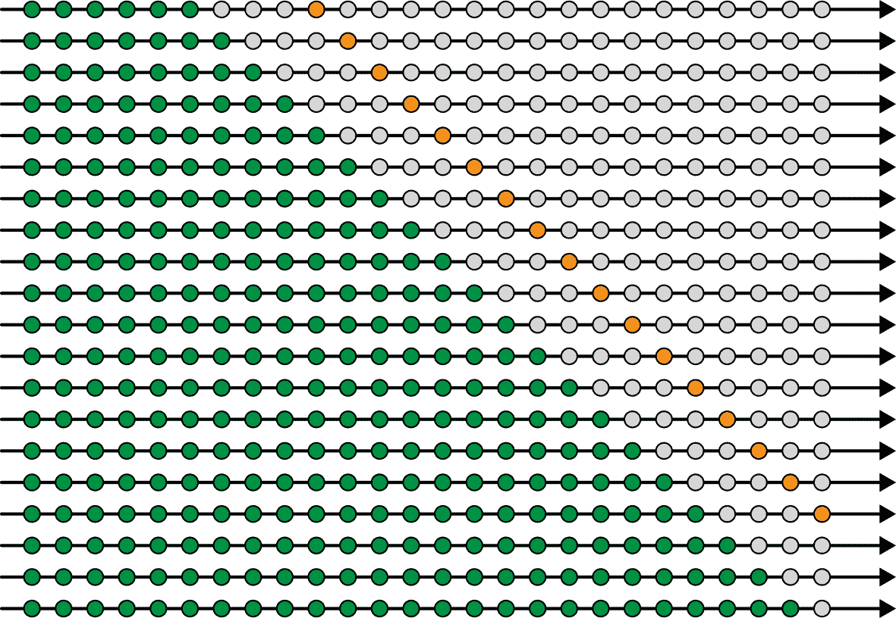
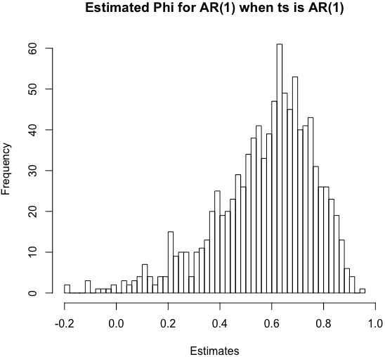
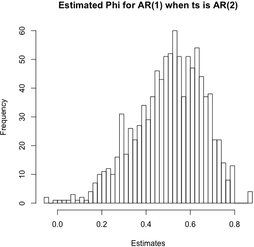

# 第十一章：测量误差

在之前的章节中，我们使用了各种措施来比较模型或评估模型执行任务的效果。在本章中，我们将重点介绍评估预测准确性的最佳实践，特别关注时间序列数据的相关问题。

对于那些刚接触时间序列预测的人来说，最重要的是要理解通常不建议使用标准交叉验证。你不能通过随机选择数据的随机样本来选择训练、验证和测试数据集，因为这种方式对时间不敏感。

但事情比这更复杂。你需要考虑不同数据样本在时间上的关系，即使它们看起来是独立的。例如，假设你正在处理时间序列分类任务，因此你有许多样本的单独时间序列，每个都是自己的数据点。在这种情况下，可能会诱人地认为你可以随机选择每个训练、验证和测试的时间序列，但如果你这样做就错了。这种方法的问题在于它不会反映你将如何使用你的模型，即你的模型将在较早的数据上进行训练，并在较晚的数据上进行测试。

你不希望未来信息泄漏到你的模型中，因为这不符合真实世界建模情况。这意味着你在测试中测量的预测误差会比在生产中低，因为在测试中你会通过交叉验证模型，获得了未来信息（即，反馈告诉你应该使用哪个模型）。

下面是一个具体的场景，展示了这种情况可能发生的方式。想象一下，你正在为美国西部主要城市的空气质量监测器进行训练。在你的训练集中，你包括了旧金山、盐湖城、丹佛和圣地亚哥在 2017 年和 2018 年的所有数据。在你的测试集中，你包括了同一日期范围内的拉斯维加斯、洛杉矶、奥克兰和凤凰城的数据。你发现你的空气质量模型在拉斯维加斯和洛杉矶表现特别好，而且整体上在 2018 年也表现非常好。太棒了！

然后你试图在来自早几十年数据的模型训练过程中复制你的模型训练过程，并发现它在其他训练/测试运行中的测试效果不如训练效果好。然后你记得 2018 年南加州的创纪录森林大火，并意识到它们已经“内建”到原始的测试/训练运行中，因为你的训练集给了你一个窥视未来的窗口。这是避免标准交叉验证的一个重要原因。

有时，未来信息向后传播到模型选择中并不是一个问题。例如，如果您仅希望通过测试来了解时间序列的动态，您并不是真正寻求预测，而更多地是测试给定模型对数据的最佳适应性。在这种情况下，包括未来数据有助于理解动态，尽管您要警惕过度拟合。因此，甚至在这种情况下，保持一个有效的测试集——需要防止未来信息向后泄漏——仍然会引起关于时间序列和交叉验证的担忧。

完成了这一般性评论后，我们转向一个具体的例子，讲述了将数据分配到训练、验证和测试模型的具体机制。然后我们更加普遍地讨论了如何确定一个预测何时足够好，或者尽可能地好。我们还研究了如何估计我们的预测的不确定性，特别是在使用那些输出中不直接产生不确定性或误差测量的技术时。最后，我们列出了一些容易忽视但在构建时间序列模型或准备投入生产时可能会有帮助的注意事项。这可能有助于您避免一些尴尬！

# 基础知识：如何测试预测

生成预测最重要的元素是确保您仅使用足够提前获取的数据来构建它。因此，您不仅需要考虑事件发生的时间，还需要考虑数据何时对您可用。¹

尽管这似乎足够简单，但请记住，常见的预处理，如指数平滑，可能会无意中导致从训练期到测试期的信息泄漏。您可以通过首先将线性回归拟合到自回归时间序列，然后再将其拟合到指数平滑的自回归时间序列来自行测试这一点。您会发现，随着时间序列的平滑程度越来越高，以及平滑半衰期越来越长，您的预测会变得“更好”。这是因为实际上，随着您的价值越来越多地由过去值的指数平均组成，您需要做的预测就越来越少。这是一个相当危险的展望，它如此隐匿，以至于它仍然出现在学术论文中！

由于存在这些危险以及其他难以发现的方式将未来信息输入到过去或反之，任何模型的黄金标准应该是使用向前滚动的训练、验证和测试期进行反向测试。

在回测中，模型是针对一组日期或日期范围开发的，但然后在历史数据上进行广泛测试，最好能够代表可能条件和变化的全范围。同样重要的是，实践者需要有为特定模型进行回测的原则性理由，并且应尽量避免尝试过多的模型。正如大多数数据分析师所知，您测试的模型越多，您就越可能对数据过拟合——即选择了一个过于关注当前数据集细节的模型，而不是以稳健方式进行泛化。不幸的是，对于时间序列实践者来说，这是一个棘手的平衡行为，可能会在将模型投入生产时导致令人尴尬的结果。

具体来说，我们如何实现某种形式的回测？我们以保持类似交叉验证的结构进行，尽管是时间感知的。通常的范例，假设您有代表时间按字母顺序进行推移的数据，如下所示：

> | 使用[A]进行训练 | 使用[B]进行测试 |
> | --- | --- |
> | 使用[A B]进行训练 | 使用[C]进行测试 |
> | 使用[A B C]进行训练 | 使用[D]进行测试 |
> | 使用[A B C D]进行训练 | 使用[E]进行测试 |
> | 使用[A B C D E]进行训练 | 使用[F]进行测试 |

图 11-1 说明了这种测试结构。



###### 图 11-1。评估时间序列模型性能的黄金标准，即向前滚动您的训练、验证和测试窗口。

也可以移动训练数据窗口而不是扩展它。在这种情况下，您的训练可能如下所示：

> | 使用[A B]进行训练 | 使用[C]进行测试 |
> | --- | --- |
> | 使用[B C]进行训练 | 使用[D]进行测试 |
> | 使用[C D]进行训练 | 使用[E]进行测试 |
> | 使用[D E]进行训练 | 使用[F]进行测试 |

您选择的方法部分取决于您认为系列行为是否随时间变化。如果您认为会变化，最好使用移动窗口，以便所有测试期间都使用训练到最相关数据的模型进行测试。另一个考虑因素可能是，您想避免过拟合，使用扩展窗口将比使用固定长度窗口更好地约束您的模型。

因为这种滚动拆分是常见的训练需求，R 和 Python 都提供了生成它的简单方法：

+   在 Python 中，生成数据拆分的一种简单方法是使用`sklearn.model_selection.TimeSeriesSplit`。

+   在 R 中，`forecast`包中的`tsCV`将使用这种回测模式向前推进模型，并报告错误。

在 R 和 Python 中还有其他包可以执行相同的操作。如果您对如何为特定项目实施此模型测试有具体想法，您还可以编写自己的函数来拆分数据。您可能想跳过某些时间段，因为它们表现出异常的动态，或者您可能希望更加权重某些时间段的性能。

例如，假设您处理的是金融数据。根据您的目标，排除 2008 年金融危机等特殊时期的数据可能是值得的。或者如果您处理零售数据，即使在预测低销量季节的准确性上牺牲了一些，也可能希望在圣诞购物季节最重视模型性能的权重。

## 回测模型的具体考虑因素

在构建您的反向测试时，请考虑您正在训练的模型的动态特性，特别是与使用特定时间范围数据训练模型有关的含义。

对于传统的统计模型（如 ARIMA），在选择模型参数时，所有数据点都是平等考虑的，因此如果您认为模型参数应随时间变化，则更多数据可能会使模型不太准确。对于机器学习模型也是如此，所有训练数据都平等地被考虑进去。²

另一方面，分批随机方法可能会导致权重和估计随时间演变。因此，如果您按时间顺序训练数据，使用典型的随机梯度下降方法训练的神经网络模型将在某种程度上考虑数据的时间性质。权重的最新梯度调整将反映最新的数据。在大多数情况下，时间序列神经网络模型是按照时间顺序训练的，因为这往往比按随机顺序训练的模型产生更好的结果。

###### 警告

不要在您的数据中留下空洞。时间序列数据的难度和美丽之处在于数据点是自相关的。因此，我们不能随机选择时间序列中的点进行验证或测试，因为这将破坏数据的某些自相关性。结果，我们的模型对数据的自回归组成的识别将受到损害，这是最不希望的结果。

状态空间模型也提供了适应时间变化的机会，因为模式会适应。这有利于使用更长的训练窗口，因为长时间窗口不会阻止后验估计随时间演变。

# 随时间快照您的模型

因为您将通过在过去数据上拟合后将其向前推移来测试您的模型，所以您需要一种简单的方法来保存带有时间戳的模型，以便您知道可以适当使用该模型的最早时间点。这将帮助您避免在其自身训练数据上无意中测试模型。它还将为您提供在测试数据上应用来自不同时间段的几种不同模型的机会。这可以成为一种看出模型最近训练与其在测试数据上的准确性是否重要的方法，这最终可以帮助您选择时间序列模型在生产代码中需要多频繁地重新拟合。

# 何时您的预测足够好？

当你的预测足够好时，这取决于你的整体目标，你可以“逃脱”的最低质量以及你需要做的事情，以及你的数据的限制和性质。如果你的数据本身具有非常高的噪声与信号比，你应该对你的模型的预期有所限制。

记住，时间序列模型并不完美。但你应该希望做得像或稍微比替代方法好，例如解决有关气候变化的微分方程组，向一个消息灵通的股票交易员询问意见，或者咨询显示如何分类脑电图迹象的医学教科书。在评估性能时，请记住预测的已知领域专家限制，这些措施表明目前在许多预测问题中性能的上限。

有时候你会知道你的模型还不够好，你可以做得更好。以下是一些你可以采取的措施来识别这些机会：

绘制你的模型在测试数据集上的输出

模型产生的分布应该与你试图预测的值的分布相匹配，假设没有预期的制度变化或潜在趋势。例如，如果你试图预测股票价格，并且你知道股票价格上下波动的频率大致相等，如果模型总是预测价格上涨，那么你的模型就是不充分的。有时分布显然会有所偏差，而在其他时候，你可以应用一个检验统计量来比较你模型的输出与实际目标的关系。

绘制你的模型残差随时间的图像

如果残差随时间不均匀，你的模型就是不充分的。残差的时间行为可以指导你需要描述模型中的额外参数以描述时间行为。

对你的模型进行简单的时间感知空模型测试

一个常见的空模型是每个时间*t*的预测应该是时间*t* - 1 的值。如果你的模型无法击败这样一个简单的模型，那就没有任何理由支持它。如果一个简单的通用天真模型能够击败你制作的模型，那么这是你的模型、损失函数或数据预处理的基本问题，而不是超参数网格搜索的问题。或者，这可能表明数据相对于信号具有大量噪声，这也表明你的模型对其预期用途是无用的。³

研究你的模型如何处理异常值

在许多行业中，异常值简单地被称为：异常。这些事件很可能是无法预测的，⁴ 这意味着你的模型最好忽略这些异常值而不是适应它们。事实上，你的模型预测异常值很可能是过拟合或选择了不合适的损失函数的迹象。这取决于你选择的模型和所使用的损失函数，但对于大多数应用程序，你希望模型的预测不要像数据集中的极端值那样极端。当然，在异常事件的成本高和主要预测任务是在可能的情况下警告异常事件时，这条建议并不适用。

进行时间敏感性分析

在相关的时间序列中产生相关结果的行为在你的模型中是否有类似的特性？通过你对系统基础动态的理解，确保这一点是正确的，并且你的模型能够以相同的方式识别和处理类似的时间模式。例如，如果一个时间序列显示上升趋势，每天漂移 3 单位，而另一个时间序列显示上升趋势，每天漂移 2.9 单位，你可能希望确保最终为这些序列制作的预测是相似的。同时，你还需要确保与输入数据相比，预测的排名是合理的（更大的漂移应导致更大的预测值）。如果情况不是这样，你的模型可能存在过拟合的风险。

这不是测试时间序列模型的众多方法的完整列表，但可以作为在特定领域获得经验的起点。

# 使用模拟来估计模型中的不确定性

传统统计时间序列分析的一个优点是，这类分析具有关于估计不确定性的明确定义的分析公式。然而，即使在这种情况下，特别是在非统计方法的情况下，通过计算方法了解与预测模型相关的不确定性也是有帮助的。一个非常直观和易于接近的方法是简单的模拟。

假设我们已经对我们认为是 AR(1) 过程进行了分析。作为提醒，AR(1) 过程可以表达为：

<math xmlns="http://www.w3.org/1998/Math/MathML"><mrow><msub><mi>y</mi> <mi>t</mi></msub> <mo>=</mo> <mi>ϕ</mi> <mo>×</mo> <msub><mi>y</mi> <mrow><mi>t</mi><mo>-</mo><mn>1</mn></mrow></msub> <mo>+</mo> <msub><mi>e</mi> <mi>t</mi></msub></mrow></math>

在模型拟合之后，我们想研究我们的*ϕ*系数估计有多变。在这种情况下，研究的一种方法是运行多个蒙特卡罗模拟。只要我们记得在第六章中学到的 AR 过程的内容，这可以在 R 中轻松完成：

```
## R
> require(forecast)
> 
> phi         <- 0.7
> time_steps  <- 24
> N           <- 1000
> sigma_error <- 1
> 
> sd_series   <- sigma_error² / (1 - phi²) 
> starts      <- rnorm(N, sd = sqrt(sd_series))
> estimates   <- numeric(N)
> res         <- numeric(time_steps)
> 
> for (i in 1:N) {
>   errs = rnorm(time_steps, sd = sigma_error)
>   res[1]  <- starts[i] + errs[1]
>   
>   for (t in 2:time_steps) {
>     res[t] <- phi * tail(res, 1) + errs[t]
>   }
>   estimates <- c(estimates, arima(res, c(1, 0, 0))$coef[1])
> }
> 
> hist(estimates, 
>      main = "Estimated Phi for AR(1) when ts is AR(1)", 
>      breaks = 50)  

```

这导致了图中显示的 Figure 11-2 对于估计的*ϕ*的直方图。



###### 图 11-2\. *ϕ* 的估计分布。

我们还可以通过应用于`estimates`的`summary()`函数，获得估计和分位数的范围感。

```
## R
> summary(estimates1)
   Min. 1st Qu.  Median    Mean 3rd Qu.    Max. 
-0.3436  0.4909  0.6224  0.5919  0.7204  0.9331 

```

我们也可以使用自举法来提出更复杂的问题。假设我们想知道与地面真实情况相比，简化我们模型可能会付出何种数值成本。想象一下，我们研究的过程是一个 AR(2)，即使我们将其诊断为 AR(1)过程。为了了解这如何影响我们的估计，我们可以修改前面的 R 代码如下：

```
## R
> ## now let's assume we have a true AR(2) process
> ## because this is more complicated, we switch over to arima.sim
> phi_1 <- 0.7
> phi_2 <- -0.2
> 
> estimates <- numeric(N)
> for (i in 1:N) {
>   res <- arima.sim(list(order = c(2,0,0), 
>                        ar = c(phi_1, phi_2)), 
>                   n = time_steps)
>   estimates[i] <- arima(res, c(1, 0, 0))$coef[1]
> }
> 
> hist(estimates, 
>      main = "Estimated Phi for AR(1) when ts is AR(2)", 
>      breaks = 50)

```

我们在图 11-3 中看到结果分布。正如我们所见，与正确指定的模型的分布相比，对于这个错误指定的模型来说，分布不如此平滑和明确定义，这一点是明显的。



###### 图 11-3\. 估计的滞后 1 系数分布，适用于一个真实描述为 AR(2)过程的过程拟合的 AR(1)模型。

你可能会觉得这些分布并没有太大差异，你是对的。我们通过汇总统计数据来确认这一点：⁵

```
## R
> summary(estimates)
   Min. 1st Qu.  Median    Mean 3rd Qu.    Max. 
-0.5252  0.4766  0.6143  0.5846  0.7215  0.9468 

```

我们可以看到，在模型错误指定时，估计范围更广，而第一阶项的估计稍逊于模型正确指定时的情况，但偏差并不太大。

这可以解决低估模型阶数将如何影响我们对*ϕ*估计的担忧。我们可以运行多种模拟场景来解决潜在问题，并了解在某些想象的情况下可能的误估范围。

# 预测多步骤

尽管在大多数过去的章节中我们讨论的是一步预测，但你可能也想预测多个时间步长。这种情况发生的原因之一是，你拥有的时间序列数据的时间分辨率比你想预测的时间序列值更高。例如，你可能有每日股票价格数据，但你希望预测月度股票价格，以便为退休储蓄执行长期策略。或者，你可能有每分钟进行一次的大脑电活动读数，但你希望能预测至少五分钟前的癫痫发作，以尽可能提前警告用户/患者。在这种情况下，你有多种选择生成多步预测。

## 直接适应感兴趣的地平线。

这就像将你的*y*（目标）值设置为反映感兴趣的预测视角一样简单。因此，如果你的数据由分钟指标组成，但你希望对你的预测进行五分钟的前瞻性分析，你将在时间*t*截止，并将其训练为使用时间*t* + 5 生成的标签。然后，你会将这些数据拟合到你试图预测的数据上，无论是通过简单线性回归、机器学习模型甚至是深度学习网络。这实际上可以作为：

<math xmlns="http://www.w3.org/1998/Math/MathML"><mrow><mi>m</mi> <mi>o</mi> <mi>d</mi> <mi>e</mi> <mi>l</mi> <mo>(</mo> <mi>X</mi> <mo>)</mo> <mo>=</mo> <mi>Y</mi></mrow></math>

您可以选择*Y*具有您想要的任何时间范围。因此，每个都可能是一个合法的场景，具体取决于您的前瞻性兴趣（无论是 10 步还是此处所示的 3 步）：

+   <math xmlns="http://www.w3.org/1998/Math/MathML"><mrow><mi>m</mi> <mi>o</mi> <mi>d</mi> <mi>e</mi> <msub><mi>l</mi> <mn>1</mn></msub> <mrow><mo>(</mo> <msub><mi>X</mi> <mi>t</mi></msub> <mo>)</mo></mrow> <mtext>is</mtext> <mtext>fit</mtext> <mtext>to</mtext> <msub><mi>Y</mi> <mrow><mi>t</mi><mo>+</mo><mn>10</mn></mrow></msub></mrow></math>

+   <math xmlns="http://www.w3.org/1998/Math/MathML"><mrow><mi>m</mi> <mi>o</mi> <mi>d</mi> <mi>e</mi> <msub><mi>l</mi> <mn>2</mn></msub> <mrow><mo>(</mo> <msub><mi>X</mi> <mi>t</mi></msub> <mo>)</mo></mrow> <mtext>is</mtext> <mtext>fit</mtext> <mtext>to</mtext> <msub><mi>Y</mi> <mrow><mi>t</mi><mo>+</mo><mn>3</mn></mrow></msub></mrow></math>

## 递归方法处理遥远时间视角

使用递归方法适应各种视角，您可以构建一个模型，但准备将其输出反馈作为输入以预测更遥远的视角。这个想法应该很熟悉，因为我们展示了如何使用这种策略利用 ARIMA 建模进行多步预测。假设我们开发了一个模型，以一步为目标，通过训练 <math xmlns="http://www.w3.org/1998/Math/MathML"><mrow><mi>m</mi> <mi>o</mi> <mi>d</mi> <mi>e</mi> <mi>l</mi> <mrow><mo>(</mo> <msub><mi>X</mi> <mi>t</mi></msub> <mo>)</mo></mrow> <mo>=</mo> <msub><mi>Y</mi> <mrow><mi>t</mi><mo>+</mo><mn>1</mn></mrow></msub></mrow></math> 。如果我们希望适应三步的视角，我们将执行以下操作：

+   <math xmlns="http://www.w3.org/1998/Math/MathML"><mrow><mi>m</mi> <mi>o</mi> <mi>d</mi> <mi>e</mi> <mi>l</mi> <mrow><mo>(</mo> <msub><mi>X</mi> <mi>t</mi></msub> <mo>)</mo></mrow> <mo>→</mo> <mi>e</mi> <mi>s</mi> <mi>t</mi> <mi>i</mi> <mi>m</mi> <mi>a</mi> <mi>t</mi> <mi>e</mi> <msub><mi>Y</mi> <mrow><mi>t</mi><mo>+</mo><mn>1</mn></mrow></msub></mrow></math>

+   <math xmlns="http://www.w3.org/1998/Math/MathML"><mrow><mi>m</mi> <mi>o</mi> <mi>d</mi> <mi>e</mi> <mi>l</mi> <mrow><mo>(</mo> <msub><mi>X</mi> <mi>t</mi></msub> <mtext>with</mtext> <mtext>estimate</mtext> <mtext>of</mtext> <msub><mi>Y</mi> <mrow><mi>t</mi><mo>+</mo><mn>1</mn></mrow></msub> <mo>)</mo></mrow> <mo>→</mo> <mtext>estimate</mtext> <mtext>of</mtext> <msub><mi>Y</mi> <mrow><mi>t</mi><mo>+</mo><mn>2</mn></mrow></msub></mrow></math>

+   <math xmlns="http://www.w3.org/1998/Math/MathML"><mrow><mi>m</mi> <mi>o</mi> <mi>d</mi> <mi>e</mi> <mi>l</mi> <mrow><mo>(</mo> <msub><mi>X</mi> <mi>t</mi></msub> <mtext>with</mtext> <mtext>estimate</mtext> <mtext>of</mtext> <msub><mi>Y</mi> <mrow><mi>t</mi><mo>+</mo><mn>1</mn></mrow></msub> <mtext>and</mtext> <mtext>estimate</mtext> <mtext>of</mtext> <msub><mi>Y</mi> <mrow><mi>t</mi><mo>+</mo><mn>2</mn></mrow></msub> <mo>)</mo></mrow> <mo>→</mo> <mtext>estimate</mtext> <mtext>of</mtext> <msub><mi>Y</mi> <mrow><mi>t</mi><mo>+</mo><mn>3</mn></mrow></msub></mrow></math>

我们对*Y*[*t*+3]的估计误差预期必然大于我们对*Y*[*t*+1]的估计误差。大多少？这可能很复杂。获取感觉的一个好选择是运行仿真，正如本章早些时候讨论的。

## 应用于时间序列的多任务学习

多任务学习是深度学习中的一个通用概念，可以应用于时间序列分析的特定含义。更一般地说，多任务学习描述了一个模型可以同时服务多个目的或通过尝试预测几个不同但相关目标来学习泛化的想法。一些人认为这是一种正则化的手段，通过教导相关任务来鼓励模型更加通用。

在时间序列上下文中，您可以通过在预测环境中为不同的时间视角设置目标来应用多任务学习。在这种情况下，适配您的模型可能看起来像这样：

+   <math xmlns="http://www.w3.org/1998/Math/MathML"><mrow><mi>m</mi> <mi>o</mi> <mi>d</mi> <mi>e</mi> <mi>l</mi> <mrow><mo>(</mo> <msub><mi>X</mi> <mi>t</mi></msub> <mo>)</mo></mrow> <mo>=</mo> <mrow><mo>(</mo> <msub><mi>Y</mi> <mrow><mi>t</mi><mo>+</mo><mn>1</mn></mrow></msub> <mo>,</mo> <msub><mi>Y</mi> <mrow><mi>t</mi><mo>+</mo><mn>10</mn></mrow></msub> <mo>,</mo> <msub><mi>Y</mi> <mrow><mi>t</mi><mo>+</mo><mn>100</mn></mrow></msub> <mo>)</mo></mrow></mrow></math>

+   <math xmlns="http://www.w3.org/1998/Math/MathML"><mrow><mi>m</mi> <mi>o</mi> <mi>d</mi> <mi>e</mi> <mi>l</mi> <mrow><mo>(</mo> <msub><mi>X</mi> <mi>t</mi></msub> <mo>)</mo></mrow> <mo>=</mo> <mrow><mo>(</mo> <msub><mi>Y</mi> <mrow><mi>t</mi><mo>+</mo><mn>1</mn></mrow></msub> <mo>,</mo> <msub><mi>Y</mi> <mrow><mi>t</mi><mo>+</mo><mn>2</mn></mrow></msub> <mo>,</mo> <msub><mi>Y</mi> <mrow><mi>t</mi><mo>+</mo><mn>3</mn></mrow></msub> <mo>)</mo></mrow></mrow></math>

在训练这样一个模型时，您还可以考虑如何查看损失函数：您是否希望平等加权所有预测，还是您希望优先考虑某些预测视角而不是其他预测视角？

如果您寻求进行非常遥远的预测，您可以使用多任务视角通过包括短期视角来教导您的模型，这些短期视角可能指向远期预测的显著特征，但在远期预测的低信噪比数据中直接找出却很困难。多任务建模的另一个场景可能是在未来的几个时间窗口中适配，所有这些时间窗口处于同一季节，但可能是不同的时间点（例如，几年内的春季或几周内的星期一）。这将是同时适应季节性和趋势的一种方式。

# 模型验证的一些小问题

在考虑是否已经适当测试您的模型与预期生产实现相比时，需要考虑的最重要问题如下：

前瞻性

本书始终强调前瞻性，因为难以避免，而当模型投入生产时，这可能会带来灾难性和尴尬的后果。尽可能地避免使模型在生产中突然停止验证是很重要的。这是在您的系统中没有意识到前瞻性的标志。不要让这种情况发生在您身上！

结构性变化

识别结构性变化在某种程度上是判断问题、主题问题和数据质量问题的综合体。时间序列底层的动态可能随时间变化，它们可以变化到足以使一个适合于时间序列一部分的模型不再适用于另一部分。这是探索性分析重要的原因之一——确保在结构性变化时不要训练相同的模型，这既不合理也不明智。

# 更多资源

Christoph Bergmeir、Rob J. Hyndman 和 Bonsoo Koo，《关于用于评估自回归时间序列预测的交叉验证有效性的说明》（"A Note on the Validity of Cross-Validation for Evaluating Autoregressive Time Series Prediction"），*计算统计与数据分析* 120 (2018): 70–83，https://perma.cc/YS3J-6DMD。

本文的作者（包括值得尊敬且极富产量的 Rob Hyndman）讨论了即使对于时间序列分析，交叉验证也会产生良好结果的情况。这篇文章尤其有帮助，因为它提供了关于为什么交叉验证会产生误差以及在标准交叉验证分析中可以使用哪些模型而不是反向拟合的见解。

Angelo Canty，《时间序列的自举法》（"tsboot: Bootstrapping of Time Series"），无日期，https://perma.cc/MQ77-U5HL。

这段描述位于`boot`包中的`tsboot()`函数，作为教育性阅读内容，因为它实现了多种被广泛接受的区块抽样作为一种自举法的变体。探索该函数中提供的选项是熟悉各种自举时间序列的好方法，而对该函数的熟悉则能够使您能够方便、可靠地估计测试统计量，并在数据集较小的情况下评估估计的不确定性。

Hans R. Kunsch，《一般平稳观察的半自助法与自助法》（"The Jackknife and the Bootstrap for General Stationary Observations"），*统计年鉴* 17, no. 3 (1989): 1217–41，https://perma.cc/5B2T-XPBC。

这篇经典且广为引用的文章展示了一种统计方法，将 Jackknife（较少使用）和自助法方法扩展到时间序列数据，通过消除这些方法的一个假设，即数据点是独立分布的。这篇文章介绍了通过单位块而不是单个点的思考和抽样来处理时间序列。

Christian Kleiber, [“(经济)时间序列的结构变化,”](https://perma.cc/7U8N-T4RC) *复杂性与协同作用*，斯特凡·穆勒等编。(瑞士，查姆: 斯普林格国际，2018)，https://perma.cc/7U8N-T4RC.

本章总结了多种经典方法，用于识别时间序列结构性变化，并从商业和经济时间序列的角度进行了阐述，尽管这些教训更广泛地适用。它特别有用，因为它提供了可以用来应用这些广泛接受的结构变化识别方法的 R 包列表，并提供了有用的可视化，展示了在分析相同时间序列时，方法的行为有所不同。

Robert Stambaugh, [“预测回归,”](https://perma.cc/YD7U-RXBM) *《金融经济学杂志》* 54 (1999): 375–421, https://perma.cc/YD7U-RXBM.

这篇广为引用的文章演示了如何对回归系数进行贝叶斯后验估计，以及在对金融时间序列模型的基础动态假设不同的情况下，有限样本量估计的数量可能会有显著差异。这是一个很好的例子，尽管领域特定，但它展示了起始假设对估计不确定性的影响有多大。

¹ 顺便说一下，对于某些时间段有或没有可用数据的建模，可以展示及时数据交付的重要性，这可以激励你的数据工程师和经理优先考虑特定的数据输入，如果你能证明这将对你的模型准确性和/或组织的底线有所影响。

² 请注意，您可以为您的损失函数编写自定义加权函数，以便更加重视最近的数据，但这需要以上平均水平的编程技能和关于数值优化的知识。

³ 一个简单的空模型可能出奇地难以超越。

⁴ 在某些情况下，可能没有任何东西可以为未来决策学习。

⁵ 如果误差对具体系数影响较大，那么误差拟合可能会成为问题。在这里，我们的模型误配影响不是太大，但在其他情况下，可能会是灾难性的。
