# 第十三章：医疗应用

在本章中，我们将在医疗背景下进行时间序列分析，涉及两个案例研究：流感预测和即时预测以及血糖预测。 >这两者都是常见健康问题的重要医疗应用。此外，在这两种情况下，这些都不是解决的问题，而是学术界和医疗行业正在研究的课题。

# 预测流感

在给定地理区域内从一周到另一周预测流感率是一个长期而持续的问题。传染病专家和全球安全专业人员一致认为，传染病对人类福祉构成[重大风险](https://perma.cc/ZDA8-AKX6)。对于流感来说尤为如此，它在全球范围内侵袭弱势群体，每年造成数百人死亡，大多数是婴幼儿和老年人。从健康和国家安全的角度来看，开发流感在给定季节中的准确模型至关重要。流感预测模型不仅有助于具体预测病毒，还帮助研究人员探索传染病地理传播的一般理论。

## 一个大都市地区流感的案例研究

我们将研究 2004 年至 2013 年法国各行政区域每周流感报告的数据集。我们将预测巴黎大都会地区Île de France 的流感率。可以从[Kaggle](https://perma.cc/W9VQ-UUJC)¹下载数据，也可以在本书的代码库中找到。

### 数据探索和一些清理工作

我们首先要熟悉原始数据，首先以表格形式进行检查：

```
## R
> flu = fread("train.csv")
> flu[, flu.rate := as.numeric(TauxGrippe)] 
> head(flu)
     Id   week region_code     region_name TauxGrippe flu.rate
1: 3235 201352          42          ALSACE          7        7
2: 3236 201352          72       AQUITAINE          0        0
3: 3237 201352          83        AUVERGNE         88       88
4: 3238 201352          25 BASSE-NORMANDIE         15       15
5: 3239 201352          26       BOURGOGNE          0        0
6: 3240 201352          53        BRETAGNE         67       67

```

我们还进行一些基本的质量检查，比如在我们感兴趣的变量中查找`NA`。我们可能不知道这些`NA`值来自哪里，但我们需要对其进行处理：

```
## R
> nrow(flu[is.na(flu.rate)]) / nrow(flu)
[1] 0.01393243
> unique(flu[is.na(flu.rate)]$region_name)
 [1] "HAUTE-NORMANDIE"      "NORD-PAS-DE-CALAIS"   "PICARDIE"            
 [4] "LIMOUSIN"             "FRANCHE-COMTE"        "CENTRE"              
 [7] "AUVERGNE"             "BASSE-NORMANDIE"      "BOURGOGNE"           
[10] "CHAMPAGNE-ARDENNE"    "LANGUEDOC-ROUSSILLON" "PAYS-DE-LA-LOIRE"    
[13] "CORSE"     

```

整体`NA`数据点的比率并不是很高。此外，我们感兴趣的Île-de-France 地区不在`NA`值列表中。

我们进行一些数据清理工作，将时间戳列的周和年份部分分开（目前是字符格式，而不是数值或时间戳格式）：

```
## R
> flu[, year := as.numeric(substr(week, 1, 4))]
> flu[, wk   := as.numeric(substr(week, 5, 6))] 
> ## style note it's not great we have 2 week columns

```

我们添加了一个`Date`类列，以便在时间绘图中有更好的绘图轴，而不是将数据视为非时间戳形式：

```
## R
> flu[, date:= as.Date(paste0(as.character(flu$week), "1"), "%Y%U%u")]

```

这行代码稍微有些复杂。为了将月份-周数组合转换为日期，我们添加了一个表示天的组件。这就是`paste0()`的目的，它将每个日期标记为周的第一天，将一个`"1"`粘贴到已经指定了年份和周数的字符串中（一年 52 周——稍后详述）。² 注意格式字符串中的`%U`和`%u`：这些与根据年份周数和星期几标记时间有关，这是一种稍显不同的时间戳格式。³

然后我们将数据子集化以涉及具体巴黎的数据，并按日期排序：⁴

```
## R
## let's focus on Paris
> paris.flu = flu[region_name == "ILE-DE-FRANCE"]
> paris.flu = paris.flu[order(date, decreasing = FALSE)]

> paris.flu[, .(week, date, flu.rate)]
       week       date flu.rate
  1: 200401 2004-01-05       66
  2: 200402 2004-01-12       74
  3: 200403 2004-01-19       88
  4: 200404 2004-01-26       26
  5: 200405 2004-02-02       17
 ---                           
518: 201350 2013-12-16       13
519: 201351 2013-12-23       49
520: 201352 2013-12-30       24
521: 200953       <NA>      145
522: 200453       <NA>       56

```

如果你注意到，行数可能会让你感到惊讶。如果一年有 52 周，我们有 10 年的数据，为什么我们有 522 行？我们本来预期是 52 周 × 10 年 = 520 行。类似地，为什么有两个`NA`日期？如果您返回原始数据，您将看到解释。似乎 2004 年和 2009 年都有第 53 周。每隔几年，一年有 53 周而不是 52 周——这不是错误，而是[格里高利历](https://perma.cc/4ETJ-88QR)系统的一部分。

然后我们检查数据是否覆盖了一个完整且定期采样的日期范围，首先确保每年具有相同数量的数据点：⁵

```
## R
> paris.flu[, .N, year]
    year  N
 1: 2004 53
 2: 2005 52
...
 9: 2012 52
10: 2013 52

> paris.flu[, .N, wk]
    wk  N
 1:  1 10
 2:  2 10
 3:  3 10
...
51: 51 10
52: 52 10
53: 53  2
    wk  N

```

我们可以看到数据符合预期；即每年（除了刚刚讨论过的两年）有 52 周，并且每个年度周标签有 10 个数据点，除了第 53 周。

现在我们已经考虑了数据的时间戳，我们要检查时间序列的实际值（到目前为止我们只考虑了时间索引）。有趋势吗？季节性？让我们找出来（见图 13-1）：

```
## R
> paris.flu[, plot(date, flu.rate, 
>                  type = "l", xlab = "Date",
>                  ylab = "Flu rate")]

```

从简单的折线图可以明显看出有明显的季节性（这是您可能在您自己的社区中经历过的）。这个图表表明有强烈的季节性成分，但并不表明除了季节性外有时间漂移。

季节性行为使得第 53 周变得复杂。如果我们想要拟合一个季节性模型，我们需要根据年的周来定义季节性，而不能有可变的季节性大小（这是季节与周期不同的地方，如第三章所讨论的）。虽然我们可以想象一些创造性的解决方案来解决第 53 周的问题，但我们将采取简单的方式来抑制这些数据：

```
## R
> paris.flu <- paris.flu[week != 53]
```

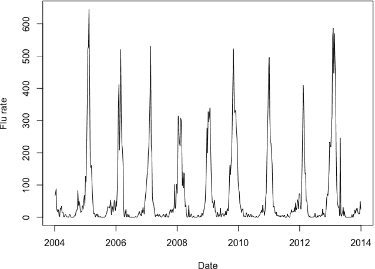

###### 图 13-1\. 通过绘制流感率的时间序列，我们可以看出巴黎的流感率的季节性。

是否删除数据点对于数据集和我们提出的问题是否是一个重要问题。我把它留给读者来探索在保留第 53 周数据的同时拟合数据的其他可能性。有多种选择可以做到这一点。其中一种是通过对两周取平均数将第 53 周数据合并到第 52 周数据中。另一种方法是使用一个可以考虑周期行为而无需锁定于每年完全相同长度周期的模型。第三个选项是，机器学习模型也许可以通过对数据进行创造性标记以指示季节性作为输入特征来适应这种情况。

### 拟合季节性 ARIMA 模型

首先考虑对数据拟合季节性 ARIMA 模型，因为存在强烈的季节性。在这种情况下，数据的周期性为 52，因为数据是每周抽样的。我们希望选择一个相当简洁的模型——即没有太多参数的模型——因为我们的时间序列有 520 个数据点，并不是特别长。

这个时间序列是我们如果过于依赖自动化可能会出错的一个很好的例子。例如，我们可能首先考虑是否对数据进行差分，因此我们可能会考虑流感率的自相关图以及流感率差分时间序列的自相关图，分别显示在图 13-2 中：

```
## R
> acf(paris.flu$flu.rate,         )
> acf(diff(paris.flu$flu.rate, 52))

```

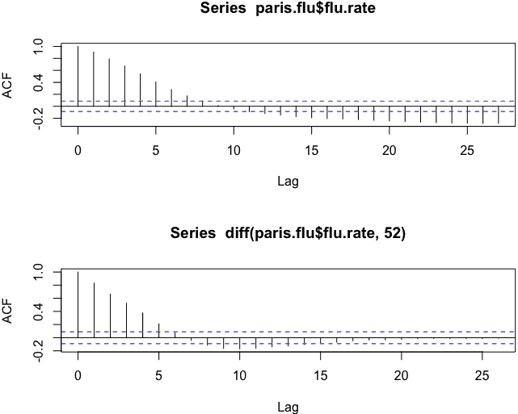

###### 图 13-2\. 巴黎流感率及其差分流感率的自相关函数图。我们只考虑了有限范围的滞后值。

如果我们粗心大意，可能会因为一次差分而自我祝贺，认为解决了这个时间序列的平稳性问题。但这完全没有任何意义。这是周数据，我们观察到了强烈的季节性。为什么我们在自相关图中看不到它呢？我们使用了`acf()`函数的默认参数，这在滞后空间中不能足够远地展示季节效应，我们从第 52 个滞后开始（一年）。让我们用一个充分的窗口重新运行`acf()`（参见图 13-3）：

```
## R
> acf(paris.flu$flu.rate,           lag.max = 104)
> acf(diff(paris.flu$flu.rate, 52), lag.max = 104)

```

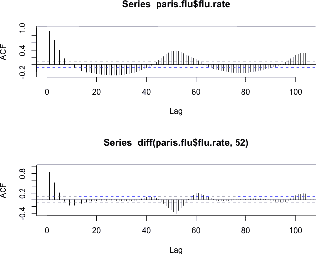

###### 图 13-3\. 巴黎流感率及其差分流感率的自相关函数图。现在我们考虑了更广泛范围的滞后值。

这给了我们一个更真实的系列自相关图。正如我们所看到的，各种滞后值都有显著的自相关，这是有道理的（至少根据我在四季气候中的经验）。流感率与其测量时间附近的周有很强的相关性。

流感率也会有很强的相关性，与时间间隔约为 52 或 104 的时间段具有季节性相关性。但流感率还与中间值的时间段（例如半年，即 26 周）具有相当强的关系，因为这些滞后也涉及到季节性差异和可预测的天气变化。例如，我们知道半年时间内，流感值可能会发生相当大的变化。如果之前很高，现在应该很低，反之亦然，这也是由于季节性。所有这些都在图 13-3 的上图中显示。

然后，我们检查差分后的系列，如图 13-3 中的下图所示。现在我们看到大量时间序列的自相关已经减少。然而，仍然存在相当多的自相关，不仅在 52 或 104 周（一年或两年）处，而且在中间值处也有。

虽然我们可能会试图继续差分，但我们需要记住，真实世界的数据永远不会完美地适合一个 SARIMA 模型。相反，我们寻求模拟数据的最合理方式。我们可以考虑再次进行季节性差分或采用不同的策略并在线性时间上进行差分。我们在这里绘制了每一种可能性（参见图 13-4）：

```
## R
> plot(diff(diff(paris.flu$flu.rate, 52), 52))
> plot(diff(diff(paris.flu$flu.rate, 52), 1))

```

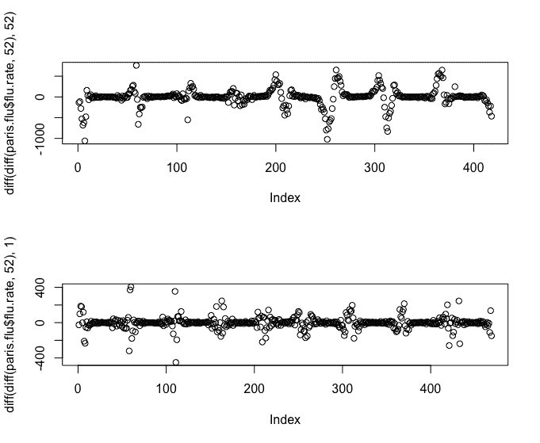

###### 图 13-4\. 我们选择的两个版本进行序列差分以了解数据的季节行为。

虽然两种结果都不理想，但后者——季节性差分的标准第一次差分更为令人满意。

选择拟合或参数选择是一种判断调用，正如应用测试一样。在这里，我们选择给季节性明显的权重，但也不要过于复杂化模型或使其不透明。因此，在 SARIMA (*p*, *d*, *q*) (*P*, *D*, *Q*)模型中，我们将使用 *d* = 1 和 *D* = 1 进行拟合。然后我们选择我们的 AR 和 MA 参数作为标准的 ARIMA 参数，*p* 和 *q*。我们通过标准的可视化方法进行这些选择，使用以下代码（参见图 13-5）：

```
## R
> par(mfrow = c(2, 1))
> acf (diff(diff(paris.flu$flu.rate, 52), 1), lag.max = 104)
> pacf(diff(diff(paris.flu$flu.rate, 52), 1), lag.max = 104)

```

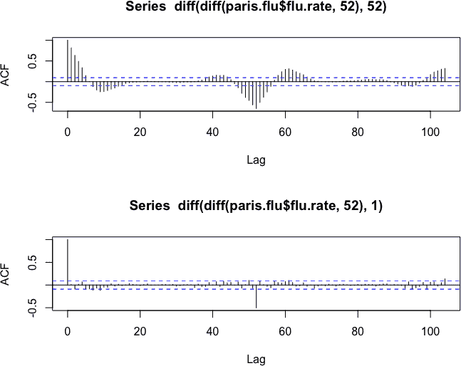

###### 图 13-5\. 我们选择的差分序列的偏自相关函数图。

我们有限的数据集并且在选择更简单的模型方面犯了错误。PACF 模型表明 AR(2)模型可能是合适的，因此我们将我们的数据以 SARIMA (2, 1, 0), (0, 1, 0)的形式简洁地建模。

我们对于了解这个模型如何在连续拟合新数据时运行感兴趣，这种方式是大多数为真实世界系统构建的模型所采用的。也就是说，如果我们从几年前开始对流感进行建模，每周只使用到那个时间点为止的数据，我们的模型将如何运行？我们通过按照以下方式推进模型的拟合和评估来回答这个问题：

```
## R
> ## arima fit
> ## let's estimate 2 weeks ahead
> first.fit.size <- 104
> h              <- 2
> n              <- nrow(paris.flu) - h - first.fit.size
> 
> ## get standard dimensions for fits we'll produce
> ## and related info, such as coefs
> first.fit <- arima(paris.flu$flu.rate[1:first.fit.size], order = c(2, 1, 0),
>                    seasonal = list(order = c(0,1,0), period = 52))
> first.order <- arimaorder(first.fit)
> 
> ## pre-allocate space to store our predictions and coefficients
> fit.preds <- array(0, dim = c(n, h))
> fit.coefs <- array(0, dim = c(n, length(first.fit$coef)))
> 
> ## after initial fit, we roll fit forward
> ## one week at a time, each time refitting the model
> ## and saving both the new coefs and the new forecast
> ## caution! this loop takes a while to run
> for (i in (first.fit.size + 1):(nrow(paris.flu) - h)) {
>   ## predict for an increasingly large window
>   data.to.fit = paris.flu[1:i]
>   fit = arima(data.to.fit$flu.rate, order = first.order[1:3],
>               seasonal = first.order[4:6])
>   fit.preds[i - first.fit.size, ] <- forecast(fit, h = 2)$mean
>   fit.coefs[i - first.fit.size, ] <- fit$coef
> }

```

然后我们绘制这些滚动结果（参见图 13-6）：

```
## R
> ylim <- range(paris.flu$flu.rate[300:400],
>                  fit.preds[, h][(300-h):(400-h)])
> par(mfrow = c(1, 1))
> plot(paris.flu$date[300:400], paris.flu$flu.rate[300:400],
>      ylim = ylim, cex = 0.8,
> main = "Actual and predicted flu with SARIMA (2, 1, 0), (0, 1, 0)",
> xlab = "Date", ylab = "Flu rate")
> lines(paris.flu$date[300:400], fit.preds[, h][(300-h):(400-h)],
>       col = 2, type = "l", 
>       lty = 2, lwd = 2)

```

该图展示了一个有用的预测，但也突显了该模型的一些局限性。这个模型不够现实，有时会预测出负的流感率，这表明 ARIMA 模型本身没有固有的东西来强制施加诸如流感率必须为非负的约束条件。在拟合模型之前，我们必须通过数据转换来实施这些物理约束。

此外，该模型对异常点的敏感度似乎超出我们的预期。2013 年初就是一个典型例子，模型多次严重高估了流感率。当涉及到分配关键的抗疾病资源时，这不是一个可接受的模型。

最后，该模型在峰值处产生的极端值比任何一年内测量到的值都要高。这可能导致资源分配过多，超过实际需要，这不是一个好结果，特别是当资源高度受限时。这是一个关于模型的担忧，既根植于现实世界的资源限制，也根植于纯粹的数据分析。

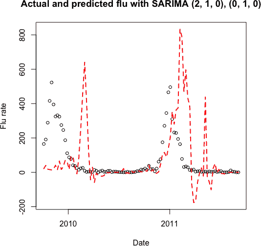

###### 图 13-6\. 流感率（点）与我们的 SARIMA 预测（虚线）配对。这个简单模型的预测可以帮助公共卫生规划。

现在我们已经考虑了基本 ARIMA 模型对这个问题的拟合情况，我们将看看其他建模可能性。

### 替代 ARIMA 模型：外生谐波回归器取代季节性

考虑到前一节讨论的 SARIMA 模型的表现，我们可以进行一些修改。在这里，我们考虑两种修改，每种修改都是独立的，可以分别应用。⁶

首先，我们希望在我们的模型中建立约束条件，以防止预测负值。一种方法是对数据进行对数转换，这样我们预测的是时间序列值的对数，而不是值本身。然后，当我们想要看到“真实”的系列，表示实际测量到的数字时，我们将使用指数变换来撤消对数变换，并得到它们的实际单位预测值。

其次，我们希望找到一种更透明的方法来处理数据的季节性。虽然我们将我们的季节性 ARIMA 模型描述为简单的，但实际上，处理 52 周季节性重复的模型并不简单。季节性 ARIMA 模型在较短季节周期上表现更好，在较长季节周期（52 周是一个长季节周期）上表现不佳。

在这里我们将使用*动态谐波回归*。在这种方法中，我们找到描述数据周期性的傅立叶级数，然后将该级数用作与 ARIMA 项一起拟合的外生回归器。⁷ 由于我们可以在时间上向前外推傅立叶级数（由于其纯粹周期性的性质），在生成预测时，我们还可以预先计算未来预期的值。

该模型的优势在于，模型的自由度可以用来解释基础行为，而不是将大量解释力量用于季节行为。

动态谐波回归有一些缺点。首先，我们假设行为非常规律，并在完全相同的间隔内重复。其次，我们假设季节性行为不会改变；也就是说，季节性行为的周期和振幅不会改变。这些限制与 SARIMA 模型类似，尽管 SARIMA 模型在振幅如何影响数据随时间变化方面更具灵活性。

在这里，我们展示了如何执行类似于之前使用的 R 代码的动态谐波回归：

```
## R
> ## preallocate vectors to hold coefs and fits
> fit.preds       <- array(0, dim = c(n, h))
> fit.coefs       <- array(0, dim = c(n, 100))
> 
> ## exogenous regressors
> ## that is components of Fourier series fit to data
> flu.ts          <-  ts(log(paris.flu$flu.rate + 1) + 0.0001, 
>                        frequency = 52) 
> ## add small offsets because small/0 vals
> ## cause numerical problems in fitting
> exog.regressors <- fourier(flu.ts, K = 2)
> exog.colnames   <- colnames(exog.regressors)
> 
> ## fit model anew each week with
> ## expanding window of training data
> for (i in (first.fit.size + 1):(nrow(paris.flu) - h)) {
>   data.to.fit       <- ts(flu.ts[1:i], frequency = 52)
>   exogs.for.fit     <- exog.regressors[1:i,]
>   exogs.for.predict <- exog.regressors[(i + 1):(i + h),]
>   
>   fit <- auto.arima(data.to.fit, 
>                     xreg = exogs.for.fit,
>                     seasonal = FALSE)
>   
>   fit.preds[i - first.fit.size, ] <- forecast(fit, h = h, 
>                                xreg = exogs.for.predict)$mean
>   fit.coefs[i - first.fit.size, 1:length(fit$coef)] = fit$coef
> }

```

在这里，我们对上一节中的代码进行了一些调整。首先，我们使用了一个 `ts` 对象。⁸ 使用 `ts` 对象时，我们在创建 `ts` 对象时明确指定了时间序列的季节性（52 周）。

此时我们也对数据进行对数变换，以确保对我们最终感兴趣的值，即流感率，进行正面预测：

```
## R
> flu.ts = ts(log(paris.flu$flu.rate + 1) + 0.0001, ## add epsilon
>                       frequency = 52) 

```

我们还添加了一个小的数值偏移（`+ 0.0001`），因为数值拟合不太适合严格的零值或者非常小的值。我们的两个调整之一已经通过这行代码实现了（即对数变换以强制非负值的物理条件）。

接下来我们生成外生谐波回归器（即傅里叶逼近），以替代 SARIMA 中的季节性参数。我们通过 `forecast` 包的 `fourier()` 函数来实现这一点：

```
## R
> exog.regressors <- fourier(flu.ts, K = 2)
> exog.colnames   <- colnames(exog.regressors)
```

首先，我们生成了伴随的谐波序列，覆盖整个时间序列，然后根据需要将其子集化，以适应后续的循环滚动拟合。

超参数 `K` 表示我们将包括多少个单独的正弦/余弦对来拟合我们的模型，其中每个对代表一个新的用于拟合正弦/余弦的频率。一般来说，`K` 对于更长的季节周期长度会更大，对于较短的季节周期长度会更小。在更详细的示例中，我们可以考虑如何使用信息准则来调整 `K`，但在本例中我们使用 `K` = 2 作为一个合理的模型。

最后，我们所需做的就是生成新的拟合，考虑到我们刚刚拟合的外生 Fourier 组件。我们进行拟合如下，其中 `xreg` 参数将拟合的 Fourier 级数作为附加的回归器，这些回归器与标准的 ARIMA 参数一起拟合：

```
## R
> fit <- auto.arima(data.to.fit, 
>                   xreg     = exogs.for.fit,
>                   seasonal = FALSE)

```

我们将 `seasonal` 参数设置为 `FALSE`，以确保我们不会在这种情况下具有多余的季节性参数。

当我们生成预测时，我们还需要包括回归器，这意味着我们需要指示预测目标时回归器的内容：

```
## R
> fit.preds[i - first.fit.size, ] <- forecast(fit, h = 2h, 
>                                xreg = exogs.for.predict)$mean

```

我们绘制该模型的性能，如下所示（参见图 13-7）：

```
## R
> ylim = range(paris.flu$flu.rate)
> plot(paris.flu$date[300:400], paris.flu$flu.rate[300:400],
>      ylim = ylim, cex = 0.8, 
> main = "Actual and predicted flu with ARIMA + 
> harmonic regressors",
> xlab = "Date", ylab = "Flu rate")
> lines(paris.flu$date[300:400], exp(fit.preds[, h][(300-h):(400-h)]),
>       col = 2, type = 'l', 
> lty = 2, lwd = 2)

```

正面的一点是，我们预测的系列不再出现负值。然而，模型性能中有许多令人失望的方面。最明显的是，许多预测相差甚远。峰值的幅度完全错误，并且出现时间也错误。

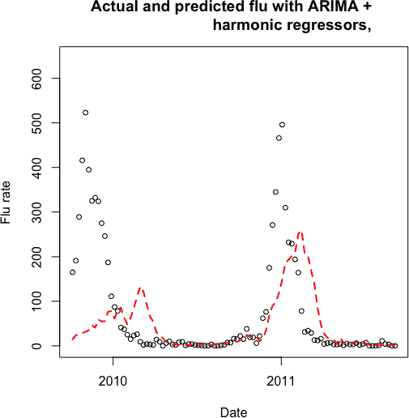

###### 图 13-7\. 显示实际流感率（点）与我们的 ARIMA + 动态谐波回归模型预测（虚线）的图表。

一个解释问题的原因是，规律性的季节性并不是流感的季节性的一个好描述。根据疾病控制和预防中心（CDC）的说法，在美国，流感可能在每年冬季的 12 月至 3 月间出现高峰。我们可以在测试数据中看到这一点。考虑下面的代码和图 13-8 中的图，这些识别了数据测试范围内的峰值：

```
## R
> plot(test$flu.rate)
> which(test$flu.rate > 400)
Error in which(res$flu.rate > 400) : object 'res' not found
> which(test$flu.rate > 400)
[1]   1  59 108 109 110 111 112 113
> abline(v = 59)
> which.max(test$flu.rate)
[1] 109
> abline(v = 109)

```

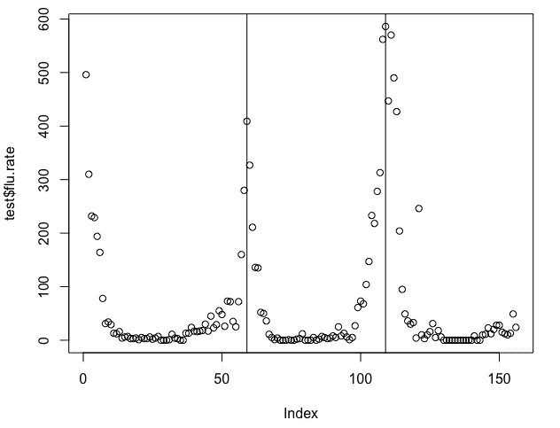

###### 图 13-8\. 仅显示流感测试值及其明显峰值位置的图。

峰值出现在索引 59 和 109 处，相距 50 周（而不是 52 周）。此外，出现在索引 59 处的峰值至少比上一个峰值晚了 59 周，而且可能更久，因为我们的图中没有完整展示索引=0 周围的峰值情况。

在一个案例中，样本峰值间距超过 59 周，在另一个案例中为 50 周，我们可以看到年度间存在相当大的变异性。我们的动态谐波回归没有考虑到这一点，它比 SARIMA 模型具有更严格的季节性模型，因为后者的季节性行为会随着时间变化。假设与数据之间的这种不匹配可能在很大程度上解释了这个模型的性能不佳，使用一个不好的模型实际上引起了我们对数据一个重要特征的注意，这是我们之前没有注意到的。

尽管性能不佳，这个替代模型在几个方面已经证明是有用的。它向我们展示了将系统的物理限制纳入数据预处理的价值，例如通过对数转换。它还向我们展示了尝试在每个时间点选择带有模型背后理论的几类模型的价值。我们选择了这个模型来简化我们的季节性，但我们发现，很可能，无论是 SARIMA 还是动态谐波回归季节性模型都不是这个系统的很好选择。

## 流感预测的技术水平是什么？

我们刚刚探讨的模型在进行巴黎大都会区流感率的短期预测或现场预测方面相对简单但相当有效。这些模型是开始了解数据集并认识到在嘈杂但复杂的系统中什么东西可能具有预测能力的良好起点，例如在特定地理区域的流感中。

将我们简单的方法与目前政府机构部署的一些尖端方法或最近学者们发表的讨论当前技术水平的方法进行比较是很有趣的。接下来，我将简要概述当前流感预测的工作情况以及研究人员近年来发展的试图改进传统模型的新方法。

### 流感预测研究

疾病控制与预防中心（CDC）积极鼓励研究人员从事流感预测研究，甚至赞助一个[R 包](https://perma.cc/TDX8-4Z7T)来使其数据更容易获取。五年多来，CDC 还主办了流感预测竞赛，尽管直到 2017-2018 流感季节才将流感预测正式纳入其官方通讯和公告中。来自卡内基梅隆大学的 Delphi 研究小组迄今赢得了大多数竞赛，并使用他们描述的三种不同方法预测流感：

+   一种[经验贝叶斯方法](https://perma.cc/8EBA-GN2C)，将过去的流感季节数据应用到一系列操作中，形成当前季节数据的先验，基于过去流感季节时间序列的总体“形状”。

+   一个[众包平台](https://perma.cc/XDE9-A9Y4)，任何人都可以提交对流感率的预测。

+   一种现在预测方法，利用[*传感器融合*](https://perma.cc/NGZ8-TD39)，聚合来自多个来源的数据，例如维基百科访问计数和相关 Twitter 查询，以生成地理位置化的流感预测。

这是仅仅一个学术研究团队中使用的多种方法集合！如果我们进一步观察学术界，我们会看到更多的多样性：

+   使用深度卷积网络（CNNs）对 Instagram 图片进行分类，并将这些 CNN 的输出与来自 Twitter 的文本相关特征一起作为各种机器学习模型（包括`XGBoost`树）的输入。一篇名为[paper](https://perma.cc/N39F-GSL5)的论文因专注于小型语言社区（芬兰语使用者）而具有优势，这使得可以在一定程度上区域特定地使用主流社交媒体平台。

+   识别大型社交媒体群集中可靠用户。一篇名为[paper](https://perma.cc/25GR-MHRK)的论文专注于通过找到在社交媒体平台上位置最佳且最值得信赖的用户来改进流感预测。

+   访问电子健康记录以获取更完整和补充的数据源，除了公开可用数据。一篇名为[paper](https://perma.cc/Q8B7-5TC4)的论文表明，通过将电子健康记录整合到预测输入流中，可以在多个时间尺度上极大提高预测准确性。不幸的是，这很难安排，并且表明准确的流感预测能力将落入富有的数据持有者手中，而不是最有创造力的研究人员手中（尽管有时二者可能是同一个人）。

从解决这一问题的多样化方法可以看出，有许多途径可以进行流感预测，目前没有一个方法是绝对胜出的。尽管一些更好的策略已经被应用于政府使用和公共信息，但这仍然是一个积极的研究和发展领域。

我们在这里的讨论只是冰山一角。决定流感季节走向涉及大量的生物学、社会学、医学和经济政策，还有各种不同的模型，这些模型不仅仅是面向时间序列分析，还包括其他流感行为方面的导向。时间序列为这个非常复杂的主题提供了一个丰富的视角。

# 预测血糖水平

在健康应用的时间序列数据的机器学习研究的另一个活跃领域是预测个体患者的血糖水平。糖尿病患者自己经常进行这种预测，特别是如果他们有一定程度的疾病需要在餐时注射胰岛素的话。在这种情况下，糖尿病患者需要估计他们即将食用的食物将如何影响他们的血糖，并相应地调整剂量。

同样地，糖尿病患者必须根据时间安排饮食和药物，以优化血糖水平，最好保持在特定范围内，既不过高也不过低。除了需要考虑诸如进食和运动等影响血糖的活动外，糖尿病患者还需考虑特定的一天中时间的影响。例如，[黎明现象](https://perma.cc/GE3B-MAKY)是所有人都会出现的血糖上升，但对糖尿病患者可能成为问题。另一方面，对于 1 型糖尿病患者来说，在睡眠时间内的血糖过低可能是生命威胁性事件，由于未能准确预测而导致。

在这里，我们查看一个小型数据集：一个个体的自我报告连续血糖监测（CGM）数据，分布在几个不连续的时间段内。这些数据是在互联网上自行发布的，并进行了修改以保护患者的隐私。

获取糖尿病数据集还有其他选择。除了大型医疗机构和一些拥有大量连续血糖监测数据的初创公司外，随着个体越来越多地通过 DIY 方法管理糖尿病，还有许多自行发布的数据集可供使用，例如[Night Scout 项目](https://perma.cc/N42T-A35K)。此外，还有几个糖尿病[CGM 数据集](https://perma.cc/RXG2-CYEE)可供研究目的使用。

在本节中，我们将探索真实数据集的混乱，并尝试对该数据进行预测。

## 数据清理和探索

数据存储在本书的几个文件中，可以在这本书的[GitHub 存储库](https://github.com/PracticalTimeSeriesAnalysis/BookRepo)中找到。我们首先加载这些文件并将它们合并为一个`data.table`：

```
## R
> files <- list.files(full.names = TRUE)
> files <- grep("entries", files, value = TRUE)
> dt    <- data.table()
> for (f in files) {
>   dt <- rbindlist(list(dt, fread(f)))
> }
> 
> ## remove the na columns
> dt <- dt[!is.na(sgv)]

```

有日期信息的字符串可用，但我们没有适当的时间戳类列，因此我们使用现有的信息制作一个，包括时区和日期字符串：

```
## R
> dt[, timestamp := as.POSIXct(date)] 
> ## this works for me because my computer is on EST time
> ## but that might not be true for you
> 
> ## proper way
> dt[, timestamp := force_tz(as.POSIXct(date), "EST")]
> 
> ## order chronologically
> dt = dt[order(timestamp, decreasing = FALSE)]

```

然后我们检查数据的后处理：

```
## R
> head(dt[, .(date, sgv)])
                  date sgv
1: 2015-02-18 06:30:09 162
2: 2015-02-18 06:30:09 162
3: 2015-02-18 06:30:09 162
4: 2015-02-18 06:30:09 162
5: 2015-02-18 06:35:09 154
6: 2015-02-18 06:35:09 154

```

存在许多重复的数据条目，因此我们需要出于两个原因进行清理：

+   事先没有理由认为某些数据点应该比其他数据点更优越或更高权重，但是重复会产生这样的效果。

+   如果我们要基于时间序列窗口生成特征，如果存在重复的时间点，这些特征将是没有意义的。

我们首先看看是否可以通过删除所有完全重复的行来解决这个问题：

```
## R
> dt <- dt[!duplicated(dt)]

```

然而，我们不应假设这解决了问题，所以我们检查是否存在相同时间戳的非相同数据点：

```
## R
> nrow(dt)
[1] 24861
> length(unique(dt$timestamp))
[1] 23273
> ## we still have duplicated data as far as timestamps
> ## we will delete them

```

由于我们仍然有重复的时间点，我们进行一些数据审查以查看其含义。我们确定具有最多重复行的时间戳，并检查这些行：

```
## R
> ## we can identify one example using
> ## dt[, .N, timestamp][order(N)]
> ## then look at most repeated data
> dt[date == "2015-03-10 06:27:19"]
device                date                   dateString sgv direction type
1: dexcom 2015-03-10 06:27:19 Tue Mar 10 06:27:18 EDT 2015  66      Flat  sgv
2: dexcom 2015-03-10 06:27:19 Tue Mar 10 06:27:18 EDT 2015  70      Flat  sgv
3: dexcom 2015-03-10 06:27:19 Tue Mar 10 06:27:18 EDT 2015  66      Flat  sgv
4: dexcom 2015-03-10 06:27:19 Tue Mar 10 06:27:18 EDT 2015  70      Flat  sgv
5: dexcom 2015-03-10 06:27:19 Tue Mar 10 06:27:18 EDT 2015  66      Flat  sgv
6: dexcom 2015-03-10 06:27:19 Tue Mar 10 06:27:18 EDT 2015  70      Flat  sgv
7: dexcom 2015-03-10 06:27:19 Tue Mar 10 06:27:18 EDT 2015  66      Flat  sgv
8: dexcom 2015-03-10 06:27:19 Tue Mar 10 06:27:18 EDT 2015  70      Flat  sgv
## more inspection suggests this is not too important

```

从这些数值来看，我们可以看到报告的血糖值是不同的，但它们并不是完全不同¹⁰，所以我们会抑制重复的时间戳，即使它们并非完全相同¹¹。

```
## R
> dt <- unique(dt, by=c("timestamp"))

```

现在我们有了正确的时间戳和每个时间戳的单一值，我们可以绘制我们的数据并了解其范围和行为（参见 图 13-9）。

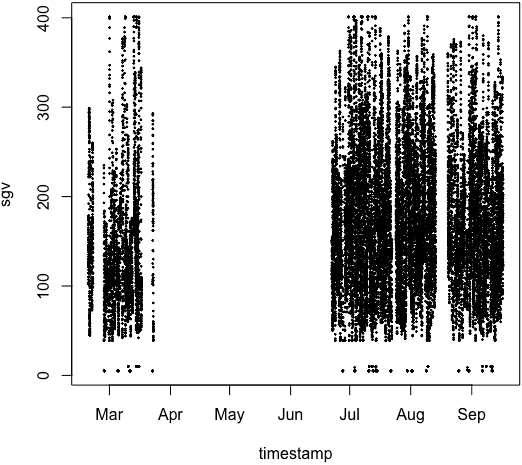

###### 图 13-9\. 这个天真的时间序列图显示了可用数据的全时域和值范围。不幸的是，数据在时间上分布很广且不连贯，这个图并不能给我们一个关于系统行为的良好理解。

我们放大到我们在时间序列早期看到的时期，即 2015 年 3 月（参见 图 13-10）：

```
## R
> ## let's look at some shorter time windows in the data
> start.date <- as.Date("2015-01-01")
> stop.date  <- as.Date("2015-04-01")
> dt[between(timestamp, start.date, stop.date), 
>              plot(timestamp, sgv, cex = .5)]

```

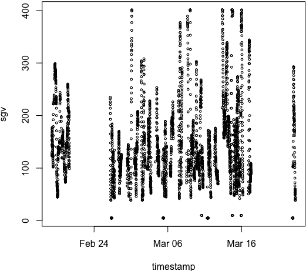

###### 图 13-10\. 关注时间序列的特定段落更有帮助，但对于我们理解任何时间序列动态来说仍然太过压缩。我们应该在时间轴上进一步放大。

即使在仅仅显示三月日期的图中，我们仍然无法理解时间序列的行为。是否有季节性？漂移？日常模式？我们不知道，因此我们绘制了一个更短的时间窗口（参见 图 13-11）：

```
## R
> ## also look at a single day to see what that can look like
> ## if we had more time we should probably do 2D histograms of days
> ## and see how that works
> par(mfrow = c(2, 1))
> start.date = as.Date("2015-07-04")
> stop.date  = as.Date("2015-07-05")
> dt[between(timestamp, start.date, stop.date), 
>               plot(timestamp, sgv, cex = .5)]
> 
> start.date = as.Date("2015-07-05")
> stop.date  = as.Date("2015-07-06")
> dt[between(timestamp, start.date, stop.date), 
>                plot(timestamp, sgv, cex = .5)]
> ## if we had more days we could probably do some "day shapes"
> ## analysis, but here we don't seem to have enough data

```

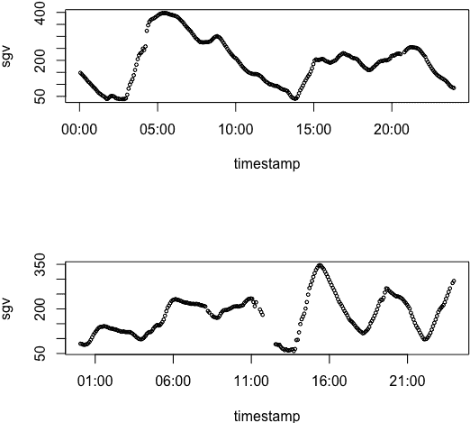

###### 图 13-11\. 展示了七月份两天的数据。我们可以看到某种日常模式正在形成。最后，我们在一个时间尺度上观察数据，这样人眼可以理解正在发生的事情。

通过更多的探索性绘图（留给读者作为练习），您应该对数据的规模、质量动态以及描述其行为的重要性有直观的理解。您应该对此数据集应用的一些进一步的探索技术包括：

+   日长度的二维直方图，用于查找一天内的模式，以及相关的聚类练习。是否存在不同类型的日子？

+   根据一天中的小时或一年中的季节进行分组统计，以寻找时间上的系统差异。

+   平滑数据以寻找长期趋势，特别是比较一天之间的关系，而不是一天内的关系。开发超长期血糖预测将是有价值的，这只能通过超越更明显的一天内模式来实现。

## 生成特征

有了一些背景知识，以及我们对数据集的简要探索的观察，我们可以为我们的数据生成有助于预测血糖的特征。

我们从时间本身的特征化开始。例如，我们注意到一天中有一定的结构，这表明一天中的时间应该与预测相关。同样，如果你绘制不同月份的血糖时间序列数据，一些月份显示的方差比其他月份大。¹² 我们在这里生成了一些与时间相关的特征（见图 13-12）：

```
## R
> ## we should consider putting in a feature for month of the year.
> ## perhaps there are seasonal effects
> dt[, month := strftime(timestamp, "%m")]
> 
> dt[, local.hour := as.numeric(strftime(timestamp, "%H"))]
> ## we notice some hours of the day are greatly overrepresented
> ## this person is not consistently wearing the device or perhaps
> ## the device has some time of day functionality or recordkeeping
> ## issues. since it is a weird peak at midnight, this seems to 
> ## suggest the device rather than a user (who puts device both 
> ## on and off at midnight?)
> 
> hist(dt$local.hour)

```

我们还考虑时间序列值的特质，而不仅仅是数据收集的时间戳。例如，我们可以看到平均血糖浓度随一天中的时间变化（见图 13-13）：

```
## R
> ## blood glucose values tend to depend on the time of day
> plot(dt[, mean(sgv), local.hour][order(local.hour)], type = 'l', 
>        ylab = "Mean blood glucose per local hour", 
>        xlab = "Local hour")
```

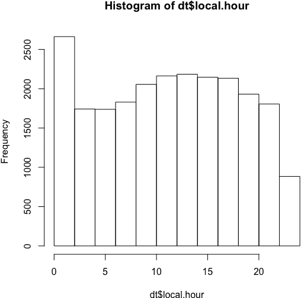

###### 图 13-12。从本地小时的直方图中我们可以看出，CGM 收集和报告数据的时间并不是随机的。午夜附近的高度集中还表明了报告或设备功能上的不规则性，这很可能不是由用户行为引起的（用户不太可能在那个时候操纵他们的设备）。

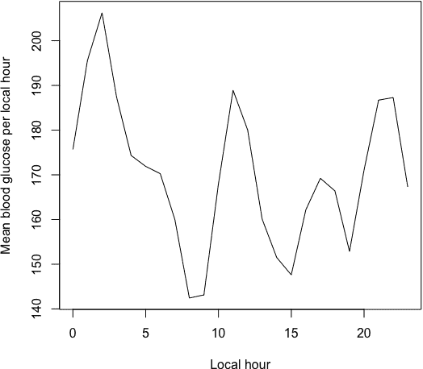

###### 图 13-13。平均血糖浓度在一天中显著变化。

血糖值的数据中还有其他有趣的数据。数据集中名为`direction`的列从 CGM 设备中提取信息，应用制造商的专有软件，并为数据提供方向趋势标签。我们可以使用这一点而不是计算自己的趋势统计，因此我们试图稍微理解一下，例如询问不同小时是否有不同的趋势。

我们定义一个函数，它将为给定向量提供第 n 个最流行的标签，并且我们首先使用它来找到每个本地小时的最流行标签：

```
## R
> nth.pos = function(x, pos) {
>   names(sort(-table(x)))[pos] 
>   ## this code snippet thanks to r user group
> }
> dt[, nth.pos(direction, 1), local.hour][order(local.hour)]
    local.hour   V1
 1:          0 Flat
 2:          1 Flat
 3:          2 Flat
 ...
21:         20 Flat
22:         21 Flat
23:         22 Flat
24:         23 Flat
    local.hour   V1

```

全天最流行的方向标签是“flat”，这让人感到放心，因为如果趋势仅仅可以通过一天中的时间强烈预测，系统的动态将是可疑的。

然而，一天中每小时第二常见的方向标签确实随时间变化，我们可以在这里看到：

```
## R
> dt[, nth.pos(direction, 2), local.hour][order(local.hour)]
    local.hour            V1
 1:          0   FortyFiveUp
 2:          1   FortyFiveUp
 3:          2   FortyFiveUp
 4:          3 FortyFiveDown
 5:          4 FortyFiveDown
 6:          5   FortyFiveUp
 7:          6 FortyFiveDown
 8:          7 FortyFiveDown
 9:          8 FortyFiveDown
10:          9   FortyFiveUp
11:         10   FortyFiveUp
12:         11 FortyFiveDown
13:         12 FortyFiveDown
14:         13 FortyFiveDown
15:         14 FortyFiveDown
16:         15 FortyFiveDown
17:         16   FortyFiveUp
18:         17   FortyFiveUp
19:         18 FortyFiveDown
20:         19   FortyFiveUp
21:         20   FortyFiveUp
22:         21   FortyFiveUp
23:         22   FortyFiveUp
24:         23 FortyFiveDown
    local.hour            V1

```

有趣的是，我们可以将这些标签与我们在前一节中包含的一天内数据图进行交叉引用。结果是否匹配？（读者留作练习）

接下来我们解决一个可能具有预测性的数字标签，即最近时间窗口内血糖测量的方差。我们计算一个短期回溯窗口的标准差。

为此，我们必须考虑数据的非连续性。我们不想计算时间表中不相邻但在`data.table`中仅相邻的数据点的标准差。我们将计算目标窗口起始点和结束点之间的时间差，以确保它们是正确的时间尺度，但我们需要小心处理。以下是我们可能会出错的一个例子：

```
## R
> ## FIRST don't do this the wrong way
> ## Note: beware calculating time differences naively!
> as.numeric(dt$timestamp[10] - dt$timestamp[1])
[1] 40
> as.numeric(dt$timestamp[1000] - dt$timestamp[1])
[1] 11.69274
> dt$timestamp[1000] - dt$timestamp[1]
Time difference of 11.69274 days

```

时间差可能以不同的单位返回，这会使前面代码的结果变得毫无意义。计算时间差的正确方法，以及我们如何使用这个时间差来确定给定行的标准差计算的有效性，如下所示：

```
## R
> dt[, delta.t := as.numeric(difftime(timestamp, shift(timestamp, 6), 
>                                    units = 'mins'))]
> dt[, valid.sd := !is.na(delta.t) & delta.t < 31]
> dt[, .N, valid.sd]
valid.sd     N
1:    FALSE  1838
2:     TRUE 21435

```

一旦我们标记了适合进行标准差计算的行，我们就开始进行计算。我们在所有行上进行计算，并计划用列平均值覆盖无效值，作为简单的缺失值插补方法：

```
## R
> dt[, sd.window := 0]
> for (i in 7:nrow(dt)) {
>   dt[i, ]$sd.window = sd(dt[(i-6):i]$sgv)
> }
> ## we will impute the missing data for the non-valid sd cases
> ## by filling in the population mean  (LOOKAHEAD alert, but we're aware)
> imputed.val = mean(dt[valid.sd == TRUE]$sd.window)
> dt[valid.sd == FALSE, sd.window := imputed.val]

```

接下来，我们设置了一个列来确定我们应该为我们的预测目标选择的真实值。我们选择预测血糖值提前 30 分钟，这足以在预测到血糖危险高或低时提醒糖尿病患者。我们将目标预测值放入名为`target`的列中。我们还创建了另一个名为`pred.valid`的列，该列指示在我们希望进行预测之前的数据点是否足够完整（即，在前 30 分钟以 5 分钟间隔定期采样）：

```
## R
> ## now we also need to fill in our y value
> ## the actual target
> ## this too will require that we check for validity as when 
> ## computing sd due to nontemporally continuous data sitting 
> ## in same data.table. let's try to predict 30 minutes ahead 
> ## (shorter forecasts are easier)
> 
> ## we shift by 6 because we are sampling every 5 minutes
> dt[, pred.delta.t := as.numeric(difftime(shift(timestamp, 6, 
>                                                type = "lead"), 
>                                          timestamp, 
>                                          units = 'mins'))]
> dt[, pred.valid := !is.na(pred.delta.t) & pred.delta.t < 31]
> 
> dt[, target := 0]
> for (i in 1:nrow(dt)) {
>   dt[i, ]$target = dt[i + 6]$sgv
> }

```

我们抽查我们的工作，看看它是否产生了合理的结果：

```
## R
> ## now we should spot check our work
> i = 300
> dt[i + (-12:10), .(timestamp, sgv, target, pred.valid)]
              timestamp sgv target pred.valid
 1: 2015-02-19 16:15:05 146    158       TRUE
 2: 2015-02-19 16:20:05 150    158       TRUE
 3: 2015-02-19 16:25:05 154    151      FALSE
 4: 2015-02-19 16:30:05 157    146      FALSE
 5: 2015-02-19 16:35:05 160    144      FALSE
 6: 2015-02-19 16:40:05 161    143      FALSE
 7: 2015-02-19 16:45:05 158    144      FALSE
 8: 2015-02-19 16:50:05 158    145      FALSE
 9: 2015-02-19 17:00:05 151    149       TRUE
10: 2015-02-19 17:05:05 146    153       TRUE
11: 2015-02-19 17:10:05 144    154       TRUE
12: 2015-02-19 17:15:05 143    155       TRUE
13: 2015-02-19 17:20:05 144    157       TRUE
14: 2015-02-19 17:25:05 145    158       TRUE
15: 2015-02-19 17:30:05 149    159       TRUE
16: 2015-02-19 17:35:05 153    161       TRUE
17: 2015-02-19 17:40:05 154    164       TRUE
18: 2015-02-19 17:45:05 155    166       TRUE
19: 2015-02-19 17:50:05 157    168       TRUE
20: 2015-02-19 17:55:05 158    170       TRUE
21: 2015-02-19 18:00:04 159    172       TRUE
22: 2015-02-19 18:05:04 161    153      FALSE
23: 2015-02-19 18:10:04 164    149      FALSE
              timestamp sgv target pred.valid

```

仔细看看这个输出。其中的某些内容可能会让你质疑我们在评估“有效性”计算最近窗口的血糖数据标准差时是否太苛刻。作为一个独立的练习，看看你能否发现这些点，并思考如何重新设计`pred.valid`标签，使其更正确地包含。

现在我们有了大量的特征和一个用于训练模型的目标值，但我们还没有生成所有的特征。我们应该简化我们已经生成的一些时间特征，以减少模型的复杂性。例如，而不是将本地小时作为输入的 23 个二进制值（每天的每小时减去一个），我们应该减少“小时”类别的数量。我们可以这样做：

```
## R
> ## Let's divide the day into quarters rather than 
> ## into 24-hour segments. We do these based on a notion 
> ## of a 'typical' day 
> dt[, day.q.1 := between(local.hour,  5, 10.99)]
> dt[, day.q.2 := between(local.hour, 11, 16.99)]
> dt[, day.q.3 := between(local.hour, 17, 22.99)]
> dt[, day.q.4 := !day.q.1 & !day.q.2 & !day.q.3] 

```

我们还将月份数据简化为一组更简单的类别：

```
## R
> ## let's have a "winter/not winter" label rather than 
> ## a month label. this decision is partly based on the 
> ## temporal spread of our data
> dt[, is.winter := as.numeric(month) < 4]

```

最后，要使用`direction`列，我们需要对该值进行独热编码，就像我们对不同时间的处理方式一样。我们还清理了一些不一致标记的特征（`"NOT COMPUTABLE"`与`"NOT_COMPUTABLE"`）：

```
## R
> ## we also need to one-hot encode a direction feature
> ## and clean that data somewhat
> dt[direction == "NOT COMPUTABLE", direction := "NOT_COMPUTABLE"]
> dir.names = character()
> for (nm in unique(dt$direction)) {
>   new.col = paste0("dir_", nm)
>   dir.names = c(dir.names, new.col)
>   dt[, eval(parse(text = paste0(new.col, " := 
 (direction == '", nm, "')")))]
> }

```

现在我们已经对相关特征进行了独热编码，并简化了其他特征，所以我们准备将这些特征引导到模型中。

## 拟合模型

最后，我们开始进行时间序列分析中有趣的部分：做出预测。

# 模型建模需要花费多少时间？

正如您在本章的两个真实模型中看到的那样，真实世界的数据是混乱的，每次清理都必须以领域知识和常识为基础进行。没有通用模板。然而，您应该始终小心谨慎，不要急于适应模型。我们只想在确信我们没有投入垃圾数据时才适应模型！

我们的首要任务是创建训练和测试数据集：¹³

```
## R
> ## we need to set up training and testing data
> ## for testing, we don't want all the testing to come 
> ## at end of test period since we hypothesized some of behavior
> ##  could be seasonal let's make the testing data
> ##  the end data of both "seasons"
> winter.data      <- dt[is.winter == TRUE]
> train.row.cutoff <- round(nrow(winter.data) * .9)
> train.winter     <- winter.data[1:train.row.cutoff]
> test.winter      <- winter.data[(train.row.cutoff + 1): nrow(winter.data)]
> 
> spring.data      <- dt[is.winter == FALSE]
> train.row.cutoff <- round(nrow(spring.data) * .9)
> train.spring     <- spring.data[1:train.row.cutoff]
> test.spring      <- spring.data[(train.row.cutoff + 1): nrow(spring.data)]
> 
> train.data <- rbindlist(list(train.winter, train.spring))
> test.data  <- rbindlist(list(test.winter,  test.spring))
> 
> ## now include only the columns we should be using
> ## categorical values: valid.sd, day.q.1, day.q.2, day.q.3, is.winter 
> ## plus all the 'dir_' colnames
> col.names <- c(dir.names, "sgv", "sd.window", "valid.sd", 
>               "day.q.1", "day.q.2", "day.q.3", "is.winter")
> 
> train.X <- train.data[, col.names, with = FALSE]
> train.Y <- train.data$target
> 
> test.X <- test.data[, col.names, with = FALSE]
> test.Y <- test.data$target

```

与许多前沿工作一致，我们选择`XGBoost`梯度提升树作为我们的模型。在最近的出版物中，这些模型在某些用例中达到或超过了血糖预测的最新标准：¹⁴

```
## R
> model <- xgboost(data = as.matrix(train.X), label = train.Y, 
>                     max.depth = 2, 
>                     eta       = 1, 
>                     nthread   = 2, 
>                     nrounds   = 250, 
>                     objective = "reg:linear")
> y.pred <- predict(model, as.matrix(test.X))

```

然后我们可以检查这次预测的结果（见图 13-14）。我们还看了我们对特定一天的预测（见图 13-15）：

```
## R
> ## now let's look at a specific day
> test.data[date < as.Date("2015-03-17")]
> par(mfrow = c(1, 1))
> i <- 1
> j <- 102
> ylim <- range(test.Y[i:j], y.pred[i:j])
> plot(test.data$timestamp[i:j], test.Y[i:j], ylim = ylim)
> points(test.data$timestamp[i:j], y.pred[i:j], cex = .5, col = 2)

```

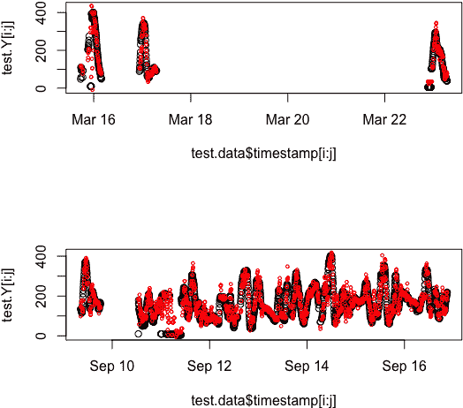

###### 图 13-14\. 在这么大的尺度上，我们的预测看起来不错，但是从这么远的距离看很难判断。这不是使用预测的人会体验到的方式。

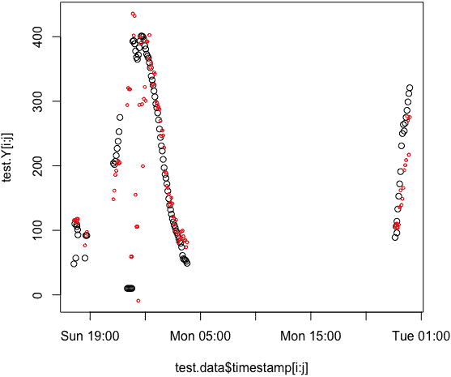

###### 图 13-15\. 逐日检查可以更好地了解我们预测算法的工作效果。

预测看起来合理，但这个图表表明底层数据可能存在问题。周日到周一之间午夜时的这个点看起来异常低，特别是其邻近点并不低。更可能是设备故障，而不是某人经历了如此剧烈但短暂的低血糖。我们可能需要考虑更多数据清理，或者也许是添加额外标签来表明这些特定点看起来可疑。¹⁵ 我们的模型预测这些可能无效的低血糖数据点，可能是过拟合的迹象。我们希望我们的模型预测实际的血糖值，而不是设备故障。

此时，我们应该考虑我们算法的目标。如果我们仅想展示我们能在半小时内做出合理的血糖预测——甚至没有知道某人正在吃什么或者何时锻炼的好处——我们已经可以说“任务完成”。这已经相当了不起——令人印象深刻的是，我们可以在没有相关输入（如饮食和运动信息）的情况下做出合理的预测。

然而，我们主要的目标是预测会提醒人们危险的预测——即他们的血糖将过低或过高的时候。让我们专注于这些数据点，同时考虑我们的预测与测量值的比较。

重要的是，我们将高血糖和低血糖值分开绘制。如果将它们绘制在一起，我们将看到一个看似高相关性的人工哑铃形状分布的高低点（见图 13-16）：

```
## R
> par(mfrow = c(2, 1))
> high.idx = which(test.Y > 300)
> plot(test.Y[high.idx], y.pred[high.idx], xlim = c(200, 400), 
>                                          ylim = c(200, 400))
> cor(test.Y[high.idx], y.pred[high.idx])
[1] 0.3304997
> 
> low.idx = which((test.Y < 60 & test.Y > 10))
> plot(test.Y[low.idx], y.pred[low.idx], xlim = c(0, 200), 
>                                        ylim = c(0, 200))
> cor(test.Y[low.idx], y.pred[low.idx])
[1] 0.08747175

```

这些图表更加严格地评估了我们模型的表现。特别令人关注的是，该模型在低血糖水平下表现不佳。这可能是因为危险低血糖发生率较低，所以模型没有太多机会进行训练。我们应考虑数据增强或重新采样，以找到使这种现象对我们的模型更加显著的方法。我们还可以修改我们的损失函数，更加重视我们数据中已有的示例。

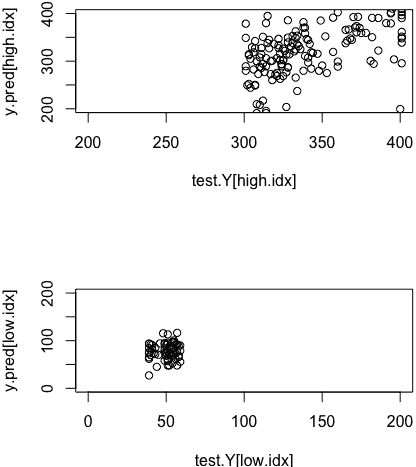

###### 图 13-16。绘制预测值与实际值在极端端点处的对比图。在顶部，我们绘制高测量血糖值相互之间的值，底部是低测量血糖值。

在这里，我们看到了一个案例，初始模型的预测看起来令人满意，但可能并没有实现模型最基本的目的。在这种情况下，我们可以预测一般的血糖趋势，但我们应该更多地预测高低血糖，特别是关注血糖严重低下的情况。

在这种情况下，就像流感预测一样，我们看到了常识对建模时间序列的重要性。我们不能盲目地清理数据或准备特征，而不考虑它们在上下文中的含义。同样，我们对时间序列领域的了解越多，比如理解时间对人类血糖的重要性，我们就越能够清理数据、准备特征，并检查我们的预测在重要的成功或失败案例中的表现。

# 更多资源

Vasileios Lampos 等人，[“利用搜索查询日志进行流感样疾病率的现场预测进展,”](https://perma.cc/NQ6B-RUXF) *科学报告* 5 卷，第 12760 号（2015 年），https://perma.cc/NQ6B-RUXF。

这篇 2015 年《自然通讯》论文非常易懂，既是流感现场预测的良好介绍，也是一篇历史性的文章，展示了大数据和实时社交媒体以及互联网数据输入如何革新了现场预测和预报。作者们运用传统的线性模型和创新的非线性模型来比较不同的方法，并展示了在季节性传染病率这样复杂系统中非线性模型的实用性。

大卫·法罗，[“模拟流感的过去、现在和未来,”](https://perma.cc/96CZ-5SX2) 卡内基梅隆大学计算生物学系博士论文，2016 年，https://perma.cc/96CZ-5SX2。

这篇论文详细阐述了“传感器融合”的理论和实践，用于整合各种地理和时间粒度的社交媒体来源，以制定 Delphi 小组的主要流感预测之一。它提供了从病毒学到人口动态再到数据科学实验的深入预测流感的概述。

Rob J. Hyndman，《动态回归》，讲义，无日期，https://perma.cc/5TPY-PYZS。

这些讲义提供了如何使用动态回归来补充传统统计预测模型的实际示例，当 SARIMA 不适合时，可以使用一系列替代模型来处理季节性，通常是因为周期性太复杂或周期相对于可用数据或计算资源来说太长。

¹ 虽然这不是公共数据集，但可以通过注册参加竞赛来访问数据。

² 选择一周的第几天（选项为 1 到 7）作为起始日取决于计算流感率的具体日期，但从提供的数据中我们无法知道这一点。出于简便起见，我们选择第一天。在这种情况下选择最后一天也同样合理，只要我们在分析中保持一致即可。

³ 一年中的周数和星期几的适当格式化字符串可能取决于您的操作系统。我的解决方案在 macOS 上有效，而在 Linux 上我使用了稍微不同的格式。

⁴ 如果我们在处理大数据集时，应将此作为第一步，以避免计算负担较重的操作，例如将字符串转换为`Date`对象，对于无关数据而言。

⁵ 这并非确保数据定期采样和完整性的唯一必要检查。我将其余部分留给你。

⁶ 通常情况下，你应该单独考虑它们，但这里它们被合并以简洁表达。

⁷ 傅立叶级数是将函数描述为一系列正弦和余弦函数的实践。我们之前曾提及过傅立叶级数。如果您对傅立叶级数不熟悉，请考虑花几分钟了解其背景。在 R 和 Python 包中广泛提供了将傅立叶级数“拟合”到任何时间序列的方法。Ritchie Vink 有一个我非常喜欢的[简短教程](https://perma.cc/7HJJ-HC2T)。

⁸ 这些在第三章中简要讨论过。

⁹ 要测试这个解释是否适合当前情况，您可以使用模拟生成一些合成数据，以测试使用此模型的替代数据集时，流感数据似乎表明的周期性行为是否会导致外生谐波回归模型失败。

¹⁰ 在美国的测量单位系统中，血糖仪的接受误差通常约为 15，而这些数字使用了该系统。

¹¹ 除了抑制之外，还有其他选项。你可以自己探索这些选项。

¹² 所有这些观察结果都应以高度怀疑的态度看待。这个数据集只包含来自单个用户在部分一年内的数据，并且数据并不连续。这意味着即使我们有诱惑去推测，我们也不能就季节性得出结论。尽管如此，为了适应我们拥有的有限数据，我们将考虑这些时间组件。

¹³ 在实践中，对于较大的数据集，你还需要设置一个验证测试集，这将是你的训练数据的一个特殊子集，类似于测试数据但不会污染你的实际测试数据。正如测试数据通常应该是最近的数据（以防止未来信息向后泄漏，例如前瞻性），在这种情况下，验证数据集应该在训练期末出现。考虑自行设置这一点，以探索模型的超参数。

¹⁴ 这里我们不调整超参数（这需要一个验证数据集），但一旦你确定了一般的建模流程，这是你应该在 XGBoost 中做的事情。

¹⁵ 一个想法是以时间序列感知的方式应用异常值检测，以注意到这些点与该时间窗口的一般趋势不符。在某些情况下，我们还可以使用基础物理学、化学和生物学来说明某些下降是不可能的。
