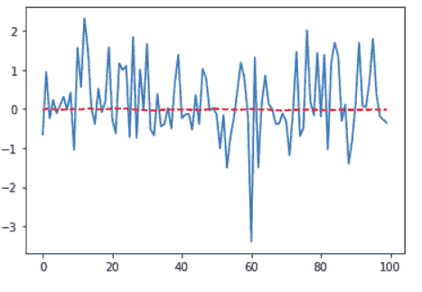

# 第十四章：金融应用

金融市场是所有时间序列数据的鼻祖。如果您在高科技交易所购买专有交易数据，您可以接收到大量数据，可能需要数天才能处理，即使使用高性能计算和尴尬并行处理也是如此。

高频交易者是金融界最新和最臭名昭著的成员之一，他们根据微秒级别的时间序列分析得出的信息和见解进行交易。另一方面，传统的交易公司——查看长期时间序列，例如几小时、几天甚至几个月——继续在市场上获得成功，表明金融数据的时间序列分析可以通过多种成功的方式和时间尺度进行，从毫秒到月份的数量级不等。

###### 注意

*尴尬并行* 描述了数据处理任务，其中处理一个数据段的结果与另一个数据段的值无关。在这种情况下，将数据分析任务转换为并行运行而不是顺序运行，以利用多核或多机计算选项是非常容易的。

例如，考虑计算给定股票的每日分钟级回报的日均值的任务。每天可以单独并行处理。相比之下，计算每日波动率的指数加权移动平均不是尴尬并行的，因为特定日的值取决于之前几天的值。有时候并不尴尬并行的任务仍然可以部分并行执行，但这取决于具体情况。

在这里，我们将通过一个经典的时间序列分析示例来进行乐趣和盈利：预测标准普尔 500 指数明天的股票回报。

# 获取和探索金融数据

如果您有特定产品或时间分辨率需要，获取金融数据可能非常困难。在这种情况下，通常需要购买数据。但是，历史股票价格可以从多种服务中广泛获取，包括：

+   雅虎财经。虽然雅虎已停止服务其历史数据 API，但可以[下载历史每日数据](https://perma.cc/RQ6D-U4JX)。¹

+   新公司，如[AlphaVantage](https://www.alphavantage.co/)和[Quandl](https://www.quandl.com)，提供股票数据的历史和实时价格信息的组合。

我们将分析限制在从 Yahoo 获取的免费提供的每日股票价格数据上。我们下载了 1990 年至 2019 年的标准普尔 500 指数数据。在以下代码中，我们看到下载数据集中的可用列，并绘制每日收盘价来开始探索我们的数据（见图 14-1）：

```
## python
>>> df = pd.read_csv("sp500.csv")
>>> df.head()
>>> df.tail()
>>> df.index = df.Date
>>> df.Close.plot()

```

我们可以看到，在覆盖 CSV 文件日期周期的开始和结束时，值明显不同。当我们查看收盘价格的完整时间序列时（见 图 14-2），这种价值变化比查看数据框中的样本时更为明显。

查看 图 14-2 可以发现，该时间序列不是平稳的。我们还可以看到可能存在不同的“制度”。由于图中清晰可见的原因，金融分析师热衷于开发识别股票价格制度转变的模型。即使我们可能没有确切的定义，不同的制度似乎存在于这些转变之间[²]。


###### 图 14-1\. CSV 文件起始和结束时的原始数据。注意，从 1990 年到 2019 年，值有明显变化——对熟悉美国金融市场历史的人来说并不奇怪。


###### 图 14-2\. 标准普尔 500 指数的日收盘价格不是平稳的时间序列。

变化点和不同制度的潜力表明，将数据集分成不同的子数据集进行单独建模可能是个好主意。然而，我们希望保持所有数据在一起，因为几十年来的日数据并不产生很多数据点；我们需要尽可能保留所有数据。我们考虑，即使我们只对未来一天的预测感兴趣，我们是否能够证明保持所有这些数据是合理的。

我们可以考虑是否归一化数据可以使不同时间段的数据可比。让我们看看在时间序列内三个不同十年的一周内缩放后的收盘价格（见 图 14-3）：

```
## python
>>> ## pick three weeks (Mon - Fri) from different years
>>> ## scale closing prices for each day by the week’s mean closing price
>>> ## 1990
>>> vals = df['1990-05-07':'1990-05-11'].Close.values
>>> mean_val = np.mean(vals)
>>> plt.plot([1, 2, 3, 4, 5], vals/mean_val)
>>> plt.xticks([1, 2, 3, 4, 5],
>>>			 labels = ['Monday', 'Tuesday', 'Wednesday', 'Thursday', 'Friday'])
>>>
>>> ## 2000
>>> vals = df['2000-05-08':'2000-05-12'].Close.values
>>> mean_val = np.mean(vals)
>>> plt.plot([1, 2, 3, 4, 5], vals/mean_val)
>>> plt.xticks([1, 2, 3, 4, 5],
>>>			 labels = ['Monday', 'Tuesday', 'Wednesday', 'Thursday', 'Friday'])
>>>
>>> ## 2018
>>> vals = df['2018-05-07':'2018-05-11'].Close.values
>>> mean_val = np.mean(vals)
>>> plt.plot([1, 2, 3, 4, 5], vals/mean_val)
>>> plt.xticks([1, 2, 3, 4, 5],
>>>			 labels = ['Monday', 'Tuesday', 'Wednesday', 'Thursday', 'Friday'])

```

我们绘制了三个不同十年内三周的收盘价，每个周的均值如前述代码所示。在一周内，每天之间的相对百分比变化似乎在几个十年间都大致相同。

这些图表显示了很大的希望。虽然收盘价格的均值和方差随时间变化很大，但图表表明一旦我们将数据归一化到给定十年的均值，随时间的行为趋势相似。

鉴于此，我们接下来考虑是否可以找到一种方法使整个时间段内的所有数据足够相似，以便用模型进行有意义的训练。我们想知道是否有一种方法可以转换数据，在金融上有意义的同时使整个时间段的数据可比。


###### 图 14-3\. 1990 年、2000 年和 2018 年 5 月的一周均值缩放后的收盘价格。

我们计算每个交易日的日收益率，即从每个交易日开始到结束的价格变动（见 图 14-4）：

```
## python
>>> df['Return'] = df.Close - df.Open
>>> df.Return.plot()
```

正如我们在图 14-4 中看到的，单独这还不足以使数据可比较。我们还必须找到一种方法，在没有前瞻性的情况下对数据进行归一化，以便我们用于模型的输入和输出值在感兴趣的时间段内更加均匀。我们将在下一节中看到如何做到这一点。


###### 图 14-4。每日收益显示随时间几乎为零的均值，但每日收益的方差在不同时间段明显变化。正是这种行为启发了 GARCH 等模型的发展，这在第六章中简要讨论过。

# 深度学习的财务数据预处理

我们的数据预处理将分三个步骤完成：

1.  我们将从原始输入中形成新的经济意义上的感兴趣的数量。

1.  我们将计算感兴趣的数量的指数加权移动平均和方差，以便我们可以在没有前瞻性的情况下对其进行缩放。

1.  我们将把我们的结果打包成适合我们将用于拟合数据的递归深度学习模型的格式。

# 金融时间序列是其自身的学科

金融时间序列是一个整体学科，数千名学者在勤奋地努力理解金融市场的运作，无论是出于利润还是智能监管。已经开发了许多统计模型来处理我们在这里涉及的金融数据的一些棘手方面，例如 GARCH 模型。如果您希望将统计学和机器学习应用于金融时间序列建模，您应该研究量化金融的历史以及常用模型的主要类别。

## 添加感兴趣的数量到我们的原始数值

我们已经在前一节中计算了每日收益。我们可以从原始输入中形成的另一个感兴趣的数量是每日*波动率*，即在交易日内记录的最高和最低价格之间的差异。给定原始数据，这可以很容易地计算出来（见图 14-6）：

```
## python
>>> df['DailyVolatility'] = df.High - df.Low
>>> df.DailyVolatility.plot()

```

就像每日收益价格是非平稳时间序列一样，每日波动率时间序列也是如此。这进一步确认了我们需要找到一种适当的方法来进行适当的缩放。我们还希望这样做而不引入前瞻性。


###### 图 14-6。每日波动率是一个正值时间序列（根据定义），在标准普尔 500 指数时间序列的不同点显示出显著不同的方差。

## 在没有前瞻性的情况下扩展感兴趣的数量

我们将预测未来一天的每日收益。一些可能有帮助的感兴趣的数量包括：

+   先前的每日收益

+   先前的每日波动率

+   先前的每日成交量

我们将通过减去指数加权移动平均值然后除以指数加权标准差来缩放这些量中的每一个。我们早期的每周数据探索显示，通过适当的预处理，我们感兴趣的各种量可以变成平稳的时间序列。

首先，我们计算数据帧中每列的指数加权移动平均，并绘制每日波动率的指数加权移动平均值（参见图 14-8）。与图 14-7 中的图相比，这个图更加平滑，因为有了平均化效果。请注意，这里有一个参数，你应该将其有效地考虑为模型的一部分，作为超参数，尽管它用于数据预处理步骤中：指数平滑的半衰期。你的模型行为肯定会依赖于这个参数：

```
## python
>>> ewdf = df.ewm(halflife = 10).mean()
>>> ewdf.DailyVolatility.plot()

```


###### 图 14-7\. 每日波动率的指数加权移动平均图比原始值的图更加平滑，但仍显示出非平稳的时间序列。

我们可以使用这个值，以及在此处计算的指数加权移动方差，按一种方式缩放感兴趣的值，以便产生随时间更一致行为的系列（参见图 14-8）：

```
## python
>>> ## compute exponentially weighted moving variance 
>>> vewdf = df.ewm(halflife = 10).var()
>>>
>>> ## scale by demeaning and normalizing
>>> scaled = df.DailyVolatility - ewdf.DailyVolatility
>>> scaled = scaled / vewdf.DailyVolatility**0.5
>>> scaled.plot()

```


###### 图 14-8\. 使用指数加权平均和方差转换数据会得到一个时间序列更加平稳的结果，从 1990 年到 2019 年整个时间段内的值可比性很高。

我们将感兴趣的三个原始输入转换为如下的缩放版本：

```
## python
>>> df['ScaledVolatility'] = ((df.DailyVolatility - 
>>>                            ewdf.DailyVolatility) 
>>>                            / vewdf.DailyVolatility**0.5 )
>>> df['ScaledReturn']     = ((df.Return - ewdf.Return) 
>>>                            / vewdf.Return**0.5 )
>>> df['ScaledVolume']     = ((df.Volume - ewdf.Volume)
>>>                           / vewdf.Volume**0.5 )

```

最后，我们丢弃由指数平滑产生的`NA`结果：³

```
## python
>>> df = df.dropna()
```

## 为神经网络格式化我们的数据

目前我们的数据存储在一个 Pandas 数据帧中，我们计划的输入与许多我们不打算使用的原始输入一起存储。另外，对于神经网络，我们将把我们的数据格式化为 TNC 格式，你可能还记得，这代表时间 × 样本数 × 通道数。因此，即使在我们已经讨论过的重新缩放工作之后，我们仍需要进行一些预处理。

首先，我们将数据分为训练和测试组件：⁴

```
## python
>>> ## break our data into training and testing components
>>> train_df = df[:7000]
>>> test_df = df[7000:]
>>>
>>> ## build our pipeline variables off training data
>>> ## taking only values of interest from larger data frames
>>> horizon = 10
>>> X = train_df[:(7000 - horizon)][["ScaledVolatility", "ScaledReturn",
                                              "ScaledVolume"]].values
>>> Y = train_df[horizon:]["ScaledReturn"].values

```

注意，在我们这里设置`Y`的基础上，存在一些问题。在继续阅读之前，请花一分钟思考一下这个问题。

这个设置的问题在于`Y`值是缩放后的回报，而不仅仅是回报。这对训练更好，因为值落在适当的范围内，但这也意味着我们预测的`Y`并不是我们感兴趣的实际回报，而是由移动平均调整过的回报。我们在预测时是在预测我们的回报与指数加权移动平均的差异。

从本质上讲，这并不是错的，但这意味着我们让任务变得比真正的预测任务更容易。我们应该意识到这一点，因此当我们的训练看起来比我们模型实际表现更好时，我们知道这部分原因是因为在训练中，我们关注一个混合任务，而最终要通过这个模型赚钱只取决于真正的预测。

我们专注于训练数据，现在需要将`X`放入递归神经网络架构所期望的 TNC 格式中。我们通过一系列 NumPy 操作来实现这一点。

最初，`X`是二维的，因为它来自 Pandas 数据框架。我们想添加第三个维度，即轴 1（因此将第二个维度推到轴 2，其中轴从 0 开始编号）：

```
## python
>>> X = np.expand_dims(X, axis = 1) 

```

我们的时间轴已经是轴 0，因为数据框架已按时间排序。最后一个轴，现在是轴 2，已经是“通道轴”，因为我们的每个输入占据该维度的一列。

我们将尝试一个模型，它将看到 10 个时间步长——即向后查看 10 天的数据。因此，我们需要截断轴 0 以长度为 10。我们每 10 行沿轴 0 进行切片，并重新组合产生的子矩阵列表，使得样本数量（即生成列表长度）成为第二轴的维度:⁵

```
## python
>>> X = np.split(X, X.shape[0]/10, axis = 0)
>>> X = np.concatenate(X, axis = 1)
>>> X.shape
(10, 699, 3)

```

根据 TNC 格式，我们有长度为 10 的时间序列，具有三个并行输入。这些中有 699 个示例。批量大小将决定一个 epoch 由多少批组成，其中一个 epoch 是对我们数据的一个循环。

鉴于我们似乎只有很少的示例，我们没有太多数据可以训练。我们是如何从 30 年的数据变得没有多少数据的呢？答案是，目前每个数据点仅包含在一个样本时间序列中。但是，每个数据点可以在 10 个不同的时间序列中，每个时间序列占据不同的位置。

这可能不是显而易见的，因此让我们看一个简单的例子。假设我们有以下时间序列：

1, 3, 5, 11, 3, 2, 22, 11, 5, 7, 9

我们希望用这个时间序列训练一个神经网络，这次假设时间窗口长度为 3。如果使用我们刚刚执行的数据准备，我们的时间序列示例将是：

+   1, 3, 5

+   11, 3, 2

+   22, 11, 5

+   7, 9, _

然而，并没有理由特别偏向我们的数据的起始点，好像必须设定每个样本时间序列的开始和结束。这些窗口是任意的。一些同样有效的时间序列，从整体中以窗口切出来，包括：

+   3, 5, 11

+   2, 22, 11

+   5, 7, 9

因此，如果我们需要更多数据，最好生成时间序列样本，因为我们在整个数据集上滑动窗口，这将产生比我们通过将数据切成不重叠时间序列样本所做的更多的个体时间序列样本。在准备自己的数据集时请记住这一点。下面，您将看到我们使用这种滑动窗口方法预处理我们的数据。

# 建立和训练一个递归神经网络

如本章开头提到的，金融时间序列模型和理解通常是非常困难的。尽管金融行业继续是西方经济的支柱，专家们一致认为预测是非常困难的。因此，我们寻找一种适合于具有潜在非线性动态的复杂系统的技术，即深度学习神经网络。然而，由于我们缺乏数据，我们选择了一个简单的递归神经网络（LSTM）架构和训练方案，具体由以下参数描述：

```
## python
>>> ## architecture parameters
>>> NUM_HIDDEN = 4
>>> NUM_LAYERS = 2
>>>
>>> ## data formatting parameters
>>> BATCH_SIZE  = 64
>>> WINDOW_SIZE = 20
>>>
>>> ## training parameters
>>> LEARNING_RATE = 1e-2
>>> EPOCHS        = 30

```

与第 10 章相比，我们使用的是 TensorFlow 软件包而不是 MXNet，这样你就可以看到另一个广泛使用的深度学习框架示例。在 TensorFlow 中，我们为网络中使用的所有量定义变量，即使是具有代表输入的变化值。对于输入，我们使用 `placeholders`，这是一种让图形知道期望形状的方法：

```
## python
>>> Xinp = tf.placeholder(dtype = tf.float32, 
>>>                           shape = [WINDOW_SIZE, None, 3])
>>> Yinp = tf.placeholder(dtype = tf.float32, shape = [None])

```

然后我们构建我们的网络并实现损失计算和优化步骤：

```
## python
>>> with tf.variable_scope("scope1", reuse=tf.AUTO_REUSE):
>>>     cells = [tf.nn.rnn_cell.LSTMCell(num_units=NUM_HIDDEN) 
>>>                                for n in range(NUM_LAYERS)]
>>>     stacked_rnn_cell = tf.nn.rnn_cell.MultiRNNCell(cells)
>>>     rnn_output, states = tf.nn.dynamic_rnn(stacked_rnn_cell, 
>>>                                            Xinp, 
>>>                                            dtype=tf.float32) 
>>>     W = tf.get_variable("W_fc", [NUM_HIDDEN, 1], 
>>>                         initializer = 
>>>                         tf.random_uniform_initializer(-.2, .2))
>>> 
>>>     ## notice we have no bias because we expect average zero return
>>>     output = tf.squeeze(tf.matmul(rnn_output[-1, :, :], W))
>>> 
>>>     loss = tf.nn.l2_loss(output - Yinp)
>>>     opt = tf.train.GradientDescentOptimizer(LEARNING_RATE)
>>>     train_step = opt.minimize(loss)

```

由于我们早前讨论过的原因，我们有一种相当复杂的数据输入方式，即每个数据点应该位于多个时间序列中，这取决于我们使用的偏移量。在这里，我们处理了与第 10 章中详细讨论的相同的数据格式化问题：

```
## python
>>> ## for each epoch
>>> y_hat_dict = {}
>>> Y_dict = {}
>>> 
>>> in_sample_Y_dict = {}
>>> in_sample_y_hat_dict = {}
>>> 
>>> for ep in range(EPOCHS):
>>>     epoch_training_loss = 0.0
>>>     for i in range(WINDOW_SIZE):
>>>         X = train_df[:(7000 - WINDOW_SIZE)][["ScaledVolatility", 
>>>                                              "ScaledReturn", 
>>>                                              "ScaledVolume"]].values
>>>         Y = train_df[WINDOW_SIZE:]["ScaledReturn"].values
>>> 
>>>         ## make it divisible by window size
>>>         num_to_unpack = math.floor(X.shape[0] / WINDOW_SIZE)
>>>         start_idx = X.shape[0] - num_to_unpack * WINDOW_SIZE
>>>         X = X[start_idx:] 
>>>         Y = Y[start_idx:]  
>>>         
>>>         X = X[i:-(WINDOW_SIZE-i)]
>>>         Y = Y[i:-(WINDOW_SIZE-i)]                                
>>>         
>>>         X = np.expand_dims(X, axis = 1)
>>>         X = np.split(X, X.shape[0]/WINDOW_SIZE, axis = 0)
>>>         X = np.concatenate(X, axis = 1)
>>>         Y = Y[::WINDOW_SIZE]
>>>         ## TRAINING
>>>         ## now batch it and run a sess
>>>         for j in range(math.ceil(Y.shape[0] / BATCH_SIZE)):
>>>             ll = BATCH_SIZE * j
>>>             ul = BATCH_SIZE * (j + 1)
>>>             
>>>             if ul > X.shape[1]:
>>>                 ul = X.shape[1] - 1
>>>                 ll = X.shape[1]- BATCH_SIZE
>>>             
>>>             training_loss, _, y_hat = sess.run([loss, train_step, 
>>>                                        output],
>>>                                        feed_dict = {
>>>                                            Xinp: X[:, ll:ul, :], 
>>>                                             Yinp: Y[ll:ul]
>>>                                        })
>>>             epoch_training_loss += training_loss          
>>>             
>>>             in_sample_Y_dict[ep]     = Y[ll:ul] 
>>>             ## notice this will only net us the last part of 
>>>             ## data trained on
>>>             in_sample_y_hat_dict[ep] = y_hat
>>>             
>>>         ## TESTING
>>>         X = test_df[:(test_df.shape[0] - WINDOW_SIZE)]
>>>                          [["ScaledVolatility", "ScaledReturn", 
>>>                            "ScaledVolume"]].values
>>>         Y = test_df[WINDOW_SIZE:]["ScaledReturn"].values
>>>         num_to_unpack = math.floor(X.shape[0] / WINDOW_SIZE)
>>>         start_idx = X.shape[0] - num_to_unpack * WINDOW_SIZE
>>>         ## better to throw away beginning than end of training 
>>>         ## period when must delete
>>>         X = X[start_idx:] 
>>>         Y = Y[start_idx:]                              
>>>         
>>>         X = np.expand_dims(X, axis = 1)
>>>         X = np.split(X, X.shape[0]/WINDOW_SIZE, axis = 0)
>>>         X = np.concatenate(X, axis = 1)
>>>         Y = Y[::WINDOW_SIZE]
>>>         testing_loss, y_hat = sess.run([loss, output],
>>>                                  feed_dict = { Xinp: X, Yinp: Y })
>>>         ## nb this is not great. we should really have a validation 
>>>         ## loss apart from testing
>>>         
>>>     print("Epoch: %d Training loss: %0.2f   
>>>            Testing loss %0.2f:" %
>>>            (ep, epoch_training_loss, testing_loss))
>>>     Y_dict[ep] = Y
>>>     y_hat_dict[ep] = y_hat

```

这里我们看到我们的训练和测试指标：

```
Epoch: 0   Training loss: 2670.27   Testing loss 526.937:
Epoch: 1   Training loss: 2669.72   Testing loss 526.908:
Epoch: 2   Training loss: 2669.53   Testing loss 526.889:
Epoch: 3   Training loss: 2669.42   Testing loss 526.874:
Epoch: 4   Training loss: 2669.34   Testing loss 526.862:
Epoch: 5   Training loss: 2669.27   Testing loss 526.853:
Epoch: 6   Training loss: 2669.21   Testing loss 526.845:
Epoch: 7   Training loss: 2669.15   Testing loss 526.839:
Epoch: 8   Training loss: 2669.09   Testing loss 526.834:
Epoch: 9   Training loss: 2669.03   Testing loss 526.829:
Epoch: 10   Training loss: 2668.97   Testing loss 526.824:
Epoch: 11   Training loss: 2668.92   Testing loss 526.819:
Epoch: 12   Training loss: 2668.86   Testing loss 526.814:
Epoch: 13   Training loss: 2668.80   Testing loss 526.808:
Epoch: 14   Training loss: 2668.73   Testing loss 526.802:
Epoch: 15   Training loss: 2668.66   Testing loss 526.797:
Epoch: 16   Training loss: 2668.58   Testing loss 526.792:
Epoch: 17   Training loss: 2668.49   Testing loss 526.788:
Epoch: 18   Training loss: 2668.39   Testing loss 526.786:
Epoch: 19   Training loss: 2668.28   Testing loss 526.784:
Epoch: 20   Training loss: 2668.17   Testing loss 526.783:
Epoch: 21   Training loss: 2668.04   Testing loss 526.781:
Epoch: 22   Training loss: 2667.91   Testing loss 526.778:
Epoch: 23   Training loss: 2667.77   Testing loss 526.773:
Epoch: 24   Training loss: 2667.62   Testing loss 526.768:
Epoch: 25   Training loss: 2667.47   Testing loss 526.762:
Epoch: 26   Training loss: 2667.31   Testing loss 526.755:
Epoch: 27   Training loss: 2667.15   Testing loss 526.748:
Epoch: 28   Training loss: 2666.98   Testing loss 526.741:
Epoch: 29   Training loss: 2666.80   Testing loss 526.734:

```

我们选择的误差度量标准并不能告诉我们整体数据与结果的匹配情况，所以绘图是有帮助的。我们绘制了在样本外表现（重要）和样本内表现（不那么重要），如 图 14-9 所示：

```
## python
>>> plt.plot(test_y_dict[MAX_EPOCH])
>>> plt.plot(test_y_hat_dict[MAX_EPOCH], 'r--')
>>> plt.show()

```



###### 图 14-9\. 测试期间某一子段的实际返回值（实线）与神经网络预测（虚线）的绘图。预测的尺度与实际数据非常不同，这使得评估模型变得困难。

我们可以看到，我们对收益的预测值通常与实际收益不一致。接下来我们检查皮尔逊相关性：

```
## python
>>> pearsonr(test_y_dict[MAX_EPOCH], test_y_hat_dict[MAX_EPOCH])
(0.03595786881773419, 0.20105107068949668)

```

如果你之前没有处理过金融时间序列，这些数字可能看起来令人沮丧。在这个行业中，尽管有图表和 *p* 值，我们的模型可能仍然有用。在金融领域，一个正相关的结果是令人兴奋的，而且可以逐步改进。实际上，许多研究项目在起步时并不能达到这样的“高”相关性。

我们可以通过将预测收益扩大一个数量级并再次绘图，来更好地了解预测是否至少在同一个方向上变化 (图 14-10)：

```
## python
>>> plt.plot(test_y_dict[MAX_EPOCH][:100])
>>> plt.plot(test_y_hat_dict[MAX_EPOCH][:100] * 50, 'r--')
>>> plt.show()

```


###### 图 14-10\. 更好地理解模型预测（虚线）与实际数据（实线）的比较。然而，由于相关性很低，我们更可能认为看到了某种模式，而实际上并非如此。因此，对于嘈杂的金融数据，定量指标比视觉评估更有用。

如果您已经阅读过有关使用深度学习处理金融时间序列的博客，您很可能会发现这里的表现令人失望。例如，您可能已经看到某人将简单的多层 LSTM 应用于某些日常股票数据，并产生几乎与实际股市数据相同的预测，即使是在样本外。这些结果看起来不错，但实际上并不令人印象深刻的原因有两个重要的原因：

+   对代码进行预处理，使用像`sklearn.preprocessing.MinMaxScaler`这样的开箱即用的缩放解决方案来调整代码规模。这并不理想，因为它包含了使用所有时间段的值来缩放数据的前瞻性。

+   预测价格而不是收益。这是一个更容易的任务——首先，对于第 *T* + 1 天的价格的出色预测是第 *T* 天的价格。因此，很容易构建一个似乎能够合理预测价格并生成令人印象深刻图表的模型。不幸的是，这种模型不能用来赚钱。

我们尝试了一个更真实的行业示例，这意味着挑战更大，而结果图形不会那么令人满意。

毫无疑问，我们尚未对模型的性能进行全面分析。这样做将为我们提供洞察，以便建立下一个模型，了解我们可能忽视的问题，并确定深度学习模型在相对于线性模型的额外复杂性是否合理。从这里出发，有许多改进模型性能的途径。

有许多方法可以改进此模型，您应该将其视为此代码的扩展：

+   通过基于这些输入生成附加特征来从原始数据中添加更多输入。我们没有使用所有原始输入列，还有其他重新表达这些数量的方法可能会有用。您可以考虑分类变量，例如“当天高点或低点是否与开盘或收盘一致？”（这个问题中包含了几个二元条件）。

+   集成其他股票的并行时间序列。这将增加进一步的信息和数据用于训练。

+   使用几个不同的时间尺度的数据。一篇广泛引用的论文讨论了一个名为[ClockworkRNN](https://perma.cc/9C62-7GFK)的架构。

+   通过采用现有时间序列示例并添加抖动来增强您的数据。这将有助于解决这组数据提供的数据不足的问题。

+   如果您已经扩展了输入数量或数据量，请允许您的网络架构增长。更复杂的架构并不总是提高性能的方法，但如果您发现网络性能达到了极限，则可能是适当的选择。

+   尝试按时间顺序训练数据，而不是我们每个 epoch 循环多次数据的方法。有时这可能非常有帮助（但这取决于数据集）。鉴于我们看到时间序列行为随时间变化，可能更好地以最后数据来结束训练，以便权重反映出行为的变化。

+   考虑不同的损失函数。这里我们使用了 L2 范数，它倾向于比小差异更严重地惩罚大差异。然而，鉴于领域的不同，我们可能希望以不同的方式评估成功。也许我们只想正确预测每日回报的符号，而不太关心其大小。在这种情况下，我们可以考虑将目标设定为分类变量：正、负、零。对于分类数据，通常我们希望使用交叉熵损失度量。然而，由于这并不是纯粹的分类数据，而是排名的（即零更接近于负而不是正更接近于负），我们可能希望使用自定义损失函数来反映这一点。

+   考虑构建一组简单的神经网络集成，而不是单个的。保持每个单独的网络较小。集成对于低信噪比数据特别有用，例如金融数据。

+   确定为什么预测的规模与实际值的规模如此不同。考虑首先评估我们使用的损失函数是否存在问题，考虑到每日收益强烈倾向于零值。

正如你所看到的，有很多方法可以改进网络的性能或调整其功能。如何做取决于数据集。始终使用网络性能的可视化、领域知识和明确定义的目标（在这种情况下可能是“赚钱”）来推动你精细调整模型的方式是非常有帮助的。否则，你可能会在大量的选择中迷失方向。

# 更多资源

朱曼娜·戈斯恩和约书亚·本吉奥，《股票选择的多任务学习》，剑桥：麻省理工学院出版社，1996 年，https://perma.cc/GR7A-5PQ5。

这篇 1997 年的论文提供了将神经网络应用于金融市场问题的一个非常早期的例子。在这种情况下，作者使用了现在被认为是相当简单的网络和最少的数据，但他们仍然发现他们的网络能够盈利地选择股票。有趣的是，这也是多任务学习的早期例子之一。

劳伦斯·竹内和李宇莹，《应用深度学习增强股票动量交易策略》，2013 年，https://perma.cc/GJZ5-4V6Z。

在这篇论文中，作者通过“动量训练”的视角解释了他们的神经网络，这是在机器学习之前量化预测金融市场的传统方式。该论文对于其讨论如何做出训练决策和评估模型性能是很有趣的。

[“有人在交易中使用深度学习赚钱吗？”](https://perma.cc/Z8C9-V8FX) *Quora*, https://perma.cc/Z8C9-V8FX.

在这个问题和答案中，我们看到了关于深度学习在金融应用中成功程度的各种观点。正如一些答案所描述的那样，任何盈利的知识产权可能会受到严格的保密协议和利润激励的保护，在这个行业中很难评估目前的最先进性能。答案还指出了一系列潜在的金融应用——预测回报只是众多问题中的一个。

¹ 顺便提一句，这在 R 和 Python 社区中产生了相当多的无效代码。

² 注意，标准普尔 500 指数也很棘手，因为它是许多不同股票的组合作为输入，其权重定期调整，并且完全专有的因子也用于划分股票的加权平均值。因此，强大的领域知识和对公司采取不同行动如何影响其股票价格及其标准普尔 500 权重的理解，也是更好地理解我们在此看到的长期行为的重要因素。

³ 我们可以选择不舍弃它们，而是将指数平滑列的值设置为当时已知的唯一值。无论哪种情况，这都不重要。

⁴ 我们通常应该有一个单独的验证集，以避免信息从测试集向后泄漏，但我试图保持代码简单。

⁵ 对于 R 用户而言：请记住 Python 是从 0 开始计数的，因此第二轴是轴 1，而不是轴 2。
