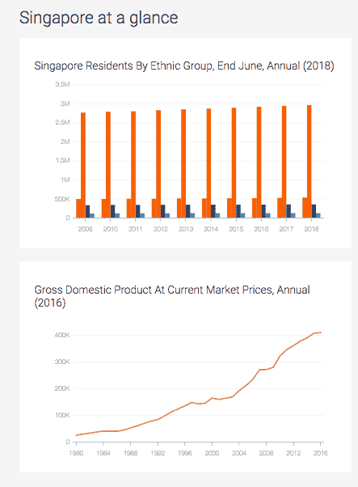
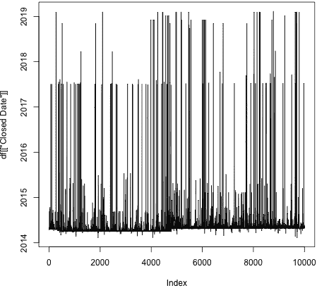
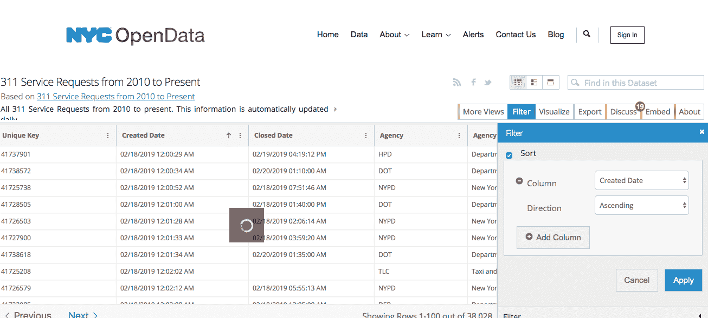
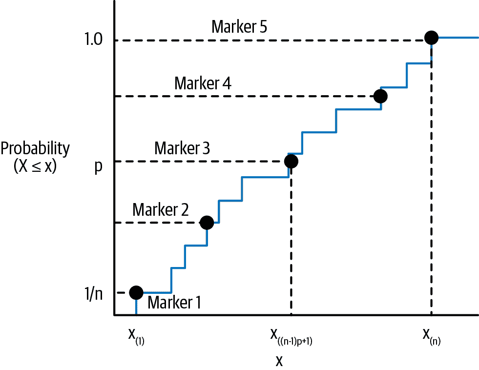
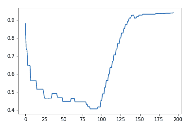
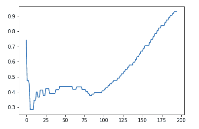
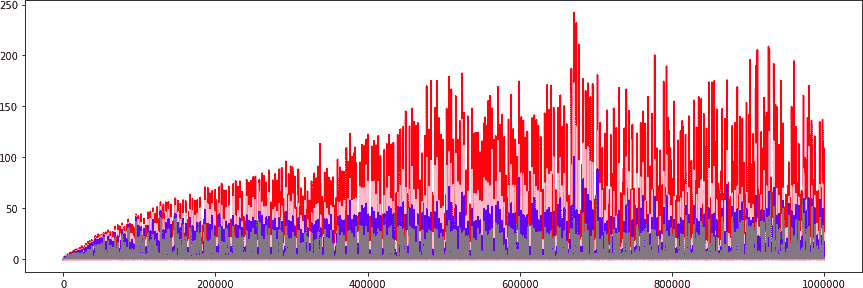

# 第十五章：政府时间序列

时间序列分析对于政府应用非常重要且相关，原因有很多。首先，无论大小，政府都是全球一些最重要时间序列数据的保管者，包括美国的就业报告、海洋温度数据（即全球变暖数据）和本地犯罪统计数据。其次，按定义，政府提供我们所有人依赖的一些最基本服务，因此，如果他们不希望在这些服务上大幅超支或者人手不足，他们就需要相当熟练地预测需求。因此，时间序列的所有方面对于政府目的都是相关的：存储、清理、探索和预测。

正如我在第二章中提到的，“找到”的时间序列数据在所有政府数据中所占比例非常高，只需进行一些重组即可看到。通常情况下，大多数政府数据集都是持续进行数据收集的结果，而不是时间的单一切片。然而，由于多种原因，政府数据集可能令人望而却步：

+   由于组织约束或随着时间变化的政治力量而不一致的记录保持

+   不透明或令人困惑的数据实践

+   大型数据集，信息含量相对较低

尽管如此，审视政府数据集仍然可能非常有趣，无论是出于知识兴趣还是出于许多实际目的。在本章中，我们探讨了一个政府数据集，其中包括从 2010 年至今所有在[纽约市投诉](https://perma.cc/BXF6-BZ4X)的情况，该数据集是通过拨打 311 市政热线获取的。由于数据集持续更新，书中看到的数据可能与您下载时看到的数据不同；在我准备本章时，您将比我拥有更多信息。尽管如此，结果应该是相当相似的。在本章中，我们将讨论以下几个主题：

+   政府数据的有趣来源，包括我们将要分析的那个

+   处理极大的纯文本数据文件

+   在不将所有数据保留在内存中的情况下，对大数据集进行在线/滚动统计分析以及其他分析选项

# 获取政府数据

在“找到数据”类别中的政府数据集在数据一致性的角度来看可能是一场噩梦。这些数据集虽然具有时间戳，但通常是为了开放数据倡议而发布，而不是为了特定的时间序列目的。通常几乎没有关于数据时间戳惯例或其他记录惯例的信息可用。确认底层记录实践是否一致可能会很困难。¹

尽管如此，如果您冒险或渴望成为首批发现与政府活动相关的人类行为中有趣时间特征的人，您会发现自己生活在开放政府和开放数据的时代。近年来，许多各级政府已经更加努力地使其时间序列数据对公众透明化。以下是一些您可以获取包含时间序列组件的开放政府数据的例子：

+   英国国家医疗服务的[月度医院数据](https://perma.cc/4TR3-84WA)。该数据集令人惊讶地具有时间序列意识：其中包括名为“MAR 时间序列”的选项卡，并描述了记录约定及其随时间演变的方式。

+   牙买加的开放数据门户还包括对时间序列数据的认识和认可，例如其时间戳的[2014 年 Chikungunya 病例数据集](https://perma.cc/4RCP-VMY6)以及[相关数据报告](https://perma.cc/QPR6-WNMJ)，其中包括动画（即时间序列可视化）和流行曲线。

+   新加坡的[开放数据门户](https://perma.cc/N9W4-ZDM8)展示了大量数据集，并通过其主页上的两个时间序列图表来宣传某些数据的时间序列特性，如图 15-1 所示。



###### 图 15-1\. 新加坡开放数据网站主页上四幅图表中的两幅是用来展示有关该国重要信息的时间序列可视化。

您可能会注意到，所有我的例子都来自讲英语的地区，但当然他们并不垄断政府开放数据运动。例如，[巴黎市](https://perma.cc/7V8Z-JZ4T)，[塞尔维亚国家](https://perma.cc/U3SQ-WF3C)，以及[African Development Bank Group](https://perma.cc/7L6X-5B9F)都在运行开放数据网站。²

在本章的例子中，我们从纽约市开放数据门户中获取信息，选择这里因为纽约市是一个大而有趣的地方，也是我的家。在下一节中，我们将深入研究他们的 311 热线数据集。

# 探索大时间序列数据

当数据量足够大时，您将无法将其全部装入内存。在达到此限制之前，数据需要多大取决于您使用的硬件。³ 您最终需要理解如何逐个可管理的块迭代您的数据。对于那些熟悉深度学习的人来说，特别是涉及图像处理的人，您可能已经这样做过。在深度学习框架中，通常有 Python 迭代器，可以通过指定目录遍历数据集，每个目录中有许多文件。⁴

当我下载了 311 数据集时，它以 CSV 格式超过了 3 GB。 我的计算机无法打开它，所以我的第一个想法是使用标准的 Unix 操作系统选项，比如 `head`。

不幸的是，打印出来的内容已经太大，无法在 Unix 命令行界面上管理，至少对于不熟悉 Unix 工具的人来说是这样：

```
## linux os command line
$ head 311.csv

Unique Key,Created Date,Closed Date,Agency,Agency Name,Complaint Type,Descripto
27863591,04/17/2014 12:00:00 AM,04/28/2014 12:00:00 AM,DOHMH,Department of Heal
27863592,04/17/2014 12:00:00 AM,04/22/2014 12:00:00 AM,DOHMH,Department of Heal
27863595,04/17/2014 10:23:00 AM,0417/2014 12:00:00 PM,DSNY,Queens East 12,Derel
27863602,04/17/2014 05:01:00 PM,04/17/2014 05:01:00 PM,DSNY,BCC - Queens East,D
27863603,04/17/2014 12:00:00 AM,04/23/2014 12:00:00 AM,HPD,Department of Housin
27863604,04/17/2014 12:00:00 AM,04/22/2014 12:00:00 AM,HPD,Department of Housin
27863605,04/17/2014 12:00:00 AM,04/21/2014 12:00:00 AM,HPD,Department of Housin

```

尽管内容很难处理，但这个视图足以显示出有几个时间戳以及其他有趣且有序的信息，比如地理坐标。 显然数据非常广泛，因此我们需要能够操纵此信息以获取我们想要的列。 ⁵

即使您是 Linux 的新手，也可以轻松了解一些简单的命令行工具，这些工具可以提供有用的信息。 我们可以获取 CSV 文件的行数，以便了解我们正在查看的规模，即我们有多少数据点。 这是一个一行命令：

```
## linux os command line
$ wc -l 311.csv
19811967 311.csv

```

我们可以看到自 2010 年以来，纽约市已经接到了大约 2000 万起 311 投诉。 这超过了每位居民的两次投诉。

有了这些知识，我们使用 R 的 `data.table`，知道它的 `fread()` 函数可以部分读取文件（在阅读有关 `nrows` 和 `skip` 参数的[文档](https://perma.cc/ZHN9-5HD3)时可以看到），并且 `data.table` 在处理大数据集时非常高效。 我们可以使用这个来获取初始信息，如下面的代码所示：

```
## R
> df = fread("311.csv", skip = 0, nrows = 10)
> colnames(df)
 [1] "Unique Key"                     "Created Date"                  
 [3] "Closed Date"                    "Agency"                        
 [5] "Agency Name"                    "Complaint Type"                
 [7] "Descriptor"                     "Location Type"                 
 [9] "Incident Zip"                   "Incident Address"              
[11] "Street Name"                    "Cross Street 1"                
[13] "Cross Street 2"                 "Intersection Street 1"         
[15] "Intersection Street 2"          "Address Type"                  
[17] "City"                           "Landmark"                      
[19] "Facility Type"                  "Status"                        
[21] "Due Date"                       "Resolution Description"        
[23] "Resolution Action Updated Date" "Community Board"               
[25] "BBL"                            "Borough"                       
[27] "X Coordinate (State Plane)"     "Y Coordinate (State Plane)"    
[29] "Open Data Channel Type"         "Park Facility Name"            
[31] "Park Borough"                   "Vehicle Type"                  
[33] "Taxi Company Borough"           "Taxi Pick Up Location"         
[35] "Bridge Highway Name"            "Bridge Highway Direction"      
[37] "Road Ramp"                      "Bridge Highway Segment"        
[39] "Latitude"                       "Longitude"                     
[41] "Location"   

```

仅仅从阅读前 10 行，我们已经可以看到列名。 对于所有我列出的 NoSQL 处理时间序列数据的优点来说，在大数据集中，从一开始就知道列名可能是一件好事。 当然，对于 NoSQL 数据，有解决方法，但大多数都需要用户付出一些努力，而不是自动发生。

几列表明了有用的信息：

```
"Created Date"                  
"Closed Date"                              
"Due Date"                           
"Resolution Action Updated Date"             

```

这些在转换之前可能是字符类型，但一旦我们转换为 POSIXct 类型，我们就可以看到这些日期之间的时间跨度是什么样的：

```
## R
> df$CreatedDate = df[, CreatedDate := as.POSIXct(CreatedDate, 
>                                   format = "%m/%d/%Y %I:%M:%S %p")

```

在格式化字符串中，我们需要使用 `%I` 表示小时，因为它只以 01-12 的格式表示，以及 `%p`，因为时间戳包含 AM/PM 的指示。

为了了解这些日期如何分布，特别是在投诉创建与关闭之间的时间，让我们加载更多行并检查所谓的*投诉生命周期*的分布（即创建与关闭之间的时间跨度）：

```
## R
> summary(as.numeric(df$ClosedDate - df$CreatedDate, 
>            units = "days"))
   Min. 1st Qu.  Median    Mean 3rd Qu.    Max.    NA's 
-75.958   1.000   4.631  13.128  12.994 469.737     113 

```

正如我们所看到的，这是一个广泛分布的情况。 一些投诉的闭环时间长达一年，令人惊讶的不仅是这些投诉的闭环时间长，有些投诉的闭环时间甚至是负数，甚至是极端负数。 如果负数时间约为 -365 天（一年），我们可能会想象这是数据输入问题，但对于 -75 天这样的数字，这种情况似乎不太可能。 这是我们需要研究的问题。

我们可以通过取创建日期的范围来发现另一个问题：

```
## R
> range(df$CreatedDate)
[1] "2014-03-13 12:56:24 EDT" "2019-02-06 23:35:00 EST"

```

鉴于这个 CSV 文件的大小以及它应该是持续更新的事实，令人惊讶的是前几行不是从标记了最早数据集的 2010 年开始的日期。我们本来期望 CSV 文件是持续追加的。更令人惊讶的是，2019 年的日期出现在前几行，并且 2014 年和 2019 年的日期都在同一前 10000 行中。这表明我们无法轻易确定文件中数据的日期顺序。我们可以通过执行行索引与日期的线图来可视化从一行到下一行的日期分布，就像我们在图 15-2 中所做的那样。



###### 图 15-2。虽然代码的前 10000 行中的大部分日期似乎都在 2014 年，但它们也会向前跳到 2019 年——而且经常如此！

无法避免行动问题。如果我们想了解行为如何随时间变化，我们将不得不面对无序的数据。但我们有几个选择。

## 在迭代过程中进行上采样和聚合数据

一种选择是在迭代过程中对数据进行上采样，以构建具有聚合统计信息的压缩时间序列。我们可以从分析的开始选择分辨率和聚合计数，然后在迭代过程中计算这些内容。然后，我们可以在分析结束时对结果进行排序。这看起来就像是拥有从 2010 年到现在的所有日期的字典/列表，然后为每一行添加到适当的日期。这种方法将产生一个具有相对较少条目的列表/字典，然后我们可以基于日期在结束时对其进行排序。

这样做的好处是相对容易编码，并且是将数据清理、探索和分析结合到一个探索性步骤中的方法。缺点是详细数据仍然会在未排序的文件混乱中丢失，因此如果有特定的时间段感兴趣，我们将不得不搜索整个未排序的文件以找到所有相关条目。

由于我们已经在第二章中做过上采样的示例，我把这部分留给读者作为练习。

## 对数据进行排序

另一种选择是对数据进行排序。考虑到文件的大尺寸和相对无序的日期，这是一项艰巨的任务，从我们观察到的情况来看。即使对于 2014 年的数据，日期似乎也不是按顺序排列的。因此，我们没有任何迹象表明我们可以信任数据的任何切片，因此我们应该将其视为随机顺序的数据堆叠。

对整个文件进行排序将消耗极大的内存，但有两个理由使得这样做是值得的。一个是我们只需要排序一次，然后可以保存结果，以供我们想要进行的任何后续分析。第二个是我们可以保留完整的详细级别，这样如果我们在分析中发现感兴趣的特定时间段，我们可以检查数据的所有细节，以了解正在发生的情况。

具体来说，思考我们如何完成这个任务，我们有几个选择：

+   Linux 有一个[命令行工具](https://perma.cc/7SNE-TQ2T)用于排序。

+   大多数数据库都可以对数据进行排序，所以我们可以将数据转移到数据库中，并让数据库来处理它。⁷

+   我们可以想出自己的排序算法并实施它。我们需要制定一些不消耗大量内存的东西。很可能我们的努力几乎无法与预打包排序选项中可用的功能匹配。

我们选择使用 Linux 命令行工具。虽然可能需要一些时间来做到这一点，但我们将开发一个新的生活技能，并获得一个对于这个大文件而言实现良好且正确的排序。

我们首先创建一个小的测试文件以便使用：

```
## linux command line
$ head -n 1000 311.csv | tail -n 999  >  test.csv

```

注意，这涉及到`head`（即打印开头）和`tail`（即打印结尾）命令。`head` 将包括文件的第一行，对于这个文件来说，它提供了列名。如果我们将其包含并与数值一起排序，它将不会保留列名作为文件顶部行，因此我们在排序之前将其删除。

如果您使用基于 Linux 的操作系统，那么可以如下应用`sort`命令：

```
## linux command line
$ sort --field-separator=',' --key=2,3 test.csv > testsorted.csv

```

在这种情况下，我们确定字段分隔符，然后指示我们想要按第二和第三列排序，即按创建日期和关闭日期排序（这些信息我们只能从先前检查的文件中得知）。我们将其输出到一个新文件中，因为将其输出到标准输出中并不会有太大帮助。

现在我们可以在 R 中检查排序后的文件，但不幸的是我们会发现这也不会返回一个排序后的文件。回到我们在 CSV 文件上运行`head`命令的几页前，你就会明白为什么了。我们按日期列进行排序（这将被处理为字符串，而不是日期感知方式）。然而，当前日期的格式是从月份开始，所以我们最终会得到一个按月份而不是按整体时间排序的日期列，这是当我们审查由前面命令生成的“排序后”CSV 时所见到的：

```
  1: 02/02/2019 10:00:27 AM 02/06/2019 07:44:37 AM
  2: 03/27/2014 07:38:15 AM 04/01/2014 12:00:00 AM
  3: 03/27/2014 11:07:31 AM 03/28/2014 01:09:00 PM
  4: 03/28/2014 06:35:13 AM 03/28/2014 10:47:00 PM
  5: 03/28/2014 08:31:38 AM 03/28/2014 10:37:00 AM
 ---                                              
995: 07/03/2017 12:40:04 PM 07/03/2017 03:40:02 PM
996: 07/04/2017 01:30:35 AM 07/04/2017 02:50:22 AM
997: 09/03/2014 03:32:57 PM 09/04/2014 04:30:30 PM
998: 09/05/2014 11:17:53 AM 09/08/2014 03:37:25 PM
999: 11/06/2018 07:15:28 PM 11/06/2018 08:17:52 PM

```

正如我们所见，排序作为字符串排序而不是日期排序是有道理的。事实上，这指出了使用正确的 ISO 日期格式的优点之一，即当作为字符串进行排序时，它仍将正确排序，与之前的格式不同。这是“现有”时间序列数据常见问题的一个示例：可用的时间戳格式可能不利于时间序列分析。

我们重新访问纽约市开放数据界面，看看是否有解决此格式问题的方法（见图 15-3）。



###### 图 15-3\. 纽约市开放数据门户提供了通过网页界面进行排序的功能，这似乎适用于这个大数据集的任何列。考虑到排序所需的计算能力，这是一个令人印象深刻的免费资源。

对数据的网页表格视图的一瞥似乎与我们的 CSV 文件一致，即数据似乎没有按时间顺序排序。然而，我们看到有排序选项，因此我们将其应用于数据集，确实在存储大数据集时会有一个可以理解的等待时间后更新数据。这将是一个很好的解决方案，但不幸的是，下载得到的 CSV 文件仍然是无序的。

此时我们可以探索其他几种解决方案。我们可以查看使用开放数据的 API 而不是网页界面是否提供了更易处理的日期或确保排序的方法。我们可以使用更多的 Linux 命令行工具，比如`awk`，来提取时间戳的不同部分到不同的列或者合并到一个带有 ISO 格式的重新排列列中。

相反，我们采用了简化的方法，看看我们现有的工具是否能够处理这个 CSV，如果我们只读取特定的列。我对这个数据集感兴趣的第一个问题是创建 311 投诉与关闭该投诉之间的滞后时间可能随时间变化的情况。在这种情况下，我假设我只需要两列：`CreatedDate`和`ClosedDate`。我将看看是否可以只读取这两列，这在数量和字符计数方面都是所有列的一个小部分（因为某些列非常长），在我的轻便笔记本电脑上是可能的。（我还可以探索修复问题的懒惰方式，即进行硬件升级，无论是暂时的还是永久的。）

现在我们能够读取数据的所有行，并且我们随后的分析将基于整个数据集而不仅仅是前 1000 行：

```
## R
> ## read in only the columns of interest
> df = fread("311.tsv", select = c("Created Date", "Closed Date"))
> 
> ## use data.table's recommended 'set' paradigm to set col names
> setnames(df, gsub(" ", "", colnames(df)))
> 
> ## eliminate rows with a blank date field
> df = df[nchar(CreatedDate) > 1 & nchar(ClosedDate) > 1]
> 
> ## convert string date columns to POSIXct
> fmt.str = "%m/%d/%Y %I:%M:%S %p"
> df[, CreatedDate := as.POSIXct(CreatedDate, format = fmt.str)]
> df[, ClosedDate  := as.POSIXct(ClosedDate,  format = fmt.str)]
> 
> ## order in chronological order of CreatedDate
> setorder(df, CreatedDate)
> 
> ## calculate the number of days between creating and closing
> ## a 311 complaint
> df[, LagTime := as.numeric(difftime(ClosedDate, CreatedDate, 
>                            units = "days"))]

```

这是在 2015 年生产的一款轻便笔记本电脑上完成的，因此您可能也可以用于工作或家庭使用的设备进行操作。对于“大数据”新手来说，1900 万行数据并不算什么大不了的事情，但实际情况常常如此。我们实际上只需要数据的一小部分来回答相关的时间序列问题。

当我们查看`LagTime`列时，我们注意到一些令人惊讶的错误数字——数以万计的天数，甚至是负数。我们排除了这些数字，并在一定程度上根据数据随机样本的分布加以限制：

```
## R
> summary(df$LagTime)
Min.  1st Qu.   Median     Mean  3rd Qu.     Max.     NA's 
-42943.4      0.1      2.0      2.0      7.9 368961.1   609835 

> nrow(df[LagTime < 0]) / nrow(df)
[1] 0.01362189

> nrow(df[LagTime > 1000]) / nrow(df)
[1] 0.0009169934

> df = df[LagTime < 1000]
> df = df[LagTime > 0]

> df.new = df[seq(1, nrow(df), 2), ]
> write.csv(df.new[order(ClosedDate)], "abridged.df.csv")
```

我们丢弃负滞后时间的数据，因为我们缺乏相关文档或领域知识来了解这些数据的含义。我们也会拒绝那些我们认为有不切实际或者极端不适的数值，例如关闭 311 投诉所需的滞后时间超过 1000 天的数据。⁸

###### 警告

在丢弃数据时请谨慎。在这个练习中，由于处理 311 投诉所需的滞后时间过长，导致我们丢弃了约 1.3%的数据，这些投诉可能因为太长而无法解释，或者因为是负数，暗示着数据录入错误或者其他我们单靠数据无法解决的问题。

鉴于我们的问题与数据整体分布有关，这些少数数据点不太可能影响我们关于分布问题的分析。然而，在实际应用中，您需要调查这些数据点及其可能对分析任务的后续影响。这并非时间序列特定的建议，而只是一般实践的问题。

现在我们能够同时将所有感兴趣的数据保留在内存中，我们可以全面地对序列提出问题。然而，我们感兴趣的问题是滞后时间的分布是否随时间变化而改变。我们可以通过时间序列的滑动或滚动窗口来实现这一点，但这是计算密集型的；当我们在数据上滑动窗口时，我们需要重复执行许多相关的计算。同时，我们也希望探索一种可以应用于实时数据流的方法，因为我们可以想象将这个项目持续到当前数据的情况。因此最好不要无限期地存储这个多 GB 的数据文件。

# 时间序列数据的在线统计分析

我们将使用一个名为[*P-square 算法*](https://perma.cc/G8LA-7738)的在线分位数估算工具，稍作修改以使其具有时间感知性。原始算法假定存在一个稳定的分布用于推断分位数，但我们希望考虑分布随时间变化的情况。与指数加权移动平均类似，我们通过减少早期观察的权重来引入时间感知性，并且每次有新的测量值时都以相同的方式引入一个因子来缩小以前测量的权重（参见图 15-4）。



###### 图 15-4\. 我们使用 P-square 算法进行在线分位数估计的计算结构。我们维护一系列标记，指示我们认为分位数在哪里以及所有小于或等于每个分位数的数据点的累积计数。

该算法需要一些记录，使得在更面向对象的编程语言中更容易实现，因此我们将从 R 切换到 Python。但是，请注意，我们将使用 R 中预处理的数据，因为`data.table`包在处理大数据时比 Python 中的工具具有更好的性能。

我们实现的 P-square 算法版本形成值的直方图。因此，当我们创建一个`PQuantile`对象时，为我们的直方图计数、箱位和观测的累计总和分配了预设数量的箱：

```
## python
>>> ## imports and a utilit lambda
>>> import bisect
>>> import math
>>> 
>>> sign = lambda x: (1, -1)[x < 0]
>>> 
>>> ## beginning of class definition
>>> class PQuantile:
>>>     def __init__(self, b, discount_factor):
>>>         ## initialization
>>>         self.num_obs = 0 ## self-explanatory
>>>         ## counts per quantile 
>>>         self.n = [i for i in range(self.b+1)] 
>>>         self.q = [] ## the estimated quantile values
>>> 
>>>         ## b is the number of quantiles, 
>>>         ## including the 0th and 100th
>>>         ## (min and max values) quantile
>>>         self.b = b
>>>         ## the discount factor sets how we adjust prior counts
>>>         ## when new data is available
>>>         self.discount_factor = discount_factor

```

有两个可配置参数：用于估计的均匀分布的分位数的数量和旧观测的折现因子。

其他类成员包括观测数量的累计总和（这将根据可配置的时间折现因子进行时间折现），估计的分位数以及小于或等于给定分位数值的观测计数的累计总和。

只有一个公共函数，其作用是接受下一个观测值。当有新的观测到来时，结果取决于序列的早期阶段。对于前`self.b`个值，接受这些输入并且必然构成分位数的估计。`self.q`被排序，使其值反映分位数。

例如，假设您输入了`b = 5`，用于期望的分位数值，然后输入了序列`2, 8, 1, 4, 3`。在这个序列结束时，`self.q`将等于`[1, 2, 3, 4, 8]`。`self.n`，小于或等于每个分位数的值的计数，将等于`[1, 2, 3, 4, 5]`，这是在`__init__`中初始化的值：

```
## python
>>>     def next_obs(self, x):        
>>>         if self.num_obs < (self.b + 1):
>>>             self.q.append(x)
>>>             self.q.sort()
>>>             self.num_obs = self.num_obs + 1
>>>         else:
>>>             self.next_obs2(x)
>>>             self.next_obs = self.next_obs2
```

一旦您拥有超过`self.b`个值，事情就变得有趣起来。在这一点上，代码开始决定如何组合值以估计分位数，而无需保留所有数据点以进行重复分析。在这种情况下，P-square 算法通过我们称之为`self.next_obs2`来执行此操作：

```
## python
>>>      def next_obs2(self, x):
>>>         ## discounting the number of observations
>>>         if self.num_obs > self.b * 10:
>>>             corrected_obs = max(self.discount_factor * self.num_obs,  
>>>                                self.b)
>>>             self.num_obs = corrected_obs + 1
>>>             self.n = [math.ceil(nn * self.discount_factor)
>>>                                           for nn in self.n]
>>>         
>>>             for i in range(len(self.n) - 1):
>>>                 if self.n[i + 1] - self.n[i] == 0:
>>>                     self.n[i+1] = self.n[i + 1] + 1
>>>                 elif self.n[i + 1] < self.n[1]:
>>>                     ## in practice this doesn't seem to happen
>>>                     self.n[i + 1] = self.n[i] - self.n[1 + 1] + 1
>>>         else:
>>>             self.num_obs = self.num_obs + 1            
>>> 
>>>         k = bisect.bisect_left(self.q, x)
>>>         if k is 0:
>>>             self.q[0] = x
>>>         elif k is  self.b+1 :
>>>             self.q[-1] = x
>>>             k = self.b          
>>>         if k is not 0:
>>>             k = k - 1
>>> 
>>>         self.n[(k+1):(self.b+1)] = [self.n[i] + 1
>>>                                    for i in range((k+1), 
>>>                                                  (self.b+1))]                
>>>         for i in range(1, self.b):
>>>             np = (i)*(self.num_obs - 1 )/(self.b) 
>>>             d = np - self.n[i]
>>>             if (d >= 1 and (self.n[i+1] - self.n[i]) > 1):
>>>                 self._update_val(i, d)
>>>             elif (d <= -1 and (self.n[i-1] - self.n[i]) < -1):
>>>                 self._update_val(i, d)  
```

理想情况下，第*i*个分位数值应均匀分布，以便恰好有*i/b ×* 总观测值小于它。如果不是这种情况，标记将向左或向右移动一个位置，并且其相关的分位数值将使用从直方图的局部抛物线形状假设推导出的公式进行修改。该公式根据局部抛物线形状的假设确定是否需要调整特定分位数值和计数的`d`变量的大小。

如果值确实需要调整，那么另一个决定就是确定抛物线还是线性调整是否合适。这在以下代码中实现。更多细节请参见[原始论文](https://perma.cc/G8LA-7738)中的推导。这篇论文很棒，因为它使用的数学技术易于理解，同时还清楚地说明了如何实施该方法以及如何测试您的实施方法：

```
## python
>>>     ## overall update
>>>     ## as you can see both self.q and self.n are updated
>>>     ## as a quantile position is shifted
>>>     def _update_val(self, i, d):
>>>         d = sign(d)
>>>         qp = self._adjust_parabolic(i, d)
>>>         if self.q[i] < qp < self.q[i+1]:
>>>             self.q[i] = qp 
>>>         else:
>>>             self.q[i] = self._adjust_linear(i, d)
>>>         self.n[i] = self.n[i] + d
>>> 
>>>     ## this is the primary update method
>>>     def _adjust_parabolic(self, i, d):
>>>         new_val = self.q[i]
>>>         m1 =  d/(self.n[i+1] - self.n[i-1])
>>>         s1 = (self.n[i] - self.n[i-1] + d) *
>>>                  (self.q[i+1] - self.q[i]) /
>>>                  (self.n[i+1] - self.n[i])
>>>         s2 = (self.n[i+1] - self.n[i] - d) *
>>> 
>>>     ## this is the backup linear adjustment when parabolic
>>>     ## conditions are not met
>>>     def _adjust_linear(self, i, d):
>>>         new_val = self.q[i]
>>>         new_val = new_val + d * (self.q[i + d] - self.q[i]) /
>>>                                   (self.n[i+d] - self.n[i])
>>>         return new_val

```

对于这种方法的简易性的视角，所有的班级代码都在这里列出：

```
## python
>>> class PQuantile:
>>>     ## INITIALIZATION
>>>     def __init__(self, b, discount_factor):
>>>         self.num_obs = 0
>>>         self.b = b
>>>         self.discount_factor = discount_factor
>>>         self.n = [i for i in range(self.b+1)]        
>>>         self.q = []
>>> 
>>>     ## DATA INTAKE
>>>     def next_obs(self, x):        
>>>         if self.num_obs < (self.b + 1):
>>>             self.q.append(x)
>>>             self.q.sort()
>>>             self.num_obs = self.num_obs + 1
>>>         else:
>>>             self.next_obs2(x)
>>>             self.next_obs = self.next_obs2
>>>             
>>>     def next_obs2(self, x):
>>>         ## discounting the number of observations
>>>         if self.num_obs > self.b * 10:
>>>             corrected_obs = max(self.discount_factor 
>>>                                       * self.num_obs,  
>>>                                self.b)
>>>             self.num_obs = corrected_obs + 1
>>>             self.n = [math.ceil(nn * self.discount_factor) 
>>>                                           for nn in self.n]
>>>         
>>>             for i in range(len(self.n) - 1):
>>>                 if self.n[i + 1] - self.n[i] == 0:
>>>                     self.n[i+1] = self.n[i + 1] + 1
>>>                 elif self.n[i + 1] < self.n[1]:
>>>                     ## in practice this doesn't seem to happen
>>>                     self.n[i + 1] = self.n[i] - self.n[1 + 1] + 1
>>>         else:
>>>             self.num_obs = self.num_obs + 1            
>>> 
>>>         k = bisect.bisect_left(self.q, x)
>>>         if k is 0:
>>>             self.q[0] = x
>>>         elif k is  self.b+1 :
>>>             self.q[-1] = x
>>>             k = self.b          
>>>         if k is not 0:
>>>             k = k - 1
>>> 
>>>         self.n[(k+1):(self.b+1)] = [self.n[i] + 1 
>>>                                    for i in range((k+1), 
>>>                                                   (self.b+1))]                
>>>         for i in range(1, self.b):
>>>             np = (i)*(self.num_obs - 1 )/(self.b) 
>>>             d = np - self.n[i]
>>>             if (d >= 1 and (self.n[i+1] - self.n[i]) > 1):
>>>                 self._update_val(i, d)
>>>             elif (d <= -1 and (self.n[i-1] - self.n[i]) < -1):
>>>                 self._update_val(i, d)    
>>> 
>>>     ## HISTOGRAM ADJUSTMENTS
>>>     def _update_val(self, i, d):
>>>         d = sign(d)
>>>         qp = self._adjust_parabolic(i, d)
>>>         if self.q[i] < qp < self.q[i+1]:
>>>             self.q[i] = qp 
>>>         else:
>>>             self.q[i] = self._adjust_linear(i, d)
>>>         self.n[i] = self.n[i] + d
>>> 
>>>     def _adjust_parabolic(self, i, d):
>>>         new_val = self.q[i]
>>>         m1 =  d/(self.n[i+1] - self.n[i-1])
>>>         s1 = (self.n[i] - self.n[i-1] + d) * 
>>>                  (self.q[i+1] - self.q[i]) /
>>>                  (self.n[i+1] - self.n[i])
>>>         s2 = (self.n[i+1] - self.n[i] - d) * 
>>>                  (self.q[i] - self.q[i-1]) /
>>>                  (self.n[i] - self.n[i-1])
>>>         new_val = new_val + m1 * (s1 + s2)
>>>         return new_val
>>>             
>>>     def _adjust_linear(self, i, d):
>>>         new_val = self.q[i]
>>>         new_val = new_val + d * (self.q[i + d] - self.q[i]) /
>>>                                   (self.n[i+d] - self.n[i])
>>>         return new_val

```

现在我们有了这种时间导向的方法，我们应该确信它在玩具示例中运行得相当好。我们首先尝试从一个分布中抽样数据点，然后突然切换到另一个分布。在每种情况下，我们都在采样第 40 百分位数，尽管基于配置的 10 个直方图点，我们维护的直方图显示了 0、10、20…90、100 百分位数。这很有帮助，因为这意味着我们可以对变化的分布有相当详细的描述。对于这个玩具示例，我们只关注第 40 百分位数（`qt.q[4]`），这导致了图 15-5 中的绘图：

```
## python
>>> qt = PQuantile(10, `0.3`)               
>>> qt_ests = []
>>> 
>>> for _ in range(100):
>>>    b.next_obs(uniform())
>>>    if len(b.q) > 10:
>>>        qt_ests.append(qt.q[4])
>>> for _ in range(100):
>>>    b.next_obs(uniform(low = 0.9))
>>>    qt_ests.append(qt.q[4])
>>> 
>>> plt.plot(qt_ests)

```



###### 图 15-5\. 当我们大幅度折扣旧测量数据（乘以较小的折扣因子）时，我们更快地看到底层分布已经发生变化。

相反，当我们对较大折扣因子的情况下较少折扣旧测量时，我们看到对于变化的分位数估计较慢（见图 15-6）：

```
## python
>>> qt = PQuantile(10, `0.8`)               
>>> qt_ests = []
>>> 
>>> for _ in range(100):
>>>    b.next_obs(uniform())
>>>    if len(b.q) > 10:
>>>        qt_ests.append(qt.q[4])
>>> for _ in range(100):
>>>    b.next_obs(uniform(low = 0.9))
>>>    qt_ests.append(qt.q[4])
>>> 
>>> plt.plot(qt_ests)

```



###### 图 15-6\. 当我们对较老的测量数据的折扣较少（乘以较大的折扣因子）时，我们的分位数估计较慢地认识到底层分布已经发生变化。

现在我们将这种滚动分位数应用于我们数据的一个子集（参见图 15-7）。我们并不对整个数据集进行操作，不是因为计算上的挑战，而是因为将所有记录的分位数绘制到我的日常笔记本电脑上过于繁重！

```
## python
>>> import numpy
>>> nrows = 1000000
>>> qt_est1 = np.zeros(nrows)
>>> qt_est2 = np.zeros(nrows)
>>> qt_est3 = np.zeros(nrows)
>>> qt_est4 = np.zeros(nrows)
>>> qt_est5 = np.zeros(nrows)
>>> qt_est6 = np.zeros(nrows)
>>> qt_est7 = np.zeros(nrows)
>>> qt_est8 = np.zeros(nrows)
>>> qt_est9 = np.zeros(nrows)
>>> for idx, val in enumerate(df.LagTime[:nrows]):
>>>     qt.next_obs(val)
>>>     if len(qt.q) > 10:
>>>         qt_est1[idx] = qt.q[1]
>>>         qt_est2[idx] = qt.q[2]
>>>         qt_est3[idx] = qt.q[3]
>>>         qt_est4[idx] = qt.q[4]
>>>         qt_est5[idx] = qt.q[5]
>>>         qt_est6[idx] = qt.q[6]
>>>         qt_est7[idx] = qt.q[7]
>>>         qt_est8[idx] = qt.q[8]
>>>         qt_est9[idx] = qt.q[9]
>>> 
>>> plot(qt_est9, color = 'red')
>>> plt.plot(qt_est7, color = 'pink')
>>> plt.plot(qt_est5, color = 'blue')
>>> plt.plot(qt_est3, color = 'gray')
>>> plt.plot(qt_est2, color = 'orange'

```



###### 图 15-7\. 数据集中前 100,000 行按关闭日期排序时，时间内的第 90、70、50、30 和 20 百分位数值。由于按关闭日期排序，可能会发现许多迅速解决的 311 投诉集中在前期，这解释了数据集前部分中更小的分位数估计。⁹

图 15-7 显示了按关闭日期排序时数据集前 100,000 行的时间内第 90、70、50、30 和 20 百分位数值。由于按关闭日期排序，可能会发现许多迅速解决的 311 投诉集中在前期，这解释了数据集前部分中更小的分位数估计。⁹

看起来分布有变化吗？从视觉上看，似乎有几个原因。其中一个是左截尾，稍后会简要描述，这反映了我们如何对数据进行排序和选择。我们按`ClosedData`列排序数据，并结合这个数据集似乎没有无限的回溯期（也就是说，假设在某个日期之前提交的 311 投诉并未进入这个系统），这使得我们在开始日期看到的滞后时间似乎较短。换句话说，这种看似随时间变化的现象只是我们不完整的数据（以及不完整的底层数据集）的产物，再加上我们选择排序的结果。

另一方面，我们可以看到仍然有特征表明随时间分布发生变化。分位数曲线估计中出现高峰和低谷，我们甚至可以考虑我们的曲线中是否可能存在周期性行为，因为由于外生组织因素的原因，分位数值可能在可预测的时间上升和下降（也许是为了在月底之前结案投诉的推动，或者某些资金周期增加了特定时间可用于结案投诉的工人数量）。

鉴于我们现在有了初步结果，最好的选择是确定一些重要日期（即我们在哪些日期看到尖峰或周期性行为？），并尝试将它们与我们可以确认的工作节奏相关的任何制度事实进行交叉参考。我们还应该运行模拟，评估我们认为左截尾如何在不同情景下影响早期分位数估计。通过这种方式，我们可以更好地理解系统未知方面的定性和定量内容，这些信息对于最终确定解决时间分布是否随时间演变以及如何演变非常有帮助。

比方说，如果我们采取了这些步骤——接下来呢？我们需要寻找一种方法来比较分布的相似性或差异性，只使用分布的分位数而不是所有样本点。我们可以通过运行模拟/引导整个过程来做到这一点。这将带来一个答案，我们可以通过编码我们的模拟来完全阐明和控制模型所依赖的假设。事实上，许多进行这种比较的统计方法也专注于引导法。

## 余下的问题

我们的可视化表明了新的查询需求。其中一个与周期性或季节性行为的可能性相关。所有估计的分位数都似乎有周期性的起伏。我们可以考虑进一步调查这一点，并有几种方法可以做到这一点：

+   我们可以尝试将谐波（正弦和余弦）拟合到这些分位数曲线上，看看是否会出现共同的周期性。

+   我们可以将分位数本身建模为 ARIMA 或 SARIMA 过程，并寻找季节性的证据。这还需要进行初步步骤，如探索我们将作为时间序列建模的曲线的 ACF 和 PACF。

+   我们可以向运行 311 服务的机构索取更多信息，看看他们是否认识到任何由其组织结构和运营程序引起的周期性行为。

除了周期性行为之外，在索引约为 70,000 位置附近，我们还可以看到估计分位数值的跳跃。考虑到所有分位数都跳跃了，似乎不太可能仅由单个或少数异常值引起。我们可以通过几种方式进行调查：

+   回到这段时间内的原始数据，看看有哪些特征可能可以提供解释。是否有 311 投诉激增？或者是某种类型的投诉激增，这类投诉通常需要更长时间来解决？

+   或者，我们可以重新审视原始数据，以确定分位数跳跃的大致日期，并与本地新闻进行交叉参考，最好是在某人的帮助下指引我们正确的方向。来自机构的某人的帮助，或者对城市政府了解深刻的人的帮助，可能是最有价值的。然而，也有可能，这个日期可能对应于纽约市的一个重大事件，例如 2012 年的超级飓风桑迪，这可以解释这个跳跃。

## 进一步的改进

我们还可以使这个算法更加时间感知。我们对 P-square 算法的修改排除了先前的观察，但它假定所有观察值是均匀分布的。这体现在下一个观察值的输入中没有时间戳，并且始终应用相同的折扣因子。我们可以通过使用时间变化到旧信息相对于新信息的折扣来设计一个更灵活的算法，使折扣取决于自上次更新以来经过的时间变化。这对我们的 311 数据集也会更加精确。这留给读者作为一个练习，但只涉及更改几行代码。提示：折扣因子应该成为时间的函数。

我们还可以探索其他通过时间估计分位数的方法，无论是在线还是窗口测量。由于在线数据的重要性越来越大，特别是对于在线大数据，关于这个主题有大量新兴研究。统计学和机器学习方法在过去几年已经处理了这个问题，并且有许多适合实际数据科学家的可接近的学术论文。

# 更多资源

Ted Dunning 和 Otmar Ertal，[“使用 t-Digest 计算极其精确的分位数,”](https://perma.cc/Z2A6-H76H) 研究论文，2019，https://perma.cc/Z2A6-H76H。

f-digest 算法用于极高效且灵活地计算在线时间序列数据的分位数，正迅速成为处理非平稳分布情况下的在线时间序列分位数估计的领先技术。该方法在多种语言中都有实现，包括 Python 和高性能的 C++以及 Go 变体。该方法特别有用，因为无需预先决定感兴趣的分位数，而是将整个分布建模为一组聚类，从中可以推断出任何你想要的分位数。

Dana Draghicescu, Serge Guillas, 和 Wei Biao Wu, [“非平稳时间序列的分位曲线估计与可视化,”](https://perma.cc/Z7T5-PSCB) *计算与图形统计杂志* 18 卷, 1 期 (2009): 1–20, https://perma.cc/Z7T5-PSCB.

本文展示了几种非参数方法来建模时间序列分位数估计中的非平稳分布。它之所以有用，是因为涵盖了真实世界数据、模拟数据和非标准分布（如非高斯分布）。此外，该文章提供了样例代码（对于统计学术期刊文章来说是不寻常的），尽管可能需要付费才能获取。

András A. Benczúr, Levente Kocsis, 和 Róbert Pálovics, [“大数据流中的在线机器学习,”](https://perma.cc/9TTY-VQL3) 研究论文，2018 年，https://perma.cc/9TTY-VQL3.

该参考资料讨论了与时间序列相关的各种常见机器学习任务的技术方法。特别有趣的是关于多种机器学习任务的在线数据处理的讨论，以及关于在线任务并行化的技术提示。

Sanjay Dasgupta, [“在线和流式聚类算法,”](https://perma.cc/V3XL-GPK2) 计算机科学与工程，加利福尼亚大学圣迭戈分校，2008 年春季，https://perma.cc/V3XL-GPK2.

虽然不专门针对时间序列数据，这些讲义总结了关于在线数据的无监督聚类的一般概述。这些讲义足以帮助您开始构建时间序列特定应用的潜在解决方案。

Ruofeng Wen 等, [“多时域分位数递归预测器,”](https://perma.cc/22AE-N7F3) 研究论文，2017 年 11 月，https://perma.cc/22AE-N7F3.

亚马逊的这篇研究论文提供了一个例子，展示了如何有效地使用数据中的分位数信息来训练递归神经网络，以便进行时间序列预测。研究人员展示了如何有效地训练神经网络，使其能够生成概率评估而非点估计。本文很好地阐明了分位数信息的另一个潜在用例，这在时间序列分析中是一个未充分利用的资源。

¹ 请注意，像美国的就业报告等备受追捧的时间序列数据非常重视时间序列，经过精心清洗和格式化。然而，这类数据已经被充分利用，不太可能为即将成为研究人员或企业家的人提供新的时间序列应用。

² 当然，您的访问权限可能取决于您的语言能力（或者一位乐意帮助的同事的语言能力）。

³ 如果您的组织总是通过扩展解决 RAM 不足的问题，那么您的做法是错误的。

⁴ 作为灵感，阅读[TensorFlow 关于数据集和相关类的文档](https://www.tensorflow.org/guide/datasets)。

⁵ 请注意，精通 Unix 系统的人可以轻松使用`awk`在命令行或简单的 shell 脚本中有效地操作 CSV。通常，这些工具在处理大数据时非常高效且实现良好，与不幸的是，许多常用的 R 和 Python 数据分析工具相比。如果您在使用您喜爱的数据处理工具时遇到问题，学习一些 Unix 命令行工具来补充可能是个好主意，尤其是在处理大数据的情况下。

⁶ 请注意，Python 的 Pandas 提供了[类似的功能](https://perma.cc/68EE-2ZZ9)。

⁷ 我们必须选择一个能提供这种功能的数据库——并非所有数据库都能提供，尤其是不是所有时间序列数据库都能假定数据按时间顺序进入数据库。

⁸ 虽然 1,000 天可能看起来很长，但事实上，我个人已经等了几年，提交了多次 311 投诉，但仍未解决。树死后，我一直在等纽约市在我家门前替换树木——每次我打电话给 311，他们都告诉我他们正在处理。

⁹ 第 20 百分位数非常小，在这里呈现的其他分位数尺度上几乎看不见。它看起来像其他分布的基础上的一条实线，但如果切换到对数尺度或单独绘制它，您就能更清楚地看到它。
