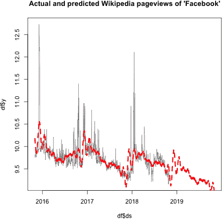
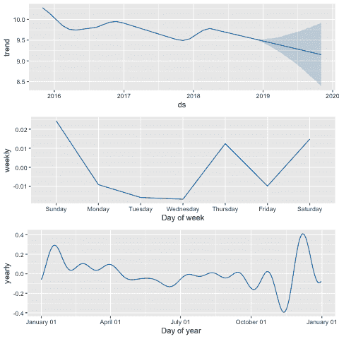
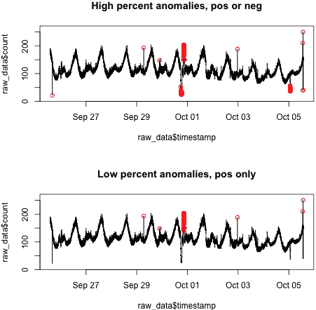
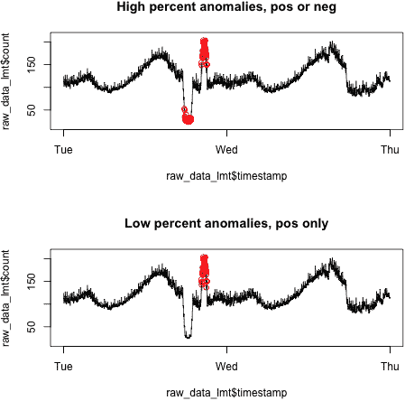

# 第十六章：时间序列包

在过去几年里，大型科技公司发布了许多关于如何处理他们收集的大量时间序列数据的包和论文，这些数据来自拥有庞大客户群、先进业务分析和众多预测与数据处理需求的数字化组织。在本章中，我们将讨论与这些不断扩展的时间序列数据集相关的主要研究和开发领域，具体包括：大规模预测和异常检测。

# 大规模预测

对许多大型科技公司来说，处理时间序列是一个日益重要的问题，并且是自然而然地在他们的组织内部产生的问题。随着时间的推移，其中一些公司通过开发智能化、专门针对“大规模预测”的自动化时间序列包来响应这一问题，因为在各种领域需要大量的预测。以下是谷歌两位开发公司自动化预测包的数据科学家描述他们的产品动机的情况，在[2017 年的一篇博客文章](https://perma.cc/6M7J-MWDY)中有所强调：

> 随着谷歌在其成立的第一个十年中迅速成长，对时间序列预测的需求也在迅速增长。*各种业务和工程需求导致了多种预测方法的出现，大多依赖于直接的分析支持。* 这些方法的数量和多样性，以及在某些情况下它们的不一致性，迫使我们尝试统一、自动化和扩展预测方法，并通过可以可靠部署的工具来分发结果。也就是说，我们试图开发出能够在谷歌内部实现准确大规模时间序列预测的方法和工具。

面对如此多的相关数据和如此多的预测任务，引入足够多的分析员来生成每一个组织感兴趣的预测，既昂贵又具有组织挑战性。因此，这些方案都转向了“足够好”的理念；也就是说，一个相对不错的预测远胜过在等待完美、由具有领域知识的时间序列专家精心制作的预测时一无所获。接下来我们详细讨论两个自动化预测框架，来自 Google 和 Facebook。

## 谷歌的工业内部预测

Google 已经[发布了一些信息](https://perma.cc/N3AU-5VWK)关于其内部自动化预测工具，这是由该公司搜索基础设施部门的几位数据科学家领导的努力所推动。任务是编写一个统一的方法，在整个组织中进行自动化预测。由于任务是自动化的，这意味着结果必须是可靠的——不能偏离轨道太远，并且必须伴随有关预测不确定性的一些估计。此外，由于团队寻求的是一个广泛适用的解决方案，该方法论必须解决与时间序列数据集相关的人类常见问题，例如季节性、缺失数据、假期以及随时间演变的行为。

Google 在此方案中推出了三个与前几章讨论内容相关的有趣步骤：

1.  自动化和广泛的数据清洗和平滑处理

1.  时间聚合和数据的地理/概念解聚

1.  合并预测与基于模拟的不确定性估计生成

我们将依次讨论每个步骤。

### 自动化和广泛的数据清洗和平滑处理

在早前提到的非官方 Google 数据科学博客文章中，该内部项目的两位领导指出数据清洗和平滑处理了许多问题：

不完美数据的影响

+   缺失数据

+   异常值检测

+   水平变化（例如由于产品推出或行为突然但永久改变）

+   数据转换

不完美数据是生活中的一部分。由于技术故障可能会导致缺失数据。异常值可能具有类似的原因或者是“真实值”，但如果它们不太可能重复出现，则不值得包含在预测中。水平变化（*制度变化*）可能由于多种原因而发生，包括基础行为发生了 drast ic 改变（不断发展的世界），正在测量的事物发生了 drast ic 改变（不断发展的产品），或者正在记录的事物发生了 drast ic 改变（不断发展的日志记录）。最后，数据可以以远离许多时间序列模型所假设的正态分布或平稳性的分布形式呈现。 Google 方法依次处理每个数据不完美之处，使用自动化方法来检测和“修正”这些问题。

与日历相关的效应

+   年度季节性

+   周期性季节性（一周中的某一天的影响）

+   假期

对于谷歌这样一个全球运营和用户遍布的组织来说，处理与日历相关的效应特别棘手。全球不同地区的年季节性会有很大不同，尤其是在具有自己气候模式的对半球和具有不同基础日历的文化中。正如博客文章指出的那样，有时同一个假期可能在同一个（格里高利）年历中发生多次。同样，某些人群所操作的“季节”在格里高利年历中可能会在年内发生变化，这通常是因为伊斯兰历与格里高利历有不同的周期性。

### 时间聚合和地理/概念分解

谷歌团队发现，对于他们大部分感兴趣的预测，周数据效果很好，因此在上一步清洗数据后，他们将其聚合成周增量以便进行预测。在这个意义上，他们执行了时间聚合。

然而，团队也发现将数据进行分解很有帮助，有时是按地理区域，有时是按类别（如设备类型），有时是按多种因素的组合（如地理区域按设备类型）。团队发现，在这种情况下，为分解的子系列做预测，然后将这些预测调和以生成全局预测，如果子系列和全局系列都感兴趣的话，这种方法更有效。我们在第六章讨论了适合大规模和高度并行处理的层次时间序列拟合的各种方法，而这种方法反映了从较低级别预测开始并向上传播的方法论。

### 结合预测和基于模拟的不确定性估计

谷歌采用集成方法，结合多种不同的预测模型结果来生成最终预测。这对多个原因都很有用。谷歌认为这种方法生成了一种智囊团式的预测，汲取了许多表现良好且有充分理由的预测模型的好处（如指数平滑、ARIMA 等）。此外，预测集成生成了预测分布，为确定其中是否有不同于“群体”的预测提供了依据。最后，集成提供了量化预测不确定性的方法，谷歌也通过时间中的错误前向传播模拟来做到这一点。

最终，正如数据科学团队承认的那样，谷歌的方法受益于大规模和高度并行的适用于公司可用的巨大计算资源的方法。它还从建立并行任务（如多次模拟错误在时间中传播）和自动化过程中受益，其中有分析师的输入空间但没有必要。通过这种方式，可以大规模生成合理的预测，并适用于各种数据集。

虽然你的工作可能没有 Google 所需的高自动化水平或同样的优势，但即使作为独立的数据科学家，你仍然可以从他们的模型中吸收许多想法并将其整合到你的工作流程中。这些想法包括：

+   为清理数据构建框架或“管道”，作为您希望在对每个时间序列数据集建模之前准备的基线“足够好”的版本。

+   建立尊重的预测模型集合作为您的“首选”工具包。

## Facebook 的开源 Prophet 包

Facebook 在大约与 Google 发布其内部包信息同时，开源了其自动化时间序列预测包 Prophet。在其[自己的博客文章](https://perma.cc/V6NC-PZYJ)中，Facebook 强调了 Google 方法中强调的一些相同问题，特别是：

+   "人类尺度"的季节性和不规则的假期

+   水平变化

+   缺失数据和异常值

此外，Facebook 包还带来了诸如：

+   能够处理各种粒度水平的数据集，例如分钟级或小时级数据，以及每日数据

+   表示非线性增长趋势的趋势，例如达到饱和点

Facebook 指出，其包的结果往往与分析师的结果一样出色。与 Google 一样，Facebook 在开发其时间序列拟合管道时发现了许多高度并行的任务实例。Facebook 表示，Prophet 已经发展成为一款可靠的预测工具，其预测不仅在内部使用，还用于外部产品。此外，Facebook 还表示，它已经开发了一种“分析师参与”的工作模式，使得自动化过程可以在必要时进行监督和修正，最终导致可以根据任务所需的资源水平协助或替代人类分析的产品。

Facebook 的方法与 Google 的方法大不相同；它包括三个简单的组成部分：

+   年度和周度季节效应

+   自定义假期列表

+   分段线性或逻辑趋势曲线

这些组件用于形成*加法回归模型*。这是一个非参数回归模型，意味着不对底层回归函数的形式做出任何假设，也不强加线性性。该模型比线性回归更灵活和可解释，但存在更高的方差（可以考虑机器学习和统计学中通常知道的偏差-方差权衡）和更多的过拟合问题。这种模型对 Facebook 寻求的一般任务是有意义的，即必须以自动化方式对复杂的非线性行为进行建模，避免不必要的税收方法。

Prophet 具有许多优点，包括：

+   简单的 API

+   开源且正在积极开发

+   在 Python 和 R 中拥有完整且相同的 API，有助于多语言数据科学团队

先知易于使用。我们在此节中以一个代码片段示例结束，该代码片段取自[快速入门指南](https://perma.cc/9TLC-FFRM)，以便您可以看到用于自动化预测所需的最小代码。我们将先知与`pageviews`一起使用，后者是一个能轻松检索与维基百科页面浏览量相关的时间序列数据的 R 包。首先，我们下载一些时间序列数据：

```
## R
> library(pageviews)
> df_wiki = article_pageviews(project = "en.wikipedia", 
>                             article = "Facebook", 
>                             start = as.Date('2015-11-01'), 
>                             end = as.Date("2018-11-02"), 
>                             user_type = c("user"), 
>                             platform = c("mobile-web"))
> colnames(df_wiki)
[1] "project"   "language"  "article"   "access"    "agent"     "granularity"
[7] "date"      "views"   

```

现在我们已经有了一些以每日时间分辨率和几年时间为单位的数据，我们可以通过几个简单的步骤（参见图 16-1）使用先知来预测这些数据：

```
## R
> ## we subset the data down to what we need
> ## and give it the expected column names
> df = df_wiki[, c("date", "views")]
> colnames(df) = c("ds", "y")

> ## we also log-transform the data because the data
> ## has such extreme changes in values that large
> ## values dwarf normal inter-day variation
> df$y = log(df$y)

> ## we make a 'future' data frame which
> ## includes the future dates we would like to predict
> ## we'll predict 365 days beyond our data
> m = prophet(df)
> future <- make_future_dataframe(m, periods = 365)
> tail(future)
             ds
1458 2019-10-28
1459 2019-10-29
1460 2019-10-30
1461 2019-10-31
1462 2019-11-01
1463 2019-11-02

> ## we generate the forecast for the dates of interest
> forecast <- predict(m, future)
> tail(forecast[c('ds', 'yhat', 'yhat_lower', 'yhat_upper')])
             ds     yhat yhat_lower yhat_upper
1458 2019-10-28 9.119005   8.318483   9.959014
1459 2019-10-29 9.090555   8.283542   9.982579
1460 2019-10-30 9.064916   8.251723   9.908362
1461 2019-10-31 9.066713   8.254401   9.923814
1462 2019-11-01 9.015019   8.166530   9.883218
1463 2019-11-02 9.008619   8.195123   9.862962
> ## now we have predictions for our value of interest

> ## finally we plot to see how the package did qualitatively
> plot(df$ds, df$y, col = 1, type = 'l', xlim = range(forecast$ds),
>      main = "Actual and predicted Wikipedia pageviews of 'Facebook'")
> points(forecast$ds, forecast$yhat, type = 'l', col = 2)

```



###### 图 16-1\. 维基百科页面计数数据的绘图（细实线）及先知模型对该数据的预测（粗虚线）。

先知还提供绘制构成预测的组件（趋势和季节性）的选项（请参见图 16-2）：

```
## R
> prophet_plot_components(m, forecast)

```

###### 警告

限制先知的使用到每日数据。根据其自身描述，先知包是为每日数据开发并且在此类数据上表现最佳的。不幸的是，这种狭窄的专业化意味着对于不同时间尺度的数据，同样的技术可能会非常不可靠。因此，当您的数据不是每日数据时，在使用该包及其相关技术时应谨慎对待。



###### 图 16-2\. 预测分解为趋势、每周和每年组件。预测由这些组件的总和形成。请注意，不同的组件形成方式不同。趋势数据具有基本线性形状，而年度数据由于其基础傅里叶级数拟合而呈曲线形状（更多信息请参阅早期提到的 Facebook 博客文章）。

随着时间的推移，越来越多的自动化时间序列开源软件包和黑盒产品开始出现。这些可以是对于新手进行预测并寻求合理预测的一个很好的入门点。然而，在不久的将来，这些软件包可能不会为每个时间序列和每个组织提供最佳的预测结果。当您能将领域知识和相关组织约束纳入您的时间序列模型中时，您将得到更好的结果，目前这仍然是人类分析师的任务，直到更普遍的预测软件包出现。

# 异常检测

在时间序列中，异常检测是另一个技术公司正在做出重大努力并与开源社区分享的领域。在时间序列中，异常检测因几个原因而重要：

+   如果我们拟合的模型对此类异常值不够稳健，移除异常值是有帮助的。

+   如果我们想要构建一个专门用于预测此类异常事件程度的预测模型，那么识别异常值是很有帮助的，前提是我们知道它们将会发生。

接下来我们将讨论 Twitter 在其开源异常检测工作中采取的方法。

## Twitter 的开源异常检测包

四年前，Twitter 开源了一个异常检测包，AnomalyDetection，¹ 这个包仍然很有用且表现良好。该包实现了季节性混合 ESD（极端学生化离群值检测），比一般的 ESD 模型更复杂，用于识别离群值。[一般化 ESD](https://perma.cc/C7BV-4KGT) 测试本身基于另一个统计测试，[Grubbs 测试](https://perma.cc/MKR5-UR3V)，它定义了一个用于测试数据集中是否存在单个离群值的统计量。一般化 ESD 将这个测试重复应用，首先对最极端的离群值，然后对逐渐较小的离群值，同时调整测试的临界值，以考虑多个顺序测试。季节性混合 ESD 基于一般化 ESD 来考虑行为的季节性，通过时间序列分解。

我们可以看到这个包在以下 R 代码中的简单使用。首先，我们加载 Twitter 包提供的一些样本数据：

```
## R
> library(AnomalyDetection)
> data(raw_data)
> head(raw_data)
            timestamp   count
1 1980-09-25 14:01:00 182.478
2 1980-09-25 14:02:00 176.231
3 1980-09-25 14:03:00 183.917
4 1980-09-25 14:04:00 177.798
5 1980-09-25 14:05:00 165.469
6 1980-09-25 14:06:00 181.878

```

然后，我们使用 Twitter 的自动化异常检测函数来处理两组参数：

1.  我们在正或负方向的大部分异常中寻找。

1.  我们只在正范围内寻找少量异常。

这些用例在这里展示：

```
## R
> ## detect a high percentage of anomalies in either direction
> general_anoms = AnomalyDetectionTs(raw_data, max_anoms=0.05, 
>                          direction='both')
> 
> ## detect a lower percentage of anomalies only in pos direction
> high_anoms = AnomalyDetectionTs(raw_data, max_anoms=0.01, 
>                          direction='pos')

```

我们分别在这两种情况下绘制结果在图 16-3 中。



###### 图 16-3\. 从 Twitter 的 AnomalyDetectionTs()函数返回的异常，一组使用非常包容性设置（顶部）和使用更有限设置（底部）。

我们看到许多异常报告集中在时间序列的某一部分，因此我们也将图表裁剪到这部分时间序列，以更好地理解发生了什么（图 16-4）。



###### 图 16-4\. 同一天内发生的异常，现在关注的是这些异常发生的聚类。

在仔细观察后，我们可以更好地理解为什么这些点是异常。它们偏离了日常模式，这是存在的。至于为什么我们可能只想寻找正偏差，想象一下，我们正在为一个高流量、数据密集型网站构建基础设施。虽然向下/负异常可能是感兴趣的，但对我们来说决定性的业务异常将是我们的基础设施无法处理高流量机会的时刻。我们最感兴趣的是识别出现峰值的时刻，由于多种原因：

+   如果这些数字是假的，我们希望将它们清除，以便了解真实使用的真正上限。异常高的数字会促使我们购买我们不需要的计算资源，这与异常低的数字不符。使用异常检测可以帮助我们在预处理步骤中清理数据。

+   如果计算设备便宜，我们宁愿购买更多设备来适应这些异常。如果我们能标记异常，那就是生成标记数据以尝试预测这些异常的第一步。然而，按定义异常很难预测，因此您大部分时间不应对这些努力抱有很高期望！

有[许多参数](https://perma.cc/BR4K-R8GL)可以与 Twitter 的自动异常检测一起使用，这是一个在探索新数据集时非常有用的工具，既用于数据清理又用于建模数据。²

# 其他时间序列包

在本章中，我们主要关注了由一些最大的科技公司开发的广泛使用的包，这些公司与它们核心业务运营的大数据集和相关预测相结合。然而，这些公司远非时间序列包的主要或最高级提供者。有一个专门为以下内容提供的大型时间序列包生态系统：

+   时间序列存储和基础设施

+   时间序列数据集

+   断点检测

+   预测

+   频域分析³

+   非线性时间序列

+   自动化时间序列预测

这并非详尽无遗的列表。一切都有包，字面上是数十甚至数百个时间序列包。最广泛的开源包列表由罗布·亨德曼教授在 R 官方 CRAN 存储库网页上维护。值得查看此列表，既可以找到适合特定项目分析需求的具体包，也可以更广泛地了解社区中正在积极部署的时间序列分析方法。就像本书一样，该页面提供了有关时间序列数据相关任务的概述和界定。在 Python 中，没有类似于这种广泛和统一的时间序列模块列表，但数据科学家马克斯·克里斯特编制了一个[非常有帮助的列表](https://perma.cc/GEQ3-Q54X)。

# 更多资源

StatsNewbie123, [“是否可以自动化时间序列预测？”](https://perma.cc/E3C4-RL4L)，Cross Validated 上的帖子，2019 年 12 月 6 日，https://perma.cc/E3C4-RL4L。

最近的 StackExchange 帖子询问是否可能为任何时间序列自动化时间序列预测。有两个非常有用和详细的回复，概述了自动化包的概况以及讨论了这项任务中的所有挑战。

[CausalImpact](https://perma.cc/Y72Z-2SFD)，Google 的因果推断开源包，https://perma.cc/Y72Z-2SFD。

这个开源的谷歌包建立在另一个谷歌发布的`bsts`，即贝叶斯结构时间序列包之上，我们在第七章中使用过。CausalImpact 包使用`bsts`来拟合模型，并在拟合后构建反事实控制示例，评估时间序列数据中的因果关系和效果大小。该包的 GitHub 仓库包含相关研究论文的链接，以及该包创建者之一的有用视频概述。还值得查看[相关研究论文](https://perma.cc/Q8K9-ZP7N)。

Murray Stokely, Farzan Rohani, 和 Eric Tassone，《[R 中的大规模并行统计预测计算](https://perma.cc/25D2-RVVA)》，JSM Proceedings，Physical and Engineering Sciences 部分（Alexandria, VA: American Statistical Association，2011），https://perma.cc/25D2-RVVA。

本文详细解释了如何为谷歌内部时间序列预测编写 R 包，以高度并行和可扩展的方式进行时间序列。这不仅仅是关于预测细节的好读物，还有助于更好地理解如何为大型组织构建时间序列数据管道，处理大量和不同类型的时间序列数据。

Danilo Poccia，《[Amazon Forecast: 时间序列预测变得简单](https://perma.cc/Y2PE-EUDV)》，AWS News Blog，2018 年 11 月 28 日，https://perma.cc/Y2PE-EUDV。

我们没有涵盖的最新自动化时间序列模型之一是亚马逊的新预测服务，Amazon Forecast。它不是开源的，但有许多令人期待的评价。它提供了一种使用亚马逊在零售方面开发的模型帮助公司进行业务预测的方式。虽然这是一个付费服务，但您可以尝试免费层，它提供了相当慷慨的选项。该服务旨在强调准确性和易用性，对于那些寻找高量预测情况下“足够好”模型的组织来说是一个不错的选择。亚马逊的包使用了深度学习和传统统计模型的混合方法，类似于第十章中简单的 LSTNET 模型将深度学习模型与自回归组件结合的方式。了解亚马逊的标志性神经网络架构用于预测，DeepAR，也是值得一读的，链接在这里[DeepAR](https://perma.cc/DNF9-LJKC)。

¹ 在项目的[GitHub 代码库](https://perma.cc/RV8V-PZXU)和[Twitter 的博客](https://perma.cc/6GPY-8VVT)上进一步阅读。

² 值得注意的是，Twitter 在发布 AnomalyDetection 包的同时，也发布了一个水平变化检测包 BreakoutDetection。在 BreakoutDetection 的情况下，该包用于识别时间序列中发生水平转变的位置。这个包同样易于访问和使用，尽管它没有像 AnomalyDetection 包那样受到广泛关注，也没有像它那样脱颖而出。还有许多其他经过广泛测试和部署的替代断点检测包。

³ 频域分析在本书中仅简单提及，但仍然是时间序列分析中的重要领域，在物理学和气候学等学科中被广泛使用。
