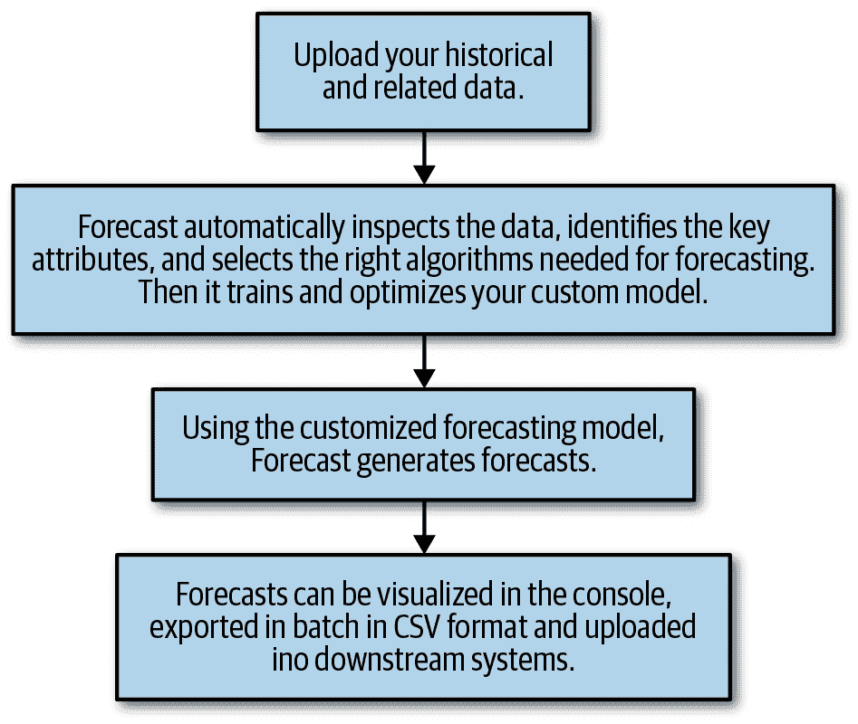

# 第十七章：关于预测的预测

有许多关于预测未来绝望无助的好引言，但我还是忍不住想用一些关于未来即将到来的思考来结束本书。

# 预测作为服务

由于时间序列预测的专业从业者比数据科学的其他领域少，因此有一种驱动力去开发时间序列分析和预测作为服务，可以轻松打包并以高效的方式推广。例如，正如在第十六章中所述，亚马逊最近推出了一个时间序列预测服务，并且不止这一家公司这么做。该公司的模型似乎有意地设计得很通用，并将预测框架化为数据管道中的一个步骤（见图 17-1）。

这些作为服务的预测建模努力旨在创建一个足够好的通用模型，可以适应各种领域，避免进行极不准确的预测。它们大多描述其模型为深度学习和传统统计模型的混合使用。然而，由于该服务最终是一个黑盒子，难以理解可能导致预测错误的原因，甚至很难事后调查如何改进预测。这意味着预测的质量水平相当高，但可能也存在性能上限。

这项服务对于需要大量预测但没有足够人手逐个生成的公司非常有价值。然而，对于拥有大量历史数据的公司来说，如果能发现更一般性的启发法则和他们数据的“定律”，熟悉领域的分析师很可能能够胜过这些算法。

###### 图 17-1\. 一个时间序列预测作为服务的示例管道。类似的服务由多家小型初创公司和科技巨头提供，尤其是亚马逊，其推出了一套产品，专门针对自动和大规模时间序列数据预测，通过深度学习和统计模型驱动。

注意，预测作为服务领域销售的产品中，有相当一部分与预测的良好可视化以及管道工具有关，可以轻松修订预测、更改预测频率等。即使您的组织最终将开展自己的预测分析，了解正在兴起的行业标准也可能会有所帮助。

# 深度学习增强了概率可能性

在过去的几年里，许多最大的科技公司已经公开了一些关于它们如何为其最重要的服务进行预测的信息。在这种情况下，我们不是在谈论需要对影响公司业务的大量指标进行多个并行预测的需求，而是核心关注点。在这些情况下，预测质量至关重要，公司通常表明它们正在使用带有概率组成部分的深度学习技术。

例如，Uber 已经[发布博文](https://perma.cc/3W54-BK8C)关于预测乘车需求，亚马逊则开发了一个备受推崇的[自回归递归神经网络](https://perma.cc/UL77-BY3T)，灵感来自于统计思想，用于预测产品需求。研究人员越能整合统计方法论，比如注入领域知识的先验和不确定性量化，寻找深度学习模型的理由就越少，因为深度学习模型可以同时提供统计学和深度学习的优势。

然而，制作合理可解释的深度学习模型——以便我们知道预测可能有多么“错误”或极端——仍然是一项困难的任务，因此传统的统计模型可能不会被抛弃，它们具有更深的理论理解和机械清晰度。对于那些健康和安全可能受到威胁的关键预测，人们可能会继续依赖几十年来有效的方法，直到能够为机器学习预测开发更透明和可检验的方法为止。

# 机器学习的重要性日益增加，而不是统计学

从经验上看，在建模数据和生成预测方面，使用适当的统计学方法似乎越来越少。不要绝望：统计学领域仍在蓬勃发展，并回答与统计学相关的有趣问题。然而，尤其是对于仅需达到足够水平的低风险预测来说，机器学习技术和以结果为导向的统计方法，而不是花哨的理论和闭式解或收敛证明，正在实际部署和现实用例中占据主导地位。

从从业者的角度来看，这是件好事。如果你很久以前就愉快地把问题集抛在脑后，不想再去证明什么，你就不必担心证明和类似的事情会再次出现。另一方面，随着这些技术渗透到生活中越来越多的基本方面，这是一个令人担忧的趋势。我并不介意访问使用机器学习来猜测我未来购买行为的零售商网站。但我希望知道，模拟我的健康结果或我的孩子学术进展的时间序列预测更为全面，并且在统计上得到验证，因为一个有偏的模型在这些核心领域可能会真正伤害到某人。

目前，用于工业目的的时间序列思维领袖正在从事低风险领域的工作。对于预测来自广告活动或社交媒体产品推出的收入等问题，预测是否经过完全验证并不重要。随着更多与人类生活关怀和喂养相关的基本方面进入建模领域，让我们希望统计学在高风险预测中发挥更加基础性的作用。

# 统计和机器学习方法的组合日益增多

有多种迹象表明，应该将机器学习和统计方法¹结合起来，而不仅仅是简单地寻找用于预测的“最佳”方法。这是对合成方法在预测中日益被接受和使用的延伸，这一现象在本书中我们已经讨论过。

一个具有许多真实数据集的非常健壮测试的例子是最近的[M4 竞赛](https://perma.cc/68AC-BKN7)，这是一个测量[100,00 个时间序列数据集](https://perma.cc/76BQ-SZW9)预测准确性的时间序列竞赛，如第二章和第九章简要提到。这次比赛的获胜作品结合了统计模型和神经网络的元素。同样，亚军则结合了机器学习和统计学，这种情况下使用了一个统计模型的集合，然后使用梯度增强树（`XGBoost`）来选择集合中每个模型的相对权重。在这个例子中，我们看到了机器学习和统计方法可以结合的两种独特方式：一种是作为替代模型组合在一起（就像获胜作品的情况），另一种是一种方法确定另一方法的元参数设定（就像亚军的情况）。随后，这次竞赛结果的一份全面且高度可访问的[总结](https://perma.cc/T8WW-6MDN)随后发表在*国际预测杂志*上。

随着这些组合方法获得认可，我们可能会看到研究在确定哪些问题最适合结合统计和机器学习模型方面的发展，以及关于调整这些模型性能和选择架构的最佳实践的出现。我们预计会看到与其他复杂架构（例如神经网络）类似的精炼，随着时间的推移出现已知的设计范式，具有已知的优势、劣势和训练技术。

# 更多面向日常生活的预测

越来越多面向消费者的公司，如移动健康和健康应用程序，已经[推出](https://perma.cc/QXT9-4B8T)或[被要求推出](https://perma.cc/M8W7-EDCE)个性化预测。随着人们越来越意识到他们的应用程序存储了多少关于他们和他人的数据，他们希望通过获取针对诸如健康和健身目标等指标的定制预测来利用这些数据。同样，人们经常寻找关于从[未来房地产价值](https://perma.cc/R5WR-T7XP)(难以预测)到[候鸟物种可能到达的日期](https://perma.cc/5LTM-WRPB)的预测。

越来越多的产品明确受到需求驱动，要进行预测，无论是在奥秘主题上还是个体指标上。这意味着更多的预测管道将被整合到以前不太可能的地方，例如面向休闲读者而非行业专家的移动应用程序和网站。这种情况变得越来越普遍，时间序列术语很可能成为日常语言的一部分。希望人们也能获得足够的时间序列教育，以理解预测的限制和假设，这样他们就不会过度依赖这些产品。

¹ 特别感谢技术审阅者罗布·亨德曼（Rob Hyndman），他建议了这个话题（以及书中许多其他有用的建议）。
