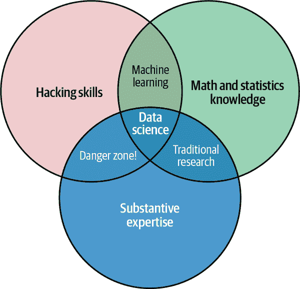

# 前言

# 什么是数据科学？

这是一本关于使用 Python 进行数据科学的书籍，这立即引发了一个问题：什么是*数据科学*？这是一个令人惊讶地难以定义的问题，特别是考虑到这个术语已经如此普遍。激烈的批评者们曾将其视为一个多余的标签（毕竟，哪门科学不涉及数据？）或者一个简单的流行语，只存在于简历中或吸引过度热衷的技术招聘者的眼球。

在我看来，这些批评忽略了一些重要的东西。尽管数据科学带有被夸大的光环，但它或许是我们在工业和学术界越来越重要的许多应用中拥有的跨学科技能集合的最佳标签。跨学科的部分至关重要：在我看来，关于数据科学最好的现有定义可以通过德鲁·康威于 2010 年 9 月在他的博客上首次发布的数据科学维恩图来说明（图 P-1）。

虽然一些交集标签有些玩味，但这张图表捕捉到了人们说“数据科学”时我认为的本质：它本质上是一门跨学科的学科。数据科学包括三个明确且有重叠的领域：*统计学家*的技能，他们知道如何对数据集进行建模和总结（这些数据集越来越大）；*计算机科学家*的技能，能够设计和使用算法来高效存储、处理和可视化这些数据；以及*领域专业知识*，我们可以称之为在一个学科中的“经典”训练，既需要制定正确的问题，又需要将其答案放入背景中。

在这种情况下，我鼓励您把数据科学看作不是要学习的新知识领域，而是可以应用于您当前专业领域的一组新技能。无论您是在报告选举结果、预测股票回报、优化在线广告点击、识别显微镜照片中的微生物、寻找新的天文物体类别，还是在任何其他领域处理数据，本书的目标是赋予您提出和回答有关所选主题领域的新问题的能力。



###### 图 P-1\. 德鲁·康威的数据科学维恩图（来源：[德鲁·康威](https://oreil.ly/PkOOw)，获得授权使用）

# 这本书是为谁写的？

在我在华盛顿大学以及各种技术会议和聚会上的教学中，我经常听到一个最常见的问题：“我应该如何学习 Python？” 提问的人通常是技术背景的学生、开发人员或研究人员，他们通常已经具有编写代码和使用计算和数值工具的坚实背景。大多数这些人不是想学习 Python 本身，而是想学习这门语言，以便将其作为数据密集型和计算科学的工具使用。尽管针对这一受众的大量视频、博客文章和教程在线上都可以找到，但长期以来我一直对这个问题缺乏一个单一的好答案感到沮丧；这就是这本书的灵感来源。

本书不旨在介绍 Python 或编程的基础知识；我假设读者已经熟悉 Python 语言，包括定义函数、赋值变量、调用对象的方法、控制程序流程以及其他基本任务。相反，它旨在帮助 Python 用户学习如何有效地使用 Python 的数据科学堆栈——如以下章节中提到的库和相关工具——来有效地存储、操作和从数据中获取见解。

# 为什么选择 Python？

过去几十年间，Python 已经成为科学计算任务的一流工具，包括大数据集的分析和可视化。这可能让 Python 语言的早期支持者感到惊讶：语言本身并不是专门设计用于数据分析或科学计算。Python 在数据科学中的实用性主要源于第三方包的大规模和活跃生态系统：*NumPy*用于处理同质数组数据，*Pandas*用于处理异构和标记数据，*SciPy*用于常见的科学计算任务，*Matplotlib*用于出版质量的可视化，*IPython*用于交互式执行和代码共享，*Scikit-Learn*用于机器学习，以及许多其他工具，这些工具将在接下来的页面中提到。

如果您正在寻找关于 Python 语言本身的指南，我建议参考本书的姊妹项目 [*Python 旋风之旅*](https://oreil.ly/jFtWj)。这份简短的报告为熟悉一种或多种其他编程语言的数据科学家提供了 Python 语言基本功能的概览。

# 书籍大纲

本书的每个编号部分都专注于贡献 Python 数据科学故事基础部分的特定包或工具，并分为短小而自包含的章节，每章讨论一个单一概念：

+   第一部分，“Jupyter: 超越普通 Python” 介绍了 IPython 和 Jupyter。这些包提供了许多使用 Python 的数据科学家工作的计算环境。

+   第二部分，“NumPy 简介”专注于 NumPy 库，它提供了`ndarray`，用于 Python 中密集数据数组的高效存储和操作。

+   第三部分，“使用 Pandas 进行数据操作”介绍了 Pandas 库，它提供了`DataFrame`，用于 Python 中标记/列数据的高效存储和操作。

+   第四部分，“使用 Matplotlib 进行可视化”专注于 Matplotlib，这是一个提供灵活数据可视化能力的 Python 库。

+   第五部分，“机器学习”侧重于 Scikit-Learn 库，它提供了最重要和已建立的机器学习算法的高效且干净的 Python 实现。

PyData 世界显然比这六个软件包要大得多，而且它每天都在增长。考虑到这一点，我在本书中的每一个地方都尽力提供有关其他有趣工作、项目和软件包的参考信息，它们正在推动 Python 所能做的事情的边界。尽管如此，我专注的软件包目前对 Python 数据科学领域的许多工作至关重要，我预计它们在生态系统继续围绕它们增长的同时将继续保持重要性。

# 安装考虑事项

安装 Python 及其科学计算库套件是很简单的。本节将概述在设置计算机时需要考虑的一些事项。

尽管有各种安装 Python 的方式，但我建议用于数据科学的一个是 Anaconda 发行版，无论您使用 Windows、Linux 还是 macOS，它的工作方式都类似。Anaconda 发行版有两种版本：

+   [Miniconda](https://oreil.ly/dH7wJ)提供了 Python 解释器本身，以及一个名为*conda*的命令行工具，它作为一个跨平台的 Python 软件包管理器，类似于 Linux 用户熟悉的 apt 或 yum 工具。

+   [Anaconda](https://oreil.ly/ndxjm)包含 Python 和 conda，并且还捆绑了一套其他预装的面向科学计算的软件包。由于这一捆绑包的大小，安装过程将消耗几个千兆字节的磁盘空间。

Anaconda 中包含的任何软件包也可以手动安装在 Miniconda 之上；因此，我建议从 Miniconda 开始。

要开始，请下载并安装 Miniconda 包 —— 确保选择带有 Python 3 的版本 —— 然后安装本书中使用的核心包:

```py
[~]$ conda install numpy pandas scikit-learn matplotlib seaborn jupyter

```

在整个文本中，我们还将使用 Python 科学生态系统中的其他更专业的工具；安装通常只需输入**`conda install *packagename*`**。如果您遇到默认 conda 频道中不可用的软件包，请务必查看[*conda-forge*](https://oreil.ly/CCvwQ)，这是一个广泛的、社区驱动的 conda 软件包存储库。

要了解 conda 的更多信息，包括关于创建和使用 conda 环境的信息（我强烈推荐），请参阅[conda 的在线文档](https://oreil.ly/MkqPw)。

# 本书中使用的约定

本书使用以下排版约定：

*斜体*

表示新术语、URL、电子邮件地址、文件名和文件扩展名。

`常量宽度`

用于程序列表以及段落内引用程序元素，例如变量或函数名称、数据库、数据类型、环境变量、语句和关键字。

**`常量宽度粗体`**

显示用户应该按照字面意义输入的命令或其他文本。

*`常量宽度斜体`*

显示应替换为用户提供值或由上下文确定值的文本。

###### 注意

这个元素表示一个一般的注意事项。

# 使用代码示例

补充材料（代码示例、图表等）可在[*http://github.com/jakevdp/PythonDataScienceHandbook*](http://github.com/jakevdp/PythonDataScienceHandbook)下载。

如果您有技术问题或在使用代码示例时遇到问题，请发送电子邮件至*bookquestions@oreilly.com*。

这本书旨在帮助您完成工作。一般情况下，如果本书提供了示例代码，您可以在自己的程序和文档中使用它。除非您复制了大部分代码，否则无需征得我们的许可。例如，编写一个使用本书多个代码片段的程序不需要许可。销售或分发 O'Reilly 书籍中的示例则需要许可。引用本书并引用示例代码来回答问题无需许可。将本书中大量示例代码整合到产品文档中则需要许可。

我们感谢您的致谢，但一般情况下不需要署名。致谢通常包括书名、作者、出版社和 ISBN。例如："*Python 数据科学手册*，第 2 版，作者 Jake VanderPlas（O'Reilly）。版权所有 2023 年 Jake VanderPlas，978-1-098-12122-8。"

如果您觉得您对代码示例的使用超出了公平使用范围或上述许可，请随时通过*permissions@oreilly.com*与我们联系。

# O'Reilly 在线学习

###### 注意

超过 40 年来，[*O'Reilly Media*](https://oreilly.com)已经为企业提供技术和商业培训、知识和见解，帮助公司取得成功。

我们独特的专家和创新者网络通过书籍、文章和我们的在线学习平台分享他们的知识和专长。O’Reilly 的在线学习平台让您随时访问现场培训课程、深度学习路径、交互式编码环境以及来自 O’Reilly 和其他 200 多个出版商的大量文本和视频。更多信息，请访问[*https://oreilly.com*](https://oreilly.com)。

# 如何联系我们

请将有关本书的评论和问题发送至出版商：

+   O’Reilly Media, Inc.

+   1005 Gravenstein Highway North

+   Sebastopol, CA 95472

+   800-998-9938（美国或加拿大）

+   707-829-0515（国际或本地）

+   707-829-0104（传真）

我们为本书建立了一个网页，列出勘误、示例以及任何额外信息。您可以访问该网页：[*https://oreil.ly/python-data-science-handbook*](https://oreil.ly/python-data-science-handbook)。

发送电子邮件至*bookquestions@oreilly.com*以评论或询问有关本书的技术问题。

关于我们的书籍和课程的新闻和信息，请访问[*https://oreilly.com*](https://oreilly.com)。

在 LinkedIn 上找到我们：[*https://linkedin.com/company/oreilly-media*](https://linkedin.com/company/oreilly-media)。

在 Twitter 上关注我们：[*https://twitter.com/oreillymedia*](https://twitter.com/oreillymedia)。

在 YouTube 上关注我们：[*https://youtube.com/oreillymedia*](https://youtube.com/oreillymedia)。
