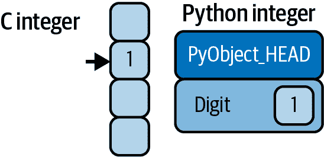
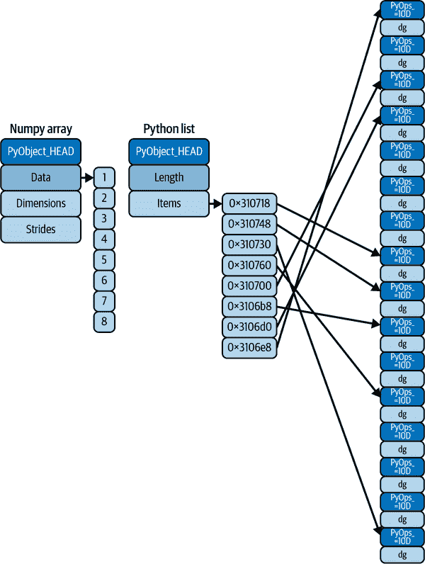

# 第四章：理解 Python 中的数据类型

有效的数据驱动科学和计算需要理解数据如何存储和操作。本章概述了在 Python 语言本身中如何处理数据数组，并介绍了 NumPy 在此基础上的改进。理解这种差异对于理解本书其余部分的材料至关重要。

Python 的用户经常被其易用性所吸引，其中一个因素是动态类型。而静态类型语言如 C 或 Java 要求每个变量都必须显式声明，而像 Python 这样的动态类型语言则跳过了这个规范。例如，在 C 语言中，您可能会这样指定特定的操作：

```py
/* C code */
int result = 0;
for(int i=0; i<100; i++){
    result += i;
}
```

而在 Python 中，等价的操作可以这样写：

```py
# Python code
result = 0
for i in range(100):
    result += i
```

注意一个主要区别：在 C 语言中，每个变量的数据类型都是显式声明的，而在 Python 中类型是动态推断的。这意味着，例如，我们可以将任何类型的数据分配给任何变量：

```py
# Python code
x = 4
x = "four"
```

在这里，我们已经将`x`的内容从整数变为字符串。在 C 语言中，相同操作会导致（依赖于编译器设置）编译错误或其他意外后果：

```py
/* C code */
int x = 4;
x = "four";  // FAILS
```

这种灵活性是 Python 和其他动态类型语言方便和易于使用的一个要素。理解*这是如何工作*是学习如何有效和有效地分析数据的重要一环。但是，这种类型灵活性也指出了 Python 变量不仅仅是它们的值；它们还包含关于值的*类型*的额外信息。我们将在接下来的章节中更多地探讨这一点。

# Python 整数不仅仅是一个整数

标准的 Python 实现是用 C 编写的。这意味着每个 Python 对象实际上是一个巧妙伪装的 C 结构，不仅包含其值，还包含其他信息。例如，当我们在 Python 中定义一个整数，如`x = 10000`，`x`不只是一个“原始”整数。它实际上是一个指向复合 C 结构的指针，该结构包含几个值。浏览 Python 3.10 源代码时，我们发现整数（long）类型定义实际上看起来是这样的（一旦 C 宏被展开）：

```py
struct _longobject {
    long ob_refcnt;
    PyTypeObject *ob_type;
    size_t ob_size;
    long ob_digit[1];
};
```

在 Python 3.10 中，一个单独的整数实际上包含四个部分：

+   `ob_refcnt`，一个引用计数，帮助 Python 静默处理内存分配和释放

+   `ob_type`，编码变量的类型

+   `ob_size`指定了接下来的数据成员的大小。

+   `ob_digit`包含了我们期望 Python 变量表示的实际整数值。

这意味着在 Python 中存储整数与在编译语言如 C 中的存储相比，会有一些额外开销，正如图 4-1 所示。



###### 图 4-1. C 和 Python 整数的差异

这里，`PyObject_HEAD` 是包含引用计数、类型代码和之前提到的其他部分的结构的一部分。

注意这里的区别：C 整数本质上是一个标签，指向内存中的一个位置，其字节编码包含一个整数值。Python 整数是指向内存中包含所有 Python 对象信息的位置的指针，包括包含整数值的字节。Python 整数结构中的这些额外信息是允许 Python 如此自由和动态编码的原因。然而，Python 类型中的所有这些额外信息都是有代价的，特别是在结合许多这些对象的结构中尤为明显。

# Python 列表不仅仅是一个列表

现在让我们考虑当我们使用一个包含许多 Python 对象的 Python 数据结构时会发生什么。Python 中标准的可变多元素容器是列表。我们可以按照以下方式创建一个整数列表：

```py
In [1]: L = list(range(10))
        L
Out[1]: [0, 1, 2, 3, 4, 5, 6, 7, 8, 9]
```

```py
In [2]: type(L[0])
Out[2]: int
```

或者，类似地，一个字符串列表：

```py
In [3]: L2 = [str(c) for c in L]
        L2
Out[3]: ['0', '1', '2', '3', '4', '5', '6', '7', '8', '9']
```

```py
In [4]: type(L2[0])
Out[4]: str
```

由于 Python 的动态类型，我们甚至可以创建异构列表：

```py
In [5]: L3 = [True, "2", 3.0, 4]
        [type(item) for item in L3]
Out[5]: [bool, str, float, int]
```

但这种灵活性是有代价的：为了允许这些灵活的类型，列表中的每个项目都必须包含自己的类型、引用计数和其他信息。也就是说，每个项目都是一个完整的 Python 对象。在所有变量都是相同类型的特殊情况下，大部分信息是冗余的，因此将数据存储在固定类型的数组中可能更有效。动态类型列表和固定类型（NumPy 风格）数组之间的区别在 图 4-2 中有所说明。



###### 图 4-2\. C 和 Python 列表之间的区别

在实现级别上，数组基本上包含一个指向一个连续数据块的单个指针。另一方面，Python 列表包含一个指向指针块的指针，每个指针又指向一个完整的 Python 对象，就像我们之前看到的 Python 整数一样。再次强调列表的优势在于灵活性：因为每个列表元素都是一个包含数据和类型信息的完整结构，所以列表可以填充任何所需类型的数据。固定类型的 NumPy 风格数组缺乏这种灵活性，但对于存储和操作数据来说更加高效。

# Python 中的固定类型数组

Python 提供了几种不同的选项来在高效的固定类型数据缓冲区中存储数据。内置的 `array` 模块（自 Python 3.3 起可用）可用于创建统一类型的密集数组：

```py
In [6]: import array
        L = list(range(10))
        A = array.array('i', L)
        A
Out[6]: array('i', [0, 1, 2, 3, 4, 5, 6, 7, 8, 9])
```

这里，`'i'` 是指示内容为整数的类型代码。

然而，更有用的是 NumPy 包的 `ndarray` 对象。虽然 Python 的 `array` 对象提供了对基于数组的数据的有效存储，但 NumPy 在此基础上添加了对该数据的有效*操作*。我们将在后面的章节中探讨这些操作；接下来，我将向您展示创建 NumPy 数组的几种不同方法。

# 从 Python 列表创建数组

我们将从标准的 NumPy 导入开始，使用别名 `np`：

```py
In [7]: import numpy as np
```

现在我们可以使用 `np.array` 来从 Python 列表创建数组：

```py
In [8]: # Integer array
        np.array([1, 4, 2, 5, 3])
Out[8]: array([1, 4, 2, 5, 3])
```

请记住，与 Python 列表不同，NumPy 数组只能包含相同类型的数据。如果类型不匹配，NumPy 将根据其类型提升规则进行类型提升；在这里，整数被提升为浮点数：

```py
In [9]: np.array([3.14, 4, 2, 3])
Out[9]: array([3.14, 4.  , 2.  , 3.  ])
```

如果我们想要显式地设置结果数组的数据类型，可以使用 `dtype` 关键字：

```py
In [10]: np.array([1, 2, 3, 4], dtype=np.float32)
Out[10]: array([1., 2., 3., 4.], dtype=float32)
```

最后，与 Python 列表不同，NumPy 数组可以是多维的。以下是使用列表的列表初始化多维数组的一种方法：

```py
In [11]: # Nested lists result in multidimensional arrays
         np.array([range(i, i + 3) for i in [2, 4, 6]])
Out[11]: array([[2, 3, 4],
                [4, 5, 6],
                [6, 7, 8]])
```

内部列表被视为生成的二维数组的行。

# 从头创建数组

特别是对于较大的数组，使用 NumPy 内置的函数从头创建数组更有效率。以下是几个示例：

```py
In [12]: # Create a length-10 integer array filled with 0s
         np.zeros(10, dtype=int)
Out[12]: array([0, 0, 0, 0, 0, 0, 0, 0, 0, 0])
```

```py
In [13]: # Create a 3x5 floating-point array filled with 1s
         np.ones((3, 5), dtype=float)
Out[13]: array([[1., 1., 1., 1., 1.],
                [1., 1., 1., 1., 1.],
                [1., 1., 1., 1., 1.]])
```

```py
In [14]: # Create a 3x5 array filled with 3.14
         np.full((3, 5), 3.14)
Out[14]: array([[3.14, 3.14, 3.14, 3.14, 3.14],
                [3.14, 3.14, 3.14, 3.14, 3.14],
                [3.14, 3.14, 3.14, 3.14, 3.14]])
```

```py
In [15]: # Create an array filled with a linear sequence
         # starting at 0, ending at 20, stepping by 2
         # (this is similar to the built-in range function)
         np.arange(0, 20, 2)
Out[15]: array([ 0,  2,  4,  6,  8, 10, 12, 14, 16, 18])
```

```py
In [16]: # Create an array of five values evenly spaced between 0 and 1
         np.linspace(0, 1, 5)
Out[16]: array([0.  , 0.25, 0.5 , 0.75, 1.  ])
```

```py
In [17]: # Create a 3x3 array of uniformly distributed
         # pseudorandom values between 0 and 1
         np.random.random((3, 3))
Out[17]: array([[0.09610171, 0.88193001, 0.70548015],
                [0.35885395, 0.91670468, 0.8721031 ],
                [0.73237865, 0.09708562, 0.52506779]])
```

```py
In [18]: # Create a 3x3 array of normally distributed pseudorandom
         # values with mean 0 and standard deviation 1
         np.random.normal(0, 1, (3, 3))
Out[18]: array([[-0.46652655, -0.59158776, -1.05392451],
                [-1.72634268,  0.03194069, -0.51048869],
                [ 1.41240208,  1.77734462, -0.43820037]])
```

```py
In [19]: # Create a 3x3 array of pseudorandom integers in the interval [0, 10)
         np.random.randint(0, 10, (3, 3))
Out[19]: array([[4, 3, 8],
                [6, 5, 0],
                [1, 1, 4]])
```

```py
In [20]: # Create a 3x3 identity matrix
         np.eye(3)
Out[20]: array([[1., 0., 0.],
                [0., 1., 0.],
                [0., 0., 1.]])
```

```py
In [21]: # Create an uninitialized array of three integers; the values will be
         # whatever happens to already exist at that memory location
         np.empty(3)
Out[21]: array([1., 1., 1.])
```

# NumPy 标准数据类型

NumPy 数组包含单一类型的值，因此对这些类型及其限制有详细了解很重要。因为 NumPy 是用 C 语言构建的，所以这些类型对于使用 C、Fortran 和其他相关语言的用户来说应该很熟悉。

标准的 NumPy 数据类型列在 表 4-1 中。注意，在构建数组时，它们可以使用字符串来指定：

```py
np.zeros(10, dtype='int16')
```

或者使用相关的 NumPy 对象：

```py
np.zeros(10, dtype=np.int16)
```

可以进行更高级的类型规定，例如指定大端或小端数字；有关更多信息，请参阅 [NumPy 文档](http://numpy.org)。NumPy 还支持复合数据类型，这将在 第 12 章 中介绍。

表 4-1\. 标准的 NumPy 数据类型

| 数据类型 | 描述 |
| --- | --- |
| `bool_` | 存储为字节的布尔值（True 或 False） |
| `int_` | 默认整数类型（与 C 语言的 `long` 相同；通常是 `int64` 或 `int32`） |
| `intc` | 与 C 语言 `int` 相同（通常是 `int32` 或 `int64`） |
| `intp` | 用于索引的整数（与 C 语言的 `ssize_t` 相同；通常是 `int32` 或 `int64`） |
| `int8` | 字节（–128 到 127） |
| `int16` | 整数（–32768 到 32767） |
| `int32` | 整数（–2147483648 到 2147483647） |
| `int64` | 整数（–9223372036854775808 到 9223372036854775807） |
| `uint8` | 无符号整数（0 到 255） |
| `uint16` | 无符号整数（0 到 65535） |
| `uint32` | 无符号整数（0 到 4294967295） |
| `uint64` | 无符号整数（0 到 18446744073709551615） |
| `float_` | `float64` 的简写 |
| `float16` | 半精度浮点数：符号位，5 位指数，10 位尾数 |
| `float32` | 单精度浮点数：符号位，8 位指数，23 位尾数 |
| `float64` | 双精度浮点数：符号位，11 位指数，52 位尾数 |
| `complex_` | `complex128` 的简写 |
| `complex64` | 复数，由两个 32 位浮点数表示 |
| `complex128` | 复数，由两个 64 位浮点数表示 |
