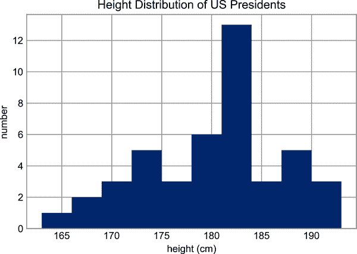

# 第七章：聚合：最小值、最大值以及其他

探索任何数据集的第一步通常是计算各种摘要统计信息。也许最常见的摘要统计信息是均值和标准差，它们帮助你总结数据集中的“典型”值，但其他聚合也很有用（总和、乘积、中位数、最小值和最大值、分位数等）。

NumPy 具有用于处理数组的快速内置聚合函数；我们将在这里讨论并尝试其中一些。

# 对数组中的值求和

举个快速的例子，考虑计算数组中所有值的总和。Python 本身可以使用内置的`sum`函数来完成这个操作：

```py
In [1]: import numpy as np
        rng = np.random.default_rng()
```

```py
In [2]: L = rng.random(100)
        sum(L)
Out[2]: 52.76825337322368
```

语法与 NumPy 的`sum`函数非常相似，在最简单的情况下结果是相同的：

```py
In [3]: np.sum(L)
Out[3]: 52.76825337322366
```

然而，由于它在编译代码中执行操作，NumPy 版本的操作速度要快得多：

```py
In [4]: big_array = rng.random(1000000)
        %timeit sum(big_array)
        %timeit np.sum(big_array)
Out[4]: 89.9 ms ± 233 µs per loop (mean ± std. dev. of 7 runs, 10 loops each)
        521 µs ± 8.37 µs per loop (mean ± std. dev. of 7 runs, 1000 loops each)
```

不过要小心：`sum`函数和`np.sum`函数并不相同，这有时可能会导致混淆！特别是，它们的可选参数具有不同的含义（`sum(x, 1)`将总和初始化为`1`，而`np.sum(x, 1)`沿着轴`1`求和），而`np.sum`能够识别多个数组维度，正如我们将在接下来的部分看到的。

# 最小值和最大值

同样，Python 内置了`min`和`max`函数，用于找到任意给定数组的最小值和最大值：

```py
In [5]: min(big_array), max(big_array)
Out[5]: (2.0114398036064074e-07, 0.9999997912802653)
```

NumPy 的相应函数具有类似的语法，并且在操作上也更快：

```py
In [6]: np.min(big_array), np.max(big_array)
Out[6]: (2.0114398036064074e-07, 0.9999997912802653)
```

```py
In [7]: %timeit min(big_array)
        %timeit np.min(big_array)
Out[7]: 72 ms ± 177 µs per loop (mean ± std. dev. of 7 runs, 10 loops each)
        564 µs ± 3.11 µs per loop (mean ± std. dev. of 7 runs, 1000 loops each)
```

对于`min`、`max`、`sum`以及其他几个 NumPy 聚合函数，使用数组对象本身的方法可以简化语法：

```py
In [8]: print(big_array.min(), big_array.max(), big_array.sum())
Out[8]: 2.0114398036064074e-07 0.9999997912802653 499854.0273321711
```

在操作 NumPy 数组时，尽可能确保使用 NumPy 版本的这些聚合函数！

## 多维度聚合

一种常见的聚合操作类型是沿着行或列进行聚合。假设你有一些数据存储在二维数组中：

```py
In [9]: M = rng.integers(0, 10, (3, 4))
        print(M)
Out[9]: [[0 3 1 2]
         [1 9 7 0]
         [4 8 3 7]]
```

NumPy 的聚合函数将应用于多维数组的所有元素：

```py
In [10]: M.sum()
Out[10]: 45
```

聚合函数接受一个额外的参数，指定沿着哪个*轴*进行聚合计算。例如，我们可以通过指定`axis=0`找到每列中的最小值：

```py
In [11]: M.min(axis=0)
Out[11]: array([0, 3, 1, 0])
```

该函数返回四个值，对应于四列数字。

类似地，我们可以找到每行中的最大值：

```py
In [12]: M.max(axis=1)
Out[12]: array([3, 9, 8])
```

此处指定轴的方式可能会令从其他语言转过来的用户感到困惑。`axis`关键字指定将要*折叠*的数组维度，而不是将要返回的维度。因此，指定`axis=0`意味着将折叠轴 0：对于二维数组，将在每列内进行聚合。

## 其他聚合函数

NumPy 提供了几个其他具有类似 API 的聚合函数，此外大多数函数还有一个`NaN`安全的对应版本，用于在计算结果时忽略缺失值，这些值由特殊的 IEEE 浮点`NaN`值标记（参见第十六章）。

表 7-1 提供了 NumPy 中可用的一些有用的聚合函数列表。

表 7-1\. NumPy 中可用的聚合函数

| 函数名 | NaN 安全版本 | 描述 |
| --- | --- | --- |
| `np.sum` | `np.nansum` | 计算元素的总和 |
| `np.prod` | `np.nanprod` | 计算元素的乘积 |
| `np.mean` | `np.nanmean` | 计算元素的均值 |
| `np.std` | `np.nanstd` | 计算标准差 |
| `np.var` | `np.nanvar` | 计算方差 |
| `np.min` | `np.nanmin` | 查找最小值 |
| `np.max` | `np.nanmax` | 查找最大值 |
| `np.argmin` | `np.nanargmin` | 查找最小值的索引 |
| `np.argmax` | `np.nanargmax` | 查找最大值的索引 |
| `np.median` | `np.nanmedian` | 计算元素的中位数 |
| `np.percentile` | `np.nanpercentile` | 计算元素的基于排名的统计信息 |
| `np.any` | N/A | 评估是否有任何元素为真 |
| `np.all` | N/A | 评估所有元素是否为真 |

你将经常看到这些汇总统计信息在本书的其余部分中。

# 示例：美国总统的平均身高是多少？

NumPy 中可用的聚合函数可以作为一组值的汇总统计信息。作为一个小例子，让我们考虑所有美国总统的身高。这些数据包含在文件*president_heights.csv*中，这是一个标签和值的逗号分隔列表：

```py
In [13]: !head -4 data/president_heights.csv
Out[13]: order,name,height(cm)
         1,George Washington,189
         2,John Adams,170
         3,Thomas Jefferson,189
```

我们将使用 Pandas 包，在第 III 部分中更全面地探讨，读取文件并提取这些信息（注意，身高以厘米为单位）：

```py
In [14]: import pandas as pd
         data = pd.read_csv('data/president_heights.csv')
         heights = np.array(data['height(cm)'])
         print(heights)
Out[14]: [189 170 189 163 183 171 185 168 173 183 173 173 175 178 183 193 178 173
          174 183 183 168 170 178 182 180 183 178 182 188 175 179 183 193 182 183
          177 185 188 188 182 185 191 182]
```

现在我们有了这个数据数组，我们可以计算各种汇总统计信息：

```py
In [15]: print("Mean height:       ", heights.mean())
         print("Standard deviation:", heights.std())
         print("Minimum height:    ", heights.min())
         print("Maximum height:    ", heights.max())
Out[15]: Mean height:        180.04545454545453
         Standard deviation: 6.983599441335736
         Minimum height:     163
         Maximum height:     193
```

请注意，在每种情况下，聚合操作将整个数组减少为一个单一的汇总值，这为我们提供了关于值分布的信息。我们可能还希望计算分位数：

```py
In [16]: print("25th percentile:   ", np.percentile(heights, 25))
         print("Median:            ", np.median(heights))
         print("75th percentile:   ", np.percentile(heights, 75))
Out[16]: 25th percentile:    174.75
         Median:             182.0
         75th percentile:    183.5
```

我们看到美国总统的中位身高为 182 厘米，几乎等于六英尺。

当然，有时更有用的是查看这些数据的视觉表示，我们可以使用 Matplotlib 工具来实现这一目标（我们将在第 IV 部分中更全面地讨论 Matplotlib）。例如，以下代码生成图 7-1：

```py
In [17]: %matplotlib inline
         import matplotlib.pyplot as plt
         plt.style.use('seaborn-whitegrid')
```

```py
In [18]: plt.hist(heights)
         plt.title('Height Distribution of US Presidents')
         plt.xlabel('height (cm)')
         plt.ylabel('number');
```



###### 图 7-1\. 美国总统身高的直方图
