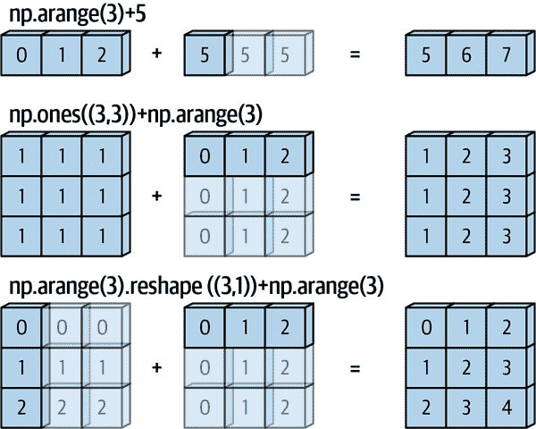
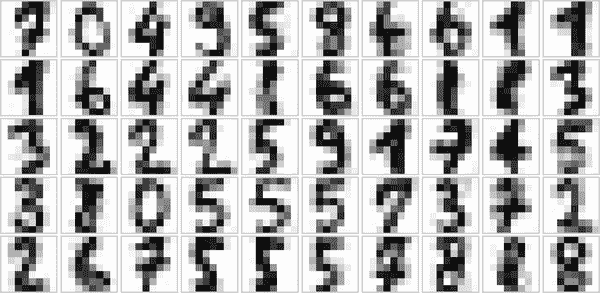

# 第八章：数组上的计算：广播

我们在第六章看到 NumPy 的通用函数如何用于*向量化*操作，从而消除缓慢的 Python 循环。本章讨论*广播*：这是 NumPy 允许你在不同大小和形状的数组之间应用二元操作（如加法、减法、乘法等）的一组规则。

# 引入广播

请记住，对于相同大小的数组，二元操作是逐元素执行的：

```py
In [1]: import numpy as np
```

```py
In [2]: a = np.array([0, 1, 2])
        b = np.array([5, 5, 5])
        a + b
Out[2]: array([5, 6, 7])
```

广播允许在不同大小的数组上执行这些类型的二元操作，例如，我们可以很容易地将标量（将其视为零维数组）加到数组中：

```py
In [3]: a + 5
Out[3]: array([5, 6, 7])
```

我们可以将其视为一种操作，将值`5`拉伸或复制到数组`[5, 5, 5]`中，并添加结果。

我们可以类似地将这个想法扩展到更高维度的数组。观察当我们将一个一维数组加到一个二维数组时的结果：

```py
In [4]: M = np.ones((3, 3))
        M
Out[4]: array([[1., 1., 1.],
               [1., 1., 1.],
               [1., 1., 1.]])
```

```py
In [5]: M + a
Out[5]: array([[1., 2., 3.],
               [1., 2., 3.],
               [1., 2., 3.]])
```

在这里，一维数组`a`通过第二个维度被拉伸或广播，以匹配`M`的形状。

尽管这些示例相对容易理解，但更复杂的情况可能涉及广播两个数组。考虑以下例子：

```py
In [6]: a = np.arange(3)
        b = np.arange(3)[:, np.newaxis]

        print(a)
        print(b)
Out[6]: [0 1 2]
        [[0]
         [1]
         [2]]
```

```py
In [7]: a + b
Out[7]: array([[0, 1, 2],
               [1, 2, 3],
               [2, 3, 4]])
```

就像之前我们将一个值拉伸或广播到另一个形状相匹配的数组一样，这里我们拉伸了`a`和`b`，使它们匹配一个公共形状，结果是一个二维数组！这些示例的几何形状在图 8-1 中可视化。

浅色框表示广播的值。这种关于广播的思考方式可能会引发关于其内存使用效率的疑问，但不用担心：NumPy 广播实际上不会在内存中复制广播的值。尽管如此，这种思维模型在我们思考广播时仍然很有用。



###### 图 8-1\. NumPy 广播可视化（改编自 [astroML 文档](http://astroml.org)，并获得许可使用）¹

# Broadcasting 规则

NumPy 中的广播遵循一组严格的规则来确定两个数组之间的交互：

规则 1

如果两个数组在它们的维数上不同，维数较少的数组的形状将在其前导（左）侧填充`1`。

规则 2

如果两个数组在任何维度上的形状不匹配，则具有在该维度上形状等于 1 的数组将被拉伸以匹配另一个形状。

规则 3

如果在任何维度上大小不一致且都不等于 1，则会引发错误。

为了澄清这些规则，让我们详细考虑几个例子。

## 广播示例 1

假设我们想将一个二维数组加到一个一维数组中：

```py
In [8]: M = np.ones((2, 3))
        a = np.arange(3)
```

让我们考虑对这两个具有以下形状的数组进行操作：

+   `M.shape` 是 `(2, 3)`

+   `a.shape` 是 `(3,)`

我们看到按照规则 1，数组 `a` 的维度较少，因此我们在左侧用 `1` 填充它：

+   `M.shape` 仍然是 `(2, 3)`

+   `a.shape` 变为 `(1, 3)`

根据规则 2，我们现在看到第一个维度不匹配，所以我们拉伸这个维度以匹配：

+   `M.shape` 仍然是 `(2, 3)`

+   `a.shape` 变为 `(2, 3)`

现在形状匹配了，我们可以看到最终的形状将是 `(2, 3)`：

```py
In [9]: M + a
Out[9]: array([[1., 2., 3.],
               [1., 2., 3.]])
```

## 广播示例 2

现在让我们看一个需要广播两个数组的例子：

```py
In [10]: a = np.arange(3).reshape((3, 1))
         b = np.arange(3)
```

再次，我们将确定数组的形状：

+   `a.shape` 是 `(3, 1)`

+   `b.shape` 是 `(3,)`

规则 1 表示我们必须用 `1` 填充 `b` 的形状：

+   `a.shape` 仍然是 `(3, 1)`

+   `b.shape` 变为 `(1, 3)`

规则 2 告诉我们，我们必须将每个 `1` 扩展到与另一个数组的相应大小匹配：

+   `a.shape` 变为 `(3, 3)`

+   `b.shape` 变为 `(3, 3)`

因为结果匹配，这些形状是兼容的。我们可以在这里看到：

```py
In [11]: a + b
Out[11]: array([[0, 1, 2],
                [1, 2, 3],
                [2, 3, 4]])
```

## 广播示例 3

接下来，让我们看一个两个数组不兼容的例子：

```py
In [12]: M = np.ones((3, 2))
         a = np.arange(3)
```

这只是比第一个例子略有不同的情况：矩阵 `M` 被转置了。这对计算有什么影响？数组的形状如下：

+   `M.shape` 是 `(3, 2)`

+   `a.shape` 是 `(3,)`

再次，规则 1 告诉我们，我们必须用 `1` 填充 `a` 的形状：

+   `M.shape` 仍然是 `(3, 2)`

+   `a.shape` 变为 `(1, 3)`

根据规则 2，`a` 的第一个维度被拉伸以匹配 `M` 的维度：

+   `M.shape` 仍然是 `(3, 2)`

+   `a.shape` 变为 `(3, 3)`

现在我们遇到了规则 3——最终的形状不匹配，所以这两个数组是不兼容的，我们可以通过尝试这个操作来观察：

```py
In [13]: M + a
ValueError: operands could not be broadcast together with shapes (3,2) (3,)
```

注意这里的潜在混淆：你可以想象通过在右侧而不是左侧用 `1` 填充 `a` 的形状来使 `a` 和 `M` 兼容。但这不是广播规则的工作方式！这种灵活性在某些情况下可能很有用，但它会导致潜在的歧义。如果你想要右侧填充，你可以通过显式地重新塑造数组来实现（我们将在第五章介绍 `np.newaxis` 关键字来实现这一点）：

```py
In [14]: a[:, np.newaxis].shape
Out[14]: (3, 1)
```

```py
In [15]: M + a[:, np.newaxis]
Out[15]: array([[1., 1.],
                [2., 2.],
                [3., 3.]])
```

虽然我们在这里专注于 `+` 运算符，但这些广播规则适用于*任何*二元通用函数。例如，这是 `logaddexp(a, b)` 函数的示例，它计算 `log(exp(a) + exp(b))` 比朴素方法更精确：

```py
In [16]: np.logaddexp(M, a[:, np.newaxis])
Out[16]: array([[1.31326169, 1.31326169],
                [1.69314718, 1.69314718],
                [2.31326169, 2.31326169]])
```

欲知更多关于多个可用的通用函数的信息，请参阅第六章。

# 实际广播应用

广播操作是本书中许多示例的核心。现在让我们看看它们在哪些情况下可以派上用场。

## 数组居中

在第 6 章中，我们看到 ufunc 允许 NumPy 用户避免显式编写缓慢的 Python 循环。广播扩展了这种能力。数据科学中经常见到的一个例子是从数据数组中减去逐行均值。假设我们有一个由 10 个观测组成的数组，每个观测包含 3 个值。按照标准惯例（参见第 38 章），我们将其存储在一个<math alttext="10 times 3"><mrow><mn>10</mn> <mo>×</mo> <mn>3</mn></mrow></math>数组中：

```py
In [17]: rng = np.random.default_rng(seed=1701)
         X = rng.random((10, 3))
```

我们可以使用沿第一维度的 `mean` 聚合计算每列的均值：

```py
In [18]: Xmean = X.mean(0)
         Xmean
Out[18]: array([0.38503638, 0.36991443, 0.63896043])
```

现在我们可以通过减去均值来将 `X` 数组居中（这是一个广播操作）：

```py
In [19]: X_centered = X - Xmean
```

为了确保我们做得正确，我们可以检查居中数组的平均值是否接近零：

```py
In [20]: X_centered.mean(0)
Out[20]: array([ 4.99600361e-17, -4.44089210e-17,  0.00000000e+00])
```

机器精度内，均值现在为零。

## 绘制二维函数

广播经常派上用场的一个地方是基于二维函数显示图像。如果我们想定义一个函数<math alttext="z equals f left-parenthesis x comma y right-parenthesis"><mrow><mi>z</mi> <mo>=</mo> <mi>f</mi> <mo>(</mo> <mi>x</mi> <mo>,</mo> <mi>y</mi> <mo>)</mo></mrow></math>，可以使用广播来计算整个网格上的函数：

```py
In [21]: # x and y have 50 steps from 0 to 5
         x = np.linspace(0, 5, 50)
         y = np.linspace(0, 5, 50)[:, np.newaxis]

         z = np.sin(x) ** 10 + np.cos(10 + y * x) * np.cos(x)
```

我们将使用 Matplotlib 绘制这个二维数组，如图 8-2 所示（这些工具将在第 28 章中全面讨论）：

```py
In [22]: %matplotlib inline
         import matplotlib.pyplot as plt
```

```py
In [23]: plt.imshow(z, origin='lower', extent=[0, 5, 0, 5])
         plt.colorbar();
```



###### 图 8-2\. 二维数组的可视化

结果是二维函数引人注目的可视化。

¹ 生成此图的代码可在在线[附录](https://oreil.ly/gtOaU)中找到。
