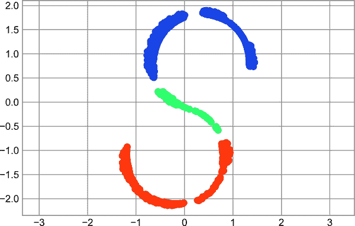

# 第十章：Fancy 索引

前面的章节讨论了如何使用简单索引（例如 `arr[0]`）、切片（例如 `arr[:5]`）和布尔掩码（例如 `arr[arr > 0]`）来访问和修改数组的部分内容。在本章中，我们将看看另一种数组索引方式，称为*fancy*或*向量化*索引，在这种方式中，我们传递数组索引替代单个标量。这使得我们能够非常快速地访问和修改数组值的复杂子集。

# 探索 Fancy 索引

Fancy 索引在概念上很简单：它意味着传递一个索引数组以一次访问多个数组元素。例如，考虑以下数组：

```py
In [1]: import numpy as np
        rng = np.random.default_rng(seed=1701)

        x = rng.integers(100, size=10)
        print(x)
Out[1]: [90 40  9 30 80 67 39 15 33 79]
```

假设我们要访问三个不同的元素。我们可以这样做：

```py
In [2]: [x[3], x[7], x[2]]
Out[2]: [30, 15, 9]
```

或者，我们可以传递一个单一的索引列表或数组来获取相同的结果：

```py
In [3]: ind = [3, 7, 4]
        x[ind]
Out[3]: array([30, 15, 80])
```

当使用索引数组时，结果的形状反映了*索引数组的形状*而不是*被索引数组的形状*：

```py
In [4]: ind = np.array([[3, 7],
                        [4, 5]])
        x[ind]
Out[4]: array([[30, 15],
               [80, 67]])
```

fancy 索引也适用于多维度。考虑以下数组：

```py
In [5]: X = np.arange(12).reshape((3, 4))
        X
Out[5]: array([[ 0,  1,  2,  3],
               [ 4,  5,  6,  7],
               [ 8,  9, 10, 11]])
```

就像标准索引一样，第一个索引指的是行，第二个指的是列：

```py
In [6]: row = np.array([0, 1, 2])
        col = np.array([2, 1, 3])
        X[row, col]
Out[6]: array([ 2,  5, 11])
```

注意结果中的第一个值是 `X[0, 2]`，第二个是 `X[1, 1]`，第三个是 `X[2, 3]`。在 fancy 索引中索引的配对遵循所有广播规则，这些规则在第八章中已经提到。因此，例如，如果我们在索引中组合列向量和行向量，我们将得到一个二维结果：

```py
In [7]: X[row[:, np.newaxis], col]
Out[7]: array([[ 2,  1,  3],
               [ 6,  5,  7],
               [10,  9, 11]])
```

在这里，每行的值与每列向量匹配，正如我们在算术操作的广播中看到的一样。例如：

```py
In [8]: row[:, np.newaxis] * col
Out[8]: array([[0, 0, 0],
               [2, 1, 3],
               [4, 2, 6]])
```

使用 fancy 索引时，始终重要的是记住返回值反映了*广播后的索引形状*，而不是被索引数组的形状。

# 结合索引

对于更强大的操作，可以将 fancy 索引与我们之前看到的其他索引方案结合使用。例如，给定数组 `X`：

```py
In [9]: print(X)
Out[9]: [[ 0  1  2  3]
         [ 4  5  6  7]
         [ 8  9 10 11]]
```

我们可以将 fancy 索引与简单索引结合使用：

```py
In [10]: X[2, [2, 0, 1]]
Out[10]: array([10,  8,  9])
```

我们还可以将 fancy 索引与切片结合使用：

```py
In [11]: X[1:, [2, 0, 1]]
Out[11]: array([[ 6,  4,  5],
                [10,  8,  9]])
```

并且我们可以将 fancy 索引与掩码结合使用：

```py
In [12]: mask = np.array([True, False, True, False])
         X[row[:, np.newaxis], mask]
Out[12]: array([[ 0,  2],
                [ 4,  6],
                [ 8, 10]])
```

所有这些索引选项的结合为有效访问和修改数组值提供了非常灵活的操作集。

# 示例：选择随机点

fancy 索引的一个常见用途是从矩阵中选择行的子集。例如，我们可能有一个表示<math alttext="upper N"><mi>N</mi></math> × <math alttext="upper D"><mi>D</mi></math>维度的矩阵，如从二维正态分布中抽取的以下点：

```py
In [13]: mean = [0, 0]
         cov = [[1, 2],
                [2, 5]]
         X = rng.multivariate_normal(mean, cov, 100)
         X.shape
Out[13]: (100, 2)
```

使用我们将在第四部分讨论的绘图工具，我们可以将这些点可视化为散点图（Figure 10-1）。

```py
In [14]: %matplotlib inline
         import matplotlib.pyplot as plt
         plt.style.use('seaborn-whitegrid')

         plt.scatter(X[:, 0], X[:, 1]);
```



###### 图 10-1。正态分布的点

让我们使用高级索引选择 20 个随机点。我们将首先选择 20 个随机索引，而不重复，然后使用这些索引来选择原始数组的一部分：

```py
In [15]: indices = np.random.choice(X.shape[0], 20, replace=False)
         indices
Out[15]: array([82, 84, 10, 55, 14, 33,  4, 16, 34, 92, 99, 64,  8, 76, 68, 18, 59,
                80, 87, 90])
```

```py
In [16]: selection = X[indices]  # fancy indexing here
         selection.shape
Out[16]: (20, 2)
```

现在，为了查看选定的点，请在选定点的位置上添加大圆圈（请参阅图 10-2）。

```py
In [17]: plt.scatter(X[:, 0], X[:, 1], alpha=0.3)
         plt.scatter(selection[:, 0], selection[:, 1],
                     facecolor='none', edgecolor='black', s=200);
```


###### 图 10-2。点之间的随机选择

这种策略通常用于快速分割数据集，就像在统计模型验证中经常需要的训练/测试拆分那样（见第三十九章），以及回答统计问题的抽样方法。

# 使用高级索引修改值

正如高级索引可用于访问数组的部分一样，它也可以用于修改数组的部分。例如，想象一下我们有一个索引数组，我们想将数组中的相应项目设置为某个值：

```py
In [18]: x = np.arange(10)
         i = np.array([2, 1, 8, 4])
         x[i] = 99
         print(x)
Out[18]: [ 0 99 99  3 99  5  6  7 99  9]
```

我们可以使用任何赋值类型的运算符。例如：

```py
In [19]: x[i] -= 10
         print(x)
Out[19]: [ 0 89 89  3 89  5  6  7 89  9]
```

注意，使用这些操作的重复索引可能会导致一些可能意想不到的结果。请考虑以下情况：

```py
In [20]: x = np.zeros(10)
         x[[0, 0]] = [4, 6]
         print(x)
Out[20]: [6. 0. 0. 0. 0. 0. 0. 0. 0. 0.]
```

4 去哪了？此操作首先将`x[0] = 4`赋值，然后是`x[0] = 6`。结果，当然是`x[0]`包含值 6。

够公平了，但请考虑以下操作：

```py
In [21]: i = [2, 3, 3, 4, 4, 4]
         x[i] += 1
         x
Out[21]: array([6., 0., 1., 1., 1., 0., 0., 0., 0., 0.])
```

您可能期望`x[3]`包含值 2，`x[4]`包含值 3，因为这是每个索引重复的次数。为什么不是这种情况？从概念上讲，这是因为`x[i] += 1`被理解为`x[i] = x[i] + 1`的简写形式。`x[i] + 1`被计算，然后结果被赋值给`x`中的索引。考虑到这一点，增加发生的次数不是多次，而是分配，这导致了相当非直观的结果。

那么，如果您想要重复操作的其他行为呢？对此，您可以使用 ufuncs 的`at`方法，并执行以下操作：

```py
In [22]: x = np.zeros(10)
         np.add.at(x, i, 1)
         print(x)
Out[22]: [0. 0. 1. 2. 3. 0. 0. 0. 0. 0.]
```

`at`方法在指定的索引（这里是`i`）处以指定的值（这里是 1）进行给定操作的就地应用。另一种在精神上类似的方法是 ufuncs 的`reduceat`方法，您可以在[NumPy 文档](https://oreil.ly/7ys9D)中阅读有关它的信息。

# 例：分箱数据

您可以使用这些思想来有效地对数据进行自定义分组计算。例如，假设我们有 100 个值，并且想要快速找到它们在一个箱子数组中的位置。我们可以像这样使用`ufunc.at`来计算：

```py
In [23]: rng = np.random.default_rng(seed=1701)
         x = rng.normal(size=100)

         # compute a histogram by hand
         bins = np.linspace(-5, 5, 20)
         counts = np.zeros_like(bins)

         # find the appropriate bin for each x
         i = np.searchsorted(bins, x)

         # add 1 to each of these bins
         np.add.at(counts, i, 1)
```

现在，计数反映了每个箱中的点数——换句话说，是一个直方图（请参阅图 10-3）。

```py
In [24]: # plot the results
         plt.plot(bins, counts, drawstyle='steps');
```


###### 图 10-3。手动计算的直方图

当然，每次想要绘制直方图时都这样做是很不方便的。这就是为什么 Matplotlib 提供了`plt.hist`例程，它可以在一行代码中完成相同的操作：

```py
plt.hist(x, bins, histtype='step');
```

这个函数将创建一个几乎与刚刚显示的图表完全相同的图。为了计算分箱，Matplotlib 使用了`np.histogram`函数，这个函数与我们之前做过的计算非常相似。让我们在这里比较一下两者：

```py
In [25]: print(f"NumPy histogram ({len(x)} points):")
         %timeit counts, edges = np.histogram(x, bins)

         print(f"Custom histogram ({len(x)} points):")
         %timeit np.add.at(counts, np.searchsorted(bins, x), 1)
Out[25]: NumPy histogram (100 points):
         33.8 µs ± 311 ns per loop (mean ± std. dev. of 7 runs, 10000 loops each)
         Custom histogram (100 points):
         17.6 µs ± 113 ns per loop (mean ± std. dev. of 7 runs, 100000 loops each)
```

我们自己的一行代码算法比 NumPy 中优化算法快两倍！这怎么可能呢？如果你深入查看`np.histogram`的源代码（你可以在 IPython 中键入`np.histogram??`来做到这一点），你会看到它比我们做的简单的搜索和计数要复杂得多；这是因为 NumPy 的算法更灵活，特别是在数据点数量变大时性能更好的设计：

```py
In [26]: x = rng.normal(size=1000000)
         print(f"NumPy histogram ({len(x)} points):")
         %timeit counts, edges = np.histogram(x, bins)

         print(f"Custom histogram ({len(x)} points):")
         %timeit np.add.at(counts, np.searchsorted(bins, x), 1)
Out[26]: NumPy histogram (1000000 points):
         84.4 ms ± 2.82 ms per loop (mean ± std. dev. of 7 runs, 10 loops each)
         Custom histogram (1000000 points):
         128 ms ± 2.04 ms per loop (mean ± std. dev. of 7 runs, 10 loops each)
```

这个比较显示的是算法效率几乎从来都不是一个简单的问题。一个对大数据集有效的算法并不总是小数据集的最佳选择，反之亦然（见第十一章）。但是自己编写此算法的优势在于，掌握了这些基本方法之后，天空就是你的极限：你不再局限于内置程序，而是可以创造自己的方法来探索数据。在数据密集型应用中高效使用 Python 的关键不仅在于了解像`np.histogram`这样的通用方便函数及其适用时机，还在于知道如何在需要更具针对性行为时利用低级功能。
