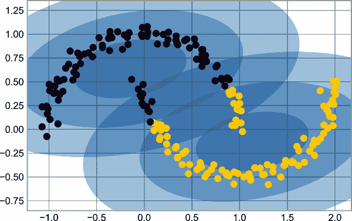

# 第十一章：数组排序

到目前为止，我们主要关注使用 NumPy 访问和操作数组数据的工具。本章涵盖了与 NumPy 数组中值排序相关的算法。这些算法是计算机科学导论课程的热门话题：如果你曾经参加过这样的课程，你可能曾经梦想过（或者，根据你的性格，噩梦）*插入排序*、*选择排序*、*归并排序*、*快速排序*、*冒泡排序*等等。所有这些方法都是完成相似任务的手段：对列表或数组中的值进行排序。

Python 有几个用于排序列表和其他可迭代对象的内置函数和方法。`sorted`函数接受一个列表并返回其排序版本：

```py
In [1]: L = [3, 1, 4, 1, 5, 9, 2, 6]
        sorted(L)  # returns a sorted copy
Out[1]: [1, 1, 2, 3, 4, 5, 6, 9]
```

相比之下，列表的`sort`方法会就地对列表进行排序：

```py
In [2]: L.sort()  # acts in-place and returns None
        print(L)
Out[2]: [1, 1, 2, 3, 4, 5, 6, 9]
```

Python 的排序方法非常灵活，可以处理任何可迭代对象。例如，这里我们对一个字符串进行排序：

```py
In [3]: sorted('python')
Out[3]: ['h', 'n', 'o', 'p', 't', 'y']
```

这些内置的排序方法很方便，但正如前面讨论的那样，Python 值的动态性意味着它们的性能比专门设计用于均匀数组的例程要差。这就是 NumPy 排序例程的用武之地。

# NumPy 中的快速排序: np.sort 和 np.argsort

`np.sort`函数类似于 Python 的内置`sorted`函数，并且能够高效地返回数组的排序副本：

```py
In [4]: import numpy as np

        x = np.array([2, 1, 4, 3, 5])
        np.sort(x)
Out[4]: array([1, 2, 3, 4, 5])
```

类似于 Python 列表的`sort`方法，你也可以使用数组的`sort`方法原地对数组进行排序：

```py
In [5]: x.sort()
        print(x)
Out[5]: [1 2 3 4 5]
```

相关的函数是`argsort`，它返回排序元素的*索引*：

```py
In [6]: x = np.array([2, 1, 4, 3, 5])
        i = np.argsort(x)
        print(i)
Out[6]: [1 0 3 2 4]
```

结果的第一个元素给出了最小元素的索引，第二个值给出了第二小的索引，依此类推。如果需要的话，这些索引可以用（通过花式索引）来构造排序后的数组：

```py
In [7]: x[i]
Out[7]: array([1, 2, 3, 4, 5])
```

你将在本章后面看到`argsort`的应用。

# 沿行或列排序

NumPy 排序算法的一个有用特性是可以使用`axis`参数沿着多维数组的特定行或列进行排序。例如：

```py
In [8]: rng = np.random.default_rng(seed=42)
        X = rng.integers(0, 10, (4, 6))
        print(X)
Out[8]: [[0 7 6 4 4 8]
         [0 6 2 0 5 9]
         [7 7 7 7 5 1]
         [8 4 5 3 1 9]]
```

```py
In [9]: # sort each column of X
        np.sort(X, axis=0)
Out[9]: array([[0, 4, 2, 0, 1, 1],
               [0, 6, 5, 3, 4, 8],
               [7, 7, 6, 4, 5, 9],
               [8, 7, 7, 7, 5, 9]])
```

```py
In [10]: # sort each row of X
         np.sort(X, axis=1)
Out[10]: array([[0, 4, 4, 6, 7, 8],
                [0, 0, 2, 5, 6, 9],
                [1, 5, 7, 7, 7, 7],
                [1, 3, 4, 5, 8, 9]])
```

请注意，这将把每行或列视为独立的数组，行或列值之间的任何关系都将丢失！

# 部分排序: 分区

有时候我们并不想对整个数组进行排序，而只是想找出数组中最小的*k*个值。NumPy 通过`np.partition`函数实现了这一点。`np.partition`接受一个数组和一个数*k*；结果是一个新数组，最小的*k*个值位于分区的左侧，剩余的值位于右侧：

```py
In [11]: x = np.array([7, 2, 3, 1, 6, 5, 4])
         np.partition(x, 3)
Out[11]: array([2, 1, 3, 4, 6, 5, 7])
```

注意结果数组中的前三个值是数组中最小的三个值，剩下的数组位置包含剩余的值。在这两个分区中，元素的顺序是任意的。

类似于排序，我们也可以沿着多维数组的任意轴进行分区：

```py
In [12]: np.partition(X, 2, axis=1)
Out[12]: array([[0, 4, 4, 7, 6, 8],
                [0, 0, 2, 6, 5, 9],
                [1, 5, 7, 7, 7, 7],
                [1, 3, 4, 5, 8, 9]])
```

结果是一个数组，其中每行的前两个槽包含该行的最小值，其余值填充其余槽位。

最后，就像有一个计算排序索引的`np.argsort`函数一样，有一个计算分区索引的`np.argpartition`函数。我们将在接下来的部分中看到这两者的作用。

# 示例：k-最近邻算法

让我们快速看看如何沿着多个轴使用`argsort`函数来找到集合中每个点的最近邻居。我们将从在二维平面上创建的随机 10 个点集开始。按照标准约定，我们将这些点排列在一个<math alttext="10 times 2"><mrow><mn>10</mn> <mo>×</mo> <mn>2</mn></mrow></math>数组中：

```py
In [13]: X = rng.random((10, 2))
```

为了了解这些点的外观，让我们生成一个快速的散点图（见图 11-1）。

```py
In [14]: %matplotlib inline
         import matplotlib.pyplot as plt
         plt.style.use('seaborn-whitegrid')
         plt.scatter(X[:, 0], X[:, 1], s=100);
```



###### 图 11-1\. k-最近邻示例中的点的可视化

现在我们将计算每对点之间的距离。回想一下，两点之间的平方距离是每个维度上平方差的和；使用 NumPy 提供的高效广播（第八章）和聚合（第七章）例程，我们可以在一行代码中计算出平方距离矩阵：

```py
In [15]: dist_sq = np.sum((X[:, np.newaxis] - X[np.newaxis, :]) ** 2, axis=-1)
```

这个操作包含了很多内容，如果你不熟悉 NumPy 的广播规则，可能会感到有些困惑。当你遇到这样的代码时，将其分解为各个步骤可能会很有用：

```py
In [16]: # for each pair of points, compute differences in their coordinates
         differences = X[:, np.newaxis] - X[np.newaxis, :]
         differences.shape
Out[16]: (10, 10, 2)
```

```py
In [17]: # square the coordinate differences
         sq_differences = differences ** 2
         sq_differences.shape
Out[17]: (10, 10, 2)
```

```py
In [18]: # sum the coordinate differences to get the squared distance
         dist_sq = sq_differences.sum(-1)
         dist_sq.shape
Out[18]: (10, 10)
```

作为我们逻辑的快速检查，我们应该看到这个矩阵的对角线（即每个点与自身之间的距离集合）全为零：

```py
In [19]: dist_sq.diagonal()
Out[19]: array([0., 0., 0., 0., 0., 0., 0., 0., 0., 0.])
```

一旦转换为成对的平方距离，我们现在可以使用`np.argsort`沿着每一行排序。最左边的列将给出最近邻居的索引：

```py
In [20]: nearest = np.argsort(dist_sq, axis=1)
         print(nearest)
Out[20]: [[0 9 3 5 4 8 1 6 2 7]
          [1 7 2 6 4 8 3 0 9 5]
          [2 7 1 6 4 3 8 0 9 5]
          [3 0 4 5 9 6 1 2 8 7]
          [4 6 3 1 2 7 0 5 9 8]
          [5 9 3 0 4 6 8 1 2 7]
          [6 4 2 1 7 3 0 5 9 8]
          [7 2 1 6 4 3 8 0 9 5]
          [8 0 1 9 3 4 7 2 6 5]
          [9 0 5 3 4 8 6 1 2 7]]
```

注意，第一列按顺序给出了数字 0 到 9：这是因为每个点的最近邻居是它自己，这是我们预期的结果。

在这里使用完全排序，实际上做了比需要的更多的工作。如果我们只是对最近的<math alttext="k"><mi>k</mi></math>个邻居感兴趣，我们只需对每一行进行分区，使得最小的<math alttext="k plus 1"><mrow><mi>k</mi> <mo>+</mo> <mn>1</mn></mrow></math>个平方距离首先出现，剩余的距离填充数组的其余位置。我们可以使用`np.argpartition`函数实现这一点：

```py
In [21]: K = 2
         nearest_partition = np.argpartition(dist_sq, K + 1, axis=1)
```

为了可视化这些邻居的网络，让我们快速绘制这些点以及代表从每个点到其两个最近邻居的连接的线条（见图 11-2）。

```py
In [22]: plt.scatter(X[:, 0], X[:, 1], s=100)

         # draw lines from each point to its two nearest neighbors
         K = 2

         for i in range(X.shape[0]):
             for j in nearest_partition[i, :K+1]:
                 # plot a line from X[i] to X[j]
                 # use some zip magic to make it happen:
                 plt.plot(*zip(X[j], X[i]), color='black')
```


###### 图 11-2\. 每个点的最近邻居的可视化

每个图中的点都有线连接到其两个最近的邻居。乍一看，一些点有超过两条线连接可能会显得奇怪：这是因为如果点 A 是点 B 的两个最近邻之一，这并不一定意味着点 B 是点 A 的两个最近邻之一。

尽管这种方法的广播和行排序可能比编写循环不那么直观，但事实证明这是一种非常高效的在 Python 中处理这些数据的方法。您可能会尝试通过手动循环遍历数据并逐个排序每组邻居来执行相同类型的操作，但这几乎肯定会导致比我们使用的向量化版本更慢的算法。这种方法的美妙之处在于它以一种对输入数据大小不可知的方式编写：我们可以轻松地在任意维度中计算 100 个或 1,000,000 个点之间的邻居，代码看起来都一样。

最后，我要注意的是，在进行非常大的最近邻搜索时，有基于树的和/或近似算法可以扩展为<math alttext="script upper O left-bracket upper N log upper N right-bracket"><mrow><mi>𝒪</mi> <mo>[</mo> <mi>N</mi> <mo form="prefix">log</mo> <mi>N</mi> <mo>]</mo></mrow></math>或更好，而不是粗暴算法的<math alttext="script upper O left-bracket upper N squared right-bracket"><mrow><mi>𝒪</mi> <mo>[</mo> <msup><mi>N</mi> <mn>2</mn></msup> <mo>]</mo></mrow></math>。这种算法的一个例子是 KD-Tree，[在 Scikit-Learn 中实现](https://oreil.ly/lUFb8)。
