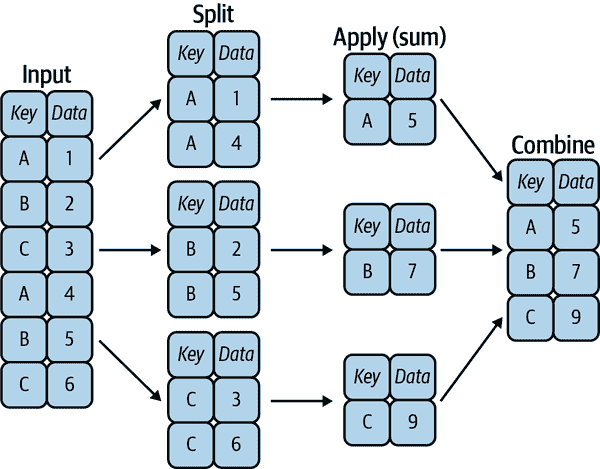

# 第二十章：聚合和分组

许多数据分析任务的基本组成部分是高效的汇总：计算`sum`、`mean`、`median`、`min`和`max`等聚合，其中单个数字总结了可能有很多数据集的各个方面。在本章中，我们将探索 Pandas 中的聚合，从类似于我们在 NumPy 数组上看到的简单操作到基于`groupby`概念的更复杂的操作。

为了方便起见，我们将使用与前几章中相同的`display`魔术函数：

```py
In [1]: import numpy as np
        import pandas as pd

        class display(object):
            """Display HTML representation of multiple objects"""
            template = """<div style="float: left; padding: 10px;">
 <p style='font-family:"Courier New", Courier, monospace'>{0}{1}
 """
            def __init__(self, *args):
                self.args = args

            def _repr_html_(self):
                return '\n'.join(self.template.format(a, eval(a)._repr_html_())
                                 for a in self.args)

            def __repr__(self):
                return '\n\n'.join(a + '\n' + repr(eval(a))
                                   for a in self.args)
```

# 行星数据

在这里，我们将使用通过 [Seaborn package](http://seaborn.pydata.org)（参见第三十六章）提供的 Planets 数据集。它提供了天文学家在其他恒星周围发现的行星的信息（被称为*太阳系外行星*或*外行星*）。可以通过简单的 Seaborn 命令下载：

```py
In [2]: import seaborn as sns
        planets = sns.load_dataset('planets')
        planets.shape
Out[2]: (1035, 6)
```

```py
In [3]: planets.head()
Out[3]:             method  number  orbital_period   mass  distance  year
        0  Radial Velocity       1         269.300   7.10     77.40  2006
        1  Radial Velocity       1         874.774   2.21     56.95  2008
        2  Radial Velocity       1         763.000   2.60     19.84  2011
        3  Radial Velocity       1         326.030  19.40    110.62  2007
        4  Radial Velocity       1         516.220  10.50    119.47  2009
```

这些方法详细介绍了截止到 2014 年发现的一千多个太阳系外行星的情况。

# Pandas 中的简单聚合

在第七章中，我们探讨了 NumPy 数组可用的一些数据聚合。对于 Pandas 的 Series，聚合返回一个单一值：

```py
In [4]: rng = np.random.RandomState(42)
        ser = pd.Series(rng.rand(5))
        ser
Out[4]: 0    0.374540
        1    0.950714
        2    0.731994
        3    0.598658
        4    0.156019
        dtype: float64
```

```py
In [5]: ser.sum()
Out[5]: 2.811925491708157
```

```py
In [6]: ser.mean()
Out[6]: 0.5623850983416314
```

对于`DataFrame`，默认情况下，聚合返回每列的结果：

```py
In [7]: df = pd.DataFrame({'A': rng.rand(5),
                           'B': rng.rand(5)})
        df
Out[7]:           A         B
        0  0.155995  0.020584
        1  0.058084  0.969910
        2  0.866176  0.832443
        3  0.601115  0.212339
        4  0.708073  0.181825
```

```py
In [8]: df.mean()
Out[8]: A    0.477888
        B    0.443420
        dtype: float64
```

通过指定`axis`参数，您可以在每行内进行聚合：

```py
In [9]: df.mean(axis='columns')
Out[9]: 0    0.088290
        1    0.513997
        2    0.849309
        3    0.406727
        4    0.444949
        dtype: float64
```

Pandas 的 Series 和 DataFrame 对象包含了第七章中提到的所有常见聚合；此外，还有一个方便的方法`describe`，它为每列计算了几个常见聚合并返回结果。让我们在 Planets 数据上使用它，目前删除具有缺失值的行：

```py
In [10]: planets.dropna().describe()
Out[10]:           number  orbital_period        mass    distance         year
         count  498.00000      498.000000  498.000000  498.000000   498.000000
         mean     1.73494      835.778671    2.509320   52.068213  2007.377510
         std      1.17572     1469.128259    3.636274   46.596041     4.167284
         min      1.00000        1.328300    0.003600    1.350000  1989.000000
         25%      1.00000       38.272250    0.212500   24.497500  2005.000000
         50%      1.00000      357.000000    1.245000   39.940000  2009.000000
         75%      2.00000      999.600000    2.867500   59.332500  2011.000000
         max      6.00000    17337.500000   25.000000  354.000000  2014.000000
```

这种方法帮助我们了解数据集的整体属性。例如，在`year`列中，我们可以看到尽管有外行星发现的年份可以追溯到 1989 年，但数据集中一半以上的行星直到 2010 年或之后才被发现。这在很大程度上要归功于*开普勒*任务，其目标是使用专门设计的空间望远镜在其他恒星周围寻找凌日行星。

表 20-1 总结了一些其他内置的 Pandas 聚合。

表 20-1。Pandas 聚合方法列表

| 聚合 | 返回 |
| --- | --- |
| `count` | 项目总数 |
| `first`，`last` | 第一个和最后一个项目 |
| `mean`，`median` | 平均值和中位数 |
| `min`，`max` | 最小和最大 |
| `std`，`var` | 标准差和方差 |
| `mad` | 平均绝对偏差 |
| `prod` | 所有项目的乘积 |
| `sum` | 所有项目的和 |

这些都是`DataFrame`和`Series`对象的方法。

然而，要深入了解数据，简单的聚合通常是不够的。数据汇总的下一级是`groupby`操作，它允许您快速高效地在数据子集上计算聚合。

# groupby：分割、应用、组合

简单的聚合可以让你了解数据集的特征，但通常我们更希望在某些标签或索引上进行条件聚合：这在所谓的`groupby`操作中实现。这个名字“group by”来自 SQL 数据库语言中的一个命令，但也许更具启发性的是，我们可以根据 Rstats 名人哈德利·维克姆首次提出的术语来思考它：*分割、应用、组合*。

## 分割、应用、组合

这个分割-应用-组合操作的典型示例，其中“应用”是一个求和聚合，如图 20-1 所示。

图 20-1 展示了`groupby`操作的完成情况：

+   *分割*步骤涉及根据指定键的值拆分和分组`DataFrame`。

+   *应用*步骤涉及在各个组内计算某个函数，通常是一个聚合、转换或筛选。

+   *合并*步骤将这些操作的结果合并到输出数组中。



###### 图 20-1\. `groupby`操作的视觉表示¹

虽然这当然可以通过一些组合使用先前介绍的掩码、聚合和合并命令来手动完成，但重要的认识是*中间的分割不需要显式实例化*。相反，`groupby`可以（通常）在数据的单次遍历中执行此操作，沿途更新每个组的总和、平均值、计数、最小值或其他聚合。`groupby`的威力在于它抽象出了这些步骤：用户不需要考虑计算在幕后是如何进行的，而是可以将*操作作为一个整体*来思考。

作为一个具体的例子，让我们看看如何使用 Pandas 来计算下表中所示的计算。我们将从创建输入`DataFrame`开始：

```py
In [11]: df = pd.DataFrame({'key': ['A', 'B', 'C', 'A', 'B', 'C'],
                            'data': range(6)}, columns=['key', 'data'])
         df
Out[11]:  key  data
         0   A     0
         1   B     1
         2   C     2
         3   A     3
         4   B     4
         5   C     5
```

最基本的分割-应用-组合操作可以使用`DataFrame`的`groupby`方法来计算，传递所需键列的名称：

```py
In [12]: df.groupby('key')
Out[12]: <pandas.core.groupby.generic.DataFrameGroupBy object at 0x11d241e20>
```

注意返回的是一个`DataFrameGroupBy`对象，而不是一组`DataFrame`对象。这个对象是魔术所在：你可以将它看作是`DataFrame`的一个特殊视图，它准备好深入研究组，但在应用聚合之前不进行任何实际计算。这种“延迟评估”方法意味着常见的聚合可以以几乎对用户透明的方式高效实现。

要生成结果，我们可以对这个`DataFrameGroupBy`对象应用聚合函数，它将执行适当的应用/合并步骤以生成所需的结果：

```py
In [13]: df.groupby('key').sum()
Out[13]:      data
         key
         A       3
         B       5
         C       7
```

这里`sum`方法只是一种可能性；你可以应用大多数 Pandas 或 NumPy 聚合函数，以及大多数`DataFrame`操作，正如你将在以下讨论中看到的那样。

## GroupBy 对象

`GroupBy`对象是一个灵活的抽象：在许多情况下，它可以简单地被视为`DataFrame`的集合，尽管在内部执行更复杂的操作。让我们看一些使用行星数据的示例。

`GroupBy`提供的可能是最重要的操作是*aggregate*、*filter*、*transform*和*apply*。我们将在下一节更详细地讨论每一个，但在此之前，让我们看一些可以与基本`GroupBy`操作一起使用的其他功能。

### 列索引

`GroupBy`对象支持与`DataFrame`相同的列索引，返回一个修改过的`GroupBy`对象。例如：

```py
In [14]: planets.groupby('method')
Out[14]: <pandas.core.groupby.generic.DataFrameGroupBy object at 0x11d1bc820>
```

```py
In [15]: planets.groupby('method')['orbital_period']
Out[15]: <pandas.core.groupby.generic.SeriesGroupBy object at 0x11d1bcd60>
```

在这里，我们通过引用其列名从原始的`DataFrame`组中选择了一个特定的`Series`组。与`GroupBy`对象一样，直到我们对对象调用某些聚合函数之前，都不会进行任何计算：

```py
In [16]: planets.groupby('method')['orbital_period'].median()
Out[16]: method
         Astrometry                         631.180000
         Eclipse Timing Variations         4343.500000
         Imaging                          27500.000000
         Microlensing                      3300.000000
         Orbital Brightness Modulation        0.342887
         Pulsar Timing                       66.541900
         Pulsation Timing Variations       1170.000000
         Radial Velocity                    360.200000
         Transit                              5.714932
         Transit Timing Variations           57.011000
         Name: orbital_period, dtype: float64
```

这给出了每种方法对轨道周期（以天计）的一般尺度的概念。

### 对组进行迭代

`GroupBy`对象支持直接在组上进行迭代，返回每个组作为`Series`或`DataFrame`：

```py
In [17]: for (method, group) in planets.groupby('method'):
             print("{0:30s} shape={1}".format(method, group.shape))
Out[17]: Astrometry                     shape=(2, 6)
         Eclipse Timing Variations      shape=(9, 6)
         Imaging                        shape=(38, 6)
         Microlensing                   shape=(23, 6)
         Orbital Brightness Modulation  shape=(3, 6)
         Pulsar Timing                  shape=(5, 6)
         Pulsation Timing Variations    shape=(1, 6)
         Radial Velocity                shape=(553, 6)
         Transit                        shape=(397, 6)
         Transit Timing Variations      shape=(4, 6)
```

这对于手动检查组以进行调试非常有用，但通常使用内置的`apply`功能会更快，我们稍后将讨论此功能。

### 分派方法

通过一些 Python 类魔术，任何未明确由`GroupBy`对象实现的方法都将被传递并在组上调用，无论它们是`DataFrame`还是`Series`对象。例如，使用`describe`方法等效于在表示每个组的`DataFrame`上调用`describe`：

```py
In [18]: planets.groupby('method')['year'].describe().unstack()
Out[18]:        method
         count  Astrometry                          2.0
                Eclipse Timing Variations           9.0
                Imaging                            38.0
                Microlensing                       23.0
                Orbital Brightness Modulation       3.0
                                                  ...
         max    Pulsar Timing                    2011.0
                Pulsation Timing Variations      2007.0
                Radial Velocity                  2014.0
                Transit                          2014.0
                Transit Timing Variations        2014.0
         Length: 80, dtype: float64
```

查看这张表有助于我们更好地理解数据：例如，直到 2014 年，绝大多数行星是通过径向速度和凌日法发现的，尽管后者方法近年来变得更为普遍。最新的方法似乎是凌时差变化和轨道亮度调制，直到 2011 年才用于发现新行星。

注意，这些分派方法是应用在*每个单独的组*上的，并且结果然后在`GroupBy`内组合并返回。同样地，任何有效的`DataFrame`/`Series`方法都可以在对应的`GroupBy`对象上类似地调用。

## 聚合（Aggregate）、筛选（Filter）、转换（Transform）、应用（Apply）

前面的讨论侧重于合并操作的聚合，但还有更多可用选项。特别是，`GroupBy`对象具有`aggregate`、`filter`、`transform`和`apply`方法，可以在组合并分组数据之前有效地实现多种有用的操作。

出于以下各小节的目的，我们将使用这个`DataFrame`：

```py
In [19]: rng = np.random.RandomState(0)
         df = pd.DataFrame({'key': ['A', 'B', 'C', 'A', 'B', 'C'],
                            'data1': range(6),
                            'data2': rng.randint(0, 10, 6)},
                            columns = ['key', 'data1', 'data2'])
         df
Out[19]:   key  data1  data2
         0   A      0      5
         1   B      1      0
         2   C      2      3
         3   A      3      3
         4   B      4      7
         5   C      5      9
```

### 聚合

现在你已经熟悉了使用`sum`、`median`等方法的`GroupBy`聚合，但`aggregate`方法允许更加灵活。它可以接受字符串、函数或函数列表，并一次计算所有聚合。以下是一个快速示例，结合了所有这些内容：

```py
In [20]: df.groupby('key').aggregate(['min', np.median, max])
Out[20]:     data1            data2
               min median max   min median max
         key
         A       0    1.5   3     3    4.0   5
         B       1    2.5   4     0    3.5   7
         C       2    3.5   5     3    6.0   9
```

另一种常见的模式是传递一个将列名映射到要应用于该列的操作的字典：

```py
In [21]: df.groupby('key').aggregate({'data1': 'min',
                                      'data2': 'max'})
Out[21]:      data1  data2
         key
         A        0      5
         B        1      7
         C        2      9
```

### 过滤

过滤操作允许您根据组属性丢弃数据。例如，我们可能希望保留所有标准偏差大于某个临界值的组：

```py
In [22]: def filter_func(x):
             return x['data2'].std() > 4

         display('df', "df.groupby('key').std()",
                 "df.groupby('key').filter(filter_func)")
Out[22]: df                         df.groupby('key').std()
           key  data1  data2           data1     data2
         0   A      0      5        key
         1   B      1      0        A    2.12132  1.414214
         2   C      2      3        B    2.12132  4.949747
         3   A      3      3        C    2.12132  4.242641
         4   B      4      7
         5   C      5      9

         df.groupby('key').filter(filter_func)
           key  data1  data2
         1   B      1      0
         2   C      2      3
         4   B      4      7
         5   C      5      9
```

过滤函数应返回一个布尔值，指定组是否通过过滤。在这里，因为 A 组的标准偏差不大于 4，所以它从结果中被删除。

### 变换

虽然聚合必须返回数据的减少版本，但变换可以返回一些经过转换的完整数据以重新组合。对于这种转换，输出与输入的形状相同。一个常见的例子是通过减去组内均值来使数据居中：

```py
In [23]: def center(x):
             return x - x.mean()
         df.groupby('key').transform(center)
Out[23]:    data1  data2
         0   -1.5    1.0
         1   -1.5   -3.5
         2   -1.5   -3.0
         3    1.5   -1.0
         4    1.5    3.5
         5    1.5    3.0
```

### 应用方法

`apply`方法允许您将任意函数应用于组结果。该函数应接受一个`DataFrame`，并返回一个 Pandas 对象（例如`DataFrame`、`Series`）或一个标量；合并步骤的行为将根据返回的输出类型进行调整。

例如，这里是一个通过第一列的总和来归一化的`apply`操作：

```py
In [24]: def norm_by_data2(x):
             # x is a DataFrame of group values
             x['data1'] /= x['data2'].sum()
             return x

         df.groupby('key').apply(norm_by_data2)
Out[24]:   key     data1  data2
         0   A  0.000000      5
         1   B  0.142857      0
         2   C  0.166667      3
         3   A  0.375000      3
         4   B  0.571429      7
         5   C  0.416667      9
```

在`GroupBy`中的`apply`非常灵活：唯一的标准是函数接受`DataFrame`并返回 Pandas 对象或标量。在中间您可以做任何事情！

## 指定分割密钥

在之前展示的简单示例中，我们根据单个列名拆分了`DataFrame`。这只是定义组的许多选项之一，我们将在这里介绍一些其他的组规范选项。

### 提供分组键的列表、数组、系列或索引

密钥可以是与`DataFrame`长度匹配的任何系列或列表。例如：

```py
In [25]: L = [0, 1, 0, 1, 2, 0]
         df.groupby(L).sum()
Out[25]:    data1  data2
         0      7     17
         1      4      3
         2      4      7
```

当然，这意味着还有另一种更冗长的方法来实现`df.groupby('key')`：

```py
In [26]: df.groupby(df['key']).sum()
Out[26]:      data1  data2
         key
         A        3      8
         B        5      7
         C        7     12
```

### 映射索引到组的字典或系列

另一种方法是提供一个将索引值映射到组键的字典：

```py
In [27]: df2 = df.set_index('key')
         mapping = {'A': 'vowel', 'B': 'consonant', 'C': 'consonant'}
         display('df2', 'df2.groupby(mapping).sum()')
Out[27]: df2                    df2.groupby(mapping).sum()
             data1  data2                  data1  data2
         key                    key
         A        0      5      consonant     12     19
         B        1      0      vowel          3      8
         C        2      3
         A        3      3
         B        4      7
         C        5      9
```

### 任何 Python 函数

类似于映射，您可以传递任何 Python 函数，该函数将输入索引值并输出组：

```py
In [28]: df2.groupby(str.lower).mean()
Out[28]:      data1  data2
         key
         a      1.5    4.0
         b      2.5    3.5
         c      3.5    6.0
```

### 有效密钥列表

此外，可以将任何前述密钥选择组合以在多索引上进行分组：

```py
In [29]: df2.groupby([str.lower, mapping]).mean()
Out[29]:                data1  data2
         key key
         a   vowel        1.5    4.0
         b   consonant    2.5    3.5
         c   consonant    3.5    6.0
```

## 分组示例

举例来说，在几行 Python 代码中，我们可以将所有这些组合在一起，并按方法和十年计数发现的行星：

```py
In [30]: decade = 10 * (planets['year'] // 10)
         decade = decade.astype(str) + 's'
         decade.name = 'decade'
         planets.groupby(['method', decade])['number'].sum().unstack().fillna(0)
Out[30]: decade                         1980s  1990s  2000s  2010s
         method
         Astrometry                       0.0    0.0    0.0    2.0
         Eclipse Timing Variations        0.0    0.0    5.0   10.0
         Imaging                          0.0    0.0   29.0   21.0
         Microlensing                     0.0    0.0   12.0   15.0
         Orbital Brightness Modulation    0.0    0.0    0.0    5.0
         Pulsar Timing                    0.0    9.0    1.0    1.0
         Pulsation Timing Variations      0.0    0.0    1.0    0.0
         Radial Velocity                  1.0   52.0  475.0  424.0
         Transit                          0.0    0.0   64.0  712.0
         Transit Timing Variations        0.0    0.0    0.0    9.0
```

这显示了在查看现实数据集时结合许多我们到目前为止讨论过的操作的力量：我们很快就能粗略地了解在首次发现后的几年内如何检测到系外行星。

我建议深入研究这几行代码，并评估每个步骤，以确保您完全理解它们对结果的影响。这当然是一个有些复杂的例子，但理解这些部分将使您能够类似地探索自己的数据。

¹ 生成此图的代码可以在[在线附录](https://oreil.ly/zHqzu)中找到。
