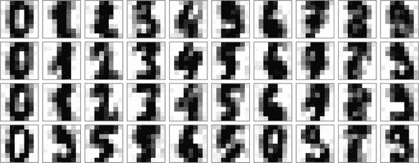

# 第二十一章：透视表

我们已经看到`groupby`抽象可以帮助我们探索数据集中的关系。*透视表*是一种类似的操作，在电子表格和其他操作表格数据的程序中经常见到。透视表以简单的列数据作为输入，并将条目分组成二维表，提供数据的多维总结。透视表与`groupby`之间的区别有时会引起混淆；我认为透视表基本上是`groupby`聚合的*多维*版本。也就是说，你进行分割-应用-组合，但分割和组合发生在二维网格上，而不是一维索引上。

# 激励透视表

在这一部分的示例中，我们将使用泰坦尼克号乘客的数据库，该数据库可通过 Seaborn 库获取（见第三十六章）：

```py
In [1]: import numpy as np
        import pandas as pd
        import seaborn as sns
        titanic = sns.load_dataset('titanic')
```

```py
In [2]: titanic.head()
Out[2]:    survived  pclass     sex   age  sibsp  parch     fare embarked  class  \
        0         0       3 male  22.0      1      0   7.2500        S  Third
        1         1       1  female  38.0      1      0  71.2833        C  First
        2         1       3  female  26.0      0      0   7.9250        S  Third
        3         1       1  female  35.0      1      0  53.1000        S  First
        4         0       3    male  35.0      0      0   8.0500        S  Third
```

```py
             who  adult_male deck  embark_town alive  alone
        0    man        True  NaN  Southampton    no  False
        1  woman       False    C    Cherbourg   yes  False
        2  woman       False  NaN  Southampton   yes   True
        3  woman       False    C  Southampton   yes  False
        4    man        True  NaN  Southampton    no   True
```

正如输出所示，这包含了每位乘客的多个数据点，包括性别、年龄、阶级、支付的票价等等。

# 手动透视表

要开始了解更多关于这些数据的信息，我们可以根据性别、生存状态或两者的某种组合进行分组。如果你已经阅读了前一章节，你可能会想应用一个`groupby`操作——例如，让我们来看看按性别划分的生存率：

```py
In [3]: titanic.groupby('sex')[['survived']].mean()
Out[3]:         survived
        sex
        female  0.742038
        male    0.188908
```

这给了我们一些初步的见解：总体而言，船上四分之三的女性幸存下来，而只有五分之一的男性幸存！

这很有用，但我们可能希望再深入一步，查看性别和阶级的生存率。使用`groupby`的术语，我们可以按以下过程进行操作：首先按阶级和性别进行*分组*，然后*选择*生存，*应用*均值聚合，*组合*结果组，并最后*展开*层次索引以显示隐藏的多维特性。在代码中：

```py
In [4]: titanic.groupby(['sex', 'class'])['survived'].aggregate('mean').unstack()
Out[4]: class      First    Second     Third
        sex
        female  0.968085  0.921053  0.500000
        male    0.368852  0.157407  0.135447
```

这样我们可以更好地了解性别和阶级如何影响生存，但是代码看起来有点凌乱。虽然我们之前讨论的每个步骤在工具的背景下都是合理的，但是这长串代码并不特别易于阅读或使用。这种二维的`groupby`很常见，因此 Pandas 包含了一个方便的例程`pivot_table`，它简洁地处理这种多维聚合类型。

# 透视表语法

下面是使用`DataFrame.pivot_table`方法进行的等效操作：

```py
In [5]: titanic.pivot_table('survived', index='sex', columns='class', aggfunc='mean')
Out[5]: class      First    Second     Third
        sex
        female  0.968085  0.921053  0.500000
        male    0.368852  0.157407  0.135447
```

这比手动的`groupby`方法更易读，并产生相同的结果。正如你可能期待的那样，在 20 世纪初的大西洋横渡邮轮上，生存率偏向于更高阶级和数据中记录为女性的人群。头等舱的女性几乎百分之百幸存下来（嗨，Rose！），而仅约五分之一的三等舱男性幸存下来（抱歉，Jack！）。

## 多级透视表

就像在`groupby`中一样，透视表中的分组可以通过多个级别和多种选项来指定。例如，我们可能对年龄作为第三维度感兴趣。我们将使用`pd.cut`函数对年龄进行分箱：

```py
In [6]: age = pd.cut(titanic['age'], [0, 18, 80])
        titanic.pivot_table('survived', ['sex', age], 'class')
Out[6]: class               First    Second     Third
        sex    age
        female (0, 18]   0.909091  1.000000  0.511628
               (18, 80]  0.972973  0.900000  0.423729
        male   (0, 18]   0.800000  0.600000  0.215686
               (18, 80]  0.375000  0.071429  0.133663
```

在处理列时我们可以应用相同的策略；让我们添加有关支付费用的信息，使用`pd.qcut`自动计算分位数：

```py
In [7]: fare = pd.qcut(titanic['fare'], 2)
        titanic.pivot_table('survived', ['sex', age], [fare, 'class'])
Out[7]: fare            (-0.001, 14.454]                     (14.454, 512.329]  \
        class                      First    Second     Third             First
        sex    age
        female (0, 18]               NaN  1.000000  0.714286          0.909091
               (18, 80]              NaN  0.880000  0.444444          0.972973
        male   (0, 18]               NaN  0.000000  0.260870          0.800000
               (18, 80]              0.0  0.098039  0.125000          0.391304

        fare
        class              Second     Third
        sex    age
        female (0, 18]   1.000000  0.318182
               (18, 80]  0.914286  0.391304
        male   (0, 18]   0.818182  0.178571
               (18, 80]  0.030303  0.192308
```

结果是具有分层索引的四维聚合（见第 17 章），显示了展示值之间关系的网格。

## 额外的透视表选项

`DataFrame.pivot_table`方法的完整调用签名如下：

```py
# call signature as of Pandas 1.3.5
DataFrame.pivot_table(data, values=None, index=None, columns=None,
                      aggfunc='mean', fill_value=None, margins=False,
                      dropna=True, margins_name='All', observed=False,
                      sort=True)
```

我们已经看到了前三个参数的示例；这里我们将看一些其余的选项。两个选项`fill_value`和`dropna`与缺失数据有关，非常直观；我不会在这里展示它们的示例。

`aggfunc`关键字控制应用的聚合类型，默认为均值。与`groupby`一样，聚合规范可以是表示几种常见选择之一的字符串（`'sum'`、`'mean'`、`'count'`、`'min'`、`'max'`等）或实现聚合的函数（例如，`np.sum()`、`min()`、`sum()`等）。此外，它可以被指定为将列映射到任何所需选项之一的字典：

```py
In [8]: titanic.pivot_table(index='sex', columns='class',
                            aggfunc={'survived':sum, 'fare':'mean'})
Out[8]:               fare                       survived
        class        First     Second      Third    First Second Third
        sex
        female  106.125798  21.970121  16.118810       91     70    72
        male     67.226127  19.741782  12.661633       45     17    47
```

这里还要注意，我们省略了`values`关键字；在为`aggfunc`指定映射时，这将自动确定。

有时计算每个分组的总计是有用的。这可以通过`margins`关键字来完成：

```py
In [9]: titanic.pivot_table('survived', index='sex', columns='class', margins=True)
Out[9]: class      First    Second     Third       All
        sex
        female  0.968085  0.921053  0.500000  0.742038
        male    0.368852  0.157407  0.135447  0.188908
        All     0.629630  0.472826  0.242363  0.383838
```

在这里，这自动为我们提供了关于性别不可知的无关生存率、类别不可知的生存率以及 38%的总体生存率信息。边缘标签可以通过`margins_name`关键字指定，默认为`"All"`。

# 示例：出生率数据

另一个例子，让我们看看美国出生数据的免费可用数据（提供者为美国疾病控制中心（CDC））：[data on births in the US](https://oreil.ly/2NWnk)，这些数据已经被安德鲁·格尔曼及其团队进行了相当深入的分析；例如，参见[使用高斯过程进行信号处理的博客文章](https://oreil.ly/5EqEp)：¹

```py
In [10]: # shell command to download the data:
         # !cd data && curl -O \
         # https://raw.githubusercontent.com/jakevdp/data-CDCbirths/master/births.csv
```

```py
In [11]: births = pd.read_csv('data/births.csv')
```

看一下数据，我们可以看到它相对简单——它包含按日期和性别分组的出生数量：

```py
In [12]: births.head()
Out[12]:    year  month  day gender  births
         0  1969      1  1.0      F    4046
         1  1969      1  1.0      M    4440
         2  1969      1  2.0      F    4454
         3  1969      1  2.0      M    4548
         4  1969      1  3.0      F    4548
```

我们可以通过使用透视表来开始更深入地理解这些数据。让我们添加一个`decade`列，然后看看男性和女性出生人数如何随着十年变化：

```py
In [13]: births['decade'] = 10 * (births['year'] // 10)
         births.pivot_table('births', index='decade', columns='gender',
                            aggfunc='sum')
Out[13]: gender         F         M
         decade
         1960     1753634   1846572
         1970    16263075  17121550
         1980    18310351  19243452
         1990    19479454  20420553
         2000    18229309  19106428
```

我们看到每个十年男性出生人数超过女性。为了更清楚地看到这一趋势，我们可以使用 Pandas 中的内置绘图工具来可视化每年的总出生人数，如图 21-1 所示（参见第 IV 部分关于使用 Matplotlib 绘图的讨论）：

```py
In [14]: %matplotlib inline
         import matplotlib.pyplot as plt
         plt.style.use('seaborn-whitegrid')
         births.pivot_table(
             'births', index='year', columns='gender', aggfunc='sum').plot()
         plt.ylabel('total births per year');
```


###### 图 21-1\. 美国各年度出生总数及性别分布²

通过一个简单的数据透视表和`plot`方法，我们可以立即看到性别出生的年度趋势。通过肉眼观察，过去 50 年男性出生人数大约比女性出生人数多约 5%。

虽然这与数据透视表不一定有关，但我们可以利用到目前为止介绍的 Pandas 工具从这个数据集中提取一些更有趣的特征。我们必须首先稍微清理数据，删除由于输入错误的日期（例如 6 月 31 日）或缺失值（例如 6 月 99 日）引起的异常值。一种一次性删除所有这些异常值的简单方法是通过强大的 sigma 剪切操作：

```py
In [15]: quartiles = np.percentile(births['births'], [25, 50, 75])
         mu = quartiles[1]
         sig = 0.74 * (quartiles[2] - quartiles[0])
```

这最后一行是样本标准差的健壮估计，其中的 0.74 来自高斯分布的四分位距（您可以在我与Željko Ivezić、Andrew J. Connolly 和 Alexander Gray 共同撰写的书籍*Statistics, Data Mining, and Machine Learning in Astronomy*（普林斯顿大学出版社）中了解更多有关 sigma 剪切操作的信息）。

使用`query`方法（在第二十四章中进一步讨论）来过滤出超出这些值范围的出生行：

```py
In [16]: births = births.query('(births > @mu - 5 * @sig) &
                                (births < @mu + 5 * @sig)')
```

接下来，我们将`day`列设置为整数；此前它是一个字符串列，因为数据集中的一些列包含值`'null'`：

```py
In [17]: # set 'day' column to integer; it originally was a string due to nulls
         births['day'] = births['day'].astype(int)
```

最后，我们可以结合日、月和年创建一个日期索引（见第二十三章）。这使得我们可以快速计算每一行对应的工作日：

```py
In [18]: # create a datetime index from the year, month, day
         births.index = pd.to_datetime(10000 * births.year +
                                       100 * births.month +
                                       births.day, format='%Y%m%d')

         births['dayofweek'] = births.index.dayofweek
```

利用这一点，我们可以绘制几十年来每周的出生情况（见图 21-2）。

```py
In [19]: import matplotlib.pyplot as plt
         import matplotlib as mpl

         births.pivot_table('births', index='dayofweek',
                             columns='decade', aggfunc='mean').plot()
         plt.gca().set(xticks=range(7),
                       xticklabels=['Mon', 'Tues', 'Wed', 'Thurs',
                                    'Fri', 'Sat', 'Sun'])
         plt.ylabel('mean births by day');
```

显然，周末的出生率略低于工作日！请注意，1990 年代和 2000 年代缺失，因为从 1989 年开始，CDC 的数据仅包含出生月份。

另一个有趣的视图是按年中日期平均出生数量的图表。让我们首先分别按月份和日期分组数据：

```py
In [20]: births_by_date = births.pivot_table('births',
                                             [births.index.month, births.index.day])
         births_by_date.head()
Out[20]:        births
         1 1  4009.225
           2  4247.400
           3  4500.900
           4  4571.350
           5  4603.625
```



###### 图 21-2\. 每周平均出生量按工作日和十年间隔³

结果是一个月份和日期的多重索引。为了使其可视化，让我们通过将它们与一个虚拟的年份变量关联起来（确保选择一个闰年，以正确处理 2 月 29 日）将这些月份和日期转换为日期：

```py
In [21]: from datetime import datetime
         births_by_date.index = [datetime(2012, month, day)
                                 for (month, day) in births_by_date.index]
         births_by_date.head()
Out[21]:               births
         2012-01-01  4009.225
         2012-01-02  4247.400
         2012-01-03  4500.900
         2012-01-04  4571.350
         2012-01-05  4603.625
```

焦点放在月份和日期上，我们现在有一个反映每年平均出生数量的时间序列。从这个序列，我们可以使用`plot`方法绘制数据。正如您可以在图 21-3 中看到的那样，它显示了一些有趣的趋势。

```py
In [22]: # Plot the results
         fig, ax = plt.subplots(figsize=(12, 4))
         births_by_date.plot(ax=ax);
```


###### 图 21-3\. 每日平均出生量按日期⁴

特别是，这张图的显著特征是美国假日（例如独立日、劳动节、感恩节、圣诞节、元旦）出生率的下降，尽管这可能反映了计划/引发出生的趋势，而不是对自然出生产生深刻的心理效应。关于这一趋势的更多讨论，请参见[安德鲁·格尔曼的博客文章](https://oreil.ly/ugVHI)。我们将在第三十二章中使用 Matplotlib 的工具对这个图进行注释。

查看这个简短的例子，你可以看到到目前为止我们见过的许多 Python 和 Pandas 工具可以结合使用，从各种数据集中获取洞察力。我们将在后续章节中看到这些数据操作的更复杂应用！

¹ 本节中使用的 CDC 数据集使用了出生时分配的性别，称之为“性别”，并将数据限制在男性和女性之间。尽管性别是独立于生物学的光谱，但为了一致性和清晰度，在讨论这个数据集时我将使用相同的术语。

² 这个图的全彩版本可以在[GitHub](https://oreil.ly/PDSH_GitHub)找到。

³ 这个图的全彩版本可以在[GitHub](https://oreil.ly/PDSH_GitHub)找到。

⁴ 这个图的全尺寸版本可以在[GitHub](https://oreil.ly/PDSH_GitHub)找到。
