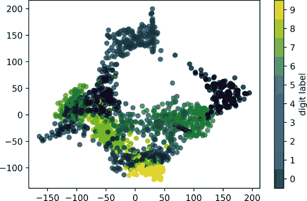

# 第二十三章： 与时间序列一起工作

Pandas 最初是在财务建模的背景下开发的，因此您可能期望它包含大量用于处理日期、时间和时间索引数据的工具。 日期和时间数据有几种不同的形式，我们将在这里进行讨论：

*时间戳*

特定的时间点（例如，2021 年 7 月 4 日上午 7:00）。

*时间间隔*和*周期*

特定开始和结束点之间的一段时间；例如，2021 年 6 月份。 周期通常指每个间隔具有统一长度且不重叠的特殊时间间隔的情况（例如，由一天组成的 24 小时周期）。

*时间差*或*持续时间*

精确的时间长度（例如，22.56 秒的持续时间）。

本章将介绍如何在 Pandas 中处理这些类型的日期/时间数据。 这并不是 Python 或 Pandas 中可用的时间序列工具的完整指南，而是旨在作为用户如何处理时间序列的广泛概述。 我们将首先简要讨论 Python 中处理日期和时间的工具，然后更详细地讨论 Pandas 提供的工具。 最后，我们将回顾一些在 Pandas 中处理时间序列数据的简短示例。

# Python 中的日期和时间

Python 世界中有许多可用于表示日期、时间、时间差和时间跨度的表示方法。 虽然 Pandas 提供的时间序列工具对数据科学应用最有用，但了解它们与 Python 中其他工具的关系是有帮助的。

## 本机 Python 日期和时间：datetime 和 dateutil

Python 用于处理日期和时间的基本对象位于内置的`datetime`模块中。 除了第三方的`dateutil`模块之外，您还可以使用此功能快速执行许多有用的日期和时间功能。 例如，您可以使用`datetime`类型手动构建日期：

```py
In [1]: from datetime import datetime
        datetime(year=2021, month=7, day=4)
Out[1]: datetime.datetime(2021, 7, 4, 0, 0)
```

或者，使用`dateutil`模块，您可以从各种字符串格式中解析日期：

```py
In [2]: from dateutil import parser
        date = parser.parse("4th of July, 2021")
        date
Out[2]: datetime.datetime(2021, 7, 4, 0, 0)
```

一旦您有了`datetime`对象，您可以执行一些操作，比如打印星期几：

```py
In [3]: date.strftime('%A')
Out[3]: 'Sunday'
```

这里我们使用了用于打印日期的标准字符串格式代码之一（`'%A'`），您可以在 Python 的`datetime`文档的[`strftime`部分](https://oreil.ly/bjdsf)中了解相关信息。 有关其他有用日期工具的文档，请查看[`dateutil`的在线文档](https://oreil.ly/Y5Rwd)。 还有一个相关的软件包需要注意，那就是[`pytz`](https://oreil.ly/DU9Jr)，它包含了处理时间序列数据中最令人头疼的元素：时区。

`datetime`和`dateutil`的威力在于它们的灵活性和简单的语法：你可以使用这些对象及其内置方法轻松地执行几乎任何你感兴趣的操作。它们的局限性在于当你希望处理大量的日期和时间时：正如 Python 数值变量的列表与 NumPy 风格的类型化数值数组相比是次优的一样，Python `datetime`对象的列表与编码日期的类型化数组相比也是次优的。

## 时间数组：NumPy 的 datetime64

NumPy 的`datetime64`数据类型将日期编码为 64 位整数，因此允许以紧凑的方式表示日期数组并以有效的方式对其进行操作。`datetime64`需要特定的输入格式：

```py
In [4]: import numpy as np
        date = np.array('2021-07-04', dtype=np.datetime64)
        date
Out[4]: array('2021-07-04', dtype='datetime64[D]')
```

一旦我们将日期转换为这种形式，就可以快速对其进行向量化操作：

```py
In [5]: date + np.arange(12)
Out[5]: array(['2021-07-04', '2021-07-05', '2021-07-06', '2021-07-07',
               '2021-07-08', '2021-07-09', '2021-07-10', '2021-07-11',
               '2021-07-12', '2021-07-13', '2021-07-14', '2021-07-15'],
              dtype='datetime64[D]')
```

由于 NumPy `datetime64`数组中的统一类型，这种操作比直接使用 Python 的`datetime`对象要快得多，特别是在数组变大时（我们在第六章中介绍了这种向量化类型）。

`datetime64`和相关的`timedelta64`对象的一个细节是它们是建立在*基本时间单位*上的。因为`datetime64`对象的精度限制为 64 位，所以可编码时间的范围是基本单位的<math alttext="2 Superscript 64"><msup><mn>2</mn> <mn>64</mn></msup></math>倍。换句话说，`datetime64`在*时间分辨率*和*最大时间跨度*之间存在权衡。

例如，如果您想要 1 纳秒的时间分辨率，您只有足够的信息来编码<math alttext="2 Superscript 64"><msup><mn>2</mn> <mn>64</mn></msup></math>纳秒范围内的时间，或者不到 600 年。NumPy 将从输入中推断出所需的单位；例如，这里是一个基于天的`datetime`：

```py
In [6]: np.datetime64('2021-07-04')
Out[6]: numpy.datetime64('2021-07-04')
```

这是一个基于分钟的 datetime：

```py
In [7]: np.datetime64('2021-07-04 12:00')
Out[7]: numpy.datetime64('2021-07-04T12:00')
```

您可以使用许多格式代码强制使用任何所需的基本单位；例如，这里我们将强制使用基于纳秒的时间：

```py
In [8]: np.datetime64('2021-07-04 12:59:59.50', 'ns')
Out[8]: numpy.datetime64('2021-07-04T12:59:59.500000000')
```

表 23-1，摘自 NumPy `datetime64` 文档，列出了可用的格式代码及其可以编码的相对和绝对时间跨度。

表 23-1\. 日期和时间代码描述

| 代码 | 意义 | 时间跨度（相对） | 时间跨度（绝对） |
| --- | --- | --- | --- |
| `Y` | 年 | ± 9.2e18 年 | [9.2e18 BC, 9.2e18 AD] |
| `M` | 月 | ± 7.6e17 年 | [7.6e17 BC, 7.6e17 AD] |
| `W` | 周 | ± 1.7e17 年 | [1.7e17 BC, 1.7e17 AD] |
| `D` | 日 | ± 2.5e16 年 | [2.5e16 BC, 2.5e16 AD] |
| `h` | 小时 | ± 1.0e15 年 | [1.0e15 BC, 1.0e15 AD] |
| `m` | 分钟 | ± 1.7e13 年 | [1.7e13 BC, 1.7e13 AD] |
| `s` | 秒 | ± 2.9e12 年 | [2.9e9 BC, 2.9e9 AD] |
| `ms` | 毫秒 | ± 2.9e9 年 | [2.9e6 BC, 2.9e6 AD] |
| `us` | 微秒 | ± 2.9e6 年 | [290301 BC, 294241 AD] |
| `ns` | 纳秒 | ± 292 年 | [1678 AD, 2262 AD] |
| `ps` | 皮秒 | ± 106 天 | [ 1969 年, 1970 年] |
| `fs` | 飞秒 | ± 2.6 小时 | [ 1969 年, 1970 年] |
| `as` | 阿秒 | ± 9.2 秒 | [ 1969 年, 1970 年] |

对于我们在现实世界中看到的数据类型，一个有用的默认值是`datetime64[ns]`，因为它可以用适当的精度编码一系列现代日期。

最后，请注意，虽然`datetime64`数据类型解决了内置 Python `datetime` 类型的一些不足之处，但它缺少许多`datetime`和尤其是`dateutil`提供的便利方法和函数。更多信息可以在[NumPy 的`datetime64`文档](https://oreil.ly/XDbck)中找到。

## Pandas 中的日期和时间：两者兼得

Pandas 在刚讨论的所有工具基础上构建了一个`Timestamp`对象，它结合了`datetime`和`dateutil`的易用性以及`numpy.datetime64`的高效存储和向量化接口。从这些`Timestamp`对象中，Pandas 可以构建一个`DatetimeIndex`，用于索引`Series`或`DataFrame`中的数据。

例如，我们可以使用 Pandas 工具重复之前的演示。我们可以解析一个灵活格式的字符串日期，并使用格式代码输出星期几，如下所示：

```py
In [9]: import pandas as pd
        date = pd.to_datetime("4th of July, 2021")
        date
Out[9]: Timestamp('2021-07-04 00:00:00')
```

```py
In [10]: date.strftime('%A')
Out[10]: 'Sunday'
```

另外，我们可以直接在同一个对象上进行 NumPy 风格的向量化操作：

```py
In [11]: date + pd.to_timedelta(np.arange(12), 'D')
Out[11]: DatetimeIndex(['2021-07-04', '2021-07-05', '2021-07-06', '2021-07-07',
                        '2021-07-08', '2021-07-09', '2021-07-10', '2021-07-11',
                        '2021-07-12', '2021-07-13', '2021-07-14', '2021-07-15'],
                       dtype='datetime64[ns]', freq=None)
```

在接下来的章节中，我们将更仔细地学习使用 Pandas 提供的工具操作时间序列数据。

# Pandas 时间序列：按时间索引

当您开始按时间戳索引数据时，Pandas 的时间序列工具就会变得非常有用。例如，我们可以构建一个具有时间索引数据的`Series`对象：

```py
In [12]: index = pd.DatetimeIndex(['2020-07-04', '2020-08-04',
                                   '2021-07-04', '2021-08-04'])
         data = pd.Series([0, 1, 2, 3], index=index)
         data
Out[12]: 2020-07-04    0
         2020-08-04    1
         2021-07-04    2
         2021-08-04    3
         dtype: int64
```

现在我们已经将这些数据放入了一个`Series`中，我们可以利用我们在之前章节中讨论过的任何`Series`索引模式，传递可以强制转换为日期的值：

```py
In [13]: data['2020-07-04':'2021-07-04']
Out[13]: 2020-07-04    0
         2020-08-04    1
         2021-07-04    2
         dtype: int64
```

还有其他特殊的仅限日期索引操作，比如传递一个年份以获得该年份所有数据的切片：

```py
In [14]: data['2021']
Out[14]: 2021-07-04    2
         2021-08-04    3
         dtype: int64
```

后面，我们将看到更多关于日期作为索引的便利性的例子。但首先，让我们更仔细地看一下可用的时间序列数据结构。

# Pandas 时间序列数据结构

本节将介绍处理时间序列数据的基本 Pandas 数据结构：

+   对于*时间戳*，Pandas 提供了`Timestamp`类型。如前所述，这实际上是 Python 原生`datetime`的替代品，但它基于更高效的`numpy.datetime64`数据类型。相关的索引结构是`DatetimeIndex`。

+   对于*时间段*，Pandas 提供了`Period`类型。这个类型基于`numpy.datetime64`，用于编码固定频率间隔。相关的索引结构是`PeriodIndex`。

+   对于*时间差*或*持续时间*，Pandas 提供了`Timedelta`类型。`Timedelta`是 Python 原生的`datetime.timedelta`类型的更高效替代品，基于`numpy.timedelta64`。相关的索引结构是`TimedeltaIndex`。

这些日期/时间对象中最基础的是`Timestamp`和`Datetime​In⁠dex`对象。虽然可以直接调用这些类对象，但更常见的是使用`pd.to_datetime`函数，该函数可以解析各种格式。将单个日期传递给`pd.to_datetime`将产生一个`Timestamp`；默认情况下传递一系列日期将产生一个`DatetimeIndex`，正如你在这里看到的：

```py
In [15]: dates = pd.to_datetime([datetime(2021, 7, 3), '4th of July, 2021',
                                '2021-Jul-6', '07-07-2021', '20210708'])
         dates
Out[15]: DatetimeIndex(['2021-07-03', '2021-07-04', '2021-07-06', '2021-07-07',
                        '2021-07-08'],
                       dtype='datetime64[ns]', freq=None)
```

任何`DatetimeIndex`都可以通过`to_period`函数转换为`PeriodIndex`，并增加一个频率代码；这里我们将使用`'D'`表示每日频率：

```py
In [16]: dates.to_period('D')
Out[16]: PeriodIndex(['2021-07-03', '2021-07-04', '2021-07-06', '2021-07-07',
                      '2021-07-08'],
                     dtype='period[D]')
```

当从一个日期中减去另一个日期时，会创建一个`TimedeltaIndex`：

```py
In [17]: dates - dates[0]
Out[17]: TimedeltaIndex(['0 days', '1 days', '3 days', '4 days', '5 days'],
          > dtype='timedelta64[ns]', freq=None)
```

# 常规序列：pd.date_range

为了更方便地创建常规日期序列，Pandas 提供了几个专用函数：`pd.date_range`用于时间戳，`pd.period_range`用于周期，`pd.timedelta_range`用于时间差。我们已经看到 Python 的`range`和 NumPy 的`np.arange`接受起始点、结束点和可选步长，并返回一个序列。类似地，`pd.date_range`接受起始日期、结束日期和可选频率代码，以创建一系列常规日期：

```py
In [18]: pd.date_range('2015-07-03', '2015-07-10')
Out[18]: DatetimeIndex(['2015-07-03', '2015-07-04', '2015-07-05', '2015-07-06',
                        '2015-07-07', '2015-07-08', '2015-07-09', '2015-07-10'],
                       dtype='datetime64[ns]', freq='D')
```

或者，日期范围可以不是起点和终点，而是起点和一定数量的周期：

```py
In [19]: pd.date_range('2015-07-03', periods=8)
Out[19]: DatetimeIndex(['2015-07-03', '2015-07-04', '2015-07-05', '2015-07-06',
                        '2015-07-07', '2015-07-08', '2015-07-09', '2015-07-10'],
                       dtype='datetime64[ns]', freq='D')
```

可以通过修改`freq`参数来调整间隔，默认为`D`。例如，这里我们构建一个小时时间戳的范围：

```py
In [20]: pd.date_range('2015-07-03', periods=8, freq='H')
Out[20]: DatetimeIndex(['2015-07-03 00:00:00', '2015-07-03 01:00:00',
                        '2015-07-03 02:00:00', '2015-07-03 03:00:00',
                        '2015-07-03 04:00:00', '2015-07-03 05:00:00',
                        '2015-07-03 06:00:00', '2015-07-03 07:00:00'],
                       dtype='datetime64[ns]', freq='H')
```

要创建`Period`或`Timedelta`值的常规序列，可以使用类似的`pd.period_range`和`pd.timedelta_range`函数。这里是一些月度周期：

```py
In [21]: pd.period_range('2015-07', periods=8, freq='M')
Out[21]: PeriodIndex(['2015-07', '2015-08', '2015-09',
                      '2015-10', '2015-11', '2015-12',
                      '2016-01', '2016-02'],
                     dtype='period[M]')
```

以及一系列按小时增加的持续时间：

```py
In [22]: pd.timedelta_range(0, periods=6, freq='H')
Out[22]: TimedeltaIndex(['0 days 00:00:00', '0 days 01:00:00', '0 days 02:00:00',
                         '0 days 03:00:00', '0 days 04:00:00', '0 days 05:00:00'],
                        dtype='timedelta64[ns]', freq='H')
```

所有这些都需要理解 Pandas 的频率代码，这些在下一节中总结。

# 频率和偏移量

Pandas 时间序列工具的基础是*频率*或*日期偏移*的概念。下表总结了主要的可用代码；与前面章节展示的`D`（天）和`H`（小时）代码一样，我们可以使用这些代码来指定任何所需的频率间隔。表 23-2 总结了主要可用的代码。

表 23-2\. Pandas 频率代码列表

| 代码 | 描述 | 代码 | 描述 |
| --- | --- | --- | --- |
| `D` | 日历日 | `B` | 工作日 |
| `W` | 周 |  |  |
| `M` | 月末 | `BM` | 工作月末 |
| `Q` | 季度末 | `BQ` | 商业季度末 |
| `A` | 年末 | `BA` | 商业年末 |
| `H` | 小时 | `BH` | 工作小时 |
| `T` | 分钟 |  |  |
| `S` | 秒 |  |  |
| `L` | 毫秒 |  |  |
| `U` | 微秒 |  |  |
| `N` | 纳秒 |  |  |

月度、季度和年度频率均标记在指定期间的末尾。在任何这些频率代码后面添加`S`后缀会使它们标记在开始而不是末尾（参见表 23-3）。

表 23-3\. 开始索引频率代码列表

| 代码 | 描述 | 代码 | 描述 |
| --- | --- | --- | --- |
| `MS` | 月开始 | `BMS` | 工作日月开始 |
| `QS` | 季度开始 | `BQS` | 工作日季度开始 |
| `AS` | 年度开始 | `BAS` | 工作日年度开始 |

此外，您可以通过添加三个字母的月份代码作为后缀来更改用于标记任何季度或年度代码的月份：

+   `Q-JAN`, `BQ-FEB`, `QS-MAR`, `BQS-APR`等。

+   `A-JAN`, `BA-FEB`, `AS-MAR`, `BAS-APR`等。

同样地，周频率的分割点可以通过添加三个字母的工作日代码进行修改：`W-SUN`, `W-MON`, `W-TUE`, `W-WED`等。

此外，代码可以与数字结合以指定其他频率。例如，对于 2 小时 30 分钟的频率，我们可以将小时(`H`)和分钟(`T`)代码组合如下：

```py
In [23]: pd.timedelta_range(0, periods=6, freq="2H30T")
Out[23]: TimedeltaIndex(['0 days 00:00:00', '0 days 02:30:00', '0 days 05:00:00',
                         '0 days 07:30:00', '0 days 10:00:00', '0 days 12:30:00'],
                        dtype='timedelta64[ns]', freq='150T')
```

所有这些短代码都指向 Pandas 时间序列偏移的特定实例，这些可以在`pd.tseries.offsets`模块中找到。例如，我们可以直接创建工作日偏移量如下：

```py
In [24]: from pandas.tseries.offsets import BDay
         pd.date_range('2015-07-01', periods=6, freq=BDay())
Out[24]: DatetimeIndex(['2015-07-01', '2015-07-02', '2015-07-03', '2015-07-06',
                        '2015-07-07', '2015-07-08'],
                       dtype='datetime64[ns]', freq='B')
```

欲了解更多频率和偏移使用的讨论，请参阅 Pandas 文档的[`DateOffset`部分](https://oreil.ly/J6JHA)。

# 重新采样、移位和窗口操作

使用日期和时间作为索引以直观地组织和访问数据的能力是 Pandas 时间序列工具的重要组成部分。总体上索引数据的好处（在操作期间自动对齐，直观的数据切片和访问等）仍然适用，并且 Pandas 提供了几个额外的时间序列特定操作。

我们将以一些股价数据为例，来看一些具体的内容。由于 Pandas 主要在金融环境中开发，因此它包含了一些非常具体的金融数据工具。例如，配套的`pandas-datareader`包（可通过`pip install pandas-datareader`安装）知道如何从各种在线源导入数据。这里我们将加载部分标准普尔 500 指数的价格历史：

```py
In [25]: from pandas_datareader import data

         sp500 = data.DataReader('^GSPC', start='2018', end='2022',
                                 data_source='yahoo')
         sp500.head()
Out[25]:                    High          Low         Open        Close      Volume \
         Date
         2018-01-02  2695.889893  2682.360107  2683.729980  2695.810059  3367250000
         2018-01-03  2714.370117  2697.770020  2697.850098  2713.060059  3538660000
         2018-01-04  2729.290039  2719.070068  2719.310059  2723.989990  3695260000
         2018-01-05  2743.449951  2727.919922  2731.330078  2743.149902  3236620000
         2018-01-08  2748.510010  2737.600098  2742.669922  2747.709961  3242650000

                       Adj Close
         Date
         2018-01-02  2695.810059
         2018-01-03  2713.060059
         2018-01-04  2723.989990
         2018-01-05  2743.149902
         2018-01-08  2747.709961
```

简单起见，我们将仅使用收盘价：

```py
In [26]: sp500 = sp500['Close']
```

我们可以使用`plot`方法来可视化这一点，在正常的 Matplotlib 设置样板之后（参见第四部分）；结果显示在图 23-1 中。

```py
In [27]: %matplotlib inline
         import matplotlib.pyplot as plt
         plt.style.use('seaborn-whitegrid')
         sp500.plot();
```


###### 图 23-1\. 标准普尔 500 指数随时间变化的收盘价

## 重新采样和转换频率

在处理时间序列数据时，一个常见的需求是在更高或更低的频率上重新采样。这可以使用`resample`方法完成，或者更简单的`asfreq`方法。两者之间的主要区别在于`resample`基本上是*数据聚合*，而`asfreq`基本上是*数据选择*。

让我们比较当我们对标准普尔 500 指数的收盘价数据进行降采样时，这两者返回的结果。这里我们将数据重新采样到商业年度末；结果显示在图 23-2 中。

```py
In [28]: sp500.plot(alpha=0.5, style='-')
         sp500.resample('BA').mean().plot(style=':')
         sp500.asfreq('BA').plot(style='--');
         plt.legend(['input', 'resample', 'asfreq'],
                    loc='upper left');
```


###### 图 23-2\. 标准普尔 500 指数收盘价的重新采样

注意区别：在每个点上，`resample`报告的是*前一年的平均值*，而`asfreq`报告的是*年末的值*。

对于上采样，`resample`和`asfreq`基本上是等效的，尽管`resample`提供了更多的选项。在这种情况下，这两种方法的默认行为都是保留上采样点为空；即，填充为 NA 值。就像第十六章中讨论的`pd.fillna`函数一样，`asfreq`接受一个`method`参数来指定如何填补值。在这里，我们将业务日数据重新采样为每日频率（即包括周末）；图 23-3 显示了结果。

```py
In [29]: fig, ax = plt.subplots(2, sharex=True)
         data = sp500.iloc[:20]

         data.asfreq('D').plot(ax=ax[0], marker='o')

         data.asfreq('D', method='bfill').plot(ax=ax[1], style='-o')
         data.asfreq('D', method='ffill').plot(ax=ax[1], style='--o')
         ax[1].legend(["back-fill", "forward-fill"]);
```



###### 图 23-3\. 前向填充和后向填充插值的比较

因为 S&P 500 数据仅存在于工作日，顶部面板中的空白表示 NA 值。底部面板显示了填补空白的两种策略之间的差异：前向填充和后向填充。

## 时间偏移

另一个常见的时间序列特定操作是数据的时间偏移。为此，Pandas 提供了`shift`方法，可以将数据按给定的条目数进行偏移。对于以固定频率采样的时间序列数据，这可以为我们提供探索时间趋势的方法。

例如，在这里我们将数据重新采样为每日值，并将其向前偏移 364 天，以计算 S&P 500 的一年投资回报率（参见图 23-4）。

```py
In [30]: sp500 = sp500.asfreq('D', method='pad')

         ROI = 100 * (sp500.shift(-365) - sp500) / sp500
         ROI.plot()
         plt.ylabel('% Return on Investment after 1 year');
```


###### 图 23-4\. 一年后的投资回报率

最糟糕的一年回报率约为 2019 年 3 月，随后的一年发生了与冠状病毒相关的市场崩盘。正如你所预料的，最佳的一年回报率出现在 2020 年 3 月，对于那些有足够远见或运气购买低位的人来说。

## 滚动窗口

计算滚动统计数据是 Pandas 实现的第三种时间序列特定操作。这可以通过`Series`和`DataFrame`对象的`rolling`属性实现，它返回一个类似于`groupby`操作所见的视图（参见第二十章）。

例如，我们可以查看股票价格的一年居中滚动均值和标准差（参见图 23-5）。

```py
In [31]: rolling = sp500.rolling(365, center=True)

         data = pd.DataFrame({'input': sp500,
                              'one-year rolling_mean': rolling.mean(),
                              'one-year rolling_median': rolling.median()})
         ax = data.plot(style=['-', '--', ':'])
         ax.lines[0].set_alpha(0.3)
```


###### 图 23-5\. S&P500 指数的滚动统计数据

与`groupby`操作一样，`aggregate`和`apply`方法可以用于自定义滚动计算。

# 示例：可视化西雅图自行车计数

作为处理时间序列数据的更深入的例子，让我们来看看西雅图[Fremont Bridge](https://oreil.ly/6qVBt)的自行车计数。这些数据来自于 2012 年底安装的自动自行车计数器，该计数器在桥的东西侧人行道上有感应传感器。小时自行车计数可从[*http://data.seattle.gov*](http://data.seattle.gov)下载；Fremont Bridge 自行车计数数据集在交通类别下可用。

用于本书的 CSV 可以按以下方式下载：

```py
In [32]: # url = ('https://raw.githubusercontent.com/jakevdp/'
         #        'bicycle-data/main/FremontBridge.csv')
         # !curl -O {url}
```

下载了这个数据集之后，我们可以使用 Pandas 将 CSV 输出读入`DataFrame`。我们将指定`Date`列作为索引，并希望这些日期能够自动解析：

```py
In [33]: data = pd.read_csv('FremontBridge.csv', index_col='Date', parse_dates=True)
         data.head()
Out[33]:                      Fremont Bridge Total  Fremont Bridge East Sidewalk  \
         Date
         2019-11-01 00:00:00                  12.0                           7.0
         2019-11-01 01:00:00                   7.0                           0.0
         2019-11-01 02:00:00                   1.0                           0.0
         2019-11-01 03:00:00                   6.0                           6.0
         2019-11-01 04:00:00                   6.0                           5.0

                              Fremont Bridge West Sidewalk
         Date
         2019-11-01 00:00:00                           5.0
         2019-11-01 01:00:00                           7.0
         2019-11-01 02:00:00                           1.0
         2019-11-01 03:00:00                           0.0
         2019-11-01 04:00:00                           1.0
```

为了方便起见，我们将缩短列名：

```py
In [34]: data.columns = ['Total', 'East', 'West']
```

现在让我们来看看这些数据的摘要统计信息：

```py
In [35]: data.dropna().describe()
Out[35]:                Total           East           West
         count  147255.000000  147255.000000  147255.000000
         mean      110.341462      50.077763      60.263699
         std       140.422051      64.634038      87.252147
         min         0.000000       0.000000       0.000000
         25%        14.000000       6.000000       7.000000
         50%        60.000000      28.000000      30.000000
         75%       145.000000      68.000000      74.000000
         max      1097.000000     698.000000     850.000000
```

## 数据可视化

我们可以通过可视化数据集来获得一些见解。让我们首先绘制原始数据（见图 23-6）。

```py
In [36]: data.plot()
         plt.ylabel('Hourly Bicycle Count');
```


###### 图 23-6\. 西雅图 Fremont Bridge 的小时自行车计数

~150,000 小时样本过于密集，我们无法理解太多内容。我们可以通过将数据重新采样到更粗的网格来获得更多见解。让我们按周重新采样（见图 23-7）。

```py
In [37]: weekly = data.resample('W').sum()
         weekly.plot(style=['-', ':', '--'])
         plt.ylabel('Weekly bicycle count');
```

这揭示了一些趋势：正如你所预料的，夏季人们骑自行车的次数比冬季多，即使在特定季节内，自行车使用量也会随着周而变化（可能取决于天气；参见第四十二章，我们将进一步探讨这一点）。此外，COVID-19 大流行对通勤模式的影响非常明显，始于 2020 年初。


###### 图 23-7\. 西雅图 Fremont Bridge 每周自行车过桥次数

另一个处理数据聚合的便捷选项是使用滚动均值，利用`pd.rolling_mean`函数。在这里，我们将研究数据的 30 天滚动均值，确保窗口居中（见图 23-8）。

```py
In [38]: daily = data.resample('D').sum()
         daily.rolling(30, center=True).sum().plot(style=['-', ':', '--'])
         plt.ylabel('mean hourly count');
```


###### 图 23-8\. 每周自行车计数的滚动均值

结果的不平滑是由于窗口的硬截断造成的。我们可以使用窗口函数来获得更平滑的滚动均值，例如，使用高斯窗口，如图 23-9 所示。以下代码指定了窗口的宽度（这里是 50 天）和高斯窗口的宽度（这里是 10 天）：

```py
In [39]: daily.rolling(50, center=True,
                       win_type='gaussian').sum(std=10).plot(style=['-', ':', '--']);
```


###### 图 23-9\. 高斯平滑后的每周自行车计数

## 深入数据

尽管这些平滑的数据视图有助于了解数据的一般趋势，但它们隐藏了很多结构。例如，我们可能想要查看平均交通量随时间变化的情况。我们可以使用第 20 章中讨论的`groupby`功能来实现这一点（见图 23-10）。

```py
In [40]: by_time = data.groupby(data.index.time).mean()
         hourly_ticks = 4 * 60 * 60 * np.arange(6)
         by_time.plot(xticks=hourly_ticks, style=['-', ':', '--']);
```


###### 图 23-10\. 平均每小时自行车计数

每小时的交通量呈现出明显的双峰分布，大约在上午 8 点和下午 5 点左右。这很可能是通勤交通的强烈组成部分的证据。还有一个方向性的组成部分：根据数据显示，东侧人行道在上午通勤时段更多被使用，而西侧人行道在下午通勤时段更多被使用。

我们也许会对一周中不同日期的情况有所好奇。同样，我们可以通过简单的`groupby`（见图 23-11）来做到这一点。

```py
In [41]: by_weekday = data.groupby(data.index.dayofweek).mean()
         by_weekday.index = ['Mon', 'Tues', 'Wed', 'Thurs', 'Fri', 'Sat', 'Sun']
         by_weekday.plot(style=['-', ':', '--']);
```


###### 图 23-11\. 平均每日自行车计数

这显示了工作日和周末之间的明显区别，工作日每天穿过桥的平均骑行者大约是周六和周日的两倍。

鉴此，让我们进行复合`groupby`，并查看工作日与周末的小时趋势。我们将首先按周末标志和时间段进行分组：

```py
In [42]: weekend = np.where(data.index.weekday < 5, 'Weekday', 'Weekend')
         by_time = data.groupby([weekend, data.index.time]).mean()
```

现在我们将使用一些 Matplotlib 工具，这些工具将在第 31 章中进行描述，以便将两个面板并排绘制，如图 23-12 所示。

```py
In [43]: import matplotlib.pyplot as plt
         fig, ax = plt.subplots(1, 2, figsize=(14, 5))
         by_time.loc['Weekday'].plot(ax=ax[0], title='Weekdays',
                                     xticks=hourly_ticks, style=['-', ':', '--'])
         by_time.loc['Weekend'].plot(ax=ax[1], title='Weekends',
                                     xticks=hourly_ticks, style=['-', ':', '--']);
```


###### 图 23-12\. 每小时平均自行车计数（按工作日和周末划分）

结果显示了工作日的双峰通勤模式和周末的单峰休闲模式。深入挖掘这些数据并详细分析天气、温度、年份和其他因素对人们通勤模式的影响可能会很有趣；有关详细讨论，请参阅我的博客文章[《西雅图真的看到了自行车使用率的上升吗？》](https://oreil.ly/j5oEI)，该文章使用了这些数据的子集。我们还将在第 42 章中探讨这些数据集的建模背景。
