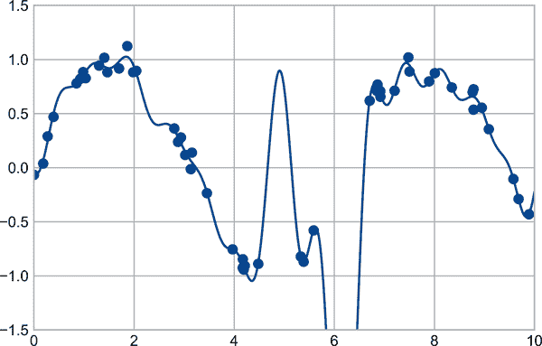
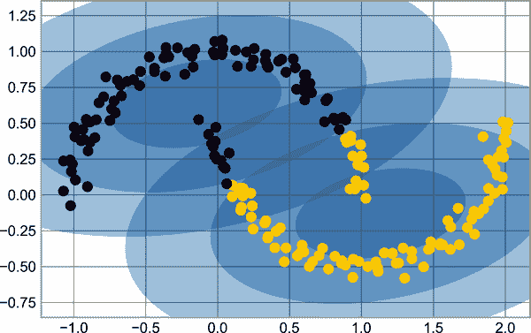

# 第二十五章：Matplotlib 一般提示

在我们深入研究使用 Matplotlib 创建可视化的详细信息之前，有几个有用的事情您应该了解如何使用这个包。

# 导入 Matplotlib

正如我们使用`np`简写代表 NumPy 和`pd`简写代表 Pandas 一样，我们将使用一些标准缩写来导入 Matplotlib：

```py
In [1]: import matplotlib as mpl
        import matplotlib.pyplot as plt
```

我们将最常用的是`plt`接口，您将在本书的这一部分中看到。

# 设置样式

我们将使用`plt.style`指令为我们的图形选择合适的美学样式。在这里，我们将设置`classic`样式，确保我们创建的图使用经典的 Matplotlib 样式：

```py
In [2]: plt.style.use('classic')
```

在本章中，我们将根据需要调整这种样式。有关样式表的更多信息，请参阅第三十四章。

# 显示还是不显示？如何显示您的图形

您看不到的可视化对您没有多大用处，但是您查看 Matplotlib 图形的方式取决于上下文。Matplotlib 的最佳用法因您如何使用它而异；大致上，适用的三种上下文是在脚本中使用 Matplotlib，在 IPython 终端中使用 Matplotlib 或在 Jupyter 笔记本中使用 Matplotlib。

## 从脚本绘图

如果您正在脚本中使用 Matplotlib，则函数`plt.show`是您的好帮手。`plt.show`启动一个事件循环，查找所有当前活动的`Figure`对象，并打开一个或多个交互窗口来显示您的图形或图形。

因此，例如，您可能有一个名为*myplot.py*的文件，其中包含以下内容：

```py
# file: myplot.py
import matplotlib.pyplot as plt
import numpy as np

x = np.linspace(0, 10, 100)

plt.plot(x, np.sin(x))
plt.plot(x, np.cos(x))

plt.show()
```

然后，您可以从命令行提示符运行此脚本，将导致一个窗口打开，并显示您的图形：

```py
$ python myplot.py

```

`plt.show`命令在幕后做了很多工作，因为它必须与系统的交互式图形后端进行交互。此操作的详细信息在不同的系统甚至不同的安装中可能会有很大的差异，但是 Matplotlib 会尽力隐藏所有这些细节。

有一件事需要注意：`plt.show`命令应该在每个 Python 会话中*仅使用一次*，并且最常见的情况是在脚本的最后。多个`show`命令可能会导致不可预测的基于后端的行为，并且应该尽量避免。

## 从 IPython Shell 绘图

Matplotlib 在 IPython shell 中也可以无缝运行（请参阅第 I 部分）。IPython 是构建用于与 Matplotlib 很好配合的，如果您指定 Matplotlib 模式。要启用此模式，可以在启动`ipython`后使用`%matplotlib`魔术命令：

```py
In [1]: %matplotlib
Using matplotlib backend: TkAgg

In [2]: import matplotlib.pyplot as plt
```

此时，任何`plt`绘图命令都将导致一个图形窗口打开，并且可以运行进一步的命令来更新绘图。某些更改（例如修改已经绘制的线的属性）不会自动绘制：要强制更新，请使用`plt.draw`。在 IPython 的 Matplotlib 模式中不需要使用`plt.show`。

## 从 Jupyter 笔记本绘图

Jupyter Notebook 是一个基于浏览器的交互式数据分析工具，可以将叙述、代码、图形、HTML 元素等多种内容组合到一个可执行文档中（参见第 I 部分）。

在 Jupyter Notebook 中进行交互式绘图可以通过 `%matplotlib` 命令完成，其工作方式类似于 IPython Shell。您还可以选择直接在笔记本中嵌入图形，有两种可能的选项：

+   `%matplotlib inline` 将导致您的图形以*静态*图像嵌入到笔记本中。

+   `%matplotlib notebook` 将导致交互式图形嵌入到笔记本中。

对于本书，通常会使用默认设置，图形渲染为静态图像（见图 25-1 以查看此基本绘图示例的结果）：

```py
In [3]: %matplotlib inline
```

```py
In [4]: import numpy as np
        x = np.linspace(0, 10, 100)

        fig = plt.figure()
        plt.plot(x, np.sin(x), '-')
        plt.plot(x, np.cos(x), '--');
```


###### 图 25-1\. 基本绘图示例

## 将图形保存到文件中

Matplotlib 的一个很好的特性是能够以多种格式保存图形。使用 `savefig` 命令可以保存图形。例如，要将前面的图形保存为 PNG 文件，可以运行以下命令：

```py
In [5]: fig.savefig('my_figure.png')
```

现在我们在当前工作目录中有一个名为*my_figure.png*的文件：

```py
In [6]: !ls -lh my_figure.png
Out[6]: -rw-r--r--  1 jakevdp  staff    26K Feb  1 06:15 my_figure.png
```

为了确认它包含我们认为包含的内容，让我们使用 IPython 的 `Image` 对象来显示此文件的内容（见图 25-2）。

```py
In [7]: from IPython.display import Image
        Image('my_figure.png')
```


###### 图 25-2\. 基本绘图的 PNG 渲染

在 `savefig` 中，文件格式根据给定文件名的扩展名推断。根据安装的后端程序，可以使用多种不同的文件格式。可以通过图形画布对象的以下方法找到系统支持的文件类型列表：

```py
In [8]: fig.canvas.get_supported_filetypes()
Out[8]: {'eps': 'Encapsulated Postscript',
         'jpg': 'Joint Photographic Experts Group',
         'jpeg': 'Joint Photographic Experts Group',
         'pdf': 'Portable Document Format',
         'pgf': 'PGF code for LaTeX',
         'png': 'Portable Network Graphics',
         'ps': 'Postscript',
         'raw': 'Raw RGBA bitmap',
         'rgba': 'Raw RGBA bitmap',
         'svg': 'Scalable Vector Graphics',
         'svgz': 'Scalable Vector Graphics',
         'tif': 'Tagged Image File Format',
         'tiff': 'Tagged Image File Format'}
```

请注意，在保存图形时，不需要使用 `plt.show` 或前面讨论过的相关命令。

## 两个界面的价格

Matplotlib 的一个可能令人困惑的特性是其双界面：一个方便的基于状态的 MATLAB 风格界面和一个更强大的面向对象界面。在这里，我将快速介绍这两者之间的区别。

### MATLAB 风格界面

Matplotlib 最初被构想为 MATLAB 用户的 Python 替代方案，其语法大部分反映了这一事实。MATLAB 风格的工具包含在 `pyplot` (`plt`) 接口中。例如，以下代码对 MATLAB 用户可能看起来非常熟悉（见图 25-3 显示的结果）。

```py
In [9]: plt.figure()  # create a plot figure

        # create the first of two panels and set current axis
        plt.subplot(2, 1, 1) # (rows, columns, panel number)
        plt.plot(x, np.sin(x))

        # create the second panel and set current axis
        plt.subplot(2, 1, 2)
        plt.plot(x, np.cos(x));
```



###### 图 25-3\. 使用 MATLAB 风格界面的子图

重要的是要认识到这种接口是*有状态的*：它跟踪“当前”图形和坐标轴，所有`plt`命令都应用于这些对象。您可以使用`plt.gcf`（获取当前图形）和`plt.gca`（获取当前坐标轴）来获取对这些对象的引用。

虽然这种状态接口在简单绘图时快捷方便，但也容易遇到问题。例如，一旦创建了第二个面板，如何返回并向第一个面板添加内容？这在 MATLAB 风格接口中是可能的，但有点笨拙。幸运的是，有更好的方法。

### 面向对象接口

对于这些更复杂的情况以及当您希望对图形有更多控制时，可以使用面向对象的接口。与依赖“活跃”图形或坐标轴的概念不同，在面向对象的接口中，绘图函数是显式`Figure`和`Axes`对象的*方法*。要使用这种绘图风格重新创建之前的图形，如在图 25-4 中所示，可以执行以下操作：

```py
In [10]: # First create a grid of plots
         # ax will be an array of two Axes objects
         fig, ax = plt.subplots(2)

         # Call plot() method on the appropriate object
         ax[0].plot(x, np.sin(x))
         ax[1].plot(x, np.cos(x));
```



###### 图 25-4\. 使用面向对象接口的子图

对于更简单的绘图，使用哪种风格主要是偏好问题，但随着绘图变得更加复杂，面向对象的方法可能变得必不可少。在接下来的章节中，我们将根据方便性在 MATLAB 风格和面向对象接口之间切换。在大多数情况下，区别仅在于将`plt.plot`切换为`ax.plot`，但在接下来的章节中遇到的一些陷阱我将会特别提出。
