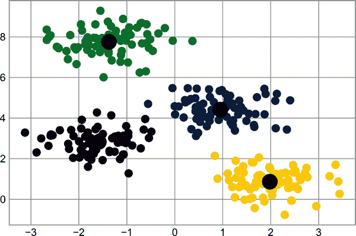
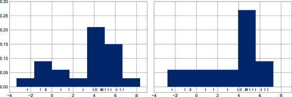
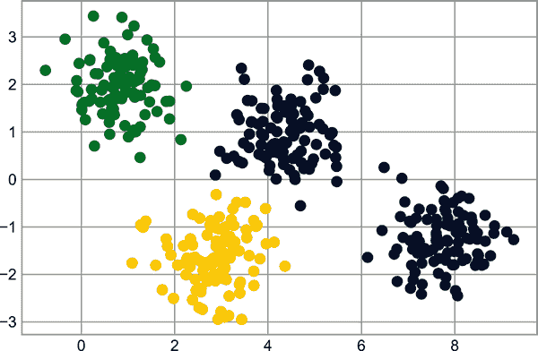
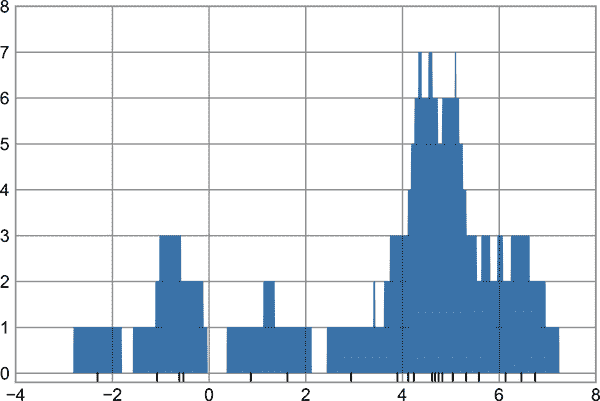
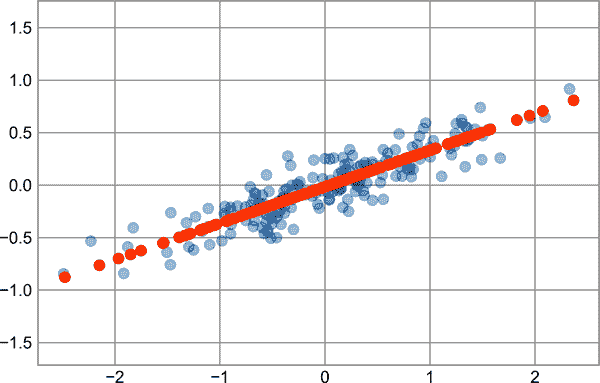
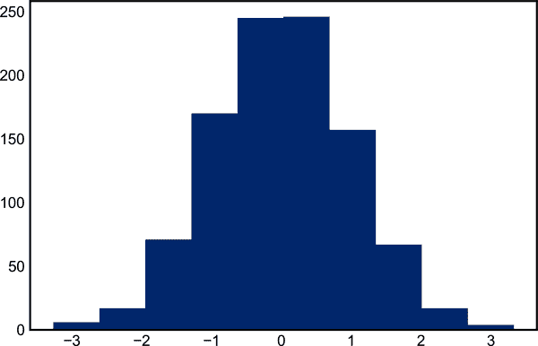
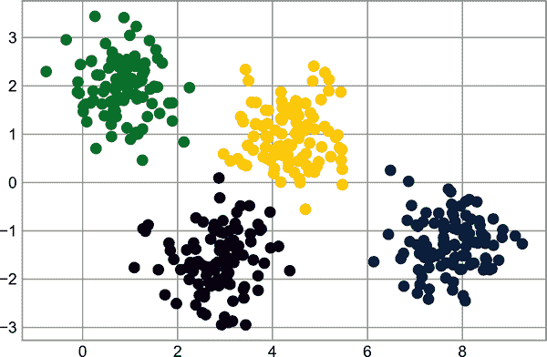
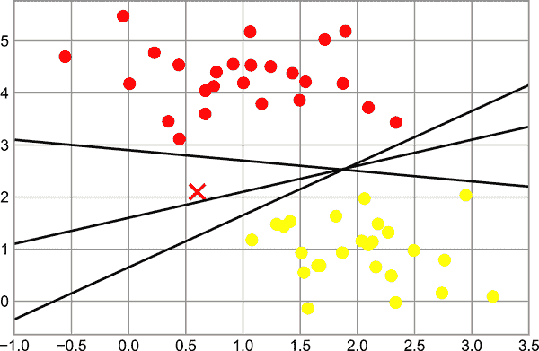
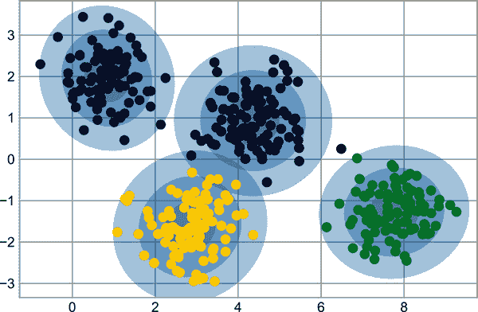

# 第二十八章：密度和等高线图

有时候，使用等高线或彩色区域来在二维中显示三维数据是很有用的。Matplotlib 提供了三个函数可以帮助完成这个任务：`plt.contour` 用于等高线图，`plt.contourf` 用于填充等高线图，`plt.imshow` 用于显示图像。本章将讨论几个使用这些函数的示例。我们将从设置绘图笔记本和导入我们将使用的函数开始：

```py
In [1]: %matplotlib inline
        import matplotlib.pyplot as plt
        plt.style.use('seaborn-white')
        import numpy as np
```

# 可视化三维函数

我们的第一个例子演示了使用函数 <math alttext="z equals f left-parenthesis x comma y right-parenthesis"><mrow><mi>z</mi> <mo>=</mo> <mi>f</mi> <mo>(</mo> <mi>x</mi> <mo>,</mo> <mi>y</mi> <mo>)</mo></mrow></math> 绘制等高线图，这里选择了特定的 <math alttext="f"><mi>f</mi></math>（我们在第八章中已经见过它，当时我们将其作为数组广播的示例）：

```py
In [2]: def f(x, y):
            return np.sin(x) ** 10 + np.cos(10 + y * x) * np.cos(x)
```

可以使用 `plt.contour` 函数创建等高线图。它接受三个参数：*x* 值的网格，*y* 值的网格和 *z* 值的网格。*x* 和 *y* 值表示图表上的位置，*z* 值将由等高线级别表示。准备这样的数据最直接的方法之一是使用 `np.meshgrid` 函数，它从一维数组构建二维网格：

```py
In [3]: x = np.linspace(0, 5, 50)
        y = np.linspace(0, 5, 40)

        X, Y = np.meshgrid(x, y)
        Z = f(X, Y)
```

现在让我们看看这个标准的仅线条等高线图（见图 28-1）。

```py
In [4]: plt.contour(X, Y, Z, colors='black');
```



###### 图 28-1\. 用等高线可视化三维数据

注意，当使用单一颜色时，负值用虚线表示，正值用实线表示。或者可以通过指定 `cmap` 参数来使用色图对线条进行颜色编码。在这里，我们还指定希望在数据范围内绘制更多线条，即 20 个等间距间隔，如图 28-2 所示。

```py
In [5]: plt.contour(X, Y, Z, 20, cmap='RdGy');
```



###### 图 28-2\. 用彩色等高线可视化三维数据

这里我们选择了 `RdGy`（缩写表示*红灰*）色图，这对于显示数据的正负变化（即围绕零的正负值）是一个不错的选择。Matplotlib 提供了多种色图可供选择，你可以通过在 IPython 中对 `plt.cm` 模块进行制表完成来轻松浏览：

```py
plt.cm.<TAB>
```

我们的图表看起来更漂亮了，但是线条之间的空白可能有些分散注意力。我们可以通过切换到使用 `plt.contourf` 函数创建填充等高线图来改变这一点，它与 `plt.contour` 的语法基本相同。

此外，我们将添加一个 `plt.colorbar` 命令，它会创建一个带有标记颜色信息的额外坐标轴用于图表（参见图 28-3）。

```py
In [6]: plt.contourf(X, Y, Z, 20, cmap='RdGy')
        plt.colorbar();
```



###### 图 28-3\. 用填充等高线可视化三维数据

颜色条清楚地表明黑色区域为“峰值”，而红色区域为“谷底”。

这种绘图的一个潜在问题是有点斑驳：颜色步骤是离散的，而不是连续的，这并不总是期望的效果。可以通过将等高线的数量设置为一个非常大的数字来解决此问题，但这将导致绘图效率较低：Matplotlib 必须为每个级别渲染一个新的多边形。生成平滑表示的更好方法是使用 `plt.imshow` 函数，它提供了 `interpolation` 参数，以生成数据的平滑二维表示（见图 28-4）。

```py
In [7]: plt.imshow(Z, extent=[0, 5, 0, 5], origin='lower', cmap='RdGy',
                   interpolation='gaussian', aspect='equal')
        plt.colorbar();
```



###### 图 28-4\. 将三维数据表示为图像

使用 `plt.imshow` 有一些潜在的小问题：

+   它不接受 *x* 和 *y* 网格，因此您必须手动指定图中图像的 *extent* [*xmin*, *xmax*, *ymin*, *ymax*]。

+   默认情况下，它遵循标准图像数组定义，其中原点在左上角，而不是大多数等高线图中的左下角。在显示网格化数据时必须更改此设置。

+   它会自动调整轴的纵横比以匹配输入数据；可以使用 `aspect` 参数进行更改。

最后，有时将等高线图和图像图结合起来可能会很有用。例如，在这里我们将使用部分透明的背景图像（透明度通过 `alpha` 参数设置），并在等高线上标记标签，使用 `plt.clabel` 函数（见图 28-5）。

```py
In [8]: contours = plt.contour(X, Y, Z, 3, colors='black')
        plt.clabel(contours, inline=True, fontsize=8)

        plt.imshow(Z, extent=[0, 5, 0, 5], origin='lower',
                   cmap='RdGy', alpha=0.5)
        plt.colorbar();
```



###### 图 28-5\. 图像上标记的等高线

这三个函数的组合——`plt.contour`、`plt.contourf` 和 `plt.imshow`——在二维图中展示三维数据具有几乎无限的可能性。关于这些函数可用选项的更多信息，请参阅它们的文档字符串。如果您对这类数据的三维可视化感兴趣，请参阅第三十五章。

# 直方图、分箱和密度

简单直方图可以是理解数据集的一个很好的第一步。此前，我们看到了 Matplotlib 的直方图函数预览（见第九章），它一旦完成了常规的引入工作（见图 28-6）就能以一行代码创建一个基本的直方图。

```py
In [1]: %matplotlib inline
        import numpy as np
        import matplotlib.pyplot as plt
        plt.style.use('seaborn-white')

        rng = np.random.default_rng(1701)
        data = rng.normal(size=1000)
```

```py
In [2]: plt.hist(data);
```



###### 图 28-6\. 简单直方图

`hist` 函数有许多选项可以调整计算和显示；这里有一个更加定制化的直方图示例，显示在 Figure 28-7 中。

```py
In [3]: plt.hist(data, bins=30, density=True, alpha=0.5,
                 histtype='stepfilled', color='steelblue',
                 edgecolor='none');
```



###### 图 28-7\. 一个定制化的直方图

`plt.hist` 的文档字符串中包含更多有关其他可用定制选项的信息。当比较几个分布的直方图时，我发现使用`histtype='stepfilled'`与一些透明度 `alpha` 的组合是很有帮助的（参见 Figure 28-8）。

```py
In [4]: x1 = rng.normal(0, 0.8, 1000)
        x2 = rng.normal(-2, 1, 1000)
        x3 = rng.normal(3, 2, 1000)

        kwargs = dict(histtype='stepfilled', alpha=0.3, density=True, bins=40)

        plt.hist(x1, **kwargs)
        plt.hist(x2, **kwargs)
        plt.hist(x3, **kwargs);
```



###### 图 28-8\. 叠加多个直方图¹

如果您只对计算而不是显示直方图（即计算给定箱中点的数量）感兴趣，可以使用 `np.histogram` 函数：

```py
In [5]: counts, bin_edges = np.histogram(data, bins=5)
        print(counts)
Out[5]: [ 23 241 491 224  21]
```

# 二维直方图和分箱

就像我们通过将数轴划分为箱来创建一维直方图一样，我们也可以通过将点分配到二维箱中来创建二维直方图。我们将简要地查看几种方法来做到这一点。让我们首先定义一些数据——从多元高斯分布中抽取的 `x` 和 `y` 数组：

```py
In [6]: mean = [0, 0]
        cov = [[1, 1], [1, 2]]
        x, y = rng.multivariate_normal(mean, cov, 10000).T
```

## plt.hist2d：二维直方图

绘制二维直方图的一个简单方法是使用 Matplotlib 的 `plt.hist2d` 函数（见 Figure 28-9）。

```py
In [7]: plt.hist2d(x, y, bins=30)
        cb = plt.colorbar()
        cb.set_label('counts in bin')
```


###### 图 28-9\. 使用 plt.hist2d 绘制的二维直方图

就像 `plt.hist` 一样，`plt.hist2d` 也有许多额外选项可以微调绘图和分箱，这些选项在函数的文档字符串中有详细说明。此外，就像 `plt.hist` 在 `np.histogram` 中有对应物一样，`plt.hist2d` 在 `np.histogram2d` 中也有对应物：

```py
In [8]: counts, xedges, yedges = np.histogram2d(x, y, bins=30)
        print(counts.shape)
Out[8]: (30, 30)
```

对于当有超过两个维度时的直方图分箱的泛化，参见 `np.histogramdd` 函数。

## plt.hexbin：六边形分箱

二维直方图在轴上创建了一个方块的镶嵌图案。这种镶嵌的另一个自然形状是正六边形。为此，Matplotlib 提供了 `plt.hexbin` 程序，它表示在六边形网格内对二维数据集进行分箱（见 Figure 28-10）。

```py
In [9]: plt.hexbin(x, y, gridsize=30)
        cb = plt.colorbar(label='count in bin')
```


###### 图 28-10\. 使用 plt.hexbin 绘制的二维直方图

`plt.hexbin` 还有许多额外选项，包括指定每个点的权重和更改每个箱中输出到任何 NumPy 聚合（权重的平均值、权重的标准差等）。

## 核密度估计

在多维度中估计和表示密度的另一种常见方法是 *核密度估计*（KDE）。这将在 第四十九章 中更详细地讨论，但现在我只想简单提一下，KDE 可以被看作是一种在空间中“扩展”点并将结果加总以获得平滑函数的方法。`scipy.stats` 包中存在一种极快且简单的 KDE 实现。这里是使用 KDE 的一个快速示例（参见 图 28-11）。

```py
In [10]: from scipy.stats import gaussian_kde

         # fit an array of size [Ndim, Nsamples]
         data = np.vstack([x, y])
         kde = gaussian_kde(data)

         # evaluate on a regular grid
         xgrid = np.linspace(-3.5, 3.5, 40)
         ygrid = np.linspace(-6, 6, 40)
         Xgrid, Ygrid = np.meshgrid(xgrid, ygrid)
         Z = kde.evaluate(np.vstack([Xgrid.ravel(), Ygrid.ravel()]))

         # Plot the result as an image
         plt.imshow(Z.reshape(Xgrid.shape),
                    origin='lower', aspect='auto',
                    extent=[-3.5, 3.5, -6, 6])
         cb = plt.colorbar()
         cb.set_label("density")
```



###### 图 28-11\. 一个分布的核密度表示

KDE 具有一个有效的平滑长度，可以有效地在详细度和平滑度之间调节（这是普遍的偏差-方差权衡的一个例子）。选择适当的平滑长度的文献非常广泛；`gaussian_kde` 使用一个经验法则来尝试找到输入数据的几乎最优平滑长度。

SciPy 生态系统中还提供了其他 KDE 实现，每种实现都有其各自的优缺点；例如，可以看到 `sklearn.neighbors.KernelDensity` 和 `statsmodels.nonparametric.KDEMultivariate`。

对于基于 KDE 的可视化，使用 Matplotlib 往往显得冗长。Seaborn 库在 第三十六章 中讨论，为创建基于 KDE 的可视化提供了更紧凑的 API。

¹ 这个图的全彩版可以在 [GitHub](https://oreil.ly/PDSH_GitHub) 上找到。
