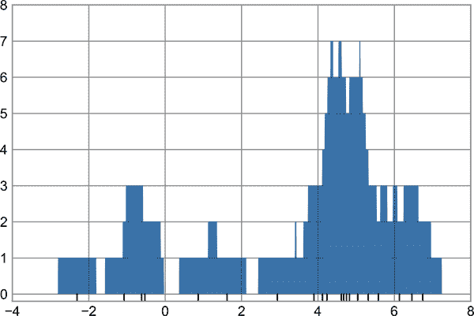

# 第二十九章：自定义绘图图例

绘图图例赋予可视化含义，为各种绘图元素分配含义。我们之前看过如何创建简单的图例；现在我们将看看如何在 Matplotlib 中自定义图例的位置和美观性。

最简单的图例可以通过`plt.legend`命令创建，该命令会自动为任何有标签的绘图元素创建图例（参见图 29-1）。

```py
In [1]: import matplotlib.pyplot as plt
        plt.style.use('seaborn-whitegrid')
```

```py
In [2]: %matplotlib inline
        import numpy as np
```

```py
In [3]: x = np.linspace(0, 10, 1000)
        fig, ax = plt.subplots()
        ax.plot(x, np.sin(x), '-b', label='Sine')
        ax.plot(x, np.cos(x), '--r', label='Cosine')
        ax.axis('equal')
        leg = ax.legend()
```


###### 图 29-1\. 默认绘图图例

但我们可能希望以许多方式自定义这样一个图例。例如，我们可以指定位置并打开边框（参见图 29-2）。

```py
In [4]: ax.legend(loc='upper left', frameon=True)
        fig
```


###### 图 29-2\. 自定义绘图图例

我们可以使用`ncol`命令来指定图例中的列数，如图 29-3 所示。

```py
In [5]: ax.legend(loc='lower center', ncol=2)
        fig
```


###### 图 29-3\. 一个两列图例

我们还可以使用圆角框（`fancybox`）或添加阴影，更改框架的透明度（alpha 值）或更改文本周围的填充（参见图 29-4）。

```py
In [6]: ax.legend(frameon=True, fancybox=True, framealpha=1,
                  shadow=True, borderpad=1)
        fig
```

有关可用图例选项的更多信息，请参阅`plt.legend`的文档字符串。


###### 图 29-4\. 一个带有 fancybox 样式的图例

# 选择图例元素

正如我们已经看到的，默认情况下，图例包括来自绘图的所有带标签的元素。如果这不是所需的，我们可以通过使用`plot`命令返回的对象来微调图例中显示的元素和标签。`plt.plot`能够一次创建多条线，并返回创建的线实例列表。将其中任何一条传递给`plt.legend`将告诉它要识别哪些元素，以及我们想指定的标签（参见图 29-5）。

```py
In [7]: y = np.sin(x[:, np.newaxis] + np.pi * np.arange(0, 2, 0.5))
        lines = plt.plot(x, y)

        # lines is a list of plt.Line2D instances
        plt.legend(lines[:2], ['first', 'second'], frameon=True);
```


###### 图 29-5\. 图例元素的自定义¹

在实践中，我通常发现使用第一种方法更为清晰，即对你想在图例中显示的绘图元素应用标签（参见图 29-6）。

```py
In [8]: plt.plot(x, y[:, 0], label='first')
        plt.plot(x, y[:, 1], label='second')
        plt.plot(x, y[:, 2:])
        plt.legend(frameon=True);
```

请注意，图例会忽略所有未设置`label`属性的元素。



###### 图 29-6\. 自定义图例元素的另一种方法²

# 点的尺寸图例

有时默认的图例设置不足以满足给定的可视化需求。例如，也许您正在使用点的大小来标记数据的某些特征，并且希望创建反映这一点的图例。这里有一个示例，我们将使用点的大小来指示加利福尼亚城市的人口。我们希望一个指定点大小比例的图例，并通过绘制一些带标签的数据项而实现这一目标（参见图 29-7）。

```py
In [9]: # Uncomment to download the data
        # url = ('https://raw.githubusercontent.com/jakevdp/
        #        PythonDataScienceHandbook/''master/notebooks/data/
        #        california_cities.csv')
        # !cd data && curl -O {url}
```

```py
In [10]: import pandas as pd
         cities = pd.read_csv('data/california_cities.csv')

         # Extract the data we're interested in
         lat, lon = cities['latd'], cities['longd']
         population, area = cities['population_total'], cities['area_total_km2']

         # Scatter the points, using size and color but no label
         plt.scatter(lon, lat, label=None,
                     c=np.log10(population), cmap='viridis',
                     s=area, linewidth=0, alpha=0.5)
         plt.axis('equal')
         plt.xlabel('longitude')
         plt.ylabel('latitude')
         plt.colorbar(label='log$_{10}$(population)')
         plt.clim(3, 7)

         # Here we create a legend:
         # we'll plot empty lists with the desired size and label
         for area in [100, 300, 500]:
             plt.scatter([], [], c='k', alpha=0.3, s=area,
                         label=str(area) + ' km$²$')
         plt.legend(scatterpoints=1, frameon=False, labelspacing=1,
                    title='City Area')

         plt.title('California Cities: Area and Population');
```


###### 图 29-7\. 加利福尼亚城市的位置、地理大小和人口

图例始终引用绘图上的某个对象，因此如果我们想显示特定的形状，我们需要绘制它。在这种情况下，我们想要的对象（灰色圆圈）不在绘图上，因此我们通过绘制空列表来伪造它们。请记住，图例仅列出具有指定标签的绘图元素。

通过绘制空列表，我们创建了带标签的绘图对象，这些对象被图例捕捉，现在我们的图例告诉我们一些有用的信息。这种策略对于创建更复杂的可视化效果很有用。

# 多个图例

有时在设计绘图时，您可能希望向同一坐标轴添加多个图例。不幸的是，Matplotlib 并不简化这一过程：通过标准的`legend`接口，仅能为整个绘图创建一个图例。如果尝试使用`plt.legend`或`ax.legend`创建第二个图例，它将简单地覆盖第一个。我们可以通过从头开始创建新的图例艺术家（`Artist`是 Matplotlib 用于视觉属性的基类），然后使用较低级别的`ax.add_artist`方法手动将第二个艺术家添加到绘图中来解决此问题（参见图 29-8）。

```py
In [11]: fig, ax = plt.subplots()

         lines = []
         styles = ['-', '--', '-.', ':']
         x = np.linspace(0, 10, 1000)

         for i in range(4):
             lines += ax.plot(x, np.sin(x - i * np.pi / 2),
                              styles[i], color='black')
         ax.axis('equal')

         # Specify the lines and labels of the first legend
         ax.legend(lines[:2], ['line A', 'line B'], loc='upper right')

         # Create the second legend and add the artist manually
         from matplotlib.legend import Legend
         leg = Legend(ax, lines[2:], ['line C', 'line D'], loc='lower right')
         ax.add_artist(leg);
```

这是查看组成任何 Matplotlib 绘图的低级艺术家对象的一瞥。如果您检查`ax.legend`的源代码（请记住，您可以在 Jupyter 笔记本中使用`ax.legend??`来执行此操作），您将看到该函数仅仅由一些逻辑组成，用于创建一个适当的`Legend`艺术家，然后将其保存在`legend_`属性中，并在绘制绘图时将其添加到图形中。


###### 图 29-8\. 分割图例

¹ 该图的全彩版本可以在[GitHub](https://oreil.ly/PDSH_GitHub)上找到。

² 该图的全彩版本可以在[GitHub](https://oreil.ly/PDSH_GitHub)上找到。
