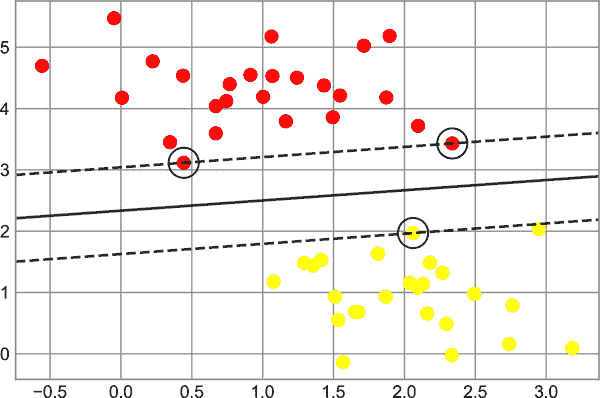
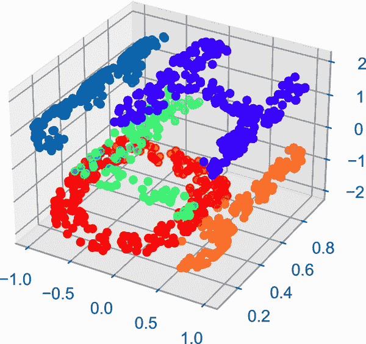

# 第三十章：定制色条

绘图图例识别离散点的离散标签。对于基于点、线或区域颜色的连续标签，带标签的色条是一个很好的工具。在 Matplotlib 中，色条被绘制为一个独立的轴，可以为绘图中颜色的含义提供关键。由于本书以黑白印刷，本章配有一个[在线补充](https://oreil.ly/PDSH_GitHub)，您可以在其中查看全彩色的图表。我们将从设置用于绘图的笔记本和导入我们将使用的函数开始：

```py
In [1]: import matplotlib.pyplot as plt
        plt.style.use('seaborn-white')
```

```py
In [2]: %matplotlib inline
        import numpy as np
```

正如我们已经看到的几次，最简单的色条可以使用`plt.colorbar`函数创建（参见图 30-1）。

```py
In [3]: x = np.linspace(0, 10, 1000)
        I = np.sin(x) * np.cos(x[:, np.newaxis])

        plt.imshow(I)
        plt.colorbar();
```

###### 注意

全彩色图可以在[GitHub 上的补充材料](https://oreil.ly/PDSH_GitHub)中找到。

现在我们将讨论几个关于定制这些色条并在各种情况下有效使用它们的想法。


###### 图 30-1\. 一个简单的色条图例

# 自定义色条

可以使用`cmap`参数来指定色图，该参数用于创建可视化的绘图函数（参见图 30-2）。

```py
In [4]: plt.imshow(I, cmap='Blues');
```


###### 图 30-2\. 一个蓝色调色板

可用色图的名称在`plt.cm`命名空间中；使用 IPython 的制表完成功能将为您提供内置可能性的完整列表：

```py
plt.cm.<TAB>
```

但是*能够*选择色图只是第一步：更重要的是如何*决定*选择哪种！选择实际上比您最初期望的要微妙得多。

## 选择色图

在可视化中选择颜色的全面处理超出了本书的范围，但是对于这个主题和其他主题的有趣阅读，请参阅 Nicholas Rougier、Michael Droettboom 和 Philip Bourne 的文章[“Ten Simple Rules for Better Figures”](https://oreil.ly/g4GLV)。Matplotlib 的在线文档还有一个有趣的关于色图选择的讨论（https://oreil.ly/Ll1ir）。

总体而言，您应该了解三种不同类型的色图：

*连续色图*

这些由一系列连续的颜色组成（例如，`binary`或`viridis`）。

*发散色图*

这些通常包含两种不同的颜色，显示与平均值的正负偏差（例如，`RdBu`或`PuOr`）。

*   *定性色图*

这些颜色混合没有特定的顺序（例如，`rainbow`或`jet`）。

`jet`色图是 Matplotlib 在 2.0 版本之前的默认色图的一个示例。它作为默认的状态非常不幸，因为定性色图通常不适合表示定量数据。其中一个问题是，定性色图通常不显示随着比例增加而亮度均匀递增的特性。

通过将 `jet` 色彩条转换为黑白图像，我们可以看到这一点（见 图 30-3）。

```py
In [5]: from matplotlib.colors import LinearSegmentedColormap

        def grayscale_cmap(cmap):
            """Return a grayscale version of the given colormap"""
            cmap = plt.cm.get_cmap(cmap)
            colors = cmap(np.arange(cmap.N))

            # Convert RGBA to perceived grayscale luminance
            # cf. http://alienryderflex.com/hsp.xhtml
            RGB_weight = [0.299, 0.587, 0.114]
            luminance = np.sqrt(np.dot(colors[:, :3] ** 2, RGB_weight))
            colors[:, :3] = luminance[:, np.newaxis]

            return LinearSegmentedColormap.from_list(
                cmap.name + "_gray", colors, cmap.N)

        def view_colormap(cmap):
            """Plot a colormap with its grayscale equivalent"""
            cmap = plt.cm.get_cmap(cmap)
            colors = cmap(np.arange(cmap.N))

            cmap = grayscale_cmap(cmap)
            grayscale = cmap(np.arange(cmap.N))

            fig, ax = plt.subplots(2, figsize=(6, 2),
                                   subplot_kw=dict(xticks=[], yticks=[]))
            ax[0].imshow([colors], extent=[0, 10, 0, 1])
            ax[1].imshow([grayscale], extent=[0, 10, 0, 1])
```

```py
In [6]: view_colormap('jet')
```


###### 图 30-3\. `jet` 色彩映射及其不均匀的亮度比例

注意灰度图像中的明亮条纹。即使是全彩色，这种不均匀的亮度也意味着眼睛会被色彩范围的某些部分所吸引，这可能会强调数据集中不重要的部分。最好使用像`viridis`（Matplotlib 2.0 的默认色彩映射）这样的色彩映射，它专门设计成在整个范围内具有均匀的亮度变化；因此，它不仅与我们的色彩感知相配，而且在灰度打印时也能很好地转化（参见 图 30-4）。

```py
In [7]: view_colormap('viridis')
```


###### 图 30-4\. `viridis` 色彩映射及其均匀的亮度比例

对于其他情况，如显示与某个均值的正负偏差，双色彩色条如`RdBu`（红-蓝）很有帮助。但是，正如您在 图 30-5 中所看到的，重要的是注意正/负信息在转换为灰度时会丢失！

```py
In [8]: view_colormap('RdBu')
```



###### 图 30-5\. `RdBu` 色彩映射及其亮度

在接下来的示例中，我们将看到如何使用其中一些色彩映射。

Matplotlib 提供了大量的色彩映射选项；要查看它们的列表，可以使用 IPython 来探索 `plt.cm` 子模块。对于 Python 中更加原则性的颜色处理方法，可以参考 Seaborn 库中的工具和文档（见 第 36 章）。

## 色彩限制和扩展

Matplotlib 允许大范围的颜色条定制。颜色条本身只是 `plt.Axes` 的一个实例，因此我们之前看到的所有坐标轴和刻度格式化技巧都适用。颜色条具有一些有趣的灵活性：例如，我们可以缩小颜色限制，并通过设置 `extend` 属性在顶部和底部指示超出范围的值以三角箭头表示。例如，在显示受噪声影响的图像时（见 图 30-6），这可能会很有用。

```py
In [9]: # make noise in 1% of the image pixels
        speckles = (np.random.random(I.shape) < 0.01)
        I[speckles] = np.random.normal(0, 3, np.count_nonzero(speckles))

        plt.figure(figsize=(10, 3.5))

        plt.subplot(1, 2, 1)
        plt.imshow(I, cmap='RdBu')
        plt.colorbar()

        plt.subplot(1, 2, 2)
        plt.imshow(I, cmap='RdBu')
        plt.colorbar(extend='both')
        plt.clim(-1, 1)
```


###### 图 30-6\. 指定色彩映射扩展¹

注意左侧面板中，默认的颜色限制对噪声像素做出了响应，并且噪声范围完全淹没了我们感兴趣的模式。在右侧面板中，我们手动设置了颜色限制，并添加了扩展以指示超出这些限制的值。结果是我们数据的可视化更加有用。

## 离散色彩条

色图默认是连续的，但有时您想要表示离散值。这样做的最简单方法是使用`plt.cm.get_cmap`函数，传递一个合适的色图名称和所需的箱数（见图 30-7）。

```py
In [10]: plt.imshow(I, cmap=plt.cm.get_cmap('Blues', 6))
         plt.colorbar(extend='both')
         plt.clim(-1, 1);
```


###### 图 30-7\. 一个离散的色图

色图的离散版本可以像任何其他色图一样使用。

# 例子：手写数字

这可以应用的一个例子是，让我们看一看 Scikit-Learn 中包含的手写数字数据集的一个有趣的可视化；它包括近 2000 个<math alttext="8 times 8"><mrow><mn>8</mn> <mo>×</mo> <mn>8</mn></mrow></math>缩略图，显示各种手写数字。

现在，让我们从下载手写数字数据集和用`plt.imshow`可视化几个示例图像开始（见图 30-8）。

```py
In [11]: # load images of the digits 0 through 5 and visualize several of them
         from sklearn.datasets import load_digits
         digits = load_digits(n_class=6)

         fig, ax = plt.subplots(8, 8, figsize=(6, 6))
         for i, axi in enumerate(ax.flat):
             axi.imshow(digits.images[i], cmap='binary')
             axi.set(xticks=[], yticks=[])
```


###### 图 30-8\. 手写数字数据的样本

因为每个数字由其 64 个像素的色调定义，我们可以将每个数字视为位于 64 维空间中的一个点：每个维度表示一个像素的亮度。可视化这样高维数据可能会很困难，但处理这个任务的一种方法是使用流形学习等*降维*技术来减少数据的维度，同时保持感兴趣的关系。降维是无监督机器学习的一个例子，我们将在第三十七章中更详细地讨论它。

推迟讨论这些细节，让我们来看一看手写数字数据的二维流形学习投影（详情见第四十六章）：

```py
In [12]: # project the digits into 2 dimensions using Isomap
         from sklearn.manifold import Isomap
         iso = Isomap(n_components=2, n_neighbors=15)
         projection = iso.fit_transform(digits.data)
```

我们将使用我们的离散色图来查看结果，设置`ticks`和`clim`以改善结果色条的美观度（见图 30-9）。

```py
In [13]: # plot the results
         plt.scatter(projection[:, 0], projection[:, 1], lw=0.1,
                     c=digits.target, cmap=plt.cm.get_cmap('plasma', 6))
         plt.colorbar(ticks=range(6), label='digit value')
         plt.clim(-0.5, 5.5)
```



###### 图 30-9\. 手写数字像素的流形嵌入

投影还向我们展示了数据集内部的一些关系：例如，在这个投影中，2 和 3 的范围几乎重叠，表明一些手写的 2 和 3 很难区分，可能更容易被自动分类算法混淆。而像 0 和 1 这样的值则分开得更远，可能更不容易混淆。

我们将在第五部分回到流形学习和数字分类。

¹ 本图的完整版本可以在[GitHub](https://oreil.ly/PDSH_GitHub)上找到。
