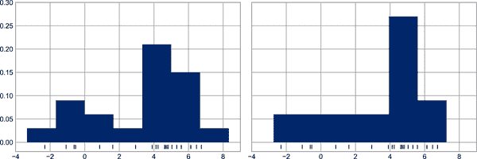

# 第三十一章：多个子图

有时将数据的不同视图并排比较会很有帮助。为此，Matplotlib 有*子图*的概念：一组可以在单个图中存在的较小轴。这些子图可以是插图、网格图或其他更复杂的布局。在本章中，我们将探讨创建 Matplotlib 中子图的四种常规方法。我们将首先导入要使用的包：

```py
In [1]: %matplotlib inline
        import matplotlib.pyplot as plt
        plt.style.use('seaborn-white')
        import numpy as np
```

# plt.axes：手动创建子图

创建轴的最基本方法是使用`plt.axes`函数。正如我们之前看到的，默认情况下，这将创建一个填充整个图的标准轴对象。`plt.axes`还接受一个可选参数，即在图坐标系中的四个数字列表（`[*left*, *bottom*, *width*, *height*]`），它们的取值范围从图的左下角的 0 到右上角的 1。

例如，我们可以通过将*x*和*y*位置设置为 0.65（即从图的宽度和高度的 65%开始）并将*x*和*y*范围设置为 0.2（即轴的大小为图宽度和高度的 20%）在另一个轴的右上角创建一个插图轴。图 31-1 显示了结果：

```py
In [2]: ax1 = plt.axes()  # standard axes
        ax2 = plt.axes([0.65, 0.65, 0.2, 0.2])
```


###### 图 31-1\. 插图轴示例

在面向对象接口中，该命令的等效命令是`fig.add_axes`。让我们使用它来创建两个垂直堆叠的轴，如图 31-2 所示。

```py
In [3]: fig = plt.figure()
        ax1 = fig.add_axes([0.1, 0.5, 0.8, 0.4],
                           xticklabels=[], ylim=(-1.2, 1.2))
        ax2 = fig.add_axes([0.1, 0.1, 0.8, 0.4],
                           ylim=(-1.2, 1.2))

        x = np.linspace(0, 10)
        ax1.plot(np.sin(x))
        ax2.plot(np.cos(x));
```

现在我们有两个轴（顶部没有刻度标签），它们紧挨着：上面板的底部（在位置 0.5 处）与下面板的顶部（在位置 0.1 + 0.4 处）相匹配。


###### 图 31-2\. 垂直堆叠轴示例

# plt.subplot：简单的子图网格

对齐的列或行子图是一个常见的需求，Matplotlib 提供了几个便利函数来轻松创建它们。其中最低级别的是`plt.subplot`，它在网格中创建一个单个子图。正如您所见，这个命令需要三个整数参数——行数、列数以及在此方案中要创建的图的索引，该索引从左上角到右下角依次排列（见图 31-3）。

```py
In [4]: for i in range(1, 7):
            plt.subplot(2, 3, i)
            plt.text(0.5, 0.5, str((2, 3, i)),
                     fontsize=18, ha='center')
```


###### 图 31-3\. plt.subplot 示例

命令`plt.subplots_adjust`可用于调整这些图之间的间距。以下代码使用了等效的面向对象的命令`fig.add_subplot`；图 31-4 显示了结果：

```py
In [5]: fig = plt.figure()
        fig.subplots_adjust(hspace=0.4, wspace=0.4)
        for i in range(1, 7):
            ax = fig.add_subplot(2, 3, i)
            ax.text(0.5, 0.5, str((2, 3, i)),
                   fontsize=18, ha='center')
```

在这里，我们使用了`plt.subplots_adjust`的`hspace`和`wspace`参数，它们分别指定了图的高度和宽度上的间距，单位为子图大小的百分比（在本例中，空间为子图宽度和高度的 40%）。



###### 图 31-4\. 调整边距的 plt.subplot

# plt.subplots：一次性创建整个网格

当创建大量子图网格时，特别是如果您希望隐藏内部图的 x 和 y 轴标签时，刚刚描述的方法很快变得繁琐。为此，`plt.subplots` 是更易于使用的工具（注意 `subplots` 末尾的 `s`）。该函数不是创建单个子图，而是一行内创建完整的子图网格，返回它们的 NumPy 数组。参数是行数和列数，以及可选的关键字 `sharex` 和 `sharey`，允许您指定不同轴之间的关系。

让我们创建一个 <math alttext="2 times 3"><mrow><mn>2</mn> <mo>×</mo> <mn>3</mn></mrow></math> 的子图网格，同一行内的所有轴共享其 y 轴比例，同一列内的所有轴共享其 x 轴比例（参见 图 31-5）。

```py
In [6]: fig, ax = plt.subplots(2, 3, sharex='col', sharey='row')
```


###### 图 31-5\. plt.subplots 中的共享 x 和 y 轴

通过指定 `sharex` 和 `sharey`，我们自动删除了网格内部的标签，使得绘图更清晰。生成的轴实例网格返回为 NumPy 数组，可以使用标准数组索引符号方便地指定所需的轴（参见 图 31-6）。

```py
In [7]: # axes are in a two-dimensional array, indexed by [row, col]
        for i in range(2):
            for j in range(3):
                ax[i, j].text(0.5, 0.5, str((i, j)),
                              fontsize=18, ha='center')
        fig
```

相较于 `plt.subplot`，`plt.subplots` 更符合 Python 的传统零起始索引，而 `plt.subplot` 使用 MATLAB 风格的一起始索引。


###### 图 31-6\. 在子图网格中标识绘图

# plt.GridSpec：更复杂的排列

要超越常规网格，创建跨越多行和列的子图，`plt.GridSpec` 是最佳工具。 `plt.GridSpec` 本身不创建图形；它是一个方便的接口，被 `plt.subplot` 命令识别。例如，一个具有两行三列、指定宽度和高度空间的 `GridSpec` 如下所示：

```py
In [8]: grid = plt.GridSpec(2, 3, wspace=0.4, hspace=0.3)
```

通过这种方式，我们可以使用熟悉的 Python 切片语法指定子图的位置和范围（参见 图 31-7）。

```py
In [9]: plt.subplot(grid[0, 0])
        plt.subplot(grid[0, 1:])
        plt.subplot(grid[1, :2])
        plt.subplot(grid[1, 2]);
```


###### 图 31-7\. 使用 `plt.GridSpec` 创建不规则子图

这种灵活的网格对齐方式有广泛的用途。我最常在创建像 图 31-8 中显示的多轴直方图图时使用它。

```py
In [10]: # Create some normally distributed data
         mean = [0, 0]
         cov = [[1, 1], [1, 2]]
         rng = np.random.default_rng(1701)
         x, y = rng.multivariate_normal(mean, cov, 3000).T

         # Set up the axes with GridSpec
         fig = plt.figure(figsize=(6, 6))
         grid = plt.GridSpec(4, 4, hspace=0.2, wspace=0.2)
         main_ax = fig.add_subplot(grid[:-1, 1:])
         y_hist = fig.add_subplot(grid[:-1, 0], xticklabels=[], sharey=main_ax)
         x_hist = fig.add_subplot(grid[-1, 1:], yticklabels=[], sharex=main_ax)

         # Scatter points on the main axes
         main_ax.plot(x, y, 'ok', markersize=3, alpha=0.2)

         # Histogram on the attached axes
         x_hist.hist(x, 40, histtype='stepfilled',
                     orientation='vertical', color='gray')
         x_hist.invert_yaxis()

         y_hist.hist(y, 40, histtype='stepfilled',
                     orientation='horizontal', color='gray')
         y_hist.invert_xaxis()
```


###### 图 31-8\. 使用 `plt.GridSpec` 可视化多维分布

这种分布类型以及其边距经常出现，Seaborn 包中有自己的绘图 API；详见 第 36 章。
